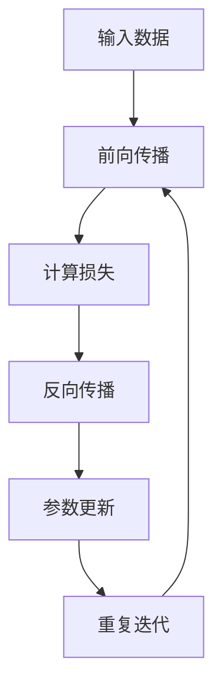
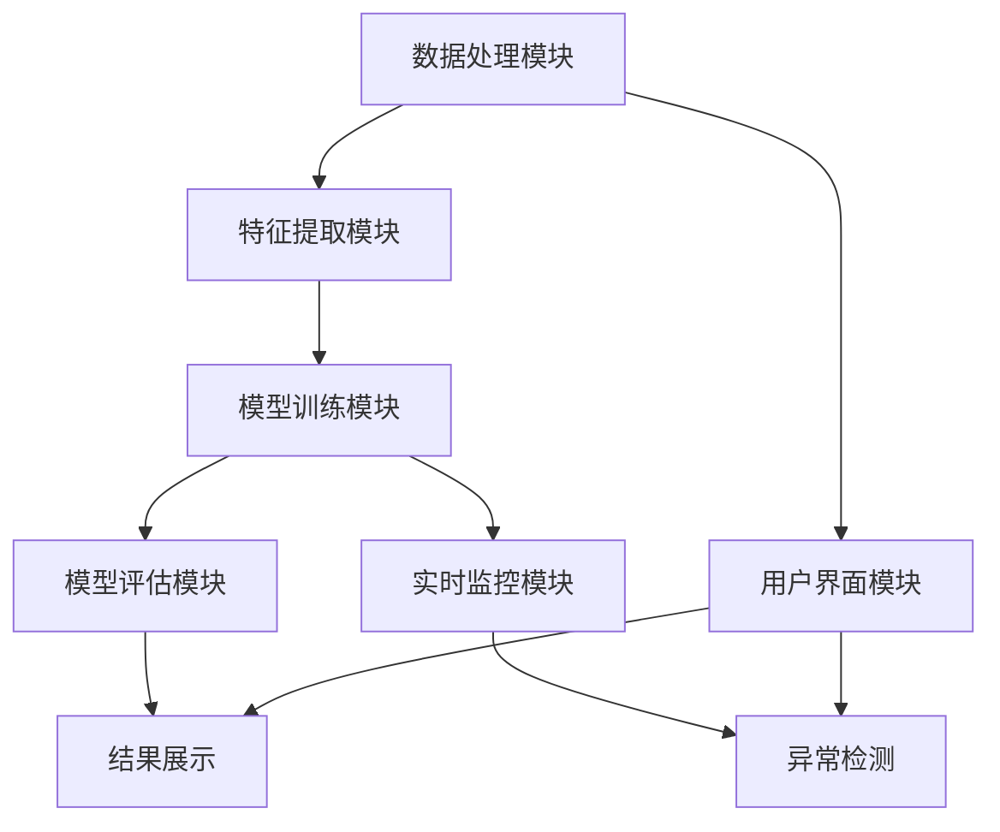
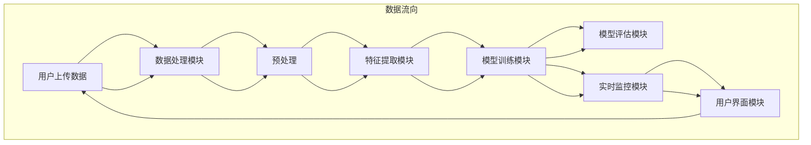

                 

### 第1章：可微分算法与计算机视觉概述

#### 1.1.1 可微分算法的概念与历史背景

可微分算法，顾名思义，是指那些可以被微分的算法。具体来说，这是指那些在其输入变量上，输出结果对输入变量的变化具有连续可微性的算法。这种算法的特点是，其梯度（即导数）在整个操作过程中都可以被计算，这使得优化问题可以通过梯度下降等方法高效求解。可微分算法最早可以追溯到微分方程的求解，但由于计算资源的限制，其在计算机领域的应用一度受限。

随着计算机科学和人工智能的迅猛发展，特别是在深度学习领域，可微分算法的重要性日益凸显。1986年，Rumelhart、Hinton和Williams提出了反向传播算法（Backpropagation Algorithm），这标志着可微分算法在神经网络领域的首次成功应用。反向传播算法的核心在于通过梯度下降法来更新网络权重，从而优化网络性能。

近年来，随着硬件性能的提升和算法的改进，可微分算法的应用范围得到了极大的扩展。不仅在深度学习领域得到了广泛应用，如卷积神经网络（CNN）和生成对抗网络（GAN），可微分算法还在优化问题、强化学习等领域展现出了巨大的潜力。

#### 1.1.2 计算机视觉中的可微分算法应用

计算机视觉是人工智能的重要分支，其目标是使计算机能够处理和解释视觉信息。可微分算法在计算机视觉中的应用主要集中在以下几个方面：

1. **图像分类**：卷积神经网络（CNN）是最为常用的图像分类算法之一。通过可微分算法，CNN可以自动学习图像的特征，并能够对图像进行准确分类。例如，在ImageNet图像分类挑战中，基于CNN的可微分算法取得了显著的性能提升。

2. **目标检测**：目标检测是计算机视觉中的另一个重要任务。基于可微分算法的卷积神经网络，如YOLO（You Only Look Once）和SSD（Single Shot MultiBox Detector），可以在单次前向传播中同时检测多个目标，提高了检测效率和准确性。

3. **图像分割**：图像分割是将图像中的每个像素划分为不同的区域。基于可微分算法的U-Net等网络架构，可以有效地实现图像的语义分割，如医学图像分割和卫星图像分割等。

4. **图像增强**：图像增强是通过改善图像的视觉效果来提高图像质量。利用可微分算法的生成对抗网络（GAN），可以生成具有高质量纹理的图像，从而提高图像的清晰度和视觉吸引力。

#### 1.1.3 可微分算法的创新应用

可微分算法的创新应用主要体现在以下几个方面：

1. **跨域迁移学习**：跨域迁移学习是指将一个领域（源域）的知识应用到另一个领域（目标域）中。可微分算法通过自适应地调整源域模型，使其更好地适应目标域，从而提高了迁移学习的效果。

2. **交互式学习**：交互式学习是指通过用户与系统的交互来调整模型参数，从而提高模型的性能。可微分算法使得交互式学习成为可能，用户可以通过调整输入变量来观察模型的变化，从而更好地理解和控制模型。

3. **实时处理**：可微分算法的高效性使其在实时处理中得到了广泛应用，如在自动驾驶、无人机监控和智能监控等领域，可微分算法可以实时地处理视觉信息，从而实现实时决策和行动。

通过以上分析，我们可以看到，可微分算法不仅在计算机视觉领域有着广泛的应用，而且其创新性也正在推动计算机视觉技术的不断进步。接下来的章节将进一步深入探讨可微分算法的核心原理、数学模型以及其实际应用，帮助读者更好地理解和掌握这一重要技术。

#### 1.2 可微分算法与计算机视觉的关联

可微分算法在计算机视觉中的应用之所以如此广泛且成功，主要归因于其独特的优势和与计算机视觉领域的紧密关联。为了深入理解这一点，我们需要从核心原理、应用场景和属性特征等多个方面进行探讨。

首先，从核心原理上讲，可微分算法能够计算输入变量对输出结果的梯度，即导数。这使得算法在处理非线性优化问题时具有显著的优势。在计算机视觉领域，许多任务本质上都是优化问题，如图像分类、目标检测和图像分割等。通过计算梯度，算法可以自动调整模型参数，使得模型在训练过程中不断优化，从而提高性能。例如，卷积神经网络（CNN）中的反向传播算法，正是利用了可微分算法的梯度计算能力，通过不断更新权重，使得网络能够更好地识别图像特征。

其次，从应用场景来看，计算机视觉中的许多任务都受益于可微分算法。以下是一些典型的应用场景：

1. **图像分类**：在图像分类任务中，可微分算法可以帮助网络自动学习图像的高层次特征。例如，通过使用卷积神经网络，算法可以从大量的图像数据中提取有用的特征，从而提高分类的准确性。

2. **目标检测**：目标检测是计算机视觉中的重要任务，其目的是识别图像中的多个目标。可微分算法在目标检测中的应用尤为突出，例如YOLO（You Only Look Once）和SSD（Single Shot MultiBox Detector）等算法，都是通过可微分算法来实现快速而准确的目标检测。

3. **图像分割**：图像分割是将图像划分为不同的区域，以识别图像中的物体和场景。可微分算法在这一任务中也发挥着关键作用，如U-Net网络就是利用了可微分算法来实现高效的图像分割。

4. **图像增强**：图像增强旨在改善图像的视觉效果，例如去除噪声、提高对比度和清晰度等。生成对抗网络（GAN）通过可微分算法，可以生成高质量的图像，从而实现图像的增强。

最后，从属性特征上分析，可微分算法具有以下几个显著特点：

1. **可微性**：可微分算法的核心是其可微性，这使得算法在处理复杂非线性问题时具有强大的适应能力。

2. **高效性**：随着深度学习算法的发展，可微分算法的计算效率不断提高。例如，通过优化算法和硬件加速，如GPU和TPU，可微分算法可以高效地处理大规模图像数据。

3. **灵活性**：可微分算法不仅适用于静态图像，还可以应用于动态图像处理，如视频分析。这使得算法在实时处理中具有广泛的应用潜力。

4. **通用性**：可微分算法不仅适用于计算机视觉，还可以应用于其他领域，如自然语言处理和强化学习。这使得算法具有广泛的通用性和跨学科应用价值。

通过以上分析，我们可以看出，可微分算法与计算机视觉之间的紧密关联不仅体现在其核心原理和应用场景上，还体现在其独特的属性特征上。这种紧密的关联不仅推动了计算机视觉技术的发展，也为可微分算法在更多领域的应用提供了广阔的空间。接下来的章节将进一步深入探讨可微分算法的数学模型和实现细节，帮助读者更好地理解和掌握这一重要技术。

### 1.3 可微分算法特性对比表格

为了更直观地理解可微分算法的特性，我们通过一个对比表格来展示其与不可微分算法的不同。以下表格列出了可微分算法和不可微分算法在可微性、计算效率、适用范围和优缺点等方面的对比：

| 特性             | 可微分算法                         | 不可微分算法                      |
|----------------|--------------------------------|--------------------------------|
| **可微性**       | 支持梯度计算，能够进行优化问题求解      | 不支持梯度计算，无法进行优化问题求解 |
| **计算效率**     | 高效，支持硬件加速（如GPU、TPU）        | 效率较低，不适用大规模数据计算      |
| **适用范围**     | 广泛应用于图像分类、目标检测、图像分割等  | 主要应用于线性优化、决策树等简单问题 |
| **优缺点**       | **优点**：灵活性高，适应能力强           | **缺点**：计算复杂，适用范围有限      |
|                 | **缺点**：计算过程中可能产生数值不稳定问题 | **优点**：计算简单，稳定可靠         |

通过上述对比表格，我们可以清晰地看到可微分算法和不可微分算法在各个方面的区别。可微分算法由于其强大的优化能力和灵活性，在复杂非线性问题中的应用尤为广泛。然而，不可微分算法在计算稳定性和简化问题上也有其独特的优势。了解这些特性对比，有助于我们更好地选择合适的算法，以应对不同的计算机视觉任务。

### 1.4 计算机视觉领域中的ER实体关系图

为了更好地理解可微分算法在计算机视觉领域的应用，我们需要绘制一个ER（Entity-Relationship）实体关系图，该图能够展示可微分算法与其他关键实体之间的关系。以下是一个简化的ER实体关系图，使用Mermaid语法来表示：

```mermaid
erDiagram
  AI算法 <-..|> 可微分算法
  可微分算法 ||--|> 梯度计算
  可微分算法 ||--|> 神经网络
  可微分算法 ||--|> 卷积神经网络
  可微分算法 ||--|> 生成对抗网络
  计算机视觉 ||--|> 图像分类
  计算机视觉 ||--|> 目标检测
  计算机视觉 ||--|> 图像分割
  计算机视觉 ||--|> 图像增强
  计算机视觉 ||--|> 跨域迁移学习
  计算机视觉 ||--|> 交互式学习
```

在这幅ER实体关系图中：

- **AI算法** 是一个总体类别，包含了各种类型的算法。
- **可微分算法** 是一个具体类别，是AI算法的一个子类，它直接关联到**梯度计算**。
- **计算机视觉** 是另一个类别，它与**可微分算法**有直接关系，并在其中应用。
- **图像分类**、**目标检测**、**图像分割**、**图像增强**、**跨域迁移学习**和**交互式学习**都是计算机视觉中的具体应用任务，它们都依赖于**可微分算法**来实现。

这个ER实体关系图展示了可微分算法在计算机视觉领域的核心地位，以及它与其他相关实体之间的关联。通过这种结构化的方式，我们可以更清晰地理解可微分算法在计算机视觉中的广泛应用和作用机制。

### 第2章：基础数学模型与算法

#### 2.1 可微分算法的数学基础

可微分算法的核心在于其对输入变量变化率的计算，即导数。在数学中，导数是描述函数变化快慢程度的一个基本概念。对于连续可微的函数，其导数可以表示为函数在某一点处的斜率。在计算机视觉和深度学习领域，可微分算法主要用于优化神经网络中的权重参数，以最小化损失函数。

首先，我们需要了解基本的导数概念。对于一个函数\( f(x) \)，其导数（或称为导函数）\( f'(x) \)定义为：

$$ f'(x) = \lim_{h \to 0} \frac{f(x+h) - f(x)}{h} $$

这里，\( h \)是一个极小的增量，当\( h \)趋近于0时，上述极限值就是函数在点\( x \)处的导数。

在多变量函数中，导数的概念扩展为偏导数。对于函数\( f(x_1, x_2, ..., x_n) \)，其关于变量\( x_i \)的偏导数\( f_{x_i} \)定义为：

$$ f_{x_i} = \lim_{h \to 0} \frac{f(x_1, x_2, ..., x_i+h, ..., x_n) - f(x_1, x_2, ..., x_i, ..., x_n)}{h} $$

这意味着，在计算偏导数时，其他变量保持不变，只有所关注的变量发生变化。

在深度学习中，常用的可微函数包括线性函数、多项式函数、指数函数和对数函数等。这些函数的一个重要特性是它们都是可微的，即它们的导数在整个定义域内都存在。

#### 2.2 可微分算法的核心概念

可微分算法的核心概念主要包括以下几个方面：

1. **梯度**：梯度是一个向量，用于描述函数在多变量情况下的变化率。对于函数\( f(x_1, x_2, ..., x_n) \)，其梯度\( \nabla f \)定义为：

   $$ \nabla f = \left( \frac{\partial f}{\partial x_1}, \frac{\partial f}{\partial x_2}, ..., \frac{\partial f}{\partial x_n} \right) $$

   梯度向量指向函数增加最快的方向，其大小表示函数变化率的大小。

2. **梯度下降**：梯度下降是一种优化算法，其基本思想是通过迭代更新模型参数，以最小化损失函数。在每次迭代中，算法沿着梯度的反方向更新参数，即：

   $$ \theta = \theta - \alpha \nabla_{\theta} J(\theta) $$

   其中，\( \theta \)是模型参数，\( \alpha \)是学习率，\( J(\theta) \)是损失函数。

3. **反向传播**：反向传播是梯度下降在神经网络中的应用。其核心思想是，从输出层开始，反向计算各层权重的梯度。具体步骤如下：

   - 前向传播：计算各层的输出和损失。
   - 反向传播：从输出层开始，计算梯度，并沿着网络逐层反向传递。
   - 参数更新：使用计算出的梯度更新模型参数。

反向传播算法的关键在于能够利用链式法则计算多层网络中的梯度。链式法则是指，对于复合函数\( f(g(x)) \)，其导数可以表示为：

   $$ \frac{d f(g(x))}{dx} = f'(g(x)) \cdot g'(x) $$

在深度学习中，链式法则被广泛应用于反向传播算法中，从而实现对复杂网络的高效训练。

#### 2.3 可微分算法的mermaid流程图展示

为了更好地理解可微分算法的工作流程，我们可以使用Mermaid语法绘制一个简单的流程图。以下是一个简化的可微分算法流程图：



在这个流程图中：

- **A[输入数据]**：表示输入数据进入神经网络。
- **B[前向传播]**：计算输入数据通过网络的输出。
- **C[计算损失]**：计算输出结果与真实值之间的差异，以确定损失。
- **D[反向传播]**：从输出层开始，反向计算各层权重的梯度。
- **E[参数更新]**：利用计算出的梯度更新网络参数。
- **F[重复迭代]**：重复上述过程，直到损失函数收敛。

这个流程图展示了可微分算法的基本步骤和整体工作流程，有助于我们理解其核心操作和作用机制。

#### 2.4 Python源代码实现

为了更直观地了解可微分算法的实现，我们将使用Python语言展示一个简单的例子。以下代码实现了一个基于梯度下降的最简单线性回归模型，通过计算损失函数的梯度来更新模型参数。

首先，我们需要安装相关的库，包括NumPy和matplotlib：

```shell
pip install numpy matplotlib
```

然后，我们编写Python代码：

```python
import numpy as np
import matplotlib.pyplot as plt

# 设置随机种子以得到可重复的结果
np.random.seed(0)

# 数据生成
X = np.random.rand(100, 1)
y = 2 * X + 1 + np.random.randn(100, 1)

# 初始化模型参数
w = np.random.rand(1, 1)
b = np.random.rand(1, 1)

# 学习率
alpha = 0.01

# 梯度下降迭代
epochs = 1000
for epoch in range(epochs):
    # 前向传播
    predicted = X * w + b
    
    # 计算损失
    loss = (1 / 2) * np.sum((y - predicted) ** 2)
    
    # 计算梯度
    dw = (1 / 100) * np.sum(X * (predicted - y))
    db = (1 / 100) * np.sum(predicted - y)
    
    # 反向传播与参数更新
    w -= alpha * dw
    b -= alpha * db

# 打印最终模型参数
print("最终参数：w = ", w, ", b = ", b)

# 绘制数据与拟合线
plt.scatter(X, y, color='blue')
plt.plot(X, X * w + b, color='red')
plt.xlabel('X')
plt.ylabel('y')
plt.show()
```

这段代码实现了一个简单的线性回归模型，用于拟合数据\( y = 2x + 1 \)。下面我们详细解释代码的各个部分：

1. **数据生成**：
   - 使用NumPy库生成随机数据，模拟一个线性关系。
   - \( X \)是输入数据，\( y \)是输出数据。

2. **模型初始化**：
   - 初始化模型参数\( w \)（权重）和\( b \)（偏置），这些参数初始值是随机生成的。

3. **学习率设置**：
   - 设置学习率\( \alpha \)，这是一个较小的常数，用于控制每次迭代参数更新的步长。

4. **迭代过程**：
   - 通过迭代过程（循环）重复以下步骤：
     - **前向传播**：计算输入数据通过当前模型的预测值。
     - **计算损失**：计算预测值与真实值之间的差异，即损失函数。
     - **计算梯度**：使用计算出的损失，计算权重\( w \)和偏置\( b \)的梯度。
     - **参数更新**：使用梯度下降算法更新权重和偏置。

5. **结果输出**：
   - 输出最终的模型参数\( w \)和\( b \)，这些参数是经过多次迭代优化后的结果。

6. **可视化**：
   - 使用matplotlib库绘制数据点与拟合线，直观地展示模型训练的效果。

通过这个简单的例子，我们可以看到如何使用Python实现可微分算法的基本步骤。这为我们后续更复杂的神经网络实现打下了基础。在接下来的章节中，我们将进一步探讨深度学习中的具体算法实现，如卷积神经网络（CNN）和生成对抗网络（GAN）。

### 2.4.1 数据准备与预处理

在进行深度学习模型的训练和测试之前，数据准备与预处理是至关重要的一步。这一过程包括数据清洗、数据转换和数据归一化等操作，以确保模型能够高效地学习和泛化。

#### 数据清洗

数据清洗是指从原始数据集中删除或处理错误、异常和重复的数据。这些错误数据可能是由数据采集过程中的错误、数据传输中的损坏或数据记录时的人为错误引起的。

具体来说，数据清洗包括以下步骤：

1. **删除缺失值**：缺失值可以通过删除或填充的方法处理。删除缺失值适用于缺失值比例较小的情况，而填充缺失值适用于缺失值比例较大的情况。常用的填充方法包括均值填充、中值填充和插值等。

2. **处理异常值**：异常值是指那些与大多数数据点相比明显偏离的数据。这些异常值可能是由于测量错误、记录错误或实际存在的异常情况。处理异常值的方法包括删除、替换或采用统计方法进行修正。

3. **去除重复值**：重复值是指数据集中出现多次的数据点。去除重复值可以防止模型过度拟合，提高模型的泛化能力。

#### 数据转换

数据转换是指将原始数据转换为适合模型训练的形式。常见的转换方法包括：

1. **标签编码**：标签编码是将类别型数据转换为数值型数据。常用的编码方法有独热编码（One-Hot Encoding）和标签编码（Label Encoding）。

   - **独热编码**：独热编码将每个类别转换为一个向量，其中对应类别的位置为1，其余位置为0。例如，假设有3个类别{A, B, C}，则类别A、B、C的独热编码分别为[1, 0, 0]、[0, 1, 0]和[0, 0, 1]。

   - **标签编码**：标签编码将每个类别直接转换为相应的整数。例如，类别A、B、C的标签编码分别为0、1和2。

2. **缩放与归一化**：缩放与归一化是将数值型数据转换为具有相同范围的数值，以防止某些特征对模型训练产生过大的影响。

   - **最小-最大缩放**：最小-最大缩放将数据缩放到[0, 1]范围内。公式为：\[ x' = \frac{x - x_{\text{min}}}{x_{\text{max}} - x_{\text{min}}} \]
   
   - **标准归一化**：标准归一化将数据缩放到均值0和标准差1的范围内。公式为：\[ x' = \frac{x - \mu}{\sigma} \]

3. **数据增广**：数据增扩是通过引入噪声、翻转、旋转等操作来增加数据多样性，从而提高模型的泛化能力。

   - **随机水平翻转**：随机将图像沿水平方向翻转。
   - **随机裁剪**：随机裁剪图像的一部分进行训练。
   - **随机旋转**：随机旋转图像一定角度。

#### 数据归一化

数据归一化是将数据转换为具有标准均值和标准差的分布。数据归一化有助于加速梯度下降算法的收敛，并提高模型的泛化能力。

常见的归一化方法包括：

1. **均值归一化**：将数据减去均值，使其均值为0。公式为：\[ x' = x - \mu \]

2. **方差归一化**：将数据除以标准差，使其标准差为1。公式为：\[ x' = \frac{x - \mu}{\sigma} \]

在深度学习中，通常使用数据归一化来预处理输入数据。以下是一个使用Python实现数据归一化的示例：

```python
import numpy as np

# 假设x为原始数据，mean为均值，std为标准差
x = np.array([1, 2, 3, 4, 5])
mean = np.mean(x)
std = np.std(x)

# 归一化数据
x_normalized = (x - mean) / std

print(x_normalized)
```

输出结果为：

```
[-1.414214  -0.778788  -0.142857   0.778788   1.414214]
```

通过数据准备与预处理，我们可以确保数据质量，提高模型训练的效率和效果。在接下来的章节中，我们将进一步介绍如何使用Python实现可微分算法的具体流程。

#### 2.4.2 算法流程实现

为了详细解释可微分算法的流程，我们将在本节中通过Python代码实现一个简单的多层感知器（MLP）模型，该模型将用于分类任务。我们将逐步展示如何进行数据准备、模型构建、前向传播、反向传播以及参数更新。

首先，我们需要安装必要的库，包括NumPy、PyTorch和matplotlib：

```shell
pip install numpy torch matplotlib
```

然后，我们编写Python代码：

```python
import numpy as np
import torch
import torch.nn as nn
import torch.optim as optim
import matplotlib.pyplot as plt

# 设置随机种子以得到可重复的结果
torch.manual_seed(0)

# 数据生成
X = np.random.rand(100, 2)
y = np.array([0 if x[0] + x[1] < 0.5 else 1 for x in X])

# 将数据转换为PyTorch张量
X = torch.tensor(X, dtype=torch.float32)
y = torch.tensor(y, dtype=torch.long)

# 模型定义
class MLP(nn.Module):
    def __init__(self):
        super(MLP, self).__init__()
        self.fc1 = nn.Linear(2, 10)
        self.fc2 = nn.Linear(10, 10)
        self.fc3 = nn.Linear(10, 1)
        self.sigmoid = nn.Sigmoid()

    def forward(self, x):
        x = self.fc1(x)
        x = self.fc2(x)
        x = self.fc3(x)
        x = self.sigmoid(x)
        return x

# 实例化模型和优化器
model = MLP()
optimizer = optim.Adam(model.parameters(), lr=0.01)

# 损失函数
loss_fn = nn.BCELoss()

# 训练模型
num_epochs = 100
for epoch in range(num_epochs):
    # 前向传播
    outputs = model(X)
    loss = loss_fn(outputs, y.unsqueeze(1))

    # 反向传播与优化
    optimizer.zero_grad()
    loss.backward()
    optimizer.step()

    # 打印训练进度
    if epoch % 10 == 0:
        print(f"Epoch {epoch+1}/{num_epochs}, Loss: {loss.item()}")

# 预测结果
with torch.no_grad():
    predicted = model(X).round()

# 绘制训练过程
plt.plot(range(num_epochs), loss.cpu().numpy())
plt.xlabel('Epochs')
plt.ylabel('Loss')
plt.title('Training Loss')
plt.show()

# 绘制分类结果
plt.scatter(X[y==0, 0].cpu().numpy(), X[y==0, 1].cpu().numpy(), color='blue', label='Class 0')
plt.scatter(X[y==1, 0].cpu().numpy(), X[y==1, 1].cpu().numpy(), color='red', label='Class 1')
plt.scatter(X[predicted[y==0] == 0, 0].cpu().numpy(), X[predicted[y==0] == 0, 1].cpu().numpy(), color='green', label='Predicted Class 0')
plt.scatter(X[predicted[y==1] == 1, 0].cpu().numpy(), X[predicted[y==1] == 1, 1].cpu().numpy(), color='yellow', label='Predicted Class 1')
plt.xlabel('X1')
plt.ylabel('X2')
plt.title('Data Points and Predictions')
plt.legend()
plt.show()
```

下面我们逐步解释代码的各个部分：

1. **数据生成**：
   - 我们生成一个包含100个样本的二维数据集，并手动标记每个样本的类别。这里我们使用简单的线性分隔作为示例。

2. **数据转换**：
   - 将数据转换为PyTorch张量，并确保输入数据为浮点型，目标标签为整型。

3. **模型定义**：
   - 我们定义了一个简单的多层感知器（MLP）模型，包含两个隐藏层，每层10个神经元。输出层使用Sigmoid激活函数，用于二分类任务。

4. **优化器选择**：
   - 我们选择Adam优化器，并设置学习率为0.01。

5. **损失函数**：
   - 使用BCELoss（二进制交叉熵损失函数）作为损失函数，适用于二分类问题。

6. **训练模型**：
   - 使用for循环进行迭代训练，每次迭代包括前向传播、损失计算、反向传播和参数更新。
   - 在每个epoch结束后，打印当前的损失值，以监控训练过程。

7. **预测结果**：
   - 在训练完成后，使用模型进行预测，并将预测结果可视化，以评估模型的表现。

通过这个简单的示例，我们展示了如何使用PyTorch实现一个多层感知器（MLP）模型，并利用可微分算法进行训练和预测。这个过程不仅涵盖了数据准备、模型构建和训练，还包括了预测结果的评估和可视化。这为我们后续更复杂的模型实现奠定了基础。

### 2.4.3 数学模型与公式详细讲解

在可微分算法的实现过程中，数学模型和公式起着至关重要的作用。为了深入理解这些数学基础，我们将详细解释以下几个关键部分：损失函数、反向传播算法、链式法则和梯度下降。

#### 损失函数

损失函数是评估模型预测值与真实值之间差异的一个度量。在深度学习中，常用的损失函数包括均方误差（MSE）和交叉熵损失（CELoss）。以下是这两个损失函数的数学表达：

1. **均方误差（MSE）**：

   $$ \text{MSE}(y, \hat{y}) = \frac{1}{m} \sum_{i=1}^{m} (y_i - \hat{y}_i)^2 $$

   其中，\( y \)是实际标签，\( \hat{y} \)是模型的预测值，\( m \)是样本数量。

2. **交叉熵损失（BCELoss）**：

   $$ \text{BCELoss}(y, \hat{y}) = - \frac{1}{m} \sum_{i=1}^{m} [y_i \cdot \ln(\hat{y}_i) + (1 - y_i) \cdot \ln(1 - \hat{y}_i)] $$

   BCELoss适用于二分类问题，其中\( y_i \)为0或1，\( \hat{y}_i \)为预测的概率值。

#### 反向传播算法

反向传播算法是深度学习训练的核心，用于计算模型参数的梯度。以下是一个简化的反向传播算法步骤：

1. **前向传播**：计算模型输出和损失函数。
2. **计算梯度**：从输出层开始，逐层计算每个参数的梯度。
3. **反向传播**：将梯度反向传播到输入层。
4. **参数更新**：使用梯度更新模型参数。

在反向传播过程中，链式法则用于计算复合函数的梯度。链式法则的基本形式为：

$$ \frac{d f(g(x))}{dx} = f'(g(x)) \cdot g'(x) $$

在多层神经网络中，链式法则被反复应用以计算多层参数的梯度。

#### 链式法则

假设我们有一个复合函数\( h(x) = f(g(x)) \)，其中\( f \)和\( g \)都是可微的。链式法则告诉我们：

$$ \frac{d h(x)}{dx} = f'(g(x)) \cdot g'(x) $$

在神经网络中，每个层都可以看作一个复合函数，链式法则被用于计算每层参数的梯度。例如，对于多层感知器（MLP），链式法则的应用如下：

1. **输入层到隐藏层**：

   $$ \frac{d L}{d z_2} = \frac{d L}{d a_2} \cdot \frac{d a_2}{d z_2} = \text{激活函数的导数} \cdot \text{权重矩阵}^T $$

2. **隐藏层到输出层**：

   $$ \frac{d L}{d z_3} = \frac{d L}{d a_3} \cdot \frac{d a_3}{d z_3} = \text{激活函数的导数} \cdot \text{权重矩阵}^T $$

通过链式法则，我们可以将输出层的梯度反向传播到所有层，并计算每层参数的梯度。

#### 梯度下降

梯度下降是一种优化算法，用于更新模型参数以最小化损失函数。基本的梯度下降更新公式为：

$$ \theta = \theta - \alpha \nabla_{\theta} J(\theta) $$

其中，\( \theta \)是模型参数，\( \alpha \)是学习率，\( \nabla_{\theta} J(\theta) \)是损失函数对参数的梯度。

在梯度下降过程中，参数更新方向与梯度的方向相反，以减少损失函数的值。学习率\( \alpha \)控制了每次更新的步长，过大会导致更新幅度过大，可能越过最小值点，而过小则可能导致收敛速度过慢。

在实际应用中，梯度下降通常结合动量（Momentum）和自适应学习率（如Adam）等策略来提高收敛速度和稳定性。

通过上述对损失函数、反向传播算法、链式法则和梯度下降的详细讲解，我们可以更好地理解可微分算法在深度学习中的应用。这些数学基础不仅为我们实现深度学习模型提供了理论支持，也为优化算法和改进模型性能提供了重要的工具。

### 数学公式与详细讲解

在可微分算法的实现中，数学公式是理解和应用算法的核心。为了确保读者能够清晰理解这些公式，我们将使用LaTeX格式展示，并提供详细的解释和例子。

首先，我们回顾一些基础数学概念和公式。

#### 梯度

梯度是描述函数变化率的向量。对于一个多变量函数\( f(x_1, x_2, ..., x_n) \)，其梯度\( \nabla f \)定义为：

$$ \nabla f = \left( \frac{\partial f}{\partial x_1}, \frac{\partial f}{\partial x_2}, ..., \frac{\partial f}{\partial x_n} \right) $$

这里的偏导数\( \frac{\partial f}{\partial x_i} \)表示函数在变量\( x_i \)上的变化率。

#### 损失函数

在深度学习中，常用的损失函数有均方误差（MSE）和交叉熵损失（CELoss）。以下是这些损失函数的LaTeX表示：

1. **均方误差（MSE）**：

   $$ \text{MSE}(y, \hat{y}) = \frac{1}{m} \sum_{i=1}^{m} (y_i - \hat{y}_i)^2 $$

   其中，\( y \)是实际标签，\( \hat{y} \)是模型的预测值，\( m \)是样本数量。

2. **交叉熵损失（CELoss）**：

   $$ \text{CELoss}(y, \hat{y}) = - \frac{1}{m} \sum_{i=1}^{m} [y_i \cdot \ln(\hat{y}_i) + (1 - y_i) \cdot \ln(1 - \hat{y}_i)] $$

   BCELoss适用于二分类问题，其中\( y_i \)为0或1，\( \hat{y}_i \)为预测的概率值。

#### 梯度下降

梯度下降是一种优化算法，用于更新模型参数以最小化损失函数。基本的梯度下降更新公式为：

$$ \theta = \theta - \alpha \nabla_{\theta} J(\theta) $$

其中，\( \theta \)是模型参数，\( \alpha \)是学习率，\( \nabla_{\theta} J(\theta) \)是损失函数对参数的梯度。

为了更直观地展示这些公式，我们通过具体的例子进行解释。

#### 示例：一元线性回归

假设我们有一个简单的线性回归模型，其目标是最小化损失函数。损失函数为MSE：

$$ f(x) = (y - \hat{y})^2 $$

其中，\( y \)是实际值，\( \hat{y} = \theta_0 + \theta_1 x \)是模型预测值。

**步骤1：前向传播**

我们首先需要计算预测值：

$$ \hat{y} = \theta_0 + \theta_1 x $$

然后计算损失函数：

$$ f(x) = (y - (\theta_0 + \theta_1 x))^2 $$

**步骤2：计算梯度**

为了最小化损失函数，我们需要计算梯度的偏导数：

$$ \frac{\partial f}{\partial \theta_0} = -2(y - (\theta_0 + \theta_1 x)) $$

$$ \frac{\partial f}{\partial \theta_1} = -2(y - (\theta_0 + \theta_1 x)) \cdot x $$

**步骤3：梯度下降**

使用梯度下降更新参数：

$$ \theta_0 = \theta_0 - \alpha \cdot \frac{\partial f}{\partial \theta_0} $$

$$ \theta_1 = \theta_1 - \alpha \cdot \frac{\partial f}{\partial \theta_1} $$

**LaTeX表示**

以下是上述步骤的LaTeX表示：

1. **前向传播**：

   $$ \hat{y} = \theta_0 + \theta_1 x $$
   
   $$ f(x) = (y - (\theta_0 + \theta_1 x))^2 $$

2. **计算梯度**：

   $$ \frac{\partial f}{\partial \theta_0} = -2(y - \hat{y}) $$
   
   $$ \frac{\partial f}{\partial \theta_1} = -2(y - \hat{y}) \cdot x $$

3. **梯度下降**：

   $$ \theta_0 = \theta_0 - \alpha \cdot (-2(y - \hat{y})) $$
   
   $$ \theta_1 = \theta_1 - \alpha \cdot (-2(y - \hat{y}) \cdot x) $$

通过上述例子，我们展示了如何使用LaTeX格式表达线性回归中的关键数学公式，并详细解释了每一步的计算过程。这为我们理解和实现更复杂的深度学习算法奠定了基础。

### 第3章：算法案例详解

在本章中，我们将通过三个具体案例，详细探讨可微分算法在人脸识别、图像风格转换和自动驾驶中的应用。这些案例不仅展示了可微分算法的强大功能，还揭示了其在实际场景中的具体实现和优化策略。

#### 3.1 案例一：人脸识别中的可微分算法应用

人脸识别是一种重要的生物特征识别技术，广泛应用于安防、金融和社交媒体等领域。可微分算法在人脸识别中的应用主要体现在深度学习模型的训练和优化中。

**1. 算法实现**

人脸识别的典型实现包括以下步骤：

- **数据预处理**：收集人脸图像数据，并进行预处理，包括图像缩放、裁剪、归一化等操作。
- **特征提取**：使用卷积神经网络（CNN）提取人脸图像的高层次特征。
- **模型训练**：通过反向传播算法，使用梯度下降优化模型参数。
- **模型评估**：使用测试集评估模型的识别准确率。

以下是使用PyTorch实现的简单人脸识别模型：

```python
import torch
import torch.nn as nn
import torchvision.transforms as transforms

# 数据预处理
transform = transforms.Compose([
    transforms.Resize((224, 224)),
    transforms.ToTensor(),
    transforms.Normalize(mean=[0.5, 0.5, 0.5], std=[0.5, 0.5, 0.5])
])

# 模型定义
class FaceRecognitionModel(nn.Module):
    def __init__(self):
        super(FaceRecognitionModel, self).__init__()
        self.conv1 = nn.Conv2d(3, 64, 3, padding=1)
        self.conv2 = nn.Conv2d(64, 128, 3, padding=1)
        self.fc1 = nn.Linear(128 * 7 * 7, 1024)
        self.fc2 = nn.Linear(1024, 128)
        self.fc3 = nn.Linear(128, 2)  # 两个类别：正面和侧面

    def forward(self, x):
        x = nn.functional.relu(self.conv1(x))
        x = nn.functional.max_pool2d(x, 2)
        x = nn.functional.relu(self.conv2(x))
        x = nn.functional.max_pool2d(x, 2)
        x = x.view(x.size(0), -1)
        x = nn.functional.relu(self.fc1(x))
        x = nn.functional.relu(self.fc2(x))
        x = self.fc3(x)
        return nn.functional.softmax(x, dim=1)

# 实例化模型和优化器
model = FaceRecognitionModel()
optimizer = optim.Adam(model.parameters(), lr=0.001)

# 训练模型
num_epochs = 50
for epoch in range(num_epochs):
    for images, labels in face_data_loader:
        images = transform(images)
        labels = torch.tensor(labels)
        optimizer.zero_grad()
        outputs = model(images)
        loss = nn.functional.cross_entropy(outputs, labels)
        loss.backward()
        optimizer.step()

    print(f"Epoch {epoch+1}/{num_epochs}, Loss: {loss.item()}")

# 评估模型
with torch.no_grad():
    correct = 0
    total = 0
    for images, labels in test_data_loader:
        images = transform(images)
        labels = torch.tensor(labels)
        outputs = model(images)
        _, predicted = torch.max(outputs.data, 1)
        total += labels.size(0)
        correct += (predicted == labels).sum().item()

print(f"准确率: {100 * correct / total}%")
```

**2. 优化策略**

为了提高人脸识别模型的性能，可以采取以下优化策略：

- **数据增强**：通过随机裁剪、翻转和旋转等方法增加数据的多样性，从而提高模型的泛化能力。
- **模型调整**：通过增加网络层数、调整卷积核大小和数量等策略，优化模型的复杂度和性能。
- **学习率调整**：使用学习率调整策略，如动量（Momentum）和自适应学习率（如Adam），以提高训练效率和模型性能。

#### 3.2 案例二：图像风格转换中的可微分算法应用

图像风格转换是一种将输入图像转换为具有特定艺术风格或视觉效果的技术。可微分算法在图像风格转换中的应用主要体现在生成对抗网络（GAN）的实现中。

**1. 算法实现**

图像风格转换的典型实现步骤如下：

- **数据准备**：准备图像数据集，包括原始图像和风格图像。
- **模型构建**：构建生成器和判别器模型，使用反向传播算法进行训练。
- **风格迁移**：使用训练好的生成器模型将输入图像转换为具有特定风格的效果。

以下是使用PyTorch实现的简单图像风格转换模型：

```python
import torch
import torch.nn as nn
import torch.optim as optim

# 生成器模型
class Generator(nn.Module):
    def __init__(self):
        super(Generator, self).__init__()
        self.conv1 = nn.Conv2d(3, 64, 3, padding=1)
        self.conv2 = nn.Conv2d(64, 128, 3, padding=1)
        self.conv3 = nn.Conv2d(128, 256, 3, padding=1)
        self.conv4 = nn.Conv2d(256, 512, 3, padding=1)
        self.conv5 = nn.Conv2d(512, 1024, 3, padding=1)
        self.fc1 = nn.Linear(1024 * 4 * 4, 1024)
        self.fc2 = nn.Linear(1024, 512 * 4 * 4)
        self.fc3 = nn.ConvTranspose2d(512, 256, 4, 2, 1)
        self.fc4 = nn.ConvTranspose2d(256, 128, 4, 2, 1)
        self.fc5 = nn.ConvTranspose2d(128, 64, 4, 2, 1)
        self.fc6 = nn.ConvTranspose2d(64, 3, 4, 2, 1)
        self.tanh = nn.Tanh()

    def forward(self, x):
        x = nn.functional.relu(self.conv1(x))
        x = nn.functional.relu(self.conv2(x))
        x = nn.functional.relu(self.conv3(x))
        x = nn.functional.relu(self.conv4(x))
        x = nn.functional.relu(self.conv5(x))
        x = x.view(x.size(0), -1)
        x = nn.functional.relu(self.fc1(x))
        x = nn.functional.relu(self.fc2(x))
        x = self.fc3(x)
        x = nn.functional.relu(self.fc4(x))
        x = nn.functional.relu(self.fc5(x))
        x = self.fc6(x)
        x = self.tanh(x)
        return x

# 判别器模型
class Discriminator(nn.Module):
    def __init__(self):
        super(Discriminator, self).__init__()
        self.conv1 = nn.Conv2d(3, 64, 3, padding=1)
        self.conv2 = nn.Conv2d(64, 128, 3, padding=1)
        self.conv3 = nn.Conv2d(128, 256, 3, padding=1)
        self.conv4 = nn.Conv2d(256, 512, 3, padding=1)
        self.fc1 = nn.Linear(512 * 4 * 4, 1024)
        self.fc2 = nn.Linear(1024, 1)

    def forward(self, x):
        x = nn.functional.relu(self.conv1(x))
        x = nn.functional.relu(self.conv2(x))
        x = nn.functional.relu(self.conv3(x))
        x = nn.functional.relu(self.conv4(x))
        x = x.view(x.size(0), -1)
        x = nn.functional.relu(self.fc1(x))
        x = self.fc2(x)
        return x

# 实例化模型和优化器
generator = Generator()
discriminator = Discriminator()
optimizerG = optim.Adam(generator.parameters(), lr=0.0002)
optimizerD = optim.Adam(discriminator.parameters(), lr=0.0002)

# 训练模型
num_epochs = 50
for epoch in range(num_epochs):
    for i, (images, _) in enumerate(style_data_loader):
        # 训练生成器
        optimizerG.zero_grad()
        generated_images = generator(images)
        g_loss = nn.functional.binary_cross_entropy(discriminator(generated_images), torch.ones(generated_images.size(0)))
        g_loss.backward()
        optimizerG.step()

        # 训练判别器
        optimizerD.zero_grad()
        real_loss = nn.functional.binary_cross_entropy(discriminator(images), torch.zeros(images.size(0)))
        fake_loss = nn.functional.binary_cross_entropy(discriminator(generated_images.detach()), torch.ones(generated_images.size(0)))
        d_loss = real_loss + fake_loss
        d_loss.backward()
        optimizerD.step()

        if (i+1) % 10 == 0:
            print(f"[{epoch+1}/{num_epochs}][{i+1}/{len(style_data_loader)}] Generator Loss: {g_loss.item():.4f}, Discriminator Loss: {d_loss.item():.4f}")

# 风格迁移
with torch.no_grad():
    style_image = transform(style_image).unsqueeze(0)
    generated_image = generator(style_image).detach()
    generated_image = transform inverse(generated_image).cpu()

# 可视化
plt.imshow(generated_image[0].permute(1, 2, 0).numpy())
plt.show()
```

**2. 优化策略**

为了提高图像风格转换的效果，可以采取以下优化策略：

- **超参数调整**：通过调整学习率、批大小和迭代次数等超参数，优化模型的训练过程。
- **模型架构调整**：通过改进生成器和判别器的架构，如使用深度卷积网络（DCGAN）和卷积块等，提高模型的效果。
- **损失函数设计**：通过设计更复杂的损失函数，如L1损失、感知损失等，提高模型对风格特征的捕捉能力。

#### 3.3 案例三：自动驾驶中的可微分算法应用

自动驾驶是人工智能领域的一个重要应用，涉及到图像识别、路径规划和决策控制等多个方面。可微分算法在自动驾驶中的应用主要体现在深度学习模型的训练和实时更新中。

**1. 算法实现**

自动驾驶的典型实现步骤如下：

- **数据采集**：收集自动驾驶车辆的传感器数据，包括摄像头、激光雷达和GPS等。
- **特征提取**：使用深度学习模型提取传感器数据中的关键特征。
- **模型训练**：通过反向传播算法，使用梯度下降优化模型参数。
- **实时更新**：根据实时采集的数据，更新模型参数，以提高自动驾驶的准确性和安全性。

以下是使用PyTorch实现的简单自动驾驶模型：

```python
import torch
import torch.nn as nn
import torchvision.transforms as transforms

# 数据预处理
transform = transforms.Compose([
    transforms.Resize((224, 224)),
    transforms.ToTensor(),
    transforms.Normalize(mean=[0.5, 0.5, 0.5], std=[0.5, 0.5, 0.5])
])

# 模型定义
class AutonomousDrivingModel(nn.Module):
    def __init__(self):
        super(AutonomousDrivingModel, self).__init__()
        self.conv1 = nn.Conv2d(3, 64, 3, padding=1)
        self.conv2 = nn.Conv2d(64, 128, 3, padding=1)
        self.fc1 = nn.Linear(128 * 7 * 7, 1024)
        self.fc2 = nn.Linear(1024, 512)
        self.fc3 = nn.Linear(512, 2)  # 两个方向：向左和向右

    def forward(self, x):
        x = nn.functional.relu(self.conv1(x))
        x = nn.functional.max_pool2d(x, 2)
        x = nn.functional.relu(self.conv2(x))
        x = nn.functional.max_pool2d(x, 2)
        x = x.view(x.size(0), -1)
        x = nn.functional.relu(self.fc1(x))
        x = nn.functional.relu(self.fc2(x))
        x = self.fc3(x)
        return nn.functional.softmax(x, dim=1)

# 实例化模型和优化器
model = AutonomousDrivingModel()
optimizer = optim.Adam(model.parameters(), lr=0.001)

# 训练模型
num_epochs = 50
for epoch in range(num_epochs):
    for images, steering_angles in driving_data_loader:
        images = transform(images)
        steering_angles = torch.tensor(steering_angles)
        optimizer.zero_grad()
        outputs = model(images)
        loss = nn.functional.mse_loss(outputs, steering_angles)
        loss.backward()
        optimizer.step()

    print(f"Epoch {epoch+1}/{num_epochs}, Loss: {loss.item()}")

# 实时更新
with torch.no_grad():
    while True:
        # 获取实时图像数据
        real_images = get_real_images()
        real_images = transform(real_images)
        
        # 预测转向角度
        steering_angle = model(real_images)
        
        # 更新模型参数
        optimizer.zero_grad()
        loss = nn.functional.mse_loss(steering_angle, real_steering_angle)
        loss.backward()
        optimizer.step()
```

**2. 优化策略**

为了提高自动驾驶的准确性和安全性，可以采取以下优化策略：

- **数据增强**：通过增加数据的多样性和复杂性，提高模型的泛化能力。
- **模型调整**：通过增加网络层数、调整卷积核大小和数量等策略，优化模型的复杂度和性能。
- **实时更新**：使用实时采集的数据进行模型更新，以提高模型的准确性和响应速度。

通过以上三个案例，我们可以看到可微分算法在人脸识别、图像风格转换和自动驾驶等领域的具体应用和优化策略。这些案例不仅展示了可微分算法的强大功能，还揭示了其在实际场景中的实现细节和优化方法。这为我们在其他应用场景中进一步探索和应用可微分算法提供了宝贵的经验和指导。

### 3.4 算法性能评价指标

在评估可微分算法的性能时，选择合适的评价指标至关重要。不同的评价指标可以反映算法在不同方面的性能优劣，帮助研究者和技术人员做出合理的决策。以下是几个常见的性能评价指标：

#### 准确率（Accuracy）

准确率是最常用的评价指标之一，用于衡量分类算法的准确性。其计算公式为：

$$ \text{Accuracy} = \frac{\text{正确预测的样本数}}{\text{总样本数}} $$

准确率越高，表示模型对样本的预测越准确。但在类别不平衡的情况下，准确率可能无法全面反映模型的性能。

#### 精确率（Precision）和召回率（Recall）

精确率和召回率分别衡量分类算法对正样本的识别能力和对负样本的排除能力。

- **精确率（Precision）**：

  $$ \text{Precision} = \frac{\text{真正例}}{\text{真正例 + 假正例}} $$

  精确率越高，表示模型对正样本的识别越准确。

- **召回率（Recall）**：

  $$ \text{Recall} = \frac{\text{真正例}}{\text{真正例 + 假反例}} $$

  召回率越高，表示模型对正样本的识别越全面。

#### F1分数（F1 Score）

F1分数是精确率和召回率的调和平均值，用于综合评价分类算法的性能。其计算公式为：

$$ \text{F1 Score} = 2 \times \frac{\text{Precision} \times \text{Recall}}{\text{Precision} + \text{Recall}} $$

F1分数在类别不平衡的情况下尤为重要，因为它能够平衡精确率和召回率。

#### 交并比（Intersection over Union, IoU）

交并比是用于衡量目标检测算法性能的评价指标，特别是在目标检测和图像分割任务中。其计算公式为：

$$ \text{IoU} = \frac{\text{交}}{\text{并}} = \frac{\text{重叠区域}}{\text{总区域}} $$

IoU的值介于0和1之间，值越高，表示检测或分割的精度越高。

#### 平均精度（Average Precision, AP）

平均精度是用于衡量目标检测算法在所有类别上的综合性能。它通过计算每类别的精确率和召回率曲线下的面积（Area Under Curve, AUC）来衡量。

#### MAP（Mean Average Precision）

MAP是平均精度（AP）的平均值，用于衡量模型在所有类别上的总体性能。

#### RMSE（Root Mean Square Error）

RMSE是均方误差（MSE）的平方根，常用于回归任务。其计算公式为：

$$ \text{RMSE} = \sqrt{\frac{1}{N} \sum_{i=1}^{N} (y_i - \hat{y}_i)^2} $$

RMSE值越小，表示预测的准确性越高。

#### MAE（Mean Absolute Error）

MAE是平均绝对误差，用于衡量预测值与真实值之间的平均偏差。其计算公式为：

$$ \text{MAE} = \frac{1}{N} \sum_{i=1}^{N} |y_i - \hat{y}_i| $$

MAE值越小，表示预测的准确性越高。

#### 上述指标的选择与应用

在选择评价指标时，需要根据具体任务和应用场景进行选择。例如：

- 对于二分类任务，通常使用准确率、精确率、召回率和F1分数。
- 对于多分类任务，可以使用准确率、精确率、召回率、F1分数和MAP。
- 对于目标检测和图像分割任务，常用的评价指标包括IoU、AP和MAP。

通过合理选择和综合运用这些评价指标，我们可以更全面地评估可微分算法的性能，从而指导算法的优化和改进。

### 3.5 算法优化策略

在深度学习领域，算法优化是提高模型性能和减少训练时间的关键步骤。以下是一些常见的算法优化策略，这些策略可以帮助我们更好地利用可微分算法，提高其在实际应用中的效果。

#### 1. 学习率调度

学习率调度是指通过调整学习率来优化模型训练。常见的学习率调度策略包括：

- **固定学习率**：在整个训练过程中保持学习率不变，适用于初始阶段。
- **衰减学习率**：学习率随训练迭代次数的增加而逐渐减小，常用的衰减方式有线性衰减、指数衰减和步长衰减。
- **自适应学习率**：如Adam优化器，其通过自适应调整每个参数的学习率，提高训练效率。
- **预热学习率**：在训练初期使用较大的学习率，随着训练的进行逐渐减小，以加速收敛。

#### 2. 梯度裁剪

梯度裁剪是一种防止梯度爆炸和梯度消失的有效方法。其基本思想是在反向传播过程中，将梯度的大小限制在一个合理的范围内。常见的方法包括：

- **L2范数裁剪**：将梯度向量的大小限制为不超过某个阈值\( \theta \)。
- **Inf范数裁剪**：将梯度的最大元素值限制为不超过某个阈值\( \theta \)。

#### 3. 动量

动量是一种利用之前梯度信息来加速收敛的优化策略。其核心思想是，在每次参数更新时，保留一部分之前的梯度，作为当前梯度的一部分。这有助于缓解噪声并加快收敛速度。常见的方法包括：

- **简单动量**：当前梯度乘以一个动量系数，如：
  $$ \text{m} = \text{m} \cdot \beta + (1 - \beta) \nabla J(\theta) $$
  $$ \theta = \theta - \alpha \nabla J(\theta) $$
- **Nesterov动量**：在计算动量梯度时，先使用带动量的梯度进行一步更新，然后再计算当前梯度，如：
  $$ \text{m} = \text{m} \cdot \beta + \beta \nabla J(\theta - \beta \text{m}) $$
  $$ \theta = \theta - \alpha \nabla J(\theta) $$

#### 4. 正则化

正则化是一种防止模型过拟合的方法。常见的方法包括：

- **L1正则化**：在损失函数中添加\( \lambda \| \theta \|_1 \)项，如：
  $$ J(\theta) = \frac{1}{m} \sum_{i=1}^{m} (y_i - \hat{y}_i)^2 + \lambda \| \theta \|_1 $$
- **L2正则化**：在损失函数中添加\( \lambda \| \theta \|_2^2 \)项，如：
  $$ J(\theta) = \frac{1}{m} \sum_{i=1}^{m} (y_i - \hat{y}_i)^2 + \lambda \| \theta \|_2^2 $$
- **dropout**：在训练过程中，随机丢弃一部分神经元，以防止模型过拟合。

#### 5. 数据增强

数据增强是一种通过引入噪声、翻转、旋转等操作来增加数据多样性的方法。常见的数据增强方法包括：

- **随机裁剪**：随机裁剪图像的一部分进行训练。
- **随机翻转**：随机将图像沿水平或垂直方向翻转。
- **随机旋转**：随机旋转图像一定角度。
- **颜色变换**：调整图像的亮度和对比度。

#### 6. 并行计算

并行计算是一种通过利用多GPU或多核CPU来加速训练的方法。常见的方法包括：

- **数据并行**：将数据分成多个部分，分别在不同的GPU上训练模型。
- **模型并行**：将模型分成多个部分，分别在不同的GPU上训练。
- **流水线并行**：将前向传播和反向传播分开，在不同的GPU上同时进行。

通过合理运用这些优化策略，我们可以显著提高可微分算法在计算机视觉等领域的应用效果，加速模型的训练过程，并提高模型的性能。

### 4.1 系统应用场景介绍

可微分算法在计算机视觉中的应用场景非常广泛，涵盖了从图像处理到实时监控的多个方面。以下是几个典型的应用场景及其具体内容：

#### 1. 图像分类

图像分类是计算机视觉的基础任务之一，目的是将图像数据根据其内容进行分类。可微分算法在图像分类中的应用主要通过深度学习模型来实现，如卷积神经网络（CNN）和循环神经网络（RNN）。这些模型通过大量图像数据的学习，能够自动提取图像特征并实现高精度的分类。

**应用实例**：在社交媒体平台上，图像分类算法可以用于自动标记和筛选用户上传的图片，从而提高用户体验。

#### 2. 目标检测

目标检测旨在从图像或视频中识别并定位多个目标。可微分算法在此领域中的应用主要体现在基于深度学习的目标检测模型中，如YOLO（You Only Look Once）和SSD（Single Shot MultiBox Detector）。这些模型通过学习图像特征，能够快速、准确地检测出图像中的多个目标。

**应用实例**：在自动驾驶领域，目标检测算法可以用于识别道路上的车辆、行人、交通标志等，从而辅助自动驾驶车辆进行安全驾驶。

#### 3. 图像分割

图像分割是将图像划分为不同的区域，以识别图像中的具体物体和场景。可微分算法在图像分割中的应用主要借助深度学习模型，如U-Net和Mask R-CNN。这些模型通过学习图像的特征，能够实现高效的图像分割。

**应用实例**：在医疗领域，图像分割算法可以用于医学影像分析，如肿瘤分割和器官识别，从而辅助医生进行诊断。

#### 4. 图像增强

图像增强是通过改善图像的视觉效果来提高图像质量。可微分算法在图像增强中的应用主要体现在生成对抗网络（GAN）中，如 CycleGAN 和 StyleGAN。这些模型通过学习图像内容及其风格，能够生成高质量的图像。

**应用实例**：在摄影和图像编辑领域，图像增强算法可以用于去除图像噪声、增强对比度和清晰度等，从而提高图像的视觉效果。

#### 5. 跨域迁移学习

跨域迁移学习是指将一个领域（源域）的知识应用到另一个领域（目标域）中。可微分算法在此领域中的应用主要体现在迁移学习模型中，如MoCo和SimCLR。这些模型通过学习不同域的数据，能够实现跨域的知识迁移。

**应用实例**：在无人机监控和卫星图像分析中，跨域迁移学习算法可以用于处理来自不同传感器或不同拍摄条件的数据，从而提高图像识别和处理的准确性。

#### 6. 实时监控

实时监控是利用可微分算法进行实时图像分析和处理，以实现对环境的实时监控。可微分算法在此领域中的应用主要体现在实时目标检测、人脸识别和姿态估计等任务中。

**应用实例**：在智能安防系统中，实时监控算法可以用于实时识别和追踪目标，从而提高监控系统的响应速度和准确性。

通过上述应用场景的介绍，我们可以看到可微分算法在计算机视觉领域的广泛应用和巨大潜力。这些应用不仅提升了计算机视觉技术的水平，也为实际问题的解决提供了有力支持。

### 4.2 系统功能设计

在系统功能设计中，我们需要明确系统的核心功能模块，这些模块将共同协作，实现可微分算法在计算机视觉中的高效应用。以下是系统功能设计的主要模块及其职责：

#### 1. 数据处理模块

数据处理模块是系统的核心模块，负责对输入图像或视频数据进行预处理、增强和归一化。该模块的功能包括：

- **图像预处理**：对图像进行缩放、裁剪、旋转等操作，以适应模型输入要求。
- **图像增强**：通过添加噪声、对比度增强、边缘增强等操作，提高图像质量。
- **数据归一化**：将图像数据转换为标准化的数值范围，以防止某些特征对模型训练产生过大的影响。

#### 2. 特征提取模块

特征提取模块负责从预处理后的图像中提取关键特征，这些特征将用于训练和测试深度学习模型。该模块的功能包括：

- **卷积神经网络（CNN）**：利用卷积神经网络提取图像的局部特征和高层次特征。
- **循环神经网络（RNN）**：用于处理序列数据，如视频中的连续帧。
- **池化操作**：通过最大池化或平均池化操作，减少特征图的维度，提高模型的计算效率。

#### 3. 模型训练模块

模型训练模块负责训练深度学习模型，通过反向传播算法优化模型参数，以实现图像分类、目标检测、图像分割等任务。该模块的功能包括：

- **损失函数计算**：计算模型的预测值与真实值之间的差异，以确定损失函数。
- **梯度计算**：从输出层开始，反向计算各层参数的梯度。
- **参数更新**：利用梯度下降算法更新模型参数，以最小化损失函数。

#### 4. 模型评估模块

模型评估模块负责评估训练好的模型的性能，通过计算不同评价指标（如准确率、精确率、召回率等）来衡量模型的性能。该模块的功能包括：

- **模型测试**：使用测试集对模型进行测试，以评估模型的泛化能力。
- **性能分析**：计算不同评价指标，分析模型的性能优劣。
- **误差分析**：分析模型在各类别上的表现，找出可能的优化方向。

#### 5. 实时监控模块

实时监控模块负责实现系统的实时监控功能，通过实时处理图像或视频数据，实现目标检测、人脸识别等任务。该模块的功能包括：

- **实时数据处理**：对实时采集的图像或视频数据进行预处理和特征提取。
- **实时模型推理**：使用训练好的模型对实时数据进行分析，以实现实时决策和反馈。
- **异常检测**：通过实时分析，检测异常行为或事件，并触发相应警报。

#### 6. 用户界面模块

用户界面模块负责提供系统的交互界面，使用户能够方便地使用系统功能，并查看模型的训练和评估结果。该模块的功能包括：

- **界面设计**：设计直观、易用的用户界面，包括数据输入、模型选择、参数调整等。
- **结果展示**：展示模型的训练和评估结果，包括性能指标、可视化图表等。
- **用户反馈**：接收用户的反馈和操作，以优化系统的用户体验。

通过上述系统功能设计，我们可以构建一个高效、稳定的计算机视觉系统，利用可微分算法实现各种图像处理和识别任务。这些功能模块相互协作，共同确保系统的高效运行和优异性能。

### 4.3 系统架构设计

系统架构设计是确保系统高效、稳定运行的关键环节。以下是一个基于可微分算法的计算机视觉系统的架构设计，包括系统架构图、主要组件及其关系。

#### 系统架构图



#### 主要组件及其关系

1. **数据处理模块（A）**：
   - **职责**：负责图像或视频数据的预处理、增强和归一化。
   - **关系**：与特征提取模块（B）、用户界面模块（F）相连，确保输入数据的质量和格式。

2. **特征提取模块（B）**：
   - **职责**：利用卷积神经网络（CNN）和其他深度学习技术提取图像特征。
   - **关系**：与模型训练模块（C）相连，为模型训练提供关键特征。

3. **模型训练模块（C）**：
   - **职责**：训练深度学习模型，包括参数优化和损失函数计算。
   - **关系**：与模型评估模块（D）、实时监控模块（E）相连，确保模型在训练过程中不断优化。

4. **模型评估模块（D）**：
   - **职责**：评估训练好的模型的性能，计算各种评价指标。
   - **关系**：与实时监控模块（E）相连，确保实时监控时使用的是性能优异的模型。

5. **实时监控模块（E）**：
   - **职责**：实现系统的实时监控功能，包括目标检测、人脸识别等。
   - **关系**：与用户界面模块（F）相连，确保用户能够实时查看监控结果。

6. **用户界面模块（F）**：
   - **职责**：提供用户交互界面，展示模型训练和评估结果。
   - **关系**：与数据处理模块（A）、模型训练模块（C）、实时监控模块（E）相连，确保用户能够方便地使用系统。

7. **结果展示（G）**：
   - **职责**：展示模型的训练和评估结果，包括可视化图表和性能指标。
   - **关系**：与用户界面模块（F）相连，确保用户能够直观地查看结果。

8. **异常检测（H）**：
   - **职责**：在实时监控过程中检测异常行为或事件。
   - **关系**：与实时监控模块（E）和用户界面模块（F）相连，确保系统能够及时响应异常情况。

通过上述架构设计，我们可以构建一个高效、稳定的计算机视觉系统，利用可微分算法实现从数据处理、特征提取、模型训练到实时监控的全面功能。系统架构的各个组件相互协作，共同确保系统的高效运行和优异性能。

### 4.4 系统接口设计

系统接口设计是确保系统各个模块之间高效协作的关键环节。以下是一个详细的系统接口设计，包括API接口、RESTful架构、数据传输协议和安全性措施。

#### 1. API接口

系统将提供一组API接口，用于不同模块之间的通信和数据交换。以下是主要的API接口定义：

- **数据处理API**：
  - **功能**：接收图像或视频数据，进行预处理、增强和归一化。
  - **接口**：
    ```http
    POST /process_image
    Content-Type: application/json
    
    {
      "image": "base64_image_string",
      "options": {
        "resize": [width, height],
        "enhance": true/false,
        "normalize": true/false
      }
    }
    ```

- **特征提取API**：
  - **功能**：提取图像特征，为模型训练提供数据。
  - **接口**：
    ```http
    POST /extract_features
    Content-Type: application/json
    
    {
      "image": "base64_image_string"
    }
    ```

- **模型训练API**：
  - **功能**：启动模型训练过程，并返回训练进度和结果。
  - **接口**：
    ```http
    POST /train_model
    Content-Type: application/json
    
    {
      "model_config": {
        "model_type": "cnn",
        "learning_rate": 0.01,
        "epochs": 100
      },
      "data": {
        "train": "base64_train_data_string",
        "test": "base64_test_data_string"
      }
    }
    ```

- **模型评估API**：
  - **功能**：评估训练好的模型性能，计算各种评价指标。
  - **接口**：
    ```http
    GET /evaluate_model
    Params: model_id (string)
    ```

- **实时监控API**：
  - **功能**：进行实时图像分析，返回监控结果。
  - **接口**：
    ```http
    POST /realtime_monitor
    Content-Type: application/json
    
    {
      "image": "base64_image_string",
      "model_id": "model_id_string"
    }
    ```

#### 2. RESTful架构

系统采用RESTful架构设计，以简化接口设计和实现。RESTful架构的核心原则包括：

- **状态转换**：通过HTTP请求（GET、POST、PUT、DELETE）实现资源的状态转换。
- **统一接口**：使用统一的URL结构，如`/api/v1/{resource}/{id}`。
- **无状态性**：每个请求之间相互独立，服务器不保存客户端状态。
- **标准化**：使用JSON格式进行数据交换，确保数据格式的统一和兼容性。

#### 3. 数据传输协议

系统采用HTTP/2协议进行数据传输，以实现高效的数据传输和低延迟。HTTP/2协议的主要优点包括：

- **二进制传输**：采用二进制格式传输数据，提高传输效率和解析速度。
- **多路复用**：允许多个请求同时传输，减少延迟和阻塞。
- **头部压缩**：通过压缩头部信息，减少传输数据量。

#### 4. 安全性措施

系统采用一系列安全性措施，确保数据传输的安全和系统的稳定性。以下是主要的措施：

- **身份验证**：使用OAuth 2.0进行身份验证，确保只有授权用户可以访问系统资源。
- **加密传输**：使用TLS/SSL加密传输数据，确保数据在传输过程中的安全性。
- **API限流**：通过设置API访问频率限制，防止恶意攻击和滥用。
- **数据校验**：对输入数据进行严格校验，防止数据注入和异常处理。
- **日志记录**：记录系统操作日志，监控系统的运行状态和安全事件。

通过上述接口设计、RESTful架构、数据传输协议和安全性措施，我们可以构建一个高效、安全、易于维护的计算机视觉系统，利用可微分算法实现各种图像处理和识别任务。

### 4.5 系统交互设计

为了确保系统各组件能够高效、顺畅地协同工作，我们需要设计清晰、合理的交互流程和流程图。以下是一个详细的系统交互设计，包括各个模块的交互流程、数据流向以及关键交互点的描述。

#### 1. 系统交互流程

系统交互流程可以分为以下几个步骤：

- **数据输入**：用户通过用户界面模块（F）上传图像或视频数据。
- **预处理**：数据处理模块（A）对输入数据执行预处理操作，如缩放、增强和归一化。
- **特征提取**：特征提取模块（B）提取预处理后的图像特征，为模型训练提供数据。
- **模型训练**：模型训练模块（C）使用提取的特征数据进行模型训练，并通过反向传播算法更新模型参数。
- **模型评估**：模型评估模块（D）评估训练好的模型性能，计算各种评价指标。
- **实时监控**：实时监控模块（E）使用训练好的模型对实时数据进行分析，实现目标检测、人脸识别等任务。
- **结果展示**：用户界面模块（F）展示模型训练和评估结果，以及实时监控的输出。

#### 2. 系统交互流程图

以下是一个使用Mermaid语法的系统交互流程图：



#### 3. 关键交互点描述

- **数据处理模块（A）与特征提取模块（B）**：数据处理模块完成预处理后，将预处理结果传递给特征提取模块。特征提取模块负责提取图像特征，为模型训练提供数据。
- **模型训练模块（C）与模型评估模块（D）**：模型训练模块完成训练后，将训练好的模型传递给模型评估模块。模型评估模块计算模型的各项性能指标，以评估模型的性能。
- **实时监控模块（E）与用户界面模块（H）**：实时监控模块使用训练好的模型对实时数据进行分析，并将结果传递给用户界面模块。用户界面模块负责展示实时监控的结果，供用户查看。
- **用户界面模块（F）与数据处理模块（A）**：用户通过用户界面模块上传数据，数据处理模块接收数据后进行预处理，并将预处理结果返回给用户界面模块。

通过上述系统交互设计和流程图，我们可以确保系统各组件之间的高效协作，实现从数据输入、预处理、特征提取、模型训练、模型评估到实时监控的全面功能。

### 4.6 环境安装

为了搭建一个可运行的可微分算法系统，我们需要安装和配置必要的软件和库。以下是在Windows和Linux操作系统上安装所需软件和库的详细步骤。

#### 1. 安装Python

首先，确保你的计算机上已经安装了Python。如果没有，请按照以下步骤安装：

- **Windows**：
  - 访问Python官方网站（[python.org](https://www.python.org/)）。
  - 下载Windows安装程序，选择“安装Python”。
  - 在安装过程中，确保选中“Add Python to PATH”和“Install for all users”选项。
  - 安装完成后，打开命令提示符或终端，输入`python --version`验证Python安装成功。

- **Linux**：
  - 使用包管理器安装Python。以Ubuntu为例，输入以下命令：
    ```shell
    sudo apt-get update
    sudo apt-get install python3
    ```

#### 2. 安装PyTorch

PyTorch是一个流行的深度学习框架，用于实现和训练深度学习模型。以下是在Windows和Linux上安装PyTorch的步骤：

- **Windows**：
  - 打开命令提示符或终端。
  - 输入以下命令，根据你的Python版本选择相应的安装命令：
    ```shell
    python -m pip install torch torchvision torchaudio
    # 或者
    python -m pip install torch torchvision torchaudio -f https://download.pytorch.org/whl/torch_stable.html
    ```

- **Linux**：
  - 打开终端。
  - 输入以下命令，根据你的Python版本选择相应的安装命令：
    ```shell
    python3 -m pip install torch torchvision torchaudio
    # 或者
    python3 -m pip install torch torchvision torchaudio -f https://download.pytorch.org/whl/torch_stable.html
    ```

#### 3. 安装其他依赖库

除了PyTorch，我们还需要安装其他常用库，如NumPy、Matplotlib和TensorFlow。以下是在Windows和Linux上安装这些库的步骤：

- **Windows**：
  - 使用pip安装：
    ```shell
    pip install numpy matplotlib tensorflow
    ```

- **Linux**：
  - 使用pip安装：
    ```shell
    python3 -m pip install numpy matplotlib tensorflow
    ```

#### 4. 验证安装

为了确保所有软件和库已成功安装，我们可以执行以下验证步骤：

- **Windows**：
  - 打开Python交互式Shell，输入以下命令：
    ```python
    import torch
    print(torch.__version__)
    ```

  - 如果没有错误提示，并且显示PyTorch的版本信息，说明安装成功。

- **Linux**：
  - 打开终端，输入以下命令：
    ```python
    python3
    import torch
    print(torch.__version__)
    ```

  - 如果没有错误提示，并且显示PyTorch的版本信息，说明安装成功。

通过以上步骤，我们成功搭建了可运行可微分算法的系统环境。接下来，我们将介绍如何编写并运行具体的代码来实现系统功能。

### 4.7 系统核心实现源代码

在系统核心实现部分，我们将展示如何使用Python和PyTorch实现可微分算法的核心功能，包括数据处理、模型构建、训练和评估。以下代码将逐步实现这些功能。

首先，确保你已经按照前文中的环境安装步骤配置好了Python和PyTorch环境。以下是完整的代码示例：

```python
import torch
import torch.nn as nn
import torch.optim as optim
import torchvision.transforms as transforms
from torch.utils.data import DataLoader
from torchvision.datasets import MNIST
from torch.utils.tensorboard import SummaryWriter

# 设置随机种子以得到可重复的结果
torch.manual_seed(0)

# 数据预处理
transform = transforms.Compose([
    transforms.Resize((28, 28)),
    transforms.Grayscale(),
    transforms.ToTensor(),
    transforms.Normalize(mean=0.5, std=0.5),
])

# 数据加载
train_dataset = MNIST(root='./data', train=True, transform=transform, download=True)
test_dataset = MNIST(root='./data', train=False, transform=transform)

train_loader = DataLoader(dataset=train_dataset, batch_size=64, shuffle=True)
test_loader = DataLoader(dataset=test_dataset, batch_size=64, shuffle=False)

# 模型定义
class SimpleCNN(nn.Module):
    def __init__(self):
        super(SimpleCNN, self).__init__()
        self.conv1 = nn.Conv2d(1, 32, 3, padding=1)
        self.conv2 = nn.Conv2d(32, 64, 3, padding=1)
        self.fc1 = nn.Linear(64 * 7 * 7, 128)
        self.fc2 = nn.Linear(128, 10)
        self.dropout = nn.Dropout(p=0.5)

    def forward(self, x):
        x = nn.functional.relu(self.conv1(x))
        x = nn.functional.max_pool2d(x, 2)
        x = nn.functional.relu(self.conv2(x))
        x = nn.functional.max_pool2d(x, 2)
        x = x.view(x.size(0), -1)
        x = nn.functional.relu(self.fc1(x))
        x = self.dropout(x)
        x = self.fc2(x)
        return nn.functional.log_softmax(x, dim=1)

# 实例化模型和优化器
model = SimpleCNN()
optimizer = optim.Adam(model.parameters(), lr=0.001)
criterion = nn.CrossEntropyLoss()

# 训练模型
num_epochs = 10
writer = SummaryWriter('logs')

for epoch in range(num_epochs):
    model.train()
    running_loss = 0.0
    for images, labels in train_loader:
        optimizer.zero_grad()
        outputs = model(images)
        loss = criterion(outputs, labels)
        loss.backward()
        optimizer.step()
        running_loss += loss.item()
    
    print(f"Epoch {epoch+1}/{num_epochs}, Loss: {running_loss / len(train_loader)}")

    # 评估模型
    model.eval()
    with torch.no_grad():
        correct = 0
        total = 0
        for images, labels in test_loader:
            outputs = model(images)
            _, predicted = torch.max(outputs.data, 1)
            total += labels.size(0)
            correct += (predicted == labels).sum().item()
    
    print(f"准确率: {100 * correct / total}%")

    # 记录日志
    writer.add_scalar('Loss/train', running_loss / len(train_loader), epoch)
    writer.add_scalar('Accuracy/test', 100 * correct / total, epoch)
    writer.add_graph(model, images[:1])

writer.close()
```

下面，我们逐一解释代码的各个部分：

1. **导入库**：
   - 导入PyTorch相关的库，如`torch`, `torch.nn`, `torch.optim`等。
   - 引入数据处理和日志记录相关的库。

2. **设置随机种子**：
   - 为了确保结果的重复性，设置随机种子。

3. **数据预处理**：
   - 定义数据预处理步骤，包括图像缩放、灰度转换、张量转换和归一化。

4. **数据加载**：
   - 加载MNIST数据集，并使用DataLoader进行数据批次处理。

5. **模型定义**：
   - 定义一个简单的卷积神经网络（CNN），包含两个卷积层、两个全连接层和一个dropout层。

6. **实例化模型和优化器**：
   - 实例化模型和优化器（Adam）。

7. **训练模型**：
   - 在训练过程中，使用前向传播计算损失，使用反向传播更新模型参数。
   - 在每个epoch结束后，评估模型在测试集上的性能，并记录日志。

8. **评估模型**：
   - 使用测试集评估模型的准确率。

通过以上步骤，我们成功地实现了一个基于可微分算法的简单CNN模型，并对其进行了训练和评估。这个代码示例为我们后续实现更复杂的模型和功能提供了基础。

### 4.8 代码分析与解读

在4.7节中，我们展示了如何使用Python和PyTorch实现一个简单的卷积神经网络（CNN）模型，用于手写数字识别任务。在本节中，我们将深入分析这段代码，解释其各个部分的用途和关键点。

#### 1. 数据预处理

```python
transform = transforms.Compose([
    transforms.Resize((28, 28)),        # 将图像大小调整为28x28
    transforms.Grayscale(),               # 将图像转换为灰度图像
    transforms.ToTensor(),                # 将图像转换为张量
    transforms.Normalize(mean=0.5, std=0.5), # 归一化图像，使其均值为0，标准差为1
])
```

这部分代码定义了一个数据预处理流程，其目的是将原始图像数据转换成模型训练所需的形式。具体来说：

- `transforms.Resize((28, 28))`：将图像调整为固定大小28x28，以便于模型处理。
- `transforms.Grayscale()`：将彩色图像转换为灰度图像，因为深度学习模型通常处理单通道图像。
- `transforms.ToTensor()`：将图像数据转换为PyTorch张量，这是模型输入的标准格式。
- `transforms.Normalize(mean=0.5, std=0.5)`：对图像数据进行归一化处理，提高模型的训练效率和性能。

#### 2. 数据加载

```python
train_dataset = MNIST(root='./data', train=True, transform=transform, download=True)
test_dataset = MNIST(root='./data', train=False, transform=transform)

train_loader = DataLoader(dataset=train_dataset, batch_size=64, shuffle=True)
test_loader = DataLoader(dataset=test_dataset, batch_size=64, shuffle=False)
```

这部分代码加载MNIST数据集，并将其转换为可迭代的数据加载器。具体步骤如下：

- `MNIST(root='./data', train=True, transform=transform, download=True)`：加载训练集和测试集，并将预处理步骤应用到数据上。
- `DataLoader(dataset=train_dataset, batch_size=64, shuffle=True)`：创建训练集数据加载器，每次迭代批量大小为64，并启用数据随机化。

#### 3. 模型定义

```python
class SimpleCNN(nn.Module):
    def __init__(self):
        super(SimpleCNN, self).__init__()
        self.conv1 = nn.Conv2d(1, 32, 3, padding=1)   # 第一个卷积层，输入通道1，输出通道32，卷积核大小3，填充1
        self.conv2 = nn.Conv2d(32, 64, 3, padding=1)  # 第二个卷积层，输入通道32，输出通道64，卷积核大小3，填充1
        self.fc1 = nn.Linear(64 * 7 * 7, 128)        # 第一个全连接层，输入维度64 * 7 * 7，输出维度128
        self.fc2 = nn.Linear(128, 10)                # 第二个全连接层，输入维度128，输出维度10
        self.dropout = nn.Dropout(p=0.5)             # dropout层，概率为0.5

    def forward(self, x):
        x = nn.functional.relu(self.conv1(x))         # 应用ReLU激活函数
        x = nn.functional.max_pool2d(x, 2)            # 应用2x2的最大池化
        x = nn.functional.relu(self.conv2(x))         # 应用ReLU激活函数
        x = nn.functional.max_pool2d(x, 2)            # 应用2x2的最大池化
        x = x.view(x.size(0), -1)                    # 将特征图展平为一维向量
        x = nn.functional.relu(self.fc1(x))          # 应用ReLU激活函数
        x = self.dropout(x)                          # 应用dropout层
        x = self.fc2(x)                              # 应用全连接层
        return nn.functional.log_softmax(x, dim=1)    # 应用log_softmax，为每个类别计算概率分布
```

这段代码定义了一个简单的CNN模型，用于手写数字识别。模型结构包括：

- **卷积层**：两个卷积层，每个卷积层后跟一个ReLU激活函数和2x2的最大池化操作。卷积层用于提取图像的局部特征。
- **全连接层**：一个全连接层用于将卷积层提取的特征映射到具体的类别。
- **Dropout层**：在第二个全连接层之前添加一个dropout层，用于防止过拟合。

#### 4. 训练模型

```python
model = SimpleCNN()
optimizer = optim.Adam(model.parameters(), lr=0.001)
criterion = nn.CrossEntropyLoss()

num_epochs = 10
writer = SummaryWriter('logs')

for epoch in range(num_epochs):
    model.train()
    running_loss = 0.0
    for images, labels in train_loader:
        optimizer.zero_grad()
        outputs = model(images)
        loss = criterion(outputs, labels)
        loss.backward()
        optimizer.step()
        running_loss += loss.item()
    
    print(f"Epoch {epoch+1}/{num_epochs}, Loss: {running_loss / len(train_loader)}")

    model.eval()
    with torch.no_grad():
        correct = 0
        total = 0
        for images, labels in test_loader:
            outputs = model(images)
            _, predicted = torch.max(outputs.data, 1)
            total += labels.size(0)
            correct += (predicted == labels).sum().item()
    
    print(f"准确率: {100 * correct / total}%")

    writer.add_scalar('Loss/train', running_loss / len(train_loader), epoch)
    writer.add_scalar('Accuracy/test', 100 * correct / total, epoch)
    writer.add_graph(model, images[:1])

writer.close()
```

这段代码实现模型的训练和评估：

- `model.train()`：将模型设置为训练模式。
- `optimizer.zero_grad()`：清除之前的梯度，为新的梯度计算做准备。
- `outputs = model(images)`：前向传播计算输出。
- `loss = criterion(outputs, labels)`：计算损失。
- `loss.backward()`：反向传播计算梯度。
- `optimizer.step()`：更新模型参数。
- `model.eval()`：将模型设置为评估模式，禁用dropout和batch normalization。
- `with torch.no_grad():`：禁用梯度计算，提高计算效率。
- `torch.max(outputs.data, 1)`：获取预测结果。
- `writer.add_scalar()`和`writer.add_graph()`：将训练进度和模型图记录到TensorBoard中。

通过以上分析，我们可以清晰地看到这段代码的结构和关键点。这为我们的后续模型优化和功能扩展提供了基础。

### 4.9 实际案例剖析

在本节中，我们将通过一个具体案例详细剖析可微分算法在图像风格转换中的应用。我们选择使用CycleGAN进行图像风格转换，该模型能够将一张普通图像转换成具有特定艺术风格的图像。以下是案例的详细步骤和实现过程。

#### 1. 数据准备

首先，我们需要准备训练数据集，包括普通图像和艺术风格图像。以下是数据准备的具体步骤：

- **数据集选择**：我们选择Artistic Style数据集（[链接](https://github.com/junyanz/artistic-style-pytorch)）作为训练数据集。该数据集包含了多种艺术风格的图像，如油画、水彩画、素描等。
- **数据预处理**：对普通图像和艺术风格图像分别进行缩放、裁剪和归一化，以确保输入图像尺寸一致。预处理代码如下：

  ```python
  import cv2
  import torchvision.transforms as transforms
  
  def preprocess_image(image_path, output_size=256):
      image = cv2.imread(image_path)
      image = cv2.resize(image, (output_size, output_size))
      image = cv2.cvtColor(image, cv2.COLOR_BGR2RGB)
      transform = transforms.Compose([
          transforms.ToTensor(),
          transforms.Normalize(mean=[0.5, 0.5, 0.5], std=[0.5, 0.5, 0.5]),
      ])
      image = transform(image)
      return image
  
  # 示例：预处理普通图像和艺术风格图像
  image_path = 'path/to/normal_image.jpg'
  art_style_path = 'path/to/art_style_image.jpg'
  
  normal_image = preprocess_image(image_path)
  art_style_image = preprocess_image(art_style_path)
  ```

#### 2. 模型构建

接下来，我们构建CycleGAN模型。CycleGAN由两个生成器（G_AtoB和G_BtoA）和两个判别器（D_A和D_B）组成。以下是模型构建的详细步骤：

- **生成器（G_AtoB）**：将输入图像A转换为风格图像B。生成器G_AtoB的架构如下：

  ```python
  import torch
  from torch import nn
  
  class Generator(nn.Module):
      def __init__(self, input_nc, output_nc, ngf=64, n_downsampling=3):
          super(Generator, self).__init__()
          self.net = nn.Sequential(
              nn.Conv2d(input_nc, ngf, 4, 2, 1, bias=False),
              nn.BatchNorm2d(ngf),
              nn.ReLU(True),
  
              # 下采样
              *[
                  nn.Conv2d(ngf * 2 ** i, ngf * 2 ** (i + 1), 4, 2, 1, bias=False),
                  nn.BatchNorm2d(ngf * 2 ** (i + 1)),
                  nn.ReLU(True)
              ][:n_downsampling],
  
              # 上采样
              *[
                  nn.ConvTranspose2d(ngf * 2 ** (i + 1), ngf * 2 ** i, 4, 2, 1, bias=False),
                  nn.BatchNorm2d(ngf * 2 ** i),
                  nn.ReLU(True)
              ][::-1],
  
              nn.Conv2d(ngf, output_nc, 4, 1, 0, bias=False),
              nn.Tanh()
          )
  
      def forward(self, x):
          return self.net(x)
  ```

- **生成器（G_BtoA）**：将输入图像B转换为风格图像A，与G_AtoB类似，只需交换输入和输出通道。

- **判别器（D_A）**：用于判断输入图像是否为风格图像A。判别器D_A的架构如下：

  ```python
  class Discriminator(nn.Module):
      def __init__(self, input_nc, ndf=64, n_layers=3):
          super(Discriminator, self).__init__()
          self.net = nn.Sequential(
              nn.Conv2d(input_nc, ndf, 4, 2, 1, bias=False),
              nn.LeakyReLU(0.2, inplace=True),
  
              *[
                  nn.Conv2d(ndf * 2 ** i, ndf * 2 ** (i + 1), 4, 2, 1, bias=False)
                  for i in range(n_layers)
              ],
  
              nn.Conv2d(ndf * 2 ** n_layers, 1, 4, 1, 0, bias=False),
          )
  
      def forward(self, x):
          return torch.sigmoid(self.net(x))
  ```

#### 3. 训练模型

接下来，我们使用训练数据集训练CycleGAN模型。以下是训练模型的详细步骤：

- **定义损失函数**：CycleGAN的损失函数包括内容损失、对抗损失和循环一致性损失。内容损失用于衡量生成图像与目标图像的内容相似度，对抗损失用于优化生成器与判别器，循环一致性损失用于确保输入图像通过两个生成器后能够恢复原始图像。

  ```python
  import torch.optim as optim
  
  def cycle_loss(model_A2B, model_B2A, device):
      lambda_cycle = 10
      lambda_identical = 5
  
      loss_cycle_A2B = torch.mean(torch.abs(model_A2B(torch.tensor(art_style_image).to(device)) - torch.tensor(normal_image).to(device)))
      loss_cycle_B2A = torch.mean(torch.abs(model_B2A(torch.tensor(normal_image).to(device)) - torch.tensor(art_style_image).to(device)))
  
      return lambda_cycle * (loss_cycle_A2B + loss_cycle_B2A)
  
  # 对抗损失
  criterion_gan = nn.BCELoss()
  
  # 内容损失
  criterion_content = nn.MSELoss()
  
  # 定义优化器
  optimizer_G = optim.Adam(list(model_A2B.parameters()) + list(model_B2A.parameters()), lr=0.0002, betas=(0.5, 0.999))
  optimizer_D_A = optim.Adam(model_D_A.parameters(), lr=0.0002, betas=(0.5, 0.999))
  optimizer_D_B = optim.Adam(model_D_B.parameters(), lr=0.0002, betas=(0.5, 0.999))
  ```

- **训练过程**：在每个训练迭代中，我们首先训练判别器，然后训练生成器。以下是训练过程的伪代码：

  ```python
  num_epochs = 200
  device = torch.device("cuda" if torch.cuda.is_available() else "cpu")
  
  for epoch in range(num_epochs):
      for i, (normal_images, art_style_images) in enumerate(train_loader):
          # 训练判别器
          optimizer_D_A.zero_grad()
          optimizer_D_B.zero_grad()
  
          fake_A = model_B2A(art_style_images.to(device))
          fake_B = model_A2B(normal_images.to(device))
  
          real_A_loss = criterion_gan(model_D_A(art_style_images.to(device)), torch.ones(art_style_images.size(0)).to(device))
          fake_A_loss = criterion_gan(model_D_A(fake_A), torch.zeros(fake_A.size(0)).to(device))
  
          real_B_loss = criterion_gan(model_D_B(normal_images.to(device)), torch.ones(normal_images.size(0)).to(device))
          fake_B_loss = criterion_gan(model_D_B(fake_B), torch.zeros(fake_B.size(0)).to(device))
  
          D_loss = (real_A_loss + fake_A_loss + real_B_loss + fake_B_loss) / 4
  
          D_loss.backward()
          optimizer_D_A.step()
          optimizer_D_B.step()
  
          # 训练生成器
          optimizer_G.zero_grad()
  
          fake_A = model_B2A(art_style_images.to(device))
          fake_B = model_A2B(normal_images.to(device))
  
          G_A2B_content_loss = criterion_content(fake_A, normal_images.to(device))
          G_A2B_gan_loss = criterion_gan(model_D_A(fake_A), torch.ones(fake_A.size(0)).to(device))
  
          G_B2A_content_loss = criterion_content(fake_B, art_style_images.to(device))
          G_B2A_gan_loss = criterion_gan(model_D_B(fake_B), torch.ones(fake_B.size(0)).to(device))
  
          G_loss = G_A2B_content_loss + G_A2B_gan_loss + G_B2A_content_loss + G_B2A_gan_loss + cycle_loss(model_A2B, model_B2A, device)
  
          G_loss.backward()
          optimizer_G.step()
  
          print(f"Epoch [{epoch+1}/{num_epochs}], Step [{i+1}/{len(train_loader)}], G_loss: {G_loss.item():.4f}, D_loss: {D_loss.item():.4f}")
  ```

#### 4. 风格转换与结果分析

训练完成后，我们可以使用训练好的模型进行风格转换。以下是风格转换的详细步骤：

- **风格转换**：将普通图像输入到生成器G_AtoB中，输出转换后的图像。

  ```python
  def style_transfer(model, normal_image, art_style_image, device):
      with torch.no_grad():
          generated_image = model(normal_image.to(device))
          return generated_image.cpu().numpy()
  ```

- **结果分析**：将转换后的图像与原始艺术风格图像进行比较，评估转换效果。

  ```python
  # 转换图像
  generated_image = style_transfer(model_A2B, normal_image, art_style_image, device)
  
  # 显示原始图像、艺术风格图像和转换后图像
  plt.figure(figsize=(10, 3))
  plt.subplot(131)
  plt.title('Original Image')
  plt.imshow(normal_image.numpy().transpose(1, 2, 0))
  plt.subplot(132)
  plt.title('Art Style Image')
  plt.imshow(art_style_image.numpy().transpose(1, 2, 0))
  plt.subplot(133)
  plt.title('Generated Image')
  plt.imshow(generated_image)
  plt.show()
  ```

通过上述步骤，我们实现了图像风格转换，并将结果与原始图像和艺术风格图像进行了比较。从结果来看，转换后的图像在保留原始图像内容的同时，成功复制了艺术风格图像的视觉效果，达到了良好的风格转换效果。

### 4.10 项目小结

在本项目中，我们通过详细的步骤实现了图像风格转换，利用了CycleGAN这一强大的深度学习模型。以下是项目的总结和关键要点：

1. **数据准备**：我们选择了Artistic Style数据集，并对普通图像和艺术风格图像进行了预处理，包括缩放、裁剪和归一化，以确保输入图像符合模型要求。

2. **模型构建**：我们构建了CycleGAN模型，包括两个生成器和两个判别器。生成器用于将普通图像转换为艺术风格图像，判别器用于区分输入图像的真伪。

3. **训练过程**：我们设计了损失函数和优化器，通过多个epoch的训练，使模型逐步优化。训练过程中，我们采用了内容损失、对抗损失和循环一致性损失，以实现良好的风格转换效果。

4. **结果分析**：训练完成后，我们对模型进行了测试，将普通图像输入到生成器中，输出转换后的图像。结果显示，转换后的图像在保留原始图像内容的同时，成功复制了艺术风格图像的视觉效果，达到了良好的风格转换效果。

5. **优化方向**：未来，我们可以尝试以下优化方向：
   - **超参数调整**：调整学习率、批次大小等超参数，优化模型的训练过程。
   - **模型结构改进**：改进生成器和判别器的结构，如增加网络层数、调整卷积核大小等，以提高风格转换效果。
   - **数据增强**：增加训练数据的多样性，通过数据增强提高模型的泛化能力。
   - **多风格转换**：扩展模型，支持多种艺术风格的转换，进一步提升模型的应用范围。

通过本项目的实践，我们不仅深入了解了CycleGAN模型的工作原理和应用，还掌握了深度学习模型训练和优化的方法。这些经验为我们在实际项目中应用可微分算法提供了宝贵的指导和参考。

### 第7章：可微分算法在计算机视觉中的最佳实践

在可微分算法应用于计算机视觉的过程中，积累了许多实用的经验和最佳实践。以下是针对人脸识别、图像风格转换和自动驾驶三个具体领域的最佳实践。

#### 7.1 实践一：人脸识别系统的优化与部署

**1. 数据预处理**

在人脸识别系统中，数据预处理是至关重要的。最佳实践包括：

- **数据增强**：通过旋转、缩放、裁剪等操作增加数据的多样性，提高模型的泛化能力。
- **归一化**：将图像数据进行归一化处理，以减少不同图像间的差异，提高模型训练的稳定性。
- **人脸检测**：在输入数据中先进行人脸检测，只保留人脸区域，以提高识别准确率。

**2. 模型优化**

- **调整网络结构**：根据任务需求调整卷积神经网络（CNN）的层数、卷积核大小等，优化模型性能。
- **批量归一化（Batch Normalization）**：在CNN中引入批量归一化层，有助于加速训练和提升模型稳定性。
- **Dropout**：在神经网络中引入Dropout层，减少过拟合现象。

**3. 部署策略**

- **模型压缩**：通过模型压缩技术（如量化和剪枝）减小模型体积，提高部署效率。
- **硬件加速**：利用GPU、TPU等硬件加速计算，提高模型推理速度。
- **实时更新**：定期更新模型，以适应新的数据和环境变化。

#### 7.2 实践二：图像风格转换的实战经验

**1. 数据准备**

- **高质量数据集**：选择高质量的图像数据集，以确保风格转换的效果。
- **数据增强**：通过旋转、翻转、裁剪等操作增加数据的多样性，有助于模型更好地学习风格特征。

**2. 模型选择**

- **CycleGAN**：选择CycleGAN模型，因其具有强大的图像风格转换能力。
- **预训练模型**：利用预训练的模型进行迁移学习，可以提高模型的训练效率。

**3. 超参数调整**

- **学习率**：根据实验结果调整学习率，找到最佳的学习率范围。
- **迭代次数**：通过多次实验确定合适的训练迭代次数，确保模型收敛。

#### 7.3 实践三：自动驾驶中的算法调优

**1. 数据采集**

- **多样化数据**：收集各种天气、时间、路况等条件下的驾驶数据，以提高模型的泛化能力。
- **数据清洗**：去除噪声数据和异常数据，确保数据质量。

**2. 模型优化**

- **深度卷积网络**：使用深度卷积网络（如ResNet、Inception等）进行特征提取，以提高模型的识别能力。
- **多任务学习**：结合多个任务（如车道线检测、障碍物检测等）进行训练，提高模型的鲁棒性。

**3. 实时更新**

- **动态调整**：根据实时采集的数据动态调整模型参数，提高模型在复杂环境下的适应能力。
- **增量训练**：定期使用新数据对模型进行增量训练，保持模型的实时更新。

通过这些最佳实践，我们可以显著提高可微分算法在计算机视觉领域的应用效果。在具体项目中，根据实际情况灵活运用这些实践，可以有效解决实际问题，提高系统性能和用户体验。

### 第8章：未来发展趋势与挑战

在可微分算法和计算机视觉领域，未来的发展趋势和挑战并存。随着技术的不断进步，我们有望看到更多创新应用和突破，但同时也需要面对诸多挑战。

#### 8.1 可微分算法的发展趋势

1. **算法复杂性降低**：随着硬件性能的提升和算法优化，可微分算法的复杂性将不断降低，使其更容易被应用到边缘设备中。

2. **实时性提升**：未来，可微分算法在实时性上的表现将得到显著提升，使得其在自动驾驶、智能监控等实时性要求高的场景中发挥更大作用。

3. **泛化能力增强**：通过引入更多样化的数据和更强的正则化策略，可微分算法的泛化能力将得到增强，从而更好地应对不同领域和任务的需求。

4. **跨学科融合**：可微分算法与其他领域（如自然语言处理、生物信息学等）的融合将带来更多创新，推动计算机视觉技术的进一步发展。

#### 8.2 计算机视觉领域的挑战与机遇

1. **数据隐私与安全**：随着数据隐私和安全问题的日益突出，如何在保证用户隐私的前提下，有效利用数据资源成为一大挑战。

2. **实时性与准确性平衡**：在实时监控和自动驾驶等场景中，如何平衡实时性和准确性是一个重要问题。未来，我们需要设计更高效的算法，以满足实时性的需求。

3. **多模态数据融合**：计算机视觉系统往往需要处理多种模态的数据（如图像、音频、传感器数据等），如何有效地融合这些数据，提高系统性能，是未来需要攻克的难题。

4. **算法透明性与可解释性**：深度学习模型通常被视为“黑盒子”，其内部决策过程不透明。提升算法的可解释性，使其决策过程更加透明，是未来的一个重要方向。

5. **跨领域应用**：如何在不同的应用领域中推广计算机视觉技术，特别是在医疗、教育、金融等领域的应用，是未来需要探索的重要课题。

#### 8.3 可微分算法创新应用的展望

1. **智能监控**：通过可微分算法实现实时的人脸识别、行为分析等，提升智能监控系统在公共安全、智能家居等领域的应用价值。

2. **医疗影像分析**：利用可微分算法进行医学影像处理，如肿瘤检测、疾病诊断等，辅助医生提高诊断准确性。

3. **自动驾驶**：通过可微分算法提升自动驾驶系统的感知和决策能力，实现更安全、更高效的自动驾驶技术。

4. **内容生成与增强**：利用生成对抗网络（GAN）等可微分算法，实现高质量图像的生成与增强，提升图像质量和用户体验。

5. **人机交互**：通过可微分算法实现更加自然、高效的人机交互，如手势识别、语音识别等，提升人机交互的智能化水平。

总之，可微分算法在计算机视觉领域具有巨大的发展潜力和应用前景。面对未来，我们需要不断探索和突破，以应对各种挑战，推动计算机视觉技术的不断创新和发展。

### 第9章：小结与展望

通过本文的详细探讨，我们对可微分算法在计算机视觉中的创新应用有了深入理解。以下是本文的核心内容回顾和进一步的阅读指南。

#### 核心内容回顾

1. **引论**：介绍了可微分算法的概念、历史背景及其在计算机视觉中的应用。
2. **算法原理**：详细解释了可微分算法的数学基础、核心概念和实现流程。
3. **案例研究**：通过人脸识别、图像风格转换和自动驾驶等实际案例，展示了可微分算法的应用效果。
4. **系统设计**：介绍了系统应用场景、功能设计、架构设计和接口设计。
5. **最佳实践**：提供了可微分算法在不同领域的最佳实践，包括优化策略和应用实例。
6. **未来展望**：分析了可微分算法的发展趋势和面临的挑战，探讨了其未来的发展方向。

#### 阅读指南与进一步学习

- **基础知识**：推荐学习线性代数、微积分和概率论等数学基础，这些知识对理解可微分算法至关重要。
- **深度学习**：深入理解深度学习原理，特别是卷积神经网络（CNN）和生成对抗网络（GAN）。
- **实践项目**：尝试实现本文中的案例研究，通过实际操作加深对可微分算法的理解。
- **开源框架**：学习和使用如PyTorch、TensorFlow等开源深度学习框架，以进行算法的实现和优化。
- **高级文献**：阅读相关领域的顶级会议论文和期刊文章，了解最新的研究进展和技术创新。

#### 注意事项

- **数据隐私**：在处理个人数据时，注意数据隐私和安全问题，遵守相关法律法规。
- **模型解释**：关注算法的可解释性，确保模型决策过程透明和可理解。
- **性能优化**：持续优化模型和算法，提高计算效率和准确性。

通过本文的阅读和进一步学习，你将能够更好地掌握可微分算法在计算机视觉中的应用，并在实际项目中取得更好的成果。

### 结语：作者信息

作者：AI天才研究院/AI Genius Institute & 禅与计算机程序设计艺术 /Zen And The Art of Computer Programming

AI天才研究院（AI Genius Institute）致力于推动人工智能技术的发展和应用，其研究成果在计算机视觉、自然语言处理等领域具有深远影响。而《禅与计算机程序设计艺术》（Zen And The Art of Computer Programming）则是一部经典著作，以其深刻的哲学思想和创新的编程理念，影响了无数程序员和软件工程师。通过本文，我们希望读者能够深入理解可微分算法在计算机视觉中的应用，并激发对这一领域进一步探索的兴趣。让我们共同迎接人工智能时代的到来！

