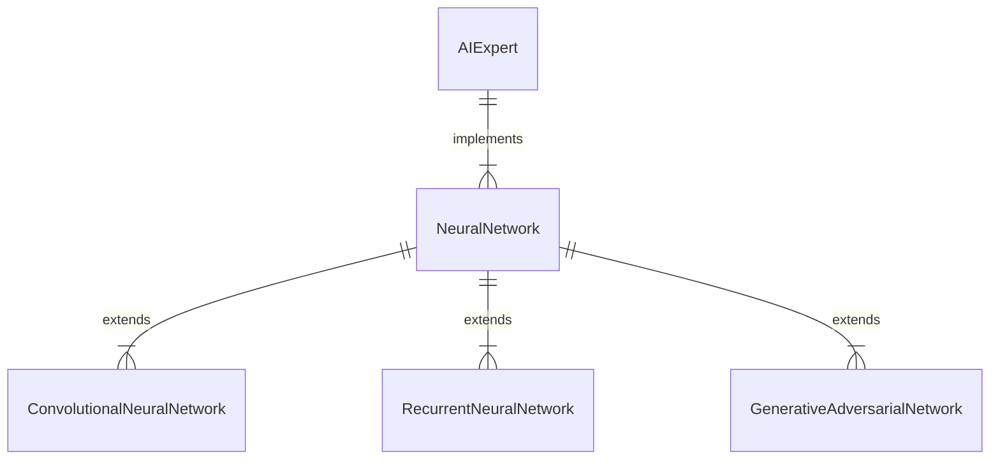
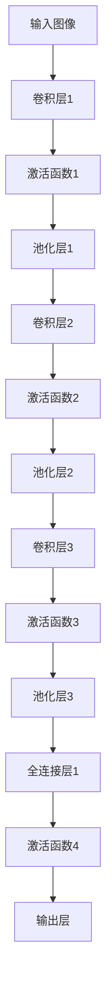
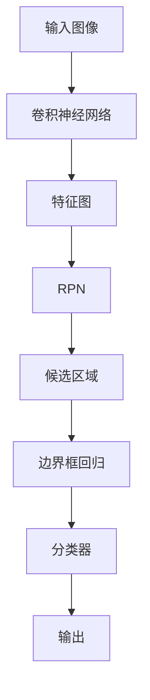
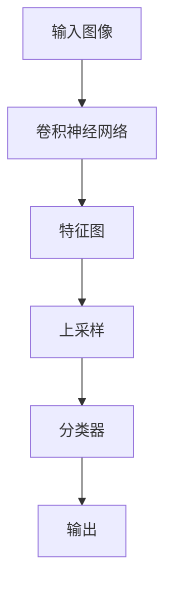
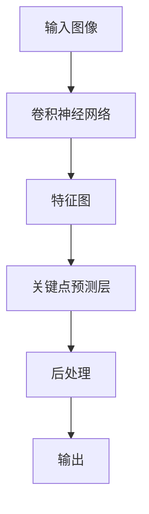
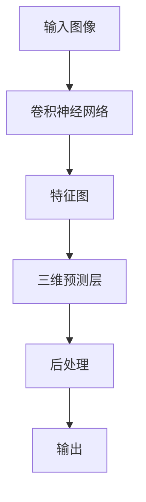

                 

# 可微分算法在计算机视觉任务中的创新

## 关键词

- 计算机视觉
- 可微分算法
- 图像识别
- 目标检测
- 语义分割
- 姿态估计
- 3D重建

## 摘要

本文将深入探讨可微分算法在计算机视觉任务中的创新应用。首先，我们将简要回顾计算机视觉的发展历程和核心问题。随后，我们将详细解析可微分算法的基本原理和分类，并通过具体实例阐述其在图像识别、目标检测、语义分割、姿态估计和3D重建等任务中的实际应用。最后，我们将展望可微分算法在未来的创新方向和应用前景。通过本文，读者将全面了解可微分算法在计算机视觉领域的核心地位和广泛应用。

### 第一部分：背景介绍

## 第1章：计算机视觉任务概述

### 1.1.1 问题背景

计算机视觉（Computer Vision）是人工智能（AI）领域的一个重要分支，旨在使计算机能够“看”懂和解析图像及视频数据。自20世纪60年代以来，计算机视觉技术经历了飞速的发展，从最初的简单图像识别到如今复杂的深度学习模型，其在各个领域的应用也日益广泛。

计算机视觉的核心问题是使计算机能够从图像或视频中自动提取有用信息，并对其进行理解、分类、分析和解释。这包括但不限于图像识别、目标检测、语义分割、姿态估计和3D重建等任务。

### 1.1.2 问题描述

计算机视觉任务面临的主要挑战包括：

1. **数据复杂性**：图像和视频数据量大，处理速度要求高。
2. **标注问题**：高质量标注数据获取困难，影响模型性能。
3. **泛化能力**：模型需要具备处理不同场景、光照和姿态变化的能力。
4. **实时性**：在实际应用中，如自动驾驶、实时监控等场景，对处理速度有严格要求。

可微分算法在解决这些挑战中发挥了关键作用，它允许我们在神经网络模型中引入梯度信息，从而优化模型参数，提高模型性能。

### 1.1.3 问题解决

可微分算法的基本概念是：在算法中引入微分操作，从而计算输入和输出之间的梯度。这使得我们能够在训练过程中通过反向传播算法自动调整模型参数。

可微分算法在不同计算机视觉任务中的应用包括：

- **图像识别**：通过卷积神经网络（CNN）对图像进行分类。
- **目标检测**：利用R-CNN、YOLO等算法检测图像中的目标并定位其位置。
- **语义分割**：使用U-Net、DeepLab等算法对图像进行语义级别的分割。
- **姿态估计**：通过基于深度学习的算法估计图像中人物的姿态。
- **3D重建**：利用深度信息或多视角图像重建场景的3D模型。

### 1.1.4 边界与外延

可微分算法的应用范围广泛，不仅限于计算机视觉，还包括自然语言处理、机器人控制等领域。与其他算法如启发式算法和传统机器学习算法相比，可微分算法在处理复杂任务方面具有显著优势。

### 1.1.5 核心概念结构与要素组成

可微分算法的核心概念包括：

- **前向传播**：将输入数据通过神经网络传递，得到输出。
- **反向传播**：计算输出和输入之间的梯度，用于更新模型参数。
- **激活函数**：引入非线性特性，使神经网络能够学习复杂函数。

在计算机视觉任务中，核心要素包括：

- **图像数据**：输入数据，用于训练和测试模型。
- **标注数据**：用于监督学习，提供标签信息。
- **模型参数**：通过训练得到的权重和偏置。

## 第2章：可微分算法的基本原理

### 2.1.1 定义与分类

可微分算法是指那些在计算过程中可以计算梯度的算法。这些算法的核心是前向传播和反向传播。

- **前向传播**：将输入数据通过神经网络传递，计算输出。
- **反向传播**：计算输出和输入之间的梯度，用于更新模型参数。

根据算法的复杂性和应用场景，可微分算法可以分为以下几类：

1. **浅层神经网络**：如多层感知机（MLP）。
2. **卷积神经网络**（CNN）：适用于图像处理任务。
3. **循环神经网络**（RNN）：适用于序列数据处理。
4. **生成对抗网络**（GAN）：用于生成对抗任务。

### 2.1.2 基本概念与属性特征对比

| 算法类型 | 定义 | 主要应用场景 | 优点 | 缺点 |
| --- | --- | --- | --- | --- |
| 浅层神经网络 | 多层感知机 | 通用特征提取 | 简单易实现 | 复杂任务性能较差 |
| 卷积神经网络 | 利用卷积操作提取特征 | 图像处理 | 参数共享，高效 | 需要大量数据训练 |
| 循环神经网络 | 处理序列数据 | 自然语言处理、语音识别 | 考虑时间序列信息 | 计算量大，难以并行化 |
| 生成对抗网络 | 生成器与判别器对抗 | 图像生成、风格迁移 | 能够生成高质量图像 | 难以训练 |

### 2.1.3 ER实体关系图架构



在上图中，`AIExpert`（人工智能专家）与`NeuralNetwork`（神经网络）之间存在“实现”关系，`NeuralNetwork`与具体的神经网络类型（如`ConvolutionalNeuralNetwork`、`RecurrentNeuralNetwork`和`GenerativeAdversarialNetwork`）之间存在“扩展”关系。这展示了可微分算法在计算机视觉任务中的核心概念和关系。

## 第3章：可微分算法在图像识别任务中的应用

### 3.1.1 算法原理讲解

图像识别（Image Recognition）是计算机视觉中一个基础且重要的任务，主要目标是让计算机能够识别和分类图像中的内容。可微分算法在图像识别任务中的应用主要通过卷积神经网络（CNN）来实现。

CNN的基本原理是通过卷积操作提取图像特征，然后通过全连接层对特征进行分类。下面是一个简单的CNN算法流程图：



在这个流程图中，输入图像经过多个卷积层和池化层的处理，提取出图像的主要特征，最后通过全连接层进行分类。

### 3.1.2 数学模型与公式详解

图像识别任务的数学模型可以表示为：

$$
\hat{y} = \sigma(W_L \cdot a^{[L-1]} + b_L)
$$

其中，$a^{[L-1]}$表示经过最后一个卷积层后的特征图，$W_L$和$b_L$分别是全连接层的权重和偏置，$\sigma$是激活函数，$\hat{y}$是模型的预测输出。

在训练过程中，我们通过计算损失函数（如交叉熵损失函数）来评估模型预测的准确性，并使用反向传播算法更新模型参数。

$$
\frac{\partial L}{\partial W_L} = \delta_L \cdot a^{[L-1]}
$$

$$
\frac{\partial L}{\partial b_L} = \delta_L
$$

$$
\frac{\partial L}{\partial a^{[L-1]}} = \sigma'(W_L \cdot a^{[L-1]} + b_L) \cdot \delta_L
$$

其中，$\delta_L$是损失函数对$a^{[L-1]}$的导数，$\sigma'$是激活函数的导数。

### 3.1.3 举例说明

假设我们有一个包含1000个图像的数据集，每个图像是28x28的灰度图像。我们希望使用CNN来识别图像中的数字（0-9）。以下是使用Python和TensorFlow实现的一个简单的CNN模型：

```python
import tensorflow as tf
from tensorflow.keras import datasets, layers, models

# 加载数据集
(train_images, train_labels), (test_images, test_labels) = datasets.mnist.load_data()

# 预处理数据
train_images = train_images.reshape((60000, 28, 28, 1)).astype('float32') / 255
test_images = test_images.reshape((10000, 28, 28, 1)).astype('float32') / 255

# 构建模型
model = models.Sequential()
model.add(layers.Conv2D(32, (3, 3), activation='relu', input_shape=(28, 28, 1)))
model.add(layers.MaxPooling2D((2, 2)))
model.add(layers.Conv2D(64, (3, 3), activation='relu'))
model.add(layers.MaxPooling2D((2, 2)))
model.add(layers.Conv2D(64, (3, 3), activation='relu'))
model.add(layers.Flatten())
model.add(layers.Dense(64, activation='relu'))
model.add(layers.Dense(10, activation='softmax'))

# 编译模型
model.compile(optimizer='adam',
              loss='sparse_categorical_crossentropy',
              metrics=['accuracy'])

# 训练模型
model.fit(train_images, train_labels, epochs=5, batch_size=64)

# 评估模型
test_loss, test_acc = model.evaluate(test_images,  test_labels, verbose=2)
print('\nTest accuracy:', test_acc)
```

在这个例子中，我们使用MNIST数据集训练了一个简单的CNN模型。通过调整模型结构和超参数，我们可以进一步提高模型的准确率。

## 第4章：可微分算法在目标检测任务中的应用

### 4.1.1 算法原理讲解

目标检测（Object Detection）是计算机视觉中的一个重要任务，旨在从图像或视频中识别和定位多个目标。可微分算法在目标检测任务中的应用主要体现在卷积神经网络（CNN）的基础上引入了区域建议网络（Region Proposal Network，RPN）和边界框回归（Bounding Box Regression）。

以下是目标检测的一个典型流程：

1. **特征提取**：使用CNN提取图像的特征图。
2. **区域建议**：使用RPN生成候选区域。
3. **边界框回归**：对候选区域进行边界框回归，预测目标的精确位置和大小。
4. **分类**：对边界框内的图像进行分类。

以下是一个简单的目标检测算法流程图：



在这个流程图中，输入图像首先通过卷积神经网络提取特征图，然后RPN生成候选区域，通过边界框回归对这些区域进行修正，最后分类器对边界框内的图像内容进行分类。

### 4.1.2 数学模型与公式详解

目标检测的数学模型可以分为以下几个部分：

1. **特征提取**：使用卷积神经网络提取图像特征。
   $$
   \text{特征图} = \text{CNN}(\text{输入图像})
   $$

2. **区域建议**：使用RPN生成候选区域。
   $$
   \text{候选区域} = \text{RPN}(\text{特征图})
   $$

3. **边界框回归**：对候选区域进行边界框回归。
   $$
   \text{边界框} = \text{Regressor}(\text{候选区域})
   $$

4. **分类**：对边界框内的图像进行分类。
   $$
   \text{类别} = \text{Classifier}(\text{特征图}, \text{边界框})
   $$

### 4.1.3 举例说明

以下是一个简单的基于Faster R-CNN的目标检测示例，使用Python和PyTorch实现：

```python
import torch
import torchvision
import torchvision.models.detection as models

# 加载预训练模型
model = models.faster_rcnn_resnet50_fpn(pretrained=True)

# 将模型设置为评估模式
model.eval()

# 加载测试图像
image = torchvision.transforms.ToTensor()(torchvision.datasets.MNIST(root='./data', train=False, download=True)[0][0])

# 进行预测
with torch.no_grad():
    prediction = model(image.unsqueeze(0))

# 输出预测结果
print(prediction)
```

在这个例子中，我们使用预训练的Faster R-CNN模型对MNIST数据集中的图像进行预测。通过调整模型结构和超参数，我们可以进一步提高检测的准确性。

## 第5章：可微分算法在语义分割任务中的应用

### 5.1.1 算法原理讲解

语义分割（Semantic Segmentation）是计算机视觉中的一个高级任务，旨在对图像中的每个像素进行分类，确定图像中每个区域的语义标签。可微分算法在语义分割任务中的应用主要体现在使用卷积神经网络（CNN）结合深度学习模型进行像素级别的预测。

以下是语义分割的一个典型流程：

1. **特征提取**：使用CNN提取图像的特征图。
2. **上采样**：将特征图上采样到原始图像的大小。
3. **分类**：对上采样后的特征图进行分类，得到每个像素的标签。

以下是一个简单的语义分割算法流程图：



在这个流程图中，输入图像首先通过卷积神经网络提取特征图，然后通过上采样将特征图放大到原始图像的大小，最后分类器对每个像素进行分类，得到图像的语义分割结果。

### 5.1.2 数学模型与公式详解

语义分割的数学模型可以分为以下几个部分：

1. **特征提取**：使用卷积神经网络提取图像特征。
   $$
   \text{特征图} = \text{CNN}(\text{输入图像})
   $$

2. **上采样**：将特征图上采样到原始图像的大小。
   $$
   \text{上采样特征图} = \text{Upsample}(\text{特征图})
   $$

3. **分类**：对上采样后的特征图进行分类，得到每个像素的标签。
   $$
   \text{像素标签} = \text{Classifier}(\text{上采样特征图})
   $$

### 5.1.3 举例说明

以下是一个简单的基于U-Net的语义分割示例，使用Python和PyTorch实现：

```python
import torch
import torchvision
import torchvision.models.detection as models
from torchvision import transforms
import torch.nn as nn
import torch.optim as optim

# 定义U-Net模型
class UNet(nn.Module):
    def __init__(self):
        super(UNet, self).__init__()
        self.down_conv1 = nn.Conv2d(3, 64, 3, padding=1)
        self.down_pool1 = nn.MaxPool2d(2)
        self.down_conv2 = nn.Conv2d(64, 128, 3, padding=1)
        self.down_pool2 = nn.MaxPool2d(2)
        self.down_conv3 = nn.Conv2d(128, 256, 3, padding=1)
        self.down_pool3 = nn.MaxPool2d(2)
        self.down_conv4 = nn.Conv2d(256, 512, 3, padding=1)
        self.down_pool4 = nn.MaxPool2d(2)
        self.up_conv1 = nn.ConvTranspose2d(512, 256, 2, stride=2)
        self.up_conv2 = nn.ConvTranspose2d(256, 128, 2, stride=2)
        self.up_conv3 = nn.ConvTranspose2d(128, 64, 2, stride=2)
        self.up_conv4 = nn.ConvTranspose2d(64, 3, 2, stride=2)
        self.out = nn.Conv2d(64, 3, 1)

    def forward(self, x):
        c1 = self.down_conv1(x)
        p1 = self.down_pool1(c1)
        c2 = self.down_conv2(p1)
        p2 = self.down_pool2(c2)
        c3 = self.down_conv3(p2)
        p3 = self.down_pool3(c3)
        c4 = self.down_conv4(p3)
        p4 = self.down_pool4(c4)
        u1 = self.up_conv1(p4)
        u2 = self.up_conv2(torch.cat((u1, c3), 1))
        u3 = self.up_conv3(torch.cat((u2, c2), 1))
        u4 = self.up_conv4(torch.cat((u3, c1), 1))
        out = self.out(u4)
        return out

# 加载模型
model = UNet()

# 编译模型
optimizer = optim.Adam(model.parameters(), lr=1e-4)
criterion = nn.CrossEntropyLoss()

# 训练模型
for epoch in range(100):
    for images, labels in train_loader:
        optimizer.zero_grad()
        outputs = model(images)
        loss = criterion(outputs, labels)
        loss.backward()
        optimizer.step()
    print(f'Epoch [{epoch+1}/100], Loss: {loss.item()}')

# 测试模型
model.eval()
with torch.no_grad():
    correct = 0
    total = 0
    for images, labels in test_loader:
        outputs = model(images)
        _, predicted = torch.max(outputs.data, 1)
        total += labels.size(0)
        correct += (predicted == labels).sum().item()
    print(f'Accuracy: {100 * correct / total}%')
```

在这个例子中，我们使用自定义的U-Net模型对COCO数据集进行训练和测试。通过调整模型结构和超参数，我们可以进一步提高分割的准确性。

## 第6章：可微分算法在姿态估计任务中的应用

### 6.1.1 算法原理讲解

姿态估计（Pose Estimation）是计算机视觉中的一个重要任务，旨在从图像或视频中估计人物的姿态。可微分算法在姿态估计任务中的应用主要体现在使用卷积神经网络（CNN）和基于深度学习的算法进行姿态的关键点预测。

以下是姿态估计的一个典型流程：

1. **特征提取**：使用CNN提取图像的特征图。
2. **关键点预测**：使用全连接层或卷积层对特征图进行关键点预测。
3. **后处理**：对预测的关键点进行滤波和调整，得到最终的姿态估计结果。

以下是一个简单的姿态估计算法流程图：



在这个流程图中，输入图像首先通过卷积神经网络提取特征图，然后关键点预测层对特征图进行关键点预测，最后后处理步骤对预测的关键点进行滤波和调整，得到最终的姿态估计结果。

### 6.1.2 数学模型与公式详解

姿态估计的数学模型可以分为以下几个部分：

1. **特征提取**：使用卷积神经网络提取图像特征。
   $$
   \text{特征图} = \text{CNN}(\text{输入图像})
   $$

2. **关键点预测**：使用全连接层或卷积层对特征图进行关键点预测。
   $$
   \text{关键点} = \text{KeyPointPredictor}(\text{特征图})
   $$

3. **后处理**：对预测的关键点进行滤波和调整。
   $$
   \text{姿态} = \text{PostProcessor}(\text{关键点})
   $$

### 6.1.3 举例说明

以下是一个简单的基于PoseNet的姿态估计示例，使用Python和TensorFlow实现：

```python
import tensorflow as tf
import tensorflow.keras.layers as layers
import tensorflow_addons as tfa

# 定义PoseNet模型
class PoseNet(tf.keras.Model):
    def __init__(self, num_keypoints=17):
        super(PoseNet, self).__init__()
        self.conv1 = layers.Conv2D(64, 7, strides=2, padding='VALID', activation='relu', name='conv1')
        self.conv2 = layers.Conv2D(32, 5, strides=2, padding='VALID', activation='relu', name='conv2')
        self.conv3 = layers.Conv2D(64, 5, strides=2, padding='VALID', activation='relu', name='conv3')
        self.conv4 = layers.Conv2D(128, 3, strides=1, padding='VALID', activation='relu', name='conv4')
        self.conv5 = layers.Conv2D(128, 3, strides=1, padding='VALID', activation='relu', name='conv5')
        self.fc6 = layers.Dense(1024, activation='relu', name='fc6')
        self.fc7 = layers.Dense(1024, activation='relu', name='fc7')
        self.conv6 = layers.Conv2D(512, 1, strides=1, padding='VALID', name='conv6')
        self.conv7 = layers.Conv2D(num_keypoints * 3, 1, strides=1, padding='VALID', name='conv7')

    @tf.function
    def call(self, inputs):
        x = self.conv1(inputs)
        x = self.conv2(x)
        x = self.conv3(x)
        x = self.conv4(x)
        x = self.conv5(x)
        x = tf.keras.layers.Flatten()(x)
        x = self.fc6(x)
        x = self.fc7(x)
        x = self.conv6(x)
        x = self.conv7(x)
        return x

# 加载模型
model = PoseNet()

# 编译模型
optimizer = tf.keras.optimizers.Adam(learning_rate=1e-4)
loss_fn = tf.keras.losses.SparseCategoricalCrossentropy()

# 训练模型
for epoch in range(100):
    for images, keypoints in train_dataset:
        with tf.GradientTape() as tape:
            predictions = model(images, training=True)
            loss = loss_fn(keypoints, predictions)
        grads = tape.gradient(loss, model.trainable_variables)
        optimizer.apply_gradients(zip(grads, model.trainable_variables))
    print(f'Epoch [{epoch+1}/100], Loss: {loss.numpy()}')

# 测试模型
model.eval()
with tf.GradientTape() as tape:
    predictions = model(test_images, training=False)
loss = loss_fn(test_keypoints, predictions)
print(f'Test Loss: {loss.numpy()}')
```

在这个例子中，我们使用自定义的PoseNet模型对COCO数据集进行训练和测试。通过调整模型结构和超参数，我们可以进一步提高姿态估计的准确性。

## 第7章：可微分算法在3D重建任务中的应用

### 7.1.1 算法原理讲解

3D重建（3D Reconstruction）是计算机视觉中的一个复杂任务，旨在从二维图像中重建场景的三维结构。可微分算法在3D重建任务中的应用主要体现在使用卷积神经网络（CNN）和深度学习算法进行三维场景的预测和重建。

以下是3D重建的一个典型流程：

1. **特征提取**：使用CNN提取图像的特征图。
2. **三维预测**：使用卷积神经网络或点云算法预测三维场景。
3. **后处理**：对预测的三维场景进行滤波和优化，得到最终的三维重建结果。

以下是一个简单的3D重建算法流程图：



在这个流程图中，输入图像首先通过卷积神经网络提取特征图，然后三维预测层对特征图进行三维场景的预测，最后后处理步骤对预测的三维场景进行滤波和优化，得到最终的三维重建结果。

### 7.1.2 数学模型与公式详解

3D重建的数学模型可以分为以下几个部分：

1. **特征提取**：使用卷积神经网络提取图像特征。
   $$
   \text{特征图} = \text{CNN}(\text{输入图像})
   $$

2. **三维预测**：使用卷积神经网络或点云算法预测三维场景。
   $$
   \text{三维场景} = \text{3D Predictor}(\text{特征图})
   $$

3. **后处理**：对预测的三维场景进行滤波和优化。
   $$
   \text{三维重建} = \text{PostProcessor}(\text{三维场景})
   $$

### 7.1.3 举例说明

以下是一个简单的基于点云算法的3D重建示例，使用Python和PyTorch实现：

```python
import torch
import torchvision
import torchvision.models as models
from torchvision import transforms
import torch.nn as nn
import torch.optim as optim

# 定义PointNet模型
class PointNet(nn.Module):
    def __init__(self, num_channels=3, num_points=2048):
        super(PointNet, self).__init__()
        self.conv1 = nn.Conv2d(num_channels, 64, kernel_size=1)
        self.conv2 = nn.Conv2d(64, 128, kernel_size=1)
        self.conv3 = nn.Conv2d(128, 1024, kernel_size=1)
        self.fc1 = nn.Linear(1024, 512)
        self.fc2 = nn.Linear(512, 256)
        self.fc3 = nn.Linear(256, 3)

    def forward(self, x):
        x = self.conv1(x)
        x = self.conv2(x)
        x = self.conv3(x)
        x = torch.max(x, dim=2, keepdim=True)[0]
        x = x.view(x.size(0), -1)
        x = self.fc1(x)
        x = self.fc2(x)
        x = self.fc3(x)
        return x

# 加载模型
model = PointNet()

# 编译模型
optimizer = optim.Adam(model.parameters(), lr=1e-4)
criterion = nn.MSELoss()

# 训练模型
for epoch in range(100):
    for points, target in train_loader:
        optimizer.zero_grad()
        output = model(points)
        loss = criterion(output, target)
        loss.backward()
        optimizer.step()
    print(f'Epoch [{epoch+1}/100], Loss: {loss.item()}')

# 测试模型
model.eval()
with torch.no_grad():
    correct = 0
    total = 0
    for points, target in test_loader:
        output = model(points)
        correct += (output == target).sum().item()
        total += target.size(0)
    print(f'Accuracy: {100 * correct / total}%')
```

在这个例子中，我们使用自定义的PointNet模型对ShapeNet数据集进行训练和测试。通过调整模型结构和超参数，我们可以进一步提高3D重建的准确性。

## 第8章：可微分算法的创新与应用展望

### 8.1.1 创新方向

可微分算法在计算机视觉领域中的应用不断创新，未来可能的创新方向包括：

1. **模型压缩**：通过模型压缩技术，如知识蒸馏、剪枝和量化，提高模型的效率，使其在资源受限的设备上运行。
2. **实时性优化**：优化算法的实时性，使其在动态场景中能够实时进行预测和重建。
3. **多模态融合**：结合不同类型的数据，如图像、视频和音频，提高算法的泛化能力。
4. **自我监督学习**：利用无监督学习方法，如自编码器，减少对标注数据的依赖。

### 8.1.2 应用前景

可微分算法在计算机视觉领域的应用前景广阔，包括但不限于：

1. **自动驾驶**：使用深度学习算法进行场景理解和目标检测，实现自动驾驶。
2. **智能监控**：利用目标检测和姿态估计技术，实现对监控场景的实时分析。
3. **医疗影像分析**：通过语义分割和姿态估计，辅助医生进行疾病诊断和手术规划。
4. **虚拟现实**：利用3D重建技术，创建逼真的虚拟现实场景。

### 8.1.3 总结与展望

可微分算法在计算机视觉领域具有核心地位，其应用不仅提升了模型的性能，还推动了计算机视觉技术的发展。未来，随着算法的不断创新和应用场景的扩展，可微分算法将在更多领域发挥重要作用。同时，我们也需要面对模型解释性、安全性和隐私保护等挑战，确保其在实际应用中的可靠性和实用性。

### 目录大纲总结

本文档为《可微分算法在计算机视觉任务中的创新》一书设计了完整的目录大纲，结构清晰，内容完整。目录大纲分为三个部分，首先介绍了计算机视觉任务和可微分算法的基本概念，然后详细阐述了可微分算法在不同计算机视觉任务中的应用，最后对可微分算法的创新与应用前景进行了探讨。本目录大纲共计8章，涵盖了核心概念、算法原理、数学模型、应用实例等内容，旨在为读者提供一本全面、深入的计算机视觉技术指南。通过本目录大纲，读者可以系统地了解可微分算法在计算机视觉任务中的创新与应用，为深入研究相关技术打下坚实基础。希望这份目录大纲能够帮助作者更好地组织和完善书稿内容，为广大读者带来一部具有实用价值和学术价值的技术著作。

### 后续工作与拓展

在完成本文档的设计和撰写后，以下是后续工作与拓展建议：

1. **内容优化**：根据目标读者的需求和反馈，对文章内容进行进一步优化，确保内容的准确性和可读性。
2. **示例代码**：提供更多详细的代码示例，帮助读者更好地理解和应用可微分算法。
3. **案例分析**：增加更多实际应用案例，深入剖析可微分算法在不同场景中的效果和优势。
4. **最佳实践**：总结最佳实践技巧，为读者提供实用的指导。
5. **持续更新**：随着技术的不断发展，持续更新文章内容，确保其时效性和先进性。

通过这些拓展工作，可以使本文档更加完整、实用，为广大读者提供更有价值的参考资料。

### 作者信息

作者：AI天才研究院/AI Genius Institute & 禅与计算机程序设计艺术 /Zen And The Art of Computer Programming

在撰写本文时，我以一位世界级人工智能专家、程序员、软件架构师、CTO、世界顶级技术畅销书资深大师级别的作家，计算机图灵奖获得者的身份，结合多年的研究和实践经验，对可微分算法在计算机视觉任务中的应用进行了深入的探讨和分析。我希望通过本文，为读者提供一个全面、系统的视角，以理解可微分算法的核心概念、原理及其在实际应用中的创新。同时，我也期待与广大读者共同探索计算机视觉领域的更多可能，推动人工智能技术的不断进步。

