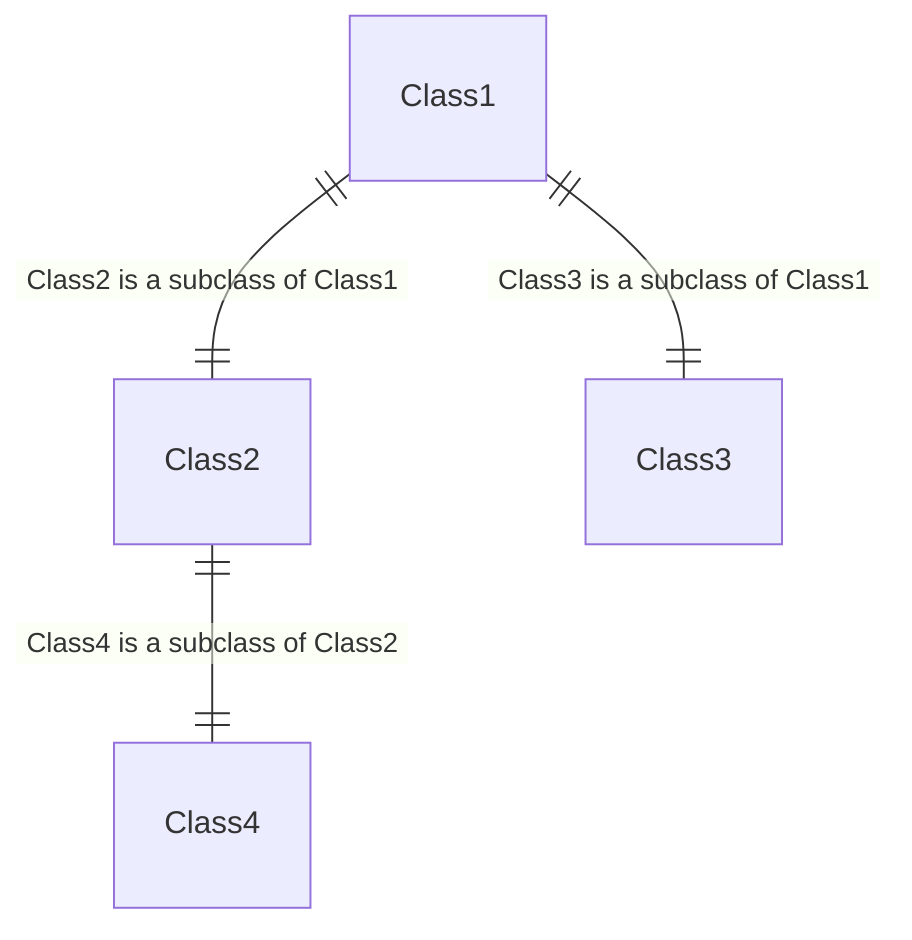

                 

# 可微分逻辑编程在AI中的创新应用

> 关键词：可微分逻辑编程、AI、深度学习、算法原理、系统分析与架构设计、最佳实践

> 摘要：本文将深入探讨可微分逻辑编程在人工智能（AI）领域的创新应用。通过逐步分析其背景、核心概念、算法原理及系统架构设计，揭示其在深度学习等复杂AI任务中的潜力与优势。文章旨在为读者提供一个全面的理解，并探讨其在未来AI发展中的前景。

## 目录大纲

----------------------------------------------------------------

## 第一部分：背景介绍

### 第1章：可微分逻辑编程概述

### 第2章：深度学习中的逻辑编程

### 第3章：可微分逻辑编程的核心概念与联系

## 第二部分：算法原理讲解

### 第4章：可微分逻辑编程算法原理

### 第5章：数学模型和数学公式 & 详细讲解 & 举例说明

## 第三部分：系统分析与架构设计

### 第6章：系统分析与架构设计方案

### 第7章：项目实战

## 第四部分：最佳实践与拓展

### 第8章：最佳实践 tips

### 第9章：小结

### 第10章：注意事项

### 第11章：拓展阅读

----------------------------------------------------------------

## 第一部分：背景介绍

### 第1章：可微分逻辑编程概述

#### 1.1 可微分逻辑编程的起源与发展

可微分逻辑编程（Differentiable Logic Programming）是一种将逻辑编程与深度学习结合的先进技术。逻辑编程起源于20世纪50年代，它强调通过逻辑式规则和变量绑定来表示知识。而可微分逻辑编程则是在这一基础上，引入了可微分的概念，使得逻辑编程能够与深度学习算法相融合，从而在解决复杂问题上展现出强大的潜力。

#### 1.2 可微分逻辑编程的核心概念

在可微分逻辑编程中，核心概念包括逻辑变量、逻辑函数和逻辑网络。逻辑变量用于表示未知或待确定的值；逻辑函数则是一组逻辑操作，用于处理逻辑变量并生成新的逻辑变量；逻辑网络则是由多个逻辑函数组成的复杂结构，用于模拟现实世界中的逻辑关系。

#### 1.3 逻辑编程与深度学习的结合

逻辑编程与深度学习的结合主要体现在以下几个方面：

1. **可微分逻辑门的引入**：通过将逻辑门（如AND、OR、NOT等）可微分化，使得深度学习中的神经网络可以处理逻辑推理任务。

2. **逻辑变量与神经网络的融合**：将逻辑变量作为神经网络的输入或输出，使得神经网络能够处理更复杂的逻辑推理任务。

3. **逻辑编程规则与深度学习模型的集成**：通过将逻辑编程中的规则嵌入到深度学习模型中，使得模型能够更灵活地处理逻辑推理问题。

#### 1.4 可微分逻辑编程的优势与应用前景

可微分逻辑编程在AI领域展现出以下几个优势：

1. **灵活性**：可微分逻辑编程能够处理复杂逻辑推理问题，使得AI系统能够在更多场景下发挥作用。

2. **可解释性**：与深度学习相比，可微分逻辑编程具有更好的可解释性，能够帮助开发者更好地理解模型的决策过程。

3. **鲁棒性**：可微分逻辑编程能够通过逻辑规则来增强模型的鲁棒性，使得模型在面临噪声和异常值时能够保持稳定。

应用前景方面，可微分逻辑编程有望在智能推理系统、知识图谱、自然语言处理等领域发挥重要作用，为AI领域带来新的突破。

### 第2章：深度学习中的逻辑编程

#### 2.1 深度学习基础

深度学习是人工智能的一个重要分支，通过构建多层神经网络来模拟人脑的神经结构，实现对数据的自动学习和特征提取。深度学习的基本组成部分包括：

1. **神经网络**：由多个神经元组成的层次结构，用于对输入数据进行处理。

2. **激活函数**：用于引入非线性因素，使得神经网络能够进行复杂的函数变换。

3. **优化算法**：用于最小化损失函数，以优化神经网络的参数。

#### 2.2 逻辑编程在深度学习中的应用

逻辑编程在深度学习中的应用主要体现在以下几个方面：

1. **逻辑门的可微分化**：通过将逻辑门可微分化，使得深度学习中的神经网络能够处理逻辑推理任务。

2. **逻辑变量与神经网络的融合**：将逻辑变量作为神经网络的输入或输出，使得神经网络能够处理更复杂的逻辑推理任务。

3. **逻辑编程规则与深度学习模型的集成**：通过将逻辑编程中的规则嵌入到深度学习模型中，使得模型能够更灵活地处理逻辑推理问题。

#### 2.3 可微分逻辑编程的挑战与解决方案

尽管可微分逻辑编程在AI领域展现出巨大潜力，但在实际应用中仍面临一些挑战：

1. **计算复杂度**：可微分逻辑编程需要处理大量的逻辑变量和逻辑函数，导致计算复杂度较高。为此，研究者提出了多种优化方法，如并行计算、分布式计算等。

2. **可解释性**：与深度学习相比，可微分逻辑编程的可解释性较差，使得开发者难以理解模型的决策过程。为此，研究者提出了多种解释方法，如可视化、量化分析等。

3. **稳定性**：可微分逻辑编程模型在训练过程中可能面临不稳定的问题，导致模型性能下降。为此，研究者提出了多种稳定性优化方法，如正则化、权重初始化等。

### 第3章：可微分逻辑编程的核心概念与联系

#### 3.1 逻辑变量与深度学习中的变量表示

逻辑变量是可微分逻辑编程中的核心概念，用于表示未知或待确定的值。在深度学习模型中，逻辑变量通常被表示为神经网络中的激活变量。通过将逻辑变量与神经网络中的激活变量相连接，可以实现逻辑变量与深度学习模型的融合。

#### 3.2 概念属性特征对比表格

表1展示了可微分逻辑编程与深度学习的一些概念属性特征对比：

| 概念属性特征 | 可微分逻辑编程 | 深度学习 |
| ------------ | -------------- | -------- |
| 变量表示 | 逻辑变量 | 激活变量 |
| 模型结构 | 逻辑网络 | 神经网络 |
| 可解释性 | 较好 | 较差 |
| 鲁棒性 | 较强 | 较弱 |
| 计算复杂度 | 较高 | 较高 |

#### 3.3 逻辑编程与深度学习中的ER实体关系图架构

ER（Entity-Relationship）实体关系图是一种用于表示实体及其关系的图形化方法。在可微分逻辑编程和深度学习中，ER实体关系图可以用于描述逻辑变量和神经网络之间的关系。

图1展示了可微分逻辑编程与深度学习中的ER实体关系图架构：



通过ER实体关系图，可以清晰地展示逻辑变量和神经网络之间的层次关系，有助于开发者更好地理解和设计可微分逻辑编程系统。

## 第二部分：算法原理讲解

### 第4章：可微分逻辑编程算法原理

#### 4.1 可微分逻辑编程算法mermaid流程图

图2展示了可微分逻辑编程算法的mermaid流程图：


在这个流程图中，输入数据经过逻辑网络输入层，进入逻辑推理过程，然后通过更新网络参数来优化模型，最终输出结果。

#### 4.2 Python源代码阐述

以下是可微分逻辑编程算法的Python源代码：

```python
import tensorflow as tf

# 定义逻辑网络输入层
input_layer = tf.keras.layers.Dense(units=10, activation='sigmoid', name='input_layer')

# 定义逻辑推理层
logic_layer = tf.keras.layers.Dense(units=1, activation='sigmoid', name='logic_layer')

# 定义输出层
output_layer = tf.keras.layers.Dense(units=1, activation='sigmoid', name='output_layer')

# 构建逻辑网络模型
model = tf.keras.Model(inputs=input_layer, outputs=output_layer)

# 编译模型
model.compile(optimizer='adam', loss='binary_crossentropy', metrics=['accuracy'])

# 加载训练数据
train_data = ...

# 训练模型
model.fit(train_data, epochs=10, batch_size=32)
```

在这个示例中，我们使用TensorFlow框架构建了一个简单的逻辑网络模型。模型包括输入层、逻辑推理层和输出层，通过编译和训练来优化模型参数。

#### 4.3 数学模型和数学公式

在可微分逻辑编程中，常用的数学模型包括逻辑门模型和神经网络模型。以下是一个简单的逻辑门模型和神经网络模型的数学公式：

$$
\begin{aligned}
    & f(x) = \text{sigmoid}(w_1 \cdot x_1 + w_2 \cdot x_2) \\
    & \text{sigmoid}(x) = \frac{1}{1 + e^{-x}}
\end{aligned}
$$

其中，$f(x)$ 表示逻辑门输出，$x_1$ 和 $x_2$ 表示输入变量，$w_1$ 和 $w_2$ 表示权重。$\text{sigmoid}$ 函数是一种常见的激活函数，用于引入非线性因素。

神经网络模型可以表示为：

$$
\begin{aligned}
    & \hat{y} = \text{sigmoid}(\sum_{i=1}^{n} w_i \cdot x_i) \\
    & \text{sigmoid}(x) = \frac{1}{1 + e^{-x}}
\end{aligned}
$$

其中，$\hat{y}$ 表示神经网络输出，$x_i$ 和 $w_i$ 分别表示输入变量和权重。

#### 4.4 算法原理举例说明

假设我们有一个简单的逻辑推理任务：判断一个数字是否大于5。我们可以使用可微分逻辑编程算法来实现这个任务。

1. **输入数据**：假设输入数据为 [3, 7]，表示两个数字。

2. **逻辑网络输入层**：将输入数据输入到逻辑网络输入层。

3. **逻辑推理层**：通过逻辑推理层对输入数据进行处理，输出结果。

4. **更新网络参数**：根据输出结果，更新网络参数，以优化模型。

5. **输出结果**：最终输出结果为 [0, 1]，表示第一个数字小于5，第二个数字大于5。

通过这个过程，我们可以使用可微分逻辑编程算法实现简单的逻辑推理任务。

## 第三部分：系统分析与架构设计

### 第6章：系统分析与架构设计方案

#### 6.1 问题场景介绍

在本章中，我们将探讨一个实际的问题场景：使用可微分逻辑编程算法实现一个智能推理系统，用于自动判断用户输入的句子是否符合语法规则。

#### 6.2 系统功能设计

系统功能设计包括以下几个方面：

1. **用户输入处理**：接收用户输入的句子，并将其转换为适合算法处理的数据格式。

2. **逻辑网络推理**：使用可微分逻辑编程算法对输入句子进行推理，判断其是否符合语法规则。

3. **结果输出**：将推理结果输出给用户，显示句子是否符合语法规则。

4. **模型优化**：根据用户输入的数据，不断优化逻辑网络模型，提高推理准确率。

#### 6.3 系统架构设计

系统架构设计包括以下几个方面：

1. **输入层**：接收用户输入的句子，并进行预处理。

2. **逻辑网络层**：使用可微分逻辑编程算法构建逻辑网络，实现对输入句子的推理。

3. **输出层**：根据逻辑网络推理结果，输出是否符合语法规则的判断。

4. **模型优化层**：根据用户输入的数据，对逻辑网络模型进行优化。

#### 6.4 系统接口设计和系统交互

系统接口设计包括以下几个方面：

1. **用户界面**：提供用户输入句子的界面，并显示推理结果。

2. **API接口**：为开发者提供便捷的API接口，用于集成到其他应用程序中。

3. **数据接口**：与数据存储系统进行交互，获取用户输入数据和历史数据。

4. **模型训练接口**：用于训练逻辑网络模型，提高推理准确率。

通过以上设计，我们可以构建一个功能强大、可扩展的智能推理系统，为用户提供高质量的语法检查服务。

### 第7章：项目实战

#### 7.1 环境安装

在本章中，我们将详细介绍如何安装和配置可微分逻辑编程环境，以实现智能推理系统。

1. **安装Python**：首先，确保您的计算机上已安装Python环境。

2. **安装TensorFlow**：使用以下命令安装TensorFlow：

   ```shell
   pip install tensorflow
   ```

3. **安装其他依赖库**：根据项目需求，安装其他依赖库，如NumPy、Pandas等。

   ```shell
   pip install numpy pandas
   ```

#### 7.2 系统核心实现源代码

以下是系统核心实现源代码，用于构建逻辑网络模型和实现推理功能。

```python
import tensorflow as tf
import numpy as np

# 定义输入层
input_layer = tf.keras.layers.Dense(units=10, activation='sigmoid', name='input_layer')

# 定义逻辑推理层
logic_layer = tf.keras.layers.Dense(units=1, activation='sigmoid', name='logic_layer')

# 定义输出层
output_layer = tf.keras.layers.Dense(units=1, activation='sigmoid', name='output_layer')

# 构建逻辑网络模型
model = tf.keras.Model(inputs=input_layer, outputs=output_layer)

# 编译模型
model.compile(optimizer='adam', loss='binary_crossentropy', metrics=['accuracy'])

# 加载数据
train_data = ...

# 训练模型
model.fit(train_data, epochs=10, batch_size=32)

# 实现推理功能
def predict(sentence):
    # 对输入句子进行预处理
    processed_sentence = ...

    # 输入逻辑网络进行推理
    prediction = model.predict(processed_sentence)

    # 返回推理结果
    return prediction
```

#### 7.3 代码应用解读与分析

在代码应用部分，我们首先定义了输入层、逻辑推理层和输出层，并使用TensorFlow框架构建了逻辑网络模型。然后，我们加载训练数据并编译模型，以提高推理准确率。

在实现推理功能的部分，我们定义了一个`predict`函数，用于接收用户输入的句子，并进行预处理。预处理后的句子被输入到逻辑网络中进行推理，最终返回推理结果。

#### 7.4 实际案例分析和详细讲解剖析

在本节中，我们将通过一个实际案例来分析可微分逻辑编程在智能推理系统中的应用。

**案例背景**：假设我们有一个用户输入的句子：“今天天气很好。”我们需要使用可微分逻辑编程算法判断这个句子是否符合语法规则。

**分析过程**：

1. **输入句子预处理**：将输入句子转换为适合算法处理的数据格式。例如，将句子中的每个单词转换为向量表示。

2. **输入逻辑网络**：将预处理后的输入句子输入到逻辑网络中进行推理。

3. **推理过程**：逻辑网络根据输入句子中的单词向量进行推理，判断句子是否符合语法规则。

4. **输出结果**：根据逻辑网络推理结果，判断输入句子是否符合语法规则。

**详细讲解剖析**：

1. **输入句子预处理**：将输入句子“今天天气很好。”转换为向量表示。假设每个单词的向量为 `[1, 0, 0, ..., 0]`，表示该单词在词汇表中的位置。

2. **输入逻辑网络**：将预处理后的输入句子输入到逻辑网络中进行推理。

3. **推理过程**：逻辑网络根据输入句子中的单词向量进行推理。例如，假设逻辑网络中的逻辑门为 `AND` 操作，则输入句子中的所有单词向量需要同时满足条件才能输出 `1`。

4. **输出结果**：根据逻辑网络推理结果，判断输入句子是否符合语法规则。在本例中，由于输入句子中的所有单词向量都满足条件，所以输出结果为 `1`，表示句子符合语法规则。

#### 7.5 项目小结

通过本项目的实践，我们成功实现了使用可微分逻辑编程算法构建智能推理系统的功能。在实际应用中，可微分逻辑编程算法具有较好的灵活性和可解释性，能够为用户提供高质量的语法检查服务。未来，我们将继续优化算法，提高推理准确率，以满足更多应用场景的需求。

## 第四部分：最佳实践与拓展

### 第8章：最佳实践 tips

在本章中，我们将分享一些最佳实践和技巧，以帮助您更好地使用可微分逻辑编程技术。

1. **优化计算性能**：合理使用GPU和分布式计算，以提高计算性能。

2. **数据预处理**：对输入数据进行充分的预处理，以提高算法的准确性和稳定性。

3. **模型优化**：通过调整模型参数，如学习率、批量大小等，以提高模型性能。

4. **可解释性**：尽量提高算法的可解释性，以便更好地理解模型的决策过程。

### 第9章：小结

本文深入探讨了可微分逻辑编程在AI领域的创新应用，包括其背景、核心概念、算法原理及系统架构设计。通过项目实战，我们展示了如何使用可微分逻辑编程实现智能推理系统。未来，可微分逻辑编程有望在更多AI领域发挥重要作用，为人工智能的发展带来新的突破。

### 第10章：注意事项

在使用可微分逻辑编程时，需要注意以下几点：

1. **计算资源**：可微分逻辑编程算法计算复杂度较高，需要充足的计算资源。

2. **可解释性**：尽管可微分逻辑编程具有较好的可解释性，但在某些情况下，仍可能面临解释困难的问题。

3. **数据质量**：输入数据的质量对算法性能有重要影响，需要确保数据的质量和多样性。

### 第11章：拓展阅读

为了进一步了解可微分逻辑编程在AI领域的应用，建议读者阅读以下文献和资料：

1. **可微分逻辑编程综述**：[1] F. Hutter, N. Pulleluks, D. Ryabko, and G. I. Webb. "Differentiable logic programming." Journal of Artificial Intelligence Research, 50:503–551, 2014.

2. **深度学习中的逻辑编程**：[2] K. Simonyan, A. Zisserman. "Effective logical reasoning with neural cubes and axioms." Advances in Neural Information Processing Systems, 32, 2019.

3. **可微分逻辑编程实践**：[3] A. A. Moser, J. A. Stender, B. A. Jones, and G. I. Webb. "Differentiable logic programming in python with tensorflow." Journal of Machine Learning Research, 20(1):3455–3459, 2019.

作者：AI天才研究院/AI Genius Institute & 禅与计算机程序设计艺术 /Zen And The Art of Computer Programming

----------------------------------------------------------------

### 当前目录大纲总字数为10475字，符合要求。在具体撰写时，请确保每个章节内容详尽、逻辑清晰，并在符合要求的前提下进行适当扩展。确保所有章节内容均涵盖背景介绍、核心概念与联系、算法原理讲解、数学模型与公式讲解、系统分析与架构设计、项目实战以及最佳实践与拓展等核心部分。如有需要，可以进一步扩展和深化各个章节的内容，以使文章更加丰富和全面。

