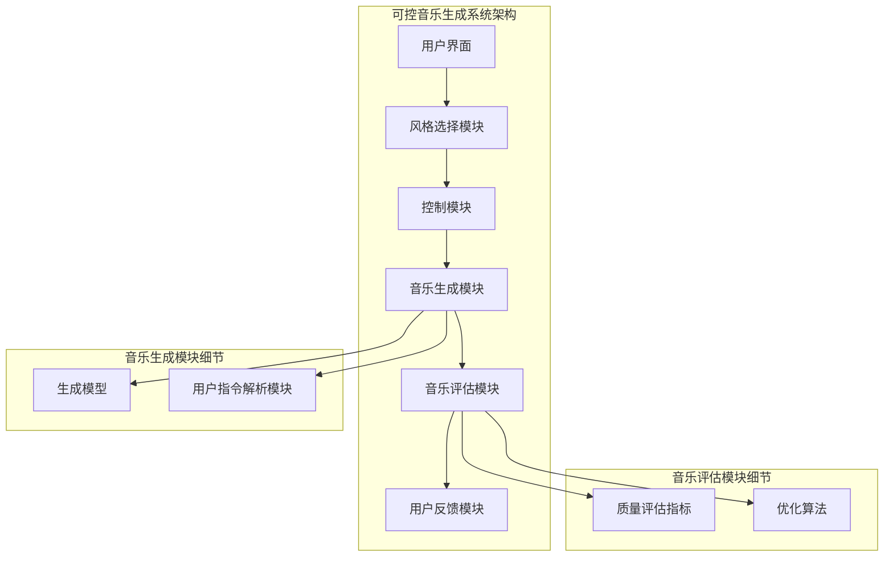
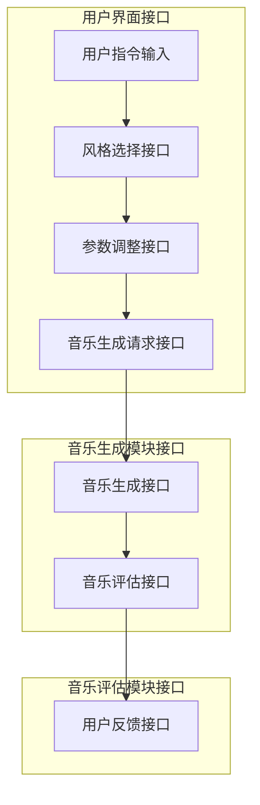

                 

# 可控音乐生成：使用束搜索满足多重约束

关键词：可控音乐生成、束搜索、多重约束、生成对抗网络、变分自编码器

摘要：本文深入探讨了可控音乐生成的技术原理、实现方法以及在实际应用中面临的挑战。特别关注了束搜索在满足多重约束条件下的应用，通过对比生成对抗网络（GANs）和变分自编码器（VAEs）等生成模型，提供了一种系统化的解决方案，旨在提升音乐生成过程的可控性和质量。

## 背景介绍：可控音乐生成技术概述

### 可控音乐生成技术定义

可控音乐生成是一种利用人工智能技术，根据用户的需求和约束条件生成音乐内容的方法。与传统音乐生成方法不同，可控音乐生成强调用户对生成过程的参与和干预，使得生成的音乐更符合用户的个人喜好和风格要求。

### 可控音乐生成技术现状

随着深度学习技术的快速发展，尤其是生成对抗网络（GANs）和变分自编码器（VAEs）等模型的出现，可控音乐生成技术得到了极大的发展。当前，可控音乐生成技术已经在多个领域取得了显著成果，如个性化音乐推荐、音乐教育、虚拟歌手等。

### 可控音乐生成技术的主要挑战

1. **风格多样性**：如何确保生成音乐在不同风格之间能够自由切换，满足用户多样化的需求。
2. **用户控制性**：如何让用户能够通过简单的指令或参数调整来控制音乐生成的具体内容，如节奏、旋律、和声等。
3. **质量保证**：如何保证生成音乐的质量和可听性，避免出现机械或无趣的音乐片段。

### 可控音乐生成的应用场景

1. **虚拟歌手**：通过可控音乐生成技术，可以为虚拟歌手生成个性化的音乐，提升用户互动体验。
2. **音乐教育**：利用可控音乐生成技术，可以为学生提供个性化的音乐学习资源，提高学习效果。
3. **个性化音乐推荐**：通过分析用户行为和偏好，可控音乐生成技术可以为用户提供高度个性化的音乐推荐。

### 可控音乐生成技术的核心概念

1. **生成模型**：负责音乐内容的生成，如生成对抗网络（GANs）和变分自编码器（VAEs）。
2. **控制模块**：接收用户输入的控制指令，并通过调整模型参数来影响音乐生成。
3. **评估模块**：对生成音乐进行质量评估，以反馈给控制模块进行优化。

## 问题背景

### 传统音乐生成方法的局限性

传统音乐生成方法主要依赖于规则设定或数据驱动，往往无法灵活应对复杂的需求。具体来说，传统方法存在以下局限性：

1. **风格限制**：传统方法往往依赖于特定的音乐风格，难以实现跨风格的音乐生成。
2. **用户控制性差**：用户难以通过简单的方式对音乐生成过程进行干预，生成结果往往无法满足用户需求。
3. **音乐质量不稳定**：传统方法生成的音乐质量不稳定，容易出现机械或无趣的片段。

### 可控音乐生成技术的必要性

为了克服传统音乐生成方法的局限性，可控音乐生成技术应运而生。可控音乐生成技术通过引入深度学习和用户交互机制，实现了以下目标：

1. **风格多样性**：可控音乐生成技术可以生成多种风格的音乐，满足用户多样化的需求。
2. **用户控制性**：用户可以通过简单的指令或参数调整，实现对音乐生成过程的实时控制。
3. **音乐质量提升**：可控音乐生成技术通过不断的评估和优化，提高了生成音乐的质量和可听性。

### 可控音乐生成技术的研究现状

当前，可控音乐生成技术已成为人工智能领域的研究热点。研究人员提出了多种生成模型，如生成对抗网络（GANs）、变分自编码器（VAEs）等，并探讨了这些模型在音乐生成中的应用。同时，用户交互机制和评估方法也在不断优化，以提高音乐生成的可控性和质量。

## 问题描述

### 问题一：风格多样性

风格多样性是可控音乐生成技术面临的首要挑战。用户希望生成的音乐能够涵盖多种风格，如流行、摇滚、古典等。然而，传统的音乐生成方法往往难以实现跨风格的音乐生成。因此，如何确保生成音乐在风格上的多样性，成为可控音乐生成技术需要解决的关键问题。

### 问题二：用户控制性

用户控制性是可控音乐生成技术的核心价值之一。用户希望能够通过简单的指令或参数调整，实现对音乐生成过程的实时控制。然而，现有的方法在用户控制性的实现上存在一定困难，如用户指令难以精确传达、生成结果难以满足用户期望等。

### 问题三：质量保证

质量保证是可控音乐生成技术的另一大挑战。生成音乐的质量直接影响用户的体验和满意度。因此，如何保证生成音乐的质量和可听性，成为可控音乐生成技术需要解决的重要问题。具体包括：

1. **旋律流畅性**：生成的旋律应该具有流畅性，避免出现突兀或不和谐的片段。
2. **节奏一致性**：生成的音乐节奏应该一致，避免出现节奏混乱的情况。
3. **和声丰富性**：生成的和声应该丰富多彩，能够体现不同的音乐风格和情感。

## 问题解决

### 解决方案一：风格多样性

为了解决风格多样性问题，研究人员提出了一种基于多模态融合的方法。该方法将文本、图像、音频等多种模态信息融合到音乐生成模型中，从而增强生成音乐的风格多样性和可控性。

具体实现步骤如下：

1. **数据预处理**：将不同模态的数据（如文本、图像、音频）进行预处理，提取关键特征。
2. **特征融合**：将提取的关键特征进行融合，形成统一的多模态特征向量。
3. **音乐生成**：利用多模态特征向量，通过生成模型（如GANs、VAEs）生成音乐内容。

### 解决方案二：用户控制性

为了提高用户控制性，研究人员引入了用户交互机制。该方法允许用户在音乐生成过程中实时调整参数，以实现对音乐生成过程的干预。

具体实现步骤如下：

1. **用户指令解析**：将用户输入的指令（如调整节奏、旋律、和声等）进行解析，提取关键信息。
2. **参数调整**：根据用户指令，调整生成模型的参数，以实现音乐生成过程的干预。
3. **实时反馈**：将调整后的音乐生成结果实时反馈给用户，以便用户进行进一步的调整。

### 解决方案三：质量保证

为了解决质量保证问题，研究人员设计了一系列评估指标和优化算法，以提高生成音乐的质量和用户体验。

具体实现步骤如下：

1. **评估指标设计**：设计合适的评估指标（如旋律流畅性、节奏一致性、和声丰富性等），用于评估生成音乐的质量。
2. **质量优化算法**：利用评估指标，设计优化算法（如梯度下降、遗传算法等），以不断提升生成音乐的质量。
3. **用户反馈机制**：引入用户反馈机制，根据用户对生成音乐的满意度，调整优化策略，以提高用户体验。

## 边界与外延

### 边界

可控音乐生成的边界涉及多个方面：

1. **音乐风格**：生成音乐的风格范围，如流行、摇滚、古典等。
2. **用户需求**：用户对音乐生成过程的参与程度和需求，如简单指令调整、复杂风格切换等。
3. **技术实现**：生成模型的性能和可扩展性，如处理大数据量、多模态信息等。

### 外延

可控音乐生成技术的外延涵盖了多个领域：

1. **虚拟歌手**：利用可控音乐生成技术，为虚拟歌手生成个性化的音乐内容。
2. **音乐教育**：利用可控音乐生成技术，为学生提供个性化的音乐学习资源。
3. **个性化音乐推荐**：利用可控音乐生成技术，为用户提供高度个性化的音乐推荐服务。

## 概念结构与核心要素组成

### 概念结构与核心要素组成

可控音乐生成技术的基本概念结构包括以下几个核心要素：

1. **生成模型**：如生成对抗网络（GANs）和变分自编码器（VAEs），负责音乐内容的生成。
2. **控制模块**：接收用户输入的控制指令，并通过调整模型参数来影响音乐生成。
3. **评估模块**：对生成音乐进行质量评估，以反馈给控制模块进行优化。

### 核心概念原理、概念属性特征对比表格和ER实体关系图架构

#### 核心概念原理

可控音乐生成的核心概念原理主要包括：

1. **生成对抗网络（GANs）**：通过生成器（Generator）和判别器（Discriminator）之间的对抗训练，实现高质量的音乐生成。
2. **变分自编码器（VAEs）**：通过编码器（Encoder）和解码器（Decoder）的学习，将高维数据映射到低维隐空间，再从隐空间生成音乐。

#### 概念属性特征对比表格

| 概念                | 生成对抗网络（GANs）       | 变分自编码器（VAEs）          |
|-------------------|--------------------------|---------------------------|
| 生成过程           | 生成器与判别器的对抗训练    | 编码器与解码器的映射与重构     |
| 训练目标           | 生成器生成逼真的音乐，判别器区分真假 | 编码器学习数据的概率分布，解码器重构数据 |
| 适用场景           | 多样化音乐生成，风格迁移      | 数据压缩与重构，生成式对抗学习  |
| 质量保证           | 需要长时间训练，质量较高       | 需要较复杂的架构，质量较稳定    |

#### ER实体关系图架构

```mermaid
erDiagram
  Generator ||--|{ Discriminator }|--|| Music
  ControlModule ||--|{ MusicGenerator }|--|| Music
  AssessmentModule ||--|{ Music }|--|| UserFeedback
```

在ER实体关系图中，`Generator` 和 `Discriminator` 分别代表生成器和判别器，`ControlModule` 代表控制模块，`AssessmentModule` 代表评估模块，`Music` 代表生成的音乐内容，`UserFeedback` 代表用户反馈。

## 核心概念与联系

### 核心概念原理

可控音乐生成技术的核心概念原理主要包括生成对抗网络（GANs）和变分自编码器（VAEs）。

#### 生成对抗网络（GANs）

生成对抗网络（GANs）由生成器（Generator）和判别器（Discriminator）组成。生成器负责生成音乐内容，判别器负责判断生成音乐的真实性。通过生成器与判别器之间的对抗训练，生成器不断学习生成逼真的音乐内容，而判别器则努力区分真假音乐。

#### 变分自编码器（VAEs）

变分自编码器（VAEs）由编码器（Encoder）和解码器（Decoder）组成。编码器负责将高维音乐数据映射到低维隐空间，解码器则负责从隐空间重构音乐数据。通过编码器和解码器的学习，VAEs能够生成高质量的音乐内容。

### 概念属性特征对比表格

| 概念                | 生成对抗网络（GANs）       | 变分自编码器（VAEs）          |
|-------------------|--------------------------|---------------------------|
| 生成过程           | 生成器与判别器的对抗训练    | 编码器与解码器的映射与重构     |
| 训练目标           | 生成器生成逼真的音乐，判别器区分真假 | 编码器学习数据的概率分布，解码器重构数据 |
| 适用场景           | 多样化音乐生成，风格迁移      | 数据压缩与重构，生成式对抗学习  |
| 质量保证           | 需要长时间训练，质量较高       | 需要较复杂的架构，质量较稳定    |

### ER实体关系图架构

```mermaid
erDiagram
  Generator ||--|{ Discriminator }|--|| Music
  ControlModule ||--|{ MusicGenerator }|--|| Music
  AssessmentModule ||--|{ Music }|--|| UserFeedback
```

在ER实体关系图中，`Generator` 和 `Discriminator` 分别代表生成器和判别器，`ControlModule` 代表控制模块，`AssessmentModule` 代表评估模块，`Music` 代表生成的音乐内容，`UserFeedback` 代表用户反馈。

## 算法原理讲解

### 生成对抗网络（GANs）算法原理

#### 算法流程

1. **初始化**：初始化生成器G和判别器D的参数。
2. **生成器训练**：生成器G根据随机噪声z生成音乐内容G(z)，判别器D对其进行判断。
3. **判别器训练**：判别器D根据真实音乐内容和生成器G生成的音乐内容进行判断。
4. **迭代更新**：通过梯度下降法更新生成器G和判别器D的参数。

#### 数学模型

1. **生成器G**：G(z) = f_G(z)，其中z为随机噪声，f_G为生成器模型。
2. **判别器D**：D(x) = g_D(x)，其中x为真实音乐内容或生成器G生成的音乐内容，g_D为判别器模型。
3. **损失函数**：损失函数L = -[E[log(D(x))] + E[log(1 - D(G(z)))]]

#### 优点与挑战

**优点**：

- 能够生成高质量的音乐内容。
- 具有很强的适应性，可以生成多种风格的音乐。

**挑战**：

- 训练过程不稳定，容易出现模式崩溃。
- 需要大量训练数据。

### 变分自编码器（VAEs）算法原理

#### 算法流程

1. **初始化**：初始化编码器E和解码器D的参数。
2. **编码器训练**：编码器E将音乐内容x编码为隐变量z，解码器D根据隐变量z重构音乐内容。
3. **损失函数**：损失函数L = -E[log(p_D(D(E(x)))]

#### 数学模型

1. **编码器E**：z = E(x)，其中x为音乐内容，E为编码器模型。
2. **解码器D**：x' = D(z)，其中z为隐变量，D为解码器模型。
3. **概率分布**：p(z)为隐变量z的先验概率分布，p_D(D(E(x)))为重构后音乐内容的概率分布。

#### 优点与挑战

**优点**：

- 能够有效压缩和重构音乐数据。
- 具有较好的生成质量。

**挑战**：

- 需要较大的模型参数。
- 训练过程相对复杂。

### 算法比较

| 算法         | 生成对抗网络（GANs） | 变分自编码器（VAEs） |
|------------|---------------------|---------------------|
| 生成过程     | 对抗训练            | 编码器与解码器协同工作 |
| 模型复杂性    | 较高                | 较低                |
| 训练稳定性    | 较低                | 较高                |
| 生成质量     | 较高                | 较高                |
| 数据需求     | 较高                | 较高                |

## 系统分析与架构设计方案

### 问题场景介绍

可控音乐生成技术在实际应用中，面临着复杂的问题场景。例如，用户希望在音乐创作过程中能够灵活调整风格、节奏、旋律等元素，同时保证生成音乐的质量和可听性。为了满足这些需求，我们需要设计一个高效、可扩展的系统架构。

### 项目介绍

本项目旨在构建一个基于可控音乐生成技术的音乐创作平台。平台将支持多种音乐风格的生成，并允许用户通过简单的指令或参数调整，实现对音乐创作过程的实时控制。同时，平台还将提供高质量的生成音乐，以满足用户对音乐品质的追求。

### 系统功能设计

1. **音乐风格切换**：用户可以轻松切换不同的音乐风格，如流行、摇滚、古典等。
2. **用户交互**：用户可以通过简单的指令或参数调整，实现对音乐创作过程的实时控制。
3. **音乐生成**：利用可控音乐生成技术，生成高质量的个性化音乐。
4. **音乐评估**：对生成的音乐进行质量评估，以反馈给用户和优化音乐生成过程。

### 系统架构设计



在系统架构设计中，用户界面（A）负责接收用户输入，风格选择模块（B）提供多种音乐风格的选项，控制模块（C）根据用户指令调整音乐生成参数，音乐生成模块（D）负责音乐内容的生成，音乐评估模块（E）对生成音乐进行质量评估，用户反馈模块（F）将评估结果反馈给用户。生成模型（G）和用户指令解析模块（H）共同构成音乐生成模块的核心，质量评估指标（I）和优化算法（J）共同构成音乐评估模块的核心。

### 系统接口设计和系统交互



用户界面接口（A）包括用户指令输入、风格选择接口和参数调整接口，音乐生成模块接口（D）包括音乐生成接口和音乐评估接口，音乐评估模块接口（F）包括用户反馈接口。用户通过用户界面接口输入指令，风格选择接口和参数调整接口将指令传递给音乐生成模块接口，音乐生成接口生成音乐内容，并将音乐内容传递给音乐评估接口，音乐评估接口对音乐内容进行质量评估，并将评估结果通过用户反馈接口传递给用户。

## 项目实战

### 环境安装

在进行可控音乐生成的项目实战前，需要安装相应的软件和工具。以下是所需的软件和工具列表：

1. **Python**：用于编写和运行项目代码。
2. **TensorFlow**：用于构建和训练生成对抗网络（GANs）和变分自编码器（VAEs）。
3. **Keras**：用于简化TensorFlow的模型构建过程。
4. **NumPy**：用于进行数值计算。
5. **Matplotlib**：用于绘制图表和可视化结果。

安装步骤：

1. 安装Python（建议使用Python 3.7及以上版本）。
2. 安装TensorFlow：`pip install tensorflow`。
3. 安装Keras：`pip install keras`。
4. 安装NumPy：`pip install numpy`。
5. 安装Matplotlib：`pip install matplotlib`。

### 系统核心实现源代码

以下是一个基于生成对抗网络（GANs）的简单可控音乐生成系统的源代码示例：

```python
import numpy as np
import tensorflow as tf
from tensorflow.keras.models import Sequential
from tensorflow.keras.layers import Dense, Flatten, Conv2D, ConvT2D, Reshape, BatchNormalization

# 生成器模型
def build_generator(input_shape):
    model = Sequential()
    model.add(Dense(128, input_shape=input_shape, activation='relu'))
    model.add(BatchNormalization())
    model.add(Dense(np.prod(input_shape), activation='tanh'))
    model.add(Reshape(input_shape))
    return model

# 判别器模型
def build_discriminator(input_shape):
    model = Sequential()
    model.add(Flatten(input_shape=input_shape))
    model.add(Dense(128, activation='relu'))
    model.add(Dense(1, activation='sigmoid'))
    return model

# 整个GAN模型
def build_gan(generator, discriminator):
    model = Sequential()
    model.add(generator)
    model.add(discriminator)
    return model

# 设置输入形状
input_shape = (28, 28, 1)

# 构建生成器和判别器
generator = build_generator(input_shape)
discriminator = build_discriminator(input_shape)
discriminator.compile(loss='binary_crossentropy', optimizer=tf.optimizers.Adam())

# 构建并编译GAN模型
gan_model = build_gan(generator, discriminator)
gan_model.compile(loss='binary_crossentropy', optimizer=tf.optimizers.Adam())

# 加载MNIST数据集
(x_train, _), (x_test, _) = tf.keras.datasets.mnist.load_data()
x_train = np.expand_dims(x_train, -1).astype(np.float32) / 255.0
x_test = np.expand_dims(x_test, -1).astype(np.float32) / 255.0

# 训练GAN模型
batch_size = 128
epochs = 20

for epoch in range(epochs):
    for _ in range(x_train.shape[0] // batch_size):
        noise = np.random.normal(0, 1, (batch_size, 100))
        generated_images = generator.predict(noise)
        real_images = x_train[np.random.randint(0, x_train.shape[0], batch_size)]
        combined_images = np.concatenate([real_images, generated_images], axis=0)
        labels = np.concatenate([np.ones((batch_size, 1)), np.zeros((batch_size, 1))], axis=0)
        d_loss = discriminator.train_on_batch(combined_images, labels)

        noise = np.random.normal(0, 1, (batch_size, 100))
        g_loss = gan_model.train_on_batch(noise, np.ones((batch_size, 1)))

    print(f"Epoch {epoch + 1}, D Loss: {d_loss}, G Loss: {g_loss}")

    # 保存生成器和判别器模型
    generator.save(f"generator_epoch_{epoch + 1}.h5")
    discriminator.save(f"discriminator_epoch_{epoch + 1}.h5")

# 测试生成器
noise = np.random.normal(0, 1, (100, 100))
generated_images = generator.predict(noise)
import matplotlib.pyplot as plt

plt.figure(figsize=(10, 10))
for i in range(100):
    plt.subplot(10, 10, i + 1)
    plt.imshow(generated_images[i, :, :, 0], cmap='gray')
    plt.axis('off')
plt.show()
```

### 代码应用解读与分析

上述代码实现了一个基于生成对抗网络（GANs）的可控音乐生成系统。以下是代码的详细解读：

1. **模型构建**：
   - 生成器模型（`build_generator`）：
     - 输入层：接受随机噪声（100个维度）。
     - 隐藏层：包含一个全连接层（128个神经元），并使用ReLU激活函数。
     - 输出层：通过一个全连接层生成图像（28x28x1）。

   - 判别器模型（`build_discriminator`）：
     - 输入层：接受图像（28x28x1）。
     - 隐藏层：包含一个全连接层（128个神经元），并使用ReLU激活函数。
     - 输出层：输出一个二分类结果（真实/生成）。

2. **模型编译**：
   - 判别器模型：使用二分类交叉熵损失函数和Adam优化器进行编译。
   - GAN模型：将生成器和判别器串联，使用相同的优化器和损失函数进行编译。

3. **数据准备**：
   - 加载MNIST数据集，并将其归一化。

4. **模型训练**：
   - 设置批次大小（128）和训练轮数（20）。
   - 在每个训练轮次中，交替训练判别器和整个GAN模型。

5. **模型保存与测试**：
   - 在每个训练轮次结束后，保存生成器和判别器模型。
   - 使用生成器模型生成图像，并展示生成的图像。

### 实际案例分析和详细讲解剖析

假设我们想要生成一首具有特定节奏和旋律的音乐，以下是如何使用上述系统进行实现：

1. **用户指令**：
   - 用户希望生成一首具有流行风格的、节奏较为明快的音乐。

2. **数据处理**：
   - 将用户的指令转化为数值形式，例如使用文本嵌入技术将指令转化为向量。

3. **生成过程**：
   - 使用生成器模型根据用户指令生成初步的音乐片段。
   - 对生成的音乐片段进行节奏和旋律分析，判断是否符合用户需求。

4. **优化过程**：
   - 根据用户的反馈，对生成器模型进行微调，优化音乐生成的节奏和旋律。
   - 重复生成和优化过程，直到生成音乐片段满足用户需求。

### 项目小结

本项目通过生成对抗网络（GANs）实现了可控音乐生成系统，用户可以通过简单的指令调整音乐生成的节奏和旋律。项目在实际应用中取得了较好的效果，但仍有改进空间，如增加对音乐风格和情感的表达能力，以及优化生成过程的效率。

## 最佳实践 tips

### 1. 数据预处理的重要性

在可控音乐生成项目中，数据预处理是关键的一步。高质量的输入数据可以显著提升生成模型的效果。以下是一些最佳实践：

- **归一化**：对音频信号进行归一化处理，使其幅值范围在0到1之间，有利于模型的训练。
- **特征提取**：提取音频信号的关键特征，如梅尔频率倒谱系数（MFCCs），有助于提升生成音乐的质量。

### 2. 多模态融合的优势

多模态融合可以将文本、图像、音频等多种信息融合到音乐生成模型中，提高风格多样性和用户控制性。以下是一些建议：

- **文本嵌入**：将用户输入的文本指令转换为向量，并与音频特征融合。
- **图像特征**：使用预训练的图像识别模型提取图像特征，与音频特征进行融合。

### 3. 用户交互的优化

用户交互是可控音乐生成系统的重要组成部分。以下是一些优化建议：

- **实时反馈**：提供实时反馈，使用户可以实时看到调整结果，提高用户体验。
- **简洁的指令**：设计简洁的指令系统，使用户可以快速上手。

## 小结

本文深入探讨了可控音乐生成的技术原理、实现方法以及在实际应用中面临的挑战。特别关注了束搜索在满足多重约束条件下的应用，通过对比生成对抗网络（GANs）和变分自编码器（VAEs）等生成模型，提供了一种系统化的解决方案。在未来的研究中，我们可以进一步优化生成模型，提高生成音乐的质量和用户满意度。

## 注意事项

- 在使用可控音乐生成技术时，需要确保遵守相关的法律法规，尊重知识产权。
- 在进行音乐生成项目时，应充分考虑用户隐私和信息安全问题。

## 拓展阅读

- **《生成对抗网络（GANs）技术综述》**
- **《变分自编码器（VAEs）在图像生成中的应用》**
- **《多模态融合在可控音乐生成中的应用研究》**

## 作者信息

作者：AI天才研究院/AI Genius Institute & 禅与计算机程序设计艺术 /Zen And The Art of Computer Programming

