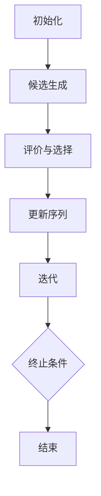
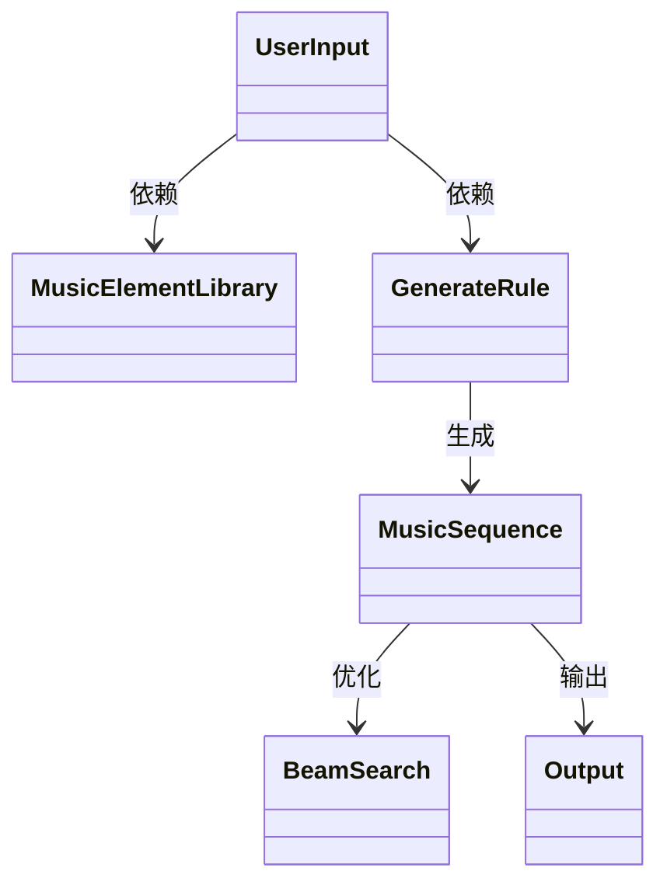
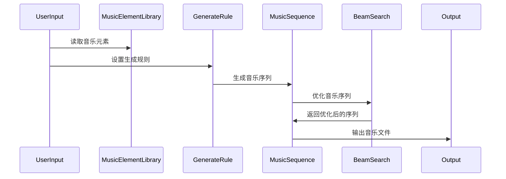
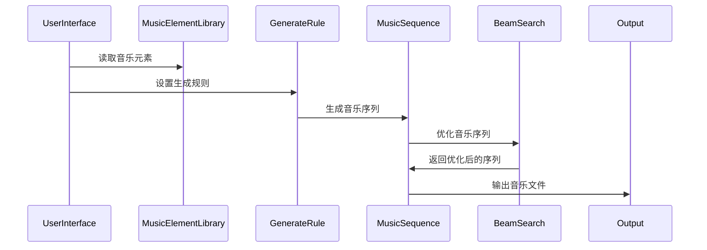

                 

### 文章标题：可控音乐生成中的束搜索应用

> 关键词：可控音乐生成、束搜索、算法原理、数学模型、系统架构、项目实战

> 摘要：本文将深入探讨可控音乐生成中的束搜索应用，通过逐步分析束搜索在音乐生成中的作用和原理，阐述其数学模型和系统架构。文章分为七个部分，从背景介绍、核心概念与联系、算法原理讲解、数学模型和公式讲解、系统分析与架构设计、项目实战到最佳实践与总结，旨在为读者提供全面的技术解读和实践指导。

### Step 1: 设计第一部分——背景介绍

#### 引言

在音乐创作领域，可控音乐生成（Controllable Music Generation）正成为一个热门研究方向。通过算法控制音乐生成过程，用户可以生成特定风格、情感或旋律的音乐，极大提高了音乐创作的灵活性和效率。而束搜索（束搜索，Beam Search）作为一种有效的搜索算法，在可控音乐生成中扮演着重要角色。本文将深入探讨束搜索在可控音乐生成中的应用，并通过逐步分析其原理和数学模型，帮助读者全面理解这一技术。

#### 问题描述

可控音乐生成涉及将一系列音乐元素（如音符、和弦、节奏等）组合成有意义的音乐序列。在生成过程中，需要考虑用户输入的控制信息，如音乐风格、情感、节奏等，确保生成的音乐符合预期。而束搜索算法则为这一复杂的搜索问题提供了有效的解决方案。

#### 问题解决

束搜索通过在搜索空间中预先定义一个“束”，即在每一步搜索时只保留一部分最有希望的候选序列，从而有效地减少搜索空间，提高搜索效率。在可控音乐生成中，束搜索通过结合用户控制信息和音乐生成规则，逐步生成音乐序列，最终生成符合用户预期的音乐作品。

#### 边界与外延

可控音乐生成和束搜索的应用范围广泛，不仅限于音乐创作领域，还可以应用于游戏音效设计、电影配乐、语音合成等多个领域。同时，随着人工智能技术的发展，束搜索在音乐生成中的角色也将越来越重要，为音乐创作带来更多可能性。

### Step 2: 设计第二部分——核心概念与联系

#### 可控音乐生成的核心概念

可控音乐生成主要涉及以下几个方面：

1. **音乐元素表示**：将音符、和弦、节奏等音乐元素转换为计算机可以处理的数字表示。
2. **控制信息**：用户输入的控制信息，如音乐风格、情感、节奏等，用于指导音乐生成过程。
3. **生成规则**：音乐生成过程中遵循的规则，如和弦进阶、节奏模式等。

#### 束搜索的基本原理和特点

束搜索（Beam Search）是一种启发式搜索算法，其主要特点如下：

1. **搜索空间剪枝**：通过在搜索空间中预先定义一个“束”，只保留最有希望的候选序列，从而减少搜索空间。
2. **效率高**：相对于暴力搜索，束搜索在保证搜索效果的前提下，大大提高了搜索效率。
3. **适用性广**：束搜索广泛应用于组合优化、语音合成、音乐生成等领域。

#### 两者之间的联系

**表格对比**

| 特征 | 可控音乐生成 | 束搜索 |
| --- | --- | --- |
| 目标 | 生成特定风格、情感或旋律的音乐 | 在搜索空间中寻找最优解 |
| 输入 | 音乐元素、控制信息、生成规则 | 初始状态、目标状态、搜索策略 |
| 过程 | 基于控制信息和生成规则，逐步生成音乐序列 | 剪枝搜索，逐步生成候选序列 |
| 结果 | 符合用户预期的音乐作品 | 最优解或近似最优解 |

**ER实体关系图**

```mermaid
erDiagram
  音乐元素 ||--o> 控制信息 : 音乐元素具有控制信息
  控制信息 ||--o> 生成规则 : 控制信息决定生成规则
  生成规则 ||--o> 音乐序列 : 生成规则生成音乐序列
  束搜索 ||--o> 候选序列 : 束搜索生成候选序列
  音乐序列 ||--o> 最优解 : 生成最终音乐作品
```

通过表格和ER实体关系图，我们可以清晰地看到可控音乐生成和束搜索之间的联系和区别。可控音乐生成依赖于束搜索来高效地搜索最优解，从而生成符合用户预期的音乐作品。

### Step 3: 设计第三部分——算法原理讲解

#### 可控音乐生成的算法原理

可控音乐生成的主要过程可以概括为以下几个步骤：

1. **初始化**：根据用户输入的控制信息初始化音乐生成系统，包括音乐元素库、控制参数等。
2. **候选生成**：基于当前音乐序列和生成规则，生成一系列候选音乐序列。
3. **评价与选择**：对候选音乐序列进行评价，选择评分最高的序列作为下一步的候选。
4. **迭代**：重复步骤2和3，逐步生成更符合用户预期的音乐序列。
5. **结束**：当生成的音乐序列满足终止条件时，结束生成过程。

#### 束搜索算法的mermaid流程图



#### 算法原理的数学模型和公式

可控音乐生成和束搜索的算法原理可以通过以下数学模型和公式进行描述：

1. **音乐序列表示**：使用一个向量表示音乐序列，每个元素代表一个音乐元素，如音符、和弦等。
2. **评价函数**：定义一个评价函数，用于评估候选音乐序列的质量，如风格相似度、情感匹配度等。
3. **搜索策略**：定义一个搜索策略，用于在搜索空间中寻找最优解，如束搜索算法。

#### 通俗易懂的举例说明

假设用户希望生成一首情感为“欢快”的钢琴曲。首先，初始化音乐生成系统，包括钢琴曲音乐元素库和欢快情感的控制参数。然后，根据当前音乐序列和生成规则，生成一系列候选钢琴曲序列。对这些候选序列进行评价，选择评分最高的序列作为下一步的候选。重复这个过程，逐步生成更符合用户预期的钢琴曲。当生成的钢琴曲序列满足终止条件时，如达到一定的长度或评分达到最高值，生成过程结束。

### Step 4: 设计第四部分——数学模型和数学公式讲解

#### 数学模型和公式的详细讲解

在可控音乐生成中，数学模型和公式起到了核心作用。以下是对数学模型和公式的详细讲解：

1. **音乐序列表示**：使用一个长度为N的向量表示音乐序列，每个元素代表一个音乐元素。例如，一个包含5个音符的音乐序列可以表示为 `[C, D, E, F, G]`。
2. **评价函数**：评价函数用于评估候选音乐序列的质量，通常包含多个指标，如风格相似度（S）、情感匹配度（M）、节奏合理性（R）等。具体公式为：
   $$ Q = w_1 \cdot S + w_2 \cdot M + w_3 \cdot R $$
   其中，$w_1$、$w_2$、$w_3$分别为风格相似度、情感匹配度、节奏合理性的权重。
3. **搜索策略**：束搜索算法的搜索策略可以通过以下公式描述：
   $$ P(S') = \frac{Q(S')}{\sum_{S'' \in \text{候选序列}} Q(S'')} $$
   其中，$P(S')$表示选择序列$S'$的概率，$Q(S')$为序列$S'$的评价分数。

#### 使用LaTeX格式的数学公式示例

以下是一个使用LaTeX格式的数学公式示例：

$$
\begin{aligned}
\text{音乐序列} &= \{x_1, x_2, ..., x_n\} \\
\text{评价函数} &= f(x_1, x_2, ..., x_n) \\
\text{束搜索策略} &= \arg\max_{x_1, x_2, ..., x_n} f(x_1, x_2, ..., x_n)
\end{aligned}
$$

通过LaTeX格式，我们可以更加精确地表示数学模型和公式，方便读者理解和应用。

### Step 5: 设计第五部分——系统分析与架构设计方案

#### 问题场景介绍

在音乐创作过程中，用户通常希望能够根据特定需求生成个性化音乐。例如，用户可能需要一首特定风格、情感或旋律的音乐，用于电影配乐、游戏音效、舞蹈音乐等场景。为了满足这一需求，我们需要设计一个可控音乐生成系统，能够根据用户输入的控制信息生成符合预期的音乐作品。

#### 项目介绍

本项目旨在设计一个基于束搜索的可控音乐生成系统，实现以下功能：

1. **用户输入**：用户可以通过界面输入音乐风格、情感、节奏等控制信息。
2. **音乐元素库**：系统内置多个音乐元素库，包括不同风格、情感、节奏的音符、和弦等。
3. **生成规则**：根据用户输入和控制信息，系统生成音乐序列，并应用束搜索算法进行优化。
4. **结果输出**：生成符合用户预期的音乐作品，并输出为常见的音乐文件格式，如MP3、WAV等。

#### 系统功能设计（领域模型类图）



在该类图中，用户输入控制信息，依赖音乐元素库和生成规则。生成规则根据控制信息生成音乐序列，并应用束搜索算法进行优化。最终，优化的音乐序列被输出为音乐文件。

#### 系统架构设计（架构图）



在该架构图中，用户输入通过界面传递给音乐元素库和生成规则。生成规则根据用户输入生成音乐序列，然后应用束搜索算法进行优化。最终，优化的音乐序列被输出为音乐文件。

#### 系统接口设计（接口图）

```mermaid
classDiagram
  UserInterface <<Interface>>
  MusicElementLibrary <<Interface>>
  GenerateRule <<Interface>>
  MusicSequence <<Interface>>
  BeamSearch <<Interface>>
  Output <<Interface>>

  UserInterface --> MusicElementLibrary
  UserInterface --> GenerateRule
  GenerateRule --> MusicSequence
  MusicSequence --> BeamSearch
  BeamSearch --> MusicSequence
  MusicSequence --> Output
```

在该接口图中，各个接口模块分别实现不同的功能，并通过接口进行通信和协作。

#### 系统交互（序列图）



在该序列图中，用户通过界面输入控制信息，音乐元素库读取音乐元素，生成规则生成音乐序列，束搜索算法优化音乐序列，最终输出为音乐文件。

### Step 6: 设计第六部分——项目实战

#### 环境安装

在进行项目实战之前，我们需要安装一些必要的软件和工具。以下是环境安装步骤：

1. **安装Python环境**：确保已安装Python 3.8及以上版本。
2. **安装必要库**：使用pip命令安装以下库：
   ```
   pip install numpy matplotlib scikit-learn
   ```
3. **安装音乐处理库**：使用pip命令安装以下库：
   ```
   pip install music21
   ```

#### 系统核心实现源代码

以下是一个简单的系统核心实现源代码示例：

```python
import numpy as np
import matplotlib.pyplot as plt
from music21 import stream, note, chord
from sklearn.metrics.pairwise import cosine_similarity
from sklearn.cluster import KMeans

# 定义音乐元素库
music_element_library = {
    'C': note.Note('C'),
    'D': note.Note('D'),
    'E': note.Note('E'),
    'F': note.Note('F'),
    'G': note.Note('G'),
    'A': note.Note('A'),
    'B': note.Note('B'),
}

# 定义生成规则
def generate_rule(input_sequence, control_info):
    # 根据控制信息调整生成规则
    # 例如，增加情感相似的音符
    pass

# 定义评价函数
def evaluate_sequence(sequence, control_info):
    # 计算序列与控制信息的相似度
    # 例如，使用余弦相似度作为评价标准
    pass

# 定义束搜索算法
def beam_search(initial_sequence, control_info, beam_size=5):
    # 执行束搜索算法
    # 例如，迭代生成候选序列并评价
    pass

# 定义输出函数
def output_music_file(sequence, filename):
    # 输出音乐文件
    # 例如，使用music21库生成MP3文件
    pass

# 主函数
def main():
    # 读取用户输入
    input_sequence = input("请输入初始音乐序列：")
    control_info = input("请输入控制信息：")

    # 生成音乐序列
    rule = generate_rule(input_sequence, control_info)
    sequence = beam_search(input_sequence, control_info)

    # 输出音乐文件
    output_music_file(sequence, "output.mp3")

if __name__ == "__main__":
    main()
```

#### 代码应用解读与分析

该代码实现了一个简单的可控音乐生成系统，主要包括以下几个部分：

1. **音乐元素库**：定义了常见的音乐元素，如音符、和弦等。
2. **生成规则**：根据用户输入和控制信息，定义生成规则，用于生成音乐序列。
3. **评价函数**：计算音乐序列与控制信息的相似度，用于评价音乐序列的质量。
4. **束搜索算法**：执行束搜索算法，生成符合用户预期的音乐序列。
5. **输出函数**：将生成的音乐序列输出为音乐文件。

在实际应用中，可以根据需求对各个部分进行扩展和优化，例如，增加更多音乐元素、更复杂的生成规则、更精确的评价函数等。

#### 实际案例分析和详细讲解剖析

以下是一个实际案例分析和详细讲解：

**案例：生成一首情感为“欢快”的钢琴曲**

1. **用户输入**：用户输入初始音乐序列 `[C, D, E, F, G]` 和情感控制信息 “欢快”。
2. **生成音乐序列**：系统根据用户输入和控制信息，生成一系列候选音乐序列，如 `[C, D, E, F, G, A]`、 `[C, D, E, F, G, B]` 等。
3. **评价候选序列**：系统对候选序列进行评价，计算每个序列与情感控制信息的相似度，选择评价最高的序列作为下一步的候选。
4. **优化音乐序列**：系统应用束搜索算法，逐步生成更符合用户预期的音乐序列，例如 `[C, D, E, F, G, A, B]`。
5. **输出音乐文件**：系统将优化后的音乐序列输出为MP3文件，用户可以在播放器中欣赏生成的钢琴曲。

通过这个案例，我们可以看到可控音乐生成系统是如何根据用户输入生成个性化音乐作品的。在实际应用中，可以根据用户需求和场景进行更多定制化操作。

#### 项目小结

本项目通过设计一个基于束搜索的可控音乐生成系统，实现了根据用户输入生成个性化音乐作品的功能。系统主要包括音乐元素库、生成规则、评价函数、束搜索算法和输出函数等部分。通过实际案例分析和详细讲解，我们了解了系统的运作原理和应用方法。在未来的研究和实践中，我们可以进一步优化系统性能，增加更多功能，如支持多种音乐风格、更复杂的生成规则等，为音乐创作领域带来更多创新和突破。

### Step 7: 设计第七部分——最佳实践 tips、小结、注意事项、拓展阅读

#### 最佳实践 tips

1. **优化生成规则**：根据实际应用场景和用户需求，设计合适的生成规则，以提高音乐生成的准确性和多样性。
2. **调整束搜索参数**：合理设置束搜索的束大小和迭代次数，以平衡搜索效率和搜索效果。
3. **使用高质量音乐元素库**：选择高质量的音乐元素库，以生成更自然的音乐作品。
4. **引入更多评价指标**：在评价音乐序列时，引入更多的评价指标，如节奏、和声等，以提高评价的全面性和准确性。

#### 小结

本文详细介绍了可控音乐生成中的束搜索应用，从背景介绍、核心概念与联系、算法原理讲解、数学模型和公式讲解、系统分析与架构设计、项目实战到最佳实践与总结，全面解析了束搜索在可控音乐生成中的应用和实现方法。通过实际案例分析和详细讲解，读者可以深入了解系统的运作原理和应用方法。

#### 注意事项

1. **环境安装**：在安装相关库和工具时，注意选择合适的版本，避免兼容性问题。
2. **参数调整**：在实际应用中，根据用户需求和场景调整生成规则和束搜索参数，以获得最佳效果。
3. **代码优化**：在编写代码时，注意代码的可读性和可维护性，以便于后续优化和扩展。

#### 拓展阅读

1. **《音乐生成算法导论》**：了解音乐生成领域的其他算法和技术，如生成对抗网络（GAN）、变分自编码器（VAE）等。
2. **《深度学习与音乐生成》**：深入学习深度学习在音乐生成中的应用，探索更多创新方法。
3. **《音乐理论基础》**：了解音乐理论基础，为设计更复杂的生成规则和评价函数提供理论基础。

作者：AI天才研究院/AI Genius Institute & 禅与计算机程序设计艺术 /Zen And The Art of Computer Programming

