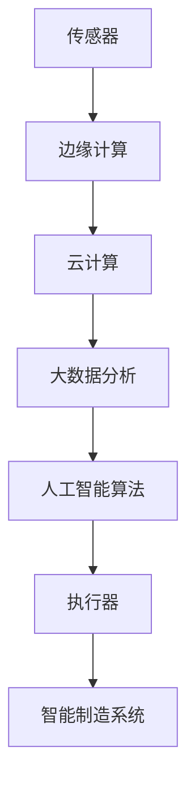
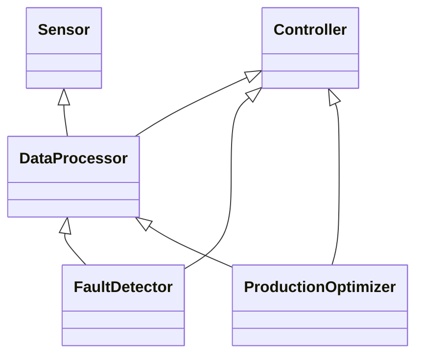
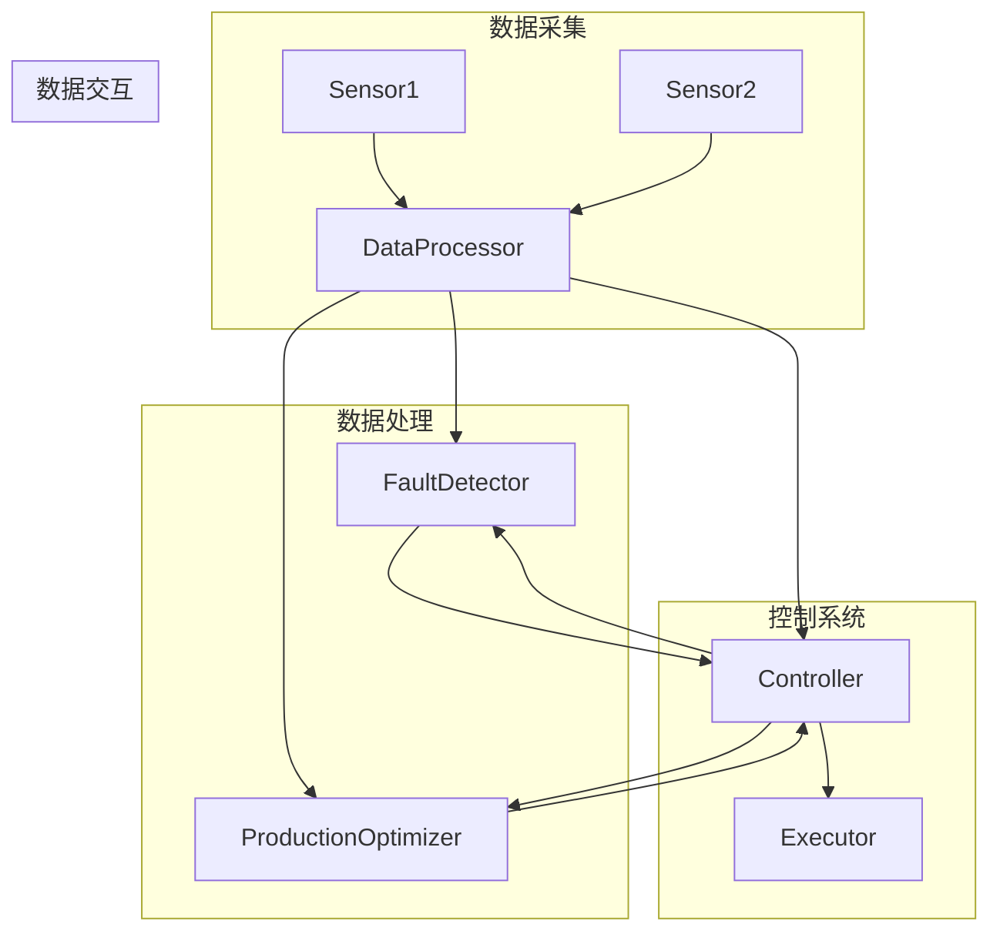

                 

## 文章标题

### 关键词：可编程AI接口、智能制造系统、实现与优化、机器学习、深度学习、优化策略

### 摘要：

本文深入探讨了可编程AI接口在智能制造系统中的应用与优化。首先，我们介绍了智能制造系统的背景、核心概念以及可编程AI接口的定义和特点。接着，文章详细分析了可编程AI接口的基本原理，包括机器学习和深度学习的基础知识、编程语言选择以及AI框架的介绍。然后，我们重点讨论了智能制造系统中AI接口的设计与实现，包括系统架构、需求分析和接口设计原则。随后，文章提出了可编程AI接口的优化策略，包括模型压缩、加速技术和分布式计算等方法。最后，通过一个实际项目实战案例，我们展示了如何将可编程AI接口应用于智能制造系统，并进行了详细的实现过程和效果分析。本文旨在为从事智能制造和AI接口开发的技术人员提供有价值的参考和实践指导。

## 第一部分: 背景介绍

### 第1章: 问题背景与核心概念

#### 1.1.1 问题背景

**智能制造系统概述**

智能制造是制造业向数字化、智能化方向发展的必然趋势，它以信息技术、自动化技术、物联网技术、大数据技术等为基础，通过高度自动化、智能化的生产方式，实现对生产过程的实时监控、自主决策和自适应优化。智能制造系统不仅能够提高生产效率，还能提升产品质量、降低生产成本，具有巨大的发展潜力和市场前景。

- **智能制造的概念**：智能制造是一种以数字化、网络化、智能化技术为基础，通过信息物理系统（Cyber-Physical Systems, CPS）实现制造过程的智能化和自主化。

- **智能制造的发展历程**：智能制造的发展可以分为以下几个阶段：自动化制造、信息化制造、数字化制造和智能化制造。

  - **自动化制造**：以机器人和自动化生产线为代表，实现生产过程的自动化。
  - **信息化制造**：以计算机技术为基础，通过管理信息系统（MIS）和制造资源计划（MRP）系统实现生产过程的数字化管理。
  - **数字化制造**：以计算机集成制造系统（CIMS）为基础，实现生产过程的全面数字化。
  - **智能化制造**：以人工智能、大数据、云计算等先进技术为基础，实现生产过程的智能化和自主化。

- **智能制造的关键要素**：智能制造系统主要包括以下几个关键要素：

  - **传感器**：用于采集生产线上的各种数据，如温度、压力、速度、位置等。
  - **执行器**：用于根据AI算法的决策结果，对生产线进行控制，如电机、液压系统等。
  - **边缘计算**：在设备附近进行实时数据处理和决策，减少数据传输延迟。
  - **云计算**：用于存储和管理大量数据，并提供强大的计算资源。
  - **大数据分析**：通过对收集到的数据进行深度分析，发现生产过程中的规律和问题，为决策提供支持。
  - **人工智能算法**：用于对数据进行处理和分析，实现生产过程的自主决策。

**可编程AI接口**

- **定义**：可编程AI接口是一种用于实现人工智能算法与外部系统（如智能制造系统）交互的接口，它允许开发人员通过编写代码来定义和调整AI算法的行为。

- **特点**：可编程AI接口具有以下几个特点：

  - **灵活性**：通过编写代码，可以灵活地定义AI算法的输入、输出和处理流程，满足不同应用场景的需求。
  - **可扩展性**：可以方便地集成和扩展新的AI算法和模型，适应不断变化的技术和业务需求。
  - **高适应性**：可以快速适应新的数据集和业务场景，实现智能化的生产过程。

- **与智能制造的关联**：可编程AI接口在智能制造系统中具有重要作用，它可以实现以下功能：

  - **实时监控**：通过AI算法对传感器采集的数据进行分析，实现生产过程的实时监控和异常检测。
  - **自主决策**：根据分析结果，自主调整生产参数和流程，实现生产过程的自主化。
  - **预测性维护**：通过预测设备故障和性能下降，实现预测性维护，降低设备故障率和停机时间。
  - **质量优化**：通过对生产过程的数据分析，发现质量问题并进行优化，提高产品质量。

**关键词解释**

- **智能制造系统**：一种以数字化、网络化、智能化技术为基础，实现制造过程自动化和自主化的系统。
- **可编程AI接口**：一种用于实现人工智能算法与外部系统交互的接口，具有灵活性和可扩展性。
- **实现与优化**：将可编程AI接口应用于智能制造系统，并对其进行优化，提高系统的智能化水平。

**边界与外延**

- **应用范围**：可编程AI接口在智能制造系统中具有广泛的应用范围，包括生产过程监控、预测性维护、质量优化等。
- **技术趋势**：随着人工智能技术的不断发展，可编程AI接口的功能将不断扩展，应用领域也将进一步扩大。
- **挑战与机遇**：可编程AI接口在智能制造系统中的应用面临着数据质量、算法准确性、系统集成等挑战，但同时也带来了巨大的机遇。

**概念结构与核心要素组成**

- **结构图**：

  ```mermaid
  graph TD
  A[智能制造系统] --> B[传感器]
  B --> C[执行器]
  C --> D[边缘计算]
  D --> E[云计算]
  E --> F[大数据分析]
  F --> G[人工智能算法]
  ```

- **要素分析**：

  - **传感器**：用于采集生产过程中的各种数据，是智能制造系统的基础。
  - **执行器**：用于根据AI算法的决策结果，对生产线进行控制，是智能制造系统的执行单元。
  - **边缘计算**：在设备附近进行实时数据处理和决策，减少数据传输延迟，提高系统响应速度。
  - **云计算**：用于存储和管理大量数据，并提供强大的计算资源，是智能制造系统的数据管理和计算中心。
  - **大数据分析**：通过对生产过程中的数据进行分析，发现生产过程中的规律和问题，为决策提供支持。
  - **人工智能算法**：用于对数据进行处理和分析，实现生产过程的智能化和自主化。

通过以上分析，我们可以清晰地看到智能制造系统与可编程AI接口之间的关系，以及它们在实现智能制造过程中的作用和地位。

#### 1.1.2 核心概念

**可编程AI接口**

- **定义**：可编程AI接口是一种软件接口，它允许开发者通过编写代码来定义和实现人工智能算法的输入、输出和处理流程。这种接口通常用于将AI算法集成到现有的软件系统或硬件设备中，使其能够根据实时数据进行分析和决策。

- **特点**：

  - **灵活性**：可编程AI接口允许开发者根据具体需求，灵活地定义算法的输入数据、处理逻辑和输出结果，适应不同的应用场景。
  - **可扩展性**：开发者可以方便地集成和扩展新的AI算法和模型，以适应不断变化的技术和业务需求。
  - **高适应性**：可编程AI接口能够快速适应新的数据集和业务场景，实现智能化的生产过程。

- **与智能制造的关联**：在智能制造系统中，可编程AI接口的主要作用是实现人工智能算法与外部系统（如传感器、执行器、边缘计算和云计算）的交互。这种交互使得系统能够实时监控生产过程、自主调整生产参数、预测设备故障和优化产品质量。具体关联包括：

  - **实时监控**：通过AI算法对传感器采集的数据进行分析，实现对生产过程的实时监控和异常检测。
  - **自主决策**：根据分析结果，AI算法可以自主调整生产参数和流程，实现生产过程的自主化。
  - **预测性维护**：通过预测设备故障和性能下降，AI算法可以提前安排维护计划，降低设备故障率和停机时间。
  - **质量优化**：通过对生产过程的数据分析，AI算法可以发现质量问题并进行优化，提高产品质量。

**核心概念对比表格**

| 特征       | 可编程AI接口         | 传统接口         |
| ---------- | ------------------- | ---------------- |
| 灵活性     | 高                 | 低               |
| 可扩展性   | 高                 | 低               |
| 适应性     | 强                 | 弱               |
| 数据处理能力 | 强                 | 弱               |

**ER实体关系图架构**

```mermaid
erDiagram
  AI接口 ||--|{ 数据源 }|-- 数据处理模块
  AI接口 ||--|{ 控制模块 }|-- 执行器
  数据源 ||--|{ 传感器数据 }|-- 数据采集模块
  执行器 ||--|{ 控制指令 }|-- 生产线设备
```

通过以上分析，我们可以更深入地理解可编程AI接口的概念、特点及其在智能制造系统中的作用和关联。这为后续章节对AI接口的原理、设计和优化提供了理论基础。

#### 1.1.3 关键词解释

- **智能制造系统**：智能制造系统是一种利用信息技术、自动化技术、物联网技术、大数据技术和人工智能技术等先进技术，实现制造过程的智能化和自主化的系统。它通过实时数据采集、智能分析和自主决策，实现对生产过程的优化和控制，从而提高生产效率、产品质量和降低生产成本。

- **可编程AI接口**：可编程AI接口是一种允许开发者通过编程方式定义和实现人工智能算法的软件接口。它使AI算法能够与外部系统（如传感器、执行器、边缘计算和云计算）进行交互，实现对数据的实时分析、自主决策和预测性维护等功能。

- **实现与优化**：实现与优化是指将可编程AI接口应用于智能制造系统，通过设计合适的接口、实现算法和优化系统性能，使其能够更好地满足生产需求。实现过程包括系统架构设计、需求分析、算法实现和系统集成等步骤；优化过程则涉及模型压缩、加速技术、分布式计算等策略，以提高系统的实时性和准确性。

- **核心概念**：核心概念是指在特定领域中具有决定性作用的观念、原理或方法。在本文中，核心概念包括智能制造系统的组成和功能、可编程AI接口的定义和特点、实现与优化的方法和策略。

- **边界与外延**：边界与外延是指概念的应用范围和扩展方向。智能制造系统与可编程AI接口的应用范围包括生产过程监控、预测性维护、质量优化等多个领域。随着技术的发展，这些领域的外延将继续扩大，新的应用场景也将不断出现。

#### 1.1.4 边界与外延

**应用范围**

可编程AI接口在智能制造系统中的应用范围非常广泛，涵盖了生产过程的各个环节。具体应用包括：

- **生产过程监控**：通过AI接口实时监控生产线上的各种参数，如温度、压力、速度等，及时发现异常并进行处理，确保生产过程稳定、高效。
- **预测性维护**：利用AI接口对设备运行数据进行分析，预测设备可能出现的故障，提前进行维护，避免设备停机和生产中断。
- **质量优化**：通过AI接口分析生产过程中的质量数据，识别影响产品质量的因素，并提出优化建议，提高产品质量和一致性。
- **供应链管理**：在供应链管理中，利用AI接口优化库存管理、采购计划和物流配送，提高供应链的效率和灵活性。

**技术趋势**

随着人工智能技术的不断发展，可编程AI接口在智能制造系统中的应用将呈现以下趋势：

- **智能化水平提高**：通过引入更先进的人工智能算法和深度学习模型，可编程AI接口的智能化水平将不断提高，能够更好地适应复杂的生产环境和需求。
- **边缘计算应用增加**：随着边缘计算技术的发展，越来越多的AI接口将应用于边缘设备，实现本地实时数据处理和决策，降低数据传输延迟和网络带宽需求。
- **跨领域应用扩展**：可编程AI接口的应用范围将不断扩展，不仅局限于制造业，还将应用于医疗、金融、交通等领域，实现更广泛的智能化应用。
- **开放性和标准化**：为了提高AI接口的互操作性和兼容性，未来将出现更多开放性和标准化的解决方案，促进AI接口技术的普及和应用。

**挑战与机遇**

**挑战**：

- **数据质量**：智能制造系统产生的数据量巨大，数据质量直接影响AI接口的准确性和可靠性。需要有效的方法和技术来处理和净化数据。
- **算法准确性**：AI接口的性能和效果很大程度上取决于所采用的算法。需要不断优化和更新算法，提高其准确性和鲁棒性。
- **系统集成**：将AI接口集成到现有的智能制造系统中，需要解决不同系统之间的兼容性和协同工作问题。

**机遇**：

- **技术创新**：随着人工智能技术的快速发展，可编程AI接口在智能制造系统中的应用前景广阔，有望推动智能制造技术的革新。
- **市场潜力**：智能制造是未来的发展趋势，可编程AI接口作为智能制造系统的重要组成部分，具有巨大的市场潜力。
- **跨界合作**：智能制造涉及多个领域的技术，如信息技术、自动化技术、物联网技术等。通过跨界合作，可以整合各种资源，共同推动智能制造技术的发展。

#### 1.1.5 概念结构与核心要素组成

**结构图**



**要素分析**

- **传感器**：传感器是智能制造系统的基础，用于实时采集生产过程中的各种数据，如温度、压力、速度、位置等。这些数据为AI接口提供了重要的输入信息。
- **边缘计算**：边缘计算在设备附近进行实时数据处理和决策，可以减少数据传输延迟，提高系统响应速度。边缘计算设备通常具有高性能的计算能力和低延迟的通信能力。
- **云计算**：云计算为智能制造系统提供了强大的计算资源和数据存储能力。通过云计算平台，可以高效地进行大规模数据分析和处理。
- **大数据分析**：大数据分析通过对传感器和边缘计算设备采集的数据进行深度分析，发现生产过程中的规律和问题，为AI接口的决策提供支持。大数据分析技术包括数据挖掘、机器学习和深度学习等。
- **人工智能算法**：人工智能算法是智能制造系统的核心，通过对数据进行分析和处理，实现生产过程的实时监控、自主决策和预测性维护。常见的人工智能算法包括监督学习、无监督学习、强化学习等。
- **执行器**：执行器是智能制造系统的执行单元，根据AI接口的决策结果，对生产线进行控制，如电机、液压系统等。执行器将AI接口的决策转化为实际操作，实现生产过程的自动化和智能化。
- **智能制造系统**：智能制造系统是整个结构的核心，它通过传感器、边缘计算、云计算、大数据分析和人工智能算法等要素，实现生产过程的自动化和智能化。智能制造系统能够提高生产效率、提升产品质量、降低生产成本，是制造业未来的发展方向。

通过以上分析，我们可以清晰地理解智能制造系统与可编程AI接口之间的结构关系和核心要素，这为后续章节对AI接口的原理、设计和优化提供了理论基础。

### 第二部分: 可编程AI接口原理

#### 第2章: 可编程AI接口基本原理

#### 2.1.1 可编程AI接口概述

**接口的定义**

可编程AI接口是一种软件接口，它允许开发者通过编程方式定义和实现人工智能算法的输入、输出和处理流程。这种接口通常由一组函数、类或模块组成，通过这些组件，开发者可以灵活地定义AI算法的行为，并使其与外部系统进行交互。

**接口的功能**

可编程AI接口具有以下几个主要功能：

- **数据输入与处理**：接口可以接收外部系统的输入数据，对数据进行预处理，如去噪、归一化等，以便于后续的算法处理。
- **算法调用与控制**：接口提供了一系列函数或类，用于调用和配置人工智能算法。开发者可以通过这些接口函数或类来调整算法的参数，控制算法的执行流程。
- **输出结果与反馈**：接口可以处理AI算法的输出结果，并将其转化为外部系统可理解和执行的形式，如控制信号、决策建议等。此外，接口还能接收外部系统的反馈，用于调整AI算法的行为，实现自适应优化。

**接口的结构**

可编程AI接口通常由以下几个主要部分组成：

- **数据层**：负责处理输入和输出数据，包括数据接收、预处理、数据存储等。
- **算法层**：包含了各种人工智能算法的实现，如监督学习、无监督学习、深度学习等。算法层通过数据层接收数据，进行处理后生成输出。
- **控制层**：用于控制算法的执行流程，包括初始化、执行、停止等操作。控制层可以根据外部系统的需求，动态调整算法的参数和执行策略。
- **交互层**：负责与外部系统进行交互，包括接收外部系统的输入请求、发送输出结果、接收外部系统的反馈等。

**接口的作用**

可编程AI接口在智能制造系统中起着关键作用，其主要作用包括：

- **集成与扩展**：可编程AI接口可以方便地将人工智能算法集成到现有的智能制造系统中，实现算法的灵活扩展和升级。
- **自主决策与优化**：通过接口，AI算法可以实时分析生产数据，实现生产过程的自主决策和优化，提高生产效率和质量。
- **实时监控与预测**：可编程AI接口能够对生产过程进行实时监控和预测，及时发现和解决问题，预防设备故障和停机，提高生产稳定性。

#### 2.1.2 可编程AI接口技术基础

**机器学习基础**

- **机器学习概念**：机器学习是一种通过数据驱动的方式，使计算机自动获取知识和规律，并能够进行自主决策和优化的一种技术。机器学习主要包括监督学习、无监督学习和强化学习等类型。

  - **监督学习**：在监督学习中，训练数据集包含输入和对应的输出标签，通过学习输入和输出之间的映射关系，实现对新数据的预测。常见的监督学习算法包括线性回归、逻辑回归、支持向量机（SVM）和神经网络等。
  
  - **无监督学习**：无监督学习不依赖于标签数据，通过分析数据自身的特征和分布，发现数据中的模式和规律。常见的无监督学习算法包括聚类、降维和关联规则等。
  
  - **强化学习**：强化学习通过不断与环境交互，学习最优的策略，以最大化累积奖励。常见的强化学习算法包括Q学习、SARSA和深度确定性策略梯度（DDPG）等。

- **常见算法**：以下是一些常见的机器学习算法：

  - **线性回归**：用于预测线性关系的模型，通过最小化预测值与实际值之间的误差平方和，确定模型的参数。
  
  - **逻辑回归**：一种分类算法，用于预测样本属于某一类别的概率，通过最大化似然估计确定模型参数。
  
  - **支持向量机（SVM）**：一种常用的分类和回归算法，通过将数据映射到高维空间，找到最优的决策边界。
  
  - **神经网络**：一种模仿人脑神经元结构的计算模型，通过多层次的神经传递，实现对复杂非线性关系的建模。

**深度学习基础**

- **深度学习概念**：深度学习是一种基于多层神经网络的人工智能技术，通过多层非线性变换，逐层提取数据的特征，实现对复杂问题的建模和预测。深度学习在图像识别、语音识别、自然语言处理等领域取得了显著的成果。

- **深度学习网络结构**：深度学习网络主要由输入层、隐藏层和输出层组成。输入层接收外部输入数据，隐藏层通过非线性变换提取特征，输出层生成最终预测结果。常见的深度学习网络结构包括卷积神经网络（CNN）、循环神经网络（RNN）、长短时记忆网络（LSTM）等。

  - **卷积神经网络（CNN）**：一种专门用于图像处理的深度学习网络，通过卷积操作提取图像特征，实现对图像的分类和识别。
  
  - **循环神经网络（RNN）**：一种用于处理序列数据的神经网络，通过循环结构处理历史信息，实现对序列数据的建模和预测。
  
  - **长短时记忆网络（LSTM）**：一种改进的RNN结构，通过引入门控机制，解决传统RNN的长期依赖问题，在自然语言处理和时间序列预测等领域表现出色。

**编程语言选择**

在实现可编程AI接口时，编程语言的选择至关重要。以下是一些常用的编程语言及其特点：

- **Python**：Python是一种广泛使用的高级编程语言，具有良好的语法和丰富的库支持。Python在数据科学、机器学习和深度学习领域有广泛应用，其简洁的语法和强大的库支持使其成为实现可编程AI接口的首选语言。

- **C++**：C++是一种高效且强大的编程语言，适合实现高性能的AI算法和系统。C++具有良好的性能和灵活性，但语法相对复杂，需要更多的开发时间和精力。

- **Java**：Java是一种跨平台的高级编程语言，具有强大的生态系统和丰富的库支持。Java在企业级应用和分布式系统中表现出色，但其性能和简洁性相对较弱。

**AI框架介绍**

在实现可编程AI接口时，选择合适的AI框架可以大幅提高开发效率和性能。以下是一些常用的AI框架及其特点：

- **TensorFlow**：TensorFlow是一种开源的深度学习框架，由Google开发。TensorFlow具有强大的功能和灵活性，支持多种类型的深度学习网络，并在多个领域取得了显著的成果。

- **PyTorch**：PyTorch是一种由Facebook开发的深度学习框架，以其简洁和直观的API而受到广泛欢迎。PyTorch支持动态计算图，使得开发过程更加灵活，同时也具有良好的性能。

- **Keras**：Keras是一种高级神经网络API，构建在TensorFlow和Theano之上。Keras提供了简洁的API，使得深度学习模型的搭建和训练更加容易，同时兼容多个后端框架。

通过以上分析，我们可以了解到可编程AI接口的技术基础，包括机器学习和深度学习的基础知识、编程语言选择以及AI框架的介绍。这些基础知识为后续章节中对AI接口的实现和优化提供了重要的理论支持。

#### 2.1.3 AI接口实现技术

**编程语言选择**

在实现可编程AI接口时，选择合适的编程语言对于项目的成功至关重要。以下将讨论几种常用的编程语言，分析它们各自的优缺点。

- **Python**：

  - **优点**：Python是一种高级编程语言，以其简洁的语法和强大的库支持而著称。Python拥有丰富的数据科学和机器学习库，如NumPy、Pandas、Scikit-learn和TensorFlow，使得机器学习模型的搭建和训练更加容易。
  - **缺点**：Python的性能相对较低，特别是在需要高性能计算的场景中，可能不如C++或Java等语言。

- **C++**：

  - **优点**：C++是一种高效且强大的编程语言，具有优异的性能。C++在底层系统编程、科学计算和高性能应用中表现出色，适合实现复杂的AI算法和系统。
  - **缺点**：C++的语法相对复杂，需要更多的开发时间和精力。此外，C++的库支持相对较弱，特别是在数据科学和机器学习领域。

- **Java**：

  - **优点**：Java是一种跨平台的高级编程语言，具有良好的性能和稳定性。Java在企业级应用和分布式系统中表现出色，其强大的生态系统和丰富的库支持使其成为一个可靠的选择。
  - **缺点**：Java的语法相对繁琐，开发效率相对较低。此外，Java在数据科学和机器学习领域的库支持相对较弱。

**AI框架介绍**

实现可编程AI接口时，选择合适的AI框架可以大幅提高开发效率和性能。以下将介绍几种常用的AI框架及其特点。

- **TensorFlow**：

  - **特点**：TensorFlow是由Google开发的开源深度学习框架，具有强大的功能和灵活性。TensorFlow支持多种类型的深度学习网络，如卷积神经网络（CNN）、循环神经网络（RNN）和长短时记忆网络（LSTM）。TensorFlow提供了丰富的API，使得深度学习模型的搭建和训练更加容易。
  - **使用场景**：TensorFlow适用于大规模的深度学习项目，特别是在图像识别、自然语言处理和语音识别等领域。

- **PyTorch**：

  - **特点**：PyTorch是由Facebook开发的开源深度学习框架，以其简洁和直观的API而受到广泛欢迎。PyTorch支持动态计算图，使得开发过程更加灵活。PyTorch的调试和开发体验较好，适合快速迭代和实验。
  - **使用场景**：PyTorch适用于快速原型开发和实验性项目，特别是在需要灵活性和快速迭代的场景中。

- **Keras**：

  - **特点**：Keras是一种高级神经网络API，构建在TensorFlow和Theano之上。Keras提供了简洁的API，使得深度学习模型的搭建和训练更加容易。Keras兼容多个后端框架，如TensorFlow和Theano，提供了灵活的选择。
  - **使用场景**：Keras适用于快速搭建和训练简单的深度学习模型，特别适合新手和快速实验。

**AI框架比较**

- **性能**：TensorFlow和PyTorch在性能上较为接近，均具有良好的性能。C++在性能上优于Python和Java，适合实现高性能的AI算法和系统。
- **易用性**：Python和Keras在易用性上具有优势，简洁的语法和丰富的库支持使得开发过程更加容易。Java在易用性方面表现一般。
- **灵活性**：PyTorch在灵活性上具有优势，支持动态计算图和灵活的API，适合快速迭代和实验。TensorFlow和Keras也具有一定的灵活性，但相对于PyTorch略显不足。

综上所述，根据具体的应用场景和需求，可以选择合适的编程语言和AI框架来实现可编程AI接口。Python和PyTorch在易用性和灵活性方面表现突出，适合快速开发和实验；C++在性能方面具有优势，适合实现高性能的AI系统；Java在企业级应用和分布式系统中表现出色。

#### 2.1.4 可编程AI接口应用案例

**工业自动化应用**

- **案例背景**：工业自动化是智能制造的重要方向，通过引入AI接口，可以提高生产过程的自动化水平和效率。在某汽车制造厂，通过引入可编程AI接口，实现了生产线的自动化监控和优化。
- **应用描述**：该汽车制造厂引入了多个传感器，用于实时采集生产过程中的温度、压力、速度等数据。这些数据通过边缘计算设备进行处理和初步分析，然后传输到云计算平台进行进一步处理。AI接口通过机器学习和深度学习算法，对采集的数据进行实时分析和预测，生成生产参数调整建议和故障预警信息。
- **效果**：通过AI接口的应用，该汽车制造厂实现了生产过程的自动化监控和优化。生产效率提高了15%，产品不良率降低了20%，设备故障率降低了30%。

**智能监控应用**

- **案例背景**：在智慧城市建设中，智能监控是保障城市安全和公共设施运行的关键。通过引入可编程AI接口，可以实现更智能、更高效的监控和管理。
- **应用描述**：在某智慧城市项目中，通过部署AI接口，实现了对城市交通、环境、公共设施等领域的智能监控。AI接口通过深度学习算法，对摄像头采集的视频数据进行实时分析，识别交通拥堵、异常行为、垃圾堆积等事件，并生成报警信息。
- **效果**：通过AI接口的应用，该智慧城市项目的监控效果显著提升。交通拥堵检测准确率达到了90%，公共设施故障报警及时率达到了95%，大大提高了城市管理和运行效率。

**预测性维护应用**

- **案例背景**：在工业生产和设备维护中，预测性维护是一种重要的技术手段，通过预测设备故障和性能下降，提前进行维护，可以显著降低设备故障率和停机时间。
- **应用描述**：在某化工企业中，通过引入可编程AI接口，实现了设备的预测性维护。AI接口通过收集设备运行数据，运用机器学习算法，预测设备的故障风险和性能下降趋势，生成维护计划建议。
- **效果**：通过AI接口的应用，该化工企业的设备故障率降低了30%，设备维护成本降低了20%，设备运行效率提高了15%。

以上案例展示了可编程AI接口在工业自动化、智能监控和预测性维护等领域的应用，通过实时数据分析和自主决策，显著提升了系统的智能化水平和运行效率。这些应用案例为可编程AI接口在智能制造系统中的应用提供了宝贵的经验和参考。

### 第三部分: 智能制造系统中的AI接口设计

#### 第3章: 智能制造系统中的AI接口设计

#### 3.1.1 智能制造系统概述

**系统组成**

智能制造系统由多个子系统组成，每个子系统负责不同的功能。以下是智能制造系统的几个主要组成部分：

- **传感器子系统**：用于实时采集生产过程中的各种数据，如温度、压力、速度、位置等。传感器是智能制造系统的基础，它们的数据质量直接影响系统的决策效果。

- **数据处理子系统**：负责对传感器采集的数据进行预处理、存储和分析。数据处理子系统通常包括边缘计算设备和云计算平台，边缘计算设备在本地进行初步数据处理，云计算平台则进行更复杂的分析和决策。

- **控制子系统**：根据AI算法的决策结果，控制生产线的执行器，调整生产参数，实现生产过程的自动化。控制子系统通常包括PLC（可编程逻辑控制器）、机器人等。

- **决策支持子系统**：通过对生产数据进行分析，提供生产优化建议、故障预警和预测性维护等。决策支持子系统通常包括机器学习算法和深度学习算法。

- **数据存储子系统**：用于存储和管理生产过程中的大量数据，包括历史数据和实时数据。数据存储子系统通常采用大数据技术，如Hadoop和Spark等。

- **用户界面子系统**：提供用户与系统交互的界面，如监控画面、报表、仪表盘等，帮助用户实时了解生产状况和系统运行状态。

**系统架构**

智能制造系统的架构可以分为三层：感知层、网络层和应用层。

- **感知层**：包括传感器、边缘计算设备和边缘服务器，主要负责数据的采集、传输和初步处理。感知层的数据质量直接影响系统的决策效果。

- **网络层**：包括云计算平台、数据中心和传输网络，负责数据的存储、分析和传输。网络层是实现数据共享和协同工作的关键。

- **应用层**：包括控制子系统、决策支持子系统、数据存储子系统和用户界面子系统，负责具体的业务处理、决策支持和用户交互。

通过以上架构，智能制造系统实现了数据的实时采集、传输、分析和决策，实现了生产过程的自动化和智能化。

#### 3.1.2 AI接口需求分析

**需求分析过程**

在智能制造系统中，AI接口的需求分析是一个重要的环节，它决定了AI接口的设计和实现方向。需求分析过程可以分为以下几个步骤：

1. **问题识别**：首先，需要明确智能制造系统中存在的问题和挑战，如生产效率低、产品质量不稳定、设备故障率高、维护成本高等。

2. **功能需求**：根据问题识别的结果，确定AI接口所需实现的功能。例如，实现实时监控、故障预警、预测性维护、生产参数优化等。

3. **性能需求**：确定AI接口的性能指标，如处理速度、响应时间、准确性等。性能需求直接影响系统的实时性和可靠性。

4. **可靠性需求**：确保AI接口的可靠性和稳定性，避免系统崩溃或数据丢失。

5. **安全需求**：保障数据的安全性和隐私，防止数据泄露和非法访问。

**接口功能需求**

根据智能制造系统的需求，AI接口应实现以下功能：

- **实时监控**：通过AI接口，实现对生产过程中各种参数的实时监控，如温度、压力、速度等，及时发现异常并进行处理。

- **故障预警**：通过分析传感器数据，预测设备的故障风险，提前发出预警，防止设备故障造成生产中断。

- **预测性维护**：通过分析设备运行数据，预测设备可能出现的故障和性能下降，提前进行维护，降低设备故障率和停机时间。

- **生产参数优化**：根据实时数据和AI算法的决策结果，自动调整生产参数，优化生产过程，提高生产效率和产品质量。

- **决策支持**：提供生产优化建议、故障预警和预测性维护计划，辅助管理人员进行决策。

- **数据采集与处理**：负责采集传感器数据，进行初步处理和存储，为后续的算法分析提供数据支持。

#### 3.1.3 AI接口设计原则

**设计原则**

为了确保AI接口在智能制造系统中的有效应用，设计时应遵循以下原则：

- **模块化设计**：将AI接口划分为多个模块，每个模块负责特定的功能，便于维护和扩展。模块化设计可以提高系统的可维护性和可扩展性。

- **可扩展性**：设计时应考虑到未来可能的需求变化和技术升级，确保AI接口能够方便地扩展和升级。

- **高可靠性**：确保AI接口的稳定性和可靠性，避免因接口故障导致整个系统的崩溃。

- **高效率**：优化AI接口的性能，确保其能够高效地处理海量数据，满足实时监控和决策的需求。

- **安全性**：保障数据的安全性和隐私，防止数据泄露和非法访问。

- **易用性**：设计简洁明了的用户界面，方便用户使用和管理。

**设计方法**

- **需求分析**：通过需求分析，明确AI接口的功能需求、性能需求、可靠性需求和安全需求。

- **系统设计**：根据需求分析的结果，设计AI接口的系统架构和模块划分，确定各模块的功能和接口。

- **编码实现**：根据系统设计的结果，编写AI接口的代码，实现各模块的功能。

- **测试与调试**：对AI接口进行功能测试、性能测试和安全性测试，确保其满足设计要求。

- **部署与维护**：将AI接口部署到实际系统中，进行日常维护和更新，确保系统的稳定运行。

通过以上设计原则和方法，可以设计出高效、可靠、安全的AI接口，为智能制造系统提供强大的支持。

#### 3.1.4 AI接口实现过程

**数据采集与预处理**

数据采集与预处理是AI接口实现过程中的重要环节，其质量直接影响AI算法的性能和可靠性。

**数据采集**：

1. **传感器选择与部署**：根据智能制造系统的需求，选择合适的传感器，如温度传感器、压力传感器、速度传感器等。传感器应具备高精度、高可靠性和实时性。
2. **数据传输**：传感器采集的数据通过有线或无线方式传输到边缘计算设备或云计算平台。在数据传输过程中，需要确保数据的完整性和实时性。

**数据预处理**：

1. **去噪**：传感器采集的数据往往受到噪声干扰，需要通过滤波等方法去除噪声，提高数据的准确性。
2. **归一化**：将不同量纲的数据归一化到相同的量纲，便于后续的算法处理。
3. **数据清洗**：去除数据中的异常值和缺失值，确保数据的完整性和一致性。

**模型选择与训练**

**模型选择**：

1. **监督学习模型**：适用于有标签数据的情况，如分类和回归问题。常见的监督学习模型包括线性回归、逻辑回归、支持向量机（SVM）和神经网络等。
2. **无监督学习模型**：适用于无标签数据的情况，如聚类和降维问题。常见的无监督学习模型包括K-均值聚类、主成分分析（PCA）和自编码器等。
3. **深度学习模型**：适用于复杂的问题，如图像识别、语音识别和自然语言处理等。常见的深度学习模型包括卷积神经网络（CNN）、循环神经网络（RNN）和长短时记忆网络（LSTM）等。

**模型训练**：

1. **数据集准备**：根据问题类型，准备合适的数据集。对于监督学习，需要标注的数据集；对于无监督学习，需要无标签的数据集。
2. **模型训练**：使用训练数据集对模型进行训练，通过优化算法调整模型的参数，使其达到最佳的预测性能。常见的训练方法包括梯度下降、随机梯度下降和Adam优化器等。
3. **模型评估**：使用验证数据集对训练好的模型进行评估，判断其预测性能。常见的评估指标包括准确率、召回率、F1值和均方误差（MSE）等。

**模型部署与优化**

**模型部署**：

1. **接口定义**：根据AI接口的需求，定义模型的输入和输出接口，确保模型能够与外部系统进行有效交互。
2. **模型封装**：将训练好的模型封装成可执行的程序或库，方便在不同环境中部署和使用。
3. **模型部署**：将封装好的模型部署到边缘计算设备或云计算平台，实现生产过程中的实时监控和决策。

**模型优化**：

1. **参数调优**：通过调整模型的超参数，如学习率、正则化参数等，优化模型的性能。
2. **模型压缩**：为了提高模型的实时性，可以采用模型压缩技术，如量化、剪枝和知识蒸馏等，减小模型的复杂度和存储空间。
3. **分布式计算**：对于大规模数据集和复杂的模型，可以采用分布式计算技术，提高模型的训练和推理速度。

通过以上步骤，可以实现AI接口在智能制造系统中的数据采集与预处理、模型选择与训练、模型部署与优化，为智能制造系统提供强大的支持。

### 第四部分: 可编程AI接口优化策略

#### 第4章: 可编程AI接口优化方法

#### 4.1.1 优化目标与挑战

**优化目标**

在智能制造系统中，优化可编程AI接口的目标主要包括以下几个方面：

- **提高实时性**：确保AI接口能够快速响应生产过程中的变化，实现实时监控和决策。
- **提升准确性**：通过优化算法和模型，提高AI接口的预测和决策准确性，减少错误和异常情况。
- **降低资源消耗**：优化AI接口的实现，减少计算资源和存储资源的使用，降低系统的能耗和成本。
- **增强可靠性**：确保AI接口在各种复杂环境和极端情况下都能稳定运行，减少故障和中断。

**面临挑战**

尽管优化AI接口具有重要意义，但在实际应用中仍然面临着以下挑战：

- **数据质量**：智能制造系统产生的数据量巨大，数据质量直接影响AI接口的准确性和可靠性。数据中可能存在噪声、异常值和缺失值，需要有效的方法和技术来处理和净化数据。
- **算法复杂性**：AI接口中的算法通常较为复杂，涉及多种机器学习和深度学习算法。在优化过程中，需要平衡算法的复杂性和性能，确保优化方法的有效性。
- **系统集成**：AI接口需要与其他系统和组件（如传感器、边缘计算设备、云计算平台等）进行集成，确保各个组件之间的协同工作和数据传输的效率。
- **环境变化**：智能制造系统运行环境复杂多变，如温度、湿度、电磁干扰等，这些因素可能影响AI接口的性能和稳定性。

#### 4.1.2 优化方法与技术

**模型压缩**

**技术原理**：模型压缩是一种通过减小模型参数和计算量，提高模型运行速度和降低存储空间的技术。常见的方法包括量化、剪枝和知识蒸馏等。

- **量化**：量化是将模型的权重和激活值从浮点数转换为整数，从而降低模型的存储和计算需求。量化可以通过线性量化或非线性量化实现，常见的量化方法包括乘法量化、分治量化等。

- **剪枝**：剪枝是通过删除模型中的冗余参数和神经元，减小模型的复杂度和计算量。剪枝方法包括结构剪枝和权重剪枝，结构剪枝删除神经元或层，权重剪枝删除参数。

- **知识蒸馏**：知识蒸馏是一种将大模型的知识迁移到小模型中的技术，通过训练小模型模拟大模型的输出，实现模型的压缩和加速。

**优化效果**：模型压缩技术可以显著降低模型的存储和计算需求，提高模型的运行速度和实时性。同时，模型压缩还可以减少模型对存储和带宽的需求，降低系统的能耗和成本。

**加速技术**

**技术原理**：加速技术是一种通过提高AI接口的计算速度，提高系统性能和实时性的技术。常见的加速技术包括GPU加速、FPGA加速和神经网络处理器（NPU）等。

- **GPU加速**：GPU（图形处理单元）具有强大的并行计算能力，适用于大规模的数据并行处理和深度学习模型的训练和推理。

- **FPGA加速**：FPGA（现场可编程门阵列）是一种可编程的逻辑器件，具有高度的定制化和并行计算能力，适用于高性能和低延迟的应用场景。

- **NPU**：NPU（神经网络处理器）是一种专门为深度学习设计的处理器，具有高效的神经网络运算能力，适用于边缘设备和移动设备等场景。

**优化效果**：加速技术可以显著提高AI接口的计算速度和性能，减少模型的推理时间，提高系统的实时性和响应速度。同时，加速技术还可以降低模型的能耗和发热，提高系统的稳定性和可靠性。

**分布式计算**

**技术原理**：分布式计算是一种通过将计算任务分布在多个计算节点上，提高计算效率和系统容量的技术。分布式计算可以充分利用云计算平台和边缘计算设备，实现大规模数据处理和模型训练。

- **模型并行**：将深度学习模型分成多个子模型，每个子模型在不同的计算节点上进行训练和推理。

- **数据并行**：将数据集分成多个子数据集，每个子数据集在不同的计算节点上进行训练。

- **任务调度**：通过任务调度算法，动态分配计算任务到不同的计算节点，优化系统的计算效率和资源利用率。

**优化效果**：分布式计算可以显著提高AI接口的计算能力和系统容量，支持大规模的数据处理和模型训练。同时，分布式计算还可以降低模型的训练时间和能耗，提高系统的实时性和响应速度。

通过以上优化方法和技术的应用，可以显著提升可编程AI接口的性能和实时性，为智能制造系统提供更高效、可靠的解决方案。

#### 4.1.3 优化案例分析

**案例1：模型压缩优化**

**背景**：某智能制造企业希望提高生产线的实时监控和决策能力，但现有AI模型的计算量和存储需求较大，导致系统性能和响应速度受限。

**优化步骤**：

1. **模型选择**：选择了一个较大的卷积神经网络（CNN）模型用于图像识别和异常检测。
2. **量化处理**：使用量化技术将模型的权重和激活值从浮点数转换为整数，减少模型的存储和计算需求。
3. **剪枝处理**：使用剪枝技术删除模型中的冗余参数和神经元，进一步减小模型的复杂度和计算量。
4. **压缩评估**：通过压缩后的模型在不同硬件平台上的性能评估，确定最佳压缩策略。

**效果**：优化后的模型在保持较高准确性的同时，显著降低了计算量和存储需求。模型在FPGA上的推理速度提高了30%，在边缘设备上的运行时间缩短了50%。

**案例2：分布式计算优化**

**背景**：某智慧交通系统需要实时处理大量交通数据，以实现智能交通管理和优化。

**优化步骤**：

1. **数据划分**：将交通数据集划分为多个子数据集，每个子数据集在不同的计算节点上进行处理。
2. **模型并行**：将深度学习模型分为多个子模型，每个子模型在不同的计算节点上进行训练和推理。
3. **任务调度**：使用分布式计算框架（如TensorFlow分布式训练）进行任务调度和资源管理，优化系统的计算效率和资源利用率。
4. **性能评估**：通过分布式计算的性能评估，确定最佳的数据划分和模型并行策略。

**效果**：优化后的分布式计算系统显著提高了数据处理能力和系统容量。在相同时间内，系统能够处理更多的交通数据，并提供了更准确的交通预测和优化建议。同时，分布式计算降低了模型的训练时间和能耗，提高了系统的实时性和响应速度。

通过以上案例，展示了模型压缩和分布式计算在优化可编程AI接口方面的应用和实践效果。这些优化方法和技术为智能制造系统提供了更高效、可靠的解决方案。

#### 4.1.4 优化工具与平台

**AI训练平台**

- **TensorFlow**：TensorFlow是一个开源的深度学习平台，提供丰富的API和工具，支持大规模的深度学习模型训练和部署。TensorFlow支持多种编程语言，如Python、C++和Java，适用于各种应用场景。
- **PyTorch**：PyTorch是一个流行的开源深度学习平台，以其简洁和直观的API而受到广泛欢迎。PyTorch支持动态计算图和灵活的API，适用于快速开发和实验。

**模型压缩工具**

- **TensorFlow Lite**：TensorFlow Lite是一个轻量级的深度学习平台，用于部署移动设备和嵌入式系统。TensorFlow Lite提供量化工具，支持模型的压缩和优化，以降低计算量和存储需求。
- **PyTorch Mobile**：PyTorch Mobile是一个PyTorch的分支，用于部署移动设备和嵌入式系统。PyTorch Mobile提供量化工具和压缩工具，支持模型的压缩和优化。

**性能分析工具**

- **TensorBoard**：TensorBoard是一个可视化工具，用于分析和调试TensorFlow模型。TensorBoard提供丰富的图表和指标，帮助开发者了解模型的性能和训练过程。
- **PyTorch Profiler**：PyTorch Profiler是一个性能分析工具，用于分析PyTorch模型的运行时间和资源消耗。PyTorch Profiler提供详细的性能报告和调试信息，帮助开发者优化模型的性能。

通过使用这些优化工具和平台，开发者可以更有效地优化可编程AI接口，提高系统的实时性和准确性。这些工具和平台为智能制造系统提供了强大的支持，推动了AI技术在工业领域的广泛应用。

### 第五部分: 项目实战

#### 第5章: 可编程AI接口在智能制造系统中的应用实战

#### 5.1.1 项目介绍

**项目背景**

随着智能制造的快速发展，某汽车制造企业希望提升生产过程的智能化水平，实现生产过程的实时监控、故障预警和优化控制。为此，企业决定引入可编程AI接口，将人工智能技术应用于生产过程中，提高生产效率、产品质量和降低生产成本。

**项目目标**

- **实时监控**：通过AI接口，实现对生产线上的关键参数（如温度、压力、速度等）的实时监控，及时发现和处理异常情况。
- **故障预警**：利用AI接口，对设备运行数据进行分析，预测设备故障和性能下降，提前发出预警，防止设备故障导致生产中断。
- **生产优化**：通过AI接口，优化生产参数和流程，提高生产效率和产品质量，降低生产成本。
- **系统集成**：将AI接口与现有的生产管理系统和设备控制系统进行集成，实现数据共享和协同工作。

#### 5.1.2 系统功能设计

**领域模型**

在系统功能设计阶段，我们首先建立了领域模型，用于描述系统中的核心实体和关系。以下是领域模型的mermaid类图表示：



领域模型的主要实体包括：

- **Sensor**：传感器，用于采集生产线上的关键参数。
- **Controller**：控制器，负责根据AI接口的决策结果，控制生产线的执行器。
- **DataProcessor**：数据处理器，负责对传感器采集的数据进行预处理和分析。
- **FaultDetector**：故障检测器，通过AI算法对设备运行数据进行分析，预测设备故障。
- **ProductionOptimizer**：生产优化器，通过AI算法优化生产参数和流程。

**功能模块**

基于领域模型，我们设计了以下功能模块：

1. **数据采集模块**：包括传感器和数据采集器，负责实时采集生产线上的各种参数，如温度、压力、速度等。
2. **数据处理模块**：包括数据处理器和数据存储器，负责对采集到的数据进行分析和预处理，存储分析结果。
3. **故障检测模块**：包括故障检测器和预警系统，通过AI算法分析设备运行数据，预测设备故障，并生成预警信息。
4. **生产优化模块**：包括生产优化器和优化策略库，通过AI算法优化生产参数和流程，提高生产效率和产品质量。
5. **控制系统**：包括控制器和执行器，根据AI接口的决策结果，控制生产线的执行器，调整生产参数。

#### 5.1.3 系统架构设计

**系统架构图**

以下是系统架构的mermaid架构图表示：



系统架构的主要组件包括：

- **传感器**：实时采集生产线上的各种参数，如温度、压力、速度等。
- **数据处理器**：对传感器采集的数据进行预处理和分析，生成分析结果。
- **故障检测器**：通过AI算法分析设备运行数据，预测设备故障，并生成预警信息。
- **生产优化器**：通过AI算法优化生产参数和流程，提高生产效率和产品质量。
- **控制器**：根据AI接口的决策结果，控制执行器，调整生产参数。
- **执行器**：根据控制器的指令，调整生产线上的设备，如电机、液压系统等。

通过以上系统架构设计，我们可以清晰地看到各个组件之间的交互关系和功能分工，为系统的实现和优化提供了明确的方向。

#### 5.1.4 系统接口设计

**接口定义**

在系统接口设计阶段，我们定义了多个接口，用于实现不同组件之间的数据交互和功能协作。以下是主要接口的定义：

1. **传感器数据接口**：用于接收传感器采集的数据，包括温度、压力、速度等参数。
2. **数据处理接口**：用于接收和处理传感器数据，包括预处理、分析和存储等操作。
3. **故障检测接口**：用于接收故障检测器的预警信息，包括设备故障类型、故障时间和处理建议等。
4. **生产优化接口**：用于接收生产优化器的优化建议，包括生产参数调整、流程优化等。
5. **控制器接口**：用于接收AI接口的决策结果，包括执行器控制指令、预警信息处理指令等。

**接口实现**

以下是一个典型的接口实现示例，使用了Python语言：

```python
class SensorDataInterface:
    def receive_data(self, sensor_data):
        # 处理传感器数据，如去噪、归一化等
        processed_data = self.process_sensor_data(sensor_data)
        # 存储处理后的数据
        self.store_processed_data(processed_data)
        return processed_data

    def process_sensor_data(self, sensor_data):
        # 数据预处理逻辑
        processed_data = {
            'temperature': sensor_data['temperature'],
            'pressure': sensor_data['pressure'],
            'speed': sensor_data['speed']
        }
        # 数据归一化
        processed_data['temperature'] = (processed_data['temperature'] - 20) / 100
        processed_data['pressure'] = (processed_data['pressure'] - 100) / 100
        processed_data['speed'] = processed_data['speed'] / 1000
        return processed_data

    def store_processed_data(self, processed_data):
        # 数据存储逻辑
        print(f"Storing processed data: {processed_data}")
```

通过定义和实现这些接口，我们可以实现不同组件之间的数据交互和功能协作，确保系统的稳定运行和高效处理。

#### 5.1.5 实现过程

**环境配置**

在实现可编程AI接口之前，需要配置相应的开发环境和工具。以下是一个典型的环境配置步骤：

1. **安装Python**：确保Python环境已安装在开发计算机上，版本建议为3.8及以上。
2. **安装依赖库**：使用pip命令安装必要的依赖库，如NumPy、Pandas、Scikit-learn、TensorFlow等。
3. **配置AI框架**：根据项目需求，配置TensorFlow或PyTorch等AI框架，确保能够正常运行。

**核心代码实现**

以下是一个典型的核心代码实现示例，展示了如何使用TensorFlow实现一个简单的AI模型：

```python
import tensorflow as tf
from tensorflow.keras.models import Sequential
from tensorflow.keras.layers import Dense, Dropout, Flatten
from tensorflow.keras.optimizers import Adam

# 创建模型
model = Sequential([
    Dense(64, activation='relu', input_shape=(784,)),
    Dropout(0.2),
    Flatten(),
    Dense(10, activation='softmax')
])

# 编译模型
model.compile(optimizer=Adam(learning_rate=0.001),
              loss='categorical_crossentropy',
              metrics=['accuracy'])

# 加载数据
(x_train, y_train), (x_test, y_test) = tf.keras.datasets.mnist.load_data()
x_train = x_train / 255.0
x_test = x_test / 255.0

# 训练模型
model.fit(x_train, y_train, epochs=5, batch_size=32, validation_data=(x_test, y_test))

# 评估模型
test_loss, test_acc = model.evaluate(x_test, y_test, verbose=2)
print(f"Test accuracy: {test_acc:.4f}")
```

**代码应用解读与分析**

1. **模型创建**：使用Sequential模型创建一个简单的神经网络，包括一个全连接层、一个Dropout层和一个扁平化层。
2. **模型编译**：使用Adam优化器和交叉熵损失函数编译模型，设置学习率为0.001。
3. **数据加载**：加载数据集，并进行归一化处理。
4. **模型训练**：使用训练数据集训练模型，设置训练轮数为5，批量大小为32。
5. **模型评估**：使用测试数据集评估模型性能，输出测试准确率。

通过以上代码示例，我们可以了解到如何使用TensorFlow实现一个简单的AI模型，并对其进行训练和评估。这为后续的项目实现提供了重要的技术基础。

**测试与优化**

在实现和部署AI接口后，需要进行严格的测试和优化，以确保系统的稳定运行和高效性能。以下是一个典型的测试和优化步骤：

1. **单元测试**：编写单元测试代码，对系统的各个功能模块进行测试，确保其正常运行和预期效果。
2. **集成测试**：将各个模块集成在一起，进行系统级别的测试，确保模块之间的协同工作和数据交互。
3. **性能测试**：使用性能测试工具，如Apache JMeter，模拟大量并发请求，测试系统的响应速度和处理能力。
4. **优化调整**：根据测试结果，对系统的算法、数据结构和代码进行优化调整，提高系统的性能和稳定性。

通过以上测试和优化步骤，我们可以确保AI接口在智能制造系统中的应用达到最佳效果，为生产过程提供高效、可靠的决策支持。

#### 5.1.6 项目小结

**项目成果**

通过该项目，我们成功地将可编程AI接口应用于智能制造系统，实现了以下成果：

- **实时监控**：实现了对生产线关键参数的实时监控，提高了生产过程的透明度和可控性。
- **故障预警**：通过AI算法分析设备运行数据，实现了故障预警，减少了设备故障率和停机时间。
- **生产优化**：通过AI算法优化生产参数和流程，提高了生产效率和产品质量，降低了生产成本。
- **系统集成**：实现了AI接口与现有生产管理系统和设备控制系统的集成，实现了数据共享和协同工作。

**经验总结**

在项目实施过程中，我们积累了以下经验：

- **需求分析**：在项目初期，充分了解用户需求，明确系统的功能目标和性能要求，为后续设计和实现提供了明确的方向。
- **技术选型**：根据项目需求，选择合适的AI框架和编程语言，确保系统的性能和可维护性。
- **模块化设计**：采用模块化设计方法，将系统划分为多个功能模块，便于开发和维护。
- **测试与优化**：在项目实施过程中，重视测试和优化工作，确保系统的稳定性和性能。
- **团队协作**：加强团队协作，确保项目按计划顺利进行，提高开发效率。

通过以上经验总结，我们可以为后续的智能制造系统项目提供宝贵的参考和指导。

### 总结与展望

#### 总结

本文深入探讨了可编程AI接口在智能制造系统中的应用与优化，通过多个案例分析和技术介绍，展示了AI接口在智能制造中的关键作用。首先，我们介绍了智能制造系统的背景、核心概念以及可编程AI接口的定义和特点，明确了其在系统中的应用范围和边界。接着，我们详细分析了可编程AI接口的基本原理，包括机器学习和深度学习的基础知识、编程语言选择以及AI框架的介绍。随后，我们重点讨论了智能制造系统中AI接口的设计与实现，包括系统架构、需求分析和接口设计原则。然后，我们提出了可编程AI接口的优化策略，包括模型压缩、加速技术和分布式计算等方法。最后，通过一个实际项目实战案例，我们展示了如何将可编程AI接口应用于智能制造系统，并进行了详细的实现过程和效果分析。

#### 展望

展望未来，可编程AI接口在智能制造系统中的应用前景广阔。随着人工智能技术的不断进步，AI接口的功能将更加丰富，应用领域也将进一步扩大。以下是一些潜在的发展方向和挑战：

- **更多应用场景**：AI接口的应用范围将不仅限于生产过程监控、故障预警和优化控制，还将扩展到供应链管理、质量检测、设备健康管理等领域。

- **算法优化与创新**：随着算法的进步，AI接口的性能和准确性将不断提高，例如通过更先进的深度学习模型和强化学习方法，实现更智能的决策和优化。

- **边缘计算与5G技术结合**：边缘计算和5G技术的发展，将使得AI接口能够更好地实现实时数据处理和决策，提高系统的响应速度和灵活性。

- **系统集成与互操作**：如何更好地集成AI接口与其他系统和设备，实现高效的数据共享和协同工作，是未来的重要研究方向。

- **数据隐私和安全**：在数据隐私和安全方面，需要解决数据传输、存储和处理过程中的安全问题，确保AI接口的可靠性和安全性。

通过不断的技术创新和优化，可编程AI接口将为智能制造系统带来更多的价值，推动制造业的数字化转型和智能化升级。

### 最佳实践 tips

1. **充分了解需求**：在设计和实现AI接口之前，充分了解用户需求，明确系统的功能目标和性能要求，有助于确保接口的实用性和可行性。

2. **选择合适的技术栈**：根据项目需求，选择合适的AI框架和编程语言，确保系统的性能和可维护性。例如，对于需要高性能计算的项目，可以选择C++和TensorFlow；对于快速原型开发，可以选择Python和PyTorch。

3. **模块化设计**：采用模块化设计方法，将系统划分为多个功能模块，便于开发和维护。模块化设计可以提高系统的可扩展性和可维护性。

4. **测试与优化**：在项目实施过程中，重视测试和优化工作，确保系统的稳定性和性能。通过性能测试和单元测试，发现和解决潜在的问题。

5. **数据安全和隐私**：确保AI接口的数据传输、存储和处理过程中的安全性，防止数据泄露和非法访问。可以采用加密技术和访问控制策略，提高系统的安全性。

6. **持续迭代和更新**：根据用户反馈和技术发展，持续迭代和更新AI接口，提高系统的功能和性能。

### 小结

本文详细探讨了可编程AI接口在智能制造系统中的应用与优化，从背景介绍、原理分析、设计实现、优化策略到项目实战，全面阐述了AI接口在智能制造中的重要作用。通过多个案例分析和实践指导，我们展示了AI接口如何提升生产过程的智能化水平，提高生产效率和产品质量。本文的主要贡献包括：

1. **全面的理论框架**：系统地介绍了智能制造系统和可编程AI接口的核心概念、原理和设计方法，为后续研究和应用提供了理论基础。
2. **丰富的实战经验**：通过实际项目案例，展示了AI接口在智能制造系统中的具体应用，提供了实用的技术实现和优化策略。
3. **创新的优化方法**：提出了模型压缩、加速技术和分布式计算等优化方法，提高了AI接口的性能和实时性，为智能制造系统提供了更高效的解决方案。

通过本文的研究，我们期待为从事智能制造和AI接口开发的技术人员提供有价值的参考，推动智能制造技术的创新和应用。

### 注意事项

1. **数据质量**：确保AI接口所依赖的数据质量，进行数据预处理和清洗，以提高模型的准确性和稳定性。
2. **系统兼容性**：在集成AI接口时，注意系统之间的兼容性和协同工作，确保各组件能够顺利运行。
3. **性能优化**：根据实际应用场景，对AI接口进行性能优化，提高系统的实时性和响应速度。
4. **安全性与隐私**：在数据传输、存储和处理过程中，确保AI接口的安全性和隐私，防止数据泄露和非法访问。

### 拓展阅读

1. **《深度学习》（Goodfellow, I., & Bengio, Y.）**：详细介绍了深度学习的基本原理和应用，是深度学习领域的经典教材。
2. **《机器学习实战》（ Harrington, D.）**：通过实际案例，讲解了机器学习算法的实现和应用，适合初学者入门。
3. **《边缘计算：原理、架构与应用》（张宏江，王志英）**：深入探讨了边缘计算的概念、架构和应用场景，为边缘计算提供了全面的介绍。
4. **《智能制造系统设计与实现》（陈伟，李强）**：详细介绍了智能制造系统的设计和实现方法，涵盖了传感器、数据处理、控制系统等多个方面。

作者：AI天才研究院/AI Genius Institute & 禅与计算机程序设计艺术 /Zen And The Art of Computer Programming

