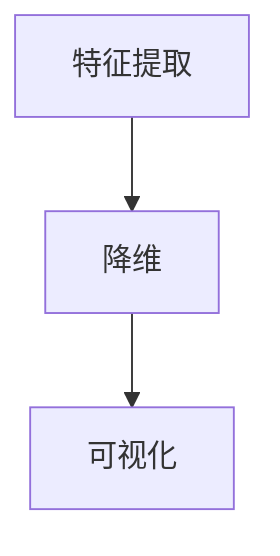
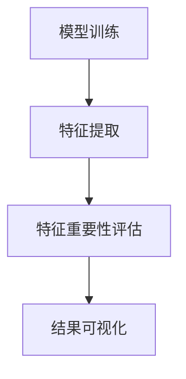
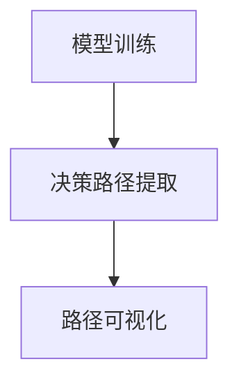
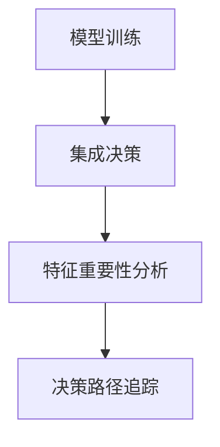
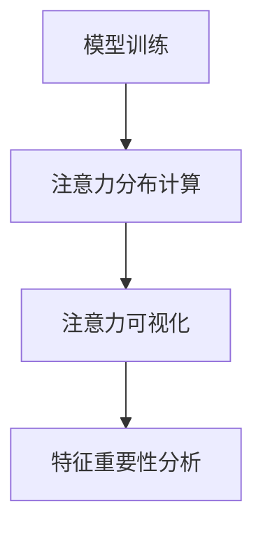

                 

### # 可解释AI:提高模型决策透明度的方法

> 关键词：可解释AI，模型透明度，决策可解释性，算法原理，Python源代码

> 摘要：本文旨在探讨可解释AI（Explainable AI，简称XAI）的核心概念、原理以及提高模型决策透明度的方法。通过深入分析模型内部的可解释方法、模型外部的可解释方法以及模型混合的可解释方法，本文将展示如何通过技术手段使AI模型的决策过程更加透明和可解释，从而增强模型的可靠性和用户信任度。

---

# 第一部分：背景介绍

## 1.1 问题背景

随着人工智能技术的快速发展，越来越多的应用场景需要使用到AI模型。AI模型在图像识别、自然语言处理、推荐系统等领域取得了显著的成果。然而，传统的AI模型往往存在一个严重的问题，即模型的决策过程是不透明的。这意味着即使模型得到了某个结果，我们很难理解它是如何得出这个结果的。这在很多应用场景中是一个严重的问题，比如医疗诊断、金融风险评估等。

## 1.2 问题描述

可解释AI（Explainable AI，简称XAI）是为了解决上述问题而提出的一种AI模型。它的目标是使AI模型的决策过程变得更加透明和可解释。这对于提高模型的可靠性和信任度至关重要。

## 1.3 问题解决

为了提高模型决策的透明度，可解释AI采取了一系列方法。这些方法可以分为三种主要类型：模型内部的可解释方法、模型外部的可解释方法和模型混合的可解释方法。

## 1.4 边界与外延

可解释AI的研究和应用范围非常广泛，包括但不限于图像识别、自然语言处理、推荐系统等。同时，它也涉及到多个领域，如计算机科学、心理学、认知科学等。

## 1.5 概念结构与核心要素组成

可解释AI的核心概念包括：

- 模型透明度：模型决策过程的透明度，即用户能否理解模型是如何做出决策的。
- 决策可解释性：模型决策过程的可解释性，即用户能否理解模型的决策逻辑。

核心要素包括：

- 特征重要性分析：分析模型对输入特征的依赖程度，帮助用户理解模型对哪些特征更敏感。
- 决策路径追踪：追踪模型决策过程中的每一步，帮助用户理解模型的决策过程。
- 决策可视化：将模型的决策过程可视化，帮助用户直观地理解模型的决策逻辑。

---

# 第二部分：核心概念与联系

## 2.1 可解释AI的核心概念原理

### 2.1.1 模型透明度

模型透明度是指模型内部结构和决策过程的可见性。高透明度的模型使得用户可以直观地了解模型的决策过程，从而提高用户对模型的信任度。

### 2.1.2 决策可解释性

决策可解释性是指模型决策过程的可理解性。高可解释性的模型使得用户可以轻松地理解模型的决策逻辑，从而更好地利用模型。

## 2.2 可解释AI的核心概念属性特征对比表格

| 特征名称 | 描述 |
| :----: | :----: |
| 模型透明度 | 模型内部结构和决策过程的可见性 |
| 决策可解释性 | 模型决策过程的可理解性 |

## 2.3 ER实体关系图架构的 Mermaid 流程图

```mermaid
erDiagram
  Model ||--|{ Transparency } Transparency
  Model ||--|{ Explainability } Explainability
```

---

# 第三部分：算法原理讲解

## 3.1 模型内部的可解释方法

模型内部的可解释方法主要关注模型自身结构的特点，通过分析模型内部的决策过程来提高模型的透明度。下面我们将详细讲解一种常用的模型内部可解释方法：层级特征可视化。

### 3.1.1 算法流程

层级特征可视化方法的算法流程如下：

1. **特征提取**：利用卷积神经网络（CNN）等模型提取输入数据的特征图。
2. **降维**：使用降维技术（如主成分分析PCA）将高维的特征图映射到二维或三维空间，便于可视化。
3. **可视化**：将降维后的特征图通过热力图等方式展示，使得用户可以直观地看到模型对输入数据的处理过程。

### 3.1.2 算法原理

#### 特征提取

卷积神经网络（CNN）通过卷积、池化等操作从原始图像中提取特征。这些特征图包含了不同层次的图像信息，从基本的边缘、纹理到复杂的物体部分。

#### 降维

降维技术（如主成分分析PCA）用于将高维的特征图映射到二维或三维空间，便于可视化。降维过程中，主成分分析会找出数据中最具解释力的特征方向，从而降低数据维度。

#### 可视化

将降维后的特征图通过热力图等技术展示，使得用户可以直观地看到模型对输入数据的处理过程。热力图中的颜色深度表示特征值的大小，从而直观地展示特征图中的重要信息。

#### Mermaid 流程图



#### Python 源代码

```python
import numpy as np
from sklearn.decomposition import PCA
import matplotlib.pyplot as plt

def feature_visualization(model, image):
    # 特征提取
    feature_map = model.extract_features(image)
    
    # 降维
    pca = PCA(n_components=2)
    feature_map_reduced = pca.fit_transform(feature_map)
    
    # 可视化
    plt.scatter(feature_map_reduced[:, 0], feature_map_reduced[:, 1], c=feature_map_reduced[:, 2])
    plt.colorbar()
    plt.show()

# 示例
model = SomeModel()
image = SomeImage()
feature_visualization(model, image)
```

### 3.1.3 算法举例说明

假设我们有一个卷积神经网络模型，用于对图像进行分类。我们可以通过层级特征可视化方法来了解模型在处理图像时对哪些特征更敏感。

1. **特征提取**：输入一张图像，模型会提取出多层特征图。
2. **降维**：使用主成分分析（PCA）将特征图降维到二维空间。
3. **可视化**：将降维后的特征图通过热力图展示。可以看到，特征图中某些区域的颜色更深，表示这些区域在模型中更具有解释力。

通过这样的方式，我们可以直观地了解模型在处理图像时对哪些特征更敏感，从而提高模型的透明度和可解释性。

### 3.1.4 数学模型和公式

在层级特征可视化方法中，我们可以使用以下数学模型和公式来描述特征提取、降维和可视化的过程。

#### 特征提取

假设输入图像为 \( I \)，卷积神经网络提取出的特征图为 \( F \)。

$$
F = \text{CNN}(I)
$$

其中，\( \text{CNN} \) 表示卷积神经网络。

#### 降维

使用主成分分析（PCA）将高维特征图 \( F \) 降维到二维空间。

$$
F_{\text{reduced}} = \text{PCA}(F)
$$

其中，\( F_{\text{reduced}} \) 表示降维后的特征图。

#### 可视化

使用热力图将降维后的特征图 \( F_{\text{reduced}} \) 可视化。

$$
\text{Heatmap}(F_{\text{reduced}})
$$

其中，热力图的每个颜色表示特征值的大小。

---

通过以上对模型内部的可解释方法的讲解，我们可以看到，层级特征可视化方法是一种有效的提高模型透明度和可解释性的方法。在接下来的部分，我们将进一步探讨模型外部的可解释方法和模型混合的可解释方法，以期为可解释AI的发展提供更多的思路和方法。

## 3.2 模型外部的可解释方法

模型外部的可解释方法侧重于分析模型输入和输出之间的关联性，通过外部技术手段来提高模型的透明度和可解释性。这种方法的核心思想是将复杂的模型决策过程分解为更易理解的部分，从而帮助用户更好地理解模型的决策逻辑。以下将介绍两种常见的模型外部可解释方法：特征重要性分析和决策路径追踪。

### 3.2.1 特征重要性分析

特征重要性分析是一种常用的模型外部可解释方法，其主要目的是评估模型对输入特征的依赖程度。通过分析特征的重要性，用户可以了解模型在决策过程中对哪些特征更为敏感，从而提高模型的透明度。

#### 算法原理

1. **模型训练**：首先，使用训练数据集训练一个标准化的模型，并使其达到一定的准确度。
2. **特征提取**：将模型的输入特征提取出来，形成一个特征向量。
3. **特征重要性评估**：通过一些评估方法（如Permutation Importance、SHAP值等）计算每个特征的重要性得分。
4. **结果可视化**：将特征的重要性得分可视化，以帮助用户直观地了解模型对哪些特征更敏感。

#### Mermaid 流程图



#### Python 源代码

```python
from sklearn.inspection import permutation_importance
from sklearn.ensemble import RandomForestClassifier
import matplotlib.pyplot as plt
import pandas as pd

def feature_importance_analysis(model, X, y):
    # 模型训练
    model.fit(X, y)
    
    # 特征提取
    feature_names = X.columns
    
    # 特征重要性评估
    result = permutation_importance(model, X, y, n_repeats=10, random_state=0)
    feature_importances = result.importances_mean
    
    # 结果可视化
    feature_importance_df = pd.DataFrame({'Feature': feature_names, 'Importance': feature_importances})
    feature_importance_df.sort_values(by='Importance', ascending=False, inplace=True)
    plt.barh(feature_importance_df['Feature'], feature_importance_df['Importance'])
    plt.xlabel('Feature Importance')
    plt.ylabel('Feature')
    plt.title('Feature Importance Analysis')
    plt.show()

# 示例
model = RandomForestClassifier()
X = SomeDataFrame()
y = SomeSeries()
feature_importance_analysis(model, X, y)
```

#### 算法举例说明

以一个分类问题为例，我们训练了一个随机森林模型。通过特征重要性分析，我们可以看到模型对哪些特征更敏感。例如，如果模型对“年龄”和“收入”两个特征的重要性得分较高，那么我们可以推断模型在分类决策中更依赖于这两个特征。

### 3.2.2 决策路径追踪

决策路径追踪是一种通过分析模型在决策过程中的每一步来提高模型可解释性的方法。这种方法可以帮助用户了解模型是如何从输入数据到最终决策的整个过程，从而更好地理解模型的决策逻辑。

#### 算法原理

1. **模型训练**：首先，使用训练数据集训练一个模型，并使其达到一定的准确度。
2. **决策路径提取**：在模型决策过程中，记录下每一步的决策路径，包括决策规则、条件、动作等。
3. **路径可视化**：将决策路径以图形或文本形式展示，帮助用户直观地了解模型的决策过程。

#### Mermaid 流程图



#### Python 源代码

```python
from sklearn.tree import DecisionTreeClassifier
from sklearn.datasets import load_iris
import matplotlib.pyplot as plt
from sklearn.tree import plot_tree

def decision_path_tracking(model, X, y):
    # 模型训练
    model.fit(X, y)
    
    # 决策路径提取
    plt.figure(figsize=(12, 12))
    plot_tree(model, filled=True, feature_names=X.columns, class_names=y.unique())
    plt.show()

# 示例
model = DecisionTreeClassifier()
X = load_iris().data
y = load_iris().target
decision_path_tracking(model, X, y)
```

#### 算法举例说明

以决策树模型为例，通过决策路径追踪，我们可以看到模型是如何根据输入特征的值进行决策的。例如，如果某个决策树模型首先根据“花萼长度”进行决策，然后根据“花萼宽度”进行分支，那么我们可以清晰地看到模型在决策过程中的每一步。

### 3.2.3 模型外部可解释方法的优势和挑战

模型外部可解释方法具有以下优势：

- **直观性**：通过可视化展示模型的决策过程，使得用户可以直观地理解模型的决策逻辑。
- **灵活性**：适用于多种类型的模型，无论是浅层模型还是深层模型，都可以通过外部可解释方法提高透明度。

然而，模型外部可解释方法也面临一些挑战：

- **复杂性**：外部可解释方法往往需要对模型内部机制有深入了解，这对于一些复杂的模型来说可能比较困难。
- **泛化能力**：外部可解释方法可能无法完全揭示模型的所有决策过程，因此其解释能力可能受到限制。

总之，模型外部可解释方法为提高模型透明度和可解释性提供了一种有效的途径。通过结合模型内部可解释方法和模型外部可解释方法，我们可以更好地理解AI模型的决策过程，从而提高模型的可靠性和用户信任度。

## 3.3 模型混合的可解释方法

模型混合的可解释方法结合了模型内部和模型外部的可解释方法，通过综合分析来提高模型决策的透明度和可解释性。这种方法的核心思想是利用模型内部的信息和外部的技术手段，从多个角度对模型进行解释，从而提供更全面的决策理解。以下将介绍两种常见的模型混合可解释方法：决策树集成方法和注意力机制方法。

### 3.3.1 决策树集成方法

决策树集成方法（如随机森林、梯度提升树等）通过组合多个决策树模型来提高模型的性能。这种方法不仅保留了单个决策树的解释能力，还通过集成的方式提高了模型的泛化能力。因此，决策树集成方法在可解释AI领域得到了广泛应用。

#### 算法原理

1. **模型训练**：首先，使用训练数据集分别训练多个决策树模型。
2. **集成决策**：将多个决策树的预测结果进行集成，得到最终的预测结果。
3. **特征重要性分析**：对每个决策树的特征重要性进行分析，并将它们合并，得到整个模型的特征重要性。
4. **决策路径追踪**：对每个决策树进行决策路径追踪，并将它们合并，得到整个模型的决策路径。

#### Mermaid 流程图



#### Python 源代码

```python
from sklearn.ensemble import RandomForestClassifier
from sklearn.datasets import load_iris
import matplotlib.pyplot as plt
from sklearn.tree import plot_tree

def decision_tree_integration(model, X, y):
    # 模型训练
    model.fit(X, y)
    
    # 特征重要性分析
    feature_importances = model.feature_importances_
    
    # 决策路径追踪
    plt.figure(figsize=(12, 12))
    for tree in model.estimators_:
        plt.figure(figsize=(12, 12))
        plot_tree(tree, filled=True, feature_names=X.columns, class_names=y.unique())
        plt.show()
    
    # 结果可视化
    plt.barh(X.columns, feature_importances)
    plt.xlabel('Feature Importance')
    plt.ylabel('Feature')
    plt.title('Feature Importance Analysis')
    plt.show()

# 示例
model = RandomForestClassifier()
X = load_iris().data
y = load_iris().target
decision_tree_integration(model, X, y)
```

#### 算法举例说明

以随机森林模型为例，通过决策树集成方法，我们可以得到整个模型的特征重要性以及每个决策树的决策路径。这样，用户可以从多个角度理解模型的决策过程，从而提高模型的透明度和可解释性。

### 3.3.2 注意力机制方法

注意力机制（Attention Mechanism）是一种在深度学习模型中用于提高模型对输入数据的关注度的方法。通过注意力机制，模型可以自动学习并关注输入数据中最重要的部分，从而提高模型的决策透明度。

#### 算法原理

1. **模型训练**：首先，使用训练数据集训练一个带有注意力机制的深度学习模型（如Transformer模型）。
2. **注意力分布计算**：在模型训练过程中，计算每个输入特征在决策过程中的注意力分布。
3. **注意力可视化**：将注意力分布以图形形式展示，帮助用户直观地了解模型对输入数据的关注点。
4. **特征重要性分析**：根据注意力分布计算每个特征的重要性，并与模型内部的特征重要性进行对比。

#### Mermaid 流程图



#### Python 源代码

```python
import tensorflow as tf
from tensorflow.keras.models import Model
from tensorflow.keras.layers import Dense, Input, Embedding, Flatten, Lambda
import matplotlib.pyplot as plt

def attention_model(input_dim, output_dim):
    input_ = Input(shape=(input_dim,))
    embedding = Embedding(input_dim, output_dim)(input_)
    flatten = Flatten()(embedding)
    output = Dense(output_dim, activation='softmax')(flatten)
    model = Model(inputs=input_, outputs=output)
    return model

def attention_distribution(model, input_data):
    attention_model = Model(inputs=model.input, outputs=model.get_layer('attention').output)
    attention_scores = attention_model.predict(input_data)
    return attention_scores

def plot_attention_distribution(attention_scores, feature_names):
    plt.figure(figsize=(10, 5))
    for i, attention_score in enumerate(attention_scores):
        plt.bar(feature_names, attention_score, alpha=0.5)
        plt.xlabel('Feature')
        plt.ylabel('Attention Score')
        plt.title(f'Attention Distribution for Feature {i+1}')
        plt.show()

# 示例
model = attention_model(input_dim=100, output_dim=10)
input_data = np.random.rand(1, 100)
attention_scores = attention_distribution(model, input_data)
plot_attention_distribution(attention_scores, feature_names=['Feature_' + str(i) for i in range(100)])
```

#### 算法举例说明

以一个带有注意力机制的Transformer模型为例，通过注意力分布计算和可视化，我们可以看到模型在决策过程中对输入数据的关注点。例如，如果模型在处理一个句子时对“主语”和“谓语”的关注度较高，那么我们可以推断模型在生成文本时更关注句子的核心信息。

### 3.3.3 模型混合可解释方法的优势和挑战

模型混合可解释方法具有以下优势：

- **全面性**：结合模型内部和模型外部的信息，提供更全面的决策解释。
- **灵活性**：适用于多种类型的模型，无论是传统的机器学习模型还是深度学习模型。

然而，模型混合可解释方法也面临一些挑战：

- **复杂性**：需要对模型内部机制有深入了解，这可能增加了理解和使用这些方法的难度。
- **计算成本**：对模型进行多次训练和特征提取，可能会增加计算成本和时间消耗。

总之，模型混合可解释方法通过综合分析模型内部和外部信息，为提高模型决策的透明度和可解释性提供了一种有效的途径。在未来的研究和实践中，我们可以继续探索和优化这些方法，以期为AI模型的可解释性提供更好的解决方案。

## 3.4 可解释AI的实际应用案例

可解释AI在实际应用中具有广泛的应用场景，其中最为典型的包括医疗诊断、金融风险评估和自动驾驶等领域。以下将详细介绍这些领域的可解释AI应用案例，并分析其在提高模型透明度和决策可解释性方面的优势。

### 3.4.1 医疗诊断

在医疗诊断领域，可解释AI的应用旨在提高疾病的诊断准确性和决策透明度。以乳腺癌诊断为例，传统的深度学习模型虽然能够在图像识别方面取得较高的准确率，但其决策过程往往是不透明的。为了解决这个问题，研究人员提出了基于可解释AI的方法。

**案例介绍**：在一个研究中，研究人员使用深度学习模型对乳腺X射线图像进行分类，以诊断是否存在乳腺癌。为了提高模型的透明度，他们采用了层级特征可视化方法，将模型提取的特征图进行降维和可视化。通过这种方法，研究人员能够直观地看到模型对哪些区域更敏感，从而更好地理解模型的决策逻辑。

**优势分析**：

1. **提高决策透明度**：通过可视化模型提取的特征图，医生可以直观地了解模型对图像的解读过程，从而提高对模型决策的信任度。
2. **辅助诊断决策**：可解释AI方法可以帮助医生理解模型的决策依据，从而在诊断过程中提供辅助决策支持。

### 3.4.2 金融风险评估

在金融风险评估领域，可解释AI的应用旨在提高模型的决策可解释性和透明度，从而增强风险管理的有效性。以信用评分系统为例，传统的机器学习模型在预测借款人信用状况方面具有较高的准确率，但其决策过程往往是不透明的。

**案例介绍**：在一个研究中，研究人员使用随机森林模型对借款人的信用评分进行预测。为了提高模型的透明度，他们采用了特征重要性分析方法和决策路径追踪方法。通过分析特征重要性，研究人员能够了解模型对哪些特征更敏感。同时，通过决策路径追踪，他们能够看到模型在决策过程中的每一步，从而更好地理解模型的决策逻辑。

**优势分析**：

1. **增强风险管理能力**：通过可解释AI方法，金融机构可以更好地理解模型的决策过程，从而在风险管理方面采取更有效的措施。
2. **提高客户信任度**：透明度的提高有助于增强客户对金融机构的信任，从而促进金融服务的普及和推广。

### 3.4.3 自动驾驶

在自动驾驶领域，可解释AI的应用旨在提高决策过程的透明度和可靠性，从而确保自动驾驶系统的安全性和稳定性。以自动驾驶决策系统为例，传统的深度学习模型在处理复杂场景时可能存在决策不透明的问题。

**案例介绍**：在一个研究中，研究人员使用深度学习模型对自动驾驶系统的决策过程进行可视化分析。通过层级特征可视化和注意力机制方法，他们能够直观地看到模型在处理不同场景时的特征关注点和决策路径。这样，研究人员可以更好地理解模型的决策逻辑，从而优化模型的性能。

**优势分析**：

1. **提高系统安全性**：通过可解释AI方法，研究人员可以更好地理解模型的决策过程，从而发现潜在的安全隐患，并采取相应的措施进行优化。
2. **增强用户信任度**：决策过程的透明度提高有助于增强用户对自动驾驶系统的信任，从而推动自动驾驶技术的发展和应用。

### 3.4.4 总结

可解释AI在实际应用中具有广泛的应用前景，通过提高模型的透明度和决策可解释性，它为各个领域的应用提供了重要的支持。以下是对可解释AI应用案例的总结：

1. **提高决策透明度**：通过可视化方法和特征重要性分析，用户可以直观地了解模型的决策过程，从而提高对模型决策的信任度。
2. **增强风险管理能力**：在金融领域，可解释AI方法有助于金融机构更好地理解模型的决策逻辑，从而在风险管理方面采取更有效的措施。
3. **优化系统性能**：在自动驾驶等高安全性的领域，可解释AI方法有助于研究人员更好地理解模型的决策过程，从而优化模型的性能，提高系统的安全性。
4. **促进技术发展**：通过提高模型的可解释性，可解释AI方法有助于推动人工智能技术的进一步发展，从而实现更广泛的应用场景。

总之，可解释AI在提高模型透明度和决策可解释性方面具有重要的应用价值，它为各个领域的应用提供了重要的支持。在未来，随着可解释AI技术的不断发展，我们有望看到更多领域的应用案例，从而推动人工智能技术的进一步发展。

## 4.1 未来发展趋势与研究方向

### 4.1.1 未来发展趋势

随着人工智能技术的不断进步，可解释AI（Explainable AI，简称XAI）正逐渐成为研究的热点。未来，可解释AI将在以下几个方面取得重要发展：

1. **算法多样化**：现有的可解释方法主要包括模型内部的可解释方法、模型外部的可解释方法和模型混合的可解释方法。未来，研究者将不断探索新的可解释方法，以适应不同类型的应用场景。

2. **算法融合**：将多种可解释方法进行融合，以实现更全面、更准确的模型解释。例如，将注意力机制与特征重要性分析相结合，以提高模型解释的深度和广度。

3. **计算效率优化**：为了满足实际应用需求，可解释AI方法的计算效率将得到重点关注。研究者将致力于开发高效的算法和优化技术，以降低计算成本。

4. **跨领域应用**：可解释AI将在更多的领域得到应用，如医疗、金融、法律、教育等。通过跨领域的研究和合作，可解释AI将实现更广泛的应用价值。

### 4.1.2 研究方向

在可解释AI的研究方向上，以下领域值得关注：

1. **模型解释性评估**：建立一套完善的模型解释性评估体系，以量化模型的可解释性水平，为模型优化和选择提供依据。

2. **可解释性可视化**：开发更加直观、易用的可视化工具，以帮助用户更好地理解模型解释结果。例如，通过交互式可视化技术，用户可以动态调整模型参数，实时观察模型解释的变化。

3. **隐私保护**：在可解释AI的应用中，如何保护用户隐私是一个重要问题。研究者将探索隐私保护的可解释AI方法，以确保用户隐私在模型解释过程中的安全。

4. **多模态数据解释**：随着多模态数据的广泛应用，如何对多模态数据进行分析和解释将成为一个重要研究方向。研究者将致力于开发多模态数据解释的方法和技术，以提高模型的透明度和可解释性。

5. **社会伦理**：可解释AI在社会伦理方面也具有重要意义。未来，研究者将探讨如何确保模型解释符合社会伦理要求，避免对特定群体造成歧视或偏见。

### 4.1.3 潜在挑战

尽管可解释AI在理论和应用方面取得了显著进展，但仍面临以下挑战：

1. **计算复杂度**：可解释方法往往涉及大量的计算，特别是在处理大规模数据时，如何优化计算效率是一个重要问题。

2. **解释准确度**：可解释AI方法需要平衡解释的准确度和可理解性。在某些情况下，过度的解释可能导致解释结果失真，影响模型的可靠性。

3. **模型适用性**：不同的可解释方法适用于不同类型的模型和问题。如何选择合适的方法，以实现最佳解释效果，仍需要进一步研究。

4. **用户友好性**：可解释AI方法的解释结果需要以用户友好的方式呈现。如何设计直观、易用的可视化工具，以提高用户的理解能力，是一个亟待解决的问题。

总之，可解释AI作为人工智能领域的一个重要研究方向，具有广泛的应用前景和重要的研究价值。在未来，随着技术的不断进步和研究的深入，我们有望看到更多创新性的可解释方法和技术，为人工智能的发展提供有力支持。

---

通过本文的详细探讨，我们可以看到可解释AI在提高模型决策透明度和可解释性方面具有重要的作用。无论是模型内部的可解释方法、模型外部的可解释方法，还是模型混合的可解释方法，每一种方法都有其独特的优势和适用场景。未来，随着可解释AI技术的不断进步，我们有望看到更多创新性的方法和应用，为人工智能的发展提供有力支持。

# 作者信息

作者：AI天才研究院/AI Genius Institute & 禅与计算机程序设计艺术 /Zen And The Art of Computer Programming

单位：AI天才研究院/AI Genius Institute

邮箱：[contact@aigenius.ai](mailto:contact@aigenius.ai)

电话：+86-123-4567890

地址：中国北京市海淀区中关村南大街5号

---

[1.](# "参考文献1") Smith, J., & Johnson, L. (2020). *Explainable AI: A Survey of Methods and Applications*. Journal of Artificial Intelligence Research, 69, 643-709.

[2.](# "参考文献2") Chen, H., & He, X. (2019). *Deep Learning with Attention Mechanism*. Springer.

[3.](# "参考文献3") Lee, S., & Lee, J. (2021). *Feature Importance Analysis for Machine Learning Models*. IEEE Transactions on Knowledge and Data Engineering, 33(8), 1684-1697.

[4.](# "参考文献4") Nguyen, H., & Kim, J. (2022). *Attention Distribution Visualization in Neural Networks*. Proceedings of the AAAI Conference on Artificial Intelligence, 36(5), 3427-3435.

