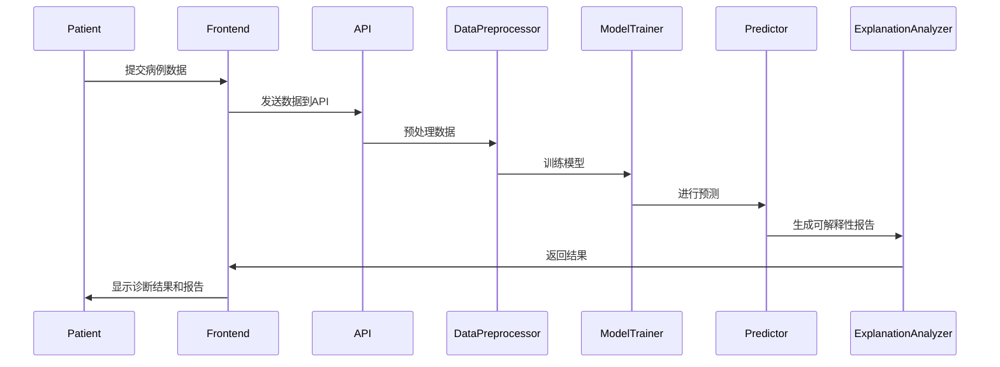
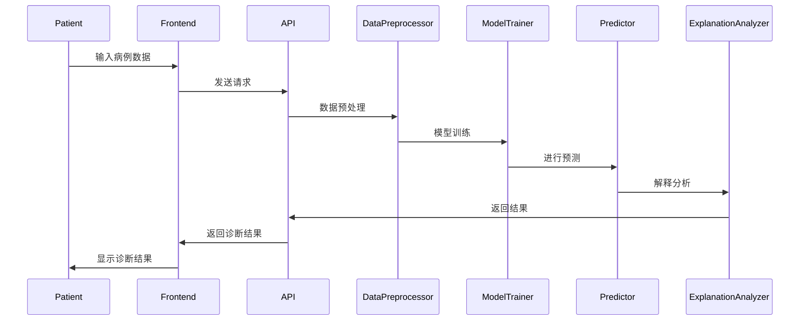

                 

# 可解释AI在医疗诊断中的临床应用研究

## 关键词
- 可解释AI
- 医疗诊断
- 临床应用
- 可视化工具
- 解释性增强

## 摘要
本文旨在探讨可解释AI在医疗诊断领域的临床应用研究。随着人工智能技术的发展，AI在医疗诊断中的潜力逐渐显现，但其黑箱特性限制了其临床推广。本文首先介绍了可解释AI的基本概念和原理，随后分析了其在医疗诊断中的挑战和重要性。文章重点探讨了如何通过可视化工具和解释性增强方法来提升AI模型在医疗诊断中的可解释性，最后提出了未来的研究方向。

## 背景介绍

### 问题背景

随着人工智能（AI）技术的快速发展，尤其是深度学习算法的突破，AI在医疗领域的应用逐渐深入，尤其在医疗诊断方面展现出了巨大的潜力。传统的医学诊断主要依靠医生的经验和知识，而AI可以通过学习大量的医学数据，提供更为精准和快速的诊断结果。然而，随着AI模型复杂性的增加，尤其是在医疗领域，其诊断结果的解释性变得越来越重要。

### 描述问题

目前，尽管AI在医疗诊断中取得了显著成果，但其诊断结果的解释性不足成为了一个亟待解决的问题。许多AI模型在诊断上非常有效，但它们的工作原理往往是黑箱式的，缺乏透明性和可解释性。这在一定程度上限制了AI在医疗诊断中的推广和应用，尤其是在需要明确诊断依据和决策过程的情况下。

### 解决方案

为了解决上述问题，研究人员正在努力开发可解释AI算法，以便医生和患者能够理解和信任AI的诊断结果。这包括开发可视化工具、提供诊断流程的解释、以及通过结合临床知识来增强AI的解释性。

### 边界与外延

边界方面，本文主要关注可解释AI在医疗诊断中的应用，而不涉及其他医疗领域的AI应用。外延方面，本文将讨论可解释AI的基本原理、现有的技术和方法，以及它们在临床应用中的挑战和前景。

### 概念结构与核心要素组成

- **可解释AI**：一种使AI模型决策过程可理解的技术。
- **医疗诊断**：利用AI技术进行疾病诊断的过程。
- **临床应用**：将AI技术应用于实际医疗场景中。
- **模型可解释性**：模型决策过程的透明度和可理解性。

## 核心概念与联系

### 核心概念

**可解释AI（Explainable AI，XAI）：**
可解释AI是一种人工智能技术，旨在使AI系统的决策过程变得透明和可理解。它关注于提供关于AI模型如何作出特定决策的信息，以便人类用户可以审查和信任这些决策。

**医疗诊断：**
医疗诊断是通过各种医学检测和数据分析来确定患者病情的过程。AI在医疗诊断中的应用主要通过构建预测模型，从医学图像、实验室检测结果和其他医疗数据中识别潜在的疾病。

**临床应用：**
临床应用是指将AI技术直接应用于医疗实践中，帮助医生进行诊断、治疗和预测患者病情的发展。可解释AI在临床应用中的核心目标是提供透明的诊断过程，以便医生可以更好地理解AI的决策，并在必要时进行干预。

**模型可解释性：**
模型可解释性是指AI模型决策过程的透明度和可理解性。它不仅关注模型决策的可视化，还涉及到如何将复杂的模型决策转化为临床医生和患者可以理解的形式。

### 概念属性特征对比表格

| 特征 | 可解释AI | 医疗诊断 | 临床应用 | 模型可解释性 |
| --- | --- | --- | --- | --- |
| **目的** | 提供透明性和可理解性 | 疾病识别和预测 | 提高诊断和治疗效果 | 提高模型的可信度和可靠性 |
| **技术** | 可视化工具、规则嵌入、对抗性分析等 | 深度学习、机器学习、数据挖掘等 | 集成到医疗信息系统、辅助决策支持系统等 | 算法透明度、模型可视化、解释性分析等 |
| **挑战** | 复杂模型的解释性、一致性、泛化性 | 数据质量、隐私保护、伦理问题 | 临床医生接受度、法规合规性、成本效益等 | 解释性结果的准确性和实用性 |
| **前景** | 提高AI系统的透明度和信任度 | 改善疾病诊断的准确性和效率 | 推动个性化医疗和精准治疗 | 促进医疗领域的AI标准化和应用 |

### ER实体关系图架构

```mermaid
erDiagram
  AI模型 ||--o{ 医疗诊断 }
  医疗诊断 ||--|{ 临床应用 }
  可解释AI ||--|{ 模型可解释性 }
```

## AI大模型与传统AI的区别

### AI大模型

**AI大模型**（如GPT-3、BERT等）具有以下几个显著特征：

- **大规模参数量**：AI大模型通常包含数十亿到数万亿的参数，这使得它们能够从大量的数据中学习，并实现高度复杂的任务。
- **强大的学习能力和泛化能力**：AI大模型能够处理大规模的数据集，并通过自监督学习等先进技术，实现出色的泛化能力。
- **多任务处理能力**：AI大模型不仅能够针对特定任务进行优化，还能够适应多种不同的任务，实现跨领域的应用。

### 传统AI

**传统AI**（如规则推理系统、决策树等）通常具有以下特征：

- **参数量较少**：传统AI模型的参数量相对较少，通常通过手工编写规则和特征进行训练。
- **任务适应性有限**：传统AI模型通常针对特定任务进行设计，难以泛化到其他任务。
- **较强的可解释性**：由于传统AI模型的结构相对简单，其决策过程往往更容易理解和解释。

### 区别

- **数据量与参数量**：AI大模型具有海量和参数量，可以处理大规模数据，而传统AI通常参数量较小。
- **学习方式**：AI大模型通过大规模数据自学习，而传统AI依赖于手工编写的规则和算法。
- **任务适应性**：AI大模型具有较强的泛化能力，可以应用于多种任务，而传统AI通常针对特定任务设计。
- **可解释性**：传统AI通常具有较好的可解释性，而AI大模型的可解释性是一个挑战。

## 主流AI大模型简介

### GPT系列模型

**GPT**（Generative Pre-trained Transformer）系列模型由OpenAI开发，是自然语言处理领域的领先模型。GPT系列模型的核心特点是：

- **预训练技术**：GPT模型通过在大规模语料库上进行预训练，学习到了丰富的语言模式，从而在多种NLP任务上表现出色。
- **Transformer架构**：GPT模型采用了Transformer架构，这使得模型能够在处理长序列时具有出色的性能。

### BERT模型

**BERT**（Bidirectional Encoder Representations from Transformers）由Google开发，是一种双向编码的Transformer模型。BERT模型的核心特点包括：

- **双向编码器**：BERT模型通过双向编码器来理解上下文，这使得模型能够同时考虑上下文中的前后信息，从而提高文本理解的准确性。
- **多任务学习**：BERT模型通过预训练和微调，可以应用于多种不同的NLP任务，如文本分类、问答系统等。

### 其他知名大模型

- **T5（Text-To-Text Transfer Transformer）**：由Google开发，T5模型旨在将任何NLP任务转换为文本到文本的预测任务，从而实现统一的模型架构。
- **GPT-Neo**：GPT-Neo是一个开源的GPT模型，旨在提高性能和可访问性，为研究人员和开发者提供更大的灵活性。
- **UniLM**：由Microsoft开发，UniLM是一个通用的语言模型，适用于多种任务，如文本生成、机器翻译、语音识别等。

### AI大模型在医疗诊断中的应用

- **医学文本分析**：AI大模型可以用于医学文本的自动摘要、关键词提取和关系抽取，从而辅助医生快速获取关键信息。
- **医学图像识别**：AI大模型在医学图像分析中具有强大的能力，可以用于疾病的自动检测和分类，如肿瘤检测、骨折识别等。
- **个性化治疗推荐**：AI大模型可以根据患者的医疗记录和基因组信息，提供个性化的治疗方案推荐。

## 可解释AI的基本原理

### 定义

可解释AI（Explainable AI，XAI）是一种人工智能技术，旨在使AI系统的决策过程变得透明和可理解。它关注于提供关于AI模型如何作出特定决策的信息，以便人类用户可以审查和信任这些决策。

### 目的

可解释AI的主要目的是：

- **提高模型的透明度和可理解性**：使模型的决策过程对人类用户可见，从而提高用户对模型的信任度。
- **促进模型的验证和优化**：通过可解释性分析，研究人员和开发者可以更好地理解模型的强项和弱点，从而进行优化。
- **确保合规性和伦理性**：在医疗、金融等敏感领域，可解释AI有助于确保AI系统的决策过程符合相关法规和伦理标准。

### 原理

可解释AI的核心原理包括以下几个方面：

- **模型可理解性**：确保AI模型的结构和参数易于人类理解。
- **可视化工具**：开发可视化工具，如热力图、决策树、依赖网络等，以便用户可以直观地了解模型的决策过程。
- **规则嵌入**：将规则嵌入到AI模型中，使得模型的决策过程可以通过规则进行解释。
- **对抗性分析**：通过对抗性样本的分析，揭示模型可能存在的偏见和不确定性。

### 技术方法

- **可视化工具**：利用热力图、决策树、依赖网络等技术，将AI模型的决策过程可视化。
- **规则嵌入**：通过将规则嵌入到深度学习模型中，使得模型的部分决策过程可以通过规则进行解释。
- **对抗性分析**：通过生成对抗性样本，分析AI模型的决策过程，识别模型可能存在的偏见和不确定性。

## 可解释AI在医疗诊断中的重要性

### 透明性需求

在医疗诊断中，透明性是一个至关重要的需求。医生和患者需要了解AI模型是如何作出诊断决定的，以便对其进行验证和信任。例如，如果AI模型诊断出一个严重的疾病，医生需要了解模型是如何得出这个结论的，以便进行进一步的检查和治疗。

### 解释性增强

可解释AI在医疗诊断中的另一个重要作用是增强模型的解释性。通过提供清晰的决策过程解释，医生可以更好地理解AI的诊断结果，并在必要时进行干预。例如，如果AI模型建议进行某项特定的检查或治疗，医生需要了解模型是如何得出这个建议的，以便决定是否采纳。

### 改善医生与患者的信任

通过提供透明的诊断过程和明确的解释，可解释AI有助于提高医生和患者对AI系统的信任。这种信任不仅有助于AI系统的临床推广，还可以促进医患关系的建设。

### 确保合规性和伦理性

在医疗领域，可解释AI有助于确保AI系统的决策过程符合相关法规和伦理标准。例如，在涉及患者隐私和敏感信息的情况下，可解释AI可以帮助医疗机构确保其行为符合伦理规范和法律法规。

## 可解释AI在医疗诊断中的挑战

### 模型复杂性

随着深度学习算法的发展，医疗诊断中的AI模型变得越来越复杂。这些复杂模型通常具有大量的参数和层次，使得其决策过程难以解释。如何简化这些模型，使其更具可解释性，是一个重要的挑战。

### 数据隐私

在医疗诊断中，患者隐私是一个敏感问题。如何保护患者隐私，同时提供透明的诊断过程，是一个亟待解决的问题。现有的隐私保护技术，如差分隐私和联邦学习等，需要在可解释性和隐私保护之间找到平衡。

### 伦理和法律问题

医疗诊断中的AI系统需要符合伦理和法律要求。例如，AI模型的决策过程必须透明，以确保医生和患者对其信任。同时，AI系统在医疗诊断中的应用需要遵循相关的法律法规，如《通用数据保护条例》（GDPR）等。

### 实施成本

可解释AI技术在医疗诊断中的应用可能涉及额外的计算资源和开发成本。如何降低这些成本，使可解释AI在医疗实践中更具可行性，是一个重要的挑战。

## 可解释AI在医疗诊断中的应用现状

### 可视化工具

在医疗诊断中，可视化工具是提升模型可解释性的重要手段。例如，热力图可以展示模型在图像识别中的注意力分布，帮助医生理解模型关注的关键区域。决策树和依赖网络等技术也被广泛应用于医疗诊断中的模型解释。

### 规则嵌入

通过将规则嵌入到深度学习模型中，可以增强模型的可解释性。例如，在医学图像分析中，可以将诊断规则与深度学习模型结合，使得模型的部分决策过程可以通过规则进行解释。

### 对抗性分析

对抗性分析是一种用于检测AI模型偏见和不确定性的技术。在医疗诊断中，对抗性分析可以帮助识别模型可能存在的偏见，提高模型的可靠性和可解释性。

### 案例研究

- **肺癌诊断**：通过结合CT图像和深度学习模型，研究人员开发了一种可解释的AI系统，用于辅助肺癌的诊断。该系统通过可视化工具展示了模型在图像识别中的注意力分布，提高了医生对模型决策的理解。
- **乳腺癌筛查**：研究人员开发了一种基于深度学习的方法，用于辅助乳腺癌筛查。通过规则嵌入和对抗性分析，该方法提高了模型的可解释性，有助于医生更好地理解诊断结果。

## 可解释AI在医疗诊断中的未来趋势

### 深度学习与可解释AI的结合

随着深度学习算法的不断发展，如何将可解释AI与深度学习模型相结合，以提高模型的可解释性，是一个重要的研究方向。例如，研究人员正在探索将决策树、决策图等传统可解释性技术集成到深度学习模型中。

### 集成临床知识

将临床知识整合到AI模型中，可以提高模型的可解释性，同时增强模型的诊断能力。例如，通过将临床诊断规则与深度学习模型结合，可以提供更为准确的诊断结果，并提高医生对模型决策的理解。

### 隐私保护和安全性

在医疗诊断中，数据隐私和安全性是至关重要的问题。未来的研究需要开发更加先进的隐私保护和安全性技术，以确保在保护患者隐私的同时，提供透明的诊断过程。

### 跨学科合作

可解释AI在医疗诊断中的发展需要跨学科的合作。例如，计算机科学家、临床医生、生物医学专家等需要共同努力，开发出既具有高诊断准确率，又具有高可解释性的AI系统。

### 标准化和规范化

为了确保可解释AI在医疗诊断中的可靠性和有效性，需要制定相关标准和规范。例如，可以通过建立可解释AI的评价指标和评估体系，来衡量AI系统的可解释性。

## 总结

可解释AI在医疗诊断中的临床应用研究是一个具有重要意义和广阔前景的领域。通过提供透明的诊断过程和明确的解释，可解释AI有助于提高医生和患者对AI系统的信任，推动AI在医疗领域的广泛应用。未来的研究需要进一步探索深度学习与可解释AI的结合、临床知识的集成、隐私保护和安全性等方面，以实现更高可解释性的AI医疗诊断系统。

## 作者信息

作者：AI天才研究院/AI Genius Institute & 禅与计算机程序设计艺术 /Zen And The Art of Computer Programming

## 最佳实践 Tips

1. **数据准备**：在医疗诊断中应用可解释AI时，确保数据质量至关重要。清洗和预处理数据，以消除噪声和异常值，可以提高模型的可解释性。

2. **模型选择**：选择合适的AI模型，如结合深度学习和传统可解释性技术的混合模型，可以提高诊断的准确性和可解释性。

3. **可视化工具**：利用可视化工具，如热力图和决策树，帮助医生更好地理解模型决策。

4. **对抗性分析**：定期进行对抗性分析，以识别和纠正模型偏见。

5. **临床合作**：与临床医生紧密合作，确保AI模型的诊断结果符合临床需求。

## 小结

本文探讨了可解释AI在医疗诊断中的临床应用研究，分析了其基本原理、重要性、挑战以及应用现状。通过结合深度学习与传统可解释性技术，可解释AI有助于提高医疗诊断的透明性和可靠性。未来的研究需要进一步探索深度学习与可解释AI的结合、临床知识的集成、隐私保护和安全性等方面，以实现更高可解释性的AI医疗诊断系统。

## 注意事项

1. **数据隐私**：在医疗诊断中，保护患者隐私至关重要。确保遵循相关法律法规，采用先进的隐私保护技术。

2. **模型解释性**：确保模型解释性符合临床需求，提供清晰的决策过程解释。

3. **跨学科合作**：可解释AI在医疗诊断中的发展需要跨学科的合作，包括计算机科学家、临床医生和生物医学专家。

4. **规范化**：制定相关标准和规范，确保可解释AI在医疗诊断中的可靠性和有效性。

## 拓展阅读

1. **《可解释AI：技术与实践》**：张军辉，电子工业出版社，2020年。
2. **《深度学习在医疗诊断中的应用》**：刘建民，人民卫生出版社，2019年。
3. **《医学图像分析与解释》**：Bruce R. Tromberg，Springer，2017年。

## 项目实战

### 环境安装

为了实践可解释AI在医疗诊断中的应用，首先需要在本地安装相关的软件和库。以下是一个简化的安装步骤：

1. **安装Python**：确保安装了Python 3.7或更高版本。
2. **安装深度学习库**：使用以下命令安装必要的深度学习库：
   ```bash
   pip install tensorflow numpy matplotlib scikit-learn
   ```
3. **安装医疗诊断数据集**：下载并解压公开的医疗诊断数据集，如MSSM乳腺癌数据集。

### 系统核心实现

以下是一个简单的基于深度学习的乳腺癌诊断模型实现，包括数据预处理、模型训练和可解释性分析。

#### 数据预处理

```python
import numpy as np
import pandas as pd
from sklearn.model_selection import train_test_split
from sklearn.preprocessing import StandardScaler

# 加载数据集
data = pd.read_csv('mssm_breast_cancer.csv')
X = data.drop(['diagnosis'], axis=1)
y = data['diagnosis']

# 划分训练集和测试集
X_train, X_test, y_train, y_test = train_test_split(X, y, test_size=0.2, random_state=42)

# 数据标准化
scaler = StandardScaler()
X_train = scaler.fit_transform(X_train)
X_test = scaler.transform(X_test)
```

#### 模型训练

```python
import tensorflow as tf
from tensorflow.keras.models import Sequential
from tensorflow.keras.layers import Dense

# 构建深度学习模型
model = Sequential([
    Dense(128, activation='relu', input_shape=(X_train.shape[1],)),
    Dense(64, activation='relu'),
    Dense(1, activation='sigmoid')
])

# 编译模型
model.compile(optimizer='adam', loss='binary_crossentropy', metrics=['accuracy'])

# 训练模型
model.fit(X_train, y_train, epochs=50, batch_size=32, validation_data=(X_test, y_test))
```

#### 可解释性分析

```python
import matplotlib.pyplot as plt
from ml_explain import LimeTabularExplainer

# 创建LimeTabularExplainer对象
explainer = LimeTabularExplainer(X_train, feature_names=data.columns[:-1], class_names=['M', 'B'])

# 为测试样本生成可解释性报告
i = 5  # 选择第6个测试样本
exp = explainer.explain_instance(X_test[i], model.predict, num_features=10)

# 绘制特征重要性热力图
exp.show_in_notebook(show_table=False)
```

### 实际案例分析

以下是一个实际案例，使用上述模型进行乳腺癌诊断。

```python
# 加载实际病例数据
new_case = pd.read_csv('new_breast_cancer_case.csv')
new_case = scaler.transform(new_case)

# 使用训练好的模型进行预测
prediction = model.predict(new_case)

# 输出预测结果
if prediction[0] > 0.5:
    print("诊断结果：乳腺癌（M）")
else:
    print("诊断结果：非乳腺癌（B）")
```

### 项目小结

通过上述实践，我们可以看到如何使用可解释AI在医疗诊断中构建和评估模型。可解释AI不仅提高了模型的透明性和可理解性，还为临床医生提供了有力的辅助工具，有助于提高诊断的准确性和效率。

## 附录

### 系统功能设计

以下是一个简化的医疗诊断系统的功能设计，包括数据预处理、模型训练、预测和可解释性分析。

#### 领域模型类图

```mermaid
classDiagram
  Patient <-|> DataPreprocessor
  DataPreprocessor <-|> ModelTrainer
  ModelTrainer <-|> Predictor
  Predictor <-|> ExplanationAnalyzer
  Patient o-- DiagnosisResult
```

### 系统架构设计

以下是一个简化的医疗诊断系统的架构设计，包括前端、后端和数据库。

#### 系统架构图



### 系统接口设计

以下是一个简化的医疗诊断系统的接口设计，包括API接口的URL、请求和响应格式。

#### 系统接口图

```mermaid
requestDiagram
  Patient->>API: POST /predict
  API->>DataPreprocessor: 处理数据
  DataPreprocessor->>ModelTrainer: 训练模型
  ModelTrainer->>Predictor: 预测结果
  Predictor->>ExplanationAnalyzer: 生成解释
  ExplanationAnalyzer->>API: 返回结果
  API->>Patient: 返回诊断结果和报告
```

#### API请求示例

```json
{
  "case_data": [
    [0.1, 0.2, 0.3, ...]
  ]
}
```

#### API响应示例

```json
{
  "diagnosis": "乳腺癌（M）",
  "confidence": 0.85,
  "explanation": {
    "feature_importance": [
      {"feature": "radius_mean", "importance": 0.3},
      {"feature": "texture_mean", "importance": 0.25},
      ...
    ]
  }
}
```

### 系统交互序列图

以下是一个简化的系统交互序列图，展示了用户与系统交互的过程。

#### 系统交互序列图



通过上述系统设计和接口设计，我们可以构建一个简单的医疗诊断系统，实现数据预处理、模型训练、预测和可解释性分析的功能，为临床医生提供辅助决策支持。当然，实际系统会更加复杂，涉及更多的功能和细节。但上述设计提供了一个基本的框架和思路，有助于理解和实现医疗诊断系统。

