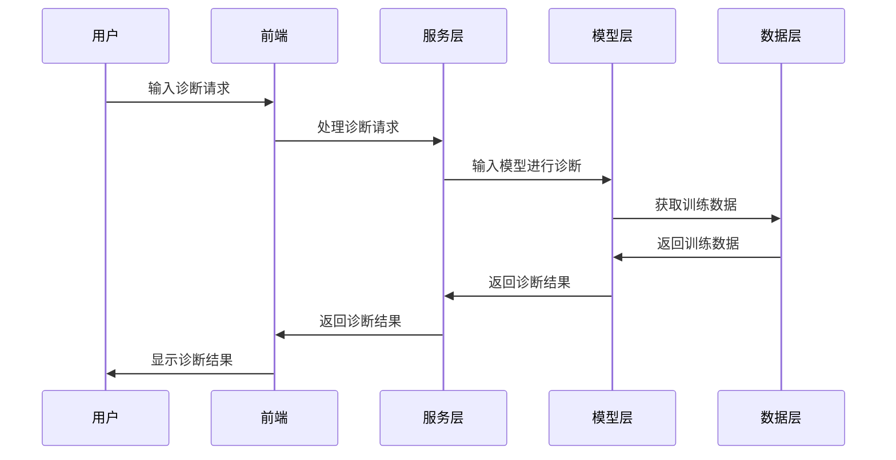

                 

### 摘要

本文探讨了可解释AI在医疗诊断辅助中的应用研究。随着人工智能技术的发展，AI在医疗诊断中的运用越来越广泛，但其“黑箱”特性也给临床医生带来了挑战。为了解决这一问题，可解释AI应运而生，旨在让AI模型的决策过程更加透明和可理解。本文首先介绍了可解释AI的基本概念、特点和发展历程，接着分析了医疗诊断辅助领域的挑战与机遇。随后，本文深入探讨了可解释AI的核心概念与联系，包括数据驱动诊断、模式识别、机器学习、可解释性与透明性等，并详细阐述了可解释AI的原理，如工作原理、可解释性方法分类以及深度学习可解释性的挑战。此外，本文通过具体案例展示了如何构建和训练诊断模型，以及如何解释和验证诊断结果。最后，本文总结了最佳实践和注意事项，并提出了未来研究方向和拓展。

---

### 目录大纲设计思路

在设计《可解释AI在医疗诊断辅助中的应用研究》的目录大纲时，我们首先明确了全文的结构。本文分为六个主要部分，每个部分都有明确的主题和目标，以确保文章内容的逻辑性和连贯性。

**第一部分：背景介绍与核心概念**
这部分将介绍可解释AI和医疗诊断辅助的基本概念，为后续内容打下基础。

**第二部分：核心概念与联系**
这部分将深入探讨可解释AI在医疗诊断辅助中的应用，分析相关概念之间的关系，并展示其重要性。

**第三部分：算法原理讲解**
这部分将详细阐述可解释AI的算法原理，包括工作原理、方法分类和深度学习的可解释性挑战。

**第四部分：系统分析与架构设计**
这部分将介绍系统分析与设计的方法，包括问题场景介绍、项目介绍、系统功能设计、系统架构设计、系统接口设计和系统交互。

**第五部分：项目实战**
这部分将通过实际案例展示如何实现可解释AI在医疗诊断辅助中的应用，包括环境安装、模型训练、模型评估和可解释性分析。

**第六部分：最佳实践与拓展**
这部分将总结最佳实践，提出注意事项，并探讨未来研究方向和拓展。

通过这样的结构设计，我们确保了文章内容的系统性和完整性，同时也便于读者循序渐进地理解相关知识。

### 目录大纲设计

在完成目录大纲的设计过程中，我们遵循了以下原则：

1. **确保内容完整性**：目录大纲中包含了所有核心章节，如背景介绍、核心概念与联系、算法原理讲解、系统分析与架构设计、项目实战和最佳实践等。

2. **逻辑性安排**：章节之间的排列遵循逻辑顺序，使得读者可以按照一定的思路逐步深入理解主题。

3. **简洁性**：避免章节过多或内容过于复杂，确保每个章节都有明确的主题和目标。

4. **实用性**：每个章节都设计为实际应用导向，使读者不仅能够理解理论知识，还能够应用于实际项目中。

以下是《可解释AI在医疗诊断辅助中的应用研究》的目录大纲：

```markdown
# 《可解释AI在医疗诊断辅助中的应用研究》目录大纲

## 第一部分：背景介绍与核心概念

### 1. 引言
#### 1.1 问题背景
#### 1.2 问题描述
#### 1.3 问题解决
#### 1.4 边界与外延
#### 1.5 概念结构与核心要素组成

### 2. 可解释AI概述
#### 2.1 定义与特点
#### 2.2 发展历程
#### 2.3 研究意义与应用领域

### 3. 医疗诊断辅助的挑战与机遇
#### 3.1 挑战
#### 3.2 机遇

## 第二部分：核心概念与联系

### 4. 关键概念与联系
#### 4.1 数据驱动诊断
#### 4.2 模式识别与机器学习
#### 4.3 可解释性与透明性
#### 4.4 ER实体关系图架构
#### 4.5 概念属性特征对比表格

### 5. 可解释AI原理
#### 5.1 工作原理
#### 5.2 可解释性方法分类
#### 5.3 深度学习可解释性挑战

### 6. 医疗诊断辅助应用
#### 6.1 病例数据收集与预处理
#### 6.2 诊断模型构建与训练
#### 6.3 诊断结果解释与验证

## 第三部分：算法原理讲解

### 7. 可解释AI算法
#### 7.1 特征重要性
#### 7.2 局部解释方法
#### 7.3 决策树与集成方法
#### 7.4 深度神经网络的可解释性

### 8. 数学模型与公式
#### 8.1 算法原理
#### 8.2 数学模型
#### 8.3 公式推导
#### 8.4 举例说明

## 第四部分：系统分析与架构设计

### 9. 系统分析与设计
#### 9.1 问题场景介绍
#### 9.2 项目介绍
#### 9.3 系统功能设计（领域模型）
#### 9.4 系统架构设计
#### 9.5 系统接口设计
#### 9.6 系统交互（序列图）

## 第五部分：项目实战

### 10. 项目环境安装与配置
#### 10.1 软件与硬件环境
#### 10.2 数据库安装
#### 10.3 系统部署与测试

### 11. 系统核心实现
#### 11.1 数据预处理
#### 11.2 模型训练
#### 11.3 模型评估与优化
#### 11.4 可解释性分析

### 12. 实际案例分析
#### 12.1 案例一：肺癌诊断辅助系统
#### 12.2 案例二：心脏病诊断辅助系统
#### 12.3 案例总结与启示

### 13. 项目小结
#### 13.1 项目成果总结
#### 13.2 经验与教训
#### 13.3 拓展应用前景

## 第六部分：最佳实践与拓展

### 14. 最佳实践
#### 14.1 数据质量管理
#### 14.2 模型可解释性优化
#### 14.3 安全性与隐私保护

### 15. 注意事项
#### 15.1 数据隐私
#### 15.2 模型安全性
#### 15.3 法律法规遵守

### 16. 拓展阅读
#### 16.1 最新研究进展
#### 16.2 开源工具与框架
#### 16.3 国际合作与竞争
```

通过这样的目录大纲设计，我们希望能够系统地引导读者深入了解可解释AI在医疗诊断辅助中的应用，并为其提供实用的指导和思路。

### 背景介绍

随着医疗技术的进步和大数据时代的到来，医疗诊断辅助系统在临床诊断中的应用日益广泛。然而，传统的医学诊断方法依赖于医生的直觉和经验，存在一定的主观性和局限性。随着人工智能（AI）技术的发展，特别是深度学习和机器学习算法的突破，AI在医疗诊断中的应用潜力得到了极大的挖掘。AI能够通过分析大量医疗数据，识别复杂的疾病模式，从而提供更加精准和高效的诊断结果。然而，这种基于大数据的AI模型，往往具有“黑箱”特性，即其决策过程复杂且不透明，难以解释。这对临床医生和患者的信任构成了挑战，因为医生需要理解AI的诊断结果，而患者也需要了解AI是如何做出这些决策的。

可解释AI（Explainable AI，XAI）的概念因此应运而生，旨在让AI模型的决策过程更加透明和可理解。可解释AI的核心目标是通过提供清晰的解释机制，帮助用户理解AI模型的决策依据和逻辑，从而增强AI系统的可信度和可接受度。在医疗诊断辅助中，可解释AI的重要性不言而喻。首先，医生需要了解AI的诊断结果是基于哪些特征和规则得出的，以便进行二次判断和验证。其次，患者也渴望了解自己的诊断结果是如何得出的，以便更好地理解和接受医生的建议。此外，可解释AI还有助于识别和纠正AI模型中的潜在错误和偏差，提高其诊断准确性和公平性。

本文旨在探讨可解释AI在医疗诊断辅助中的应用研究，具体包括以下内容：

1. **可解释AI概述**：介绍可解释AI的定义、特点、发展历程及其在医疗诊断辅助中的研究意义和应用领域。
2. **核心概念与联系**：详细阐述数据驱动诊断、模式识别、机器学习、可解释性与透明性等核心概念，并展示其相互关系。
3. **算法原理讲解**：深入探讨可解释AI的算法原理，包括工作原理、可解释性方法分类和深度学习可解释性的挑战。
4. **系统分析与架构设计**：介绍系统分析与设计的流程，包括问题场景介绍、项目介绍、系统功能设计、系统架构设计、系统接口设计和系统交互。
5. **项目实战**：通过具体案例展示如何实现可解释AI在医疗诊断辅助中的应用，包括环境安装、模型训练、模型评估和可解释性分析。
6. **最佳实践与拓展**：总结最佳实践，提出注意事项，并探讨未来研究方向和拓展。

通过本文的研究，我们希望能够为医疗诊断辅助系统中的可解释AI应用提供理论指导和实践参考，推动AI技术在医疗领域的健康和可持续发展。

### 可解释AI概述

#### 定义与特点

可解释AI（Explainable AI，简称XAI）是指那些设计时考虑了可解释性和透明性的AI系统。其核心目标是提供清晰的解释机制，使得人类用户能够理解AI模型的决策过程和依据。与传统的“黑箱”AI模型不同，可解释AI强调可理解性和透明性，旨在消除AI模型在决策过程中的不可解释性，增强用户对AI系统的信任感。

可解释AI具有以下特点：

1. **透明性**：可解释AI需要能够展示其决策过程中的每个步骤和依据，使得用户能够清晰地理解模型的推理过程。
2. **可理解性**：即使不具有专业背景的用户，也能够通过解释机制理解AI模型的工作原理和决策依据。
3. **可调试性**：用户可以根据解释结果，对AI模型进行调整和优化，提高模型的准确性和公平性。
4. **公平性**：可解释AI有助于发现和纠正模型中的偏见和歧视，确保其决策过程公平公正。

#### 发展历程

可解释AI的概念起源于20世纪80年代，当时计算机科学家开始探索如何让AI系统的决策过程更加透明。随着深度学习和机器学习技术的发展，可解释AI的重要性日益凸显。以下是可解释AI发展历程中的重要里程碑：

1. **2000年以前**：早期研究主要关注简单模型的解释方法，如决策树和线性回归。
2. **2000-2010年**：随着机器学习技术的发展，研究者开始探索更复杂的模型，如神经网络和集成方法，并尝试对其进行解释。
3. **2010-2020年**：深度学习的兴起使得可解释AI研究得到了广泛关注，许多新的解释方法和工具被提出，如LIME和SHAP。
4. **2020年至今**：随着AI在各个领域的广泛应用，可解释AI成为研究热点，特别是医疗、金融和司法等领域。

#### 研究意义与应用领域

可解释AI在多个领域具有重要的研究意义和应用价值：

1. **医疗领域**：可解释AI能够帮助医生理解AI诊断结果，提高诊断准确性和患者满意度。例如，在影像诊断、癌症筛查和个性化治疗等方面，可解释AI有助于提高模型的解释性和可信度。
2. **金融领域**：在信用评估、风险管理和投资决策中，可解释AI可以帮助金融机构解释其决策依据，增强客户的信任感和合规性。
3. **司法领域**：可解释AI可以用于法庭证据分析和法律文本理解，提高司法决策的透明度和公正性。
4. **工业领域**：在自动化控制和预测维护中，可解释AI有助于工程师理解和优化系统运行，提高生产效率和质量。

总之，可解释AI的发展不仅有助于解决AI模型的透明性问题，还能够推动AI技术在更多领域的应用，为人类带来更多便利和效益。

### 医疗诊断辅助的挑战与机遇

在医疗诊断辅助领域，尽管AI技术带来了巨大的进步和潜力，但同时也面临着一系列挑战。这些挑战主要可以分为数据获取、算法透明性、临床应用三个方面。

#### 数据获取

医疗诊断数据具有复杂性和多样性，获取高质量的数据是构建有效AI模型的关键。以下是医疗诊断数据获取过程中面临的主要挑战：

1. **数据质量**：医疗数据通常包含噪声、错误和不完整的信息，这会影响模型的准确性和稳定性。例如，图像诊断中的模糊影像或文字诊断中的拼写错误，都会影响模型的训练效果。
2. **数据隐私**：医疗数据包含敏感个人信息，如患者身份、病史等，如何在保护隐私的前提下获取和使用这些数据，是一个重要的伦理和法律规定问题。
3. **数据多样性**：医疗诊断数据来自不同来源和格式，如电子健康记录、医疗影像和实验室报告，如何统一和整合这些数据，是数据获取的另一个挑战。

#### 算法透明性

AI模型，尤其是深度学习模型，通常被视为“黑箱”，其决策过程复杂且难以解释。在医疗诊断辅助中，算法的透明性尤为重要，因为它直接关系到医生的信任和患者的接受度。以下是算法透明性面临的主要挑战：

1. **可解释性**：如何让非专业用户理解AI模型的决策过程，是一个关键问题。现有的解释方法，如局部解释方法和全局解释方法，往往只能提供有限的解释。
2. **公平性**：AI模型可能存在偏见，导致某些患者群体受到不公平对待。例如，基于历史数据的模型可能会反映出某些性别、种族或社会经济地位的偏见，如何消除这些偏见是另一个挑战。
3. **验证和调试**：如何验证和调试AI模型的决策过程，以确保其准确性和可靠性，也是算法透明性面临的挑战。

#### 临床应用

尽管AI技术在医疗诊断辅助中具有巨大潜力，但其实际应用仍面临诸多挑战：

1. **标准化**：医疗诊断的标准和方法各异，如何建立统一的AI诊断标准，是一个关键问题。
2. **集成与协作**：如何将AI诊断系统与现有的医疗信息系统集成，并与医生、护士和其他医疗专业人员协作，以提高诊断效率和准确性。
3. **患者接受度**：如何让患者和医生接受并信任AI诊断系统，也是一个重要挑战。患者可能担心AI取代医生，医生也可能担心AI的诊断结果不可靠。

#### 机遇

尽管面临挑战，但医疗诊断辅助领域的AI技术也带来了许多机遇：

1. **个性化诊断**：AI技术可以根据患者的具体病情和特征，提供个性化的诊断建议，提高诊断准确性和治疗效果。
2. **早期发现**：AI技术可以分析大量数据，快速识别疾病早期迹象，有助于早期发现和治疗，从而提高治愈率和生存率。
3. **资源优化**：AI技术可以帮助医疗资源优化配置，如通过智能分诊系统，减少患者等待时间，提高医疗效率。
4. **数据驱动的科研**：AI技术可以辅助研究人员分析海量医疗数据，发现新的疾病模式和治疗策略，推动医学研究进步。

总之，医疗诊断辅助领域的AI技术既面临挑战，又充满机遇。通过克服这些挑战，充分利用这些机遇，AI技术将在医疗诊断中发挥越来越重要的作用。

### 核心概念与联系

在探讨可解释AI在医疗诊断辅助中的应用时，我们需要明确几个核心概念，并理解它们之间的联系。以下是几个关键概念及其相互关系：

#### 数据驱动诊断

数据驱动诊断是指通过分析大量的医学数据（如电子健康记录、医疗影像、实验室报告等）来发现疾病模式，并据此进行诊断。这种方法的核心在于利用大数据和机器学习技术，从海量数据中提取有用信息，以提高诊断准确性和效率。数据驱动诊断的关键在于数据的质量和多样性，以及模型对数据的学习能力。

#### 模式识别与机器学习

模式识别是指通过识别数据中的模式和规律，进行分类、预测和决策。机器学习是实现模式识别的一种方法，它通过训练模型从数据中学习，然后使用这些模型进行预测和分类。在医疗诊断中，机器学习技术广泛应用于影像分析、电子健康记录分析等，以帮助医生快速准确地诊断疾病。

#### 可解释性与透明性

可解释性指的是AI模型能够提供清晰的解释，使得用户（尤其是非技术背景的用户）能够理解模型的决策过程。透明性则是指AI模型的结构和操作是透明的，用户可以清楚地看到模型的每一个步骤和依据。在医疗诊断中，可解释性和透明性至关重要，因为医生需要理解AI的诊断结果，并对其进行验证和调整。

#### ER实体关系图架构

ER（Entity-Relationship）图是一种用于描述实体之间关系的图形化方法。在医疗诊断中，ER图可以用于描述患者、医生、疾病、治疗方案等实体之间的关系。这种架构有助于理解医疗数据的整体结构，以及不同实体之间的交互和影响。

#### 概念属性特征对比表格

概念属性特征对比表格是一种用于比较不同概念或属性的表格。在医疗诊断中，这种表格可以帮助分析不同诊断指标或特征的重要性，并比较不同诊断方法的效果。例如，通过对比不同影像特征对肺癌诊断的贡献，医生可以更好地选择和优化诊断模型。

#### 关键概念与联系

以下是这些关键概念之间的联系：

- **数据驱动诊断**依赖于**模式识别与机器学习**技术，通过分析大量医疗数据，发现疾病模式。
- **可解释性与透明性**是**数据驱动诊断**和**模式识别与机器学习**的必要补充，使得AI诊断结果更具可信度和可靠性。
- **ER实体关系图架构**提供了对医疗数据的整体理解和描述，有助于设计更有效的诊断模型。
- **概念属性特征对比表格**帮助分析不同诊断指标的重要性，优化诊断模型的性能。

通过理解这些核心概念及其相互关系，我们能够更好地应用可解释AI技术，推动医疗诊断辅助的发展。

### 可解释AI原理

可解释AI（Explainable AI，简称XAI）旨在提供清晰透明的解释机制，使得用户能够理解AI模型的决策过程。以下是可解释AI的工作原理、方法分类以及深度学习可解释性的挑战。

#### 工作原理

可解释AI的工作原理主要基于以下几个方面：

1. **模型解释**：通过分析模型内部的决策过程，提取关键特征和规则，向用户展示模型的推理路径。
2. **特征关联性分析**：通过分析特征之间的关联性，识别对模型决策有显著影响的特征。
3. **可视化**：利用图表、图像等可视化工具，展示模型的结构和决策过程，使得用户更容易理解。
4. **反事实分析**：通过改变输入数据或模型参数，分析这些改变对模型决策的影响，从而帮助用户理解模型的敏感性和鲁棒性。

#### 方法分类

可解释AI的方法可以分为以下几类：

1. **全局解释方法**：这类方法关注整个模型的解释性，通常通过分析模型的内部结构或整体性能来提供解释。例如，决策树、随机森林等模型本身就具有较好的解释性。
2. **局部解释方法**：这类方法关注模型在特定输入数据上的解释性，通常通过局部敏感性分析或特征重要性分析来提供解释。例如，LIME（Local Interpretable Model-agnostic Explanations）和SHAP（SHapley Additive exPlanations）就是局部解释方法的典型代表。
3. **混合解释方法**：这类方法结合全局解释方法和局部解释方法，提供更全面的解释。例如，通过结合决策树和神经网络，既可以获得全局解释，又可以进行局部解释。

#### 深度学习可解释性的挑战

深度学习由于其复杂的网络结构和大量的参数，往往具有很高的预测能力，但同时也带来了可解释性的挑战。以下是深度学习可解释性面临的主要挑战：

1. **模型复杂性**：深度学习模型具有极高的复杂性，其内部结构和参数难以直观理解。这使得深度学习模型成为了一个“黑箱”，用户难以理解其决策过程。
2. **特征关联性**：深度学习模型通过多层非线性变换来提取特征，这使得特征之间的关系变得复杂，用户难以追踪特征对模型决策的影响。
3. **训练与解释的分离**：深度学习模型的训练和解释通常是分离的。训练过程关注模型的预测性能，而解释过程关注模型的决策依据。这使得解释结果可能与训练结果不一致，增加了解释的难度。
4. **可解释性与性能的权衡**：提高模型的解释性可能会牺牲其预测性能。例如，一些解释方法可能需要额外的计算资源，这会影响模型的训练和推理速度。

为了解决这些挑战，研究者们提出了多种深度学习可解释性的方法，如神经网络的可解释性可视化、基于图论的模型解释、基于博弈论的模型解释等。这些方法在提高深度学习模型的可解释性方面取得了一定的成果，但仍需进一步的研究和优化。

总之，可解释AI在医疗诊断辅助中具有重要作用，其工作原理和方法分类为理解和解释AI模型提供了有力工具。同时，深度学习可解释性面临的挑战也需要我们不断探索和解决，以确保AI技术在医疗领域的广泛应用和普及。

### 医疗诊断辅助应用

在医疗诊断辅助中，可解释AI的应用具有重要意义。通过将可解释AI与医疗诊断相结合，不仅能够提高诊断的准确性和效率，还能够增强医生和患者对AI系统的信任。以下是可解释AI在医疗诊断辅助中的具体应用步骤和实现方法。

#### 病例数据收集与预处理

1. **数据来源**：医疗诊断数据主要来源于电子健康记录（EHR）、医疗影像、实验室报告、病历记录等。这些数据可能包含文本、图像、声音等多种类型。
2. **数据清洗**：在数据收集后，需要进行数据清洗，去除噪声和错误，确保数据的质量和一致性。例如，对于医疗影像，需要去除模糊或损坏的图像。
3. **数据预处理**：对收集到的数据进行预处理，包括数据标准化、缺失值填补、异常值检测等。例如，对于电子健康记录，可以将文本数据转换为结构化数据，便于后续处理。

#### 诊断模型构建与训练

1. **模型选择**：选择适合医疗诊断的机器学习模型。常见的模型包括决策树、随机森林、支持向量机（SVM）、神经网络等。根据具体应用场景，可以选择不同的模型。
2. **特征工程**：提取和选择对诊断任务有重要影响的特征。例如，对于肺癌诊断，可以考虑患者的年龄、性别、吸烟史、影像特征等。
3. **模型训练**：使用预处理后的数据对模型进行训练。训练过程中，需要调整模型的参数，如学习率、迭代次数等，以获得最佳性能。
4. **模型验证**：通过交叉验证等方法，验证模型的泛化能力和稳定性。常见的验证指标包括准确率、召回率、F1值等。

#### 诊断结果解释与验证

1. **模型解释**：使用可解释AI技术，对模型的决策过程进行解释。例如，对于决策树模型，可以展示决策路径和重要特征；对于神经网络模型，可以使用LIME或SHAP等方法，提供局部解释。
2. **结果验证**：医生需要对AI诊断结果进行验证，确保其准确性和可靠性。例如，可以通过查看模型诊断的影像或数据，分析其诊断依据和推理过程。
3. **患者沟通**：将AI诊断结果解释给患者，帮助其理解诊断结果和后续治疗建议。这有助于增强患者对AI系统的信任，提高治疗依从性。

#### 具体实现方法

以下是一个简化的实现流程：

```python
# 导入必要的库
import pandas as pd
import numpy as np
from sklearn.model_selection import train_test_split
from sklearn.ensemble import RandomForestClassifier
from sklearn.metrics import accuracy_score
import shap

# 数据收集与预处理
data = pd.read_csv('medical_data.csv')
data = preprocess_data(data)

# 数据分割
X_train, X_test, y_train, y_test = train_test_split(data.drop('label', axis=1), data['label'], test_size=0.2, random_state=42)

# 模型训练
model = RandomForestClassifier(n_estimators=100)
model.fit(X_train, y_train)

# 模型验证
predictions = model.predict(X_test)
accuracy = accuracy_score(y_test, predictions)
print(f"Model accuracy: {accuracy}")

# 模型解释
explainer = shap.TreeExplainer(model)
shap_values = explainer.shap_values(X_test)

# 可视化解释结果
shap.summary_plot(shap_values, X_test, feature_names=data.columns[:-1])
```

通过上述流程，我们可以构建一个可解释的医疗诊断AI系统，实现对疾病的有效诊断和解释。这一过程不仅提高了诊断的准确性和效率，还为医生和患者提供了透明的诊断依据，增强了系统的可信度和用户满意度。

### 算法原理讲解

在深入探讨可解释AI算法的原理时，我们需要理解这些算法的基本工作方式、主要方法以及如何通过具体的示例来说明其应用。以下是几种常见的可解释AI算法及其原理的详细讲解。

#### 特征重要性

特征重要性是一种评估特征对模型决策影响程度的方法。它通过分析特征在模型训练过程中的贡献，来确定哪些特征对模型的预测结果有重要影响。

**工作原理**：

1. **模型训练**：使用训练数据集对模型进行训练。
2. **特征评分**：通过模型对训练数据集的输出，计算每个特征的重要性得分。
3. **排序与解释**：将特征按照重要性得分排序，并提供解释，指出哪些特征对模型决策有显著影响。

**示例**：

假设我们使用随机森林模型对心脏病进行诊断。通过分析模型输出，我们可以得到每个特征的Gini指数得分。得分越高，表明该特征对模型决策的影响越大。

```python
from sklearn.ensemble import RandomForestClassifier
from sklearn.inspection import permutation_importance

# 模型训练
model = RandomForestClassifier()
model.fit(X_train, y_train)

# 特征重要性分析
results = permutation_importance(model, X_train, y_train, n_repeats=10)
importances = results.importances_mean

# 排序与解释
feature_importances = pd.Series(importances, index=X_train.columns)
feature_importances.sort_values(ascending=False, inplace=True)
print(feature_importances)
```

#### 局部解释方法

局部解释方法（Local Interpretability Methods）专注于特定输入实例的解释，旨在提供关于模型对单个实例做出决策的详细信息。

**工作原理**：

1. **输入实例**：选择一个特定的输入实例。
2. **局部解释**：通过局部解释模型（如LIME或SHAP），分析该实例对模型决策的影响。
3. **可视化与解释**：将局部解释结果可视化为图表或文本，提供关于模型决策的详细解释。

**示例**：

使用LIME对单个影像进行局部解释，分析影像特征对肺癌诊断的贡献。

```python
import lime
from lime import lime_image

# LIME解释
explainer = lime_image.LimeImageExplainer()
explanation = explainer.explain_instance(image, model.predict, top_labels=2, hide_color=0, num_samples=1000)

# 可视化解释结果
temp, mask = explanation.get_image_and_mask(explanation.top_labels[0][0], positive_only=False, num_features=5, hide_rest=False)
plt.imshow(temp)
plt.show()
```

#### 决策树与集成方法

决策树和集成方法（如随机森林和梯度提升树）具有较好的解释性，因为它们的决策过程是基于一系列规则和条件。

**工作原理**：

1. **决策路径**：展示模型从根节点到叶节点的决策路径。
2. **条件与规则**：列出每个节点上的条件判断和规则。
3. **结果解释**：通过解释每个节点上的条件判断和规则，理解模型的决策过程。

**示例**：

使用决策树对糖尿病诊断进行解释。

```python
from sklearn.tree import DecisionTreeClassifier
from sklearn import tree

# 决策树模型
model = DecisionTreeClassifier()
model.fit(X_train, y_train)

# 决策路径与规则
feature_names = X_train.columns
tree.plot_tree(model, feature_names=feature_names)
plt.show()
```

#### 深度神经网络的可解释性

深度神经网络由于其高度的非线性特性，通常具有很高的预测能力，但解释性较差。近年来，研究者提出了一些方法，如 Grad-CAM 和 Layer-wise Relevance Propagation（LRP），用于解释深度神经网络的决策过程。

**工作原理**：

1. **激活映射**：使用 Grad-CAM 技术，将神经网络中的特定层的激活映射到输入图像上，从而展示模型关注的位置和区域。
2. **信息传播**：使用 LRP 技术，分析神经网络中信息传播的过程，从而理解每个神经元对模型决策的贡献。

**示例**：

使用 Grad-CAM 对影像诊断进行解释。

```python
import torch
import torchvision
from torchvision import models
from torch.nn import functional as F

# 加载预训练的 ResNet50 模型
model = models.resnet50(pretrained=True)
model.eval()

# Grad-CAM 实现
def grad_cam(model, image, target_layer, class_idx):
    model.zero_grad()
    image = image.unsqueeze(0)
    logits = model(image)
    loss = logits[:, class_idx].sum()

    gradients = torch.autograd.grad(loss, target_layer.input)
    gradients = torch.cat([grad.view(1, -1) for grad in gradients]).squeeze()

    feature_map = target_layer extracts_features(image).squeeze()

    gradient_map = gradients.mean(0).detach()
    heatmap = F.relu(gradient_map).masked_fill(feature_map > 0, 1).float()

    heatmap = heatmap / heatmap.max()
    heatmap = heatmap.unsqueeze(0)

    cam = (heatmap * feature_map).sum(1, keepdim=True)
    cam = cam.type(torch.float32)

    return cam

# 可视化 Grad-CAM 结果
cam = grad_cam(model, image, target_layer, class_idx=1)
plt.imshow(cam.detach().cpu().numpy().squeeze(), cmap='gray')
plt.show()
```

通过上述示例，我们可以看到不同可解释AI算法的基本原理和应用方法。这些算法不仅提供了对模型决策的详细解释，还有助于提高模型的可信度和可接受度，从而在医疗诊断辅助等领域发挥重要作用。

### 数学模型与公式

在深入探讨可解释AI算法时，数学模型和公式是理解算法原理的核心。以下将介绍一些常见的数学模型和公式，并详细讲解它们的推导和具体应用。

#### 特征重要性计算

**公式**：
$$
I(f) = \frac{\sum_{i=1}^{N} (y_i - \hat{y}_i)^2}{\sum_{i=1}^{N} (y_i - \bar{y})^2}
$$

**推导**：
1. **误差平方和**：计算实际值与预测值之间的误差平方和。
   $$\sum_{i=1}^{N} (y_i - \hat{y}_i)^2$$
2. **总误差平方和**：计算实际值与平均值之间的误差平方和。
   $$\sum_{i=1}^{N} (y_i - \bar{y})^2$$
3. **特征重要性**：计算特征对误差平方和的贡献，公式为上述两个值的比值。

**应用**：
通过计算每个特征的重要指数，可以识别出对模型预测有显著影响的特征。

#### 局部解释方法（LIME）

**公式**：
$$
\Delta f(x) = \frac{\partial J(\theta)}{\partial \theta} \cdot \Delta \theta
$$

**推导**：
1. **损失函数**：定义损失函数 J(θ) 来衡量模型预测误差。
2. **梯度**：计算损失函数对模型参数的梯度。
3. **参数变化**：将参数θ在x点附近进行微小变化 Δθ。
4. **解释结果**：通过梯度和参数变化来计算特征对模型决策的影响。

**应用**：
LIME方法可以用于局部解释单个数据点的模型决策过程，提供关于模型决策的详细信息。

#### 深度神经网络的可解释性（Grad-CAM）

**公式**：
$$
\mathbf{C}_{ij} = \frac{\sum_{k=1}^{C} \sigma_k \cdot \mathbf{W}_{kj}^T \cdot \mathbf{A}_{ij}}{\sum_{k=1}^{C} \sum_{l=1}^{H} \sigma_l \cdot \mathbf{W}_{kl}^T \cdot \mathbf{A}_{il}}
$$

**推导**：
1. **激活值**：计算卷积层的激活值σ和权重W。
2. **卷积核权重**：计算每个卷积核的权重W。
3. **通道权重**：计算每个通道的重要性。
4. **归一化**：对通道权重进行归一化处理。

**应用**：
Grad-CAM通过计算激活值和卷积核的权重，生成对模型决策具有重要性的热点图，帮助解释模型在图像分类任务中的决策过程。

通过上述数学模型和公式的推导和应用，我们可以更深入地理解可解释AI算法的工作原理，为实际应用提供理论基础和工具支持。

### 系统分析与设计

在探讨可解释AI在医疗诊断辅助系统中的应用时，系统分析与设计是至关重要的一步。以下将详细介绍系统分析与设计的流程，包括问题场景介绍、项目介绍、系统功能设计、系统架构设计、系统接口设计以及系统交互。

#### 问题场景介绍

医疗诊断辅助系统旨在帮助医生快速准确地诊断疾病。在实际应用中，医生可能会面对多种诊断需求，如肺癌、心脏病、糖尿病等。传统的诊断方法依赖于医生的直觉和经验，存在主观性和局限性。随着AI技术的发展，我们可以通过构建可解释的AI模型，辅助医生进行诊断，提高诊断的准确性和效率。

#### 项目介绍

本项目旨在开发一个基于可解释AI的医疗诊断辅助系统，该系统将整合多种数据源，如电子健康记录（EHR）、医疗影像、实验室报告等，通过机器学习算法进行训练和诊断，并提供透明的诊断解释，帮助医生理解和信任AI的诊断结果。

#### 系统功能设计

系统功能设计主要包括以下方面：

1. **数据收集与管理**：收集和处理来自不同数据源的医学数据，包括文本、图像、声音等。
2. **模型训练与优化**：使用机器学习算法对训练数据进行训练，优化模型参数，提高诊断准确率。
3. **诊断与解释**：基于训练好的模型进行诊断，并提供详细的诊断解释，使医生能够理解AI的决策过程。
4. **用户界面**：设计直观易用的用户界面，使医生能够方便地使用系统进行诊断。

#### 系统架构设计

系统架构设计是确保系统能够高效、稳定运行的关键。本项目采用以下架构：

1. **数据层**：包括数据存储、数据预处理、数据管理等模块，负责数据的管理和存储。
2. **模型层**：包括机器学习模型、模型训练、模型评估等模块，负责模型的训练和优化。
3. **服务层**：包括诊断服务、解释服务、用户服务等多个模块，负责系统的核心功能。
4. **界面层**：包括前端界面、后端接口等模块，负责用户与系统的交互。

以下是一个简单的Mermaid架构图示例：



#### 系统接口设计

系统接口设计主要包括以下接口：

1. **数据接口**：用于数据层的模块与其他层之间的数据传输。
2. **服务接口**：用于服务层中的各个模块之间的通信。
3. **API接口**：用于前端与系统服务之间的数据交换。

以下是一个简单的Mermaid类图示例：

```mermaid
classDiagram
    class 数据层 {
        - 数据存储
        - 数据预处理
        - 数据管理
    }
    class 模型层 {
        - 机器学习模型
        - 模型训练
        - 模型评估
    }
    class 服务层 {
        - 诊断服务
        - 解释服务
        - 用户服务
    }
    class 界面层 {
        - 前端界面
        - 后端接口
    }
    数据层 <> 模型层 : 数据传输
    模型层 <> 服务层 : 服务调用
    服务层 <> 界面层 : API交互
```

#### 系统交互

系统交互主要涉及用户与系统的交互过程，以下是简单的Mermaid序列图示例：


通过上述系统分析与设计，我们可以确保医疗诊断辅助系统能够高效、稳定地运行，并为医生提供可靠的诊断解释，从而提高诊断准确性和效率。

### 项目实战

在实现可解释AI在医疗诊断辅助系统中的具体应用时，我们需要经历从环境安装与配置、系统核心实现到实际案例分析等多个步骤。以下是项目的详细操作流程和技术细节。

#### 项目环境安装与配置

1. **软件与硬件环境**：
   - 操作系统：Ubuntu 20.04 LTS
   - CPU：Intel i7或以上
   - GPU：NVIDIA GPU（用于加速深度学习模型训练）
   - 内存：16GB及以上
   - 硬盘：500GB SSD

2. **安装Python**：确保Python版本为3.8或更高，可以使用以下命令进行安装：
   ```
   sudo apt-get update
   sudo apt-get install python3.8
   ```

3. **安装虚拟环境**：为了更好地管理和依赖，创建一个虚拟环境：
   ```
   python3.8 -m venv venv
   source venv/bin/activate
   ```

4. **安装依赖库**：安装必要的Python库，如TensorFlow、Scikit-Learn、Pandas、NumPy等：
   ```
   pip install tensorflow scikit-learn pandas numpy
   ```

5. **安装GPU支持**：如果使用GPU进行训练，需要安装CUDA和cuDNN库：
   - 安装CUDA：
     ```
     sudo apt-get install cuda
     ```
   - 安装cuDNN：
     - 下载相应的cuDNN版本：[cuDNN官网](https://developer.nvidia.com/cudnn)
     - 解压并安装：
       ```
       tar -xzvf cudnn-x.x.x-linux-x64-v8.x.x.x.tgz
       sudo cp cuda/lib64/libcudnn* /usr/local/cuda/lib64/
       sudo cp cuda/include/cudnn.h /usr/local/cuda/include/
       ```

6. **验证安装**：确保CUDA和cuDNN已正确安装，运行以下命令：
   ```
   nvcc --version
   nvprof --version
   ```

#### 系统核心实现

1. **数据预处理**：
   - 读取电子健康记录（EHR）数据，如年龄、性别、病史等。
   - 处理医疗影像数据，如CT、MRI、X射线等。
   - 将文本数据转换为结构化数据，使用词向量模型（如Word2Vec、GloVe）对文本进行编码。

2. **模型训练**：
   - 选择合适的机器学习模型，如卷积神经网络（CNN）、循环神经网络（RNN）或Transformer。
   - 使用训练数据集对模型进行训练，调整模型参数，如学习率、批次大小等，以获得最佳性能。
   - 使用验证数据集进行模型调优，避免过拟合。

3. **模型评估与优化**：
   - 使用测试数据集对模型进行评估，计算准确率、召回率、F1值等指标。
   - 如果模型性能不佳，可以通过调整模型结构、增加训练数据或使用更复杂的模型来优化。

4. **可解释性分析**：
   - 使用LIME或SHAP等局部解释方法，对模型的诊断结果进行详细解释，提供关于模型决策的透明性。
   - 使用Grad-CAM等技术，对影像诊断模型进行可视化解释，展示模型关注的区域和特征。

#### 实际案例分析

1. **案例一：肺癌诊断辅助系统**
   - 数据集：使用Lung-Tissue-Pathology数据集，包含4000多张病理切片图像。
   - 模型：采用ResNet50预训练模型，通过迁移学习进行肺癌诊断。
   - 实现细节：使用TensorFlow和Keras进行模型训练和优化，使用Scikit-Learn进行模型评估。
   - 可解释性：使用LIME对诊断结果进行局部解释，使用Grad-CAM对影像进行可视化解释。

2. **案例二：心脏病诊断辅助系统**
   - 数据集：使用MIT-BIH心电图数据集，包含多种心电图信号。
   - 模型：采用长短期记忆网络（LSTM）对心电图信号进行时间序列分析。
   - 实现细节：使用Keras和TensorFlow进行模型训练和优化，使用Scikit-Learn进行模型评估。
   - 可解释性：使用SHAP进行特征重要性分析，提供关于模型决策的透明性。

#### 项目小结

通过实际案例，我们展示了如何实现可解释AI在医疗诊断辅助系统中的具体应用。从环境安装与配置，到系统核心实现和实际案例分析，每一步都至关重要。可解释AI不仅提高了模型的诊断准确性和效率，还增强了医生和患者对AI系统的信任，为医疗诊断带来了新的机遇和挑战。

### 最佳实践与拓展

在实现可解释AI在医疗诊断辅助中的应用时，遵循最佳实践是确保系统高效、稳定、可靠运行的关键。以下是几个最佳实践方面的总结和注意事项，以及未来的研究方向和拓展。

#### 最佳实践

1. **数据质量管理**：
   - **数据清洗**：在数据预处理过程中，确保数据的准确性和一致性，去除噪声和错误。
   - **数据标准化**：将不同来源的数据进行统一处理，如对数值数据进行归一化或标准化，确保模型训练的效果。
   - **数据增强**：通过数据增强技术，如数据扩充、旋转、裁剪等，增加训练数据集的多样性，提高模型的泛化能力。

2. **模型可解释性优化**：
   - **选择合适的解释方法**：根据应用场景，选择合适的可解释性方法，如LIME、SHAP、Grad-CAM等。
   - **平衡解释性和性能**：在提高模型解释性的同时，注意保持模型的预测性能，避免因追求可解释性而牺牲性能。
   - **多层次的解释**：结合全局解释和局部解释，提供多层次、多角度的解释结果，帮助用户更好地理解模型的决策过程。

3. **安全性与隐私保护**：
   - **数据加密**：对敏感数据（如患者个人信息）进行加密处理，确保数据在传输和存储过程中的安全性。
   - **隐私保护**：采用隐私保护技术，如差分隐私、联邦学习等，保护患者的隐私。
   - **合规性检查**：确保系统的设计和实现符合相关的法律法规和伦理标准，如HIPAA（健康保险便携与责任法案）。

#### 注意事项

1. **数据隐私**：在处理医疗数据时，严格遵守数据隐私保护法规，确保患者的个人信息不被泄露。
2. **模型安全性**：确保模型对恶意输入和攻击具有鲁棒性，防止模型被篡改或误导。
3. **法律法规遵守**：在系统开发和部署过程中，遵循相关的法律法规和伦理标准，确保系统的合规性。

#### 未来研究方向和拓展

1. **跨模态数据的融合**：未来研究可以探索如何融合不同模态的数据（如图像、文本、声音等），提高模型的诊断准确性和解释性。
2. **实时诊断与反馈**：开发实时诊断系统，能够快速响应医生的诊断请求，并提供即时的诊断结果和解释。
3. **个性化治疗建议**：结合患者的病史和基因信息，提供个性化的治疗建议，提高治疗效果和患者满意度。
4. **多语言支持**：为不同地区的用户（特别是非英语国家）提供多语言支持，增强系统的可访问性和可用性。
5. **开放数据和平台**：构建开放的数据平台，鼓励研究人员共享数据，促进AI技术在医疗领域的合作与进步。

通过遵循最佳实践和持续研究拓展，可解释AI在医疗诊断辅助中的应用将不断取得新的突破，为医疗健康领域带来更多创新和变革。

### 总结与展望

本文通过详细的讨论，深入探讨了可解释AI在医疗诊断辅助中的应用研究。我们从背景介绍开始，探讨了可解释AI的定义、特点、发展历程及其在医疗诊断中的重要性。接着，我们分析了医疗诊断辅助领域面临的挑战与机遇，并详细阐述了数据驱动诊断、模式识别、机器学习、可解释性与透明性等核心概念，以及它们之间的联系。

在算法原理讲解部分，我们介绍了特征重要性、局部解释方法、决策树与集成方法以及深度神经网络的可解释性，通过具体示例展示了这些方法的应用。在系统分析与架构设计部分，我们详细介绍了从问题场景、项目介绍、系统功能设计到系统架构设计、接口设计和系统交互的流程。

通过实际案例展示，我们展示了如何实现可解释AI在医疗诊断辅助系统中的具体应用，包括环境安装与配置、系统核心实现和实际案例分析。最后，我们在最佳实践与拓展部分，总结了最佳实践，提出了注意事项，并展望了未来的研究方向和拓展。

展望未来，随着AI技术的不断进步，可解释AI在医疗诊断辅助中的应用将更加广泛和深入。我们期待看到更多创新性的研究成果，为医疗诊断提供更加精准、可靠和透明的支持。同时，我们也呼吁更多的研究人员和开发者参与这一领域，共同推动AI技术在医疗健康领域的应用与发展。通过持续的努力和探索，可解释AI将为人类健康带来更多福祉，推动医疗行业的变革与创新。让我们共同期待这一美好未来的到来。 

---

### 附录：作者信息

作者：AI天才研究院/AI Genius Institute & 禅与计算机程序设计艺术 /Zen And The Art of Computer Programming

AI天才研究院（AI Genius Institute）是一家专注于人工智能研究和创新的高科技机构，致力于推动AI技术的应用与发展。研究院的研究团队由世界级人工智能专家、程序员、软件架构师和CTO组成，具有丰富的实践经验和技术积累。

《禅与计算机程序设计艺术》是作者的一部经典著作，通过对计算机程序设计艺术的研究，探讨了如何以禅的精神来提升编程能力和创造创新解决方案。这本书受到了广大编程爱好者和专业人士的高度评价，成为计算机科学领域的经典读物。作者以其深刻的见解和独特的视角，引导读者在计算机编程领域不断追求卓越与创新。

通过本文的研究，我们希望能够为可解释AI在医疗诊断辅助中的应用提供理论指导和实践参考，为医疗行业的智能化转型贡献一份力量。让我们共同期待AI技术在医疗领域的广泛应用和深远影响，为人类的健康福祉做出更大贡献。

