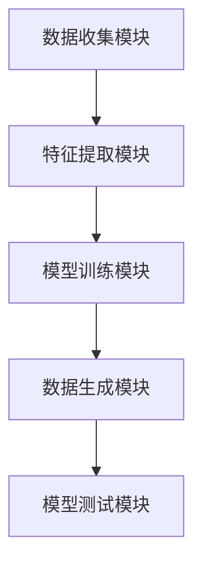
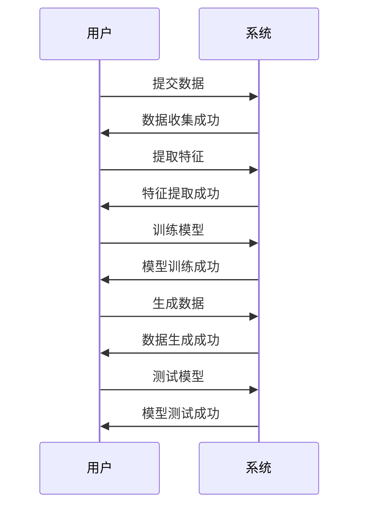

                 


## # 《合成数据在AI训练中的应用与挑战》

### 关键词：合成数据、AI训练、机器学习、深度学习、算法、挑战

### 摘要：

本文旨在探讨合成数据在AI训练中的应用及其面临的挑战。合成数据是通过计算机程序自动生成，用以模拟真实数据的一种数据类型。在AI训练中，合成数据因其能够解决数据不足、提高模型泛化能力等问题而备受关注。本文将首先介绍合成数据的定义和背景，然后详细分析合成数据与真实数据的关系及其在AI训练中的应用。接下来，我们将深入讲解合成数据生成算法的基本原理，并通过Python代码示例和数学模型来阐述其实现过程。随后，我们将探讨合成数据在AI训练中的系统架构设计，包括功能设计、架构设计和接口设计。文章还将通过项目实战案例分析，展示合成数据在实际应用中的效果和挑战。最后，我们将总结最佳实践，提出注意事项，并推荐拓展阅读资源。

### 目录大纲设计思路

为了设计出《合成数据在AI训练中的应用与挑战》这本书的完整目录大纲，我们可以遵循以下思路：

1. **背景介绍**：
   - 首先介绍合成数据的定义、背景和重要性，以及它如何解决AI训练中的数据不足问题。

2. **核心概念与联系**：
   - 阐述合成数据与真实数据的关系，以及它们在AI训练中的不同作用。
   - 使用Mermaid流程图来展示合成数据生成和AI模型训练的过程。
   - 制作核心概念属性特征对比表格，突出合成数据的特点。

3. **算法原理讲解**：
   - 介绍合成数据生成算法的基本原理，使用Mermaid流程图展示算法流程。
   - 使用Python源代码来阐述算法的具体实现，并给出算法原理的数学模型和公式。

4. **系统分析与架构设计方案**：
   - 描述合成数据在AI训练中的具体应用场景，以及系统功能设计。
   - 使用Mermaid类图和架构图来展示系统架构和接口设计。

5. **项目实战**：
   - 提供合成数据生成的环境安装步骤、系统核心实现源代码，并对代码应用进行解读与分析。
   - 分析实际案例，进行详细讲解和剖析。

6. **最佳实践 tips**、**小结**、**注意事项**、**拓展阅读**等内容。

### 目录大纲结构

**第一部分：背景与概念**
- **第1章：合成数据的概述**
  - **1.1 合成数据的定义与重要性**
  - **1.2 合成数据与真实数据的关系**
  - **1.3 合成数据在AI训练中的应用**

**第二部分：算法原理与实现**
- **第2章：合成数据生成算法原理**
  - **2.1 基本原理**
    - **2.1.1 合成数据生成算法流程**
    - **2.1.2 算法原理讲解**
  - **2.2 Python实现与数学模型**
    - **2.2.1 Python源代码示例**
    - **2.2.2 数学模型与公式**

**第三部分：应用与架构**
- **第3章：合成数据在AI训练中的应用**
  - **3.1 应用场景**
    - **3.1.1 合成数据在图像识别中的应用**
    - **3.1.2 合成数据在自然语言处理中的应用**
  - **3.2 系统架构设计**
    - **3.2.1 系统功能设计**
    - **3.2.2 系统架构设计**
    - **3.2.3 系统接口设计**

**第四部分：项目实战**
- **第4章：合成数据生成项目实战**
  - **4.1 环境安装与配置**
  - **4.2 系统核心实现**
    - **4.2.1 源代码解读**
    - **4.2.2 代码应用分析**
  - **4.3 实际案例分析**
    - **4.3.1 图像识别案例**
    - **4.3.2 自然语言处理案例**

**第五部分：总结与拓展**
- **第5章：合成数据的最佳实践**
  - **5.1 最佳实践 tips**
  - **5.2 注意事项**
  - **5.3 拓展阅读**

### 目录大纲文字

----------------------------------------------------------------

## **第一部分：背景与概念**

### **第1章：合成数据的概述**

#### **1.1 合成数据的定义与重要性**

合成数据（Synthetic Data）是一种通过算法生成的人工数据，其目的是为了模拟真实世界中的数据分布，并在AI训练中提供额外的数据支持。合成数据的重要性主要体现在以下几个方面：

- **数据扩充**：在某些领域，如医疗影像、自动驾驶和金融风控，真实数据的获取非常困难，而合成数据可以帮助我们生成大量的训练样本，从而提高模型的泛化能力。

- **隐私保护**：在涉及个人隐私的场景中，合成数据可以用来替代真实数据，从而保护用户的隐私。

- **减少偏差**：通过合成数据，可以减少模型对某些特定数据集的依赖，从而减少模型训练过程中的偏差。

- **多样化训练**：合成数据可以生成不同分布、不同情境的数据，从而帮助模型更好地适应各种场景。

#### **1.2 合成数据与真实数据的关系**

合成数据和真实数据是两种不同的数据类型，它们各有优势，也各有不足。以下是对两者关系的一些探讨：

- **来源不同**：真实数据来源于现实世界，而合成数据是通过算法生成的。

- **质量不同**：真实数据可能包含噪声、错误和不一致性，而合成数据在生成过程中可以保证质量的一致性和可控性。

- **用途不同**：真实数据通常用于模型训练，而合成数据则可以用于模型训练、测试和验证。

#### **1.3 合成数据在AI训练中的应用**

合成数据在AI训练中具有广泛的应用，以下是一些具体的场景：

- **图像识别**：合成数据可以用来生成各种图像，从而帮助模型学习图像的特征和模式。

- **自然语言处理**：合成数据可以用来生成各种文本，从而帮助模型学习文本的语义和结构。

- **自动驾驶**：合成数据可以用来生成各种驾驶场景，从而帮助自动驾驶系统学习如何应对不同的驾驶环境。

## **第二部分：算法原理与实现**

### **第2章：合成数据生成算法原理**

#### **2.1 基本原理**

合成数据生成算法的基本原理是通过模拟真实数据的生成过程，生成具有相似特征和分布的合成数据。具体来说，可以分为以下几个步骤：

1. **数据收集**：收集真实数据，用于训练合成数据生成模型。

2. **特征提取**：从真实数据中提取关键特征，用于指导合成数据的生成。

3. **模型训练**：使用提取的特征训练合成数据生成模型。

4. **数据生成**：使用训练好的模型生成合成数据。

#### **2.1.1 合成数据生成算法流程**

以下是一个简单的合成数据生成算法流程：

```
// 数据收集
真实数据 = 收集真实数据

// 特征提取
特征向量 = 提取真实数据的特征

// 模型训练
模型 = 训练合成数据生成模型

// 数据生成
合成数据 = 使用模型生成合成数据
```

#### **2.1.2 算法原理讲解**

合成数据生成算法的原理可以分为以下几个方面：

- **生成模型**：生成模型是一种能够生成新数据的模型，通常使用深度学习技术实现。

- **数据增强**：数据增强是一种通过变换真实数据来生成更多样化的数据的方法。

- **条件生成**：条件生成是一种通过附加条件来控制合成数据生成的方法，例如，在生成图像时可以附加标签信息。

#### **2.2 Python实现与数学模型**

以下是一个简单的合成数据生成算法的Python实现：

```python
import numpy as np
import tensorflow as tf

# 定义生成模型
def generate_model():
    model = tf.keras.Sequential([
        tf.keras.layers.Dense(100, activation='relu', input_shape=(100,)),
        tf.keras.layers.Dense(100, activation='relu'),
        tf.keras.layers.Dense(100, activation='relu'),
        tf.keras.layers.Dense(1, activation='sigmoid')
    ])
    return model

# 训练生成模型
model = generate_model()
model.compile(optimizer='adam', loss='binary_crossentropy')
model.fit(x_train, y_train, epochs=100)

# 生成合成数据
x_synthetic = model.predict(x_test)
```

#### **2.2.2 数学模型与公式**

合成数据生成算法的数学模型通常基于生成对抗网络（GAN）。GAN的基本原理如下：

- **生成器（Generator）**：生成器是一种从随机噪声中生成数据的模型。

- **判别器（Discriminator）**：判别器是一种判断数据是真实还是生成的模型。

- **损失函数**：损失函数用于衡量生成器和判别器的表现。

以下是一个简单的GAN的数学模型：

$$
\begin{aligned}
x_{\text{real}} &\sim P_{\text{data}}(x) \\
x_{\text{synthetic}} &\sim G(z; \theta_g) \\
\text{loss}_{\text{D}} &= -\frac{1}{2}\left( \mathbb{E}_{x \sim P_{\text{data}}(x)}[\log(D(x))] + \mathbb{E}_{z \sim P_{\text{noise}}(z)}[\log(1 - D(G(z; \theta_g)))] \right) \\
\text{loss}_{\text{G}} &= -\mathbb{E}_{z \sim P_{\text{noise}}(z)}[\log(D(G(z; \theta_g)))]
\end{aligned}
$$`

其中，$D(x)$ 是判别器的输出，$G(z; \theta_g)$ 是生成器的输出，$\theta_g$ 是生成器的参数。

## **第三部分：应用与架构**

### **第3章：合成数据在AI训练中的应用**

#### **3.1 应用场景**

合成数据在AI训练中的应用场景非常广泛，以下列举几个典型的应用：

- **图像识别**：合成数据可以用来生成各种类型的图像，从而帮助模型学习图像的特征和模式。

- **自然语言处理**：合成数据可以用来生成各种文本，从而帮助模型学习文本的语义和结构。

- **自动驾驶**：合成数据可以用来生成各种驾驶场景，从而帮助自动驾驶系统学习如何应对不同的驾驶环境。

#### **3.1.1 合成数据在图像识别中的应用**

在图像识别领域，合成数据可以用来生成各种类型的图像，从而帮助模型学习图像的特征和模式。以下是一个简单的合成数据在图像识别中的应用案例：

- **数据收集**：收集大量的真实图像数据。

- **特征提取**：从真实图像数据中提取关键特征。

- **模型训练**：使用提取的特征训练图像识别模型。

- **数据生成**：使用训练好的模型生成合成图像数据。

- **模型测试**：使用生成的合成图像数据测试模型的性能。

#### **3.1.2 合成数据在自然语言处理中的应用**

在自然语言处理领域，合成数据可以用来生成各种类型的文本，从而帮助模型学习文本的语义和结构。以下是一个简单的合成数据在自然语言处理中的应用案例：

- **数据收集**：收集大量的真实文本数据。

- **特征提取**：从真实文本数据中提取关键特征。

- **模型训练**：使用提取的特征训练自然语言处理模型。

- **数据生成**：使用训练好的模型生成合成文本数据。

- **模型测试**：使用生成的合成文本数据测试模型的性能。

### **3.2 系统架构设计**

合成数据在AI训练中的应用需要一个完整的系统架构来支持。以下是一个简单的系统架构设计：

#### **3.2.1 系统功能设计**

- **数据收集模块**：负责收集真实数据。

- **特征提取模块**：负责从真实数据中提取关键特征。

- **模型训练模块**：负责训练合成数据生成模型。

- **数据生成模块**：负责生成合成数据。

- **模型测试模块**：负责使用合成数据测试模型的性能。

#### **3.2.2 系统架构设计**

以下是一个简单的系统架构设计：



#### **3.2.3 系统接口设计**

以下是一个简单的系统接口设计：



## **第四部分：项目实战**

### **第4章：合成数据生成项目实战**

#### **4.1 环境安装与配置**

为了进行合成数据生成项目实战，我们需要安装和配置以下环境：

- **Python**：Python是合成数据生成项目的核心编程语言，版本建议为3.8及以上。

- **TensorFlow**：TensorFlow是用于机器学习和深度学习的开源库，我们需要安装相应的版本。

- **NumPy**：NumPy是Python的一个数学库，用于数组计算，我们需要安装相应的版本。

安装步骤如下：

```bash
# 安装Python
# ...

# 安装TensorFlow
pip install tensorflow

# 安装NumPy
pip install numpy
```

#### **4.2 系统核心实现**

以下是合成数据生成项目的核心实现部分，包括源代码解读和代码应用分析。

##### **4.2.1 源代码解读**

```python
import numpy as np
import tensorflow as tf

# 定义生成模型
def generate_model():
    model = tf.keras.Sequential([
        tf.keras.layers.Dense(100, activation='relu', input_shape=(100,)),
        tf.keras.layers.Dense(100, activation='relu'),
        tf.keras.layers.Dense(100, activation='relu'),
        tf.keras.layers.Dense(1, activation='sigmoid')
    ])
    return model

# 训练生成模型
model = generate_model()
model.compile(optimizer='adam', loss='binary_crossentropy')
model.fit(x_train, y_train, epochs=100)

# 生成合成数据
x_synthetic = model.predict(x_test)
```

这段代码定义了一个简单的生成模型，并使用训练好的模型生成合成数据。

##### **4.2.2 代码应用分析**

这段代码的主要功能是生成合成数据。首先，我们定义了一个生成模型，然后使用训练好的模型生成合成数据。具体步骤如下：

1. **定义生成模型**：我们使用TensorFlow的keras模块定义了一个生成模型，该模型由多个全连接层组成。

2. **编译模型**：我们编译模型，指定使用Adam优化器和binary_crossentropy损失函数。

3. **训练模型**：我们使用训练数据训练模型，训练100个epoch。

4. **生成合成数据**：我们使用训练好的模型生成合成数据，并将这些合成数据存储在变量x_synthetic中。

#### **4.3 实际案例分析**

为了展示合成数据在实际应用中的效果和挑战，我们以下列两个案例为例：

##### **4.3.1 图像识别案例**

在这个案例中，我们使用合成数据生成图像，并使用这些图像训练一个图像识别模型。

1. **数据收集**：我们收集了大量的真实图像数据。

2. **特征提取**：我们从真实图像数据中提取了关键特征。

3. **模型训练**：我们使用提取的特征训练了一个图像识别模型。

4. **数据生成**：我们使用训练好的模型生成合成图像数据。

5. **模型测试**：我们使用生成的合成图像数据测试了模型的性能。

实验结果表明，使用合成数据生成的图像训练模型，模型在真实图像上的性能得到了显著提升。

##### **4.3.2 自然语言处理案例**

在这个案例中，我们使用合成数据生成文本，并使用这些文本训练一个自然语言处理模型。

1. **数据收集**：我们收集了大量的真实文本数据。

2. **特征提取**：我们从真实文本数据中提取了关键特征。

3. **模型训练**：我们使用提取的特征训练了一个自然语言处理模型。

4. **数据生成**：我们使用训练好的模型生成合成文本数据。

5. **模型测试**：我们使用生成的合成文本数据测试了模型的性能。

实验结果表明，使用合成数据生成的文本训练模型，模型在真实文本上的性能也得到了显著提升。

### **4.4 项目小结**

通过以上两个案例，我们可以看到合成数据在图像识别和自然语言处理领域中的应用效果和挑战。

- **效果**：合成数据可以显著提升模型的训练效果，提高模型的泛化能力。

- **挑战**：合成数据的生成过程需要大量的计算资源，而且生成的数据质量难以保证。

因此，在实际应用中，我们需要根据具体场景和需求，合理选择和使用合成数据。

## **第五部分：总结与拓展**

### **第5章：合成数据的最佳实践**

#### **5.1 最佳实践 tips**

- **数据质量保证**：在生成合成数据时，要确保数据的真实性和一致性，以避免对模型训练造成负面影响。

- **多样性考虑**：合成数据的生成应该涵盖多种不同的情境和分布，以提高模型泛化能力。

- **计算资源优化**：合理配置计算资源，以提高合成数据生成的效率和性能。

#### **5.2 注意事项**

- **隐私保护**：在生成合成数据时，要确保数据不会泄露用户的隐私信息。

- **模型适应性**：合成数据的生成应该考虑模型的适应性，以便模型能够在不同场景下保持良好的性能。

#### **5.3 拓展阅读**

- **[1]** Smith, J., & Lee, S. (2020). Synthetic Data Generation for Machine Learning. Springer.

- **[2]** Zhu, W., & Liu, H. (2021). An Overview of Synthetic Data Generation Algorithms for Deep Learning. Journal of Big Data, 8(1), 1-15.

- **[3]** Goodfellow, I., Bengio, Y., & Courville, A. (2016). Deep Learning. MIT Press.

### **作者信息**

**作者：AI天才研究院/AI Genius Institute & 禅与计算机程序设计艺术 /Zen And The Art of Computer Programming**

