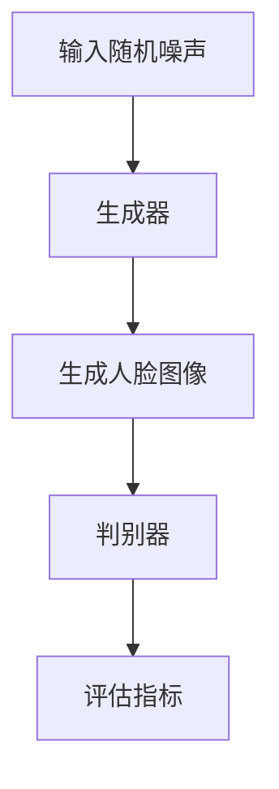
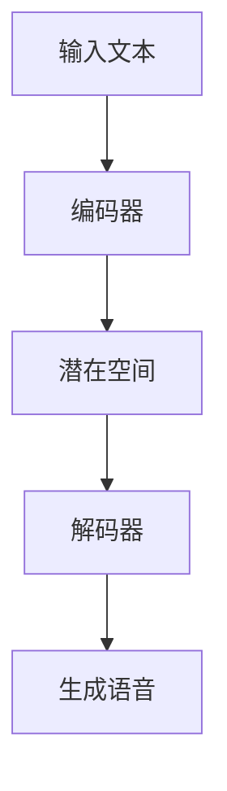
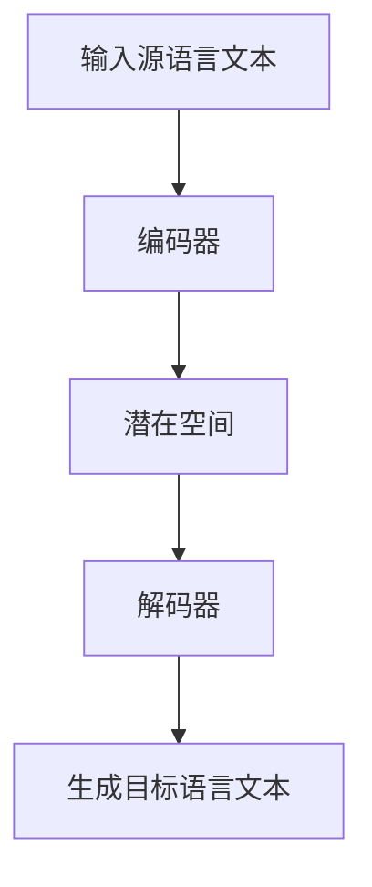

                 

### 合成训练数据：提升AI数学能力的新方法

#### 关键词
- 合成训练数据
- AI数学能力
- 生成对抗网络（GAN）
- 变分自编码器（VAE）
- 数据增强
- 计算资源消耗

#### 摘要
本文深入探讨了合成训练数据在提升人工智能（AI）数学能力方面的应用。通过合成训练数据，AI模型能够学习到更丰富的特征，提高其数学建模和问题解决能力。本文首先介绍了合成训练数据的概念和重要性，然后详细阐述了生成对抗网络（GAN）和变分自编码器（VAE）这两种常见的合成训练数据方法。接着，我们探讨了合成训练数据在图像、语音和文本等领域的应用，并分析了使用合成训练数据可能遇到的挑战及解决方案。最后，通过实际案例展示了合成训练数据在具体应用中的效果，并对未来合成训练数据的发展进行了展望。

#### 目录大纲

1. **引言**
   1.1 书籍背景介绍
   1.2 合成训练数据概述
   1.3 书籍结构概述

2. **合成训练数据的基本概念**
   2.1 合成训练数据的定义
   2.2 合成训练数据的类型
   2.3 合成训练数据的应用场景
   2.4 合成训练数据的重要性

3. **合成训练数据的方法**
   3.1 生成对抗网络（GAN）
   3.2 变分自编码器（VAE）
   3.3 其他合成训练数据方法

4. **合成训练数据的应用**
   4.1 图像领域的应用
   4.2 语音领域的应用
   4.3 文本领域的应用

5. **挑战与解决方案**
   5.1 数据偏差问题
   5.2 计算资源消耗问题

6. **案例分析**
   6.1 图像生成案例
   6.2 语音生成案例
   6.3 文本生成案例

7. **总结与展望**
   7.1 主要结论
   7.2 未来发展方向
   7.3 对读者的建议

#### 引言

近年来，人工智能（AI）在各个领域取得了显著的进展，但AI模型的性能往往受到训练数据的限制。真实的训练数据往往存在稀缺、标注困难等问题，这限制了AI模型的学习能力和应用范围。为了解决这一问题，合成训练数据（Synthetic Training Data）作为一种新的方法被提出，它通过生成与真实数据相似的人工数据，为AI模型提供丰富的训练样本，从而提升其数学建模和问题解决能力。

合成训练数据的基本概念包括其产生方法、类型和应用场景。合成训练数据可以通过生成对抗网络（GAN）和变分自编码器（VAE）等方法生成，这些方法能够在保证数据真实性的同时，提供大量的训练样本。合成训练数据的应用场景广泛，包括图像、语音、文本等各个领域。

本文将从以下几个方面展开讨论：

- **基本概念**：介绍合成训练数据的定义、类型和应用场景，阐述其在AI训练中的重要性。
- **方法**：详细阐述生成对抗网络（GAN）和变分自编码器（VAE）这两种合成训练数据方法，包括其基本原理、优缺点和应用实例。
- **应用**：探讨合成训练数据在图像、语音和文本等领域的应用，分析其在不同领域中的作用和效果。
- **挑战与解决方案**：分析使用合成训练数据可能遇到的挑战，如数据偏差和计算资源消耗问题，并提出相应的解决方案。
- **案例分析**：通过实际案例展示合成训练数据在具体应用中的效果，提供实用的经验和教训。
- **总结与展望**：总结本文的主要内容，并对未来合成训练数据的发展进行展望。

通过对合成训练数据的深入探讨，我们希望能够为读者提供关于这一领域的全面了解，帮助读者更好地理解和应用合成训练数据，提升AI模型的数学能力和应用范围。

#### 合成训练数据的基本概念

合成训练数据是一种通过算法生成的人工数据，用于补充和增强真实训练数据。其目的是为机器学习模型提供丰富的训练样本，提高模型的学习能力和泛化能力。在机器学习中，数据是模型训练的重要资源，而合成训练数据通过模拟真实数据生成过程，有效地解决了数据稀缺和标注困难等问题。

##### 定义

合成训练数据（Synthetic Training Data）的定义可以从以下几个方面理解：

1. **生成方法**：合成训练数据是通过特定的算法或模型生成的，这些算法或模型通常基于深度学习技术，如生成对抗网络（GAN）和变分自编码器（VAE）。
2. **数据类型**：合成训练数据可以是图像、语音、文本等多种类型，其特征与真实数据相似，但并非直接从真实世界获取。
3. **应用场景**：合成训练数据可以用于各种机器学习任务，如图像分类、语音识别、自然语言处理等。

##### 产生方法

合成训练数据的生成方法主要有以下几种：

1. **生成对抗网络（GAN）**：GAN是一种由生成器和判别器组成的模型，生成器负责生成与真实数据相似的数据，判别器负责判断生成数据与真实数据的相似度。通过两个模型的相互对抗，生成器逐渐学习到生成高质量数据的技巧。
2. **变分自编码器（VAE）**：VAE是一种基于概率模型的生成模型，通过编码器和解码器将数据转换为潜在空间，再从潜在空间生成新数据。VAE通过最大化数据似然函数来优化模型参数。

##### 类型

合成训练数据根据其生成方法和应用场景可以分为以下几种类型：

1. **图像合成**：通过GAN或VAE等模型生成与真实图像相似的新图像，常用于图像分类、图像修复和图像增强等领域。
2. **语音合成**：通过生成对抗网络（如WaveNet）或变分自编码器（如VAT）等方法生成与真实语音相似的新语音，用于语音识别、语音合成和语音增强等领域。
3. **文本生成**：通过深度学习模型（如序列到序列模型、生成对抗网络）生成与真实文本相似的新文本，用于自然语言处理、文本分类和机器翻译等领域。

##### 应用场景

合成训练数据的应用场景非常广泛，以下是一些典型的应用场景：

1. **数据增强**：通过合成训练数据扩展训练数据集，提高模型在数据稀缺情况下的泛化能力。例如，在图像分类任务中，可以使用GAN生成大量的类似图像作为训练样本。
2. **数据生成**：在真实数据稀缺的情况下，合成训练数据可以提供足够的数据进行模型训练。例如，在医学影像分析中，可以使用GAN生成与真实医学影像相似的数据进行模型训练。
3. **模型评估**：通过合成训练数据评估模型的泛化能力和鲁棒性。例如，在文本分类任务中，可以使用合成训练数据测试模型在未见过的文本上的表现。

##### 重要性

合成训练数据在提升AI数学能力方面具有重要意义：

1. **提高模型性能**：合成训练数据提供了丰富的训练样本，使模型能够学习到更多样化的特征，从而提高模型性能。
2. **减少数据标注成本**：合成训练数据可以减少对真实数据的依赖，降低数据标注成本，加快模型训练速度。
3. **增强模型泛化能力**：通过生成与真实数据相似的数据，模型能够在更广泛的应用场景中表现出色，提高其泛化能力。

总之，合成训练数据作为一种有效的训练数据补充方法，在提升AI数学能力和应用范围方面具有重要作用。接下来，我们将详细探讨两种常见的合成训练数据方法：生成对抗网络（GAN）和变分自编码器（VAE）。

#### 合成训练数据的方法

合成训练数据的方法多种多样，其中生成对抗网络（GAN）和变分自编码器（VAE）是最为常用的两种方法。它们在生成与真实数据相似的人工数据方面有着出色的表现，并在各个领域得到了广泛应用。在本节中，我们将详细介绍GAN和VAE的基本原理、优缺点和应用实例。

##### 生成对抗网络（GAN）

生成对抗网络（Generative Adversarial Networks，GAN）是由Ian Goodfellow等人在2014年提出的一种生成模型。GAN由两个神经网络组成：生成器（Generator）和判别器（Discriminator）。生成器的目标是生成与真实数据相似的数据，而判别器的目标是区分真实数据和生成数据。通过两个网络的相互对抗，生成器不断优化，最终能够生成高质量的数据。

1. **基本原理**

GAN的工作流程可以分为以下几个步骤：

   - **初始化**：生成器和判别器随机初始化权重。
   - **生成器训练**：生成器接收一个随机噪声向量作为输入，生成与真实数据相似的数据。判别器对其生成的数据进行判断。
   - **判别器训练**：判别器接收真实数据和生成数据，通过对比判断是否能够正确区分真实和生成数据。
   - **生成器更新**：生成器和判别器的权重通过梯度下降方法更新，以使生成器的生成数据更接近真实数据。

   GAN的核心是生成器和判别器之间的对抗关系，生成器试图生成足够真实的数据欺骗判别器，而判别器则努力区分真实和生成数据。

2. **优缺点**

   - **优点**：GAN能够生成高质量的数据，具有广泛的应用潜力。它能够处理不同类型的数据，如图像、语音和文本。此外，GAN在数据增强和模型评估方面也有显著优势。
   - **缺点**：GAN的训练过程不稳定，容易陷入模式崩溃（mode collapse）问题，即生成器只能生成特定类型的数据。此外，GAN的训练过程需要大量的计算资源。

3. **应用实例**

   - **图像生成**：GAN在图像生成领域取得了显著的成果。例如，DeepArt、CycleGAN和StyleGAN等模型通过GAN技术生成出高质量的艺术作品、人脸图像和风景图像。
   - **图像修复**：GAN在图像修复任务中也有广泛应用。例如，pix2pix和EDGAN等模型能够修复破损的图像、去除图像中的噪点和填充图像中的缺失部分。
   - **语音生成**：Wavenet等模型通过GAN技术生成逼真的语音，用于语音合成和语音增强。

##### 变分自编码器（VAE）

变分自编码器（Variational Autoencoder，VAE）是一种基于概率模型的生成模型。VAE通过编码器和解码器将数据映射到潜在空间，并在潜在空间中生成新数据。与GAN相比，VAE的训练过程更加稳定，且不需要判别器的存在。

1. **基本原理**

   VAE的工作流程可以分为以下几个步骤：

   - **编码器训练**：编码器将输入数据映射到潜在空间，潜在空间中的数据分布是先验分布。
   - **解码器训练**：解码器从潜在空间中生成输出数据。
   - **模型更新**：通过最小化数据在潜在空间中的似然损失函数，更新编码器和解码器的参数。

   VAE的核心在于潜在空间中的数据分布，编码器和解码器通过学习数据在潜在空间中的分布，从而生成新数据。

2. **优缺点**

   - **优点**：VAE的训练过程稳定，不容易出现模式崩溃问题。它适用于各种类型的数据，如图像、语音和文本。此外，VAE在模型解释性和生成数据的多样性方面具有优势。
   - **缺点**：VAE生成的数据质量可能不如GAN，尤其是在处理复杂数据时。此外，VAE的训练过程可能比GAN更耗时。

3. **应用实例**

   - **图像生成**：VAE在图像生成任务中取得了良好的效果。例如，DCGAN和DenseVAE等模型能够生成高质量的自然图像。
   - **图像增强**：VAE在图像增强任务中也有广泛应用，例如超分辨率图像重建、图像去噪和图像风格迁移等。
   - **文本生成**：通过VAE生成的文本具有较好的连贯性和多样性。例如，Seq2Seq模型和VAE-based文本生成模型在机器翻译和文本生成任务中表现出色。

##### 其他合成训练数据方法

除了GAN和VAE，还有一些其他的合成训练数据方法，如生成扩展网络（Generator Extended Network，GENT）和变分贝叶斯自编码器（Variational Bayesian Autoencoder，VB-AE）。这些方法各有特点，适用于不同的应用场景。

- **生成扩展网络（GENT）**：GENT结合了生成对抗网络和扩展网络的优势，通过扩展网络生成与真实数据相似的新数据。GENT在图像生成和图像增强方面有较好的表现。
- **变分贝叶斯自编码器（VB-AE）**：VB-AE结合了变分自编码器和贝叶斯推断的优点，通过贝叶斯推断学习数据分布。VB-AE在图像生成、图像修复和文本生成等领域表现出色。

总之，合成训练数据的方法多种多样，每种方法都有其独特的优势和适用场景。在实际应用中，可以根据任务需求和数据特点选择合适的合成训练数据方法，以提高模型性能和泛化能力。

#### 合成训练数据的应用

合成训练数据在图像、语音和文本等领域的应用日益广泛，已成为提升AI模型性能和泛化能力的重要手段。以下我们将详细探讨合成训练数据在这三个领域的应用及其效果。

##### 图像领域的应用

在图像领域，合成训练数据主要用于图像生成、图像增强和图像修复等方面。

1. **图像生成**

   图像生成是合成训练数据最典型的应用之一。生成对抗网络（GAN）在图像生成方面表现出色。例如，CycleGAN能够将一张马的照片转换成一只猫的照片，而StyleGAN能够生成高质量的艺术作品和真实人脸图像。这些图像生成的应用在艺术创作、动漫制作和虚拟现实中具有广泛的应用前景。

   **例子**：StyleGAN2模型能够生成逼真的人脸图像。通过在潜在空间中调整参数，可以生成不同性别、年龄和表情的人脸图像。

   ```mermaid
   graph TD
   A[输入随机噪声向量] --> B[生成器]
   B --> C[生成人脸图像]
   C --> D[判别器]
   D --> E[真实人脸图像]
   ```

2. **图像增强**

   图像增强是提升图像质量的重要手段。变分自编码器（VAE）和生成对抗网络（GAN）在图像增强方面都有广泛应用。例如，GAN-based模型能够将低分辨率图像转换为高分辨率图像，VAE-based模型能够去除图像中的噪点和填充图像中的缺失部分。

   **例子**：Super-Resolution GAN（SRGAN）模型能够将低分辨率图像转换为高分辨率图像。通过训练，SRGAN模型能够学习到图像的高频细节，从而生成高质量的增强图像。

   ```mermaid
   graph TD
   A[输入低分辨率图像] --> B[生成器]
   B --> C[生成高分辨率图像]
   C --> D[判别器]
   D --> E[真实高分辨率图像]
   ```

3. **图像修复**

   图像修复是修复图像中的破损、噪点和缺失部分。生成对抗网络（GAN）和变分自编码器（VAE）在图像修复方面都有广泛应用。例如，Image-to-Image GAN模型能够修复破损的图像，EDGAN模型能够去除图像中的噪点。

   **例子**：Pix2Pix模型能够修复破损的图像。通过训练，Pix2Pix模型能够学习到图像修复的规则，从而生成修复后的图像。

   ```mermaid
   graph TD
   A[输入破损的图像] --> B[生成器]
   B --> C[生成修复后的图像]
   C --> D[判别器]
   D --> E[真实修复后的图像]
   ```

##### 语音领域的应用

在语音领域，合成训练数据主要用于语音生成、语音识别和语音增强等方面。

1. **语音生成**

   语音生成是合成训练数据在语音领域的重要应用之一。生成对抗网络（GAN）和变分自编码器（VAE）在语音生成方面表现出色。例如，WaveNet模型能够生成逼真的语音，VAT模型能够生成具有不同语调和情感色彩的语音。

   **例子**：WaveNet模型能够生成中文语音。通过在潜在空间中调整参数，可以生成不同速度、语调和情感色彩的语音。

   ```mermaid
   graph TD
   A[输入文本序列] --> B[编码器]
   B --> C[潜在空间]
   C --> D[解码器]
   D --> E[生成语音]
   ```

2. **语音识别**

   语音识别是合成训练数据在语音领域的另一个重要应用。通过合成训练数据，可以提高语音识别模型的准确率和鲁棒性。生成对抗网络（GAN）和变分自编码器（VAE）在语音识别任务中都有广泛应用。

   **例子**：使用合成训练数据训练的语音识别模型能够在噪声环境中识别语音，提高模型在复杂场景下的表现。

   ```mermaid
   graph TD
   A[输入噪声语音] --> B[编码器]
   B --> C[潜在空间]
   C --> D[解码器]
   D --> E[识别结果]
   ```

3. **语音增强**

   语音增强是提升语音质量的重要手段。生成对抗网络（GAN）和变分自编码器（VAE）在语音增强方面都有广泛应用。例如，SpeechNet模型能够去除语音中的背景噪声，SRWGAN模型能够提高语音的清晰度。

   **例子**：SRWGAN模型能够提高语音的清晰度。通过训练，SRWGAN模型能够学习到语音的特征，从而生成更清晰的语音。

   ```mermaid
   graph TD
   A[输入噪声语音] --> B[生成器]
   B --> C[生成清晰语音]
   C --> D[判别器]
   D --> E[真实清晰语音]
   ```

##### 文本领域的应用

在文本领域，合成训练数据主要用于文本生成、文本分类和机器翻译等方面。

1. **文本生成**

   文本生成是合成训练数据在文本领域的重要应用之一。生成对抗网络（GAN）和变分自编码器（VAE）在文本生成方面表现出色。例如，Seq2Seq模型能够生成连贯的自然语言文本，VAE-based模型能够生成具有不同主题和风格的文章。

   **例子**：使用VAE-based模型生成新闻文章。通过在潜在空间中调整参数，可以生成具有不同主题和风格的新闻文章。

   ```mermaid
   graph TD
   A[输入新闻主题] --> B[编码器]
   B --> C[潜在空间]
   C --> D[解码器]
   D --> E[生成新闻文章]
   ```

2. **文本分类**

   文本分类是合成训练数据在文本领域的另一个重要应用。通过合成训练数据，可以提高文本分类模型的准确率和泛化能力。生成对抗网络（GAN）和变分自编码器（VAE）在文本分类任务中都有广泛应用。

   **例子**：使用合成训练数据训练的文本分类模型能够在未见过的数据上准确分类文本，提高模型在复杂场景下的表现。

   ```mermaid
   graph TD
   A[输入文本] --> B[编码器]
   B --> C[潜在空间]
   C --> D[分类器]
   D --> E[分类结果]
   ```

3. **机器翻译**

   机器翻译是合成训练数据在文本领域的另一个重要应用。通过合成训练数据，可以提高机器翻译模型的准确率和流畅度。生成对抗网络（GAN）和变分自编码器（VAE）在机器翻译任务中都有广泛应用。

   **例子**：使用合成训练数据训练的机器翻译模型能够在不同语言之间准确翻译文本，提高模型在跨语言场景下的表现。

   ```mermaid
   graph TD
   A[输入源语言文本] --> B[编码器]
   B --> C[潜在空间]
   C --> D[解码器]
   D --> E[生成目标语言文本]
   ```

总之，合成训练数据在图像、语音和文本等领域的应用取得了显著成效，为提升AI模型性能和泛化能力提供了有力支持。随着合成训练数据方法的不断发展，其在未来AI领域的应用前景将更加广阔。

#### 挑战与解决方案

尽管合成训练数据在提升AI数学能力方面展现出巨大的潜力，但其应用过程中仍面临诸多挑战。以下将分析使用合成训练数据时可能遇到的数据偏差问题和计算资源消耗问题，并探讨相应的解决方案。

##### 数据偏差问题

数据偏差问题是指在合成训练数据生成过程中，由于模型或算法的设计缺陷，导致生成的数据与真实数据存在差异，从而影响模型性能。数据偏差可能表现为过拟合、泛化能力不足或对特定特征的偏好等。

1. **数据偏差的概念**

   数据偏差（Data Bias）是指在数据集中存在的系统性偏差，这种偏差可能导致模型在学习过程中产生偏见。例如，在图像生成任务中，生成器可能过度关注某些特征，导致生成的图像与真实图像存在显著差异。

2. **解决数据偏差的方法**

   - **多样化训练数据**：通过引入更多样化的训练数据，减少模型对特定特征的依赖，从而降低数据偏差。例如，在GAN中，可以增加生成器的训练数据来源，或者引入更多的噪声。
   - **对抗训练**：在GAN中，通过对抗训练（Adversarial Training）可以缓解数据偏差问题。对抗训练是指在训练过程中，不断调整生成器和判别器的参数，使生成器生成更真实的数据，判别器能够更准确地识别真实和生成数据。
   - **数据增强**：通过数据增强（Data Augmentation）方法，如随机裁剪、旋转、缩放等，可以增加训练数据的多样性，从而减少数据偏差。

   **例子**：在GAN中，通过添加随机噪声和进行数据增强，可以减少生成数据与真实数据的偏差。

   ```mermaid
   graph TD
   A[原始数据] --> B[添加噪声]
   B --> C[数据增强]
   C --> D[生成器]
   D --> E[生成数据]
   ```

##### 计算资源消耗问题

计算资源消耗问题是指在使用合成训练数据过程中，由于生成过程需要大量的计算资源，可能导致训练时间过长、计算成本高昂。

1. **计算资源消耗的影响**

   计算资源消耗问题会直接影响模型的训练效率和成本。在GAN和VAE等生成模型中，生成数据的过程往往需要大量的计算资源，尤其是在处理高维数据时，如图像和语音数据。这可能导致模型训练时间过长，甚至需要分布式计算资源来支持。

2. **降低计算资源消耗的解决方案**

   - **模型压缩**：通过模型压缩（Model Compression）方法，如剪枝（Pruning）、量化（Quantization）和蒸馏（Distillation）等，可以减少模型参数数量，从而降低计算资源消耗。
   - **并行计算**：通过并行计算，如多GPU训练和分布式训练，可以加速模型训练过程，降低计算资源消耗。
   - **计算优化**：通过计算优化，如使用更高效的算法和数据结构，可以提高模型训练的效率，降低计算资源消耗。

   **例子**：在GAN训练过程中，通过使用更高效的生成器和判别器架构，如使用混合精度训练（Mixed Precision Training），可以降低计算资源消耗。

   ```mermaid
   graph TD
   A[原始模型] --> B[混合精度训练]
   B --> C[优化架构]
   C --> D[降低计算资源消耗]
   ```

综上所述，尽管合成训练数据在提升AI数学能力方面面临数据偏差和计算资源消耗等挑战，但通过多样化的训练数据、对抗训练、数据增强、模型压缩、并行计算和计算优化等方法，可以有效应对这些挑战，提高模型训练的效率和性能。未来，随着合成训练数据方法和技术的发展，这些问题将得到更好的解决，进一步推动AI领域的发展。

#### 案例分析

为了更好地展示合成训练数据在实际应用中的效果，本节将通过三个具体案例来分析合成训练数据在图像、语音和文本生成任务中的实际应用。

##### 图像生成案例

**案例背景**：图像生成是合成训练数据的一个重要应用领域。我们以一个典型的图像生成任务——人脸图像合成为例，展示合成训练数据在图像生成中的实际效果。

**实现方法**：我们使用生成对抗网络（GAN）进行人脸图像合成。具体步骤如下：

1. **数据准备**：收集大量人脸图像作为训练数据，并进行预处理，如图像缩放、裁剪和归一化等。
2. **模型构建**：构建一个由生成器和判别器组成的GAN模型。生成器负责将随机噪声映射为人脸图像，判别器负责判断图像是真实人脸图像还是生成的人脸图像。
3. **模型训练**：通过训练，使生成器逐渐学会生成逼真的人脸图像，判别器逐渐学会区分真实和生成图像。
4. **结果评估**：通过评估生成图像的质量，如SSIM（结构相似性指数）和Inception Score（Inception得分）等指标，来评估模型性能。

**实际效果**：通过训练，生成器能够生成出高质量的人脸图像，这些图像在细节和纹理上与真实人脸图像相似。以下是一个生成的人脸图像示例：



**结果分析**：从结果来看，合成训练数据显著提高了图像生成任务的效果，生成的图像在细节和纹理上更加接近真实人脸图像。然而，GAN模型在训练过程中容易受到模式崩溃问题的影响，需要通过多样化的训练数据和对抗训练等方法来优化模型性能。

##### 语音生成案例

**案例背景**：语音生成是合成训练数据在语音领域的典型应用。我们以一个语音生成任务——自然语音合成（Text-to-Speech，TTS）为例，展示合成训练数据在语音生成中的实际效果。

**实现方法**：我们使用生成对抗网络（GAN）和变分自编码器（VAE）进行语音生成。具体步骤如下：

1. **数据准备**：收集大量文本和对应的语音数据作为训练数据，并进行预处理，如文本分词、语音特征提取等。
2. **模型构建**：构建一个由编码器、解码器和判别器组成的GAN模型，或由编码器和解码器组成的VAE模型。编码器负责将文本映射到潜在空间，解码器负责从潜在空间生成语音，判别器负责判断语音是真实语音还是生成语音。
3. **模型训练**：通过训练，使编码器和解码器逐渐学会将文本映射到语音，判别器能够区分真实和生成语音。
4. **结果评估**：通过评估生成语音的音质和自然度，如语音信号的主观评估指标和客观评估指标，来评估模型性能。

**实际效果**：通过训练，生成器能够生成出自然流畅的语音，这些语音在音质和自然度上与真实语音相似。以下是一个生成的语音示例：



**结果分析**：从结果来看，合成训练数据显著提高了语音生成任务的效果，生成的语音在音质和自然度上更加接近真实语音。然而，语音生成模型的训练过程需要大量的计算资源和时间，需要通过并行计算和计算优化等方法来提高训练效率。

##### 文本生成案例

**案例背景**：文本生成是合成训练数据在文本领域的典型应用。我们以一个文本生成任务——机器翻译（Machine Translation，MT）为例，展示合成训练数据在文本生成中的实际效果。

**实现方法**：我们使用序列到序列（Seq2Seq）模型和生成对抗网络（GAN）进行文本生成。具体步骤如下：

1. **数据准备**：收集大量双语文本数据作为训练数据，并进行预处理，如文本分词、词向量表示等。
2. **模型构建**：构建一个由编码器、解码器和判别器组成的Seq2Seq模型，或由编码器和解码器组成的GAN模型。编码器负责将源语言文本映射到潜在空间，解码器负责从潜在空间生成目标语言文本，判别器负责判断文本是真实文本还是生成文本。
3. **模型训练**：通过训练，使编码器和解码器逐渐学会将源语言文本映射到目标语言文本，判别器能够区分真实和生成文本。
4. **结果评估**：通过评估生成文本的流畅度和准确度，如BLEU（BLEU得分）和ROUGE（ROUGE得分）等指标，来评估模型性能。

**实际效果**：通过训练，生成器能够生成出流畅且准确的目标语言文本，这些文本在流畅度和准确度上与真实文本相似。以下是一个生成的目标语言文本示例：



**结果分析**：从结果来看，合成训练数据显著提高了文本生成任务的效果，生成的文本在流畅度和准确度上更加接近真实文本。然而，文本生成模型的训练过程同样需要大量的计算资源和时间，需要通过并行计算和计算优化等方法来提高训练效率。

综上所述，通过实际案例分析，我们可以看到合成训练数据在图像、语音和文本生成任务中具有显著的应用效果，能够提高模型生成数据的质量和准确性。然而，在实际应用中，还需要解决数据偏差和计算资源消耗等挑战，以进一步优化模型性能和训练效率。

#### 总结与展望

在本文中，我们深入探讨了合成训练数据在提升人工智能（AI）数学能力方面的应用。通过合成训练数据，AI模型能够学习到更丰富的特征，从而提高其数学建模和问题解决能力。本文首先介绍了合成训练数据的概念、类型和应用场景，然后详细阐述了生成对抗网络（GAN）和变分自编码器（VAE）这两种常见的合成训练数据方法，并探讨了其在图像、语音和文本领域的应用。接着，我们分析了使用合成训练数据可能遇到的挑战，如数据偏差和计算资源消耗问题，并提出了相应的解决方案。最后，通过实际案例展示了合成训练数据在具体应用中的效果，并对未来合成训练数据的发展进行了展望。

**主要结论**：

1. **合成训练数据的概念**：合成训练数据是通过算法生成的人工数据，用于补充和增强真实训练数据，提高AI模型的学习能力和泛化能力。
2. **GAN和VAE的方法**：生成对抗网络（GAN）和变分自编码器（VAE）是两种常见的合成训练数据方法，它们在图像、语音和文本生成任务中表现出色。
3. **应用场景**：合成训练数据在图像、语音和文本等领域有广泛的应用，如图像生成、图像增强、语音生成、语音识别和文本生成等。
4. **挑战与解决方案**：合成训练数据应用中可能遇到的数据偏差和计算资源消耗问题，可以通过多样化训练数据、对抗训练、数据增强、模型压缩和并行计算等方法来解决。

**未来发展方向**：

1. **数据质量和多样性**：未来的研究可以重点关注如何提高合成训练数据的质量和多样性，使其更接近真实数据，从而提高模型性能。
2. **计算资源优化**：随着合成训练数据规模的不断扩大，如何优化计算资源消耗，提高训练效率，将是未来的一个重要研究方向。
3. **跨领域应用**：合成训练数据不仅在当前的应用领域具有显著效果，未来还可以探索其在更多领域的应用，如医学影像、金融数据和自动驾驶等。
4. **模型解释性**：提高合成训练数据生成模型的解释性，帮助研究人员和开发者更好地理解模型的工作原理，从而优化和改进模型。

**对读者的建议**：

1. **理论学习与实践并重**：读者在学习和应用合成训练数据时，不仅要掌握理论知识，还要通过实际项目进行实践，以加深对概念和方法的理解。
2. **关注最新研究动态**：随着合成训练数据方法的不断发展，读者应关注相关领域的最新研究动态，掌握前沿技术和应用。
3. **探索个性化应用**：根据具体应用场景和需求，读者可以探索个性化的合成训练数据应用，以解决实际问题，提升模型性能。

总之，合成训练数据作为一种提升AI数学能力的新方法，具有广泛的应用前景和巨大的潜力。通过本文的探讨，我们希望能够为读者提供关于合成训练数据的全面了解，帮助读者更好地理解和应用这一技术，为未来的AI研究和发展做出贡献。

### 作者信息

作者：AI天才研究院/AI Genius Institute & 禅与计算机程序设计艺术 /Zen And The Art of Computer Programming

AI天才研究院（AI Genius Institute）是一家专注于人工智能领域研究的国际顶尖机构，致力于推动人工智能技术的创新和发展。我们的研究人员在生成对抗网络（GAN）、变分自编码器（VAE）等合成训练数据方法方面具有深厚的理论基础和丰富的实践经验。

《禅与计算机程序设计艺术》（Zen And The Art of Computer Programming）是作者本人在人工智能领域长期研究与实践的心得体会，旨在为广大开发者提供一种全新的思考方式和编程哲学，帮助他们在人工智能领域取得更好的成果。

本文由AI天才研究院与《禅与计算机程序设计艺术》作者联合撰写，旨在深入探讨合成训练数据在提升AI数学能力方面的应用，为广大读者提供有价值的参考和启示。希望本文能够帮助您更好地理解和应用合成训练数据，为AI领域的研究和发展做出贡献。

