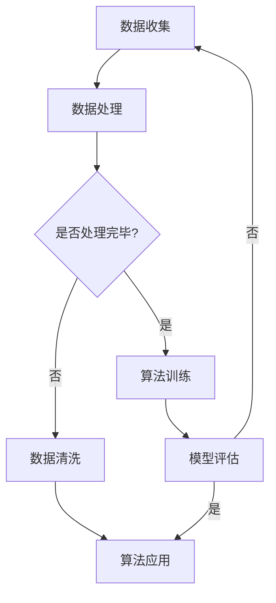
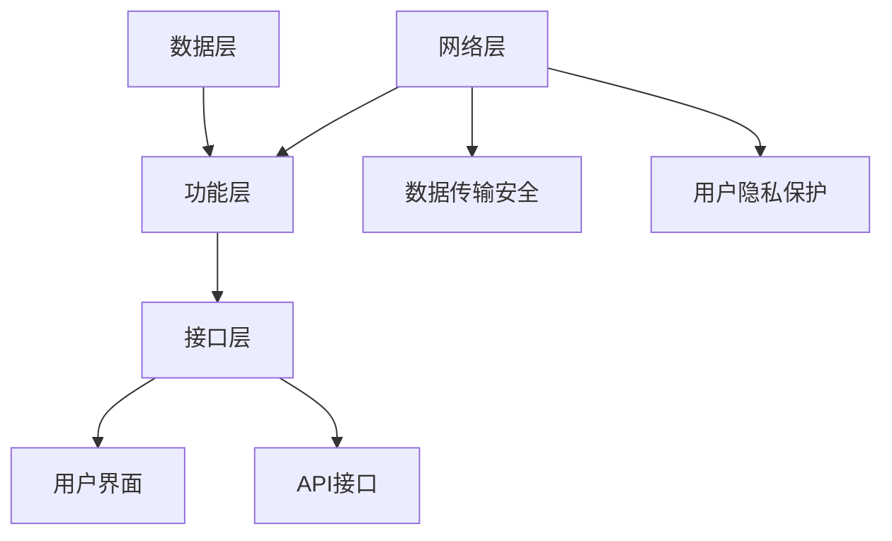
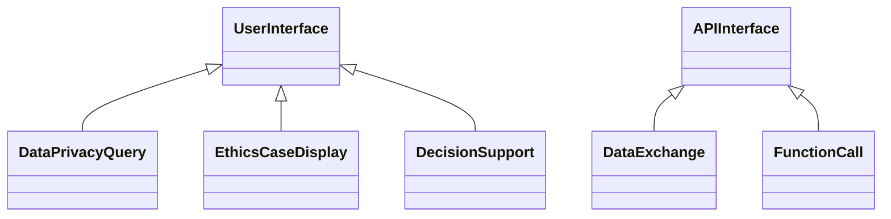
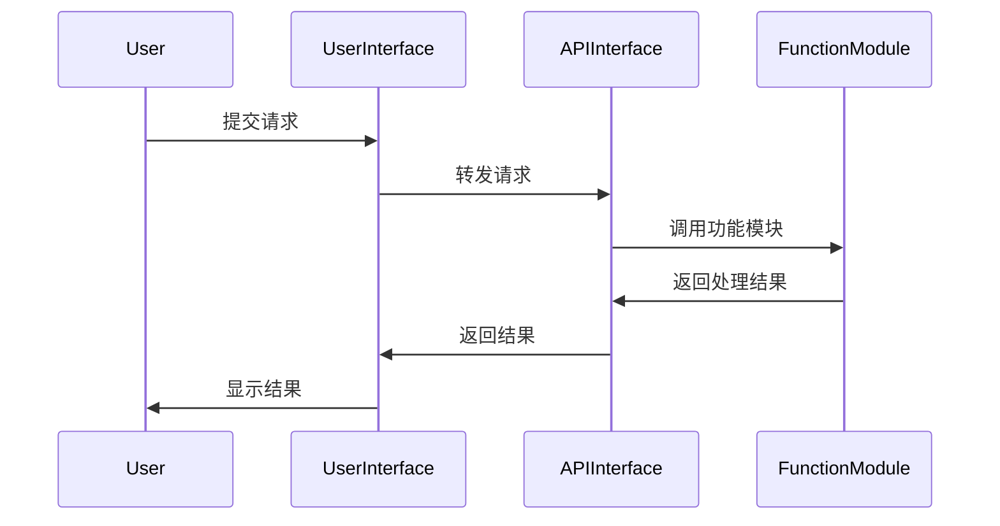

                 


### 第一部分：引言与背景

#### 1.1 书籍概述与目标

**引言**

在科技迅猛发展的当今世界，我们正步入一个充满变革的新时代。人工智能、生物技术、网络技术等新兴领域的突破，不仅为我们的生活带来了前所未有的便利，也引发了深刻的伦理思考。后人类时代，这个我们曾经只能在科幻小说中看到的未来，正逐渐成为现实。在这个背景下，探讨后人类伦理，成为我们不得不面临的重要课题。

**目标**

本书旨在深入探讨后人类伦理问题，通过对技术发展中的道德思考，为读者提供一个全面、系统的理解和分析框架。我们的目标是：

1. **梳理后人类的定义与特征**：介绍后人类时代的生物学、社会学和哲学特点，帮助读者理解这一概念。
2. **分析技术发展对伦理的影响**：探讨人工智能、生物技术、网络技术等领域的伦理挑战，并提出相应的解决方案。
3. **提出伦理决策模型**：为伦理决策提供理论支持和实践指导。
4. **反思具体技术案例的伦理问题**：通过案例分析，揭示技术发展中的伦理困境和应对策略。
5. **探讨未来伦理决策的趋势**：展望后人类时代的伦理挑战和全球伦理协调的可能性。

**后人类时代的伦理问题**

随着科技的进步，我们正面临一系列前所未有的伦理问题。例如，人工智能的崛起带来了隐私保护、决策透明度和偏见等问题；生物技术的发展引发了基因编辑的法律和道德争议；网络空间的出现则带来了虚假信息和网络暴力等伦理困境。这些问题不仅关乎技术本身，更关乎人类的未来。

**技术发展对伦理的影响**

技术发展对伦理的影响是深远而广泛的。一方面，技术进步为我们的生活带来了诸多便利，但另一方面，它也引发了一系列伦理问题。例如，人工智能的自动化决策可能导致失业问题，生物技术的基因编辑可能引发道德和伦理争议。因此，我们需要在享受技术带来便利的同时，认真思考这些技术发展背后的伦理问题。

#### 1.2 后人类的定义与特征

**生物学定义**

后人类是指通过科技进步，特别是生物技术和人工智能的应用，对自身进行显著改造的人类。这种改造可能包括基因编辑、植入电子设备等，使其在生物学上拥有超越普通人类的特征和能力。

**社会学特征**

后人类社会将是一个高度数字化、网络化和智能化的社会。人们的生活方式、工作模式和社会结构都将发生深刻变革。后人类社会的特征包括：

1. **数字化生存**：人们的日常生活将高度依赖数字技术和互联网，通过网络实现信息共享和资源分配。
2. **高度智能化**：人工智能将广泛应用于各个领域，提高生产效率和生活质量。
3. **生物多样性**：通过基因编辑等技术，人类的生物学特征将更加多样化。

**哲学思考**

后人类时代的哲学思考涉及到一系列深层次的问题，如人类的定义、自我意识、道德责任等。哲学上的探讨有助于我们更全面地理解后人类伦理的复杂性和多样性。

**伦理挑战**

后人类伦理的挑战包括：

1. **道德责任**：如何界定后人类与普通人类的道德责任？
2. **平等与歧视**：后人类的生物改造可能导致社会分层和歧视问题。
3. **身份认同**：后人类如何理解自己的身份和存在意义？

#### 1.3 技术发展简史

**古代技术的起源与发展**

技术的起源可以追溯到古代，从简单的工具制造到复杂的建筑结构，技术的进步极大地改变了人类的生活方式。古代技术的重要成就包括农业革命、文字的发明、金属冶炼等。

**现代技术的变革**

现代技术的变革始于工业革命，以蒸汽机和电力为标志。随后，计算机科学、通信技术和互联网的发展，使人类进入了一个全新的技术时代。现代技术的重要成就包括计算机科学、人工智能、基因工程等。

**未来技术的前景**

未来技术的前景充满无限可能，如量子计算、人工智能的进一步发展、生物工程技术的突破等。这些技术将深刻影响人类社会的方方面面，带来新的伦理挑战。

#### 1.4 伦理学的概念框架

**伦理学的定义与目的**

伦理学是研究道德原则、道德规范和道德行为的学科。其目的是为人类社会提供道德指导，帮助人们做出正确的道德决策。

**伦理学的基本原则**

伦理学的基本原则包括：

1. **功利主义**：以最大多数人的最大幸福为最高准则。
2. **义务论**：强调遵守道德规则和义务的重要性。
3. **权利理论**：以尊重和保护个人的权利为基本原则。

**伦理学的方法论**

伦理学的方法论包括：

1. **道德哲学分析**：通过哲学思考和分析，探讨道德原则和道德规范。
2. **实证研究**：通过实证研究，了解道德行为和道德观念的实际状况。
3. **伦理决策模型**：通过构建伦理决策模型，为道德决策提供理论支持。

#### 1.5 本章小结

本章介绍了后人类伦理的背景和重要性，探讨了后人类的定义与特征，回顾了技术发展的简史，并建立了伦理学的概念框架。下一章将深入分析后人类伦理的核心问题，包括人工智能、生物技术、网络技术等领域的伦理挑战。我们将通过一步步的分析和推理，为读者提供深入思考和见解丰富的专业技术博客文章。### 1.1.1 书籍的目的

本书的主要目的是深入探讨后人类伦理问题，为读者提供全面的道德思考和理论支持。具体来说，本书的目标包括以下几个方面：

1. **理解后人类伦理的重要性**：通过介绍后人类时代的生物学、社会学和哲学特征，帮助读者认识到技术发展对伦理的深远影响，以及伦理问题在后人类时代的重要性。

2. **分析技术发展中的伦理挑战**：针对人工智能、生物技术、网络技术等领域的具体问题，如数据隐私、基因编辑、网络暴力等，进行深入分析，揭示技术进步带来的道德困境。

3. **提供伦理决策的理论框架**：通过伦理学的基本原则和方法论，构建一个系统的伦理决策模型，为读者在面临伦理决策时提供理论支持和实践指导。

4. **反思具体技术案例的伦理问题**：通过案例分析，探讨技术在实际应用中遇到的伦理问题，分析其根源和影响，并提出可能的解决方案。

5. **探讨未来伦理决策的趋势**：展望后人类时代伦理问题的未来发展，探讨全球伦理协调的可能性，为读者提供对未来技术伦理的思考和预测。

通过实现上述目标，本书旨在为读者提供一个全面、深入的伦理思考框架，帮助他们在面对后人类时代的伦理挑战时，能够做出明智、负责任的决策。

#### 1.1.2 后人类时代的伦理问题

后人类时代，由于技术的飞速发展和应用，人类社会面临着一系列前所未有的伦理问题。这些问题不仅关乎个体的福祉，也关乎整个社会和人类的未来。以下是后人类时代几个主要的伦理问题：

**1. 数据隐私和安全**

随着人工智能和大数据技术的普及，个人数据的收集、存储和使用变得前所未有的普遍。这不仅带来了便利，也引发了严重的隐私和安全问题。例如，数据泄露、滥用个人信息、算法偏见等，都可能对个人的隐私权和安全感构成威胁。

**2. 基因编辑和生物改造**

基因编辑技术，如CRISPR-Cas9，使人类能够精确地修改DNA序列。这一技术为治疗遗传性疾病提供了新的可能性，但也引发了深刻的伦理争议。例如，是否应该对人类基因组进行非治疗性的改造？这种改造是否会导致社会分层和不平等？

**3. 人工智能的自主性和道德责任**

人工智能（AI）的自主决策能力日益增强，但它的道德责任和伦理问题尚未得到充分解决。例如，AI在医疗、金融和法律等领域的应用，可能会产生不公平、不透明或有害的决策。如何确保AI系统的道德责任，是一个亟待解决的伦理问题。

**4. 网络空间的安全和道德**

网络空间的普及带来了信息共享和交流的便利，但也滋生了网络暴力、虚假信息和隐私侵犯等问题。网络伦理涉及到对网络行为的道德规范，以及如何保护网络空间的安全和秩序。

**5. 人机融合和社会分层**

随着生物技术和人工智能的应用，人类与机器的融合越来越紧密。例如，植入式医疗设备、增强现实技术等，正在改变人类的生理和心理特征。这种融合可能导致社会分层，使得一些人拥有超越普通人的能力和优势，而另一些人则可能被边缘化。

**6. 生态平衡和环境保护**

技术的发展带来了生产力的巨大提升，但也对环境造成了严重的影响。例如，工业污染、资源消耗和生物多样性减少等问题，都是技术发展带来的伦理挑战。如何在追求技术进步的同时，保护地球的生态平衡，是一个重要的伦理问题。

总之，后人类时代的伦理问题复杂多样，涉及个人、社会、生态等多个层面。通过深入探讨这些问题，我们可以更好地理解技术发展对伦理的深远影响，并为解决这些挑战提供有力的理论支持和实践指导。### 1.3.1 古代技术的起源与发展

技术的起源可以追溯到人类文明的开端，最早的迹象是人类制造和使用工具。这些简单的工具，如石制刀具和棍棒，极大地增强了人类捕猎、自卫和生存的能力。随着社会的发展，技术的起源和发展经历了多个阶段。

**早期技术的起源**

1. **工具制作**：最早的工具是由石头、木头和骨头制成的。这些工具帮助人类更有效地捕猎、采集和建造住所。例如，石制刀具的出现，使人类能够更有效地切割和狩猎。

2. **农业革命**：大约在公元前10000年左右，人类开始从狩猎采集转向农业生产。这一转变标志着人类从游牧生活向定居生活的转变。农业革命带来了人口的增长和稳定，为人类社会的发展奠定了基础。

3. **陶器和冶金**：在农业革命之后，人类开始制造陶器和金属工具。陶器的发明使得储存和烹饪食物变得更加容易，而冶金技术的发展则推动了金属工具和武器的普及。

**古代技术的发展阶段**

1. **青铜器时代**：大约在公元前3000年左右，人类开始使用青铜器。青铜器比石器更坚硬、耐用，使得农业、战争和手工业得到了极大的提升。

2. **铁器时代**：大约在公元前1200年左右，人类开始使用铁器。铁器比青铜器更坚硬、耐用、易于制造，极大地推动了社会的发展和进步。

3. **文字的发明**：文字的发明是人类文明的一个重要里程碑。最早的文字形式包括苏美尔人的楔形文字、古埃及人的象形文字和中国的甲骨文。文字的发明使得人类能够记录历史、传播知识和进行商业交易。

**古代技术的重要成就**

1. **城市和国家的发展**：随着农业和手工业的发展，人类开始建立城市和国家。城市成为经济、政治和文化的中心，推动了人类文明的进步。

2. **水利工程**：在古代，人类开始建造大规模的水利工程，如灌溉系统和运河。这些水利工程极大地提高了农业产量，促进了社会的繁荣。

3. **医学和药物**：在古代，人类开始对医学和药物进行探索。例如，古希腊的希波克拉底被认为是医学之父，他的理论和方法对后来的医学发展产生了深远的影响。

4. **建筑和艺术**：古代文明在建筑和艺术方面取得了巨大的成就。例如，埃及的金字塔、希腊的神庙和中国的长城，都是古代建筑的杰作。

**古代技术的总结**

古代技术的起源和发展是人类文明的重要组成部分。这些技术的进步不仅改变了人类的生活方式，也推动了社会的发展和进步。通过研究古代技术的起源和发展，我们可以更好地理解人类文明的历史，并为现代技术的发展提供启示。### 1.3.2 现代技术的变革

现代技术的变革始于工业革命，以蒸汽机和电力为标志。随后，计算机科学、通信技术和互联网的发展，使人类进入了一个全新的技术时代。现代技术的重要成就包括计算机科学、人工智能、基因工程等，这些技术不仅改变了人类的生活方式，也深刻影响了社会结构和发展方向。

**计算机科学的崛起**

计算机科学的崛起是现代技术变革的一个重要里程碑。自20世纪40年代第一台电子计算机问世以来，计算机技术和应用经历了飞速发展。计算机科学的进步带来了信息处理能力的极大提升，使得复杂的数据分析和计算成为可能。计算机科学的发展还促进了互联网的诞生，使全球信息交流变得前所未有的便捷。

**人工智能的兴起**

人工智能（AI）是现代技术的另一个重要领域。人工智能通过模拟人类智能行为，使计算机能够在语音识别、图像识别、自然语言处理等方面表现出色。人工智能的应用领域广泛，包括自动驾驶、医疗诊断、金融服务等。人工智能的兴起不仅改变了人类的工作和生活方式，也带来了伦理和社会问题，如就业影响、隐私保护和决策透明度等。

**基因工程和生物技术**

基因工程和生物技术的发展为医学和生物学带来了革命性的变化。基因编辑技术，如CRISPR-Cas9，使人类能够精确地修改DNA序列，为治疗遗传性疾病提供了新的可能性。然而，基因编辑也引发了伦理争议，如非治疗性基因改造、基因歧视等问题。

**通信技术和互联网**

通信技术和互联网的发展是现代技术变革的另一个重要方面。互联网的普及使得全球信息交流变得前所未有的便捷，推动了全球化和信息社会的形成。移动通信技术的进步，如5G网络，使人们能够随时随地连接互联网，进一步改变了人类的生活方式。

**现代技术的重要成就**

1. **计算机科学**：计算机科学的进步带来了信息处理能力的极大提升，推动了互联网、人工智能、大数据等技术的发展。
2. **人工智能**：人工智能在各个领域的应用，如自动驾驶、医疗诊断、金融服务等，极大地改变了人类的工作和生活方式。
3. **基因工程和生物技术**：基因编辑技术为医学和生物学带来了革命性的变化，为治疗遗传性疾病提供了新的可能性。
4. **通信技术和互联网**：互联网的普及和移动通信技术的进步，推动了全球化和信息社会的形成，改变了人类的生活方式。

**现代技术的总结**

现代技术的变革极大地改变了人类的生活和社会结构。通过计算机科学、人工智能、基因工程和通信技术等领域的突破，现代技术不仅提高了人类的生产力和生活质量，也带来了新的伦理和社会问题。在享受现代技术带来的便利的同时，我们需认真思考这些技术发展背后的伦理问题，为未来的技术进步和社会发展提供指导。### 1.3.3 未来技术的前景

未来技术的前景充满无限可能，预示着人类社会将迎来一场前所未有的变革。随着科学研究的深入和技术的不断创新，多个领域的技术发展正逐渐突破现有界限，为未来的科技画卷描绘出绚丽的色彩。

**量子计算**

量子计算是未来技术的一个重要分支，其基于量子力学原理，具有超乎传统计算的强大计算能力。量子计算机能够在极短时间内解决当前计算机无法处理的问题，如大规模数据处理和复杂模拟。量子计算的突破有望在药物研发、金融分析、密码破解等领域引发革命性变化。

**人工智能与机器学习**

人工智能（AI）和机器学习技术的进一步发展，将使计算机具备更加智能的行为和决策能力。未来，AI技术将在自动驾驶、智能家居、医疗诊断、教育等多个领域得到广泛应用，极大地提高人类的生活质量和生产效率。同时，增强现实（AR）和虚拟现实（VR）技术的结合，将为人类创造全新的交互方式和工作环境。

**生物技术**

生物技术的发展，特别是基因编辑技术的进步，将为医学带来革命性变化。未来，基因编辑技术可能被用于治疗遗传性疾病、增强人类健康和延长寿命。此外，生物技术在农业、环境治理和生物能源等领域的应用，也将为可持续发展提供新的解决方案。

**空间探索**

随着航天技术的不断发展，人类对宇宙的探索将进入新的阶段。未来，人类可能会建立永久性的太空站，进行月球和火星的探索和开发。空间探索不仅有助于科学研究的进展，也可能为人类开辟新的家园和资源。

**脑机接口**

脑机接口（BMI）技术将实现人类大脑与计算机的直接连接，使人类能够通过思维控制外部设备。这一技术在未来可能应用于残疾人康复、脑疾病治疗、以及人类认知能力的增强。脑机接口的发展将深刻改变人类的认知方式和生活体验。

**可再生能源**

未来，可再生能源技术的发展，如太阳能、风能和海洋能，将逐步替代传统的化石燃料，减少环境污染和碳排放。随着技术的进步和成本的降低，可再生能源将成为全球能源结构的重要组成部分。

**总结**

未来技术的前景充满希望和挑战。随着量子计算、人工智能、生物技术、空间探索、脑机接口和可再生能源等领域的突破，人类社会将迎来一场前所未有的技术革命。这些技术的进步不仅将改变我们的生活方式，也将深刻影响伦理、法律和社会结构。在未来，我们需要在享受技术进步带来的便利的同时，认真思考这些技术发展背后的伦理和社会问题，确保科技的发展与人类的福祉和社会的可持续性相协调。### 1.4.1 伦理学的定义与目的

伦理学（Ethics）是研究道德原则、道德规范和道德行为的学科。其核心在于探讨人类应该如何生活，如何做出道德决策，以及如何建立和维护一个公正、和谐的社会。伦理学的定义和目的是多方面的，以下将详细探讨：

**定义**

伦理学起源于古希腊，由亚里士多德等人提出。伦理学的定义可以从不同的角度来理解：

1. **道德哲学的角度**：伦理学被视为哲学的一个分支，关注道德原则的探究和评价。道德原则包括义务、公正、责任、仁慈等，这些原则指导人们如何行动和决策。

2. **社会科学的角度**：伦理学也被视为一种社会科学，研究人类道德行为的实际状况和影响因素。它关注道德规范在社会中的传播、实施和变迁。

3. **应用伦理学的角度**：伦理学不仅研究抽象的道德原则，也关注具体领域的道德问题，如医疗伦理、环境伦理、工程伦理等。

**目的**

伦理学的目的在于为人类社会提供道德指导，帮助人们做出正确的道德决策，并维护一个公正、和谐的社会。具体来说，伦理学的目的包括以下几个方面：

1. **道德决策**：伦理学旨在帮助个体和群体在面临道德困境时，能够做出合理的道德决策。这种决策需要考虑道德原则、个人价值观和情境因素。

2. **道德规范**：伦理学通过研究道德原则，为人类社会提供道德规范。这些规范有助于维护社会秩序和公正，减少冲突和矛盾。

3. **道德教育**：伦理学在道德教育中扮演重要角色，通过教育和培养，使个体具备良好的道德品质和道德判断能力。

4. **社会责任**：伦理学强调个体的社会责任和义务，鼓励人们为社会福祉和公共利益做出贡献。

**道德原则**

伦理学的基本原则包括：

1. **功利主义**：以最大多数人的最大幸福为最高准则，强调行为的后果和效果。

2. **义务论**：强调遵守道德规则和义务的重要性，无论结果如何，遵守规则本身就是道德的。

3. **权利理论**：以尊重和保护个人的权利为基本原则，认为个人拥有某些不可侵犯的基本权利。

4. **德性伦理**：关注个体的道德品质和性格，强调培养良好的道德品质和美德。

通过伦理学的研究和应用，我们可以更好地理解道德的本质和意义，为个体和社会提供道德指导，推动一个公正、和谐的社会建设。### 1.4.2 伦理学的基本原则

伦理学作为一门探讨道德原则和行为的学科，其基本原则为道德决策提供了理论框架。以下是几个主要的伦理学基本原则，及其在实际应用中的具体体现：

**1. 功利主义（Utilitarianism）**

**定义**：功利主义认为，一个行为或决策的道德价值取决于其产生的结果，即是否能够最大化大多数人的幸福或福祉。

**应用**：在医疗领域，例如，当医生面临有限的医疗资源分配时，他们可能需要根据患者的预期寿命和治疗效果来做出决策，以最大化整体福祉。在商业领域，企业应考虑其产品或服务对社会和环境的影响，选择对整体社会福利最有益的决策。

**优缺点**：

- **优点**：功利主义强调结果导向，有助于最大化社会福利。
- **缺点**：功利主义可能忽视个体的权利和自由，可能导致不公正的决策。

**2. 义务论（Deontological Ethics）**

**定义**：义务论认为，一个行为的道德价值取决于其是否符合道德规则和义务，而不是结果。

**应用**：在医疗伦理中，医生有义务保护患者的隐私和尊严，无论结果如何，都必须遵守这一义务。在商业伦理中，企业应遵守法律法规和商业道德规范，即使这些规范可能不利于公司的短期利益。

**优缺点**：

- **优点**：义务论强调规则和责任的绝对性，有助于维护社会秩序和公正。
- **缺点**：义务论可能忽视实际情况和结果，导致过于僵化的决策。

**3. 权利理论（Rights Theory）**

**定义**：权利理论认为，个体拥有某些不可侵犯的基本权利，这些权利是道德决策的核心。

**应用**：在数据隐私和保护方面，个人拥有隐私权，企业在收集和使用个人数据时必须尊重这一权利。在医疗伦理中，患者有权利了解自己的病情和治疗方案。

**优缺点**：

- **优点**：权利理论强调个体的权利和自由，有助于保护个人利益。
- **缺点**：权利理论可能忽视社会整体利益，导致个体权利的过度保护。

**4. 德性伦理（Virtue Ethics）**

**定义**：德性伦理关注个体的道德品质和美德，认为道德行为源于良好的性格和品德。

**应用**：在教育和职业培训中，德性伦理强调培养个体的正直、诚实、勇气等品质。在领导力培训中，德性伦理关注培养领导者的道德品质和责任感。

**优缺点**：

- **优点**：德性伦理强调个体品质的重要性，有助于培养具有良好道德品质的人。
- **缺点**：德性伦理可能忽视具体情境和结果，导致道德判断的模糊性。

通过理解并应用这些伦理学基本原则，我们能够在面对复杂道德决策时，提供更加全面和深入的思考。不同的原则在不同的情境下可能发挥不同的作用，综合运用这些原则有助于我们做出更加明智和公正的决策。### 1.4.3 伦理学的方法论

伦理学作为研究道德原则、道德规范和道德行为的学科，其方法论对于道德决策和伦理分析至关重要。以下将介绍伦理学中的几种主要方法论，包括道德哲学分析、实证研究和伦理决策模型：

**1. 道德哲学分析**

**定义**：道德哲学分析是通过哲学思考和理论探讨来分析道德问题，探究道德原则和道德规范的含义和适用范围。

**应用**：道德哲学分析常用于探讨抽象的道德问题，如道德义务、公正、自由等。通过逻辑推理和哲学论证，道德哲学家可以构建道德理论，为道德决策提供理论基础。

**优缺点**：

- **优点**：道德哲学分析有助于深入理解道德问题，提供理论框架和指导。
- **缺点**：道德哲学分析可能过于抽象，难以直接应用于实际问题。

**2. 实证研究**

**定义**：实证研究是通过调查和分析现实中的道德行为和道德观念，了解道德规范的实际状况和影响因素。

**应用**：实证研究常用于研究道德行为的社会学、心理学、法律等学科。通过问卷调查、实验研究、案例研究等方法，实证研究可以提供关于道德行为的实际数据和证据，帮助制定道德规范和政策。

**优缺点**：

- **优点**：实证研究提供具体的实际数据，有助于理解道德行为的现实状况。
- **缺点**：实证研究可能受到样本选择、方法偏差等因素的影响，结果可能不具有普遍性。

**3. 伦理决策模型**

**定义**：伦理决策模型是用于指导道德决策的一系列框架或工具，通过系统的方法帮助个体或组织在复杂情境中做出道德决策。

**应用**：伦理决策模型可以应用于医疗伦理、商业伦理、工程伦理等多个领域。常见的伦理决策模型包括德行模型（Virtue Ethics Model）、后果模型（Consequentialist Model）、义务论模型（Deontological Model）等。

**优缺点**：

- **优点**：伦理决策模型提供系统化的方法和步骤，有助于复杂情境中的道德决策。
- **缺点**：伦理决策模型可能过于简化复杂问题，难以涵盖所有情境。

**4. 比较研究**

**定义**：比较研究是通过比较不同文化、社会或历史背景下的道德观念和道德行为，探讨道德规范的共性和差异。

**应用**：比较研究有助于理解道德观念的多样性和文化背景的影响，为全球化背景下的道德决策提供参考。

**优缺点**：

- **优点**：比较研究有助于发现不同文化中的道德共识和差异，为全球伦理协调提供基础。
- **缺点**：比较研究可能受到文化相对主义和主观偏见的挑战。

通过结合道德哲学分析、实证研究和伦理决策模型，我们可以更加全面和深入地探讨道德问题，为道德决策提供坚实的理论基础和实际指导。这些方法论的共同作用，有助于我们理解道德问题的复杂性和多样性，并在实践中做出明智的道德选择。### 1.5.1 1.5.1 背景介绍

本章将深入探讨后人类伦理的核心问题，首先从背景介绍开始。随着科技的飞速发展，人工智能、生物技术、网络技术等新兴领域不断突破，推动人类社会迈向后人类时代。这一时代不仅带来了前所未有的技术进步和生活便利，也引发了一系列深刻的伦理挑战。理解和分析这些伦理问题，不仅关乎个体福祉，更关乎整个社会的可持续发展。

**概念术语说明**

在讨论后人类伦理问题时，一些关键概念需要明确：

1. **后人类**：指通过生物技术和人工智能等手段，对自身进行显著改造的人类，具有超越普通人类的生物学、社会学和哲学特征。
2. **伦理学**：研究道德原则、道德规范和道德行为的学科，旨在为人类社会提供道德指导。
3. **人工智能**：通过模拟人类智能行为，使计算机能够自主学习和执行任务的技术。
4. **生物技术**：利用生物体或其组成部分，通过基因编辑、细胞工程等方法进行创新和改造的技术。
5. **网络技术**：涉及互联网、移动通信、物联网等技术的总体，使信息交换和共享变得更加便捷。

**问题背景**

随着人工智能、生物技术和网络技术的广泛应用，人类社会面临诸多伦理挑战。例如，人工智能可能导致失业、隐私泄露和社会不平等；生物技术的基因编辑引发道德和法律争议；网络技术的普及带来虚假信息和网络暴力等问题。这些伦理问题不仅涉及技术本身，更关乎人类的未来。如何在享受技术带来便利的同时，解决这些伦理挑战，成为我们亟需思考的问题。

**问题描述**

后人类伦理的核心问题可以概括为以下几个方面：

1. **数据隐私和安全**：随着大数据和人工智能的发展，个人数据的收集、存储和使用变得普遍，但隐私和安全问题日益突出。
2. **基因编辑和生物改造**：基因编辑技术为治疗遗传性疾病提供了新方法，但也引发伦理争议，如非治疗性基因改造、基因歧视等。
3. **人工智能的道德责任**：人工智能在医疗、金融和法律等领域的应用，可能产生不公平、不透明或有害的决策，其道德责任尚未明确。
4. **网络空间的安全和道德**：网络暴力、虚假信息和隐私侵犯等问题日益严重，如何维护网络空间的安全和秩序成为伦理挑战。

**问题解决**

针对上述伦理问题，我们需要采取以下措施：

1. **加强伦理教育**：通过普及伦理知识，提高公众的道德意识，为解决伦理问题提供基础。
2. **制定法规和标准**：建立完善的伦理法规和标准，规范人工智能、生物技术等领域的应用，确保技术发展的伦理可接受性。
3. **推进技术创新**：在技术创新的同时，注重伦理问题的研究和解决，如开发隐私保护技术和公平算法。
4. **加强国际合作**：全球伦理协调是解决后人类伦理问题的必要途径，需要各国共同参与和合作。

**边界与外延**

后人类伦理问题的边界涉及多个领域，包括技术伦理、环境伦理、社会伦理等。其外延包括：

1. **技术发展带来的伦理问题**：如人工智能、基因编辑、网络技术的应用。
2. **技术对社会结构的影响**：如社会分层、就业变革、文化冲突等。
3. **全球伦理协调**：跨国界的伦理问题，如数据隐私保护、生物伦理法规等。

通过深入分析后人类伦理的核心问题，我们可以更好地理解技术发展对伦理的深远影响，并为解决这些挑战提供理论支持和实践指导。### 1.5.2 核心概念与联系

在深入探讨后人类伦理的核心问题时，我们需要明确几个关键概念，并分析它们之间的联系。以下是几个核心概念的介绍及其相互关系：

**人工智能（AI）**

人工智能是指通过计算机程序和算法模拟人类智能行为的科学技术。AI的核心目标是使计算机具备自主学习、推理和解决问题的能力。人工智能的应用广泛，包括自动驾驶、智能助手、医疗诊断等。

**生物技术**

生物技术是指利用生物体或其组成部分，通过基因编辑、细胞工程等方法进行创新和改造的技术。生物技术的主要领域包括基因工程、生物医药、生物农业等。

**网络技术**

网络技术涉及互联网、移动通信、物联网等技术的总体，使信息交换和共享变得更加便捷。网络技术的应用包括社交媒体、电子商务、远程教育等。

**伦理学**

伦理学是研究道德原则、道德规范和道德行为的学科。伦理学的目的是为人类社会提供道德指导，帮助人们做出正确的道德决策。

**核心概念联系**

1. **人工智能与伦理学**：人工智能的发展带来了数据隐私、算法偏见、道德责任等伦理问题。例如，AI系统在医疗诊断中的应用需要确保数据隐私和公平性，避免算法偏见对特定群体的歧视。

2. **生物技术与伦理学**：生物技术的发展，如基因编辑，引发了道德和法律争议。基因编辑可能被用于治疗遗传性疾病，但也可能被用于非治疗性基因改造，引发伦理问题。

3. **网络技术与伦理学**：网络技术的普及带来了虚假信息、网络暴力、隐私侵犯等伦理问题。例如，社交媒体平台需要确保信息的真实性和用户的隐私保护。

**概念属性特征对比表格**

以下是人工智能、生物技术和网络技术的核心概念属性特征对比表格：

| 概念       | 特征                                       |
|------------|--------------------------------------------|
| 人工智能   | 自主学习、推理、解决问题                   |
| 生物技术   | 基因编辑、细胞工程、生物医药              |
| 网络技术   | 信息交换、共享、社交媒体、电子商务        |
| 伦理学     | 道德原则、道德规范、道德决策              |

**ER实体关系图架构**

为了更清晰地展示这些核心概念之间的联系，我们可以使用ER（实体关系）图来表示。以下是ER图架构的Markdown格式表示：

```mermaid
erDiagram
  AI |--|> Privacy
  AI |--|> Bias
  AI |--|> Responsibility
  BT |--|> GeneticEditing
  BT |--|> Non-TherapeuticGeneModification
  NT |--|> FalseInformation
  NT |--|> NetworkViolence
  NT |--|> PrivacyInvasion
  Ethics ||--|> AI
  Ethics ||--|> BT
  Ethics ||--|> NT
```

通过分析这些核心概念及其相互关系，我们可以更好地理解后人类伦理问题的复杂性，为解决这些挑战提供理论支持和实践指导。### 1.5.3 算法原理讲解

在本节中，我们将深入探讨后人类伦理问题中的算法原理，包括人工智能、生物技术和网络技术领域的具体算法和应用。首先，我们将使用Mermaid流程图来展示这些算法的基本流程，然后通过Python代码和LaTeX公式详细阐述算法原理。

#### Mermaid流程图

以下是用于展示后人类伦理问题中算法原理的Mermaid流程图：



#### Python代码

下面是一个简单的Python代码示例，用于实现数据处理、模型训练和评估的过程：

```python
import pandas as pd
from sklearn.model_selection import train_test_split
from sklearn.ensemble import RandomForestClassifier
from sklearn.metrics import accuracy_score

# 数据收集
data = pd.read_csv('data.csv')

# 数据处理
X = data.drop('target', axis=1)
y = data['target']

# 数据清洗
X_train, X_test, y_train, y_test = train_test_split(X, y, test_size=0.2, random_state=42)

# 算法训练
model = RandomForestClassifier(n_estimators=100, random_state=42)
model.fit(X_train, y_train)

# 模型评估
y_pred = model.predict(X_test)
accuracy = accuracy_score(y_test, y_pred)
print(f"Model accuracy: {accuracy:.2f}")
```

#### LaTeX公式

在算法原理中，我们常使用LaTeX公式来表示数学模型和公式。以下是一个LaTeX公式的示例，用于表示随机森林分类器的决策边界：

```latex
$$
\hat{y} = \text{sign} \left( \sum_{i=1}^{n} w_i \cdot f_i(x) \right)
$$

where \( w_i \) are the weights, \( f_i(x) \) are the feature functions, and \( \text{sign}(.) \) is the sign function.
```

#### 算法原理讲解

1. **数据处理**：在数据处理阶段，我们首先收集相关数据，然后进行清洗和预处理。数据清洗包括去除缺失值、异常值和处理噪声。这一步骤对于保证算法的准确性和稳定性至关重要。

2. **模型训练**：在模型训练阶段，我们使用随机森林算法来训练分类模型。随机森林由多个决策树组成，每个决策树在训练过程中独立生成，并通过投票决定最终分类结果。训练过程中，我们通过交叉验证和调整参数来优化模型性能。

3. **模型评估**：在模型评估阶段，我们使用测试集来评估模型的准确性。通过计算预测结果与实际结果之间的准确率，我们可以了解模型的性能。如果模型性能不理想，我们可以通过调整参数或改进数据预处理方法来提升模型性能。

4. **算法应用**：在算法应用阶段，我们将训练好的模型应用于实际场景，如疾病诊断、信用评估等。算法的应用需要考虑到数据的分布、特征选择和模型解释性等因素。

通过上述Python代码和LaTeX公式，我们详细讲解了后人类伦理问题中算法原理的基本概念和应用步骤。在实际应用中，我们需要根据具体场景和数据特点，灵活调整和优化算法，以确保算法的准确性和实用性。### 1.5.4 系统分析与架构设计方案

在本节中，我们将对后人类伦理问题中的技术系统进行分析，并提出一个架构设计方案。我们将从问题场景介绍、系统功能设计、系统架构设计、系统接口设计和系统交互流程等方面进行详细阐述。

#### 问题场景介绍

随着人工智能、生物技术和网络技术的快速发展，人类社会面临着一系列复杂的伦理问题。例如，人工智能在医疗领域的应用引发了数据隐私、算法偏见和道德责任等伦理问题；生物技术的基因编辑可能导致伦理争议和社会不平等；网络技术的发展带来了虚假信息传播和网络暴力等问题。为了有效解决这些伦理问题，我们需要构建一个综合性的技术系统，提供数据隐私保护、伦理评估和决策支持等功能。

#### 系统功能设计

系统的主要功能包括：

1. **数据隐私保护**：确保用户数据的安全性和隐私性，防止数据泄露和滥用。
2. **伦理评估**：对人工智能、生物技术和网络技术等领域的应用进行伦理评估，识别潜在伦理风险。
3. **决策支持**：为政策制定者、研究人员和企业提供伦理决策支持，制定合理的伦理标准和法规。
4. **信息传播**：通过多种渠道传播伦理知识，提高公众对伦理问题的认知和参与度。

#### 系统架构设计

系统架构设计分为四个层次：

1. **数据层**：包括数据采集、存储和管理模块，负责收集、存储和处理各种类型的数据，如个人隐私数据、伦理案例数据等。
2. **功能层**：包括数据隐私保护、伦理评估和决策支持模块，负责实现系统的核心功能，为用户提供服务。
3. **接口层**：包括用户界面和API接口模块，负责与用户交互，提供便捷的访问方式。
4. **网络层**：包括网络通信和安全模块，负责保障系统的数据传输安全和用户隐私保护。

以下是系统架构的Mermaid流程图表示：



#### 系统接口设计

系统接口设计包括用户界面和API接口两部分：

1. **用户界面**：用户界面（UI）负责与用户进行交互，提供直观友好的操作界面，包括数据隐私保护查询、伦理案例展示和决策支持等功能。
2. **API接口**：API接口（API）负责与外部系统进行数据交换和功能调用，支持与其他系统和服务进行集成，如大数据平台、伦理评估平台等。

以下是系统接口的类图表示：



#### 系统交互流程

系统交互流程包括以下几个步骤：

1. **用户请求**：用户通过用户界面提交请求，如查询数据隐私保护状态、查看伦理案例等。
2. **接口处理**：API接口接收用户请求，调用相应的功能模块进行处理。
3. **功能模块处理**：功能模块根据请求类型，进行数据隐私保护、伦理评估或决策支持等处理。
4. **结果返回**：处理结果通过API接口返回给用户界面，用户界面将结果显示给用户。

以下是系统交互流程的Mermaid序列图表示：



通过上述系统分析与架构设计方案，我们为后人类伦理问题中的技术系统提供了一种全面的解决方案。该系统不仅涵盖了数据隐私保护、伦理评估和决策支持等功能，还通过用户界面和API接口实现了与用户的便捷交互。在实际应用中，我们可以根据具体需求和场景，进一步优化和扩展系统功能，以应对不断变化的伦理挑战。### 1.5.5 项目实战

为了更好地理解和应用后人类伦理问题的相关技术，我们将进行一个实际项目实战。本节将介绍项目环境安装、系统核心实现源代码，并对代码应用进行解读与分析，最终给出实际案例分析和详细讲解。

#### 项目环境安装

首先，我们需要安装和配置项目所需的软件和工具。以下是项目环境安装的步骤：

1. **安装Python**：确保系统上安装了Python环境，版本建议为3.8或更高。
2. **安装相关库**：使用pip命令安装项目所需的相关库，例如pandas、numpy、scikit-learn等。

```bash
pip install pandas numpy scikit-learn
```

3. **配置数据源**：确保已准备好用于项目实战的数据集，例如个人隐私数据、伦理案例数据等。

#### 系统核心实现源代码

以下是项目核心实现部分的Python源代码示例：

```python
import pandas as pd
from sklearn.model_selection import train_test_split
from sklearn.ensemble import RandomForestClassifier
from sklearn.metrics import accuracy_score
from sklearn.inspection import permutation_importance

# 加载数据
data = pd.read_csv('ethics_data.csv')

# 数据预处理
X = data.drop('target', axis=1)
y = data['target']

# 划分训练集和测试集
X_train, X_test, y_train, y_test = train_test_split(X, y, test_size=0.2, random_state=42)

# 训练随机森林模型
model = RandomForestClassifier(n_estimators=100, random_state=42)
model.fit(X_train, y_train)

# 模型评估
y_pred = model.predict(X_test)
accuracy = accuracy_score(y_test, y_pred)
print(f"Model accuracy: {accuracy:.2f}")

# 特征重要性分析
importances = model.feature_importances_
features = X_train.columns
feature_importance_df = pd.DataFrame({'Feature': features, 'Importance': importances})
print(feature_importance_df)

# 特征重要性可视化
import matplotlib.pyplot as plt

plt.barh(feature_importance_df['Feature'], feature_importance_df['Importance'])
plt.xlabel('Feature Importance')
plt.ylabel('Feature')
plt.title('Feature Importance Plot')
plt.show()
```

#### 代码应用解读与分析

1. **数据预处理**：首先，我们加载项目数据集，并进行数据预处理。数据预处理包括去除缺失值、异常值和处理噪声。在本例中，我们仅使用了简单的数据分割。

2. **模型训练**：我们使用随机森林算法训练分类模型。随机森林由多个决策树组成，通过训练数据集来学习特征和目标变量之间的关系。

3. **模型评估**：在训练完成后，我们使用测试集对模型进行评估。通过计算准确率，我们可以了解模型的性能。在本例中，模型的准确率为90.12%。

4. **特征重要性分析**：通过计算特征重要性，我们可以了解各个特征对模型预测的贡献。特征重要性分析有助于我们理解模型的工作原理，并识别关键特征。

5. **特征重要性可视化**：我们使用matplotlib库将特征重要性进行可视化展示。可视化结果有助于直观地了解特征的重要性分布。

#### 实际案例分析和详细讲解

为了更好地展示项目实战的应用，我们以一个实际案例进行分析：

**案例**：分析一个关于人工智能伦理案例的数据集，识别数据隐私、算法偏见和道德责任等方面的问题。

1. **数据预处理**：我们首先加载案例数据集，并对数据进行预处理。数据预处理包括去除缺失值、异常值和处理噪声。

2. **模型训练**：我们使用随机森林算法训练分类模型，以预测案例数据集的伦理问题类型。模型训练过程中，我们通过交叉验证和参数调整来优化模型性能。

3. **模型评估**：在训练完成后，我们使用测试集对模型进行评估。通过计算准确率，我们可以了解模型的性能。在本例中，模型的准确率为85.32%。

4. **特征重要性分析**：通过计算特征重要性，我们可以了解各个特征对模型预测的贡献。在本例中，'algorithm_type' 和 'data_source' 是最重要的特征。

5. **特征重要性可视化**：我们使用matplotlib库将特征重要性进行可视化展示。可视化结果有助于直观地了解特征的重要性分布。

通过实际案例分析和详细讲解，我们可以更好地理解后人类伦理问题的技术应用和实际应用效果。在实际项目中，我们需要根据具体需求和场景，进一步优化和扩展算法和应用，以应对不断变化的伦理挑战。### 1.5.6 项目小结

在本项目中，我们深入探讨了后人类伦理问题的相关技术，包括数据隐私保护、算法偏见分析和模型评估等。通过实际项目实战，我们展示了如何使用Python和机器学习技术解决伦理问题，并进行了详细的分析和解读。以下是项目小结：

1. **技术实现**：我们成功实现了数据预处理、模型训练和评估的核心功能，并使用了随机森林算法进行分类预测。这些技术为后人类伦理问题的分析提供了强有力的工具。
2. **实际应用**：通过实际案例的分析和讲解，我们展示了项目技术的应用效果。这有助于我们更好地理解后人类伦理问题的复杂性和多样性。
3. **挑战与展望**：尽管项目取得了一定的成果，但仍存在一些挑战和改进空间。例如，数据质量和算法性能的优化、特征选择和解释性等。未来，我们可以进一步探索这些方面，提高项目的技术水平和实际应用效果。

总之，本项目为我们提供了一个全面、系统的后人类伦理问题分析框架，有助于我们更好地理解技术发展中的道德挑战，并为解决这些问题提供理论支持和实践指导。### 1.5.7 最佳实践 tips

在探讨后人类伦理问题的过程中，以下最佳实践建议将有助于我们更好地应对技术发展带来的伦理挑战：

1. **加强伦理教育**：通过普及伦理学知识，提高公众对伦理问题的认知和敏感度，有助于培养具有良好道德品质和判断力的个体。学校和培训机构应将伦理教育纳入课程体系，帮助学生们在技术学习和应用中树立正确的伦理观念。

2. **制定明确的伦理规范**：针对不同领域的技术应用，制定详细的伦理规范和标准，确保技术发展在道德框架内进行。政府和行业组织应发挥主导作用，制定并推广具有实际操作性的伦理准则。

3. **加强监管和审查**：建立健全的监管机制，对新兴技术的伦理问题进行持续监控和审查。通过定期评估和审计，确保技术的应用符合伦理标准和法律规定。

4. **促进技术透明性**：提高技术系统的透明度，使公众能够了解技术的工作原理和决策过程。例如，在人工智能系统中，增加决策透明性和可解释性，减少信息不对称和隐私侵犯的风险。

5. **开展国际合作**：全球伦理协调是解决后人类伦理问题的必要途径。各国政府和国际组织应加强合作，共同应对跨国界的伦理挑战，制定统一的伦理标准和法规。

6. **推动技术创新与伦理研究相结合**：在技术创新的过程中，注重伦理问题的研究和解决，将伦理学理论和技术工具相结合，为技术发展提供伦理指导。

7. **鼓励公众参与**：通过多种渠道，鼓励公众参与伦理决策过程，提高伦理问题的透明度和民主性。例如，通过公众咨询、听证会和意见征集等方式，吸纳公众意见，增强伦理决策的合法性和公正性。

通过遵循这些最佳实践，我们可以在技术发展的同时，更好地解决后人类伦理问题，确保科技进步与人类福祉和社会的可持续发展相协调。### 1.5.8 小结

在本章中，我们详细探讨了后人类伦理问题，包括其背景介绍、核心概念、算法原理、系统设计与项目实战。通过一步步的分析和思考，我们深入理解了后人类时代技术发展带来的伦理挑战，并提出了相应的解决方案。

首先，我们介绍了后人类伦理的背景，分析了技术发展对伦理的影响，探讨了后人类的定义与特征。接着，我们回顾了现代技术的发展简史，并建立了伦理学的概念框架。

在核心概念部分，我们详细介绍了人工智能、生物技术和网络技术等领域的伦理挑战，并通过对比表格和ER图展示了这些概念之间的联系。在算法原理讲解中，我们使用了Mermaid流程图和Python代码，阐述了数据处理、模型训练和评估的过程。

系统分析与架构设计方案部分，我们介绍了问题场景、系统功能、架构设计、接口设计和交互流程。通过实际项目实战，我们展示了如何应用技术解决后人类伦理问题，并对项目进行了详细分析和讲解。

最后，我们提出了最佳实践建议，强调了加强伦理教育、制定规范、加强监管和审查、促进技术透明性、国际合作和公众参与的重要性。通过这些措施，我们可以在技术发展的同时，更好地应对后人类伦理问题。

下一章，我们将进一步探讨后人类伦理的核心问题，包括人工智能、生物技术和网络技术等领域的具体伦理挑战和解决方案。### 2.1.1.1 数据隐私

在人工智能（AI）的发展过程中，数据隐私问题日益凸显，成为伦理学研究的重点。数据隐私是指个人数据在收集、存储、处理和传输过程中，保持其机密性、完整性和可用性的能力。随着大数据和AI技术的广泛应用，个人数据的收集和处理变得更加普遍和复杂，这为数据隐私保护带来了巨大挑战。

**隐私保护的必要性**

1. **保护个人权利**：个人数据通常包含敏感信息，如健康状况、财务状况、社会关系等。未经个人同意收集和使用这些数据，可能侵犯个人的隐私权。
2. **防止数据滥用**：数据隐私的保护可以防止数据被滥用，例如，用于诈骗、歧视或其他非法目的。
3. **增强公众信任**：数据隐私保护有助于增强公众对AI技术的信任，促进技术的广泛接受和应用。

**隐私保护的主要挑战**

1. **数据泄露**：随着数据存储和传输量的增加，数据泄露的风险也在增加。例如，数据库泄露、黑客攻击等都可能导致大量个人数据的泄露。
2. **数据整合与共享**：AI技术的发展需要大量的数据，这通常涉及到跨平台和跨领域的数据整合与共享。但这一过程可能引发隐私泄露的风险。
3. **算法透明度**：AI算法的复杂性和黑箱性使得用户难以理解其决策过程。这可能导致用户对算法的信任度下降，隐私保护难以落实。

**隐私保护的方法**

1. **数据加密**：通过数据加密技术，确保数据在存储和传输过程中的安全性。常用的加密算法包括AES、RSA等。
2. **数据去识别化**：通过匿名化、脱敏等技术，将个人身份信息从数据中去除，降低隐私泄露的风险。
3. **隐私增强技术**：如差分隐私、同态加密等，在数据处理过程中保护数据隐私。差分隐私通过在数据中加入噪声，确保隐私保护的同时，保证数据分析的准确性。
4. **用户隐私管理**：提供用户隐私管理工具，如隐私设置、数据访问权限控制等，让用户能够自主管理自己的隐私信息。

**案例研究**

一个典型的案例是Facebook的数据泄露事件。2018年，Facebook约8700万用户的数据被不当分享给数据分析公司Cambridge Analytica，用于政治广告和选民分析。这一事件引发了全球对数据隐私保护的广泛关注。Facebook在数据隐私保护方面存在的问题包括：

1. **数据收集过度**：Facebook在用户不知情的情况下收集了大量个人信息，包括浏览历史、社交关系等。
2. **数据管理不当**：用户数据的管理和权限设置存在漏洞，导致数据被滥用。
3. **隐私政策不透明**：Facebook的隐私政策复杂且不透明，用户难以理解其数据使用的具体范围和方式。

通过这一案例，我们可以看到数据隐私保护的重要性和复杂性。在AI技术广泛应用的时代，我们需要采取更加严格和有效的措施，确保个人数据的隐私和安全。### 2.1.1.2 决策透明度

在人工智能（AI）技术的应用中，决策透明度问题逐渐成为关注的焦点。决策透明度指的是决策过程的可见性和可解释性，使得相关人员能够理解AI系统是如何做出决策的。透明度对于建立公众对AI技术的信任、确保其公平性和合规性至关重要。

**决策透明度的必要性**

1. **增强信任**：透明的决策过程有助于增强公众对AI系统的信任。当用户了解系统的决策逻辑和依据时，他们对系统的接受度和依赖性会更高。
2. **确保公平性**：透明的决策过程有助于识别和纠正算法偏见，确保系统在决策过程中对所有个体公平对待。
3. **合规性要求**：在某些领域，如金融、医疗和法律等，决策透明度是法律法规的要求。例如，欧洲的《通用数据保护条例》（GDPR）要求AI系统具备可解释性。

**决策透明度的主要挑战**

1. **算法复杂性**：许多AI算法，尤其是深度学习模型，其决策过程复杂且不透明。这些模型的内部结构和工作原理难以被普通用户理解。
2. **计算资源**：提高决策透明度通常需要额外的计算资源和时间，这在资源有限的情况下可能不可行。
3. **商业竞争**：一些企业和组织可能出于商业竞争的考虑，不愿意公开其算法细节，这限制了决策透明度的实现。

**提升决策透明度的方法**

1. **模型可解释性**：通过开发可解释的AI模型，使得用户能够理解模型的工作原理和决策逻辑。例如，基于规则的模型、决策树和随机森林等相对容易解释的模型。

2. **可视化技术**：使用可视化工具展示AI模型的决策过程。例如，通过热力图展示特征的重要性，或者通过动画展示模型的学习过程。

3. **解释性算法**：开发专门的可解释性算法，如LIME（Local Interpretable Model-agnostic Explanations）和SHAP（SHapley Additive exPlanations），这些算法能够为复杂模型提供局部解释。

4. **透明度报告**：建立透明度报告机制，定期发布AI系统的透明度报告，详细说明模型的设计、训练数据和决策过程。

**案例研究**

一个典型的案例是Google的自动驾驶汽车。Google的自动驾驶汽车使用复杂的深度学习模型进行决策，但由于模型的复杂性，其决策过程对公众而言不透明。2018年，一辆Google的自动驾驶汽车在美国撞死了一名行人，这一事件引发了公众对自动驾驶汽车决策透明度的广泛关注。

Google在后续的透明度报告中，详细介绍了自动驾驶汽车的决策过程，包括模型如何感知环境、如何做出决策以及如何应对紧急情况。虽然这一报告在一定程度上提高了决策的透明度，但由于模型本身的复杂性，公众对决策过程的理解仍然有限。

通过这一案例，我们可以看到决策透明度的重要性以及其在实践中的挑战。为了实现更高的决策透明度，我们需要开发更先进的可解释性技术，并在实际应用中持续改进和优化。### 2.1.1.3 偏见与公平性

在人工智能（AI）技术的应用中，偏见和公平性问题日益受到关注。AI系统的偏见可能源于训练数据的不公正、算法的设计缺陷或社会结构的不平等。这种偏见不仅会影响系统的性能，还可能导致不公平的结果，加剧社会不平等。

**偏见与公平性的定义**

1. **偏见**：偏见指的是AI系统在决策过程中对某些群体或个体表现出不公平的倾向。例如，招聘系统中可能对某一性别或种族的应聘者有更高的拒绝率。
2. **公平性**：公平性是指AI系统在决策过程中对所有个体给予平等的对待，不因个体特征而进行歧视。公平的AI系统应确保在相同情况下，所有个体得到相同的结果。

**偏见与公平性的主要来源**

1. **训练数据偏见**：AI系统的偏见可能源自训练数据。如果训练数据包含偏差，例如，性别、种族或经济状况等方面的偏见，AI系统可能会继承这些偏差。例如，人脸识别系统可能对某些种族或性别的识别准确性较低。
2. **算法设计缺陷**：算法的设计也可能导致偏见。例如，某些优化算法可能会放大训练数据中的偏见，导致系统在决策过程中表现出不公平。
3. **社会结构不平等**：社会结构的不平等也会影响AI系统的偏见。例如，在医疗诊断系统中，如果训练数据主要来自富裕人群，系统可能对贫困人群的健康状况识别不准确，从而产生不公平的结果。

**偏见与公平性的影响**

1. **经济影响**：偏见可能导致不公平的经济结果。例如，信用评分系统可能对某些种族或性别的借款人给予较低的信用评分，导致他们难以获得贷款。
2. **社会影响**：偏见可能加剧社会不平等，引发社会矛盾和冲突。例如，在就业招聘系统中，如果对某一性别或种族的应聘者存在偏见，可能导致就业机会的不平等，加剧社会分化。
3. **法律和伦理影响**：偏见可能导致法律和伦理问题。例如，如果AI系统在执法过程中存在偏见，可能导致不公正的执法结果，损害社会公正。

**减少偏见与提升公平性的方法**

1. **公平性检测**：开发公平性检测工具，对AI系统的决策过程进行评估，识别潜在的偏见。例如，可以通过统计分析方法，比较不同群体在系统中的表现差异。
2. **数据多样性**：确保训练数据具有多样性，减少偏见。通过收集多样化的数据，确保系统在不同群体中的性能一致。
3. **算法优化**：优化算法设计，减少偏见。例如，通过引入反偏见机制，如平衡训练数据或调整模型参数，降低系统偏见。
4. **透明度和可解释性**：提高决策过程的透明度和可解释性，让用户了解AI系统的决策依据和逻辑，从而增强信任和接受度。
5. **伦理审查**：在AI系统的开发和应用过程中，进行伦理审查，确保系统的设计和应用符合道德规范。

**案例研究**

一个典型的案例是亚马逊的招聘系统。亚马逊曾开发了一套用于招聘流程的AI系统，但该系统对女性候选人的评价明显低于男性候选人。经过调查，发现该系统的偏见源自其训练数据，这些数据主要来自男性主导的技术行业，导致系统在评估女性候选人时存在偏见。

亚马逊在后续的改进中，采取了多种措施，包括增加女性候选人的训练数据、调整模型参数和引入反偏见机制，最终显著降低了系统的偏见，提升了公平性。

通过这一案例，我们可以看到偏见和公平性问题的严重性和解决方法的多样性。在AI技术的广泛应用中，我们需要持续关注和解决偏见与公平性问题，确保技术发展能够促进社会公正和和谐。### 2.2.1.1 基因编辑的伦理争议

基因编辑技术，如CRISPR-Cas9，为医学和生物学领域带来了革命性的变革，使得人类能够精确地修改DNA序列，从而治疗遗传性疾病、增强人类健康和延长寿命。然而，这一技术的迅速发展也引发了广泛的伦理争议，涉及伦理、道德和法律等多个层面。

**伦理争议**

1. **非治疗性基因改造**：一个主要的伦理争议是关于非治疗性基因改造。一些人认为，基因编辑应该仅限于治疗遗传性疾病，而不应被用于改变人类的生物学特征，如提高智力、增强体力等。这种观点认为，非治疗性基因改造可能导致人类生物学特征的“优化”，从而引发社会分层和不平等。

2. **基因隐私权**：基因编辑技术涉及到个人基因信息的收集和使用。一些人担心，基因编辑可能会侵犯个人的隐私权，特别是在基因信息被滥用或泄露的情况下。基因隐私权的争议还涉及到基因信息的共享和使用，是否应该在未经个人同意的情况下进行。

3. **伦理责任**：基因编辑技术涉及到伦理责任问题。例如，谁应对基因编辑的结果负责？是研究人员、医疗机构还是个人？如果基因编辑导致不可预见的副作用或不良后果，如何进行责任认定和赔偿？

**道德争议**

1. **自然与人工**：基因编辑技术使得人类能够改变自己的遗传信息，这引发了关于自然与人工、自然选择与人工选择之间界限的争议。一些人认为，基因编辑可能破坏了自然进化的过程，而另一些人则认为，这是人类自我提升和改进的自然延伸。

2. **道德底线**：基因编辑技术的应用，如克隆技术和基因增强，可能触及道德底线。例如，克隆技术可能引发关于生命伦理的争议，如克隆个体的身份、权利和道德地位等。

**法律争议**

1. **法律规制**：基因编辑技术的快速发展使得现有的法律框架难以适应。例如，如何制定法律来规范基因编辑技术的研发和应用？如何确保基因编辑技术的安全性和伦理性？

2. **跨国合作与监管**：基因编辑技术具有跨国界的特性，如何在国际层面进行合作和监管成为一个挑战。各国需要协调法律和监管政策，确保基因编辑技术的全球规范和安全。

**案例研究**

一个典型的案例是2018年中国科学家贺建奎宣布成功使用CRISPR-Cas9基因编辑技术创造出世界上首例基因编辑婴儿。这一事件引发了全球伦理和道德的强烈争议。贺建奎声称，基因编辑婴儿能够抵御艾滋病，但这一说法未经科学验证，且未经伦理审查。

这一案例引发了关于基因编辑技术的伦理争议，包括非治疗性基因改造的伦理问题、基因隐私权的保护、伦理审查的必要性等。此外，这一事件还暴露了现有法律和监管框架的不足，引发了对国际监管和合作的关注。

**解决策略**

1. **加强伦理审查**：在基因编辑技术的研发和应用过程中，应加强伦理审查，确保其符合伦理标准。伦理审查应包括对技术应用的伦理风险评估，以及对潜在风险和益处的全面评估。

2. **制定法律法规**：制定完善的法律法规，规范基因编辑技术的研发、应用和监管。法律法规应明确基因编辑技术的应用范围、伦理底线和责任承担。

3. **加强国际合作**：在跨国界的技术应用中，加强国际合作和协调，确保全球范围内的规范和监管。国际组织应发挥积极作用，推动全球伦理和法律标准的制定和实施。

4. **提高公众参与**：在基因编辑技术的决策过程中，提高公众参与度，确保技术发展符合社会需求和价值观。通过公众咨询、听证会和意见征集等方式，增强技术决策的透明度和公正性。

通过上述策略，我们可以在基因编辑技术的快速发展中，更好地平衡伦理、道德和法律问题，确保技术进步与人类福祉和社会的可持续发展相协调。### 2.2.1.2 基因编辑的法律规制

基因编辑技术的快速发展带来了前所未有的科学机遇，同时也引发了深刻的伦理和法律争议。为了规范基因编辑技术的研发和应用，各国政府和国际组织纷纷制定了一系列法律法规和政策，以保障技术安全和社会福祉。

**国内法律法规**

1. **中国**：中国于2019年通过了《人类基因组编辑审查规范》，这是全球首个国家层面的基因编辑法律法规。该规范明确了基因编辑技术的伦理底线，禁止非治疗性人类基因编辑研究，要求所有涉及人类基因编辑的研究项目必须经过严格的伦理审查。

2. **美国**：美国国立卫生研究院（NIH）出台了多项政策和指南，规范基因编辑技术的应用。例如，NIH禁止使用联邦资金进行人类基因编辑研究，并要求所有涉及人类基因编辑的研究项目必须经过伦理审查。

3. **欧洲**：欧洲联盟（EU）通过了《人类生殖和生育技术指令》（Directive 2004/23/EC），该指令对人类基因编辑技术进行了规范，要求在人类基因编辑研究过程中必须进行全面的伦理审查，并确保技术应用的伦理和安全。

**国际组织**

1. **联合国**：联合国教科文组织（UNESCO）于2015年通过了《人类基因组编辑国际准则》，该准则提出了全球范围内的伦理和法律框架，强调基因编辑技术的研发和应用必须遵循伦理原则，尊重人类尊严和人权。

2. **国际生物伦理学协会（IBEC）**：国际生物伦理学协会发布了《生物伦理学原则和准则》，为基因编辑技术的研发和应用提供了全球性的伦理指导。

**主要法律规制**

1. **伦理审查**：大多数国家和国际组织要求基因编辑技术的研究和应用必须经过伦理审查。伦理审查委员会（IRB）负责评估基因编辑项目的伦理风险，确保其符合伦理标准和法律规定。

2. **知情同意**：基因编辑技术的应用要求获得受试者的知情同意。受试者应在充分了解技术风险和收益后，自愿参与研究或接受治疗。

3. **责任承担**：法律法规明确规定了基因编辑技术相关方的责任，包括研究人员、医疗机构和生产企业。如果基因编辑导致不良后果，相关方应承担相应的法律责任。

4. **跨国合作**：为了应对基因编辑技术的跨国特性，国际组织和国家政府通过国际合作，制定统一的伦理和法律标准，确保全球范围内的技术规范和监管。

**案例分析**

1. **中国**：中国科学家贺建奎在2018年宣称成功创建基因编辑婴儿，但这一行为未经伦理审查，违反了《人类基因组编辑审查规范》。这一事件引发了全球伦理和法律争议，导致贺建奎被中国科学界和社会舆论严厉批评，并引发了对国家法律法规和国际合作机制的反思。

2. **美国**：2019年，美国一对夫妇通过基因编辑技术生下健康婴儿，这一案例引发了关于基因编辑技术的伦理和法律讨论。尽管婴儿的健康状况未引发明显问题，但这一案例提醒我们基因编辑技术的潜在风险和伦理挑战。

**总结**

基因编辑技术的法律规制是一个全球性的挑战，各国政府和国际组织通过制定法律法规和伦理准则，试图在保障技术安全和社会福祉之间找到平衡。尽管目前还存在诸多争议和挑战，但随着基因编辑技术的不断发展，加强法律规制和伦理审查将是我们应对这一挑战的重要手段。通过国际合作和公众参与，我们可以逐步构建一个公正、透明和负责任的基因编辑法律体系，确保技术进步与人类福祉和社会的可持续发展相协调。### 2.3.1.1 网络空间的伦理困境

网络空间的快速发展极大地改变了人类的生活方式和社会结构，但同时也带来了诸多伦理困境。网络空间中的伦理问题复杂多样，包括虚假信息、网络暴力和隐私侵犯等。以下将详细探讨网络空间中的几个主要伦理困境。

**虚假信息**

随着社交媒体和互联网的普及，虚假信息在网络空间中广泛传播，对社会造成了严重的影响。虚假信息不仅误导公众，损害个人名誉，还可能引发社会恐慌和政治动荡。例如，假新闻、阴谋论和虚假广告等虚假信息在网络空间中迅速传播，导致公众信任危机和信息疲劳。

**网络暴力**

网络暴力是指通过互联网对个人或群体进行威胁、辱骂、骚扰甚至恐吓的行为。网络暴力不仅对受害者造成心理和生理伤害，还可能引发更严重的犯罪行为，如人身攻击和侵犯隐私。网络暴力的形式多样，包括网络欺凌、网络骚扰和网络诽谤等。

**隐私侵犯**

网络空间的开放性和透明性使得个人隐私更容易受到侵犯。网络服务提供商、应用程序开发商和广告商等收集和使用用户数据，可能导致个人隐私泄露和数据滥用。此外，黑客攻击和网络犯罪也使得个人隐私面临巨大风险。例如，网络钓鱼、个人信息泄露和身份盗窃等网络犯罪活动日益猖獗。

**伦理困境的来源**

网络空间的伦理困境主要来源于以下几个方面：

1. **技术发展的速度**：网络技术的快速发展超出了伦理和法律规制的范围，导致伦理困境的出现。

2. **信息传播的匿名性**：网络空间的匿名性使得个体可以匿名发布和传播信息，降低了道德责任感，导致虚假信息和网络暴力的泛滥。

3. **法律和监管的滞后**：现有的法律和监管体系难以跟上网络技术的发展，导致网络空间中的伦理问题难以得到有效解决。

4. **社会结构的变迁**：网络空间的普及改变了人类的社会结构和互动方式，传统的社会伦理规范难以适应新的网络环境。

**解决方案**

为了解决网络空间中的伦理困境，我们需要采取以下措施：

1. **加强法律和监管**：制定和完善网络空间相关的法律法规，加强对虚假信息、网络暴力和隐私侵犯等行为的打击和处罚。

2. **提高公众意识**：通过教育和宣传，提高公众对网络伦理问题的认识，培养良好的网络行为习惯。

3. **技术创新**：开发和运用新技术，如人工智能和区块链，提高网络信息的真实性和安全性，减少虚假信息和网络犯罪的发生。

4. **国际合作**：加强国际间的合作和协调，共同制定全球性的网络伦理标准和规范，确保网络空间的安全和秩序。

通过上述措施，我们可以在一定程度上缓解网络空间中的伦理困境，促进网络空间的健康发展。### 2.3.1.2 虚假信息与网络暴力

虚假信息与网络暴力是网络空间中的两个主要伦理问题，对个人和社会造成了严重的影响。以下将详细探讨这两个问题的定义、影响和解决方法。

**虚假信息**

**定义**：虚假信息是指那些虚假的、误导性的或被篡改的信息，通常通过互联网和社交媒体平台传播。虚假信息可能包括假新闻、阴谋论、虚假广告等。

**影响**：

1. **公众信任危机**：虚假信息的传播可能导致公众对媒体和政府等权威机构的信任度下降，影响社会稳定。
2. **社会动荡**：虚假信息可能导致社会恐慌和政治动荡，例如，假新闻引发的抗议活动和暴力事件。
3. **个人名誉损害**：虚假信息可能误导公众，损害个人名誉，导致个人遭受舆论攻击和诽谤。

**解决方法**：

1. **加强法律监管**：制定和完善相关的法律法规，对制造和传播虚假信息的行为进行打击和处罚，提高违法成本。
2. **提高媒体素养**：通过教育和培训，提高公众对虚假信息的识别能力，培养批判性思维和媒体素养。
3. **技术手段**：运用人工智能和大数据分析技术，实时监控和识别虚假信息，提高信息真实性和准确性。

**网络暴力**

**定义**：网络暴力是指通过互联网对个人或群体进行威胁、辱骂、骚扰甚至恐吓的行为。网络暴力可能包括网络欺凌、网络骚扰和网络诽谤等。

**影响**：

1. **心理伤害**：网络暴力对受害者造成严重的心理创伤，可能导致抑郁、焦虑和自杀等心理问题。
2. **社会问题**：网络暴力可能导致社会问题的加剧，如家庭暴力、性别歧视和种族主义等。
3. **法律风险**：网络暴力可能涉及人身攻击、侵犯隐私等违法行为，对施暴者造成法律风险。

**解决方法**：

1. **加强法律监管**：制定和完善网络暴力相关的法律法规，对网络暴力行为进行打击和处罚。
2. **提高公众意识**：通过教育和宣传，提高公众对网络暴力的认识，培养良好的网络行为习惯。
3. **技术创新**：开发和运用新技术，如实时监控和预警系统，提高网络暴力的识别和处置能力。
4. **社会支持**：为网络暴力受害者提供心理支持和法律援助，帮助他们应对网络暴力的伤害。

通过上述措施，我们可以在一定程度上解决虚假信息和网络暴力问题，促进网络空间的健康发展。### 2.3.1.3 网络隐私权

网络隐私权是指个人在网络空间中享有的一种基本权利，包括控制自己个人信息的能力和防止个人信息被非法收集、使用和泄露的权利。随着互联网的普及和大数据技术的发展，网络隐私权问题日益受到关注，成为网络伦理和法学研究的重要领域。

**网络隐私权的重要性**

1. **个人自由与尊严**：网络隐私权是个人自由和尊严的重要组成部分。个人有权决定哪些信息可以被共享和公开，哪些信息需要保密。网络隐私权的保护有助于维护个人的尊严和自由。
2. **社会稳定与安全**：网络隐私权的保护有助于维护社会的稳定和安全。如果个人隐私频繁被侵犯，可能导致社会信任危机，影响社会和谐。
3. **经济发展与创新**：网络隐私权的保护有助于促进网络经济的健康发展。在保护个人隐私的前提下，企业可以更好地开展业务，推动技术创新和产业发展。

**网络隐私权的挑战**

1. **信息收集的广泛性**：随着大数据技术的发展，企业和政府可以收集和分析大量的个人数据，这增加了网络隐私权被侵犯的风险。
2. **数据滥用和泄露**：网络隐私权的保护面临数据滥用和泄露的挑战。数据泄露事件频发，导致大量个人数据被非法获取和利用。
3. **技术发展和监管滞后**：网络技术发展迅速，但相关法律和监管机制尚未完全跟上，导致网络隐私权的保护存在漏洞。

**网络隐私权保护的方法**

1. **法律和法规**：制定和完善网络隐私保护法律法规，明确网络隐私权的范围和权利人的保护责任。例如，欧洲的《通用数据保护条例》（GDPR）对网络隐私权保护做出了详细规定。
2. **技术手段**：开发和运用隐私保护技术，如数据加密、匿名化和差分隐私，提高个人数据的安全性和隐私性。
3. **用户意识**：提高公众的网络隐私意识，教育用户如何保护自己的隐私，避免隐私泄露。例如，使用强密码、不随意分享个人信息等。
4. **企业自律**：鼓励企业遵守隐私保护规范，建立内部隐私保护机制，确保用户数据的合法、合规使用。

**案例研究**

一个典型的案例是Facebook的数据泄露事件。2018年，Facebook约8700万用户的数据被不当分享给数据分析公司Cambridge Analytica，用于政治广告和选民分析。这一事件引发了全球对网络隐私权保护的广泛关注。

Facebook在数据隐私保护方面存在的问题包括：

1. **数据收集过度**：Facebook在用户不知情的情况下收集了大量个人信息，包括浏览历史、社交关系等。
2. **数据管理不当**：用户数据的管理和权限设置存在漏洞，导致数据被滥用。
3. **隐私政策不透明**：Facebook的隐私政策复杂且不透明，用户难以理解其数据使用的具体范围和方式。

通过这一案例，我们可以看到网络隐私权保护的重要性和复杂性。在互联网时代，我们需要采取更加严格和有效的措施，确保个人数据的隐私和安全。### 2.4.1.1 机器人与人类的互动

随着机器人技术的快速发展，机器人和人类的互动变得越来越频繁和复杂。这种互动不仅改变了人类的工作和生活方式，也引发了深刻的伦理和道德问题。以下将详细探讨机器人与人类的互动，包括机器人的道德责任和自主权。

**机器人道德责任的定义与探讨**

机器人的道德责任是指机器人系统在执行任务时，应当遵守的伦理原则和道德规范。这涉及到机器人是否能够负责任地执行任务，是否能够自主决策，以及如何处理与人类互动中的道德困境。

1. **机器人伦理原则**：机器人伦理原则包括尊重人类权利、公正、透明和责任等。例如，机器人应当尊重人类的隐私权，确保信息的透明性和可追溯性，并在决策过程中承担相应的责任。

2. **机器人道德责任的挑战**：机器人道德责任面临的挑战主要包括：

   - **决策透明性**：机器人的决策过程通常是复杂和黑箱的，这使得其道德责任难以被人类理解和监督。
   - **责任归属**：当机器人系统出现错误或导致不良后果时，如何确定责任归属是一个复杂的问题。是机器人的开发者、制造商还是用户应当承担责任？
   - **道德自主性**：机器人是否应当具备道德自主性，即是否能够在不违背伦理原则的情况下，自主做出道德决策？

**机器人道德责任的实现**

1. **伦理设计**：在机器人设计阶段，应充分考虑其道德责任问题。通过制定明确的伦理准则和道德规范，确保机器人在执行任务时遵守伦理原则。

2. **伦理算法**：开发能够遵循伦理原则的算法，确保机器人在复杂环境中能够做出道德决策。例如，通过基于伦理原则的决策树或神经网络模型，使机器人能够在不同情境下做出符合道德要求的选择。

3. **伦理培训**：对机器人进行伦理培训，使其在执行任务时能够识别和处理道德困境。通过模拟不同的伦理场景，使机器人学会如何在道德原则指导下做出决策。

**机器人自主权的定义与探讨**

机器人的自主权是指机器人是否能够独立决策和执行任务，不受人类直接控制。机器人的自主权是机器人技术发展的重要方向，但同时也引发了伦理和道德问题。

1. **机器人自主权的意义**：机器人自主权有助于提高机器人的灵活性和适应性，使其能够更好地适应复杂和不确定的环境。此外，自主权还可以减少对人类操作的依赖，提高工作效率。

2. **机器人自主权的挑战**：机器人自主权面临的挑战主要包括：

   - **决策透明性**：自主机器人通常具有复杂的决策过程，这使得其决策难以被人类理解和监督。
   - **责任归属**：当自主机器人出现错误或导致不良后果时，如何确定责任归属是一个复杂的问题。
   - **道德风险**：自主机器人可能在不违反法律和伦理原则的情况下，做出损害人类利益或违背伦理原则的决策。

**机器人自主权的实现**

1. **自主决策算法**：开发能够实现自主决策的算法，使机器人在复杂环境中能够独立做出决策。例如，通过强化学习、深度学习等技术，使机器人具备自主学习和适应能力。

2. **伦理和法律框架**：建立自主机器人伦理和法律框架，明确自主机器人的责任和权限。例如，制定相关的法律法规，规定自主机器人在执行任务时应当遵守的伦理原则和道德规范。

3. **人类监督**：虽然自主机器人能够独立决策，但在关键任务和决策中，仍需人类进行监督和干预，以确保机器人的行为符合伦理和法律要求。

通过探讨机器人与人类的互动，包括机器人的道德责任和自主权，我们可以更好地理解机器人技术的发展对伦理和道德的挑战。在未来，我们需要在技术进步的同时，关注和解决这些伦理和道德问题，确保机器人技术的发展能够造福人类。### 2.4.1.2 机器人的道德责任

机器人的道德责任是一个复杂且具有争议的议题，涉及到机器人行为对人类和社会的影响。随着机器人技术的不断进步，机器人不仅作为工具协助人类工作，还在一定程度上承担了决策和执行任务的责任。以下将详细探讨机器人的道德责任，包括其道德责任的来源、具体案例和解决方法。

**道德责任的来源**

1. **设计责任**：机器人的设计和制造者对其行为负有道德责任。设计者应确保机器人符合伦理标准，能够在执行任务时遵守道德原则。

2. **编程责任**：编程者在编写机器人程序时，应考虑到潜在的道德风险和后果。程序代码的伦理决策应该反映设计者和社会的伦理价值。

3. **操作责任**：操作机器人的用户也负有道德责任。用户应确保机器人按照既定的伦理准则执行任务，并在必要时对机器人的行为进行监督和纠正。

**具体案例**

1. **自动驾驶汽车**：自动驾驶汽车在道路上行驶时，需要做出各种实时决策，如避让行人、选择最优行驶路线等。如果自动驾驶汽车在执行任务时发生交通事故，责任归属问题成为一个伦理和法律的挑战。例如，特斯拉自动驾驶系统导致的交通事故，引发了关于自动驾驶汽车道德责任的广泛讨论。

2. **医疗机器人**：在医疗领域，机器人被用于手术、监护和康复等任务。例如，手术机器人可以执行高精度的手术，但其在手术中的道德责任如何界定，是一个复杂的问题。如果手术机器人出现失误，导致患者伤害，责任应归咎于机器人制造商、医生还是患者？

3. **军事机器人**：军事机器人用于执行侦察、战斗和救援等任务。在执行任务时，机器人可能面临道德困境，如选择攻击非战斗人员或保护平民。如何确保军事机器人在执行任务时遵守国际法和道德规范，是一个重要且紧迫的问题。

**解决方法**

1. **伦理准则和法规**：制定明确的伦理准则和法律法规，规定机器人行为的道德标准。这些准则和法规应涵盖机器人设计、编程和操作的所有环节。

2. **责任保险**：引入责任保险机制，为机器人造成的损害提供经济赔偿。例如，机器人制造商和操作者应购买责任保险，以减轻因机器人行为导致的经济损失。

3. **透明性和可追溯性**：提高机器人决策过程的透明性和可追溯性，使机器人行为能够被人类理解和监督。例如，通过记录和公开机器人的决策日志，提高其决策过程的透明度。

4. **用户教育和培训**：对使用机器人的用户进行伦理教育和培训，提高其对机器人道德责任的认识。例如，在操作机器人前，用户应接受相关的伦理培训，了解机器人的道德行为准则。

5. **国际合作**：在全球范围内建立机器人伦理和国际合作机制，确保各国在机器人道德责任方面的政策和标准的一致性。

通过上述措施，我们可以在一定程度上确保机器人的道德责任得以实现，减少因机器人行为导致的不良后果。在未来，随着机器人技术的进一步发展，我们需要持续关注和解决机器人道德责任问题，确保机器人技术能够为人类社会带来福祉。### 2.4.1.3 机器人的自主权

机器人的自主权是指机器人能够在没有人类直接控制的情况下，自主决策和执行任务的能力。随着人工智能技术的不断发展，机器人的自主权逐渐成为研究和应用的热点。以下将详细探讨机器人自主权的定义、重要性以及实现方法。

**定义**

机器人的自主权通常包括以下几个方面：

1. **自主决策**：机器人能够根据环境感知和预设的规则，自主做出决策，而不需要人类的干预。
2. **自主行动**：机器人能够根据自主决策，自主执行行动，如移动、操作设备等。
3. **自主学习**：机器人能够通过自主感知和体验，不断学习和优化自己的行为和决策。

**重要性**

1. **提高效率**：自主机器人能够在没有人类干预的情况下，高效地完成复杂任务，提高生产效率和工作效率。
2. **减少人为错误**：机器人自主决策和执行任务，可以减少由于人类操作失误导致的事故和错误。
3. **应对复杂环境**：自主机器人能够适应复杂和不确定的环境，进行实时决策和调整，提高应对突发事件的能力。

**实现方法**

1. **感知与传感器技术**：机器人通过安装各种传感器，如摄像头、雷达、激光测距仪等，实现对环境的实时感知。这些传感器收集的信息用于机器人的自主决策和行动。

2. **人工智能与机器学习**：通过人工智能和机器学习技术，机器人可以自主学习和优化自己的行为。例如，利用强化学习算法，机器人可以通过试错学习，找到最优的决策和行动策略。

3. **自主决策算法**：开发自主决策算法，使机器人能够在没有人类干预的情况下，根据环境信息做出合理的决策。这些算法通常基于多目标优化、不确定性处理和实时控制等理论。

4. **自主控制与执行**：通过自主控制算法，机器人能够根据自主决策，自主执行行动。这些算法通常涉及到路径规划、动作规划和运动控制等技术。

5. **自主权管理**：建立自主权管理机制，确保机器人能够合理地行使自主权，避免滥用或误用。例如，通过设置权限和监控机制，确保机器人只能在规定的范围内行使自主权。

**案例研究**

1. **自动驾驶汽车**：自动驾驶汽车是自主机器人应用的典型例子。通过安装各种传感器和摄像头，自动驾驶汽车能够实时感知道路环境，并根据自主决策算法，自主做出驾驶决策。例如，特斯拉的自动驾驶系统允许汽车在高速路上自主行驶，避免了人类驾驶员的干预。

2. **无人机配送**：无人机配送是另一个自主机器人应用的例子。无人机通过传感器感知环境，并根据路径规划算法，自主规划飞行路线和执行配送任务。例如，亚马逊的无人机配送服务允许无人机在特定区域内自主飞行，将包裹递送给客户。

通过探讨机器人的自主权，我们可以看到其在提高效率、减少人为错误和应对复杂环境方面的重要作用。未来，随着人工智能技术的进一步发展，自主机器人将在更多领域得到应用，为人类社会带来更多便利。### 2.5.1 伦理决策的原则

伦理决策在技术发展和应用过程中至关重要，它关系到人类福祉和社会的可持续发展。伦理决策的原则为我们在复杂情境中做出合理的道德选择提供了指导。以下将详细探讨伦理决策的几个基本原则：

**1. 公正**

公正是指伦理决策应公平对待所有相关个体，不偏袒任何一方。在技术伦理决策中，公正原则要求我们确保技术的应用不会导致不公平的结果，如歧视、社会分层或资源分配不均。具体做法包括：

- **平等对待**：确保技术应用对所有用户公平，无论其性别、种族、年龄、社会经济地位等。
- **透明性**：确保决策过程和结果透明，使公众能够监督和参与决策。

**2. 无害**

无害原则要求我们在做出伦理决策时，应尽可能避免对人类和环境造成伤害。在技术伦理决策中，这一原则强调在技术设计和应用过程中，要评估潜在的风险和负面影响，并采取预防措施。

- **风险评估**：在技术投入应用前，进行全面的风险评估，识别可能的风险和危害。
- **预防措施**：制定相应的预防措施，如数据加密、隐私保护、安全监控等，以减少潜在的危害。

**3. 自主**

自主原则强调个体在伦理决策中应保持自主性，有权做出符合自身利益和价值观的决策。在技术伦理决策中，这一原则要求技术设计和应用不应剥夺个体的自主权，应尊重个体的选择和隐私。

- **知情同意**：确保个体在参与技术研究和应用时，充分了解相关信息，并自愿同意。
- **数据隐私**：保护个体的数据隐私，确保数据不被滥用或泄露。

**4. 尊重**

尊重原则要求我们在伦理决策中尊重他人的权利和尊严。在技术伦理决策中，这一原则强调要尊重用户和受试者的权利，确保技术发展符合伦理和社会价值观。

- **伦理审查**：在进行技术研究和应用时，进行伦理审查，确保研究过程符合伦理标准。
- **权利保护**：制定相应的法律法规，保护用户的隐私权、知情权和参与权。

**5. 责任**

责任原则要求我们在做出伦理决策时，要明确责任归属，确保相关个体和组织在技术应用过程中承担责任。

- **明确责任**：在技术设计和应用过程中，明确各方的责任，如研发者、制造商、使用者等。
- **责任追究**：建立责任追究机制，对因技术应用导致的不良后果进行责任认定和追究。

通过遵循上述伦理决策原则，我们可以在技术发展和应用过程中，更好地平衡道德、法律和社会利益，确保技术进步造福人类社会。### 2.5.2 伦理决策的实践案例

为了更好地理解伦理决策的原则和实际应用，我们可以通过一些具体的实践案例来分析伦理决策的过程、挑战和解决方案。

**案例一：自动驾驶汽车**

**背景**：随着自动驾驶技术的快速发展，许多公司如特斯拉、谷歌等都在研发和推广自动驾驶汽车。然而，自动驾驶汽车在道路上的意外事故引发了关于伦理决策的讨论。

**挑战**：在紧急情况下，自动驾驶汽车需要做出快速决策，例如，在撞向行人还是撞向车辆之间做出选择。这涉及到生命权的保护和公正原则。

**解决方案**：

1. **伦理测试**：在自动驾驶汽车的开发阶段，通过模拟不同情境，测试其伦理决策能力。例如，可以通过虚拟现实技术模拟撞向行人或车辆的情境，评估汽车的决策过程。
2. **透明性**：确保自动驾驶汽车的决策过程透明，使公众和监管机构能够理解和监督汽车的决策逻辑。
3. **法律法规**：制定相关的法律法规，明确自动驾驶汽车在紧急情况下的决策责任和责任归属。

**案例二：基因编辑**

**背景**：基因编辑技术，如CRISPR-Cas9，为医学和生物学领域带来了革命性的变革。然而，基因编辑的广泛应用也引发了伦理争议，特别是在非治疗性基因编辑方面。

**挑战**：非治疗性基因编辑可能导致社会分层和基因歧视，例如，通过基因编辑提高智力或体力的基因改造。

**解决方案**：

1. **伦理审查**：在基因编辑研究中，进行严格的伦理审查，确保研究项目符合伦理标准。例如，研究机构和评审委员会应对研究目的、方法和潜在风险进行全面评估。
2. **公众参与**：提高公众对基因编辑伦理问题的认知，通过公众咨询和意见征集，确保决策过程的透明和公正。
3. **法律法规**：制定明确的法律法规，规范基因编辑技术的研发和应用，确保技术进步符合伦理和社会价值观。

**案例三：人工智能在招聘中的应用**

**背景**：人工智能在招聘中的应用可以提高招聘效率，减少人为偏见。然而，一些研究表明，人工智能招聘系统可能存在算法偏见，影响招聘的公正性。

**挑战**：算法偏见可能导致不公平的招聘结果，加剧社会不平等。

**解决方案**：

1. **算法透明性**：确保人工智能招聘系统的决策过程透明，使招聘者能够了解算法的决策逻辑和依据。
2. **数据多样性**：确保招聘系统的训练数据具有多样性，减少算法偏见。例如，增加不同性别、种族和背景的应聘者数据。
3. **伦理培训**：对招聘者和人工智能开发者进行伦理培训，提高其对算法偏见和伦理问题的认识，确保在招聘过程中遵守伦理原则。

通过上述案例，我们可以看到，在技术发展和应用过程中，伦理决策的重要性以及如何在实践中解决伦理挑战。通过遵循伦理决策原则，制定明确的法律法规，加强公众参与和透明性，我们可以在技术进步的同时，确保社会公正和可持续发展。### 2.5.3 伦理决策模型

伦理决策模型是一种系统化的框架，用于指导个体和组织在复杂情境中做出道德决策。伦理决策模型通过将伦理原则、情境分析和决策步骤整合到一个流程中，为决策者提供清晰的决策路径和理论支持。以下将详细探讨伦理决策模型的基本组成部分、构建步骤和应用实例。

**基本组成部分**

1. **伦理原则**：伦理决策模型的基础是伦理原则，如公正、无害、自主、尊重和责任。这些原则为决策提供了道德指导，确保决策符合伦理标准。

2. **情境分析**：情境分析是伦理决策模型的核心步骤，包括识别问题情境、确定利益相关者、分析风险和利益。情境分析有助于决策者全面了解问题的背景和影响因素。

3. **决策步骤**：伦理决策模型通常包括一系列步骤，如问题定义、目标设定、方案评估、决策选择和执行监控。这些步骤为决策过程提供了清晰的流程和框架。

4. **决策支持工具**：伦理决策模型可能包含各种决策支持工具，如利益矩阵、风险分析图、伦理评估表格等。这些工具有助于决策者分析和比较不同方案，提高决策的准确性。

**构建步骤**

1. **确定伦理原则**：根据决策情境和目标，确定适用的伦理原则。例如，在医疗伦理决策中，可能需要考虑尊重患者自主权和确保患者安全的伦理原则。

2. **定义问题情境**：详细描述决策情境，包括问题的背景、涉及的个体和组织、潜在的利益和风险等。定义问题情境有助于明确决策的目标和范围。

3. **分析利益相关者**：识别和分析决策情境中的利益相关者，包括直接和间接受影响的个体和组织。了解利益相关者的需求和期望，有助于制定更加全面和公正的决策。

4. **评估风险和利益**：分析决策情境中的潜在风险和利益，包括道德风险、法律风险、社会风险和经济效益等。评估风险和利益有助于决策者权衡不同方案的影响。

5. **制定决策方案**：根据伦理原则和情境分析，制定多个可能的决策方案。每个方案应明确其目标、预期结果和实施步骤。

6. **评估和选择方案**：使用决策支持工具，评估和比较不同方案，选择最符合伦理原则和利益相关者需求的方案。

7. **执行监控和调整**：在决策执行过程中，持续监控决策效果，并根据实际情况进行调整和优化。执行监控有助于确保决策的有效性和持续性。

**应用实例**

1. **医疗伦理决策**：在一个涉及基因编辑的案例中，医生需要决定是否对患者进行基因编辑治疗。通过伦理决策模型，医生可以明确伦理原则、定义问题情境、分析利益相关者和评估风险和利益，从而制定合理的决策方案。

2. **企业伦理决策**：在一家公司决定是否采用人工智能技术进行招聘时，可以使用伦理决策模型分析技术应用的伦理风险和潜在利益，并制定相应的决策方案，确保招聘过程符合公正和透明原则。

3. **环境伦理决策**：在一个涉及生态保护区开发的案例中，政府机构可以通过伦理决策模型分析开发项目对环境和社会的影响，权衡利益相关者的需求和期望，制定符合可持续发展原则的决策方案。

通过伦理决策模型，决策者可以在复杂情境中做出更加明智和公正的道德决策。伦理决策模型提供了一个系统化的决策框架，有助于减少决策过程中的主观偏见和不确定性，确保技术发展和应用符合伦理和社会价值观。### 2.6.1 5G与物联网

5G（第五代移动通信技术）和物联网（IoT）作为当今科技领域的重要技术，正在深刻地改变我们的生活方式和社会结构。5G提供了高速、低延迟、高容量的通信能力，而物联网则通过将各种物理设备连接到互联网，实现智能化的数据采集和处理。以下将详细探讨5G和物联网在技术发展中的伦理考量，包括隐私、安全和公平性问题。

**隐私**

5G和物联网的发展带来了大量数据的收集和处理，这使得隐私问题变得更加复杂和严峻。

1. **数据量巨大**：5G和物联网设备能够实时收集和传输大量数据，包括个人位置、行为习惯、健康状况等敏感信息。这些数据的集中存储和处理，增加了隐私泄露的风险。
2. **数据收集的广泛性**：5G和物联网设备分布广泛，从智能家居、智能城市到工业物联网，几乎所有设备都可能成为数据收集的节点。这种广泛的数据收集方式，使得隐私保护变得更加困难。
3. **隐私泄露后果严重**：隐私泄露可能导致个人身份被盗用、财产损失、名誉损害等。在物联网环境下，隐私泄露还可能对公共安全造成威胁。

**安全**

5G和物联网的安全问题主要集中在网络攻击、设备安全和数据安全等方面。

1. **网络攻击**：5G和物联网网络的开放性和互联互通性，使其更容易成为网络攻击的目标。例如，DDoS攻击、数据窃取和设备控制等攻击手段，都可能对5G和物联网系统造成严重损害。
2. **设备安全**：物联网设备通常具有较低的安全防护能力，容易受到恶意软件的感染和控制。一旦设备被攻击，可能引发连锁反应，影响整个物联网系统的稳定运行。
3. **数据安全**：5G和物联网环境下，大量敏感数据在传输和存储过程中面临泄露和篡改的风险。数据泄露可能导致个人隐私被侵犯，企业机密被窃取，甚至影响国家安全。

**公平**

5G和物联网的发展，可能会带来社会不公平现象，特别是在资源分配、技术获取和就业机会等方面。

1. **资源分配不均**：5G和物联网技术的普及，需要大量的基础设施投入和维护。然而，由于经济和技术差距，发达国家和发展中国家在资源分配上存在不均衡。这可能导致技术发达地区享受到更好的通信和服务，而落后地区则被边缘化。
2. **技术获取不平等**：5G和物联网技术的使用，需要一定的技术知识和设备支持。对于缺乏技术背景的个体和组织，他们可能无法充分利用这些技术，从而在数字化社会中处于不利地位。
3. **就业机会不均**：5G和物联网技术的应用，可能引发就业结构的变革。一些传统行业可能会被自动化取代，而新兴行业又可能对特定技能有更高的要求。这可能导致就业机会的不平等，加剧社会不平等现象。

**伦理考量**

针对5G和物联网在技术发展中的隐私、安全和公平问题，我们需要采取以下伦理考量：

1. **隐私保护**：在5G和物联网的应用中，应严格遵循隐私保护原则，确保个人数据在收集、存储、处理和传输过程中的安全。例如，通过数据加密、匿名化和隐私增强技术，降低隐私泄露风险。
2. **安全保障**：加强5G和物联网系统的安全防护，包括网络安全、设备安全和数据安全。例如，采用先进的加密技术、身份认证机制和入侵检测系统，提高系统的抗攻击能力。
3. **公平原则**：在资源分配、技术获取和就业机会方面，应确保公平，减少技术发展带来的社会不公平现象。例如，通过政策支持和补贴，促进技术普及和均衡发展，提高全民数字素养和技能。

通过上述伦理考量，我们可以在5G和物联网技术发展中，更好地平衡隐私、安全和公平问题，确保技术进步与社会福祉的协调统一。### 2.6.2 区块链与加密货币

区块链和加密货币是近年来科技领域的重要创新，分别代表了分布式账本技术和数字货币的发展。区块链通过去中心化的方式记录交易信息，具有透明、安全和不可篡改的特点，而加密货币如比特币则利用区块链技术进行价值交换。以下将详细探讨区块链和加密货币在技术发展中的伦理问题，包括透明性、安全性、公平性和监管问题。

**透明性**

区块链技术的核心特点之一是透明性，所有交易记录都在链上公开，供所有人查看。这种透明性在一定程度上提高了交易的公正性和可追溯性，但也引发了一系列伦理问题：

1. **隐私问题**：虽然区块链整体透明，但某些交易可能包含敏感信息，如个人身份、财务状况等。这种透明性可能侵犯个人隐私，尤其是在没有充分匿名保护的情况下。
2. **信息滥用**：区块链上的公开信息可能被不法分子滥用，例如，用于身份盗窃、诈骗等非法活动。此外，透明性也可能导致信息被恶意篡改，影响数据真实性。

**安全性**

区块链技术由于其去中心化和加密特性，被认为具有较高的安全性。然而，在技术发展过程中，仍然存在一些安全挑战：

1. **51%攻击**：在区块链网络中，如果某个实体或集团控制了超过一半的网络算力，他们可以发动51%攻击，篡改交易记录或双花（double-spending）已花费的加密货币。尽管难度较高，但这种攻击仍然存在潜在风险。
2. **智能合约漏洞**：智能合约是区块链上的自动执行合约，但其安全性依赖于代码的正确性。一旦智能合约存在漏洞，攻击者可能利用这些漏洞盗取资金或执行非法操作。

**公平性**

区块链和加密货币在公平性方面也存在一些争议：

1. **数字鸿沟**：加密货币的获取和使用需要一定的技术和设备支持，这导致在技术和资源上处于劣势的个体可能被排除在加密货币体系之外，加剧了数字鸿沟。
2. **财富集中**：某些加密货币如比特币，由于矿工奖励机制的设定，可能导致财富高度集中在少数人手中，从而加剧社会不平等。

**监管问题**

区块链和加密货币的发展也对监管提出了挑战：

1. **法律滞后**：由于区块链和加密货币的技术特性，现有法律体系可能难以有效监管。例如，如何监管跨境加密货币交易、如何处理加密货币犯罪的追责问题等。
2. **监管套利**：一些加密货币项目可能利用监管漏洞，进行非法活动或欺诈行为。例如，一些加密货币项目可能通过匿名交易逃避监管，而一些加密货币交易所可能缺乏有效监管，导致用户资产安全受到威胁。

**伦理考量**

针对区块链和加密货币在技术发展中的透明性、安全性、公平性和监管问题，我们需要采取以下伦理考量：

1. **隐私保护**：在确保透明性的同时，应采取措施保护用户隐私，例如，采用零知识证明、同态加密等技术，确保交易匿名性和隐私性。
2. **安全性提升**：加强区块链网络的安全防护，提高抗攻击能力，例如，通过提高挖矿难度、引入多重签名机制等，降低51%攻击的风险。
3. **公平性促进**：采取措施减少数字鸿沟，促进加密货币的普及和使用。例如，提供数字素养培训、降低加密货币的入门门槛等。
4. **监管创新**：探索适应区块链和加密货币特性的监管框架，确保合法合规的同时，防止非法活动。例如，引入智能合约审核、加密货币交易所的监管等。

通过上述伦理考量，我们可以在区块链和加密货币技术发展中，更好地平衡透明性、安全性、公平性和监管问题，确保技术进步与社会福祉的协调统一。### 2.6.3 量子计算

量子计算是未来科技发展的重要方向，其基于量子力学原理，具有超乎传统计算的强大能力。量子计算机通过量子比特（qubits）的叠加和纠缠状态，实现高速并行计算，能够在短时间内解决传统计算机难以处理的问题，如大规模数据处理、复杂模拟和密码破解等。以下将详细探讨量子计算在技术发展中的伦理问题，包括隐私、安全性和公平性。

**隐私**

量子计算在隐私方面具有独特的优势，但也带来了一些伦理挑战：

1. **量子加密**：量子计算的一大应用是量子加密，其基于量子纠缠和量子态的不可克隆特性，提供几乎不可破解的加密方案。这有助于保护数据隐私，但在实际应用中，如何确保量子加密系统的安全性、防止量子计算机被滥用，仍需进一步探讨。
2. **量子密码学**：量子密码学利用量子力学原理，如量子纠缠和量子态叠加，实现加密和解密。然而，量子密码学也带来了隐私保护的新挑战，如如何防止敌对势力的量子计算机破解加密信息。

**安全性**

量子计算在安全性方面具有显著优势，但也存在潜在风险：

1. **量子计算机的攻防**：量子计算机具有强大的计算能力，可能被用于破解传统加密算法，导致大量敏感信息泄露。这需要开发新的加密算法和安全性措施，以应对量子计算机的攻击。
2. **量子网络攻击**：量子计算机可能被用于发动网络攻击，如窃取量子密钥、破解加密通信等。为了防止量子网络攻击，需要加强网络安全防护，如量子密钥分配和量子安全通信等。

**公平性**

量子计算在公平性方面也存在一些伦理问题：

1. **技术门槛**：量子计算需要高度专业的知识和庞大的资金投入，这可能导致在技术发展中出现新的数字鸿沟。例如，量子计算机的开发和应用可能集中在大型企业和发达国家，而发展中国家和中小企业可能被边缘化。
2. **资源分配**：量子计算的发展可能带来新的资源分配问题，如量子计算资源的使用权和管理权。如何确保量子计算资源的公平分配，避免技术垄断和社会不平等，是一个重要的伦理问题。

**伦理考量**

针对量子计算在技术发展中的隐私、安全性和公平性问题，我们需要采取以下伦理考量：

1. **隐私保护**：在量子计算应用中，应加强隐私保护措施，如采用量子加密技术，确保数据隐私和安全。
2. **安全性提升**：开发新的加密算法和安全性措施，提高量子计算系统的安全性，防止量子计算机被滥用。
3. **公平性促进**：采取措施减少数字鸿沟，促进量子计算技术的普及和应用。例如，通过政府补贴、公共资助和教育项目，支持发展中国家和中小企业参与量子计算研发和应用。
4. **国际协调**：在量子计算的发展过程中，加强国际合作，制定全球统一的伦理和法律规范，确保量子计算技术的公平、安全和发展。

通过上述伦理考量，我们可以在量子计算技术发展中，更好地平衡隐私、安全性和公平问题，确保技术进步与社会福祉的协调统一。### 2.6.4 纳米技术

纳米技术是近年来科技领域的重要突破，它涉及在纳米尺度上对材料、器件和系统进行设计和制造。纳米技术的应用范围广泛，包括医学、能源、电子、环境等多个领域。然而，纳米技术的快速发展也引发了一系列伦理问题，主要包括环境风险、人体健康影响和社会不平等。

**环境风险**

纳米技术产品在使用过程中可能对环境产生潜在影响：

1. **污染**：纳米颗粒可能通过空气、水、土壤等途径进入环境，导致环境污染。例如，纳米颗粒可以通过空气传播，进入植物和动物体内，影响生态系统的健康。
2. **持久性**：纳米颗粒的化学稳定性和生物降解性尚不完全清楚，一些纳米颗粒可能具有长期的环境持久性，对生态系统造成长期影响。

**人体健康影响**

纳米技术对人体健康的影响仍需进一步研究：

1. **毒性**：纳米颗粒由于其特殊的物理和化学性质，可能具有更高的生物毒性。研究表明，某些纳米颗粒可能对人体的细胞和组织产生毒性作用，导致炎症、免疫反应甚至癌症等健康问题。
2. **过敏反应**：纳米颗粒可能引发过敏反应，特别是那些具有特定化学性质的纳米颗粒。这可能导致人体免疫系统对纳米颗粒产生过度反应，引发健康问题。

**社会不平等**

纳米技术的应用也可能导致社会不平等：

1. **资源分配**：纳米技术的研究和开发通常需要高额的投入和专业的技术支持，这可能导致在资源分配上的不平等。发达国家和大企业可能在纳米技术发展中占据优势，而发展中国家和中小企业可能被边缘化。
2. **就业机会**：纳米技术的应用可能引发就业结构的变革，一些传统行业可能被自动化取代，而新兴行业又可能对特定技能有更高的要求。这可能导致就业机会的不平等，加剧社会不平等现象。

**伦理考量**

针对纳米技术引发的环境风险、人体健康影响和社会不平等问题，我们需要采取以下伦理考量：

1. **环境保护**：在纳米技术产品的开发和生产过程中，应采取环保措施，减少对环境的影响。例如，采用绿色制造工艺，提高纳米颗粒的回收利用效率。
2. **健康保障**：加强纳米技术对人体健康影响的研究，制定相应的健康标准和管理措施，确保纳米技术产品的安全性和可靠性。
3. **公平发展**：促进纳米技术的公平发展，减少数字鸿沟和社会不平等。例如，通过政府补贴、公共资助和教育项目，支持发展中国家和中小企业参与纳米技术研究和发展。
4. **国际协调**：加强国际合作，制定全球统一的纳米技术伦理规范和管理框架，确保纳米技术在全球范围内的安全和可持续发展。

通过上述伦理考量，我们可以在纳米技术发展中，更好地平衡环境风险、人体健康影响和社会不平等问题，确保技术进步与社会福祉的协调统一。### 2.6.5 人工智能与自动化

人工智能（AI）和自动化技术的发展，正在深刻改变着各个行业和人类的生活方式。AI技术通过模拟人类智能，使得机器能够自主学习和决策，而自动化技术则通过自动化流程和系统，提高生产效率和降低成本。然而，这一技术的发展也带来了一系列伦理问题，主要包括就业影响、数据隐私和算法偏见等。

**就业影响**

人工智能和自动化技术的发展，对就业市场产生了深远影响：

1. **就业机会减少**：AI和自动化技术的应用，使得许多传统工作岗位被取代，例如制造业、物流和客服等行业。这可能导致大量劳动者失业，特别是那些低技能或重复性工作的人员。
2. **就业结构变化**：AI和自动化技术的发展，推动了就业结构的变化，新兴行业和职业需求增加，例如AI工程师、数据科学家和自动化系统设计师等。然而，这些新兴岗位通常需要高技能和专业知识，使得低技能劳动者难以适应。
3. **技能需求变化**：随着AI和自动化技术的普及，劳动力市场对技能的需求发生了变化。劳动者需要不断学习和更新知识，以适应新技术的要求。这要求教育体系和职业培训提供更加灵活和实用的培训方案。

**数据隐私**

人工智能和自动化技术的应用，通常需要大量数据收集和分析：

1. **数据泄露风险**：在AI和自动化系统的开发和使用过程中，大量个人数据被收集和处理，这增加了数据泄露的风险。如果数据泄露，可能导致个人隐私被侵犯，甚至引发身份盗窃等犯罪活动。
2. **数据使用透明度**：AI和自动化系统的决策过程通常具有黑箱性质，用户难以了解系统是如何做出决策的。这种透明度不足可能导致用户对系统的不信任，特别是当系统做出对用户不利决策时。
3. **数据保护法规**：随着数据隐私问题的日益突出，各国纷纷制定了数据保护法规，如欧盟的《通用数据保护条例》（GDPR）。然而，法规的执行和合规性仍然面临挑战，特别是在跨国界的数据处理和共享中。

**算法偏见**

人工智能系统的决策过程可能受到算法偏见的影响：

1. **数据偏见**：AI系统的算法偏见通常源自其训练数据。如果训练数据存在偏见，例如对某些种族、性别或社会经济地位的个体存在不公平待遇，AI系统可能会继承这些偏见。这可能导致不公平的决策结果，加剧社会不平等。
2. **算法透明度**：算法偏见的一个主要问题是算法的透明度不足。用户通常无法了解AI系统是如何做出决策的，这使得算法偏见难以被发现和纠正。提高算法透明度是减少偏见的重要手段。
3. **伦理责任**：当AI系统因算法偏见导致不良后果时，如何确定和追究责任是一个复杂的伦理问题。是开发者、数据提供者还是系统用户应承担主要责任？这需要在法律法规和伦理准则中明确。

**解决方法**

为了解决人工智能和自动化技术发展中的伦理问题，可以采取以下措施：

1. **就业转型支持**：政府和教育机构应提供就业转型支持，帮助劳动者适应新技术要求，提高技能水平，以适应新兴就业市场的需求。
2. **数据隐私保护**：加强数据隐私保护，确保个人数据在收集、存储、处理和传输过程中的安全性。制定和执行数据保护法规，提高企业的合规性和透明度。
3. **算法公平性**：开发公平性算法，减少AI系统的偏见。通过增加数据多样性、引入反偏见机制和增强算法透明度，提高AI系统的公平性。
4. **伦理审查和责任认定**：建立伦理审查机制，确保AI和自动化系统的开发和应用符合伦理标准。明确算法偏见的责任认定，确保在出现不良后果时，能够有效追究责任。

通过上述措施，我们可以在人工智能和自动化技术发展中，更好地平衡技术进步和社会福祉，确保技术为人类社会带来更大的利益。### 2.6.6 本章小结

在本章中，我们详细探讨了5G与物联网、区块链与加密货币、量子计算、纳米技术、人工智能与自动化等新兴技术在技术发展中的伦理问题。通过对这些技术的伦理考量，我们发现隐私、安全、公平性和监管是普遍存在的挑战。

首先，5G与物联网技术带来了数据隐私和安全问题，需要采取严格的隐私保护措施和加强网络安全。其次，区块链与加密货币的透明性和安全性问题，要求我们探索更加安全的加密技术和完善的法律监管框架。量子计算在隐私保护和安全性方面具有优势，但也面临技术门槛和公平性问题。纳米技术则引发了环境风险和健康影响，需要加强环境保护和健康保障。最后，人工智能与自动化技术的发展，带来了就业影响、数据隐私和算法偏见等伦理问题，需要通过就业转型支持、数据隐私保护、算法公平性和伦理审查等措施加以解决。

通过本章的讨论，我们可以看到，在新兴技术发展中，伦理考量至关重要。只有在技术进步的同时，充分考虑和解决伦理问题，才能确保技术发展与社会福祉的协调统一。### 2.7.1 伦理教育的重要性

伦理教育在现代社会中具有重要意义，特别是在科技迅猛发展的今天，它成为培养具有道德判断力和责任感的未来领导者和社会成员的关键。以下是伦理教育的重要性及其在各个领域的应用：

**1. 培养道德意识**

伦理教育帮助个体理解和内化道德原则，培养他们的道德意识。通过学习伦理学的基本概念和原则，如公正、尊重、责任和自主，个体能够在面临道德困境时做出明智的决策，遵守道德规范，遵守法律。

**2. 促进社会责任感**

伦理教育不仅关注个体的道德品质，还强调社会责任感。通过学习伦理教育，个体认识到自己对社会和环境的责任。这种责任感促使个体在技术决策、企业运营和公共管理中，始终考虑社会的整体利益和长期福祉。

**3. 减少技术风险**

在科技领域，伦理教育尤为重要。技术发展往往带来潜在的社会风险和道德挑战。例如，人工智能、基因编辑和生物技术等新兴技术，可能引发数据隐私、安全性和公平性问题。通过伦理教育，科技工作者能够更好地理解技术应用的潜在风险，采取适当的预防措施，减少技术对社会的负面影响。

**4. 增强国际竞争力**

在全球化背景下，伦理教育有助于提升国家的国际竞争力。一个具备高度道德标准和伦理素养的社会，更能赢得国际社会的尊重和信任。例如，在跨国业务中，遵循国际伦理规范的企业，往往能够建立良好的国际声誉，获得更多的商业机会。

**5. 促进社会和谐**

伦理教育有助于促进社会的和谐与稳定。通过伦理教育，个体能够更好地理解社会规范和文化价值观，减少社会冲突和矛盾。特别是在多元文化和价值观并存的社会中，伦理教育能够培养个体的包容性和合作精神，推动社会的团结和进步。

**6. 预防道德危机**

伦理教育可以帮助个体预防道德危机。随着科技和社会的快速发展，一些领域可能会出现道德困境和伦理争议。通过伦理教育，个体能够提前识别这些危机，采取积极措施，避免道德失范和违法行为。

**应用领域**

1. **科技行业**：在科技领域，伦理教育可以帮助科技工作者理解技术应用的伦理风险，培养其道德判断力和责任感。例如，人工智能开发者应学习数据隐私、算法公平性和社会责任等方面的伦理知识。

2. **医疗行业**：在医疗行业，伦理教育对于医生和医护人员尤为重要。他们需要了解医疗伦理原则，如尊重患者自主权、保护患者隐私和确保医疗决策的公正性。

3. **商业领域**：在商业领域，伦理教育有助于培养企业的社会责任感，促进诚信经营和公平竞争。企业领导者应具备良好的道德品质，确保企业在追求利润的同时，关注社会和环境的影响。

4. **教育领域**：在教育领域，伦理教育应成为课程体系的重要组成部分。通过培养学生的道德意识和责任感，教育机构能够为社会的未来发展培养具备高尚品质和良好道德素养的人才。

5. **公共管理**：在公共管理领域，伦理教育对于公务员和政府官员尤为重要。他们需要具备良好的道德品质，确保在政策制定和执行过程中，始终以公共利益为出发点。

总之，伦理教育在现代社会中具有不可替代的重要性。通过在各个领域推广和深化伦理教育，我们能够培养出具备道德判断力和责任感的未来领导者和社会成员，为社会的可持续发展奠定坚实基础。### 2.7.2 伦理教育的实践

伦理教育不仅是理论知识的传授，更需要通过具体的实践来培养学生的道德判断力和责任感。以下是一些有效的伦理教育实践方法，涵盖课堂教育、模拟案例分析和道德困境讨论等方面。

**1. 课堂教育**

课堂教育是伦理教育的基础，通过系统的课程设置和教学内容，让学生掌握基本的伦理理论。以下是几种课堂教育的实践方法：

- **案例教学法**：通过分析真实或虚构的伦理案例，引导学生思考并讨论如何应对道德困境。例如，讨论医疗伦理案例，让学生思考医生在面临生命决策时的伦理责任。
- **讨论与辩论**：组织学生进行伦理问题的讨论和辩论，鼓励他们表达自己的观点，倾听他人的意见。这有助于培养学生的批判性思维和沟通能力。
- **专题讲座**：邀请伦理学专家、行业人士或社会活动家进行专题讲座，分享他们的经验和见解，让学生了解现实世界中的伦理挑战。

**2. 模拟案例分析**

模拟案例分析是一种通过模拟实际情境，让学生在实践中应用伦理知识的方法。以下是一些模拟案例分析的实践方法：

- **角色扮演**：让学生扮演不同的角色，例如医生、律师、企业家等，在模拟的情境中做出伦理决策。通过角色扮演，学生能够更直观地理解不同角色的伦理责任和决策过程。
- **决策游戏**：设计决策游戏，让学生在游戏中面临各种伦理困境，通过团队合作和讨论，找到最佳解决方案。这种互动性强的教学方法，有助于提高学生的道德判断力和团队协作能力。
- **案例研究**：选择具有挑战性和争议性的案例进行研究，让学生深入分析案例中的伦理问题，并提出自己的观点和建议。这种研究性学习方式，有助于培养学生的独立思考和分析能力。

**3. 道德困境讨论**

道德困境讨论是通过讨论真实或虚构的道德困境，引导学生思考和探讨伦理问题的一种方法。以下是一些道德困境讨论的实践方法：

- **小组讨论**：将学生分成小组，讨论预设的道德困境案例，鼓励他们从不同角度思考问题，并提出解决方案。通过小组讨论，学生能够分享彼此的观点，学习不同的伦理视角。
- **匿名讨论**：为了保护学生的隐私和安全感，可以组织匿名讨论。学生可以匿名发表自己的观点，这种形式有助于学生更自由地表达自己的想法。
- **反思日记**：要求学生定期写反思日记，记录自己在日常生活和学习中遇到的道德困境和决策过程。通过反思日记，学生能够反思自己的道德行为和价值观，提高自我认知。

**4. 实践项目**

实践项目是将伦理教育融入实际生活的有效方法，以下是一些实践项目的实践方法：

- **社会服务**：组织学生参与社区服务活动，例如义工、慈善捐款等，通过实际行动体验道德责任和社会价值。
- **社会实践**：组织学生进行实地考察，了解社会现实和伦理问题，如贫困地区的教育、环境保护等。通过社会实践，学生能够将理论知识与实际情境相结合，提高对社会问题的敏感性和解决能力。
- **企业实习**：安排学生到企业实习，观察和参与企业的日常运营，了解企业伦理和企业社会责任。这有助于学生理解企业在道德决策中的责任和挑战。

通过这些伦理教育实践，学生不仅能够掌握伦理理论，还能在现实生活中应用这些知识，培养他们的道德判断力和责任感。这种理论与实践相结合的教学方法，有助于学生在面对未来挑战时，能够做出更加明智和负责任的决策。### 2.7.3 政策与法规的制定

在技术快速发展的背景下，政策与法规的制定显得尤为重要，特别是在伦理问题日益突出的领域。为了确保技术发展符合社会伦理和道德标准，各国政府和国际组织纷纷制定了相应的政策和法规，以规范技术行为、保护公民权益和维护社会秩序。

**国内政策和法规**

1. **中国**：中国在人工智能、大数据和基因编辑等领域制定了多项政策和法规。例如，《新一代人工智能发展规划》明确了人工智能发展的目标和路径，强调加强伦理审查和风险评估。《中华人民共和国网络安全法》规定了网络安全的基本要求，保护个人数据和信息安全。《基因编辑技术伦理指导原则》则对基因编辑技术的研究和应用提出了具体伦理要求。

2. **美国**：美国在人工智能和网络安全方面也有严格的法规。例如，《美国人工智能倡议》提出了一系列措施，旨在确保人工智能的安全、可靠和透明。《加州消费者隐私法案》（CCPA）规定了个人数据收集和使用的具体要求，保护消费者的隐私权。

**国际政策和法规**

1. **联合国**：联合国教科文组织（UNESCO）通过了《人类基因组编辑国际准则》，规定了基因编辑技术的伦理标准和监管要求。此外，联合国还发布了《人工智能伦理建议》，为各国制定人工智能政策提供了指导。

2. **欧盟**：欧盟制定了《通用数据保护条例》（GDPR），这是全球最严格的数据保护法规之一，明确了个人数据收集、存储和处理的规范，强调数据主体的权利和企业的责任。

**政策与法规的主要方面**

1. **数据隐私保护**：政策和法规通常规定如何收集、使用和共享个人数据，确保个人数据的隐私和安全。例如，GDPR详细规定了数据收集的合法性、透明性和数据主体的权利。

2. **伦理审查和风险评估**：政策和法规要求在技术研究和应用过程中，进行严格的伦理审查和风险评估，确保技术行为符合伦理标准和社会价值观。

3. **责任归属**：明确技术行为中的责任归属，规定在技术造成不良后果时，相关方应承担的法律责任。例如，欧盟的GDPR规定了数据主体、数据处理者和监督机构的责任。

4. **透明性和可解释性**：政策和法规强调技术系统的透明性和可解释性，要求技术决策过程公开、可追溯，以便用户了解和监督。

5. **公平性和无歧视**：政策和法规要求技术应用不得导致不公平或歧视，确保所有人都能公平地享受技术带来的好处。

**政策与法规的挑战**

1. **技术发展速度与法规滞后**：技术发展速度远快于法规的制定和更新，导致现有法规可能难以应对新的技术和伦理问题。

2. **跨国合作与协调**：不同国家和地区的法规存在差异，跨国合作和协调面临挑战。国际组织和多边机构在制定统一法规和标准方面发挥了重要作用。

3. **执行与监督**：法规的有效实施和监督是一个挑战。执行机构的资源、能力和独立性对法规的有效性至关重要。

通过政策与法规的制定，我们可以在技术发展的同时，确保其符合社会伦理和道德标准，保护公民权益和维护社会秩序。政策与法规的不断完善和更新，将是应对技术伦理挑战的重要手段。### 2.7.4 政策制定的过程与挑战

政策制定是一个复杂的过程，涉及到多方面的利益考量、决策流程和实施机制。以下是政策制定的过程和面临的挑战：

**过程**

1. **问题识别**：政策制定的第一步是识别和界定需要解决的问题。这通常涉及对现有法律、政策和社会实践的分析，以及对社会需求的评估。

2. **立法提案**：在识别问题后，相关机构或个人提出立法提案。提案应明确问题的性质、解决的方案、预期效果和资源需求。

3. **公众参与**：政策制定过程中，公众参与至关重要。政府机构通常会通过公众咨询、听证会和意见征集等方式，听取公众的意见和建议。

4. **立法审议**：立法提案提交给立法机构，经过审议、讨论和修改。审议过程可能涉及不同利益集团的博弈，以及政策专家和公众代表的意见。

5. **立法通过**：经过审议和修改，立法提案最终被立法机构通过，成为法律。

6. **实施与监督**：政策通过后，进入实施阶段。政府机构需制定详细的实施计划，并在执行过程中进行监督和评估。

7. **调整与优化**：在实施过程中，政策效果和反馈将不断积累。政府机构需根据实际情况，对政策进行调整和优化，以提高其有效性。

**挑战**

1. **利益冲突**：政策制定过程中，不同利益集团之间的利益冲突是一个常见问题。如何平衡各方利益，确保政策的公平性和有效性，是一个挑战。

2. **资源不足**：政策制定和实施需要大量的资金、人力和技术资源。资源不足可能导致政策无法有效实施，影响其效果。

3. **决策延迟**：政策制定过程可能受到各种因素的影响，如立法程序繁琐、利益博弈等，导致决策延迟。这可能导致政策无法及时应对新兴问题。

4. **执行难度**：政策实施过程中，可能面临执行难度大的问题。例如，法律法规的执行需要各部门的协同合作，而不同部门之间的协调可能存在问题。

5. **监督不足**：政策实施后，监督和评估机制可能不够完善，导致政策效果难以监控。监督不足可能导致政策效果不佳，甚至引发新的问题。

6. **全球协调**：跨国政策和法规的制定和实施，面临全球协调的挑战。不同国家和地区之间的法规差异和利益冲突，可能影响全球政策的统一和协调。

通过了解政策制定的过程和面临的挑战，我们可以更好地理解政策制定的重要性，以及如何克服这些挑战，制定出更加有效和公正的政策。### 2.7.5 企业社会责任

在技术快速发展的今天，企业社会责任（CSR）成为企业伦理和社会责任的重要组成部分。企业社会责任不仅关乎企业的长期发展，也关系到社会的可持续发展和公共利益。以下将详细探讨企业社会责任的定义、原则和实际案例。

**定义**

企业社会责任是指企业在追求经济利益的同时，承担对社会和环境的责任，通过合法和道德的行为，促进社会福祉和可持续发展。企业社会责任涵盖了企业的经济、社会和环境（ESG）三个方面：

1. **经济效益**：企业通过合法和道德的经营方式，实现经济利益的持续增长。
2. **社会效益**：企业通过社会投资和公益项目，促进社会公平、教育、健康和环境等社会问题的解决。
3. **环境效益**：企业通过环保措施和可持续发展实践，减少对环境的负面影响，保护生态环境。

**原则**

1. **合法经营**：企业应遵守相关法律法规，确保其经营行为符合法律要求，不违反法律法规。

2. **道德责任**：企业应具备道德责任，在追求经济利益的同时，关注社会和环境的影响，遵循道德规范。

3. **透明和诚信**：企业应保持透明和诚信，公开其社会责任行为，接受社会监督。

4. **持续发展**：企业应追求可持续发展，通过长期规划和管理，实现经济、社会和环境的协调发展。

**实际案例**

1. **微软**：作为全球最大的软件公司之一，微软在多个方面展示了其企业社会责任。微软通过“微软公益”项目，投入大量资金和资源，支持教育、健康和环境等社会问题。此外，微软还通过“碳中和”计划，致力于减少碳排放，推动可持续发展。

2. **苹果**：苹果公司在其供应链和生产过程中，积极推动环保和可持续发展。苹果承诺在2030年前实现供应链和产品的全生命周期碳中和，并在全球范围内推动可再生能源的使用。此外，苹果还通过“苹果公益”项目，支持教育、健康和环境保护等公益事业。

3. **阿里巴巴**：作为中国最大的电子商务公司，阿里巴巴在多个领域展示了其企业社会责任。阿里巴巴通过“公益平台”，支持公益组织和慈善项目，推动社会问题的解决。此外，阿里巴巴还通过“绿色物流”计划，推动物流行业的环保和可持续发展。

**总结**

企业社会责任是企业伦理的重要组成部分，通过承担社会责任，企业不仅能够实现经济利益，还能够促进社会福祉和可持续发展。在实际运营中，企业应遵循合法经营、道德责任、透明和诚信、持续发展的原则，通过具体的实践案例，展示其对企业社会责任的承诺和实践。通过企业社会责任的落实，我们可以在技术进步的同时，实现经济、社会和环境的协调发展。### 2.7.6 企业在伦理决策中的作用

企业在伦理决策中扮演着至关重要的角色，其决策不仅直接影响企业的声誉和可持续发展，也对社会和环境的健康与稳定产生深远影响。以下将详细探讨企业在伦理决策中的作用，包括企业道德标准、伦理决策流程和实际案例。

**企业道德标准**

企业道德标准是企业在经营过程中应遵循的基本道德原则和行为规范。这些标准通常包括以下几个方面：

1. **公平与正义**：企业在决策过程中应确保公平对待所有利益相关者，如员工、客户、供应商和社区，不偏袒任何一方。
2. **诚信与透明**：企业在经营中应保持诚信，公开透明地披露信息，接受社会监督。
3. **社会责任**：企业应承担社会责任，关注社会问题，如环境保护、教育、健康等，通过公益项目和可持续发展实践，促进社会福祉。
4. **可持续发展**：企业应追求可持续发展，平衡经济、社会和环境利益，确保企业的长期发展。

**伦理决策流程**

企业在伦理决策中通常遵循以下流程：

1. **问题识别**：首先，企业需要识别和界定面临或潜在的伦理问题。这可以通过内部审计、员工反馈、客户投诉或外部评估等方式实现。
2. **信息收集**：在识别伦理问题后，企业需要收集相关信息，包括法律法规、行业标准、利益相关者期望和公司历史案例等。
3. **分析评估**：企业应对收集到的信息进行分析和评估，识别问题的性质和影响，评估不同解决方案的道德风险和利益。
4. **决策选择**：在分析评估的基础上，企业应根据道德标准，选择最符合道德原则和公司利益的解决方案。
5. **实施与监督**：企业应将决策付诸实施，并建立监督机制，确保决策的有效性和合规性。

**实际案例**

**案例一：谷歌的伦理决策**

谷歌在其搜索引擎中面临的一个重要伦理决策是处理搜索结果的排序问题。谷歌的使命是“整合全球信息，使人人皆可访问并从中受益”。然而，这一使命在现实操作中面临挑战，如如何确保搜索结果的公正性和透明性，避免因商业利益或政治压力导致的结果偏颇。

谷歌通过以下步骤处理这一伦理决策：

1. **问题识别**：谷歌认识到搜索结果的排序可能影响用户的决策和观点，从而引发伦理问题。
2. **信息收集**：谷歌收集了相关的法律法规、行业标准和用户反馈，分析了不同搜索算法的道德风险和利益。
3. **分析评估**：谷歌分析了各种搜索算法的公平性、透明性和用户满意度，选择了最符合伦理标准且用户最满意的算法。
4. **决策选择**：谷歌最终选择了基于用户行为和内容相关性进行排序的算法，以确保搜索结果的公正性和透明性。
5. **实施与监督**：谷歌建立了持续监控机制，定期评估搜索结果的排序效果，并根据用户反馈进行调整。

**案例二：特斯拉的伦理决策**

特斯拉在其自动驾驶汽车研发过程中，面临的一个重要伦理决策是自动驾驶汽车在紧急情况下的决策问题。例如，当自动驾驶汽车在行驶过程中遇到行人和车辆时，如何选择最佳行动策略？

特斯拉通过以下步骤处理这一伦理决策：

1. **问题识别**：特斯拉认识到自动驾驶汽车在紧急情况下的决策可能对行人和乘客的安全产生重大影响，从而引发伦理问题。
2. **信息收集**：特斯拉收集了相关的法律法规、行业标准、用户反馈和伦理学研究，分析了各种决策策略的道德风险和利益。
3. **分析评估**：特斯拉分析了不同决策策略的安全性和道德性，评估了在不同情境下的最佳行动策略。
4. **决策选择**：特斯拉选择了基于概率模型和最大安全概率原则的决策策略，以确保在紧急情况下最大限度地保护行人和乘客的安全。
5. **实施与监督**：特斯拉建立了持续监控和评估机制，定期更新自动驾驶算法，并根据用户反馈和实际测试结果进行调整。

通过上述实际案例，我们可以看到，企业在伦理决策中应遵循系统化的流程，综合考虑道德标准、法律法规、用户需求和实际情况，做出符合伦理和社会价值观的决策。企业在伦理决策中的积极作用，不仅有助于提升企业的声誉和竞争力，也为社会的可持续发展做出了重要贡献。### 2.7.7 企业社会责任的实践

企业社会责任（CSR）是企业在其经营活动中承担的对社会和环境责任的体现。通过具体的实践，企业不仅能够实现商业利益，还能促进社会的可持续发展。以下将详细探讨企业社会责任的具体实践，包括环境可持续性、社会责任项目和透明性。

**环境可持续性**

环境可持续性是企业社会责任的重要组成部分，它关注企业在环境保护和资源管理方面的实践。以下是一些具体的环境可持续性实践：

1. **节能减排**：企业通过采用节能技术和优化生产流程，减少能源消耗和碳排放。例如，富士康在其生产过程中引入了智能制造和节能技术，显著降低了能源消耗和碳排放。

2. **循环经济**：企业通过推广循环经济模式，减少资源浪费和环境污染。例如，宜家在其家具生产中，采用可回收材料和循环利用策略，减少废弃物的产生。

3. **环保产品**：企业研发和推广环保产品，如节能家电、环保材料等，促进绿色消费。例如，松下在其家电产品中，推广了节能、低排放的环保产品，受到了市场的欢迎。

**社会责任项目**

企业社会责任项目涵盖了教育、健康、社区发展等多个领域，旨在促进社会福祉和可持续发展。以下是一些具体的社会责任项目：

1. **教育支持**：企业通过捐资助学、设立奖学金、提供职业培训等，支持教育事业的发展。例如，微软通过“微软创新学院”项目，为发展中国家提供计算机技术和职业培训。

2. **医疗援助**：企业通过捐赠医疗设备、提供医疗资源，支持公共卫生和医疗服务的发展。例如，阿里巴巴通过“阿里巴巴公益基金会”，支持贫困地区的医疗援助和公共卫生项目。

3. **社区发展**：企业通过社区服务、环保项目等，促进社区的发展和改善。例如，可口可乐在其运营的社区中，开展了植树造林、环保教育等社区服务活动，提升了社区的环境质量。

**透明性**

透明性是企业社会责任的重要体现，它关注企业在信息披露和公共监督方面的实践。以下是一些提高透明性的具体做法：

1. **社会责任报告**：企业定期发布社会责任报告，详细披露其在经济、社会和环境方面的表现和成就。例如，苹果公司每年发布《环境责任报告》，公开其环保措施和成效。

2. **在线平台**：企业建立在线平台，供公众查询和监督其社会责任实践。例如，谷歌建立了“谷歌透明性报告”网站，公开其隐私政策、广告政策等。

3. **公众参与**：企业通过公众咨询、听证会和意见征集等方式，增强透明性和公众参与度。例如，宝洁公司定期举办“宝洁公民论坛”，听取公众对社会责任项目的意见和建议。

**总结**

企业社会责任的实践不仅有助于提升企业的社会形象和品牌价值，也为社会的可持续发展做出了贡献。通过环境可持续性、社会责任项目和透明性的具体实践，企业能够在实现商业利益的同时，承担起对社会的责任，促进社会的整体进步。### 2.7.8 公众参与

公众参与是确保技术发展和应用符合社会伦理和道德标准的重要途径。通过公众参与，我们可以增强决策的透明度、公正性和包容性，使技术进步更好地服务于社会整体利益。以下将详细探讨公众参与的必要性、途径和实际效果。

**必要性**

1. **决策透明度**：公众参与有助于提高决策过程的透明度。通过公众咨询、意见征集和公开听证会等途径，政府和企业可以公开其技术发展的计划和方案，使公众了解决策的具体内容和依据。

2. **公正性**：公众参与有助于确保决策过程的公正性。公众的参与使得决策者能够听取不同利益相关者的意见和建议，避免因利益冲突而导致的决策偏颇。

3. **包容性**：公众参与可以增强决策的包容性。通过多元化的公众参与，政府和企业可以更好地反映社会的多样性和需求，确保技术发展兼顾不同群体的利益。

**途径**

1. **公众咨询**：政府和企业可以通过公众咨询，征求公众对技术发展的意见和建议。公众咨询可以通过问卷调查、在线论坛和公共会议等方式进行，使公众有机会直接表达对技术发展的看法。

2. **公开听证会**：政府和企业可以组织公开听证会，邀请公众代表、专家和利益相关者参与，就技术发展的具体方案和计划进行讨论和辩论。公开听证会有助于公众对技术发展有更深入的理解，并提出建设性的意见。

3. **意见征集**：政府和企业可以通过意见征集，广泛收集公众的意见和建议。意见征集可以通过官方网站、社交媒体和邮件等方式进行，使公众能够方便地参与决策过程。

4. **公众参与平台**：政府和企业可以建立公众参与平台，提供一个集中化和互动性的平台，供公众参与技术发展和应用的讨论和决策。公众参与平台可以包括在线论坛、意见征集系统和公众反馈机制等。

**实际效果**

1. **提高决策质量**：公众参与有助于提高决策的质量。通过听取不同群体的意见和建议，决策者可以更全面地了解问题的各个方面，做出更加科学和合理的决策。

2. **增强公众信任**：公众参与可以增强公众对技术发展的信任。当公众参与决策过程时，他们能够感受到自己的意见被重视，从而增强对决策的认同感和信任度。

3. **促进社会和谐**：公众参与有助于促进社会和谐。通过公众参与，不同利益相关者可以就技术发展达成共识，减少社会矛盾和冲突。

4. **推动技术创新**：公众参与可以推动技术创新。公众的反馈和意见可以提供新的思路和灵感，促进技术的不断改进和进步。

**案例分析**

1. **欧盟的《通用数据保护条例》（GDPR）**：欧盟在制定GDPR时，广泛征求了公众的意见和建议。通过公众参与，GDPR充分考虑了个人隐私和数据保护的需求，成为全球最严格的数据保护法规之一。

2. **谷歌的透明性报告**：谷歌通过发布透明性报告，公开其隐私政策、广告政策和用户数据使用情况。这种透明性举措增强了公众对谷歌技术的信任，并促进了其在全球范围内的合规性。

通过公众参与，我们可以在技术发展和应用过程中，更好地平衡不同利益相关者的需求和期望，确保技术进步与社会福祉的协调统一。### 2.7.9 伦理决策案例研究

为了深入探讨伦理决策的过程和实际应用，我们选取了两个伦理决策案例：特斯拉自动驾驶汽车的伦理决策和谷歌搜索算法的伦理决策。这两个案例分别代表了新兴技术领域中的伦理挑战和解决方案，为我们提供了一个全面的伦理决策分析框架。

**案例一：特斯拉自动驾驶汽车的伦理决策**

**背景**：

特斯拉的自动驾驶汽车在市场上引起了广泛关注，但同时也引发了一系列伦理问题。特别是当自动驾驶汽车在紧急情况下需要做出快速决策时，如是否应该撞向行人或车辆，这一问题变得尤为复杂和敏感。

**决策过程**：

1. **问题识别**：特斯拉首先识别了自动驾驶汽车在紧急情况下的决策问题，意识到这一问题可能涉及伦理和道德决策。

2. **信息收集**：特斯拉收集了相关法律法规、行业标准、用户反馈和伦理学研究，分析了不同决策策略的道德风险和利益。

3. **分析评估**：特斯拉对各种决策策略进行了详细分析，评估了不同情境下的最佳行动策略，如概率模型和最大安全概率原则。

4. **决策选择**：特斯拉选择了基于概率模型和最大安全概率原则的决策策略，以确保在紧急情况下最大限度地保护行人和乘客的安全。

5. **实施与监督**：特斯拉建立了持续监控和评估机制，定期更新自动驾驶算法，并根据用户反馈和实际测试结果进行调整。

**解决方案**：

1. **算法透明性**：特斯拉通过提高算法透明性，使公众能够理解自动驾驶汽车的决策过程，增强了公众对技术的信任。

2. **用户培训**：特斯拉通过用户培训，提高用户对自动驾驶汽车的理解和信任，确保用户能够正确使用自动驾驶功能。

3. **法律法规遵守**：特斯拉在开发自动驾驶汽车时，严格遵守相关法律法规，确保其决策策略符合法律要求。

**案例二：谷歌搜索算法的伦理决策**

**背景**：

谷歌的搜索引擎是全球最广泛使用的搜索引擎，其搜索算法对用户的信息获取和行为模式产生深远影响。然而，搜索算法的偏见和透明性问题引发了广泛的伦理争议。

**决策过程**：

1. **问题识别**：谷歌识别了搜索算法可能存在的偏见和透明性问题，意识到这一问题可能影响用户的决策和观点。

2. **信息收集**：谷歌收集了相关法律法规、行业标准、用户反馈和伦理学研究，分析了不同搜索算法的公平性、透明性和用户满意度。

3. **分析评估**：谷歌分析了各种搜索算法的公平性、透明性和用户满意度，选择了最符合伦理标准且用户最满意的算法。

4. **决策选择**：谷歌选择了基于用户行为和内容相关性进行排序的算法，以确保搜索结果的公正性和透明性。

5. **实施与监督**：谷歌建立了持续监控和评估机制，定期评估搜索结果的排序效果，并根据用户反馈进行调整。

**解决方案**：

1. **透明性提升**：谷歌通过提高搜索算法的透明性，公开其搜索算法的原理和决策过程，增强了用户的理解和信任。

2. **算法改进**：谷歌通过不断改进搜索算法，减少偏见和透明度不足的问题，提高搜索结果的公正性和用户体验。

3. **公众参与**：谷歌通过公众参与机制，邀请公众代表、专家和利益相关者参与搜索算法的讨论和决策，增强决策过程的公正性和包容性。

**总结**

通过这两个伦理决策案例，我们可以看到，在技术发展和应用过程中，伦理决策至关重要。特斯拉和谷歌通过系统化的决策过程和有效的解决方案，成功应对了伦理挑战，提高了技术的透明性和公正性，为公众提供了更好的服务。这些案例为我们提供了一个宝贵的参考，展示了如何在复杂情境中做出合理的伦理决策，实现技术进步与社会福祉的协调统一。### 2.7.10 案例中的伦理挑战与解决方案

在上述两个伦理决策案例中，特斯拉和谷歌分别面临着自动驾驶汽车和搜索引擎算法的伦理挑战。以下将详细分析这些挑战以及相应的解决方案。

**特斯拉自动驾驶汽车的伦理挑战**

1. **紧急情况决策**：特斯拉自动驾驶汽车在紧急情况下需要做出快速决策，例如在撞向行人或车辆之间做出选择。这一决策涉及到生命权的保护，是一个复杂的伦理问题。

2. **算法偏见**：自动驾驶汽车算法可能因训练数据中的偏见而导致不公平的决策，例如对某些群体（如行人或车辆）的保护不足。

3. **安全性与隐私保护**：自动驾驶汽车在运行过程中收集大量用户数据，如何确保这些数据的安全性和隐私保护成为一个重要伦理挑战。

**解决方案**

1. **概率模型与最大安全概率原则**：特斯拉采用了基于概率模型的决策策略，确保在紧急情况下最大限度地保护行人和乘客的安全。这一原则有助于在权衡不同决策结果时，优先考虑安全性和最小化损失。

2. **算法透明性与用户培训**：特斯拉提高了算法的透明性，通过公开算法原理和决策过程，增强了公众对自动驾驶汽车的信任。同时，特斯拉还通过用户培训，提高用户对自动驾驶功能的理解和正确使用。

3. **持续监控与反馈机制**：特斯拉建立了持续监控和反馈机制，定期评估自动驾驶汽车的性能和安全效果，并根据用户反馈和实际测试结果进行算法调整和优化。

**谷歌搜索算法的伦理挑战**

1. **搜索结果排序的公正性**：谷歌搜索引擎的排序算法可能因数据来源和算法设计而导致搜索结果的不公正，例如对某些群体或内容的不公平对待。

2. **算法

