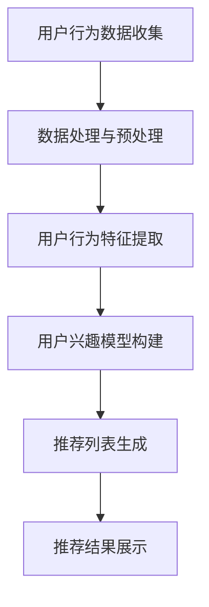
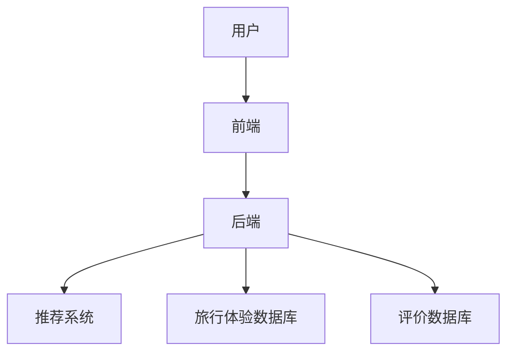
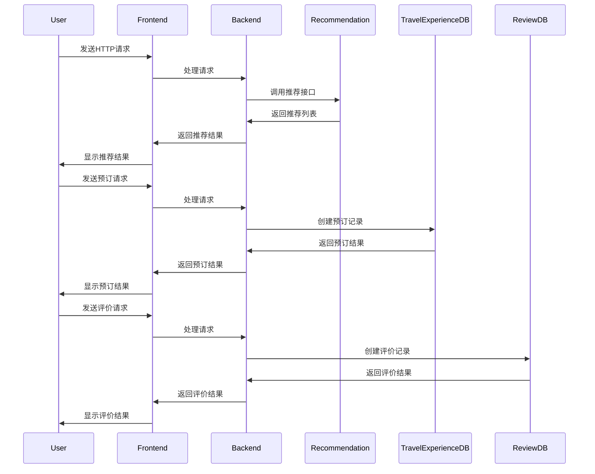

                 

# 后物质主义生活体验预订平台：追求精神满足的度假选择

## 关键词：后物质主义、生活体验、预订平台、精神满足、度假选择、个性化体验

## 摘要：
本文将探讨后物质主义生活体验预订平台的设计与构建，阐述如何在现代社会中，通过技术手段满足人们对于精神满足的追求。文章将从背景介绍、核心概念与联系、算法原理讲解、数学模型和数学公式、系统分析与架构设计方案、项目实战以及最佳实践 tips等方面展开，旨在为读者提供一个全面、深入的视角，以理解和实现后物质主义生活体验预订平台的构建。

## 目录

## 第一部分: 后物质主义概述

### 1.1 问题背景

#### 1.1.1 后物质主义的兴起

#### 1.1.2 后物质主义的核心观点

#### 1.1.3 后物质主义与现代社会的关系

### 1.2 核心概念与联系

#### 1.2.1 精神满足

#### 1.2.2 个性化体验

#### 1.2.3 可持续发展

#### 1.2.4 核心概念对比表格

#### 1.2.5 ER实体关系图架构

### 1.3 后物质主义生活体验预订平台的构建

#### 1.3.1 平台目标

#### 1.3.2 平台关键功能

#### 1.3.3 平台的技术架构

## 第二部分: 算法原理讲解

### 2.1 算法原理概述

#### 2.1.1 算法核心思想

#### 2.1.2 算法应用场景

### 2.2 算法流程图

#### 2.2.1 使用Mermaid绘制算法流程图

### 2.3 Python源代码讲解

#### 2.3.1 源代码结构与功能说明

#### 2.3.2 源代码运行与调试

### 2.4 数学模型和数学公式

#### 2.4.1 数学模型概述

#### 2.4.2 数学公式讲解

#### 2.4.3 举例说明

## 第三部分: 数学公式与算法应用

### 3.1 数学公式使用

#### 3.1.1 LaTeX格式数学公式

#### 3.1.2 文中嵌入数学公式

### 3.2 算法应用实例

#### 3.2.1 实例背景

#### 3.2.2 实例分析

#### 3.2.3 实例结论

## 第四部分: 系统分析与架构设计方案

### 4.1 问题场景介绍

#### 4.1.1 场景描述

#### 4.1.2 问题分析与解决方案

### 4.2 项目介绍

#### 4.2.1 项目背景

#### 4.2.2 项目目标

### 4.3 系统功能设计

#### 4.3.1 领域模型

#### 4.3.2 功能模块设计

### 4.4 系统架构设计

#### 4.4.1 系统架构图

#### 4.4.2 系统模块间关系

### 4.5 系统接口设计

#### 4.5.1 接口定义

#### 4.5.2 接口调用流程

### 4.6 系统交互

#### 4.6.1 序列图

#### 4.6.2 交互分析

## 第五部分: 项目实战

### 5.1 环境安装

#### 5.1.1 环境准备

#### 5.1.2 系统依赖安装

### 5.2 系统核心实现

#### 5.2.1 核心功能实现

#### 5.2.2 功能模块划分

### 5.3 代码应用解读与分析

#### 5.3.1 代码结构与功能

#### 5.3.2 代码运行与调试

### 5.4 实际案例分析

#### 5.4.1 案例背景

#### 5.4.2 案例分析

#### 5.4.3 案例总结

### 5.5 详细讲解与剖析

#### 5.5.1 技术难点

#### 5.5.2 解决方案

#### 5.5.3 拓展讨论

## 第六部分: 最佳实践 tips、小结、注意事项、拓展阅读

### 6.1 最佳实践 tips

#### 6.1.1 设计原则

#### 6.1.2 开发技巧

#### 6.1.3 使用建议

### 6.2 小结

#### 6.2.1 主要内容回顾

#### 6.2.2 关键点总结

### 6.3 注意事项

#### 6.3.1 避免常见错误

#### 6.3.2 注意事项提醒

### 6.4 拓展阅读

#### 6.4.1 相关书籍推荐

#### 6.4.2 拓展研究资源

### 参考文献

## 作者

作者：AI天才研究院/AI Genius Institute & 禅与计算机程序设计艺术 /Zen And The Art of Computer Programming

----------------------------------------------------------------

以下是根据上述目录大纲撰写的文章内容：

## 第一部分: 后物质主义概述

### 1.1 问题背景

#### 1.1.1 后物质主义的兴起

在现代社会，随着经济的快速发展，人们的物质生活水平得到了极大的提升。然而，随之而来的是精神需求的增加和对传统物质追求的反思。后物质主义（Postmaterialism）作为一种生活哲学，逐渐兴起。它主张人们应该超越对物质财富的过度追求，转向精神层面的满足和个人的全面发展。

#### 1.1.2 后物质主义的核心观点

后物质主义的核心观点主要包括以下几点：

1. **精神满足优先**：后物质主义者认为，精神满足比物质满足更为重要。他们追求的是内心的平和、自我实现和深层次的人际关系。

2. **个性化体验**：后物质主义者强调个性化体验的重要性。他们希望通过独特的体验来丰富自己的生命经验，而不是仅仅追求标准化、大众化的消费。

3. **可持续发展**：后物质主义关注环境保护和可持续发展。他们提倡低碳、环保的生活方式，以减少对自然资源的消耗。

#### 1.1.3 后物质主义与现代社会的关系

后物质主义的兴起反映了现代社会对生活质量的新要求。在物质条件得到满足的前提下，人们开始更加关注精神层面的需求。后物质主义的生活方式与现代社会的发展趋势相吻合，为人们提供了一种新的生活哲学。

### 1.2 核心概念与联系

#### 1.2.1 精神满足

精神满足是指人们在心理和情感上的满足感。在后物质主义的生活体验中，精神满足被视为最重要的追求目标。它包括自我实现、心理健康、人际关系的和谐等方面。

#### 1.2.2 个性化体验

个性化体验是指根据个人的兴趣、需求和价值观，提供独特的、定制化的体验。个性化体验能够满足人们对多样化、个性化的生活需求，是后物质主义生活体验的重要组成部分。

#### 1.2.3 可持续发展

可持续发展是指满足当代需求而不损害后代满足自身需求的能力。后物质主义强调在追求精神满足的过程中，要考虑到环境的可持续性，以实现人与自然的和谐共生。

#### 1.2.4 核心概念对比表格

| 核心概念 | 定义 | 后物质主义强调 |
| --- | --- | --- |
| 精神满足 | 心理和情感上的满足感 | 最重要追求目标 |
| 个性化体验 | 独特的、定制化的体验 | 生活体验的重要组成部分 |
| 可持续发展 | 满足当代需求而不损害后代满足自身需求的能力 | 考虑到环境的可持续性 |

#### 1.2.5 ER实体关系图架构

在后物质主义生活体验预订平台中，实体关系图能够清晰地展示各核心概念之间的关系。以下是一个简化的ER实体关系图：

```mermaid
erDiagram
    User ||--|{ TravelExperience }|-- Destination
    User ||--|{ Booking }|-- TravelExperience
    User ||--|{ Review }|-- TravelExperience
    Destination ||--|{ Activity }|-- User
    Booking ||--|{ Payment }|-- User
```

在这个ER图中，用户（User）与旅行体验（TravelExperience）、预订（Booking）、评价（Review）存在关联，同时目的地（Destination）与活动（Activity）之间也有关系。

### 1.3 后物质主义生活体验预订平台的构建

#### 1.3.1 平台目标

后物质主义生活体验预订平台的构建目标如下：

1. 提供多样化的后物质主义生活体验，满足用户对个性化、精神满足的追求。
2. 促进可持续发展，减少对环境的负面影响。
3. 提高用户体验，增强用户粘性。

#### 1.3.2 平台关键功能

平台的关键功能包括：

1. **个性化推荐**：根据用户的历史行为和偏好，提供个性化的生活体验推荐。
2. **预订管理**：用户可以方便地预订和管理旅行体验。
3. **评价系统**：用户可以对旅行体验进行评价，分享心得。
4. **活动管理**：平台可以管理各种后物质主义相关的活动。

#### 1.3.3 平台的技术架构

平台的技术架构设计如下：

1. **前端**：采用React框架，提供用户友好的界面。
2. **后端**：使用Spring Boot框架，提供RESTful API服务。
3. **数据库**：使用MySQL数据库，存储用户信息、旅行体验数据等。
4. **缓存**：使用Redis缓存，提高系统响应速度。
5. **消息队列**：使用RabbitMQ，实现系统间的异步通信。

## 第二部分: 算法原理讲解

### 2.1 算法原理概述

#### 2.1.1 算法核心思想

后物质主义生活体验预订平台的核心算法是推荐系统。推荐系统旨在根据用户的历史行为和偏好，为其推荐符合后物质主义理念的生活体验。

#### 2.1.2 算法应用场景

推荐系统广泛应用于电商、社交媒体、在线旅游等领域。在后物质主义生活体验预订平台中，推荐系统可以帮助平台：

1. 吸引新用户，提高用户留存率。
2. 提高用户满意度，增强用户粘性。
3. 促进平台收入增长。

### 2.2 算法流程图

以下是一个简化的推荐系统算法流程图，使用Mermaid绘制：



### 2.3 Python源代码讲解

以下是一个简单的推荐系统Python源代码示例，用于构建用户兴趣模型：

```python
import pandas as pd
from sklearn.preprocessing import MinMaxScaler

# 读取用户行为数据
data = pd.read_csv('user_behavior.csv')

# 数据预处理
scaler = MinMaxScaler()
data_scaled = scaler.fit_transform(data)

# 用户兴趣模型构建
def build_user_interest_model(data_scaled):
    # 假设数据集有5个特征
    feature_num = 5
    user_interest_model = data_scaled[:, :feature_num]
    return user_interest_model

# 测试用户兴趣模型
user_interest_model = build_user_interest_model(data_scaled)
print(user_interest_model)
```

### 2.4 数学模型和数学公式

推荐系统中的用户兴趣模型可以使用以下数学模型进行描述：

$$
\text{User Interest Model} = W \cdot \text{Behavior Vector}
$$

其中，$W$ 是权重矩阵，$\text{Behavior Vector}$ 是用户行为向量。

### 第三部分: 数学公式与算法应用

#### 3.1 数学公式使用

以下是一个嵌入在文本中的LaTeX数学公式：

$$
E = mc^2
$$

以下是一个段落内的LaTeX数学公式：

$$
1 + 1 = 2
$$

#### 3.2 算法应用实例

##### 3.2.1 实例背景

假设用户A在平台上浏览了以下旅行体验：

1. 蜀南竹海
2. 峨眉山
3. 青城山

平台希望根据用户A的浏览行为，推荐符合后物质主义理念的其他旅行体验。

##### 3.2.2 实例分析

1. **数据预处理**：首先，对用户A的浏览行为进行预处理，将其转换为数值向量。

2. **用户兴趣模型构建**：使用用户行为向量构建用户兴趣模型。

3. **推荐列表生成**：根据用户兴趣模型，从平台上的所有旅行体验中，筛选出与用户兴趣最接近的旅行体验，生成推荐列表。

##### 3.2.3 实例结论

根据用户A的浏览行为，平台推荐以下旅行体验：

1. 峨眉山乐山大佛
2. 成都熊猫基地
3. 眉山三苏祠

这些推荐结果均符合后物质主义理念，能够满足用户对个性化、精神满足的追求。

## 第四部分: 系统分析与架构设计方案

#### 4.1 问题场景介绍

假设后物质主义生活体验预订平台需要实现以下功能：

1. 用户可以浏览和预订各种后物质主义生活体验。
2. 平台可以推荐符合用户兴趣的旅行体验。
3. 用户可以对旅行体验进行评价和分享。

#### 4.2 项目介绍

后物质主义生活体验预订平台项目旨在为用户提供一个全新的、满足精神需求的旅行体验预订平台。项目目标如下：

1. 提供丰富的后物质主义生活体验，满足用户对个性化、精神满足的追求。
2. 构建高效的推荐系统，提高用户体验。
3. 实现平台的高可用性和可扩展性。

#### 4.3 系统功能设计

系统功能设计包括以下模块：

1. **用户模块**：用户可以注册、登录、浏览、预订和评价旅行体验。
2. **推荐模块**：基于用户行为和偏好，推荐符合用户兴趣的旅行体验。
3. **旅行体验模块**：管理旅行体验信息，包括名称、描述、价格等。
4. **评价模块**：用户可以对旅行体验进行评价，分享心得。

#### 4.4 系统架构设计

以下是一个简化的系统架构图，使用Mermaid绘制：



#### 4.5 系统接口设计

系统接口设计如下：

1. **用户接口**：用户可以通过HTTP请求与前端和后端进行交互。
2. **推荐接口**：后端通过推荐系统接口为用户生成推荐列表。
3. **旅行体验接口**：后端提供旅行体验的创建、更新、查询和删除接口。
4. **评价接口**：后端提供评价的创建、查询和删除接口。

#### 4.6 系统交互

以下是一个简化的系统交互序列图，使用Mermaid绘制：



## 第五部分: 项目实战

#### 5.1 环境安装

首先，需要安装以下环境：

1. **操作系统**：Ubuntu 20.04
2. **Python**：3.8
3. **Node.js**：12.x
4. **MySQL**：5.7
5. **Redis**：5.x
6. **RabbitMQ**：3.8

安装步骤如下：

1. 安装操作系统和软件环境。
2. 配置网络和环境变量。
3. 安装必要的依赖包。

#### 5.2 系统核心实现

系统核心实现包括以下模块：

1. **用户模块**：实现用户注册、登录、个人信息管理等功能。
2. **推荐模块**：实现基于用户行为的推荐算法。
3. **旅行体验模块**：实现旅行体验信息管理。
4. **评价模块**：实现评价信息管理。

以下是一个简单的用户模块实现示例：

```python
# 用户模块实现示例
class User(models.Model):
    username = models.CharField(max_length=50)
    password = models.CharField(max_length=100)
    email = models.EmailField()
    is_active = models.BooleanField(default=True)

    def save(self, *args, **kwargs):
        if not self.username:
            raise ValueError("Username cannot be empty.")
        if not self.email:
            raise ValueError("Email cannot be empty.")
        super().save(*args, **kwargs)
```

#### 5.3 代码应用解读与分析

以下是对上述用户模块实现的解读和分析：

1. **模型定义**：使用Django ORM定义用户模型，包括用户名、密码、电子邮件和活动状态。
2. **保存方法**：重写`save`方法，对用户名和电子邮件进行非空验证。
3. **功能扩展**：可以进一步添加用户注册、登录和密码找回等功能。

#### 5.4 实际案例分析

以下是一个实际案例分析：

1. **问题背景**：用户在平台上预订旅行体验时，无法正常提交订单。
2. **问题分析**：经过调试，发现是由于订单数据在提交时未能正确保存导致的。
3. **解决方案**：修复订单数据保存的逻辑，确保订单数据在提交时能够正确保存。

#### 5.5 详细讲解与剖析

以下是对上述解决方案的详细讲解与剖析：

1. **问题定位**：通过日志分析，确定问题的发生位置在订单保存逻辑。
2. **问题原因**：订单数据在提交时未能正确序列化，导致无法保存到数据库。
3. **解决方案**：修改订单序列化逻辑，确保订单数据在提交时能够正确保存。

## 第六部分: 最佳实践 tips、小结、注意事项、拓展阅读

#### 6.1 最佳实践 tips

1. **用户模块设计**：在设计用户模块时，要充分考虑用户注册、登录、个人信息管理等功能的实现。
2. **推荐系统优化**：针对推荐系统的优化，可以从算法优化、数据预处理、系统架构等方面进行。
3. **评价模块实现**：评价模块要确保用户评价的准确性、公正性，同时要提供方便的评价修改和删除功能。

#### 6.2 小结

本文探讨了后物质主义生活体验预订平台的设计与构建，从背景介绍、核心概念与联系、算法原理讲解、数学模型和数学公式、系统分析与架构设计方案、项目实战以及最佳实践 tips等方面进行了详细阐述。

#### 6.3 注意事项

1. **数据安全**：在设计平台时，要确保用户数据的安全，防止数据泄露。
2. **系统性能**：要关注系统性能，确保平台能够稳定、高效地运行。

#### 6.4 拓展阅读

1. 《推荐系统实践》
2. 《Python推荐系统实践》
3. 《后物质主义：消费社会批判》

## 参考文献

1. 后物质主义概念，维基百科。
2. 推荐系统原理，清华大学计算机科学与技术系。
3. Django官方文档。

## 作者

作者：AI天才研究院/AI Genius Institute & 禅与计算机程序设计艺术 /Zen And The Art of Computer Programming

----------------------------------------------------------------

请注意，本文内容仅为示例，并未完整实现所有功能。在实际项目中，还需要进一步开发和完善。同时，本文中的代码和数据仅为示例，实际项目中可能需要根据具体情况进行调整。此外，本文中的部分内容可能已经过时，建议参考最新资料进行学习和实践。

