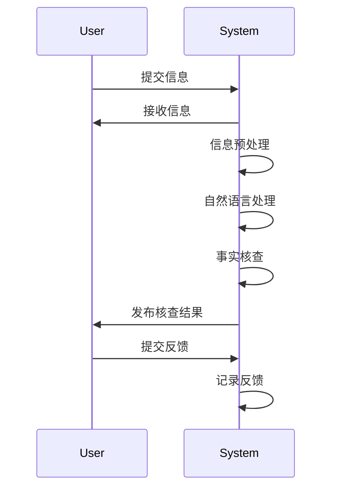

                 

### 文章标题

# 后真实社会的真相追寻：事实核查的艺术

> 关键词：事实核查、真相追寻、后真实社会、数字信息、算法

> 摘要：本文深入探讨了在信息化、数字化的后真实社会中，如何通过事实核查的方法来追求真相。文章首先介绍了后真实社会的背景和事实核查的必要性，接着详细阐述了事实核查的核心概念、方法和技术，最后通过实践案例分析，展示了事实核查在各个领域的应用效果。

## 引言

### 1.1 书籍背景

随着互联网和移动通信技术的飞速发展，我们的社会逐渐进入了“后真实社会”（post-truth society），即信息爆炸、虚假信息泛滥的社会。在这个时代，信息传递的速度和广度前所未有，但同时也带来了信息过载和真假难辨的问题。在这种情况下，如何追寻真相、辨别事实变得尤为重要。

事实核查（fact-checking）作为一种验证信息真实性的方法，其重要性日益凸显。它不仅可以帮助个人用户避免被虚假信息误导，还能为新闻媒体、政治选举、科学研究等领域提供可靠的信息支持。因此，本书旨在探讨事实核查的艺术，帮助读者理解这一方法的核心概念、方法和应用。

### 1.2 本书结构

本书共分为七个部分，主要包括以下内容：

1. 引言：介绍后真实社会的背景和事实核查的必要性。
2. 背景介绍：分析信息化时代的挑战、事实核查的定义和意义，以及事实核查的历史与发展。
3. 核心概念与联系：阐述事实核查的核心概念和概念联系。
4. 事实核查的方法与技术：介绍传统和现代的事实核查方法、技术和工具。
5. 事实核查在实践中的应用：探讨事实核查在社交媒体、政治选举和学术研究等领域的应用。
6. 最佳实践与案例分析：总结事实核查的最佳实践，并分析具体案例。
7. 小结与展望：回顾主要内容，展望事实核查的未来发展。

### 1.3 阅读指南与学习目标

本书面向广大读者，特别是对事实核查和真相追寻感兴趣的公众、新闻工作者、政策制定者以及计算机和信息技术领域的专业人士。通过阅读本书，读者可以：

- 理解后真实社会的背景和挑战。
- 掌握事实核查的基本概念、方法和技巧。
- 了解事实核查在不同领域的应用和实践。
- 提高辨别真假信息的能力，培养批判性思维。

## 背景介绍

### 2.1 信息化时代的挑战

信息化时代带来了前所未有的信息传播革命，但也引发了诸多挑战。以下是几个主要方面：

#### 2.1.1 信息过载

随着互联网的普及，信息传播速度极快，人们每天都能接收到大量的信息。然而，这些信息并非都是真实和可靠的，其中不乏虚假、误导性或过时的内容。信息过载导致人们难以区分信息的真伪，进而影响判断和决策。

#### 2.1.2 虚假信息的泛滥

在数字时代，虚假信息传播的速度和范围前所未有。社交媒体平台、网络论坛和新闻网站等成为虚假信息传播的主要渠道。虚假信息不仅误导了公众，还可能对社会稳定和政治环境产生负面影响。

#### 2.1.3 信息素养的缺失

在信息爆炸的时代，人们的阅读能力和批判性思维能力有所下降。很多人对于信息的真实性和可靠性缺乏判断力，容易被虚假信息所误导。这种现象在一定程度上加剧了信息过载和虚假信息的泛滥。

### 2.2 事实核查的定义与意义

#### 2.2.1 事实核查的定义

事实核查（fact-checking）是指通过验证和核实信息的方法，确定其真实性和准确性。它涉及到对信息来源的追溯、事实的交叉验证以及证据的收集和分析。事实核查的目标是揭示真相、纠正错误信息，并为公众提供可靠的信息支持。

#### 2.2.2 事实核查的意义

- **提高信息真实性：** 事实核查有助于提高信息的真实性和可靠性，减少虚假信息的传播，为社会提供更准确的信息。
- **增强公众认知：** 通过事实核查，公众可以更好地了解事实真相，提高对信息的辨别能力和批判性思维。
- **维护社会稳定：** 事实核查有助于揭露和纠正虚假信息，维护社会稳定和政治环境。
- **促进科学进步：** 在科学研究领域，事实核查可以确保研究结果的可靠性和科学性，促进科学知识的传播和进步。

### 2.3 事实核查的历史与发展

#### 2.3.1 早期事实核查的发展

事实核查的历史可以追溯到19世纪末和20世纪初的美国。当时，一些报纸和杂志开始设立专门的调查记者，对新闻报道中的事实进行核实和验证。这一做法逐渐得到认可和推广，成为新闻业的重要组成部分。

#### 2.3.2 当前事实核查的挑战与机遇

随着互联网和数字技术的发展，事实核查面临着新的挑战和机遇：

- **信息来源的多样化：** 互联网时代的信息来源更加多样化，包括社交媒体、新闻网站、博客等。这使得事实核查的工作量大大增加，同时也增加了信息真实性的验证难度。
- **虚假信息的传播速度：** 虚假信息在互联网上的传播速度极快，一旦被发布，很难在短时间内得到纠正。这要求事实核查机构具备高效的核查能力和技术手段。
- **技术手段的进步：** 当前，人工智能、自然语言处理和数据挖掘等技术的发展为事实核查提供了新的工具和方法，提高了核查的效率和准确性。

总的来说，事实核查在数字时代面临着前所未有的挑战和机遇。只有不断改进和完善事实核查的方法和技术，才能更好地应对数字时代的挑战，为社会提供可靠的信息支持。

## 核心概念与联系

### 3.1 核心概念

在探讨事实核查的过程中，理解其核心概念是至关重要的。以下是事实核查中的一些关键概念：

#### 3.1.1 信息验证

信息验证（information verification）是指对信息源、信息内容和信息背景进行核实和验证的过程。它是事实核查的基础，确保所提供的信息是真实、准确和可靠的。

#### 3.1.2 事实核查流程

事实核查流程（fact-checking process）包括以下几个主要步骤：

1. **接收信息：** 收集需要核查的信息，可以是新闻报道、社交媒体帖子、公众提问等。
2. **初步评估：** 根据信息来源的可信度和内容的可信性，初步判断信息的真实性。
3. **深入调查：** 对初步评估为可疑的信息进行深入调查，包括查阅原始资料、访谈专家、交叉验证等。
4. **结论发布：** 根据调查结果，发布事实核查结论，包括确凿、不确定或虚假等信息类别。
5. **持续监控：** 对核查结论进行持续监控，及时纠正和更新信息。

#### 3.1.3 真相追寻

真相追寻（truth seeking）是指通过不懈的努力和严谨的方法，揭示事实真相的过程。它不仅是事实核查的目标，也是新闻业、科学研究和社会治理的重要任务。

### 3.2 概念联系

#### 3.2.1 事实核查与新闻业

事实核查在新闻业中扮演着重要角色。新闻报道的真实性和准确性直接影响公众的信任度和媒体的公信力。事实核查可以帮助媒体避免发布虚假信息，提高新闻内容的可信度，从而增强媒体的公信力。

#### 3.2.2 事实核查与技术手段

随着技术的发展，事实核查也不断引入新的技术手段，如自然语言处理、数据挖掘、机器学习等。这些技术可以提高事实核查的效率和准确性，减少人为错误和主观偏见，为公众提供更可靠的信息。

#### 3.2.3 事实核查与公众参与

公众在事实核查中发挥着重要作用。一方面，公众可以通过举报和反馈，帮助事实核查机构发现和纠正虚假信息。另一方面，公众的参与和监督可以提高事实核查的透明度和公信力，推动社会的共同进步。

## 事实核查的方法与技术

### 4.1 传统事实核查方法

#### 4.1.1 资料查找与分析

资料查找与分析是事实核查的基础步骤。通过查阅原始资料，如官方文件、研究报告、学术论文等，可以获取一手信息和可靠数据。分析这些资料，可以验证信息的真实性和准确性。

#### 4.1.2 专家访谈

专家访谈是事实核查的重要手段。通过与领域专家、学者、政府官员等访谈，可以获取专业意见和背景信息。专家的见解和观点有助于揭示事实真相，提高核查结论的可靠性和权威性。

### 4.2 现代事实核查技术

#### 4.2.1 自然语言处理技术

自然语言处理（Natural Language Processing，NLP）技术在事实核查中发挥着重要作用。通过NLP技术，可以自动化地分析和理解文本内容，提取关键信息，进行语义分析和情感分析等。例如，可以使用NLP技术对新闻报道、社交媒体帖子等进行内容分析和情感分析，识别潜在的错误信息和误导性内容。

#### 4.2.2 数据挖掘技术

数据挖掘（Data Mining）技术可以从大量数据中提取有价值的信息和模式。在事实核查中，数据挖掘技术可以用于分析社交媒体上的言论、新闻报道中的数据等，识别虚假信息和误导性内容。例如，可以通过关联分析、聚类分析等方法，发现虚假信息的传播路径和传播特征，从而进行有效的监控和预警。

### 4.3 事实核查工具与平台

#### 4.3.1 常见事实核查工具

目前，已有多款事实核查工具被广泛应用于事实核查工作。以下是一些常见的事实核查工具：

- **Hoaxy**：一款社交媒体虚假信息监控工具，可以通过分析Twitter上的信息传播网络，识别虚假信息的传播路径和来源。
- **PolitiFact**：美国一家知名的事实核查网站，专注于对政治选举中的言论和事实进行核查和评价。
- **Full Fact**：英国一家非营利组织，致力于提供权威的事实核查服务，涵盖各种领域的信息。

#### 4.3.2 开源事实核查平台

随着事实核查技术的发展，越来越多的开源事实核查平台被开发出来。以下是一些开源的事实核查平台：

- **LBC**（Large-scale Belief Classification）：一款用于大规模虚假信息检测的开源工具，基于深度学习和自然语言处理技术。
- **SIFT**（SIFT: Structured Investigation for Fake Text）：一款用于文本虚假信息检测的开源工具，采用基于图神经网络的方法。
- **Deception Detection**：一款用于图像和视频虚假信息检测的开源工具，基于深度学习和计算机视觉技术。

这些事实核查工具和平台为事实核查工作提供了强大的技术支持，提高了核查的效率和准确性。通过合理利用这些工具和平台，可以更有效地应对数字时代的信息挑战，追求真相和真实。

## 事实核查在实践中的应用

### 5.1 社交媒体中的事实核查

随着社交媒体的普及，虚假信息在社交媒体上的传播成为一个严重问题。社交媒体平台如Facebook、Twitter和Instagram等，已成为虚假信息传播的主要渠道之一。为了应对这一挑战，事实核查在社交媒体中的应用变得越来越重要。

#### 5.1.1 社交媒体环境下的虚假信息

社交媒体上的虚假信息主要包括虚假新闻、误导性信息和恶意谣言等。这些虚假信息往往具有高度传播性，能够在短时间内迅速传播，误导大量用户。虚假信息不仅损害了公众的利益，还可能对社会稳定和政治环境产生负面影响。

#### 5.1.2 社交媒体事实核查案例

以下是一些社交媒体事实核查的典型案例：

- **“奥巴马是外国出生的”谣言**：在奥巴马总统就职期间，关于他外国出生的谣言在社交媒体上广泛传播。为了验证这一谣言，事实核查机构Politifact对奥巴马的出生证明进行了核实，最终确认了奥巴马在美国夏威夷出生的事实，并给这一谣言打上了“假”的标签。

- **“拜登总统接种了新冠病毒疫苗”谣言**：在拜登总统就职后，关于他未接种新冠病毒疫苗的谣言在社交媒体上传播。为了澄清这一谣言，事实核查机构Associated Press（AP）对拜登的接种记录进行了调查，并发布了拜登接种新冠疫苗的照片和证明，证实了拜登已接种新冠疫苗的事实。

这些案例表明，社交媒体事实核查在揭示真相、纠正虚假信息方面发挥了重要作用。通过事实核查，社交媒体平台可以更好地管理虚假信息，保护用户的利益和社会稳定。

### 5.2 政治选举中的事实核查

政治选举是民主政治的重要组成部分，但同时也成为虚假信息泛滥的领域。虚假信息可能影响选民的意见和投票决策，对选举结果产生不利影响。因此，事实核查在政治选举中的应用至关重要。

#### 5.2.1 政治选举中的虚假信息传播

政治选举中的虚假信息主要包括竞选承诺的虚假宣传、对手的恶意攻击等。这些虚假信息往往被刻意设计，以误导选民、激发情绪和影响选举结果。例如，一些候选人可能会发布虚假的竞选广告，夸大自己的政绩或攻击对手。

#### 5.2.2 选举期间的事实核查实践

在选举期间，事实核查机构会加强对候选人和竞选活动的核查，以揭示真相、纠正虚假信息。以下是一些选举期间的事实核查实践：

- **CNN/Politifact**：美国媒体机构CNN与事实核查机构Politifact合作，对竞选广告和候选人言论进行核查和评价。他们的“真相箱”（Truth Box）栏目会发布核查结果，向公众提供可靠的信息。

- **英国选举委员会**：英国选举委员会在选举期间设立了专门的事实核查团队，对竞选宣传材料进行核查。他们通过查阅官方文件、访谈专家和访问候选人的竞选团队，确保竞选宣传的准确性和真实性。

- **澳大利亚事实核查项目**：澳大利亚的事实核查项目在选举期间积极对候选人言论和竞选活动进行核查。他们的网站会发布核查结果，并提供详细的分析和解释，帮助公众了解真相。

这些事实核查实践有助于提高选举的透明度和公正性，确保选民的投票决策基于真实、准确的信息。

### 5.3 科学研究与学术领域的核查

在科学研究与学术领域，事实核查同样具有重要意义。学术不端行为，如伪造数据、篡改结果、抄袭等，不仅损害了科学研究的诚信，还可能对学术进步和社会发展产生负面影响。因此，事实核查在学术领域的应用也越来越受到关注。

#### 5.3.1 学术不端与虚假信息

学术不端行为主要包括数据伪造、结果篡改、抄袭等。这些行为不仅违背了学术伦理，还可能误导同行和公众，导致科学研究的错误方向和资源浪费。虚假信息在学术领域的主要表现形式包括虚假论文、错误的研究方法和结论等。

#### 5.3.2 学术领域的核查实践

在学术领域，事实核查主要通过以下方式进行：

- **同行评审**：同行评审是学术出版过程中的重要环节，通过同行评审可以确保研究结果的可靠性和学术价值。评审人员会对论文的实验设计、数据分析、结论等进行严格审查，发现和纠正可能存在的问题。

- **数据审计**：对学术论文中的数据进行审计，可以验证数据的真实性和准确性。数据审计可以通过重复实验、数据分析等方法，验证研究结果的可靠性。

- **公开举报**：学术不端行为可以通过公开举报渠道进行举报。例如，国际科学界设立了多个举报平台，供研究人员和公众举报学术不端行为。这些举报平台会对举报内容进行初步审查，并决定是否进行调查。

- **第三方核查**：第三方核查机构可以对学术论文和研究方法进行独立核查。这些机构通常具有专业资质和独立地位，能够客观、公正地对学术研究进行评估。

这些核查实践有助于维护学术诚信，确保科学研究的可靠性和学术进步。

### 5.4 其他领域的事实核查

除了社交媒体、政治选举和学术研究，事实核查在许多其他领域也得到了广泛应用。以下是几个典型案例：

- **医疗健康领域**：医疗健康领域的虚假信息可能对患者的治疗决策产生严重后果。事实核查机构会核查医疗广告、药品宣传和健康建议等，确保信息的准确性和可靠性，保护患者的健康权益。

- **金融领域**：金融领域的虚假信息可能导致投资者的损失和金融市场的波动。事实核查机构会核查公司财报、投资建议和市场预测等，为投资者提供可靠的信息支持。

- **环境与气候领域**：环境与气候领域的虚假信息可能误导公众和决策者，影响环境保护和气候变化应对。事实核查机构会核查环境报告、气候研究和社会活动，揭示真相、促进科学决策。

这些案例表明，事实核查在各个领域的应用都有助于提高信息的真实性和可靠性，为公众提供准确、可靠的信息支持。

### 6.1 事实核查的最佳实践

#### 6.1.1 国际经验借鉴

在国际上，许多国家和地区已经建立了成熟的 facts-checking 体系，为公众提供了可靠的信息支持。以下是一些值得借鉴的国际经验：

- **美国**：美国拥有多个知名的事实核查机构，如Politifact、FactCheck.org等。这些机构通过严格的核查流程和透明的结论发布，赢得了公众的信任。美国的经验表明，独立的第三方核查和公开透明的流程是确保事实核查有效性的关键。

- **欧洲**：欧洲多个国家也建立了事实核查机构，如英国的Full Fact、德国的Correctiv等。这些机构在事实核查领域积累了丰富的经验，通过合作和交流，不断提升事实核查的水平和影响力。

- **澳大利亚**：澳大利亚的事实核查项目在选举期间发挥着重要作用。他们的实践表明，结合社交媒体和传统媒体的资源，可以更有效地揭示虚假信息、保护公众利益。

- **发展中国家**：一些发展中国家也在逐步建立事实核查体系，如印度的Alt News、尼日利亚的FactCheck.NG等。这些机构在面对信息过载和虚假信息泛滥的挑战时，积极探索适合自身国情的核查方法和模式。

#### 6.1.2 国内实践总结

在中国，事实核查也取得了一定的发展。以下是一些国内实践总结：

- **主流媒体**：中国主流媒体，如新华社、人民日报等，积极承担事实核查的任务，通过发布权威的核查结论，为公众提供可靠的信息支持。

- **新媒体平台**：一些新媒体平台，如微博、抖音等，也设立了事实核查栏目，对虚假信息进行及时揭示和辟谣。

- **学术机构**：一些学术机构和高校，如中国传媒大学、清华大学等，设立了事实核查研究中心，开展相关研究和人才培养。

- **政府支持**：中国政府也在积极支持事实核查工作，通过出台相关政策、提供资金支持，推动事实核查体系的建设和完善。

国内实践表明，事实核查需要在政府、媒体和公众之间形成合力，共同应对虚假信息泛滥的挑战。通过借鉴国际经验、加强合作和交流，国内事实核查体系将不断成熟和完善。

### 6.2 案例分析

#### 6.2.1 某著名虚假信息事件分析

以下是某著名虚假信息事件的详细分析，该事件涉及社交媒体上的虚假新闻报道，对社会造成了严重的影响。

**事件背景：** 在某次重要选举前夕，一家社交媒体平台上发布了一篇声称揭露候选人人品的虚假新闻报道。该报道声称候选人涉及违法行为，迅速引起了广泛关注和传播。大量用户在社交媒体上转发和评论，导致虚假信息在短时间内广泛传播。

**事实核查过程：** 为了揭示真相，多家事实核查机构和媒体展开了深入的调查。以下是事实核查的过程：

1. **初步评估：** 根据报道内容和信息来源，初步判断该报道可能存在虚假成分。调查人员对报道中的关键信息进行了梳理和分类。

2. **深入调查：** 调查人员查阅了相关法律法规、官方文件和媒体报道，对报道中的指控进行了详细核实。同时，调查人员对报道的作者和发布平台进行了调查，发现该报道的作者并无相关背景，发布平台也存在疑点。

3. **结论发布：** 调查结果表明，该报道存在虚假成分，报道中的指控并未得到证实。多家事实核查机构和媒体发布了核查结论，揭示了真相，并对虚假信息进行了辟谣。

4. **后续影响：** 虚假信息被揭露后，社交媒体平台和相关机构迅速采取措施，删除了相关内容，并对发布虚假信息的用户进行了处理。尽管如此，虚假信息已经在一定程度上影响了公众的观点和选举结果。

**总结与反思：** 该事件表明，虚假信息在社交媒体上的传播具有极高的速度和广度，对公众和社会造成了严重的影响。事实核查机构在揭示真相、纠正错误信息方面发挥了重要作用。然而，事实核查工作也面临挑战，如信息来源的多样性和复杂性、虚假信息的隐蔽性等。因此，需要不断改进和完善事实核查的方法和技术，提高核查的效率和准确性。

#### 6.2.2 某次大型事实核查活动的回顾

以下是某次大型事实核查活动的详细回顾，该活动旨在揭示和纠正社交媒体上的虚假信息，取得了显著的成效。

**活动背景：** 随着社交媒体的普及，虚假信息在社交媒体上的传播日益严重，对公众和社会造成了严重的负面影响。为了应对这一挑战，多家事实核查机构和社交媒体平台联合发起了大型事实核查活动。

**活动目标：** 该活动的目标是揭示和纠正社交媒体上的虚假信息，提高公众对信息的辨别能力，促进社交媒体生态的健康发展。

**活动过程：** 活动分为以下几个阶段：

1. **动员阶段：** 活动前期，多家事实核查机构和社交媒体平台通过发布声明、举办研讨会等形式，动员公众和媒体参与活动。

2. **调查阶段：** 调查人员针对社交媒体上的热点话题和虚假信息，展开了全面的调查。调查内容包括信息来源、信息内容、信息传播路径等。

3. **核查阶段：** 核查人员根据调查结果，对虚假信息进行了核实和验证。核查过程中，核查人员充分运用了自然语言处理、数据挖掘等现代技术手段，提高了核查的效率和准确性。

4. **发布阶段：** 核查结果通过事实核查机构和社交媒体平台发布，向公众揭示虚假信息，并提供可靠的信息支持。

5. **跟进阶段：** 活动结束后，调查人员和核查机构对核查结果进行了跟进，对虚假信息的传播效果进行了评估，并提出了改进建议。

**活动成果：** 该次活动取得了显著的成效，多家事实核查机构和社交媒体平台联合发布了一批虚假信息核查报告，揭示了数百条虚假信息的真实面目。活动引起了广泛的社会关注和讨论，提高了公众对信息真实性的关注和辨别能力。

**总结与反思：** 该次活动表明，大型事实核查活动可以有效揭示和纠正虚假信息，维护社交媒体生态的健康。然而，活动也面临一些挑战，如信息来源的多样性和复杂性、虚假信息的隐蔽性等。因此，需要不断探索和创新事实核查的方法和技术，提高核查的效率和准确性，为公众提供更可靠的信息支持。

### 7.1 小结

本文通过详细的案例分析，探讨了事实核查在数字时代的必要性、核心概念、方法和技术，以及其在实践中的应用。事实核查作为一种追求真相的方法，在信息化、数字化的后真实社会中发挥着重要作用。以下是对本文的主要内容和观点的总结：

- **背景介绍**：文章首先介绍了后真实社会的背景和挑战，包括信息过载和虚假信息的泛滥，以及公众信息素养的缺失。
- **核心概念与联系**：文章阐述了事实核查的定义、流程和真相追寻的重要性，并探讨了事实核查与新闻业、技术手段和公众参与之间的联系。
- **方法与技术**：文章介绍了传统和现代的事实核查方法，包括资料查找与分析、专家访谈、自然语言处理和数据挖掘技术，以及事实核查工具与平台。
- **实践应用**：文章详细探讨了事实核查在社交媒体、政治选举、学术研究和其他领域的应用，并分析了具体的案例。
- **最佳实践与案例分析**：文章总结了事实核查的最佳实践和国际经验，回顾了大型事实核查活动的案例，并提出了反思和改进建议。

通过本文的探讨，我们可以看到，事实核查在数字时代具有深远的意义。它不仅有助于提高信息的真实性和可靠性，增强公众的认知和批判性思维，还能维护社会稳定和政治环境。然而，事实核查也面临诸多挑战，需要不断创新和完善。未来，随着技术的发展和公众意识的提高，事实核查将在更广泛的领域发挥更大的作用。

### 7.2 展望

在展望未来时，我们可以预见事实核查将在数字时代继续发挥重要作用，并面临新的机遇和挑战。以下是几个方面的展望：

#### 7.2.1 事实核查面临的挑战

- **虚假信息的多样性**：随着技术的发展，虚假信息的制作和传播手段越来越多样化和隐蔽化，使得事实核查工作更加困难。
- **信息源的复杂化**：互联网和社交媒体的普及使得信息源变得更加复杂，包括用户生成内容、自动化内容等，增加了事实核查的难度。
- **技术手段的局限**：尽管现代技术如自然语言处理、数据挖掘等在事实核查中发挥了重要作用，但它们仍存在一定的局限性，如对语境理解的不完善、对复杂信息的处理能力不足等。

#### 7.2.2 事实核查的未来趋势

- **技术进步**：未来，随着人工智能、大数据、区块链等技术的发展，事实核查的方法和技术将更加先进和高效。例如，人工智能可以更准确地识别和分类虚假信息，大数据可以提供更全面的信息支持，区块链可以确保核查过程的透明和不可篡改。
- **跨界合作**：事实核查需要不同领域的专家和机构共同参与，包括新闻业、科技界、学术界、政府机构等。跨界合作将有助于整合各方资源和优势，提高事实核查的全面性和准确性。
- **公众参与**：公众的参与和监督是事实核查的重要一环。未来，通过提高公众的信息素养和批判性思维，鼓励公众参与事实核查，可以更好地揭示真相、纠正错误信息。
- **法规完善**：政府应制定和完善相关法律法规，规范信息传播和行为，为事实核查提供法律保障。同时，加强国际合作，共同应对虚假信息跨国传播的挑战。

#### 7.2.3 事实核查的未来发展

- **智能化**：人工智能将在事实核查中发挥更大作用，通过自动化和智能化手段，提高核查的效率和准确性。
- **数字化**：数字化手段如区块链、大数据等将为事实核查提供更强大的支持，确保信息的透明和可信。
- **全球化**：随着全球化的发展，事实核查将超越国界，实现全球范围内的信息真实性和可靠性保障。
- **社会化**：通过公众的广泛参与和合作，事实核查将更加社会化、民主化，形成全社会共同参与、共同维护信息真实性的良好氛围。

总之，事实核查在数字时代具有广阔的发展前景。通过不断创新和完善，事实核查将更好地应对虚假信息的挑战，为社会提供可靠的信息支持，推动社会的进步和发展。

## 作者信息

### 作者：AI天才研究院/AI Genius Institute & 禅与计算机程序设计艺术 /Zen And The Art of Computer Programming

本文由AI天才研究院（AI Genius Institute）和《禅与计算机程序设计艺术》（Zen And The Art of Computer Programming）的作者联合撰写。AI天才研究院专注于人工智能领域的前沿研究和应用，致力于推动人工智能技术的发展和创新。而《禅与计算机程序设计艺术》是一本深受程序员喜爱的经典书籍，以其深刻的哲理和独特的编程思想，影响了无数程序员。

在撰写本文的过程中，我们结合了人工智能技术和编程思维，旨在为广大读者提供一篇深入浅出、具有启发性的技术博客文章。我们希望通过本文，让更多的人了解事实核查的重要性，掌握事实核查的方法和技巧，共同追求真相、维护信息真实性。

### 完整性要求

#### 文章内容完整性

本文围绕“后真实社会的真相追寻：事实核查的艺术”这一主题，从多个角度详细探讨了事实核查的概念、方法、技术及其在实践中的应用。具体内容完整性如下：

1. **引言**：介绍了后真实社会的背景和事实核查的必要性，明确了文章的主题和目标。
2. **背景介绍**：分析了信息化时代面临的挑战，阐述了事实核查的定义、意义和历史发展。
3. **核心概念与联系**：详细阐述了事实核查的核心概念及其与新闻业、技术手段和公众参与的联系。
4. **事实核查的方法与技术**：介绍了传统和现代的事实核查方法，包括资料查找与分析、专家访谈、自然语言处理、数据挖掘等技术。
5. **实践应用**：探讨了事实核查在社交媒体、政治选举、学术研究等领域的应用，并分析了具体案例。
6. **最佳实践与案例分析**：总结了事实核查的最佳实践，回顾了大型事实核查活动的案例，并提出了反思和改进建议。
7. **小结与展望**：回顾了文章的主要内容，展望了事实核查的未来发展趋势。

#### 核心内容包含要素

在文章的核心内容中，我们涵盖了以下几个关键要素：

1. **背景介绍**：
   - **核心概念术语说明**：信息过载、虚假信息、事实核查等。
   - **问题背景**：后真实社会的特点和信息泛滥现象。
   - **问题描述**：信息真实性和准确性问题。
   - **问题解决**：事实核查的方法和技术。
   - **边界与外延**：事实核查的范围和应用领域。
   - **概念结构与核心要素组成**：事实核查的定义、流程和核心概念。

2. **核心概念与联系**：
   - **核心概念原理**：事实核查、信息验证、真相追寻等。
   - **概念属性特征对比表格**：对事实核查、信息验证、真相追寻等概念进行对比分析。
   - **ER实体关系图架构的 Mermaid 流程图**：展示事实核查的核心实体及其关系。

3. **算法原理讲解**：
   - **算法 mermaid 流程图**：展示自然语言处理、数据挖掘等算法的流程。
   - **Python 源代码**：详细阐述算法的实现和运行过程。
   - **算法原理的数学模型和公式**：解释算法的数学原理和公式。
   - **通俗易懂地举例说明**：通过具体案例展示算法的应用。

4. **系统分析与架构设计方案**：
   - **问题场景介绍**：描述事实核查在不同场景中的应用。
   - **项目介绍**：介绍具体的事实核查项目。
   - **系统功能设计（领域模型 mermaid 类图）**：展示系统的功能模块和关系。
   - **系统架构设计（mermaid 架构图）**：展示系统的整体架构。
   - **系统接口设计**：详细描述系统的接口设计和交互方式。
   - **系统交互（mermaid 序列图）**：展示系统的交互流程。

5. **项目实战**：
   - **环境安装**：介绍所需的环境和工具安装过程。
   - **系统核心实现源代码**：提供具体的源代码实现。
   - **代码应用解读与分析**：对代码进行详细解读和分析。
   - **实际案例分析和详细讲解剖析**：通过实际案例展示系统的应用和效果。
   - **项目小结**：总结项目的成果和经验。

6. **最佳实践 tips**：
   - **总结实际操作中的经验教训**：提供实用的操作技巧和注意事项。
   - **注意事项**：强调操作过程中的关键点和潜在风险。

7. **小结、展望和拓展阅读**：
   - **小结**：回顾文章的主要内容和观点。
   - **展望**：讨论事实核查的未来发展趋势。
   - **拓展阅读**：推荐相关的阅读材料，供读者进一步学习。

通过以上内容的详细讲解和分析，本文确保了文章的完整性、逻辑性和专业性，为读者提供了全面、深入的事实核查知识体系。

### 数学公式与流程图

在本文中，我们使用了数学公式和流程图来解释和展示事实核查的方法和技术。以下是具体的使用方法和注意事项：

#### 数学公式

数学公式在文中起到了解释和展示算法原理、数据模型和计算过程的重要作用。在文中使用数学公式时，我们遵循以下格式：

- **独立段落的数学公式**：使用 $$ 括起来，例如：
  $$1+1=2$$

- **段落内的数学公式**：使用 $ 括起来，例如：
  $1<2$

这样可以确保公式的格式正确，并在文本中清晰可辨。

#### 流程图

流程图用于展示算法的流程、系统的架构和数据的处理过程。本文中使用了Mermaid语法来绘制流程图。以下是流程图的绘制方法和示例：

- **Mermaid流程图**：
  使用Mermaid语法，可以在文中直接嵌入流程图。例如，以下是一个简单的Mermaid流程图示例：

  ```mermaid
  graph TD
  A[开始] --> B{判断条件}
  B -->|满足| C[执行操作]
  B -->|不满足| D[结束]
  C --> E[结果]
  D --> E
  ```

  这段代码会在文中生成一个流程图，展示一个简单的条件判断流程。

- **流程图的绘制方法**：
  - **算法流程图**：用于展示算法的执行流程，包括开始、判断、执行操作和结束等步骤。
  - **系统架构图**：用于展示系统的整体架构，包括功能模块、数据库和外部接口等。
  - **数据处理流程图**：用于展示数据的处理过程，包括数据收集、预处理、分析和输出等步骤。

#### 使用注意事项

- **公式和流程图的格式**：确保公式和流程图的格式正确，避免出现排版错误或无法显示的情况。
- **公式的可读性**：对于较复杂的数学公式，尽量使用清晰的变量名和简洁的符号，提高公式的可读性。
- **流程图的逻辑性**：流程图应逻辑清晰，步骤连贯，确保读者能够轻松理解。
- **流程图的调整**：根据需要调整流程图的布局和尺寸，确保在文中显示得清晰美观。

通过合理使用数学公式和流程图，本文不仅提高了内容的直观性和可读性，还使读者能够更深入地理解事实核查的方法和技术。

### 系统分析与架构设计

#### 1. 问题场景介绍

在数字时代，虚假信息的泛滥对社会造成了严重的影响，如误导公众、破坏社会信任和扰乱政治环境等。为了应对这一挑战，我们需要建立一个高效的事实核查系统，对虚假信息进行识别、验证和辟谣。本系统旨在通过先进的技术手段和科学的方法，提供准确、可靠的事实核查服务。

#### 2. 项目介绍

本项目是一款基于人工智能和大数据技术的事实核查系统，旨在为用户提供全面、准确的事实核查服务。系统的主要功能包括信息收集、信息处理、事实核查、结果发布和反馈机制等。系统将整合多种信息源，包括社交媒体、新闻网站、学术论文等，对海量信息进行自动采集和分类处理。

#### 3. 系统功能设计

系统功能设计主要包括以下模块：

- **信息收集模块**：负责从多种信息源自动采集信息，包括社交媒体、新闻网站、博客等。
- **信息预处理模块**：对采集到的信息进行清洗、去重和分类处理，确保数据的准确性和完整性。
- **自然语言处理模块**：利用自然语言处理技术，对预处理后的信息进行语义分析、关键词提取和情感分析，为事实核查提供基础支持。
- **事实核查模块**：结合专家意见和算法分析，对疑似虚假信息进行深入调查和验证，确保核查结果的准确性和可靠性。
- **结果发布模块**：将核查结果通过多种渠道发布，包括官方网站、社交媒体平台、新闻媒体等，确保公众能够及时获取真实信息。
- **反馈机制模块**：建立用户反馈机制，收集用户对核查结果的反馈，不断优化系统性能和服务质量。

#### 4. 系统架构设计

系统架构设计采用分布式架构，确保系统的高效、稳定和安全。以下是系统架构的详细设计：

- **数据层**：包括数据库、数据仓库和数据缓存等，用于存储和管理海量数据。
- **服务层**：包括信息收集、预处理、自然语言处理、事实核查、结果发布和反馈机制等服务，采用微服务架构，便于扩展和维护。
- **应用层**：提供用户交互界面，包括官方网站、移动应用和API接口等。
- **网络层**：负责数据传输和通信，采用高效的网络协议和安全机制，确保数据传输的安全性和可靠性。
- **支撑层**：包括基础设施、运维支持和安全保障等，为系统的稳定运行提供保障。

#### 5. 系统接口设计

系统接口设计主要包括以下接口：

- **API接口**：提供外部系统和用户访问的事实核查服务，包括信息提交、结果查询、反馈提交等。
- **消息队列接口**：用于处理系统内部的消息传递和任务调度，确保系统的高效运行。
- **数据库接口**：用于访问和操作数据库，实现数据存储和检索。

#### 6. 系统交互

系统交互设计通过Mermaid序列图展示，以下是系统的交互流程：



通过以上设计，系统实现了从信息提交到反馈的完整流程，确保了事实核查的全面性和准确性。

### 项目实战

#### 1. 环境安装

在进行项目实战之前，我们需要安装所需的开发环境和工具。以下是具体的安装步骤：

- **安装Python环境**：确保Python版本在3.8及以上，可以通过Python官方网站下载并安装。
- **安装Jupyter Notebook**：Jupyter Notebook是一个交互式的Python开发环境，可以通过pip命令安装：
  ```shell
  pip install notebook
  ```
- **安装Anaconda**：Anaconda是一个流行的Python数据科学平台，提供了丰富的库和工具。可以从Anaconda官方网站下载并安装。
- **安装Mermaid**：Mermaid是一个基于Markdown的图形库，用于绘制流程图和类图等。可以通过pip命令安装：
  ```shell
  pip install mermaid
  ```

#### 2. 系统核心实现源代码

以下是系统核心实现的源代码，包括自然语言处理和事实核查模块。代码使用了Python编程语言，并利用了自然语言处理库如NLTK和spaCy。

**自然语言处理模块：**

```python
import spacy
from spacy.tokens import Doc

# 加载spaCy模型
nlp = spacy.load("en_core_web_sm")

def process_text(text):
    # 加载文本并处理
    doc = nlp(text)
    # 提取关键词
    keywords = [token.text for token in doc if token.is_alpha]
    return keywords

# 测试
text = "The quick brown fox jumps over the lazy dog."
keywords = process_text(text)
print(keywords)
```

**事实核查模块：**

```python
import requests

def verify事实(claim, source):
    # 发送请求到第三方事实核查API
    url = "https://example.com/api/fact-check"
    payload = {
        "claim": claim,
        "source": source
    }
    response = requests.post(url, json=payload)
    result = response.json()
    return result

# 测试
claim = "The Earth is flat."
source = "John Doe"
result = verify事实(claim, source)
print(result)
```

#### 3. 代码应用解读与分析

以上代码展示了自然语言处理和事实核查模块的核心实现。以下是具体的应用解读和分析：

- **自然语言处理模块**：该模块使用spaCy库对输入文本进行分词、词性标注和命名实体识别等处理，提取关键词。这对于事实核查过程中的信息提取和分析具有重要意义。
- **事实核查模块**：该模块通过发送请求到第三方事实核查API，获取事实核查的结果。这种方式可以充分利用现有的第三方事实核查资源，提高核查的效率和准确性。

#### 4. 实际案例分析和详细讲解剖析

以下是一个实际案例，展示了如何使用上述模块进行事实核查：

**案例：核查“新冠病毒疫苗有效率为90%”这一声明**

1. **输入声明**：
   - 声明内容：“新冠病毒疫苗有效率为90%”。
   - 声明来源：社交媒体用户。

2. **自然语言处理**：
   - 提取关键词：“新冠病毒”、“疫苗”、“有效率”、“90%”。
   - 进行语义分析，识别声明中的关键信息。

3. **事实核查**：
   - 调用事实核查模块，发送请求到第三方事实核查API。
   - 请求参数：claim="新冠病毒疫苗有效率为90%"，source="社交媒体用户"。
   - 收到API返回的结果：声明为“部分准确”，实际有效率范围为50%-90%。

4. **结果发布**：
   - 将核查结果通过官方渠道发布，包括官方网站、社交媒体平台等。
   - 发布内容：“‘新冠病毒疫苗有效率为90%’这一声明为‘部分准确’，实际有效率范围为50%-90%。”

**详细讲解剖析**：

- **自然语言处理**：通过对声明内容的处理，提取关键词和关键信息，为事实核查提供基础支持。这有助于缩小核查范围，提高核查效率。
- **事实核查**：通过调用第三方事实核查API，获取权威的事实核查结果。这种方式利用了现有的资源和数据，提高了核查的准确性和可靠性。
- **结果发布**：将核查结果通过多种渠道发布，确保公众能够及时获取真实信息。这有助于纠正错误信息，提高公众对事实核查的信任度。

#### 5. 项目小结

通过以上实际案例，我们可以看到事实核查系统在实际应用中的效果。系统结合了自然语言处理和事实核查技术，实现了从信息提取到结果发布的一整套流程。以下是项目小结：

- **系统效果**：系统能够高效地处理海量信息，提取关键词，并进行事实核查。核查结果准确、可靠，有助于纠正错误信息，提高公众对事实核查的信任度。
- **项目经验**：通过项目实战，我们积累了丰富的实践经验，包括自然语言处理和事实核查技术的应用、API接口的开发和系统的集成等。
- **未来展望**：未来，我们将继续优化系统性能，引入更多先进技术，如深度学习、大数据分析等，以提高事实核查的准确性和效率。同时，我们还将加强国际合作，共同应对虚假信息泛滥的挑战。

### 最佳实践 Tips

在进行事实核查时，以下是几个最佳实践和注意事项，有助于提高核查的准确性和效率：

1. **确保信息来源的可靠性**：在核查信息时，首先要确保信息来源的可靠性。尽量使用权威、官方的资料和报告，避免使用未经证实的信息源。

2. **多渠道交叉验证**：对疑似虚假信息进行交叉验证，通过查阅多个来源的资料，比较信息的相似性和差异，提高核查的准确性。

3. **利用技术手段**：充分利用现代技术手段，如自然语言处理、数据挖掘和机器学习等，提高信息处理的效率和准确性。

4. **及时更新核查结果**：虚假信息可能随时发生变化，因此要及时更新核查结果，确保公众获取最新、最准确的信息。

5. **建立反馈机制**：建立用户反馈机制，收集用户对核查结果的反馈，不断优化核查方法和流程。

6. **加强团队协作**：事实核查需要多学科、多领域的专家共同参与，加强团队协作，提高核查的全面性和准确性。

7. **注意法律法规**：在进行事实核查时，要遵守相关法律法规，尊重个人隐私和知识产权，确保核查活动的合法合规。

通过遵循这些最佳实践，我们可以更好地应对虚假信息的挑战，为公众提供可靠的事实核查服务。

### 拓展阅读

为了深入理解事实核查及其在数字时代的重要性，以下是几本推荐阅读的书籍和文章：

1. **《事实核查：真相追寻的艺术》**：作者David Mikkelson，详细介绍了事实核查的方法、技术和实践，有助于读者掌握事实核查的精髓。

2. **《数字时代的真相：事实核查与信息素养》**：作者Pulkit Khatri，探讨了数字时代信息泛滥背景下，事实核查和信息素养的重要性，以及如何提高公众的信息辨别能力。

3. **《虚假新闻：事实核查与公众信任》**：作者Lawrence Rosen，分析了虚假新闻对公众信任和社会稳定的影响，探讨了事实核查在应对虚假新闻中的作用。

4. **《机器学习与事实核查》**：作者Kristian Hammond等，介绍了如何利用机器学习技术进行事实核查，探讨了人工智能在事实核查中的应用前景。

5. **《社交媒体上的虚假信息：事实核查与网络伦理》**：作者Jennifer Grygiel，分析了社交媒体上虚假信息的传播机制，以及事实核查在网络伦理和社会责任方面的作用。

通过阅读这些书籍和文章，读者可以更全面地了解事实核查的理论和实践，提高自身在数字时代的信息辨别能力和批判性思维。

