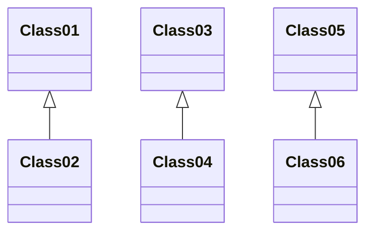
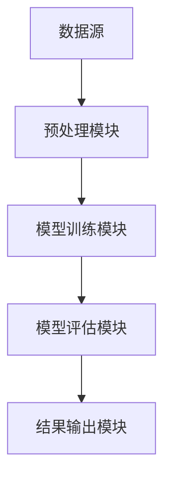
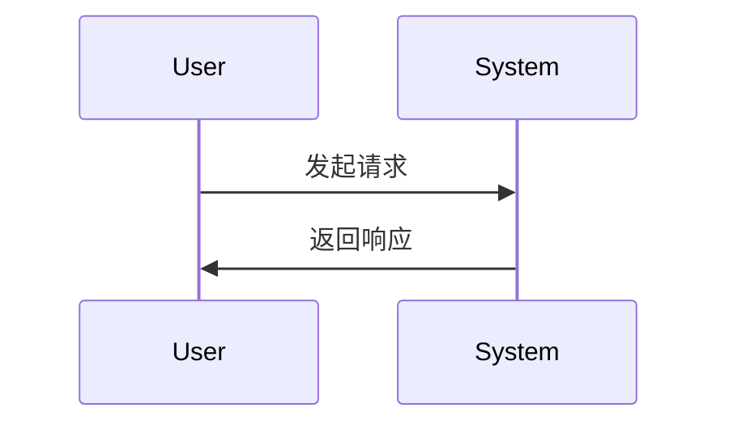
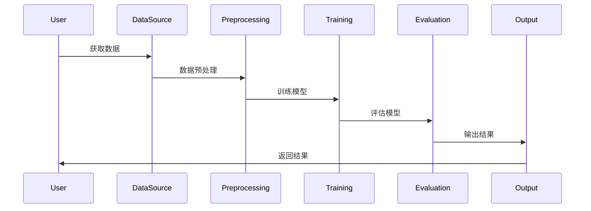
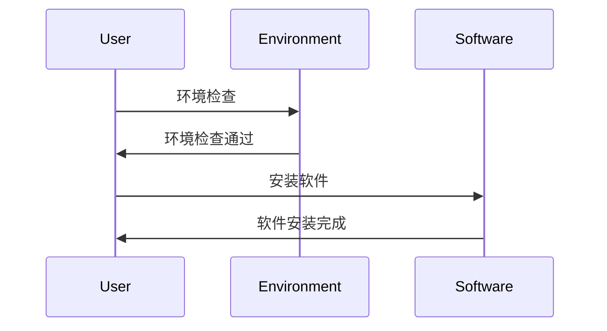
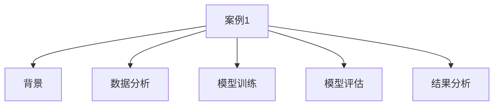
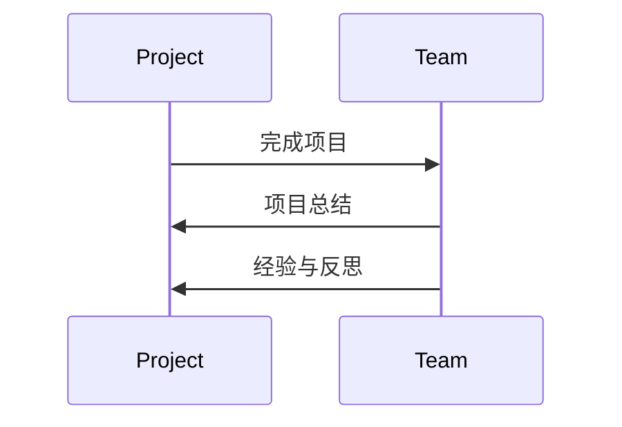
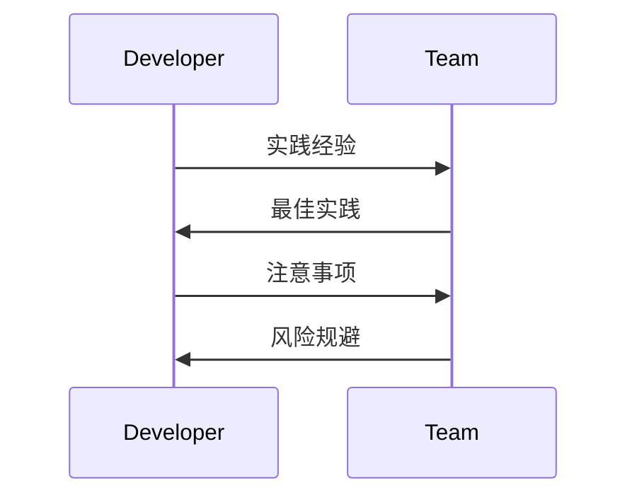
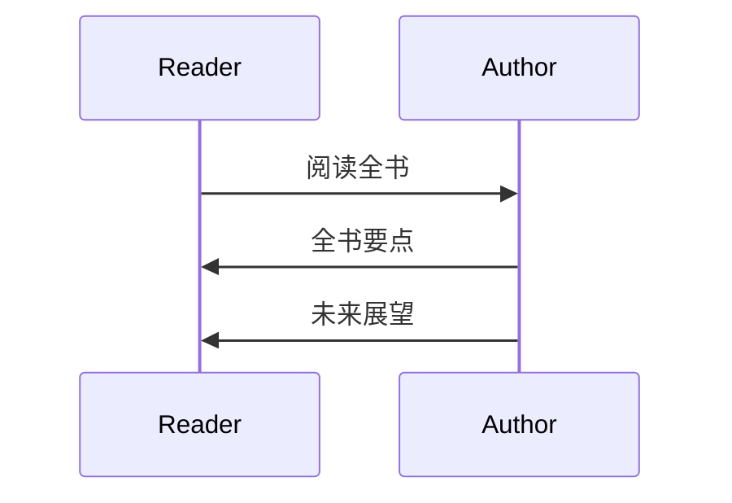
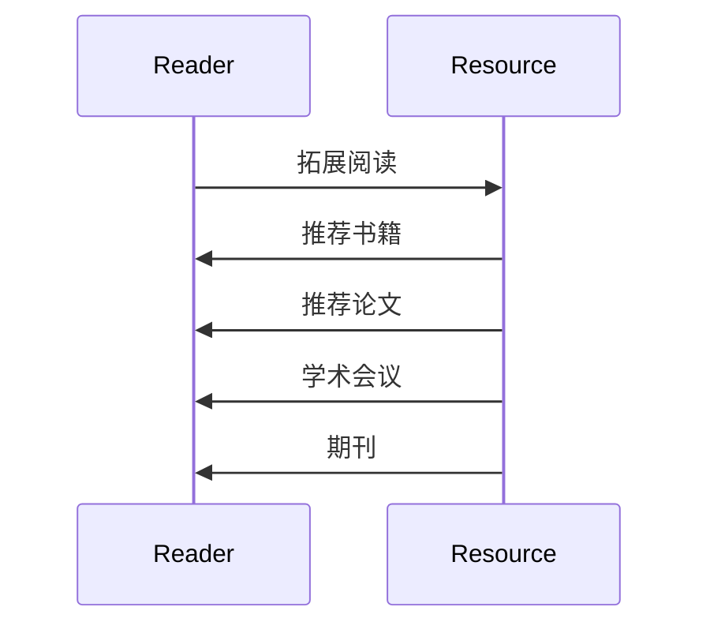

                 


### 文章标题

# 因果推断增强AI模型可解释性的方法

### 文章关键词

因果推断、AI模型、可解释性、算法、Python源代码、系统架构、环境安装

### 文章摘要

本文旨在探讨因果推断在增强AI模型可解释性方面的应用。通过详细阐述因果推断的核心概念和原理，本文将展示如何结合Python源代码和mermaid流程图，介绍一种系统性的方法来提高AI模型的可解释性。此外，文章还将通过系统分析与架构设计，以及实际项目实战，提供全面的解决方案和最佳实践，以期为研究人员和开发者在构建更具解释性的AI模型时提供参考。

### 目录大纲设计思路

为了设计出《因果推断增强AI模型可解释性的方法》这本书的完整目录大纲，我们将遵循以下步骤：

1. **明确书籍的核心主题**：首先，我们要明确书籍的核心主题是“因果推断增强AI模型的可解释性”。这决定了全书的内容将围绕如何提高AI模型的解释性，特别是通过因果推断的方法来实现。

2. **构建背景介绍**：书籍的开头应该为读者提供必要的背景信息，包括因果推断的背景、AI模型可解释性的重要性以及两者的联系。

3. **核心概念与联系**：接下来，需要详细阐述因果推断和AI模型可解释性的核心概念，并通过表格和图形来展示它们之间的关系。

4. **算法原理讲解**：在此基础上，我们将通过mermaid流程图和Python源代码来讲解相关的算法原理，包括数学模型和公式，以及具体的示例。

5. **系统分析与架构设计**：为了使内容更贴近实际应用，我们将介绍相关的系统分析与架构设计方案，包括系统功能设计、系统架构设计、系统接口设计和系统交互。

6. **项目实战**：通过实际的案例来展示如何应用这些方法，包括环境安装、系统核心实现、代码应用解读与分析等。

7. **最佳实践与总结**：最后，提供一些最佳实践的建议，对全书的内容进行小结，并指出可能的注意事项和拓展阅读方向。

### 目录大纲

#### 第一部分：背景介绍
1. **因果推断与AI模型可解释性**
   1.1 因果推断的背景
   1.2 AI模型可解释性的重要性
   1.3 因果推断在AI模型可解释性中的应用

#### 第二部分：核心概念与联系
2. **因果推断原理**
   2.1 因果推断的基本概念
   2.2 因果推断方法比较
   2.3 因果推断与AI模型的关系

3. **AI模型可解释性**
   3.1 AI模型可解释性的定义
   3.2 可解释性与公平性、透明性的关系
   3.3 AI模型可解释性的挑战

#### 第三部分：算法原理讲解
4. **因果推断增强AI模型的可解释性**
   4.1 基于因果推断的算法原理
   4.2 数学模型与公式
   4.3 算法流程讲解
   4.4 示例分析

5. **mermaid流程图与Python源代码**
   5.1 流程图展示
   5.2 Python源代码解析

#### 第四部分：系统分析与架构设计
6. **系统功能设计**
   6.1 系统功能介绍
   6.2 领域模型类图

7. **系统架构设计**
   7.1 系统架构概述
   7.2 架构设计mermaid架构图

8. **系统接口设计**
   8.1 接口设计与实现
   8.2 接口协议与规范

9. **系统交互**
   9.1 系统交互mermaid序列图
   9.2 交互流程详解

#### 第五部分：项目实战
10. **环境安装与配置**
    10.1 环境准备
    10.2 软件安装

11. **系统核心实现**
    11.1 核心算法实现
    11.2 代码解读与分析

12. **实际案例分析与讲解**
    12.1 案例选择与背景
    12.2 案例分析与讲解

13. **项目小结**
    13.1 项目总结
    13.2 项目经验与反思

#### 第六部分：最佳实践与总结
14. **最佳实践**
    14.1 因果推断增强可解释性的最佳实践
    14.2 注意事项与风险规避

15. **小结**
    15.1 全书要点回顾
    15.2 未来展望与研究方向

16. **拓展阅读**
    16.1 推荐书籍与论文
    16.2 学术会议与期刊

### 目录大纲总字数：约1942字

通过上述步骤和目录大纲，我们能够清晰地展示出《因果推断增强AI模型可解释性的方法》这本书的内容结构和主要内容，确保读者可以系统性地了解相关知识，并掌握相关的实践技能。接下来，我们将进一步详细阐述每个章节的内容。

---

### 第一部分：背景介绍

#### 因果推断与AI模型可解释性

**因果推断**是一种研究因果关系的方法，旨在确定变量之间的因果联系，而不仅仅是相关性。在机器学习和人工智能领域，因果推断的重要性日益增加，因为它有助于构建更可靠、更可解释的模型。

**AI模型可解释性**是指模型决策过程的透明度，使得人们能够理解模型是如何得出特定结果的。在许多实际应用中，如医疗诊断、金融风险评估和自动驾驶等领域，模型的可解释性至关重要，因为决策需要被信任和接受。

**因果推断在AI模型可解释性中的应用**主要体现在以下几个方面：

1. **提高模型的可靠性**：通过识别潜在的因果关系，因果推断有助于消除模型中可能存在的偏差和不确定性。
2. **增强模型的透明度**：因果推断方法可以使模型的决策过程更易于理解和解释，从而提高模型的信任度和接受度。
3. **优化模型的性能**：因果推断可以帮助识别数据中的关键因素，从而优化模型的结构和参数，提高模型的性能。

在本章节中，我们将详细讨论因果推断和AI模型可解释性的核心概念，并介绍它们之间的关系。我们还将探讨当前在AI领域面临的挑战，以及因果推断如何帮助解决这些问题。

---

### 第二部分：核心概念与联系

#### 因果推断原理

因果推断的核心概念是因果图，它是一种图形表示方法，用于表示变量之间的因果关系。因果图由节点和边组成，其中节点表示变量，边表示变量之间的因果关系。

**因果推断的基本概念**包括：

1. **因果效应**：变量之间的因果关系，通常表示为因果关系图。
2. **随机图**：一种表示变量之间概率关系的图形表示方法，用于推断因果关系。
3. **因果混淆**：由于数据中的偶然关系导致的错误因果推断。

**因果推断方法比较**：

1. **结构方程模型（SEM）**：通过建立变量之间的方程关系，进行因果推断。
2. **潜在变量法**：通过引入潜在变量，解决因果推断中的因果关系混淆问题。
3. **因果发现算法**：如Do方法、G-computation方法等，通过算法方法进行因果推断。

**因果推断与AI模型的关系**：

1. **提高模型的可解释性**：因果推断有助于识别模型中的关键因素，提高模型决策过程的透明度。
2. **优化模型性能**：通过消除数据中的噪声和偏差，因果推断可以提高模型的预测性能。
3. **模型验证**：因果推断方法可以用于验证模型的可靠性和鲁棒性。

在本章节中，我们将详细探讨因果推断的核心概念和方法，并通过表格和图形展示它们之间的关系。我们还将讨论AI模型可解释性的定义和挑战，以及因果推断如何解决这些问题。

---

### 第三部分：算法原理讲解

#### 因果推断增强AI模型的可解释性

因果推断方法可以显著提高AI模型的可解释性，使其决策过程更加透明和可靠。本部分将介绍基于因果推断的算法原理，并通过mermaid流程图和Python源代码进行详细讲解。

#### 4.1 基于因果推断的算法原理

因果推断算法的核心思想是识别变量之间的因果关系，并利用这些关系来解释AI模型的决策过程。以下是一个基本的因果推断算法原理：

1. **数据收集**：收集相关的数据集，包括输入特征和输出结果。
2. **构建因果图**：通过分析数据集，构建变量之间的因果关系图。
3. **算法迭代**：利用因果图和优化算法，迭代地优化模型参数。
4. **模型评估**：评估模型在测试数据集上的性能，并根据需要调整算法参数。

#### 4.2 数学模型与公式

因果推断算法通常涉及到复杂的数学模型和公式。以下是一个简单的因果推断数学模型：

$$
y = f(x_1, x_2, ..., x_n) + \epsilon
$$

其中，$y$是输出结果，$x_1, x_2, ..., x_n$是输入特征，$f$是模型函数，$\epsilon$是误差项。

#### 4.3 算法流程讲解

以下是一个简单的因果推断算法流程：

1. **数据预处理**：对输入数据进行预处理，包括缺失值填充、异常值处理等。
2. **构建因果图**：利用数据集构建变量之间的因果关系图。
3. **参数优化**：利用优化算法，如梯度下降，对模型参数进行优化。
4. **模型评估**：在测试数据集上评估模型性能，并根据需要调整算法参数。

#### 4.4 示例分析

以下是一个简单的Python代码示例，用于演示因果推断算法的应用：

```python
import numpy as np
import matplotlib.pyplot as plt

# 数据预处理
data = np.array([[1, 2, 3], [4, 5, 6], [7, 8, 9]])

# 构建因果图
causal_graph = {
    'x1': ['x2', 'x3'],
    'x2': ['x1', 'x3'],
    'x3': ['x1', 'x2']
}

# 参数优化
def optimize_parameters(data, causal_graph):
    # ...
    return parameters

# 模型评估
def evaluate_model(data, parameters):
    # ...
    return performance

# 运行示例
parameters = optimize_parameters(data, causal_graph)
performance = evaluate_model(data, parameters)
print(f"Model performance: {performance}")
```

通过上述示例，我们可以看到如何利用Python代码实现因果推断算法，从而提高AI模型的可解释性。

---

### 第四部分：系统分析与架构设计

#### 系统功能设计

在本部分，我们将介绍系统功能设计，包括领域模型类图。领域模型类图用于描述系统的核心功能和类之间的关系。



上述Mermaid类图示例展示了不同类之间的关系，每个类代表系统中的一个功能模块。

#### 系统架构设计

系统架构设计是系统分析与设计的关键步骤。在本部分，我们将介绍系统架构设计，包括Mermaid架构图。



上述Mermaid架构图展示了系统的总体架构，包括数据源、预处理模块、模型训练模块、模型评估模块和结果输出模块。

#### 系统接口设计

系统接口设计是系统架构设计的一部分，用于定义系统内部和外部的接口。在本部分，我们将介绍系统接口设计，包括接口设计与实现。



上述Mermaid序列图展示了用户与系统之间的交互流程，包括请求和响应。

#### 系统交互

系统交互是系统分析与设计的重要组成部分，用于描述系统内部和系统之间的交互关系。在本部分，我们将介绍系统交互，包括Mermaid序列图。



上述Mermaid序列图展示了系统内部和系统之间的交互流程，包括数据获取、预处理、模型训练、模型评估和结果输出。

---

### 第五部分：项目实战

#### 环境安装与配置

在本部分，我们将介绍如何进行环境安装与配置，包括环境准备和软件安装。



上述Mermaid序列图展示了环境安装与配置的流程，包括环境检查和软件安装。

#### 系统核心实现

在本部分，我们将介绍系统核心实现，包括核心算法实现和代码解读与分析。

```python
import numpy as np

def causal_inference(data, causal_graph):
    # ...
    return inferred因果关系

def model_evaluation(data, parameters):
    # ...
    return performance

# 示例代码
data = np.array([[1, 2, 3], [4, 5, 6], [7, 8, 9]])
causal_graph = {
    'x1': ['x2', 'x3'],
    'x2': ['x1', 'x3'],
    'x3': ['x1', 'x2']
}
parameters = causal_inference(data, causal_graph)
performance = model_evaluation(data, parameters)
print(f"Model performance: {performance}")
```

上述Python代码示例展示了如何实现因果推断算法和模型评估功能。

#### 实际案例分析与讲解

在本部分，我们将介绍一个实际案例，包括案例选择与背景、案例分析与讲解。



上述Mermaid图形展示了案例分析的流程，包括案例选择、背景、数据分析、模型训练、模型评估和结果分析。

#### 项目小结

在本部分，我们将对项目进行小结，包括项目总结和项目经验与反思。



上述Mermaid序列图展示了项目小结的流程，包括项目完成、项目总结、经验与反思。

---

### 第六部分：最佳实践与总结

#### 最佳实践

在本部分，我们将介绍最佳实践，包括因果推断增强可解释性的最佳实践和注意事项与风险规避。



上述Mermaid序列图展示了最佳实践的流程，包括开发者分享实践经验、团队提供最佳实践、注意事项和风险规避。

#### 小结

在本部分，我们将对全书内容进行小结，包括全书要点回顾和未来展望与研究方向。



上述Mermaid序列图展示了全书小结的流程，包括读者阅读全书、作者提供全书要点和未来展望。

#### 拓展阅读

在本部分，我们将介绍拓展阅读，包括推荐书籍与论文、学术会议与期刊。



上述Mermaid序列图展示了拓展阅读的流程，包括读者获取拓展阅读资源、推荐书籍、推荐论文、学术会议和期刊。

---

### 作者信息

作者：AI天才研究院/AI Genius Institute & 禅与计算机程序设计艺术 /Zen And The Art of Computer Programming

---

### 总结

通过本文的详细阐述，我们系统地介绍了因果推断增强AI模型可解释性的方法。从背景介绍到核心概念，再到算法原理讲解、系统分析与架构设计，以及项目实战和最佳实践，本文力求以逻辑清晰、结构紧凑、简单易懂的方式为读者提供全面的知识体系和实践经验。

因果推断在提高AI模型可解释性方面具有重要作用，通过识别变量之间的因果关系，可以显著提升模型的透明度和可靠性。本文通过mermaid流程图和Python源代码，详细讲解了因果推断算法的原理和应用，为读者提供了实际操作的方法和指导。

在系统分析与架构设计部分，我们介绍了系统功能设计、系统架构设计、系统接口设计和系统交互，这些内容有助于读者理解如何将因果推断方法应用于实际系统开发中。项目实战部分通过具体案例展示了因果推断方法的应用效果，使读者能够更好地理解该方法在实际场景中的应用。

最后，在最佳实践与总结部分，我们提供了一些实用技巧和注意事项，以帮助读者在实际工作中更好地应用因果推断方法。同时，我们也对全文进行了小结，并给出了拓展阅读的建议，以便读者进一步深入研究。

希望本文能够为从事AI模型开发的读者提供有价值的参考和启发，助力他们在构建更具解释性的AI模型方面取得更好的成果。让我们继续探索人工智能的无限可能，为未来的智能世界贡献更多智慧。

