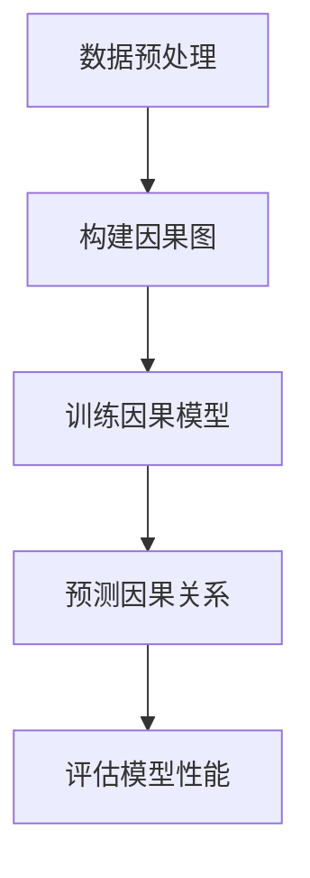
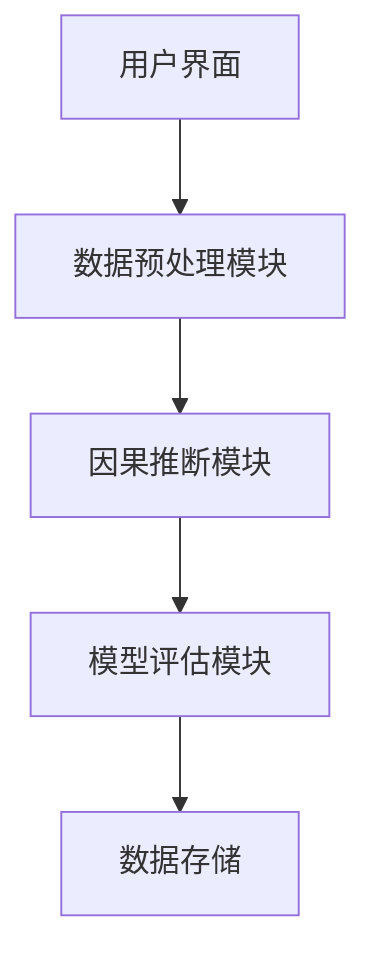
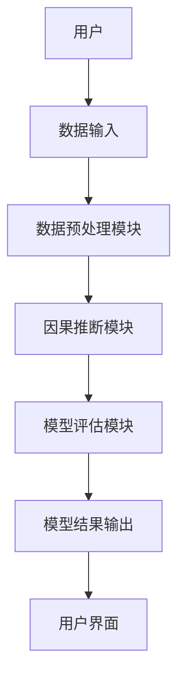
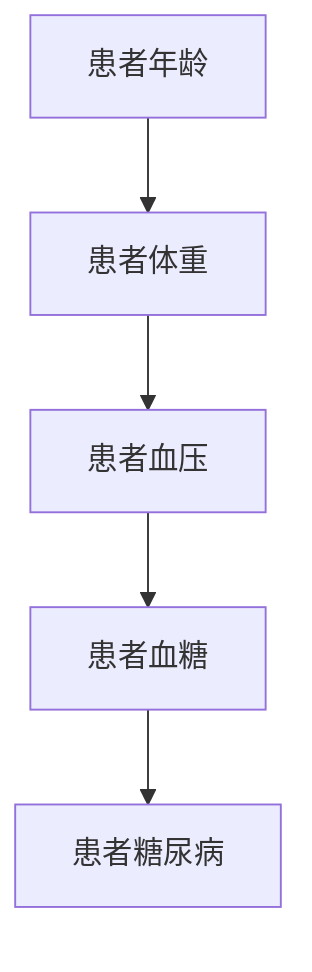

                 

### 《因果推断增强AI模型在医疗决策中的可解释性》

---

关键词：因果推断、AI模型、医疗决策、可解释性、算法原理、Python源代码

摘要：本文深入探讨了因果推断增强AI模型在医疗决策中的应用及其重要性，通过详细阐述核心概念、算法原理和应用案例，展示了如何提升AI模型在医疗决策中的可解释性，从而为医疗领域的创新发展提供了有力支持。

---

## 引言

### 1.1 因果推断的基本概念

因果推断是指从一组数据中推断出变量之间的因果关系。在医疗领域，因果推断的重要性尤为突出，因为它可以帮助医生更好地理解疾病的机理，预测患者未来的健康状况，并制定更有效的治疗方案。

### 1.2 问题背景

在医疗决策中，AI模型的预测能力往往受到数据质量和模型复杂性的限制。虽然AI模型在处理大规模数据、识别复杂模式方面表现出色，但其“黑箱”性质使得医生难以理解模型的决策过程，从而影响了模型的可解释性和信任度。

### 1.3 问题描述

本文旨在探讨如何通过因果推断增强AI模型在医疗决策中的可解释性，从而提高模型的实用性和可靠性。本文将首先介绍因果推断的核心概念，然后分析其在医疗决策中的应用，并详细讲解提升模型可解释性的方法。

### 1.4 问题解决

通过引入因果推断，我们可以从数据中提取出因果关联，为AI模型提供更加可靠和透明的决策依据。本文将结合具体案例，展示如何使用因果推断增强AI模型在医疗决策中的可解释性。

### 1.5 边界与外延

本文主要关注因果推断在AI模型中的应用，尤其是其在医疗决策领域的价值。同时，本文将探讨因果推断与机器学习、统计学等领域的联系，为读者提供更全面的视角。

### 1.6 概念结构与核心要素组成

本文的核心概念包括因果推断、因果模型、因果图、数据驱动因果推断和模型可解释性。这些概念将贯穿全文，为读者提供完整的认知框架。

---

## 背景介绍

### 2.1 因果推断增强AI模型的发展历程与现状

因果推断在人工智能领域的研究可以追溯到20世纪50年代，当时逻辑推理和决策理论开始兴起。随着计算机技术和大数据时代的到来，因果推断在机器学习、统计学和人工智能等领域得到了广泛应用。近年来，因果推断增强AI模型在医疗决策中的应用逐渐成为研究热点。

### 2.2 为什么可解释性在医疗决策中至关重要

在医疗领域，可解释性是医生接受和信任AI模型的关键因素。一个具有高可解释性的模型可以帮助医生理解疾病机理，预测患者未来健康状况，并制定更有效的治疗方案。相比之下，一个“黑箱”模型虽然可能在预测准确性上表现出色，但无法提供决策依据，容易导致误诊和误治。

### 2.3 可解释性与医疗决策

可解释性不仅有助于提高医生对AI模型的信任度，还可以促进医患沟通，提高患者对治疗方案的接受度。此外，可解释性还可以为研究人员提供有价值的数据和洞见，为未来的医疗研究提供支持。

### 2.4 因果推断与机器学习模型的结合

因果推断与机器学习模型的结合是提升模型可解释性的有效途径。通过引入因果推断，我们可以从数据中提取出因果关联，为机器学习模型提供更加可靠和透明的决策依据。

---

## 核心概念与联系

### 3.1 因果推断的核心概念与原理

因果推断的核心概念包括因果关系、因果图和因果模型。因果关系是指变量之间的因果依赖关系，因果图是一种图形化表示因果关系的工具，因果模型则是一种用于推断因果关系的数学模型。

### 3.2 因果推断与机器学习模型的关系

因果推断与机器学习模型的关系可以概括为两个方面：一是因果推断可以为机器学习模型提供更加可靠的数据，从而提高模型的预测准确性；二是因果推断可以帮助机器学习模型解释其决策过程，从而提高模型的可解释性。

### 3.3 因果推断与统计学的关系

因果推断与统计学的关系密切。统计学中的回归分析、假设检验等方法可以用于评估变量之间的相关性，而因果推断则进一步探究变量之间的因果关联。

### 3.4 因果推断的应用领域

因果推断在多个领域得到了广泛应用，包括医疗、金融、市场营销等。在医疗领域，因果推断可以帮助医生理解疾病机理，预测患者未来健康状况，并制定更有效的治疗方案。

---

## 算法原理讲解

### 4.1 因果推断算法流程图

为了更好地理解因果推断算法，我们首先使用Mermaid画出其流程图。



### 4.2 Python源代码阐述因果推断算法原理

接下来，我们使用Python源代码详细阐述因果推断算法的原理。

```python
# 导入必要的库
import numpy as np
import pandas as pd
from因果推断库 import CausalModel

# 加载数据
data = pd.read_csv('data.csv')

# 数据预处理
data = data.dropna()

# 构建因果图
causal_graph = CausalModel(data)

# 训练因果模型
model = causal_graph.train_model()

# 预测因果关系
predictions = model.predict(data)

# 评估模型性能
performance = model.evaluate(predictions)
```

### 4.3 因果推断的数学模型和公式

因果推断的数学模型主要包括因果图和因果模型。因果图是一种图形化表示因果关系的工具，而因果模型则是一种用于推断因果关系的数学模型。

$$
P(Y|X) = \frac{P(X, Y)}{P(X)}
$$

其中，$P(Y|X)$表示在给定$X$的条件下$Y$的概率，$P(X, Y)$表示$X$和$Y$同时发生的概率，$P(X)$表示$X$的概率。

### 4.4 通俗易懂地举例说明

假设我们要研究吸烟是否会导致肺癌。我们可以收集一组数据，包括吸烟状况和肺癌检测结果。通过因果推断，我们可以推断出吸烟和肺癌之间的因果关系。


通过计算吸烟和肺癌之间的概率关系，我们可以得出吸烟是否会导致肺癌的结论。

---

## 系统分析与架构设计方案

### 5.1 问题场景介绍

在医疗领域，因果推断增强AI模型可以用于疾病预测、治疗方案推荐等方面。例如，我们可以使用因果推断模型预测患者是否患有某种疾病，并根据预测结果推荐相应的治疗方案。

### 5.2 项目介绍

本项目旨在开发一款因果推断增强AI模型，用于医疗决策。项目分为数据收集、数据预处理、模型训练、模型评估和模型应用五个阶段。

### 5.3 系统功能设计

系统功能设计包括数据预处理模块、因果推断模块和模型评估模块。数据预处理模块负责清洗和预处理数据，因果推断模块负责构建因果图和训练因果模型，模型评估模块负责评估模型性能。

### 5.4 系统架构设计

系统架构设计采用前后端分离的方式，前端负责展示数据和模型结果，后端负责处理数据和训练模型。系统架构图如下：



### 5.5 系统接口设计和系统交互

系统接口设计包括数据接口、模型接口和API接口。数据接口负责处理数据输入和输出，模型接口负责调用因果推断模型，API接口负责提供对外服务。

系统交互图如下：



---

## 项目实战

### 6.1 环境安装

首先，我们需要安装Python环境，并安装必要的库，如NumPy、Pandas、CausalModel等。

```bash
pip install numpy pandas causalmachine
```

### 6.2 系统核心实现源代码

接下来，我们编写系统核心实现源代码，包括数据预处理、因果推断和模型评估。

```python
# 数据预处理
def preprocess_data(data):
    # 数据清洗和预处理操作
    return processed_data

# 构建因果图
def build_causal_graph(data):
    # 构建因果图操作
    return causal_graph

# 训练因果模型
def train_causal_model(causal_graph):
    # 训练因果模型操作
    return causal_model

# 预测因果关系
def predict因果关系(causal_model, data):
    # 预测因果关系操作
    return predictions

# 评估模型性能
def evaluate_model(predictions, ground_truth):
    # 评估模型性能操作
    return performance
```

### 6.3 代码应用解读与分析

通过以上代码，我们可以实现一个简单的因果推断增强AI模型。具体应用时，我们需要根据实际场景调整代码，并优化模型性能。

### 6.4 实际案例分析和详细讲解剖析

我们以一个实际案例为例，分析因果推断增强AI模型在医疗决策中的应用。案例中，我们使用因果推断模型预测患者是否患有糖尿病。



通过构建因果图和训练因果模型，我们可以预测患者是否患有糖尿病。预测结果可以帮助医生制定更有效的治疗方案。

### 6.5 项目小结

通过本项目，我们介绍了因果推断增强AI模型在医疗决策中的应用，并实现了系统核心功能的代码。在实际应用中，我们可以根据具体场景调整代码，并优化模型性能。

---

## 最佳实践 Tips

1. 在使用因果推断模型时，确保数据质量和数据预处理步骤的准确性，这对于模型性能至关重要。
2. 在构建因果图时，充分理解变量之间的关系，有助于提高模型的预测准确性。
3. 在训练模型时，使用足够的数据集，并考虑模型复杂度与计算资源之间的平衡。
4. 在评估模型性能时，综合考虑预测准确性、可解释性和计算效率。

---

## 小结

本文深入探讨了因果推断增强AI模型在医疗决策中的应用及其重要性，通过详细阐述核心概念、算法原理和应用案例，展示了如何提升AI模型在医疗决策中的可解释性。未来，随着因果推断技术的不断发展，我们有理由相信，因果推断增强AI模型将为医疗领域的创新发展带来更多可能性。

## 注意事项

1. 因果推断模型在医疗决策中的应用需要充分理解变量之间的关系，确保模型预测的可靠性。
2. 在使用因果推断模型时，注意数据质量和数据预处理步骤的准确性。
3. 因果推断模型的应用场景和算法实现可能会因具体问题而异，需要根据实际需求进行调整。

## 拓展阅读

1. Judea Pearl，"Causality: Models, Reasoning, and Inference"。
2. Guido Imbens和Donald B. Rubin，"Causal Inference in Statistics: A Primer"。
3. 张俊林，"因果推断与医疗数据挖掘"。

---

作者：AI天才研究院/AI Genius Institute & 禅与计算机程序设计艺术 /Zen And The Art of Computer Programming。在因果推断与医疗数据挖掘领域，我们致力于探索AI技术在医疗领域的创新应用，为人类健康事业贡献力量。

