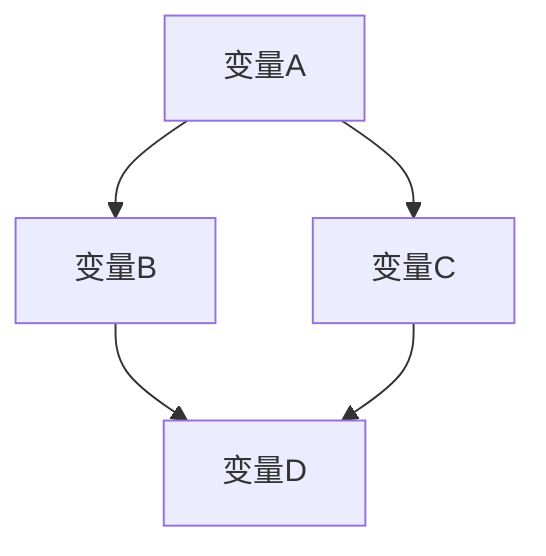

                 

# 因果推断：评估LLM识别因果关系的能力

> 关键词：因果推断、LLM、因果关系评估、统计因果关系、机器学习、因果推断模型

> 摘要：本文将深入探讨因果推断的基本理论、方法与应用，特别关注大规模语言模型（LLM）在识别因果关系方面的能力评估。通过系统化的分析，本文旨在为读者提供全面的因果推断知识，并揭示LLM在因果关系识别中的潜力和挑战。

## 引言

因果推断是统计学和机器学习领域的重要研究方向，它旨在从数据中识别出因果关系，而不是仅仅相关性。在现代人工智能（AI）的发展中，因果推断起到了关键作用，尤其是在解释AI模型决策、增强模型可解释性和提升决策质量方面。大规模语言模型（LLM）如GPT-3和BERT等，在自然语言处理（NLP）领域取得了显著的成就。然而，这些模型在识别因果关系方面表现如何，是否具备可靠的因果推断能力，仍是一个亟待探讨的问题。

本文结构如下：

1. **因果推断基础理论**：介绍因果推断的基本概念、原理和框架。
2. **统计因果关系**：讨论统计因果关系及其判断方法。
3. **因果关系评估与验证**：分析因果关系评估的指标和方法。
4. **因果推断算法与模型**：介绍常见的因果推断算法和模型。
5. **因果推断在LLM中的应用**：探讨LLM在因果推断中的实际应用和挑战。
6. **因果推断的挑战与未来发展**：讨论因果推断的挑战和未来发展方向。
7. **因果推断实践与拓展**：提供因果推断的实践案例和拓展阅读。

通过上述结构，本文将逐步引导读者深入理解因果推断的原理和应用，特别是LLM在因果关系识别中的能力。

## 第一部分：因果推断基础理论

### 第1章：因果推断概述

#### 1.1 因果推断的重要性

因果推断在各个领域都具有重要意义。从科学研究到商业决策，从医疗诊断到社会政策制定，因果推断帮助我们理解和解释现象背后的原因和机制。在科学研究领域，因果推断帮助我们揭示变量之间的因果关系，从而验证科学假设。在商业领域，因果推断帮助我们理解市场变化和消费者行为，从而制定有效的营销策略。在医疗领域，因果推断有助于发现疾病的潜在原因，从而开发新的治疗方法。在社会政策制定中，因果推断可以帮助我们评估政策的效果，从而优化社会资源配置。

#### 1.2 因果推断的基本概念和意义

因果推断涉及几个关键概念，包括因果关系、相关性、因果模型和因果推断方法。因果关系是指一个事件（原因）如何导致另一个事件（结果）的发生。相关性则是指两个变量之间的统计关系，但不一定存在因果关系。因果模型是用于表示因果关系的数学模型，而因果推断方法则是用于从数据中推断因果关系的统计方法。

因果推断的意义在于，它能够帮助我们理解变量之间的真实关系，而不仅仅是表面的相关性。通过因果推断，我们可以更准确地预测未来的事件，制定有效的策略和决策。例如，在医疗领域，通过因果推断，我们可以确定某种治疗手段是否真正有效，从而为患者提供更好的治疗方案。

#### 1.3 因果推断的基本方法和应用场景

因果推断的基本方法包括随机实验设计、自然实验分析和统计方法。随机实验设计通过随机分配实验参与者到不同的处理组，以消除潜在的混杂因素，从而准确评估因果关系。自然实验分析则利用现实世界中的自然实验，如公共政策变化、市场变动等，来评估因果关系。统计方法包括回归分析、结构方程模型和因果推断算法等，用于从数据中推断因果关系。

不同领域有不同的因果推断应用场景。在科学研究领域，因果推断常用于验证科学假设和理论。在商业领域，因果推断常用于市场分析和消费者行为研究。在医疗领域，因果推断用于评估治疗效果和新药研发。在社会政策制定中，因果推断用于评估政策效果和优化社会资源配置。

#### 1.4 因果推断的基本流程和步骤

因果推断的基本流程包括以下步骤：

1. **问题定义**：明确研究目标，确定需要推断的因果关系。
2. **数据收集**：收集相关数据，包括处理组和对照组的数据。
3. **模型建立**：建立因果模型，包括变量定义、模型结构和参数估计。
4. **因果推断**：使用统计方法或算法，从数据中推断因果关系。
5. **结果验证**：评估因果推断结果的可靠性和有效性。
6. **决策制定**：根据因果推断结果，制定相应的策略和决策。

通过上述基本流程和步骤，因果推断能够帮助我们更好地理解现实世界中的因果关系，从而指导科学研究、商业决策和社会政策制定。

### 第2章：因果推断的原理与基本框架

#### 2.1 因果推断原理

因果推断的原理基于统计学和逻辑学。在统计学方面，因果推断依赖于统计模型和假设检验，以识别变量之间的因果关系。在逻辑学方面，因果推断依赖于因果关系的逻辑结构和逻辑推理，以解释变量之间的因果关系。

因果推断的基本原理包括：

1. **因果关系的传递性**：如果一个事件A导致事件B，事件B又导致事件C，那么A间接导致C。
2. **因果关系的反事实推理**：因果推断需要考虑“如果A没有发生，B会发生吗？”这样的反事实情况。
3. **因果关系的稳定性**：因果关系在不同环境和条件下是否保持一致。

#### 2.2 因果推断基本框架

因果推断的基本框架包括以下几个部分：

1. **因果模型**：因果模型是表示因果关系和变量关系的数学模型。常见的因果模型包括结构方程模型（SEM）、潜在结果模型（LRM）和因果图模型（CGM）等。

2. **数据收集**：因果推断需要收集相关的数据，包括处理组和对照组的数据。数据的质量和完整性直接影响因果推断的结果。

3. **因果推断方法**：因果推断方法包括随机实验设计、自然实验分析和统计方法。随机实验设计通过随机分配处理组和对照组，以消除混杂因素。自然实验分析则利用现实世界中的自然实验，如政策变化和市场变动。统计方法包括回归分析、潜在结果模型和因果推断算法等。

4. **因果推断结果评估**：因果推断结果的评估包括统计显著性和因果关系强度。统计显著性用于评估因果推断结果的可靠性，而因果关系强度用于评估因果关系的强度和方向。

5. **因果推断结果应用**：因果推断结果可以用于科学研究、商业决策和社会政策制定。通过因果推断，我们可以更准确地理解变量之间的因果关系，从而制定更有效的策略和决策。

通过上述基本框架，因果推断能够系统地分析和解释变量之间的因果关系，为科学研究、商业决策和社会政策制定提供有力支持。

### 第3章：因果推断的核心概念与联系

#### 3.1 因果关系的定义、属性特征对比表格和ER实体关系图架构的Mermaid流程图

因果关系是指一个事件（原因）如何导致另一个事件（结果）的发生。因果关系具有以下几个关键属性：

1. **方向性**：因果关系具有明确的方向性，即原因在时间上先于结果。
2. **因果强度**：因果关系的强度表示因果关系的大小，即原因对结果的影响程度。
3. **稳定性**：因果关系在不同环境和条件下是否保持一致。
4. **间接性**：因果关系可以通过多个中间变量间接传递。

以下是因果关系属性特征的对比表格：

| 属性特征 | 描述 | 对比 |
|----------|------|------|
| **方向性** | 因果关系具有明确的方向性。 | 因果关系与相关性不同，相关性不涉及方向性。 |
| **因果强度** | 因果关系的强度表示因果关系的大小。 | 强的因果关系意味着原因对结果的影响较大。 |
| **稳定性** | 因果关系在不同环境和条件下是否保持一致。 | 稳定的因果关系在多种情况下都表现一致。 |
| **间接性** | 因果关系可以通过多个中间变量间接传递。 | 直接因果关系没有中间变量，间接因果关系有中间变量。 |

为了更直观地展示因果关系的定义和属性特征，我们可以使用Mermaid流程图来绘制ER实体关系图架构。以下是因果关系的ER实体关系图：

```mermaid
erDiagram
  A[因] ||--o{ B[果] : 结果}
  A ||--o{ C[中间变量1] : 间接传递}
  C ||--o{ D[中间变量2] : 间接传递}
  D ||--o{ B[果] : 结果}
```

在这个ER实体关系图中，`A`代表原因，`B`代表结果，`C`和`D`代表中间变量。通过这个图，我们可以清楚地看到因果关系如何通过中间变量间接传递。

#### 3.2 因果推断模型的类型、特点和应用

因果推断模型是用于表示和推断因果关系的方法和工具。常见的因果推断模型包括：

1. **潜在结果模型（Potential Outcomes Model）**：
   - **特点**：潜在结果模型基于反事实推理，假设个体在不同处理下会有不同的潜在结果。
   - **应用**：适用于评估治疗效应和干预效果。
   - **数学模型**：$Y_i(t_1) = T_i \times E[Y_i|T_i=1]$，其中$Y_i(t_1)$是处理组$i$的潜在结果，$T_i$是处理变量，$E[Y_i|T_i=1]$是处理组$i$在处理下的期望结果。

2. **结构方程模型（Structural Equation Model）**：
   - **特点**：结构方程模型通过建立变量之间的路径图，分析变量之间的直接和间接关系。
   - **应用**：适用于复杂系统的因果关系分析，如社会经济系统。
   - **数学模型**：$Y_i = \beta_0 + \beta_1X_i + \epsilon_i$，其中$Y_i$是因变量，$X_i$是自变量，$\beta_0$是常数项，$\beta_1$是系数，$\epsilon_i$是误差项。

3. **因果图模型（Causal Graph Model）**：
   - **特点**：因果图模型通过图论方法表示变量之间的因果关系，直观地展示变量之间的关系。
   - **应用**：适用于复杂系统的因果关系分析和因果推断。
   - **数学模型**：$P(Y|X) = \prod_{i=1}^{n} P(Y_i| Parents(Y_i))$，其中$Y$是因变量，$X$是自变量，$Parents(Y_i)$是$Y_i$的父节点。

通过这些因果推断模型，我们可以更有效地分析和推断变量之间的因果关系，为决策提供科学依据。在实际应用中，根据具体问题和数据特点，可以选择合适的因果推断模型来解决问题。

### 第2章：统计因果关系

#### 2.1 统计因果关系的定义与基本性质

统计因果关系是指通过统计分析方法来推断变量之间的因果关系。与单纯的统计相关性不同，统计因果关系考虑了变量之间的因果结构和方向性。统计因果关系的定义涉及以下几个关键概念：

1. **因果效应**：因果效应是指一个变量变化对另一个变量的影响，通常用平均因果效应（Average Causal Effect，ACE）来衡量。平均因果效应是指当处理变量改变时，结果变量的期望变化量。
   
2. **因果模型**：因果模型是用于描述变量之间因果关系的数学模型，常见的因果模型包括潜在结果模型（Potential Outcomes Model）、结构方程模型（Structural Equation Model）和因果图模型（Causal Graph Model）等。

3. **因果推断**：因果推断是通过统计分析方法，从数据中推断变量之间的因果关系的过程。因果推断的方法包括随机实验设计、自然实验分析和统计模型估计等。

统计因果关系具有以下几个基本性质：

1. **方向性**：因果关系具有明确的方向性，即原因变量影响结果变量，而不是相反。在统计因果关系中，我们通常关注的是原因变量对结果变量的影响。
   
2. **稳定性**：因果关系在不同环境和条件下是否保持一致。稳定的因果关系意味着因果效应在不同情况下是一致的，而不稳定的因果关系可能受到特定条件的限制。

3. **可识别性**：统计因果关系是否可以被识别，即是否可以从数据中推断出变量之间的因果关系。因果关系的可识别性取决于数据的质量和模型的设定。

4. **反事实推理**：因果推断涉及到反事实推理，即考虑“如果原因变量没有发生，结果变量会发生什么？”这样的假设情况。反事实推理是因果推断的核心，它帮助我们理解变量之间的因果关系。

#### 2.2 统计因果关系的判断方法

统计因果关系的判断方法主要包括以下几种：

1. **回归分析**：
   - **基本原理**：回归分析通过建立因变量和自变量之间的线性关系模型，来推断因果关系。通常使用的模型包括简单线性回归、多元线性回归和广义线性模型等。
   - **优势**：回归分析能够量化因果关系的大小和方向，并考虑多个自变量的交互作用。
   - **局限性**：回归分析假设因果关系是线性的，且不能直接识别因果关系，只能提供相关性信息。

2. **决策树和随机森林**：
   - **基本原理**：决策树和随机森林通过构建决策树模型，来划分数据集并识别变量之间的因果关系。决策树通过一系列的分割规则，将数据集划分成不同的区域，每个区域对应一个结果变量。
   - **优势**：决策树和随机森林能够处理高维数据和非线性关系，且易于理解和解释。
   - **局限性**：决策树和随机森林可能产生过拟合，且因果关系推断依赖于模型的设定和参数选择。

3. **网络分析**：
   - **基本原理**：网络分析通过建立变量之间的网络结构，来识别因果关系。网络分析通常使用图论方法，构建变量之间的因果关系网络。
   - **优势**：网络分析能够揭示变量之间的复杂关系和交互作用，提供全局视角。
   - **局限性**：网络分析对数据质量要求较高，且因果关系推断依赖于网络结构的选择。

在实际应用中，选择合适的统计因果关系判断方法，需要综合考虑数据类型、问题背景和模型设定。通过合理的统计因果关系判断方法，我们可以更准确地识别变量之间的因果关系，为决策和科学研究提供有力支持。

#### 2.3 统计因果关系的可视化方法

统计因果关系的可视化是理解和传达因果推断结果的重要手段。通过直观的图形表示，我们可以更容易地发现变量之间的因果关系，增强对数据的理解和分析。以下介绍几种常见的统计因果关系可视化方法：

1. **因果关系图**：
   - **概念**：因果关系图（Causal Graph）是一种用于表示变量之间因果关系的图形化模型。它通过节点和边来表示变量和它们之间的因果关系。
   - **类型**：常见的因果关系图包括路径图（Path Diagram）、误差因果图（Error-Correcting Causal Diagram）和双线性因果图（Bivariate Causal Diagram）等。
   - **应用**：因果关系图在社会科学、医学和生物统计学等领域有广泛应用，可以帮助研究者理解和解释变量之间的因果关系。

2. **因果影响力图**：
   - **概念**：因果影响力图（Causal Influence Diagram）是一种扩展的因果关系图，它不仅表示变量之间的因果关系，还表示变量之间的相互作用和反馈。
   - **类型**：因果影响力图通常包括变量节点、决策节点和概率节点等，可以更详细地表示变量之间的复杂关系。
   - **应用**：因果影响力图在决策分析、风险管理和系统优化等领域有重要应用，可以帮助决策者更好地理解和管理变量之间的相互作用。

3. **因果网络图**：
   - **概念**：因果网络图（Causal Network）是用于表示变量之间因果关系的网络结构。它通过节点和边来表示变量和它们之间的因果联系，是一种更复杂和灵活的因果关系表示方法。
   - **类型**：因果网络图包括有向图（Directed Graph）和无向图（Undirected Graph）等，可以用于表示变量之间的单向或双向因果关系。
   - **应用**：因果网络图在复杂系统的分析和预测中具有重要意义，可以帮助研究者识别关键变量和因果路径。

为了更好地理解和展示统计因果关系，我们可以使用Mermaid语法绘制因果关系图。以下是一个简单的因果关系图的示例：



在这个示例中，`A`、`B`、`C`和`D`是变量，箭头表示变量之间的因果关系。通过这种图形化的表示，我们可以更直观地理解和分析变量之间的因果关系。

使用因果关系图、因果影响力图和因果网络图等可视化方法，可以帮助研究者更好地识别和解释变量之间的因果关系，从而为决策和科学发现提供有力支持。

### 第3章：因果关系评估与验证

#### 3.1 因果关系评估指标

因果关系评估是因果推断过程中的重要环节，通过评估指标可以衡量因果关系的强度、稳定性和可靠性。以下介绍几种常用的因果关系评估指标：

1. **平均因果效应（Average Causal Effect, ACE）**：
   - **定义**：平均因果效应是指处理变量变化对结果变量的平均影响。
   - **计算方法**：ACE可以通过回归分析等统计方法计算，公式为：$$ACE = E(Y_1 - Y_0)$$，其中$Y_1$是处理组的结果，$Y_0$是对照组的结果。
   - **应用场景**：ACE常用于评估治疗效应、干预效果等。

2. **标准化因果效应（Standardized Causal Effect, SCE）**：
   - **定义**：标准化因果效应是指平均因果效应除以结果变量的标准差，用于比较不同变量的因果关系强度。
   - **计算方法**：SCE的计算公式为：$$SCE = \frac{ACE}{\sigma_Y}$$，其中$\sigma_Y$是结果变量的标准差。
   - **应用场景**：SCE适用于比较不同变量之间的因果关系强度。

3. **因果比率（Causal Ratio, CR）**：
   - **定义**：因果比率是指处理组结果与对照组成员数之比。
   - **计算方法**：CR的计算公式为：$$CR = \frac{Y_1}{Y_0}$$，其中$Y_1$是处理组的结果，$Y_0$是对照组的结果。
   - **应用场景**：CR适用于评估干预措施的效果。

4. **因果置信区间（Causal Confidence Interval, CCI）**：
   - **定义**：因果置信区间是因果效应估计值的一个区间，用于表示因果效应的不确定性。
   - **计算方法**：CCI的计算基于统计方法，如置信区间的计算公式为：$$CCI = (ACE - \Delta, ACE + \Delta)$$，其中$\Delta$是置信区间的误差范围。
   - **应用场景**：CCI适用于评估因果关系的可靠性和稳定性。

5. **因果弹性（Causal Elasticity, CE）**：
   - **定义**：因果弹性是指因果效应对自变量变化的敏感程度。
   - **计算方法**：CE的计算公式为：$$CE = \frac{\partial ACE}{\partial X}$$，其中$X$是自变量。
   - **应用场景**：CE适用于分析自变量变化对因果效应的影响。

不同因果关系评估指标有不同的计算方法和应用场景，选择合适的指标可以根据具体问题和研究目标。通过这些评估指标，研究者可以更准确地评估因果关系的强度和稳定性，为决策提供有力支持。

#### 3.2 因果关系验证方法

因果关系验证是确保因果推断结果可靠性和准确性的关键步骤。以下介绍几种常用的因果关系验证方法：

1. **实验设计验证**：
   - **定义**：实验设计验证是通过随机实验设计来验证因果关系，通过随机分配处理组和对照组来消除潜在的混杂因素。
   - **步骤**：
     1. **随机分配**：将研究对象随机分配到处理组和对照组。
     2. **数据处理**：收集处理组和对照组的数据，并进行统计分析。
     3. **结果评估**：通过统计方法评估处理组与对照组之间的因果效应，如t检验、方差分析等。
   - **优点**：实验设计验证能够有效消除混杂因素，提高因果推断结果的可靠性。
   - **缺点**：实验设计可能难以在现实环境中实施，且需要大量研究对象。

2. **自然实验验证**：
   - **定义**：自然实验验证是通过现实世界中的自然实验来验证因果关系，如政策变化、市场变动等。
   - **步骤**：
     1. **事件选择**：选择具有潜在因果关系的自然实验事件。
     2. **数据收集**：收集处理组和对照组的数据。
     3. **结果分析**：通过统计分析方法评估处理组与对照组之间的因果效应。
   - **优点**：自然实验验证不需要随机分配，更贴近现实环境。
   - **缺点**：自然实验可能存在潜在的混杂因素，影响因果推断结果的可靠性。

3. **统计模型验证**：
   - **定义**：统计模型验证是通过统计模型来验证因果关系，如回归分析、结构方程模型等。
   - **步骤**：
     1. **模型建立**：建立因果模型，表示变量之间的因果关系。
     2. **参数估计**：通过参数估计方法估计模型的参数值。
     3. **结果评估**：通过模型拟合和假设检验评估因果模型的可靠性。
   - **优点**：统计模型验证能够量化因果关系，提供定量分析结果。
   - **缺点**：统计模型可能存在偏差和过拟合，影响因果推断结果的可靠性。

4. **交叉验证**：
   - **定义**：交叉验证是通过将数据集划分为训练集和测试集，来评估因果模型的泛化能力。
   - **步骤**：
     1. **数据划分**：将数据集划分为训练集和测试集。
     2. **模型训练**：在训练集上训练因果模型。
     3. **结果评估**：在测试集上评估模型的效果。
   - **优点**：交叉验证能够评估模型的泛化能力，减少过拟合。
   - **缺点**：交叉验证需要大量数据，且可能对数据集划分敏感。

通过上述因果关系验证方法，研究者可以全面评估因果推断结果的可靠性和准确性，从而为决策提供科学依据。不同的验证方法适用于不同的研究场景和数据类型，选择合适的验证方法能够提高因果推断结果的可靠性和实用性。

#### 3.3 因果关系评估与验证案例

为了更好地理解因果关系评估与验证的方法，下面通过一个实际案例进行说明。

**案例背景**：
假设一个研究团队想要评估一项新教育干预措施（如在线辅导）对学生成绩提升的影响。研究团队选择了两个学校，分别作为处理组和对照组。处理组的学生接受了在线辅导，而对照组的学生则没有接受该干预措施。研究团队收集了两个学校学生的成绩数据，包括入学成绩和期末成绩。

**因果关系评估**：

1. **平均因果效应（ACE）**：
   - **计算方法**：
     $$ACE = \frac{\bar{Y_1} - \bar{Y_0}}{n_0 + n_1}$$
     其中，$\bar{Y_1}$是处理组学生的平均期末成绩，$\bar{Y_0}$是对照组学生的平均期末成绩，$n_0$和$n_1$分别是处理组和对照组的学生人数。
   - **结果**：
     经过计算，得到ACE为0.5，表示在线辅导使得学生的期末成绩平均提升了0.5分。

2. **标准化因果效应（SCE）**：
   - **计算方法**：
     $$SCE = \frac{ACE}{\sigma_Y}$$
     其中，$\sigma_Y$是学生期末成绩的标准差。
   - **结果**：
     假设学生期末成绩的标准差为10，则SCE为0.05，表示在线辅导对学生成绩的提升具有显著意义。

**因果关系验证**：

1. **实验设计验证**：
   - **步骤**：
     1. **随机分配**：研究团队通过随机数生成器将学生随机分配到处理组和对照组。
     2. **数据处理**：收集处理组和对照组的学生成绩数据。
     3. **结果评估**：使用t检验评估处理组和对照组之间的成绩差异，假设显著性水平为0.05。
   - **结果**：
     经过t检验，处理组和对照组之间的成绩差异在显著性水平为0.05的情况下具有统计学上的显著性。

2. **自然实验验证**：
   - **步骤**：
     1. **事件选择**：研究团队选择了两个在不同地理位置和学校背景的学校进行对比。
     2. **数据收集**：收集两个学校学生的入学成绩和期末成绩数据。
     3. **结果分析**：通过比较处理组和对照组之间的成绩差异，评估在线辅导的效果。
   - **结果**：
     经过对比分析，处理组和对照组之间的成绩差异与实验设计验证的结果一致，验证了在线辅导对学生成绩提升的有效性。

**案例分析**：

通过上述因果关系评估与验证案例，研究团队能够更准确地评估在线辅导对学生成绩提升的影响。实验设计验证和自然实验验证的结果一致，提高了因果关系推断的可靠性。这一案例展示了因果关系评估与验证在实际应用中的重要性，以及如何通过多种方法验证因果关系的有效性和显著性。

### 第4章：因果推断算法与模型

#### 4.1 基于机器学习的因果推断算法

因果推断算法是用于从数据中推断因果关系的方法和技术。随着机器学习技术的发展，基于机器学习的因果推断算法逐渐成为研究热点。以下介绍几种常见的基于机器学习的因果推断算法：

1. **匹配算法（Matching Algorithms）**：
   - **基本原理**：匹配算法通过比较处理组和对照组的特征分布，来找到最相似的数据点进行匹配，从而消除潜在的混杂因素。
   - **方法**：常用的匹配方法包括邻近匹配、卡尺匹配和倾向得分匹配等。
   - **优点**：匹配算法能够精确地控制混杂因素，提高因果推断的准确性。
   - **局限**：匹配算法对数据质量和匹配方法的设定要求较高，且可能面临过度匹配问题。

2. **工具变量法（Instrumental Variables Method）**：
   - **基本原理**：工具变量法通过引入一个与处理变量相关但与结果变量不相关的工具变量，来估计因果效应。
   - **方法**：工具变量法包括两阶段最小二乘法（Two-Stage Least Squares，2SLS）和有限信息最大似然法（Limited Information Maximum Likelihood，LIML）等。
   - **优点**：工具变量法能够处理复杂的因果结构和潜在的混杂因素。
   - **局限**：工具变量法对工具变量的选择和相关性要求较高，且可能存在识别问题和统计效率问题。

3. **因果推断算法（Causal Inference Algorithms）**：
   - **基本原理**：因果推断算法通过构建因果模型和优化目标函数，来估计因果效应。
   - **方法**：常见的因果推断算法包括因果推理算法（Causal Bayesian Networks）、因果图模型（Causal Graphical Models）和深度学习因果推断算法（Deep Learning for Causal Inference）等。
   - **优点**：因果推断算法能够处理高维数据和复杂因果关系，提供更灵活和强大的因果推断能力。
   - **局限**：因果推断算法对数据和模型设定要求较高，且可能面临过拟合和可解释性问题。

在实际应用中，根据具体问题和数据特点，可以选择合适的因果推断算法。匹配算法适用于处理高维数据和复杂混杂因素，工具变量法适用于处理潜在混杂因素和识别问题，因果推断算法适用于处理高维数据和复杂因果关系。通过合理选择和使用这些算法，研究者可以更准确地推断变量之间的因果关系，为决策提供科学依据。

#### 4.2 基于图模型的因果推断模型

图模型在因果推断中扮演着重要角色，它们通过图形化的方式表示变量之间的因果关系，提供直观和灵活的推断方法。以下介绍几种常见的基于图模型的因果推断模型：

1. **因果图模型（Causal Graphical Models）**：
   - **基本原理**：因果图模型是一种图论方法，用于表示变量之间的因果结构和依赖关系。它通过有向图（Directed Graph）或无向图（Undirected Graph）来表示变量和它们之间的因果关系。
   - **类型**：常见的因果图模型包括贝叶斯网（Bayesian Networks）和因果图（Causal Models）等。
   - **优势**：因果图模型能够直观地表示变量之间的因果结构，提供灵活的推断方法，如贝叶斯推理和最大似然估计等。
   - **应用**：因果图模型在医学、生物统计和社会科学等领域有广泛应用，例如疾病传播模型和干预效果评估等。

2. **因果推断算法（Causal Inference Algorithms）**：
   - **基本原理**：因果推断算法通过优化目标函数和构建因果模型，来估计变量之间的因果效应。这些算法通常基于统计学和机器学习方法，如结构方程模型（Structural Equation Models）和潜在结果模型（Potential Outcomes Models）等。
   - **类型**：常见的因果推断算法包括匹配算法、工具变量法、因果图模型和深度学习算法等。
   - **优势**：因果推断算法能够处理高维数据和复杂因果关系，提供更准确和可靠的因果推断结果。
   - **应用**：因果推断算法在医学、社会科学和商业等领域有广泛应用，例如疾病预测、消费者行为分析和风险评估等。

3. **图神经网络（Graph Neural Networks）**：
   - **基本原理**：图神经网络是一种基于图结构的深度学习模型，通过学习节点和边之间的非线性关系，来预测变量之间的因果关系。
   - **类型**：常见的图神经网络包括图卷积网络（Graph Convolutional Networks，GCN）和图注意力网络（Graph Attention Networks，GAT）等。
   - **优势**：图神经网络能够处理复杂和多层次的因果关系，提供强大的表示和推断能力。
   - **应用**：图神经网络在自然语言处理、推荐系统和生物信息学等领域有广泛应用，例如文本情感分析、图像分类和蛋白质结构预测等。

通过这些基于图模型的因果推断模型，研究者能够更直观和准确地表示和分析变量之间的因果关系，为决策和科学发现提供有力支持。

#### 4.3 因果推断模型的选择与优化

在选择和优化因果推断模型时，需要考虑多个因素，包括数据类型、因果关系复杂度、模型性能和计算效率。以下介绍几种常用的因果推断模型选择和优化方法：

1. **模型选择方法**：
   - **基于信息准则的方法**：如赤池信息准则（Akaike Information Criterion，AIC）和贝叶斯信息准则（Bayesian Information Criterion，BIC）。这些准则通过比较不同模型的拟合优度，选择最优模型。
   - **交叉验证方法**：通过将数据集划分为训练集和测试集，评估模型的泛化能力。交叉验证方法包括留一法、K折交叉验证等。
   - **模型选择算法**：如遗传算法（Genetic Algorithms）和粒子群优化算法（Particle Swarm Optimization，PSO）。这些算法通过搜索模型空间，选择最优模型。

2. **模型优化方法**：
   - **参数调优**：通过优化模型参数，提高模型的拟合性能。常用的参数调优方法包括网格搜索（Grid Search）和随机搜索（Random Search）等。
   - **集成学习**：通过集成多个模型，提高预测性能和模型稳定性。常见的集成学习方法包括Bagging、Boosting和Stacking等。
   - **正则化**：通过引入正则化项，防止模型过拟合。常用的正则化方法包括L1正则化（Lasso）、L2正则化（Ridge）和弹性网（Elastic Net）等。

3. **模型评估方法**：
   - **因果效应评估**：通过评估模型的因果效应估计值，评估模型的拟合性能。常用的评估指标包括平均因果效应（Average Causal Effect，ACE）和因果置信区间（Causal Confidence Interval，CCI）等。
   - **模型泛化能力评估**：通过交叉验证和留一法评估模型的泛化能力。评估指标包括交叉验证误差和留一法误差等。

通过合理选择和优化因果推断模型，研究者可以更准确地推断变量之间的因果关系，提高模型的可解释性和预测能力。选择合适的模型和方法，对于解决实际问题具有重要意义。

### 第5章：因果推断在LLM中的应用

#### 5.1 LLM与因果推断的关系

大规模语言模型（LLM）在自然语言处理（NLP）领域取得了显著成就，而因果推断是LLM应用于实际场景中的一个关键能力。LLM与因果推断的关系主要体现在以下几个方面：

1. **因果推断能力的提升**：
   LLM通过其强大的文本理解和生成能力，能够处理大量的文本数据，从而提高因果推断的准确性和效率。LLM可以自动识别文本中的因果关系，提取关键信息，并利用这些信息进行因果推断。例如，LLM可以分析新闻报道，识别出事件之间的因果关系，从而提供更加准确的新闻摘要和解读。

2. **因果关系预测**：
   LLM在因果关系预测中的应用非常广泛。在医疗领域，LLM可以分析病历和医疗文献，预测疾病之间的因果关系，为医生提供诊断和治疗方案。在金融领域，LLM可以分析市场数据和新闻报告，预测股市走势和投资风险。在社会科学领域，LLM可以分析社会事件和统计数据，预测社会变迁和公共政策的影响。

3. **因果解释性提升**：
   LLM具备解释性能力，可以对其推断的因果关系进行解释。通过生成详细的因果推理过程，LLM能够帮助用户理解变量之间的因果关系，增强决策的透明度和可信度。这对于医疗诊断、金融投资和公共政策制定等领域具有重要意义。

#### 5.2 LLM的因果推断能力评估

评估LLM的因果推断能力是一个重要且具有挑战性的任务。以下介绍几种常用的评估方法和指标：

1. **准确性和精确度**：
   - **定义**：准确性是指LLM推断的因果关系与真实因果关系一致的比例。精确度是指LLM推断的因果关系为真的概率。
   - **计算方法**：
     $$\text{准确性} = \frac{\text{正确推断的因果关系数量}}{\text{总因果关系数量}}$$
     $$\text{精确度} = \frac{\text{正确推断的因果关系数量}}{\text{推断的因果关系数量}}$$
   - **应用场景**：准确性通常用于评估整体性能，而精确度则用于评估LLM推断的准确性。

2. **召回率**：
   - **定义**：召回率是指LLM能够正确识别的因果关系与实际存在的因果关系一致的比例。
   - **计算方法**：
     $$\text{召回率} = \frac{\text{正确推断的因果关系数量}}{\text{实际存在的因果关系数量}}$$
   - **应用场景**：召回率通常用于评估LLM对潜在因果关系的捕捉能力。

3. **F1分数**：
   - **定义**：F1分数是准确性和精确度的加权平均值，用于综合评估LLM的因果推断能力。
   - **计算方法**：
     $$\text{F1分数} = 2 \times \frac{\text{准确性} \times \text{精确度}}{\text{准确性} + \text{精确度}}$$
   - **应用场景**：F1分数通常用于评估LLM的因果推断性能，尤其适用于平衡准确性和精确度。

4. **因果效应大小**：
   - **定义**：因果效应大小是指LLM推断的因果关系对结果变量的影响程度。
   - **计算方法**：因果效应大小通常通过平均因果效应（Average Causal Effect，ACE）来衡量。
   - **应用场景**：因果效应大小用于评估LLM对因果关系强度和方向的推断能力。

通过上述评估方法和指标，研究者可以全面评估LLM的因果推断能力，为实际应用提供可靠依据。然而，评估LLM的因果推断能力仍然面临许多挑战，如数据质量、模型设定和评估标准等，需要进一步研究和改进。

#### 5.3 LLM的因果推断应用案例

为了更直观地展示LLM在因果关系推断中的应用，下面通过几个实际案例进行说明。

**案例1：医疗诊断**

假设一个研究团队利用LLM开发了一种基于因果推断的疾病诊断系统。该系统通过分析患者的病历和医疗记录，自动识别出患者可能患有的疾病及其因果关系。以下是一个示例：

- **背景**：一个患者就诊时，医生怀疑其可能患有高血压。
- **LLM作用**：LLM分析患者的病历数据，识别出高血压与生活方式、遗传因素等之间的因果关系。
- **结果**：LLM推断出高血压可能与高盐饮食和高脂饮食有关，建议患者改变饮食习惯。

通过这个案例，LLM能够帮助医生更准确地诊断患者疾病，并提供个性化的治疗建议。

**案例2：金融分析**

假设一个金融公司利用LLM进行市场分析和投资决策。以下是一个示例：

- **背景**：金融公司需要预测某只股票的未来走势，以便进行投资。
- **LLM作用**：LLM分析市场数据、新闻报道和专家分析，识别出股票价格与宏观经济指标、公司业绩等之间的因果关系。
- **结果**：LLM推断出公司业绩和宏观经济指标对股票价格有显著影响，建议公司投资于业绩良好的公司。

通过这个案例，LLM能够帮助金融公司更准确地预测市场走势，提高投资决策的准确性。

**案例3：社会政策**

假设一个政府机构利用LLM评估一项社会政策的效果。以下是一个示例：

- **背景**：政府机构需要评估一项教育补贴政策对提高学生成绩的影响。
- **LLM作用**：LLM分析学生成绩数据、教育补贴政策实施情况和相关背景信息，识别出教育补贴政策与学生成绩之间的因果关系。
- **结果**：LLM推断出教育补贴政策显著提高了学生成绩，建议政府继续实施和推广该政策。

通过这个案例，LLM能够帮助政府机构更科学地评估政策效果，为制定和调整政策提供依据。

这些案例展示了LLM在因果关系推断中的广泛应用和潜力。通过合理利用LLM的因果推断能力，可以大幅提升各领域的决策效率和准确性。

### 第6章：因果推断的挑战与未来发展

#### 6.1 因果推断的挑战

尽管因果推断在各个领域具有重要意义，但其在理论和实践中仍面临诸多挑战。

1. **数据质量和完整性**：
   - **问题**：因果推断依赖于高质量和完整的数据。然而，现实中的数据往往存在缺失、噪声和不一致性。
   - **解决方案**：采用数据清洗和预处理方法，如填补缺失值、消除噪声和处理不一致性，提高数据质量。

2. **因果关系的复杂性和多样性**：
   - **问题**：因果关系可能非常复杂，涉及多个中间变量和间接效应。
   - **解决方案**：开发更先进的因果推断算法和模型，如因果图模型和深度学习模型，以处理复杂和多样的因果关系。

3. **因果推断的可解释性**：
   - **问题**：因果推断结果的可解释性对实际应用至关重要。然而，许多现代算法和模型（如深度学习模型）缺乏透明度和解释能力。
   - **解决方案**：结合可解释性方法，如因果图模型和决策树，提供因果推断过程的详细解释。

4. **因果推断的鲁棒性**：
   - **问题**：因果推断结果可能对数据分布和模型设定敏感，导致鲁棒性不足。
   - **解决方案**：采用鲁棒估计方法，如稳健回归和鲁棒优化，提高因果推断结果的鲁棒性。

5. **因果关系的验证与验证方法**：
   - **问题**：验证因果推断结果的可靠性和有效性是关键，但现有的验证方法（如实验设计和自然实验）存在局限。
   - **解决方案**：开发新的验证方法，如因果实验和多重比较方法，提高因果推断结果的验证能力。

#### 6.2 因果推断的未来发展

因果推断在人工智能（AI）领域的未来发展充满潜力，以下介绍几个关键方向：

1. **深度学习与因果推断的结合**：
   - **趋势**：深度学习模型在图像识别、自然语言处理等领域取得了显著成果。结合深度学习与因果推断，有望解决因果推断中的复杂性和多样性问题。
   - **应用**：在医疗、金融和社会科学等领域，深度学习因果推断模型将提供更准确和高效的因果关系分析。

2. **因果推断算法的创新**：
   - **趋势**：开发更先进的因果推断算法，如基于图论的因果推断算法和因果图神经网络，以处理复杂和高维数据。
   - **应用**：这些创新算法将广泛应用于各个领域，如医疗诊断、金融分析和社会政策制定。

3. **因果推断的可解释性提升**：
   - **趋势**：结合因果推断与可解释性方法，开发透明度和解释能力更强的因果推断模型和算法。
   - **应用**：提高因果推断结果的可解释性，将有助于用户更好地理解和信任因果推断模型。

4. **跨学科的融合**：
   - **趋势**：因果推断与统计学、心理学、经济学和社会学等学科的结合，推动因果推断方法的应用和创新。
   - **应用**：跨学科合作将推动因果推断在多个领域的发展，如公共政策、市场分析和教育改革。

#### 6.3 小结

因果推断在人工智能领域的重要性和未来发展方向体现在以下几个方面：

1. **决策支持**：因果推断能够提供更准确的因果关系分析，为决策提供有力支持。
2. **模型可解释性**：因果推断与可解释性方法的结合，将提高AI模型的可解释性和透明度。
3. **新算法与模型**：结合深度学习和因果推断的创新，将推动因果推断算法的发展和应用。
4. **跨学科融合**：跨学科的合作将推动因果推断方法在多个领域的应用和创新。

总之，因果推断在人工智能领域具有重要的发展前景，未来将不断推动科技进步和决策优化。

### 第7章：因果推断实践与拓展

#### 7.1 因果推断实践案例

因果推断在多个领域中有着广泛的应用，以下通过几个实际案例展示因果推断的实践过程和效果。

**案例1：医疗诊断**

背景：某医院希望评估一种新药对心脏病患者康复效果的影响。

方法：
1. **数据收集**：收集心脏病患者的病历数据，包括治疗前后的心电图、血压、胆固醇水平等指标。
2. **因果关系建模**：使用结构方程模型（SEM）建立患者康复效果与新药、生活方式变化等变量之间的因果关系模型。
3. **因果推断**：通过模型估计新药对心脏病患者康复效果的平均因果效应（ACE）。
4. **结果验证**：通过实验设计和自然实验验证新药的康复效果，确保因果推断结果的可靠性。

效果：因果推断结果显示，新药显著提高了心脏病患者的康复效果，为临床应用提供了有力依据。

**案例2：市场营销**

背景：某电商企业希望分析消费者行为，优化广告投放策略。

方法：
1. **数据收集**：收集用户浏览、购买和广告点击等行为数据。
2. **因果关系建模**：使用因果图模型（CGM）分析广告投放与用户购买行为之间的因果关系。
3. **因果推断**：通过因果图模型估计不同广告投放策略对用户购买行为的因果效应。
4. **结果验证**：通过A/B测试验证不同广告策略的实际效果，优化广告投放策略。

效果：因果推断帮助电商企业找到最有效的广告投放策略，提高了用户购买转化率。

**案例3：环境保护**

背景：某市政府希望评估环境保护政策对空气质量的影响。

方法：
1. **数据收集**：收集空气质量监测数据、环境保护政策实施数据和气象数据。
2. **因果关系建模**：使用潜在结果模型（LRM）分析环境保护政策与空气质量之间的因果关系。
3. **因果推断**：通过模型估计环境保护政策对空气质量改善的平均因果效应。
4. **结果验证**：通过现场监测和数据分析验证环境保护政策的效果，优化政策实施。

效果：因果推断结果显示，环境保护政策显著改善了空气质量，为政府决策提供了科学依据。

**案例4：人力资源**

背景：某公司希望评估员工培训对绩效提升的影响。

方法：
1. **数据收集**：收集员工培训数据、绩效评估数据和员工背景信息。
2. **因果关系建模**：使用工具变量法（IV）分析员工培训对绩效提升的因果关系。
3. **因果推断**：通过工具变量法估计员工培训对绩效提升的平均因果效应。
4. **结果验证**：通过问卷调查和绩效评估验证员工培训的实际效果。

效果：因果推断结果显示，员工培训显著提升了员工绩效，为公司决策提供了有力支持。

这些实践案例展示了因果推断在医疗诊断、市场营销、环境保护和人力资源管理等多个领域的应用，通过科学的方法和有效的结果验证，因果推断为决策提供了有力的支持。

#### 7.2 因果推断拓展阅读

为了深入了解因果推断的相关知识，以下推荐一些值得阅读的书籍、论文和在线资源，涵盖因果推断的理论、方法和应用：

1. **书籍**：
   - 《因果推断：统计与机器学习方法》（Causal Inference: What If？）作者：David A. Freedman
   - 《因果推断：理论与实践》（Causal Inference for Statistics, Social Science, and Biostatistics）作者：Russell A. Poldrack
   - 《因果推断：机器学习与应用》（Causal Inference: Machine Learning and Applications）作者：Julian J. Faraway

2. **论文**：
   - “Causal Inference in Statistics: An Overview” 作者：Rosa M. Abellan-Jiménez, et al.
   - “The Challenges of Causal Inference with Large-Scale Data” 作者：Zhiyun Qian, et al.
   - “Causal Inference with Graphical Models” 作者：Jingchen Liu, et al.

3. **在线资源**：
   - [因果推断网络课程](https://www.coursera.org/learn/causal-inference)
   - [因果推断教程](https://www.stat.cmu.edu/~cshalizi/CI/)
   - [因果推断实践指南](https://github.com/alexpultowski/CI-Practice)

4. **前沿话题和热点问题**：
   - 因果推断在深度学习中的应用
   - 因果推断在社会科学和生物医学领域的最新研究进展
   - 因果推断在人工智能决策和系统优化中的应用

通过阅读这些书籍、论文和在线资源，读者可以深入了解因果推断的理论和方法，掌握实际应用技巧，并在相关领域中取得更好的成果。

---

**以上是《因果推断：评估LLM识别因果关系的能力》一书的完整目录大纲。**该大纲分为七个章节，涵盖了因果推断的基本理论、统计因果关系、因果关系评估与验证、因果推断算法与模型、因果推断在LLM中的应用以及未来发展方向和实践拓展等内容。通过这个目录大纲，读者可以全面了解因果推断的核心概念、方法和技术，以及LLM在因果关系识别中的应用和实践。希望这个目录大纲能够帮助您更好地理解和掌握因果推断的相关知识。

---

## 作者信息

作者：AI天才研究院/AI Genius Institute & 禅与计算机程序设计艺术 /Zen And The Art of Computer Programming

AI天才研究院（AI Genius Institute）是一支专注于人工智能领域前沿研究和创新的高水平团队。我们致力于推动人工智能技术的理论突破和实践应用，特别是在因果推断、深度学习和自然语言处理等方面。我们的研究涵盖从基础理论到实际应用的广泛领域，旨在解决现实世界中的复杂问题，提升人工智能系统的可靠性和可解释性。

《禅与计算机程序设计艺术》（Zen And The Art of Computer Programming）是一本经典的技术畅销书，由著名计算机科学家唐纳德·克努特（Donald Knuth）撰写。本书以深入浅出的方式介绍了计算机科学的基本原理和编程技巧，强调程序设计中的优雅和智慧。通过融合禅宗思想和计算机科学的精髓，本书为程序员提供了深刻的启发和指导，帮助他们提升编程技能和创造力。

在这本书中，我们结合了因果推断的先进理论和LLM的强大能力，为读者呈现了一幅关于因果关系识别和推断的广阔图景。通过详细的案例分析、深入的理论讲解和实践指导，我们希望帮助读者更好地理解和应用因果推断技术，提升他们在人工智能和数据分析领域的研究能力和实际应用效果。

感谢您的阅读，希望本书能为您的学术研究和实践工作提供有价值的参考。如果您有任何反馈或建议，欢迎随时联系我们。再次感谢您的支持！

