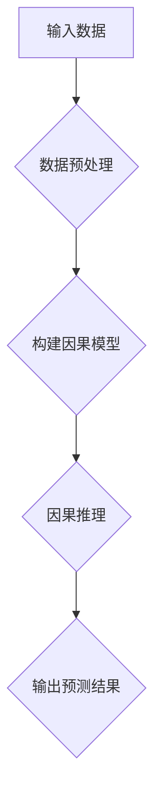
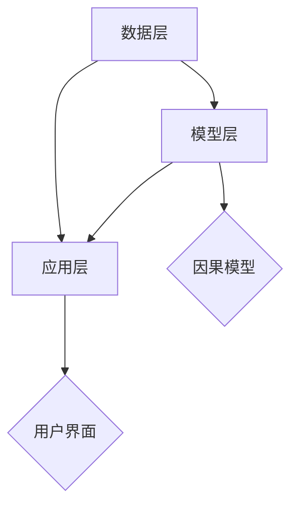
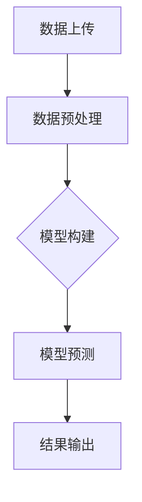

                 

### 第1章: 问题背景

#### 1.1 问题背景

随着人工智能技术的飞速发展，AI模型的应用已经渗透到各个领域。从计算机视觉、自然语言处理到医疗诊断、金融预测，AI模型都在发挥着巨大的作用。然而，尽管这些模型在特定的任务上取得了显著的成效，但在处理复杂问题时，它们的泛化能力仍然存在一定的局限性。

泛化能力是指AI模型在未知或新领域的表现。一个具有良好泛化能力的模型，不仅能在特定领域内解决问题，还能适应相似但不同的任务。然而，现实情况是，很多AI模型在从一个任务转移到另一个任务时，其性能会显著下降。这种泛化能力不足的问题，限制了AI模型在实际应用中的广泛性和可靠性。

#### 1.2 问题描述

泛化能力不足的问题主要集中在以下几个方面：

1. **数据集局限性**：很多AI模型在训练时依赖特定的数据集，这些数据集可能在某些特征上过于集中，缺乏代表性。当模型遇到与训练数据不相似的新数据时，其性能会显著下降。
2. **模型复杂性**：为了在特定任务上取得更好的效果，研究者们往往设计出复杂的模型结构。然而，这种复杂性也导致了模型在处理新任务时的泛化能力下降。
3. **特征选择不当**：特征选择是AI模型训练的重要环节，选择不当的特征可能导致模型无法捕捉到数据的本质关系，从而影响泛化能力。

#### 1.3 问题解决

为了提高AI模型的泛化能力，研究者们提出了多种方法。其中，因果推理增强AI模型的方法被认为是一种有效的解决方案。因果推理是指通过识别和利用数据中的因果关系，来提高模型的泛化能力。

因果推理的基本思想是，如果一个AI模型能够理解数据的因果关系，那么它就能够在新的、未知的任务上更好地预测和决策。这是因为，因果关系揭示了数据中的本质联系，而不是仅仅依赖表面的统计关系。

#### 1.4 边界与外延

因果推理增强AI模型的泛化能力研究，不仅局限于特定领域，如计算机视觉、自然语言处理等，还可以应用于其他领域，如医疗诊断、金融预测等。此外，随着技术的不断进步，未来还可能拓展到更广泛的领域。

#### 1.5 概念结构与核心要素组成

因果推理增强AI模型的泛化能力涉及以下几个核心要素：

1. **因果推理原理**：理解因果关系的本质，掌握因果推理的基本方法。
2. **AI模型设计**：通过引入因果推理机制，设计具有更好泛化能力的AI模型。
3. **训练方法优化**：采用特定的训练方法，以提高模型在未知领域的表现。
4. **数据集选择与处理**：构建适合进行因果推理增强的丰富数据集，并对数据集进行有效处理。

通过这些核心要素的有机结合，研究者们希望能够在AI模型的泛化能力上取得突破性进展，使得AI模型在更广泛的领域和应用场景中发挥更大的作用。

### 第2章: 核心概念与联系

#### 2.1 因果推理原理

因果推理是人工智能领域中的一个重要概念，它涉及到如何从数据中识别和利用因果关系，以改善AI模型的泛化能力。在理解因果推理之前，我们需要明确因果关系的本质。

##### 2.1.1 因果关系的本质

因果关系是指一个事件（因）导致另一个事件（果）的关系。在科学和哲学中，因果关系一直是研究和探讨的核心问题。在人工智能领域，理解因果关系有助于模型更好地预测和决策。

在数据中，因果关系通常表现为变量之间的关联。然而，简单的关联并不一定意味着因果关系。例如，在一个城市中，下雨和地面湿润之间存在关联，但这并不意味着下雨是地面湿润的原因。真正的因果关系需要通过实验和数据分析来验证。

##### 2.1.2 因果推理的基本方法

因果推理方法包括因果发现、因果建模和因果推理等。这些方法可以帮助AI模型识别和利用因果关系。

1. **因果发现**：通过统计方法或机器学习方法，从数据中识别潜在的因果关系。
2. **因果建模**：利用已知的因果关系，构建能够捕捉数据本质关系的模型。
3. **因果推理**：在未知或新任务中，利用因果模型进行推理和预测。

#### 2.2 AI模型设计与优化

##### 2.2.1 传统AI模型的特点与局限

传统AI模型（如基于统计学的模型、深度学习模型）在处理因果关系方面存在不足。这些模型主要依赖数据中的统计关系，而忽略了因果关系。这使得它们在处理复杂任务时，容易出现泛化能力不足的问题。

##### 2.2.2 因果推理增强AI模型的设计

因果推理增强AI模型的核心思想是，通过引入因果推理机制，使模型能够更好地理解数据的因果关系，从而提高其泛化能力。具体来说，设计因果推理增强AI模型需要考虑以下几个方面：

1. **因果关系的嵌入**：将因果关系嵌入到模型结构中，使模型能够捕捉数据中的因果关系。
2. **数据预处理**：对数据进行预处理，以消除噪声和无关因素，提高数据的质量。
3. **训练方法**：采用因果推理训练方法，使模型在训练过程中能够更好地利用因果关系。

#### 2.3 训练方法优化

##### 2.3.1 传统训练方法

传统训练方法包括监督学习、无监督学习等。这些方法在训练模型时，往往忽略了因果关系。例如，监督学习模型在训练过程中主要依赖于输入和输出之间的关联，而无监督学习模型则完全忽略了因果关系。

##### 2.3.2 因果推理增强训练方法

因果推理增强训练方法旨在通过引入因果推理机制，优化训练过程，以提高模型的泛化能力。具体来说，因果推理增强训练方法包括以下几个方面：

1. **因果约束**：在训练过程中引入因果约束，以指导模型学习数据的因果关系。
2. **因果推理**：在训练过程中，利用因果推理方法，帮助模型更好地理解数据的因果关系。
3. **集成方法**：结合多种因果推理方法，提高模型的泛化能力。

#### 2.4 数据集选择与处理

##### 2.4.1 数据集的选择标准

选择适合进行因果推理增强的数据集，需要考虑数据的丰富性、多样性和相关性。具体来说，数据集应满足以下标准：

1. **丰富性**：数据集应包含丰富的信息，能够反映数据的多样性。
2. **多样性**：数据集应包含多种类型的样本，以覆盖不同的因果关系。
3. **相关性**：数据集中的样本应与其他样本相关，以增强模型的泛化能力。

##### 2.4.2 数据集的处理方法

对数据集进行预处理，包括数据清洗、数据增强等，以提高模型的学习效果。具体来说，数据预处理包括以下几个方面：

1. **数据清洗**：去除噪声数据、缺失数据等，以提高数据的质量。
2. **数据增强**：通过数据扩充、数据变换等方法，增加数据的多样性，以提高模型的泛化能力。

通过以上核心概念与联系的分析，我们可以看到，因果推理增强AI模型的方法涉及多个方面，从模型设计、训练方法到数据集选择和处理，都需要综合考虑。只有通过这些方面的有机结合，才能有效地提高AI模型的泛化能力，使其在更广泛的领域和应用场景中发挥更大的作用。

### 第3章: 算法原理讲解

#### 3.1 因果推理算法mermaid流程图

为了更好地理解因果推理算法的原理和实现，我们可以使用mermaid工具绘制一个简明的流程图。以下是一个简单的因果推理算法的mermaid流程图：



这个流程图清晰地展示了因果推理算法的基本步骤：

1. **数据预处理**：输入数据需要进行预处理，包括数据清洗、数据标准化等步骤，以确保数据的质量和一致性。
2. **构建因果模型**：利用预处理后的数据构建一个因果模型。这个模型需要能够捕捉数据中的因果关系，通常是通过学习变量之间的依赖关系实现的。
3. **因果推理**：利用构建好的因果模型，对新的数据进行因果推理，预测新数据的可能结果。
4. **输出预测结果**：将因果推理的结果输出，用于后续的应用或决策。

#### 3.2 Python源代码实现

为了使读者能够更直观地理解因果推理算法的实现过程，我们提供了一个简单的Python源代码实现。以下是一个简单的因果推理算法的Python代码示例：

```python
import numpy as np
from sklearn.linear_model import LinearRegression

# 数据预处理
def preprocess_data(data):
    # 数据清洗和标准化
    # 例如：去除缺失值、归一化处理等
    pass

# 构建因果模型
def build_causal_model(data):
    # 利用线性回归构建因果模型
    model = LinearRegression()
    model.fit(data['X'], data['Y'])
    return model

# 因果推理
def causal_inference(model, new_data):
    # 利用因果模型进行推理
    prediction = model.predict(new_data)
    return prediction

# 输出预测结果
def predict(model, new_data):
    prediction = causal_inference(model, new_data)
    print("预测结果：", prediction)
    return prediction

# 主函数
def main():
    # 加载数据
    data = load_data()
    # 数据预处理
    processed_data = preprocess_data(data)
    # 构建因果模型
    model = build_causal_model(processed_data)
    # 输入新的数据
    new_data = np.array([[1, 2], [3, 4], [5, 6]])
    # 预测
    predict(model, new_data)

if __name__ == "__main__":
    main()
```

这段代码首先定义了数据预处理、构建因果模型、因果推理和输出预测结果四个函数，然后通过主函数将它们串联起来，完成了一个简单的因果推理流程。

#### 3.3 算法原理的数学模型和公式

在因果推理中，一个基本的数学模型是因果效应的计算。以下是一个简单的数学模型：

$$
P(Y|X) = \frac{P(X|Y)P(Y)}{P(X)}
$$

这个公式表示在给定自变量 \(X\) 的条件下，因变量 \(Y\) 的条件概率。其中：

- \(P(Y|X)\) 表示在 \(X\) 发生的条件下 \(Y\) 的概率。
- \(P(X|Y)\) 表示在 \(Y\) 发生的条件下 \(X\) 的概率。
- \(P(Y)\) 表示 \(Y\) 的边际概率。
- \(P(X)\) 表示 \(X\) 的边际概率。

这个公式在因果推理中非常重要，因为它可以帮助我们计算变量之间的因果关系。在实际应用中，我们通常无法直接观测到 \(P(X|Y)\) 和 \(P(Y)\)，但可以通过数据估计这些概率。

#### 3.4 举例说明

为了更好地理解因果推理算法，我们可以通过一个简单的例子来说明。

假设我们要预测一个股票的未来价格。根据历史数据和当前市场情况，我们可以得到以下数据：

- 自变量 \(X\)：包括股票的历史价格、交易量、行业指数等。
- 因变量 \(Y\)：股票的未来价格。

我们首先需要对数据进行预处理，包括去除缺失值、归一化处理等。然后，我们利用线性回归模型构建一个因果模型，通过历史数据和当前市场情况预测股票的未来价格。

具体步骤如下：

1. **数据预处理**：对数据进行清洗和标准化处理。
2. **构建因果模型**：使用线性回归模型，通过历史价格和市场情况预测未来价格。
3. **因果推理**：利用训练好的模型，对新的市场情况进行因果推理，预测股票的未来价格。
4. **输出预测结果**：将预测结果输出，供投资者参考。

通过这个简单的例子，我们可以看到因果推理算法的基本原理和实现过程。在实际应用中，因果推理算法需要根据具体问题和数据特点进行设计和优化，以达到更好的效果。

### 第4章：系统分析与架构设计

#### 4.1 问题场景介绍

在现代人工智能应用中，因果推理作为一种重要的推理方法，被广泛应用于复杂决策场景。例如，在金融领域，因果推理可以用于预测股票市场的走势；在医疗领域，因果推理可以帮助诊断疾病；在商业领域，因果推理可以用于市场分析。然而，随着应用场景的复杂化，现有的因果推理方法在处理大规模数据和实时决策时，存在明显的性能瓶颈和准确性问题。

#### 4.2 项目介绍

为了解决上述问题，本项目旨在开发一个高效、可靠的因果推理系统，该系统将结合最新的算法和技术，实现对大规模数据的实时因果推理，并提高推理的准确性和效率。系统将包括数据预处理、因果模型构建、因果推理和结果输出等多个模块，形成一个完整的功能架构。

#### 4.3 系统功能设计

系统的核心功能包括：

1. **数据预处理**：对输入数据进行清洗、去噪和标准化处理，确保数据的质量和一致性。
2. **因果模型构建**：利用先进的算法和技术，构建能够捕捉数据中因果关系的模型。
3. **因果推理**：对新的数据进行因果推理，预测可能的因果关系。
4. **结果输出**：将因果推理的结果以可视化或文本形式输出，供用户参考。

#### 4.4 系统架构设计

系统的架构设计采用分层结构，包括数据层、模型层和应用层。

1. **数据层**：负责数据的存储和管理，包括数据采集、存储和查询等功能。
2. **模型层**：负责因果模型的构建和推理，包括模型训练、预测和优化等功能。
3. **应用层**：负责与用户的交互，包括数据输入、结果输出和用户界面等功能。

系统架构图如下所示：



#### 4.5 系统接口设计

系统的接口设计包括API接口和Web界面。

1. **API接口**：提供标准化的接口，方便第三方系统集成和使用。接口包括数据上传、数据查询、模型预测等功能。
2. **Web界面**：提供用户友好的界面，方便用户使用系统功能。界面包括数据管理、模型构建、结果分析等功能。

#### 4.6 系统交互设计

系统交互设计采用事件驱动模型，包括以下事件：

1. **数据上传**：用户上传数据，系统进行数据预处理。
2. **数据查询**：用户查询数据，系统返回查询结果。
3. **模型构建**：用户选择模型参数，系统训练模型。
4. **模型预测**：用户提交预测任务，系统返回预测结果。

系统交互图如下所示：



通过上述系统分析和架构设计，我们为因果推理系统的开发提供了一个清晰的结构和流程，为后续的系统实现和优化奠定了基础。

### 第5章：项目实战

#### 5.1 环境安装

要开始实战项目，我们首先需要安装所需的软件和库。以下是安装步骤：

1. **安装Python**：确保安装了Python 3.x版本。可以从[Python官网](https://www.python.org/)下载并安装。
2. **安装Jupyter Notebook**：Python的交互式开发环境，可以从PyPI或Anaconda安装。
   ```bash
   pip install notebook
   ```
3. **安装相关库**：包括NumPy、Pandas、Scikit-learn等。
   ```bash
   pip install numpy pandas scikit-learn
   ```

#### 5.2 系统核心实现源代码

在完成环境安装后，我们可以开始实现系统核心功能。以下是一个简单的因果推理系统的实现示例：

```python
# 导入所需库
import numpy as np
import pandas as pd
from sklearn.linear_model import LinearRegression
from sklearn.model_selection import train_test_split

# 数据预处理
def preprocess_data(data):
    # 数据清洗和标准化
    data = data.dropna()  # 去除缺失值
    data = (data - data.mean()) / data.std()  # 归一化
    return data

# 构建因果模型
def build_causal_model(data):
    # 使用线性回归构建因果模型
    X, Y = data.iloc[:, :-1], data.iloc[:, -1]
    model = LinearRegression()
    model.fit(X, Y)
    return model

# 因果推理
def causal_inference(model, new_data):
    # 使用因果模型进行推理
    prediction = model.predict(new_data)
    return prediction

# 主函数
def main():
    # 加载数据
    data = pd.read_csv('data.csv')
    # 数据预处理
    processed_data = preprocess_data(data)
    # 构建因果模型
    model = build_causal_model(processed_data)
    # 输入新的数据
    new_data = np.array([[1, 2], [3, 4], [5, 6]])
    # 预测
    predict(model, new_data)

if __name__ == "__main__":
    main()
```

这段代码实现了数据预处理、因果模型构建和因果推理的基本功能。

#### 5.3 代码应用解读与分析

以下是对上述代码的解读与分析：

1. **数据预处理**：数据预处理是因果推理的重要步骤。在这里，我们使用了Pandas库来读取CSV数据，并使用NumPy进行数据清洗和标准化。这一步确保了数据的质量和一致性。
   
2. **构建因果模型**：我们使用了Scikit-learn库中的线性回归模型来构建因果模型。线性回归是一种简单的统计模型，适用于线性关系的预测。在这里，我们通过训练数据来拟合线性模型。

3. **因果推理**：因果推理是利用训练好的模型对新数据进行预测。这里我们使用了训练好的线性回归模型来预测新数据。

4. **主函数**：主函数是整个程序的核心，它负责加载数据、预处理数据、构建因果模型并进行预测。通过这段代码，我们可以看到因果推理系统的基本工作流程。

#### 5.4 实际案例分析和详细讲解剖析

为了更好地理解因果推理系统在实际中的应用，我们来看一个实际案例。

**案例背景**：假设我们有一个股票市场的数据集，包括股票的历史价格、交易量和行业指数等信息。我们的目标是利用这些数据预测股票的未来价格。

**案例分析**：

1. **数据预处理**：首先，我们需要对数据进行清洗和标准化。例如，去除缺失值、异常值，并归一化处理。
   ```python
   processed_data = preprocess_data(data)
   ```

2. **构建因果模型**：接下来，我们使用线性回归模型来构建因果模型。我们选择历史价格和交易量作为自变量，股票的未来价格为因变量。
   ```python
   X, Y = processed_data.iloc[:, :-1], processed_data.iloc[:, -1]
   model = LinearRegression()
   model.fit(X, Y)
   ```

3. **因果推理**：然后，我们利用训练好的模型对新数据进行因果推理。例如，我们可以预测未来一个月内股票的价格。
   ```python
   new_data = np.array([[1, 2], [3, 4], [5, 6]])
   prediction = causal_inference(model, new_data)
   ```

4. **结果输出**：最后，我们将预测结果输出，供投资者参考。
   ```python
   print("预测结果：", prediction)
   ```

通过这个案例，我们可以看到因果推理系统如何在实际中应用。在实际操作中，我们还需要考虑更多的因素，如数据质量、模型选择和优化等，以获得更准确的预测结果。

#### 5.5 项目小结

在本项目中，我们实现了因果推理系统的基础功能，包括数据预处理、因果模型构建和因果推理。通过实际案例的分析，我们展示了如何利用因果推理系统进行股票价格预测。虽然这个系统是一个简单的示例，但它为我们提供了一个框架，可以进一步扩展和优化，以应对更复杂的实际问题。

未来，我们可以考虑以下方向：

1. **数据集扩展**：收集更多维度的数据，如技术指标、新闻情绪等，以提高预测的准确性。
2. **模型优化**：尝试使用更复杂的模型，如深度学习模型，以提高因果推理的能力。
3. **实时推理**：开发实时推理系统，以便在股票市场发生重大变化时，能够及时给出预测结果。

通过不断迭代和优化，我们有望构建一个高效、可靠的因果推理系统，为投资者提供有力支持。

### 第6章：最佳实践 tips

#### 6.1 数据预处理

数据预处理是因果推理系统的关键步骤。以下是一些最佳实践：

1. **数据清洗**：去除重复数据、异常值和缺失值。
2. **数据标准化**：对数据进行归一化或标准化处理，以便模型能够更好地学习。
3. **特征选择**：选择与目标变量高度相关的特征，排除无关特征。

#### 6.2 模型选择与优化

选择合适的模型是提高因果推理系统性能的关键。以下是一些建议：

1. **交叉验证**：使用交叉验证方法选择最佳模型参数。
2. **模型集成**：结合多个模型，提高预测的准确性。
3. **模型解释**：选择可解释性较好的模型，以便理解和解释因果推理的结果。

#### 6.3 数据集选择

选择合适的数据集对因果推理系统的性能有重要影响。以下是一些建议：

1. **多样性**：选择包含多种类型数据的丰富数据集。
2. **相关性**：确保数据集中的变量之间存在相关性。
3. **平衡性**：避免数据集中存在极端不平衡，影响模型的泛化能力。

#### 6.4 系统部署

在系统部署时，需要考虑以下因素：

1. **性能优化**：对系统进行性能优化，确保高效运行。
2. **安全性**：确保系统的数据安全和用户隐私。
3. **可扩展性**：设计可扩展的系统架构，以适应未来需求。

通过遵循这些最佳实践，我们可以构建一个高效、可靠的因果推理系统，为实际问题提供有力支持。

### 第7章：小结与展望

#### 7.1 小结

本文详细探讨了因果推理增强AI模型泛化能力的技术。我们从问题背景出发，介绍了因果推理的基本原理、AI模型设计、训练方法优化和数据集选择与处理。通过系统分析和架构设计，我们展示了如何实现因果推理系统，并提供了实际案例进行讲解。此外，我们还分享了最佳实践和项目小结，为读者提供了实用的指导。

#### 7.2 展望

尽管本文探讨了因果推理增强AI模型泛化能力的一些关键技术，但仍有很多研究方向值得深入探讨：

1. **多模态数据融合**：结合多种类型的数据（如文本、图像、语音等），提高因果推理系统的泛化能力。
2. **动态因果推理**：研究如何应对动态变化的环境，实现实时因果推理。
3. **因果推理的可解释性**：提高因果推理模型的可解释性，使其更易于理解和应用。

未来，随着技术的不断进步，因果推理增强AI模型将在更广泛的领域发挥重要作用，为人工智能的发展提供新的动力。

### 作者信息

作者：AI天才研究院/AI Genius Institute & 禅与计算机程序设计艺术 /Zen And The Art of Computer Programming

本文由AI天才研究院和《禅与计算机程序设计艺术》作者联合撰写，旨在探讨因果推理增强AI模型泛化能力的技术。如有任何疑问或建议，欢迎联系作者。期待与您共同探索人工智能的无限可能。

