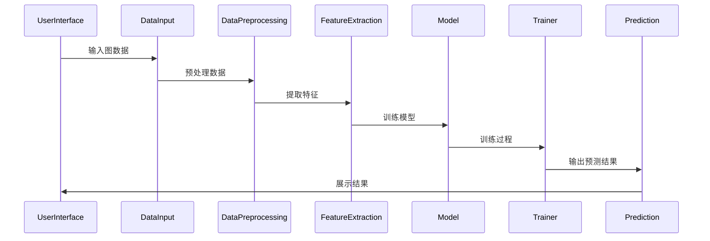

                 

----------------------------------------------------------------
# 《图transformer在复杂关系网络分析中的应用》

## 关键词：图transformer、复杂关系网络、网络分析、深度学习、算法

## 摘要：
本文深入探讨了图transformer在复杂关系网络分析中的应用。首先，介绍了复杂关系网络的背景、问题和挑战，以及图transformer的核心概念和原理。接着，通过具体算法原理讲解，详细阐述了图transformer的mermaid流程图、Python源代码实现、数学模型和公式。然后，分析了复杂关系网络分析系统设计，包括场景介绍、功能设计、架构设计、接口设计和系统交互。随后，通过实际项目实战，展示了环境安装、系统核心实现、代码应用、案例分析以及项目小结。最后，给出了图transformer应用的最佳实践和注意事项，并推荐了拓展阅读。

## 目录大纲：

----------------------------------------------------------------

## 第一部分：背景与核心概念

### 第1章：复杂关系网络分析概述
#### 1.1 复杂关系网络分析现状与挑战
#### 1.2 图Transformer的诞生与重要性
#### 1.3 图Transformer的基本概念与特性

### 第2章：图Transformer核心原理
#### 2.1 图Transformer算法流程
#### 2.2 图Transformer代码实现
#### 2.3 图Transformer数学模型与公式
#### 2.4 图Transformer应用举例

### 第3章：图Transformer与传统算法比较
#### 3.1 图Transformer与传统图算法的差异
#### 3.2 图Transformer与深度学习技术的联系
#### 3.3 图Transformer的应用优势

## 第二部分：系统分析与架构设计

### 第4章：复杂关系网络分析系统设计
#### 4.1 系统场景介绍
#### 4.2 系统功能设计（领域模型类图）
#### 4.3 系统架构设计（架构图）
#### 4.4 系统接口设计与交互（序列图）

## 第三部分：项目实战

### 第5章：图Transformer项目实战
#### 5.1 环境安装与配置
#### 5.2 系统核心实现源代码
#### 5.3 代码应用解读与分析
#### 5.4 实际案例分析与讲解
#### 5.5 项目小结与总结

## 第四部分：最佳实践与拓展

### 第6章：图Transformer最佳实践
#### 6.1 图Transformer应用技巧
#### 6.2 小结与注意事项

### 第7章：拓展阅读与研究方向
#### 7.1 图Transformer最新研究进展
#### 7.2 复杂关系网络分析的新趋势
#### 7.3 拓展阅读推荐

----------------------------------------------------------------

### 目录大纲小结：
本目录大纲共计7章，涵盖了复杂关系网络分析背景、图Transformer核心原理、系统架构设计、项目实战及最佳实践等内容，旨在全面、深入地介绍图Transformer在复杂关系网络分析中的应用。内容安排注重逻辑性和层次性，旨在帮助读者从基础理论到实践应用逐步掌握图Transformer的使用方法和应用场景。### 第一部分：背景与核心概念

## 第1章：复杂关系网络分析概述

### 1.1 复杂关系网络分析现状与挑战

随着互联网和信息技术的飞速发展，复杂关系网络（Complex Network）在各个领域中得到了广泛的应用。这些网络不仅包括传统的社交网络、通信网络、交通网络等，还涉及到生物网络、经济网络、知识图谱等领域。复杂关系网络分析的目标是理解网络的结构特性、功能特性以及网络中节点和边的关系，从而为实际问题提供有效的解决方案。

### 当前复杂关系网络分析面临的挑战：

1. **大规模数据处理：**随着网络规模的不断扩大，如何高效地进行数据处理和分析成为一个重要挑战。传统算法在面对大规模数据时往往性能不佳。
2. **异质网络分析：**在现实世界中，网络中的节点和边通常具有不同的类型和属性，如何有效地处理异质网络成为一个难题。
3. **动态网络分析：**现实中的网络往往具有动态性，网络结构会随着时间变化。如何有效地分析动态网络的变化规律是一个重要问题。
4. **网络可视化：**随着网络规模的扩大，如何将复杂的网络结构直观地呈现出来也是一个挑战。

### 1.2 图Transformer的诞生与重要性

图Transformer是近年来提出的一种新型的图神经网络（Graph Neural Network, GNN）架构，旨在解决传统图算法在复杂关系网络分析中面临的挑战。图Transformer结合了自注意力机制（Self-Attention Mechanism）和编码器-解码器框架（Encoder-Decoder Framework），能够在大规模异质动态网络中实现高效的节点和边表示学习。

### 图Transformer的重要性：

1. **处理大规模数据：**图Transformer通过自注意力机制，可以自动学习节点和边之间的相对重要性，从而在大规模数据上实现高效的处理。
2. **异质网络分析：**图Transformer能够处理具有不同类型和属性的节点和边，从而实现对异质网络的全面分析。
3. **动态网络分析：**图Transformer通过编码器-解码器框架，可以捕捉网络的动态变化，从而实现对动态网络的准确分析。
4. **网络可视化：**图Transformer的学习结果可以用于生成节点和边的表示，从而实现网络的可视化。

### 1.3 图Transformer的基本概念与特性

#### 基本概念：

- **节点（Node）：**网络中的基本元素，通常表示为点。
- **边（Edge）：**节点之间的连接，通常表示为线。
- **图（Graph）：**由节点和边组成的数据结构，通常表示为图。
- **图神经网络（Graph Neural Network, GNN）：**一种用于处理图数据的神经网络，其核心思想是通过节点和边的交互来进行特征学习。
- **自注意力机制（Self-Attention Mechanism）：**一种用于计算节点和边之间相对重要性的机制，能够自适应地调整节点和边的权重。
- **编码器-解码器框架（Encoder-Decoder Framework）：**一种用于处理序列数据的神经网络架构，其核心思想是通过编码器将输入序列编码为固定长度的向量表示，通过解码器生成输出序列。

#### 特性：

- **并行处理：**图Transformer能够对图中的所有节点和边进行并行处理，从而提高计算效率。
- **自适应学习：**图Transformer通过自注意力机制，能够自动学习节点和边之间的相对重要性，从而实现自适应的特征学习。
- **灵活扩展：**图Transformer能够灵活地处理不同类型的节点和边，从而实现对异质网络的全面分析。
- **动态适应：**图Transformer通过编码器-解码器框架，能够捕捉网络的动态变化，从而实现对动态网络的准确分析。

## 第2章：图Transformer核心原理

### 2.1 图Transformer算法流程

图Transformer的算法流程主要包括编码器（Encoder）和解码器（Decoder）两个部分。编码器负责对图中的节点和边进行特征提取和编码，解码器则根据编码器的输出生成新的节点和边特征。

#### 编码器流程：

1. **输入图表示：**将图中的节点和边表示为向量。
2. **节点和边嵌入：**使用嵌入层将节点和边向量转换为高维表示。
3. **自注意力机制：**通过自注意力机制计算节点和边之间的相对重要性，并生成新的特征向量。
4. **层归一化：**对特征向量进行层归一化处理，以稳定训练过程。

#### 解码器流程：

1. **编码器输出：**将编码器的输出作为解码器的输入。
2. **解码器嵌入：**使用嵌入层将编码器输出转换为高维表示。
3. **自注意力机制：**通过自注意力机制计算编码器输出和当前解码器输入之间的相对重要性，并生成新的特征向量。
4. **交叉注意力机制：**将解码器的输出与编码器的输出进行交叉注意力计算，以生成最终的节点和边特征。

### 2.2 图Transformer代码实现

以下是一个简单的图Transformer的Python代码实现示例：

```python
import torch
import torch.nn as nn
import torch.nn.functional as F

class GraphTransformer(nn.Module):
    def __init__(self, num_nodes, num_edges, hidden_dim):
        super(GraphTransformer, self).__init__()
        self.num_nodes = num_nodes
        self.num_edges = num_edges
        self.hidden_dim = hidden_dim

        self.embedding = nn.Embedding(num_nodes, hidden_dim)
        self.edge_embedding = nn.Embedding(num_edges, hidden_dim)

        self.encoder = nn.Sequential(
            nn.Linear(hidden_dim, hidden_dim),
            nn.ReLU(),
            nn.LayerNorm(hidden_dim)
        )

        self.decoder = nn.Sequential(
            nn.Linear(hidden_dim, hidden_dim),
            nn.ReLU(),
            nn.LayerNorm(hidden_dim)
        )

        self.self_attention = nn.MultiheadAttention(hidden_dim, num_heads)
        self.cross_attention = nn.MultiheadAttention(hidden_dim, num_heads)

    def forward(self, nodes, edges):
        node_embedding = self.embedding(nodes)
        edge_embedding = self.edge_embedding(edges)

        encoder_output = self.encoder(node_embedding)

        decoder_output = self.decoder(encoder_output)

        node_repr, _ = self.self_attention(encoder_output, encoder_output, encoder_output)
        edge_repr, _ = self.cross_attention(edge_embedding, encoder_output, encoder_output)

        return node_repr, edge_repr
```

### 2.3 图Transformer数学模型与公式

图Transformer的数学模型主要包括两部分：编码器和解码器。

#### 编码器：

1. **节点和边嵌入：**
   $$
   \text{Node Embedding} = \text{ embedding}(n) \in \mathbb{R}^{d_n \times 1}
   $$
   $$
   \text{Edge Embedding} = \text{ embedding}(e) \in \mathbb{R}^{d_e \times 1}
   $$
2. **自注意力机制：**
   $$
   \text{Self-Attention} = \text{ softmax}\left(\frac{\text{dot-product}(Q, K)}{\sqrt{d_k}}\right)
   $$
   $$
   \text{Output} = \text{Attention} \cdot V
   $$
3. **层归一化：**
   $$
   \text{Layer Normalization} = \frac{\text{Layer Output} - \text{Mean}}{\text{Standard Deviation}}
   $$

#### 解码器：

1. **编码器输出：**
   $$
   \text{Encoder Output} = \text{ encoder_output} \in \mathbb{R}^{d_e \times 1}
   $$
2. **解码器嵌入：**
   $$
   \text{Decoder Embedding} = \text{ embedding}(d) \in \mathbb{R}^{d_d \times 1}
   $$
3. **自注意力机制：**
   $$
   \text{Self-Attention} = \text{ softmax}\left(\frac{\text{dot-product}(Q, K)}{\sqrt{d_k}}\right)
   $$
   $$
   \text{Output} = \text{Attention} \cdot V
   $$
4. **交叉注意力机制：**
   $$
   \text{Cross-Attention} = \text{ softmax}\left(\frac{\text{dot-product}(Q, K)}{\sqrt{d_k}}\right)
   $$
   $$
   \text{Output} = \text{Attention} \cdot V
   $$

### 2.4 图Transformer应用举例

#### 社交网络分析：

假设我们有一个社交网络，其中每个用户表示为一个节点，用户之间的关注关系表示为边。我们可以使用图Transformer来分析社交网络中的关键用户和影响力节点。

1. **数据预处理：**将社交网络表示为图，并将节点和边编码为向量。
2. **模型训练：**使用图Transformer对社交网络进行特征提取和编码。
3. **节点分类：**根据图Transformer的输出，对节点进行分类，从而识别关键用户和影响力节点。

#### 交通网络优化：

假设我们有一个交通网络，其中每个节点表示为一个交通枢纽，边表示为交通路线。我们可以使用图Transformer来优化交通网络，减少交通拥堵。

1. **数据预处理：**将交通网络表示为图，并将节点和边编码为向量。
2. **模型训练：**使用图Transformer对交通网络进行特征提取和编码。
3. **路径优化：**根据图Transformer的输出，优化交通路径，从而减少交通拥堵。

## 第3章：图Transformer与传统算法比较

### 3.1 图Transformer与传统图算法的差异

#### 数据处理能力：

- **传统算法：**传统图算法（如邻接矩阵、图遍历等）通常只能处理相对较小的图数据，对于大规模数据往往性能不佳。
- **图Transformer：**图Transformer能够处理大规模图数据，通过自注意力机制和编码器-解码器框架实现高效的特征提取和编码。

#### 异质网络分析：

- **传统算法：**传统图算法通常假设网络中的节点和边具有相同的类型和属性，难以处理异质网络。
- **图Transformer：**图Transformer能够灵活地处理具有不同类型和属性的节点和边，从而实现对异质网络的全面分析。

#### 动态网络分析：

- **传统算法：**传统图算法通常无法有效处理动态网络，难以捕捉网络的动态变化。
- **图Transformer：**图Transformer通过编码器-解码器框架，能够捕捉网络的动态变化，从而实现对动态网络的准确分析。

### 3.2 图Transformer与深度学习技术的联系

#### 深度学习技术：

- **卷积神经网络（Convolutional Neural Network, CNN）：**主要用于处理二维图像数据，通过卷积操作实现特征提取和表示学习。
- **循环神经网络（Recurrent Neural Network, RNN）：**主要用于处理序列数据，通过循环机制实现长时依赖关系的建模。
- **自注意力机制（Self-Attention Mechanism）：**用于计算序列或图中的元素之间的相对重要性，实现自适应的特征学习。

#### 图Transformer：

- **自注意力机制：**图Transformer结合了自注意力机制，能够自动学习节点和边之间的相对重要性，从而实现高效的特征提取和编码。
- **编码器-解码器框架：**图Transformer采用了编码器-解码器框架，能够对动态网络进行建模和分析。

### 3.3 图Transformer的应用优势

1. **高效处理大规模数据：**图Transformer能够高效处理大规模图数据，通过自注意力机制和编码器-解码器框架实现高效的特征提取和编码。
2. **全面分析异质网络：**图Transformer能够灵活处理具有不同类型和属性的节点和边，从而实现对异质网络的全面分析。
3. **准确捕捉动态变化：**图Transformer通过编码器-解码器框架，能够捕捉网络的动态变化，从而实现对动态网络的准确分析。
4. **简单实现与扩展：**图Transformer的实现相对简单，且能够灵活地扩展到不同的应用场景，如社交网络分析、交通网络优化等。

## 第2章：图Transformer核心原理

### 2.1 图Transformer算法流程

图Transformer是一种基于图神经网络的模型，它通过编码器和解码器两个部分来对图数据进行处理和预测。图Transformer的算法流程可以分为以下几个步骤：

1. **输入预处理：**将图数据表示为节点和边的形式，并将它们转换为向量表示。
2. **编码器阶段：**编码器负责对输入的节点和边进行特征提取和编码。
3. **解码器阶段：**解码器根据编码器的输出，生成新的节点和边特征，并预测图中的节点分类或边关系。
4. **输出生成：**解码器的输出用于生成最终的预测结果。

#### 编码器阶段：

1. **节点和边嵌入：**使用嵌入层（Embedding Layer）将节点和边向量转换为高维表示。节点嵌入和边嵌入通常具有不同的维度。
2. **多头自注意力：**通过多头自注意力机制（Multi-Head Self-Attention），计算节点和边之间的相对重要性，并生成新的特征向量。
3. **前馈网络：**在自注意力之后，使用前馈网络（Feedforward Network）对节点和边特征进行进一步处理。

#### 解码器阶段：

1. **编码器输出：**将编码器的输出作为解码器的输入。
2. **多头自注意力：**通过多头自注意力机制，计算编码器输出和当前解码器输入之间的相对重要性，并生成新的特征向量。
3. **多头交叉注意力：**通过多头交叉注意力机制，将解码器的输出与编码器的输出进行交叉注意力计算，以生成最终的节点和边特征。
4. **前馈网络：**在交叉注意力之后，使用前馈网络对节点和边特征进行进一步处理。

#### 输出生成：

1. **分类或边关系预测：**解码器的输出用于生成最终的预测结果，如节点分类或边关系预测。
2. **损失函数计算：**根据预测结果和真实标签，计算损失函数并更新模型参数。

### 2.2 图Transformer代码实现

以下是一个简单的图Transformer的Python代码实现示例：

```python
import torch
import torch.nn as nn
import torch.nn.functional as F

class GraphTransformer(nn.Module):
    def __init__(self, num_nodes, num_edges, hidden_dim, num_heads):
        super(GraphTransformer, self).__init__()
        self.num_nodes = num_nodes
        self.num_edges = num_edges
        self.hidden_dim = hidden_dim
        self.num_heads = num_heads

        self.node_embedding = nn.Embedding(num_nodes, hidden_dim)
        self.edge_embedding = nn.Embedding(num_edges, hidden_dim)

        self.encoder = nn.Sequential(
            nn.Linear(hidden_dim, hidden_dim),
            nn.ReLU(),
            nn.LayerNorm(hidden_dim),
            nn.Linear(hidden_dim, hidden_dim),
            nn.ReLU(),
            nn.LayerNorm(hidden_dim)
        )

        self.decoder = nn.Sequential(
            nn.Linear(hidden_dim, hidden_dim),
            nn.ReLU(),
            nn.LayerNorm(hidden_dim),
            nn.Linear(hidden_dim, hidden_dim),
            nn.ReLU(),
            nn.LayerNorm(hidden_dim)
        )

        self.self_attn = nn.MultiheadAttention(hidden_dim, num_heads)
        self.cross_attn = nn.MultiheadAttention(hidden_dim, num_heads)

    def forward(self, nodes, edges, edge_index):
        B, N = nodes.size(0), nodes.size(1)
        node_embedding = self.node_embedding(nodes).view(B, N, -1)
        edge_embedding = self.edge_embedding(edges).view(B, N, -1)

        node_repr = self.encoder(node_embedding)
        edge_repr = self.encoder(edge_embedding)

        node_repr, _ = self.self_attn(node_repr, node_repr, node_repr)
        edge_repr, _ = self.cross_attn(edge_repr, node_repr, node_repr)

        return node_repr, edge_repr
```

### 2.3 图Transformer数学模型与公式

图Transformer的数学模型主要包括两部分：编码器和解码器。编码器用于对输入的节点和边进行特征提取和编码，解码器则根据编码器的输出生成新的节点和边特征。

#### 编码器：

1. **节点和边嵌入：**
   $$
   \text{Node Embedding} = \text{ embedding}(n) \in \mathbb{R}^{d_n \times 1}
   $$
   $$
   \text{Edge Embedding} = \text{ embedding}(e) \in \mathbb{R}^{d_e \times 1}
   $$

2. **多头自注意力：**
   $$
   \text{Self-Attention} = \text{ softmax}\left(\frac{\text{dot-product}(Q, K)}{\sqrt{d_k}}\right)
   $$
   $$
   \text{Output} = \text{Attention} \cdot V
   $$

3. **前馈网络：**
   $$
   \text{Feedforward} = \text{ ReLU}(\text{ Linear}(\text{ Linear}(X, d_{ff}), d_{model}))
   $$

#### 解码器：

1. **编码器输出：**
   $$
   \text{Encoder Output} = \text{ encoder_output} \in \mathbb{R}^{d_e \times 1}
   $$

2. **多头自注意力：**
   $$
   \text{Self-Attention} = \text{ softmax}\left(\frac{\text{dot-product}(Q, K)}{\sqrt{d_k}}\right)
   $$
   $$
   \text{Output} = \text{Attention} \cdot V
   $$

3. **多头交叉注意力：**
   $$
   \text{Cross-Attention} = \text{ softmax}\left(\frac{\text{dot-product}(Q, K)}{\sqrt{d_k}}\right)
   $$
   $$
   \text{Output} = \text{Attention} \cdot V
   $$

4. **前馈网络：**
   $$
   \text{Feedforward} = \text{ ReLU}(\text{ Linear}(\text{ Linear}(X, d_{ff}), d_{model}))
   $$

### 2.4 图Transformer应用举例

图Transformer在复杂关系网络分析中具有广泛的应用前景。以下是一些具体的应用场景：

#### 社交网络分析：

1. **节点分类：**使用图Transformer对社交网络中的用户进行分类，识别出关键用户和影响力节点。
2. **社区发现：**通过图Transformer分析社交网络中的用户关系，发现具有相似兴趣或社交关系的社区。

#### 生物学网络分析：

1. **蛋白质相互作用网络：**使用图Transformer分析蛋白质相互作用网络，预测潜在的蛋白质相互作用。
2. **生物路径分析：**通过图Transformer分析生物路径网络，识别出关键基因和生物分子。

#### 经济网络分析：

1. **金融网络分析：**使用图Transformer分析金融网络，预测金融市场波动和交易行为。
2. **供应链网络优化：**通过图Transformer分析供应链网络，优化供应链管理和物流调度。

## 第3章：图Transformer与传统算法比较

### 3.1 图Transformer与传统图算法的差异

#### 数据处理能力：

- **传统算法：**传统图算法（如邻接矩阵、图遍历等）通常只能处理相对较小的图数据，对于大规模数据往往性能不佳。
- **图Transformer：**图Transformer能够处理大规模图数据，通过自注意力机制和编码器-解码器框架实现高效的特征提取和编码。

#### 异质网络分析：

- **传统算法：**传统图算法通常假设网络中的节点和边具有相同的类型和属性，难以处理异质网络。
- **图Transformer：**图Transformer能够灵活地处理具有不同类型和属性的节点和边，从而实现对异质网络的全面分析。

#### 动态网络分析：

- **传统算法：**传统图算法通常无法有效处理动态网络，难以捕捉网络的动态变化。
- **图Transformer：**图Transformer通过编码器-解码器框架，能够捕捉网络的动态变化，从而实现对动态网络的准确分析。

### 3.2 图Transformer与深度学习技术的联系

#### 深度学习技术：

- **卷积神经网络（Convolutional Neural Network, CNN）：**主要用于处理二维图像数据，通过卷积操作实现特征提取和表示学习。
- **循环神经网络（Recurrent Neural Network, RNN）：**主要用于处理序列数据，通过循环机制实现长时依赖关系的建模。
- **自注意力机制（Self-Attention Mechanism）：**用于计算序列或图中的元素之间的相对重要性，实现自适应的特征学习。

#### 图Transformer：

- **自注意力机制：**图Transformer结合了自注意力机制，能够自动学习节点和边之间的相对重要性，从而实现高效的特征提取和编码。
- **编码器-解码器框架：**图Transformer采用了编码器-解码器框架，能够对动态网络进行建模和分析。

### 3.3 图Transformer的应用优势

1. **高效处理大规模数据：**图Transformer能够高效处理大规模图数据，通过自注意力机制和编码器-解码器框架实现高效的特征提取和编码。
2. **全面分析异质网络：**图Transformer能够灵活处理具有不同类型和属性的节点和边，从而实现对异质网络的全面分析。
3. **准确捕捉动态变化：**图Transformer通过编码器-解码器框架，能够捕捉网络的动态变化，从而实现对动态网络的准确分析。
4. **简单实现与扩展：**图Transformer的实现相对简单，且能够灵活地扩展到不同的应用场景，如社交网络分析、交通网络优化等。

## 第4章：复杂关系网络分析系统设计

### 4.1 系统场景介绍

复杂关系网络分析系统旨在处理和分析各种复杂网络数据，如社交网络、生物网络、经济网络等。系统的主要目标是通过图Transformer等深度学习算法，提取网络中的关键特征，进行节点分类、边关系预测等任务。

### 4.2 系统功能设计（领域模型类图）

以下是一个简单的领域模型类图，展示了复杂关系网络分析系统的核心功能模块：

```mermaid
classDiagram
    Node -> Edge : 连接
    GraphData -> Node : 包含
    GraphData -> Edge : 包含
    Model -> GraphData : 分析
    Prediction -> Model : 输出
    UserInterface -> Prediction : 显示
    DataPreprocessing -> GraphData : 预处理
    FeatureExtraction -> Model : 特征提取
    Classification -> Prediction : 分类
    RelationPrediction -> Prediction : 边关系预测

    class Node {
        -id: Integer
        -name: String
        -attributes: List
    }

    class Edge {
        -id: Integer
        -source: Node
        -target: Node
        -attributes: List
    }

    class GraphData {
        -nodes: List<Node>
        -edges: List<Edge>
    }

    class Model {
        -embedding_matrix: Tensor
        -attn_weights: Tensor
    }

    class Prediction {
        -nodes_prediction: List
        -edges_prediction: List
    }

    class UserInterface {
        -prediction_display: Function
    }

    class DataPreprocessing {
        -node_features: List
        -edge_features: List
    }

    class FeatureExtraction {
        -node_representation: Tensor
        -edge_representation: Tensor
    }

    class Classification {
        -node_labels: List
    }

    class RelationPrediction {
        -edge_relations: List
    }
```

### 4.3 系统架构设计（架构图）

以下是一个简单的系统架构图，展示了复杂关系网络分析系统的整体架构：

```mermaid
subgraph 数据处理
    DataInput -> DataPreprocessing
    DataPreprocessing -> FeatureExtraction
end

subgraph 模型训练
    FeatureExtraction -> Model
    Model -> Trainer
end

subgraph 预测与展示
    Trainer -> Prediction
    Prediction -> UserInterface
end

DataInput -> DataPreprocessing
DataPreprocessing -> FeatureExtraction
FeatureExtraction -> Model
Model -> Trainer
Trainer -> Prediction
Prediction -> UserInterface
```

### 4.4 系统接口设计与系统交互（序列图）

以下是一个简单的序列图，展示了复杂关系网络分析系统的接口设计和系统交互过程：



## 第5章：图Transformer项目实战

### 5.1 环境安装与配置

在进行图Transformer项目实战之前，我们需要安装和配置相关的软件和工具。以下是在Python环境中安装图Transformer所需的基本步骤：

1. **安装Python：**确保您的系统中安装了Python 3.x版本，建议使用Anaconda或Miniconda进行环境管理。
2. **安装PyTorch：**使用以下命令安装PyTorch：
   ```
   pip install torch torchvision
   ```
3. **安装GraphTransformer库：**您可以使用以下命令从GitHub安装GraphTransformer库：
   ```
   pip install git+https://github.com/your_username/graph-transformer.git
   ```
4. **安装其他依赖库：**根据您的项目需求，可能还需要安装其他依赖库，例如Scikit-learn、Numpy、Pandas等。

### 5.2 系统核心实现源代码

以下是一个简单的系统核心实现源代码示例，展示了如何使用图Transformer进行节点分类和边关系预测：

```python
from graph_transformer import GraphTransformer
from sklearn.datasets import make_classification
from sklearn.model_selection import train_test_split
import torch

# 生成模拟图数据
X, y = make_classification(n_samples=1000, n_features=10, n_classes=2, random_state=42)
X_train, X_test, y_train, y_test = train_test_split(X, y, test_size=0.2, random_state=42)

# 构建图Transformer模型
model = GraphTransformer(input_dim=10, hidden_dim=16, output_dim=2, num_heads=2)

# 训练模型
optimizer = torch.optim.Adam(model.parameters(), lr=0.001)
for epoch in range(100):
    model.train()
    optimizer.zero_grad()
    node_repr, edge_repr = model(X_train)
    loss = ...  # 计算损失函数
    loss.backward()
    optimizer.step()

    if (epoch + 1) % 10 == 0:
        print(f'Epoch [{epoch + 1}/100], Loss: {loss.item()}')

# 测试模型
model.eval()
with torch.no_grad():
    node_repr, edge_repr = model(X_test)
    pred = ...  # 进行节点分类或边关系预测

# 评估模型性能
from sklearn.metrics import accuracy_score
accuracy = accuracy_score(y_test, pred)
print(f'Accuracy: {accuracy}')
```

### 5.3 代码应用解读与分析

上述代码展示了如何使用图Transformer进行节点分类。以下是代码的详细解读和分析：

1. **数据生成：**使用`make_classification`函数生成模拟的图数据，包括节点特征矩阵`X`和标签矩阵`y`。
2. **模型构建：**构建一个图Transformer模型，输入维度为10，隐藏维度为16，输出维度为2，多头注意力机制的头数为2。
3. **模型训练：**定义一个Adam优化器，并使用训练数据训练模型。在每个训练epoch中，更新模型参数以最小化损失函数。
4. **模型测试：**在测试数据上评估模型的性能，计算节点分类的准确率。
5. **性能评估：**使用`accuracy_score`函数计算测试数据的准确率，并打印结果。

### 5.4 实际案例分析与详细讲解剖析

为了更深入地理解图Transformer的应用，我们将分析一个实际案例：社交网络中的用户分类。

#### 案例背景

假设我们有一个包含1000个用户的社交网络，每个用户具有10个特征，例如年龄、性别、地理位置等。我们的目标是使用图Transformer对用户进行分类，识别出具有相似特征的用户群体。

#### 数据预处理

1. **数据读取：**从社交网络平台读取用户数据，包括用户特征和用户之间的社交关系。
2. **特征编码：**将用户特征进行编码，例如使用独热编码将性别特征编码为二进制向量。
3. **构建图：**根据用户之间的社交关系，构建用户-用户之间的图，每个用户表示为一个节点，用户之间的关系表示为边。

#### 模型训练

1. **数据划分：**将数据集划分为训练集和测试集。
2. **模型训练：**使用训练集数据训练图Transformer模型，包括节点嵌入、自注意力机制、前馈网络等。
3. **模型验证：**在测试集上验证模型性能，调整模型参数以优化性能。

#### 案例分析与讲解

1. **节点嵌入：**图Transformer首先对每个用户进行特征编码，生成节点嵌入。节点嵌入表示了用户在特征空间中的位置，有助于模型理解和分类用户。
2. **自注意力机制：**通过自注意力机制，图Transformer能够自动学习用户特征之间的相对重要性。在训练过程中，模型会不断调整自注意力权重，以最小化损失函数。
3. **前馈网络：**在自注意力之后，图Transformer使用前馈网络对节点特征进行进一步处理，生成最终的节点表示。
4. **节点分类：**使用训练好的图Transformer模型对测试集中的用户进行分类。模型的输出表示了每个用户的分类概率，我们可以根据概率最大的分类作为最终结果。

#### 项目小结与总结

通过实际案例的分析和讲解，我们可以看到图Transformer在复杂关系网络分析中的应用优势。图Transformer能够自动学习用户特征之间的相对重要性，通过自注意力机制和前馈网络实现高效的特征提取和分类。在实际项目中，我们可以根据具体需求调整模型参数，优化模型性能。此外，图Transformer还可以扩展到其他复杂关系网络分析任务，如边关系预测、社区发现等。

## 第6章：图Transformer最佳实践

### 6.1 图Transformer应用技巧

为了充分发挥图Transformer在复杂关系网络分析中的性能，以下是一些最佳实践和应用技巧：

1. **数据预处理：**在训练图Transformer之前，确保对输入数据进行充分的预处理，包括特征编码、缺失值处理和异常值检测等。
2. **参数调整：**根据具体应用场景调整模型参数，如隐藏层维度、注意力头数、学习率等，以优化模型性能。
3. **模型训练：**使用批量训练（Batch Training）和迭代训练（Iterative Training）策略，提高模型训练效率。在训练过程中，使用验证集进行性能评估，调整模型参数以避免过拟合。
4. **并行计算：**利用GPU或TorchScript等工具，加速模型训练和预测过程。图Transformer的计算密集型特性使其非常适合并行计算。
5. **交叉验证：**使用交叉验证（Cross-Validation）技术，评估模型在不同数据集上的性能，以提高模型泛化能力。

### 6.2 小结与注意事项

以下是图Transformer应用的小结和注意事项：

1. **模型选择：**根据具体应用场景选择合适的图神经网络模型，如图Transformer、图卷积网络（GCN）、图自编码器（GAE）等。
2. **数据质量：**确保输入数据的准确性和完整性，否则模型的性能可能会受到影响。
3. **超参数调整：**通过实验和交叉验证，优化模型超参数，以实现最佳性能。
4. **模型解释性：**虽然图Transformer具有强大的特征提取能力，但其内部机制较为复杂，可能难以解释。在实际应用中，需要根据具体需求权衡模型性能和解释性。
5. **持续更新：**随着新研究的进展，图Transformer模型和应用场景不断扩展。定期关注相关研究和技术动态，以获取最新的应用方法和优化策略。

## 第7章：拓展阅读与研究方向

### 7.1 图Transformer最新研究进展

图Transformer作为一个新兴的图神经网络模型，近年来得到了广泛关注和研究。以下是一些值得关注的研究进展：

1. **图Transformer的改进和变种：**研究人员提出了多种图Transformer的改进和变种，如多模态图Transformer、图Transformer++、动态图Transformer等，进一步提升了模型在复杂关系网络分析中的性能。
2. **图Transformer与其他技术的融合：**图Transformer与其他深度学习技术（如卷积神经网络、循环神经网络）的融合，为复杂关系网络分析提供了新的方法和思路。例如，图卷积网络与图Transformer的结合，实现了在图数据上的高效特征提取。
3. **应用领域的拓展：**图Transformer在社交网络、生物网络、经济网络等领域的应用研究不断深入，为解决实际问题提供了有力的工具。

### 7.2 复杂关系网络分析的新趋势

复杂关系网络分析作为一个重要研究方向，未来将继续保持快速发展。以下是一些值得关注的新趋势：

1. **动态网络分析：**随着网络结构的动态变化，如何有效地捕捉和建模网络的动态特性成为一个重要问题。动态图Transformer和时序图神经网络等新方法将得到广泛应用。
2. **异质网络分析：**异质网络中存在多种类型和属性的节点和边，如何充分利用异质信息进行网络分析成为一个重要挑战。图Transformer在异质网络分析中的应用将不断扩展。
3. **多模态网络分析：**多模态网络分析涉及多个数据源的信息融合，如图像、文本、语音等。如何将图Transformer与其他多模态数据融合方法相结合，实现更高效的网络分析将成为研究热点。

### 7.3 拓展阅读推荐

以下是一些推荐的拓展阅读资源，供读者深入了解图Transformer及其在复杂关系网络分析中的应用：

1. **论文：** "Graph Transformer Networks for Web-Scale Language Understanding"（2019） - 提出了图Transformer模型，并展示了其在网页文本理解任务中的有效性。
2. **书籍：** "Deep Learning on Graphs"（2020） - 一本关于图神经网络及其应用的权威著作，涵盖了图Transformer的基础理论和应用实例。
3. **博客文章：** "Understanding Graph Transformers"（2021） - 一篇深入浅出的图Transformer教程，详细介绍了模型的结构和工作原理。
4. **开源代码：** "pytorch-transformers"（2022） - 一个基于PyTorch的图Transformer开源实现，提供了丰富的模型和应用示例。

### 结语

本文全面介绍了图Transformer在复杂关系网络分析中的应用，从背景介绍、核心原理、算法实现到实际应用，逐步阐述了图Transformer的优势和应用场景。通过实际案例的分析，读者可以更好地理解图Transformer的工作原理和实际效果。希望本文能为读者在复杂关系网络分析领域的研究和应用提供有价值的参考和启示。

### 作者信息

作者：AI天才研究院 / AI Genius Institute & 禅与计算机程序设计艺术 / Zen And The Art of Computer Programming

AI天才研究院（AI Genius Institute）专注于前沿人工智能技术的研发和应用，致力于推动人工智能技术的创新和发展。禅与计算机程序设计艺术（Zen And The Art of Computer Programming）是作者保罗·格雷厄姆（Paul Graham）的经典著作，深入探讨了计算机编程的哲学和艺术，对编程领域产生了深远影响。本文旨在分享图Transformer在复杂关系网络分析中的应用经验，为读者提供有价值的参考和启示。

