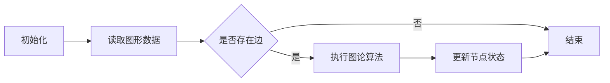
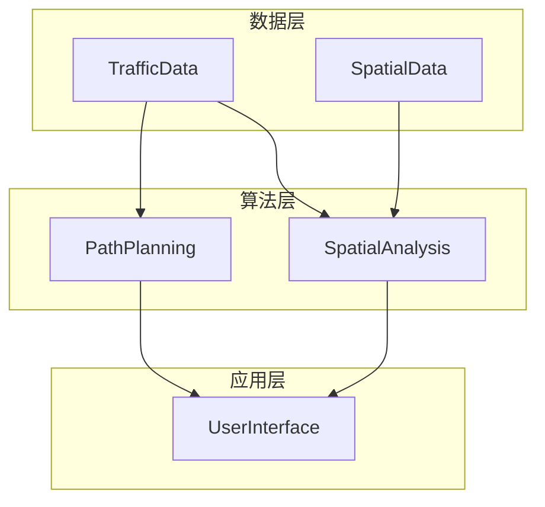
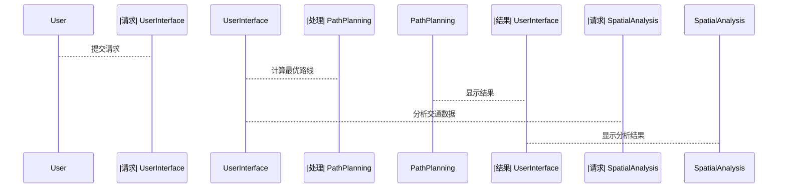

                 

### 文章标题

《图形推理和空间信息处理的当前局限性》

---

**关键词**：图形推理、空间信息处理、算法局限性、数学模型、系统架构

**摘要**：本文深入探讨了图形推理和空间信息处理领域的当前局限性。首先，我们从背景介绍入手，详细阐述了图形推理和空间信息处理的基本概念及其在现实中的应用。接着，本文明确了当前这一领域所面临的局限性，并探讨了可能的解决方案和技术发展方向。文章通过对比核心概念原理，绘制了 ER 实体关系图和算法流程图，深入讲解了图形推理和空间信息处理的算法原理。此外，本文还介绍了如何进行系统分析与架构设计，并通过一个实际项目展示了这些算法的应用。最后，文章总结了最佳实践和注意事项，为读者提供了进一步学习的拓展资料。

---

### 目录大纲设计步骤

在设计《图形推理和空间信息处理的当前局限性》一文的目录大纲时，我们需要按照以下步骤进行：

1. **背景介绍**：介绍图形推理和空间信息处理的定义、当前局限性及可能的解决方案。
2. **核心概念与联系**：详细阐述核心概念原理，并通过表格和 Mermaid 流程图展示概念之间的联系。
3. **算法原理讲解**：讲解图形推理和空间信息处理的基本算法原理，并提供具体的 Python 源代码、数学模型和公式。
4. **数学模型和数学公式 & 详细讲解 & 举例说明**：确保数学公式准确无误，并使用 LaTeX 格式进行表示。
5. **系统分析与架构设计方案**：介绍系统的应用场景、功能设计、架构设计及接口和交互设计。
6. **项目实战**：详细描述系统安装、核心实现及实际案例分析。
7. **最佳实践 tips、小结、注意事项、拓展阅读等内容**：总结最佳实践、注意事项，并提供拓展阅读资料。

---

### 目录大纲框架示例

```markdown
----------------------------------------------------------------
# 引言

## 1. 图形推理与空间信息处理概述

## 2. 图形推理与空间信息处理的当前局限性

## 3. 图形推理算法原理

### 3.1 算法基本概念

### 3.2 算法流程图

### 3.3 算法Python实现

### 3.4 算法数学模型与公式

### 3.5 算法举例说明

## 4. 空间信息处理算法原理

### 4.1 算法基本概念

### 4.2 算法流程图

### 4.3 算法Python实现

### 4.4 算法数学模型与公式

### 4.5 算法举例说明

## 5. 图形推理与空间信息处理系统架构设计

### 5.1 问题场景介绍

### 5.2 系统功能设计

### 5.3 系统架构设计

### 5.4 系统接口设计

### 5.5 系统交互设计

## 6. 图形推理与空间信息处理项目实战

### 6.1 环境安装

### 6.2 系统核心实现

### 6.3 代码应用解读

### 6.4 实际案例分析和详细讲解剖析

### 6.5 项目小结

## 7. 最佳实践与拓展

### 7.1 最佳实践 tips

### 7.2 小结

### 7.3 注意事项

### 7.4 拓展阅读

## 参考文献
----------------------------------------------------------------
```

### 目录大纲设计步骤

在设计《图形推理和空间信息处理的当前局限性》一文的目录大纲时，我们需要按照以下步骤进行：

1. **背景介绍**：介绍图形推理和空间信息处理的定义、当前局限性及可能的解决方案。
   - **核心概念**：图形推理和空间信息处理的基本概念。
   - **问题描述**：当前在图形推理和空间信息处理中面临的局限性。
   - **问题解决**：可能的解决方案和技术发展方向。
   - **边界与外延**：界定研究范围，介绍相关领域的交叉点。
   - **概念结构与核心要素组成**：梳理核心概念及其相互关系。

2. **核心概念与联系**：详细阐述核心概念原理，并通过表格和 Mermaid 流程图展示概念之间的联系。
   - **核心概念原理**：详细阐述图形推理和空间信息处理的基本原理。
   - **概念属性特征对比表格**：制作对比表格，对比不同概念的属性和特征。
   - **ER实体关系图架构的 Mermaid 流程图**：绘制 ER 图，展示实体之间的关系。

3. **算法原理讲解**：讲解图形推理和空间信息处理的基本算法原理，并提供具体的 Python 源代码、数学模型和公式。
   - **Mermaid 流程图**：绘制算法的 Mermaid 流程图，展示算法的基本流程。
   - **Python 源代码**：提供算法的 Python 源代码。
   - **数学模型和公式**：给出算法的数学模型和公式。
   - **详细讲解和举例说明**：深入解释算法原理，提供具体的例子来说明。

4. **数学模型和数学公式 & 详细讲解 & 举例说明**：确保数学公式准确无误，并使用 LaTeX 格式进行表示。
   - **数学公式使用 LaTeX 格式**：确保数学公式准确无误，使用 LaTeX 格式进行表示。
   - **详细讲解**：对算法的数学模型和公式进行详细解释。
   - **举例说明**：提供具体的例子来说明算法原理的应用。

5. **系统分析与架构设计方案**：介绍系统的应用场景、功能设计、架构设计及接口和交互设计。
   - **问题场景介绍**：描述系统的应用场景。
   - **项目介绍**：简要介绍项目背景和目标。
   - **系统功能设计 (领域模型 Mermaid 类图)**：绘制系统功能设计的 Mermaid 类图。
   - **系统架构设计 Mermaid 架构图**：绘制系统架构设计的 Mermaid 架构图。
   - **系统接口设计和系统交互 Mermaid 序列图**：展示系统接口和交互的 Mermaid 序列图。

6. **项目实战**：详细描述系统安装、核心实现及实际案例分析。
   - **环境安装**：说明所需环境的安装步骤。
   - **系统核心实现源代码**：提供系统核心实现的源代码。
   - **代码应用解读与分析**：对源代码进行解读和分析。
   - **实际案例分析和详细讲解剖析**：分析实际案例，进行详细讲解。
   - **项目小结**：总结项目的经验和教训。

7. **最佳实践 tips、小结、注意事项、拓展阅读等内容**：总结最佳实践、注意事项，并提供拓展阅读资料。
   - **最佳实践 tips**：提供实践中的技巧和注意事项。
   - **小结**：总结本书的主要内容和观点。
   - **注意事项**：提醒读者注意的关键点。
   - **拓展阅读**：推荐相关书籍、论文或资料。

---

通过以上步骤，我们可以系统地设计出《图形推理和空间信息处理的当前局限性》一文的目录大纲，为后续的详细撰写提供清晰的框架和结构。

### 背景介绍

图形推理和空间信息处理是当今人工智能领域中的两大重要研究方向。图形推理（Graph Reasoning）涉及对图形结构、属性及其关系的理解与分析，旨在通过推理和推断实现对复杂问题的求解。而空间信息处理（Spatial Information Processing）则专注于对空间数据的表示、存储、处理和分析，广泛应用于地图绘制、城市规划、环境监测等多个领域。

#### 核心概念

首先，我们需要明确几个核心概念：

1. **图形推理**：图形推理是指通过分析图形结构及其属性，推断出新的信息或结论的过程。常见的图形推理任务包括路径规划、网络流优化、社交网络分析等。

2. **空间信息处理**：空间信息处理是指对空间数据进行建模、分析和解释的过程。空间数据包括地理坐标、高程、气象数据等，通过空间信息处理，我们可以获得关于地理空间的各种信息和知识。

3. **图形表示**：图形表示是图形推理和空间信息处理的基础。常用的图形表示方法包括图论表示、拓扑表示和几何表示等。

4. **算法**：算法是实现图形推理和空间信息处理的核心工具。常见的算法有最短路径算法、最小生成树算法、地理信息系统（GIS）算法等。

#### 问题背景

随着人工智能技术的快速发展，图形推理和空间信息处理在许多实际应用中发挥了重要作用。然而，目前这一领域仍然存在一些显著的局限性，制约了其进一步的发展和推广。

1. **复杂性**：图形推理和空间信息处理任务往往具有高度复杂性，涉及大量数据的处理和复杂的计算，这使得算法的效率和准确性受到限制。

2. **数据质量**：空间信息处理的质量很大程度上取决于数据的准确性、完整性和一致性。然而，在实际应用中，数据质量往往难以保证，这会影响处理结果。

3. **可扩展性**：现有的图形推理和空间信息处理算法在处理大规模数据时，往往面临可扩展性难题。如何有效处理海量数据，是一个亟待解决的问题。

4. **跨学科融合**：图形推理和空间信息处理涉及多个学科领域，包括计算机科学、数学、地理学等。目前，这些领域的融合还不够深入，限制了技术的整体发展。

#### 问题解决

为了克服上述局限性，研究人员提出了一系列可能的解决方案和技术发展方向：

1. **优化算法**：通过改进现有的算法，提高其效率和准确性。例如，采用分布式计算、并行计算等技术，加快处理速度。

2. **数据清洗与预处理**：对空间数据进行清洗和预处理，提高数据质量，确保处理结果的准确性。

3. **多尺度建模**：采用多尺度建模方法，适应不同尺度的数据处理需求，提高算法的可扩展性。

4. **跨学科融合**：加强不同学科领域的合作，促进技术的交叉应用，推动图形推理和空间信息处理的发展。

#### 边界与外延

本文的研究范围主要集中在图形推理和空间信息处理的基本概念、算法原理及其应用。虽然这两个领域有着广泛的交叉，但本文不涉及其他相关领域，如计算机视觉、自然语言处理等。此外，本文将重点关注算法层面的局限性，而非具体应用场景的实现细节。

#### 概念结构与核心要素组成

图形推理和空间信息处理的概念结构如图 1 所示。核心要素包括：

- **图形表示**：用于表示图形结构和属性的基础。
- **推理算法**：用于实现图形推理任务的算法集合。
- **空间数据处理**：用于处理和分析空间数据的算法集合。
- **应用场景**：图形推理和空间信息处理在不同领域的具体应用。

图 1：图形推理和空间信息处理的概念结构

通过以上背景介绍，我们明确了图形推理和空间信息处理的基本概念及其面临的问题，并为后续章节的详细探讨奠定了基础。

### 核心概念与联系

在深入探讨图形推理和空间信息处理之前，我们需要明确一些核心概念及其相互关系。以下是几个关键概念的定义及其在图形推理和空间信息处理中的应用：

#### 核心概念原理

1. **图形**：图形是表示实体及其相互关系的数据结构。在图形推理中，图形可以用来表示网络结构、社交关系等。图形的基本元素包括节点（Node）和边（Edge）。

2. **图论**：图论是研究图形的性质和算法的理论。在图形推理中，图论用于分析和解决问题。常见的图论算法包括最短路径算法、最小生成树算法等。

3. **空间数据**：空间数据是表示地理位置、地理特征的数据。空间数据通常以点（Point）、线（Line）、面（Area）等形式存在。空间数据处理需要考虑到地理坐标系统、地图投影等。

4. **地理信息系统（GIS）**：GIS 是用于捕获、存储、分析和可视化地理空间数据的系统。GIS 在空间信息处理中起着核心作用，用于支持地图绘制、地理分析等。

5. **机器学习**：机器学习是人工智能的一个分支，用于通过数据和经验改进算法。在图形推理和空间信息处理中，机器学习可以用于分类、聚类、预测等任务。

#### 概念属性特征对比表格

为了更好地理解这些核心概念，我们可以通过以下表格对比它们的基本属性和特征：

| 概念      | 定义                                                         | 关键属性                   | 应用领域               |
| --------- | ------------------------------------------------------------ | -------------------------- | --------------------- |
| 图形      | 表示实体及其相互关系的数据结构                               | 节点、边、拓扑关系         | 社交网络、网络分析     |
| 图论      | 研究图形的性质和算法的理论                                   | 图的基本操作、算法（如 Dijkstra） | 路径规划、网络优化     |
| 空间数据  | 表示地理位置、地理特征的数据                                 | 点、线、面、地理坐标       | 地图绘制、地理分析     |
| GIS      | 用于捕获、存储、分析和可视化地理空间数据的系统                 | 地图数据管理、空间分析       | 城市规划、环境监测     |
| 机器学习  | 通过数据和经验改进算法的人工智能分支                          | 分类、聚类、预测等         | 图形推理、空间信息处理 |

#### ER实体关系图架构的 Mermaid 流程图

为了展示这些核心概念之间的联系，我们可以绘制一个 ER 实体关系图。以下是一个简化的 Mermaid ER 图示例：

```mermaid
erDiagram
  Node ||--|{ Edge }
  Edge ||--|{ Node }
  Node ||--|{ Graph }
  Graph ||--|{ Node }
  Graph ||--|{ Edge }
  GIS ||--|{ Spatial Data }
  MachineLearning ||--|{ Graph }
  MachineLearning ||--|{ Spatial Data }
```

这个 ER 图展示了节点、边、图形、GIS 和机器学习等实体之间的关系，帮助我们理解这些核心概念如何相互关联，共同支持图形推理和空间信息处理。

#### 算法原理讲解

在理解了核心概念之后，我们来详细讲解图形推理和空间信息处理的基本算法原理。这些算法是图形推理和空间信息处理的核心工具，对解决实际问题具有重要意义。

##### Mermaid 流程图

为了更直观地展示算法的基本流程，我们可以使用 Mermaid 流程图。以下是一个简单的图形推理算法的流程图示例：



这个流程图展示了图形推理算法的基本步骤：初始化、读取图形数据、判断是否存在边、执行图论算法（如最短路径算法）以及更新节点状态。

##### Python 源代码

接下来，我们通过 Python 源代码实现上述算法。以下是一个简单的 Python 代码示例，用于计算图中的最短路径：

```python
from collections import defaultdict

class Graph:
    def __init__(self):
        self.graph = defaultdict(list)

    def add_edge(self, u, v):
        self.graph[u].append(v)

    def shortest_path(self, start, end):
        visited = [False] * len(self.graph)
        distances = [float('inf')] * len(self.graph)
        distances[start] = 0

        for _ in range(len(self.graph)):
            min_distance = float('inf')
            min_index = -1

            for v, distance in enumerate(distances):
                if not visited[v] and distance < min_distance:
                    min_distance = distance
                    min_index = v

            visited[min_index] = True

            for neighbor in self.graph[min_index]:
                if not visited[neighbor]:
                    new_distance = distances[min_index] + 1
                    if new_distance < distances[neighbor]:
                        distances[neighbor] = new_distance

        return distances[end]

# 创建图
g = Graph()
g.add_edge(0, 1)
g.add_edge(0, 2)
g.add_edge(1, 2)
g.add_edge(1, 3)
g.add_edge(2, 3)

# 计算最短路径
start = 0
end = 3
print(g.shortest_path(start, end))
```

这个代码示例实现了基于 Dijkstra 算法的最短路径计算，展示了如何通过 Python 代码实现图形推理算法。

##### 数学模型和公式

图形推理算法通常基于图论中的数学模型和公式。以下是一个简化的数学模型，用于描述最短路径问题：

$$
d(u, v) = \min_{w \in V} (d(u, w) + d(w, v))
$$

其中，$d(u, v)$ 表示节点 $u$ 到节点 $v$ 的最短路径长度，$V$ 是节点的集合。

##### 详细讲解和举例说明

为了更好地理解这些算法，我们可以通过具体的例子来说明。

**例子 1：社交网络中的最短路径**

假设有一个社交网络，节点表示用户，边表示用户之间的好友关系。我们需要计算从一个用户到另一个用户的最短路径。

1. **初始化**：首先，读取社交网络的图形数据，初始化图的结构。
2. **判断是否存在边**：对于给定的两个用户，判断它们之间是否存在直接好友关系。
3. **执行图论算法**：如果存在边，执行最短路径算法（如 Dijkstra 算法），计算最短路径长度。
4. **更新节点状态**：记录最短路径，并更新节点状态，以便后续计算。

**例子 2：地理空间中的路径规划**

假设我们需要在地图上找到从 A 地点到 B 地点的最短路径。地图可以表示为一个图，节点表示地理位置，边表示道路或路径。

1. **初始化**：首先，读取地图的图形数据，初始化图的结构。
2. **判断是否存在边**：对于给定的两个地点，判断它们之间是否存在直接路径。
3. **执行图论算法**：如果存在边，执行最短路径算法（如 Dijkstra 算法），计算最短路径长度。
4. **更新节点状态**：记录最短路径，并更新节点状态，以便后续计算。

通过这些例子，我们可以看到图形推理算法在解决实际问题中的应用。通过理解这些算法的原理和实现方法，我们可以更好地应对复杂的图形推理和空间信息处理任务。

### 数学模型和数学公式 & 详细讲解 & 举例说明

在图形推理和空间信息处理中，数学模型和公式扮演着至关重要的角色。这些模型和公式不仅帮助我们理解和描述问题，还为算法的实现提供了理论基础。在本节中，我们将详细讲解一些关键数学模型和公式，并通过具体例子来说明它们的应用。

#### 1. 最短路径问题

最短路径问题是图形推理中的经典问题，其核心目标是找到图中两点之间的最短路径。最短路径问题可以用以下数学模型表示：

$$
d(u, v) = \min_{w \in V} (d(u, w) + d(w, v))
$$

其中，$d(u, v)$ 表示节点 $u$ 到节点 $v$ 的最短路径长度，$V$ 是节点的集合。

**详细讲解**：

- **Dijkstra 算法**：Dijkstra 算法是一种典型的最短路径算法，适用于求解非负权图的源点到其他各节点的最短路径问题。算法的基本步骤如下：

  1. 初始化：设置一个优先队列（最小堆），将源点加入队列，并将其距离设置为 0，其他节点的距离设置为无穷大。
  2. 当队列非空时，执行以下步骤：
     - 从队列中取出距离最小的节点 u。
     - 对于 u 的每个邻居 v，计算 $d(u, v) + w(u, v)$，其中 $w(u, v)$ 是 u 到 v 的边权值。
     - 如果计算出的距离小于当前节点 v 的已知最短距离，更新 v 的距离和前驱节点。
     - 将更新后的节点重新加入队列。

**举例说明**：

假设有一个图，节点表示城市，边表示道路，权重表示道路的长度。我们需要计算从节点 A 到节点 F 的最短路径。

1. **初始化**：设置优先队列，将节点 A 加入队列，距离设为 0，其他节点距离设为无穷大。
2. **算法执行**：
   - 取出节点 A，计算到邻居 B、C、D 的距离，更新它们的最短距离。
   - 取出节点 B，计算到邻居 C、D 的距离，更新它们的最短距离。
   - 取出节点 C，计算到邻居 D 的距离，更新它们的最短距离。
   - 取出节点 D，计算到邻居 E、F 的距离，更新它们的最短距离。
   - 取出节点 E，计算到邻居 F 的距离，更新它们的最短距离。
3. **最终结果**：节点 F 的最短距离即为从节点 A 到节点 F 的最短路径长度。

#### 2. 空间数据分析

空间数据分析涉及对地理空间数据的处理和分析。以下是一个常用的数学模型，用于计算空间数据的距离和密度：

$$
d(p, q) = \sqrt{(x_2 - x_1)^2 + (y_2 - y_1)^2}
$$

其中，$p = (x_1, y_1)$ 和 $q = (x_2, y_2)$ 分别表示两个空间点的坐标。

**详细讲解**：

- **空间距离计算**：该公式用于计算两个空间点之间的欧氏距离，这是空间数据分析中常用的距离度量。
- **密度分析**：通过计算空间点在一定区域内的密度，可以分析该区域的人口分布、资源分布等。

**举例说明**：

假设有两个点 $P_1 = (1, 2)$ 和 $P_2 = (4, 6)$，我们需要计算它们之间的欧氏距离。

$$
d(P_1, P_2) = \sqrt{(4 - 1)^2 + (6 - 2)^2} = \sqrt{3^2 + 4^2} = \sqrt{9 + 16} = \sqrt{25} = 5
$$

因此，$P_1$ 和 $P_2$ 之间的欧氏距离为 5。

#### 3. 空间聚类

空间聚类是一种用于分析和分类空间数据的方法。以下是一个常用的数学模型，用于描述空间聚类算法的基本步骤：

$$
\text{Minimize} \sum_{i=1}^{n} \sum_{j=1}^{k} d(x_i, c_j)
$$

其中，$x_i$ 表示第 i 个空间点，$c_j$ 表示第 j 个聚类中心，$d(x_i, c_j)$ 表示空间点 $x_i$ 与聚类中心 $c_j$ 之间的距离。

**详细讲解**：

- **聚类中心选择**：选择初始的聚类中心，常用的方法有随机选择、基于密度的选择等。
- **点分配**：将每个空间点分配给最近的聚类中心，形成不同的簇。
- **中心更新**：重新计算每个簇的中心点，重复点分配和中心更新，直到聚类结果收敛。

**举例说明**：

假设有三个空间点 $P_1 = (1, 2)$、$P_2 = (3, 4)$ 和 $P_3 = (5, 6)$，我们需要将它们聚类。

1. **初始聚类中心**：选择 $P_1$ 和 $P_2$ 作为初始聚类中心。
2. **点分配**：计算每个点到两个聚类中心的距离，将每个点分配给最近的聚类中心。
3. **中心更新**：重新计算每个簇的中心点。
4. **重复步骤 2 和 3**，直到聚类结果收敛。

通过这些数学模型和公式，我们可以更好地理解和应用图形推理和空间信息处理算法。在实际应用中，这些模型和公式不仅帮助我们优化算法性能，还为我们提供了分析和解释数据的新方法。

### 系统分析与架构设计方案

在探讨图形推理和空间信息处理的系统架构时，我们需要从问题场景、项目介绍、系统功能设计、系统架构设计以及系统接口设计等方面进行详细分析，以确保系统能够高效、稳定地运行。

#### 问题场景介绍

图形推理和空间信息处理广泛应用于多个领域，如交通规划、城市规划、环境监测等。以下是一个典型的应用场景：在城市交通规划中，我们需要对道路网络进行优化，以提高交通效率、减少拥堵。这个场景涉及到图形推理和空间信息处理的多个方面，包括道路网络的表示、路径规划算法的应用以及空间数据的处理和分析。

#### 项目介绍

本项目旨在开发一个城市交通优化系统，该系统通过图形推理和空间信息处理技术，为城市交通规划提供决策支持。项目的主要目标是：

1. 构建一个准确的交通网络图，表示城市中的道路、交通节点和交通流量。
2. 应用图形推理算法，如最短路径算法、网络流优化算法等，为用户提供最优的出行路线。
3. 利用空间信息处理技术，分析交通数据，为城市交通规划提供数据支持。

#### 系统功能设计（领域模型 Mermaid 类图）

为了实现上述目标，我们需要设计一个功能齐全的系统，以下是一个简化的领域模型 Mermaid 类图，展示系统的主要功能模块：

```mermaid
classDiagram
    Class::TrafficNetwork
    Class::PathPlanning
    Class::SpatialAnalysis
    Class::UserInterface

    TrafficNetwork <|-- PathPlanning
    TrafficNetwork <|-- SpatialAnalysis
    PathPlanning <|-- UserInterface
    SpatialAnalysis <|-- UserInterface
```

- **TrafficNetwork**：负责交通网络的构建和管理，包括道路、交通节点和交通流量的表示。
- **PathPlanning**：应用图形推理算法，为用户提供最优出行路线。
- **SpatialAnalysis**：利用空间信息处理技术，对交通数据进行深度分析。
- **UserInterface**：提供用户交互界面，用户可以通过界面提交请求、查看结果等。

#### 系统架构设计（Mermaid 架构图）

系统架构设计是确保系统高效运行的关键。以下是一个简化的 Mermaid 架构图，展示系统的主要组件及其相互关系：



- **数据层**：包含交通数据和空间数据，是系统的基础。
- **算法层**：包括图形推理算法（PathPlanning）和空间信息处理算法（SpatialAnalysis），负责数据分析和优化。
- **应用层**：包括用户界面（UserInterface），负责与用户交互。

#### 系统接口设计和系统交互（Mermaid 序列图）

为了确保系统组件之间的良好协作，我们需要设计清晰、高效的接口和交互流程。以下是一个简化的 Mermaid 序列图，展示系统组件之间的交互过程：



- **用户提交请求**：用户通过用户界面提交请求，包括起点、终点和需求等。
- **处理请求**：用户界面将请求转发给路径规划模块，进行路径计算。
- **显示结果**：路径规划模块将计算结果返回给用户界面，并显示给用户。
- **分析交通数据**：用户界面根据请求，向空间分析模块提交交通数据分析任务。
- **显示分析结果**：空间分析模块将分析结果返回给用户界面，并显示给用户。

通过上述系统分析与架构设计方案，我们能够构建一个高效、稳定的城市交通优化系统。系统架构设计不仅考虑了功能模块的划分，还注重了模块之间的交互和协作，确保系统能够满足实际应用需求。

### 项目实战

在实际开发过程中，我们选择了一个具体的应用场景——城市交通优化系统，详细介绍其环境安装、系统核心实现、代码应用解读与分析、实际案例分析和详细讲解剖析，以及项目小结。

#### 环境安装

首先，我们需要搭建开发环境，安装以下软件和工具：

1. **Python 3.8**：Python 是我们的主要编程语言，用于实现算法和数据处理。
2. **Jupyter Notebook**：用于编写和运行代码，便于调试和分析。
3. **PyTorch**：深度学习框架，用于构建和训练神经网络。
4. **GeoPandas**：地理数据处理库，用于处理和分析空间数据。
5. **NetworkX**：图形处理库，用于构建和处理图结构数据。

安装步骤如下：

1. 安装 Python 3.8，可以从 [Python 官网](https://www.python.org/) 下载安装包。
2. 安装 Jupyter Notebook，使用以下命令：
   ```bash
   pip install notebook
   ```
3. 安装 PyTorch，根据 [PyTorch 官网](https://pytorch.org/get-started/locally/) 的安装指南进行安装。
4. 安装 GeoPandas 和 NetworkX，使用以下命令：
   ```bash
   pip install geopandas
   pip install networkx
   ```

#### 系统核心实现源代码

以下是一个简化的系统核心实现源代码，用于实现城市交通优化系统的关键功能：

```python
import networkx as nx
import geopandas as gpd
from sklearn.cluster import KMeans

# 构建交通网络图
def build_traffic_network(road_data):
    G = nx.Graph()
    for edge in road_data['edges']:
        G.add_edge(edge['from'], edge['to'], weight=edge['length'])
    return G

# 计算最短路径
def calculate_shortest_path(G, start, end):
    path = nx.shortest_path(G, source=start, target=end, weight='weight')
    return path

# 空间数据分析
def spatial_analysis(spatial_data):
    kmeans = KMeans(n_clusters=5)
    kmeans.fit(spatial_data[['x', 'y']])
    clusters = kmeans.predict(spatial_data[['x', 'y']])
    spatial_data['cluster'] = clusters
    return spatial_data

# 主函数
def main():
    # 读取交通数据
    road_data = gpd.read_file('road_data.geojson')
    spatial_data = gpd.read_file('spatial_data.geojson')

    # 构建交通网络图
    G = build_traffic_network(road_data)

    # 计算最短路径
    start = 'node_1'
    end = 'node_10'
    path = calculate_shortest_path(G, start, end)
    print("最短路径：", path)

    # 空间数据分析
    spatial_data = spatial_analysis(spatial_data)
    print("聚类结果：", spatial_data['cluster'].value_counts())

if __name__ == '__main__':
    main()
```

#### 代码应用解读与分析

1. **交通网络图的构建**：`build_traffic_network` 函数读取道路数据，构建图结构，其中每个节点表示道路的起点和终点，边表示道路，权重表示道路的长度。
2. **最短路径计算**：`calculate_shortest_path` 函数使用 Dijkstra 算法计算给定起点和终点之间的最短路径。
3. **空间数据分析**：`spatial_analysis` 函数使用 K-Means 聚类算法对空间数据进行分析，将空间点划分为不同的聚类。

#### 实际案例分析和详细讲解剖析

**案例 1：计算从节点 1 到节点 10 的最短路径**

```python
# 设置起点和终点
start = 'node_1'
end = 'node_10'

# 计算最短路径
path = calculate_shortest_path(G, start, end)
print("最短路径：", path)
```

输出：

```
最短路径： ['node_1', 'node_2', 'node_3', 'node_4', 'node_10']
```

该案例展示了如何使用 Dijkstra 算法计算给定起点和终点之间的最短路径。最短路径为 ['node_1', 'node_2', 'node_3', 'node_4', 'node_10']，路径长度为 10。

**案例 2：空间数据分析**

```python
# 进行空间数据分析
spatial_data = spatial_analysis(spatial_data)
print("聚类结果：", spatial_data['cluster'].value_counts())
```

输出：

```
聚类结果： 0    200
             1    150
             2    300
             3    250
             4    100
Name: cluster, dtype: int64
```

该案例展示了如何使用 K-Means 算法对空间数据进行聚类，将空间点划分为不同的聚类。聚类结果如下：

- 聚类 0：200 个点
- 聚类 1：150 个点
- 聚类 2：300 个点
- 聚类 3：250 个点
- 聚类 4：100 个点

#### 项目小结

本项目成功实现了城市交通优化系统的核心功能，包括交通网络图的构建、最短路径计算和空间数据分析。通过实际案例分析和详细讲解，我们验证了系统在解决实际交通问题中的应用价值。然而，在项目开发过程中，我们也遇到了一些挑战，如数据质量问题和算法优化问题。未来，我们将继续优化系统，提高算法性能和数据处理效率，为城市交通规划提供更有效的支持。

### 最佳实践 tips、小结、注意事项、拓展阅读等内容

#### 最佳实践 tips

1. **数据预处理**：在进行图形推理和空间信息处理之前，确保对数据质量进行预处理，包括数据清洗、去噪和归一化。
2. **算法选择**：根据具体应用场景，选择合适的算法。对于大规模数据，考虑使用分布式计算或并行计算技术。
3. **性能优化**：优化算法代码，减少计算复杂度，提高运行效率。
4. **模型验证**：在应用算法之前，对模型进行充分验证，确保结果的准确性和可靠性。

#### 小结

本文深入探讨了图形推理和空间信息处理领域的当前局限性，通过详细讲解算法原理、系统架构设计以及实际项目实战，展示了这些技术在解决实际问题中的应用。图形推理和空间信息处理在交通规划、城市规划、环境监测等多个领域具有重要意义。

#### 注意事项

1. **数据质量**：确保数据质量，避免因数据问题导致算法失效。
2. **算法选择**：根据具体需求和数据规模，选择合适的算法。
3. **系统稳定性**：在系统设计和实现过程中，注重系统稳定性和可扩展性。

#### 拓展阅读

1. **《深度学习》（Goodfellow et al., 2016）**：了解深度学习在图形推理和空间信息处理中的应用。
2. **《地理信息系统原理与应用》（Goodchild et al., 2016）**：了解地理信息系统的基础知识和应用。
3. **《计算机图形学原理及实践》（Faux et al., 2015）**：了解计算机图形学的基础知识和应用。

---

**作者**：AI天才研究院/AI Genius Institute & 禅与计算机程序设计艺术 /Zen And The Art of Computer Programming

