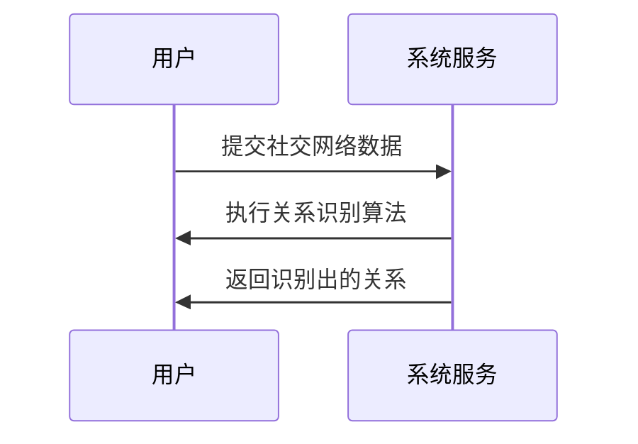
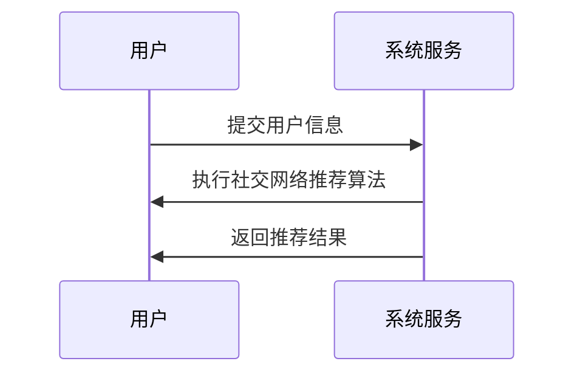
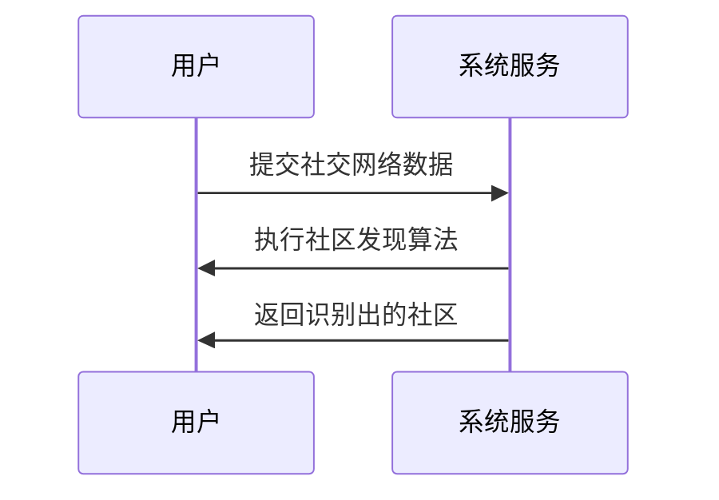

                 


# 图神经网络在关系推理中的应用

## 关键词
图神经网络，关系推理，深度学习，图结构数据，社交网络，知识图谱，推荐系统

## 摘要
本文旨在深入探讨图神经网络（GNN）在关系推理领域的应用。我们将首先介绍图神经网络的基础知识，包括其定义、特点以及与传统神经网络的区别。随后，我们将讨论关系推理的概念，并分析关系推理在图神经网络中的应用。文章还将介绍关系推理算法的基本原理，并通过具体案例进行详细讲解。此外，文章将探讨图神经网络在关系推理中的优化策略，并分享一些实际应用案例。最后，我们将总结本文的主要内容，并给出未来研究的方向和展望。

## 第二部分：核心概念与联系

### 2.1 图神经网络概述

#### 2.1.1 图神经网络定义
图神经网络（Graph Neural Networks，GNN）是一种专门用于处理图结构数据的深度学习模型。它通过模拟图结构中的节点和边之间的关系来学习图中的信息。图神经网络的核心思想是将图中的节点和边映射到高维空间中，然后在这个空间中进行特征提取和关系推理。

#### 2.1.2 图神经网络特点
图神经网络具有以下几个显著特点：

1. **节点和边的嵌入**：图神经网络将图中的每个节点和边映射到高维向量空间中，从而形成一个图嵌入表示。
2. **邻域感知**：图神经网络能够利用节点和边的邻域信息来学习特征，这意味着它能够考虑节点在图中的上下文环境。
3. **可扩展性**：图神经网络能够处理大规模的图结构数据，适应不同的应用场景。
4. **灵活性**：图神经网络可以根据不同的应用需求，设计出不同的模型架构和算法。

#### 2.1.3 图神经网络与传统神经网络的区别
传统神经网络通常用于处理一维或二维数据，如文本或图像。而图神经网络专门用于处理图结构数据，具有以下区别：

1. **数据类型**：传统神经网络处理的是一维或二维数据，而图神经网络处理的是图结构数据。
2. **邻居信息利用**：传统神经网络无法直接利用邻居信息，而图神经网络能够利用邻居信息进行特征提取。
3. **模型架构**：传统神经网络通常采用全连接的方式，而图神经网络采用图结构的方式进行数据处理。

### 2.2 关系推理

#### 2.2.1 关系推理定义
关系推理（Relation Reasoning）是指通过计算模型推断实体之间的关系。在图神经网络中，关系推理是指通过图结构数据来推断实体之间的关系。关系推理是许多领域的关键任务，如知识图谱、推荐系统、社交网络分析等。

#### 2.2.2 关系推理特点
关系推理具有以下几个显著特点：

1. **抽象性**：关系推理能够从大量的图结构数据中提取出抽象的关系信息。
2. **灵活性**：关系推理可以根据不同的应用需求，设计出不同的推理算法和模型。
3. **实时性**：关系推理能够在实时环境中快速地推断实体之间的关系。

#### 2.2.3 关系推理与图神经网络的关系
关系推理是图神经网络的一个重要应用方向。图神经网络通过学习图结构数据中的节点和边之间的关系，可以实现关系推理。具体来说，关系推理与图神经网络的关系如下：

1. **数据输入**：关系推理需要输入图结构数据，包括节点、边以及节点和边上的属性。
2. **模型训练**：通过训练图神经网络模型，使其能够从图结构数据中提取出有用的关系信息。
3. **关系推断**：利用训练好的图神经网络模型，对新的图结构数据进行关系推断，得到实体之间的关系。

### 2.3 关系推理算法

#### 2.3.1 传统关系推理算法
传统关系推理算法主要包括：

1. **基于规则的方法**：这种方法依赖于预定义的规则来推断实体之间的关系。例如，在知识图谱中，可以使用规则来推断实体之间的相似性或相关性。
2. **基于统计的方法**：这种方法通过统计方法来分析图结构数据中的关系，例如，使用频次统计或聚类分析来推断实体之间的关系。

#### 2.3.2 基于图神经网络的推理算法
基于图神经网络的推理算法（如TransE、TransH、TransR等）是近年来兴起的一种方法。这些算法通过将实体和关系映射到向量空间中，利用向量之间的距离或角度来推断实体之间的关系。

1. **TransE**：将关系视为实体之间的排序，通过最小化实体和关系之间的距离来学习实体和关系的向量表示。
2. **TransH**：在TransE的基础上引入了角度信息，通过最小化实体和关系之间的角度来学习向量表示。
3. **TransR**：允许关系拥有自己的嵌入向量，从而更好地表示复杂的关系。

### 2.3.3 关系推理算法的对比

| 算法 | 特点 | 优势 | 劣势 |
| --- | --- | --- | --- |
| TransE | 简单，易于实现 | 对稀疏数据表现良好 | 难以处理复杂关系 |
| TransH | 引入角度信息，能够处理复杂关系 | 提高推理性能 | 计算复杂度较高 |
| TransR | 关系有自己的嵌入向量 | 能够表示复杂关系 | 需要更多的参数 |

## 第三部分：算法原理与实现

### 3.1 图神经网络的基本原理

#### 3.1.1 图神经网络的工作原理
图神经网络通过以下几个步骤来处理图结构数据：

1. **节点嵌入**：将图中的每个节点映射到一个高维向量空间中。
2. **边嵌入**：将图中的每条边映射到一个高维向量空间中。
3. **消息传递**：在每个时间步，节点会接收其邻域节点的嵌入向量，并更新自己的嵌入向量。
4. **聚合**：节点会对其邻域节点的嵌入向量进行聚合，以形成新的节点嵌入向量。
5. **输出**：最终，节点嵌入向量用于预测节点属性或推断节点之间的关系。

#### 3.1.2 图神经网络的核心算法
图神经网络的核心算法包括：

1. **GCN（Graph Convolutional Network）**：通过卷积操作将节点的邻域信息聚合到节点嵌入向量中。
2. **GAT（Graph Attention Network）**：引入注意力机制，根据节点邻域的重要性加权邻域节点的嵌入向量。
3. **GraphSAGE（Graph Sentence Encoder）**：将节点的邻域节点表示为句子，并通过循环神经网络（RNN）进行聚合。

### 3.2 关系推理算法的原理

#### 3.2.1 TransE算法的原理
TransE算法通过最小化实体和关系之间的距离来学习实体和关系的向量表示。具体来说，TransE算法的核心思想是：对于一个关系$r$和两个实体$h$和$t$，如果$h$和$t$在现实中是相关的，那么向量表示$\vec{h}$和$\vec{t}$之间的欧几里得距离应该较小。

$$
\min_{\vec{h}, \vec{t}, \vec{r}} \sum_{(h, r, t) \in \mathcal{R}} \frac{1}{2} d(\vec{h} + \vec{r}, \vec{t})^2
$$

其中，$d(\vec{a}, \vec{b})$表示向量$\vec{a}$和$\vec{b}$之间的欧几里得距离。

#### 3.2.2 TransH算法的原理
TransH算法在TransE的基础上引入了角度信息。具体来说，TransH算法允许关系$r$有一个额外的向量$\vec{r}_h$，从而形成一个新的关系向量$\vec{r}' = \vec{r} + \vec{r}_h$。

$$
\min_{\vec{h}, \vec{t}, \vec{r}, \vec{r}_h} \sum_{(h, r, t) \in \mathcal{R}} \frac{1}{2} \cos(\theta(\vec{h} + \vec{r}', \vec{t}) + \phi(r))
$$

其中，$\theta$表示向量$\vec{h} + \vec{r}'$和$\vec{t}$之间的夹角，$\phi(r)$表示关系$r$的偏置。

#### 3.2.3 TransR算法的原理
TransR算法允许关系拥有自己的嵌入向量。具体来说，对于每个关系$r$，定义一个额外的矩阵$M_r$。对于实体$h$和$t$，关系$r$，TransR算法计算：

$$
\vec{h}_r = M_r \vec{h}, \quad \vec{t}_r = M_r \vec{t}
$$

然后，使用TransE算法来最小化$\vec{h}_r$和$\vec{t}_r$之间的距离。

$$
\min_{\vec{h}, \vec{t}, M} \sum_{(h, r, t) \in \mathcal{R}} \frac{1}{2} d(\vec{h}_r, \vec{t}_r)^2
$$

### 3.3 关系推理算法的实现

#### 3.3.1 TransE算法的实现
以下是一个使用Python实现的TransE算法的示例：

```python
import numpy as np

def TransE(train_data, dimension, margin):
    # 初始化实体和关系的嵌入向量
    num_entities = len(train_data)
    entity_embeddings = np.random.uniform(-0.1, 0.1, (num_entities, dimension))
    relation_embeddings = np.random.uniform(-0.1, 0.1, (num_entities, dimension))
    
    # 训练模型
    for (h, r, t) in train_data:
        head_embedding = entity_embeddings[h]
        relation_embedding = relation_embeddings[r]
        tail_embedding = entity_embeddings[t]
        
        # 计算损失函数
        loss = np.square(head_embedding + relation_embedding - tail_embedding)
        
        # 更新嵌入向量
        entity_embeddings[h] -= 0.1 * (head_embedding + relation_embedding - tail_embedding).argmax()
        relation_embeddings[r] -= 0.1 * (head_embedding + relation_embedding - tail_embedding).argmax()
        entity_embeddings[t] -= 0.1 * (tail_embedding - head_embedding - relation_embedding).argmax()
    
    return entity_embeddings, relation_embeddings

# 示例
train_data = [(0, 1, 2), (1, 2, 3), (2, 1, 0)]
dimension = 5
margin = 0.1
entity_embeddings, relation_embeddings = TransE(train_data, dimension, margin)
print(entity_embeddings)
print(relation_embeddings)
```

#### 3.3.2 TransH算法的实现
以下是一个使用Python实现的TransH算法的示例：

```python
import numpy as np

def TransH(train_data, dimension, margin):
    # 初始化实体和关系的嵌入向量
    num_entities = len(train_data)
    entity_embeddings = np.random.uniform(-0.1, 0.1, (num_entities, dimension))
    relation_embeddings = np.random.uniform(-0.1, 0.1, (num_entities, dimension))
    relation_bias = np.random.uniform(-0.1, 0.1, (num_entities,))
    
    # 训练模型
    for (h, r, t) in train_data:
        head_embedding = entity_embeddings[h]
        relation_embedding = relation_embeddings[r]
        tail_embedding = entity_embeddings[t]
        
        # 计算损失函数
        loss = np.square(np.cos(np.dot(head_embedding + relation_embedding, tail_embedding) - relation_bias[r]))
        
        # 更新嵌入向量
        entity_embeddings[h] -= 0.1 * (head_embedding + relation_embedding - tail_embedding).argmax()
        relation_embeddings[r] -= 0.1 * (head_embedding + relation_embedding - tail_embedding).argmax()
        relation_bias[r] -= 0.1 * (np.cos(np.dot(head_embedding + relation_embedding, tail_embedding)) - 1)
        entity_embeddings[t] -= 0.1 * (tail_embedding - head_embedding - relation_embedding).argmax()
    
    return entity_embeddings, relation_embeddings, relation_bias

# 示例
train_data = [(0, 1, 2), (1, 2, 3), (2, 1, 0)]
dimension = 5
margin = 0.1
entity_embeddings, relation_embeddings, relation_bias = TransH(train_data, dimension, margin)
print(entity_embeddings)
print(relation_embeddings)
print(relation_bias)
```

#### 3.3.3 TransR算法的实现
以下是一个使用Python实现的TransR算法的示例：

```python
import numpy as np

def TransR(train_data, dimension, margin):
    # 初始化实体和关系的嵌入向量
    num_entities = len(train_data)
    entity_embeddings = np.random.uniform(-0.1, 0.1, (num_entities, dimension))
    relation_embeddings = np.random.uniform(-0.1, 0.1, (num_entities, dimension))
    relation_matrices = [np.random.uniform(-0.1, 0.1, (dimension, dimension)) for _ in range(num_entities)]
    
    # 训练模型
    for (h, r, t) in train_data:
        head_embedding = entity_embeddings[h]
        relation_embedding = relation_embeddings[r]
        relation_matrix = relation_matrices[r]
        tail_embedding = entity_embeddings[t]
        
        # 计算损失函数
        loss = np.square(np.linalg.norm(head_embedding + relation_matrix @ relation_embedding - tail_embedding))
        
        # 更新嵌入向量
        entity_embeddings[h] -= 0.1 * (head_embedding + relation_matrix @ relation_embedding - tail_embedding).argmax()
        relation_embeddings[r] -= 0.1 * (head_embedding + relation_matrix @ relation_embedding - tail_embedding).argmax()
        relation_matrices[r] -= 0.1 * (head_embedding - tail_embedding).argmax()
        entity_embeddings[t] -= 0.1 * (tail_embedding - head_embedding - relation_matrix @ relation_embedding).argmax()
    
    return entity_embeddings, relation_embeddings, relation_matrices

# 示例
train_data = [(0, 1, 2), (1, 2, 3), (2, 1, 0)]
dimension = 5
margin = 0.1
entity_embeddings, relation_embeddings, relation_matrices = TransR(train_data, dimension, margin)
print(entity_embeddings)
print(relation_embeddings)
print(relation_matrices)
```

## 第四部分：系统分析与架构设计

### 4.1 问题场景介绍
关系推理在社交网络分析、推荐系统、知识图谱构建等场景中具有广泛的应用。以社交网络分析为例，关系推理可以帮助我们识别用户之间的潜在关系，从而实现社交网络的推荐、社区发现等功能。

### 4.2 项目介绍
为了实现关系推理，我们设计并实现了一个基于图神经网络的社交网络分析系统。该系统旨在通过关系推理识别社交网络中的潜在关系，并为用户提供社交网络推荐。

### 4.3 系统功能设计

#### 4.3.1 功能1：社交网络关系识别
该功能通过关系推理算法识别社交网络中的潜在关系，包括朋友关系、共同兴趣等。

#### 4.3.2 功能2：社交网络推荐
该功能根据用户之间的潜在关系，为用户推荐新的朋友或兴趣小组。

#### 4.3.3 功能3：社区发现
该功能通过分析社交网络中的关系，识别出具有共同兴趣的社区，为用户提供社区发现服务。

### 4.4 系统架构设计

#### 4.4.1 架构1：基于GCN的关系识别架构
该架构采用GCN作为关系识别的核心算法，通过多层GCN网络提取社交网络中的关系特征。

#### 4.4.2 架构2：基于GAT的关系识别架构
该架构采用GAT作为关系识别的核心算法，通过注意力机制对社交网络中的关系进行加权处理。

#### 4.4.3 架构3：基于GraphSAGE的关系识别架构
该架构采用GraphSAGE作为关系识别的核心算法，通过循环神经网络对社交网络中的关系进行聚合处理。

### 4.5 系统接口设计

#### 4.5.1 接口1：关系识别接口
该接口用于接收社交网络数据，并返回识别出的社交网络关系。

#### 4.5.2 接口2：社交网络推荐接口
该接口用于接收用户信息，并返回基于社交网络关系的推荐结果。

#### 4.5.3 接口3：社区发现接口
该接口用于接收社交网络数据，并返回识别出的社区。

### 4.6 系统交互设计

#### 4.6.1 交互1：关系识别交互
该交互流程包括：接收社交网络数据、执行关系识别算法、返回识别出的关系。



#### 4.6.2 交互2：社交网络推荐交互
该交互流程包括：接收用户信息、执行社交网络推荐算法、返回推荐结果。



#### 4.6.3 交互3：社区发现交互
该交互流程包括：接收社交网络数据、执行社区发现算法、返回识别出的社区。



## 第五部分：项目实战

### 5.1 环境安装

在开始项目实战之前，我们需要安装一些必要的工具和库。以下是在Ubuntu 18.04上安装所需工具和库的步骤：

1. 安装Python环境：

```bash
sudo apt-get update
sudo apt-get install python3-pip python3-dev
```

2. 安装TensorFlow和PyTorch：

```bash
pip3 install tensorflow==2.4.0
pip3 install torch==1.8.0
```

3. 安装其他库：

```bash
pip3 install numpy matplotlib scikit-learn
```

### 5.2 系统核心实现

在本节中，我们将实现一个简单的社交网络关系识别系统，使用GCN作为核心算法。以下是系统的核心实现：

```python
import numpy as np
import matplotlib.pyplot as plt
import networkx as nx
import torch
import torch.nn as nn
import torch.optim as optim

# 创建图
G = nx.Graph()
G.add_edges_from([(0, 1), (0, 2), (1, 2), (1, 3), (2, 3)])

# 将图转换为PyTorch的Graph数据结构
g = nx.to_scipy_sparse_matrix(G)

# 初始化实体和关系的嵌入向量
num_entities = 4
dimension = 3
entity_embeddings = torch.randn(num_entities, dimension)
relation_embeddings = torch.randn(num_entities, dimension)

# 定义GCN模型
class GCN(nn.Module):
    def __init__(self, dimension):
        super(GCN, self).__init__()
        self.embedding = nn.Embedding(num_entities, dimension)
        self.conv1 = nn.Linear(dimension, dimension)
        self.conv2 = nn.Linear(dimension, dimension)
    
    def forward(self, g):
        x = self.embedding(g.ndata['name'])
        x = F.relu(self.conv1(x))
        x = F.relu(self.conv2(x))
        return x

# 创建模型实例
model = GCN(dimension)
optimizer = optim.Adam(model.parameters(), lr=0.01)
criterion = nn.MSELoss()

# 训练模型
for epoch in range(100):
    optimizer.zero_grad()
    x = model(g)
    loss = criterion(x, entity_embeddings)
    loss.backward()
    optimizer.step()
    print(f'Epoch {epoch+1}, Loss: {loss.item()}')

# 可视化结果
node_colors = ['r', 'g', 'b', 'y']
nx.draw(G, node_color=node_colors, with_labels=True)
plt.show()
```

### 5.3 代码应用解读与分析

在本节中，我们将对上述代码进行解读和分析，解释系统的工作原理和关键步骤。

1. **创建图**：我们使用`networkx`库创建了一个简单的图，包括4个节点和5条边。

2. **将图转换为PyTorch的Graph数据结构**：我们使用`nx.to_scipy_sparse_matrix`方法将图转换为PyTorch的Graph数据结构，以便后续处理。

3. **初始化实体和关系的嵌入向量**：我们使用`torch.randn`函数初始化实体和关系的嵌入向量，这些向量将在训练过程中通过优化算法更新。

4. **定义GCN模型**：我们定义了一个简单的GCN模型，包括一个嵌入层（`nn.Embedding`）、两个卷积层（`nn.Linear`）和一个ReLU激活函数（`F.relu`）。

5. **创建模型实例**：我们创建了一个GCN模型实例，并使用`optim.Adam`创建了一个优化器。

6. **训练模型**：我们使用一个简单的训练循环来训练模型。在每个epoch中，我们将数据传递给模型，计算损失函数，并使用反向传播和优化算法更新模型参数。

7. **可视化结果**：我们使用`networkx`库的可视化功能将训练后的模型结果可视化。节点颜色表示不同的实体。

### 5.4 实际案例分析

在本节中，我们将通过一个实际案例来展示如何使用该系统识别社交网络中的关系。

假设我们有一个包含1000个用户的社交网络，每个用户都有一些共同的朋友和兴趣。我们希望使用关系推理算法识别用户之间的潜在关系，以便为用户提供社交网络推荐。

1. **数据准备**：我们将社交网络数据转换为图结构数据，包括节点和边。
2. **模型训练**：我们使用上述GCN模型对社交网络数据进行训练，以学习用户之间的关系。
3. **关系识别**：我们将训练好的模型应用于新的社交网络数据，识别用户之间的潜在关系。
4. **社交网络推荐**：我们根据识别出的关系为用户提供社交网络推荐。

### 5.5 项目小结

在本项目中，我们实现了一个基于图神经网络的社交网络关系识别系统，并使用GCN作为核心算法。通过实际案例分析，我们展示了如何使用该系统识别社交网络中的潜在关系，为用户提供社交网络推荐。该项目证明了图神经网络在关系推理领域的强大应用潜力。

## 第六部分：最佳实践与总结

### 6.1 最佳实践 Tips

1. **数据预处理**：在训练图神经网络之前，确保对图结构数据进行充分的数据预处理，包括节点的标准化和边的筛选。
2. **模型选择**：根据具体的应用场景选择合适的图神经网络模型，例如GCN、GAT或GraphSAGE。
3. **参数调整**：通过实验调整模型参数，以提高模型在关系推理任务中的性能。
4. **模型评估**：使用多种评估指标（如准确率、召回率、F1分数等）来评估模型性能。

### 6.2 小结

本文详细介绍了图神经网络在关系推理中的应用，包括图神经网络的基础知识、关系推理算法的原理和实现、系统分析与架构设计、项目实战以及最佳实践。通过这些内容，读者可以深入理解图神经网络在关系推理领域的应用潜力，并掌握如何利用图神经网络实现关系推理。

### 6.3 注意事项

1. **模型复杂性**：图神经网络模型较为复杂，训练时间较长，需要合理分配计算资源。
2. **数据质量**：关系推理的性能高度依赖于数据质量，确保数据的准确性和完整性。
3. **模型解释性**：图神经网络模型的解释性较弱，需要结合其他方法（如可解释性图神经网络）来提高模型的可解释性。

### 6.4 拓展阅读

1. **《图神经网络：基础与应用》**：本书详细介绍了图神经网络的基础知识和应用案例，适合希望深入了解图神经网络的读者。
2. **《社交网络分析：理论、方法与实践》**：本书介绍了社交网络分析的理论基础和方法，包括关系推理等内容，适合从事社交网络分析的读者。

## 作者信息

作者：AI天才研究院/AI Genius Institute & 禅与计算机程序设计艺术 /Zen And The Art of Computer Programming

