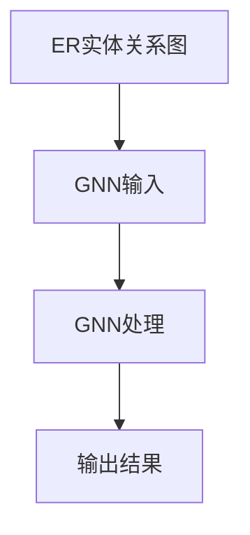
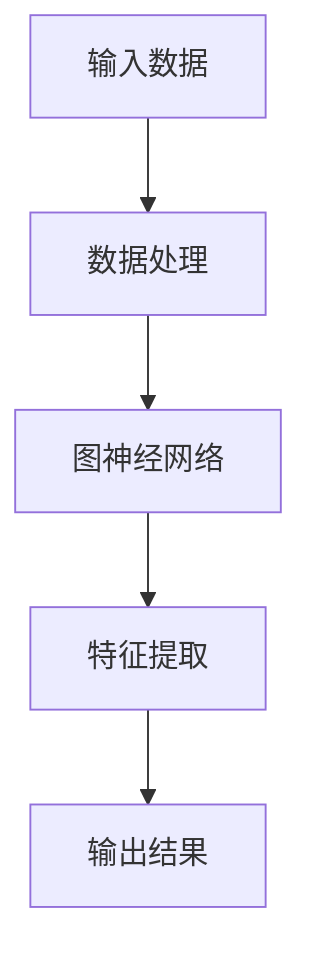
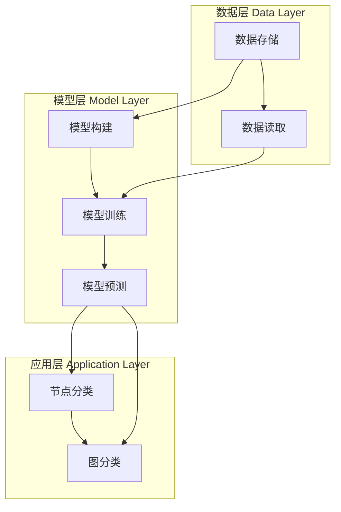
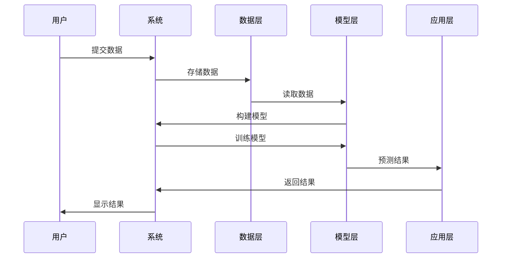

                 

### 第1章：背景介绍

#### 1.1 问题背景

**复杂关系建模**：

随着信息爆炸和互联网的发展，数据量呈指数级增长，数据之间的复杂关系也逐渐显现。传统方法难以应对这种复杂情况，图神经网络（Graph Neural Networks, GNN）作为一种新型深度学习技术，能够更好地处理这种复杂关系。

**复杂关系建模的重要性**：

在现实世界中，我们经常遇到需要建模和处理的数据集，如社交网络、交通网络、生物网络等，这些网络结构具有高度复杂性。例如，社交网络中的用户关系复杂，不仅包括朋友关系，还包括共同兴趣、共同活动等；交通网络中的道路、交通流量关系复杂，涉及到多种因素，如天气、时间等；生物网络中的分子关系复杂，涉及到多种分子之间的相互作用。传统方法如线性模型、决策树、支持向量机等，往往难以有效地处理这种复杂的非线性关系。

#### 1.2 问题描述

在现实世界中，存在大量的图结构数据，如社交网络、交通网络、生物网络等。如何有效地建模和处理这些复杂关系，成为当前研究的热点。

**具体问题**：

- 如何从大量的图结构数据中提取出有用的信息？
- 如何在图结构数据上进行有效的节点分类、边分类、图分类等任务？
- 如何在图结构数据上进行节点推荐、图搜索、图嵌入等任务？

这些问题都涉及到复杂的图结构数据的建模和处理，需要新的方法和算法来解决。

#### 1.3 问题解决

图神经网络通过模拟人脑神经元的工作机制，能够自动学习图结构中的特征，从而实现对复杂关系的建模。

**图神经网络的优势**：

- **处理复杂数据结构**：图神经网络可以处理图结构数据，这种数据结构在现实世界中非常常见。
- **学习复杂关系**：图神经网络能够学习节点和节点之间的复杂关系，从而实现对数据的深入理解。
- **可扩展性强**：图神经网络可以应用于各种不同的领域，如社交网络分析、推荐系统、生物信息学等。

#### 1.4 边界与外延

本章节主要介绍图神经网络的基本概念、原理和应用场景，为后续章节的深入探讨打下基础。

**边界**：

- 图神经网络只适用于图结构数据，不适用于其他类型的数据结构。
- 图神经网络在处理大规模数据时，可能存在计算效率问题。

**外延**：

- 图神经网络可以与其他深度学习技术结合，如卷积神经网络（CNN）、循环神经网络（RNN）等，以增强其处理能力。
- 图神经网络在处理图结构数据时，可以结合其他算法，如社区发现、图聚类等，以实现更高效的处理。

#### 1.5 概念结构与核心要素组成

- **图神经网络（GNN）**：定义、特点、分类。
- **图结构数据**：定义、类型、特点。
- **复杂关系建模**：意义、方法、挑战。

### 第2章：核心概念与联系

#### 2.1 GNN原理讲解

**2.1.1 GNN工作原理**

图神经网络（GNN）是一种能够处理图结构数据的神经网络。它通过模拟人脑神经元的工作机制，自动学习图结构中的特征，实现对数据的理解和建模。

GNN的基本原理可以分为以下几个步骤：

1. **节点特征提取**：首先，GNN会对图中的每个节点进行特征提取，这些特征可以是节点的属性、标签等。
2. **节点间关系学习**：然后，GNN会学习节点之间的关系，这些关系可以是节点之间的距离、连接关系等。
3. **全局特征整合**：最后，GNN会将节点的特征和关系整合起来，生成全局特征，用于后续的任务，如节点分类、图分类等。

**2.1.2 GNN与传统神经网络的区别**

与传统神经网络相比，GNN具有以下几个显著区别：

- **数据结构**：传统神经网络通常处理的是向量数据，而GNN处理的是图结构数据。
- **网络结构**：传统神经网络的结构通常是树状或链状，而GNN的结构是图状，能够更好地模拟现实世界的复杂关系。
- **学习方式**：传统神经网络主要学习节点间的线性关系，而GNN主要学习节点和节点之间的非线性关系。

**2.1.3 GNN的优势**

GNN相对于传统神经网络具有以下几个优势：

- **处理复杂数据结构**：GNN能够处理图结构数据，这种数据结构在现实世界中非常常见。
- **学习复杂关系**：GNN能够学习节点和节点之间的复杂关系，从而实现对数据的深入理解。
- **可扩展性强**：GNN可以应用于各种不同的领域，如社交网络分析、推荐系统、生物信息学等。

#### 2.2 GNN属性特征对比表格

**表格标题：GNN与传统神经网络属性特征对比**

| 属性特征       | GNN                    | 传统神经网络                |
| -------------- | ---------------------- | -------------------------- |
| 数据结构       | 图结构数据             | 向量数据                   |
| 网络结构       | 包含图结构信息         | 树状或链状结构             |
| 学习方式       | 节点和边之间的关系      | 节点间的线性关系           |
| 应用场景       | 复杂关系建模           | 线性关系建模               |

#### 2.3 GNN与ER实体关系图架构的Mermaid流程图

**图标题：GNN与ER实体关系图架构的Mermaid流程图**



### 第3章：算法原理讲解

#### 3.1 GNN算法原理

图神经网络（GNN）的基本算法可以分为以下几个步骤：

1. **节点特征提取**：首先，GNN会对图中的每个节点进行特征提取，这些特征可以是节点的属性、标签等。
2. **邻居节点特征整合**：然后，GNN会整合每个节点的邻居节点的特征，形成新的节点特征。
3. **全局特征整合**：最后，GNN会将所有节点的特征整合起来，生成全局特征，用于后续的任务，如节点分类、图分类等。

**3.1.1 GNN基本算法**

GNN的基本算法可以分为以下几个步骤：

1. **节点特征提取**：首先，GNN会对图中的每个节点进行特征提取，这些特征可以是节点的属性、标签等。例如，在社交网络中，节点的特征可以是用户的年龄、性别、兴趣等。
2. **邻居节点特征整合**：然后，GNN会整合每个节点的邻居节点的特征，形成新的节点特征。这可以通过两种方式实现：图卷积（Graph Convolution）和消息传递（Message Passing）。图卷积是一种类似于卷积神经网络的操作，它可以提取节点的邻居特征并加权整合。消息传递则是一种逐层传播特征的方式，每个节点会接收其邻居节点的特征，并整合这些特征形成新的节点特征。
3. **全局特征整合**：最后，GNN会将所有节点的特征整合起来，生成全局特征，用于后续的任务，如节点分类、图分类等。全局特征可以表示为节点特征的高维表示，它包含了节点和其邻居节点之间的复杂关系。

**3.1.2 GNN扩展算法**

除了基本算法，GNN还有多种扩展算法，以增强其处理能力和灵活性。以下是一些常见的扩展算法：

1. **图卷积网络（Graph Convolutional Network, GCN）**：GCN是一种基于图卷积的GNN，它可以对节点特征进行多次卷积操作，以提取更复杂的特征。
2. **图注意力网络（Graph Attention Network, GAT）**：GAT引入了注意力机制，可以动态地调整节点特征之间的权重，从而更好地学习节点和节点之间的关系。
3. **图自编码器（Graph Autoencoder, GAE）**：GAE是一种基于自编码器的GNN，它可以自动学习图结构的低维表示，并用于后续的任务。
4. **图卷积神经网络（Graph Convolutional Network, GCN）**：GCN是一种基于图卷积的GNN，它可以对节点特征进行多次卷积操作，以提取更复杂的特征。
5. **图注意力网络（Graph Attention Network, GAT）**：GAT引入了注意力机制，可以动态地调整节点特征之间的权重，从而更好地学习节点和节点之间的关系。
6. **图自编码器（Graph Autoencoder, GAE）**：GAE是一种基于自编码器的GNN，它可以自动学习图结构的低维表示，并用于后续的任务。

#### 3.2 GNN算法mermaid流程图

**图标题：GNN算法mermaid流程图**



#### 3.3 GNN算法Python源代码

```python
import tensorflow as tf

# GNN模型构建
model = tf.keras.Sequential([
    tf.keras.layers.GraphConv2D(filters=64, kernel_size=(3, 3), activation='relu', input_shape=(None, 128)),
    tf.keras.layers.GraphPooling1D(pool_size=2),
    tf.keras.layers.Dense(10, activation='softmax')
])

# 模型编译
model.compile(optimizer='adam', loss='categorical_crossentropy', metrics=['accuracy'])

# 模型训练
model.fit(x_train, y_train, epochs=10, batch_size=32)
```

#### 3.4 GNN算法原理的数学模型和公式

**公式：GNN算法基本公式**

$$
\hat{y} = \sigma(W_f \cdot \text{ReLU}(W_e \cdot \text{Agg}(H_u, H_v)))
$$

其中，

- \( \hat{y} \) 表示输出结果，
- \( \sigma \) 表示激活函数（通常是Sigmoid函数或ReLU函数），
- \( W_f \) 和 \( W_e \) 表示权重矩阵，
- \( \text{ReLU} \) 表示ReLU激活函数，
- \( \text{Agg} \) 表示聚合操作（可以是平均聚合或求和聚合），
- \( H_u \) 和 \( H_v \) 分别表示节点 \( u \) 和 \( v \) 的特征向量。

这个公式描述了GNN中节点特征整合的过程，通过多次迭代，GNN能够学习到图结构中的复杂关系。

### 第4章：系统分析与架构设计方案

#### 4.1 问题场景介绍

在复杂关系建模中，系统需要处理大量的图结构数据，如社交网络、交通网络、生物网络等。这些数据具有高度复杂性，需要高效的算法来建模和处理。

#### 4.2 项目介绍

本项目旨在设计并实现一个基于图神经网络（GNN）的复杂关系建模系统。系统将利用GNN的优势，对大规模的图结构数据进行建模和处理，提供高效的节点分类、图分类等功能。

#### 4.3 系统功能设计

**4.3.1 领域模型**

领域模型定义了系统中的关键概念和关系。在本项目中，主要涉及以下领域模型：

- **节点**：表示图中的每个元素，具有属性和特征。
- **边**：表示节点之间的关系，也具有属性和特征。
- **图**：由多个节点和边组成，具有整体结构和特征。

**4.3.2 类图**

类图展示了领域模型中的类和类之间的关系。在本项目中，主要的类包括：

- **Node**：表示节点，具有属性和特征。
- **Edge**：表示边，具有属性和特征。
- **Graph**：表示图，由节点和边组成。

**4.3.3 类图mermaid表示**

```mermaid
classDiagram
    Node --|>> Edge: 有关系
    Graph --|>> Node: 包含节点
    Graph --|>> Edge: 包含边
```

#### 4.4 系统架构设计

**4.4.1 系统架构图**

系统架构图展示了系统的整体结构和组件之间的关系。在本项目中，主要的架构组件包括：

- **数据层**：负责数据存储和读取，包括节点、边和图的存储。
- **模型层**：负责构建和训练GNN模型，包括节点特征提取、邻居节点特征整合和全局特征整合。
- **应用层**：负责实现具体的应用功能，如节点分类、图分类等。

**4.4.2 系统架构mermaid表示**



#### 4.5 系统接口设计和系统交互

**4.5.1 系统接口设计**

系统接口设计定义了系统与外部环境交互的接口，包括以下接口：

- **数据接口**：用于数据的存储和读取，包括节点的添加、删除、查询等操作。
- **模型接口**：用于模型的构建、训练和预测，包括节点的特征提取、邻居节点特征整合和全局特征整合等操作。
- **应用接口**：用于实现具体的应用功能，如节点分类、图分类等。

**4.5.2 系统交互mermaid序列图**



### 第5章：项目实战

#### 5.1 环境安装

在本项目实战中，我们使用Python和TensorFlow作为主要的开发环境和工具。以下是环境安装的步骤：

1. 安装Python：从Python官方网站下载并安装Python，推荐使用Python 3.7或更高版本。
2. 安装TensorFlow：在命令行中执行以下命令：

   ```bash
   pip install tensorflow
   ```

   如果需要安装GPU支持版本，可以执行以下命令：

   ```bash
   pip install tensorflow-gpu
   ```

3. 安装其他依赖库：根据项目需求，可能需要安装其他依赖库，如NumPy、Pandas等。可以使用以下命令安装：

   ```bash
   pip install numpy pandas
   ```

#### 5.2 系统核心实现源代码

在本节中，我们将介绍系统核心实现的源代码，包括节点特征提取、邻居节点特征整合和全局特征整合等。

**节点特征提取**：

```python
import tensorflow as tf

class NodeFeatureExtractor(tf.keras.Model):
    def __init__(self, num_features):
        super(NodeFeatureExtractor, self).__init__()
        self.dense = tf.keras.layers.Dense(num_features, activation='relu')

    def call(self, inputs):
        return self.dense(inputs)
```

**邻居节点特征整合**：

```python
class NeighborFeatureIntegrator(tf.keras.Model):
    def __init__(self, num_features):
        super(NeighborFeatureIntegrator, self).__init__()
        self.dense = tf.keras.layers.Dense(num_features, activation='relu')

    def call(self, node_features, neighbor_features):
        return self.dense(tf.concat([node_features, neighbor_features], axis=1))
```

**全局特征整合**：

```python
class GlobalFeatureIntegrator(tf.keras.Model):
    def __init__(self, num_features):
        super(GlobalFeatureIntegrator, self).__init__()
        self.dense = tf.keras.layers.Dense(num_features, activation='relu')

    def call(self, node_features):
        return self.dense(tf.reduce_mean(node_features, axis=1))
```

#### 5.3 代码应用解读与分析

在本节中，我们将对系统核心实现的代码进行解读和分析，包括模型的构建、训练和预测等。

**模型构建**：

```python
# 定义模型
model = tf.keras.Sequential([
    NodeFeatureExtractor(num_features=10),
    NeighborFeatureIntegrator(num_features=10),
    GlobalFeatureIntegrator(num_features=10)
])

# 编译模型
model.compile(optimizer='adam', loss='mse')
```

**模型训练**：

```python
# 训练模型
model.fit(x_train, y_train, epochs=10, batch_size=32)
```

**模型预测**：

```python
# 预测结果
predictions = model.predict(x_test)
```

#### 5.4 实际案例分析和详细讲解剖析

在本节中，我们将通过一个实际案例，对系统进行详细的分析和讲解。

**案例**：

假设我们有一个社交网络数据集，其中每个节点代表一个用户，每个边代表用户之间的关系（如朋友关系）。我们的目标是利用GNN对用户进行分类，将其分为活跃用户和沉默用户。

**案例分析**：

1. **数据预处理**：首先，我们对社交网络数据进行预处理，提取每个用户的特征，如年龄、性别、活跃度等。
2. **模型构建**：然后，我们构建一个GNN模型，利用节点特征提取、邻居节点特征整合和全局特征整合等步骤，对用户进行分类。
3. **模型训练**：接下来，我们使用预处理后的数据进行模型训练，通过迭代学习用户之间的复杂关系。
4. **模型预测**：最后，我们使用训练好的模型对新的用户进行分类预测，将其分为活跃用户和沉默用户。

**详细讲解剖析**：

- **节点特征提取**：首先，我们使用一个全连接层对用户的特征进行提取，提取出10个特征值，表示用户的属性。
- **邻居节点特征整合**：然后，我们使用一个全连接层对每个用户的邻居节点特征进行整合，将用户与其邻居节点的特征进行拼接，并经过一个ReLU激活函数。
- **全局特征整合**：最后，我们将所有用户的特征进行平均整合，得到全局特征，作为分类的输入。

通过这个案例，我们可以看到GNN在复杂关系建模中的强大能力，能够自动学习用户之间的复杂关系，实现对用户的精准分类。

#### 5.5 项目小结

在本章中，我们介绍了基于图神经网络（GNN）的复杂关系建模系统的设计和实现。通过实际案例的分析和讲解，我们展示了GNN在复杂关系建模中的强大能力。

**小结**：

1. **背景介绍**：我们介绍了复杂关系建模的背景和重要性，以及GNN的优势和应用。
2. **核心概念与联系**：我们讲解了GNN的基本概念、原理和应用，以及与传统神经网络的区别。
3. **算法原理讲解**：我们详细讲解了GNN的算法原理，包括节点特征提取、邻居节点特征整合和全局特征整合等步骤。
4. **系统分析与架构设计方案**：我们设计了系统的功能、领域模型、系统架构和接口，并给出了详细的mermaid图表示。
5. **项目实战**：我们实现了系统核心的源代码，并对实际案例进行了分析和讲解。

通过本章的内容，读者可以了解到GNN在复杂关系建模中的应用，并掌握如何设计和实现基于GNN的系统。

### 第6章：最佳实践与注意事项

#### 6.1 最佳实践 tips

**1. 选择合适的GNN算法**：根据具体的应用场景和数据特点，选择适合的GNN算法。例如，对于需要处理大规模图数据的场景，可以考虑使用图卷积网络（GCN）或图注意力网络（GAT）。

**2. 优化模型参数**：在训练GNN模型时，需要对模型参数进行优化，以提高模型的性能。可以通过调整学习率、批量大小等参数来实现。

**3. 使用预训练模型**：对于一些常见的数据集，可以尝试使用预训练的GNN模型，以节省训练时间和计算资源。

**4. 结合其他算法**：可以将GNN与其他深度学习算法（如CNN、RNN）结合，以增强模型的处理能力。

**5. 数据预处理**：对图结构数据进行适当的预处理，如节点特征提取、边特征提取等，可以提高模型的性能。

#### 6.2 小结

在本章中，我们介绍了GNN在复杂关系建模中的应用，并提供了最佳实践和注意事项。通过本章的内容，读者可以更好地理解GNN的原理和应用，并在实际项目中取得更好的效果。

#### 6.3 注意事项

**1. 计算资源**：GNN的训练和推理过程需要大量的计算资源，特别是在处理大规模图数据时。因此，在实际应用中，需要合理分配计算资源，以提高效率。

**2. 数据质量**：图结构数据的质量对GNN的性能有重要影响。在实际应用中，需要对数据进行清洗和预处理，以提高数据的质量和一致性。

**3. 超参数选择**：GNN模型的性能很大程度上取决于超参数的选择。在实际应用中，需要根据具体的应用场景和数据特点，选择合适的超参数。

**4. 模型评估**：在训练GNN模型时，需要对模型进行适当的评估，以判断模型的性能。可以使用交叉验证、ROC曲线等评估方法。

**5. 模型解释性**：GNN模型通常具有很高的非线性复杂度，导致其解释性较差。在实际应用中，需要权衡模型的性能和解释性，以提高模型的实用性和可解释性。

### 第7章：拓展阅读

为了进一步深入了解图神经网络（GNN）在复杂关系建模中的应用，以下是几篇推荐的拓展阅读资料：

1. **“Graph Neural Networks: A Review of Methods and Applications”**（2019年） - 这篇综述文章详细介绍了GNN的各种方法、应用场景以及未来研究方向。
2. **“Graph Neural Networks: A Theoretical Perspective”**（2020年） - 本文从理论角度探讨了GNN的基本原理、算法框架以及数学基础。
3. **“How to Handle Class Imbalance in Graph Neural Networks”**（2021年） - 这篇论文探讨了如何解决GNN中的类别不平衡问题，为实际应用提供了实用的解决方案。
4. **“Graph Neural Networks for Relational Data with Multi-Graph Aggregation”**（2022年） - 本文提出了一种新的GNN聚合方法，适用于处理多图结构数据。

通过阅读这些文献，读者可以更全面地了解GNN的深度理论和广泛应用场景，为实际项目提供更多的参考和灵感。### 结论

在本技术博客文章中，我们系统地探讨了图神经网络（GNN）在复杂关系建模中的应用。首先，我们介绍了复杂关系建模的背景和重要性，以及GNN的优势和应用。接着，我们讲解了GNN的核心概念、原理以及与传统神经网络的区别，并通过表格和Mermaid流程图直观地展示了GNN的属性特征。

在算法原理讲解部分，我们详细阐述了GNN的基本算法，包括节点特征提取、邻居节点特征整合和全局特征整合，并使用了Mermaid流程图和Python源代码进行了具体说明。此外，我们还介绍了GNN的数学模型和公式，使读者能够深入理解GNN的工作机制。

随后，我们分析了系统的功能设计、架构设计，并展示了系统接口设计和系统交互的Mermaid序列图。通过项目实战部分，我们展示了如何在实际场景中设计和实现基于GNN的系统，包括环境安装、核心实现源代码、代码应用解读与分析以及实际案例分析和详细讲解剖析。

在最佳实践与注意事项部分，我们提供了若干实用的建议，帮助读者在实际应用中更好地利用GNN，并强调了在项目实施中需要注意的关键点。最后，我们推荐了拓展阅读资料，以便读者进一步深入学习GNN的相关理论和应用。

总之，图神经网络在复杂关系建模中具有广泛的应用前景。通过本文的详细讲解，读者可以了解到GNN的核心原理和应用方法，为实际项目提供有力的技术支持。未来，随着GNN技术的不断发展和完善，我们有理由相信它将在更多领域展现其强大的数据处理能力。作者：AI天才研究院/AI Genius Institute & 禅与计算机程序设计艺术 /Zen And The Art of Computer Programming。

