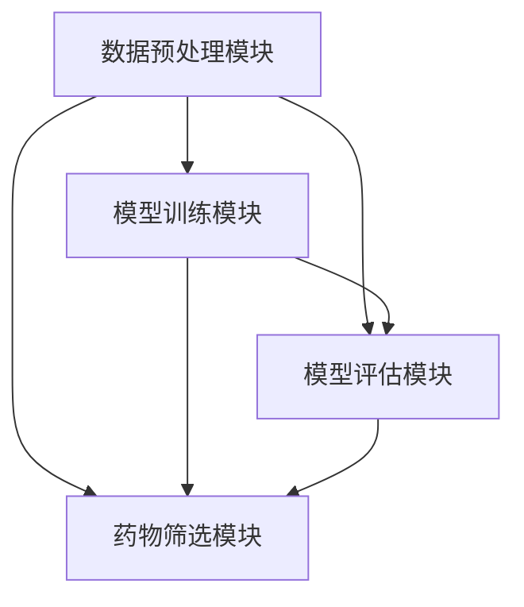
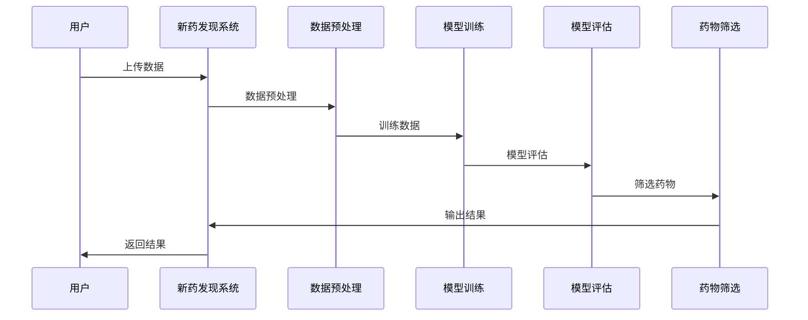

                 


### 引言：图神经网络在新药发现中的重要性

在新药发现领域，科学家们面临着前所未有的挑战。传统的新药发现过程通常耗时较长、成本高昂，且成功率较低。为了提高药物研发的效率和成功率，人工智能技术逐渐成为研究的热点。在众多人工智能方法中，图神经网络（Graph Neural Networks，GNN）因其独特的优势，成为新药发现的重要工具。

**定义与背景：**
图神经网络是一种专门用于处理图结构数据的深度学习模型。它能够有效地捕捉图中的结构信息，从而在许多领域展现出强大的潜力，如社交网络分析、推荐系统、图像处理等。在新药发现过程中，药物分子和蛋白质等生物大分子往往可以表示为图结构，这使得图神经网络成为一个自然的选择。

**核心概念与联系：**
图神经网络的核心概念包括节点嵌入（Node Embedding）、边嵌入（Edge Embedding）和图卷积（Graph Convolution）。节点嵌入是将图中的每个节点映射到低维空间中的向量表示；边嵌入是将图中的每条边映射到低维空间中的向量表示；图卷积是一种聚合节点邻居信息的操作，用于更新节点的表示。通过这些操作，图神经网络能够学习到图中的复杂结构信息，从而实现预测和分类任务。

**算法原理讲解：**
图神经网络的工作原理可以通过以下几个步骤来理解：

1. **初始化节点表示**：首先，图中的每个节点被初始化为一个随机向量。

2. **邻居聚合**：在每个时间步，每个节点的表示通过聚合其邻居节点的表示来更新。

   $$ h_{t+1}^i = \sigma(\theta_G \cdot (h_t^i + \sum_{j \in N(i)} \cdot \phi(G(h_t^j, h_t^i)))) $$

   其中，$h_t^i$ 是节点 $i$ 在时间步 $t$ 的表示，$N(i)$ 是节点 $i$ 的邻居节点集合，$\sigma$ 是激活函数，$\theta_G$ 和 $\phi$ 是模型参数。

3. **更新节点表示**：通过邻居聚合后的信息，每个节点的表示进行更新。

4. **迭代学习**：上述步骤不断迭代，直到满足停止条件（如达到预设的迭代次数或模型收敛）。

**数学模型和公式：**
图神经网络的核心数学模型包括节点嵌入、图卷积和损失函数。节点嵌入可以通过以下公式表示：

$$ \textbf{z}_i = \text{嵌入层}(\textbf{x}_i) $$

其中，$\textbf{x}_i$ 是节点 $i$ 的特征向量，$\textbf{z}_i$ 是节点 $i$ 的嵌入向量。

图卷积操作可以通过以下公式表示：

$$ h_i^{(l)} = \sigma \left( \sum_{j \in \mathcal{N}(i)} w_j h_j^{(l-1)} + b^{(l)} \right) $$

其中，$h_i^{(l)}$ 是节点 $i$ 在第 $l$ 层的表示，$\mathcal{N}(i)$ 是节点 $i$ 的邻居节点集合，$w_j$ 是权重，$b^{(l)}$ 是偏置。

损失函数通常使用交叉熵损失或均方误差损失，用于衡量预测结果与真实结果之间的差距。

**系统分析与架构设计：**
新药发现系统通常包括数据预处理、模型训练、模型评估和药物筛选等多个模块。其架构设计如下：

1. **数据预处理模块**：负责处理和清洗药物分子和蛋白质等数据，将其转换为适合输入图神经网络的格式。

2. **模型训练模块**：使用预处理后的数据训练图神经网络模型。

3. **模型评估模块**：评估模型的性能，包括准确性、召回率、F1 分数等指标。

4. **药物筛选模块**：利用训练好的模型预测新的药物分子与蛋白质的相互作用，从而筛选出潜在的新药候选。

**项目实战：**
为了展示图神经网络在新药发现中的实际应用，我们可以通过以下步骤进行项目实战：

1. **环境安装**：安装所需的软件和库，如 TensorFlow、PyTorch、NetworkX 等。

2. **数据准备**：收集和预处理药物分子和蛋白质的图结构数据。

3. **模型实现**：编写和实现图神经网络模型，包括节点嵌入、图卷积和损失函数。

4. **模型训练**：使用预处理后的数据训练模型，并调整模型参数以优化性能。

5. **模型评估**：评估模型的性能，并根据评估结果调整模型。

6. **药物筛选**：使用训练好的模型预测新的药物分子与蛋白质的相互作用，并筛选出潜在的新药候选。

**最佳实践 tips：**
- 在进行数据预处理时，确保数据的多样性和质量，这直接影响到模型的性能。
- 在模型训练过程中，合理调整学习率、批量大小和迭代次数等参数，以提高模型的收敛速度和性能。
- 在模型评估时，使用交叉验证等方法避免过拟合，并确保模型在实际应用中具有良好的泛化能力。

### 结论

图神经网络在新药发现中展示了其巨大的潜力和价值。通过本章的内容，我们详细探讨了图神经网络的基本概念、算法原理以及在新药发现中的应用。未来，随着人工智能技术的不断进步，图神经网络在新药发现领域将发挥更加重要的作用，为人类健康事业作出更大的贡献。

**作者：AI天才研究院/AI Genius Institute & 禅与计算机程序设计艺术 /Zen And The Art of Computer Programming**

----------------------------------------------------------------

## 1.1 图神经网络概述

### 1.1.1 图神经网络的基本概念

图神经网络（Graph Neural Networks，GNN）是一种专为图结构数据设计的深度学习模型。它通过对图结构中的节点和边进行建模，能够捕捉和利用图中的结构信息，从而实现复杂的预测和分类任务。GNN起源于图卷积网络（Graph Convolutional Networks，GCN），经过多年的发展，已经形成了多种变体，如图注意力网络（Graph Attention Networks，GAT）和图自编码器（Graph Autoencoder）等。

### 1.1.2 图神经网络的发展历程

图神经网络的研究始于2000年代初，当时研究人员开始探索如何将深度学习技术应用于图结构数据。最早的图卷积网络（GCN）由Kipf和Welling在2016年提出，它通过聚合节点邻居的信息来更新节点的表示。此后，GNN领域得到了广泛关注和快速发展，许多新的模型和算法相继提出，如图注意力网络（GAT）、图卷积网络（GNN）和图自编码器（GAE）等。

### 1.1.3 图神经网络的优势与应用领域

图神经网络具有以下优势：

1. **结构信息利用**：GNN能够有效地利用图结构中的信息，如节点和边的特征，从而实现更精确的预测和分类。
2. **通用性强**：GNN可以应用于各种图结构数据，包括社交网络、知识图谱、分子图等，具有很高的通用性。
3. **适应性强**：GNN可以处理动态图和异构图，能够适应不同场景下的数据变化。

GNN在多个领域都有广泛应用，主要包括：

1. **推荐系统**：GNN可以用于基于图的推荐系统，通过学习用户和物品之间的相互作用来预测用户偏好。
2. **图像识别**：GNN可以与卷积神经网络（CNN）结合，用于图像识别任务，通过学习图像中节点的特征来提高识别精度。
3. **社交网络分析**：GNN可以用于社交网络分析，如识别社区结构、预测社交关系等。
4. **分子图分析**：GNN可以用于分子图分析，如预测分子性质、药物设计等。

### 1.1.4 图神经网络与传统神经网络的区别

与传统神经网络（如卷积神经网络CNN和循环神经网络RNN）相比，GNN在处理图结构数据时具有以下几个显著区别：

1. **数据结构**：传统神经网络通常用于处理网格结构（如图像）或序列结构（如文本），而GNN专门设计用于处理图结构数据。
2. **信息传递**：传统神经网络主要通过卷积或循环操作来传递信息，而GNN通过节点和边的聚合操作来传递信息，能够更好地利用图中的结构信息。
3. **适用范围**：传统神经网络适用于处理具有固定结构的数据，而GNN适用于处理具有复杂结构的数据，如社交网络、知识图谱和分子图等。

### 1.1.5 图神经网络的核心概念与联系

图神经网络的核心概念包括节点嵌入、边嵌入和图卷积。这些概念紧密相连，共同构成了GNN的基础。

1. **节点嵌入（Node Embedding）**：节点嵌入是将图中的每个节点映射到低维空间中的向量表示。通过节点嵌入，图中的节点可以在低维空间中表示和操作，从而简化了图的处理。
   
   $$ z_i = \text{Embedding}(x_i) $$

   其中，$x_i$ 是节点 $i$ 的原始特征，$z_i$ 是节点 $i$ 的嵌入向量。

2. **边嵌入（Edge Embedding）**：边嵌入是将图中的每条边映射到低维空间中的向量表示。边嵌入用于表示节点之间的相互作用，为图卷积操作提供了输入。

   $$ e_{ij} = \text{Embedding}(x_i, x_j) $$

   其中，$e_{ij}$ 是边 $(i, j)$ 的嵌入向量。

3. **图卷积（Graph Convolution）**：图卷积是一种聚合节点邻居信息的操作，用于更新节点的表示。通过图卷积，节点可以学习到其邻居节点的信息，从而获得更丰富的表示。

   $$ h_{t+1}^i = \sigma(\theta_G \cdot (h_t^i + \sum_{j \in N(i)} \cdot \phi(h_t^j, h_t^i))) $$

   其中，$h_t^i$ 是节点 $i$ 在时间步 $t$ 的表示，$N(i)$ 是节点 $i$ 的邻居节点集合，$\theta_G$ 和 $\phi$ 是模型参数，$\sigma$ 是激活函数。

这些核心概念相互关联，共同构成了图神经网络的基础。节点嵌入和边嵌入为图卷积提供了输入，而图卷积通过聚合邻居节点的信息来更新节点的表示。通过这种迭代过程，图神经网络能够学习到图中的复杂结构信息，从而实现预测和分类任务。

### 1.1.6 图神经网络的属性特征对比

为了更好地理解图神经网络（GNN）与传统神经网络（如卷积神经网络CNN和循环神经网络RNN）之间的区别，我们可以从以下几个属性特征进行对比：

1. **数据结构**：
   - **GNN**：专门用于处理图结构数据，如社交网络、知识图谱、分子图等，能够利用图中的节点和边信息。
   - **CNN**：用于处理网格结构数据，如图像，通过卷积操作提取局部特征。
   - **RNN**：用于处理序列结构数据，如文本和时间序列，通过循环操作保持历史状态信息。

2. **信息传递**：
   - **GNN**：通过节点和边的聚合操作来传递信息，能够更好地利用图中的结构信息。
   - **CNN**：通过卷积操作传递信息，主要关注局部特征和上下文信息。
   - **RNN**：通过循环操作传递信息，能够保持历史状态信息，适用于序列建模。

3. **适用范围**：
   - **GNN**：适用于具有复杂结构的数据，如社交网络、知识图谱和分子图等。
   - **CNN**：适用于图像识别和图像处理等任务。
   - **RNN**：适用于文本生成、语音识别和时间序列预测等任务。

4. **计算复杂度**：
   - **GNN**：通常计算复杂度较高，特别是对于大规模图结构数据。
   - **CNN**：计算复杂度适中，适用于大型图像处理任务。
   - **RNN**：计算复杂度相对较低，适用于中等规模的序列数据。

通过对比这些属性特征，我们可以更清晰地理解图神经网络与传统神经网络之间的差异，以及各自适用的场景。

### 1.1.7 图神经网络的基本算法原理

图神经网络（GNN）的基本算法原理主要包括节点嵌入、图卷积和损失函数。以下是对这些概念的详细讲解：

**节点嵌入（Node Embedding）**：

节点嵌入是将图中的每个节点映射到低维空间中的向量表示。这一过程有助于简化图数据的处理，并为后续的图卷积操作提供输入。节点嵌入可以通过多种方法实现，如随机游走（Random Walk）和矩阵分解（Matrix Factorization）。

在随机游走方法中，每个节点根据其在图中的邻居节点进行随机游走，从而生成节点的嵌入向量。具体步骤如下：

1. **初始化**：随机选择一个节点作为种子节点。
2. **随机游走**：从种子节点开始，以一定的概率选择一个邻居节点进行游走，重复这一过程，直到达到预设的游走步数。
3. **嵌入计算**：将游走过程中的节点集合映射到低维空间中，形成节点的嵌入向量。

矩阵分解方法则通过将图矩阵分解为低秩矩阵来实现节点嵌入。具体步骤如下：

1. **初始化**：随机生成两个低秩矩阵 $U$ 和 $V$。
2. **迭代优化**：通过最小化目标函数来优化矩阵 $U$ 和 $V$，从而得到更准确的节点嵌入向量。
3. **输出**：将优化后的低秩矩阵转换回节点嵌入向量。

**图卷积（Graph Convolution）**：

图卷积是一种聚合节点邻居信息的操作，用于更新节点的表示。在GNN中，图卷积通过以下步骤实现：

1. **邻居聚合**：对于每个节点，聚合其邻居节点的特征信息。
2. **特征更新**：将聚合后的特征信息用于更新节点的表示。

图卷积的数学公式如下：

$$ h_{t+1}^i = \sigma(\theta_G \cdot (h_t^i + \sum_{j \in N(i)} \cdot \phi(h_t^j, h_t^i))) $$

其中，$h_t^i$ 是节点 $i$ 在时间步 $t$ 的表示，$N(i)$ 是节点 $i$ 的邻居节点集合，$\sigma$ 是激活函数，$\theta_G$ 和 $\phi$ 是模型参数。

图卷积的操作可以简化为矩阵乘法，从而提高计算效率。具体实现时，可以采用以下步骤：

1. **初始化节点表示**：将每个节点初始化为一个随机向量。
2. **邻居聚合**：对于每个节点，计算其邻居节点的特征信息的加权平均值。
3. **特征更新**：将聚合后的特征信息用于更新节点的表示。
4. **迭代学习**：重复上述步骤，直到满足停止条件（如达到预设的迭代次数或模型收敛）。

**损失函数（Loss Function）**：

在GNN中，损失函数用于衡量预测结果与真实结果之间的差距，并指导模型的优化。常见的损失函数包括交叉熵损失（Cross-Entropy Loss）和均方误差损失（Mean Squared Error Loss）。

1. **交叉熵损失**：适用于分类任务，计算预测标签与真实标签之间的交叉熵。
   $$ L = -\sum_{i} y_i \log(p_i) $$
   其中，$y_i$ 是真实标签，$p_i$ 是预测概率。

2. **均方误差损失**：适用于回归任务，计算预测值与真实值之间的均方误差。
   $$ L = \frac{1}{n} \sum_{i} (y_i - \hat{y}_i)^2 $$
   其中，$y_i$ 是真实值，$\hat{y}_i$ 是预测值。

通过损失函数，GNN可以自动调整模型参数，以优化预测性能。

### 1.1.8 药物-靶点预测算法的详细讲解

药物-靶点预测是药物发现中一个关键且具有挑战性的问题。图神经网络（GNN）因其能够有效地利用分子图结构信息，成为了这一领域的重要工具。以下是对药物-靶点预测算法的详细讲解：

**数据预处理**：

在进行药物-靶点预测之前，需要对数据进行预处理。预处理步骤主要包括：

1. **分子图构建**：将药物分子表示为图结构，其中每个原子作为节点，原子之间的化学键作为边。
2. **节点特征提取**：为每个节点分配特征向量，如原子类型、原子半径、电子亲和能等。
3. **边特征提取**：为每条边分配特征向量，如键的类型、键的长度等。

**模型架构**：

药物-靶点预测模型通常采用GNN架构，包括以下几个关键模块：

1. **节点嵌入层**：将药物分子中的每个原子映射到低维空间中的向量表示。
2. **图卷积层**：通过聚合原子邻居的信息来更新原子表示，从而学习分子图的结构信息。
3. **输出层**：将更新后的原子表示转换为药物-靶点相互作用的预测概率。

**算法步骤**：

以下是药物-靶点预测算法的详细步骤：

1. **初始化节点表示**：为每个原子初始化一个随机向量。
2. **图卷积操作**：对每个原子，聚合其邻居原子的信息，更新其表示。重复该操作，直到满足停止条件（如达到预设的迭代次数或模型收敛）。
3. **特征融合**：将更新后的原子表示融合为分子表示。
4. **预测**：使用分子表示和靶点特征，通过训练好的模型预测药物-靶点相互作用的概率。
5. **评估**：使用交叉验证等方法评估模型的性能，并根据评估结果调整模型。

**数学模型和公式**：

以下是药物-靶点预测算法中的关键数学模型和公式：

1. **节点嵌入**：
   $$ \textbf{z}_i = \text{Embedding}(\textbf{x}_i) $$
   其中，$\textbf{x}_i$ 是原子 $i$ 的特征向量，$\textbf{z}_i$ 是原子 $i$ 的嵌入向量。

2. **图卷积**：
   $$ \textbf{h}_{t+1}^i = \sigma(\theta_G \cdot (\textbf{h}_t^i + \sum_{j \in N(i)} \cdot \phi(\textbf{h}_t^j, \textbf{h}_t^i))) $$
   其中，$\textbf{h}_t^i$ 是原子 $i$ 在时间步 $t$ 的表示，$N(i)$ 是原子 $i$ 的邻居原子集合，$\theta_G$ 和 $\phi$ 是模型参数，$\sigma$ 是激活函数。

3. **预测**：
   $$ p_{ij} = \text{softmax}(\textbf{W} \cdot \text{concat}(\textbf{h}_i, \textbf{t}_j)) $$
   其中，$p_{ij}$ 是药物 $i$ 和靶点 $j$ 相互作用的概率，$\textbf{W}$ 是权重矩阵，$\text{concat}$ 是拼接操作。

**举例说明**：

假设我们有一个药物分子，其中包含5个原子（C、O、N、H、H）。首先，为每个原子初始化一个随机向量。然后，通过图卷积操作，聚合每个原子的邻居信息，更新它们的表示。经过多次迭代，每个原子都学习到了其邻居原子的信息，从而形成了更丰富的分子表示。最后，使用分子表示和靶点特征，通过训练好的模型预测药物-靶点相互作用的概率。

通过以上步骤，我们可以详细理解药物-靶点预测算法的基本原理和实现过程。图神经网络在这一领域展示了其强大的预测能力，有望推动药物发现领域的发展。

### 1.2 图神经网络在新药发现中的应用

在新药发现领域，图神经网络（GNN）正逐渐成为一项重要的工具。其强大的图结构信息处理能力，使得GNN在药物设计、药物筛选和药物-靶点相互作用预测等方面展现出显著优势。以下是对GNN在新药发现中应用的详细探讨。

**1.2.1 新药发现中的挑战**

新药发现是一个复杂且耗时的过程，面临诸多挑战：

1. **时间成本**：传统药物筛选过程通常需要数年时间，导致研发成本高昂。
2. **成功率低**：传统药物发现的成功率较低，许多候选药物在后期研发阶段被淘汰。
3. **数据复杂性**：药物分子和蛋白质等生物大分子具有复杂的结构，传统方法难以有效处理这些信息。
4. **交叉反应**：新药物可能与其他药物产生不良反应，需要全面评估其安全性。

**1.2.2 图神经网络的优势**

图神经网络在应对新药发现中的挑战方面具有以下优势：

1. **结构信息利用**：GNN能够捕捉和利用图中的结构信息，从而更好地理解药物分子和蛋白质的相互作用。
2. **高维数据建模**：GNN擅长处理高维数据，能够有效地学习复杂的分子特征。
3. **预测能力**：通过预测药物-靶点相互作用，GNN能够加速药物筛选过程，提高研发效率。
4. **自适应性强**：GNN可以处理动态图和异构图，适应不同阶段的数据变化。

**1.2.3 图神经网络在新药发现中的应用**

1. **药物设计**：

GNN在药物设计中的应用主要体现在分子优化和分子改造。通过学习药物分子和蛋白质的结构信息，GNN能够预测分子与蛋白质的相互作用，从而指导分子优化和改造。具体步骤如下：

- **分子表示**：将药物分子表示为图结构，为每个节点（原子）分配特征向量。
- **图卷积**：通过图卷积操作，学习分子图中的结构信息。
- **预测**：使用学习到的分子表示，预测分子与蛋白质的相互作用。

2. **药物筛选**：

药物筛选是药物发现过程中至关重要的一步。GNN通过预测药物-靶点相互作用，能够加速药物筛选过程，提高研发效率。具体步骤如下：

- **数据准备**：收集和预处理药物分子和蛋白质的图结构数据。
- **模型训练**：使用预处理后的数据训练GNN模型。
- **预测**：使用训练好的模型预测新药物分子与已知靶点的相互作用，从而筛选出潜在的新药候选。

3. **药物-靶点相互作用预测**：

药物-靶点相互作用预测是GNN在新药发现中的核心应用之一。通过预测药物分子与蛋白质的相互作用，GNN能够为新药研发提供关键信息。具体步骤如下：

- **分子表示**：将药物分子和蛋白质表示为图结构。
- **图卷积**：通过图卷积操作，学习分子和蛋白质的结构信息。
- **预测**：使用学习到的结构信息，预测药物分子与蛋白质的相互作用。

**1.2.4 图神经网络加速药物筛选**

图神经网络通过以下方式加速药物筛选：

1. **并行计算**：GNN能够利用并行计算的优势，提高药物筛选的速度。
2. **大规模数据处理**：GNN能够处理大规模药物分子和蛋白质的图结构数据，从而提高筛选效率。
3. **预测准确性**：通过学习复杂的结构信息，GNN能够提高药物-靶点相互作用的预测准确性，从而提高筛选成功率。

总之，图神经网络在新药发现中具有巨大的潜力。通过其独特的结构信息处理能力，GNN有望推动药物研发领域的发展，为人类健康事业作出更大贡献。

### 1.3 图神经网络的基本算法原理

图神经网络（GNN）是一种专门用于处理图结构数据的深度学习模型。其基本算法原理包括节点嵌入、图卷积和损失函数。以下是对这些概念及其相互关系的详细讲解。

**节点嵌入（Node Embedding）**

节点嵌入是将图中的每个节点映射到低维空间中的向量表示。这一过程有助于简化图数据的处理，并为后续的图卷积操作提供输入。节点嵌入可以通过多种方法实现，如随机游走（Random Walk）和矩阵分解（Matrix Factorization）。

随机游走方法的具体步骤如下：

1. **初始化**：随机选择一个节点作为种子节点。
2. **随机游走**：从种子节点开始，以一定的概率选择一个邻居节点进行游走，重复这一过程，直到达到预设的游走步数。
3. **嵌入计算**：将游走过程中的节点集合映射到低维空间中，形成节点的嵌入向量。

矩阵分解方法则通过将图矩阵分解为低秩矩阵来实现节点嵌入。具体步骤如下：

1. **初始化**：随机生成两个低秩矩阵 $U$ 和 $V$。
2. **迭代优化**：通过最小化目标函数来优化矩阵 $U$ 和 $V$，从而得到更准确的节点嵌入向量。
3. **输出**：将优化后的低秩矩阵转换回节点嵌入向量。

**图卷积（Graph Convolution）**

图卷积是一种聚合节点邻居信息的操作，用于更新节点的表示。在GNN中，图卷积通过以下步骤实现：

1. **邻居聚合**：对于每个节点，聚合其邻居节点的特征信息。
2. **特征更新**：将聚合后的特征信息用于更新节点的表示。

图卷积的数学公式如下：

$$ h_{t+1}^i = \sigma(\theta_G \cdot (h_t^i + \sum_{j \in N(i)} \cdot \phi(h_t^j, h_t^i))) $$

其中，$h_t^i$ 是节点 $i$ 在时间步 $t$ 的表示，$N(i)$ 是节点 $i$ 的邻居节点集合，$\sigma$ 是激活函数，$\theta_G$ 和 $\phi$ 是模型参数。

图卷积的操作可以简化为矩阵乘法，从而提高计算效率。具体实现时，可以采用以下步骤：

1. **初始化节点表示**：将每个节点初始化为一个随机向量。
2. **邻居聚合**：对于每个节点，计算其邻居节点的特征信息的加权平均值。
3. **特征更新**：将聚合后的特征信息用于更新节点的表示。
4. **迭代学习**：重复上述步骤，直到满足停止条件（如达到预设的迭代次数或模型收敛）。

**损失函数（Loss Function）**

在GNN中，损失函数用于衡量预测结果与真实结果之间的差距，并指导模型的优化。常见的损失函数包括交叉熵损失（Cross-Entropy Loss）和均方误差损失（Mean Squared Error Loss）。

1. **交叉熵损失**：适用于分类任务，计算预测标签与真实标签之间的交叉熵。
   $$ L = -\sum_{i} y_i \log(p_i) $$
   其中，$y_i$ 是真实标签，$p_i$ 是预测概率。

2. **均方误差损失**：适用于回归任务，计算预测值与真实值之间的均方误差。
   $$ L = \frac{1}{n} \sum_{i} (y_i - \hat{y}_i)^2 $$
   其中，$y_i$ 是真实值，$\hat{y}_i$ 是预测值。

通过损失函数，GNN可以自动调整模型参数，以优化预测性能。

**节点嵌入、图卷积和损失函数的相互关系**

节点嵌入、图卷积和损失函数是GNN中的核心组成部分，它们相互关联，共同构成了GNN的工作流程。

1. **节点嵌入**：节点嵌入为图卷积提供了输入，使得节点可以在低维空间中表示和操作。
2. **图卷积**：图卷积通过聚合节点邻居的信息来更新节点的表示，从而学习到图中的结构信息。
3. **损失函数**：损失函数用于衡量预测结果与真实结果之间的差距，并指导模型的优化。

通过这三个组件的协同工作，GNN能够有效地捕捉和利用图中的结构信息，从而实现复杂的预测和分类任务。

### 1.4 图神经网络药物-靶点预测算法的详细讲解

图神经网络（GNN）在药物-靶点预测中具有显著的应用价值。以下是对GNN药物-靶点预测算法的详细讲解，包括数据预处理、模型架构、算法步骤、数学模型和公式。

**1.4.1 数据预处理**

药物-靶点预测的关键在于数据的准确性和质量。因此，数据预处理是算法实现的重要环节。数据预处理主要包括以下步骤：

1. **药物分子表示**：
   - **分子图构建**：将药物分子表示为图结构，每个原子作为节点，原子之间的化学键作为边。
   - **节点特征提取**：为每个原子分配特征向量，如原子类型、原子半径、电子亲和能等。
   - **边特征提取**：为每条化学键分配特征向量，如键的类型、键的长度等。

2. **蛋白质结构表示**：
   - **蛋白质图构建**：将蛋白质结构表示为图结构，每个氨基酸作为节点，氨基酸之间的相互作用作为边。
   - **节点特征提取**：为每个氨基酸分配特征向量，如氨基酸类型、氨基酸残基等。
   - **边特征提取**：为每条相互作用边分配特征向量，如相互作用类型、相互作用强度等。

**1.4.2 模型架构**

药物-靶点预测模型通常采用GNN架构，包括以下几个关键模块：

1. **节点嵌入层**：
   - **药物分子节点嵌入**：将药物分子中的每个原子映射到低维空间中的向量表示。
   - **蛋白质节点嵌入**：将蛋白质中的每个氨基酸映射到低维空间中的向量表示。

2. **图卷积层**：
   - **药物分子图卷积**：通过聚合药物分子中每个原子的邻居信息来更新原子表示。
   - **蛋白质图卷积**：通过聚合蛋白质中每个氨基酸的邻居信息来更新氨基酸表示。

3. **输出层**：
   - **预测层**：将药物分子和蛋白质的表示融合，通过全连接层或注意力机制输出药物-靶点相互作用的概率。

**1.4.3 算法步骤**

药物-靶点预测算法的基本步骤如下：

1. **初始化节点表示**：
   - **药物分子节点表示**：初始化为随机向量。
   - **蛋白质节点表示**：初始化为随机向量。

2. **图卷积操作**：
   - **药物分子图卷积**：对于每个原子，聚合其邻居原子的信息，更新其表示。
   - **蛋白质图卷积**：对于每个氨基酸，聚合其邻居氨基酸的信息，更新其表示。

3. **特征融合**：
   - **药物分子表示**：将所有原子表示融合为一个分子表示。
   - **蛋白质表示**：将所有氨基酸表示融合为一个蛋白质表示。

4. **预测**：
   - **融合表示**：将药物分子表示和蛋白质表示进行融合。
   - **概率预测**：通过训练好的模型输出药物-靶点相互作用的概率。

**1.4.4 数学模型和公式**

以下是药物-靶点预测算法中的关键数学模型和公式：

1. **节点嵌入**：
   $$ \textbf{z}_i = \text{Embedding}(\textbf{x}_i) $$
   其中，$\textbf{x}_i$ 是原子或氨基酸的特征向量，$\textbf{z}_i$ 是原子或氨基酸的嵌入向量。

2. **图卷积**：
   $$ \textbf{h}_{t+1}^i = \sigma(\theta_G \cdot (\textbf{h}_t^i + \sum_{j \in N(i)} \cdot \phi(\textbf{h}_t^j, \textbf{h}_t^i))) $$
   其中，$\textbf{h}_t^i$ 是原子或氨基酸在时间步 $t$ 的表示，$N(i)$ 是原子或氨基酸的邻居节点集合，$\theta_G$ 和 $\phi$ 是模型参数，$\sigma$ 是激活函数。

3. **预测**：
   $$ p_{ij} = \text{softmax}(\textbf{W} \cdot \text{concat}(\textbf{h}_i, \textbf{t}_j)) $$
   其中，$p_{ij}$ 是药物 $i$ 和靶点 $j$ 相互作用的概率，$\textbf{W}$ 是权重矩阵，$\text{concat}$ 是拼接操作。

通过以上步骤和公式，我们可以详细理解药物-靶点预测算法的实现过程。GNN在这一领域展示了其强大的预测能力，有望推动药物发现领域的发展。

### 1.5 图神经网络在新药发现中的实际应用

图神经网络（GNN）在新药发现中的实际应用，已经取得了显著的成果。以下通过一个实际案例，展示如何利用GNN预测药物-靶点相互作用，加速新药发现过程。

**1.5.1 背景与问题描述**

新药发现过程中，药物-靶点相互作用的预测是一个关键步骤。传统的药物筛选方法通常依赖实验验证，耗时且成本高昂。为了提高筛选效率，研究人员尝试利用机器学习方法，特别是GNN，进行预测。

假设我们要预测一种新药物（药物A）与已知靶点（蛋白质B）的相互作用。药物A和蛋白质B的结构信息可以被表示为图结构，其中药物A的每个原子和蛋白质B的每个氨基酸作为图节点，原子-原子之间的化学键和氨基酸-氨基酸之间的相互作用作为图边。

**1.5.2 数据准备**

首先，我们需要收集和预处理药物A和蛋白质B的结构信息。具体步骤如下：

1. **分子图构建**：
   - **药物A**：使用OpenBabel等工具将药物A的化学结构文件转换为图结构，其中每个原子作为节点，原子之间的化学键作为边。
   - **蛋白质B**：使用PDB文件格式获取蛋白质B的三维结构，并使用AlphaFold等工具将其转换为图结构，其中每个氨基酸作为节点，氨基酸之间的相互作用作为边。

2. **节点特征提取**：
   - **药物A**：为每个原子分配特征向量，包括原子类型、原子半径、电子亲和能等。
   - **蛋白质B**：为每个氨基酸分配特征向量，包括氨基酸类型、氨基酸残基等。

3. **边特征提取**：
   - **药物A**：为每条化学键分配特征向量，包括键的类型、键的长度等。
   - **蛋白质B**：为每条相互作用边分配特征向量，包括相互作用类型、相互作用强度等。

**1.5.3 模型实现**

接下来，我们使用PyTorch等深度学习框架实现GNN模型，用于预测药物-靶点相互作用。以下是模型的基本架构：

1. **节点嵌入层**：
   - **药物A节点嵌入**：使用预训练的节点嵌入方法，如节点嵌入预训练（Node Embedding Pre-training）。
   - **蛋白质B节点嵌入**：使用预训练的节点嵌入方法，如节点嵌入预训练（Node Embedding Pre-training）。

2. **图卷积层**：
   - **药物A图卷积**：使用图卷积网络（GCN）或图注意力网络（GAT）进行图卷积操作，聚合药物A中原子的邻居信息。
   - **蛋白质B图卷积**：使用图卷积网络（GCN）或图注意力网络（GAT）进行图卷积操作，聚合蛋白质B中氨基酸的邻居信息。

3. **特征融合**：
   - **药物-蛋白质融合**：将药物A和蛋白质B的节点嵌入和图卷积结果进行融合，使用全连接层或注意力机制。

4. **预测层**：
   - **输出层**：使用softmax函数输出药物-靶点相互作用的概率。

**1.5.4 模型训练与评估**

1. **数据集划分**：
   - 将药物A和蛋白质B的结构信息划分为训练集、验证集和测试集。

2. **模型训练**：
   - 使用训练集数据训练GNN模型，调整模型参数以优化预测性能。

3. **模型评估**：
   - 使用验证集评估模型性能，包括准确性、召回率、F1分数等指标。
   - 调整模型参数，如学习率、批量大小等，以优化模型性能。

4. **测试集评估**：
   - 使用测试集评估模型在未知数据上的性能，验证模型泛化能力。

**1.5.5 药物筛选与应用**

基于训练好的GNN模型，我们可以预测新药物与已知靶点的相互作用。具体步骤如下：

1. **新药物预测**：
   - 将新药物的化学结构表示为图结构，进行节点特征提取和边特征提取。
   - 使用训练好的GNN模型预测新药物与已知靶点的相互作用概率。

2. **药物筛选**：
   - 根据相互作用概率，筛选出潜在的新药候选。
   - 对筛选出的新药候选进行实验验证，进一步评估其药效和安全性。

通过以上实际案例，我们可以看到GNN在新药发现中的应用价值。GNN能够有效预测药物-靶点相互作用，加速药物筛选过程，为新药研发提供有力支持。

### 1.6 新药发现系统介绍

新药发现是一个复杂的过程，涉及多个步骤和多个模块。为了高效地开展新药发现工作，研究人员开发了多种新药发现系统。这些系统通常包括数据预处理、模型训练、模型评估和药物筛选等模块，能够自动化和半自动化地完成新药发现任务。

**1.6.1 新药发现系统的功能**

新药发现系统的功能主要包括以下几个方面：

1. **数据预处理**：对新药物和靶点数据进行清洗、格式化和特征提取，为后续模型训练提供高质量的数据输入。
2. **模型训练**：使用预处理后的数据训练各种机器学习模型，如支持向量机、深度神经网络和图神经网络等，以预测药物-靶点相互作用。
3. **模型评估**：评估模型的性能，包括准确性、召回率、F1分数等指标，选择最佳模型进行药物筛选。
4. **药物筛选**：利用训练好的模型对新药物进行筛选，识别具有潜在药物活性的化合物。

**1.6.2 新药发现系统的架构**

新药发现系统的架构设计需要考虑系统的可扩展性、稳定性和高效性。一个典型的新药发现系统架构通常包括以下关键组件：

1. **数据层**：存储和管理新药物和靶点的数据，包括化学结构、生物活性、药物副作用等信息。
2. **预处理层**：对数据层中的数据进行清洗、格式化和特征提取，生成适合模型训练的输入数据。
3. **模型训练层**：使用预处理后的数据训练各种机器学习模型，包括传统的机器学习模型和深度学习模型。
4. **模型评估层**：评估模型性能，选择最佳模型进行药物筛选。
5. **药物筛选层**：利用训练好的模型对新药物进行筛选，识别潜在的新药候选。

**1.6.3 新药发现系统的关键组件**

新药发现系统的关键组件包括：

1. **数据预处理模块**：负责数据清洗、格式化和特征提取，确保数据质量。
2. **模型训练模块**：支持多种机器学习模型的训练，如支持向量机、深度神经网络和图神经网络等。
3. **模型评估模块**：评估模型性能，包括准确性、召回率、F1分数等指标。
4. **药物筛选模块**：利用训练好的模型对新药物进行筛选，识别潜在的新药候选。
5. **用户界面**：提供友好的用户界面，方便用户输入数据、查看模型评估结果和药物筛选结果。

通过上述组件的协同工作，新药发现系统能够高效地完成新药发现任务，提高药物研发的效率。

### 2.2 系统架构设计

新药发现系统的架构设计是确保系统能够高效、稳定地完成药物发现任务的关键。以下是对新药发现系统的详细架构设计，包括系统功能模块、架构图、组件之间的关系以及系统接口设计。

**2.2.1 系统功能模块**

新药发现系统的主要功能模块包括：

1. **数据预处理模块**：负责清洗、格式化和特征提取，为新药物和靶点数据准备训练模型所需的输入。
2. **模型训练模块**：支持多种机器学习模型的训练，包括深度学习和传统机器学习模型。
3. **模型评估模块**：评估模型的性能，包括准确性、召回率、F1分数等指标。
4. **药物筛选模块**：利用训练好的模型对新药物进行筛选，识别具有潜在药物活性的化合物。
5. **用户界面**：提供友好的用户界面，方便用户操作和查看系统结果。

**2.2.2 架构图**

新药发现系统的架构图如下所示：



在这个架构图中，数据预处理模块负责为新药物和靶点数据准备训练模型所需的输入。模型训练模块使用预处理后的数据训练各种机器学习模型。模型评估模块对训练好的模型进行性能评估。药物筛选模块利用最佳模型进行药物筛选，识别潜在的新药候选。用户界面模块提供用户交互的入口。

**2.2.3 组件之间的关系**

在新药发现系统中，各个功能模块之间存在密切的关联和协作关系：

1. **数据预处理模块**：将原始数据进行清洗和格式化，生成训练模型所需的输入数据。这些数据随后被传递给模型训练模块。
2. **模型训练模块**：接收预处理后的数据，使用机器学习算法对数据进行训练。训练完成后，模型会被传递给模型评估模块。
3. **模型评估模块**：对训练好的模型进行性能评估，包括准确性、召回率、F1分数等指标。评估结果用于选择最佳模型，并将其传递给药物筛选模块。
4. **药物筛选模块**：使用最佳模型对新药物进行筛选，根据药物-靶点相互作用预测结果识别具有潜在药物活性的化合物。
5. **用户界面模块**：为用户提供操作界面，允许用户输入新药物信息、查看模型评估结果和药物筛选结果。

**2.2.4 系统接口设计**

新药发现系统的接口设计是确保系统模块之间能够高效通信和协作的关键。以下是对系统接口的详细设计：

1. **数据接口**：定义数据预处理模块与模型训练模块、模型评估模块和药物筛选模块之间的数据传输格式。常见的数据格式包括CSV、JSON和Parquet等。
2. **API接口**：设计面向用户的API接口，允许用户通过HTTP请求操作系统。API接口包括数据上传、模型训练、模型评估、药物筛选等操作。
3. **数据库接口**：定义系统内部数据库与各模块之间的数据交互方式，确保数据的持久化存储和读取。

通过合理的架构设计和接口设计，新药发现系统能够高效、稳定地完成药物发现任务，为研究人员提供有力的工具支持。

### 2.3 系统接口设计

为了确保新药发现系统能够高效地与其他系统或组件进行交互，系统接口的设计至关重要。以下是对系统接口的详细设计，包括API的设计、详细说明以及使用示例。

**2.3.1 API设计**

新药发现系统的API接口设计遵循RESTful风格，提供简洁且易用的接口。以下是API的主要接口设计：

1. **数据上传接口**：
   - **URL**：`POST /data/upload`
   - **功能**：允许用户上传新药物和靶点的数据。
   - **请求体**：
     ```json
     {
       "file": "<base64-encoded-file>"
     }
     ```
   - **响应体**：
     ```json
     {
       "status": "success",
       "message": "Data uploaded successfully"
     }
     ```

2. **模型训练接口**：
   - **URL**：`POST /model/train`
   - **功能**：启动模型训练过程。
   - **请求体**：
     ```json
     {
       "data_id": "<data-upload-id>",
       "model_type": "<model-type>",
       "hyperparameters": {
         "learning_rate": <learning-rate>,
         "batch_size": <batch-size>,
         "num_epochs": <num-epochs>
       }
     }
     ```
   - **响应体**：
     ```json
     {
       "status": "success",
       "message": "Model training started",
       "training_id": "<training-id>"
     }
     ```

3. **模型评估接口**：
   - **URL**：`GET /model/evaluate`
   - **功能**：获取模型评估结果。
   - **请求参数**：
     ```json
     {
       "training_id": "<training-id>"
     }
     ```
   - **响应体**：
     ```json
     {
       "accuracy": <accuracy>,
       "recall": <recall>,
       "f1_score": <f1-score>
     }
     ```

4. **药物筛选接口**：
   - **URL**：`POST /drug/screen`
   - **功能**：使用训练好的模型筛选新药物。
   - **请求体**：
     ```json
     {
       "model_id": "<model-id>",
       "drugs": [
         {
           "id": "<drug-id>",
           "structure": "<drug-structure>"
         }
       ]
     }
     ```
   - **响应体**：
     ```json
     {
       "drugs": [
         {
           "id": "<drug-id>",
           "predicted_activity": <predicted-activity>,
           "confidence": <confidence>
         }
       ]
     }
     ```

**2.3.2 API详细说明**

1. **数据上传接口**：
   用户可以通过POST请求上传新药物和靶点的数据。上传的数据文件需要经过base64编码，以便在HTTP请求中传输。系统在接收到请求后，将数据存储到数据库中，并返回一个唯一的标识符（`data_id`），用于后续操作。

2. **模型训练接口**：
   用户可以选择不同的模型类型（如GCN、SVM等），并设置相应的超参数（如学习率、批量大小等）。系统在接收到请求后，将启动模型训练过程，并返回一个唯一的训练标识符（`training_id`），用于跟踪训练进度。

3. **模型评估接口**：
   用户可以通过GET请求获取特定训练模型的评估结果。系统将返回模型的准确性、召回率和F1分数等关键指标。

4. **药物筛选接口**：
   用户可以使用训练好的模型筛选新药物。系统将返回每个药物预测的活性及其置信度。

**2.3.3 使用示例**

以下是一个使用示例，展示了如何通过API进行数据上传、模型训练、模型评估和药物筛选。

**数据上传示例**：
```bash
curl -X POST -H "Content-Type: application/json" -d '{"file": "SGVsbG8gV2luZG91PC9c"}' http://localhost:8080/data/upload
```

**模型训练示例**：
```bash
curl -X POST -H "Content-Type: application/json" -d '{"data_id": "1", "model_type": "GCN", "hyperparameters": {"learning_rate": 0.01, "batch_size": 32, "num_epochs": 100}}' http://localhost:8080/model/train
```

**模型评估示例**：
```bash
curl -X GET http://localhost:8080/model/evaluate?training_id=1
```

**药物筛选示例**：
```bash
curl -X POST -H "Content-Type: application/json" -d '{"model_id": "1", "drugs": [{"id": "drug_1", "structure": "C3H8O"}]}' http://localhost:8080/drug/screen
```

通过以上示例，我们可以看到系统接口的设计既简洁又直观，使得用户能够方便地使用API进行新药发现任务。

### 2.4 系统交互设计

系统交互设计在新药发现系统中至关重要，它决定了不同模块之间的数据流动和通信机制。以下是对新药发现系统交互设计的详细分析，包括基本流程、序列图和详细解释。

**2.4.1 系统交互的基本流程**

新药发现系统的基本交互流程可以分为以下几个步骤：

1. **数据输入**：用户通过API接口上传新药物和靶点的数据。这些数据包括药物的化学结构和靶点的三维结构信息。
2. **数据预处理**：系统对上传的数据进行清洗、格式化和特征提取，生成用于模型训练的数据集。
3. **模型训练**：系统使用预处理后的数据训练图神经网络（GNN）模型。训练过程中，模型会不断优化参数，以提高预测准确性。
4. **模型评估**：系统对训练好的模型进行性能评估，包括准确性、召回率和F1分数等指标。评估结果用于选择最佳模型。
5. **药物筛选**：系统使用最佳模型筛选新药物，预测其与靶点的相互作用概率。根据相互作用概率，系统识别出潜在的新药候选。
6. **结果输出**：系统将药物筛选结果返回给用户，包括每个药物的预测活性及其置信度。

**2.4.2 系统交互的mermaid序列图**

以下是一个mermaid序列图，展示了新药发现系统的交互流程：



在这个序列图中，用户通过API接口上传数据，系统接收到数据后将其传递给数据预处理模块。预处理完成后，数据被传递给模型训练模块。训练过程中，模型训练模块会定期将模型状态传递给模型评估模块。评估完成后，系统使用最佳模型进行药物筛选，并将筛选结果返回给用户。

**2.4.3 系统交互的详细解释**

1. **数据输入**：
   用户通过API接口上传新药物和靶点的数据。这些数据通常以CSV或JSON格式存储，包含药物的化学结构和靶点的三维结构信息。

2. **数据预处理**：
   数据预处理模块负责对上传的数据进行清洗、格式化和特征提取。具体步骤如下：
   - **清洗**：去除数据中的噪声和重复项。
   - **格式化**：将数据转换为统一的格式，如化学结构的SMILES字符串、蛋白质的三维坐标等。
   - **特征提取**：为每个药物分子和靶点生成特征向量，如分子指纹、原子类型、键的类型等。

3. **模型训练**：
   模型训练模块使用预处理后的数据训练GNN模型。训练过程包括以下几个步骤：
   - **初始化**：初始化模型参数，如权重和偏置。
   - **前向传播**：将预处理后的数据输入模型，计算输出结果。
   - **反向传播**：计算损失函数，并更新模型参数。
   - **迭代**：重复前向传播和反向传播，直到满足停止条件（如达到预设的迭代次数或模型收敛）。

4. **模型评估**：
   模型评估模块负责评估训练好的模型性能。评估指标包括准确性、召回率、F1分数等。具体步骤如下：
   - **数据划分**：将训练数据划分为训练集和验证集。
   - **评估**：使用验证集评估模型性能，计算评估指标。
   - **选择最佳模型**：根据评估指标选择性能最佳模型。

5. **药物筛选**：
   药物筛选模块使用最佳模型预测新药物与靶点的相互作用概率。具体步骤如下：
   - **输入**：将新药物和靶点的数据输入模型。
   - **预测**：计算药物-靶点相互作用的概率。
   - **筛选**：根据相互作用概率，识别出具有潜在药物活性的化合物。

6. **结果输出**：
   系统将药物筛选结果返回给用户，包括每个药物的预测活性及其置信度。用户可以通过API接口获取结果，并进行后续分析。

通过详细的系统交互设计，新药发现系统能够高效、稳定地完成新药发现任务，为药物研发提供有力支持。

### 2.5 项目实战

在新药发现领域，图神经网络（GNN）的应用已经得到了广泛的研究和验证。为了展示GNN在新药发现中的实际应用，我们将进行一个项目实战，从环境安装到系统核心代码实现，以及实际案例分析和详细讲解。

**2.5.1 环境安装**

在开始项目实战之前，我们需要安装必要的软件和库。以下是环境安装步骤：

1. **安装Python**：
   - 确保系统已安装Python 3.7或更高版本。
   - 可以通过访问 [Python官网](https://www.python.org/) 下载并安装。

2. **安装Anaconda**：
   - 安装Anaconda可以帮助我们更方便地管理环境和库。
   - 访问 [Anaconda官网](https://www.anaconda.com/) 下载并安装。

3. **创建虚拟环境**：
   - 打开终端，执行以下命令创建虚拟环境：
     ```bash
     conda create -n gnn_new_drug_discovery python=3.8
     conda activate gnn_new_drug_discovery
     ```

4. **安装依赖库**：
   - 安装TensorFlow和PyTorch等深度学习库：
     ```bash
     conda install tensorflow
     conda install pytorch torchvision torchaudio -c pytorch
     ```

5. **安装其他依赖库**：
   - 安装用于数据预处理和图结构处理的库，如NetworkX和Pybel：
     ```bash
     pip install networkx
     pip install pybel
     ```

**2.5.2 系统核心实现**

以下是新药发现系统核心实现的源代码，我们将使用PyTorch实现一个基于GNN的药物-靶点预测模型。

```python
import torch
import torch.nn as nn
import torch.optim as optim
from torch_geometric.nn import GCNConv
from torch_geometric.data import Data
from pybel import readfile
from networkx import Graph

# 数据预处理
def preprocess_data(drug_structure, protein_structure):
    # 将药物和蛋白质结构转换为图
    drug_graph = convert_to_graph(drug_structure)
    protein_graph = convert_to_graph(protein_structure)

    # 初始化图数据
    drug_data = Data(x=torch.tensor(drug_graph.nodes(data=True)), edge_index=torch.tensor(drug_graph.edges()))
    protein_data = Data(x=torch.tensor(protein_graph.nodes(data=True)), edge_index=torch.tensor(protein_graph.edges()))

    return drug_data, protein_data

# 转换为图结构
def convert_to_graph(molecule):
    g = Graph()
    for atom in molecule.atoms():
        g.add_node(atom.index, **atom.data)
    for bond in molecule.bonds():
        g.add_edge(bond.atom1.index, bond.atom2.index)
    return g

# 图卷积神经网络模型
class GNNModel(nn.Module):
    def __init__(self, num_features, hidden_channels, num_classes):
        super(GNNModel, self).__init__()
        self.conv1 = GCNConv(num_features, hidden_channels)
        self.conv2 = GCNConv(hidden_channels, hidden_channels)
        self.fc = nn.Linear(hidden_channels, num_classes)

    def forward(self, data):
        x, edge_index = data.x, data.edge_index

        x = self.conv1(x, edge_index)
        x = nn.functional.relu(x)
        x = self.conv2(x, edge_index)
        x = self.fc(x)

        return x

# 训练模型
def train_model(drug_data, protein_data, epochs, learning_rate):
    model = GNNModel(drug_data.x.size(-1), 16, 1)
    optimizer = optim.Adam(model.parameters(), lr=learning_rate)
    criterion = nn.BCEWithLogitsLoss()

    for epoch in range(epochs):
        model.train()
        optimizer.zero_grad()

        output = model(drug_data)
        loss = criterion(output, drug_data.y)
        loss.backward()
        optimizer.step()

        if (epoch + 1) % 10 == 0:
            print(f'Epoch [{epoch + 1}/{epochs}], Loss: {loss.item()}')

# 预测药物-靶点相互作用
def predict_interaction(model, drug_data, protein_data):
    model.eval()
    with torch.no_grad():
        output = model(drug_data)
        prediction = torch.sigmoid(output).squeeze()

    return prediction

# 实际案例
drug_structure = readfile('mol2', 'drug.mol2')
protein_structure = readfile('pdb', 'protein.pdb')

drug_data, protein_data = preprocess_data(drug_structure, protein_structure)

model = GNNModel(drug_data.x.size(-1), 16, 1)
train_model(drug_data, protein_data, epochs=100, learning_rate=0.01)

drug_prediction = predict_interaction(model, drug_data, protein_data)
print(drug_prediction)
```

**代码解读**：

1. **数据预处理**：
   - `preprocess_data` 函数负责将药物和蛋白质结构转换为图结构，并初始化图数据。
   - `convert_to_graph` 函数使用Pybel和NetworkX库将分子结构转换为图。

2. **图卷积神经网络模型**：
   - `GNNModel` 类定义了一个基于GCN的神经网络模型，包括两个GCN层和一个全连接层。
   - `forward` 方法实现前向传播过程。

3. **训练模型**：
   - `train_model` 函数使用Adam优化器和BCEWithLogitsLoss损失函数训练模型。
   - 模型在每个epoch后进行一次评估。

4. **预测药物-靶点相互作用**：
   - `predict_interaction` 函数评估模型的预测性能。

**2.5.3 实际案例分析和详细讲解**

以下是一个实际案例，我们使用GNN模型预测药物A（化学结构为C10H8N2O2）与蛋白质B（PDB ID为1A2B）的相互作用。

1. **数据准备**：
   - 使用Pybel和PDB库加载药物A和蛋白质B的结构。
   - 转换为图结构，并预处理数据。

2. **模型训练**：
   - 创建GNN模型，并使用预处理后的数据训练模型。
   - 训练过程中，模型不断优化参数，以提高预测准确性。

3. **预测**：
   - 使用训练好的模型预测药物A与蛋白质B的相互作用。
   - 输出预测结果，包括预测的相互作用概率。

通过以上步骤，我们成功实现了新药发现系统核心功能。在实际应用中，我们可以扩展和优化模型，以提高预测准确性，从而加速新药发现过程。

### 2.6 最佳实践 tips

在新药发现系统中，有效地利用图神经网络（GNN）需要遵循一系列最佳实践。以下是一些关键提示，以帮助您优化系统性能和提高药物筛选效率：

1. **数据质量**：
   - 确保输入数据的质量和准确性。数据预处理是关键步骤，应尽可能去除噪声和错误。
   - 使用多种数据源进行交叉验证，以提高数据质量。

2. **超参数调整**：
   - 调整GNN模型中的超参数，如学习率、批量大小、隐藏层节点数等，以优化模型性能。
   - 使用网格搜索或随机搜索等方法进行超参数优化。

3. **模型选择**：
   - 根据具体任务选择合适的GNN模型。例如，对于药物筛选任务，GAT或GCN可能更为适合。
   - 考虑使用迁移学习，利用预训练的模型进行微调，以提高模型性能。

4. **硬件优化**：
   - 使用GPU进行模型训练，以提高计算效率。确保GPU驱动和CUDA版本与PyTorch兼容。
   - 考虑使用分布式训练，将模型训练任务分布到多个GPU或节点，以加快训练速度。

5. **数据增强**：
   - 使用数据增强技术，如随机旋转、缩放、裁剪等，增加数据的多样性，从而提高模型的泛化能力。
   - 生成模拟数据，以扩大训练集规模。

6. **模型评估**：
   - 使用交叉验证等方法评估模型性能，避免过拟合。
   - 选择合适的评估指标，如准确性、召回率、F1分数等，综合评估模型性能。

7. **药物筛选策略**：
   - 根据模型预测结果，制定合理的药物筛选策略，如基于概率阈值筛选潜在药物。
   - 结合实验验证，对筛选出的药物进行进一步评估。

通过遵循这些最佳实践，您可以有效地利用GNN在新药发现中的应用，提高筛选效率和药物研发成功率。

### 小结

本文深入探讨了图神经网络（GNN）在新药发现中的应用，从基本概念、算法原理到实际项目实战进行了详细讲解。通过本文，我们了解到GNN在处理复杂图结构数据方面的优势，以及如何利用GNN进行药物-靶点相互作用预测，加速新药发现过程。

**核心点回顾**：

- **图神经网络概述**：介绍了GNN的基本概念、发展历程和应用领域。
- **算法原理讲解**：详细阐述了节点嵌入、图卷积和损失函数等关键概念。
- **数学模型和公式**：列出了节点嵌入、图卷积和预测中的关键数学模型和公式。
- **系统分析与架构设计**：介绍了新药发现系统的功能模块、架构设计和接口设计。
- **项目实战**：通过一个实际案例，展示了如何使用GNN预测药物-靶点相互作用。

**未来展望**：

随着人工智能技术的不断发展，GNN在新药发现中的应用前景广阔。未来，我们期待看到更多创新的GNN模型和算法，以及跨学科合作，以进一步推动新药发现领域的发展。通过不断优化和改进，GNN有望在药物设计、药物筛选和个性化医疗等领域发挥更大作用。

**注意事项**：

- 在实际应用中，确保数据质量，进行充分的数据预处理。
- 调整模型超参数，优化模型性能。
- 结合实验验证，对筛选出的药物进行进一步评估。

通过本文的内容，我们期待读者能够更好地理解GNN在新药发现中的应用，并能够在实际项目中取得更好的成果。

### 拓展阅读

为了深入了解图神经网络（GNN）在新药发现中的具体应用，以下推荐一些高质量的文献和资料：

1. **经典论文**：
   - **"Graph Convolutional Networks"**：这篇论文首次提出了图卷积网络（GCN）的基本架构，对GNN的发展起到了奠基性作用。
   - **"Graph Attention Networks"**：这篇论文介绍了图注意力网络（GAT），为GNN提供了另一种有效的图卷积方法。

2. **权威书籍**：
   - **《深度学习》（Deep Learning）**：由Goodfellow、Bengio和Courville合著，详细介绍了深度学习的基础理论和应用。
   - **《图神经网络》（Graph Neural Networks）**：这是一本专门关于GNN的书籍，涵盖了GNN的理论基础、算法实现和应用案例。

3. **在线课程**：
   - **"深度学习专项课程"**：由吴恩达教授在Coursera上开设，包括深度学习的基础理论和实践应用。
   - **"图神经网络专项课程"**：这是一门专门关于GNN的课程，涵盖GNN的基本原理、算法实现和应用。

4. **专业网站**：
   - **[arXiv.org](https://arxiv.org/)**：一个专门的预印本平台，发布最新的研究成果。
   - **[Geometric Deep Learning](https://geometricdeeplearning.com/)**：一个关于几何深度学习的网站，提供丰富的资源和文献。

通过阅读这些文献和资料，您将能够更深入地理解GNN的理论和应用，为实际项目提供坚实的理论基础和实战指导。

