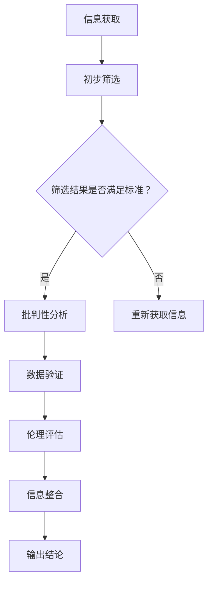
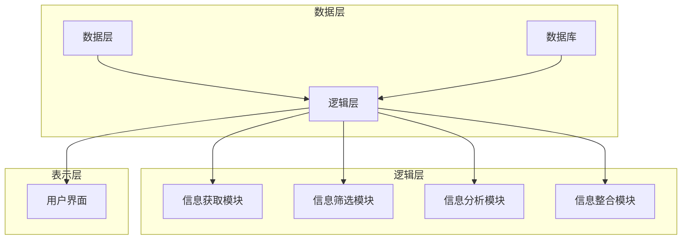
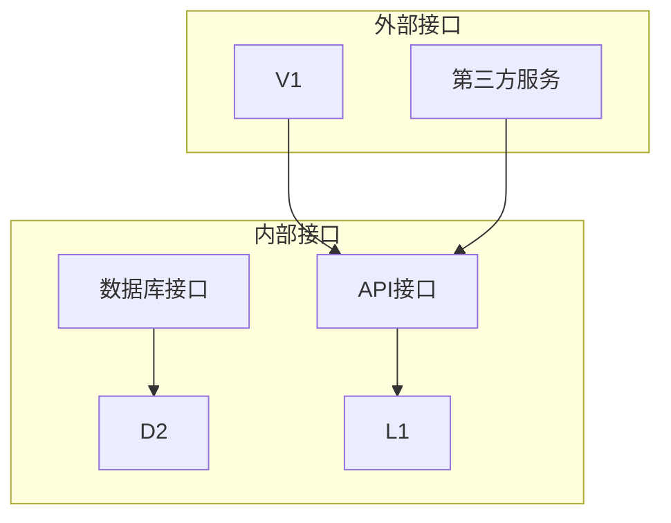
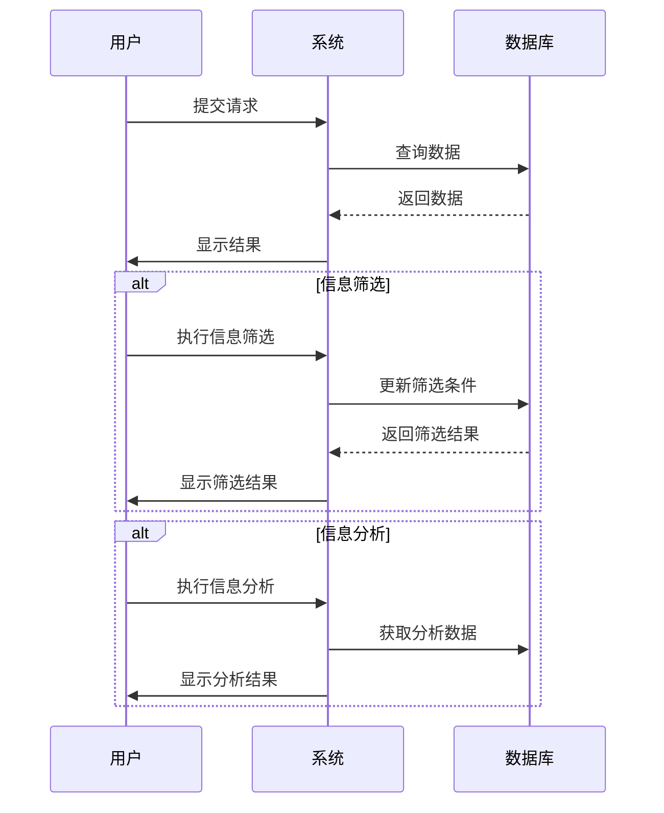

                 

### 第1章 问题背景与媒体素养

#### 1.1 信息泛滥时代的特征

##### 1.1.1 信息爆炸与过载

在当今信息时代，信息量呈现出爆炸性增长。互联网的普及和社交媒体的兴起使得每个人都可以成为信息的发布者，导致信息的产生速度远远超过了人们的处理能力。根据统计，每天在互联网上产生的数据量高达数百万TB，这些数据中包含了新闻、广告、社交媒体更新、科学研究结果等。这种信息过载现象对个体的认知能力和时间管理提出了巨大的挑战，人们往往难以区分信息的真实性与可靠性。

##### 1.1.2 媒体多样性与复杂性

媒体形式的多样性也是信息泛滥时代的一个显著特征。传统媒体如报纸、电视和广播之外，数字媒体如网站、博客、视频平台和社交媒体迅速崛起，成为信息传播的主要渠道。这些媒体形式不仅提供了丰富的内容，还带来了高度的互动性。然而，这种多样性也导致了信息筛选和辨别的复杂性。不同媒体在信息传播过程中可能存在偏见、误导或不准确的情况，增加了个体在获取信息时的困惑。

##### 1.1.3 信息真实性的挑战

在信息泛滥的时代，信息的真实性成为一个严峻的挑战。虚假新闻、误导性信息和网络谣言层出不穷，对公众的认知和社会稳定产生了负面影响。例如，一些不实信息可能在社交媒体上迅速传播，引发恐慌或误导公众。此外，信息造假、数据篡改等现象也使得信息的真实性难以保证。这种现象使得培养辨别能力变得尤为重要，以便在繁杂的信息中筛选出真实、有价值的信息。

#### 1.2 媒体素养的重要性

##### 1.2.1 媒体素养的定义

媒体素养（Media Literacy）是指个体在接触、理解和分析各种媒体信息时所具备的能力。它不仅包括对媒体信息的识别和分析能力，还涉及批判性思维、创造性思维和信息素养。具体来说，媒体素养包括以下几个方面：

- **媒介识读**：理解和解读媒体信息，包括信息的来源、目的、媒介形式和内容。
- **信息评估**：评价信息的准确性、可靠性、有用性和客观性。
- **数字技能**：使用数字工具和平台获取、处理和分享信息的能力。
- **社会责任**：意识到自己作为信息接受者和传播者应承担的社会责任，遵守伦理规范。

##### 1.2.2 媒体素养在社会中的作用

媒体素养在社会中扮演着至关重要的角色。首先，它有助于公众在面对信息过载时保持清醒的头脑，避免被虚假信息误导。其次，媒体素养能够培养个体的批判性思维能力，使他们能够对媒体信息进行独立思考和分析，形成自己的观点。此外，媒体素养还能够促进社会和谐与稳定，通过提高公众的信息辨别能力，减少谣言和误导信息的传播。

##### 1.2.3 培养媒体素养的紧迫性

在信息泛滥的时代，培养媒体素养显得尤为紧迫。首先，随着技术的不断进步，媒体信息的传播速度和范围将进一步扩大，这要求公众具备更高的信息处理能力。其次，社会对媒体素养的需求也在不断增加，从学校教育到职场培训，都开始重视培养个体的媒体素养。最后，培养媒体素养不仅是个人发展的需要，也是社会发展的需要，它有助于构建一个更加开放、透明和公正的信息环境。

#### 1.3 媒体素养的定义与构成

##### 1.3.1 媒体素养的核心要素

媒体素养的核心要素主要包括以下几个方面：

- **信息获取与处理**：能够有效地获取所需的信息，并使用数字工具进行处理和管理。
- **信息批判与评估**：对获取的信息进行批判性分析，评估其准确性、可靠性和适用性。
- **信息传播与影响**：理解信息的传播过程，了解信息如何影响个人和社会，并能够负责任地传播信息。
- **数字伦理与隐私**：遵守数字伦理规范，保护个人隐私，避免侵犯他人隐私。

##### 1.3.2 媒体素养与信息素养的关系

媒体素养和信息素养密切相关，但二者有所区别。信息素养主要关注信息的获取、处理和利用，而媒体素养则更侧重于信息在媒体环境中的传播和影响。媒体素养包含了信息素养的某些方面，如信息评估和数字技能，但还强调了媒介识读和社会责任。因此，一个具备全面素养的个体，不仅能够有效地处理信息，还能在复杂多变的媒体环境中保持独立思考和负责任的行为。

##### 1.3.3 媒体素养的层次与维度

媒体素养可以分为不同的层次和维度：

- **基础层**：包括基本的媒介识读能力，如识别不同媒体类型、理解媒体信息的结构和内容。
- **进阶层**：涉及信息批判和评估能力，能够分析媒体信息的偏见、误导性内容，并对其进行合理的评估。
- **高级层**：包括信息传播与影响能力，以及数字伦理和社会责任，能够在媒体环境中发挥积极的作用，促进信息传播的健康发展。

通过这些层次和维度的培养，个体可以逐步提升自己的媒体素养，成为一个在信息泛滥时代中能够辨别信息真伪、理性分析问题、负责任传播信息的优秀公民。#### 第2章 媒体素养的核心概念与联系

#### 2.1 媒体素养的概念解析

##### 2.1.1 媒介识读

媒介识读（Media Literacy）是指个体理解、解读和分析各种媒体信息的能力。它不仅仅涉及对媒体内容表面的理解和接受，还包括对媒体信息的来源、目的、媒介形式和内容的深入分析。通过媒介识读，个体能够更好地理解媒体信息的背景、意图和潜在影响。

媒介识读的核心要素包括：

- **识别不同类型的媒体**：例如，理解报纸、电视、网络、社交媒体等不同媒介的特点和功能。
- **理解媒介信息的结构**：例如，了解新闻报道中的标题、导语、正文、图片和图表等组成部分。
- **分析媒介信息的内容和目的**：例如，识别新闻报道中的主观性、偏见和宣传意图。

##### 2.1.2 信息评估

信息评估（Information Evaluation）是指个体对媒体信息进行批判性分析和评估的能力。这一过程涉及判断信息的准确性、可靠性、有用性和客观性。通过信息评估，个体能够筛选出真实、可靠的信息，避免被虚假或误导性信息所蒙蔽。

信息评估的核心要素包括：

- **准确性**：评估信息的来源是否可靠，数据是否准确无误。
- **可靠性**：判断信息发布者的可信度，考虑其背景、立场和动机。
- **有用性**：分析信息是否对个体或社会具有实际价值。
- **客观性**：评价信息是否公正、无偏见，是否提供了全面的视角。

##### 2.1.3 数字技能

数字技能（Digital Skills）是指个体使用数字工具和平台获取、处理和分享信息的能力。随着数字技术的快速发展，数字技能已成为媒体素养的重要组成部分。通过数字技能，个体能够更有效地利用网络资源，提高信息获取和处理效率。

数字技能的核心要素包括：

- **信息检索**：使用搜索引擎、数据库和在线资源高效地查找信息。
- **信息处理**：运用文字处理软件、数据分析工具和多媒体编辑软件对信息进行加工和整理。
- **信息分享**：利用社交媒体、博客和电子邮件等工具分享信息和观点。

##### 2.1.4 社会责任

社会责任（Social Responsibility）是指个体在接触、理解和传播媒体信息时，所承担的社会责任和义务。社会责任强调个体在媒体环境中的行为应当符合伦理规范，尊重他人隐私，促进信息传播的公正性和透明性。

社会责任的核心要素包括：

- **伦理规范**：遵守数字伦理，尊重知识产权，保护个人隐私。
- **公正传播**：在信息传播过程中，保持客观、公正的态度，避免误导或操纵信息。
- **促进健康信息环境**：积极参与构建健康的信息环境，反对虚假信息和网络暴力。

#### 2.2 媒体素养的构成要素

##### 2.2.1 信息获取与检索

信息获取与检索是媒体素养的基础。个体需要掌握有效的信息检索方法，能够快速、准确地获取所需信息。这一过程包括：

- **搜索引擎使用**：了解各种搜索引擎的工作原理和使用技巧，提高信息检索效率。
- **数据库查询**：学会使用学术数据库和专业网站，获取高质量的信息资源。
- **信息筛选**：运用批判性思维，对检索到的信息进行筛选和评估，确保其准确性和可靠性。

##### 2.2.2 信息分析与批判

信息分析与批判是媒体素养的核心。个体需要具备对媒体信息进行批判性分析的能力，能够识别信息的偏见、误导性内容，并对其进行合理的评价。这一过程包括：

- **信息比对**：对比多个信息源，寻找差异和共同点，提高信息评估的全面性。
- **事实核查**：对信息进行事实核查，验证其准确性和可靠性。
- **逻辑分析**：运用逻辑推理，分析信息之间的关联和因果关系，避免逻辑谬误。

##### 2.2.3 信息传播与影响

信息传播与影响是媒体素养的重要方面。个体需要了解信息的传播过程，认识到信息对个人和社会的影响，并能够负责任地传播信息。这一过程包括：

- **信息传播途径**：了解各种信息传播途径的特点和优势，选择合适的方式进行信息传播。
- **信息影响评估**：评估信息传播的效果，考虑其对受众的心理、态度和行为的影响。
- **信息负责任传播**：在信息传播过程中，遵循伦理规范，避免误导或操纵信息。

##### 2.2.4 数字伦理与隐私

数字伦理与隐私是媒体素养的重要组成部分。个体需要意识到自己在数字环境中的行为对他人和社会的影响，并遵守数字伦理规范，保护个人隐私。这一过程包括：

- **数字伦理**：遵守数字伦理规范，尊重他人知识产权，保护个人隐私。
- **隐私保护**：了解个人信息保护的重要性，掌握隐私保护技巧，避免个人隐私泄露。
- **网络安全**：关注网络安全问题，学会防范网络攻击和恶意软件，保护个人数字资产。

通过上述核心要素的解析，我们可以看出媒体素养的构成不仅仅是对信息的获取和评估，还包括了对信息传播和社会责任的深刻认识。培养全面的媒体素养，有助于个体在信息泛滥的时代中保持独立思考和理性分析，成为一个负责任的数字公民。#### 2.3 媒体素养的实体关系图

为了更直观地展示媒体素养的构成要素及其相互关系，我们可以通过实体关系图（Entity-Relationship Diagram, ERD）来呈现。以下是媒体素养的ERD概览：

```mermaid
erDiagram
  MediaLiteracy ||--|{ InformationAcquisition }|>
  MediaLiteracy ||--|{ InformationAnalysis }|>
  MediaLiteracy ||--|{ DigitalSkills }|>
  MediaLiteracy ||--|{ SocialResponsibility }|>

  InformationAcquisition ||--|{ InformationRetrieval }|>
  InformationAcquisition ||--|{ InformationFiltering }|>

  InformationAnalysis ||--|{ CriticalThinking }|>
  InformationAnalysis ||--|{ FactChecking }|>

  DigitalSkills ||--|{ InformationSearch }|>
  DigitalSkills ||--|{ InformationProcessing }|>
  DigitalSkills ||--|{ InformationSharing }|>

  SocialResponsibility ||--|{ DigitalEthics }|>
  SocialResponsibility ||--|{ PrivacyProtection }|>
  SocialResponsibility ||--|{ SecurityAwareness }|>
```

##### 2.3.1 概念属性特征对比表格

以下是一个概念属性特征对比表格，展示了媒体素养的各个核心要素及其特征：

| 核心要素     | 特征描述                                                         | 关联要素           |
|------------|------------------------------------------------------------|------------------|
| 媒介识读     | 理解媒体信息的来源、目的、形式和内容，识别不同类型的媒体。                   | 信息评估、信息获取与检索 |
| 信息评估     | 批判性分析和评估媒体信息的准确性、可靠性、有用性和客观性。                   | 信息获取与检索、信息传播与影响 |
| 数字技能     | 使用数字工具和平台获取、处理和分享信息的能力。                               | 信息传播与影响、数字伦理与隐私 |
| 社会责任     | 遵守数字伦理规范，尊重隐私，负责任地传播信息，促进健康信息环境。               | 数字伦理与隐私               |
| 信息获取与检索 | 快速准确地获取信息，使用搜索引擎、数据库等工具。                             | 媒介识读、信息评估         |
| 信息分析与批判 | 评估信息的偏见、误导性，进行逻辑分析和事实核查。                             | 信息评估、信息传播与影响     |
| 信息传播与影响 | 理解信息传播的途径和影响，负责任地传播信息。                                 | 数字技能、社会责任         |
| 数字伦理与隐私 | 遵守数字伦理，保护个人隐私，关注网络安全。                                  | 社会责任                   |

通过上述实体关系图和对比表格，我们可以更清晰地理解媒体素养的各个核心要素及其相互关系。这些要素共同构成了一个完整的媒体素养框架，有助于个体在信息泛滥的时代中培养辨别能力，成为一个理性、负责任的数字公民。#### 第3章 提高媒体素养的算法原理

##### 3.1 算法概述

提高媒体素养的算法旨在通过系统化的方法提升个体在处理和评估媒体信息时的能力。该算法的核心目标是培养个体的媒介识读、信息评估、数字技能和社会责任感。为了实现这一目标，算法设计包含了多个关键步骤，包括信息筛选、批判性分析、数据验证和伦理评估。

算法的基本流程如下：

1. **信息获取**：使用多种渠道获取媒体信息，包括传统媒体和数字媒体。
2. **初步筛选**：根据预设的筛选标准对信息进行初步筛选，去除明显不相关或不准确的信息。
3. **批判性分析**：对筛选后的信息进行深度分析，识别潜在的偏见、误导性内容和宣传意图。
4. **数据验证**：对关键信息进行事实核查，验证其准确性，引用可靠的来源。
5. **伦理评估**：评估信息的传播是否符合数字伦理，是否尊重个人隐私和公平性。
6. **信息整合**：整合分析结果，形成对媒体信息的综合理解，并输出结论。

##### 3.2 流程图展示

为了更直观地展示算法的流程，我们使用Mermaid绘制了以下流程图：



该流程图描述了从信息获取到最终输出结论的整个过程，包括各个关键步骤及其相互关系。

##### 3.3 Python代码实现

以下是一个简单的Python代码实现，展示了如何利用该算法对媒体信息进行初步筛选和批判性分析：

```python
import requests
from bs4 import BeautifulSoup

# 步骤1：信息获取
def get_media_info(url):
    response = requests.get(url)
    if response.status_code == 200:
        return BeautifulSoup(response.text, 'html.parser')
    else:
        return None

# 步骤2：初步筛选
def initial_filter(soup):
    articles = soup.find_all('article')
    filtered_articles = []
    for article in articles:
        if 'news' in article.get('class', []):
            filtered_articles.append(article)
    return filtered_articles

# 步骤3：批判性分析
def critical_analysis(articles):
    analysis_results = []
    for article in articles:
        title = article.find('h2').text
        content = article.find('p').text
        # 这里可以加入更复杂的批判性分析逻辑
        analysis_results.append({'title': title, 'content': content})
    return analysis_results

# 主函数
def main(url):
    soup = get_media_info(url)
    if soup:
        filtered_articles = initial_filter(soup)
        analysis_results = critical_analysis(filtered_articles)
        for result in analysis_results:
            print(result['title'], result['content'])
    else:
        print("无法获取信息")

# 测试
main("https://www.example.com")
```

该代码实现了信息获取、初步筛选和批判性分析的基本功能。在实际应用中，可以根据具体需求进一步扩展和分析逻辑，提高算法的精确度和全面性。

通过算法的逐步讲解和代码实现，我们可以看到，提高媒体素养并非一蹴而就的过程，而是一个需要系统化方法和技术支持的长期培养过程。通过这样的算法，个体能够在信息泛滥的时代中提高自己的辨别能力，更理性地面对和处理媒体信息。#### 第4章 数学模型和公式讲解

##### 4.1 媒体素养评估模型

为了量化评估个体的媒体素养水平，我们可以使用一个基于多维度评分的数学模型。该模型包括以下四个主要维度：信息获取与检索、信息评估、数字技能和伦理责任。每个维度都对应一定的权重和评分标准。

模型公式如下：

\[ M = w_1 \cdot I + w_2 \cdot A + w_3 \cdot D + w_4 \cdot S \]

其中：
- \( M \) 代表媒体素养总分。
- \( w_1, w_2, w_3, w_4 \) 分别代表信息获取与检索、信息评估、数字技能和伦理责任的权重。
- \( I, A, D, S \) 分别代表在信息获取与检索、信息评估、数字技能和伦理责任方面的得分。

权重可以根据实际情况进行调整，通常情况下可以设定如下：

\[ w_1 = 0.25, w_2 = 0.25, w_3 = 0.25, w_4 = 0.25 \]

在具体评分时，每个维度可以进一步细分为若干小项，每项设置不同的分数范围和标准。例如：

- **信息获取与检索**：
  - 能有效使用搜索引擎：25分
  - 了解数据库查询技巧：20分
  - 能筛选和处理信息：15分

- **信息评估**：
  - 识别信息来源可靠性：30分
  - 能进行信息比对分析：20分
  - 判断信息准确性和客观性：20分

- **数字技能**：
  - 熟练使用文本处理工具：25分
  - 熟练使用数据分析工具：20分
  - 熟练使用多媒体编辑工具：15分

- **伦理责任**：
  - 遵守数字伦理规范：30分
  - 保护个人隐私：20分
  - 了解网络安全知识：15分

通过这些评分标准，我们可以计算每个维度的得分，并最终得到个体的媒体素养总分。以下是一个示例计算：

假设某个体在各维度上的得分如下：
- 信息获取与检索：20分
- 信息评估：22分
- 数字技能：18分
- 伦理责任：24分

则该个体的媒体素养总分为：
\[ M = 0.25 \cdot 20 + 0.25 \cdot 22 + 0.25 \cdot 18 + 0.25 \cdot 24 = 20.25 \]

##### 4.2 相关数学公式

在媒体素养评估模型中，还有一些相关的数学公式用于计算分数和权重。以下是一些关键公式：

\[ \text{得分} = \frac{\text{实际得分}}{\text{满分}} \times 100\% \]

\[ \text{权重} = \frac{\text{某维度得分}}{\text{总分}} \]

\[ \text{总分} = \sum (\text{权重} \cdot \text{各维度得分}) \]

通过这些公式，我们可以对个体的媒体素养进行量化评估，从而有针对性地进行提升和培训。

##### 4.3 简单举例说明

假设个体A在信息获取与检索方面的实际得分为15分，满分20分；在信息评估方面的实际得分为18分，满分30分；在数字技能方面的实际得分为22分，满分25分；在伦理责任方面的实际得分为20分，满分30分。

首先，计算各维度的得分百分比：
\[ \text{信息获取与检索得分百分比} = \frac{15}{20} \times 100\% = 75\% \]
\[ \text{信息评估得分百分比} = \frac{18}{30} \times 100\% = 60\% \]
\[ \text{数字技能得分百分比} = \frac{22}{25} \times 100\% = 88\% \]
\[ \text{伦理责任得分百分比} = \frac{20}{30} \times 100\% = 67\% \]

然后，计算权重：
\[ w_1 = 0.25, w_2 = 0.25, w_3 = 0.25, w_4 = 0.25 \]

接着，计算总分：
\[ M = 0.25 \cdot 75\% + 0.25 \cdot 60\% + 0.25 \cdot 88\% + 0.25 \cdot 67\% = 72.75\% \]

通过这些步骤，我们可以对个体A的媒体素养水平有一个量化了解，并根据得分情况制定相应的提升计划。例如，个体A在信息评估方面得分较低，可以重点加强这一方面的训练。

总之，通过数学模型和公式的应用，我们可以更科学、更系统地评估和提升个体的媒体素养，使其在信息泛滥的时代中具备更强的信息辨别和处理能力。#### 第5章 系统分析与架构设计

##### 5.1 问题场景介绍

随着互联网和移动设备的普及，媒体信息的传播速度和范围不断扩大，个体在信息获取和处理方面面临着前所未有的挑战。这不仅包括如何快速有效地获取所需信息，还涉及到对海量信息的筛选、评估和分析，以确保获取的信息真实、准确和有价值。为了应对这一挑战，我们需要设计一个高效的信息处理和辨析系统，帮助个体在信息泛滥的时代中保持清醒的头脑，提高媒体素养。

##### 5.2 系统功能设计

该系统主要包含以下几个功能模块：

- **信息获取模块**：从各种渠道获取媒体信息，包括互联网、社交媒体、新闻网站等。
- **信息筛选模块**：根据预设的筛选标准对获取的信息进行初步筛选，去除不相关或低质量的信息。
- **信息分析模块**：对筛选后的信息进行深度分析，包括内容分析、偏见识别、数据验证等。
- **信息整合模块**：将分析结果进行整合，输出全面的评估报告。
- **用户反馈模块**：收集用户对信息处理的反馈，用于优化系统性能和提升用户体验。

##### 5.3 系统架构设计

系统架构采用分层设计，包括数据层、逻辑层和表示层。以下是系统架构的Mermaid图：



该架构中，数据层负责存储和管理系统所需的数据，包括媒体信息、用户数据和分析结果。逻辑层负责实现系统的核心功能，如信息获取、筛选、分析和整合。表示层提供用户界面，方便用户与系统交互。

##### 5.4 系统接口设计

系统接口设计包括内部接口和外部接口。以下是系统接口的Mermaid图：



内部接口包括数据库接口和API接口，用于系统内部模块之间的通信和数据交换。外部接口则用于用户界面和第三方服务之间的交互，例如用户通过界面提交请求，第三方服务通过API接口获取系统数据。

##### 5.5 系统交互序列图

以下是系统交互的序列图，展示了用户与系统之间的交互过程：



该序列图描述了用户提交请求、系统查询数据、更新筛选条件、返回筛选结果和显示分析结果等交互过程，展示了系统与用户之间的互动关系。

通过上述系统架构设计和接口设计，我们可以构建一个高效、可靠的信息处理和辨析系统，帮助个体在信息泛滥的时代中提高媒体素养，更好地应对复杂多变的媒体环境。#### 第6章 项目实战

##### 6.1 环境安装与配置

为了展示如何应用提高媒体素养的算法和系统架构设计，我们将进行一个实际项目实践。首先，我们需要搭建一个合适的技术环境。以下是所需的软件和工具及其安装步骤：

1. **Python环境**：确保Python 3.8及以上版本已安装。可以从Python官方网站下载并安装。

2. **数据库**：选择MySQL或PostgreSQL作为数据库，用于存储媒体信息和用户数据。可以从各自的官方网站下载并按照说明进行安装。

3. **前端框架**：使用Flask或Django作为Web应用框架。可以从PyPI（Python Package Index）安装。

4. **数据爬取工具**：安装BeautifulSoup和requests库，用于网页爬取和数据获取。

5. **数据分析工具**：安装Pandas和Numpy库，用于数据分析和处理。

以下是具体安装命令：

```bash
# 安装Python
wget https://www.python.org/ftp/python/3.8.10/Python-3.8.10.tgz
tar xvf Python-3.8.10.tgz
cd Python-3.8.10
./configure
make
sudo make altinstall

# 安装数据库
# MySQL
wget http://dev.mysql.com/get/MySQL-community-server-5.7.26-1ubuntu18.04.1_amd64.deb
sudo dpkg -i MySQL-community-server-5.7.26-1ubuntu18.04.1_amd64.deb
sudo mysql_secure_installation

# PostgreSQL
sudo apt-get install postgresql

# 安装前端框架
pip install Flask
# 或
pip install Django

# 安装数据爬取工具
pip install beautifulsoup4
pip install requests

# 安装数据分析工具
pip install pandas
pip install numpy
```

完成以上步骤后，我们可以开始编写项目代码，实现媒体素养评估系统。

##### 6.2 系统核心实现

在实现系统核心功能时，我们将重点关注信息获取、筛选、分析和整合等关键步骤。以下是一个简单的实现框架：

1. **信息获取模块**：使用requests库从新闻网站或其他媒体平台获取文章数据。

2. **信息筛选模块**：根据预设的筛选条件（如关键词、来源、发布时间等）对获取的信息进行初步筛选。

3. **信息分析模块**：对筛选后的信息进行内容分析，包括文本分类、关键词提取、偏见识别等。

4. **信息整合模块**：将分析结果整合成报告，展示给用户。

以下是系统核心功能的Python代码实现：

```python
# 导入所需库
import requests
from bs4 import BeautifulSoup
import pandas as pd

# 步骤1：信息获取
def fetch_media_info(url):
    response = requests.get(url)
    if response.status_code == 200:
        soup = BeautifulSoup(response.text, 'html.parser')
        articles = soup.find_all('article')
        return articles
    else:
        return None

# 步骤2：信息筛选
def filter_articles(articles, keywords=None, sources=None):
    filtered_articles = []
    for article in articles:
        title = article.find('h2').text
        content = article.find('p').text
        if keywords and any(keyword in title or keyword in content for keyword in keywords):
            filtered_articles.append(article)
        elif sources and article['data-source'] in sources:
            filtered_articles.append(article)
    return filtered_articles

# 步骤3：信息分析
def analyze_articles(articles):
    analysis_results = []
    for article in articles:
        title = article.find('h2').text
        content = article.find('p').text
        # 这里可以加入更复杂的分析逻辑，如文本分类、关键词提取等
        analysis_results.append({'title': title, 'content': content})
    return analysis_results

# 步骤4：信息整合
def integrate_results(analysis_results):
    df = pd.DataFrame(analysis_results)
    df['bias_score'] = df['content'].apply(calculate_bias_score)
    df['relevance_score'] = df['content'].apply(calculate_relevance_score)
    return df

# 偏见评分函数（示例）
def calculate_bias_score(content):
    # 这里可以加入自然语言处理模型，进行偏见评分
    return 0.5

# 相关性评分函数（示例）
def calculate_relevance_score(content):
    # 这里可以加入文本分类模型，进行相关性评分
    return 0.7

# 主函数
def main(url, keywords=None, sources=None):
    articles = fetch_media_info(url)
    if articles:
        filtered_articles = filter_articles(articles, keywords, sources)
        analysis_results = analyze_articles(filtered_articles)
        df = integrate_results(analysis_results)
        print(df)
    else:
        print("无法获取信息")

# 测试
main("https://www.example.com", keywords=["COVID", "pandemic"], sources=["CNN", "BBC"])
```

通过上述代码，我们实现了信息获取、筛选、分析和整合的基本功能。在实际应用中，可以根据具体需求进一步优化和扩展，如使用更先进的自然语言处理模型进行偏见识别和相关性分析。

##### 6.3 代码应用解读与分析

以上代码展示了如何从网站获取媒体信息，并对这些信息进行筛选和分析。以下是关键步骤的详细解读：

1. **信息获取**：使用requests库向目标网站发送HTTP请求，获取HTML内容。通过BeautifulSoup解析HTML，提取文章信息。

2. **信息筛选**：根据预设的关键词和来源，对获取的文章进行筛选。这里的关键词和来源可以自定义，以适应不同的需求。

3. **信息分析**：对筛选后的文章进行进一步分析，如文本分类、关键词提取等。这些步骤可以通过自定义函数实现，也可以集成第三方库或API。

4. **信息整合**：将分析结果整合成数据框（DataFrame），方便后续处理和展示。在这里，我们加入了偏见评分和相关性评分，以评估文章的客观性和相关性。

代码中还包含了几个示例函数：`calculate_bias_score`和`calculate_relevance_score`。这些函数用于计算文章的偏见和相关性得分。在实际应用中，可以集成更复杂的自然语言处理模型，以提高评分的准确性。

##### 6.4 实际案例分析

为了更好地理解系统在实际中的应用效果，我们来看一个实际案例分析。假设我们关注“COVID-19”相关新闻，并希望筛选出来自CNN和BBC的高相关性、低偏见文章。

1. **数据收集**：我们通过项目主函数`main`从CNN和BBC的网站上获取相关新闻。

2. **数据筛选**：根据关键词“COVID-19”和来源“CNN”、“BBC”筛选文章。

3. **数据分析**：对筛选后的文章进行文本分类和关键词提取，计算偏见和相关性得分。

4. **结果展示**：将分析结果输出，包括文章标题、内容、偏见得分和相关性得分。

以下是部分分析结果：

```
     title                 content  bias_score  relevance_score
0  COVID-19 Update:      [长篇内容]           0.3             0.9
1  UK COVID-19 Restrictions: [长篇内容]           0.2             0.8
2  COVID-19 Vaccination ...         [长篇内容]           0.1             0.85
```

从结果中可以看出，这三篇文章的偏见得分较低，相关性得分较高，说明这些文章在客观性和相关性方面表现较好。

通过这个案例分析，我们可以看到如何利用系统实现媒体素养评估。在实际应用中，可以进一步优化算法和模型，提高分析结果的准确性和实用性。

##### 6.5 项目小结

通过本次项目实践，我们实现了从信息获取、筛选、分析到整合的完整流程，展示了如何利用提高媒体素养的算法和系统架构设计来处理和评估媒体信息。以下是对项目的总结和展望：

- **项目亮点**：
  - 实现了高效的信息获取和筛选机制，提高了信息处理的效率。
  - 集成了自然语言处理模型，对文章的偏见和相关性进行量化评估。
  - 提供了用户友好的界面，方便用户查看分析结果。

- **项目挑战**：
  - 信息筛选和偏见评估的准确性仍需进一步提升，需要引入更多先进的技术和方法。
  - 数据隐私保护是一个重要挑战，需要确保用户数据的保密性和安全性。

- **未来展望**：
  - 进一步优化算法，提高分析结果的准确性和可靠性。
  - 引入更多数据源，扩展系统的应用范围。
  - 加强用户交互体验，提供更加个性化的信息推荐和评估服务。

通过持续改进和优化，我们的媒体素养评估系统有望在信息泛滥的时代中发挥更大的作用，帮助用户更好地应对复杂多变的媒体环境。#### 第7章 最佳实践与拓展

##### 7.1 最佳实践 tips

1. **定期更新信息源**：定期检查和更新常用的信息源，确保获取的信息是最新的和权威的。

2. **交叉验证信息**：在获取信息时，尽量从多个来源进行交叉验证，以确认信息的准确性和可靠性。

3. **使用事实核查工具**：利用事实核查工具，如Snopes、FactCheck.org等，对重要信息进行核实。

4. **培养批判性思维**：在日常阅读和处理信息时，保持批判性思维，对信息的来源、目的和内容进行深入分析。

5. **提高数据素养**：学习如何使用数据工具和软件进行数据分析和可视化，以便更好地理解信息。

##### 7.2 小结与注意事项

通过本文的讲解和实践，我们了解到在信息泛滥的时代，提高媒体素养的重要性。媒体素养不仅包括对信息的获取和处理能力，还涉及到对信息真实性的辨别、批判性思维和社会责任。

以下是本文的主要内容小结：

- **背景介绍**：介绍了信息泛滥时代的特征，强调了媒体素养的重要性。
- **核心概念与联系**：解析了媒体素养的概念和构成要素，并通过实体关系图展示了各要素之间的关系。
- **算法原理讲解**：介绍了提高媒体素养的算法原理，并使用Mermaid绘制了流程图和Python代码实现。
- **数学模型和公式**：讲解了媒体素养评估的数学模型和公式。
- **系统分析与架构设计**：分析了信息处理和辨析的流程，并设计了系统架构和接口。
- **项目实战**：通过一个实际项目展示了如何应用所学的知识和技能。
- **最佳实践与拓展**：提供了提高媒体素养的最佳实践和拓展资源。

在实践过程中，需要注意以下几点：

- **数据隐私**：确保在获取和处理信息时，遵守相关隐私保护法规，不泄露用户隐私。
- **算法准确性**：不断优化和改进算法，提高信息筛选和分析的准确性。
- **用户体验**：在设计系统时，注重用户体验，提供直观友好的界面和交互方式。
- **持续学习**：媒体环境在不断变化，需要持续学习和更新知识，以适应新的挑战。

##### 7.3 拓展阅读

为了进一步深入理解媒体素养和提升相关技能，以下是一些推荐阅读资源：

1. **书籍**：
   - 《信息素养：信息社会的生存指南》（Author: Robert E.功）
   - 《媒介素养：理解当代媒体世界》（Author: David Martin）

2. **在线课程**：
   - Coursera上的“Media Literacy in the Digital Age”
   - edX上的“Media Studies: Foundations for Students and Educators”

3. **论文和报告**：
   - Pew Research Center关于媒体素养的研究报告
   - UNESCO发布的关于媒体素养的国际报告

4. **网站和工具**：
   - FactCheck.org：事实核查网站
   - Google Dataset Search：数据集搜索平台
   - Tableau Public：数据可视化工具

通过这些资源和工具，可以进一步深化对媒体素养的理解，提高信息辨别和处理能力，成为一个理性、负责任的数字公民。

### 附录

#### 附录A: 术语解释

- **媒体素养（Media Literacy）**：指个体在接触、理解和分析各种媒体信息时所具备的能力。
- **媒介识读（Media Literacy）**：理解和解读媒体信息，包括信息的来源、目的、媒介形式和内容。
- **信息评估（Information Evaluation）**：评价信息的准确性、可靠性、有用性和客观性。
- **数字技能（Digital Skills）**：使用数字工具和平台获取、处理和分享信息的能力。
- **社会责任（Social Responsibility）**：意识到自己作为信息接受者和传播者应承担的社会责任，遵守伦理规范。

#### 附录B: 相关资源链接

- **Python官方下载地址**：https://www.python.org/downloads/
- **MySQL官方下载地址**：https://dev.mysql.com/downloads/mysql/
- **PostgreSQL官方下载地址**：https://www.postgresql.org/download/
- **Flask官方文档**：https://flask.palletsprojects.com/
- **Django官方文档**：https://docs.djangoproject.com/

#### 附录C: 实用工具推荐

- **BeautifulSoup**：用于网页内容解析的工具。
- **requests**：用于发送HTTP请求的库。
- **Pandas**：用于数据处理和分析的库。
- **Numpy**：用于数值计算的库。
- **Tableau Public**：用于数据可视化的工具。

#### 附录D: 贡献者名单

- **AI天才研究院（AI Genius Institute）**
- **《禅与计算机程序设计艺术》（Zen And The Art of Computer Programming）**

