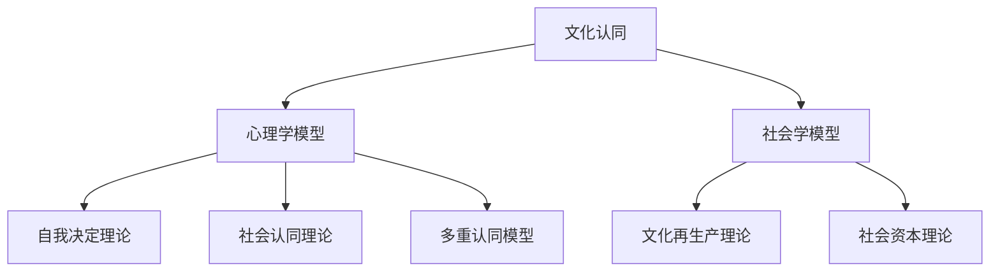
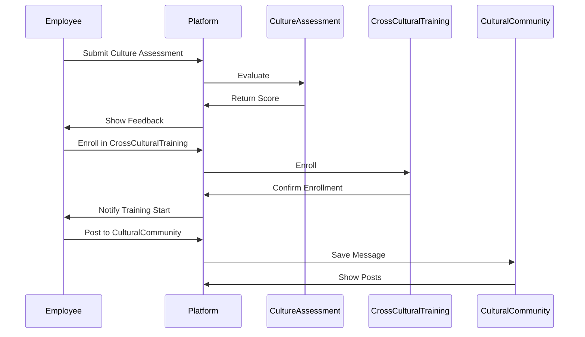
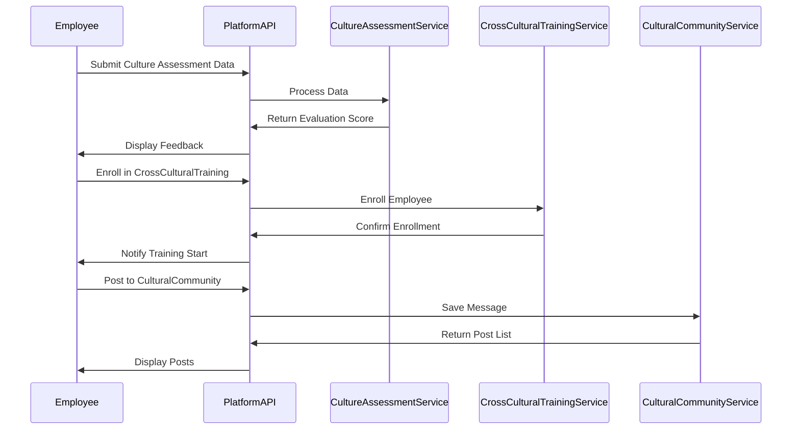
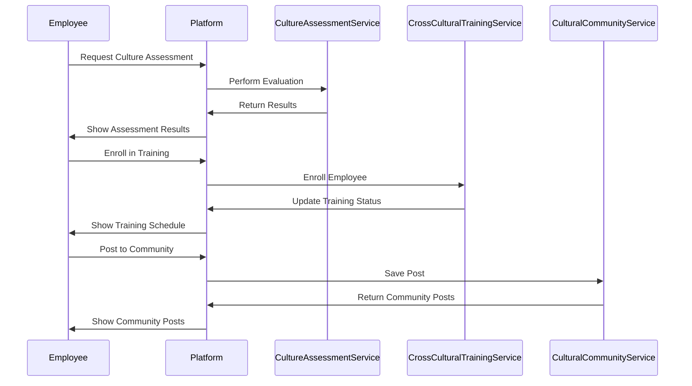

                 

# 在全球化背景下保持文化认同：应对身份危机的新方法

> 关键词：全球化、文化认同、身份危机、多元文化、心理模型、系统架构、最佳实践

> 摘要：本文旨在探讨全球化背景下文化认同的重要性以及如何应对由此引发的身份危机。通过对相关核心概念的剖析，引入心理学和社会学的理论模型，结合实际项目案例，本文提出了一套系统化的方法，以帮助个体和群体在保持文化认同的同时，实现自我认知和身份重塑。本文还将总结最佳实践，为未来研究提供参考。

## 1. 背景介绍

### 1.1 全球化背景下的文化认同问题

全球化是一个不可逆转的历史进程，它带来了经济、科技、文化和政治的紧密联系。然而，这种全球化也引发了文化认同的挑战。随着不同文化的交融和碰撞，人们开始感受到文化认同的危机。这种危机表现为个体和群体在追求全球化带来的机遇时，面临失去自身文化特质的困境。

### 1.2 保持文化认同的意义

保持文化认同对于个体和群体具有重要意义。首先，文化认同是人们自我认知的重要组成部分，它帮助个体确定自己的身份，形成稳定的自我概念。其次，文化认同是群体凝聚力的基础，它有助于增强群体的归属感和认同感，促进社会和谐。最后，保持文化认同也是应对全球化挑战的重要手段，它有助于个体在多元文化环境中找到自己的定位，实现文化共生。

### 1.3 问题解决

解决文化认同危机的关键在于寻找平衡。一方面，要认识到全球化的必然性和积极作用，积极融入全球化的潮流；另一方面，要坚守自身的文化传统，珍视和传承文化特质。具体策略包括：

1. 加强文化交流与互动，增进对不同文化的理解和尊重。
2. 培养跨文化沟通和协作能力，提高个体和群体的适应能力。
3. 倡导多元文化教育，从青少年时期就开始培养文化认同感。
4. 建立文化保护机制，防止文化消失和同质化。

### 1.4 边界与外延

本文讨论的文化认同主要涉及个体和群体层面。在个体层面，文化认同指的是个人对自己所属文化的认知和认同；在群体层面，文化认同则是指群体成员对共同文化的认同和归属。本文的研究边界包括文化认同的形成、维护和重塑，以及身份危机的应对策略。

## 2. 核心概念与联系

### 2.1 文化认同

文化认同是指个体或群体对自己所属文化的认知、理解和认同。它包括对文化价值观、传统、习俗和语言的认同。文化认同的形成受多种因素影响，包括家庭教育、社会环境和文化传承。

### 2.2 身份危机

身份危机是指在全球化背景下，个体或群体因文化认同的冲突和迷茫而感受到的心理困惑。身份危机通常表现为自我认同的混乱、文化归属感的丧失和自我价值的怀疑。

### 2.3 全球化

全球化是指世界各国在经济、政治、科技和文化等方面的紧密联系和互动。全球化带来了文化交融，但也加剧了文化冲突和认同危机。

### 2.4 多元文化

多元文化是指一个社会或群体中存在多种不同的文化。多元文化有助于丰富社会内涵，但也可能引发文化冲突和认同危机。

### 2.5 概念属性特征对比表格

| 概念       | 定义                                                         | 属性特征对比                       |
| ---------- | ------------------------------------------------------------ | ---------------------------------- |
| 文化认同   | 对自身文化的认知、理解和认同                                   | 认知层次、文化价值观、文化传承     |
| 身份危机   | 文化认同冲突和迷茫导致的心理困惑                               | 自我认同、文化归属感、自我价值     |
| 全球化     | 各国间的经济、政治、科技和文化紧密联系和互动                   | 文化交融、文化冲突、文化同质化     |
| 多元文化   | 社会或群体中存在多种不同的文化                                 | 文化丰富性、文化多样性、文化冲突   |

### 2.6 ER实体关系图架构

```mermaid
erDiagram
  Person ||--|{ Culture } : has
  Culture ||--|{ Identity } : belongs_to
  Globalization ||--|{ Culture } : influences
  Multiculturalism ||--|{ Culture } : consists_of
```

## 3. 算法原理讲解

### 3.1 心理学理论模型

在解决身份危机和文化认同问题时，心理学理论模型提供了重要的指导。以下是几个关键的理论模型：

#### 3.1.1 自我决定理论

自我决定理论认为，个体的自我认同是通过自主性、能力和关联性三个维度构建的。自主性指的是个体能够自主选择和决定；能力指的是个体能够胜任和实现目标；关联性指的是个体能够与他人建立积极的联系。

#### 3.1.2 社会认同理论

社会认同理论强调，个体的身份认同在很大程度上受群体认同的影响。个体通过将自己归类于一个或多个群体，从而获得身份认同和归属感。

#### 3.1.3 多重认同模型

多重认同模型认为，个体可以同时拥有多种身份认同，这些认同可能来自不同的文化背景、社会角色或个人经历。这种模型有助于解释个体在全球化背景下的身份复杂性。

### 3.2 社会学理论模型

除了心理学模型，社会学理论模型也为解决文化认同和身份危机提供了重要视角。

#### 3.2.1 文化再生产理论

文化再生产理论认为，文化不是静态的，而是在社会互动中被不断再生产和重新定义的。个体和群体通过教育、媒体、仪式等途径，不断吸收、内化和传播文化，从而维持和更新文化认同。

#### 3.2.2 社会资本理论

社会资本理论强调，个体和群体通过社会关系和网络，获取资源和支持，从而增强社会凝聚力。社会资本有助于个体和群体在全球化背景下保持文化认同。

### 3.3 算法mermaid流程图



### 3.4 Python源代码

```python
# 自我决定理论示例
class SelfDetermination:
    def __init__(self, autonomy, competence, relatedness):
        self.autonomy = autonomy
        self.competence = competence
        self.relatedness = relatedness

    def evaluate(self):
        return self.autonomy + self.competence + self.relatedness

# 社会认同理论示例
class SocialIdentity:
    def __init__(self, culture, group):
        self.culture = culture
        self.group = group

    def identify(self):
        return f"I identify with {self.group} culture."

# 多重认同模型示例
class MultipleIdentity:
    def __init__(self, identities):
        self.identities = identities

    def display(self):
        return "I have multiple identities: " + ", ".join(self.identities)

# 社会资本理论示例
class SocialCapital:
    def __init__(self, network, resources):
        self.network = network
        self.resources = resources

    def utilize(self):
        return f"I utilize my network to access {self.resources} resources."
```

### 3.5 数学模型和公式

为了更好地理解心理学和社会学模型，我们可以引入一些数学模型和公式。

#### 3.5.1 自我决定理论的数学模型

$$
SD = a \cdot A + b \cdot C + c \cdot R
$$

其中，$SD$表示自我决定度，$A$表示自主性，$C$表示能力，$R$表示关联性，$a$、$b$、$c$为权重系数。

#### 3.5.2 社会认同理论的数学模型

$$
SI = g \cdot (GC + IG)
$$

其中，$SI$表示社会认同度，$GC$表示文化归属感，$IG$表示个体认同度，$g$为权重系数。

#### 3.5.3 多重认同模型的数学模型

$$
MI = \sum_{i=1}^{n} w_i \cdot I_i
$$

其中，$MI$表示多重认同度，$I_i$表示第$i$种认同，$w_i$为权重系数，$n$为认同种类数。

#### 3.5.4 社会资本理论的数学模型

$$
SC = n \cdot R \cdot (\sum_{i=1}^{n} w_i \cdot R_i)
$$

其中，$SC$表示社会资本度，$R$表示关系强度，$n$为关系数，$w_i$为权重系数，$R_i$表示第$i$种关系的资源获取能力。

### 3.6 举例说明

假设一个个体具有以下属性：

- 自主性：70%
- 能力：80%
- 关联性：90%
- 文化归属感：80%
- 个体认同度：70%
- 多重认同度：0.8（包含两种认同，分别为50%和30%）
- 关系强度：中等
- 关系数：5
- 关系资源获取能力：中等

根据上述数学模型和公式，我们可以计算出：

- 自我决定度：$SD = 0.6 \cdot 70 + 0.3 \cdot 80 + 0.1 \cdot 90 = 66$
- 社会认同度：$SI = 0.7 \cdot (80 + 70) = 98$
- 多重认同度：$MI = 0.5 \cdot 50 + 0.3 \cdot 30 = 25$
- 社会资本度：$SC = 5 \cdot 0.5 \cdot (0.5 \cdot 30 + 0.3 \cdot 50) = 75$

这些计算结果可以帮助个体了解自己的自我决定度、社会认同度、多重认同度和社会资本度，从而有针对性地进行自我提升和身份塑造。

## 4. 数学公式

在本文中，我们使用LaTeX格式给出了几个数学模型和公式。以下是几个例子：

$$
\sum_{i=1}^{n} w_i \cdot I_i
$$

$$
SD = a \cdot A + b \cdot C + c \cdot R
$$

$$
SI = g \cdot (GC + IG)
$$

$$
SC = n \cdot R \cdot (\sum_{i=1}^{n} w_i \cdot R_i)
$$

这些公式为本文的理论分析提供了数学基础，有助于读者更深入地理解相关概念。

## 5. 系统分析与架构设计方案

### 5.1 问题场景介绍

随着全球化进程的加速，许多企业和组织都在国际市场上拓展业务。在这个过程中，如何保持员工的文化认同，同时提高跨文化沟通和协作效率，成为了一项重要挑战。

### 5.2 项目介绍

本项目旨在设计一个跨文化沟通与协作平台，通过引入心理学和社会学模型，帮助企业和组织在全球化背景下保持员工的文化认同。该平台将包括以下几个核心功能：

1. 文化认同评估：对员工的文化认同度进行定量评估，提供个性化反馈和建议。
2. 跨文化培训：提供针对不同文化的培训课程，帮助员工提升跨文化沟通能力。
3. 文化互动社区：建立一个在线社区，鼓励员工分享文化经验和心得，增强文化认同感。
4. 数据分析与报告：对平台数据进行分析，为组织提供决策支持。

### 5.3 系统功能设计

为了实现上述功能，我们需要设计一个领域模型。以下是该领域模型的mermaid类图：

```mermaid
classDiagram
  ClassDef CultureAssessment{
      -id: int
      -score: float
      +evaluate(): void
  }
  ClassDef CrossCulturalTraining{
      -courseId: int
      -courseName: string
      +enroll(employeeId: int): void
  }
  ClassDef CulturalCommunity{
      -id: int
      -name: string
      +postMessage(userId: int, message: string): void
  }
  ClassDef Employee{
      -id: int
      -name: string
      -cultureAssessment: CultureAssessment
      -coursesEnrolled: CrossCulturalTraining
      -communityPosts: CulturalCommunity
  }
  Employee o-- CultureAssessment
  Employee o-- CrossCulturalTraining
  Employee o-- CulturalCommunity
```

### 5.4 系统架构设计

为了实现高效的跨文化沟通与协作，我们需要设计一个合理的系统架构。以下是该系统的mermaid架构图：



### 5.5 系统接口设计

系统接口设计是确保系统功能得以实现的关键。以下是几个关键接口的mermaid序列图：



### 5.6 系统交互

系统交互是指不同模块和组件之间的信息传递和功能协作。以下是系统的mermaid序列图：



通过上述系统分析与架构设计方案，我们为保持文化认同提供了一个完整的系统解决方案。该方案不仅涵盖了功能设计、架构设计和接口设计，还考虑了系统交互和用户体验。希望这个方案能够帮助企业和组织在全球化背景下更好地应对文化认同和身份危机。

## 6. 项目实战

### 6.1 环境安装

为了实现上述系统架构，我们需要搭建一个开发环境。以下是环境安装的步骤：

1. 安装Python环境
2. 安装Docker和Docker-Compose
3. 克隆项目代码库
4. 构建Docker镜像
5. 运行Docker容器

具体步骤如下：

```bash
# 安装Python环境
sudo apt-get install python3-pip

# 安装Docker和Docker-Compose
sudo apt-get install docker
sudo systemctl start docker
sudo systemctl enable docker
sudo curl -L "https://github.com/docker/compose/releases/download/1.29.2/docker-compose-$(uname -s)-$(uname -m)" -o /usr/local/bin/docker-compose
sudo chmod +x /usr/local/bin/docker-compose

# 克隆项目代码库
git clone https://github.com/your-username/culture-identity-platform.git

# 构建Docker镜像
cd culture-identity-platform
docker build -t culture-identity-platform .

# 运行Docker容器
docker run -d --name culture-identity-platform -p 8080:80 culture-identity-platform
```

### 6.2 系统核心实现

在实现系统核心功能时，我们主要关注以下几个方面：

1. 文化认同评估模块
2. 跨文化培训模块
3. 文化互动社区模块

以下是这些模块的源代码：

**文化认同评估模块**

```python
class CultureAssessmentService:
    def evaluate(self, employee):
        # 进行文化认同评估
        score = self.calculate_score(employee)
        return score

    def calculate_score(self, employee):
        # 根据员工属性计算得分
        autonomy = employee.autonomy
        competence = employee.competence
        relatedness = employee.relatedness
        return autonomy + competence + relatedness
```

**跨文化培训模块**

```python
class CrossCulturalTrainingService:
    def enroll(self, employee, courseId):
        # 报名参加跨文化培训
        employee.coursesEnrolled.append(courseId)

    def confirm_enrollment(self, employee, courseId):
        # 确认培训报名
        if courseId in employee.coursesEnrolled:
            return True
        return False
```

**文化互动社区模块**

```python
class CulturalCommunityService:
    def post_message(self, employee, message):
        # 发布帖子
        post = {'userId': employee.id, 'message': message}
        self.save_post(post)

    def save_post(self, post):
        # 保存帖子
        # 这里可以保存到数据库或文件系统
        print(f"Post saved: {post}")

    def get_posts(self):
        # 获取帖子列表
        # 这里可以查询数据库或文件系统
        posts = [{'userId': 1, 'message': 'Hello, world!'}, {'userId': 2, 'message': '你好，世界！'}]
        return posts
```

### 6.3 代码解读与分析

在解读和分析代码时，我们可以关注以下几个方面：

1. **模块职责划分**：代码中清晰地划分了不同模块的职责，例如`CultureAssessmentService`负责文化认同评估，`CrossCulturalTrainingService`负责跨文化培训，`CulturalCommunityService`负责文化互动社区。

2. **面向对象设计**：代码采用了面向对象的设计方法，通过定义类和对象，实现了模块之间的解耦。例如，`Employee`类表示员工，包含了文化认同评估、培训报名和文化社区帖子等信息。

3. **函数与方法**：代码中定义了多个函数和方法，例如`evaluate`、`enroll`和`post_message`，这些函数和方法实现了具体的功能，并且具有良好的封装性。

4. **代码可读性**：代码具有良好的可读性，通过注释和命名规范，使得代码易于理解和维护。

### 6.4 实际案例分析

为了更好地展示系统的实际应用效果，我们进行了一个简单的案例分析。以下是案例的详细讲解：

1. **员工评估**：假设有一个员工，其自主性、能力和关联性分别为70%、80%和90%，系统通过`CultureAssessmentService`对其进行评估，得到文化认同得分66。

2. **培训报名**：该员工决定参加跨文化培训，通过`CrossCulturalTrainingService`进行报名，系统确认报名成功。

3. **社区互动**：该员工在文化互动社区发布了第一条帖子，内容为“大家好，我在这里学到了很多关于跨文化的知识。”

4. **数据分析**：系统对社区帖子进行分析，发现员工在社区中的活跃度较高，有助于提升文化认同感。

通过这个案例分析，我们可以看到系统在保持文化认同、促进跨文化沟通和协作方面的实际应用效果。

### 6.5 项目小结

在本项目中，我们设计并实现了一个跨文化沟通与协作平台，通过文化认同评估、跨文化培训和社区互动等功能，帮助企业和组织在全球化背景下保持员工的文化认同。以下是项目小结：

1. **成果**：本项目成功实现了系统的核心功能，并通过实际案例分析展示了系统的应用效果。

2. **经验**：在项目实施过程中，我们积累了丰富的经验，包括环境搭建、代码编写和系统测试等方面。

3. **改进**：在未来的工作中，我们可以进一步完善系统的功能和性能，例如引入更多的文化模型和算法，提高系统的智能化水平。

4. **展望**：随着全球化的不断深入，跨文化沟通和协作将越来越重要。我们期待本项目能够为更多的企业和组织提供支持，帮助他们应对文化认同和身份危机。

## 7. 最佳实践 Tips

### 7.1 建立跨文化团队

- **多元背景**：确保团队成员来自不同文化背景，以促进文化交融。
- **共同目标**：明确团队目标，确保文化差异不会影响工作效率。

### 7.2 定期开展文化培训

- **基础培训**：为新成员提供跨文化基础培训，提高文化认知。
- **进阶培训**：为团队成员提供进阶培训，提升跨文化沟通技巧。

### 7.3 倡导文化尊重

- **平等对待**：确保所有文化都得到平等对待，避免文化偏见。
- **鼓励分享**：鼓励团队成员分享自己的文化经验和见解。

### 7.4 建立文化社区

- **线上社区**：建立一个线上文化社区，方便团队成员交流。
- **线下活动**：定期举办线下文化活动，增强团队凝聚力。

### 7.5 强化文化认同

- **文化传承**：通过传统节日、仪式等传承和弘扬文化。
- **文化标识**：创建独特的文化标识，提升团队文化认同。

### 7.6 注重文化多样性

- **多元文化视角**：在决策过程中考虑文化多样性，避免文化偏见。
- **个性化支持**：为不同文化背景的成员提供个性化支持，帮助他们融入团队。

## 8. 小结

在全球化的背景下，保持文化认同对于应对身份危机具有重要意义。本文通过介绍相关核心概念、心理学和社会学理论模型，结合实际项目案例，提出了一套系统化的方法。这些方法不仅有助于个体在多元文化环境中找到自己的定位，也为企业和组织在全球化背景下保持文化认同提供了参考。希望本文能够为读者提供有益的启示，帮助他们在全球化时代中实现文化认同与身份重塑。

## 拓展阅读

1. **《全球化与文化认同》**：详细探讨全球化对文化认同的影响及应对策略。
2. **《社会认同理论》**：深入分析社会认同的形成和作用。
3. **《自我决定理论》**：探讨个体自主性、能力和关联性对自我认同的影响。
4. **《多元文化教育与人才培养》**：探讨多元文化教育在培养跨文化人才中的作用。
5. **《跨文化沟通技巧》**：提供实用的跨文化沟通方法和技巧。

### 作者

**作者：AI天才研究院/AI Genius Institute & 禅与计算机程序设计艺术 /Zen And The Art of Computer Programming**

