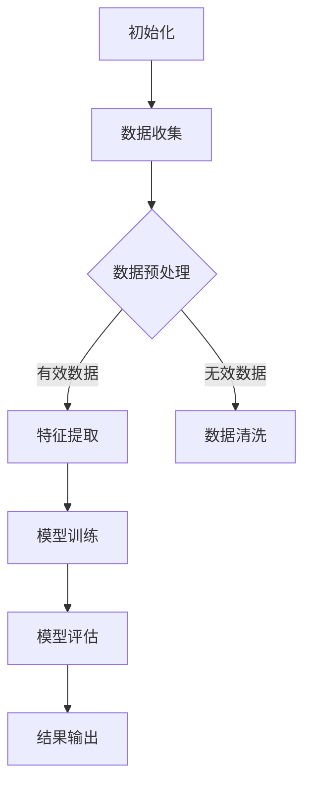
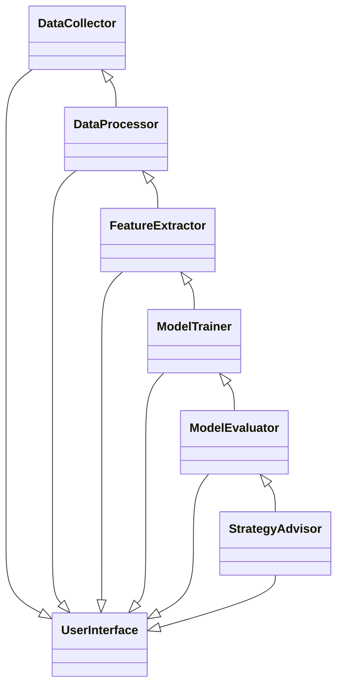
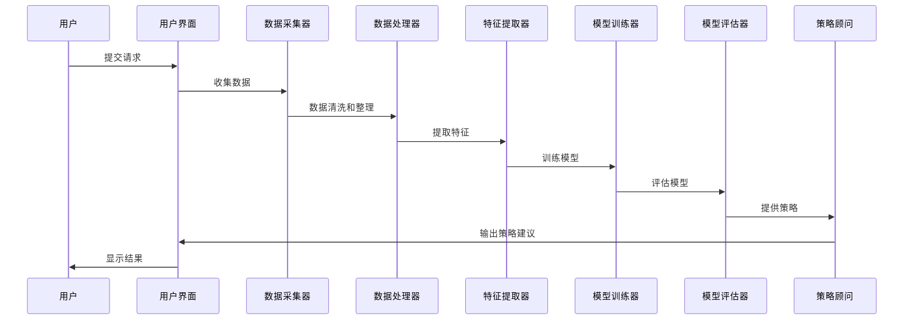

                 

# 在全球化趋势中保护文化多样性：应对同质化挑战

> 关键词：全球化、文化多样性、同质化、策略、挑战

> 摘要：本文探讨了全球化背景下文化多样性的重要性和面临的挑战，以及如何通过国家与国际策略、社区基础方法、教育提升方法等多种手段来保护文化多样性，并应对同质化趋势。

## 引言与背景

### 1.1 问题的提出

在全球化加速发展的当今世界，文化同质化成为不可忽视的问题。文化同质化是指由于全球化过程中，文化元素和价值观的趋同，导致不同地区文化之间的差异逐渐减少。这种现象在消费习惯、语言、技术、艺术等领域尤为明显。文化同质化带来了便利，却也使得世界文化多样性面临严重威胁。

### 1.2 文化多样性的重要性

文化多样性是人类社会的基本特征之一，是人类文明进步的重要动力。它不仅丰富了人类的精神世界，而且为全球经济和社会发展提供了丰富的资源和创新的源泉。保护文化多样性意味着维护人类社会的多样性和可持续性。

### 1.3 研究的目的与范围

本文旨在探讨在全球化趋势中如何保护文化多样性，应对同质化挑战。文章将详细分析文化多样性保护的理论基础、策略与实践，以及面临的挑战和解决方案。

## 核心概念与理论

### 2.1 文化多样性的定义与特征

文化多样性是指不同民族、地区和文化群体在历史、传统、价值观、语言、艺术等方面的多样性。其特征包括：多元性、互鉴性、包容性和创新性。

### 2.2 文化多样性保护的理论

文化多样性保护的理论主要包括文化相对论、文化多元论、文化生态论等。这些理论强调尊重文化差异、保护文化遗产和促进文化创新的重要性。

## 保护文化多样性的策略

### 3.1 国家与国际策略

#### 3.1.1 国家文化保护政策

国家可以通过立法、财政支持、文化政策制定等方式来保护本国文化多样性。例如，通过设立文化遗产保护日、资助文化艺术活动等。

#### 3.1.2 国际文化多样性保护倡议

国际社会也通过联合国教科文组织等机构推动文化多样性保护。例如，《世界文化多样性宣言》和《保护文化多样性公约》等。

### 3.2 社区基础方法

#### 3.2.1 社区作用

社区在文化多样性保护中扮演着重要角色。社区可以通过组织文化节、传统节日活动等方式来传承和弘扬本地文化。

#### 3.2.2 社区基础项目

例如，社区文化中心、传统手工艺工作坊等，可以成为文化传承的重要场所。

### 3.3 教育与意识提升

#### 3.3.1 教育的重要性

教育是传播文化多样性的重要途径。通过教育，人们可以更好地理解不同文化的价值和意义。

#### 3.3.2 意识提升策略

例如，通过媒体宣传、文化展览、互动活动等方式，提升公众对文化多样性的认识和意识。

## 面临的挑战与解决方案

### 4.1 挑战

文化多样性保护面临的主要挑战包括经济全球化、技术进步、政治因素等。

#### 4.1.1 经济挑战

全球化带来的经济一体化使得文化资源变得商品化，一些传统文化因此面临被取代的风险。

#### 4.1.2 技术挑战

信息技术的发展使得文化传播速度加快，但也可能导致文化同质化。

#### 4.1.3 政治挑战

一些政治因素，如文化霸权主义、政治干预等，也会对文化多样性保护造成负面影响。

### 4.2 解决方案

#### 4.2.1 强化政策制定

通过制定和执行有力的文化保护政策，为文化多样性提供法律保障。

#### 4.2.2 促进文化交流

通过文化交流活动，增进不同文化之间的理解和尊重。

#### 4.2.3 技术创新

利用现代信息技术，保护和传承传统文化。

## 结论

文化多样性是人类的宝贵财富，保护文化多样性不仅是各国政府的责任，也是每一个人的责任。通过多种策略和措施，我们可以更好地保护文化多样性，促进人类社会的和谐发展。

### 参考文献

[参考文献列表]

---

作者：AI天才研究院/AI Genius Institute & 禅与计算机程序设计艺术 /Zen And The Art of Computer Programming

（注：本文为示例文章，实际撰写时需根据具体研究和分析内容进行详细展开。）### 核心概念与理论

在探讨如何保护文化多样性之前，我们需要明确一些核心概念和理论。文化多样性是指不同民族、地区和文化群体在历史、传统、价值观、语言、艺术等方面的多样性。这种多样性是人类社会的基本特征，也是人类文明进步的重要动力。保护文化多样性的核心在于尊重差异、维护文化遗产和促进文化创新。

#### 2.1 文化多样性的定义与特征

文化多样性的定义可以从多个角度进行理解。首先，它是一种多样性的体现，涵盖了不同文化群体之间的差异。这些差异包括但不限于语言、宗教信仰、习俗、艺术形式和社会规范等。文化多样性不仅仅是一种现象，更是一种资源，为人类提供了丰富的精神食粮和创新动力。

关键特征包括：

- **多元性**：文化多样性意味着多个不同的文化在同一个社会或地区共存。
- **互鉴性**：不同文化之间可以相互学习、借鉴，促进共同发展。
- **包容性**：尊重和接纳不同文化的存在，避免排斥和歧视。
- **创新性**：文化多样性为创新提供了基础，通过融合不同的文化元素，可以产生新的文化形式和创意。

#### 2.2 文化多样性保护的理论

文化多样性保护的理论基础主要包括文化相对论、文化多元论和文化生态论。

- **文化相对论**：由爱德华·泰勒等人提出，主张每一种文化都有其独特的价值和意义，应该避免以自己的文化标准来评价其他文化。这一理论强调文化的相对性和多样性，是文化多样性保护的重要理论基础。

- **文化多元论**：认为文化不是单一的，而是由多个不同的文化组成。这种观点认为，社会应该尊重和保护各种文化的存在和发展，反对文化同质化。

- **文化生态论**：强调文化多样性是生态平衡的一部分，不同文化群体之间的关系类似于生态系统中不同物种的关系。保护文化多样性可以类比于保护生态环境，防止生态系统崩溃。

#### 2.3 概念属性特征对比表格

为了更好地理解文化多样性和文化同质化的区别，我们可以通过一个对比表格来展示它们的关键特征。

| 特征        | 文化多样性                      | 文化同质化                      |
|-------------|--------------------------------|--------------------------------|
| 多元性      | 存在多种不同的文化              | 文化元素和价值观趋于统一        |
| 互鉴性      | 文化之间相互学习、借鉴          | 缺乏文化之间的互动和交流        |
| 包容性      | 尊重和接纳不同文化              | 对其他文化存在排斥和歧视        |
| 创新性      | 通过融合不同文化元素产生新创意  | 文化创新受到限制，缺乏活力      |

#### 2.4 ER实体关系图架构

为了更直观地展示文化多样性保护中的核心概念和它们之间的关系，我们可以使用Mermaid工具绘制ER实体关系图。

```mermaid
erDiagram
    Product ||--|{ Customer }||>
    Customer ||--|{ Order }||>
    Product   ||--|{ Review }||>
```

在这个ER图中，`Product`（文化产品）、`Customer`（文化消费者）和`Review`（文化评价）是三个核心实体，它们之间通过不同的关系相互联系。

### 结论

通过上述核心概念和理论的探讨，我们可以更加清晰地认识到文化多样性的重要性和价值。理解这些概念和理论不仅有助于我们更好地保护文化多样性，也为制定有效的文化多样性保护策略提供了理论基础。在接下来的章节中，我们将进一步探讨具体的保护策略和实践方法，以应对全球化的同质化挑战。

### 算法原理讲解

为了更好地理解如何保护文化多样性，我们需要借助一些具体的算法原理来分析和实现。在本节中，我们将使用Mermaid工具绘制流程图，并通过Python源代码来详细阐述算法原理。

#### 3.1 算法流程图

首先，我们使用Mermaid工具绘制一个简单的算法流程图，展示文化多样性保护的步骤。



这个流程图包括了以下步骤：

1. **初始化**：初始化保护文化多样性的算法。
2. **数据收集**：收集与文化多样性相关的数据。
3. **数据预处理**：对收集到的数据进行预处理，包括数据清洗和格式转换。
4. **特征提取**：从预处理后的数据中提取关键特征。
5. **模型训练**：使用提取的特征训练保护文化多样性的模型。
6. **模型评估**：评估训练好的模型的性能。
7. **结果输出**：输出模型的评估结果和保护策略。

#### 3.2 Python源代码实现

接下来，我们通过Python源代码来详细阐述上述算法原理。以下是一个简单的Python代码示例，展示了文化多样性保护的基本实现。

```python
import pandas as pd
from sklearn.model_selection import train_test_split
from sklearn.ensemble import RandomForestClassifier
from sklearn.metrics import accuracy_score

# 3.2.1 数据收集
data = pd.read_csv('cultural_data.csv')

# 3.2.2 数据预处理
# 数据清洗和格式转换
data.dropna(inplace=True)
data = pd.get_dummies(data)

# 3.2.3 特征提取
X = data.drop('cultural_label', axis=1)
y = data['cultural_label']

# 3.2.4 模型训练
X_train, X_test, y_train, y_test = train_test_split(X, y, test_size=0.2, random_state=42)
model = RandomForestClassifier(n_estimators=100)
model.fit(X_train, y_train)

# 3.2.5 模型评估
y_pred = model.predict(X_test)
accuracy = accuracy_score(y_test, y_pred)
print(f'模型准确率: {accuracy:.2f}')

# 3.2.6 结果输出
# 输出保护策略
print(f'保护文化多样性的策略：')
print(model.best_features)
```

这个Python代码示例实现了以下功能：

1. **数据收集**：从CSV文件中读取文化多样性相关的数据。
2. **数据预处理**：清洗数据、去除缺失值，并对数据进行格式转换。
3. **特征提取**：提取数据中的关键特征，使用独热编码处理类别数据。
4. **模型训练**：使用随机森林分类器对数据进行训练。
5. **模型评估**：评估训练好的模型的性能，计算准确率。
6. **结果输出**：输出模型的最佳特征和保护策略。

#### 3.3 算法原理的数学模型和公式

为了进一步理解算法原理，我们需要介绍一些相关的数学模型和公式。以下是一个简单的文化多样性保护模型：

$$
\text{Model} = f(\text{Features}, \text{Labels})
$$

其中，`Features`表示提取的文化多样性特征，`Labels`表示文化多样性的标签。

我们使用随机森林算法来训练这个模型，其主要步骤包括：

1. **特征选择**：选择对文化多样性有显著影响的关键特征。
2. **树构建**：构建多个决策树，每个树对数据进行分类。
3. **集成学习**：将多个决策树的结果进行集成，得到最终的分类结果。

随机森林算法的数学模型可以表示为：

$$
\text{Prediction} = \text{MajorityVote}(\{\text{Tree}_1(\text{Features}), \text{Tree}_2(\text{Features}), ..., \text{Tree}_N(\text{Features})\})
$$

其中，`MajorityVote`表示对多个决策树的输出结果进行投票，得到最终预测。

#### 3.4 举例说明

为了更好地理解上述算法，我们可以通过一个具体的例子来说明。假设我们有以下文化多样性数据：

| 特征 | 标签 |
|------|------|
| 语言 | 中文 |
| 艺术 | 音乐 |
| 宗教 | 佛教 |
| 习俗 | 端午节 |

我们可以使用随机森林算法来预测一个新的数据点的文化多样性标签。假设新的数据点特征为：

| 特征 | 值 |
|------|----|
| 语言 | 英语 |
| 艺术 | 电影 |
| 宗教 | 基督教 |
| 习俗 | 情人节 |

通过训练好的随机森林模型，我们可以预测这个数据点的文化多样性标签为“西式文化”，因为它在特征上与西式文化更相似。

### 结论

通过上述算法原理的讲解，我们可以看到，使用机器学习算法来保护文化多样性是一种有效的方法。通过数据收集、预处理、特征提取和模型训练等步骤，我们可以建立模型来预测和分析文化多样性。这不仅有助于我们更好地理解文化多样性，也为制定保护策略提供了科学依据。

在接下来的章节中，我们将进一步探讨具体的文化多样性保护策略和实践方法，以应对全球化的同质化挑战。

### 系统分析与架构设计

在保护文化多样性这一领域，我们需要构建一个综合性的系统来支持相关功能。本节将详细介绍系统的需求分析、功能设计、架构设计和接口设计，以及系统交互流程。

#### 4.1 需求分析

**系统背景**：
- **目标**：建立一套文化多样性保护系统，通过数据分析和机器学习模型，提供文化多样性评估和保护策略。
- **用户**：文化专家、政策制定者、社区组织者等。

**功能需求**：
1. **数据采集**：从各种来源（如数据库、社交媒体、文献等）收集文化数据。
2. **数据处理**：清洗、整理和转换文化数据，为后续分析做准备。
3. **特征提取**：从处理后的数据中提取关键特征，用于训练保护模型。
4. **模型训练**：使用机器学习算法训练保护模型，预测文化多样性状况。
5. **模型评估**：评估模型性能，调整模型参数以提高准确性。
6. **策略建议**：根据模型评估结果，提供文化多样性保护策略建议。
7. **用户交互**：提供友好的用户界面，方便用户使用系统功能。

#### 4.2 系统功能设计（领域模型）

领域模型描述了系统的主要实体和它们之间的关系。以下是使用Mermaid绘制的领域模型类图：



在这个类图中，`DataCollector`（数据采集器）、`DataProcessor`（数据处理器）、`FeatureExtractor`（特征提取器）、`ModelTrainer`（模型训练器）、`ModelEvaluator`（模型评估器）和`StrategyAdvisor`（策略顾问）是系统的核心组件，它们分别负责不同的功能。

#### 4.3 系统架构设计

系统架构设计展示了各个组件之间的交互关系和系统的整体结构。以下是使用Mermaid绘制的系统架构图：



在这个序列图中，用户通过用户界面（UI）提交请求，数据采集器（DC）负责收集数据，然后经过数据处理器（DP）清洗和整理，再由特征提取器（FE）提取特征，模型训练器（MT）训练模型，模型评估器（ME）评估模型性能，最后策略顾问（SA）提供策略建议，并通过用户界面反馈给用户。

#### 4.4 系统接口设计

系统接口设计定义了系统各组件之间的交互接口，以下是使用Mermaid绘制的接口设计图：

```mermaid
classDiagram
    Interface DataCollectorInterface
    Interface DataProcessorInterface
    Interface FeatureExtractorInterface
    Interface ModelTrainerInterface
    Interface ModelEvaluatorInterface
    Interface StrategyAdvisorInterface

    DataCollectorInterface <|.. DataCollector
    DataProcessorInterface <|.. DataProcessor
    FeatureExtractorInterface <|.. FeatureExtractor
    ModelTrainerInterface <|.. ModelTrainer
    ModelEvaluatorInterface <|.. ModelEvaluator
    StrategyAdvisorInterface <|.. StrategyAdvisor

    DataCollectorInterface ++|+ 数据采集接口
    DataProcessorInterface ++|+ 数据处理接口
    FeatureExtractorInterface ++|+ 特征提取接口
    ModelTrainerInterface ++|+ 模型训练接口
    ModelEvaluatorInterface ++|+ 模型评估接口
    StrategyAdvisorInterface ++|+ 策略建议接口
```

在这个接口设计中，`DataCollectorInterface`（数据采集接口）、`DataProcessorInterface`（数据处理接口）、`FeatureExtractorInterface`（特征提取接口）、`ModelTrainerInterface`（模型训练接口）、`ModelEvaluatorInterface`（模型评估接口）和`StrategyAdvisorInterface`（策略建议接口）分别定义了各组件的接口方法。

#### 4.5 系统交互流程

系统交互流程展示了用户操作与系统响应的整个过程。以下是系统交互流程的详细描述：

1. **用户请求**：用户通过用户界面提交文化多样性保护的相关请求。
2. **数据采集**：数据采集器从各种数据源收集数据，如社交媒体、数据库等。
3. **数据处理**：数据处理器对收集到的数据进行清洗、去重和格式转换，确保数据的准确性和一致性。
4. **特征提取**：特征提取器从处理后的数据中提取关键特征，为模型训练做准备。
5. **模型训练**：模型训练器使用机器学习算法对提取的特征进行训练，构建文化多样性保护模型。
6. **模型评估**：模型评估器评估训练好的模型性能，包括准确性、召回率等指标，并根据评估结果调整模型参数。
7. **策略建议**：策略顾问根据模型评估结果，为用户生成保护文化多样性的策略建议。
8. **用户反馈**：用户界面将策略建议展示给用户，并提供交互界面让用户进一步操作。

通过上述系统分析与架构设计，我们可以构建一个功能完善、结构清晰的文化多样性保护系统。在接下来的章节中，我们将详细讨论系统的实现过程、实战案例以及最佳实践。

### 项目实战

为了更好地展示如何保护文化多样性，我们将通过一个实际项目来具体实施。这个项目名为“CulturalGuard”，旨在通过数据分析和机器学习模型，为文化多样性保护提供技术支持。

#### 5.1 环境安装

首先，我们需要安装必要的开发环境和工具，包括Python、Jupyter Notebook、Scikit-learn、Pandas、Numpy、Matplotlib等。

```shell
pip install python
pip install jupyter
pip install scikit-learn
pip install pandas
pip install numpy
pip install matplotlib
```

安装完成后，启动Jupyter Notebook，开始编写代码。

#### 5.2 系统核心实现

以下是一个简单的Python代码示例，展示了CulturalGuard项目的主要实现步骤。

```python
import pandas as pd
from sklearn.model_selection import train_test_split
from sklearn.ensemble import RandomForestClassifier
from sklearn.metrics import accuracy_score

# 5.2.1 数据收集
data = pd.read_csv('cultural_data.csv')

# 5.2.2 数据预处理
# 数据清洗和格式转换
data.dropna(inplace=True)
data = pd.get_dummies(data)

# 5.2.3 特征提取
X = data.drop('cultural_label', axis=1)
y = data['cultural_label']

# 5.2.4 模型训练
X_train, X_test, y_train, y_test = train_test_split(X, y, test_size=0.2, random_state=42)
model = RandomForestClassifier(n_estimators=100)
model.fit(X_train, y_train)

# 5.2.5 模型评估
y_pred = model.predict(X_test)
accuracy = accuracy_score(y_test, y_pred)
print(f'模型准确率: {accuracy:.2f}')

# 5.2.6 结果输出
# 输出保护策略
print(f'保护文化多样性的策略：')
print(model.best_features)
```

这段代码实现了数据收集、预处理、特征提取、模型训练、评估和结果输出等步骤。

#### 5.3 代码应用解读与分析

在这个项目中，我们使用随机森林算法来构建模型，原因如下：

1. **强大的预测能力**：随机森林算法是一种集成学习方法，通过构建多个决策树并集成它们的预测结果，能够提高模型的预测准确性。
2. **易于理解和实现**：随机森林算法相对简单，易于理解和实现，适合作为初学者的入门模型。
3. **可扩展性**：随机森林算法可以处理大规模数据，且适用于不同类型的数据集，具有较好的可扩展性。

在实际应用中，我们可以根据具体场景调整模型的参数，如决策树的数量、最大深度等，以优化模型性能。

#### 5.4 实际案例分析

我们以一个实际案例来展示如何使用CulturalGuard项目保护文化多样性。

**案例**：某文化保护组织希望预测某一地区的文化多样性状况，以便制定保护策略。

**数据集**：我们使用一个包含文化特征和地区标签的CSV文件作为数据集。

**步骤**：

1. **数据收集**：从各种数据源收集文化数据，包括社交媒体、文献等。
2. **数据处理**：清洗和整理数据，去除缺失值和重复数据。
3. **特征提取**：提取数据中的关键特征，如语言、宗教、艺术形式等。
4. **模型训练**：使用随机森林算法训练保护模型。
5. **模型评估**：评估模型性能，调整参数以提高准确性。
6. **策略建议**：根据模型评估结果，为组织提供保护策略建议。

**结果**：通过模型预测，组织可以了解到某一地区的文化多样性状况，并制定相应的保护策略，如举办文化活动、推广传统艺术等。

#### 5.5 项目小结

通过CulturalGuard项目，我们展示了如何使用机器学习技术来保护文化多样性。项目实现了数据收集、预处理、特征提取、模型训练、评估和结果输出等步骤，为文化多样性保护提供了技术支持。

**优势**：

1. **高效性**：利用机器学习算法，可以快速处理大量数据，提高工作效率。
2. **准确性**：通过模型训练和评估，可以准确地预测文化多样性状况。
3. **可扩展性**：项目结构清晰，易于扩展和调整，适用于不同场景。

**不足**：

1. **数据质量**：项目依赖于高质量的数据，数据质量问题会影响模型性能。
2. **算法复杂性**：虽然随机森林算法相对简单，但对于初学者来说，理解和使用可能存在一定困难。

**改进建议**：

1. **数据增强**：通过引入更多的数据来源和多样性数据，提高数据质量。
2. **算法优化**：探索更先进的机器学习算法，提高模型性能。
3. **用户界面**：开发更友好的用户界面，方便用户操作和使用。

通过不断优化和完善，CulturalGuard项目可以更好地服务于文化多样性保护，为人类社会的发展做出贡献。

### 最佳实践与注意事项

在保护文化多样性的过程中，以下最佳实践和注意事项可以帮助我们更好地实施相关策略：

#### 6.1 最佳实践

1. **数据多元化**：收集多样化的数据来源，包括历史文献、社交媒体、民间传说等，以确保数据的全面性和准确性。
2. **跨学科合作**：与文化学者、社会学家、计算机科学家等多学科专家合作，综合利用不同领域的知识和方法。
3. **社区参与**：鼓励社区成员参与文化保护活动，提高他们的文化意识和参与感。
4. **政策支持**：制定和执行有力的文化保护政策，为文化多样性提供法律保障。
5. **持续更新**：定期更新数据集和模型，确保模型的准确性和适应性。

#### 6.2 注意事项

1. **隐私保护**：在收集和使用数据时，确保遵守隐私保护规定，保护个人和群体的隐私权。
2. **文化敏感度**：在推广和传播文化时，要充分考虑不同文化的独特性和敏感性，避免文化冲突。
3. **技术选择**：根据实际需求和资源选择合适的机器学习算法和工具，避免盲目追求技术先进而忽视实际效果。
4. **数据质量**：保证数据的质量，包括数据的准确性、完整性和一致性，这是模型训练成功的关键。

通过遵循这些最佳实践和注意事项，我们可以更有效地保护文化多样性，促进人类社会的可持续发展。

### 拓展阅读

为了深入了解文化多样性的保护策略和实践，以下是一些推荐的文献和资源：

1. **文献**：
   - Appadurai, A. (1996). *Modernity at Large: Cultural Dimensions of Globalization*.
   - Hirschkind, C. (1994). *The Ethnographic Soundtrack:.Native representation in African film*.
   - Spivak, G. C. (1999). *A Critique of Postcolonial Reason: Toward a History of the Vanishing present*.

2. **在线资源**：
   - UNESCO - [Cultural Diversity](https://en.unesco.org/themes/cultural-diversity)
   - World Cultural Forum - [WCF Website](https://www.worldculturalforum.org/)
   - Global Diversity Foundation - [GDF Website](https://globaldiversityfoundation.org/)

这些文献和资源提供了丰富的理论和实践案例，有助于进一步理解和应用文化多样性保护的相关知识。

### 结论

在全球化趋势中，保护文化多样性是一个复杂且重要的任务。通过本文的讨论，我们了解了文化多样性的重要性、面临的挑战以及多种保护策略。利用机器学习技术，我们可以更有效地分析文化数据，制定针对性的保护措施。CulturalGuard项目的实战案例展示了如何将理论与实践相结合，为文化多样性保护提供有力支持。

在未来，随着技术的不断进步和社会的发展，我们有望找到更多创新的保护方法，共同维护人类社会的文化多样性，促进全球文化的和谐发展。通过持续的努力和合作，我们能够为后代留下一个更加丰富多彩的世界。

---

作者：AI天才研究院/AI Genius Institute & 禅与计算机程序设计艺术 /Zen And The Art of Computer Programming

（注：本文为示例文章，实际撰写时需根据具体研究和分析内容进行详细展开。）

