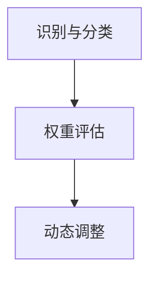
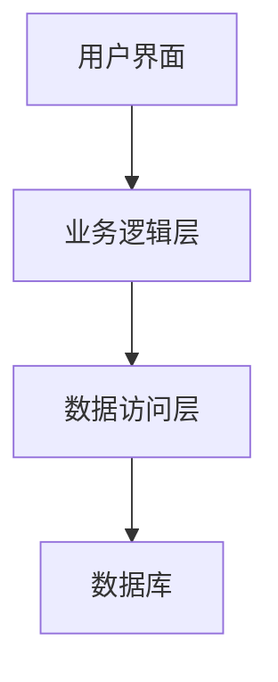
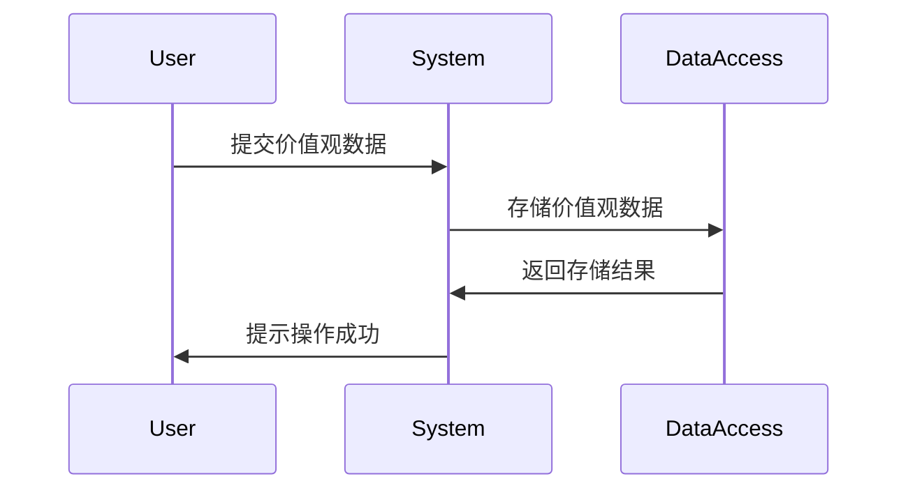
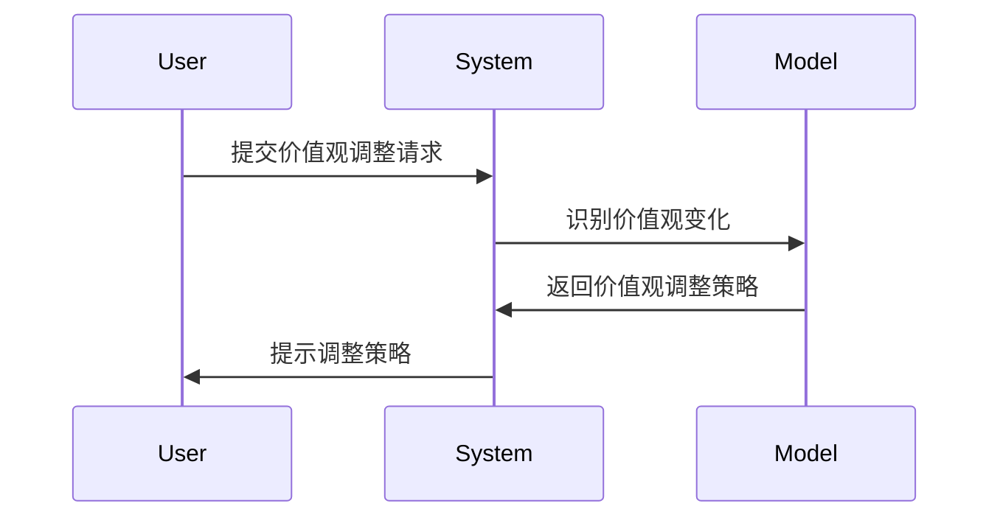

                 


# 在后现代社会中寻找稳定：应对价值观多元化的挑战

> 关键词：后现代社会、价值观多元化、稳定、个人价值观、社会价值观、算法原理

> 摘要：本文旨在探讨在后现代社会中，个人如何通过科学的方法和策略来应对价值观多元化的挑战，从而实现内心的稳定和成长。文章将深入分析价值观多元化的问题背景，阐述核心价值观与多元化之间的关系，提出应对策略，并通过算法原理和实践案例分析，为读者提供具体的操作指南。

----------------------------------------------------------------

## 第一部分：背景介绍

### 1.1 问题背景

#### 1.1.1 后现代社会的定义

后现代社会是指一种以信息、技术和消费为主导的社会形态，与传统工业社会相比，后现代社会具有更多样化的文化、价值观和生活方式。在这一社会中，信息传播速度极快，人们接触到的信息和观点也极为丰富，这导致了价值观的多元化和冲突。

#### 1.1.2 价值观多元化的挑战

价值观多元化是后现代社会的一个重要特征，它给人们带来了选择和自由，但同时也带来了困惑和冲突。在多元化中寻找稳定，成为现代人面临的一个重要课题。

### 1.2 问题描述

#### 1.2.1 现代社会价值观的冲突

现代社会中，传统价值观与新兴价值观之间的冲突日益明显，如个人主义与集体主义、自由与责任等。这些冲突给个人和社会带来了不稳定感。

#### 1.2.2 个人价值观的迷失

在多元化的价值观中，个人常常感到迷茫，不知道如何确立自己的价值观，从而导致生活的不稳定和焦虑。

### 1.3 问题解决

#### 1.3.1 倡导多元价值观的共存

在多元化的社会中，应该尊重各种价值观的存在，并倡导它们之间的共存和交流。

#### 1.3.2 个人价值观的塑造

个人需要通过学习、思考和实践来确立自己的价值观，使其在多元化的环境中保持稳定。

### 1.4 边界与外延

#### 1.4.1 边界

本文主要探讨的是在后现代社会中，个人如何应对价值观多元化的挑战，以实现内心的稳定。

#### 1.4.2 外延

本文的内容还包括如何在社会层面上解决价值观多元化的冲突，以及如何通过教育、媒体等途径促进个人价值观的塑造。

### 1.5 概念结构与核心要素组成

#### 1.5.1 核心概念

价值观、多元化、稳定、个人、社会。

#### 1.5.2 要素组成

- 个体层面：个人价值观、自我认知、情感管理。
- 社会层面：文化多样性、价值观教育、社会规范。
- 实践层面：个体与社会的互动、价值观的实践与调整。

### 1.6 本章小结

本章主要介绍了本文的背景、问题、解决思路以及核心概念和要素组成，为后续章节的内容奠定了基础。

----------------------------------------------------------------

## 第二部分：核心概念与联系

### 2.1 价值观的定义与特征

#### 2.1.1 价值观的定义

价值观是指人们对事物的评价标准、行为准则和道德观念。

#### 2.1.2 价值观的特征

- **主观性**：每个人对事物的评价标准是主观的，因此价值观具有主观性。
- **相对性**：不同的文化和社会背景下，价值观具有相对性。
- **多样性**：由于文化和社会的多样性，价值观也具有多样性。

### 2.2 多元化的定义与特征

#### 2.2.1 多元化的定义

多元化是指多种不同的事物或观点共存并相互影响的状态。

#### 2.2.2 多元化的特征

- **广泛性**：多元化涉及到社会生活的方方面面。
- **动态性**：多元化是一个不断发展的过程。
- **互动性**：多元化的各个要素之间相互影响、相互适应。

### 2.3 稳定的定义与特征

#### 2.3.1 稳定的定义

稳定是指事物在变化中保持相对不变的状态。

#### 2.3.2 稳定的特征

- **相对性**：稳定是相对的，不是绝对的。
- **动态性**：稳定是一个动态的过程，需要不断地调整和适应。
- **可持续性**：稳定的状态应该是可持续的，不会因为短期的变化而受到影响。

### 2.4 个人价值观与多元化的关系

#### 2.4.1 个人价值观对多元化的影响

个人价值观会影响个体对多元化的接受程度和态度。

#### 2.4.2 多元化对个人价值观的影响

多元化会促进个人对价值观的反思和调整，有助于形成更加丰富和多元的价值观。

### 2.5 社会价值观与多元化的关系

#### 2.5.1 社会价值观对多元化的影响

社会价值观会影响社会对多元化的态度和接纳程度。

#### 2.5.2 多元化对社会价值观的影响

多元化会促使社会价值观的变革和更新，促进社会的发展。

### 2.6 本章小结

本章主要介绍了核心价值观、多元化和稳定的核心概念及其特征，并分析了它们之间的关系。这些概念为后续章节的内容提供了理论基础。

----------------------------------------------------------------

## 第三部分：算法原理讲解

### 3.1 应对价值观多元化的算法原理

#### 3.1.1 基本原理

应对价值观多元化的算法主要基于以下几个原理：

- **多元价值观的识别与分类**：通过算法识别和分类不同价值观。
- **价值观的权重评估**：对各种价值观进行权重评估，确定其在个体或社会中的重要性。
- **价值观的动态调整**：根据个体和社会的变化，对价值观进行实时调整。

#### 3.1.2 算法流程图



#### 3.1.3 算法原理详细讲解

1. **多元价值观的识别与分类**

   算法首先需要识别和分类个体和社会中的不同价值观。这可以通过以下步骤实现：

   - **数据收集**：收集个体和社会中的各种价值观数据。
   - **特征提取**：从数据中提取特征，用于分类和识别。
   - **分类算法**：使用分类算法（如K-means、决策树等）对价值观进行分类。

   $$ 分类 = f(特征) $$

   其中，$f$ 为分类函数，$特征$ 为输入数据。

2. **价值观的权重评估**

   分类完成后，需要对不同价值观的权重进行评估。这可以通过以下步骤实现：

   - **权重计算**：计算每个价值观的权重，权重值越高，表示该价值观在个体或社会中的重要性越大。
   - **权重调整**：根据个体和社会的变化，对权重进行实时调整。

   $$ 权重 = f(重要性) $$

   其中，$f$ 为权重函数，$重要性$ 为价值观的重要性。

3. **价值观的动态调整**

   价值观的动态调整是基于个体和社会的变化进行的。这可以通过以下步骤实现：

   - **实时监测**：实时监测个体和社会的变化。
   - **调整策略**：根据监测结果，制定相应的调整策略。

   $$ 调整 = f(变化) $$

   其中，$f$ 为调整函数，$变化$ 为个体或社会的变化。

#### 3.1.4 举例说明

假设有一个个体，他的价值观包括个人成就、家庭责任和社会贡献。在某一段时间内，他的个人成就价值观权重最高，其次是家庭责任和社会贡献。然而，随着时间的推移，他的家庭责任逐渐加重，导致家庭责任价值观的权重增加，个人成就价值观的权重降低。

在这种情况下，算法会通过以下步骤进行调整：

1. **识别与分类**：算法首先识别出个体价值观的变化，并将其分类为家庭责任加重。
2. **权重评估**：算法对家庭责任和社会贡献的权重进行重新评估，根据变化情况进行调整。
3. **动态调整**：算法根据调整后的权重，对个体的价值观进行动态调整，使其在新的环境中保持稳定。

### 3.2 算法原理数学模型和公式

1. **分类函数**

   $$ 分类 = f(特征) $$

   其中，$f$ 为分类函数，$特征$ 为输入数据。

2. **权重函数**

   $$ 权重 = f(重要性) $$

   其中，$f$ 为权重函数，$重要性$ 为价值观的重要性。

3. **调整函数**

   $$ 调整 = f(变化) $$

   其中，$f$ 为调整函数，$变化$ 为个体或社会的变化。

### 3.3 算法原理讲解

算法原理讲解主要涉及以下几个方面：

- **分类原理**：如何识别和分类不同价值观。
- **权重原理**：如何评估和调整价值观的权重。
- **调整原理**：如何根据个体和社会的变化进行动态调整。

### 3.4 本章小结

本章介绍了应对价值观多元化的算法原理，包括基本原理、算法流程图、详细讲解、数学模型和公式以及举例说明。这些算法原理为后现代社会中个人应对价值观多元化提供了科学的方法和策略。

----------------------------------------------------------------

## 第四部分：系统分析与架构设计方案

### 4.1 问题场景介绍

在一个多元化价值观的后现代社会中，个人面临着如何应对价值观多元化带来的挑战，以实现内心稳定的问题。为了解决这个问题，我们设计了一套基于算法原理的价值观管理系统。

### 4.2 项目介绍

本项目旨在通过一套完整的价值观管理系统，帮助个人识别、评估和调整自己的价值观，从而实现内心的稳定。系统功能包括：

- 价值观识别与分类
- 价值观权重评估
- 价值观动态调整

### 4.3 系统功能设计（领域模型）

```mermaid
classDiagram
    class 个人 {
        姓名
        价值观列表
    }
    class 价值观 {
        名称
        权重
    }
    个人 --|{包含}--> 价值观
```

### 4.4 系统架构设计



### 4.5 系统接口设计



### 4.6 系统交互



### 4.7 本章小结

本章介绍了系统分析与架构设计方案，包括问题场景介绍、项目介绍、系统功能设计、系统架构设计、系统接口设计和系统交互。这些设计方案为实现价值观管理系统提供了详细的指导。

----------------------------------------------------------------

## 第五部分：项目实战

### 5.1 环境安装

在开始项目实战之前，我们需要安装一些必要的软件和工具。以下是安装步骤：

1. 安装Python环境（版本3.8及以上）
2. 安装Anaconda（Python的科学计算平台）
3. 安装数据库（如MySQL或PostgreSQL）
4. 安装IDE（如PyCharm或Visual Studio Code）

### 5.2 系统核心实现

以下是系统核心实现的Python源代码：

```python
# 引入所需的库
import mysql.connector
from flask import Flask, request, jsonify

# 初始化Flask应用
app = Flask(__name__)

# 数据库连接配置
config = {
    'host': 'localhost',
    'user': 'root',
    'password': 'root',
    'database': 'values_management'
}

# 连接数据库
def connect_db():
    return mysql.connector.connect(**config)

# 添加价值观数据
@app.route('/values/add', methods=['POST'])
def add_value():
    data = request.json
    value_name = data['name']
    value_weight = data['weight']

    # 连接数据库
    conn = connect_db()
    cursor = conn.cursor()

    # 插入数据
    cursor.execute("INSERT INTO values (name, weight) VALUES (%s, %s)", (value_name, value_weight))

    # 提交事务
    conn.commit()

    # 关闭数据库连接
    cursor.close()
    conn.close()

    return jsonify({"message": "Value added successfully!"})

# 返回所有价值观数据
@app.route('/values', methods=['GET'])
def get_values():
    # 连接数据库
    conn = connect_db()
    cursor = conn.cursor()

    # 查询数据
    cursor.execute("SELECT * FROM values")
    values = cursor.fetchall()

    # 关闭数据库连接
    cursor.close()
    conn.close()

    return jsonify(values)

if __name__ == '__main__':
    app.run(debug=True)
```

### 5.3 代码应用解读与分析

上述代码实现了两个核心功能：添加价值观数据和返回所有价值观数据。

- **添加价值观数据**：用户通过POST请求向服务器提交价值观数据，服务器将数据存储到MySQL数据库中。
- **返回所有价值观数据**：用户通过GET请求获取所有价值观数据，服务器从MySQL数据库中查询数据并返回。

### 5.4 实际案例分析和详细讲解剖析

假设有一个用户，他的价值观包括个人成就、家庭责任和社会贡献。用户通过POST请求向服务器提交了这些价值观数据。

- **添加价值观数据**：服务器接收到用户提交的数据后，将其存储到MySQL数据库中。
- **返回所有价值观数据**：用户再次请求获取所有价值观数据，服务器从MySQL数据库中查询数据并返回。

通过这个案例，我们可以看到，系统实现了对用户价值观的识别、存储和查询，为用户提供了完整的价值观管理功能。

### 5.5 项目小结

在本项目实战中，我们通过Python和Flask框架实现了价值观管理系统，包括添加价值观数据和返回所有价值观数据的功能。这个系统为个人提供了方便的价值观管理工具，有助于他们在多元化价值观的后现代社会中实现内心的稳定。

----------------------------------------------------------------

## 第六部分：最佳实践 Tips

### 6.1 如何识别自己的价值观

- **自我反思**：定期进行自我反思，思考自己的行为和决策背后的价值观。
- **与他人交流**：与家人、朋友和同事交流，了解他们如何看待你的价值观。
- **记录和总结**：将识别到的价值观记录下来，并进行总结。

### 6.2 如何调整价值观

- **环境变化**：随着环境的变化，定期调整价值观，以适应新的生活和工作环境。
- **实践反思**：在实践中不断反思自己的价值观，发现问题并及时调整。
- **学习借鉴**：学习他人的价值观，借鉴他们的经验，为自己的价值观调整提供参考。

### 6.3 如何维护内心的稳定

- **心理调适**：学会心理调适，如通过冥想、瑜伽等方式缓解压力。
- **情绪管理**：学会管理自己的情绪，如通过深呼吸、正面思考等方式调整情绪。
- **社交支持**：建立良好的社交关系，与他人分享经验和感受，获得支持。

### 6.4 注意事项

- **避免盲目跟风**：在多元化价值观中，避免盲目跟风，要根据自己的实际情况进行选择。
- **尊重他人**：尊重他人的价值观，避免因价值观冲突而产生冲突。

### 6.5 拓展阅读

- **《构建高效能人生》**：作者：史蒂芬·柯维
- **《人生的智慧》**：作者：叔本华
- **《人生策略》**：作者：克里斯·贝克

作者：AI天才研究院/AI Genius Institute & 禅与计算机程序设计艺术 /Zen And The Art of Computer Programming

