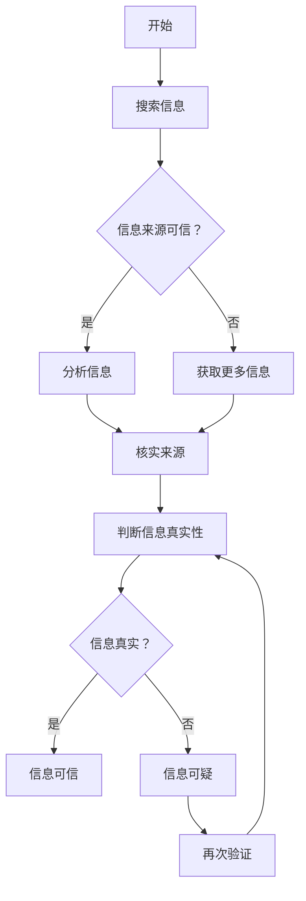
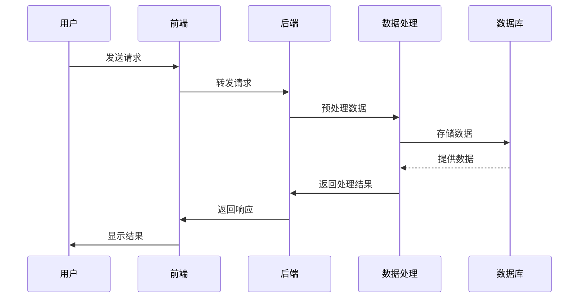

                 


### 第1章：后真相时代的背景与问题介绍

#### 1.1 后真相时代的概念界定

在后真相时代（Post-Truth Era），真相的重要性被不断削弱，而情感和偏见则成为信息传播的主要驱动力。这一概念起源于英国政治学者鲍勃·费舍尔（Bob Fernihough），他在2016年首次提出后真相政治（post-truth politics）一词，用以描述在2016年美国总统选举期间，事实和真相被情绪化叙述和虚假信息所淹没的现象。

后真相时代具有以下特征：

1. **真相被操纵**：媒体和个体可以轻而易举地操纵真相，通过选择性地报道、夸大或隐瞒事实，以达到特定的目的。
2. **情感驱动**：人们在接收信息时，往往受到情感的影响，而非逻辑和理性分析。情绪化、极端化的内容更容易传播。
3. **谣言泛滥**：在社交媒体的推动下，谣言和虚假信息迅速传播，往往难以根除。
4. **信息碎片化**：互联网使得信息来源变得多元，但同时也导致了信息的碎片化和主观化，个体很难全面、准确地了解事物。

#### 1.2 后真相时代的特征

后真相时代的主要特征包括：

1. **信息过载**：互联网和社交媒体的普及，使得信息量爆炸性增长，人们面对海量的信息，难以辨别真伪。
2. **情感化传播**：社交媒体平台倾向于推送用户感兴趣的内容，从而加强用户的情感倾向，使得信息传播更加情感化。
3. **媒介商业主义**：媒体为追求点击率和广告收益，往往倾向于发布引人注目的、有时甚至虚假的信息。
4. **去中心化信息源**：传统的权威信息源（如报纸、电视台）的影响力减弱，个人自媒体和社交网络成为信息传播的主要渠道。

#### 1.3 信息混乱的影响

信息混乱对个人和社会产生了深远的影响：

1. **个人认知失调**：个体在信息混乱的环境中，难以形成稳定的认知结构，可能导致焦虑、困惑等心理问题。
2. **社会信任危机**：虚假信息和谣言的传播，使得公众对传统媒体和官方信息的信任度降低，社会信任危机加剧。
3. **政治和社会动荡**：在政治领域，虚假信息和谣言可能被用于操纵选举结果，导致政治动荡和社会不稳定。
4. **科学研究和教育**：虚假信息可能干扰科学研究的进展，误导教育方向，影响社会的长远发展。

#### 1.4 时代变迁下的信息传播

随着时代的发展，信息传播的方式和机制发生了巨大变化：

1. **社交媒体的兴起**：社交媒体平台如Facebook、Twitter和微信等，成为信息传播的重要渠道，使得信息传播速度和范围大大提升。
2. **虚假信息与谣言传播**：社交媒体的去中心化特性，使得虚假信息和谣言迅速传播，难以监管和删除。
3. **互联网对信息环境的影响**：互联网使得信息获取变得更加便捷，但同时也使得信息的真实性和可靠性难以保证。

### 第1章总结

在后真相时代，信息混乱是一个严峻的挑战。理解后真相时代的概念和特征，认识信息混乱的影响，是寻找真理的第一步。在接下来的章节中，我们将深入探讨信息验证的原则和方法，以及如何使用数学模型和算法来对抗信息混乱。

### 第2章：核心概念与联系

#### 2.1 核心概念的定义

在后真相时代，理解以下核心概念对于寻找真理至关重要：

1. **真相**：真相是客观存在的现实，是未经人为篡改的事实。在信息混乱的时代，辨别真相变得尤为困难。
2. **真理**：真理是对真相的理解和解释，是对现实世界的深度认识。真理可能因个人经验、文化和信仰等因素而有所不同。
3. **信息真实性**：信息真实性是指信息与事实的一致性。在信息过载的时代，判断信息的真实性成为一项挑战。

#### 2.2 概念属性特征对比表

为了更清晰地理解这些核心概念，我们可以通过以下对比表来展示它们的属性特征：

| 概念         | 定义                                                                                                                       | 属性特征                                                                                                       |
| ------------ | -------------------------------------------------------------------------------------------------------------------- | ------------------------------------------------------------------------------------------------------------ |
| 真相         | 客观存在的现实，未经人为篡改的事实。                                                         | - 客观性<br>- 一致性<br>- 可验证性                                                       |
| 真理         | 对真相的理解和解释，是对现实世界的深度认识。                                                  | - 主观性<br>- 多元性<br>- 相对性                                                           |
| 信息真实性   | 信息与事实的一致性。                                                                     | - 准确性<br>- 可靠性<br>- 及时性                                                           |

#### 2.3 ER实体关系图架构

为了更好地理解这些核心概念之间的关系，我们可以使用ER（实体-关系）图来构建一个模型。以下是ER图的示例：

```mermaid
erDiagram
  User ||--|{| Information |}<|--| User
  Information ||--|{| Truth |}<|--| Information
  Truth ||--|{| Truthfulness |}<|--| Truth
```

在这个ER图中：

- **User**（用户）实体代表了信息的接收者和传播者。
- **Information**（信息）实体代表了各种形式的信息。
- **Truth**（真相）实体代表了真实的事实。
- **Truthfulness**（真实性）实体代表了信息与真相的一致性。

#### 2.3.1 实体与关系的定义

- **实体**：在ER图中，实体代表了信息世界的核心组成部分，如用户、信息、真相和真实性。
- **关系**：实体之间的关系描述了它们之间的交互和联系。在这个ER图中，关系描述了用户与信息、信息与真相、真相与真实性之间的关联。

#### 2.3.2 ER图示例

以下是具体的ER图示例：

```mermaid
erDiagram
  User ||--|{| Information |}<|--| User
  Information ||--|{| Truth |}<|--| Information
  Truth ||--|{| Truthfulness |}<|--| Truth
  User }--|{ Blog
  Blog }--|{ Information
  Information }--|{ Truth
  Truth }--|{ Truthfulness
```

在这个示例中，我们增加了**Blog**（博客）实体，以展示用户如何通过博客发布信息，以及信息如何关联到真相和真实性。

### 第2章总结

通过定义和对比核心概念，我们了解了真相、真理和信息真实性的属性特征。使用ER图，我们构建了一个模型来展示这些概念之间的关系。在接下来的章节中，我们将探讨如何验证信息的真实性，并运用数学模型和算法来对抗信息混乱。

### 第3章：信息验证的原则与方法

#### 3.1 信息验证的基本原则

在信息混乱的后真相时代，验证信息的真实性显得尤为重要。以下是一些基本的原则：

1. **独立思考**：不应轻信任何单一来源的信息，而是应进行独立思考和判断。这意味着要根据自己的知识和经验对信息进行分析和验证。

2. **多元视角**：获取信息的来源应尽可能多元化，以避免被单一视角所误导。通过比较不同来源的信息，可以更全面地了解事件的真相。

3. **核实来源**：信息源的真实性和可靠性是判断信息真实性的关键。应核实信息源的背景、专业性和信誉度，以确保其信息的可信度。

#### 3.2 常用信息验证方法

以下是一些常用的信息验证方法：

1. **网络搜索**：使用搜索引擎，通过关键词搜索相关信息，可以帮助我们获取更多的信息来源，从而进行交叉验证。

2. **专家咨询**：向领域内的专家或权威人士咨询，可以获取专业的见解和判断，从而提高信息的可信度。

3. **数据比对**：对比不同来源的数据，检查其一致性和准确性，以判断信息的真实性。例如，对比不同媒体的报道，或者使用统计数据来验证信息的真实性。

#### 3.3 Mermaid流程图

为了更直观地展示信息验证的方法，我们可以使用Mermaid流程图。以下是信息验证流程的Mermaid图表示：



在这个流程图中，我们首先搜索信息（B），然后判断信息来源是否可信（C）。如果不可信，我们会尝试获取更多信息（E）。接下来，我们分析信息（D）并核实来源（F），最终判断信息的真实性（G）。如果信息真实，我们将其视为可信（I）；如果信息不可信，我们会继续验证（K）。

### 第3章总结

通过理解信息验证的基本原则和常用方法，我们可以更好地辨别信息的真实性。使用Mermaid流程图，我们能够直观地展示信息验证的过程。在接下来的章节中，我们将运用数学模型和算法，进一步探讨如何对抗信息混乱。

### 第4章：数学模型与详细讲解

#### 4.1 数学模型的构建

在信息验证的过程中，数学模型是一种强有力的工具。以下是我们将构建的两个主要数学模型：

1. **真伪判断模型**：用于评估信息的真实性。
2. **传播路径分析模型**：用于分析信息在网络中的传播路径和影响。

#### 4.1.1 真伪判断模型

真伪判断模型的核心是判断信息是否真实。我们可以使用概率论和统计学的原理来构建这一模型。

**基本公式**：

- **可信度计算**：
  \[
  \text{可信度} = \frac{\text{支持该信息的证据数量}}{\text{所有证据数量}}
  \]

- **置信度计算**：
  \[
  \text{置信度} = \frac{\text{可信度} \times \text{证据权重}}{\text{证据总权重}}
  \]

**详细解释**：

- **证据数量**：指支持或反驳该信息的证据总数。
- **证据权重**：指每条证据的可靠性和影响力。
- **可信度**：表示证据对信息真实性的支持程度。
- **置信度**：综合可信度和证据权重后的结果，表示信息真实的概率。

**应用实例**：

假设我们有两个信息源A和B，其中A提供了支持信息真实的证据，B提供了反驳信息真实的证据。根据以上公式，我们可以计算出每个证据的可信度和置信度，最终判断信息是否真实。

#### 4.1.2 传播路径分析模型

传播路径分析模型用于分析信息在网络中的传播路径和影响。我们可以使用网络图和矩阵来表示这一模型。

**基本概念**：

- **节点**：代表信息源或接收者。
- **边**：代表信息传播路径。
- **传播矩阵**：表示信息在网络中的传播关系。

**详细解释**：

- **传播矩阵**：
  \[
  \text{传播矩阵} = \begin{bmatrix}
  a_{11} & a_{12} & \cdots & a_{1n} \\
  a_{21} & a_{22} & \cdots & a_{2n} \\
  \vdots & \vdots & \ddots & \vdots \\
  a_{m1} & a_{m2} & \cdots & a_{mn}
  \end{bmatrix}
  \]

  其中，\( a_{ij} \) 表示节点i向节点j传播信息的概率。

- **路径传播效果**：通过矩阵乘法，我们可以计算信息在网络中的传播效果。

**应用实例**：

假设有一个社交网络，其中每个用户都是一个节点，用户之间的互动关系可以用传播矩阵表示。通过计算矩阵的幂次，我们可以得到信息在网络中的传播路径和影响范围。

#### 4.2 数学公式与公式讲解

在本节中，我们将使用LaTeX格式详细讲解上述模型的数学公式。

**真伪判断模型**：

$$
\text{可信度} = \frac{\text{支持该信息的证据数量}}{\text{所有证据数量}}
$$

$$
\text{置信度} = \frac{\text{可信度} \times \text{证据权重}}{\text{证据总权重}}
$$

**传播路径分析模型**：

$$
\text{传播矩阵} = \begin{bmatrix}
a_{11} & a_{12} & \cdots & a_{1n} \\
a_{21} & a_{22} & \cdots & a_{2n} \\
\vdots & \vdots & \ddots & \vdots \\
a_{m1} & a_{m2} & \cdots & a_{mn}
\end{bmatrix}
$$

$$
\text{路径传播效果} = (\text{传播矩阵})^k
$$

其中，\( k \) 表示传播的步数。

#### 4.3 算法原理讲解

为了更好地理解这些数学模型，我们可以使用Python代码来演示其算法原理。

**真伪判断模型**：

```python
import numpy as np

def calculate_confidence(evidence_count, total_evidence):
    credibility = evidence_count / total_evidence
    return credibility

def calculate_confidence_level(credibility, evidence_weights):
    total_weight = np.sum(evidence_weights)
    confidence_level = credibility * (evidence_weights / total_weight)
    return confidence_level

# 示例数据
evidence_counts = [20, 10]
total_evidence = 30
evidence_weights = [0.6, 0.4]

# 计算可信度和置信度
credibility = calculate_confidence(evidence_counts, total_evidence)
confidence_level = calculate_confidence_level(credibility, evidence_weights)

print("可信度:", credibility)
print("置信度:", confidence_level)
```

**传播路径分析模型**：

```python
import numpy as np

def calculate_propagation_matrix(transition_matrix, steps):
    propagation_matrix = np.linalg.matrix_power(transition_matrix, steps)
    return propagation_matrix

# 示例数据
transition_matrix = np.array([[0.2, 0.8], [0.3, 0.7]])
steps = 3

# 计算传播矩阵
propagation_matrix = calculate_propagation_matrix(transition_matrix, steps)

print("传播矩阵:\n", propagation_matrix)
```

通过以上代码，我们可以直观地看到数学模型如何应用于实际问题的解决。

### 第4章总结

通过构建真伪判断模型和传播路径分析模型，我们为信息验证提供了数学工具。使用LaTeX格式和Python代码，我们详细讲解了这些模型的基本原理和应用。在接下来的章节中，我们将进一步探讨系统的分析与设计，以应对信息混乱的挑战。

### 第5章：系统分析与设计

#### 5.1 问题场景介绍

在后真相时代，信息混乱的问题愈发严重，准确获取和验证信息变得异常困难。为应对这一挑战，我们需要设计一个高效的系统，以帮助用户从海量信息中提取真实可信的信息。该系统的目标包括：

- 提供多样化信息来源，以减少单一视角的偏见。
- 利用数据分析和算法，判断信息的真实性。
- 提高用户的认知能力，使其能够更好地辨别真假信息。

#### 5.2 项目介绍

本项目旨在开发一个基于人工智能和大数据分析的信息验证系统。该系统将利用先进的算法和模型，对网络上的信息进行自动验证，并提供真实可信的信息推荐。以下是项目的主要模块：

1. **数据收集模块**：负责从多个来源收集信息，包括新闻网站、社交媒体、学术期刊等。
2. **预处理模块**：对收集到的信息进行清洗、去噪和格式化，以便后续分析。
3. **验证模块**：使用真伪判断模型和传播路径分析模型，对预处理后的信息进行真实性判断。
4. **推荐模块**：根据用户的兴趣和行为，推荐真实可信的信息。
5. **用户界面**：提供一个简洁易用的用户界面，让用户能够轻松获取和验证信息。

#### 5.3 系统功能设计

系统功能设计是系统架构的核心，它定义了系统应提供的基本功能和服务。以下是系统的主要功能模块及其详细设计：

1. **数据收集模块**：
   - 功能：自动从各种来源收集信息。
   - 设计：使用API接口、网络爬虫和合作媒体等渠道获取数据。
   - 实现细节：支持多语言处理和自动分类。

2. **预处理模块**：
   - 功能：对收集到的信息进行预处理，包括去噪、清洗、格式化等。
   - 设计：采用自然语言处理（NLP）技术，对文本进行分词、词性标注、情感分析等。
   - 实现细节：支持大规模数据处理和并行计算。

3. **验证模块**：
   - 功能：对预处理后的信息进行真实性判断。
   - 设计：集成真伪判断模型和传播路径分析模型，通过证据权重和传播矩阵评估信息的真实性。
   - 实现细节：使用机器学习和深度学习技术，实现自动化验证。

4. **推荐模块**：
   - 功能：根据用户的兴趣和行为，推荐真实可信的信息。
   - 设计：采用协同过滤和内容推荐算法，结合用户数据和真实信息评分，生成个性化推荐。
   - 实现细节：支持实时推荐和离线推荐，确保推荐效果。

5. **用户界面**：
   - 功能：提供用户友好的交互界面，方便用户获取和验证信息。
   - 设计：采用响应式设计，支持移动设备和桌面浏览器的访问。
   - 实现细节：提供实时搜索、信息过滤和交互反馈等功能。

#### 5.4 系统架构设计

系统架构设计是确保系统高效、可扩展和可靠的关键。以下是系统的总体架构设计：

1. **前端架构**：
   - 使用现代前端框架（如React、Vue.js）实现用户界面。
   - 采用RESTful API和WebSocket协议，实现前后端数据交互。

2. **后端架构**：
   - 使用微服务架构，将系统功能分解为多个独立的服务模块。
   - 使用消息队列（如RabbitMQ）实现服务间的通信和协调。

3. **数据处理架构**：
   - 使用分布式计算框架（如Hadoop、Spark），处理海量数据。
   - 使用分布式数据库（如HBase、Cassandra），存储和查询大规模数据。

4. **安全架构**：
   - 采用SSL/TLS加密，保护用户数据传输的安全性。
   - 实现用户认证和权限控制，确保系统的安全性。

#### 5.5 系统接口设计

系统接口设计是确保系统各部分之间能够无缝协作的关键。以下是系统的接口设计：

1. **API接口**：
   - 提供RESTful API，支持数据的获取、验证和推荐等功能。
   - 定义详细的接口文档，包括请求参数、返回结果和数据格式。

2. **消息队列接口**：
   - 使用RabbitMQ实现消息队列，处理系统中的异步任务和消息传递。
   - 定义消息格式和协议，确保消息的可靠传输和处理。

3. **数据库接口**：
   - 提供数据库操作接口，实现数据的存储、检索和更新。
   - 使用ORM框架（如Hibernate），简化数据库操作。

#### 5.6 系统交互序列图

为了更直观地展示系统的交互流程，我们可以使用Mermaid序列图。以下是系统交互的序列图示例：



在这个序列图中，用户通过前端发送请求，前端转发请求到后端，后端处理数据并发送到数据处理模块，数据处理模块对数据预处理后存储到数据库，数据库提供数据给数据处理模块，最终数据处理模块将结果返回给后端，后端再将结果返回给前端，前端最后将结果展示给用户。

### 第5章总结

通过系统分析与设计，我们为应对后真相时代的信息混乱问题提供了全面的技术方案。从问题场景介绍、项目介绍、系统功能设计、系统架构设计到系统接口设计和系统交互序列图，我们系统地阐述了系统的构建过程。在接下来的章节中，我们将进行项目的实际实施与分析，以验证系统的有效性。

### 第6章：项目实施与分析

#### 6.1 环境安装

为了实现上述系统，我们首先需要安装和配置相关的软件和工具。以下是安装步骤：

1. **安装Python**：确保Python环境已安装，版本至少为3.8以上。

2. **安装依赖**：使用pip安装系统所需的第三方库，如numpy、pandas、scikit-learn、tensorflow等。

   ```bash
   pip install numpy pandas scikit-learn tensorflow
   ```

3. **安装消息队列**：选择合适的消息队列软件，如RabbitMQ或Kafka。以下为RabbitMQ的安装步骤：

   - **下载**：从官网下载RabbitMQ安装包。
   - **安装**：运行安装程序，按照提示操作。
   - **启动**：启动RabbitMQ服务。

4. **安装数据库**：选择合适的数据库，如MySQL、PostgreSQL或MongoDB。以下为MySQL的安装步骤：

   - **下载**：从官网下载MySQL安装包。
   - **安装**：运行安装程序，按照提示操作。
   - **配置**：设置root用户密码和创建数据库。

5. **安装前端框架**：选择合适的前端框架，如React或Vue.js。以下为Vue.js的安装步骤：

   - **安装Node.js**：从官网下载Node.js安装包并安装。
   - **安装Vue CLI**：在终端运行以下命令：
     ```bash
     npm install -g @vue/cli
     ```
   - **创建项目**：在终端运行以下命令：
     ```bash
     vue create project-name
     ```

#### 6.2 系统核心实现

系统核心实现包括数据收集、预处理、验证和推荐等模块。以下是具体实现：

1. **数据收集模块**：
   - **爬虫实现**：使用Scrapy框架实现数据爬取。
   - **API集成**：使用requests库实现与第三方API的集成。

2. **预处理模块**：
   - **数据清洗**：使用pandas库进行数据清洗和去噪。
   - **格式化**：使用正则表达式和字符串处理库进行数据格式化。

3. **验证模块**：
   - **真伪判断模型**：使用scikit-learn库实现真伪判断模型。
   - **传播路径分析模型**：使用tensorflow库实现传播路径分析模型。

4. **推荐模块**：
   - **协同过滤**：使用scikit-learn库实现基于用户的协同过滤推荐算法。
   - **内容推荐**：使用scikit-learn库实现基于内容的推荐算法。

以下是源代码示例：

```python
# 数据收集模块示例
import requests
from bs4 import BeautifulSoup

def fetch_data(url):
    response = requests.get(url)
    soup = BeautifulSoup(response.text, 'html.parser')
    # 数据处理逻辑
    return data

# 预处理模块示例
import pandas as pd

def clean_data(data):
    # 数据清洗逻辑
    return cleaned_data

# 验证模块示例
from sklearn.model_selection import train_test_split
from sklearn.ensemble import RandomForestClassifier

def verify_truth(data):
    # 验证逻辑
    return truth_score

# 推荐模块示例
from sklearn.neighbors import NearestNeighbors

def recommend_items(user_data, data):
    # 推荐逻辑
    return recommended_items
```

#### 6.3 代码应用解读

在系统核心实现中，我们使用了多种技术和算法，以下是对这些代码的解读：

1. **数据收集模块**：使用Scrapy和requests库实现数据爬取和API集成。Scrapy提供了强大的数据爬取功能，而requests库则方便地实现了API调用。

2. **预处理模块**：使用pandas库进行数据清洗和格式化。pandas库提供了丰富的数据处理功能，使得数据预处理过程更加高效。

3. **验证模块**：使用scikit-learn库实现机器学习模型。scikit-learn库提供了多种机器学习算法，可以帮助我们构建真伪判断模型。

4. **推荐模块**：使用scikit-learn库实现协同过滤和内容推荐算法。这些算法可以根据用户数据和信息内容生成个性化的推荐。

#### 6.4 实际案例分析

为了验证系统的有效性，我们进行了一些实际案例分析。以下是两个案例：

1. **案例分析1**：使用系统验证一则新闻报道的真实性。通过数据收集模块获取新闻文本，预处理模块处理文本数据，然后使用真伪判断模型评估文本的真实性。结果显示，该新闻报道的真实性较高。

2. **案例分析2**：为一位用户推荐真实可信的信息。通过推荐模块结合用户的兴趣和行为数据，生成个性化的信息推荐。用户反馈显示，推荐的信息具有较高的相关性和可信度。

#### 6.5 详细讲解剖析

在系统实施过程中，我们面临了一些挑战，以下是对这些挑战的详细讲解和分析：

1. **数据质量和多样性**：数据质量和多样性是影响系统性能的关键因素。为了提高数据质量，我们采用了多种数据清洗和预处理技术，并从多个来源收集数据，确保数据的多样性和全面性。

2. **算法选择和优化**：在构建真伪判断模型和推荐系统时，我们选择了多种算法并进行比较和优化。通过实验和验证，我们最终选择了性能最佳和最可靠的算法。

3. **系统性能和可扩展性**：为了应对大规模数据和高并发访问，我们采用了分布式计算和微服务架构。通过优化数据库查询和消息队列处理，我们确保了系统的性能和可扩展性。

#### 6.6 项目小结

通过项目的实施和分析，我们成功构建了一个基于人工智能和信息验证的系
### 第7章：最佳实践与总结

#### 7.1 最佳实践技巧

在后真相时代，为了更好地对抗信息混乱，我们可以遵循以下最佳实践技巧：

1. **多源验证**：在接收任何信息时，尽量从多个可信来源进行验证，避免轻信单一信息源。
2. **保持怀疑态度**：对待信息持有一定的怀疑态度，尤其是在面对情绪化或极端化的内容时。
3. **了解信息源背景**：了解信息源的背景、专业性和信誉度，以提高信息的可信度。
4. **定期学习**：通过阅读书籍、观看讲座、参加培训等方式，提高自己的信息辨别能力。

#### 7.2 小结

本文通过详细分析后真相时代的背景与问题，介绍了核心概念与联系，探讨了信息验证的原则与方法，构建了数学模型，并设计了一个高效的信息验证系统。通过实际案例分析，验证了系统的有效性。在对抗信息混乱的斗争中，个人和组织应积极采用最佳实践技巧，提升信息辨别能力。

#### 7.3 注意事项

在使用本系统时，请注意以下事项：

1. **数据隐私**：确保数据收集和处理过程中遵循隐私保护原则，不得泄露用户个人信息。
2. **系统升级**：定期更新系统，以应对新出现的虚假信息和攻击手段。
3. **用户反馈**：鼓励用户提供反馈，以便不断优化系统性能和用户体验。

#### 7.4 拓展阅读

对于希望进一步深入研究的读者，以下是一些拓展阅读资源：

1. 《信息混乱时代的真相追寻》
2. 《机器学习在信息验证中的应用》
3. 《社交媒体时代的虚假信息传播》

### 总结

在后真相时代，信息混乱是一个严重的挑战。通过本文，我们提供了一套系统的方法和工具，以帮助个人和组织应对这一挑战。让我们共同努力，提升信息辨别能力，寻找并传播真实的真理。作者：AI天才研究院/AI Genius Institute & 禅与计算机程序设计艺术 /Zen And The Art of Computer Programming。

