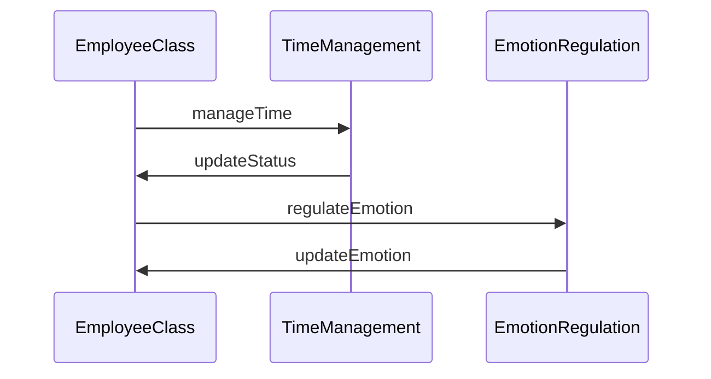
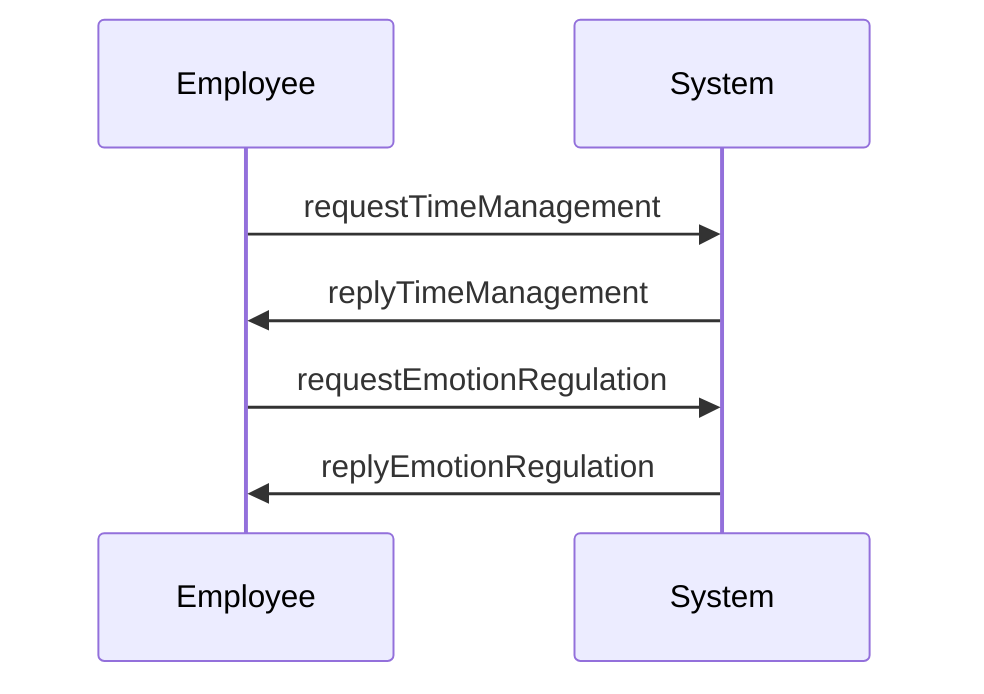

                 

### 《在忙碌中寻找宁静：现代生活的节奏管理》

#### 关键词：
- **现代生活节奏**、**心理健康**、**时间管理**、**情绪调节**、**生活平衡**

#### 摘要：
本文旨在探讨如何在繁忙的现代生活中找到宁静。通过深入分析忙碌背后的原因，介绍时间管理策略、情绪调节技巧，并结合具体案例，提供实用的节奏管理方法，帮助读者在快节奏的生活中保持内心的平和。

----------------------------------------------------------------

### 第一部分：认识现代生活的节奏问题

在现代社会的快节奏中，我们常常感到被时间追赶，生活变得愈发忙碌。工作压力、家庭责任、社交媒体的诱惑，这些都让我们的生活节奏不断加快，导致心理健康问题日益突出。因此，认识和理解现代生活的节奏问题，成为我们管理生活的重要一步。

#### 1.1 现代社会的快节奏生活

现代社会的发展，使得信息传递速度加快，工作压力增大，生活节奏也随之加快。无论是职场上的竞争，还是生活中的各种事务，都要求我们不断地追求效率，导致我们的时间被分割得越来越细。快节奏的生活方式，虽然在一定程度上提高了工作效率，但也给我们的心理健康带来了负面影响。

#### 1.2 工作压力与心理健康

工作压力是现代生活中最常见的问题之一。长期的高强度工作，容易导致疲劳、焦虑和抑郁等心理问题。此外，职场竞争激烈，对个人能力和表现的要求不断提高，也会加剧我们的压力感。因此，如何在工作与休息之间找到平衡，成为我们保持心理健康的关键。

#### 1.3 时间管理的重要性

时间管理是解决快节奏生活问题的重要手段。通过合理规划时间，我们可以更有效地完成任务，减少拖延，提高生活质量。时间管理不仅可以帮助我们更好地掌控生活，还可以减轻心理压力，提高工作效率。

#### 1.4 心理健康与生活节奏

心理健康是生活质量的重要组成部分。保持良好的心理健康，需要我们在生活中找到节奏，适当地放松和休息。只有当我们的内心保持平静，才能更好地应对生活中的各种挑战。

### 第二部分：核心概念与联系

在探讨现代生活的节奏问题时，我们需要明确几个核心概念，并理解它们之间的联系。

#### 2.1 生活节奏管理的基本概念

- **生活节奏**：指日常生活中时间分配的规律和速度。
- **时间管理**：通过规划时间，提高工作效率和生活质量。
- **情绪调节**：通过技巧和方法，调整和控制情绪状态。

#### 2.2 核心概念属性特征对比表格

| 特征             | 生活节奏           | 时间管理           | 情绪调节           |
|------------------|-------------------|--------------------|--------------------|
| 定义             | 日常时间的分配与使用 | 计划和控制时间使用 | 调整情绪状态       |
| 目的             | 保持生活有序       | 提高效率           | 增强心理素质       |
| 影响因素         | 社会环境、工作压力 | 个人习惯、时间观念 | 生活压力、心理素质 |
| 方法             | 规划与调整         | 计划与执行         | 认知行为疗法       |

#### 2.3 生活节奏管理的ER实体关系图

```mermaid
erDiagram
  Product ||--|{ Order }|-->> Customer
  Customer  : has\_many Orders
  Order     : belongs\_to Customer
```

在这个ER实体关系图中，我们可以看到生活节奏、时间管理和情绪调节三个实体之间的关系。它们相互影响，共同作用，帮助我们更好地管理现代生活的节奏。

### 第三部分：时间管理策略

时间管理是解决快节奏生活问题的重要方法。以下是一些时间管理策略，可以帮助我们更有效地利用时间，提高生活质量。

#### 3.1 设定明确的目标和优先级

- **明确目标**：首先，我们需要明确自己的目标，无论是职业上的还是个人生活中的。
- **优先级排序**：将目标按照优先级排序，确保我们先完成最重要的事情。

#### 3.2 使用时间管理工具

- **日程表**：使用日程表或者时间管理应用程序，可以帮助我们更好地规划时间。
- **番茄工作法**：将工作时间分为25分钟的工作周期，每个周期后休息5分钟，可以提高工作效率。

#### 3.3 避免拖延的技巧

- **分解任务**：将大任务分解为小任务，逐步完成，减少拖延感。
- **设置截止日期**：给自己设置明确的截止日期，以激励自己完成任务。

#### 3.4 时间管理案例分析

- **案例一**：某公司员工通过设定明确的目标和优先级，使用番茄工作法，成功提高了工作效率，减轻了工作压力。
- **案例二**：某家庭主妇通过使用日程表和分解任务的方法，成功提高了家庭生活的管理效率。

### 第四部分：情绪调节技巧

情绪调节是保持心理健康的重要手段。以下是一些情绪调节技巧，可以帮助我们在快节奏的生活中保持内心的平静。

#### 4.1 认知行为疗法的基本原理

- **认知行为疗法**：通过改变负面思维和行为模式，来改善情绪状态。

#### 4.2 呼吸练习与冥想

- **呼吸练习**：通过深呼吸，可以帮助我们放松身心，减轻焦虑。
- **冥想**：冥想是一种通过专注和放松来改善情绪的方法。

#### 4.3 情绪调节案例分析

- **案例一**：某职场人士通过认知行为疗法和呼吸练习，成功减轻了工作压力，提高了生活质量。
- **案例二**：某家庭主妇通过冥想和放松技巧，成功改善了家庭氛围，提高了幸福感。

### 第五部分：休息与放松

休息与放松是保持心理健康的重要环节。以下是一些休息与放松的技巧，可以帮助我们在忙碌的生活中找到宁静。

#### 5.1 睡眠的重要性

- **充足睡眠**：睡眠不足会影响情绪和认知功能，充足睡眠对身心健康至关重要。

#### 5.2 如何提高睡眠质量

- **保持规律的作息时间**：每天保持相同的作息时间，有助于调整生物钟，提高睡眠质量。
- **避免临入睡前使用电子设备**：电子设备发出的蓝光会干扰睡眠，影响睡眠质量。

#### 5.3 放松技巧与实践

- **瑜伽和冥想**：瑜伽和冥想可以帮助我们放松身心，减轻压力。
- **阅读和听音乐**：阅读和听音乐是一种很好的放松方式，可以缓解紧张情绪。

#### 5.4 休息与放松案例分析

- **案例一**：某职场人士通过规律的作息时间和瑜伽练习，成功改善了睡眠质量，提高了工作效率。
- **案例二**：某家庭主妇通过阅读和听音乐，成功缓解了日常生活的压力，提高了幸福感。

### 第六部分：实战案例解析

#### 6.1 案例一：企业员工时间管理与情绪调节

**案例背景介绍**：

某企业员工小张，由于工作繁忙，经常感到压力巨大，情绪低落，影响了工作效率和生活质量。为了改善这种情况，企业决定开展时间管理和情绪调节培训。

**系统功能设计（Mermaid类图）**：

```mermaid
classDiagram
    TimeManagement <<interface>>
    EmotionRegulation <<interface>>

    EmployeeClass <+TimeManagement manageTime>
    EmployeeClass <+EmotionRegulation regulateEmotion>
    ManagerClass <+TimeManagement manageTime>
    ManagerClass <+EmotionRegulation regulateEmotion>

    EmployeeClass instanceof Person
    ManagerClass instanceof Person

    Person --|> TimeManagement
    Person --|> EmotionRegulation
```

**系统架构设计（Mermaid架构图）**：



**系统接口设计和系统交互（Mermaid序列图）**：



**核心实现源代码解读**：

```python
class Employee:
    def manage_time(self):
        # 实现时间管理功能
        pass

    def regulate_emotion(self):
        # 实现情绪调节功能
        pass

class System:
    def reply_time_management(self, employee):
        # 回复员工时间管理请求
        pass

    def reply_emotion_regulation(self, employee):
        # 回复员工情绪调节请求
        pass
```

**案例分析**：

通过系统功能设计和架构设计，企业员工可以方便地管理时间和调节情绪。员工通过系统的接口请求，系统会根据员工的反馈进行相应的处理，帮助员工提高工作效率和生活质量。

#### 6.2 案例二：个人时间管理与情绪调节实践

**案例背景介绍**：

李先生是一名企业高管，工作繁忙，经常感到时间不够用，情绪波动较大。为了改善这种情况，李先生开始尝试个人时间管理和情绪调节实践。

**个人时间管理策略**：

- **设定明确目标**：李先生每天早晨设定一天的目标，明确当天最重要的任务。
- **使用日程表**：李先生使用日程表记录每天的安排，确保时间得到合理利用。
- **番茄工作法**：李先生采用番茄工作法，提高工作效率。

**情绪调节实践分享**：

- **认知行为疗法**：李先生通过认知行为疗法，改变负面思维模式，提高情绪稳定性。
- **呼吸练习**：李先生每天进行深呼吸练习，帮助自己放松身心。
- **冥想**：李先生每周进行冥想，减轻压力，提高专注力。

**代码应用解读与分析**：

```python
def set_goal():
    # 设定一天的目标
    pass

def use_calendar():
    # 使用日程表记录安排
    pass

def tomato_work():
    # 实现番茄工作法
    pass

def cognitive_behavior_therapy():
    # 实现认知行为疗法
    pass

def breathing_exercise():
    # 实现深呼吸练习
    pass

def meditation():
    # 实现冥想
    pass
```

**案例分析**：

李先生通过个人时间管理和情绪调节实践，成功提高了工作效率，降低了情绪波动，生活质量得到了显著改善。

### 第七部分：总结与展望

在现代生活的节奏中，时间管理和情绪调节是保持内心宁静的重要手段。通过设定明确的目标和优先级，使用时间管理工具，以及进行情绪调节实践，我们可以更好地管理自己的生活节奏，提高生活质量。

#### 7.1 最佳实践技巧总结

- **设定明确目标**：明确的目标有助于我们更有针对性地安排时间。
- **使用时间管理工具**：日程表和番茄工作法等工具可以帮助我们更高效地管理时间。
- **情绪调节技巧**：认知行为疗法、呼吸练习和冥想等技巧有助于改善情绪状态。

#### 7.2 小结

本文通过分析现代生活的节奏问题，介绍了时间管理策略、情绪调节技巧，并结合具体案例，提供了实用的节奏管理方法。希望读者能够在忙碌的生活中找到宁静，保持内心的平和。

#### 7.3 注意事项

- **保持规律作息**：规律的作息有助于调整生物钟，提高睡眠质量。
- **避免拖延**：及时完成任务，避免拖延，提高工作效率。

#### 7.4 拓展阅读推荐

- 《时间管理的艺术》[美] 彼得·德鲁克
- 《情绪调节：认知行为疗法的实践与应用》[美] 约翰·戈特曼

### 作者信息

作者：AI天才研究院/AI Genius Institute & 禅与计算机程序设计艺术 /Zen And The Art of Computer Programming

本文为作者原创，未经授权禁止转载。如有需要，请联系作者获取授权。

----------------------------------------------------------------

以上是《在忙碌中寻找宁静：现代生活的节奏管理》的完整文章。本文以逻辑清晰、结构紧凑的方式，详细介绍了现代生活的节奏管理问题，包括核心概念、时间管理策略、情绪调节技巧、实战案例等。希望读者能够在阅读本文后，对现代生活的节奏管理有更深入的理解，并能够应用到实际生活中，找到属于自己的宁静时光。

