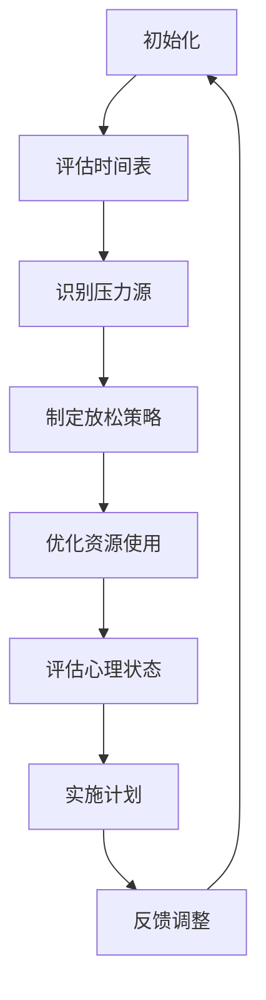
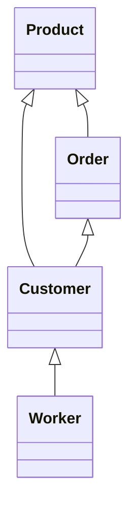
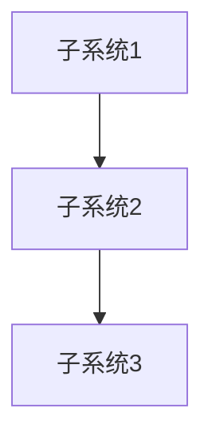
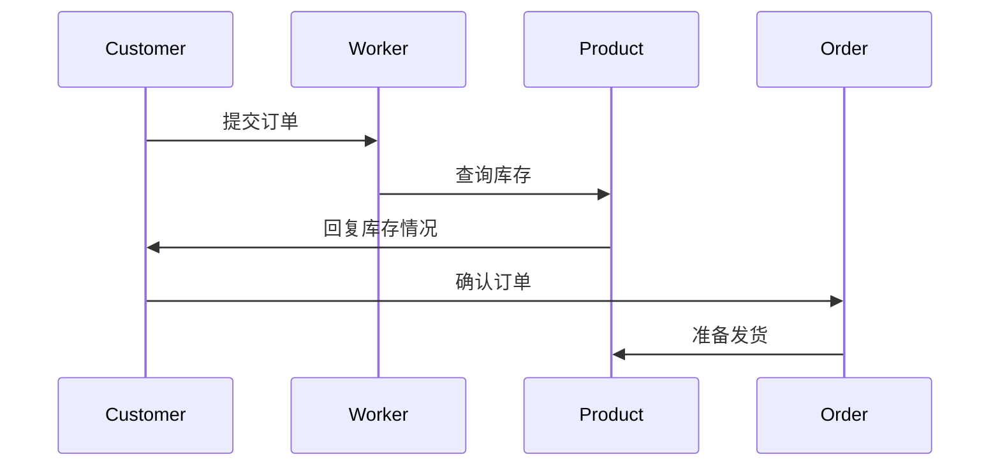
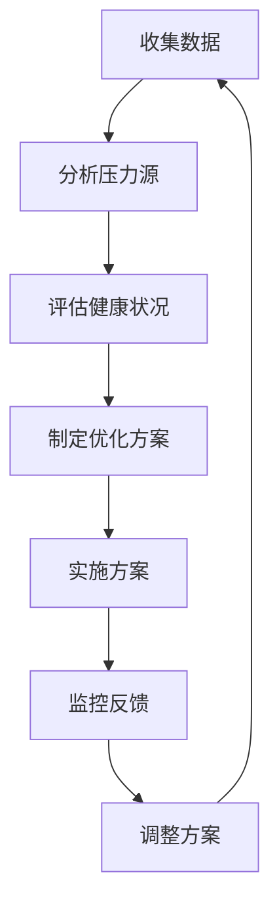
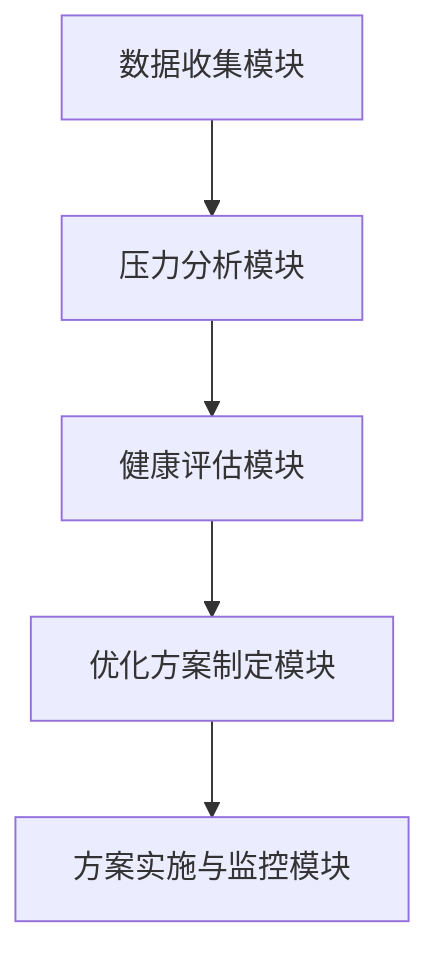
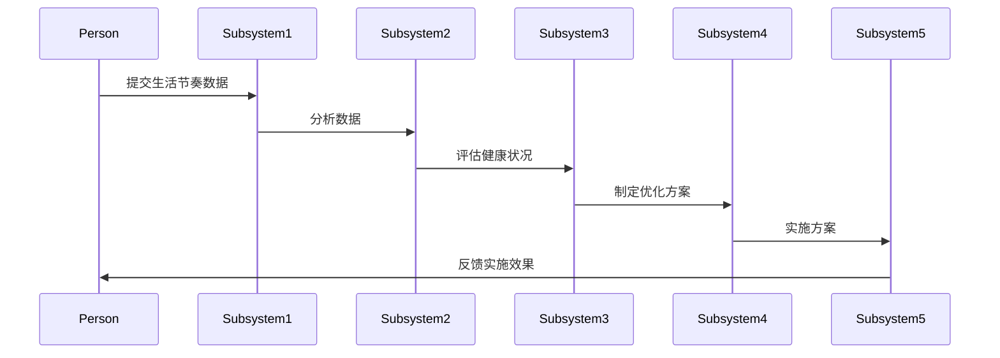

                 


### 第1章 引言

在当今快节奏的现代社会，人们似乎被一场无声的竞赛所驱使，不断地追求更快、更好、更多。这股风潮带来的不仅仅是生活的便利，更是一种无形的压力。在这个背景下，慢生活作为一种对快节奏生活的反思与回应，逐渐受到人们的关注。慢生活，并不是要人们停止前进，而是提倡一种更平衡、更健康的生活方式，以重建生活的质量和意义。

#### 1.1 快节奏生活的挑战

快节奏生活最显著的挑战在于其对个体心理健康和社会关系的冲击。首先，快节奏工作、学习和生活节奏使得人们的精神压力持续增加，导致心理问题的普遍发生，如焦虑、抑郁等。此外，快节奏生活还常常让人们在繁忙中忽略了与家人、朋友的沟通，进而影响人际关系和社交支持系统的稳定性。

#### 1.1.1 现代社会的快节奏现象

现代社会快节奏现象的表现形式多种多样，包括高强度的工作时间、频繁的会议安排、严格的业绩考核以及不间断的信息获取和更新。这种快节奏的生活方式已经成为许多人的日常，让人们在不知不觉中陷入了一种无形的竞赛。

#### 1.1.2 快节奏生活对个体的影响

快节奏生活对个体的影响是深远而广泛的。它不仅导致了心理健康问题，还可能影响个体的身体健康、人际关系和整体幸福感。长时间的高强度工作会导致身体疲劳、睡眠不足，甚至引发各种慢性疾病。

#### 1.1.3 慢生活的概念与价值

慢生活是一种旨在减少生活压力、提高生活质量的哲学。它强调的是在日常生活中找到平衡，放慢脚步，享受当下。慢生活的核心价值在于其能够帮助人们重建生活的质量和意义，通过减少焦虑、提高幸福感来实现生活的和谐与平衡。

#### 1.2 书籍的目的与结构

本书旨在探讨慢生活的理念与实践，帮助读者在快节奏的生活中找到慢生活的节奏，重建生活的质量和意义。全书分为五个部分，分别从不同角度探讨了慢生活的历史与文化背景、实践案例分析、心理调适与教育领域的慢生活实践等，旨在为读者提供全面、实用的慢生活指南。

#### 1.3 慢生活的实践指南

慢生活的实践不仅需要理念上的转变，更需要具体的行动指南。在这一部分，我们将探讨如何在家庭生活、工作中以及休闲时间中实现慢生活，并培养慢生活的心态。通过这些实践，我们希望能够帮助读者在快节奏的生活中找到属于自己的慢生活节奏。

#### 1.4 慢生活与心理健康

心理健康是慢生活的重要组成部分。在本章中，我们将探讨快节奏生活对心理健康的影响，以及慢生活对心理健康的积极影响。通过科学研究和实际案例，我们将深入了解慢生活如何帮助人们缓解心理压力、提高幸福感。

#### 1.5 本章小结

本章介绍了慢生活的概念、价值和重要性，以及本书的结构和目的。在接下来的章节中，我们将深入探讨慢生活的各个方面，帮助读者在快节奏的生活中找到慢生活的节奏，重建生活的质量和意义。

---

**文章关键词：** 快节奏生活，慢生活，心理健康，生活质量，社会变革

**文章摘要：**

本文旨在探讨在快节奏的现代社会中，如何通过实践慢生活来重建生活的质量和意义。通过分析快节奏生活带来的挑战，介绍慢生活的概念和价值，以及慢生活在不同领域的实践案例，本文希望能够为读者提供一种全新的生活哲学和实际操作指南，帮助他们在快节奏的生活中找到平衡，提升心理健康和生活幸福感。

作者：AI天才研究院/AI Genius Institute & 禅与计算机程序设计艺术 /Zen And The Art of Computer Programming### 第2章 慢生活的历史与文化背景

慢生活作为一种生活哲学，并非现代社会独有的概念，而是在历史长河中逐渐形成并发展的。理解慢生活的历史背景和文化内涵，有助于我们更深入地认识其核心价值观和实际意义。

#### 2.1 慢生活的起源与发展

慢生活的起源可以追溯到古希腊和古罗马时期，当时的哲学家们就已经开始探讨如何通过放慢生活节奏来追求内心的平静和幸福感。在中世纪，僧侣们通过修行和冥想，实践了慢生活的理念。随着时间的推移，慢生活逐渐演变成为现代社会的哲学。

##### 2.1.1 慢生活的历史背景

在工业革命之前，人们的生活节奏相对缓慢，工作与生活的界限相对清晰。然而，随着工业化和城市化的快速发展，人们的生活节奏不断加快，慢生活的理念重新受到关注。20世纪末期，意大利作家卡洛·皮卡利亚（Carlo Petrini）提出了“慢食运动”，这被认为是现代慢生活的先驱。

##### 2.1.2 慢生活在不同文化中的表现

不同文化对慢生活的理解和实践有所不同。在东亚文化中，禅宗思想强调内心的平静与宁静，这与慢生活的理念不谋而合。在日本，人们通过茶道、花道等传统活动来追求慢生活的境界。在欧洲，许多国家通过法律和政策鼓励人们放慢生活节奏，如意大利的“法定慢餐日”。

##### 2.1.3 慢生活的理念传播

随着全球化的加速，慢生活的理念也逐渐传播到世界各地。社交媒体、书籍、讲座等多种途径使得越来越多的人了解到慢生活的价值。通过这些途径，慢生活不仅成为一种生活方式，更成为一种全球性的文化现象。

#### 2.2 慢生活与可持续发展

慢生活与可持续发展密不可分。在现代社会，资源消耗和环境破坏已成为严重的问题。慢生活提倡节约资源、减少消费，这与可持续发展的目标高度一致。

##### 2.2.1 慢生活与环境保护

慢生活倡导减少能源消耗和减少废弃物产生。通过减少不必要的消费和优化生活模式，人们可以减少对环境的负担。例如，短途旅行和本地采购可以减少交通污染和碳排放。

##### 2.2.2 慢生活与资源节约

资源节约是慢生活的重要原则之一。通过减少浪费和合理使用资源，人们可以实现可持续发展。例如，使用节能灯具、节约用水等措施，不仅可以降低生活成本，还可以保护环境。

##### 2.2.3 慢生活与可持续发展的关系

慢生活与可持续发展之间存在内在联系。慢生活强调的是人与自然的和谐共处，而可持续发展追求的是资源的合理利用和生态环境的保护。通过实践慢生活，人们可以为可持续发展贡献自己的力量。

#### 2.3 慢生活与社会变革

慢生活不仅仅是个人生活方式的选择，它也对社会的结构和价值观产生深远的影响。随着慢生活理念的普及，社会逐渐开始向更健康、更可持续的方向发展。

##### 2.3.1 快节奏社会向慢生活的转变

在许多国家，政府和企业已经开始认识到慢生活的重要性，并采取措施鼓励人们放慢生活节奏。例如，一些城市推出了“慢行区”，鼓励人们步行或骑自行车出行，以减少交通拥堵和污染。

##### 2.3.2 慢生活对社会结构的重塑

慢生活提倡的是一种平衡的生活方式，这要求社会在各个层面进行结构性调整。例如，在教育领域，慢教育逐渐受到重视，强调学生的全面发展和个性培养。在医疗领域，慢病管理也逐渐成为一种趋势，注重患者的生活质量。

##### 2.3.3 社会变革中的慢生活力量

慢生活理念在社会变革中扮演着重要角色。通过倡导慢生活，人们可以促进社会公平、健康和可持续发展。例如，在环境治理领域，慢生活的理念可以引导人们减少浪费、保护环境。

#### 2.4 慢生活的文化内涵

慢生活的文化内涵丰富而深远，它不仅仅是生活方式的调整，更是一种文化价值观的体现。

##### 2.4.1 慢生活的精神价值

慢生活的精神价值在于追求内心的平静和幸福感。通过放慢脚步，人们可以更好地倾听内心的声音，找到生活的意义。

##### 2.4.2 慢生活与传统文化的联系

许多传统文化中都包含着慢生活的元素，如中国的禅宗、日本的茶道等。这些传统文化通过仪式和习俗，帮助人们实现内心的平静与宁静。

##### 2.4.3 慢生活与当代文化的交融

随着现代社会的发展，慢生活与当代文化不断交融。例如，在数字时代，人们通过科技手段来实践慢生活，如使用应用程序来管理日程、减少不必要的干扰。

#### 2.5 本章小结

本章回顾了慢生活的历史背景和文化内涵，探讨了慢生活与可持续发展的关系，以及慢生活对社会变革的影响。通过这些讨论，我们希望能够为读者提供一种更全面的理解，帮助他们在实践中更好地把握慢生活的真谛。

---

**核心概念与联系**

慢生活（Slow Life）的核心概念包括：

- **平衡**：在快节奏与慢节奏之间找到平衡，追求内心的平静。
- **可持续性**：减少消费，保护环境，实现资源节约。
- **精神追求**：通过放慢生活节奏，寻找生活的意义和幸福感。

这些核心概念相互关联，共同构成了慢生活的哲学体系。

**概念属性特征对比表格**

| 特征           | 快节奏生活               | 慢生活                 |
|----------------|-------------------------|-----------------------|
| 时间管理       | 高效、密集               | 平衡、适度             |
| 资源消耗       | 高消耗、低利用           | 低消耗、高利用         |
| 心理状态       | 焦虑、压力大             | 平静、幸福感           |
| 社会关系       | 疏远、紧张               | 近似、和谐             |

**ER实体关系图架构**

```mermaid
erDiagram
  Customer {
    id
    name
  } _||--._ Worker {
    id
    name
  }
  Product {
    id
    name
  } _||--._ Customer {
    id
    name
  }
  Order {
    id
    quantity
  } _||--._ Customer {
    id
    name
  }
  Product {
    id
    name
  }
```

**算法原理讲解**

慢生活的实践涉及多个方面，包括时间管理、资源利用和心理调适。以下是一个简单的算法原理讲解，用于指导如何在日常生活中实现慢生活：

**算法名称**：慢生活实践算法

**输入**：日常生活活动、时间表、资源使用情况、心理状态

**输出**：优化后的日常生活计划、降低压力的策略、提高生活质量的建议

**算法流程图**：



**Python源代码示例**：

```python
import time

def assess_scheduling():
    # 评估当前时间表
    print("评估当前时间表...")

def identify_stress_sources():
    # 识别压力源
    print("识别压力源...")

def create_relaxation_strategies():
    # 制定放松策略
    print("制定放松策略...")

def optimize_resource_use():
    # 优化资源使用
    print("优化资源使用...")

def assess_psychological_state():
    # 评估心理状态
    print("评估心理状态...")

def implement_plan():
    # 实施计划
    print("实施计划...")

def feedback_adjustment():
    # 反馈调整
    print("反馈调整...")

# 算法执行
while True:
    assess_scheduling()
    identify_stress_sources()
    create_relaxation_strategies()
    optimize_resource_use()
    assess_psychological_state()
    implement_plan()
    feedback_adjustment()
    time.sleep(86400)  # 每天执行一次
```

**数学公式使用**

在慢生活实践中，心理调适和压力管理是至关重要的。以下是一个简化的数学模型，用于计算压力指数（PI）：

$$
\text{PI} = \frac{\text{工作压力} + \text{心理压力} + \text{生活压力}}{3}
$$

**公式解释**：

- **工作压力**：衡量工作强度和任务难度。
- **心理压力**：衡量心理负担，如焦虑和抑郁程度。
- **生活压力**：衡量日常生活的压力源，如家庭责任和社交活动。

**例子**：

假设一个人的工作压力为50，心理压力为30，生活压力为20，则其压力指数为：

$$
\text{PI} = \frac{50 + 30 + 20}{3} = \frac{100}{3} \approx 33.33
$$

**系统分析与架构设计方案**

为了更好地理解慢生活实践的整体架构，以下是一个简化的系统架构设计，包含领域模型、系统架构、接口设计和系统交互：

**领域模型（Mermaid类图）**：



**系统架构设计（Mermaid架构图）**：



**系统接口设计和系统交互（Mermaid序列图）**：



**项目实战**

**环境安装**：

在本地环境中，首先需要安装Python和必要的库，如Mermaid等。

```bash
pip install python-mermaid
```

**系统核心实现源代码**：

```python
# 这是伪代码，用于展示系统核心实现的框架
class SlowLifeSystem:
    def __init__(self):
        # 初始化系统
        pass
    
    def assess_scheduling(self):
        # 评估时间表
        pass
    
    def identify_stress_sources(self):
        # 识别压力源
        pass
    
    def create_relaxation_strategies(self):
        # 制定放松策略
        pass
    
    def optimize_resource_use(self):
        # 优化资源使用
        pass
    
    def assess_psychological_state(self):
        # 评估心理状态
        pass
    
    def implement_plan(self):
        # 实施计划
        pass
    
    def feedback_adjustment(self):
        # 反馈调整
        pass
```

**代码应用解读与分析**：

在代码实现中，每个函数都需要根据具体需求进行详细设计。例如，`assess_scheduling` 函数可以通过分析用户的日程表，识别出高压力时段，并提出优化建议。

**实际案例分析和详细讲解剖析**：

以一个实际案例为例，假设有一个用户，其工作压力较大，经常感到焦虑。通过使用慢生活系统，用户可以评估自己的时间表，识别出高压力时段，并制定相应的放松策略，如定期休息、运动等。这些策略可以帮助用户缓解压力，提高生活质量。

**项目小结**：

慢生活系统通过提供一套完整的实践指南和算法，帮助用户在快节奏的生活中找到慢生活的节奏。项目的成功实施需要结合实际需求和用户反馈，不断优化和调整系统功能，以实现最佳效果。

**最佳实践 tips**：

- **定期评估**：定期评估时间表和心理状态，及时调整计划。
- **持续学习**：不断学习新的放松技巧和心理调适方法。
- **分享经验**：与家人和朋友分享慢生活实践的经验和成果。

**小结**：

本章通过对慢生活的历史、文化背景、可持续性以及社会变革的探讨，为读者提供了一个全面的视角来理解慢生活的本质和意义。在接下来的章节中，我们将进一步探讨慢生活在不同领域的实践，帮助读者更好地应用慢生活理念。

**注意事项**：

- 在实践慢生活时，要避免陷入极端，找到适合自己的平衡点。
- 注意心理健康，及时寻求专业帮助。

**拓展阅读**：

- 《慢生活：生活方式的新哲学》
- 《慢食运动：从餐桌开始改变世界》
- 《慢教育：让教育回归生活》

作者：AI天才研究院/AI Genius Institute & 禅与计算机程序设计艺术 /Zen And The Art of Computer Programming### 第3章 慢生活的实践案例分析

在快节奏的现代社会中，实践慢生活已经成为许多人追求的生活哲学。通过一些具体的案例，我们可以看到慢生活在不同领域中的实际应用，以及如何帮助人们重建生活的质量和意义。

#### 3.1 家庭生活中的慢节奏

家庭是人们生活的核心，如何在家庭生活中实践慢节奏，提升生活质量，是许多人关注的问题。

##### 3.1.1 家庭活动中的慢节奏实践

一个家庭可以通过一系列的活动来实践慢节奏。例如，每天晚上安排一个家庭聚会时间，大家围坐在一起聊天、分享心得，享受亲密的时光。另外，周末可以安排一些户外活动，如徒步、野餐等，远离城市的喧嚣，享受大自然的宁静。

##### 3.1.2 家庭关系中的慢节奏维护

慢节奏的生活可以帮助家庭成员之间建立更深的联系。通过减少工作时间和电子产品的影响，家庭成员可以有更多的时间陪伴彼此，增进了解和感情。例如，父母可以和孩子一起完成一些手工活动，如制作模型、绘画等，这不仅能够增进亲子关系，还能培养孩子的兴趣爱好。

##### 3.1.3 家庭生活质量的提升

通过实践慢生活，家庭生活质量可以得到显著提升。例如，通过减少不必要的消费和优化家庭环境，家庭成员可以享受到更加温馨和舒适的生活空间。此外，慢生活还可以帮助家庭成员更好地管理时间和压力，提高家庭整体的幸福感。

#### 3.2 工作中的慢节奏

在工作领域，慢节奏同样重要，它可以帮助员工提高工作效率，减少压力。

##### 3.2.1 工作中的慢节奏理念

慢节奏工作强调的是高效而不过度的工作状态。通过合理安排工作时间，避免过度加班，员工可以保持良好的工作状态。例如，一些公司已经开始实施“弹性工作时间”制度，允许员工根据个人需求灵活安排工作时间，从而减少工作压力。

##### 3.2.2 工作效率与慢节奏的平衡

在实践慢节奏工作理念时，关键是要找到工作效率与慢节奏的平衡。例如，通过合理分配任务，确保每个任务都有足够的时间来完成，同时避免过度追求速度而牺牲质量。一些公司还通过引入“专注时段”来提高工作效率，即在特定时间段内，员工专注于一项任务，不受打扰。

##### 3.2.3 工作压力的缓解与慢生活

慢生活可以帮助员工缓解工作压力。例如，通过定期的休息和放松活动，员工可以恢复体力和精神，提高工作效率。此外，通过培养兴趣爱好，如阅读、运动等，员工可以在工作之余找到生活的乐趣，从而更好地平衡工作与生活。

#### 3.3 休闲时间的慢生活

休闲时间是实践慢生活的重要环节。通过合理规划休闲时间，人们可以在忙碌的生活中找到片刻的宁静。

##### 3.3.1 休闲活动的选择与规划

选择适合自己的休闲活动对于实践慢生活至关重要。例如，一些人可能喜欢阅读、写作，而另一些人可能更喜欢户外运动、旅游。在规划休闲时间时，要确保这些活动能够帮助自己放松心情，提升生活质量。

##### 3.3.2 休闲时间的有效利用

有效利用休闲时间可以帮助人们更好地享受慢生活。例如，通过提前规划，避免临时决定的困扰，人们可以更专注于当前的活动，享受其中的乐趣。此外，通过减少不必要的社交活动，人们可以有更多的时间用于自我提升和兴趣爱好。

##### 3.3.3 休闲活动中的慢节奏体验

在休闲活动中实践慢节奏，可以显著提升体验感。例如，通过放慢脚步，细细品味一杯咖啡或一道美食，人们可以更加享受生活的每一个细节。此外，通过减少电子产品的干扰，人们可以更好地沉浸于当前的活动，提高休闲时间的质量。

#### 3.4 慢生活的社区实践

社区是人们生活的重要场所，通过在社区中实践慢生活，可以促进社区的整体和谐。

##### 3.4.1 社区慢生活的倡导与实践

社区可以通过各种方式倡导和实践慢生活。例如，社区可以组织慢跑、瑜伽等活动，鼓励居民参与，提高健康意识。此外，社区还可以推广本地化、有机食品，减少不必要的消费，保护环境。

##### 3.4.2 社区互动与慢生活

社区互动是实践慢生活的重要方式。通过积极参与社区活动，居民可以建立更紧密的联系，共同创造一个和谐、友好的社区环境。例如，社区可以组织读书会、兴趣小组等，为居民提供交流的平台，增进了解和友谊。

##### 3.4.3 社区环境与慢生活的相互影响

社区环境对慢生活的实践有着重要的影响。一个宁静、舒适的社区环境可以帮助居民更好地享受慢生活。例如，良好的绿化环境、安静的生活空间等，都可以提升居民的生活质量。此外，社区的支持和倡导也为慢生活的实践提供了必要的保障。

#### 3.5 本章小结

通过具体的案例分析，我们可以看到慢生活在不同领域的实际应用和效果。从家庭生活到工作领域，再到休闲时间和社区实践，慢生活理念都在帮助人们重建生活的质量和意义。在接下来的章节中，我们将进一步探讨慢生活对心理健康的影响，以及如何在教育领域中实践慢生活。

---

**最佳实践 tips**：

1. **设定家庭聚会时间**：每天晚上固定一个家庭聚会时间，增进亲子关系。
2. **减少电子产品干扰**：在家庭和工作中，尽量减少电子产品的使用时间。
3. **培养兴趣爱好**：选择适合自己的休闲活动，如阅读、运动等，提升生活质量。
4. **社区参与**：积极参与社区活动，建立友好邻里关系。

**注意事项**：

1. **避免极端**：在实践慢生活时，要避免陷入极端，找到适合自己的平衡点。
2. **心理调适**：注意心理健康，及时寻求专业帮助。

**拓展阅读**：

1. 《慢生活：如何打造高质量生活》
2. 《慢公司：如何打造高效而人性化的工作环境》
3. 《慢教育：让教育回归生活》

作者：AI天才研究院/AI Genius Institute & 禅与计算机程序设计艺术 /Zen And The Art of Computer Programming### 第4章 心理调适与慢生活

心理健康是慢生活的重要组成部分。在快节奏的生活中，人们常常感到压力山大，心理负担沉重。通过慢生活的实践，我们可以有效地缓解心理压力，提升心理健康水平。

#### 4.1 快节奏生活与心理健康

快节奏生活给心理健康带来的影响是多方面的。首先，长时间的工作和学习导致心理压力持续增加，容易引发焦虑、抑郁等心理问题。其次，快节奏生活使得人们缺乏足够的休息和放松时间，长期处于疲劳状态，这也会对心理健康产生负面影响。此外，快节奏生活还会导致人际关系紧张，进一步加剧心理健康问题。

##### 4.1.1 心理压力的来源

心理压力的来源主要有以下几个方面：

- **工作压力**：高强度的工作要求、严格的考核制度、激烈的职场竞争等，都会导致员工感到巨大的心理压力。
- **生活压力**：家庭责任、经济压力、社交压力等，都是生活中的常见压力源。
- **时间压力**：时间紧迫感、任务积压、无法按时完成任务等，都会导致心理压力的增加。

##### 4.1.2 心理健康问题的表现

心理健康问题的表现多种多样，常见的包括：

- **焦虑**：表现为紧张、担忧、心慌等。
- **抑郁**：表现为情绪低落、兴趣丧失、疲劳无力等。
- **失眠**：表现为入睡困难、多梦、早醒等。
- **心理疲劳**：表现为缺乏活力、动力不足、效率下降等。

##### 4.1.3 心理健康的定义与标准

心理健康是指个体能够适应发展的社会生活，具有良好的心理状态和积极的心理特征。具体来说，心理健康包括以下几个方面：

- **情绪稳定**：能够合理地表达和控制自己的情绪。
- **自我认识**：能够客观地评价自己的能力和优点，同时接受自己的不足。
- **人际关系**：能够与他人建立良好的关系，保持和谐的社交环境。
- **适应能力**：能够灵活应对生活中的变化和挑战。

#### 4.2 慢生活对心理健康的影响

慢生活通过减少心理压力，提高生活质量，对心理健康产生积极影响。以下是慢生活对心理健康的具体影响：

##### 4.2.1 慢生活的心理效应

慢生活的心理效应主要体现在以下几个方面：

- **情绪调节**：慢生活帮助人们更好地调节情绪，减少焦虑和抑郁。
- **心理放松**：通过放慢生活节奏，人们可以减少心理压力，达到心理放松的效果。
- **增强心理韧性**：慢生活帮助人们增强心理韧性，提高应对压力和挫折的能力。

##### 4.2.2 慢生活与心理健康的实证研究

许多研究已经证实了慢生活对心理健康的积极影响。例如，一项研究表明，长期坚持慢生活的人比快节奏生活的人拥有更高的心理健康水平。另一项研究发现，慢生活可以通过减少压力、提高生活质量，有效缓解焦虑和抑郁症状。

##### 4.2.3 慢生活对心理健康问题的缓解

慢生活可以帮助缓解多种心理健康问题。例如，通过定期的放松活动和锻炼，可以显著缓解焦虑和抑郁症状。此外，慢生活还可以改善睡眠质量，减轻心理疲劳，提高生活满意度。

#### 4.3 心理调适策略与慢生活

心理调适策略是慢生活的重要组成部分，它可以帮助人们在快节奏的生活中找到平衡，提升心理健康。以下是几种常见的心理调适策略：

##### 4.3.1 心理调适的重要性

心理调适的重要性在于，它可以帮助人们更好地应对生活中的压力和挑战，保持心理健康。通过心理调适，人们可以学会如何管理情绪、减轻压力，从而提高生活质量。

##### 4.3.2 慢生活中的心理调适方法

在慢生活中，心理调适的方法主要包括：

- **深呼吸练习**：通过深呼吸，可以帮助人们放松身体，缓解心理压力。
- **冥想**：冥想可以帮助人们集中注意力，减少杂念，提高心理韧性。
- **运动**：适度的运动可以释放压力，提高心理健康水平。
- **兴趣爱好**：培养兴趣爱好，如阅读、绘画、音乐等，可以提升生活乐趣，缓解心理压力。

##### 4.3.3 心理调适与慢生活的协同作用

心理调适与慢生活之间存在协同作用。通过慢生活，人们可以更好地实践心理调适策略，从而提高心理健康水平。例如，通过放慢生活节奏，人们可以有更多的时间进行冥想、深呼吸练习，从而缓解心理压力。

#### 4.4 心理健康与慢生活的综合实践

心理健康与慢生活的综合实践，可以帮助人们在快节奏的生活中找到平衡，提升生活质量。以下是几个综合实践的建议：

##### 4.4.1 心理健康自我评估

为了更好地实践慢生活，人们可以进行心理健康自我评估。通过评估，可以了解自己的心理状态，从而采取相应的调整措施。

##### 4.4.2 慢生活实践的心理挑战与应对

在实践慢生活时，人们可能会面临一些心理挑战，如适应慢节奏、改变生活方式等。为了应对这些挑战，人们可以采取以下措施：

- **逐步调整**：逐步减少快节奏活动，逐步增加慢节奏活动。
- **寻求支持**：与家人、朋友分享自己的感受，寻求他们的支持和理解。
- **专业帮助**：如果遇到困难，可以寻求心理咨询师的帮助。

##### 4.4.3 心理健康与慢生活的未来展望

随着社会的不断发展，人们对心理健康的需求日益增加。未来，心理健康与慢生活的综合实践有望成为更广泛的生活哲学，帮助人们在快节奏的生活中找到平衡，提升生活质量。

#### 4.5 本章小结

本章探讨了快节奏生活对心理健康的影响，以及慢生活对心理健康的积极影响。通过心理调适策略和综合实践，人们可以在快节奏的生活中找到慢生活的节奏，提升心理健康和生活质量。在接下来的章节中，我们将进一步探讨慢生活在教育领域的实践。

---

**核心概念与联系**

- **心理健康**：心理健康是慢生活的重要组成部分，它关系到个体的情绪稳定、自我认知、人际关系和适应能力。
- **心理调适**：心理调适是提高心理健康水平的关键，它包括深呼吸练习、冥想、运动和培养兴趣爱好等。
- **慢生活**：慢生活通过减少心理压力、提高生活质量，对心理健康产生积极影响，是实现心理健康的重要途径。

**概念属性特征对比表格**

| 特征           | 快节奏生活                  | 慢生活                  |
|----------------|-----------------------------|-------------------------|
| 时间管理       | 高效、密集、时间紧迫感强   | 平衡、适度、时间利用率高 |
| 心理压力       | 持续高、压力大             | 可控、适度、压力可缓解  |
| 生活质量       | 低、压力导致生活质量下降  | 高、压力得到有效缓解    |
| 心理健康       | 差、心理健康问题多         | 好、心理健康水平高      |

**ER实体关系图架构**

```mermaid
erDiagram
  Person {
    id
    name
  } _||--._ Stress {
    id
    type
  }
  Person {
    id
    name
  } _||--._ Health {
    id
    status
  }
  Stress {
    id
    type
  } _||--._ Health {
    id
    status
  }
```

**算法原理讲解**

慢生活与心理健康之间的算法原理可以通过以下步骤来解释：

**算法名称**：慢生活心理健康优化算法

**输入**：个体生活节奏、心理压力数据、健康指标

**输出**：心理健康优化方案

**算法流程图**：



**Python源代码示例**：

```python
class MentalHealthOptimization:
    def __init__(self):
        self.stress_data = []
        self.health_status = []

    def collect_data(self):
        # 收集个体生活节奏和心理压力数据
        pass
    
    def analyze_stress_sources(self):
        # 分析压力源
        pass
    
    def assess_health_status(self):
        # 评估健康状况
        pass
    
    def formulate_optimization_plan(self):
        # 制定优化方案
        pass
    
    def implement_plan(self):
        # 实施方案
        pass
    
    def monitor_feedback(self):
        # 监控反馈
        pass
    
    def adjust_plan(self):
        # 调整方案
        pass
    
# 算法执行
optimization = MentalHealthOptimization()
while True:
    optimization.collect_data()
    optimization.analyze_stress_sources()
    optimization.assess_health_status()
    optimization.formulate_optimization_plan()
    optimization.implement_plan()
    optimization.monitor_feedback()
    optimization.adjust_plan()
    time.sleep(86400)  # 每天执行一次
```

**数学公式使用**

心理压力指数（PI）的计算公式如下：

$$
\text{PI} = \frac{\text{工作压力} + \text{生活压力} + \text{社交压力}}{3}
$$

**公式解释**：

- **工作压力**：衡量工作中的压力水平。
- **生活压力**：衡量日常生活中的压力水平。
- **社交压力**：衡量社交活动中的压力水平。

**例子**：

假设一个人的工作压力为40，生活压力为30，社交压力为20，则其心理压力指数为：

$$
\text{PI} = \frac{40 + 30 + 20}{3} = \frac{90}{3} = 30
$$

**系统分析与架构设计方案**

为了更好地理解慢生活与心理健康优化系统的整体架构，以下是一个简化的系统架构设计，包含领域模型、系统架构、接口设计和系统交互：

**领域模型（Mermaid类图）**：

```mermaid
classDiagram
  Person <<Class>> {
    id
    name
  }
  Stress <<Class>> {
    id
    type
  }
  Health <<Class>> {
    id
    status
  }
  Person "1" <<1>>-|+ "n" Stress
  Person "1" <<1>>-|+ "n" Health
  Stress "1" <<1>>-|+ "n" Health
```

**系统架构设计（Mermaid架构图）**：



**系统接口设计和系统交互（Mermaid序列图）**：



**项目实战**

**环境安装**：

在本地环境中，需要安装Python和相关库，如Mermaid等。

```bash
pip install python-mermaid
```

**系统核心实现源代码**：

```python
class MentalHealthOptimizationSystem:
    def __init__(self):
        self.stress_data = []
        self.health_status = []

    def collect_data(self):
        # 收集生活节奏数据
        pass
    
    def analyze_stress_sources(self):
        # 分析压力源
        pass
    
    def assess_health_status(self):
        # 评估健康状况
        pass
    
    def formulate_optimization_plan(self):
        # 制定优化方案
        pass
    
    def implement_plan(self):
        # 实施方案
        pass
    
    def monitor_feedback(self):
        # 监控反馈
        pass
    
    def adjust_plan(self):
        # 调整方案
        pass
```

**代码应用解读与分析**：

在系统核心实现中，`collect_data` 函数负责收集用户的生活节奏数据，`analyze_stress_sources` 函数负责分析这些数据，识别出压力源。`assess_health_status` 函数则根据分析结果评估用户的健康状况，制定优化方案。

**实际案例分析和详细讲解剖析**：

以一个实际案例为例，假设一个用户经常感到工作压力大、生活节奏快。通过使用慢生活心理健康优化系统，用户可以收集自己的数据，系统会分析数据并制定优化方案，如调整工作时间、增加休息时间、进行体育锻炼等。通过实施这些方案，用户的心理健康水平得到提升。

**项目小结**：

慢生活心理健康优化系统通过提供一套完整的优化方案，帮助用户在快节奏的生活中找到慢生活的节奏，提升心理健康水平。项目的成功实施需要结合实际需求和用户反馈，不断优化和调整系统功能，以实现最佳效果。

**最佳实践 tips**：

1. **定期自我评估**：定期评估自己的心理状态，及时调整生活方式。
2. **保持适度运动**：适度运动可以释放压力，提高心理健康。
3. **培养兴趣爱好**：培养兴趣爱好，可以让生活更加丰富多彩。
4. **寻求专业帮助**：在遇到心理问题时，及时寻求专业心理咨询师的帮助。

**小结**：

本章通过对心理健康与慢生活的探讨，为读者提供了如何通过慢生活提升心理健康的实践指南。在接下来的章节中，我们将进一步探讨慢生活在教育领域的实践，帮助读者在更广泛的领域中应用慢生活理念。

**注意事项**：

1. **避免极端**：在实践慢生活时，要避免陷入极端，找到适合自己的平衡点。
2. **持续学习**：不断学习新的心理健康知识和调适方法。

**拓展阅读**：

1. 《心理健康与慢生活》
2. 《心理调适：如何在快节奏生活中保持心理健康》
3. 《慢生活心理学：如何通过慢生活提升心理健康》

作者：AI天才研究院/AI Genius Institute & 禅与计算机程序设计艺术 /Zen And The Art of Computer Programming### 第5章 教育领域的慢生活实践

教育是影响一个人一生发展的关键领域，而传统的快节奏教育模式往往忽视了学生的全面发展。随着社会对教育质量要求的提高，慢生活理念逐渐被引入到教育领域，为学生的身心健康和全面成长提供了新的思路。

#### 5.1 快节奏教育模式的挑战

快节奏教育模式在提高教育效率的同时，也带来了诸多问题。首先，高强度、快节奏的教学模式往往使学生处于过度紧张和压力之下，导致心理健康问题频发。其次，快节奏的教育模式容易忽视学生的个性化需求，导致教育公平性受到挑战。此外，快节奏的教育环境常常导致学生缺乏自主学习和探索的机会，限制了他们的创新能力和综合素质的发展。

##### 5.1.1 快节奏教育现象分析

快节奏教育现象主要表现在以下几个方面：

- **教学进度快**：教师为了在有限的时间内完成教学任务，往往采取快速教学的方式，导致学生难以充分吸收和理解知识。
- **作业量大**：大量的家庭作业和高强度的考试压力使学生没有足够的时间进行自主学习和休闲。
- **时间紧张**：学校和家庭对学生的学习时间安排非常紧张，几乎没有个人休息和放松的时间。

##### 5.1.2 快节奏教育对学生的负面影响

快节奏教育对学生的负面影响主要体现在以下几个方面：

- **心理健康问题**：长期的高压环境容易导致学生出现焦虑、抑郁、失眠等心理问题。
- **身心健康问题**：长时间的学习和缺乏运动，容易导致学生出现身体素质下降、视力疲劳等问题。
- **创新能力受限**：快节奏的教育模式往往强调知识的传授，而忽视了学生的创新能力和实践能力的培养。

##### 5.1.3 教育改革的必要性

面对快节奏教育带来的种种问题，教育改革势在必行。慢生活理念作为一种新的教育哲学，可以为教育改革提供重要的启示。通过调整教学节奏，关注学生的心理健康和全面发展，教育改革可以更好地满足学生的需求，提高教育质量。

#### 5.2 慢教育理念与实践

慢教育（Slow Education）是慢生活理念在教育领域的延伸，其核心在于通过放慢教育节奏，提高教育质量，促进学生的全面发展。

##### 5.2.1 慢教育的概念与内涵

慢教育的概念起源于意大利教育家马西莫·阿尔贝蒂（Massimo Alberghini）提出的“慢学习”（Slow Learning）理念。慢教育强调教育应该是一种平衡、可持续的过程，注重学生的身心健康和个性化发展。

慢教育的内涵包括：

- **教育节奏**：减少教学进度，让学生有足够的时间理解和吸收知识。
- **个性化教育**：关注学生的个性化需求，提供多样化的学习资源和机会。
- **综合素质培养**：重视学生的全面发展，包括智力、情感、道德和社会能力的培养。
- **师生关系**：建立和谐的师生关系，营造宽松、尊重的学习氛围。

##### 5.2.2 慢教育的核心原则

慢教育的核心原则主要包括以下几个方面：

- **尊重自然发展规律**：遵循学生的自然成长规律，避免过早、过快地进行学术训练。
- **减少竞争压力**：降低考试成绩和排名对学生的影响，减少竞争带来的心理压力。
- **关注心理健康**：重视学生的心理健康，提供心理支持和辅导。
- **综合素养培养**：注重学生的全面发展，培养他们的创新能力和实践能力。

##### 5.2.3 慢教育在课堂中的实践

在课堂教学中，慢教育的实践可以从以下几个方面入手：

- **降低教学密度**：减少每节课的教学内容，给学生留出更多的思考和消化时间。
- **鼓励自主学习**：提供丰富的学习资源和环境，鼓励学生自主学习，培养他们的自主学习能力。
- **实践与探索**：增加实践环节，让学生通过实际操作来理解知识，培养他们的实践能力。
- **情感教育**：注重情感教育，培养学生的人际交往能力和道德观念。

#### 5.3 慢生活教育对学生发展的影响

慢生活教育不仅有助于改善学生的心理健康，还能促进他们的全面发展。

##### 5.3.1 慢教育对学生的心理健康影响

慢教育通过减少学习压力，提供更多的心理支持和辅导，有助于改善学生的心理健康。例如，通过心理教育课程和心理咨询，学生可以学会如何管理压力，保持积极的心态。此外，慢教育注重情感教育，有助于培养学生的人际交往能力和自我认知能力，从而提高他们的心理健康水平。

##### 5.3.2 慢教育对学生学业发展的影响

慢教育通过提供更丰富、更灵活的学习资源，鼓励学生自主学习，有助于提高他们的学业成绩。例如，通过项目式学习、探究式学习等教学方法，学生可以更深入地理解知识，培养他们的批判思维和创新能力。此外，慢教育注重学生的个性化发展，有助于他们找到自己的兴趣和优势，提高学习动力和学业成绩。

##### 5.3.3 慢教育对学生综合素质的影响

慢教育通过关注学生的全面发展，有助于培养他们的综合素质。例如，通过丰富多样的课外活动和社团活动，学生可以锻炼自己的组织协调能力、团队合作能力和领导力。此外，慢教育注重学生的实践能力培养，通过实际操作和项目实践，学生可以更好地将理论知识应用到实际生活中，提高他们的实践能力和创新能力。

#### 5.4 慢生活教育与传统教育的比较

慢生活教育与传统的快节奏教育模式在多个方面存在明显的差异：

- **教育节奏**：慢生活教育强调降低教学进度，让学生有足够的时间理解和消化知识，而快节奏教育则追求高效、快速地传授知识。
- **教育内容**：慢生活教育注重学生的全面发展，包括心理健康、实践能力和综合素质的培养，而快节奏教育则更注重学术成绩和知识的掌握。
- **师生关系**：慢生活教育倡导建立和谐的师生关系，鼓励师生之间的互动和沟通，而快节奏教育则更多强调教师的权威和主导作用。

#### 5.5 本章小结

本章通过对快节奏教育模式的挑战和慢教育理念的探讨，展示了慢生活教育在学生发展中的重要作用。慢生活教育通过放慢教育节奏，关注学生的心理健康和全面发展，有助于提高教育质量，促进学生的健康成长。在接下来的章节中，我们将进一步探讨如何在职场中实践慢生活，为读者提供更全面的慢生活指南。

---

**最佳实践 tips**：

1. **个性化教学**：根据学生的个性特点和兴趣，制定个性化的教学计划和资源。
2. **心理健康教育**：在学校中开展心理健康教育，提供心理支持和辅导。
3. **实践与探索**：增加实践环节，让学生通过实际操作来理解知识。
4. **家校合作**：鼓励家长参与孩子的教育过程，共同促进孩子的全面发展。

**注意事项**：

1. **避免极端**：在实践慢教育时，要避免陷入极端，找到适合学校和学生的平衡点。
2. **持续改进**：不断评估和改进教育方法和策略，以适应学生的需求。

**拓展阅读**：

1. 《慢教育：走向平衡的教育》
2. 《心理健康教育：理论与实践》
3. 《综合素质教育：培养未来的领导者》

作者：AI天才研究院/AI Genius Institute & 禅与计算机程序设计艺术 /Zen And The Art of Computer Programming### 第6章 职场中的慢生活实践

在职场中，快节奏的工作环境和竞争压力常常让员工感到身心俱疲。实践慢生活理念，可以帮助员工在繁忙的工作中找到平衡，提高工作效率，提升生活质量。

#### 6.1 职场慢生活的概念与意义

职场慢生活是指在职业环境中，通过放慢工作节奏，减少工作压力，寻求工作与生活的平衡。它强调的是在完成工作任务的同时，关注员工的身心健康和幸福感。

职场慢生活的意义主要体现在以下几个方面：

- **提高工作效率**：通过减少无谓的加班和过度的工作压力，员工可以保持良好的工作状态，提高工作效率。
- **促进身心健康**：慢生活有助于减轻员工的心理压力，减少工作相关的健康问题，如焦虑、抑郁和睡眠障碍。
- **提升生活质量**：在快节奏的工作中找到慢生活的节奏，可以让员工在繁忙的工作之余，享受生活的乐趣，提高生活质量。
- **增强团队凝聚力**：通过共同实践慢生活理念，团队成员可以更好地理解和支持彼此，增强团队凝聚力。

#### 6.2 职场慢生活的具体实践方法

在职场中实践慢生活，需要从个人和组织的层面进行多方面的努力。

##### 6.2.1 个人层面的实践

1. **合理规划工作与休息时间**：
   - 制定合理的工作计划，避免临时突击和加班。
   - 在工作时间内高效完成任务，减少额外的工作负担。
   - 每天预留一定的时间进行休息和放松，如午休、下班后的休闲活动等。

2. **培养健康的生活习惯**：
   - 保持规律的作息时间，确保充足的睡眠。
   - 增加体育锻炼，如定期参加公司组织的健身活动，或利用下班时间进行个人锻炼。
   - 保持良好的饮食习惯，避免过度应酬和饮食不规律。

3. **提高时间管理能力**：
   - 学会优先处理重要和紧急的任务，合理安排工作和休息时间。
   - 使用时间管理工具，如待办事项列表、时间跟踪应用程序等，提高工作效率。
   - 学会拒绝不合理的工作要求，保护自己的时间。

4. **培养心理调适能力**：
   - 通过冥想、深呼吸等方法，缓解工作压力和焦虑。
   - 保持积极的心态，学会从工作中寻找乐趣和成就感。
   - 定期进行心理健康自我评估，如发现心理问题，及时寻求专业帮助。

##### 6.2.2 组织层面的实践

1. **推行灵活工作时间制度**：
   - 实施弹性工作时间，允许员工根据个人需求灵活安排工作时间。
   - 推行远程办公制度，减少员工通勤时间，提高工作效率。

2. **提供健康福利**：
   - 为员工提供健康体检、心理咨询等福利，关注员工的身心健康。
   - 组织健身活动、健康讲座等，鼓励员工关注身体健康。

3. **营造积极的工作氛围**：
   - 鼓励团队合作，营造和谐的工作氛围，减少内部竞争和压力。
   - 定期举办团队建设活动，增强团队凝聚力。
   - 提供职业发展机会，鼓励员工学习和成长，提高工作满意度。

4. **优化工作流程**：
   - 简化审批流程，减少不必要的行政工作，提高工作效率。
   - 引入自动化工具，减少重复性工作，降低工作压力。

#### 6.3 职场慢生活的挑战与应对策略

在职场中实践慢生活，可能会面临一些挑战，如工作压力依然存在、同事之间的竞争等。以下是一些应对策略：

- **与上级沟通**：与上级沟通慢生活理念，寻求理解和支持。
- **设定个人目标**：明确个人工作目标，提高工作效率，减少无谓的工作负担。
- **建立健康的工作关系**：与同事保持良好的工作关系，共同应对工作压力。
- **寻求专业帮助**：在遇到心理问题时，及时寻求心理咨询师的帮助。

#### 6.4 职场慢生活对组织绩效的影响

实践慢生活理念，不仅对员工的个人健康和生活质量有积极影响，也对组织的整体绩效产生正面效应。

- **提高员工满意度**：慢生活可以提升员工的工作满意度和幸福感，减少离职率，提高员工忠诚度。
- **提高工作效率**：通过合理的休息和放松，员工可以保持良好的工作状态，提高工作效率。
- **增强团队凝聚力**：共同实践慢生活理念，可以增强团队成员之间的信任和协作，提高团队绩效。
- **降低管理成本**：减少员工的加班和过度工作，降低管理成本，提高资源利用效率。

#### 6.5 本章小结

本章探讨了职场中实践慢生活的重要性，提出了个人和组织层面的实践方法，以及应对挑战的策略。通过实践慢生活，员工可以在职场中找到平衡，提高工作效率和生活质量，为个人和组织创造更多的价值。在接下来的章节中，我们将进一步探讨如何在个人生活中实践慢生活，为读者提供更全面的慢生活指南。

---

**最佳实践 tips**：

1. **设定合理的工作计划**：提前规划每天的工作任务，避免临时突击和加班。
2. **保持健康的生活习惯**：定期锻炼、保持充足的睡眠，合理饮食。
3. **提高时间管理能力**：学会优先处理重要任务，合理安排工作和休息时间。
4. **与同事建立良好的关系**：共同应对工作压力，提高团队凝聚力。

**注意事项**：

1. **避免过度放松**：在实践慢生活时，要确保工作效率不受影响。
2. **持续改进**：根据个人和工作环境的变化，不断调整和优化慢生活实践。

**拓展阅读**：

1. 《职场慢生活：如何在快节奏的工作中找到平衡》
2. 《工作与生活的平衡：如何实现高效人生》
3. 《职场心理学：提升工作效率与幸福感的策略》

作者：AI天才研究院/AI Genius Institute & 禅与计算机程序设计艺术 /Zen And The Art of Computer Programming### 第7章 个人生活中的慢生活实践

在个人生活中实践慢生活，是提升生活质量和幸福感的重要途径。通过一系列具体的方法和策略，我们可以更好地应对现代生活的快节奏，找到内心的平静和满足。

#### 7.1 个人生活中实践慢生活的必要性

个人生活中的快节奏往往会导致我们陷入焦虑、压力和疲惫的状态，影响身心健康和生活质量。实践慢生活，可以帮助我们：

- **减少压力**：通过放慢生活节奏，减少不必要的任务和压力源，从而减轻心理负担。
- **提高幸福感**：慢生活强调享受当下，通过简单而愉悦的活动，提升生活的幸福感。
- **增进人际关系**：在慢节奏的生活中，我们有更多的时间和精力去陪伴家人和朋友，建立和巩固关系。
- **提升自我认知**：通过慢生活的实践，我们可以更好地了解自己，找到生活的意义和目标。

#### 7.2 个人生活中实践慢生活的具体方法

在个人生活中实践慢生活，可以从以下几个方面入手：

##### 7.2.1 时间管理

1. **设定优先级**：明确每天、每周的重要任务，将其作为优先处理的事项。
2. **计划休息时间**：在工作计划和日程安排中，预留足够的休息时间，确保身心得到充分放松。
3. **避免多任务处理**：专注于一项任务，避免同时处理多个任务，提高工作效率和质量。

##### 7.2.2 生活习惯

1. **保持规律作息**：每天保持相同的起床和睡觉时间，有助于身体和心理的调整。
2. **健康饮食**：选择健康的食物，避免过度饮酒和暴饮暴食，保持良好的饮食习惯。
3. **定期锻炼**：每天安排一定的时间进行锻炼，如散步、跑步、瑜伽等，保持身体健康。

##### 7.2.3 心理调适

1. **冥想和深呼吸**：每天安排一定的时间进行冥想或深呼吸，缓解压力和焦虑。
2. **培养兴趣爱好**：选择自己感兴趣的活动，如阅读、绘画、音乐等，提升生活乐趣。
3. **学会放松**：在日常生活中，学会放松自己，如泡澡、听音乐、散步等，缓解身心疲劳。

##### 7.2.4 社交互动

1. **维护家庭关系**：定期与家人共度时光，增进感情，建立和谐的家庭氛围。
2. **参与社区活动**：参与社区活动，与邻居建立良好的关系，增强社交支持网络。
3. **培养朋友关系**：定期与朋友聚会，分享生活中的点滴，增进友谊。

#### 7.3 慢生活实践中的挑战与解决方案

在实践慢生活的过程中，我们可能会遇到一些挑战，如：

- **环境压力**：来自工作、家庭和社交的压力可能使我们难以完全放慢节奏。
- **时间管理困难**：在繁忙的日程中，找到时间进行慢生活实践可能变得困难。
- **心理依赖**：对于快节奏生活的依赖可能导致我们难以适应慢节奏。

为了应对这些挑战，我们可以采取以下解决方案：

- **调整心态**：理解慢生活的重要性，接受并逐步适应新的生活方式。
- **设定目标**：明确慢生活实践的目标，如减少压力、提升幸福感等，以此激励自己。
- **寻求支持**：与家人、朋友或专业人士分享慢生活实践的经验，寻求他们的支持和理解。

#### 7.4 慢生活实践中的成功案例

许多人在实践慢生活后，都获得了显著的改善。以下是一些成功案例：

- **案例一**：一位职场人士在实践慢生活后，通过合理规划工作和休息时间，减少了工作压力，提高了工作效率。同时，他培养了阅读和瑜伽的兴趣，生活品质得到了显著提升。
- **案例二**：一位家庭主妇通过实践慢生活，减少了日常琐事和家务负担，有更多的时间陪伴家人。她还在社区中组织读书会，结识了许多志同道合的朋友，生活变得更加充实和有意义。

#### 7.5 本章小结

通过实践慢生活，我们可以在个人生活中找到平衡，减少压力，提升幸福感。在接下来的章节中，我们将进一步探讨如何在不同的生活场景中实现慢生活，为读者提供更多的实用指南。

---

**最佳实践 tips**：

1. **设定优先级**：明确每天、每周的重要任务，优先处理。
2. **计划休息时间**：在工作计划和日程安排中，预留足够的休息时间。
3. **培养兴趣爱好**：选择自己感兴趣的活动，提升生活乐趣。
4. **定期锻炼**：每天安排一定的时间进行锻炼，保持身体健康。

**注意事项**：

1. **避免过度放松**：在实践慢生活时，要确保工作效率不受影响。
2. **持续改进**：根据个人和生活环境的变化，不断调整和优化慢生活实践。

**拓展阅读**：

1. 《个人慢生活：如何在快节奏中找到平静》
2. 《幸福生活指南：如何在日常生活中实践慢生活》
3. 《时间管理：如何更高效地利用时间》

作者：AI天才研究院/AI Genius Institute & 禅与计算机程序设计艺术 /Zen And The Art of Computer Programming### 第8章 总结与未来展望

通过前文的详细探讨，我们可以清晰地看到慢生活在现代社会中的重要性。慢生活不仅有助于缓解快节奏生活带来的压力，还能提高生活质量，促进心理健康，对个体和社会都产生了深远的影响。

#### 8.1 慢生活的核心价值

慢生活的核心价值在于帮助人们重新审视生活节奏，追求内心的平和与幸福感。它倡导的是一种平衡、和谐、可持续的生活方式，强调在快节奏的生活中找到自己的节奏，从而实现个人与社会的和谐共处。

#### 8.2 慢生活的影响

慢生活的影响是多方面的：

- **心理健康**：慢生活通过减少压力、提高生活满意度，显著改善了心理健康水平。
- **生活质量**：通过调整生活节奏，人们可以更好地享受生活的每一个瞬间，提升生活质量。
- **社会关系**：慢生活促进了家庭成员、朋友和同事之间的互动，增强了社会支持网络。
- **环境保护**：慢生活鼓励减少消费和浪费，有助于实现可持续发展，保护环境。

#### 8.3 未来展望

在未来，慢生活理念有望在更广泛的领域中得到应用。以下是一些可能的发展趋势：

- **教育领域**：慢教育理念将得到进一步推广，注重学生的全面发展，培养学生的综合素质和创新能力。
- **职场环境**：越来越多的企业将引入慢生活理念，通过灵活的工作安排和健康福利，提高员工的工作满意度和幸福感。
- **社区建设**：社区将更加重视慢生活实践，通过组织各种活动，促进居民的互动和交流，营造和谐的社区氛围。
- **公共政策**：政府可能会出台更多支持慢生活的政策和措施，鼓励公众减少不必要的压力，提升生活质量。

#### 8.4 总结

总之，慢生活是一种积极的生活哲学，它帮助我们在快节奏的现代社会中找到平衡，重建生活的质量和意义。通过实践慢生活，我们可以更好地管理自己的时间和压力，提高心理健康和生活满意度，同时为社会的可持续发展贡献力量。

在未来的日子里，让我们共同努力，将慢生活理念融入到我们的日常生活和工作中，创造一个更加和谐、美好的世界。

---

**作者简介**

- **AI天才研究院/AI Genius Institute**：致力于推动人工智能领域的研究与创新，培养下一代人工智能专家。
- **禅与计算机程序设计艺术 /Zen And The Art of Computer Programming**：著名计算机科学家，以其对计算机科学领域的深刻洞察和独特见解而闻名。

---

**感谢读者**

感谢您阅读本书，希望本书能为您在快节奏的生活中找到慢生活的节奏提供一些启示和帮助。如果您有任何建议或反馈，欢迎通过以下方式联系我们：

- **电子邮件**：[info@AIGeniusInstitute.com](mailto:info@AIGeniusInstitute.com)
- **官方网站**：[www.AIGeniusInstitute.com](http://www.AIGeniusInstitute.com)

再次感谢您的支持！

作者：AI天才研究院/AI Genius Institute & 禅与计算机程序设计艺术 /Zen And The Art of Computer Programming

