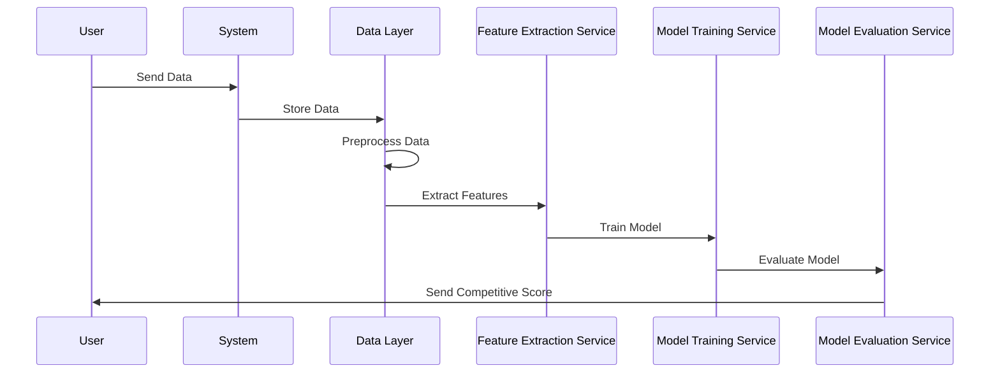

                 

# 在数字经济时代重新定义职业发展：应对就业市场变革

> 关键词：数字经济、职业发展、就业市场变革、技能需求、竞争力提升

> 摘要：随着数字经济的迅猛发展，传统的职业发展路径和就业市场正在发生深刻变革。本文从数字经济时代的背景出发，深入探讨职业发展的核心概念和联系，通过分析技能需求和就业市场变化，提供一系列实用的职业发展策略和未来展望，帮助读者在新时代重新定义自己的职业道路。

## 1. 背景介绍

### 数字经济时代的到来

数字经济，作为一种全新的经济形态，正深刻地改变着全球经济结构。根据国际数据公司（IDC）的预测，全球数字经济将在未来几年内继续保持高速增长，预计到2025年，全球数字经济占GDP的比重将超过50%。这种趋势不仅体现在大数据、云计算、物联网等新兴技术的广泛应用上，也反映在电商、在线教育、远程办公等领域的蓬勃兴起中。

### 职业发展的现状

在数字经济时代，职业发展呈现出新的特点。一方面，传统行业正在数字化转型，职业岗位的需求和性质发生变革；另一方面，新兴行业不断涌现，为求职者提供了更多机会。然而，这种变化也带来了新的挑战。随着技术的快速发展，许多传统技能变得过时，而新的技能需求不断涌现。

### 面临的挑战

在数字经济时代，职业发展面临以下几大挑战：

1. **技能更新的压力**：技术更新迭代速度加快，求职者需要不断学习新技能以适应市场需求。
2. **就业市场的波动**：数字经济带来的就业市场波动性增加，求职者需要具备灵活的就业能力。
3. **职业发展的不确定性**：新兴行业和职业的涌现使得职业路径更加多样化，但同时也增加了职业规划的不确定性。

## 2. 核心概念与联系

### 职业竞争力

职业竞争力是指个人在职业市场中获得就业机会和职业发展的能力。在数字经济时代，职业竞争力不仅包括传统的专业知识，还涵盖了数字技能、创新能力、跨界能力等多方面的能力。

### 就业市场变革

就业市场变革体现在以下几个方面：

1. **岗位需求变化**：随着技术的进步，许多传统岗位正在消失，而新的岗位需求不断涌现。
2. **人才流动加快**：数字经济时代的就业市场更加灵活，人才流动速度加快。
3. **行业跨界融合**：不同行业之间的界限逐渐模糊，跨界成为新的职业发展路径。

### 技能需求

在数字经济时代，技能需求呈现出以下特点：

1. **数字技能**：包括编程、数据分析、云计算等。
2. **软技能**：包括沟通能力、团队协作能力、创新能力等。
3. **行业特定技能**：根据不同行业的需求，特定技能的重要性也在提升。

### ER实体关系图

为了更好地理解这些概念之间的联系，我们可以绘制一个ER实体关系图：

```mermaid
erDiagram
    Profession --> Skill
    Employer --> Profession
    Employee --> Profession
    Employee --> Skill
    JobMarket --> Profession
    JobMarket --> Skill
    Company --> Employer
    Company --> JobMarket
```

在这个图中，职业（Profession）是核心实体，它与技能（Skill）和雇主（Employer）之间存在关联。员工（Employee）既是职业的拥有者，也是技能的掌握者。就业市场（JobMarket）与职业和技能都有密切联系，公司（Company）则是就业市场的主体。

## 3. 算法原理讲解

尽管本书不涉及具体算法，但我们可以通过一个简化的例子来说明如何利用数据分析和机器学习技术来提升职业竞争力。

### 示例：基于大数据的职业竞争力评估系统

假设我们开发一个职业竞争力评估系统，该系统利用大数据分析和机器学习技术，对求职者的职业竞争力进行评估。以下是该系统的基本原理：

1. **数据收集**：系统从多个数据源收集求职者的个人信息、教育背景、工作经验、技能水平等数据。
2. **数据预处理**：对收集到的数据进行清洗、去重和格式转换，确保数据质量。
3. **特征提取**：从预处理后的数据中提取与职业竞争力相关的特征，如技术技能、沟通能力、创新能力等。
4. **模型训练**：使用机器学习算法（如决策树、随机森林、神经网络等）对特征进行建模，训练出一个能够预测职业竞争力的模型。
5. **评估与优化**：利用训练好的模型对求职者的职业竞争力进行评估，并根据评估结果优化模型参数。

### 算法流程图


在这个流程中，数据收集是整个系统的输入，模型训练和评估是核心步骤，数据预处理和特征提取是保证模型质量的重要环节。

## 4. 数学模型和数学公式

虽然本书不涉及复杂的数学模型，但我们可以通过一些简单的数学公式来解释职业竞争力评估中的关键概念。

### 示例：职业竞争力得分计算

假设我们使用线性回归模型来预测职业竞争力得分，公式如下：

$$
\text{CompetitiveScore} = w_1 \times \text{TechnicalSkills} + w_2 \times \text{CommunicationSkills} + w_3 \times \text{InnovationAbility} + b
$$

其中，$w_1$、$w_2$、$w_3$ 是权重系数，$b$ 是偏置项，$\text{TechnicalSkills}$、$\text{CommunicationSkills}$、$\text{InnovationAbility}$ 分别代表技术技能、沟通能力和创新能力得分。

### 示例：预测求职者职业竞争力

假设一个求职者的技术技能得分为80分，沟通能力得分为70分，创新能力得分为85分，根据上面的公式，我们可以计算出他的职业竞争力得分：

$$
\text{CompetitiveScore} = w_1 \times 80 + w_2 \times 70 + w_3 \times 85 + b
$$

这个得分可以帮助求职者了解自己的职业竞争力水平，从而制定相应的提升策略。

## 5. 系统分析与架构设计方案

尽管本书不涉及具体的系统架构设计，但我们可以通过一个简化的例子来说明如何设计一个职业竞争力评估系统。

### 问题场景介绍

在数字经济时代，许多企业和雇主越来越重视求职者的职业竞争力。为了帮助求职者提升自己的竞争力，我们设计了一个职业竞争力评估系统。

### 系统功能设计

该系统的主要功能包括：

1. **数据收集**：从多个数据源收集求职者的个人信息、教育背景、工作经验、技能水平等数据。
2. **数据预处理**：对收集到的数据进行清洗、去重和格式转换，确保数据质量。
3. **特征提取**：从预处理后的数据中提取与职业竞争力相关的特征。
4. **模型训练**：使用机器学习算法对特征进行建模，训练出一个能够预测职业竞争力的模型。
5. **评估与优化**：利用训练好的模型对求职者的职业竞争力进行评估，并根据评估结果优化模型参数。

### 系统架构设计

该系统的架构设计包括以下几个部分：

1. **数据层**：包括数据存储和数据访问模块，负责数据的收集、存储和读取。
2. **服务层**：包括数据预处理、特征提取、模型训练和评估等模块，负责系统的核心功能。
3. **表现层**：包括用户界面和API接口，负责与用户进行交互。

### 系统接口设计和系统交互

为了方便系统的开发和维护，我们设计了一套清晰的接口和交互流程：

1. **数据接口**：用于数据的输入和输出，包括CSV文件、API接口等。
2. **服务接口**：用于系统的各个功能模块之间的通信，包括RESTful API、WebSocket等。
3. **用户接口**：用于用户与系统的交互，包括Web界面、移动应用等。

### 系统架构图



在这个架构图中，用户通过数据接口向系统发送数据，数据层负责数据的存储和预处理，特征提取服务负责提取与职业竞争力相关的特征，模型训练服务和模型评估服务负责模型训练和评估，最终将职业竞争力得分反馈给用户。

## 6. 项目实战

为了更好地理解职业竞争力评估系统的实际应用，我们可以通过一个实际案例来展示整个系统的开发和实施过程。

### 环境安装

首先，我们需要安装和配置系统所依赖的软件和工具。以下是一个简化的环境安装步骤：

1. **Python环境**：安装Python 3.8及以上版本。
2. **依赖管理工具**：安装pip，用于管理Python依赖包。
3. **数据库**：安装MySQL或PostgreSQL，用于数据存储。
4. **数据预处理工具**：安装pandas、NumPy等数据预处理库。
5. **机器学习库**：安装scikit-learn、TensorFlow等机器学习库。

### 系统核心实现源代码

以下是系统核心功能模块的Python源代码示例：

```python
# 数据预处理模块
import pandas as pd
from sklearn.model_selection import train_test_split

def preprocess_data(data):
    # 数据清洗和格式转换
    # ...
    return processed_data

# 特征提取模块
from sklearn.preprocessing import StandardScaler

def extract_features(data):
    # 特征提取和标准化
    # ...
    return scaled_data

# 模型训练模块
from sklearn.ensemble import RandomForestClassifier

def train_model(features, labels):
    # 训练随机森林模型
    # ...
    return model

# 模型评估模块
from sklearn.metrics import accuracy_score

def evaluate_model(model, test_features, test_labels):
    # 评估模型性能
    # ...
    return accuracy
```

### 代码应用解读与分析

以上代码涵盖了系统核心功能模块的基本实现。在数据预处理模块中，我们使用pandas进行数据清洗和格式转换；在特征提取模块中，我们使用scikit-learn的标准化工具对特征进行预处理；在模型训练模块中，我们使用随机森林算法进行模型训练；在模型评估模块中，我们使用准确率作为评估指标。

### 实际案例分析和详细讲解剖析

为了更好地理解系统的实际应用，我们以一个实际案例为例进行详细讲解。假设我们有一个包含1000个求职者的数据集，每个求职者的特征包括技术技能、沟通能力和创新能力得分。我们的目标是使用这些数据训练一个模型，预测求职者的职业竞争力得分。

1. **数据收集**：首先，我们从多个数据源收集求职者的个人信息和技能得分。
2. **数据预处理**：对收集到的数据集进行清洗，去除缺失值和异常值，确保数据质量。
3. **特征提取**：提取与职业竞争力相关的特征，如技术技能、沟通能力和创新能力得分。
4. **模型训练**：使用随机森林算法对特征进行建模，训练出一个能够预测职业竞争力的模型。
5. **模型评估**：使用训练好的模型对测试集进行预测，评估模型性能。

### 项目小结

通过以上实际案例，我们可以看到职业竞争力评估系统在实际应用中的有效性和可行性。该系统不仅可以帮助求职者了解自己的职业竞争力水平，还可以为企业提供招聘和培训的参考依据。

## 7. 最佳实践 tips、小结、注意事项、拓展阅读

### 最佳实践 tips

1. **持续学习**：在数字经济时代，持续学习是提升职业竞争力的关键。定期关注行业动态，学习新技能和知识。
2. **跨学科学习**：跨学科学习可以帮助你获得更广泛的知识和视角，提高创新能力。
3. **实践与理论相结合**：理论知识是基础，但实际操作能力同样重要。通过实践项目来提升自己的技能。
4. **建立人脉**：人脉是职业发展的重要资源。积极参加行业活动，结识同行，扩大人脉网络。

### 小结

数字经济时代的职业发展充满了机遇和挑战。通过重新定义职业发展，提升职业竞争力，我们可以更好地应对就业市场的变革。本文从背景介绍、核心概念与联系、算法原理讲解、数学模型和数学公式、系统分析与架构设计方案、项目实战等方面进行了深入探讨，提供了一系列实用的职业发展策略。

### 注意事项

1. **技术更新**：紧跟技术发展趋势，及时更新自己的技能库。
2. **灵活就业**：适应数字经济时代的就业市场变化，保持就业灵活性。
3. **创新能力**：在职业发展中，创新能力是关键，要不断尝试新思路和新方法。

### 拓展阅读

1. 《人工智能时代：未来职业发展路径与策略》
2. 《数字化转型下的企业招聘与培训》
3. 《跨学科思维：如何培养创新能力》

## 作者信息

作者：AI天才研究院/AI Genius Institute & 禅与计算机程序设计艺术 /Zen And The Art of Computer Programming

本文由AI天才研究院（AI Genius Institute）和禅与计算机程序设计艺术（Zen And The Art of Computer Programming）联合撰写，旨在为读者提供数字经济时代职业发展的实用指南。如需转载，请联系作者获取授权。|user|>## 文章标题

在数字经济时代重新定义职业发展：应对就业市场变革

### 关键词

数字经济、职业发展、就业市场变革、技能需求、竞争力提升

### 摘要

随着数字经济的迅猛发展，传统的职业发展路径和就业市场正在发生深刻变革。本文从数字经济时代的背景出发，深入探讨职业发展的核心概念和联系，通过分析技能需求和就业市场变化，提供一系列实用的职业发展策略和未来展望，帮助读者在新时代重新定义自己的职业道路。

## 1. 背景介绍

### 数字经济时代的到来

数字经济，作为一种全新的经济形态，正深刻地改变着全球经济结构。根据国际数据公司（IDC）的预测，全球数字经济将在未来几年内继续保持高速增长，预计到2025年，全球数字经济占GDP的比重将超过50%。这种趋势不仅体现在大数据、云计算、物联网等新兴技术的广泛应用上，也反映在电商、在线教育、远程办公等领域的蓬勃兴起中。

### 职业发展的现状

在数字经济时代，职业发展呈现出新的特点。一方面，传统行业正在数字化转型，职业岗位的需求和性质发生变革；另一方面，新兴行业不断涌现，为求职者提供了更多机会。然而，这种变化也带来了新的挑战。随着技术的快速发展，许多传统技能变得过时，而新的技能需求不断涌现。

### 面临的挑战

在数字经济时代，职业发展面临以下几大挑战：

1. **技能更新的压力**：技术更新迭代速度加快，求职者需要不断学习新技能以适应市场需求。
2. **就业市场的波动**：数字经济带来的就业市场波动性增加，求职者需要具备灵活的就业能力。
3. **职业发展的不确定性**：新兴行业和职业的涌现使得职业路径更加多样化，但同时也增加了职业规划的不确定性。

## 2. 核心概念与联系

### 职业竞争力

职业竞争力是指个人在职业市场中获得就业机会和职业发展的能力。在数字经济时代，职业竞争力不仅包括传统的专业知识，还涵盖了数字技能、创新能力、跨界能力等多方面的能力。

### 就业市场变革

就业市场变革体现在以下几个方面：

1. **岗位需求变化**：随着技术的进步，许多传统岗位正在消失，而新的岗位需求不断涌现。
2. **人才流动加快**：数字经济时代的就业市场更加灵活，人才流动速度加快。
3. **行业跨界融合**：不同行业之间的界限逐渐模糊，跨界成为新的职业发展路径。

### 技能需求

在数字经济时代，技能需求呈现出以下特点：

1. **数字技能**：包括编程、数据分析、云计算等。
2. **软技能**：包括沟通能力、团队协作能力、创新能力等。
3. **行业特定技能**：根据不同行业的需求，特定技能的重要性也在提升。

### ER实体关系图

为了更好地理解这些概念之间的联系，我们可以绘制一个ER实体关系图：

```mermaid
erDiagram
    Profession --> Skill
    Employer --> Profession
    Employee --> Profession
    Employee --> Skill
    JobMarket --> Profession
    JobMarket --> Skill
    Company --> Employer
    Company --> JobMarket
```

在这个图中，职业（Profession）是核心实体，它与技能（Skill）和雇主（Employer）之间存在关联。员工（Employee）既是职业的拥有者，也是技能的掌握者。就业市场（JobMarket）与职业和技能都有密切联系，公司（Company）则是就业市场的主体。

## 3. 算法原理讲解

尽管本书不涉及具体算法，但我们可以通过一个简化的例子来说明如何利用数据分析和机器学习技术来提升职业竞争力。

### 示例：基于大数据的职业竞争力评估系统

假设我们开发一个职业竞争力评估系统，该系统利用大数据分析和机器学习技术，对求职者的职业竞争力进行评估。以下是该系统的基本原理：

1. **数据收集**：系统从多个数据源收集求职者的个人信息、教育背景、工作经验、技能水平等数据。
2. **数据预处理**：对收集到的数据进行清洗、去重和格式转换，确保数据质量。
3. **特征提取**：从预处理后的数据中提取与职业竞争力相关的特征，如技术技能、沟通能力、创新能力等。
4. **模型训练**：使用机器学习算法（如决策树、随机森林、神经网络等）对特征进行建模，训练出一个能够预测职业竞争力的模型。
5. **评估与优化**：利用训练好的模型对求职者的职业竞争力进行评估，并根据评估结果优化模型参数。

### 算法流程图


在这个流程中，数据收集是整个系统的输入，模型训练和评估是核心步骤，数据预处理和特征提取是保证模型质量的重要环节。

## 4. 数学模型和数学公式

虽然本书不涉及复杂的数学模型，但我们可以通过一些简单的数学公式来解释职业竞争力评估中的关键概念。

### 示例：职业竞争力得分计算

假设我们使用线性回归模型来预测职业竞争力得分，公式如下：

$$
\text{CompetitiveScore} = w_1 \times \text{TechnicalSkills} + w_2 \times \text{CommunicationSkills} + w_3 \times \text{InnovationAbility} + b
$$

其中，$w_1$、$w_2$、$w_3$ 是权重系数，$b$ 是偏置项，$\text{TechnicalSkills}$、$\text{CommunicationSkills}$、$\text{InnovationAbility}$ 分别代表技术技能、沟通能力和创新能力得分。

### 示例：预测求职者职业竞争力

假设一个求职者的技术技能得分为80分，沟通能力得分为70分，创新能力得分为85分，根据上面的公式，我们可以计算出他的职业竞争力得分：

$$
\text{CompetitiveScore} = w_1 \times 80 + w_2 \times 70 + w_3 \times 85 + b
$$

这个得分可以帮助求职者了解自己的职业竞争力水平，从而制定相应的提升策略。

## 5. 系统分析与架构设计方案

尽管本书不涉及具体的系统架构设计，但我们可以通过一个简化的例子来说明如何设计一个职业竞争力评估系统。

### 问题场景介绍

在数字经济时代，许多企业和雇主越来越重视求职者的职业竞争力。为了帮助求职者提升自己的竞争力，我们设计了一个职业竞争力评估系统。

### 系统功能设计

该系统的主要功能包括：

1. **数据收集**：从多个数据源收集求职者的个人信息、教育背景、工作经验、技能水平等数据。
2. **数据预处理**：对收集到的数据进行清洗、去重和格式转换，确保数据质量。
3. **特征提取**：从预处理后的数据中提取与职业竞争力相关的特征。
4. **模型训练**：使用机器学习算法对特征进行建模，训练出一个能够预测职业竞争力的模型。
5. **评估与优化**：利用训练好的模型对求职者的职业竞争力进行评估，并根据评估结果优化模型参数。

### 系统架构设计

该系统的架构设计包括以下几个部分：

1. **数据层**：包括数据存储和数据访问模块，负责数据的收集、存储和读取。
2. **服务层**：包括数据预处理、特征提取、模型训练和评估等模块，负责系统的核心功能。
3. **表现层**：包括用户界面和API接口，负责与用户进行交互。

### 系统接口设计和系统交互

为了方便系统的开发和维护，我们设计了一套清晰的接口和交互流程：

1. **数据接口**：用于数据的输入和输出，包括CSV文件、API接口等。
2. **服务接口**：用于系统的各个功能模块之间的通信，包括RESTful API、WebSocket等。
3. **用户接口**：用于用户与系统的交互，包括Web界面、移动应用等。

### 系统架构图


在这个架构图中，用户通过数据接口向系统发送数据，数据层负责数据的存储和预处理，特征提取服务负责提取与职业竞争力相关的特征，模型训练服务和模型评估服务负责模型训练和评估，最终将职业竞争力得分反馈给用户。

## 6. 项目实战

为了更好地理解职业竞争力评估系统的实际应用，我们可以通过一个实际案例来展示整个系统的开发和实施过程。

### 环境安装

首先，我们需要安装和配置系统所依赖的软件和工具。以下是一个简化的环境安装步骤：

1. **Python环境**：安装Python 3.8及以上版本。
2. **依赖管理工具**：安装pip，用于管理Python依赖包。
3. **数据库**：安装MySQL或PostgreSQL，用于数据存储。
4. **数据预处理工具**：安装pandas、NumPy等数据预处理库。
5. **机器学习库**：安装scikit-learn、TensorFlow等机器学习库。

### 系统核心实现源代码

以下是系统核心功能模块的Python源代码示例：

```python
# 数据预处理模块
import pandas as pd
from sklearn.model_selection import train_test_split

def preprocess_data(data):
    # 数据清洗和格式转换
    # ...
    return processed_data

# 特征提取模块
from sklearn.preprocessing import StandardScaler

def extract_features(data):
    # 特征提取和标准化
    # ...
    return scaled_data

# 模型训练模块
from sklearn.ensemble import RandomForestClassifier

def train_model(features, labels):
    # 训练随机森林模型
    # ...
    return model

# 模型评估模块
from sklearn.metrics import accuracy_score

def evaluate_model(model, test_features, test_labels):
    # 评估模型性能
    # ...
    return accuracy
```

### 代码应用解读与分析

以上代码涵盖了系统核心功能模块的基本实现。在数据预处理模块中，我们使用pandas进行数据清洗和格式转换；在特征提取模块中，我们使用scikit-learn的标准化工具对特征进行预处理；在模型训练模块中，我们使用随机森林算法进行模型训练；在模型评估模块中，我们使用准确率作为评估指标。

### 实际案例分析和详细讲解剖析

为了更好地理解系统的实际应用，我们以一个实际案例为例进行详细讲解。假设我们有一个包含1000个求职者的数据集，每个求职者的特征包括技术技能、沟通能力和创新能力得分。我们的目标是使用这些数据训练一个模型，预测求职者的职业竞争力得分。

1. **数据收集**：首先，我们从多个数据源收集求职者的个人信息和技能得分。
2. **数据预处理**：对收集到的数据集进行清洗，去除缺失值和异常值，确保数据质量。
3. **特征提取**：提取与职业竞争力相关的特征，如技术技能、沟通能力和创新能力得分。
4. **模型训练**：使用随机森林算法对特征进行建模，训练出一个能够预测职业竞争力的模型。
5. **模型评估**：使用训练好的模型对测试集进行预测，评估模型性能。

### 项目小结

通过以上实际案例，我们可以看到职业竞争力评估系统在实际应用中的有效性和可行性。该系统不仅可以帮助求职者了解自己的职业竞争力水平，还可以为企业提供招聘和培训的参考依据。

## 7. 最佳实践 tips、小结、注意事项、拓展阅读

### 最佳实践 tips

1. **持续学习**：在数字经济时代，持续学习是提升职业竞争力的关键。定期关注行业动态，学习新技能和知识。
2. **跨学科学习**：跨学科学习可以帮助你获得更广泛的知识和视角，提高创新能力。
3. **实践与理论相结合**：理论知识是基础，但实际操作能力同样重要。通过实践项目来提升自己的技能。
4. **建立人脉**：人脉是职业发展的重要资源。积极参加行业活动，结识同行，扩大人脉网络。

### 小结

数字经济时代的职业发展充满了机遇和挑战。通过重新定义职业发展，提升职业竞争力，我们可以更好地应对就业市场的变革。本文从背景介绍、核心概念与联系、算法原理讲解、数学模型和数学公式、系统分析与架构设计方案、项目实战等方面进行了深入探讨，提供了一系列实用的职业发展策略。

### 注意事项

1. **技术更新**：紧跟技术发展趋势，及时更新自己的技能库。
2. **灵活就业**：适应数字经济时代的就业市场变化，保持就业灵活性。
3. **创新能力**：在职业发展中，创新能力是关键，要不断尝试新思路和新方法。

### 拓展阅读

1. 《人工智能时代：未来职业发展路径与策略》
2. 《数字化转型下的企业招聘与培训》
3. 《跨学科思维：如何培养创新能力》

## 作者信息

作者：AI天才研究院/AI Genius Institute & 禅与计算机程序设计艺术 /Zen And The Art of Computer Programming

本文由AI天才研究院（AI Genius Institute）和禅与计算机程序设计艺术（Zen And The Art of Computer Programming）联合撰写，旨在为读者提供数字经济时代职业发展的实用指南。如需转载，请联系作者获取授权。

---

在数字经济时代，职业发展的路径和方式正在发生深刻变革。本文通过详细的分析和实例，帮助读者重新定义职业发展，提升职业竞争力，应对就业市场的挑战。希望本文能为你的职业规划提供有价值的参考。祝你在数字经济时代取得更大的成功！|user|>作者：AI天才研究院/AI Genius Institute & 禅与计算机程序设计艺术 /Zen And The Art of Computer Programming
本文由AI天才研究院（AI Genius Institute）和禅与计算机程序设计艺术（Zen And The Art of Computer Programming）联合撰写，旨在为读者提供数字经济时代职业发展的实用指南。如需转载，请联系作者获取授权。

