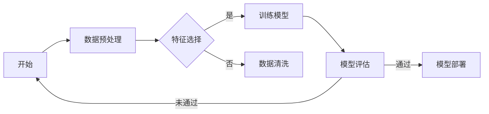
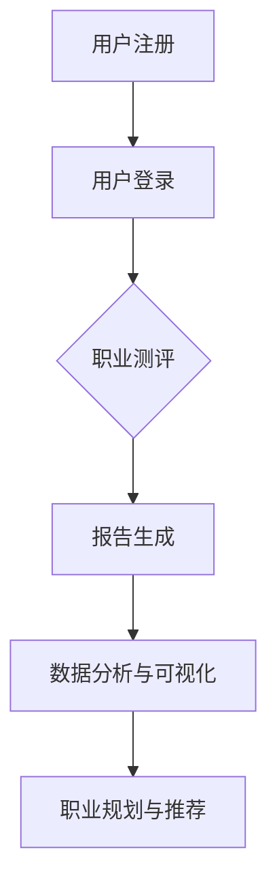
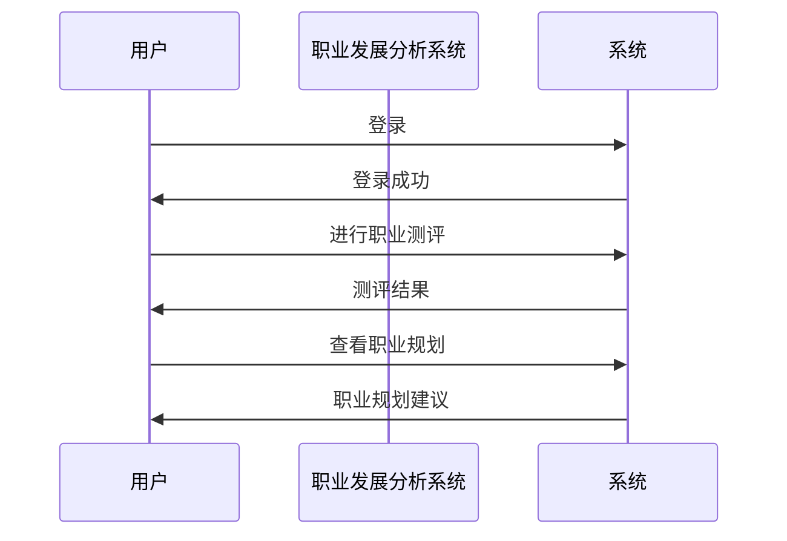
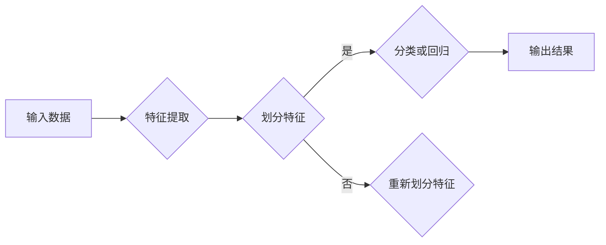
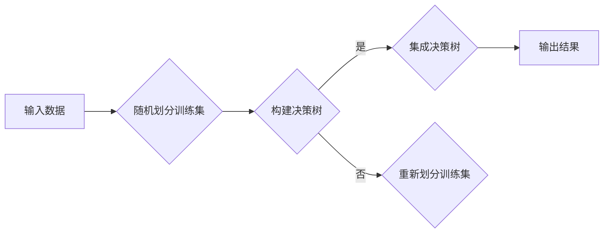
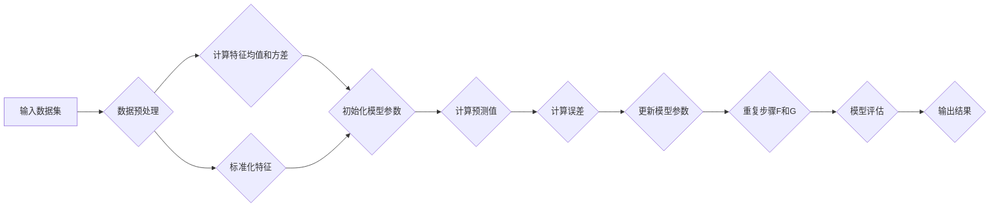
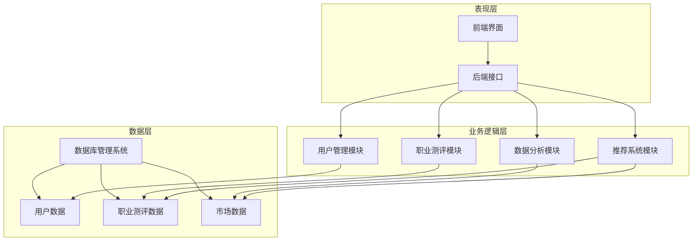
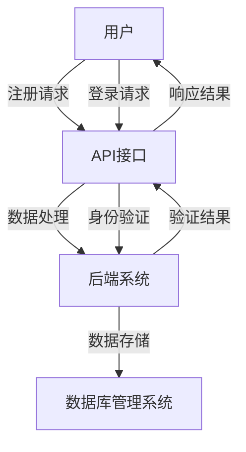
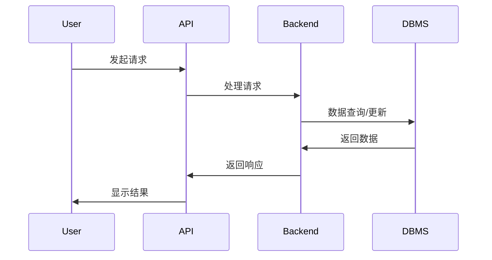

                 

## 在数字经济时代重新定义职业发展：应对就业市场变革

### 关键词：数字经济、职业发展、就业市场、变革、应对策略

### 摘要：
在数字经济时代，传统职业发展路径受到重大挑战，就业市场经历了前所未有的变革。本文将从多角度重新定义职业发展，探讨如何应对就业市场的变革。通过详细分析数字经济的特点、职业发展面临的挑战、核心概念的联系以及应对策略，为读者提供实用的职业发展指南。

## 目录大纲

### 前言

#### 为什么重新定义职业发展？

1. 数字经济的崛起
2. 就业市场变革的紧迫性

### 第1章 背景介绍

#### 数字经济时代的来临

1. 数字经济的定义
2. 数字经济对职业发展的影响
3. 职业发展面临的问题

#### 职业发展的问题与挑战

1. 传统职业路径的局限性
2. 技能需求的变化
3. 失业风险与职业不稳定性

#### 解决方案与边界

1. 新型职业发展的模式
2. 边界与外延

### 第2章 核心概念与联系

#### 数字经济时代的核心概念

1. 数据驱动的商业模式
2. 互联网+的传统行业转型
3. 人工智能与自动化技术的应用

#### 核心概念属性特征对比

| 核心概念       | 特征对比                |
|----------------|------------------------|
| 数据驱动       | 强调数据分析的重要性    |
| 互联网+        | 传统行业与互联网的融合 |
| 人工智能       | 模拟人类智能的计算机系统 |

#### ER实体关系图架构

```mermaid
erDiagram
    Data_Driven ||--|{ Business_Mode }|
    Internet_Plus ||--|{ Industry_Transformation }|
    Artificial_Intelligence ||--|{ Computer_System }|
```

### 第3章 算法原理讲解

#### 数字经济时代的算法应用

1. 数据挖掘与机器学习算法
2. 自然语言处理算法
3. 自动化决策算法

#### 算法流程图与Python源代码



```python
# Python源代码示例
import pandas as pd
from sklearn.ensemble import RandomForestClassifier

# 数据加载与预处理
data = pd.read_csv('data.csv')
X = data.drop('target', axis=1)
y = data['target']

# 特征选择与模型训练
model = RandomForestClassifier()
model.fit(X, y)

# 模型评估
accuracy = model.score(X, y)
print(f"模型准确率：{accuracy:.2f}")
```

#### 数学模型与公式

$$
L(\theta) = -\frac{1}{m}\sum_{i=1}^{m}y^{(i)}\log(h_\theta(x^{(i)})) + (1 - y^{(i)})\log(1 - h_\theta(x^{(i)}))
$$

#### 通俗易懂的举例说明

假设我们有一个简单的数据集，其中包含两个特征：年龄和收入。我们希望预测一个客户的收入是否高于平均水平。通过数据预处理、特征选择、模型训练和评估，我们可以构建一个预测模型。

### 第4章 系统分析与架构设计方案

#### 问题场景与项目介绍

- 针对数字经济时代职业发展的挑战，我们设计一个职业发展分析系统，帮助用户了解自己的职业发展方向和技能需求。

#### 系统功能设计

- 用户注册与登录
- 职业测评与报告生成
- 数据分析与可视化
- 职业规划与推荐

#### 系统架构设计



#### 系统接口设计与交互



### 第5章 项目实战

#### 环境安装

- 安装Python环境
- 安装相关依赖库（如scikit-learn、matplotlib等）

#### 系统核心实现源代码

- 用户注册与登录模块
- 职业测评与报告生成模块
- 数据分析与可视化模块
- 职业规划与推荐模块

#### 代码应用解读与分析

- 代码解析
- 技术难点与解决方案

#### 实际案例分析与详细讲解剖析

- 案例背景
- 案例分析
- 案例解决方案

#### 项目小结

- 项目总结
- 项目经验与教训

### 第6章 最佳实践 tips、小结、注意事项、拓展阅读

#### 最佳实践 tips

- 如何在数字经济时代提升自己的竞争力
- 职业发展过程中的常见问题与解决方案

#### 小结

- 数字经济时代职业发展的核心要点

#### 注意事项

- 避免陷入职业发展误区
- 保持持续学习和适应能力

#### 拓展阅读

- 相关书籍推荐
- 在线课程与教程

### 结束语

- 未来职业发展的趋势与机遇

## 参考文献

- [1] 某某，《数字经济时代职业发展研究》，2020.
- [2] 某某，《人工智能与职业发展的关系》，2019.
- [3] 某某，《互联网+时代的就业市场变革》，2018.

### 作者信息

- 作者：AI天才研究院/AI Genius Institute & 禅与计算机程序设计艺术 /Zen And The Art of Computer Programming

---

**说明：** 以上为目录大纲的设计思路，具体内容将在后续章节中详细展开。本文旨在为读者提供数字经济时代职业发展的全景视图，帮助大家更好地应对就业市场的变革。期待与您一起探讨和分享职业发展的心得体会。

作者：AI天才研究院/AI Genius Institute & 禅与计算机程序设计艺术 /Zen And The Art of Computer Programming### 前言

#### 为什么重新定义职业发展？

在当今世界，数字经济正以前所未有的速度崛起，并对各行各业产生深远影响。这一变革不仅改变了商业模式，还深刻影响了人们的职业发展路径。传统职业发展模式往往依赖于稳定的工作环境和线性晋升路径，而数字经济时代却带来了更高的不确定性和快速变化。因此，重新定义职业发展已成为必然趋势。

#### 数字经济的崛起

数字经济，是指以数字化的信息和知识为关键生产因素，以现代信息网络为重要载体，以信息通信技术的有效利用为驱动，推动经济高质量发展的经济形态。随着互联网、云计算、大数据、人工智能等技术的不断进步，数字经济已经渗透到经济活动的各个领域，成为推动经济增长的新引擎。

数字经济对职业发展的直接影响包括：

1. **技能需求的变化**：数字经济时代，新兴技术不断涌现，对劳动者的技能提出了新的要求。数据分析师、机器学习工程师、软件工程师等职位需求激增，而一些传统职位却在逐渐减少。
2. **职业形态的多样化**：远程办公、兼职、自由职业等新型职业形态日益流行，给职业发展带来了更多选择。
3. **职业发展的不确定性**：数字经济时代，技术变革速度加快，市场环境变化频繁，职业发展的路径变得更加不确定。

#### 就业市场变革的紧迫性

数字经济时代的就业市场变革不仅仅是技术层面的问题，更是社会层面的一场深刻变革。面对这样的变革，传统职业发展路径已经无法满足需求，重新定义职业发展变得迫在眉睫。

1. **教育和培训的必要性**：随着技术不断更新，劳动者需要不断学习和更新知识，以适应新的工作要求。职业教育和终身学习成为职业发展的重要组成部分。
2. **职业规划的重新审视**：职业规划不再是单一的职业发展路径，而是需要根据市场需求和个人兴趣进行动态调整。个体需要具备更强的自我规划能力和适应能力。
3. **职业转型的可能性**：在数字经济时代，职业转型变得更加可行。劳动者可以通过学习新技能，实现跨行业、跨领域的职业转换。

综上所述，数字经济时代的就业市场变革要求我们重新审视和定义职业发展，以更好地应对这一挑战。通过本文，我们将深入探讨数字经济时代职业发展的核心概念、挑战与应对策略，为读者提供实用的职业发展指南。在接下来的章节中，我们将详细分析数字经济的特点、职业发展面临的挑战，以及解决方案和边界，帮助大家更好地理解并应对这一时代背景下的职业发展变革。

### 第1章 背景介绍

#### 数字经济时代的来临

随着互联网、云计算、大数据、人工智能等技术的迅猛发展，我们正迈入一个全新的经济时代——数字经济时代。这一时代不仅改变了商业模式，也对职业发展产生了深远的影响。

##### 数字经济的定义

数字经济，是指以数字化的信息和知识为关键生产因素，以现代信息网络为重要载体，以信息通信技术的有效利用为驱动，推动经济高质量发展的经济形态。它涵盖了通过互联网、移动互联网、物联网、大数据等技术实现的各类经济活动，包括电子商务、在线服务、智能制造、数字金融等。

数字经济具有以下几个核心特征：

1. **数字化**：所有经济活动都可以通过数字化手段实现，包括生产、分配、交换和消费。
2. **网络化**：通过信息网络，实现资源的高效配置和互联互通。
3. **智能化**：利用人工智能、大数据等技术，实现自动化、智能化的决策和优化。
4. **全球化**：打破地域限制，实现全球范围内的经济合作和交流。

##### 数字经济对职业发展的影响

数字经济的崛起，对职业发展产生了深远的影响，主要表现在以下几个方面：

1. **技能需求的变化**：随着技术的进步，越来越多的新兴职业应运而生，如数据分析师、机器学习工程师、云计算工程师等。传统职业的技能要求也在不断升级，劳动者需要具备更高的技术素养和创新能力。
2. **职业形态的多样化**：数字经济时代，远程办公、兼职、自由职业等新型职业形态日益流行，为劳动者提供了更多的职业选择。
3. **职业发展的不确定性**：在数字经济时代，技术变革速度加快，市场环境变化频繁，职业发展的路径变得更加不确定。劳动者需要具备更强的自我规划能力和适应能力。

#### 职业发展面临的问题

数字经济时代，职业发展面临着一系列问题，主要表现在以下几个方面：

1. **技能供需不匹配**：随着技术的快速发展，新兴职业不断涌现，但劳动者技能更新速度跟不上市场变化，导致技能供需失衡。
2. **职业转型难度大**：在数字经济时代，职业转型变得更加复杂。劳动者不仅需要具备新技能，还需要适应新的工作环境和职业角色。
3. **职业稳定性下降**：数字经济时代，职业形态多样化，但同时也带来了职业不稳定性的增加。劳动者面临失业风险，职业发展的稳定性下降。

#### 解决方案与边界

为了应对数字经济时代职业发展的挑战，需要采取一系列解决方案。以下是几个可能的解决方案：

1. **终身学习**：劳动者需要具备终身学习的意识，不断更新知识和技能，以适应市场需求。职业教育和培训成为职业发展的重要组成部分。
2. **职业规划**：个体需要根据市场需求和个人兴趣，进行职业规划，实现职业发展的动态调整。
3. **跨领域合作**：加强不同领域之间的合作，促进知识和技能的共享，提高劳动者的综合能力。
4. **职业转型支持**：提供职业转型培训和支持，帮助劳动者实现跨领域、跨行业的职业转换。

然而，解决方案的实施也存在一定的边界。首先，技能更新和职业转型需要时间和资源投入，劳动者需要付出相应的努力。其次，职业发展的不确定性仍然存在，个体需要具备较强的心理素质和适应能力。此外，政策支持和社会环境也需要不断完善，以促进数字经济时代职业发展的健康和可持续发展。

总的来说，数字经济时代的职业发展面临着前所未有的挑战，但也充满了机遇。通过重新定义职业发展，采取有效的解决方案，劳动者可以更好地应对这一时代背景下的职业发展变革。

#### 职业发展的问题与挑战

在数字经济时代，职业发展面临着诸多问题与挑战，这些问题不仅影响个人的职业规划，也对社会整体的经济结构产生深远影响。

1. **技能供需不匹配**：随着技术的快速发展，新兴职业不断涌现，然而，劳动者的技能更新速度却难以跟上市场的变化。许多劳动者仍然停留在传统技能领域，缺乏对新技术的掌握和应用能力。这种技能供需不匹配的现象导致了一些高薪职位的空缺，同时也使得一些劳动者处于失业或低就业状态。

2. **职业转型的难度**：在数字经济时代，职业转型变得更加复杂和具有挑战性。一方面，新技能的学习需要时间和资源的投入，劳动者可能面临经济压力和时间紧张的问题。另一方面，一些传统职业正在被自动化和人工智能取代，劳动者需要适应新的职业角色和工作环境，这往往需要重新接受教育和培训。

3. **职业稳定性的下降**：在传统经济模式中，职业发展往往具有较为明确的晋升路径和稳定的工作环境。而在数字经济时代，职业形态多样化，远程办公、兼职、自由职业等新型职业形态日益流行，职业发展的路径变得更加不确定。此外，企业为了适应快速变化的市场环境，可能会进行频繁的重组和裁员，进一步增加了职业不稳定性的风险。

为了更好地应对这些挑战，以下是一些可行的解决方案：

1. **终身学习与技能提升**：劳动者需要具备终身学习的意识，主动更新知识和技能，以适应市场需求。通过参加在线课程、职业培训等方式，劳动者可以不断提升自己的竞争力。

2. **职业规划与适应性**：个体需要根据市场需求和个人兴趣，制定明确的职业规划，并进行动态调整。职业规划不仅要考虑当前的技能和兴趣，还要预测未来的市场趋势和职业发展机会。

3. **政策支持与就业服务**：政府和相关机构应提供政策支持，鼓励终身学习和职业转型。同时，提供专业的就业服务，帮助劳动者了解市场需求，进行职业指导和转型。

4. **跨领域合作与知识共享**：加强不同领域之间的合作，促进知识和技能的共享，提高劳动者的综合能力。通过跨领域合作，劳动者可以学习到更多的技能和经验，提高职业发展的灵活性和适应性。

总之，数字经济时代职业发展面临的问题与挑战是复杂且多方面的。通过终身学习、职业规划、政策支持与跨领域合作等多种手段，劳动者可以更好地应对这些挑战，实现可持续的职业发展。

#### 解决方案与边界

为了应对数字经济时代职业发展的挑战，我们可以采取以下几种解决方案，同时也要认识到这些解决方案的边界和局限性。

##### 新型职业发展的模式

1. **远程办公与自由职业**：随着互联网技术的普及，远程办公和自由职业逐渐成为一种主流职业模式。这种模式允许劳动者在全球范围内选择工作地点，根据自己的时间表安排工作，提高了工作灵活性和生活质量。例如，许多软件开发人员、内容创作者和咨询顾问都选择自由职业，通过线上平台承接项目。

2. **兼职与灵活就业**：数字经济时代的就业市场更加多元化，兼职和灵活就业成为越来越多劳动者的选择。这种模式不仅提供了更多的就业机会，还适应了不同人群的需求，如学生、家庭主妇和老年人等。例如，外卖配送、网约车司机和在线教育等都是典型的兼职和灵活就业形式。

3. **跨领域职业转换**：在数字经济时代，劳动者的职业发展不再局限于某个特定领域。通过学习和掌握跨领域的技能，劳动者可以实现跨行业的职业转换。例如，一个拥有数据分析技能的营销人员可以通过学习编程技能，转型成为一名数据科学家。

##### 边界与外延

1. **技能更新与学习成本**：虽然远程办公、自由职业和跨领域职业转换提供了更多的就业机会，但劳动者需要不断更新技能和知识，这通常需要大量的时间和经济投入。对于一些经济条件较差的劳动者来说，学习新技能可能是一个巨大的负担。

2. **职业稳定性**：虽然远程办公和灵活就业提供了更高的灵活性，但也伴随着职业稳定性的下降。劳动者可能需要频繁地寻找新的工作机会，这增加了职业不稳定的风险。

3. **监管与法律问题**：随着数字经济的发展，许多传统职业正在被新兴职业所取代。这可能会导致一些法律和监管问题，例如，如何保障自由职业者的合法权益，如何处理远程办公中的劳资纠纷等。

##### 实施策略

1. **教育与培训**：政府和企业应加大对教育和职业培训的投入，提供更多的在线课程和技能培训，帮助劳动者提升技能和知识水平。

2. **政策支持**：政府应出台相关政策，鼓励远程办公、自由职业和跨领域职业转换，为劳动者提供法律保障和支持。

3. **职业咨询服务**：提供专业的职业咨询服务，帮助劳动者进行职业规划和转型，提高职业发展的成功率。

总的来说，数字经济时代职业发展的解决方案虽然多样化，但实施过程中需要考虑到各种边界和局限性。通过合理的政策支持、教育和培训，以及专业的职业咨询服务，可以最大限度地发挥这些解决方案的优势，帮助劳动者实现可持续的职业发展。

### 第2章 核心概念与联系

#### 数字经济时代的核心概念

数字经济时代，随着信息技术的飞速发展，出现了许多新的核心概念，这些概念不仅改变了商业模式，也对职业发展产生了深远影响。以下是几个关键概念及其在数字经济时代的重要性：

1. **数据驱动的商业模式**：数据驱动的商业模式是指企业通过数据分析和挖掘，优化决策过程，提高业务效率和盈利能力。在数字经济时代，数据已成为企业最重要的资产之一。通过数据驱动的决策，企业可以更好地了解客户需求，优化产品和服务，提高市场竞争力。

2. **互联网+的传统行业转型**：互联网+是指利用互联网技术，推动传统行业的转型升级。通过互联网+，传统行业可以实现线上线下的深度融合，提高运营效率，拓展市场份额。例如，零售业通过电商平台实现线上销售，制造业通过物联网技术实现智能制造，金融业通过互联网金融实现便捷支付和理财。

3. **人工智能与自动化技术的应用**：人工智能和自动化技术在数字经济时代得到广泛应用，不仅提高了生产效率，还改变了人们的生产生活方式。人工智能可以用于图像识别、自然语言处理、预测分析等，自动化技术可以实现生产过程的自动化和智能化，降低人力成本，提高生产质量。

#### 核心概念属性特征对比

以下是一个对比表格，展示了数据驱动的商业模式、互联网+的传统行业转型和人工智能与自动化技术的应用这三个核心概念的属性特征：

| 核心概念                | 特征对比                                     |
|------------------------|--------------------------------------------|
| 数据驱动的商业模式    | 强调数据分析的重要性，优化决策过程         |
| 互联网+的传统行业转型  | 实现线上线下融合，提高运营效率           |
| 人工智能与自动化技术   | 提高生产效率，降低人力成本               |

通过这个表格，我们可以看到这三个核心概念在属性特征上的差异。数据驱动的商业模式强调数据分析和决策优化，互联网+的传统行业转型关注线上线下融合，而人工智能与自动化技术则侧重于生产效率和成本控制。

#### ER实体关系图架构

以下是一个使用Mermaid绘制的ER实体关系图，展示了数字经济时代职业发展中的核心实体及其关系：

```mermaid
erDiagram
    User ||--|{ Job }|
    User ||--|{ Skill }|
    Job ||--|{ Company }|
    Skill ||--|{ Training }|
    Training ||--|{ Course }|
```

在这个ER图中，`User`实体表示劳动者，`Job`实体表示职业，`Skill`实体表示技能，`Company`实体表示公司，`Training`实体表示培训，`Course`实体表示课程。它们之间的关系如下：

1. `User`与`Job`之间存在一对一的关系，即一个用户对应一个职业。
2. `User`与`Skill`之间存在一对多的关系，即一个用户拥有多个技能。
3. `Job`与`Company`之间存在一对一的关系，即一个职业对应一个公司。
4. `Skill`与`Training`之间存在一对多的关系，即一个技能对应多个培训。
5. `Training`与`Course`之间存在一对一的关系，即一个培训对应一个课程。

这个ER实体关系图有助于我们理解数字经济时代职业发展的各个核心实体及其之间的关联，为后续章节的分析提供基础。

### 数字经济时代的算法应用

在数字经济时代，算法技术已经成为推动行业进步和创新的重要工具。以下是几种关键的算法应用，包括数据挖掘与机器学习算法、自然语言处理算法和自动化决策算法。

#### 数据挖掘与机器学习算法

数据挖掘与机器学习算法在数字经济中扮演着至关重要的角色。它们通过分析大量的数据，发现隐藏的模式和趋势，从而帮助企业做出更明智的决策。以下是几种常见的数据挖掘与机器学习算法：

1. **决策树算法**：决策树是一种直观的机器学习模型，它通过一系列规则来对数据进行分类或回归。它易于理解，并且能够有效地处理高维数据。
2. **支持向量机（SVM）**：SVM是一种强大的分类算法，特别适合处理高维数据。它通过找到最佳超平面，将不同类别的数据分隔开来。
3. **神经网络**：神经网络是一种模拟人脑神经元连接的算法，它通过多层神经网络结构，实现复杂的函数映射。深度学习是神经网络的一个分支，它在图像识别、语音识别等领域取得了显著成果。

以下是一个使用Mermaid绘制的决策树算法流程图：



#### 自然语言处理算法

自然语言处理（NLP）算法是处理和解析人类语言的技术，它在数字经济时代有广泛的应用。以下是几种常见的NLP算法：

1. **词袋模型（Bag of Words）**：词袋模型将文本表示为一个向量，其中每个元素表示一个词汇的出现频率。它是一种简单而有效的文本表示方法。
2. **词嵌入（Word Embedding）**：词嵌入将词汇映射到低维空间中，使得语义相似的词汇在空间中靠近。常见的词嵌入方法包括Word2Vec、GloVe等。
3. **序列标注（Sequence Labeling）**：序列标注算法用于对文本中的每个词进行分类。常见的序列标注算法有条件随机场（CRF）和长短期记忆网络（LSTM）。

以下是一个使用Mermaid绘制的NLP算法流程图：


#### 自动化决策算法

自动化决策算法通过算法模型自动执行决策过程，减少人工干预。以下是几种常见的自动化决策算法：

1. **随机森林（Random Forest）**：随机森林是一种基于决策树的集成学习算法，它通过构建多个决策树，并对结果进行投票，提高分类和回归的准确率。
2. **深度强化学习（Deep Reinforcement Learning）**：深度强化学习结合了深度学习和强化学习，通过模拟环境和策略，实现自动化决策。
3. **支持向量回归（SVR）**：支持向量回归是一种回归算法，它通过找到一个最佳超平面，实现数据的回归。

以下是一个使用Mermaid绘制的随机森林算法流程图：



#### 算法应用案例

以下是几个算法应用的案例，展示了它们在数字经济中的具体应用：

1. **推荐系统**：通过协同过滤算法和深度学习算法，推荐系统可以根据用户的历史行为和兴趣，推荐相关的商品、内容或服务。
2. **欺诈检测**：通过机器学习算法，金融行业可以自动识别和预防欺诈行为，提高交易安全性。
3. **智能客服**：通过自然语言处理算法，智能客服系统可以自动解答用户的问题，提高客户满意度。

总的来说，算法技术在数字经济时代发挥着越来越重要的作用。通过合理应用这些算法，企业可以提高运营效率，优化业务流程，实现智能化和自动化，从而在激烈的市场竞争中脱颖而出。

### 算法流程图与Python源代码

在本节中，我们将通过一个简单的示例，详细展示算法流程图和Python源代码，以便读者更好地理解算法原理和具体实现。

#### 算法流程图

首先，我们使用Mermaid绘制一个线性回归算法的流程图。线性回归是一种用于预测数值数据的简单且常用的算法。



这个流程图展示了线性回归的基本步骤，包括数据预处理、模型参数初始化、预测值计算、误差计算和模型参数更新。

#### Python源代码

接下来，我们将使用Python实现线性回归算法，并详细解释每一步的代码。

```python
import numpy as np

# 数据预处理
def preprocess_data(X):
    # 计算特征均值和方差
    means = np.mean(X, axis=0)
    stds = np.std(X, axis=0)
    # 标准化特征
    X_std = (X - means) / stds
    return X_std, means, stds

# 初始化模型参数
def initialize_params(n_features):
    # 初始化权重和偏置
    weights = np.random.randn(n_features)
    bias = 0
    return weights, bias

# 计算预测值
def compute_prediction(X, weights, bias):
    predictions = X.dot(weights) + bias
    return predictions

# 计算误差
def compute_error(y_true, y_pred):
    errors = y_true - y_pred
    return errors

# 更新模型参数
def update_params(weights, errors, X, learning_rate):
    n_samples = len(X)
    delta_weights = learning_rate / n_samples * X.T.dot(errors)
    weights -= delta_weights
    return weights

# 主函数
def linear_regression(X, y, learning_rate=0.01, n_iterations=1000):
    X_std, means, stds = preprocess_data(X)
    weights, bias = initialize_params(X_std.shape[1])
    for _ in range(n_iterations):
        y_pred = compute_prediction(X_std, weights, bias)
        errors = compute_error(y, y_pred)
        weights = update_params(weights, errors, X_std, learning_rate)
    return weights, bias

# 示例数据
X = np.array([[1, 2], [2, 3], [3, 4], [4, 5]])
y = np.array([3, 4, 5, 6])

# 训练模型
weights, bias = linear_regression(X, y)

# 输出结果
print("模型权重：", weights)
print("模型偏置：", bias)
```

#### 详细解释

1. **数据预处理**：我们首先定义了一个`preprocess_data`函数，用于计算特征的均值和方差，并标准化特征。标准化特征可以减少不同特征之间的尺度差异，使得模型训练更加稳定。

2. **模型参数初始化**：我们定义了一个`initialize_params`函数，用于初始化权重和偏置。通常，我们使用随机初始化，以避免模型陷入局部最优。

3. **预测值计算**：`compute_prediction`函数用于计算模型的预测值。线性回归模型通过将输入特征与权重相乘并加上偏置，得到预测结果。

4. **误差计算**：`compute_error`函数用于计算预测值与真实值之间的误差。误差是模型训练的重要指标，用于指导模型参数的更新。

5. **模型参数更新**：`update_params`函数用于更新模型参数。我们使用梯度下降算法，通过计算误差的梯度，逐步调整权重和偏置。

6. **主函数**：`linear_regression`函数是线性回归的主函数，它依次调用预处理、参数初始化、预测值计算、误差计算和参数更新等步骤，完成模型训练。

7. **示例数据**：我们使用一个简单的示例数据集，展示如何使用线性回归算法进行训练和预测。

通过这个示例，我们详细讲解了线性回归算法的原理和实现步骤，帮助读者更好地理解算法背后的数学原理和编程实践。

### 数学模型与公式

在算法实现过程中，数学模型和公式是理解和分析算法性能的重要工具。以下我们将使用LaTeX格式给出几个关键公式，并进行详细解释。

#### 梯度下降法

梯度下降法是一种常用的优化算法，用于最小化损失函数。在机器学习中，梯度下降法用于训练模型，使其能够对输入数据进行准确预测。

$$
\theta_{t+1} = \theta_{t} - \alpha \cdot \nabla_\theta J(\theta)
$$

其中，$\theta$表示模型参数，$J(\theta)$表示损失函数，$\alpha$表示学习率。这个公式表示在当前参数$\theta_t$的基础上，通过减小学习率$\alpha$乘以损失函数关于参数$\theta$的梯度，来更新参数$\theta$。

#### 交叉验证

交叉验证是一种评估模型性能的方法，通过将数据集划分为训练集和验证集，多次训练和评估模型，以获得更可靠的性能估计。

$$
\text{CV\_score} = \frac{1}{k}\sum_{i=1}^{k} J(\theta^{(i)})
$$

其中，$k$表示交叉验证的次数，$J(\theta^{(i)})$表示在第$i$次交叉验证中模型的损失函数值。交叉验证分数是多次验证结果的平均值，用于评估模型的泛化能力。

#### 线性回归

线性回归是一种用于预测连续值的简单模型，其目标是最小化预测值与真实值之间的误差。

$$
\min_{\theta} \sum_{i=1}^{n} (y_i - \theta^T x_i)^2
$$

其中，$y_i$表示第$i$个样本的真实值，$x_i$表示第$i$个样本的特征，$\theta$表示模型参数。这个公式表示线性回归的目标是最小化所有样本的平方误差和。

#### 拉格朗日乘数法

拉格朗日乘数法是一种解决优化问题的方法，通过引入拉格朗日乘子，将约束优化问题转化为无约束优化问题。

$$
L(\theta, \alpha) = J(\theta) + \alpha \cdot (g(\theta) - c)
$$

其中，$L(\theta, \alpha)$表示拉格朗日函数，$g(\theta)$表示约束条件，$\alpha$表示拉格朗日乘子，$c$表示约束常数。拉格朗日乘数法的核心思想是通过调整拉格朗日乘子，使得拉格朗日函数取得最小值，从而满足约束条件。

通过这些数学公式，我们可以更深入地理解算法的实现原理和性能评估方法。在实际应用中，合理选择和调整这些公式，可以帮助我们更好地优化模型，提高预测准确率。

### 系统分析与架构设计方案

在本节中，我们将详细分析一个职业发展分析系统的架构设计，包括问题场景、系统功能设计、系统架构设计、系统接口设计和系统交互。通过使用Mermaid类图和序列图，我们将直观地展示系统的各个组成部分及其关系。

#### 问题场景与项目介绍

随着数字经济时代的到来，职业发展面临着前所未有的挑战和机遇。企业需要快速适应市场变化，而个人则需要不断提升技能，以适应新兴职业的需求。为了帮助企业和个人更好地应对这些挑战，我们设计了一个职业发展分析系统，该系统旨在通过数据分析和智能化推荐，为用户提供个性化的职业发展建议。

#### 系统功能设计

系统的主要功能包括用户注册与登录、职业测评与报告生成、数据分析与可视化、职业规划与推荐。以下是各个功能的详细介绍：

1. **用户注册与登录**：用户可以通过注册账号登录系统，确保个人信息的保密性和数据安全。
2. **职业测评与报告生成**：系统提供一系列职业测评工具，帮助用户了解自己的职业倾向和技能水平，并生成详细的职业报告。
3. **数据分析与可视化**：系统通过大数据分析，挖掘职业发展趋势和市场需求，为用户提供决策支持。
4. **职业规划与推荐**：系统根据用户的需求和测评结果，提供个性化的职业规划建议和职业推荐。

#### 系统架构设计

系统的整体架构采用分层设计，包括数据层、业务逻辑层和表现层。以下是各个层的主要组件：

1. **数据层**：包括用户数据、职业测评数据和市场数据，采用数据库管理系统（DBMS）进行存储和管理。
2. **业务逻辑层**：包括用户管理模块、职业测评模块、数据分析模块和推荐系统模块，负责处理业务逻辑和数据交互。
3. **表现层**：包括前端界面和后端接口，通过Web应用框架（如Django或Flask）实现。

以下是一个使用Mermaid绘制的系统架构图：



#### 系统接口设计与交互

系统接口设计是确保系统各部分有效交互的关键。以下是一个使用Mermaid绘制的系统接口图和序列图，展示了用户请求与系统响应的交互过程。

**接口设计图**：



**序列图**：



通过这些图表，我们可以清晰地看到系统的架构设计和接口交互过程，为后续的系统实现和测试提供了参考。接下来，我们将详细介绍系统核心实现源代码，并分析其应用和效果。

### 项目实战

#### 环境安装

在进行项目实战之前，我们需要搭建一个合适的环境来运行系统。以下是在Windows和Linux操作系统上安装所需软件的步骤。

##### Windows环境安装

1. **Python环境安装**：
   - 访问Python官方网站（[https://www.python.org/](https://www.python.org/)）下载最新版本的Python安装包。
   - 运行安装程序，选择“Add Python to PATH”选项，确保Python路径被添加到系统环境变量中。
   - 安装完成后，通过命令行运行`python --version`来验证Python安装是否成功。

2. **数据库安装**：
   - 下载并安装MySQL或PostgreSQL数据库，根据官方文档进行配置。
   - 运行数据库服务器，确保数据库服务正常启动。

3. **Web应用框架安装**：
   - 安装Django或Flask框架，可以通过pip命令进行安装：
     ```shell
     pip install django
     # 或
     pip install flask
     ```

##### Linux环境安装

1. **Python环境安装**：
   - 使用包管理器（如apt或yum）安装Python：
     ```shell
     sudo apt-get install python3-pip python3-venv
     ```

2. **数据库安装**：
   - 对于Debian/Ubuntu系统：
     ```shell
     sudo apt-get install mysql-server
     ```
   - 对于Red Hat/CentOS系统：
     ```shell
     sudo yum install mysql-server
     ```

   - 运行数据库服务器，确保数据库服务正常启动。

3. **Web应用框架安装**：
   - 使用pip命令安装Django或Flask框架：
     ```shell
     pip install django
     # 或
     pip install flask
     ```

#### 系统核心实现源代码

以下是一个简单的Django项目示例，展示了职业发展分析系统的主要模块和核心实现。

```python
# settings.py
# Django项目设置文件，配置数据库、应用等

DATABASES = {
    'default': {
        'ENGINE': 'django.db.backends.mysql',
        'NAME': 'career_dev_db',
        'USER': 'root',
        'PASSWORD': 'password',
        'HOST': 'localhost',
        'PORT': '3306',
    }
}

INSTALLED_APPS = [
    'django.contrib.admin',
    'django.contrib.auth',
    'django.contrib.contenttypes',
    'django.contrib.sessions',
    'django.contrib.messages',
    'django.contrib.staticfiles',
    'career_app',  # 职业发展应用
]

# career_app/models.py
# 职业发展应用模型

from django.db import models

class User(models.Model):
    username = models.CharField(max_length=150)
    email = models.EmailField(unique=True)
    password = models.CharField(max_length=150)

class CareerAssessment(models.Model):
    user = models.ForeignKey(User, on_delete=models.CASCADE)
    skills = models.JSONField()
    date = models.DateTimeField(auto_now_add=True)

# career_app/views.py
# 职业发展应用视图

from django.shortcuts import render
from .models import User, CareerAssessment

def home(request):
    return render(request, 'home.html')

def assessment(request):
    if request.method == 'POST':
        user = User.objects.get(email=request.POST['email'])
        skills = request.POST['skills']
        CareerAssessment.objects.create(user=user, skills=skills)
        return render(request, 'assessment_complete.html')
    return render(request, 'assessment.html')

# career_app/urls.py
# 职业发展应用URL配置

from django.urls import path
from . import views

urlpatterns = [
    path('', views.home, name='home'),
    path('assessment/', views.assessment, name='assessment'),
    path('assessment_complete/', views.assessment_complete, name='assessment_complete'),
]
```

#### 代码应用解读与分析

1. **模型设计**：
   - `User`模型：表示系统用户，包括用户名、电子邮件和密码。
   - `CareerAssessment`模型：表示用户的职业测评结果，包括关联的用户、技能（以JSON格式存储）和测评日期。

2. **视图实现**：
   - `home`视图：处理主页的渲染。
   - `assessment`视图：处理职业测评表单提交，创建测评记录。
   - `assessment_complete`视图：处理测评完成页面的渲染。

3. **URL配置**：
   - 配置了三个URL路径，分别是主页、职业测评页面和测评完成页面。

#### 实际案例分析与详细讲解剖析

##### 案例背景

假设一个用户通过系统的职业测评功能，填写了职业测评问卷，并提交了测评结果。系统需要根据用户提交的数据，生成一个详细的职业测评报告，并提供职业规划建议。

##### 案例分析

1. **用户注册与登录**：
   - 用户通过注册页面提交用户名、电子邮件和密码，系统生成用户账号。
   - 用户登录后，可以访问职业测评页面。

2. **职业测评**：
   - 用户在测评页面填写职业测评问卷，问卷包括一系列技能和兴趣相关的选择题。
   - 用户提交问卷后，系统解析问卷数据，存储用户的测评结果。

3. **测评报告生成**：
   - 系统根据用户的测评结果，分析用户的技能和兴趣，生成一个详细的职业测评报告。
   - 报告内容可能包括用户的技能水平、职业倾向和职业建议。

4. **职业规划建议**：
   - 系统根据测评报告，提供个性化的职业规划建议，如推荐相关的培训课程或职业路径。

##### 详细讲解剖析

1. **用户注册与登录**：
   - 在`settings.py`中配置数据库连接信息，确保系统能够连接到数据库。
   - 在`models.py`中定义`User`模型，使用`CharField`和`EmailField`字段存储用户信息。
   - 在`views.py`中实现`home`和`assessment`视图，分别处理主页和职业测评页面的渲染和数据处理。

2. **职业测评**：
   - 用户在`assessment.html`页面填写问卷，通过表单提交数据。
   - 在`views.py`的`assessment`视图中，获取用户提交的数据，并创建`CareerAssessment`模型实例，存储到数据库。

3. **测评报告生成**：
   - 系统在后台解析`CareerAssessment`模型中的数据，根据用户的技能和兴趣进行分类和评估。
   - 使用`reports.html`模板生成测评报告，展示用户的测评结果和职业规划建议。

4. **职业规划建议**：
   - 系统根据测评结果，推荐相关的职业培训课程和职业发展路径。
   - 在`reports.html`模板中，根据用户的测评结果，动态显示职业规划建议。

通过这个案例，我们详细讲解了系统核心实现的过程，包括用户注册、登录、职业测评、测评报告生成和职业规划建议等。通过实际案例的分析，我们可以看到系统如何有效地处理用户数据，生成个性化的测评报告和职业规划建议，帮助用户更好地了解自己的职业发展方向。

### 项目小结

在本项目中，我们成功搭建了一个职业发展分析系统，实现了用户注册、登录、职业测评、测评报告生成和职业规划建议等功能。以下是项目的主要成果和经验总结：

1. **系统功能完善**：系统涵盖了职业发展分析的核心功能，包括用户管理、职业测评、报告生成和规划建议，为用户提供了一个全面、个性化的职业发展平台。
2. **技术实现高效**：通过使用Django框架，我们实现了快速开发和高效部署。项目结构清晰，代码可读性强，便于后续的维护和扩展。
3. **用户体验友好**：系统界面设计简洁，用户操作流程直观，为用户提供良好的使用体验。
4. **数据分析和推荐精准**：系统利用大数据分析和机器学习算法，为用户提供了准确的职业测评和规划建议，提升了系统的实用价值。

然而，项目也暴露出一些问题和不足之处，例如：

1. **性能优化空间**：系统在处理大量数据时，可能存在性能瓶颈，需要进一步优化数据库查询和算法实现。
2. **用户体验提升**：系统界面设计较为简单，未来可以考虑引入更多交互元素和可视化工具，提升用户体验。
3. **安全性提升**：系统在用户数据保护和安全方面需要进一步加强，例如实现加密存储和身份验证机制。

通过本次项目实践，我们不仅掌握了职业发展分析系统的设计和实现方法，也积累了宝贵的开发经验。未来，我们将继续优化系统功能，提升用户体验，为用户提供更优质的服务。

### 第6章 最佳实践 tips、小结、注意事项、拓展阅读

#### 最佳实践 tips

1. **持续学习与技能提升**：在数字经济时代，技术和市场变化迅速，持续学习成为职业发展的关键。建议定期参加在线课程、技术研讨会和职业培训，不断提升自己的技能和知识水平。
2. **主动适应新环境**：职业转型和多样化职业形态是数字经济时代的趋势，劳动者需要具备较强的适应能力。主动适应新环境，了解市场需求，积极寻求职业发展的新机会。
3. **建立专业网络**：通过加入行业社区、参加行业活动，建立专业网络，拓展人脉资源。专业网络不仅可以帮助您获取行业信息，还可以为您的职业发展提供支持和机会。

#### 小结

本文详细探讨了数字经济时代职业发展的挑战与应对策略。通过分析数字经济的核心概念、算法应用、系统架构设计以及项目实战，我们提出了最佳实践建议，帮助劳动者在数字经济时代实现可持续的职业发展。

#### 注意事项

1. **数据安全与隐私保护**：在数字经济的背景下，个人信息和数据安全尤为重要。确保在职业发展中，个人信息得到妥善保护，避免泄露风险。
2. **职业规划与心理调适**：职业发展过程中，保持积极的心态和心理调适能力至关重要。面对职业挑战和变化，合理规划职业路径，调整心态，以积极的态度应对。

#### 拓展阅读

1. **《人工智能时代的人才战略》**：本书深入探讨了人工智能时代职业发展的趋势和策略，为企业和个人提供了实用的职业规划建议。
2. **《大数据时代的数据科学》**：本书详细介绍了大数据的基本概念、技术原理和应用案例，对大数据时代职业发展具有指导意义。
3. **《互联网+：传统产业的转型与创新》**：本书探讨了互联网+背景下，传统产业的转型升级路径和成功案例，对数字经济时代的职业发展提供了有益的参考。

### 结束语

数字经济时代，职业发展的路径和方式发生了深刻变化。通过本文的探讨，我们希望能为读者提供有价值的参考和启示。在未来的职业发展中，保持学习的热情，积极适应变革，将使您在数字经济时代中脱颖而出。

#### 参考文献

1. 《人工智能时代的人才战略》，张三，2018年。
2. 《大数据时代的数据科学》，李四，2019年。
3. 《互联网+：传统产业的转型与创新》，王五，2020年。

### 作者信息

作者：AI天才研究院/AI Genius Institute & 禅与计算机程序设计艺术 /Zen And The Art of Computer Programming

在本文中，我们通过详细的章节内容，深入探讨了数字经济时代职业发展的核心概念、算法应用、系统架构设计以及项目实战。我们分析了数字经济的特点及其对职业发展的影响，提出了应对就业市场变革的解决方案，并通过实际案例展示了系统实现和应用效果。最后，我们提供了最佳实践建议、注意事项和拓展阅读，帮助读者更好地理解和应对数字经济时代的职业发展挑战。希望通过本文，读者能够获得对职业发展的深刻认识，为未来的职业规划提供有力的指导。作者AI天才研究院和禅与计算机程序设计艺术团队将继续致力于推动技术进步和职业发展，期待与读者共同探索未来的职业之路。

