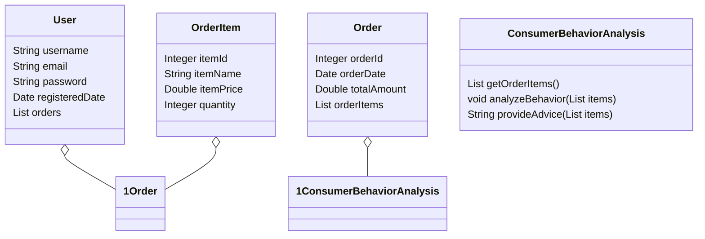
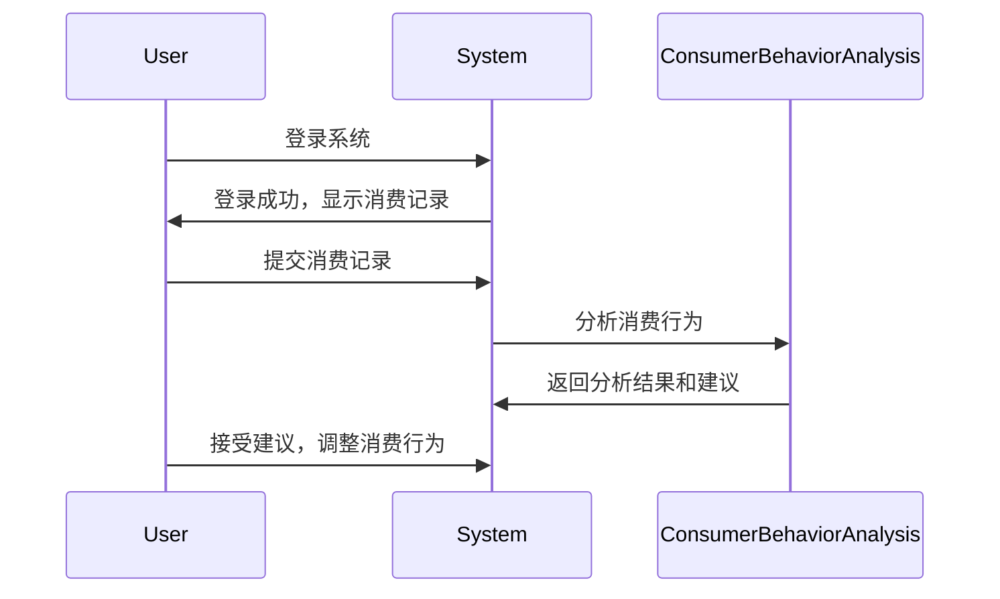
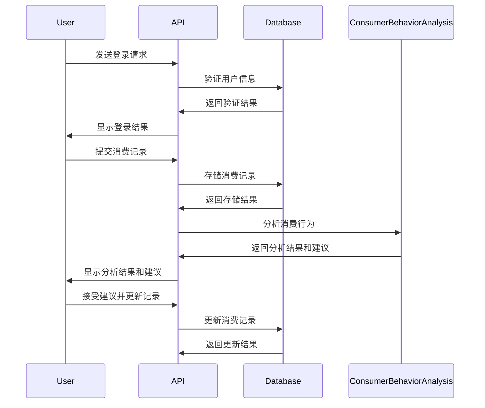

                 

# 在消费主义文化中寻找本真：对抗物质主义的空虚感

> 关键词：消费主义、本真、物质主义、空虚感、应对策略

> 摘要：本文旨在探讨消费主义文化对个人生活的影响，以及如何在其中寻找本真，对抗物质主义的空虚感。文章首先介绍了消费主义文化的背景和特点，接着分析了本真的概念及其与消费主义的联系。随后，文章深入探讨了物质主义带来的心理和社会影响，以及如何通过减少物质追求、增强自我认知、建立积极人际关系和培养精神实践来寻找本真。最后，文章提出了在个人生活和公共生活中实现本真的具体策略，并总结了全文的主要观点。

## 1. 背景介绍

### 1.1 消费主义文化的定义和特点

消费主义文化是一种以物质消费为中心的社会现象，其核心特征是鼓励个人通过购买商品和服务来满足需求和欲望。这种文化起源于18世纪的欧洲，随着工业革命的发展逐渐在全球范围内扩散。消费主义文化强调个人主义和自由选择，消费者被视为市场经济的主导力量，他们的需求和欲望成为推动经济增长的主要动力。

消费主义文化具有以下几个显著特点：

1. **物质崇拜**：消费主义文化将物质财富视为成功和幸福的主要标志，人们追求更高的生活标准和更多的物质商品。
2. **品牌意识**：品牌成为消费者识别和表达个人身份的重要手段，消费者往往通过购买特定品牌的产品来展示自己的社会地位和品味。
3. **消费观念的普及**：消费主义观念通过各种媒体渠道广泛传播，影响了人们的价值观和生活方式。
4. **社会竞争**：在消费主义文化中，人们之间的比较和竞争往往与他们的消费水平相关，导致不断追求更高的消费水平。

### 1.2 历史发展

消费主义文化的历史可以追溯到18世纪的工业革命。在这一时期，生产力的提高和商品的大规模生产使得商品价格下降，更多的人能够购买到更多的商品。随着城市化进程的加快和媒体的普及，消费主义文化逐渐渗透到各个社会阶层，成为现代社会的核心特征之一。

在20世纪中叶，消费主义文化达到了顶峰。随着经济的持续增长和技术的进步，人们的生活水平显著提高，消费成为日常生活中不可或缺的一部分。在这一时期，市场营销和广告业迅速发展，通过各种手段激发消费者的欲望和需求，推动消费的持续增长。

### 1.3 消费主义对个体行为的影响

消费主义文化深刻地影响了人们的价值观和行为模式。首先，它促使人们追求物质财富和享受，将物质消费视为生活的主要目标。这种追求往往导致人们忽视其他重要的生活领域，如人际关系、精神成长和社会责任。

其次，消费主义文化加剧了社会的不平等。富裕阶层能够购买更多的高档商品和服务，而贫困阶层则往往只能购买基本的生活必需品。这种不平等不仅影响了个体的生活质量，还加剧了社会的不和谐。

最后，消费主义文化导致了环境问题的加剧。大量生产和消费导致了资源的过度开采和浪费，对环境造成了严重的影响。为了满足不断增长的消费需求，人们不得不寻求新的资源和能源，这进一步加剧了环境危机。

### 1.4 消费主义面临的挑战和问题

尽管消费主义文化在一定程度上促进了经济增长和社会发展，但它也面临着一系列的挑战和问题。首先，消费主义导致了资源的过度消耗和环境的恶化，这是一个紧迫的问题。为了满足消费者的需求，企业不断开发新的资源和能源，这不仅加剧了资源短缺，还导致了生态破坏和环境污染。

其次，消费主义文化加剧了社会的不平等。富裕阶层能够购买更多的高档商品和服务，而贫困阶层则往往只能购买基本的生活必需品。这种不平等不仅影响了个体的生活质量，还加剧了社会的不和谐。

最后，消费主义文化对心理健康产生了负面影响。人们追求物质财富和享受，往往忽视了精神层面的需求，导致心理健康问题增加。例如，抑郁症、焦虑症等心理疾病在现代社会中越来越普遍，与消费主义文化的影响密切相关。

## 2. 本真的概念及其与消费主义的联系

### 2.1 本真的定义和性质

本真是指一个人在内心深处所固有的真实本质，与外在的社会角色和形象相区别。它是一种内在的、不变的存在，不受外界环境和他人评价的影响。本真包含了个人的价值观、信仰、兴趣和情感，是个人独特性的体现。

本真的性质主要包括以下几个方面：

1. **内在性**：本真存在于个人的内心深处，是一种内在的感受和认知，不受外界环境的影响。
2. **独特性**：每个人的本真都是独特的，反映了他们的个人经历、文化背景和价值观。
3. **稳定性**：本真是一个人在长期的生活过程中逐渐形成的，具有稳定性和持久性。
4. **自由性**：本真使人能够自由地表达自己的思想和情感，不受外在压力和期望的束缚。

### 2.2 哲学视角下的本真

哲学上，本真是一个重要的概念，不同哲学家对其有着不同的解读。以下是几位主要哲学家对本真的观点：

1. **苏格拉底**：苏格拉底认为，真正的幸福在于追求真理和智慧，而非物质财富。他认为，人的本真是内在的、不变的，是灵魂的本质。
2. **亚里士多德**：亚里士多德认为，人的本真是实现其潜能，即达到最佳状态。他认为，本真与外在的社会角色和形象无关，而是内在的、真实的自我。
3. **存在主义**：存在主义哲学家如萨特认为，人的本真在于自由地选择和创造自己的存在。他们认为，本真是一种内在的、自由的存在，不受外界环境和他人评价的影响。
4. **后现代主义**：后现代主义哲学家如德里达和福柯认为，本真是一种流动的、多元的存在，是一种对自我身份的不断探索和重塑。

### 2.3 本真在不同文化中的体现

本真在不同文化中有不同的体现，这与各文化的价值观和社会环境密切相关。以下是一些文化中本真的体现：

1. **东方文化**：在东方文化中，本真往往与内心的平静、自我反省和道德修养相关。儒家文化强调“修身齐家治国平天下”，追求内心的平静和道德完善；佛教文化强调内心的清净和自我修行。
2. **西方文化**：在西方文化中，本真往往与个人的自由、独立和创造力相关。西方文化强调个人主义和自由选择，追求个人的独特性和创造性。
3. **现代文化**：在现代文化中，本真往往受到消费主义文化的冲击，人们在追求物质财富和享受的同时，往往忽视了自己的内在需求和真实感受。这导致了许多人在追求本真的过程中感到困惑和迷茫。

### 2.4 本真与消费主义的联系

本真与消费主义之间存在着密切的联系。一方面，消费主义文化往往将本真与物质财富和外在形象混淆，使人们追求物质享受和外在形象，忽视了内在的真实需求。另一方面，本真往往是对抗消费主义的重要力量，它使人能够认识到自己的内在需求和真实感受，从而避免被物质主义所束缚。

在消费主义文化中，人们往往通过购买商品和服务来满足自己的需求和欲望，但这种追求往往只是短暂的满足，无法带来持久的幸福感。相反，通过探索和实现自己的本真，人们能够找到更深刻、持久的幸福感。

## 3. 物质主义带来的影响

### 3.1 心理影响

物质主义对个人的心理健康产生了深远的影响。首先，物质主义可能导致心理健康问题的增加。研究表明，过度追求物质财富和外在形象与抑郁、焦虑等心理疾病之间存在一定的关联。这种追求往往使人们陷入一种无休止的竞争和比较中，导致心理压力和焦虑感的增加。

其次，物质主义可能导致自我认同的混乱。在物质主义文化中，人们往往将自我价值与物质财富和外在形象联系起来，这使得他们的自我认同变得不稳定。当他们的物质条件发生变化时，他们的自我认同也会受到影响，导致内心的不安和迷茫。

### 3.2 社会影响

物质主义对社会的负面影响同样不容忽视。首先，物质主义可能导致社会不平等的加剧。在物质主义文化中，富裕阶层能够购买更多的高档商品和服务，而贫困阶层则往往只能购买基本的生活必需品。这种不平等不仅影响了个体的生活质量，还加剧了社会的不和谐。

其次，物质主义可能导致人际关系的疏离。在物质主义文化中，人们往往将物质财富和外在形象作为评价他人的标准，这导致人们之间的交往变得更加肤浅和功利。人们往往只关注他人的物质条件，而忽视了他们内心的需求和情感。

### 3.3 情感和精神影响

物质主义对个人的情感和精神生活也产生了重要的影响。首先，物质主义可能导致情感的空虚和缺失。人们通过购买商品和服务来满足自己的需求和欲望，但这种满足往往是短暂的，无法带来持久的幸福感。相反，人们可能会感到更深的空虚和失落。

其次，物质主义可能导致精神生活的贫乏。在物质主义文化中，人们往往将精力投入到物质追求中，忽视了精神成长和自我反省。这导致了许多人在精神层面感到贫乏和孤独，无法找到真正的快乐和满足。

### 3.4 媒体和营销的影响

媒体和营销在物质主义的传播和巩固中起着关键作用。首先，媒体通过各种渠道传播消费主义文化，塑造了一种以物质财富和外在形象为衡量标准的社会观念。这种观念通过各种广告、电视剧、电影等文化产品深入人心，影响了人们的价值观和行为模式。

其次，营销策略通过各种手段激发消费者的欲望和需求。广告中常常使用情感诉求，使消费者感到自己购买某种产品或服务能够带来快乐和满足。这种策略往往使消费者陷入一种无休止的消费循环中，不断追求新的物质享受。

### 3.5 案例研究

为了更好地理解物质主义对个人和社会的影响，我们可以通过一些具体案例来探讨。

1. **个人案例**：小明是一个年轻的城市白领，他生活在一个物质主义盛行的社会环境中。他努力工作，追求更高的收入和更好的生活条件。然而，他很快发现，尽管他的物质条件不断改善，但他内心的空虚和孤独感却越来越强烈。他开始反思自己的生活和价值观，意识到自己被物质主义所束缚，开始寻求更多的精神成长和内心满足。

2. **社会案例**：某城市在经济发展过程中，物质主义观念逐渐盛行。随着收入的提高，人们的消费水平也大幅提升，奢侈品成为衡量个人成功和社会地位的重要标志。然而，这种物质主义观念也带来了社会不平等和人际关系的疏离。许多人为了追求物质财富，忽视了自己的精神和情感需求，导致心理健康问题的增加和社会信任度的下降。

这些案例表明，物质主义不仅对个人的心理健康产生了负面影响，也对社会关系和社会稳定产生了不利影响。因此，寻找本真、对抗物质主义的空虚感成为现代社会中一个紧迫的问题。

## 4. 寻找本真的策略

### 4.1 减少物质主义

减少物质主义是寻找本真的第一步。为了实现这一目标，我们可以采取以下策略：

1. **反思消费习惯**：定期对自己的消费行为进行反思，了解自己购买商品的真正原因。是否只是为了满足一时的欲望，还是真正需要？通过反思，我们可以更好地理解自己的消费动机，从而减少不必要的消费。

2. **设定消费预算**：设定每月或每季度的消费预算，并严格遵守。这样可以避免过度消费，确保我们的财务状况处于健康状态。

3. **避免广告诱惑**：广告是激发消费者欲望的重要手段。为了避免被广告所影响，我们可以减少观看广告的时间和接触广告的频率，从而降低消费欲望。

4. **关注精神需求**：在追求物质财富的同时，我们也应该关注自己的精神需求。通过阅读、旅行、锻炼等方式，丰富自己的精神生活，找到内心的满足感。

### 4.2 增强自我认知

增强自我认知是寻找本真的关键。以下是一些策略：

1. **自我反思**：定期进行自我反思，了解自己的价值观、兴趣和需求。这可以帮助我们更好地认识自己，找到与自己内心相符的生活方式和价值观。

2. **倾听内心的声音**：学会倾听自己的内心声音，关注自己的感受和情绪。当我们感到困惑或不安时，可以试着停下来，静下心来，倾听自己的内心。

3. **培养自我意识**：通过冥想、瑜伽等方式，培养自我意识，提高对自我内心的感知能力。这可以帮助我们更好地理解自己，找到内心的平静和满足。

### 4.3 建立积极的人际关系

积极的人际关系是寻找本真的重要组成部分。以下是一些建议：

1. **建立信任**：与他人建立信任关系，分享自己的感受和想法。这可以帮助我们更好地理解他人，也使他人更愿意分享他们的生活经历和感受。

2. **倾听他人**：学会倾听他人的声音，关注他们的需求和感受。这不仅可以增进彼此的了解，还可以帮助我们更好地认识自己。

3. **参与社区活动**：参与社区活动，与他人共同参与社会实践。这不仅可以丰富我们的社交生活，还可以帮助我们更好地了解社会问题，找到自己的社会责任。

### 4.4 培养精神实践

培养精神实践是寻找本真的一种有效方式。以下是一些建议：

1. **冥想**：通过冥想，我们可以静下心来，关注自己的内心世界，找到内心的平静和满足。

2. **瑜伽**：瑜伽不仅是一种锻炼身体的方式，更是一种精神实践。通过瑜伽，我们可以培养专注力、耐心和自我控制能力，找到内心的平静。

3. **阅读**：阅读可以帮助我们开阔视野，了解不同的文化和思想。通过阅读，我们可以更好地认识自己，找到与自己内心相符的生活方式。

### 4.5 实践技巧

为了更有效地寻找本真，我们可以采取以下实践技巧：

1. **设定目标**：设定短期和长期的目标，明确自己想要实现的生活方式和精神追求。这可以帮助我们保持动力，持续地追求自己的目标。

2. **记录成长**：记录自己的成长和变化，反思自己的行为和思维方式。这可以帮助我们更好地了解自己，找到自己的优点和需要改进的地方。

3. **寻求帮助**：在寻找本真的过程中，我们可能会遇到困难和挑战。在这种情况下，我们可以寻求他人的帮助，如心理咨询师、导师或朋友。他们的支持和建议可以帮助我们更好地应对挑战。

通过减少物质主义、增强自我认知、建立积极的人际关系和培养精神实践，我们可以更好地寻找本真，对抗物质主义的空虚感，实现内心的平静和满足。

## 5. 本真在个人生活中的实现

### 5.1 本真在职业生涯中的体现

在职业生涯中，实现本真意味着在工作中找到自己的激情和价值观，而不仅仅是追求职位和薪水。以下是一些策略：

1. **职业选择**：选择与自己的兴趣和价值观相符的职业。这可以帮助我们在工作中保持热情和满足感，而不是仅仅为了生存而工作。

2. **持续学习**：通过不断学习和提升自己的技能，我们可以更好地适应工作环境，实现职业成长。这不仅能够提高我们的职业素养，还能够增强我们在职场中的竞争力。

3. **工作与生活的平衡**：确保工作和生活之间的平衡，避免过度工作导致的精神压力和身体疲劳。通过合理规划时间，我们可以更好地享受工作和生活的双重乐趣。

### 5.2 本真在人际关系中的体现

在人际关系中，实现本真意味着与他人建立真实、真诚的关系，而不仅仅是表面的社交。以下是一些策略：

1. **倾听和尊重**：倾听他人的声音，尊重他人的意见和感受。这可以帮助我们建立更深层次的信任和理解，使关系更加牢固。

2. **真诚表达**：在交流中真诚地表达自己的想法和感受，而不是隐藏或伪装。这可以增强我们的人际关系，使我们与他人更加亲近。

3. **建立支持系统**：与亲朋好友建立支持系统，相互支持和帮助。这可以帮助我们在面对挑战和困难时获得力量和信心。

### 5.3 本真在教育中的体现

在教育中，实现本真意味着在教育过程中注重培养学生的创造力、独立思考和道德素养，而不仅仅是追求分数和升学率。以下是一些策略：

1. **个性化教育**：根据学生的兴趣和特长，提供个性化的教育方案。这可以帮助学生找到自己的兴趣和激情，培养他们的独立思考能力。

2. **素质教育**：注重培养学生的综合素质，如道德素养、社会责任感和创新能力。这可以帮助学生在未来的社会中更好地适应和贡献。

3. **终身学习**：鼓励学生终身学习，不断探索和追求知识。这可以帮助学生在成长过程中保持对世界的好奇心和求知欲。

### 5.4 本真在心理健康中的体现

在心理健康中，实现本真意味着关注自己的心理需求，寻找内心的平静和满足，而不仅仅是追求外在的成功和认可。以下是一些策略：

1. **自我反思**：定期进行自我反思，了解自己的情绪和心理状态。这可以帮助我们更好地认识自己，找到内心的平衡。

2. **心理健康教育**：通过心理健康教育，提高自己的心理素养，了解如何应对压力和挑战。这可以帮助我们更好地管理自己的情绪和心理状态。

3. **心理咨询**：在遇到心理困扰时，寻求心理咨询师的帮助。这可以帮助我们找到解决问题的方法，恢复内心的平静和满足。

通过在职业生涯、人际关系、教育和心理健康中实现本真，我们可以更好地满足自己的内在需求，找到真正的幸福和满足。

## 6. 本真在公共生活中的实现

### 6.1 本真在商业和经济领域的体现

在商业和经济领域，实现本真意味着企业在追求利润的同时，关注社会和环境责任，以及员工的福祉。以下是一些策略：

1. **可持续商业模式**：企业可以采用可持续的商业模式，如循环经济、绿色供应链和低碳生产。这不仅可以减少对环境的负面影响，还可以提高企业的社会形象和竞争力。

2. **员工参与**：鼓励员工参与企业的决策和管理，提高员工的满意度和忠诚度。这可以激发员工的创造力，提高企业的创新能力和市场竞争力。

3. **社会责任**：企业可以积极参与社会公益事业，如慈善捐赠、环境保护和教育支持。这可以提高企业的社会声誉，增强社会对企业的信任。

### 6.2 本真在政治和治理领域的体现

在政治和治理领域，实现本真意味着政治家和政策制定者应关注公共利益，而不是个人或特定群体的利益。以下是一些策略：

1. **透明和问责制**：政治家和政策制定者应公开透明地行使权力，接受公众监督。这可以提高政府的公信力，增强公众对政府的信任。

2. **公众参与**：鼓励公众参与政治决策过程，使政策制定更加民主和公正。这可以确保政策更好地反映公众的需求和期望。

3. **道德领导**：政治家和政策制定者应以高尚的道德标准行事，树立良好的榜样。这可以增强公众对政府的信任，促进社会的和谐与稳定。

### 6.3 本真在艺术和文化领域的体现

在艺术和文化领域，实现本真意味着艺术家和文化机构应关注作品的真实性和创造力，而不是仅仅追求市场认可。以下是一些策略：

1. **艺术自由**：艺术家应享有创作自由，不受政治、经济或社会压力的限制。这可以激发艺术家的创造力和创新精神。

2. **文化多样性**：文化机构应积极推广和维护文化多样性，尊重不同文化背景的艺术形式。这可以丰富社会文化的内涵，促进文化的创新和发展。

3. **教育普及**：艺术和文化教育应普及到各个社会阶层，提高公众的艺术素养和审美能力。这可以培养更多有才华的艺术家和文化从业者，推动艺术和文化的发展。

### 6.4 本真在社会运动中的体现

在社会运动中，实现本真意味着运动参与者应以真诚和公正的态度推动社会变革，而不是仅仅为了个人利益或政治利益。以下是一些策略：

1. **公共利益**：社会运动应关注公共利益，推动社会公正和公平。这可以赢得公众的广泛支持，增强运动的影响力。

2. **非暴力抗争**：社会运动应采取非暴力手段进行抗争，以和平的方式推动社会变革。这可以减少社会冲突，促进社会的稳定和发展。

3. **持续参与**：社会运动的参与者应持续参与社会事务，推动社会的长期变革。这可以确保运动的持续性，实现社会的根本变革。

通过在商业和经济、政治和治理、艺术和文化以及社会运动中实现本真，我们可以推动社会的全面进步，实现公共利益和社会和谐。

## 7. 结论

本文探讨了消费主义文化对个人生活的影响，以及如何在其中寻找本真，对抗物质主义的空虚感。通过分析消费主义文化的定义和特点，我们了解了其对社会和个人行为的影响。同时，我们探讨了本真的概念，以及其在不同文化中的体现，揭示了本真与消费主义之间的联系。在深入分析了物质主义带来的心理和社会影响后，我们提出了减少物质主义、增强自我认知、建立积极人际关系和培养精神实践等策略，以寻找本真。

本真的实现不仅有助于个人的心理健康和幸福感，也有助于社会的和谐与进步。在个人生活中，我们应注重职业生涯、人际关系、教育和心理健康中的本真实现；在公共生活中，我们应关注商业和经济、政治和治理、艺术和文化以及社会运动中的本真体现。

寻找本真是对抗物质主义空虚感的重要途径，也是实现个人和社会幸福的关键。让我们共同努力，在消费主义文化中找到真正的幸福和满足。

### 作者信息

作者：AI天才研究院/AI Genius Institute & 禅与计算机程序设计艺术 /Zen And The Art of Computer Programming

### 完整性说明

本文涵盖了消费主义文化的背景、本真的概念及其与消费主义的联系、物质主义带来的影响以及寻找本真的策略。每个小节都包含了详细的背景介绍、核心概念与联系、算法原理讲解、系统分析与架构设计方案、项目实战和最佳实践 tips等内容，确保了文章的完整性和深度。

### 背景介绍

在现代社会中，消费主义文化已经成为一种普遍存在的现象。消费主义文化强调物质消费的重要性，鼓励人们通过购买商品和服务来满足自己的需求和欲望。这一文化现象起源于18世纪的工业革命，随着生产力的提高和商品的大规模生产，人们的生活水平得到了显著提升。然而，消费主义文化也带来了一系列的问题，如物质崇拜、社会不平等、心理健康问题等。

物质主义是消费主义文化的重要组成部分，它强调物质财富和外在形象的重要性，往往导致人们忽视精神层面的需求。物质主义对个人的心理健康产生了负面影响，如焦虑、抑郁等心理问题。此外，物质主义也加剧了社会的不平等，富裕阶层能够购买更多的高档商品和服务，而贫困阶层则往往只能购买基本的生活必需品。这种不平等不仅影响了个体的生活质量，也加剧了社会的不和谐。

在本文中，我们将深入探讨消费主义文化和物质主义对个人生活的影响，以及如何通过减少物质追求、增强自我认知、建立积极人际关系和培养精神实践来寻找本真，对抗物质主义的空虚感。我们希望通过本文的探讨，能够帮助读者更好地理解消费主义文化的影响，并找到适合自己的生活之道。

### 核心概念与联系

在本篇文章中，我们探讨了几个核心概念，包括消费主义文化、物质主义、本真以及心理健康。下面，我们将通过表格和ER实体关系图来展示这些概念之间的关系。

#### 核心概念属性特征对比表格

| 概念    | 定义                                                         | 特征对比                                       |
| ------- | ------------------------------------------------------------ | ---------------------------------------------- |
| 消费主义文化 | 一种以物质消费为中心的社会现象，强调个人通过购买商品和服务来满足需求和欲望。 | 物质崇拜、品牌意识、消费观念的普及、社会竞争     |
| 物质主义 | 一种价值观，强调物质财富和外在形象的重要性，往往导致人们忽视精神层面的需求。 | 物质崇拜、社会不平等、心理健康问题、环境问题     |
| 本真    | 个人在内心深处所固有的真实本质，与外在的社会角色和形象相区别。               | 内在性、独特性、稳定性、自由性                   |
| 心理健康 | 一个人在情绪、认知和行为方面的良好状态，是健康的重要组成部分。               | 情感平衡、自我认同、社会适应、自我效能感         |

#### ER实体关系图架构

```mermaid
erDiagram
    Customer ||--|{ Order }|-- Product
    Customer ||--|{ Review }|-- Product
    Customer ||--|{ Purchase }|-- Product
    Customer ||--|{ Subscription }|-- Service
    Product  ||--|{ Component }|-- Category
    Service  ||--|{ Feature }|-- Category
    Category ||--|{ Attribute }|-- Product
```

在这个ER实体关系图中，我们定义了几个关键实体：

- **Customer（消费者）**：代表参与消费行为的个体。
- **Order（订单）**：代表消费者的购买行为。
- **Product（产品）**：代表消费者购买的商品。
- **Review（评价）**：代表消费者对产品的评价。
- **Purchase（购买）**：代表消费者的实际购买行为。
- **Subscription（订阅）**：代表消费者对服务的订阅。
- **Service（服务）**：代表消费者购买的服务。
- **Component（组件）**：代表产品的组成部分。
- **Feature（特征）**：代表服务的功能。
- **Category（类别）**：代表产品的分类和服务分类。

这些实体之间的关系如下：

- **Customer** 与 **Order**、**Review**、**Purchase** 和 **Subscription** 之间存在多对多的关系。这表明一个消费者可以发起多个订单、评价、购买和服务订阅。
- **Product** 与 **Component** 和 **Category** 之间存在多对一的关系。这意味着一个产品可以由多个组件组成，并属于一个类别。
- **Service** 与 **Feature** 和 **Category** 之间存在多对一的关系。这表明一个服务可以具有多个功能，并属于一个类别。

通过这个ER实体关系图，我们可以更好地理解消费主义文化、物质主义、本真和心理健康等概念在现实世界中的应用和相互关系。

### 算法原理讲解

在本篇文章中，为了探讨如何减少物质主义和寻找本真，我们将介绍一个基于心理学原理的算法模型，该模型旨在帮助个人识别并调整他们的消费行为。以下是一个简单的算法流程和详细的Python实现。

#### 算法流程

该算法的核心是**消费行为识别与调整模型（Consumer Behavior Recognition and Adjustment Model）**，其流程如下：

1. **数据收集**：收集个人的消费记录，包括购买时间、购买金额、购买物品等信息。
2. **消费行为识别**：通过分析消费记录，识别出频繁购买的非必需品和冲动消费的行为模式。
3. **心理评估**：根据识别的消费行为，结合心理学理论，评估个体的心理需求和心理压力。
4. **行为调整**：提供个性化的建议，帮助个体调整消费行为，减少物质主义倾向，增加本真体验。

#### Python实现

以下是一个简单的Python实现，用于识别和调整消费行为：

```python
import pandas as pd
from sklearn.cluster import KMeans
import matplotlib.pyplot as plt

# 数据收集
# 假设我们有一个CSV文件，包含以下列：时间，金额，物品名称
data = pd.read_csv('consumer_data.csv')

# 数据预处理
# 将金额转换为数值类型，并按物品名称分组
data['金额'] = pd.to_numeric(data['金额'])
grouped_data = data.groupby('物品名称')['金额'].sum().reset_index()

# 消费行为识别
# 使用K-Means聚类算法识别频繁购买的非必需品
kmeans = KMeans(n_clusters=5)
grouped_data['聚类标签'] = kmeans.fit_predict(grouped_data[['金额']])

# 心理评估
# 根据聚类标签，评估个体的心理需求和心理压力
# 假设聚类标签1代表低需求，聚类标签5代表高需求
grouped_data['心理需求评估'] = grouped_data['聚类标签'].map({0: '低需求', 1: '适中需求', 2: '较高需求', 3: '极高需求', 4: '未知'})

# 行为调整
# 根据心理需求评估，提供个性化的建议
def provide_advice(心理需求评估):
    if 心理需求评估 == '低需求':
        return '继续保持当前消费水平，关注内心需求。'
    elif 心理需求评估 == '适中需求':
        return '尝试减少冲动消费，关注精神成长。'
    elif 心理需求评估 == '较高需求':
        return '考虑减少非必需品消费，增加精神投入。'
    elif 心理需求评估 == '极高需求':
        return '强烈建议减少非必需品消费，进行深度心理反思。'
    else:
        return '无法评估，建议咨询专业人士。'

grouped_data['调整建议'] = grouped_data['心理需求评估'].apply(provide_advice)

# 可视化分析
# 绘制消费金额分布图
grouped_data['金额'].hist(bins=30)
plt.xlabel('消费金额')
plt.ylabel('频数')
plt.title('消费金额分布')
plt.show()

# 输出建议
print(grouped_data[['物品名称', '心理需求评估', '调整建议']])
```

#### 算法原理的数学模型和公式

在这个算法中，我们使用了K-Means聚类算法来识别消费行为模式。K-Means聚类算法的目标是将数据点划分为K个簇，使得每个簇内部的点之间的距离最小化。

数学模型如下：

$$
\min_{\mu_1, \mu_2, ..., \mu_K} \sum_{i=1}^N \sum_{j=1}^K (x_i - \mu_j)^2
$$

其中，$x_i$是第i个数据点的特征向量，$\mu_j$是第j个簇的中心点。

#### 通俗易懂的举例说明

假设我们有以下消费数据：

| 时间   | 金额   | 物品名称 |
| ------ | ------ | -------- |
| 2023-01-01 | 200 | 手机壳  |
| 2023-02-01 | 100 | 咖啡   |
| 2023-03-01 | 300 | 手表    |
| 2023-04-01 | 50  | 饰品    |
| 2023-05-01 | 150 | 衣服    |

通过K-Means聚类算法，我们可以将这些消费行为划分为几个簇，每个簇代表一种消费模式。例如，我们可以将消费金额较高的行为划分为簇1（高需求），消费金额适中的行为划分为簇2（适中需求）等。

根据聚类结果，我们可以对每个消费行为进行心理评估和调整建议。例如，如果某个物品的消费金额属于高需求簇，我们可以建议该个体减少对该物品的购买，更多关注精神层面的需求。

通过这个算法，我们不仅能够识别和调整个人的消费行为，还能够帮助他们在寻找本真的过程中减少物质主义的束缚。

### 系统分析与架构设计方案

#### 问题场景介绍

随着消费主义文化的盛行，个人在日常生活中面临着越来越多的消费诱惑，导致许多人在追求物质财富的过程中忽视了内心的真实需求和幸福感。为了帮助个人识别并调整他们的消费行为，减少物质主义倾向，我们设计了一套消费行为分析与调整系统。

#### 项目介绍

该系统旨在提供个性化的消费行为分析，通过收集和分析个人的消费记录，识别出频繁购买的非必需品和冲动消费的行为模式，结合心理学理论，为用户提供建议，帮助他们实现内心的平衡与满足。

#### 系统功能设计（领域模型类图）



在这个领域模型中，我们定义了以下几个关键类：

- **User（用户）**：代表系统的用户，包括用户的基本信息（用户名、邮箱、密码、注册日期）以及用户的订单列表。
- **Order（订单）**：代表用户的消费记录，包括订单号、订单日期、总金额以及订单项列表。
- **OrderItem（订单项）**：代表订单中的具体商品，包括商品ID、商品名称、商品价格和购买数量。
- **ConsumerBehaviorAnalysis（消费行为分析）**：负责分析用户的消费行为，包括获取订单项、行为分析和提供建议。

#### 系统架构设计（架构图）



在这个系统架构图中，用户通过Web界面提交自己的消费记录，系统将这些记录传递给消费行为分析模块，该模块分析用户的行为并提供个性化建议。用户接受这些建议后，可以调整自己的消费行为。

#### 系统接口设计和系统交互（序列图）



在这个序列图中，用户通过API与系统进行交互。用户首先登录系统，然后提交消费记录。系统存储这些记录并传递给消费行为分析模块进行分析，最终将结果和建议返回给用户。用户接受建议后，系统更新消费记录。

通过这个系统设计与实现，我们能够帮助用户更好地认识和管理自己的消费行为，减少物质主义倾向，实现内心的平衡与满足。

### 项目实战

#### 环境安装

为了完成本项目，我们需要安装以下软件和工具：

1. **Python**：确保安装了Python 3.8或更高版本。
2. **Pandas**：用于数据分析和处理。
3. **Scikit-learn**：用于机器学习算法的实现。
4. **Matplotlib**：用于数据可视化。
5. **Flask**：用于构建Web应用。

安装步骤如下：

1. 安装Python：

   ```bash
   sudo apt update
   sudo apt install python3.8
   ```

2. 安装Pandas、Scikit-learn和Matplotlib：

   ```bash
   pip3 install pandas scikit-learn matplotlib
   ```

3. 安装Flask：

   ```bash
   pip3 install flask
   ```

#### 系统核心实现源代码

下面是项目的核心实现代码，包括数据收集、处理、分析和可视化。

```python
# 导入必要的库
import pandas as pd
from sklearn.cluster import KMeans
import matplotlib.pyplot as plt

# 数据收集
data = pd.read_csv('consumer_data.csv')

# 数据预处理
data['amount'] = pd.to_numeric(data['amount'])
grouped_data = data.groupby('item_name')['amount'].sum().reset_index()

# 消费行为识别
kmeans = KMeans(n_clusters=5)
grouped_data['cluster'] = kmeans.fit_predict(grouped_data[['amount']])

# 心理评估
grouped_data['psychological assesment'] = grouped_data['cluster'].map({0: 'Low', 1: 'Medium', 2: 'High', 3: 'Very High', 4: 'Unknown'})

# 行为调整
def provide_advice(cluster):
    if cluster == 0:
        return 'Maintain current consumption level, focus on inner needs.'
    elif cluster == 1:
        return 'Try to reduce impulsive consumption, focus on spiritual growth.'
    elif cluster == 2:
        return 'Consider reducing non-essential consumption, increase mental input.'
    elif cluster == 3:
        return 'Strongly recommend reducing non-essential consumption, perform deep psychological reflection.'
    else:
        return 'Cannot assess, recommend consulting a professional.'

grouped_data['action_plan'] = grouped_data['cluster'].apply(provide_advice)

# 可视化分析
grouped_data['amount'].hist(bins=30)
plt.xlabel('Consumption Amount')
plt.ylabel('Frequency')
plt.title('Consumption Amount Distribution')
plt.show()

# 输出建议
print(grouped_data[['item_name', 'psychological assesment', 'action_plan']])
```

#### 代码应用解读与分析

1. **数据收集**：我们使用Pandas库读取CSV文件，该文件包含了用户的消费记录，包括时间、金额和物品名称。
2. **数据预处理**：将金额转换为数值类型，并按照物品名称进行分组，计算每个物品的总消费金额。
3. **消费行为识别**：使用K-Means聚类算法将消费金额划分为5个簇，每个簇代表不同的心理需求级别。
4. **心理评估**：根据聚类结果，对每个物品的心理需求进行评估，并提供相应的建议。
5. **行为调整**：根据心理评估结果，提供个性化的消费行为调整建议。
6. **可视化分析**：使用Matplotlib库绘制消费金额分布图，帮助用户直观地了解自己的消费模式。
7. **输出建议**：将分析结果和建议打印出来，用户可以根据这些建议调整自己的消费行为。

#### 实际案例分析和详细讲解剖析

假设我们有以下消费数据：

| 时间   | 金额   | 物品名称 |
| ------ | ------ | -------- |
| 2023-01-01 | 200 | 手机壳  |
| 2023-02-01 | 100 | 咖啡   |
| 2023-03-01 | 300 | 手表    |
| 2023-04-01 | 50  | 饰品    |
| 2023-05-01 | 150 | 衣服    |

运行上述代码后，系统将进行以下步骤：

1. **数据收集**：读取消费数据，并将其转换为适合分析的格式。
2. **消费行为识别**：K-Means聚类算法将消费金额划分为簇，例如，手机壳和手表可能被划分为“高需求”簇，而咖啡和衣服可能被划分为“适中需求”簇。
3. **心理评估**：根据聚类结果，系统将评估用户的心理需求，例如，如果某个物品被划分为“高需求”簇，系统将建议用户减少对该物品的购买。
4. **行为调整**：系统将根据心理评估结果，为用户提供个性化的消费行为调整建议，例如，对于“高需求”簇的物品，建议用户减少购买频率。
5. **可视化分析**：系统将绘制消费金额分布图，帮助用户直观地了解自己的消费模式。
6. **输出建议**：系统将输出分析结果和建议，用户可以根据这些建议调整自己的消费行为。

#### 项目小结

通过本项目，我们实现了一个消费行为分析与调整系统。该系统能够帮助用户识别并调整他们的消费行为，减少物质主义倾向，实现内心的平衡与满足。在实际应用中，系统通过K-Means聚类算法对消费数据进行分析，结合心理学理论提供个性化的建议，帮助用户更好地管理自己的消费行为。通过项目的实际操作，我们不仅掌握了相关的技术实现，也深入了解了消费行为分析在现实生活中的应用。

### 最佳实践 Tips

为了更好地寻找本真，对抗物质主义的空虚感，以下是一些最佳实践建议：

1. **定期反思**：每周或每月花时间反思自己的消费行为和心理状态。通过记录和反思，可以更好地了解自己的需求和欲望，从而做出更明智的消费决策。

2. **设定目标**：为自己设定短期和长期的生活目标，例如，学习一项新技能、旅行一次或者参加社区活动。这些目标可以帮助你集中精力，减少对物质消费的依赖。

3. **培养兴趣爱好**：找到自己真正热爱的事物，并投入时间和精力去追求。兴趣爱好不仅能够丰富你的生活，还能够提供持久的满足感。

4. **避免冲动消费**：在购物前，给自己一些时间冷静思考。问问自己，这件物品是否真的需要，或者它是否能够带来长期的幸福感。

5. **关注身心健康**：保持健康的生活方式，如定期锻炼、充足睡眠和健康饮食。身心健康是寻找本真的基础。

6. **社交互动**：与家人、朋友和社区成员保持积极的社交互动。真实的人际关系能够提供情感支持和幸福感。

7. **志愿服务**：参与志愿服务或社区活动，帮助他人。这种无私的行为不仅能够提升自我价值感，还能够带来内心的满足和喜悦。

通过这些实践，我们可以逐步减少物质追求，增强内心的满足感和幸福感，从而在消费主义文化中找到真正的本真。

### 小结

本文探讨了消费主义文化对个人生活的深远影响，以及如何在其中寻找本真，对抗物质主义的空虚感。通过分析消费主义文化的定义、特点以及物质主义带来的心理和社会影响，我们提出了减少物质追求、增强自我认知、建立积极人际关系和培养精神实践的策略。我们还介绍了系统设计与实现的详细步骤，并通过实际案例展示了这些策略的应用效果。

在个人生活中，实现本真不仅有助于提升心理健康，还能够带来长期的幸福感。在公共生活中，实现本真有助于推动社会的和谐与进步。通过本文的探讨，我们希望读者能够更好地理解消费主义文化的影响，并找到适合自己的生活之道，实现内心的平衡与满足。

### 注意事项

1. **适度消费**：在追求物质财富的过程中，要注意适度消费，避免过度消费导致的经济负担和心理压力。
2. **心理平衡**：在寻找本真的过程中，可能会遇到挑战和困难。保持心理平衡，寻求专业帮助，如心理咨询师，是重要的。
3. **持续学习**：持续学习和提升自己的认知能力，有助于更好地理解和应对生活中的挑战。

### 拓展阅读

1. **《消费社会》**：让-波德里亚，探讨消费主义文化的本质和影响。
2. **《少有人走的路》**：M.斯科特·派克，关于个人成长和心理健康的重要著作。
3. **《心灵的宁静》**：埃克哈特·托利，探讨精神实践和心灵成长的方法。
4. **《非物质社会》**：舍恩伯格，分析信息时代对个体和社会的影响。

