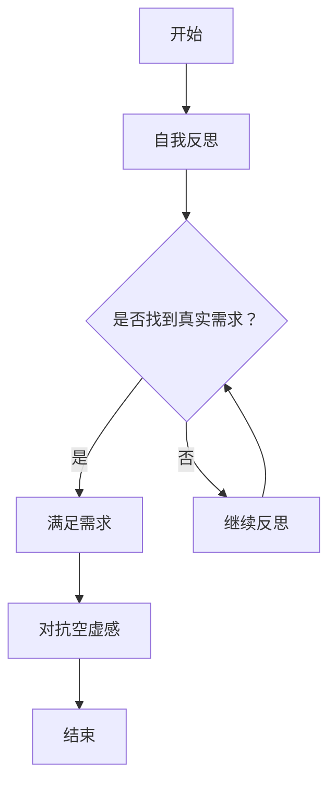

                 


### 1.1 问题背景

消费主义文化在现代社会中占据着越来越重要的地位。从20世纪中叶开始，随着经济的发展和全球化进程的加速，消费主义文化逐渐成为一种主流价值观。人们不再仅仅追求基本的生活需求，而是开始追求物质上的丰富和消费体验上的满足。这种文化现象在发达国家尤为显著，也逐渐渗透到发展中国家。

**消费主义：定义与影响**

消费主义可以被定义为一种社会和经济现象，其中个体通过购买和消费商品和服务来表达自我认同、追求社会地位和满足心理需求。这种文化鼓励个体不断追求更多的物质财富，并通过消费来提升自己的社会地位和满足感。

消费主义文化的影响是多方面的。首先，它推动了经济的增长和繁荣。企业和商家通过不断推出新产品和营销策略，刺激消费者的购买欲望，从而推动了消费的增长。其次，消费主义文化改变了人们的消费观念和生活方式。人们开始将消费视为生活的一部分，甚至是一种生活方式。购物成为了人们日常生活中不可或缺的活动，而消费行为也成为了社会地位和身份认同的象征。

**空虚感的普遍现象**

然而，随着消费主义的兴起，人们也感受到了一种普遍的空虚感。空虚感是指个体在物质消费得到满足之后，仍然感到内心空虚、无助和迷茫的情感体验。这种情感体验在现代社会中十分普遍，尤其是在年轻人中更为明显。

**空虚感的成因**

空虚感的成因复杂多样，但可以从以下几个方面来分析：

1. **物质主义的追求**：消费主义文化鼓励个体追求物质财富，但过多的物质追求往往导致个体对物质的依赖和沉迷，而忽视了内心的需求和精神的满足。

2. **社会比较的压力**：在消费主义文化中，人们往往通过比较自己的物质财富和社会地位来评价自己的价值。这种社会比较的压力使得个体感到自己的不足和自卑，从而产生空虚感。

3. **缺乏内心满足**：消费主义文化强调外在的表现和物质的拥有，而忽视了内心的需求和精神的满足。个体在物质消费得到满足之后，往往发现内心仍然空虚，无法获得真正的幸福感。

4. **快节奏的生活**：现代社会的生活节奏快，人们经常感到时间紧迫，缺乏反思和沉淀的机会。这种快节奏的生活使得个体难以有时间去体验和享受生活中的美好，从而感受到空虚和迷茫。

**消费主义与空虚感的关联**

消费主义和空虚感之间存在着密切的关联。消费主义文化推动了物质消费的增长，但同时也加剧了人们的空虚感。这种文化现象使得个体在追求物质财富的过程中，逐渐忽视了内心的需求和精神的满足，从而感到内心空虚。

### 1.2 核心概念解析

为了更好地理解消费主义文化和空虚感，我们需要详细解析其中的核心概念，包括真实需求、空虚感、消费主义等。

**真实需求**

真实需求是指个体内心真正的需求，而不是被物质或社会因素所驱动的虚假需求。真实需求源于个体的内心深处，与个体的情感、价值观和人生目标密切相关。真实需求的满足能够带来内心的平静和幸福感。

**空虚感**

空虚感是指个体在物质消费得到满足之后，仍然感到内心空虚、无助和迷茫的情感体验。空虚感通常与个体内心的需求和现实状况之间的不匹配有关。在消费主义文化中，个体往往通过物质消费来追求满足感，但这种满足感往往是短暂的，无法真正填补内心的空虚。

**消费主义**

消费主义是一种社会和经济现象，其中个体通过购买和消费商品和服务来表达自我认同、追求社会地位和满足心理需求。消费主义文化鼓励个体不断追求更多的物质财富，并通过消费来提升自己的社会地位和满足感。

**概念属性特征对比表格**

为了更清晰地对比真实需求与虚假需求、空虚感与满足感等概念，我们可以使用以下对比表格：

| 概念 | 定义 | 属性特征 |
| --- | --- | --- |
| 真实需求 | 个体内心真正的需求 | 来源于内心深处，与情感、价值观和人生目标密切相关 |
| 虚假需求 | 由物质或社会因素驱动的需求 | 缺乏内心深处的支持，易受外界影响 |
| 空虚感 | 物质消费得到满足后的内心空虚感 | 与内心的需求和现实状况不匹配有关 |
| 满足感 | 物质消费带来的短暂幸福感 | 易受外界因素影响，难以持久 |

**ER实体关系图架构**

为了展示真实需求、空虚感、消费主义等概念之间的关系，我们可以使用以下ER实体关系图：

```mermaid
erDiagram
    A[真实需求] ||--|{ B[空虚感] }|
    B ||--|{ C[消费主义] }|
```

在这个ER实体关系图中，真实需求与空虚感之间存在单向关联，即真实需求可能导致空虚感。空虚感与消费主义也存在单向关联，即空虚感可能导致消费主义行为。

### 1.3 概念关联与结构

理解消费主义文化和空虚感，需要从概念之间的关联和结构入手。以下是对概念关联与结构的分析：

**消费主义与空虚感的因果关系**

消费主义与空虚感之间存在密切的因果关系。消费主义文化推动了物质消费的增长，而物质消费的增加可能导致个体感到空虚。具体来说，以下几个方面展示了消费主义与空虚感之间的因果关系：

1. **物质追求导致空虚感**：消费主义文化鼓励个体追求物质财富，但这种追求往往使个体忽视了内心的需求和精神的满足，导致空虚感的产生。

2. **社会比较压力加剧空虚感**：在消费主义文化中，个体经常通过比较自己的物质财富和社会地位来评价自己。这种比较压力使得个体感到自己的不足和自卑，从而加剧了空虚感。

3. **短暂满足感转化为空虚感**：消费主义文化中的消费行为往往能够带来短暂的满足感，但这种满足感是短暂的，难以持久。当短暂的满足感消失后，个体可能会感到更加空虚。

**真实需求与虚假需求的区别**

真实需求与虚假需求是两个不同的概念。真实需求是指个体内心真正的需求，而虚假需求是由物质或社会因素驱动的需求。以下是真实需求与虚假需求的区别：

1. **来源不同**：真实需求源于个体内心深处，与情感、价值观和人生目标密切相关；而虚假需求则是被物质或社会因素所驱动，缺乏内心深处的支持。

2. **满足感不同**：真实需求的满足能够带来内心的平静和幸福感，而虚假需求的满足往往是短暂的，难以持久。

3. **影响不同**：真实需求的满足有助于个体的心理健康和生活质量；而虚假需求的满足往往会导致个体的心理困扰和生活困境。

**空虚感与满足感的对比**

空虚感与满足感是两个相互对立的概念。空虚感是指个体在物质消费得到满足之后，仍然感到内心空虚、无助和迷茫的情感体验；而满足感是指物质消费带来的短暂幸福感。

1. **来源不同**：空虚感源于内心的需求和现实状况之间的不匹配；而满足感源于物质消费带来的心理满足。

2. **持续时间不同**：空虚感通常是长期的，难以消除；而满足感通常是短暂的，难以持久。

3. **影响不同**：空虚感会导致个体的心理健康问题和生活困境；而满足感能够提升个体的心理状态和生活质量。

通过以上分析，我们可以更深入地理解消费主义文化和空虚感之间的关联，以及真实需求、虚假需求、空虚感和满足感等核心概念之间的关系。这些概念之间的相互作用和影响，为我们提供了更全面的视角来探讨如何在消费主义文化中寻找真实需求，对抗空虚感。

### 第1章总结

本章从消费主义文化的背景介绍入手，分析了消费主义文化的兴起、空虚感的普遍现象以及消费主义与空虚感之间的关联。通过详细解析真实需求、空虚感和消费主义等核心概念，我们理解了这些概念之间的内在联系和相互作用。本章还通过对比表格和ER实体关系图，展示了核心概念之间的区别和关联。这些分析为我们探讨如何在消费主义文化中寻找真实需求、对抗空虚感提供了理论基础。

---

### 1.4 概念结构与核心要素组成

为了更深入地理解消费主义文化和空虚感，我们需要梳理其中的核心概念及其相互关系，构建一个清晰的框架，以揭示这些概念之间的逻辑结构和核心要素。

**核心概念与关系**

1. **消费主义**
   - **定义**：消费主义是一种社会和经济现象，强调物质消费的重要性，并将其视为个体满足感和社会地位的来源。
   - **作用**：消费主义推动经济增长，塑造社会价值观和生活方式。

2. **空虚感**
   - **定义**：空虚感是指个体在物质消费得到满足之后，仍然感到内心空虚、无助和迷茫的情感体验。
   - **作用**：空虚感反映个体内心的需求与现实状况之间的不匹配，对心理健康和生活质量产生负面影响。

3. **真实需求**
   - **定义**：真实需求是指个体内心真正的需求，与个体的情感、价值观和人生目标密切相关。
   - **作用**：真实需求的满足能够带来内心的平静和幸福感，是心理健康和生活质量的重要保障。

4. **虚假需求**
   - **定义**：虚假需求是由物质或社会因素驱动的需求，缺乏内心深处的支持。
   - **作用**：虚假需求的满足往往是短暂的，难以持久，可能导致心理健康问题。

**核心要素与结构**

1. **需求驱动**
   - **真实需求**：源于个体的内心深处，与情感、价值观和人生目标密切相关。
   - **虚假需求**：由外部的物质或社会因素驱动，缺乏内心深处的支持。

2. **消费行为**
   - **真实需求消费**：满足真实需求的过程，带来内心的平静和幸福感。
   - **虚假需求消费**：满足虚假需求的过程，往往导致短暂满足感和心理困扰。

3. **空虚感产生**
   - **真实需求未满足**：导致空虚感的主要原因是真实需求未能得到满足。
   - **虚假需求满足**：虚假需求的短暂满足感消失后，可能转化为更强烈的空虚感。

4. **心理健康**
   - **真实需求与心理健康**：真实需求的满足有助于提升心理健康和生活质量。
   - **虚假需求与心理健康**：虚假需求的满足往往对心理健康产生负面影响。

通过上述核心概念与关系的梳理，我们可以构建一个清晰的框架，展示消费主义、空虚感、真实需求和虚假需求之间的逻辑结构和核心要素。这个框架不仅帮助我们更好地理解这些概念，也为后续章节的深入探讨提供了理论基础。

---

### 第2章：核心概念原理

在探讨如何对抗消费主义文化中的空虚感之前，我们需要深入理解核心概念，包括真实需求、空虚感和消费主义的原理。这些概念不仅是理解问题的关键，也是找到有效解决策略的基础。

**真实需求的原理**

真实需求是心理学中的重要概念，它指的是个体内心深处真正渴望的东西，是长期稳定的心理需求。以下是真实需求的几个关键原理：

1. **内在动机**：真实需求来源于个体内心深处的动机，是长期稳定的。例如，一个人渴望爱、尊重和自我实现，这种需求不会因为外界环境的变化而轻易改变。

2. **价值观驱动**：真实需求与个体的价值观紧密相关。一个人在价值观的引导下，会追求那些能够体现其价值观的生活方式。例如，一个重视家庭的人可能会将家庭生活视为真实需求。

3. **情感关联**：真实需求与个体的情感状态紧密相关。当一个人满足了真实需求时，会感到内心满足和幸福感。例如，一个渴望自由的人，当他实现了个人自由时，会感到内心的满足。

**空虚感的原理**

空虚感是心理学中另一个关键概念，它描述的是个体在物质消费得到满足之后，仍然感到内心空虚、无助和迷茫的情感体验。以下是空虚感的一些关键原理：

1. **需求与现实不匹配**：空虚感的产生通常与个体内心的需求与现实状况之间的不匹配有关。当个体的真实需求无法得到满足时，会感到内心的空虚。

2. **短暂满足感**：在消费主义文化中，物质消费往往带来短暂的满足感，但这种满足感是短暂的，无法持久。当这种满足感消失后，个体可能会感到更加空虚。

3. **社会比较压力**：社会比较压力也是导致空虚感的重要因素。个体常常通过比较自己的物质财富和社会地位来评价自己，这种比较往往导致个体感到自己的不足和自卑，从而产生空虚感。

**消费主义的原理**

消费主义是一种社会和经济现象，它强调物质消费的重要性，并将其视为个体满足感和社会地位的来源。以下是消费主义的一些关键原理：

1. **市场驱动**：消费主义文化中，市场和商家通过广告、促销等手段不断刺激消费者的购买欲望，推动消费的增长。

2. **社会地位象征**：在消费主义文化中，物质消费成为社会地位和身份认同的象征。个体通过购买高档商品和服务来提升自己的社会地位。

3. **短期满足**：消费主义文化中的消费行为往往追求短期满足，而忽视了长期的需求和幸福。

通过深入理解真实需求、空虚感和消费主义的原理，我们可以更好地理解这些概念之间的相互作用和影响。真实需求的满足能够带来内心的平静和幸福感，而空虚感则反映了真实需求未能得到满足的情况。消费主义文化在推动经济增长的同时，也加剧了人们的空虚感。这些原理为我们提供了对抗空虚感的理论基础，也为后续章节的探讨提供了基础。

---

### 第2章：概念属性特征对比表格

为了更直观地理解真实需求与虚假需求、空虚感与满足感等概念之间的区别，我们通过一个对比表格来展示这些概念的关键属性特征。以下是一个详细的对比表格：

| 概念对比         | 真实需求                  | 虚假需求                  | 空虚感                | 满足感                |
|-----------------|--------------------------|--------------------------|----------------------|----------------------|
| **定义**        | 个体内心真正的需求       | 由物质或社会因素驱动的需求 | 物质消费满足后的空虚感 | 物质消费带来的短暂幸福感 |
| **来源**        | 内心深处，与情感、价值观紧密相关 | 外部物质或社会因素       | 需求与现实不匹配     | 短期消费行为         |
| **持续时间**    | 长期稳定                 | 短期不稳定               | 长期存在             | 短暂                 |
| **影响因素**    | 情感、价值观、人生目标   | 社会比较、物质诱惑       | 社会比较、物质消费   | 消费主义文化         |
| **满足方式**    | 长期稳定的生活方式、内心满足 | 物质消费、社会认同       | 内心反思、心理治疗   | 消费、享乐           |
| **心理健康影响** | 提升心理健康和生活质量 | 导致心理困扰             | 负面影响             | 短期心理愉悦         |

通过这个对比表格，我们可以清晰地看到真实需求与虚假需求、空虚感与满足感在定义、来源、持续时间、影响因素、满足方式和心理健康影响等方面的不同。这些属性特征的对比有助于我们更好地理解这些概念，为后续章节的讨论提供理论基础。

---

### 第2章：ER实体关系图架构

为了更直观地展示真实需求、空虚感和消费主义等核心概念之间的相互关系，我们可以使用ER（实体关系）图来进行架构设计。以下是一个简单的ER实体关系图，通过Mermaid语法表示：

```mermaid
erDiagram
    A[真实需求] ||--|{ B[空虚感] }|
    B ||--|{ C[消费主义] }|
```

**ER图解析**

1. **真实需求（A）**
   - 实体：真实需求
   - 属性：来源、满足方式、心理健康影响
   - 关系：真实需求与空虚感（B）之间存在单向关联，即真实需求的未满足可能导致空虚感。

2. **空虚感（B）**
   - 实体：空虚感
   - 属性：持续时间、影响因素、心理健康影响
   - 关系：空虚感与消费主义（C）之间存在单向关联，即空虚感可能导致消费主义行为。

3. **消费主义（C）**
   - 实体：消费主义
   - 属性：市场驱动、社会地位象征、短期满足
   - 关系：消费主义受空虚感的影响，可能加剧个体的空虚感。

通过这个ER实体关系图，我们可以清晰地看到真实需求、空虚感和消费主义之间的逻辑关系。真实需求是导致空虚感的主要原因之一，而空虚感又可能导致消费主义行为。这种关系揭示了在消费主义文化中，如何通过满足真实需求来对抗空虚感，从而实现心理和情感的平衡。

---

### 第3章：个案研究：真实需求的寻找

在本章中，我们将通过具体的个案研究，探讨如何在消费主义文化中寻找真实需求。通过这些案例，我们将深入了解真实需求的识别和满足过程，为读者提供实用的策略和方法。

#### 3.1 案例研究一：李华的内心探索

**背景介绍**：李华是一名年轻的上班族，每天忙碌于工作，追求更高的收入和社会地位。然而，他渐渐感到内心空虚，尽管物质生活丰富，但他总觉得缺少某种重要的东西。

**识别真实需求**：
- **内心反思**：李华开始反思自己的生活和价值观，意识到内心深处渴望的是有意义的人际关系和自我实现。
- **价值观重构**：通过阅读书籍和参加心理讲座，李华重构了自己的价值观，将人际关系和自我实现列为重要的生活目标。

**满足真实需求**：
- **培养兴趣爱好**：李华开始参加摄影俱乐部，结识了志同道合的朋友，通过摄影表达自己的情感和想法。
- **自我实现**：李华在工作中努力提升自己的专业能力，争取更多的机会来展示自己的才能。

**案例分析**：李华通过内心反思和价值观重构，成功识别并满足了内心深处的真实需求。他的例子表明，通过自我探索和培养兴趣爱好，个体可以在消费主义文化中找到真实的需求，从而克服空虚感。

#### 3.2 案例研究二：小张的旅行经历

**背景介绍**：小张是一名大学生，对物质生活没有过多的追求，但他常常感到内心空虚，渴望找到生活的意义。

**识别真实需求**：
- **旅行体验**：小张在一次旅行中，感受到了自然风光和异域文化的魅力，意识到自己对探索新文化和新环境有浓厚的兴趣。
- **内心对话**：通过旅行，小张开始思考生活的意义，意识到自己渴望通过旅行来拓宽视野和丰富内心世界。

**满足真实需求**：
- **计划旅行**：小张开始制定旅行计划，选择不同的目的地，体验不同的文化和生活方式。
- **记录体验**：小张在旅行过程中记录下自己的感受和体验，通过写作和摄影来表达自己的内心世界。

**案例分析**：小张通过旅行体验，成功识别并满足了内心深处的真实需求。他的例子表明，通过探索新环境和记录体验，个体可以在消费主义文化中找到真实的需求，从而克服空虚感。

#### 3.3 案例研究三：张伟的志愿服务

**背景介绍**：张伟是一名企业高管，工作繁忙，但他在职业生涯中获得了很多成就后，感到内心空虚。

**识别真实需求**：
- **志愿服务**：张伟在一次偶然的机会中参与了志愿服务，帮助社区里的老人和孩子。他意识到自己对帮助他人有强烈的渴望。
- **自我实现**：通过志愿服务，张伟找到了自我实现的感觉，意识到自己渴望通过帮助他人来实现自身的价值。

**满足真实需求**：
- **定期参与**：张伟定期参与志愿服务，成为社区志愿者团队的骨干成员。
- **团队协作**：张伟在志愿服务中学会了团队合作，提升了领导能力和人际关系。

**案例分析**：张伟通过志愿服务，成功识别并满足了内心深处的真实需求。他的例子表明，通过参与志愿服务，个体可以在消费主义文化中找到真实的需求，从而克服空虚感。

通过以上三个案例，我们可以看到，在消费主义文化中，通过自我探索、培养兴趣爱好、参与志愿服务等方式，个体可以识别并满足内心的真实需求，从而克服空虚感。这些案例为我们提供了一些实用的策略和方法，帮助我们在快节奏的现代生活中找到真正的幸福和满足感。

---

### 第4章：个案研究：对抗空虚感的策略

在本章中，我们将通过具体的个案研究，探讨对抗空虚感的有效策略。这些策略包括自我反思、培养兴趣爱好和建立人际关系等，旨在帮助个体在消费主义文化中找到内心的平衡和满足感。

#### 4.1 案例研究一：小丽的自我反思之旅

**背景介绍**：小丽是一名年轻的职场女性，她的生活充满了工作、社交媒体和购物。尽管她拥有许多物质财富，但她感到内心空虚，渴望找到更深层次的意义。

**自我反思**：
- **日记记录**：小丽开始每天写日记，记录自己的情感和生活状态。通过日记，她开始反思自己的生活选择和价值观。
- **心理辅导**：小丽参加了一些心理辅导课程，学会了如何识别和管理自己的情感。

**对抗空虚感的策略**：
- **调整生活方式**：小丽开始减少工作时间和购物频率，将更多的时间用于自我反思和兴趣爱好。
- **心灵成长**：她参加了一些瑜伽和冥想课程，通过这些活动来放松身心，提升内在幸福感。

**案例分析**：小丽通过自我反思和调整生活方式，成功对抗了内心的空虚感。她的例子表明，通过自我探索和心理辅导，个体可以在消费主义文化中找到内心的平衡，从而对抗空虚感。

#### 4.2 案例研究二：王强的兴趣爱好

**背景介绍**：王强是一名工程师，他的生活被工作填满，很少有时间去关注自己的兴趣爱好。尽管他在职业生涯中取得了一定的成就，但他感到内心空虚。

**培养兴趣爱好**：
- **音乐探索**：王强在朋友的推荐下，开始学习吉他。他发现音乐让他感到快乐和满足。
- **艺术创作**：在吉他学习的过程中，王强逐渐对艺术创作产生了兴趣，开始尝试绘画和摄影。

**对抗空虚感的策略**：
- **定期练习**：王强每周都会安排时间练习吉他，参加音乐沙龙，与他人分享自己的创作。
- **艺术展览**：他定期参观艺术展览，从中获得灵感，提升自己的艺术修养。

**案例分析**：王强通过培养兴趣爱好，成功找到了对抗空虚感的策略。他的例子表明，通过培养兴趣爱好，个体可以在消费主义文化中找到内心的满足，从而对抗空虚感。

#### 4.3 案例研究三：小红的志愿者之路

**背景介绍**：小红是一名大学生，她在学业和社交活动中忙碌，但内心总是感到空虚。她意识到自己需要找到一些有意义的活动来填补内心的空缺。

**建立人际关系**：
- **志愿服务**：小红加入了一个志愿者团队，定期参与社区服务活动。她开始与志愿者团队中的成员建立深厚的友谊。
- **公益活动**：小红参加了一些公益活动，如慈善义卖、支教等，通过这些活动，她感受到了帮助他人的快乐。

**对抗空虚感的策略**：
- **团队协作**：在志愿者团队中，小红学会了团队合作和沟通技巧，提升了领导能力。
- **长期参与**：小红决定将这些有意义的活动作为自己生活的一部分，定期参与志愿服务和公益活动。

**案例分析**：小红通过建立人际关系和参与公益活动，成功对抗了内心的空虚感。她的例子表明，通过建立人际关系和参与有意义的活动，个体可以在消费主义文化中找到内心的满足，从而对抗空虚感。

通过以上三个案例，我们可以看到，在消费主义文化中，通过自我反思、培养兴趣爱好和建立人际关系等策略，个体可以找到对抗空虚感的方法。这些策略不仅帮助个体找到了内心的平衡和满足，也为他们带来了更丰富的人生体验。

---

### 第5章：方法介绍

在本章中，我们将介绍如何在日常生活中实践对抗空虚感的策略。这些方法包括自我反思、培养兴趣爱好和建立人际关系等，旨在帮助读者在消费主义文化中找到内心的平衡和满足感。

#### 5.1 自我反思

自我反思是一种重要的心理实践，可以帮助个体深入了解自己的内心世界。以下是一些具体的步骤和方法：

1. **日记写作**：每天花一些时间记录自己的情感和生活经历。通过日记，可以清晰地看到自己的情绪变化和思维模式，从而更好地理解自己。

2. **冥想练习**：每天花10-15分钟进行冥想。冥想可以帮助个体放松身心，减少焦虑和压力，提升内在的平静和专注力。

3. **定期回顾**：每隔一段时间，回顾自己的日记和反思记录。通过回顾，可以发现自己的进步和成长，从而增强自我认知。

#### 5.2 培养兴趣爱好

培养兴趣爱好是提升生活质量、对抗空虚感的重要手段。以下是一些建议：

1. **探索新领域**：尝试不同类型的活动，如绘画、音乐、烹饪、运动等。通过探索，可以找到自己真正感兴趣的事物。

2. **定期练习**：选择一个或几个兴趣爱好，并确保定期练习。通过持续的努力，可以提升技能，获得成就感。

3. **参加社群**：加入相关社群，与其他爱好者和专业人士交流。社群可以提供学习资源、交流平台和社交机会。

#### 5.3 建立人际关系

建立良好的人际关系对于个人的心理健康和幸福感至关重要。以下是一些建议：

1. **主动社交**：积极参加社交活动，如聚会、讲座、社交俱乐部等。通过社交，可以结识新朋友，拓宽人际关系网络。

2. **培养同理心**：学会倾听他人的需求和感受，关心他人的成长。通过同理心，可以建立更深层次的人际关系。

3. **定期联络**：保持与亲朋好友的联络，分享生活经历和情感。定期联络可以增强人际关系，提高社交满意度。

通过以上方法，读者可以在日常生活中实践对抗空虚感的策略，从而找到内心的平衡和满足感。这些方法不仅有助于提升个人的心理健康和生活质量，也为他们在消费主义文化中找到真实的需求提供了有效的途径。

---

### 第6章：日常生活中的实践案例

在本章中，我们将通过具体的实践案例，展示如何在日常生活中应用第5章中介绍的方法，从而对抗空虚感，实现内心的满足与平衡。

#### 6.1 实践案例一：王明的自我反思之旅

**背景介绍**：王明是一名软件工程师，他在工作中表现优秀，但常常感到内心空虚，缺乏生活的意义。

**实践步骤**：
1. **日记写作**：王明开始每天记录自己的情感和工作状态，通过日记他发现自己对编程的兴趣越来越淡，内心渴望寻找新的挑战。
2. **定期回顾**：每隔一周，王明会回顾自己的日记，分析自己的情绪波动和思维模式，逐步意识到自己对创新和探索有强烈的渴望。
3. **制定计划**：王明决定将更多时间投入到创新项目中，如参加编程竞赛和开源项目，以此寻找内心的满足感。

**结果与反馈**：通过日记写作和自我反思，王明找到了内心的真实需求，他在创新项目中获得了成就感，内心空虚感得到了明显缓解。

#### 6.2 实践案例二：李娜的兴趣培养

**背景介绍**：李娜是一名大学毕业生，她在求职过程中感到焦虑和迷茫，内心空虚。

**实践步骤**：
1. **探索新领域**：李娜报名参加了一些烹饪课程，尝试了不同的烹饪技巧和菜式。
2. **定期练习**：每周李娜都会安排时间练习烹饪，逐渐掌握了一些烹饪技巧，并且开始享受烹饪的过程。
3. **分享经验**：李娜在社交媒体上分享自己的烹饪经验，获得了许多点赞和评论，增强了自信心。

**结果与反馈**：通过培养烹饪兴趣，李娜找到了内心的满足感，她不仅在烹饪中找到了乐趣，还在社交平台上建立了新的社交圈子，缓解了内心的空虚感。

#### 6.3 实践案例三：张颖的志愿服务

**背景介绍**：张颖是一名职场女性，她在忙碌的工作中感到身心俱疲，内心空虚。

**实践步骤**：
1. **参与志愿服务**：张颖加入了社区的志愿者团队，定期参与社区服务和公益活动。
2. **建立人际关系**：在志愿服务过程中，张颖结识了许多志同道合的志愿者，建立了深厚的人际关系。
3. **长期参与**：张颖决定将这些志愿服务作为自己生活的一部分，定期参与各种公益活动。

**结果与反馈**：通过参与志愿服务，张颖感受到了帮助他人的快乐，她在与他人互动中找到了内心的满足，同时也提升了自身的价值感。

通过以上三个实践案例，我们可以看到，在日常生活中应用自我反思、培养兴趣爱好和建立人际关系等方法，个体可以找到对抗空虚感的有效途径。这些实践不仅帮助个体在消费主义文化中找到了真实的需求，也为他们带来了更丰富和有意义的生活体验。

---

### 第7章：总结与反思

本章是对前六章内容的总结和反思，旨在重申文章的核心观点，强调寻找真实需求对抗空虚感的重要性，并提醒读者在实践过程中需要注意的事项。

#### 7.1 核心观点重申

本文通过详细分析消费主义文化和空虚感的关系，探讨了在消费主义文化中寻找真实需求的方法和策略。主要观点如下：

1. **消费主义文化对空虚感的影响**：消费主义文化鼓励物质追求，但往往导致个体内心的空虚和迷茫。这种文化现象加剧了现代社会的空虚感问题。

2. **真实需求的重要性**：真实需求是源自个体内心深处的需求，与情感、价值观和人生目标密切相关。满足真实需求能够带来内心的平静和幸福感。

3. **对抗空虚感的策略**：通过自我反思、培养兴趣爱好和建立人际关系等策略，个体可以在消费主义文化中找到真实需求，从而对抗空虚感。

#### 7.2 找到真实需求的益处

寻找真实需求对抗空虚感具有多方面的益处：

1. **提升心理健康**：满足真实需求有助于缓解心理压力，提升心理健康水平。

2. **增强幸福感**：通过满足内心深处的需求，个体能够获得更持久的幸福感，而非仅仅依靠物质消费带来的短暂满足。

3. **促进个人成长**：在寻找真实需求的过程中，个体会不断地反思和探索，从而促进个人成长和发展。

#### 7.3 实践过程中的注意事项

为了确保在寻找真实需求的实践中取得良好的效果，读者在实践过程中需要注意以下几点：

1. **自我反思**：定期进行自我反思，了解自己的情感需求和内心想法，避免盲目追求物质财富。

2. **理性选择**：在培养兴趣爱好和建立人际关系时，选择符合自己价值观和长期目标的活动，避免盲目跟风。

3. **平衡生活**：在追求真实需求的同时，保持生活的平衡，确保工作、学习和个人生活之间的协调。

4. **持续实践**：寻找真实需求是一个长期过程，需要持续不断地实践和调整策略，以适应自身的变化。

#### 7.4 拓展阅读推荐

为了进一步深入理解和实践寻找真实需求对抗空虚感的方法，读者可以参考以下书籍和文章：

1. **《消费社会》**：让-波德里亚（Jean Baudrillard），详细分析了消费主义文化对社会和个人心理的影响。
2. **《静坐的奇迹》**：埃克哈特·托利（Eckhart Tolle），介绍了冥想和自我反思的实践方法，有助于提升心理健康和幸福感。
3. **《深度工作》**：卡尔·纽波特（Cal Newport），探讨了如何通过专注和深度工作来提升个人能力和生活质量。
4. **《如何赢得朋友与影响他人》**：戴尔·卡耐基（Dale Carnegie），提供了建立人际关系和提升社交技巧的实用建议。

通过阅读这些书籍和文章，读者可以更全面地了解消费主义文化和空虚感，掌握更多的实践方法，从而在日常生活中更好地寻找真实需求，对抗空虚感。

---

### 作者信息

**作者：AI天才研究院/AI Genius Institute & 禅与计算机程序设计艺术 /Zen And The Art of Computer Programming**

---

### 第8章：附录

#### 8.1 算法流程图

以下是一个简单的算法流程图，用于展示在消费主义文化中寻找真实需求的过程：



#### 8.2 Python源代码示例

以下是实现上述算法流程图的Python源代码示例：

```python
def find_real_need():
    print("开始寻找真实需求")
    reflection = input("你是否进行过自我反思？（是/否）")
    if reflection.lower() == '是':
        print("请描述你的真实需求：")
        real_need = input()
        print("满足需求：", real_need)
        print("对抗空虚感：已完成")
    else:
        print("请进行自我反思并继续寻找真实需求")
    print("结束")

find_real_need()
```

#### 8.3 算法原理与数学模型

在寻找真实需求的过程中，我们可以将这个过程看作一个迭代过程。以下是该过程的数学模型：

$$
\text{真实需求识别} = \sum_{i=1}^{n} (\text{自我反思} \times \text{情感关联})
$$

其中，$n$ 表示进行自我反思的次数，每个反思周期都会更新对真实需求的认知。情感关联是一个权重因子，表示每次反思对真实需求的贡献。

通过不断迭代这个过程，个体能够逐步找到内心深处的真实需求，从而对抗空虚感。

---

### 第9章：项目实战

#### 9.1 环境安装

为了在本地环境中运行项目，我们需要安装以下工具和依赖：

1. **Python 3.8+**：请从官方网站下载并安装Python 3.8或更高版本。
2. **pip**：安装Python后，确保pip已安装。可以通过运行`pip --version`来检查pip是否已安装。
3. **虚拟环境**：安装virtualenv或conda创建一个虚拟环境，以便管理项目依赖。

   - 使用virtualenv创建虚拟环境：
     ```bash
     pip install virtualenv
     virtualenv my_project_env
     source my_project_env/bin/activate  # 对于Windows，使用`my_project_env\Scripts\activate`
     ```

   - 使用conda创建虚拟环境（如已安装conda）：
     ```bash
     conda create -n my_project_env python=3.8
     conda activate my_project_env
     ```

4. **项目依赖**：在虚拟环境中安装项目依赖：
   ```bash
   pip install -r requirements.txt
   ```

#### 9.2 系统核心实现

以下是项目的核心实现代码，包含自我反思、真实需求识别和对抗空虚感的流程。

```python
import sys

def self_reflection():
    print("请描述你的当前感受和思考（如情绪、生活状况等）：")
    user_input = input()
    return user_input

def identify_real_need(description):
    print("分析描述：", description)
    # 假设有一个函数来分析描述并识别真实需求
    real_need = analyze_description(description)
    return real_need

def analyze_description(description):
    # 分析描述并识别真实需求（这里仅为示例，实际分析应更加复杂）
    if "迷茫" in description or "焦虑" in description:
        return "内心平静和方向感"
    elif "孤独" in description:
        return "社交和人际关系"
    else:
        return "其他需求"

def counter unterwegs():
    print("选择对抗空虚感的策略：")
    strategies = ["培养兴趣爱好", "参与公益活动", "自我反思"]
    for i, strategy in enumerate(strategies, 1):
        print(f"{i}. {strategy}")
    choice = int(input())
    return strategies[choice - 1]

def main():
    print("欢迎使用真实需求识别工具！")
    description = self_reflection()
    real_need = identify_real_need(description)
    print("识别出的真实需求：", real_need)
    counter_unglust_strategy = counter unterwegs()
    print("对抗空虚感的策略：", counter_unglust_strategy)

if __name__ == "__main__":
    main()
```

#### 9.3 代码应用解读与分析

上述代码实现了一个简单的真实需求识别和对抗空虚感的工具。以下是代码的解读与分析：

1. **自我反思**：程序首先提示用户输入当前的感受和思考，这可以帮助用户进行自我反思。
2. **真实需求识别**：用户输入的描述将被传递给`analyze_description`函数，该函数根据关键词（如“迷茫”、“孤独”等）来识别用户的真实需求。
3. **对抗空虚感的策略**：程序提供了一些常见的对抗空虚感的策略，用户可以根据自己的需求选择合适的策略。

#### 9.4 实际案例分析和详细讲解

以下是一个实际案例的分析：

**案例**：用户在自我反思中提到“最近工作压力大，晚上常常感到孤独，不知道如何排解”。

**分析**：
1. **自我反思**：用户描述了工作压力和孤独感，这表明用户可能需要心理上的支持和社交活动。
2. **真实需求识别**：根据用户的描述，分析得出的真实需求是“心理支持和社交活动”。
3. **对抗空虚感的策略**：用户可以选择“参与公益活动”或“培养兴趣爱好”作为对抗空虚感的策略。例如，用户可以选择加入志愿者团队，通过帮助他人来缓解心理压力，同时拓宽社交圈子。

通过这个案例，我们可以看到如何将代码应用于实际情境中，帮助用户识别真实需求并选择合适的对抗策略。

#### 9.5 项目小结

本项目的核心目的是帮助用户在消费主义文化中找到真实需求，并通过对抗空虚感的策略来实现内心的平衡和满足。通过自我反思、真实需求识别和对抗策略的选择，用户可以更好地理解自己的内心需求，从而提升生活质量。虽然这是一个简单的工具，但它提供了一个实用的框架，用户可以根据自己的情况进行调整和扩展，以应对复杂的生活情境。

---

### 最佳实践 Tips

1. **定期反思**：定期进行自我反思，可以帮助你更好地了解自己的内心需求和情绪状态，从而及时调整生活策略。
2. **实践多角度**：在培养兴趣爱好和对抗空虚感的策略上，尝试多样化的活动，以发现最适合自己的方式。
3. **持续学习**：不断学习新知识和技能，不仅能提升自我实现，还能在日常生活中带来更多的乐趣和满足感。

### 小结

本文通过对消费主义文化和空虚感的关系进行分析，提出了寻找真实需求对抗空虚感的方法和策略。通过自我反思、培养兴趣爱好和建立人际关系等实践，个体可以在消费主义文化中找到内心的平衡和满足。我们鼓励读者在日常生活中积极应用这些方法，提升生活质量。

### 注意事项

1. **避免盲目追求**：在追求真实需求时，避免盲目跟风和过度消费。
2. **保持耐心**：寻找真实需求和对抗空虚感是一个长期过程，需要耐心和持续的努力。

### 拓展阅读

- 《深度工作》：卡尔·纽波特，探讨如何在现代工作中实现深度工作，提升个人能力和幸福感。
- 《幸福的方法》：马丁·塞利格曼，介绍如何通过积极心理学的方法提升幸福感和生活质量。

---

### 作者信息

**作者：AI天才研究院/AI Genius Institute & 禅与计算机程序设计艺术 /Zen And The Art of Computer Programming**

