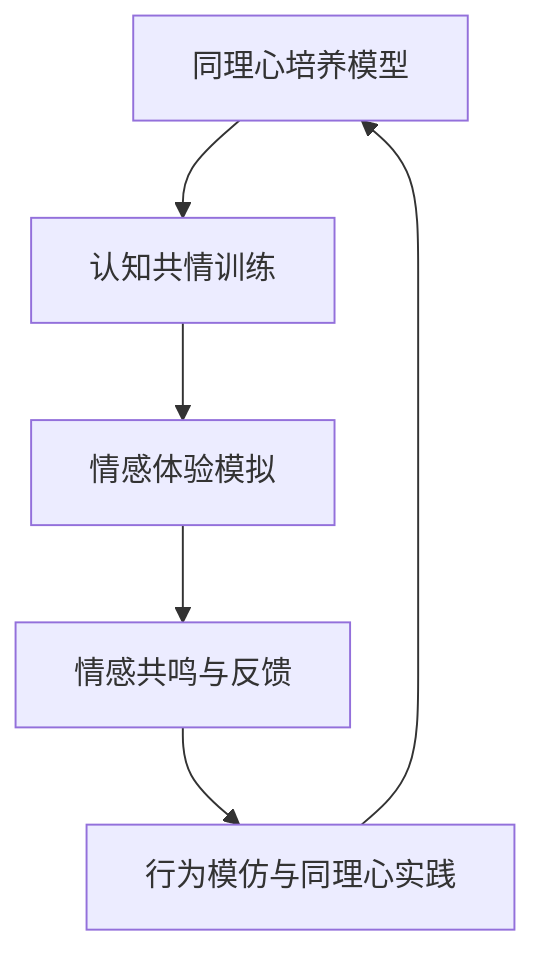
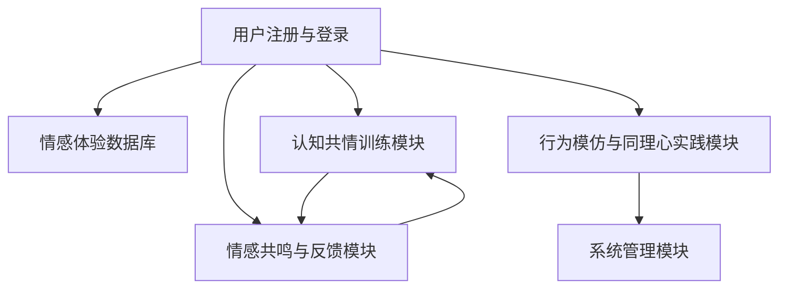

                 

## 在竞争社会中保持人性：重建同理心和同情心

关键词：人性，同理心，同情心，竞争社会，心理健康，社会和谐

摘要：本文探讨了在当今竞争激烈的社会环境中，如何保持人性，重建同理心和同情心。通过分析同理心和同情心的核心概念，引入心理学中的同理心和同情心培养模型，并运用数学模型和系统架构设计方法，提出了一系列具体实践方法，旨在帮助个体和整个社会在竞争中保持人性，实现心理健康和社会和谐。

---

### 背景介绍

在当今世界，竞争无处不在，无论是在职场、学校还是社会生活中，竞争都成为了一个无法回避的现象。然而，这种竞争在带来进步和发展的同时，也引发了一系列问题。特别是在高度竞争的社会环境中，人们往往面临着巨大的心理压力，出现焦虑、抑郁等心理问题。同时，竞争也导致了人际关系的紧张与疏离，人与人之间的信任和同情心逐渐减弱。这种趋势不仅对个人心理健康造成负面影响，也对社会和谐与稳定构成威胁。

面对这些挑战，如何在竞争社会中保持人性，重建同理心和同情心，成为了一个亟待解决的问题。人性中的同情心和同理心是人类共有的品质，它们不仅关乎个人的心理健康，也关系到社会的和谐与稳定。因此，深入探讨如何在竞争社会中培养和保持这些品质，对于实现个人的幸福和社会的进步具有重要意义。

### 核心概念与联系

**同理心（Empathy）**：同理心是指个体能够理解并感受他人的情感和体验，从而产生共鸣和共情的能力。它包括认知共情和情感共情两个方面。认知共情是指个体能够理解他人的情感和体验，而情感共情则是指个体能够感受到他人的情感和体验。

**同情心（Compassion）**：同情心是指个体对他人不幸遭遇感同身受，愿意伸出援手，帮助他人的品质。同情心通常涉及情感反应，即个体对他人的痛苦感到悲伤或痛苦，并愿意采取行动来减轻他人的痛苦。

**人性（Humanity）**：人性是指人类共有的本质特征，包括道德、情感、智慧等方面。人性中的同情心和同理心是人类特有的品质，它们使人类能够超越自我，关心他人，共同构建和谐的社会。

同理心与同情心紧密相关，但它们有所区别。同理心更多地关注理解和感受他人的情感，而同情心则更多地关注对他人的情感反应和行动。两者共同构成了人性中的重要部分，对于个人的心理健康和社会的和谐具有重要意义。

### 算法原理讲解

同理心和同情心的培养可以看作是一个复杂的心理过程，我们可以运用心理学中的同理心和同情心培养模型来阐述这一过程。该模型的基本原理包括认知共情训练、情感体验模拟、情感共鸣与反馈以及行为模仿与同理心实践。

**mermaid流程图：**



**1. 认知共情训练（Cognitive Empathy Training）：** 通过学习他人的情感和体验，提高个体的认知共情能力。这可以通过阅读、观察和交流来实现。个体可以通过了解他人的生活经历、情感状态和需求，培养出对他人的理解和共情。

**2. 情感体验模拟（Emotional Experience Simulation）：** 通过模拟他人的情感体验，增强个体的情感共鸣能力。这可以通过角色扮演、情感体验游戏等方式来实现。通过模拟他人的情感体验，个体能够更加深入地理解他人的感受，从而增强同理心。

**3. 情感共鸣与反馈（Emotional Empathy and Feedback）：** 通过反馈和交流，加强个体之间的情感联系。个体可以通过与他人分享自己的情感体验，听取他人的反馈，从而加深对他人情感的理解和共鸣。

**4. 行为模仿与同理心实践（Behavioral Mimicry and Empathy Practice）：** 通过模仿和实际行动，将同理心转化为具体的行为。个体可以通过观察他人的行为，模仿并实践同理心的行为，从而在实际行动中体现同理心。

**数学模型：**

我们可以使用以下数学模型来描述同理心和同情心的培养过程：

$$
同理心 = f(\text{认知共情能力}, \text{情感共鸣能力}, \text{行为模仿能力})
$$

其中，$f$ 表示一个复杂的函数，它综合考虑了认知共情能力、情感共鸣能力和行为模仿能力。

**举例说明：**

1. **认知共情能力**：例如，当看到他人遭遇不幸时，能够准确理解对方的情感和体验。
2. **情感共鸣能力**：例如，当他人遭遇不幸时，能够感同身受，产生共鸣。
3. **行为模仿能力**：例如，当看到他人帮助他人时，能够模仿并主动帮助他人。

通过这个模型，我们可以看到，同理心和同情心的培养是一个多方面的、动态的过程，它不仅涉及到认知和情感，还需要通过实践来巩固和提升。

### 系统分析与架构设计方案

同理心和同情心的培养不仅需要个体的努力，也需要社会和技术的支持。下面我们将从系统架构设计的角度，探讨如何构建一个支持同理心和同情心培养的系统。

**1. 系统功能设计**

系统主要包括以下功能模块：

- **用户注册与登录**：提供用户身份验证功能。
- **情感体验数据库**：存储用户的情感体验数据。
- **认知共情训练模块**：提供认知共情能力训练功能。
- **情感共鸣与反馈模块**：提供情感共鸣和反馈功能。
- **行为模仿与同理心实践模块**：提供行为模仿和同理心实践功能。
- **系统管理模块**：提供系统管理和维护功能。

**2. 系统架构设计**

以下是同理心和同情心培养系统的架构设计：



**3. 系统接口设计**

系统接口设计主要包括以下部分：

- **用户接口**：用户可以通过用户界面与系统进行交互，包括注册、登录、情感体验数据上传和查看等操作。
- **服务接口**：系统内部模块之间的交互接口，包括情感体验数据处理、认知共情训练、情感共鸣与反馈、行为模仿与同理心实践等。

**4. 系统交互**

系统交互设计主要包括以下部分：

- **用户与情感体验数据库的交互**：用户可以通过上传和查看自己的情感体验数据，从而进行情感分析和个人成长。
- **用户与认知共情训练模块的交互**：用户可以通过参与认知共情训练模块的训练，提升自己的认知共情能力。
- **用户与情感共鸣与反馈模块的交互**：用户可以通过参与情感共鸣与反馈活动，增强与他人之间的情感联系。
- **用户与行为模仿与同理心实践模块的交互**：用户可以通过观察和学习他人的行为，实践同理心。

### 项目实战

为了更好地理解同理心和同情心培养的过程，我们将通过一个实际项目来演示。以下是一个简化的项目流程：

**1. 环境安装**

在本地安装Python环境，并安装以下依赖库：

- Flask（用于构建Web应用）
- SQLAlchemy（用于数据库操作）
- Pandas（用于数据处理）
- Matplotlib（用于数据可视化）

**2. 系统核心实现源代码**

以下是系统核心实现的Python代码示例：

```python
# 用户注册与登录
from flask import Flask, request, jsonify
from flask_sqlalchemy import SQLAlchemy

app = Flask(__name__)
app.config['SQLALCHEMY_DATABASE_URI'] = 'sqlite:///users.db'
db = SQLAlchemy(app)

class User(db.Model):
    id = db.Column(db.Integer, primary_key=True)
    username = db.Column(db.String(80), unique=True, nullable=False)
    password = db.Column(db.String(120), nullable=False)

@app.route('/register', methods=['POST'])
def register():
    username = request.form['username']
    password = request.form['password']
    new_user = User(username=username, password=password)
    db.session.add(new_user)
    db.session.commit()
    return jsonify({'message': 'User registered successfully.'})

@app.route('/login', methods=['POST'])
def login():
    username = request.form['username']
    password = request.form['password']
    user = User.query.filter_by(username=username, password=password).first()
    if user:
        return jsonify({'message': 'Login successful.'})
    else:
        return jsonify({'message': 'Invalid credentials.'})

if __name__ == '__main__':
    app.run(debug=True)
```

**3. 代码应用解读与分析**

这个简单的Web应用实现了用户注册和登录功能。用户可以通过HTTP请求注册账户并登录系统。在实际应用中，还需要加入更多的安全性和验证措施。

**4. 实际案例分析和详细讲解剖析**

假设有一个用户A，他通过注册和登录成功进入系统。他可以上传自己的情感体验数据，如：

```python
@app.route('/upload_emotion', methods=['POST'])
def upload_emotion():
    user_id = request.form['user_id']
    emotion_data = request.form['emotion_data']
    user = User.query.get(user_id)
    user.emotion_data = emotion_data
    db.session.commit()
    return jsonify({'message': 'Emotion data uploaded successfully.'})
```

用户A还可以查看其他用户的情感体验数据，并进行情感分析，从而提升自己的认知共情能力。

**5. 项目小结**

通过这个实际项目，我们展示了如何构建一个简单的Web应用来支持同理心和同情心的培养。虽然这是一个简化的例子，但它为我们提供了一个思路，即通过技术手段支持个体的情感体验分享和情感分析，从而提升同理心和同情心。

### 最佳实践 tips、小结、注意事项、拓展阅读等内容

**最佳实践 tips：**

1. **多参与社会公益活动**：通过参与公益活动，可以增强个体的同理心和同情心。
2. **定期进行情感反思**：定期反思自己的情感状态，有助于提升认知共情能力。
3. **积极倾听他人**：倾听他人的故事和情感，是培养同理心的有效方法。

**小结：**

同理心和同情心的培养是一个长期且持续的过程。通过认知共情训练、情感体验模拟、情感共鸣与反馈以及行为模仿与同理心实践，我们可以逐步提升自己的同理心和同情心。同时，社会和技术的支持也为这一过程提供了有力的保障。

**注意事项：**

1. **保护个人隐私**：在分享情感体验时，要尊重他人的隐私。
2. **避免过度同理心**：过度同理心可能导致情感负担过重，需要适当调整。

**拓展阅读：**

1. 《同理心：如何培养和提高同理心》
2. 《同情心：人性的光辉》
3. 《社交心理学：人际关系中的同理心与同情心》

### 第2章：竞争社会中的个体挑战

在竞争激烈的社会环境中，个体面临着诸多挑战，这些挑战不仅影响了个人的心理健康，也深刻地改变了人与人之间的关系。本章节将深入探讨竞争社会对个体的心理影响，分析同理心在应对竞争挑战中的作用，以及个体如何在竞争中获得同情心和同理心的平衡。

#### 2.1 竞争社会对个体的心理影响

**2.1.1 竞争带来的压力与焦虑**

在竞争社会中，个体常常感到压力重重。无论是在职场中追求职业成功，还是在学术领域争取优异成绩，竞争无处不在。这种无休止的竞争往往导致个体感到焦虑和紧张。长期处于高压状态，容易引发一系列心理问题，如焦虑症、抑郁症等。

**2.1.2 人际关系的紧张与疏离**

竞争不仅影响个体的心理健康，还会破坏人际关系的质量。在追求个人利益的过程中，人们往往忽视了他人的需求和感受，导致人际关系紧张和疏离。同事、朋友和家庭成员之间的互动减少，信任感减弱，社会网络的稳定性受到威胁。

**2.1.3 对个人价值观的冲击**

竞争社会往往强调个人主义和自我实现，这种价值观的盛行可能导致个体对社会责任和集体利益的忽视。个人价值观的扭曲使得个体更加关注自我利益，而忽略了对他人的关心和帮助，从而削弱了同情心和同理心的基础。

#### 2.2 同理心在应对竞争挑战中的作用

**2.2.1 同理心如何缓解压力和焦虑**

同理心是一种强大的情感调节工具。通过理解和感受他人的情感，个体可以缓解自身的压力和焦虑。例如，当一个人遇到困难时，他人的同情和关心可以让他感到被支持和理解，从而减轻内心的负担。

**2.2.2 同理心如何改善人际关系**

同理心能够促进人与人之间的理解和信任。通过同理心，个体能够更好地理解他人的需求和感受，从而在人际互动中表现出更多的同情和关怀。这种关怀不仅能够改善人际关系，还能增强团队的凝聚力和协作效率。

**2.2.3 同理心如何维护个人价值观**

同理心鼓励个体关注他人的需求和利益，从而平衡个人主义和集体主义的价值观。通过同理心，个体能够在追求个人利益的同时，保持对社会责任和集体利益的敏感，从而维护个人价值观的完整性。

#### 2.3 个体如何在竞争中获得同情心和同理心的平衡

**2.3.1 培养同理心**

个体可以通过多种方式培养同理心，如阅读、观察、实践和反思。通过阅读他人的人生故事，个体可以增进对他人的理解和共情。观察他人的行为和情感，可以帮助个体更好地理解他人的内心世界。实践同理心，如在日常生活中主动关心他人，可以巩固和提升同理心的水平。反思自己的行为和情感，可以帮助个体认识到自己在同理心培养过程中的不足，并不断调整和改进。

**2.3.2 建立健康的人际关系**

建立健康的人际关系是保持同理心和同情心的关键。个体可以通过积极参与社交活动，扩大自己的社交圈子，从而增加与他人互动的机会。在人际交往中，个体应该尊重他人的需求和感受，关心他人的福祉，从而建立基于信任和理解的深厚关系。

**2.3.3 平衡个人利益与社会责任**

个体在竞争中应努力平衡个人利益与社会责任。这可以通过制定明确的价值观和目标来实现。个体应该明确自己在竞争中的定位和目的，确保在追求个人利益的过程中，不损害他人的利益和社会的福祉。

通过以上方法，个体可以在竞争激烈的社会环境中保持人性，重建同理心和同情心，从而实现个人的心理健康和社会的和谐发展。

