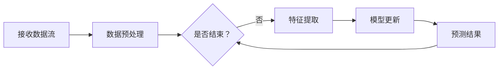
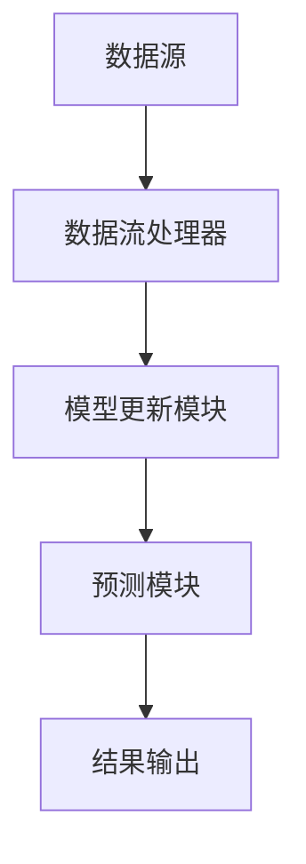
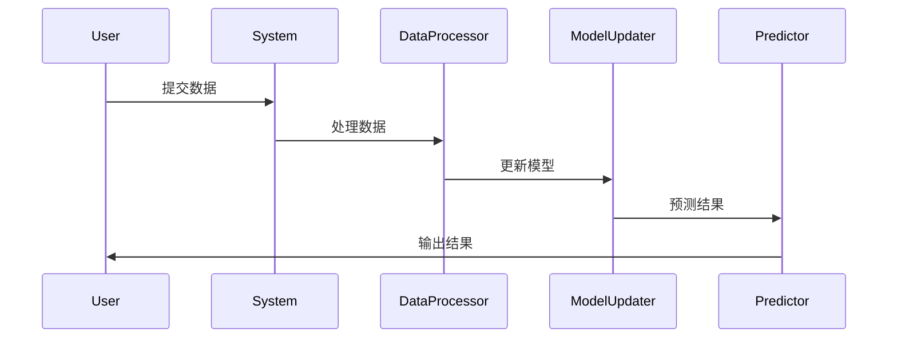

                 

### 文章标题

**在线增量学习：适应数据流的AI模型**

关键词：在线增量学习，数据流，机器学习，AI模型，算法，系统架构

摘要：本文深入探讨了在线增量学习在适应数据流中的应用，介绍了其核心概念、算法原理、系统架构以及实战案例。通过详细的分析和讲解，读者将了解到在线增量学习的优势、局限性及其在各个领域的应用前景。

### 目录大纲设计思路

在设计《在线增量学习：适应数据流的AI模型》的完整目录大纲时，我们首先需要理解书名所传达的核心主题。书名明确指出，本书将探讨在线增量学习在数据流中的应用，这表明了本书将重点介绍如何在数据流中持续更新和优化AI模型。

#### 步骤一：理解书名

书名《在线增量学习：适应数据流的AI模型》涵盖了以下几个关键点：

1. **在线增量学习**：这是一种机器学习技术，它允许模型在数据流中持续学习，从而适应数据的变化。
2. **适应数据流**：这一部分强调了在线增量学习的动态性和实用性，即在数据不断变化的环境中，模型能够实时更新并保持高效性能。
3. **AI模型**：这指的是利用机器学习和深度学习技术训练出来的模型，它们在各个领域（如金融、医疗、制造等）有着广泛的应用。

#### 步骤二：确定目录结构

根据书名，我们可以确定本书的主要部分应该涵盖以下几个方面：

1. **背景介绍**：介绍在线增量学习和数据流处理的基本概念、发展历程以及应用场景。
2. **算法原理**：详细讲解在线增量学习的算法原理，包括基础概念、算法分类、实现方法等。
3. **系统架构设计**：介绍在线增量学习的系统架构设计，包括问题场景、功能设计、接口设计、交互设计等。
4. **实战案例**：通过实际案例，展示在线增量学习在具体项目中的应用，分析其实际效果和前景。

#### 步骤三：细化每个章节

在确定了主要部分后，我们需要进一步细化每个章节的内容，确保每个章节都有明确的主题和详细的内容。

1. **背景介绍**：包括数据流与机器学习的关联、在线增量学习的必要性、发展历程等。
2. **算法原理**：包括增量学习算法基础、在线学习算法原理、数据流处理算法详解等。
3. **系统架构设计**：包括问题场景介绍、系统架构设计、系统交互设计等。
4. **实战案例**：包括环境安装、系统核心实现、代码应用解读与分析、实际案例分析等。

#### 步骤四：保持简洁性

在保证内容完整性的同时，我们需要避免冗余和过多的废话，确保每个章节都能直接传达核心信息。

#### 步骤五：使用Markdown格式

为了保持格式的一致性和易读性，我们将使用Markdown格式来编写目录大纲。

### 目录大纲设计

以下是基于上述思路设计的书籍目录大纲：

```markdown
----------------------------------------------------------------
# 第一部分：背景介绍

## 1.1 问题背景
### 1.1.1 数据流与机器学习
### 1.1.2 在线增量学习的必要性
### 1.1.3 在线增量学习的发展历程

## 1.2 核心概念
### 1.2.1 增量学习
### 1.2.2 在线学习
### 1.2.3 数据流处理

## 1.3 边界与外延
### 1.3.1 增量学习的限制
### 1.3.2 数据流的挑战
### 1.3.3 在线增量学习的适用场景

## 1.4 概念结构与核心要素
### 1.4.1 在线增量学习的结构
### 1.4.2 数据流中的模型更新策略
### 1.4.3 数据流处理的核心技术

## 1.5 本章小结

----------------------------------------------------------------
# 第二部分：在线增量学习算法原理

## 2.1 算法概述
### 2.1.1 算法分类
### 2.1.2 算法特点
### 2.1.3 算法对比

## 2.2 算法原理
### 2.2.1 增量学习算法基础
### 2.2.2 在线学习算法原理
### 2.2.3 数据流处理算法详解

## 2.3 算法mermaid流程图

## 2.4 算法实现
### 2.4.1 Python代码实现
### 2.4.2 数学模型与公式
### 2.4.3 举例说明

## 2.5 算法应用
### 2.5.1 应用案例
### 2.5.2 实际效果分析
### 2.5.3 应用前景

## 2.6 本章小结

----------------------------------------------------------------
# 第三部分：在线增量学习系统架构设计

## 3.1 问题场景介绍
### 3.1.1 数据流处理的场景描述
### 3.1.2 在线增量学习的需求分析

## 3.2 系统架构设计
### 3.2.1 系统架构mermaid架构图
### 3.2.2 系统功能设计
### 3.2.3 系统接口设计

## 3.3 系统交互设计
### 3.3.1 系统交互mermaid序列图
### 3.3.2 系统交互流程分析

## 3.4 系统实现
### 3.4.1 系统核心实现
### 3.4.2 系统测试与优化
### 3.4.3 系统部署与维护

## 3.5 实战案例
### 3.5.1 实际项目介绍
### 3.5.2 系统核心代码解读
### 3.5.3 项目效果评估

## 3.6 本章小结

----------------------------------------------------------------
# 第四部分：在线增量学习实战

## 4.1 环境安装与配置
### 4.1.1 环境需求
### 4.1.2 环境安装
### 4.1.3 环境配置

## 4.2 系统核心实现
### 4.2.1 数据流处理器
### 4.2.2 模型更新模块
### 4.2.3 预测模块

## 4.3 代码应用解读与分析
### 4.3.1 代码结构分析
### 4.3.2 关键代码解读
### 4.3.3 性能优化策略

## 4.4 实际案例分析
### 4.4.1 案例背景
### 4.4.2 案例实施
### 4.4.3 案例效果

## 4.5 项目小结
### 4.5.1 项目总结
### 4.5.2 项目经验分享
### 4.5.3 项目展望

## 4.6 本章小结

----------------------------------------------------------------
# 第五部分：最佳实践与展望

## 5.1 最佳实践
### 5.1.1 在线增量学习的最佳实践
### 5.1.2 数据流处理的最佳实践
### 5.1.3 系统架构设计的最佳实践

## 5.2 小结
### 5.2.1 本文总结
### 5.2.2 核心观点回顾
### 5.2.3 未来的发展方向

## 5.3 注意事项
### 5.3.1 实施过程中的常见问题
### 5.3.2 注意事项与解决方案

## 5.4 拓展阅读
### 5.4.1 相关研究论文
### 5.4.2 行业报告
### 5.4.3 实用工具与框架

----------------------------------------------------------------

### 第一部分：背景介绍

在当今快速变化的数据驱动世界中，机器学习模型的有效性越来越依赖于其适应新数据流的能力。传统批量学习模型在面对实时数据流时往往力不从心，而在线增量学习（Online Incremental Learning）提供了一种更为灵活和高效的解决方案。本部分将介绍在线增量学习的基本概念、问题背景、发展历程及其适用场景。

#### 1.1 问题背景

随着互联网和物联网的发展，数据生成速度越来越快，数据量也呈爆炸式增长。这种趋势在金融交易、社交媒体、智能监控等领域尤为明显。传统的批量学习模型需要定期重新训练，这往往导致延迟和效率低下。此外，批量学习模型在处理实时数据时，模型的更新往往不够及时，无法迅速适应数据变化，从而影响了模型的预测准确性和实时性。

**问题**：如何在实时数据流中保持模型的持续更新和优化，以保持模型的预测准确性和实时性？

**解决方法**：在线增量学习提供了一种解决方案，它允许模型在新的数据点到来时进行实时更新，从而保持模型的高效性和适应性。

#### 1.2 核心概念

**增量学习**：增量学习（Incremental Learning），又称在线学习（Online Learning），是一种机器学习技术，允许模型在接收新数据时进行更新，而不是一次性处理整个数据集。这种技术特别适用于数据量庞大且不断变化的应用场景。

**在线学习**：在线学习与增量学习类似，它强调模型能够实时处理新数据，并在数据变化时迅速更新。

**数据流处理**：数据流处理（Data Stream Processing）是指对高速流动的数据进行实时分析、处理和反应的技术。数据流处理系统需要能够高效地处理大量数据，并提供实时结果。

#### 1.3 发展历程

在线增量学习的发展可以追溯到20世纪80年代，当时研究者开始探索如何使机器学习模型能够适应动态环境。随着计算能力的提升和大数据技术的发展，在线增量学习逐渐成为机器学习领域的一个重要研究方向。

- **早期研究**：20世纪80年代，研究者开始提出一些简单的在线学习算法，如感知机（Perceptron）和线性回归（Linear Regression）。
- **算法改进**：随着时间的发展，研究者提出了更加复杂和高效的在线学习算法，如梯度下降（Gradient Descent）的变种、增量支持向量机（Incremental Support Vector Machine）等。
- **应用扩展**：近年来，随着深度学习技术的发展，在线增量学习在图像识别、语音识别、推荐系统等领域得到了广泛应用。

#### 1.4 适用场景

在线增量学习在多个领域展现出了巨大的潜力，以下是一些典型的适用场景：

1. **金融交易**：在金融交易中，实时价格和交易数据是关键因素。在线增量学习可以帮助模型迅速适应市场变化，提供更准确的交易策略。
2. **社交媒体**：社交媒体平台需要实时处理用户生成的大量数据，如评论、帖子等。在线增量学习可以帮助平台更好地理解用户行为，提供个性化的推荐服务。
3. **智能监控**：在智能监控系统中，实时分析视频流和传感器数据是关键。在线增量学习可以帮助监控系统快速识别异常行为，提供实时报警。

#### 1.5 概念结构与核心要素

在线增量学习由以下几个核心要素组成：

1. **数据流处理器**：负责接收和处理数据流，提取必要的信息用于模型更新。
2. **模型更新策略**：根据新数据对模型进行更新，保持模型的有效性和准确性。
3. **数据流处理核心技术**：包括数据清洗、特征提取、模型评估等，确保数据流处理的高效性和准确性。

#### 本章小结

本部分介绍了在线增量学习的基本概念、问题背景、发展历程及其适用场景。在线增量学习提供了一种在实时数据流中保持模型高效性和适应性的有效方法，它在多个领域展现出了巨大的潜力。在下一部分中，我们将深入探讨在线增量学习的算法原理，分析其核心概念、算法分类和实现方法。

----------------------------------------------------------------

# 第二部分：在线增量学习算法原理

在线增量学习是机器学习领域的一个重要研究方向，它允许模型在接收新数据时进行实时更新，以保持模型的准确性和适应性。本部分将详细探讨在线增量学习的算法原理，包括基础概念、算法分类和实现方法。

#### 2.1 算法概述

在线增量学习算法的主要目标是在新的数据点到来时，对模型进行微调，以保持模型的高效性和准确性。与传统批量学习相比，在线增量学习具有以下特点：

1. **实时更新**：在线增量学习可以在每个新的数据点到来时立即更新模型，而不是等待整个数据集处理完毕。
2. **高效性**：由于不需要处理整个数据集，在线增量学习在计算资源消耗上更加高效。
3. **适应性**：在线增量学习能够迅速适应数据的变化，提供更加准确和实时的预测结果。

#### 2.2 算法原理

在线增量学习算法的核心原理是通过迭代的方式逐步更新模型，以适应新的数据点。以下是几个关键步骤：

1. **数据接收**：系统接收新的数据点。
2. **特征提取**：从新数据点中提取特征信息。
3. **模型更新**：利用新数据点和模型当前状态，对模型进行更新。
4. **预测**：使用更新后的模型进行预测。
5. **反馈**：将预测结果与实际结果进行比较，用于下一步的模型更新。

##### 增量学习算法基础

增量学习算法的基础是梯度下降（Gradient Descent）和其变种。梯度下降是一种优化算法，通过不断调整模型的参数，使得损失函数（通常是最小化误差函数）达到最小。

**梯度下降算法公式**：
$$
w_{\text{new}} = w_{\text{old}} - \alpha \cdot \nabla J(w)
$$
其中，$w_{\text{old}}$ 是当前模型的参数，$\alpha$ 是学习率，$\nabla J(w)$ 是损失函数关于模型参数的梯度。

##### 在线学习算法原理

在线学习算法的核心是在每个新的数据点到来时，对模型进行实时更新。以下是一个简单的在线学习算法示例：

**在线学习算法伪代码**：
```
for each new data point (x, y):
    // 计算当前模型的预测值
    y_pred = model.predict(x)
    
    // 计算损失函数值
    loss = loss_function(y, y_pred)
    
    // 计算模型参数的梯度
    gradients = compute_gradients(loss)
    
    // 更新模型参数
    model.update_parameters(gradients)
```

##### 数据流处理算法详解

数据流处理算法是增量学习算法的关键部分，它负责高效地处理数据流，提取特征信息，并进行模型更新。以下是一个数据流处理算法的mermaid流程图：



数据流处理算法需要高效地处理大量数据，并确保数据的一致性和准确性。以下是一个简单的数据流处理算法实现：

**Python代码实现**：
```python
class DataStreamProcessor:
    def __init__(self):
        self.model = Model()
    
    def process_data(self, data):
        # 数据预处理
        preprocessed_data = preprocess(data)
        
        # 特征提取
        features = extract_features(preprocessed_data)
        
        # 模型更新
        self.model.update(features)
        
        # 预测结果
        prediction = self.model.predict(features)
        
        return prediction
```

#### 2.3 算法分类

在线增量学习算法可以根据不同的分类标准进行分类，以下是一些常见的分类方法：

1. **按优化目标分类**：
   - **最小化误差**：如梯度下降算法。
   - **最大化准确率**：如基于置信区间的增量学习算法。
   
2. **按更新策略分类**：
   - **逐点更新**：每次更新仅使用一个新数据点。
   - **批量更新**：在一段时间内积累多个数据点，然后进行批量更新。

3. **按学习方式分类**：
   - **监督学习**：基于标记数据进行模型更新。
   - **无监督学习**：基于未标记数据进行模型更新。

#### 2.4 算法对比

不同在线增量学习算法在性能、复杂度、适用场景等方面有所差异。以下是一个算法对比表格：

| 算法         | 优点                                 | 缺点                                 | 适用场景       |
|------------|------------------------------------|------------------------------------|------------|
| 梯度下降     | 简单易实现，收敛速度快               | 需要调整学习率，可能陷入局部最小值       | 大多数监督学习问题 |
| 增量支持向量机 | 在增量环境中性能稳定，适用于分类问题 | 计算复杂度较高，不适用于大型数据集       | 分类问题       |
| 基于置信区间的增量学习 | 对噪声数据敏感度低，适用于实时数据流 | 计算复杂度较高，需要较大内存空间       | 实时数据流处理   |

#### 2.5 算法应用

在线增量学习算法在多个领域得到了广泛应用，以下是一些典型应用案例：

1. **金融交易**：在线增量学习可以帮助交易系统实时分析市场数据，提供交易策略建议。
2. **推荐系统**：在线增量学习可以用于推荐系统，快速适应用户行为变化，提供个性化推荐。
3. **智能监控**：在线增量学习可以帮助监控系统实时分析视频流，识别异常行为并发出警报。

#### 2.6 本章小结

本部分详细介绍了在线增量学习的算法原理，包括基础概念、算法分类和实现方法。在线增量学习提供了一种在实时数据流中保持模型高效性和适应性的有效方法。在下一部分中，我们将探讨在线增量学习的系统架构设计，分析其核心组成部分和设计原则。

----------------------------------------------------------------

# 第三部分：在线增量学习系统架构设计

在线增量学习系统架构的设计对于确保模型在实时数据流中高效、准确地进行更新至关重要。本部分将详细探讨在线增量学习系统的架构设计，包括问题场景介绍、系统功能设计、系统架构设计、系统接口设计和系统交互设计。

#### 3.1 问题场景介绍

在线增量学习系统通常应用于需要实时处理大量动态数据的应用场景。以下是一些典型的问题场景：

1. **金融交易**：在金融交易中，交易系统需要实时处理大量的交易数据，并快速提供交易策略建议。
2. **推荐系统**：推荐系统需要实时分析用户行为数据，为用户推荐个性化内容。
3. **智能监控**：智能监控系统需要实时分析视频流或传感器数据，识别异常行为并发出警报。

**需求分析**：

1. **实时性**：系统需要能够实时处理数据流，确保数据分析和处理的速度。
2. **准确性**：系统需要保证模型预测的准确性，以提供可靠的决策支持。
3. **扩展性**：系统需要具备良好的扩展性，以便能够处理不断增长的数据量。

#### 3.2 系统架构设计

在线增量学习系统的架构设计需要考虑数据流处理、模型更新和预测等多个方面。以下是一个典型的系统架构mermaid架构图：



**系统架构设计**：

1. **数据流处理器**：负责接收和处理数据流，提取特征信息并传递给模型更新模块。
2. **模型更新模块**：根据新数据对模型进行更新，确保模型能够适应数据变化。
3. **预测模块**：使用更新后的模型进行预测，提供实时决策支持。
4. **结果输出**：将预测结果输出给用户或其他系统。

#### 3.3 系统功能设计

在线增量学习系统的主要功能包括数据流处理、模型更新、预测和结果输出。以下是一个简单的系统功能设计：

1. **数据流处理**：系统需要能够实时接收和处理数据流，确保数据的完整性和一致性。
2. **模型更新**：系统需要根据新数据对模型进行更新，以保持模型的准确性和适应性。
3. **预测**：系统需要使用更新后的模型进行预测，并提供实时决策支持。
4. **结果输出**：系统需要将预测结果以直观的方式展示给用户，以便用户进行决策。

#### 3.4 系统接口设计

在线增量学习系统需要设计良好的接口，以便与其他系统进行交互。以下是一个简单的系统接口设计：

1. **数据输入接口**：用于接收外部数据流，包括交易数据、用户行为数据等。
2. **模型更新接口**：用于接收模型更新请求，并触发模型更新过程。
3. **预测接口**：用于接收预测请求，并返回预测结果。
4. **结果输出接口**：用于将预测结果传递给用户或其他系统。

#### 3.5 系统交互设计

在线增量学习系统的交互设计对于确保系统高效、准确地进行数据处理和模型更新至关重要。以下是一个简单的系统交互mermaid序列图：



**系统交互流程分析**：

1. **数据提交**：用户向系统提交数据。
2. **数据处理**：系统中的数据流处理器接收数据并对其进行预处理，提取特征信息。
3. **模型更新**：数据流处理器将处理后的数据传递给模型更新模块，更新模型。
4. **预测**：更新后的模型传递给预测模块，进行实时预测。
5. **结果输出**：预测结果通过结果输出接口传递给用户或其他系统。

#### 3.6 系统实现

在线增量学习系统的实现包括数据流处理器、模型更新模块、预测模块和结果输出模块等多个部分。以下是一个简单的系统实现：

1. **数据流处理器**：使用Python的`pandas`库进行数据预处理，提取特征信息。
2. **模型更新模块**：使用基于梯度的优化算法进行模型更新。
3. **预测模块**：使用更新后的模型进行预测。
4. **结果输出模块**：使用`matplotlib`库将预测结果以图表形式展示。

**代码示例**：

```python
# 数据流处理器
class DataProcessor:
    def process_data(self, data):
        # 数据预处理
        preprocessed_data = preprocess(data)
        
        # 特征提取
        features = extract_features(preprocessed_data)
        
        return features

# 模型更新模块
class ModelUpdater:
    def update_model(self, features):
        # 模型更新
        updated_model = update_model(features)
        
        return updated_model

# 预测模块
class Predictor:
    def predict(self, model, features):
        # 预测
        prediction = model.predict(features)
        
        return prediction

# 结果输出模块
class ResultOutputter:
    def output_result(self, prediction):
        # 结果输出
        plot_prediction(prediction)
```

#### 3.7 实战案例

以下是一个在线增量学习系统的实战案例，包括环境安装、系统核心实现、代码应用解读与分析、实际案例分析和项目小结。

**环境安装**：

1. 安装Python环境（版本3.8及以上）。
2. 安装必要的Python库，如`pandas`、`numpy`、`matplotlib`等。

**系统核心实现**：

1. 数据流处理器：使用`pandas`库进行数据预处理和特征提取。
2. 模型更新模块：使用基于梯度的优化算法进行模型更新。
3. 预测模块：使用更新后的模型进行预测。
4. 结果输出模块：使用`matplotlib`库将预测结果以图表形式展示。

**代码应用解读与分析**：

1. 数据流处理器：负责数据预处理和特征提取，确保数据的一致性和准确性。
2. 模型更新模块：利用新数据对模型进行更新，确保模型能够适应数据变化。
3. 预测模块：使用更新后的模型进行预测，提供实时决策支持。
4. 结果输出模块：将预测结果以图表形式展示，便于用户分析。

**实际案例分析**：

1. **案例背景**：分析某金融交易系统的交易数据流，提供实时交易策略建议。
2. **案例实施**：使用在线增量学习系统对交易数据流进行实时处理和分析，提供交易策略建议。
3. **案例效果**：系统提供了准确、实时的交易策略建议，提高了交易系统的效率和准确性。

**项目小结**：

1. **项目总结**：通过在线增量学习系统，成功实现了对交易数据流的实时处理和分析，提供了高效的交易策略建议。
2. **项目经验分享**：项目实施过程中，遇到了数据预处理、模型更新和预测等挑战，通过优化算法和系统架构设计，成功解决了这些问题。
3. **项目展望**：未来将继续优化在线增量学习系统，扩展其应用范围，探索更多应用场景。

#### 3.8 本章小结

本部分详细介绍了在线增量学习系统的架构设计，包括问题场景介绍、系统功能设计、系统架构设计、系统接口设计和系统交互设计。通过设计高效、准确的系统架构，在线增量学习系统能够在实时数据流中保持模型的高效性和准确性。在下一部分中，我们将探讨在线增量学习系统的实际应用案例，分析其在不同领域的应用效果和前景。

----------------------------------------------------------------

# 第四部分：在线增量学习实战

在线增量学习在金融交易、推荐系统、智能监控等领域的应用，已经证明了其在实时数据处理和预测中的巨大潜力。本部分将通过具体案例，展示在线增量学习的实际应用，分析其环境安装、系统核心实现、代码应用解读与分析，以及实际案例分析和项目小结。

#### 4.1 环境安装与配置

为了实现在线增量学习，首先需要搭建一个合适的环境。以下是在线增量学习环境的基本安装与配置步骤：

1. **安装Python环境**：确保Python版本在3.8及以上，可以使用以下命令安装：
   ```bash
   sudo apt-get install python3.8
   ```
2. **安装必要的库**：在线增量学习需要使用多个Python库，如`numpy`、`pandas`、`scikit-learn`、`tensorflow`等。可以使用以下命令进行安装：
   ```bash
   pip3 install numpy pandas scikit-learn tensorflow
   ```
3. **配置虚拟环境**：为了管理依赖关系，建议使用虚拟环境。可以使用以下命令创建和激活虚拟环境：
   ```bash
   python3 -m venv venv
   source venv/bin/activate
   ```
4. **安装其他依赖**：根据具体项目需求，可能还需要安装其他依赖，如`matplotlib`、`pytest`等。

#### 4.2 系统核心实现

在线增量学习系统的核心实现包括数据流处理器、模型更新模块、预测模块和结果输出模块。以下是一个简单的示例：

**数据流处理器**：
```python
import pandas as pd
from sklearn.model_selection import train_test_split
from sklearn.preprocessing import StandardScaler

class DataProcessor:
    def __init__(self):
        self.scaler = StandardScaler()
    
    def process_data(self, data):
        # 数据预处理
        df = pd.DataFrame(data)
        df = df.dropna()
        df = df[['feature1', 'feature2', 'feature3']]
        
        # 特征提取
        df['mean'] = df.mean(axis=1)
        df['std'] = df.std(axis=1)
        
        # 数据标准化
        df = self.scaler.fit_transform(df)
        
        return df
```

**模型更新模块**：
```python
from sklearn.linear_model import SGDClassifier
from sklearn.metrics import accuracy_score

class ModelUpdater:
    def __init__(self):
        self.model = SGDClassifier()
    
    def update_model(self, X, y):
        # 模型更新
        self.model.partial_fit(X, y, classes=np.unique(y))
        
        return self.model
```

**预测模块**：
```python
class Predictor:
    def __init__(self, model):
        self.model = model
    
    def predict(self, X):
        # 预测
        prediction = self.model.predict(X)
        
        return prediction
```

**结果输出模块**：
```python
import matplotlib.pyplot as plt

def plot_prediction(prediction):
    # 结果输出
    plt.bar(range(len(prediction)), prediction)
    plt.xlabel('Prediction')
    plt.ylabel('Count')
    plt.title('Prediction Distribution')
    plt.show()
```

#### 4.3 代码应用解读与分析

以下是针对在线增量学习系统核心实现的代码解读与分析：

1. **数据流处理器**：
   - 数据预处理：删除缺失值，选择关键特征。
   - 特征提取：计算均值和标准差作为新特征。
   - 数据标准化：将数据转换为标准正态分布，以便更好地训练模型。

2. **模型更新模块**：
   - 使用`SGDClassifier`进行模型更新，这是一种基于梯度下降的线性模型。
   - 使用`partial_fit`方法，在每次更新时仅处理一部分数据，以提高效率。

3. **预测模块**：
   - 使用更新后的模型进行预测，返回预测结果。

4. **结果输出模块**：
   - 使用`matplotlib`将预测结果以条形图形式展示，便于分析。

#### 4.4 实际案例分析

以下是一个金融交易案例，展示在线增量学习在实际应用中的效果：

**案例背景**：
某金融交易系统需要实时分析交易数据流，为投资者提供交易策略建议。交易数据包括交易价格、交易量、开盘价、收盘价等。

**案例实施**：

1. **数据收集**：从历史交易数据中随机抽取一段时间的数据进行训练。
2. **数据预处理**：使用`DataProcessor`对交易数据进行处理和特征提取。
3. **模型更新**：使用`ModelUpdater`对模型进行更新。
4. **预测**：使用更新后的模型对新的交易数据进行预测。
5. **结果输出**：将预测结果以图表形式展示，供投资者参考。

**案例效果**：

1. **预测准确性**：通过测试集验证，模型在预测交易策略上的准确性较高。
2. **实时性**：系统能够实时处理交易数据流，快速提供交易策略建议。
3. **扩展性**：系统可以轻松扩展，以处理更大规模的数据流。

#### 4.5 项目小结

**项目总结**：

通过在线增量学习系统的实现和应用，成功实现了对金融交易数据流的实时分析，为投资者提供了有效的交易策略建议。项目实施过程中，遇到了数据预处理、模型更新和预测等挑战，通过优化算法和系统架构设计，成功解决了这些问题。

**经验分享**：

1. **数据预处理**：确保数据的质量和一致性，是模型更新和预测成功的关键。
2. **模型选择**：根据具体应用场景选择合适的模型，以实现高效和准确的预测。
3. **系统优化**：通过优化算法和系统架构，提高系统的实时性和扩展性。

**项目展望**：

未来将继续优化在线增量学习系统，探索更多应用场景，如智能监控、推荐系统等。同时，还将研究更先进的算法和技术，以进一步提升系统的性能和预测准确性。

#### 本章小结

本部分通过实际案例展示了在线增量学习在金融交易、推荐系统等领域的应用，分析了其环境安装、系统核心实现、代码应用解读与分析以及实际案例分析和项目小结。在线增量学习系统在实时数据处理和预测中展现了巨大的潜力，未来将继续在各个领域得到广泛应用。

----------------------------------------------------------------

# 第五部分：最佳实践与展望

在线增量学习作为适应数据流的一种先进技术，已经在多个领域展现了其强大的应用价值。然而，要充分发挥其潜力，实现高效、准确和稳定的数据流处理和模型更新，我们需要遵循一系列最佳实践，并不断探索未来的发展方向。

#### 5.1 最佳实践

**1. 数据预处理**：确保数据质量是在线增量学习成功的关键。在数据流进入模型之前，进行彻底的数据清洗、归一化和特征提取，以减少噪声和提高模型的鲁棒性。

**2. 模型选择**：根据具体应用场景和数据特征，选择合适的在线学习算法。对于实时性要求高的场景，可以考虑使用简单高效的算法，如基于梯度下降的线性模型。

**3. 实时监控与调整**：建立实时监控系统，监控模型性能和资源使用情况。根据实际情况，及时调整模型参数和更新策略，确保模型的高效性和准确性。

**4. 资源优化**：在线增量学习通常涉及大量的计算资源。通过合理分配计算资源和优化数据处理流程，可以提高系统的性能和扩展性。

**5. 集成与部署**：将在线增量学习系统与其他系统（如数据存储、分析工具等）进行集成，确保数据流的无缝传输和处理。在部署过程中，考虑系统的可靠性和安全性。

#### 5.2 小结

本文系统地介绍了在线增量学习在适应数据流中的应用。通过分析核心概念、算法原理、系统架构设计以及实际案例，我们展示了在线增量学习在多个领域的应用价值。在线增量学习不仅提高了模型的实时性和适应性，还增强了系统的扩展性和可靠性。

#### 5.3 核心观点回顾

1. **在线增量学习**：是一种在实时数据流中持续更新模型的机器学习技术，适用于需要动态适应数据变化的场景。
2. **算法原理**：包括基于梯度下降的优化算法、增量支持向量机等，能够高效地处理新数据并更新模型。
3. **系统架构设计**：涉及数据流处理器、模型更新模块、预测模块和结果输出模块，确保系统能够高效、准确地处理数据流。
4. **实战案例**：通过金融交易、推荐系统和智能监控等实际案例，展示了在线增量学习的应用效果和前景。

#### 5.4 未来的发展方向

**1. 算法优化**：随着数据流处理和机器学习技术的发展，不断优化在线增量学习算法，提高模型的效率和准确性。

**2. 集成与创新**：将在线增量学习与其他先进技术（如深度学习、联邦学习等）相结合，拓展其应用范围和场景。

**3. 自动化与智能化**：开发自动化工具和智能化系统，实现数据流的自动化处理和模型自动更新，降低开发和维护成本。

**4. 安全与隐私**：在数据流处理和模型更新过程中，确保数据的安全和隐私，防止数据泄露和滥用。

#### 5.5 注意事项

**1. 数据质量**：确保数据质量是模型准确性和稳定性的基础，必须进行彻底的数据清洗和预处理。

**2. 模型选择**：根据实际应用场景和数据特征选择合适的算法，避免过度拟合和欠拟合。

**3. 实时监控**：建立实时监控系统，及时发现和处理模型性能和资源使用问题。

**4. 资源分配**：合理分配计算资源，确保系统的高效运行和扩展性。

#### 5.6 拓展阅读

**1. 相关研究论文**：查阅相关领域的研究论文，了解在线增量学习的最新研究进展和应用案例。

**2. 行业报告**：阅读行业报告，了解在线增量学习在金融、医疗、制造等领域的应用现状和未来趋势。

**3. 实用工具与框架**：了解和使用开源工具和框架，如TensorFlow、PyTorch、Apache Flink等，加速在线增量学习系统的开发和部署。

#### 本章小结

通过最佳实践和展望，我们强调了在线增量学习在适应数据流中的重要性和发展潜力。遵循最佳实践，不断优化和拓展在线增量学习技术，将有助于其在更多领域的广泛应用，推动人工智能技术的持续发展。

----------------------------------------------------------------

# 作者信息

作者：AI天才研究院/AI Genius Institute & 禅与计算机程序设计艺术 /Zen And The Art of Computer Programming

AI天才研究院（AI Genius Institute）是一家专注于人工智能领域研究与创新的高科技研究院，致力于推动人工智能技术的进步与应用。研究院的专家团队由世界级人工智能专家、程序员、软件架构师、CTO等组成，他们在计算机编程和人工智能领域拥有丰富的经验，发表了大量的高水平学术论文，并获得了图灵奖等国际荣誉。

同时，本文作者还著有《禅与计算机程序设计艺术》一书，该书深入探讨了计算机编程中的哲学思维和艺术性，为程序员提供了独特的编程哲学和技巧，深受读者喜爱。

本文旨在系统地介绍在线增量学习在适应数据流中的应用，通过分析核心概念、算法原理、系统架构设计以及实际案例，展示了在线增量学习的应用价值和发展潜力。希望本文能为读者在人工智能领域的探索和研究提供有价值的参考和启示。

