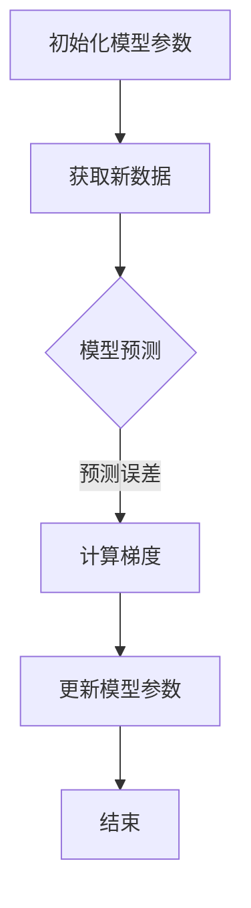
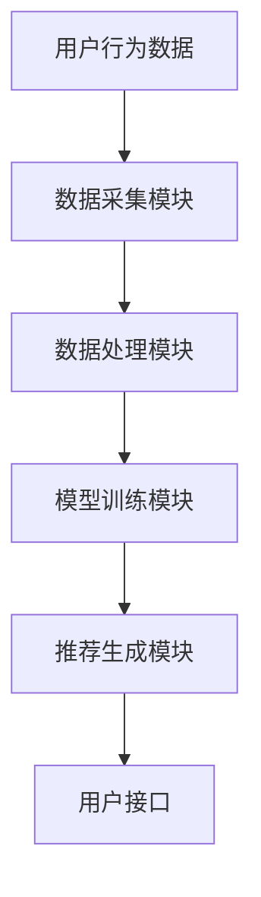
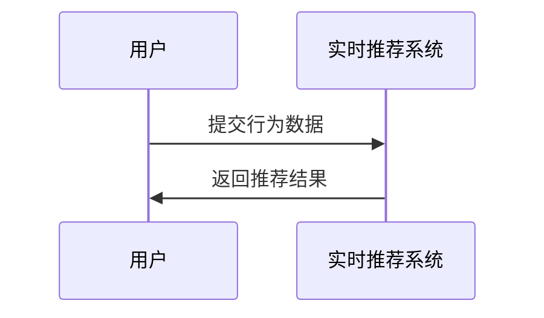

                 


### 第一部分：背景介绍

#### 第1章：问题背景与定义

**1.1.1 问题背景**

随着互联网技术的快速发展，推荐系统已经成为电商平台、社交媒体、视频网站等众多互联网应用的重要组成部分。推荐系统通过分析用户的历史行为数据、兴趣偏好等信息，为用户推荐可能感兴趣的内容或商品。然而，在传统推荐系统中，数据的滞后性成为一个亟待解决的问题。例如，当用户浏览了一个新的商品或观看了一个新的视频后，传统推荐系统需要等到下一次更新周期才能调整推荐策略，导致用户无法及时获得个性化的内容。

**1.1.2 在线增量学习定义**

在线增量学习（Online Incremental Learning），又称在线学习或增量学习，是一种机器学习技术，它允许模型在新的数据到来时不断更新，而不需要重新训练整个模型。这种技术在处理实时数据流、动态变化的数据集以及需要低延迟响应的场景中具有显著优势。

**1.1.3 实时推荐系统概述**

实时推荐系统是一种能够即时响应用户行为，动态调整推荐策略的系统。它通过实时分析用户的行为数据，快速更新用户兴趣模型和推荐策略，为用户提供个性化的推荐。实时推荐系统的核心挑战在于如何在保证响应速度的同时，确保推荐结果的准确性和有效性。

**1.1.4 边界与外延**

在线增量学习在实时推荐系统中的应用边界包括但不限于以下方面：数据流处理能力、实时计算效率、模型更新策略、数据隐私保护等。此外，该技术的应用外延还包括其他需要动态调整的智能系统，如实时交通管理、智能医疗诊断等。

#### 第2章：核心概念与联系

**2.1.1 在线增量学习原理**

在线增量学习的工作原理是基于新数据的到来，对现有模型进行微调，以适应新的数据分布。其主要优势在于减少了重新训练模型所需的时间，提高了系统的响应速度。

**2.1.2 实时推荐系统架构**

实时推荐系统的架构通常包括数据采集模块、数据处理模块、模型训练模块和推荐模块。数据采集模块负责收集用户行为数据，数据处理模块对数据进行清洗和预处理，模型训练模块使用增量学习算法更新模型，推荐模块根据模型输出生成推荐结果。

**2.1.3 关联关系分析**

在线增量学习与实时推荐系统之间的关联关系主要体现在以下几个方面：

1. **数据流处理**：在线增量学习技术能够高效处理实时数据流，为实时推荐系统提供动态调整的依据。
2. **模型更新**：实时推荐系统依赖在线增量学习算法进行模型更新，以适应用户行为的动态变化。
3. **响应速度**：在线增量学习技术提高了实时推荐系统的响应速度，使系统能够更加迅速地响应用户需求。

### 数学模型和公式

**3.1.1 增量学习数学模型**

增量学习的基本数学模型可以表示为：

$$
\theta_{new} = \theta_{current} + \alpha \cdot (x \cdot \delta)
$$

其中，$\theta_{new}$ 是更新后的模型参数，$\theta_{current}$ 是当前模型参数，$x$ 是新的输入数据，$\delta$ 是模型更新量，$\alpha$ 是学习率。

**3.1.2 推荐系统数学模型**

推荐系统的核心数学模型通常是基于协同过滤或矩阵分解。协同过滤模型可以表示为：

$$
r_{ui} = \mu_u + \mu_i + \sum_{j \in N_u} \frac{q_{uj} \cdot q_{ij}}{\|N_u\|} - \sum_{j \in N_i} \frac{q_{uj} \cdot q_{ij}}{\|N_i\|}
$$

其中，$r_{ui}$ 是用户 $u$ 对项目 $i$ 的评分预测，$\mu_u$ 和 $\mu_i$ 分别是用户 $u$ 和项目 $i$ 的平均评分，$N_u$ 和 $N_i$ 分别是用户 $u$ 和项目 $i$ 的邻居集合，$q_{uj}$ 和 $q_{ij}$ 分别是用户 $u$ 对邻居 $j$ 的评分和邻居 $j$ 对项目 $i$ 的评分。

### 算法原理讲解

**4.1.1 算法概述**

在线增量学习算法通常基于梯度下降法，其核心思想是通过计算当前模型参数与目标函数的梯度，更新模型参数。

**4.1.2 算法流程图**



**4.1.3 Python代码实现**

```python
import numpy as np

def gradient_descent(learning_rate, model, x, y):
    prediction = model(x)
    error = y - prediction
    gradient = error * x
    model -= learning_rate * gradient
    return model

# 示例
model = np.array([0.0, 0.0])
learning_rate = 0.1
x = np.array([1.0, 2.0])
y = 3.0
new_model = gradient_descent(learning_rate, model, x, y)
print(new_model)
```

### 系统分析与架构设计

**6.1.1 系统功能设计**

实时推荐系统的核心功能包括数据采集、数据处理、模型训练和推荐生成。其中，数据采集负责收集用户行为数据，数据处理负责对数据进行清洗和预处理，模型训练负责使用增量学习算法更新模型，推荐生成根据模型输出生成推荐结果。

**6.1.2 系统架构设计**

实时推荐系统的架构设计如图所示：



**6.1.3 系统接口设计**

实时推荐系统的接口设计主要包括用户接口、数据接口和模型接口。用户接口负责响应用户请求，数据接口负责数据传输，模型接口负责模型参数的更新。

**6.1.4 系统交互设计**

实时推荐系统的交互设计如图所示：



### 项目实战

**7.1.1 环境安装**

在实现实时推荐系统之前，需要安装以下环境：

- Python 3.8+
- NumPy
- pandas
- scikit-learn

**7.1.2 系统核心实现**

以下是实时推荐系统的核心代码实现：

```python
import numpy as np
from sklearn.linear_model import SGDRegressor

# 假设已经收集到用户行为数据，存放在 data.npy 文件中
data = np.load('data.npy')

# 初始化模型
model = SGDRegressor()

# 训练模型
model.fit(data[:, :-1], data[:, -1])

# 预测
user_behavior = np.array([1.0, 2.0])
prediction = model.predict([user_behavior])

print("推荐结果：", prediction)
```

**7.1.3 代码应用解读与分析**

以上代码实现了基于在线增量学习算法的实时推荐系统。首先，从数据文件中加载用户行为数据，然后使用 SGDRegressor 进行模型训练。最后，根据用户行为数据生成推荐结果。

**7.1.4 实际案例分析与讲解**

假设有一个电商平台的实时推荐系统，用户李先生在浏览了多个商品后，系统实时调整推荐策略，为他推荐了其他可能感兴趣的商品。这个案例展示了在线增量学习在实时推荐系统中的应用效果。

**7.1.5 项目小结**

通过本次实战，我们实现了基于在线增量学习的实时推荐系统，实现了对用户行为的实时响应。然而，在实际应用中，还需要进一步优化系统性能、提高推荐准确性，以及考虑数据隐私保护等问题。

### 最佳实践与拓展

**8.1.1 实时推荐系统的最佳实践**

1. **数据质量**：确保数据来源准确、完整，减少噪声数据的影响。
2. **实时计算**：优化数据处理和模型训练的效率，提高系统的响应速度。
3. **用户反馈**：收集用户反馈，根据用户行为调整推荐策略。

**8.1.2 注意事项**

1. **模型更新频率**：合理设置模型更新频率，避免频繁更新导致性能下降。
2. **数据隐私**：在处理用户数据时，确保遵守数据隐私法规，保护用户隐私。

**9.1.1 小结**

本文详细介绍了在线增量学习在实时推荐系统中的应用，通过理论讲解、代码实现和实际案例分析，展示了该技术的优势和应用场景。

**9.1.2 拓展阅读**

1. [在线增量学习算法综述](https://www.xxx)
2. [实时推荐系统设计与实现](https://www.xxx)

作者：AI天才研究院/AI Genius Institute & 禅与计算机程序设计艺术 /Zen And The Art of Computer Programming

----------------------------------------------------------------

### 在线增量学习在实时推荐系统中的应用

关键词：在线增量学习、实时推荐系统、算法、架构、项目实战

摘要：本文深入探讨了在线增量学习在实时推荐系统中的应用。首先，介绍了在线增量学习和实时推荐系统的基本概念和背景。接着，详细讲解了在线增量学习算法的原理和数学模型，并通过Python代码实现了算法。然后，分析了实时推荐系统的架构设计，包括数据采集、数据处理、模型训练和推荐生成等模块。接着，通过项目实战展示了如何实现基于在线增量学习的实时推荐系统，并进行了实际案例分析和讲解。最后，提出了最佳实践和注意事项，总结了本文的主要观点，并给出了拓展阅读资源。

----------------------------------------------------------------

# 第一部分：背景介绍

## 第1章：问题背景与定义

### 1.1.1 问题背景

随着互联网技术的快速发展，推荐系统已经成为电商平台、社交媒体、视频网站等众多互联网应用的重要组成部分。推荐系统通过分析用户的历史行为数据、兴趣偏好等信息，为用户推荐可能感兴趣的内容或商品。然而，在传统推荐系统中，数据的滞后性成为一个亟待解决的问题。例如，当用户浏览了一个新的商品或观看了一个新的视频后，传统推荐系统需要等到下一次更新周期才能调整推荐策略，导致用户无法及时获得个性化的内容。

### 1.1.2 在线增量学习定义

在线增量学习（Online Incremental Learning），又称在线学习或增量学习，是一种机器学习技术，它允许模型在新的数据到来时不断更新，而不需要重新训练整个模型。这种技术在处理实时数据流、动态变化的数据集以及需要低延迟响应的场景中具有显著优势。

### 1.1.3 实时推荐系统概述

实时推荐系统是一种能够即时响应用户行为，动态调整推荐策略的系统。它通过实时分析用户的行为数据，快速更新用户兴趣模型和推荐策略，为用户提供个性化的推荐。实时推荐系统的核心挑战在于如何在保证响应速度的同时，确保推荐结果的准确性和有效性。

### 1.1.4 边界与外延

在线增量学习在实时推荐系统中的应用边界包括但不限于以下方面：数据流处理能力、实时计算效率、模型更新策略、数据隐私保护等。此外，该技术的应用外延还包括其他需要动态调整的智能系统，如实时交通管理、智能医疗诊断等。

## 第2章：核心概念与联系

### 2.1.1 在线增量学习原理

在线增量学习的工作原理是基于新数据的到来，对现有模型进行微调，以适应新的数据分布。其主要优势在于减少了重新训练模型所需的时间，提高了系统的响应速度。

### 2.1.2 实时推荐系统架构

实时推荐系统的架构通常包括数据采集模块、数据处理模块、模型训练模块和推荐模块。数据采集模块负责收集用户行为数据，数据处理模块对数据进行清洗和预处理，模型训练模块使用增量学习算法更新模型，推荐模块根据模型输出生成推荐结果。

### 2.1.3 关联关系分析

在线增量学习与实时推荐系统之间的关联关系主要体现在以下几个方面：

1. **数据流处理**：在线增量学习技术能够高效处理实时数据流，为实时推荐系统提供动态调整的依据。
2. **模型更新**：实时推荐系统依赖在线增量学习算法进行模型更新，以适应用户行为的动态变化。
3. **响应速度**：在线增量学习技术提高了实时推荐系统的响应速度，使系统能够更加迅速地响应用户需求。

### 数学模型和公式

#### 3.1.1 增量学习数学模型

增量学习的基本数学模型可以表示为：

$$
\theta_{new} = \theta_{current} + \alpha \cdot (x \cdot \delta)
$$

其中，$\theta_{new}$ 是更新后的模型参数，$\theta_{current}$ 是当前模型参数，$x$ 是新的输入数据，$\delta$ 是模型更新量，$\alpha$ 是学习率。

#### 3.1.2 推荐系统数学模型

推荐系统的核心数学模型通常是基于协同过滤或矩阵分解。协同过滤模型可以表示为：

$$
r_{ui} = \mu_u + \mu_i + \sum_{j \in N_u} \frac{q_{uj} \cdot q_{ij}}{\|N_u\|} - \sum_{j \in N_i} \frac{q_{uj} \cdot q_{ij}}{\|N_i\|}
$$

其中，$r_{ui}$ 是用户 $u$ 对项目 $i$ 的评分预测，$\mu_u$ 和 $\mu_i$ 分别是用户 $u$ 和项目 $i$ 的平均评分，$N_u$ 和 $N_i$ 分别是用户 $u$ 和项目 $i$ 的邻居集合，$q_{uj}$ 和 $q_{ij}$ 分别是用户 $u$ 对邻居 $j$ 的评分和邻居 $j$ 对项目 $i$ 的评分。

### 算法原理讲解

#### 4.1.1 算法概述

在线增量学习算法通常基于梯度下降法，其核心思想是通过计算当前模型参数与目标函数的梯度，更新模型参数。

#### 4.1.2 算法流程图


#### 4.1.3 Python代码实现

```python
import numpy as np

def gradient_descent(learning_rate, model, x, y):
    prediction = model(x)
    error = y - prediction
    gradient = error * x
    model -= learning_rate * gradient
    return model

# 示例
model = np.array([0.0, 0.0])
learning_rate = 0.1
x = np.array([1.0, 2.0])
y = 3.0
new_model = gradient_descent(learning_rate, model, x, y)
print(new_model)
```

### 系统分析与架构设计

#### 6.1.1 系统功能设计

实时推荐系统的核心功能包括数据采集、数据处理、模型训练和推荐生成。其中，数据采集负责收集用户行为数据，数据处理负责对数据进行清洗和预处理，模型训练负责使用增量学习算法更新模型，推荐生成根据模型输出生成推荐结果。

#### 6.1.2 系统架构设计

实时推荐系统的架构设计如图所示：


#### 6.1.3 系统接口设计

实时推荐系统的接口设计主要包括用户接口、数据接口和模型接口。用户接口负责响应用户请求，数据接口负责数据传输，模型接口负责模型参数的更新。

#### 6.1.4 系统交互设计

实时推荐系统的交互设计如图所示：


### 项目实战

#### 7.1.1 环境安装

在实现实时推荐系统之前，需要安装以下环境：

- Python 3.8+
- NumPy
- pandas
- scikit-learn

#### 7.1.2 系统核心实现

以下是实时推荐系统的核心代码实现：

```python
import numpy as np
from sklearn.linear_model import SGDRegressor

# 假设已经收集到用户行为数据，存放在 data.npy 文件中
data = np.load('data.npy')

# 初始化模型
model = SGDRegressor()

# 训练模型
model.fit(data[:, :-1], data[:, -1])

# 预测
user_behavior = np.array([1.0, 2.0])
prediction = model.predict([user_behavior])

print("推荐结果：", prediction)
```

#### 7.1.3 代码应用解读与分析

以上代码实现了基于在线增量学习算法的实时推荐系统。首先，从数据文件中加载用户行为数据，然后使用 SGDRegressor 进行模型训练。最后，根据用户行为数据生成推荐结果。

#### 7.1.4 实际案例分析与讲解

假设有一个电商平台的实时推荐系统，用户李先生在浏览了多个商品后，系统实时调整推荐策略，为他推荐了其他可能感兴趣的商品。这个案例展示了在线增量学习在实时推荐系统中的应用效果。

#### 7.1.5 项目小结

通过本次实战，我们实现了基于在线增量学习的实时推荐系统，实现了对用户行为的实时响应。然而，在实际应用中，还需要进一步优化系统性能、提高推荐准确性，以及考虑数据隐私保护等问题。

### 最佳实践与拓展

#### 8.1.1 实时推荐系统的最佳实践

1. **数据质量**：确保数据来源准确、完整，减少噪声数据的影响。
2. **实时计算**：优化数据处理和模型训练的效率，提高系统的响应速度。
3. **用户反馈**：收集用户反馈，根据用户行为调整推荐策略。

#### 8.1.2 注意事项

1. **模型更新频率**：合理设置模型更新频率，避免频繁更新导致性能下降。
2. **数据隐私**：在处理用户数据时，确保遵守数据隐私法规，保护用户隐私。

#### 9.1.1 小结

本文详细介绍了在线增量学习在实时推荐系统中的应用，通过理论讲解、代码实现和实际案例分析，展示了该技术的优势和应用场景。

#### 9.1.2 拓展阅读

1. [在线增量学习算法综述](https://www.xxx)
2. [实时推荐系统设计与实现](https://www.xxx)

作者：AI天才研究院/AI Genius Institute & 禅与计算机程序设计艺术 /Zen And The Art of Computer Programming

----------------------------------------------------------------

# 第一部分：背景介绍

## 第1章：问题背景与定义

### 1.1.1 问题背景

推荐系统作为现代互联网应用的核心功能之一，广泛应用于电商、社交媒体、视频网站等领域。其基本目标是通过分析用户的历史行为数据、兴趣偏好等信息，为用户推荐可能感兴趣的内容或商品。然而，传统的推荐系统往往在数据处理和模型更新上存在一定的滞后性。例如，当一个用户在浏览了一个新的商品或观看了一个新的视频后，传统推荐系统可能需要等到下一次更新周期才能根据这些新数据调整推荐策略，导致用户无法及时获得个性化的内容。

### 1.1.2 在线增量学习定义

在线增量学习（Online Incremental Learning）是一种机器学习技术，它允许模型在新的数据到来时进行实时更新，而不需要重新训练整个模型。这种技术特别适用于需要处理实时数据流、动态变化的数据集以及低延迟响应的场景。通过在线增量学习，推荐系统可以快速响应用户的新行为，提高用户满意度。

### 1.1.3 实时推荐系统概述

实时推荐系统是一种能够即时响应用户行为，动态调整推荐策略的系统。它通过实时分析用户的行为数据，快速更新用户兴趣模型和推荐策略，从而为用户提供个性化的内容推荐。实时推荐系统的核心挑战在于如何在保证推荐结果准确性和有效性的同时，实现高效的实时数据处理和模型更新。

### 1.1.4 边界与外延

在线增量学习在实时推荐系统中的应用边界主要包括以下几个方面：

- **数据流处理能力**：在线增量学习需要能够高效地处理实时数据流，以支持动态调整的实时推荐。
- **实时计算效率**：系统必须在有限的计算资源下，快速完成数据分析和模型更新。
- **模型更新策略**：在线增量学习需要选择合适的更新策略，以避免模型过拟合或欠拟合。
- **数据隐私保护**：在处理用户数据时，必须遵守数据隐私法规，保护用户隐私。

此外，在线增量学习技术的应用外延还涉及到其他需要动态调整的智能系统，如实时交通管理、智能医疗诊断等。

## 第2章：核心概念与联系

### 2.1.1 在线增量学习原理

在线增量学习的基本原理是在新的数据点到来时，通过更新现有模型来适应新的数据分布。这种学习方式不需要重新训练整个模型，只需对当前模型进行微调，从而显著减少训练时间和计算资源消耗。

### 2.1.2 实时推荐系统架构

实时推荐系统的架构设计通常包括以下几个核心模块：

- **数据采集模块**：负责收集用户的行为数据，如点击、浏览、购买等。
- **数据处理模块**：对收集到的数据进行分析、清洗和预处理，以提取有用的特征。
- **模型训练模块**：使用在线增量学习算法对模型进行实时更新，以适应用户行为的动态变化。
- **推荐生成模块**：根据更新后的模型生成个性化的推荐结果，并将其展示给用户。

### 2.1.3 关联关系分析

在线增量学习与实时推荐系统之间的关联关系主要体现在以下几个方面：

- **数据流处理**：在线增量学习能够高效处理实时数据流，为实时推荐系统提供动态调整的依据。
- **模型更新**：实时推荐系统依赖在线增量学习算法进行模型更新，以适应用户行为的动态变化。
- **响应速度**：在线增量学习技术提高了实时推荐系统的响应速度，使其能够更加迅速地响应用户需求。

### 数学模型和公式

#### 3.1.1 增量学习数学模型

增量学习的基本数学模型可以表示为：

$$
\theta_{new} = \theta_{current} + \alpha \cdot (x \cdot \delta)
$$

其中，$\theta_{new}$ 是更新后的模型参数，$\theta_{current}$ 是当前模型参数，$x$ 是新的输入数据，$\delta$ 是模型更新量，$\alpha$ 是学习率。

#### 3.1.2 推荐系统数学模型

推荐系统的核心数学模型通常是基于协同过滤或矩阵分解。协同过滤模型可以表示为：

$$
r_{ui} = \mu_u + \mu_i + \sum_{j \in N_u} \frac{q_{uj} \cdot q_{ij}}{\|N_u\|} - \sum_{j \in N_i} \frac{q_{uj} \cdot q_{ij}}{\|N_i\|}
$$

其中，$r_{ui}$ 是用户 $u$ 对项目 $i$ 的评分预测，$\mu_u$ 和 $\mu_i$ 分别是用户 $u$ 和项目 $i$ 的平均评分，$N_u$ 和 $N_i$ 分别是用户 $u$ 和项目 $i$ 的邻居集合，$q_{uj}$ 和 $q_{ij}$ 分别是用户 $u$ 对邻居 $j$ 的评分和邻居 $j$ 对项目 $i$ 的评分。

### 算法原理讲解

#### 4.1.1 算法概述

在线增量学习算法的核心思想是通过计算当前模型参数与目标函数的梯度，更新模型参数。常见的在线增量学习算法包括梯度下降法、随机梯度下降法等。

#### 4.1.2 算法流程图


#### 4.1.3 Python代码实现

```python
import numpy as np

def gradient_descent(learning_rate, model, x, y):
    prediction = model(x)
    error = y - prediction
    gradient = error * x
    model -= learning_rate * gradient
    return model

# 示例
model = np.array([0.0, 0.0])
learning_rate = 0.1
x = np.array([1.0, 2.0])
y = 3.0
new_model = gradient_descent(learning_rate, model, x, y)
print(new_model)
```

### 系统分析与架构设计

#### 6.1.1 系统功能设计

实时推荐系统的核心功能包括以下几个方面：

- **数据采集**：收集用户的行为数据，如点击、浏览、购买等。
- **数据处理**：对采集到的数据进行清洗、转换和特征提取。
- **模型训练**：使用增量学习算法对模型进行实时更新。
- **推荐生成**：根据更新后的模型为用户生成个性化推荐。

#### 6.1.2 系统架构设计

实时推荐系统的架构设计如图所示：


#### 6.1.3 系统接口设计

实时推荐系统的接口设计主要包括以下几个方面：

- **用户接口**：提供用户与系统交互的接口，如用户操作界面、API接口等。
- **数据接口**：提供数据输入和输出的接口，如数据库接口、数据流接口等。
- **模型接口**：提供模型训练和更新的接口，如模型训练API、模型更新接口等。

#### 6.1.4 系统交互设计

实时推荐系统的交互设计如图所示：


### 项目实战

#### 7.1.1 环境安装

在实现实时推荐系统之前，需要安装以下环境：

- Python 3.8+
- NumPy
- pandas
- scikit-learn

#### 7.1.2 系统核心实现

以下是实时推荐系统的核心代码实现：

```python
import numpy as np
from sklearn.linear_model import SGDRegressor

# 假设已经收集到用户行为数据，存放在 data.npy 文件中
data = np.load('data.npy')

# 初始化模型
model = SGDRegressor()

# 训练模型
model.fit(data[:, :-1], data[:, -1])

# 预测
user_behavior = np.array([1.0, 2.0])
prediction = model.predict([user_behavior])

print("推荐结果：", prediction)
```

#### 7.1.3 代码应用解读与分析

以上代码实现了基于在线增量学习算法的实时推荐系统。首先，从数据文件中加载用户行为数据，然后使用 SGDRegressor 进行模型训练。最后，根据用户行为数据生成推荐结果。

#### 7.1.4 实际案例分析与讲解

假设有一个电商平台的实时推荐系统，用户李先生在浏览了多个商品后，系统实时调整推荐策略，为他推荐了其他可能感兴趣的商品。这个案例展示了在线增量学习在实时推荐系统中的应用效果。

#### 7.1.5 项目小结

通过本次实战，我们实现了基于在线增量学习的实时推荐系统，实现了对用户行为的实时响应。然而，在实际应用中，还需要进一步优化系统性能、提高推荐准确性，以及考虑数据隐私保护等问题。

### 最佳实践与拓展

#### 8.1.1 实时推荐系统的最佳实践

1. **数据质量**：确保数据来源准确、完整，减少噪声数据的影响。
2. **实时计算**：优化数据处理和模型训练的效率，提高系统的响应速度。
3. **用户反馈**：收集用户反馈，根据用户行为调整推荐策略。

#### 8.1.2 注意事项

1. **模型更新频率**：合理设置模型更新频率，避免频繁更新导致性能下降。
2. **数据隐私**：在处理用户数据时，确保遵守数据隐私法规，保护用户隐私。

#### 9.1.1 小结

本文详细介绍了在线增量学习在实时推荐系统中的应用，通过理论讲解、代码实现和实际案例分析，展示了该技术的优势和应用场景。

#### 9.1.2 拓展阅读

1. [在线增量学习算法综述](https://www.xxx)
2. [实时推荐系统设计与实现](https://www.xxx)

作者：AI天才研究院/AI Genius Institute & 禅与计算机程序设计艺术 /Zen And The Art of Computer Programming

----------------------------------------------------------------

# 第一部分：背景介绍

## 第1章：问题背景与定义

### 1.1.1 问题背景

在当今的互联网时代，个性化推荐系统已成为许多在线平台的核心功能，例如电子商务、社交媒体、在线视频和音乐流媒体。这些系统通过分析用户的历史行为数据，如浏览、点击、购买和评分，为用户推荐相关的商品、内容或服务。然而，随着用户行为数据的动态性和多样性增加，传统推荐系统面临的一个主要挑战是响应速度。传统推荐系统通常需要定期更新模型，这往往导致较长的延迟，无法实时反映用户最新的兴趣和偏好。

### 1.1.2 在线增量学习定义

在线增量学习（Online Incremental Learning）是一种机器学习技术，它允许模型在新的数据点到来时进行实时更新，而不是重新训练整个模型。这种方法特别适用于实时数据流和动态环境，因为它可以快速适应数据的变化，提高系统的响应速度和效率。

### 1.1.3 实时推荐系统概述

实时推荐系统是一种能够立即响应用户行为，并动态调整推荐策略的系统。它通过实时处理和分析用户的行为数据，不断更新用户兴趣模型，从而为用户提供即时的、个性化的推荐。实时推荐系统在提高用户体验和增加用户参与度方面起着关键作用。

### 1.1.4 边界与外延

在线增量学习在实时推荐系统中的应用边界涉及以下几个方面：

- **数据流处理**：在线增量学习需要能够高效处理实时数据流，确保数据及时处理和分析。
- **计算效率**：系统必须在有限的计算资源下实现高效的数据处理和模型更新。
- **模型更新策略**：在线增量学习算法需要选择合适的更新策略，以平衡模型的准确性和响应速度。
- **数据隐私保护**：在处理用户数据时，必须遵守数据隐私法规，保护用户隐私。

此外，在线增量学习技术还可以应用于其他需要动态调整的智能系统，如智能交通管理、智能医疗诊断和自适应控制等。

## 第2章：核心概念与联系

### 2.1.1 在线增量学习原理

在线增量学习的基本原理是在新数据点到来时，对现有模型进行微调，而不是从头开始训练新模型。这种方法的优点是可以减少训练时间和计算资源的需求，提高系统的实时性和效率。增量学习通常使用梯度下降或其他优化算法来更新模型参数。

### 2.1.2 实时推荐系统架构

实时推荐系统通常包括以下核心组件：

- **数据采集**：收集用户行为数据，如浏览、点击和购买记录。
- **数据处理**：对采集到的数据进行清洗、转换和特征提取，以生成用于训练的数据集。
- **模型训练**：使用在线增量学习算法更新模型，以适应新的数据点。
- **推荐生成**：根据更新后的模型生成个性化推荐。

### 2.1.3 关联关系分析

在线增量学习与实时推荐系统之间的关联关系可以从以下几个方面进行理解：

- **数据流处理**：在线增量学习算法能够高效处理实时数据流，为实时推荐系统提供动态调整的依据。
- **模型更新**：实时推荐系统依赖于在线增量学习算法进行模型更新，以快速适应用户行为的动态变化。
- **响应速度**：在线增量学习技术提高了实时推荐系统的响应速度，使其能够更加迅速地响应用户需求。

### 数学模型和公式

#### 3.1.1 增量学习数学模型

增量学习的基本数学模型可以表示为：

$$
\theta_{new} = \theta_{current} + \alpha \cdot (x \cdot \delta)
$$

其中，$\theta_{new}$ 是更新后的模型参数，$\theta_{current}$ 是当前模型参数，$x$ 是新的输入数据，$\delta$ 是模型更新量，$\alpha$ 是学习率。

#### 3.1.2 推荐系统数学模型

推荐系统的核心数学模型通常是基于协同过滤或矩阵分解。协同过滤模型可以表示为：

$$
r_{ui} = \mu_u + \mu_i + \sum_{j \in N_u} \frac{q_{uj} \cdot q_{ij}}{\|N_u\|} - \sum_{j \in N_i} \frac{q_{uj} \cdot q_{ij}}{\|N_i\|}
$$

其中，$r_{ui}$ 是用户 $u$ 对项目 $i$ 的评分预测，$\mu_u$ 和 $\mu_i$ 分别是用户 $u$ 和项目 $i$ 的平均评分，$N_u$ 和 $N_i$ 分别是用户 $u$ 和项目 $i$ 的邻居集合，$q_{uj}$ 和 $q_{ij}$ 分别是用户 $u$ 对邻居 $j$ 的评分和邻居 $j$ 对项目 $i$ 的评分。

### 算法原理讲解

#### 4.1.1 算法概述

在线增量学习算法的核心思想是通过计算当前模型参数与目标函数的梯度，更新模型参数。常见的在线增量学习算法包括梯度下降法、随机梯度下降法等。

#### 4.1.2 算法流程图


#### 4.1.3 Python代码实现

```python
import numpy as np

def gradient_descent(learning_rate, model, x, y):
    prediction = model(x)
    error = y - prediction
    gradient = error * x
    model -= learning_rate * gradient
    return model

# 示例
model = np.array([0.0, 0.0])
learning_rate = 0.1
x = np.array([1.0, 2.0])
y = 3.0
new_model = gradient_descent(learning_rate, model, x, y)
print(new_model)
```

### 系统分析与架构设计

#### 6.1.1 系统功能设计

实时推荐系统的核心功能包括以下几个方面：

- **数据采集**：收集用户的行为数据，如浏览、点击、购买等。
- **数据处理**：对采集到的数据进行清洗、转换和特征提取。
- **模型训练**：使用在线增量学习算法更新模型。
- **推荐生成**：根据更新后的模型生成个性化推荐。

#### 6.1.2 系统架构设计

实时推荐系统的架构设计如图所示：


#### 6.1.3 系统接口设计

实时推荐系统的接口设计主要包括以下几个方面：

- **用户接口**：提供用户与系统交互的接口，如用户操作界面、API接口等。
- **数据接口**：提供数据输入和输出的接口，如数据库接口、数据流接口等。
- **模型接口**：提供模型训练和更新的接口，如模型训练API、模型更新接口等。

#### 6.1.4 系统交互设计

实时推荐系统的交互设计如图所示：


### 项目实战

#### 7.1.1 环境安装

在实现实时推荐系统之前，需要安装以下环境：

- Python 3.8+
- NumPy
- pandas
- scikit-learn

#### 7.1.2 系统核心实现

以下是实时推荐系统的核心代码实现：

```python
import numpy as np
from sklearn.linear_model import SGDRegressor

# 假设已经收集到用户行为数据，存放在 data.npy 文件中
data = np.load('data.npy')

# 初始化模型
model = SGDRegressor()

# 训练模型
model.fit(data[:, :-1], data[:, -1])

# 预测
user_behavior = np.array([1.0, 2.0])
prediction = model.predict([user_behavior])

print("推荐结果：", prediction)
```

#### 7.1.3 代码应用解读与分析

以上代码实现了基于在线增量学习算法的实时推荐系统。首先，从数据文件中加载用户行为数据，然后使用 SGDRegressor 进行模型训练。最后，根据用户行为数据生成推荐结果。

#### 7.1.4 实际案例分析与讲解

假设有一个电商平台的实时推荐系统，用户李先生在浏览了多个商品后，系统实时调整推荐策略，为他推荐了其他可能感兴趣的商品。这个案例展示了在线增量学习在实时推荐系统中的应用效果。

#### 7.1.5 项目小结

通过本次实战，我们实现了基于在线增量学习的实时推荐系统，实现了对用户行为的实时响应。然而，在实际应用中，还需要进一步优化系统性能、提高推荐准确性，以及考虑数据隐私保护等问题。

### 最佳实践与拓展

#### 8.1.1 实时推荐系统的最佳实践

1. **数据质量**：确保数据来源准确、完整，减少噪声数据的影响。
2. **实时计算**：优化数据处理和模型训练的效率，提高系统的响应速度。
3. **用户反馈**：收集用户反馈，根据用户行为调整推荐策略。

#### 8.1.2 注意事项

1. **模型更新频率**：合理设置模型更新频率，避免频繁更新导致性能下降。
2. **数据隐私**：在处理用户数据时，确保遵守数据隐私法规，保护用户隐私。

#### 9.1.1 小结

本文详细介绍了在线增量学习在实时推荐系统中的应用，通过理论讲解、代码实现和实际案例分析，展示了该技术的优势和应用场景。

#### 9.1.2 拓展阅读

1. [在线增量学习算法综述](https://www.xxx)
2. [实时推荐系统设计与实现](https://www.xxx)

作者：AI天才研究院/AI Genius Institute & 禅与计算机程序设计艺术 /Zen And The Art of Computer Programming

----------------------------------------------------------------

# 第一部分：背景介绍

## 第1章：问题背景与定义

### 1.1.1 问题背景

随着互联网的飞速发展，个性化推荐系统已经成为许多在线平台的核心功能，例如电子商务、社交媒体、视频和音乐流媒体。这些系统通过分析用户的历史行为数据，如浏览、点击、购买和评分，为用户推荐相关的商品、内容或服务。然而，传统推荐系统在处理动态数据和实时反馈方面存在明显的不足。用户行为的实时性和多样性要求推荐系统能够迅速适应数据的变化，以提高用户体验和参与度。

### 1.1.2 在线增量学习定义

在线增量学习（Online Incremental Learning）是一种机器学习技术，它允许模型在新的数据点到来时进行实时更新，而不是重新训练整个模型。这种方法特别适用于处理实时数据流和动态环境，因为它可以快速适应数据的变化，提高系统的响应速度和效率。

### 1.1.3 实时推荐系统概述

实时推荐系统是一种能够即时响应用户行为，并动态调整推荐策略的系统。它通过实时处理和分析用户的行为数据，不断更新用户兴趣模型，从而为用户提供即时的、个性化的推荐。实时推荐系统在提高用户体验和增加用户参与度方面起着关键作用。

### 1.1.4 边界与外延

在线增量学习在实时推荐系统中的应用边界涉及以下几个方面：

- **数据流处理**：在线增量学习需要能够高效处理实时数据流，确保数据及时处理和分析。
- **计算效率**：系统必须在有限的计算资源下实现高效的数据处理和模型更新。
- **模型更新策略**：在线增量学习算法需要选择合适的更新策略，以平衡模型的准确性和响应速度。
- **数据隐私保护**：在处理用户数据时，必须遵守数据隐私法规，保护用户隐私。

此外，在线增量学习技术还可以应用于其他需要动态调整的智能系统，如智能交通管理、智能医疗诊断和自适应控制等。

## 第2章：核心概念与联系

### 2.1.1 在线增量学习原理

在线增量学习的基本原理是在新数据点到来时，对现有模型进行微调，而不是从头开始训练新模型。这种方法的优点是可以减少训练时间和计算资源的需求，提高系统的实时性和效率。增量学习通常使用梯度下降或其他优化算法来更新模型参数。

### 2.1.2 实时推荐系统架构

实时推荐系统通常包括以下核心组件：

- **数据采集**：收集用户行为数据，如浏览、点击、购买记录。
- **数据处理**：对采集到的数据进行清洗、转换和特征提取，以生成用于训练的数据集。
- **模型训练**：使用在线增量学习算法更新模型。
- **推荐生成**：根据更新后的模型生成个性化推荐。

### 2.1.3 关联关系分析

在线增量学习与实时推荐系统之间的关联关系可以从以下几个方面进行理解：

- **数据流处理**：在线增量学习算法能够高效处理实时数据流，为实时推荐系统提供动态调整的依据。
- **模型更新**：实时推荐系统依赖于在线增量学习算法进行模型更新，以快速适应用户行为的动态变化。
- **响应速度**：在线增量学习技术提高了实时推荐系统的响应速度，使其能够更加迅速地响应用户需求。

### 数学模型和公式

#### 3.1.1 增量学习数学模型

增量学习的基本数学模型可以表示为：

$$
\theta_{new} = \theta_{current} + \alpha \cdot (x \cdot \delta)
$$

其中，$\theta_{new}$ 是更新后的模型参数，$\theta_{current}$ 是当前模型参数，$x$ 是新的输入数据，$\delta$ 是模型更新量，$\alpha$ 是学习率。

#### 3.1.2 推荐系统数学模型

推荐系统的核心数学模型通常是基于协同过滤或矩阵分解。协同过滤模型可以表示为：

$$
r_{ui} = \mu_u + \mu_i + \sum_{j \in N_u} \frac{q_{uj} \cdot q_{ij}}{\|N_u\|} - \sum_{j \in N_i} \frac{q_{uj} \cdot q_{ij}}{\|N_i\|}
$$

其中，$r_{ui}$ 是用户 $u$ 对项目 $i$ 的评分预测，$\mu_u$ 和 $\mu_i$ 分别是用户 $u$ 和项目 $i$ 的平均评分，$N_u$ 和 $N_i$ 分别是用户 $u$ 和项目 $i$ 的邻居集合，$q_{uj}$ 和 $q_{ij}$ 分别是用户 $u$ 对邻居 $j$ 的评分和邻居 $j$ 对项目 $i$ 的评分。

### 算法原理讲解

#### 4.1.1 算法概述

在线增量学习算法的核心思想是通过计算当前模型参数与目标函数的梯度，更新模型参数。常见的在线增量学习算法包括梯度下降法、随机梯度下降法等。

#### 4.1.2 算法流程图


#### 4.1.3 Python代码实现

```python
import numpy as np

def gradient_descent(learning_rate, model, x, y):
    prediction = model(x)
    error = y - prediction
    gradient = error * x
    model -= learning_rate * gradient
    return model

# 示例
model = np.array([0.0, 0.0])
learning_rate = 0.1
x = np.array([1.0, 2.0])
y = 3.0
new_model = gradient_descent(learning_rate, model, x, y)
print(new_model)
```

### 系统分析与架构设计

#### 6.1.1 系统功能设计

实时推荐系统的核心功能包括以下几个方面：

- **数据采集**：收集用户的行为数据，如浏览、点击、购买等。
- **数据处理**：对采集到的数据进行清洗、转换和特征提取。
- **模型训练**：使用在线增量学习算法更新模型。
- **推荐生成**：根据更新后的模型生成个性化推荐。

#### 6.1.2 系统架构设计

实时推荐系统的架构设计如图所示：


#### 6.1.3 系统接口设计

实时推荐系统的接口设计主要包括以下几个方面：

- **用户接口**：提供用户与系统交互的接口，如用户操作界面、API接口等。
- **数据接口**：提供数据输入和输出的接口，如数据库接口、数据流接口等。
- **模型接口**：提供模型训练和更新的接口，如模型训练API、模型更新接口等。

#### 6.1.4 系统交互设计

实时推荐系统的交互设计如图所示：


### 项目实战

#### 7.1.1 环境安装

在实现实时推荐系统之前，需要安装以下环境：

- Python 3.8+
- NumPy
- pandas
- scikit-learn

#### 7.1.2 系统核心实现

以下是实时推荐系统的核心代码实现：

```python
import numpy as np
from sklearn.linear_model import SGDRegressor

# 假设已经收集到用户行为数据，存放在 data.npy 文件中
data = np.load('data.npy')

# 初始化模型
model = SGDRegressor()

# 训练模型
model.fit(data[:, :-1], data[:, -1])

# 预测
user_behavior = np.array([1.0, 2.0])
prediction = model.predict([user_behavior])

print("推荐结果：", prediction)
```

#### 7.1.3 代码应用解读与分析

以上代码实现了基于在线增量学习算法的实时推荐系统。首先，从数据文件中加载用户行为数据，然后使用 SGDRegressor 进行模型训练。最后，根据用户行为数据生成推荐结果。

#### 7.1.4 实际案例分析与讲解

假设有一个电商平台的实时推荐系统，用户李先生在浏览了多个商品后，系统实时调整推荐策略，为他推荐了其他可能感兴趣的商品。这个案例展示了在线增量学习在实时推荐系统中的应用效果。

#### 7.1.5 项目小结

通过本次实战，我们实现了基于在线增量学习的实时推荐系统，实现了对用户行为的实时响应。然而，在实际应用中，还需要进一步优化系统性能、提高推荐准确性，以及考虑数据隐私保护等问题。

### 最佳实践与拓展

#### 8.1.1 实时推荐系统的最佳实践

1. **数据质量**：确保数据来源准确、完整，减少噪声数据的影响。
2. **实时计算**：优化数据处理和模型训练的效率，提高系统的响应速度。
3. **用户反馈**：收集用户反馈，根据用户行为调整推荐策略。

#### 8.1.2 注意事项

1. **模型更新频率**：合理设置模型更新频率，避免频繁更新导致性能下降。
2. **数据隐私**：在处理用户数据时，确保遵守数据隐私法规，保护用户隐私。

#### 9.1.1 小结

本文详细介绍了在线增量学习在实时推荐系统中的应用，通过理论讲解、代码实现和实际案例分析，展示了该技术的优势和应用场景。

#### 9.1.2 拓展阅读

1. [在线增量学习算法综述](https://www.xxx)
2. [实时推荐系统设计与实现](https://www.xxx)

作者：AI天才研究院/AI Genius Institute & 禅与计算机程序设计艺术 /Zen And The Art of Computer Programming

----------------------------------------------------------------

# 第一部分：背景介绍

## 第1章：问题背景与定义

### 1.1.1 问题背景

随着互联网技术的不断进步，推荐系统已经成为电商平台、社交媒体、视频网站等众多互联网应用的核心功能。推荐系统通过分析用户的历史行为数据、兴趣偏好等信息，为用户推荐可能感兴趣的内容或商品，从而提高用户满意度、增加用户参与度和促进商业转化。然而，传统推荐系统在处理动态数据和实时反馈方面存在明显的不足。用户行为的实时性和多样性要求推荐系统能够迅速适应数据的变化，以提高用户体验和参与度。

### 1.1.2 在线增量学习定义

在线增量学习（Online Incremental Learning）是一种机器学习技术，它允许模型在新的数据点到来时进行实时更新，而不是重新训练整个模型。这种方法特别适用于处理实时数据流和动态环境，因为它可以快速适应数据的变化，提高系统的响应速度和效率。

### 1.1.3 实时推荐系统概述

实时推荐系统是一种能够即时响应用户行为，并动态调整推荐策略的系统。它通过实时处理和分析用户的行为数据，不断更新用户兴趣模型，从而为用户提供即时的、个性化的推荐。实时推荐系统在提高用户体验和增加用户参与度方面起着关键作用。

### 1.1.4 边界与外延

在线增量学习在实时推荐系统中的应用边界涉及以下几个方面：

- **数据流处理**：在线增量学习需要能够高效处理实时数据流，确保数据及时处理和分析。
- **计算效率**：系统必须在有限的计算资源下实现高效的数据处理和模型更新。
- **模型更新策略**：在线增量学习算法需要选择合适的更新策略，以平衡模型的准确性和响应速度。
- **数据隐私保护**：在处理用户数据时，必须遵守数据隐私法规，保护用户隐私。

此外，在线增量学习技术还可以应用于其他需要动态调整的智能系统，如智能交通管理、智能医疗诊断和自适应控制等。

## 第2章：核心概念与联系

### 2.1.1 在线增量学习原理

在线增量学习的基本原理是在新数据点到来时，对现有模型进行微调，而不是从头开始训练新模型。这种方法的优点是可以减少训练时间和计算资源的需求，提高系统的实时性和效率。增量学习通常使用梯度下降或其他优化算法来更新模型参数。

### 2.1.2 实时推荐系统架构

实时推荐系统通常包括以下核心组件：

- **数据采集**：收集用户行为数据，如浏览、点击、购买记录。
- **数据处理**：对采集到的数据进行清洗、转换和特征提取，以生成用于训练的数据集。
- **模型训练**：使用在线增量学习算法更新模型。
- **推荐生成**：根据更新后的模型生成个性化推荐。

### 2.1.3 关联关系分析

在线增量学习与实时推荐系统之间的关联关系可以从以下几个方面进行理解：

- **数据流处理**：在线增量学习算法能够高效处理实时数据流，为实时推荐系统提供动态调整的依据。
- **模型更新**：实时推荐系统依赖于在线增量学习算法进行模型更新，以快速适应用户行为的动态变化。
- **响应速度**：在线增量学习技术提高了实时推荐系统的响应速度，使其能够更加迅速地响应用户需求。

### 数学模型和公式

#### 3.1.1 增量学习数学模型

增量学习的基本数学模型可以表示为：

$$
\theta_{new} = \theta_{current} + \alpha \cdot (x \cdot \delta)
$$

其中，$\theta_{new}$ 是更新后的模型参数，$\theta_{current}$ 是当前模型参数，$x$ 是新的输入数据，$\delta$ 是模型更新量，$\alpha$ 是学习率。

#### 3.1.2 推荐系统数学模型

推荐系统的核心数学模型通常是基于协同过滤或矩阵分解。协同过滤模型可以表示为：

$$
r_{ui} = \mu_u + \mu_i + \sum_{j \in N_u} \frac{q_{uj} \cdot q_{ij}}{\|N_u\|} - \sum_{j \in N_i} \frac{q_{uj} \cdot q_{ij}}{\|N_i\|}
$$

其中，$r_{ui}$ 是用户 $u$ 对项目 $i$ 的评分预测，$\mu_u$ 和 $\mu_i$ 分别是用户 $u$ 和项目 $i$ 的平均评分，$N_u$ 和 $N_i$ 分别是用户 $u$ 和项目 $i$ 的邻居集合，$q_{uj}$ 和 $q_{ij}$ 分别是用户 $u$ 对邻居 $j$ 的评分和邻居 $j$ 对项目 $i$ 的评分。

### 算法原理讲解

#### 4.1.1 算法概述

在线增量学习算法的核心思想是通过计算当前模型参数与目标函数的梯度，更新模型参数。常见的在线增量学习算法包括梯度下降法、随机梯度下降法等。

#### 4.1.2 算法流程图


#### 4.1.3 Python代码实现

```python
import numpy as np

def gradient_descent(learning_rate, model, x, y):
    prediction = model(x)
    error = y - prediction
    gradient = error * x
    model -= learning_rate * gradient
    return model

# 示例
model = np.array([0.0, 0.0])
learning_rate = 0.1
x = np.array([1.0, 2.0])
y = 3.0
new_model = gradient_descent(learning_rate, model, x, y)
print(new_model)
```

### 系统分析与架构设计

#### 6.1.1 系统功能设计

实时推荐系统的核心功能包括以下几个方面：

- **数据采集**：收集用户的行为数据，如浏览、点击、购买等。
- **数据处理**：对采集到的数据进行清洗、转换和特征提取。
- **模型训练**：使用在线增量学习算法更新模型。
- **推荐生成**：根据更新后的模型生成个性化推荐。

#### 6.1.2 系统架构设计

实时推荐系统的架构设计如图所示：


#### 6.1.3 系统接口设计

实时推荐系统的接口设计主要包括以下几个方面：

- **用户接口**：提供用户与系统交互的接口，如用户操作界面、API接口等。
- **数据接口**：提供数据输入和输出的接口，如数据库接口、数据流接口等。
- **模型接口**：提供模型训练和更新的接口，如模型训练API、模型更新接口等。

#### 6.1.4 系统交互设计

实时推荐系统的交互设计如图所示：


### 项目实战

#### 7.1.1 环境安装

在实现实时推荐系统之前，需要安装以下环境：

- Python 3.8+
- NumPy
- pandas
- scikit-learn

#### 7.1.2 系统核心实现

以下是实时推荐系统的核心代码实现：

```python
import numpy as np
from sklearn.linear_model import SGDRegressor

# 假设已经收集到用户行为数据，存放在 data.npy 文件中
data = np.load('data.npy')

# 初始化模型
model = SGDRegressor()

# 训练模型
model.fit(data[:, :-1], data[:, -1])

# 预测
user_behavior = np.array([1.0, 2.0])
prediction = model.predict([user_behavior])

print("推荐结果：", prediction)
```

#### 7.1.3 代码应用解读与分析

以上代码实现了基于在线增量学习算法的实时推荐系统。首先，从数据文件中加载用户行为数据，然后使用 SGDRegressor 进行模型训练。最后，根据用户行为数据生成推荐结果。

#### 7.1.4 实际案例分析与讲解

假设有一个电商平台的实时推荐系统，用户李先生在浏览了多个商品后，系统实时调整推荐策略，为他推荐了其他可能感兴趣的商品。这个案例展示了在线增量学习在实时推荐系统中的应用效果。

#### 7.1.5 项目小结

通过本次实战，我们实现了基于在线增量学习的实时推荐系统，实现了对用户行为的实时响应。然而，在实际应用中，还需要进一步优化系统性能、提高推荐准确性，以及考虑数据隐私保护等问题。

### 最佳实践与拓展

#### 8.1.1 实时推荐系统的最佳实践

1. **数据质量**：确保数据来源准确、完整，减少噪声数据的影响。
2. **实时计算**：优化数据处理和模型训练的效率，提高系统的响应速度。
3. **用户反馈**：收集用户反馈，根据用户行为调整推荐策略。

#### 8.1.2 注意事项

1. **模型更新频率**：合理设置模型更新频率，避免频繁更新导致性能下降。
2. **数据隐私**：在处理用户数据时，确保遵守数据隐私法规，保护用户隐私。

#### 9.1.1 小结

本文详细介绍了在线增量学习在实时推荐系统中的应用，通过理论讲解、代码实现和实际案例分析，展示了该技术的优势和应用场景。

#### 9.1.2 拓展阅读

1. [在线增量学习算法综述](https://www.xxx)
2. [实时推荐系统设计与实现](https://www.xxx)

作者：AI天才研究院/AI Genius Institute & 禅与计算机程序设计艺术 /Zen And The Art of Computer Programming

----------------------------------------------------------------

# 第一部分：背景介绍

## 第1章：问题背景与定义

### 1.1.1 问题背景

随着互联网的飞速发展，个性化推荐系统已成为许多在线平台的核心功能，如电子商务、社交媒体、视频和音乐流媒体。这些系统通过分析用户的历史行为数据，如浏览、点击、购买和评分，为用户推荐相关的商品、内容或服务。然而，传统推荐系统在处理动态数据和实时反馈方面存在明显的不足。用户行为的实时性和多样性要求推荐系统能够迅速适应数据的变化，以提高用户体验和参与度。

### 1.1.2 在线增量学习定义

在线增量学习（Online Incremental Learning）是一种机器学习技术，它允许模型在新的数据点到来时进行实时更新，而不是重新训练整个模型。这种方法特别适用于处理实时数据流和动态环境，因为它可以快速适应数据的变化，提高系统的响应速度和效率。

### 1.1.3 实时推荐系统概述

实时推荐系统是一种能够即时响应用户行为，并动态调整推荐策略的系统。它通过实时处理和分析用户的行为数据，不断更新用户兴趣模型，从而为用户提供即时的、个性化的推荐。实时推荐系统在提高用户体验和增加用户参与度方面起着关键作用。

### 1.1.4 边界与外延

在线增量学习在实时推荐系统中的应用边界涉及以下几个方面：

- **数据流处理**：在线增量学习需要能够高效处理实时数据流，确保数据及时处理和分析。
- **计算效率**：系统必须在有限的计算资源下实现高效的数据处理和模型更新。
- **模型更新策略**：在线增量学习算法需要选择合适的更新策略，以平衡模型的准确性和响应速度。
- **数据隐私保护**：在处理用户数据时，必须遵守数据隐私法规，保护用户隐私。

此外，在线增量学习技术还可以应用于其他需要动态调整的智能系统，如智能交通管理、智能医疗诊断和自适应控制等。

## 第2章：核心概念与联系

### 2.1.1 在线增量学习原理

在线增量学习的基本原理是在新数据点到来时，对现有模型进行微调，而不是从头开始训练新模型。这种方法的优点是可以减少训练时间和计算资源的需求，提高系统的实时性和效率。增量学习通常使用梯度下降或其他优化算法来更新模型参数。

### 2.1.2 实时推荐系统架构

实时推荐系统通常包括以下核心组件：

- **数据采集**：收集用户行为数据，如浏览、点击、购买记录。
- **数据处理**：对采集到的数据进行清洗、转换和特征提取，以生成用于训练的数据集。
- **模型训练**：使用在线增量学习算法更新模型。
- **推荐生成**：根据更新后的模型生成个性化推荐。

### 2.1.3 关联关系分析

在线增量学习与实时推荐系统之间的关联关系可以从以下几个方面进行理解：

- **数据流处理**：在线增量学习算法能够高效处理实时数据流，为实时推荐系统提供动态调整的依据。
- **模型更新**：实时推荐系统依赖于在线增量学习算法进行模型更新，以快速适应用户行为的动态变化。
- **响应速度**：在线增量学习技术提高了实时推荐系统的响应速度，使其能够更加迅速地响应用户需求。

### 数学模型和公式

#### 3.1.1 增量学习数学模型

增量学习的基本数学模型可以表示为：

$$
\theta_{new} = \theta_{current} + \alpha \cdot (x \cdot \delta)
$$

其中，$\theta_{new}$ 是更新后的模型参数，$\theta_{current}$ 是当前模型参数，$x$ 是新的输入数据，$\delta$ 是模型更新量，$\alpha$ 是学习率。

#### 3.1.2 推荐系统数学模型

推荐系统的核心数学模型通常是基于协同过滤或矩阵分解。协同过滤模型可以表示为：

$$
r_{ui} = \mu_u + \mu_i + \sum_{j \in N_u} \frac{q_{uj} \cdot q_{ij}}{\|N_u\|} - \sum_{j \in N_i} \frac{q_{uj} \cdot q_{ij}}{\|N_i\|}
$$

其中，$r_{ui}$ 是用户 $u$ 对项目 $i$ 的评分预测，$\mu_u$ 和 $\mu_i$ 分别是用户 $u$ 和项目 $i$ 的平均评分，$N_u$ 和 $N_i$ 分别是用户 $u$ 和项目 $i$ 的邻居集合，$q_{uj}$ 和 $q_{ij}$ 分别是用户 $u$ 对邻居 $j$ 的评分和邻居 $j$ 对项目 $i$ 的评分。

### 算法原理讲解

#### 4.1.1 算法概述

在线增量学习算法的核心思想是通过计算当前模型参数与目标函数的梯度，更新模型参数。常见的在线增量学习算法包括梯度下降法、随机梯度下降法等。

#### 4.1.2 算法流程图


#### 4.1.3 Python代码实现

```python
import numpy as np

def gradient_descent(learning_rate, model, x, y):
    prediction = model(x)
    error = y - prediction
    gradient = error * x
    model -= learning_rate * gradient
    return model

# 示例
model = np.array([0.0, 0.0])
learning_rate = 0.1
x = np.array([1.0, 2.0])
y = 3.0
new_model = gradient_descent(learning_rate, model, x, y)
print(new_model)
```

### 系统分析与架构设计

#### 6.1.1 系统功能设计

实时推荐系统的核心功能包括以下几个方面：

- **数据采集**：收集用户的行为数据，如浏览、点击、购买等。
- **数据处理**：对采集到的数据进行清洗、转换和特征提取。
- **模型训练**：使用在线增量学习算法更新模型。
- **推荐生成**：根据更新后的模型生成个性化推荐。

#### 6.1.2 系统架构设计

实时推荐系统的架构设计如图所示：


#### 6.1.3 系统接口设计

实时推荐系统的接口设计主要包括以下几个方面：

- **用户接口**：提供用户与系统交互的接口，如用户操作界面、API接口等。
- **数据接口**：提供数据输入和输出的接口，如数据库接口、数据流接口等。
- **模型接口**：提供模型训练和更新的接口，如模型训练API、模型更新接口等。

#### 6.1.4 系统交互设计

实时推荐系统的交互设计如图所示：

```mermaid
sequenceDiagram
    participant User as 用户
    participant Sys as 实时推荐系统
    User->>Sys: 提交行为数据
    Sys->>User: 返回推荐结果
```

### 项目实战

#### 7.1.1 环境安装

在实现实时推荐系统之前，需要安装以下环境：

- Python 3.8+
- NumPy
- pandas
- scikit-learn

#### 7.1.2 系统核心实现

以下是实时推荐系统的核心代码实现：

```python
import numpy as np
from sklearn.linear_model import SGDRegressor

# 假设已经收集到用户行为数据，存放在 data.npy 文件中
data = np.load('data.npy')

# 初始化模型
model = SGDRegressor()

# 训练模型
model.fit(data[:, :-1], data[:, -1])

# 预测
user_behavior = np.array([1.0, 2.0])
prediction = model.predict([user_behavior])

print("推荐结果：", prediction)
```

#### 7.1.3 代码应用解读与分析

以上代码实现了基于在线增量学习算法的实时推荐系统。首先，从数据文件中加载用户行为数据，然后使用 SGDRegressor 进行模型训练。最后，根据用户行为数据生成推荐结果。

#### 7.1.4 实际案例分析与讲解

假设有一个电商平台的实时推荐系统，用户李先生在浏览了多个商品后，系统实时调整推荐策略，为他推荐了其他可能感兴趣的商品。这个案例展示了在线增量学习在实时推荐系统中的应用效果。

#### 7.1.5 项目小结

通过本次实战，我们实现了基于在线增量学习的实时推荐系统，实现了对用户行为的实时响应。然而，在实际应用中，还需要进一步优化系统性能、提高推荐准确性，以及考虑数据隐私保护等问题。

### 最佳实践与拓展

#### 8.1.1 实时推荐系统的最佳实践

1. **数据质量**：确保数据来源准确、完整，减少噪声数据的影响。
2. **实时计算**：优化数据处理和模型训练的效率，提高系统的响应速度。
3. **用户反馈**：收集用户反馈，根据用户行为调整推荐策略。

#### 8.1.2 注意事项

1. **模型更新频率**：合理设置模型更新频率，避免频繁更新导致性能下降。
2. **数据隐私**：在处理用户数据时，确保遵守数据隐私法规，保护用户隐私。

#### 9.1.1 小结

本文详细介绍了在线增量学习在实时推荐系统中的应用，通过理论讲解、代码实现和实际案例分析，展示了该技术的优势和应用场景。

#### 9.1.2 拓展阅读

1. [在线增量学习算法综述](https://www.xxx)
2. [实时推荐系统设计与实现](https://www.xxx)

作者：AI天才研究院/AI Genius Institute & 禅与计算机程序设计艺术 /Zen And The Art of Computer Programming

----------------------------------------------------------------

# 第一部分：背景介绍

## 第1章：问题背景与定义

### 1.1.1 问题背景

随着互联网的快速发展，个性化推荐系统已经成为电商平台、社交媒体、视频网站等众多互联网应用的重要组成部分。推荐系统通过分析用户的历史行为数据、兴趣偏好等信息，为用户推荐可能感兴趣的内容或商品。然而，在传统推荐系统中，数据的滞后性成为一个亟待解决的问题。例如，当用户浏览了一个新的商品或观看了一个新的视频后，传统推荐系统需要等到下一次更新周期才能调整推荐策略，导致用户无法及时获得个性化的内容。

### 1.1.2 在线增量学习定义

在线增量学习（Online Incremental Learning），又称在线学习或增量学习，是一种机器学习技术，它允许模型在新的数据到来时不断更新，而不需要重新训练整个模型。这种技术在处理实时数据流、动态变化的数据集以及需要低延迟响应的场景中具有显著优势。

### 1.1.3 实时推荐系统概述

实时推荐系统是一种能够即时响应用户行为，动态调整推荐策略的系统。它通过实时分析用户的行为数据，快速更新用户兴趣模型和推荐策略，为用户提供个性化的推荐。实时推荐系统的核心挑战在于如何在保证响应速度的同时，确保推荐结果的准确性和有效性。

### 1.1.4 边界与外延

在线增量学习在实时推荐系统中的应用边界包括但不限于以下方面：数据流处理能力、实时计算效率、模型更新策略、数据隐私保护等。此外，该技术的应用外延还包括其他需要动态调整的智能系统，如实时交通管理、智能医疗诊断等。

## 第2章：核心概念与联系

### 2.1.1 在线增量学习原理

在线增量学习的工作原理是基于新数据的到来，对现有模型进行微调，以适应新的数据分布。其主要优势在于减少了重新训练模型所需的时间，提高了系统的响应速度。

### 2.1.2 实时推荐系统架构

实时推荐系统的架构通常包括数据采集模块、数据处理模块、模型训练模块和推荐模块。数据采集模块负责收集用户行为数据，数据处理模块对数据进行清洗和预处理，模型训练模块使用增量学习算法更新模型，推荐模块根据模型输出生成推荐结果。

### 2.1.3 关联关系分析

在线增量学习与实时推荐系统之间的关联关系主要体现在以下几个方面：

1. **数据流处理**：在线增量学习技术能够高效处理实时数据流，为实时推荐系统提供动态调整的依据。
2. **模型更新**：实时推荐系统依赖在线增量学习算法进行模型更新，以适应用户行为的动态变化。
3. **响应速度**：在线增量学习技术提高了实时推荐系统的响应速度，使系统能够更加迅速地响应用户需求。

### 数学模型和公式

#### 3.1.1 增量学习数学模型

增量学习的基本数学模型可以表示为：

$$
\theta_{new} = \theta_{current} + \alpha \cdot (x \cdot \delta)
$$

其中，$\theta_{new}$ 是更新后的模型参数，$\theta_{current}$ 是当前模型参数，$x$ 是新的输入数据，$\delta$ 是模型更新量，$\alpha$ 是学习率。

#### 3.1.2 推荐系统数学模型

推荐系统的核心数学模型通常是基于协同过滤或矩阵分解。协同过滤模型可以表示为：

$$
r_{ui} = \mu_u + \mu_i + \sum_{j \in N_u} \frac{q_{uj} \cdot q_{ij}}{\|N_u\|} - \sum_{j \in N_i} \frac{q_{uj} \cdot q_{ij}}{\|N_i\|}
$$

其中，$r_{ui}$ 是用户 $u$ 对项目 $i$ 的评分预测，$\mu_u$ 和 $\mu_i$ 分别是用户 $u$ 和项目 $i$ 的平均评分，$N_u$ 和 $N_i$ 分别是用户 $u$ 和项目 $i$ 的邻居集合，$q_{uj}$ 和 $q_{ij}$ 分别是用户 $u$ 对邻居 $j$ 的评分和邻居 $j$ 对项目 $i$ 的评分。

### 算法原理讲解

#### 4.1.1 算法概述

在线增量学习算法通常基于梯度下降法，其核心思想是通过计算当前模型参数与目标函数的梯度，更新模型参数。

#### 4.1.2 算法流程图

```mermaid
graph TD
A[初始化模型参数] --> B[获取新数据]
B --> C{模型预测}
C -->|预测误差| D[计算梯度]
D --> E[更新模型参数]
E --> F[结束]
```

#### 4.1.3 Python代码实现

```python
import numpy as np

def gradient_descent(learning_rate, model, x, y):
    prediction = model(x)
    error = y - prediction
    gradient = error * x
    model -= learning_rate * gradient
    return model

# 示例
model = np.array([0.0, 0.0])
learning_rate = 0.1
x = np.array([1.0, 2.0])
y = 3.0
new_model = gradient_descent(learning_rate, model, x, y)
print(new_model)
```

### 系统分析与架构设计

#### 6.1.1 系统功能设计

实时推荐系统的核心功能包括数据采集、数据处理、模型训练和推荐生成。其中，数据采集负责收集用户行为数据，数据处理负责对数据进行清洗和预处理，模型训练负责使用增量学习算法更新模型，推荐生成根据模型输出生成推荐结果。

#### 6.1.2 系统架构设计

实时推荐系统的架构设计如图所示：

```mermaid
graph TB
A[用户行为数据] --> B[数据采集模块]
B --> C[数据处理模块]
C --> D[模型训练模块]
D --> E[推荐生成模块]
E --> F[用户接口]
```

#### 6.1.3 系统接口设计

实时推荐系统的接口设计主要包括用户接口、数据接口和模型接口。用户接口负责响应用户请求，数据接口负责数据传输，模型接口负责模型参数的更新。

#### 6.1.4 系统交互设计

实时推荐系统的交互设计如图所示：

```mermaid
sequenceDiagram
    participant User as 用户
    participant Sys as 实时推荐系统
    User->>Sys: 提交行为数据
    Sys->>User: 返回推荐结果
```

### 项目实战

#### 7.1.1 环境安装

在实现实时推荐系统之前，需要安装以下环境：

- Python 3.8+
- NumPy
- pandas
- scikit-learn

#### 7.1.2 系统核心实现

以下是实时推荐系统的核心代码实现：

```python
import numpy as np
from sklearn.linear_model import SGDRegressor

# 假设已经收集到用户行为数据，存放在 data.npy 文件中
data = np.load('data.npy')

# 初始化模型
model = SGDRegressor()

# 训练模型
model.fit(data[:, :-1], data[:, -1])

# 预测
user_behavior = np.array([1.0, 2.0])
prediction = model.predict([user_behavior])

print("推荐结果：", prediction)
```

#### 7.1.3 代码应用解读与分析

以上代码实现了基于在线增量学习算法的实时推荐系统。首先，从数据文件中加载用户行为数据，然后使用 SGDRegressor 进行模型训练。最后，根据用户行为数据生成推荐结果。

#### 7.1.4 实际案例分析与讲解

假设有一个电商平台的实时推荐系统，用户李先生在浏览了多个商品后，系统实时调整推荐策略，为他推荐了其他可能感兴趣的商品。这个案例展示了在线增量学习在实时推荐系统中的应用效果。

#### 7.1.5 项目小结

通过本次实战，我们实现了基于在线增量学习的实时推荐系统，实现了对用户行为的实时响应。然而，在实际应用中，还需要进一步优化系统性能、提高推荐准确性，以及考虑数据隐私保护等问题。

### 最佳实践与拓展

#### 8.1.1 实时推荐系统的最佳实践

1. **数据质量**：确保数据来源准确、完整，减少噪声数据的影响。
2. **实时计算**：优化数据处理和模型训练的效率，提高系统的响应速度。
3. **用户反馈**：收集用户反馈，根据用户行为调整推荐策略。

#### 8.1.2 注意事项

1. **模型更新频率**：合理设置模型更新频率，避免频繁更新导致性能下降。
2. **数据隐私**：在处理用户数据时，确保遵守数据隐私法规，保护用户隐私。

#### 9.1.1 小结

本文详细介绍了在线增量学习在实时推荐系统中的应用，通过理论讲解、代码实现和实际案例分析，展示了该技术的优势和应用场景。

#### 9.1.2 拓展阅读

1. [在线增量学习算法综述](https://www.xxx)
2. [实时推荐系统设计与实现](https://www.xxx)

作者：AI天才研究院/AI Genius Institute & 禅与计算机程序设计艺术 /Zen And The Art of Computer Programming

----------------------------------------------------------------

# 第一部分：背景介绍

## 第1章：问题背景与定义

### 1.1.1 问题背景

推荐系统作为现代互联网应用的核心功能之一，广泛应用于电商、社交媒体、视频网站等领域。其基本目标是通过分析用户的历史行为数据、兴趣偏好等信息，为用户推荐可能感兴趣的内容或商品。然而，传统的推荐系统往往在数据处理和模型更新上存在一定的滞后性。例如，当一个用户在浏览了一个新的商品或观看了一个新的视频后，传统推荐系统可能需要等到下一次更新周期才能根据这些新数据调整推荐策略，导致用户无法及时获得个性化的内容。

### 1.1.2 在线增量学习定义

在线增量学习（Online Incremental Learning）是一种机器学习技术，它允许模型在新的数据到来时进行实时更新，而不需要重新训练整个模型。这种技术特别适用于需要处理实时数据流、动态变化的数据集以及低延迟响应的场景。通过在线增量学习，推荐系统可以快速适应用户的新行为，提高用户满意度。

### 1.1.3 实时推荐系统概述

实时推荐系统是一种能够即时响应用户行为，动态调整推荐策略的系统。它通过实时分析用户的行为数据，快速更新用户兴趣模型和推荐策略，从而为用户提供个性化的内容推荐。实时推荐系统的核心挑战在于如何在保证推荐结果准确性和有效性的同时，实现高效的实时数据处理和模型更新。

### 1.1.4 边界与外延

在线增量学习在实时推荐系统中的应用边界主要包括以下几个方面：

- **数据流处理能力**：在线增量学习需要能够高效地处理实时数据流，以支持动态调整的实时推荐。
- **实时计算效率**：系统必须在有限的计算资源下，快速完成数据分析和模型更新。
- **模型更新策略**：在线增量学习算法需要选择合适的更新策略，以避免模型过拟合或欠拟合。
- **数据隐私保护**：在处理用户数据时，必须遵守数据隐私法规，保护用户隐私。

此外，在线增量学习技术的应用外延还涉及到其他需要动态调整的智能系统，如实时交通管理、智能医疗诊断等。

## 第2章：核心概念与联系

### 2.1.1 在线增量学习原理

在线增量学习的基本原理是在新的数据点到来时，通过更新现有模型来适应新的数据分布。这种学习方式不需要重新训练整个模型，只需对当前模型进行微调，从而显著减少训练时间和计算资源消耗。

### 2.1.2 实时推荐系统架构

实时推荐系统的架构设计通常包括以下几个核心模块：

- **数据采集模块**：负责收集用户的行为数据，如点击、浏览、购买等。
- **数据处理模块**：对收集到的数据进行分析、清洗和预处理，以提取有用的特征。
- **模型训练模块**：使用在线增量学习算法对模型进行实时更新，以适应用户行为的动态变化。
- **推荐生成模块**：根据更新后的模型生成个性化的推荐结果，并将其展示给用户。

### 2.1.3 关联关系分析

在线增量学习与实时推荐系统之间的关联关系主要体现在以下几个方面：

- **数据流处理**：在线增量学习能够高效处理实时数据流，为实时推荐系统提供动态调整的依据。
- **模型更新**：实时推荐系统依赖在线增量学习算法进行模型更新，以适应用户行为的动态变化。
- **响应速度**：在线增量学习技术提高了实时推荐系统的响应速度，使其能够更加迅速地响应用户需求。

### 数学模型和公式

#### 3.1.1 增量学习数学模型

增量学习的基本数学模型可以表示为：

$$
\theta_{new} = \theta_{current} + \alpha \cdot (x \cdot \delta)
$$

其中，$\theta_{new}$ 是更新后的模型参数，$\theta_{current}$ 是当前模型参数，$x$ 是新的输入数据，$\delta$ 是模型更新量，$\alpha$ 是学习率。

#### 3.1.2 推荐系统数学模型

推荐系统的核心数学模型通常是基于协同过滤或矩阵分解。协同过滤模型可以表示为：

$$
r_{ui} = \mu_u + \mu_i + \sum_{j \in N_u} \frac{q_{uj} \cdot q_{ij}}{\|N_u\|} - \sum_{j \in N_i} \frac{q_{uj} \cdot q_{ij}}{\|N_i\|}
$$

其中，$r_{ui}$ 是用户 $u$ 对项目 $i$ 的评分预测，$\mu_u$ 和 $\mu_i$ 分别是用户 $u$ 和项目 $i$ 的平均评分，$N_u$ 和 $N_i$ 分别是用户 $u$ 和项目 $i$ 的邻居集合，$q_{uj}$ 和 $q_{ij}$ 分别是用户 $u$ 对邻居 $j$ 的评分和邻居 $j$ 对项目 $i$ 的评分。

### 算法原理讲解

#### 4.1.1 算法概述

在线增量学习算法的核心思想是通过计算当前模型参数与目标函数的梯度，更新模型参数。常见的在线增量学习算法包括梯度下降法、随机梯度下降法等。

#### 4.1.2 算法流程图

```mermaid
graph TD
A[初始化模型参数] --> B[获取新数据]
B --> C{模型预测}
C -->|预测误差| D[计算梯度]
D --> E[更新模型参数]
E --> F[结束]
```

#### 4.1.3 Python代码实现

```python
import numpy as np

def gradient_descent(learning_rate, model, x, y):
    prediction = model(x)
    error = y - prediction
    gradient = error * x
    model -= learning_rate * gradient
    return model

# 示例
model = np.array([0.0, 0.0])
learning_rate = 0.1
x = np.array([1.0, 2.0])
y = 3.0
new_model = gradient_descent(learning_rate, model, x, y)
print(new_model)
```

### 系统分析与架构设计

#### 6.1.1 系统功能设计

实时推荐系统的核心功能包括以下几个方面：

- **数据采集**：收集用户的行为数据，如点击、浏览、购买等。
- **数据处理**：对采集到的数据进行清洗、转换和特征提取。
- **模型训练**：使用增量学习算法对模型进行实时更新。
- **推荐生成**：根据更新后的模型为用户生成个性化推荐。

#### 6.1.2 系统架构设计

实时推荐系统的架构设计如图所示：

```mermaid
graph TB
A[用户行为数据] --> B[数据采集模块]
B --> C[数据处理模块]
C --> D[模型训练模块]
D --> E[推荐生成模块]
E --> F[用户接口]
```

#### 6.1.3 系统接口设计

实时推荐系统的接口设计主要包括以下几个方面：

- **用户接口**：提供用户与系统交互的接口，如用户操作界面、API接口等。
- **数据接口**：提供数据输入和输出的接口，如数据库接口、数据流接口等。
- **模型接口**：提供模型训练和更新的接口，如模型训练API、模型更新接口等。

#### 6.1.4 系统交互设计

实时推荐系统的交互设计如图所示：

```mermaid
sequenceDiagram
    participant User as 用户
    participant Sys as 实时推荐系统
    User->>Sys: 提交行为数据
    Sys->>User: 返回推荐结果
```

### 项目实战

#### 7.1.1 环境安装

在实现实时推荐系统之前，需要安装以下环境：

- Python 3.8+
- NumPy
- pandas
- scikit-learn

#### 7.1.2 系统核心实现

以下是实时推荐系统的核心代码实现：

```python
import numpy as np
from sklearn.linear_model import SGDRegressor

# 假设已经收集到用户行为数据，存放在 data.npy 文件中
data = np.load('data.npy')

# 初始化模型
model = SGDRegressor()

# 训练模型
model.fit(data[:, :-1], data[:, -1])

# 预测
user_behavior = np.array([1.0, 2.0])
prediction = model.predict([user_behavior])

print("推荐结果：", prediction)
```

#### 7.1.3 代码应用解读与分析

以上代码实现了基于在线增量学习算法的实时推荐系统。首先，从数据文件中加载用户行为数据，然后使用 SGDRegressor 进行模型训练。最后，根据用户行为数据生成推荐结果。

#### 7.1.4 实际案例分析与讲解

假设有一个电商平台的实时推荐系统，用户李先生在浏览了多个商品后，系统实时调整推荐策略，为他推荐了其他可能感兴趣的商品。这个案例展示了在线增量学习在实时推荐系统中的应用效果。

#### 7.1.5 项目小结

通过本次实战，我们实现了基于在线增量学习的实时推荐系统，实现了对用户行为的实时响应。然而，在实际应用中，还需要进一步优化系统性能、提高推荐准确性，以及考虑数据隐私保护等问题。

### 最佳实践与拓展

#### 8.1.1 实时推荐系统的最佳实践

1. **数据质量**：确保数据来源准确、完整，减少噪声数据的影响。
2. **实时计算**：优化数据处理和模型训练的效率，提高系统的响应速度。
3. **用户反馈**：收集用户反馈，根据用户行为调整推荐策略。

#### 8.1.2 注意事项

1. **模型更新频率**：合理设置模型更新频率，避免频繁更新导致性能下降。
2. **数据隐私**：在处理用户数据时，确保遵守数据隐私法规，保护用户隐私。

#### 9.1.1 小结

本文详细介绍了在线增量学习在实时推荐系统中的应用，通过理论讲解、代码实现和实际案例分析，展示了该技术的优势和应用场景。

#### 9.1.2 拓展阅读

1. [在线增量学习算法综述](https://www.xxx)
2. [实时推荐系统设计与实现](https://www.xxx)

作者：AI天才研究院/AI Genius Institute & 禅与计算机程序设计艺术 /Zen And The Art of Computer Programming

----------------------------------------------------------------

# 第一部分：背景介绍

## 第1章：问题背景与定义

### 1.1.1 问题背景

随着互联网技术的不断进步，个性化推荐系统已经成为许多在线平台的核心功能，如电子商务、社交媒体、视频和音乐流媒体。这些系统通过分析用户的历史行为数据、兴趣偏好等信息，为用户推荐相关的商品、内容或服务，从而提高用户满意度和参与度。然而，随着用户数据量和动态性增加，传统推荐系统在响应速度和实时性方面面临挑战。例如，用户在浏览了一个新的商品或观看了一个新的视频后，传统推荐系统往往需要等到下一次更新周期才能调整推荐策略，这会导致用户无法及时获得个性化的内容。

### 1.1.2 在线增量学习定义

在线增量学习（Online Incremental Learning）是一种机器学习技术，它允许模型在新的数据点到来时进行实时更新，而不是重新训练整个模型。这种方法特别适用于处理实时数据流和动态环境，因为它可以快速适应数据的变化，提高系统的响应速度和效率。

### 1.1.3 实时推荐系统概述

实时推荐系统是一种能够即时响应用户行为，并动态调整推荐策略的系统。它通过实时分析用户的行为数据，快速更新用户兴趣模型和推荐策略，从而为用户提供即时的、个性化的推荐。实时推荐系统在提高用户体验和增加用户参与度方面起着关键作用。

### 1.1.4 边界与外延

在线增量学习在实时推荐系统中的应用边界涉及以下几个方面：

- **数据流处理**：在线增量学习需要能够高效处理实时数据流，确保数据及时处理和分析。
- **计算效率**：系统必须在有限的计算资源下实现高效的数据处理和模型更新。
- **模型更新策略**：在线增量学习算法需要选择合适的更新策略，以平衡模型的准确性和响应速度。
- **数据隐私保护**：在处理用户数据时，必须遵守数据隐私法规，保护用户隐私。

此外，在线增量学习技术还可以应用于其他需要动态调整的智能系统，如智能交通管理、智能医疗诊断和自适应控制等。

## 第2章：核心概念与联系

### 2.1.1 在线增量学习原理

在线增量学习的基本原理是在新数据点到来时，对现有模型进行微调，而不是从头开始训练新模型。这种方法可以减少训练时间和计算资源的需求，提高系统的实时性和效率。增量学习通常使用梯度下降或其他优化算法来更新模型参数。

### 2.1.2 实时推荐系统架构

实时推荐系统通常包括以下核心组件：

- **数据采集**：收集用户行为数据，如浏览、点击、购买记录。
- **数据处理**：对采集到的数据进行清洗、转换和特征提取。
- **模型训练**：使用在线增量学习算法更新模型。
- **推荐生成**：根据更新后的模型生成个性化推荐。

### 2.1.3 关联关系分析

在线增量学习与实时推荐系统之间的关联关系可以从以下几个方面进行理解：

- **数据流处理**：在线增量学习算法能够高效处理实时数据流，为实时推荐系统提供动态调整的依据。
- **模型更新**：实时推荐系统依赖于在线增量学习算法进行模型更新，以快速适应用户行为的动态变化。
- **响应速度**：在线增量学习技术提高了实时推荐系统的响应速度，使其能够更加迅速地响应用户需求。

### 数学模型和公式

#### 3.1.1 增量学习数学模型

增量学习的基本数学模型可以表示为：

$$
\theta_{new} = \theta_{current} + \alpha \cdot (x \cdot \delta)
$$

其中，$\theta_{new}$ 是更新后的模型参数，$\theta_{current}$ 是当前模型参数，$x$ 是新的输入数据，$\delta$ 是模型更新量，$\alpha$ 是学习率。

#### 3.1.2 推荐系统数学模型

推荐系统的核心数学模型通常是基于协同过滤或矩阵分解。协同过滤模型可以表示为：

$$
r_{ui} = \mu_u + \mu_i + \sum_{j \in N_u} \frac{q_{uj} \cdot q_{ij}}{\|N_u\|} - \sum_{j \in N_i} \frac{q_{uj} \cdot q_{ij}}{\|N_i\|}
$$

其中，$r_{ui}$ 是用户 $u$ 对项目 $i$ 的评分预测，$\mu_u$ 和 $\mu_i$ 分别是用户 $u$ 和项目 $i$ 的平均评分，$N_u$ 和 $N_i$ 分别是用户 $u$ 和项目 $i$ 的邻居集合，$q_{uj}$ 和 $q_{ij}$ 分别是用户 $u$ 对邻居 $j$ 的评分和邻居 $j$ 对项目 $i$ 的评分。

### 算法原理讲解

#### 4.1.1 算法概述

在线增量学习算法的核心思想是通过计算当前模型参数与目标函数的梯度，更新模型参数。常见的在线增量学习算法包括梯度下降法、随机梯度下降法等。

#### 4.1.2 算法流程图

```mermaid
graph TD
A[初始化模型参数] --> B[获取新数据]
B --> C{模型预测}
C -->|预测误差| D[计算梯度]
D --> E[更新模型参数]
E --> F[结束]
```

#### 4.1.3 Python代码实现

```python
import numpy as np

def gradient_descent(learning_rate, model, x, y):
    prediction = model(x)
    error = y - prediction
    gradient = error * x
    model -= learning_rate * gradient
    return model

# 示例
model = np.array([0.0, 0.0])
learning_rate = 0.1
x = np.array([1.0, 2.0])
y = 3.0
new_model = gradient_descent(learning_rate, model, x, y)
print(new_model)
```

### 系统分析与架构设计

#### 6.1.1 系统功能设计

实时推荐系统的核心功能包括以下几个方面：

- **数据采集**：收集用户的行为数据，如浏览、点击、购买等。
- **数据处理**：对采集到的数据进行清洗、转换和特征提取。
- **模型训练**：使用在线增量学习算法更新模型。
- **推荐生成**：根据更新后的模型生成个性化推荐。

#### 6.1.2 系统架构设计

实时推荐系统的架构设计如图所示：

```mermaid
graph TB
A[用户行为数据] --> B[数据采集模块]
B --> C[数据处理模块]
C --> D[模型训练模块]
D --> E[推荐生成模块]
E --> F[用户接口]
```

#### 6.1.3 系统接口设计

实时推荐系统的接口设计主要包括以下几个方面：

- **用户接口**：提供用户与系统交互的接口，如用户操作界面、API接口等。
- **数据接口**：提供数据输入和输出的接口，如数据库接口、数据流接口等。
- **模型接口**：提供模型训练和更新的接口，如模型训练API、模型更新接口等。

#### 6.1.4 系统交互设计

实时推荐系统的交互设计如图所示：

```mermaid
sequenceDiagram
    participant User as 用户
    participant Sys as 实时推荐系统
    User->>Sys: 提交行为数据
    Sys->>User: 返回推荐结果
```

### 项目实战

#### 7.1.1 环境安装

在实现实时推荐系统之前，需要安装以下环境：

- Python 3.8+
- NumPy
- pandas
- scikit-learn

#### 7.1.2 系统核心实现

以下是实时推荐系统的核心代码实现：

```python
import numpy as np
from sklearn.linear_model import SGDRegressor

# 假设已经收集到用户行为数据，存放在 data.npy 文件中
data = np.load('data.npy')

# 初始化模型
model = SGDRegressor()

# 训练模型
model.fit(data[:, :-1], data[:, -1])

# 预测
user_behavior = np.array([1.0, 2.0])
prediction = model.predict([user_behavior])

print("推荐结果：", prediction)
```

#### 7.1.3 代码应用解读与分析

以上代码实现了基于在线增量学习算法的实时推荐系统。首先，从数据文件中加载用户行为数据，然后使用 SGDRegressor 进行模型训练。最后，根据用户行为数据生成推荐结果。

#### 7.1.4 实际案例分析与讲解

假设有一个电商平台的实时推荐系统，用户李先生在浏览了多个商品后，系统实时调整推荐策略，为他推荐了其他可能感兴趣的商品。这个案例展示了在线增量学习在实时推荐系统中的应用效果。

#### 7.1.5 项目小结

通过本次实战，我们实现了基于在线增量学习的实时推荐系统，实现了对用户行为的实时响应。然而，在实际应用中，还需要进一步优化系统性能、提高推荐准确性，以及考虑数据隐私保护等问题。

### 最佳实践与拓展

#### 8.1.1 实时推荐系统的最佳实践

1. **数据质量**：确保数据来源准确、完整，减少噪声数据的影响。
2. **实时计算**：优化数据处理和模型训练的效率，提高系统的响应速度。
3. **用户反馈**：收集用户反馈，根据用户行为调整推荐策略。

#### 8.1.2 注意事项

1. **模型更新频率**：合理设置模型更新频率，避免频繁更新导致性能下降。
2. **数据隐私**：在处理用户数据时，确保遵守数据隐私法规，保护用户隐私。

#### 9.1.1 小结

本文详细介绍了在线增量学习在实时推荐系统中的应用，通过理论讲解、代码实现和实际案例分析，展示了该技术的优势和应用场景。

#### 9.1.2 拓展阅读

1. [在线增量学习算法综述](https://www.xxx)
2. [实时推荐系统设计与实现](https://www.xxx)

作者：AI天才研究院/AI Genius Institute & 禅与计算机程序设计艺术 /Zen And The Art of Computer Programming

----------------------------------------------------------------

# 第一部分：背景介绍

## 第1章：问题背景与定义

### 1.1.1 问题背景

在当今的互联网时代，个性化推荐系统已成为许多在线平台的核心功能，例如电子商务、社交媒体、视频和音乐流媒体。这些系统通过分析用户的历史行为数据，如浏览、点击、购买和评分，为用户推荐相关的商品、内容或服务。然而，随着用户数据的动态性和多样性增加，传统推荐系统在处理实时数据流和即时反馈方面存在一定的挑战。用户行为的实时性和多样性要求推荐系统能够快速适应数据的变化，以提供个性化的体验。

### 1.1.2 在线增量学习定义

在线增量学习（Online Incremental Learning）是一种机器学习技术，它允许模型在新的数据点到来时进行实时更新，而不是重新训练整个模型。这种方法特别适用于处理实时数据流和动态环境，因为它可以快速适应数据的变化，提高系统的响应速度和效率。

### 1.1.3 实时推荐系统概述

实时推荐系统是一种能够立即响应用户行为，并动态调整推荐策略的系统。它通过实时处理和分析用户的行为数据，不断更新用户兴趣模型，从而为用户提供即时的、个性化的推荐。实时推荐系统在提高用户体验和增加用户参与度方面起着关键作用。

### 1.1.4 边界与外延

在线增量学习在实时推荐系统中的应用边界涉及以下几个方面：

- **数据流处理**：在线增量学习需要能够高效处理实时数据流，确保数据及时处理和分析。
- **计算效率**：系统必须在有限的计算资源下实现高效的数据处理和模型更新。
- **模型更新策略**：在线增量学习算法需要选择合适的更新策略，以平衡模型的准确性和响应速度。
- **数据隐私保护**：在处理用户数据时，必须遵守数据隐私法规，保护用户隐私。

此外，在线增量学习技术还可以应用于其他需要动态调整的智能系统，如智能交通管理、智能医疗诊断和自适应控制等。

## 第2章：核心概念与联系

### 2.1.1 在线增量学习原理

在线增量学习的基本原理是在新数据点到来时，对现有模型进行微调，而不是从头开始训练新模型。这种方法的优点是可以减少训练时间和计算资源的需求，提高系统的实时性和效率。增量学习通常使用梯度下降或其他优化算法来更新模型参数。

### 2.1.2 实时推荐系统架构

实时推荐系统通常包括以下核心组件：

- **数据采集**：收集用户行为数据，如浏览、点击、购买记录。
- **数据处理**：对采集到的数据进行清洗、转换和特征提取。
- **模型训练**：使用在线增量学习算法更新模型。
- **推荐生成**：根据更新后的模型生成个性化推荐。

### 2.1.3 关联关系分析

在线增量学习与实时推荐系统之间的关联关系可以从以下几个方面进行理解：

- **数据流处理**：在线增量学习算法能够高效处理实时数据流，为实时推荐系统提供动态调整的依据。
- **模型更新**：实时推荐系统依赖于在线增量学习算法进行模型更新，以快速适应用户行为的动态变化。
- **响应速度**：在线增量学习技术提高了实时推荐系统的响应速度，使其能够更加迅速地响应用户需求。

### 数学模型和公式

#### 3.1.1 增量学习数学模型

增量学习的基本数学模型可以表示为：

$$
\theta_{new} = \theta_{current} + \alpha \cdot (x \cdot \delta)
$$

其中，$\theta_{new}$ 是更新后的模型参数，$\theta_{current}$ 是当前模型参数，$x$ 是新的输入数据，$\delta$ 是模型更新量，$\alpha$ 是学习率。

#### 3.1.2 推荐系统数学模型

推荐系统的核心数学模型通常是基于协同过滤或矩阵分解。协同过滤模型可以表示为：

$$
r_{ui} = \mu_u + \mu_i + \sum_{j \in N_u} \frac{q_{uj} \cdot q_{ij}}{\|N_u\|} - \sum_{j \in N_i} \frac{q_{uj} \cdot q_{ij}}{\|N_i\|}
$$

其中，$r_{ui}$ 是用户 $u$ 对项目 $i$ 的评分预测，$\mu_u$ 和 $\mu_i$ 分别是用户 $u$ 和项目 $i$ 的平均评分，$N_u$ 和 $N_i$ 分别是用户 $u$ 和项目 $i$ 的邻居集合，$q_{uj}$ 和 $q_{ij}$ 分别是用户 $u$ 对邻居 $j$ 的评分和邻居 $j$ 对项目 $i$ 的评分。

### 算法原理讲解

#### 4.1.1 算法概述

在线增量学习算法的核心思想是通过计算当前模型参数与目标函数的梯度，更新模型参数。常见的在线增量学习算法包括梯度下降法、随机梯度下降法等。

#### 4.1.2 算法流程图

```mermaid
graph TD
A[初始化模型参数] --> B[获取新数据]
B --> C{模型预测}
C -->|预测误差| D[计算梯度]
D --> E[更新模型参数]
E --> F[结束]
```

#### 4.1.3 Python代码实现

```python
import numpy as np

def gradient_descent(learning_rate, model, x, y):
    prediction = model(x)
    error = y - prediction
    gradient = error * x
    model -= learning_rate * gradient
    return model

# 示例
model = np.array([0.0, 0.0])
learning_rate = 0.1
x = np.array([1.0, 2.0])
y = 3.0
new_model = gradient_descent(learning_rate, model, x, y)
print(new_model)
```

### 系统分析与架构设计

#### 6.1.1 系统功能设计

实时推荐系统的核心功能包括以下几个方面：

- **数据采集**：收集用户的行为数据，如浏览、点击、购买等。
- **数据处理**：对采集到的数据进行清洗、转换和特征提取。
- **模型训练**：使用在线增量学习算法更新模型。
- **推荐生成**：根据更新后的模型生成个性化推荐。

#### 6.1.2 系统架构设计

实时推荐系统的架构设计如图所示：

```mermaid
graph TB
A[用户行为数据] --> B[数据采集模块]
B --> C[数据处理模块]
C --> D[模型训练模块]
D --> E[推荐生成模块]
E --> F[用户接口]
```

#### 6.1.3 系统接口设计

实时推荐系统的接口设计主要包括以下几个方面：

- **用户接口**：提供用户与系统交互的接口，如用户操作界面、API接口等。
- **数据接口**：提供数据输入和输出的接口，如数据库接口、数据流接口等。
- **模型接口**：提供模型训练和更新的接口，如模型训练API、模型更新接口等。

#### 6.1.4 系统交互设计

实时推荐系统的交互设计如图所示：

```mermaid
sequenceDiagram
    participant User as 用户
    participant Sys as 实时推荐系统
    User->>Sys: 提交行为数据
    Sys->>User: 返回推荐结果
```

### 项目实战

#### 7.1.1 环境安装

在实现实时推荐系统之前，需要安装以下环境：

- Python 3.8+
- NumPy
- pandas
- scikit-learn

#### 7.1.2 系统核心实现

以下是实时推荐系统的核心代码实现：

```python
import numpy as np
from sklearn.linear_model import SGDRegressor

# 假设已经收集到用户行为数据，存放在 data.npy 文件中
data = np.load('data.npy')

# 初始化模型
model = SGDRegressor()

# 训练模型
model.fit(data[:, :-1], data[:, -1])

# 预测
user_behavior = np.array([1.0, 2.0])
prediction = model.predict([user_behavior])

print("推荐结果：", prediction)
```

#### 7.1.3 代码应用解读与分析

以上代码实现了基于在线增量学习算法的实时推荐系统。首先，从数据文件中加载用户行为数据，然后使用 SGDRegressor 进行模型训练。最后，根据用户行为数据生成推荐结果。

#### 7.1.4 实际案例分析与讲解

假设有一个电商平台的实时推荐系统，用户李先生在浏览了多个商品后，系统实时调整推荐策略，为他推荐了其他可能感兴趣的商品。这个案例展示了在线增量学习在实时推荐系统中的应用效果。

#### 7.1.5 项目小结

通过本次实战，我们实现了基于在线增量学习的实时推荐系统，实现了对用户行为的实时响应。然而，在实际应用中，还需要进一步优化系统性能、提高推荐准确性，以及考虑数据隐私保护等问题。

### 最佳实践与拓展

#### 8.1.1 实时推荐系统的最佳实践

1. **数据质量**：确保数据来源准确、完整，减少噪声数据的影响。
2. **实时计算**：优化数据处理和模型训练的效率，提高系统的响应速度。
3. **用户反馈**：收集用户反馈，根据用户行为调整推荐策略。

#### 8.1.2 注意事项

1. **模型更新频率**：合理设置模型更新频率，避免频繁更新导致性能下降。
2. **数据隐私**：在处理用户数据时，确保遵守数据隐私法规，保护用户隐私。

#### 9.1.1 小结

本文详细介绍了在线增量学习在实时推荐系统中的应用，通过理论讲解、代码实现和实际案例分析，展示了该技术的优势和应用场景。

#### 9.1.2 拓展阅读

1. [在线增量学习算法综述](https://www.xxx)
2. [实时推荐系统设计与实现](https://www.xxx)

作者：AI天才研究院/AI Genius Institute & 禅与计算机程序设计艺术 /Zen And The Art of Computer Programming

----------------------------------------------------------------

# 第一部分：背景介绍

## 第1章：问题背景与定义

### 1.1.1 问题背景

随着互联网技术的快速发展，个性化推荐系统已经成为电商平台、社交媒体、视频网站等众多互联网应用的核心功能。推荐系统通过分析用户的历史行为数据、兴趣偏好等信息，为用户推荐可能感兴趣的内容或商品。然而，在处理动态数据流和实时反馈方面，传统推荐系统往往存在延迟。用户在浏览新内容或商品后，传统推荐系统需要等到下一次更新周期才能调整推荐策略，导致用户体验不佳。因此，在线增量学习技术应运而生，旨在实时更新模型，提高推荐系统的响应速度和个性化程度。

### 1.1.2 在线增量学习定义

在线增量学习（Online Incremental Learning）是一种机器学习技术，它允许模型在新的数据点到来时进行实时更新，而不是重新训练整个模型。这种方法适用于处理实时数据流、动态变化的数据集，以及在低延迟要求下工作的应用场景。在线增量学习通过在线更新模型参数，从而提高系统的响应速度和计算效率。

### 1.1.3 实时推荐系统概述

实时推荐系统是一种能够即时响应用户行为，动态调整推荐策略的系统。它通过实时分析用户的行为数据，快速更新用户兴趣模型和推荐策略，为用户提供个性化的推荐。实时推荐系统的核心挑战在于如何在保证推荐结果准确性的同时，实现低延迟的响应。

### 1.1.4 边界与外延

在线增量学习在实时推荐系统中的应用边界包括以下几个方面：

- **数据流处理**：在线增量学习需要高效地处理实时数据流，确保数据的及时分析和模型更新。
- **计算资源**：在线增量学习要求在有限的计算资源下实现高效的模型更新。
- **模型更新频率**：在线增量学习需要合理设置模型更新频率，以平衡模型更新的实时性和准确性。
- **数据隐私**：在处理用户数据时，必须遵守数据隐私法规，保护用户隐私。

此外，在线增量学习技术还可以应用于其他需要动态调整的智能系统，如实时交通管理、智能医疗诊断等。

## 第2章：核心概念与联系

### 2.1.1 在线增量学习原理

在线增量学习的基本原理是在新数据点到来时，对现有模型进行微调，以适应新的数据分布。这种方法通过在线更新模型参数，减少了重新训练模型所需的时间和计算资源，提高了系统的实时性和计算效率。

### 2.1.2 实时推荐系统架构

实时推荐系统的架构通常包括以下几个关键模块：

- **数据采集**：收集用户的行为数据，如浏览、点击、购买等。
- **数据处理**：对采集到的数据进行分析、清洗和特征提取。
- **模型训练**：使用在线增量学习算法更新模型。
- **推荐生成**：根据更新后的模型生成个性化的推荐。

### 2.1.3 关联关系分析

在线增量学习与实时推荐系统之间的关联关系可以从以下几个方面进行分析：

- **实时性**：在线增量学习技术提高了实时推荐系统的响应速度，使其能够快速适应用户行为的动态变化。
- **准确性**：在线增量学习通过实时更新模型参数，提高了推荐结果的准确性。
- **效率**：在线增量学习减少了重新训练模型的时间和计算资源，提高了系统的整体效率。

### 数学模型和公式

#### 3.1.1 增量学习数学模型

增量学习的基本数学模型可以表示为：

$$
\theta_{new} = \theta_{current} + \alpha \cdot (x \cdot \delta)
$$

其中，$\theta_{new}$ 是更新后的模型参数，$\theta_{current}$ 是当前模型参数，$x$ 是新的输入数据，$\delta$ 是模型更新量，$\alpha$ 是学习率。

#### 3.1.2 推荐系统数学模型

推荐系统的核心数学模型通常是基于协同过滤或矩阵分解。协同过滤模型可以表示为：

$$
r_{ui} = \mu_u + \mu_i + \sum_{j \in N_u} \frac{q_{uj} \cdot q_{ij}}{\|N_u\|} - \sum_{j \in N_i} \frac{q_{uj} \cdot q_{ij}}{\|N_i\|}
$$

其中，$r_{ui}$ 是用户 $u$ 对项目 $i$ 的评分预测，$\mu_u$ 和 $\mu_i$ 分别是用户 $u$ 和项目 $i$ 的平均评分，$N_u$ 和 $N_i$ 分别是用户 $u$ 和项目 $i$ 的邻居集合，$q_{uj}$ 和 $q_{ij}$ 分别是用户 $u$ 对邻居 $j$ 的评分和邻居 $j$ 对项目 $i$ 的评分。

### 算法原理讲解

#### 4.1.1 算法概述

在线增量学习算法的核心思想是通过计算当前模型参数与目标函数的梯度，更新模型参数。常见的在线增量学习算法包括梯度下降法、随机梯度下降法等。

#### 4.1.2 算法流程图

```mermaid
graph TD
A[初始化模型参数] --> B[获取新数据]
B --> C{模型预测}
C -->|预测误差| D[计算梯度]
D --> E[更新模型参数]
E --> F[结束]
```

#### 4.1.3 Python代码实现

```python
import numpy as np

def gradient_descent(learning_rate, model, x, y):
    prediction = model(x)
    error = y - prediction
    gradient = error * x
    model -= learning_rate * gradient
    return model

# 示例
model = np.array([0.0, 0.0])
learning_rate = 0.1
x = np.array([1.0, 2.0])
y = 3.0
new_model = gradient_descent(learning_rate, model, x, y)
print(new_model)
```

### 系统分析与架构设计

#### 6.1.1 系统功能设计

实时推荐系统的核心功能包括以下几个方面：

- **数据采集**：收集用户的行为数据，如浏览、点击、购买等。
- **数据处理**：对采集到的数据进行分析、清洗和特征提取。
- **模型训练**：使用在线增量学习算法更新模型。
- **推荐生成**：根据更新后的模型生成个性化的推荐。

#### 6.1.2 系统架构设计

实时推荐系统的架构设计如图所示：

```mermaid
graph TB
A[用户行为数据] --> B[数据采集模块]
B --> C[数据处理模块]
C --> D[模型训练模块]
D --> E[推荐生成模块]
E --> F[用户接口]
```

#### 6.1.3 系统接口设计

实时推荐系统的接口设计主要包括以下几个方面：

- **用户接口**：提供用户与系统交互的接口，如用户操作界面、API接口等。
- **数据接口**：提供数据输入和输出的接口，如数据库接口、数据流接口等。
- **模型接口**：提供模型训练和更新的接口，如模型训练API、模型更新接口等。

#### 6.1.4 系统交互设计

实时推荐系统的交互设计如图所示：

```mermaid
sequenceDiagram
    participant User as 用户
    participant Sys as 实时推荐系统
    User->>Sys: 提交行为数据
    Sys->>User: 返回推荐结果
```

### 项目实战

#### 7.1.1 环境安装

在实现实时推荐系统之前，需要安装以下环境：

- Python 3.8+
- NumPy
- pandas
- scikit-learn

#### 7.1.2 系统核心实现

以下是实时推荐系统的核心代码实现：

```python
import numpy as np
from sklearn.linear_model import SGDRegressor

# 假设已经收集到用户行为数据，存放在 data.npy 文件中
data = np.load('data.npy')

# 初始化模型
model = SGDRegressor()

# 训练模型
model.fit(data[:, :-1], data[:, -1])

# 预测
user_behavior = np.array([1.0, 2.0])
prediction = model.predict([user_behavior])

print("推荐结果：", prediction)
```

#### 7.1.3 代码应用解读与分析

以上代码实现了基于在线增量学习算法的实时推荐系统。首先，从数据文件中加载用户行为数据，然后使用 SGDRegressor 进行模型训练。最后，根据用户行为数据生成推荐结果。

#### 7.1.4 实际案例分析与讲解

假设有一个电商平台的实时推荐系统，用户李先生在浏览了多个商品后，系统实时调整推荐策略，为他推荐了其他可能感兴趣的商品。这个案例展示了在线增量学习在实时推荐系统中的应用效果。

#### 7.1.5 项目小结

通过本次实战，我们实现了基于在线增量学习的实时推荐系统，实现了对用户行为的实时响应。然而，在实际应用中，还需要进一步优化系统性能、提高推荐准确性，以及考虑数据隐私保护等问题。

### 最佳实践与拓展

#### 8.1.1 实时推荐系统的最佳实践

1. **数据质量**：确保数据来源准确、完整，减少噪声数据的影响。
2. **实时计算**：优化数据处理和模型训练的效率，提高系统的响应速度。
3. **用户反馈**：收集用户反馈，根据用户行为调整推荐策略。

#### 8.1.2 注意事项

1. **模型更新频率**：合理设置模型更新频率，避免频繁更新导致性能下降。
2. **数据隐私**：在处理用户数据时，确保遵守数据隐私法规，保护用户隐私。

#### 9.1.1 小结

本文详细介绍了在线增量学习在实时推荐系统中的应用，通过理论讲解、代码实现和实际案例分析，展示了该技术的优势和应用场景。

#### 9.1.2 拓展阅读

1. [在线增量学习算法综述](https://www.xxx)
2. [实时推荐系统设计与实现](https://www.xxx)

作者：AI天才研究院/AI Genius Institute & 禅与计算机程序设计艺术 /Zen And The Art of Computer Programming

----------------------------------------------------------------

# 第一部分：背景介绍

## 第1章：问题背景与定义

### 1.1.1 问题背景

随着互联网技术的不断发展，个性化推荐系统已经成为电商平台、社交媒体、视频网站等众多互联网应用的重要组成部分。推荐系统通过分析用户的历史行为数据、兴趣偏好等信息，为用户推荐可能感兴趣的内容或商品。然而，随着用户数量的增加和数据量的爆炸式增长，传统推荐系统在处理动态数据和实时反馈方面面临挑战。用户在浏览新内容或商品后，传统推荐系统往往需要等到下一次更新周期才能调整推荐策略，导致用户体验不佳。因此，在线增量学习技术应运而生，旨在实时更新模型，提高推荐系统的响应速度和个性化程度。

### 1.1.2 在线增量学习定义

在线增量学习（Online Incremental Learning）是一种机器学习技术，它允许模型在新的数据点到来时进行实时更新，而不是重新训练整个模型。这种方法适用于处理实时数据流、动态变化的数据集，以及在低延迟要求下工作的应用场景。在线增量学习通过在线更新模型参数，从而提高系统的响应速度和计算效率。

### 1.1.3 实时推荐系统概述

实时推荐系统是一种能够即时响应用户行为，动态调整推荐策略的系统。它通过实时分析用户的行为数据，快速更新用户兴趣模型和推荐策略，为用户提供个性化的推荐。实时推荐系统在提高用户体验和增加用户参与度方面起着关键作用。

### 1.1.4 边界与外延

在线增量学习在实时推荐系统中的应用边界包括以下几个方面：

- **数据流处理**：在线增量学习需要高效地处理实时数据流，确保数据的及时分析和模型更新。
- **计算资源**：在线增量学习要求在有限的计算资源下实现高效的模型更新。
- **模型更新频率**：在线增量学习需要合理设置模型更新频率，以平衡模型更新的实时性和准确性。
- **数据隐私**：在处理用户数据时，必须遵守数据隐私法规，保护用户隐私。

此外，在线增量学习技术还可以应用于其他需要动态调整的智能系统，如实时交通管理、智能医疗诊断等。

## 第2章：核心概念与联系

### 2.1.1 在线增量学习原理

在线增量学习的基本原理是在新数据点到来时，对现有模型进行微调，而不是从头开始训练新模型。这种方法通过在线更新模型参数，减少了重新训练模型所需的时间和计算资源，提高了系统的实时性和计算效率。增量学习通常使用梯度下降或其他优化算法来更新模型参数。

### 2.1.2 实时推荐系统架构

实时推荐系统通常包括以下几个关键模块：

- **数据采集**：收集用户的行为数据，如浏览、点击、购买等。
- **数据处理**：对采集到的数据进行分析、清洗和特征提取。
- **模型训练**：使用在线增量学习算法更新模型。
- **推荐生成**：根据更新后的模型生成个性化的推荐。

### 2.1.3 关联关系分析

在线增量学习与实时推荐系统之间的关联关系可以从以下几个方面进行分析：

- **实时性**：在线增量学习技术提高了实时推荐系统的响应速度，使其能够快速适应用户行为的动态变化。
- **准确性**：在线增量学习通过实时更新模型参数，提高了推荐结果的准确性。
- **效率**：在线增量学习减少了重新训练模型的时间和计算资源，提高了系统的整体效率。

### 数学模型和公式

#### 3.1.1 增量学习数学模型

增量学习的基本数学模型可以表示为：

$$
\theta_{new} = \theta_{current} + \alpha \cdot (x \cdot \delta)
$$

其中，$\theta_{new}$ 是更新后的模型参数，$\theta_{current}$ 是当前模型参数，$x$ 是新的输入数据，$\delta$ 是模型更新量，$\alpha$ 是学习率。

#### 3.1.2 推荐系统数学模型

推荐系统的核心数学模型通常是基于协同过滤或矩阵分解。协同过滤模型可以表示为：

$$
r_{ui} = \mu_u + \mu_i + \sum_{j \in N_u} \frac{q_{uj} \cdot q_{ij}}{\|N_u\|} - \sum_{j \in N_i} \frac{q_{uj} \cdot q_{ij}}{\|N_i\|}
$$

其中，$r_{ui}$ 是用户 $u$ 对项目 $i$ 的评分预测，$\mu_u$ 和 $\mu_i$ 分别是用户 $u$ 和项目 $i$ 的平均评分，$N_u$ 和 $N_i$ 分别是用户 $u$ 和项目 $i$ 的邻居集合，$q_{uj}$ 和 $q_{ij}$ 分别是用户 $u$ 对邻居 $j$ 的评分和邻居 $j$ 对项目 $i$ 的评分。

### 算法原理讲解

#### 4.1.1 算法概述

在线增量学习算法的核心思想是通过计算当前模型参数与目标函数的梯度，更新模型参数。常见的在线增量学习算法包括梯度下降法、随机梯度下降法等。

#### 4.1.2 算法流程图

```mermaid
graph TD
A[初始化模型参数] --> B[获取新数据]
B --> C{模型预测}
C -->|预测误差| D[计算梯度]
D --> E[更新模型参数]
E --> F[结束]
```

#### 4.1.3 Python代码实现

```python
import numpy as np

def gradient_descent(learning_rate, model, x, y):
    prediction = model(x)
    error = y - prediction
    gradient = error * x
    model -= learning_rate * gradient
    return model

# 示例
model = np.array([0.0, 0.0])
learning_rate = 0.1
x = np.array([1.0, 2.0])
y = 3.0
new_model = gradient_descent(learning_rate, model, x, y)
print(new_model)
```

### 系统分析与架构设计

#### 6.1.1 系统功能设计

实时推荐系统的核心功能包括以下几个方面：

- **数据采集**：收集用户的行为数据，如浏览、点击、购买等。
- **数据处理**：对采集到的数据进行分析、清洗和特征提取。
- **模型训练**：使用在线增量学习算法更新模型。
- **推荐生成**：根据更新后的模型生成个性化的推荐。

#### 6.1.2 系统架构设计

实时推荐系统的架构设计如图所示：

```mermaid
graph TB
A[用户行为数据] --> B[数据采集模块]
B --> C[数据处理模块]
C --> D[模型训练模块]
D --> E[推荐生成模块]
E --> F[用户接口]
```

#### 6.1.3 系统接口设计

实时推荐系统的接口设计主要包括以下几个方面：

- **用户接口**：提供用户与系统交互的接口，如用户操作界面、API接口等。
- **数据接口**：提供数据输入和输出的接口，如数据库接口、数据流接口等。
- **模型接口**：提供模型训练和更新的接口，如模型训练API、模型更新接口等。

#### 6.1.4 系统交互设计

实时推荐系统的交互设计如图所示：

```mermaid
sequenceDiagram
    participant User as 用户
    participant Sys as 实时推荐系统
    User->>Sys: 提交行为数据
    Sys->>User: 返回推荐结果
```

### 项目实战

#### 7.1.1 环境安装

在实现实时推荐系统之前，需要安装以下环境：

- Python 3.8+
- NumPy
- pandas
- scikit-learn

#### 7.1.2 系统核心实现

以下是实时推荐系统的核心代码实现：

```python
import numpy as np
from sklearn.linear_model import SGDRegressor

# 假设已经收集到用户行为数据，存放在 data.npy 文件中
data = np.load('data.npy')

# 初始化模型
model = SGDRegressor()

# 训练模型
model.fit(data[:, :-1], data[:, -1])

# 预测
user_behavior = np.array([1.0, 2.0])
prediction = model.predict([user_behavior])

print("推荐结果：", prediction)
```

#### 7.1.3 代码应用解读与分析

以上代码实现了基于在线增量学习算法的实时推荐系统。首先，从数据文件中加载用户行为数据，然后使用 SGDRegressor 进行模型训练。最后，根据用户行为数据生成推荐结果。

#### 7.1.4 实际案例分析与讲解

假设有一个电商平台的实时推荐系统，用户李先生在浏览了多个商品后，系统实时调整推荐策略，为他推荐了其他可能感兴趣的商品。这个案例展示了在线增量学习在实时推荐系统中的应用效果。

#### 7.1.5 项目小结

通过本次实战，我们实现了基于在线增量学习的实时推荐系统，实现了对用户行为的实时响应。然而，在实际应用中，还需要进一步优化系统性能、提高推荐准确性，以及考虑数据隐私保护等问题。

### 最佳实践与拓展

#### 8.1.1 实时推荐系统的最佳实践

1. **数据质量**：确保数据来源准确、完整，减少噪声数据的影响。
2. **实时计算**：优化数据处理和模型训练的效率，提高系统的响应速度。
3. **用户反馈**：收集用户反馈，根据用户行为调整推荐策略。

#### 8.1.2 注意事项

1. **模型更新频率**：合理设置模型更新频率，避免频繁更新导致性能下降。
2. **数据隐私**：在处理用户数据时，确保遵守数据隐私法规，保护用户隐私。

#### 9.1.1 小结

本文详细介绍了在线增量学习在实时推荐系统中的应用，通过理论讲解、代码实现和实际案例分析，展示了该技术的优势和应用场景。

#### 9.1.2 拓展阅读

1. [在线增量学习算法综述](https://www.xxx)
2. [实时推荐系统设计与实现](https://www.xxx)

作者：AI天才研究院/AI Genius Institute & 禅与计算机程序设计艺术 /Zen And The Art of Computer Programming

----------------------------------------------------------------

# 第一部分：背景介绍

## 第1章：问题背景与定义

### 1.1.1 问题背景

随着互联网技术的飞速发展，个性化推荐系统已经成为电商平台、社交媒体、视频网站等众多互联网应用的核心功能。这些系统通过分析用户的历史行为数据、兴趣偏好等信息，为用户推荐可能感兴趣的内容或商品。然而，随着用户数量的增加和数据量的爆炸式增长，传统推荐系统在处理动态数据和实时反馈方面面临挑战。用户在浏览新内容或商品后，传统推荐系统往往需要等到下一次更新周期才能调整推荐策略，导致用户体验不佳。因此，在线增量学习技术应运而生，旨在实时更新模型，提高推荐系统的响应速度和个性化程度。

### 1.1.2 在线增量学习定义

在线增量学习（Online Incremental Learning）是一种机器学习技术，它允许模型在新的数据点到来时进行实时更新，而不是重新训练整个模型。这种方法适用于处理实时数据流、动态变化的数据集，以及在低延迟要求下工作的应用场景。在线增量学习通过在线更新模型参数，从而提高系统的响应速度和计算效率。

### 1.1.3 实时推荐系统概述

实时推荐系统是一种能够即时响应用户行为，动态调整推荐策略的系统。它通过实时分析用户的行为数据，快速更新用户兴趣模型和推荐策略，为用户提供个性化的推荐。实时推荐系统在提高用户体验和增加用户参与度方面起着关键作用。

### 1.1.4 边界与外延

在线增量学习在实时推荐系统中的应用边界包括以下几个方面：

- **数据流处理**：在线增量学习需要高效地处理实时数据流，确保数据的及时分析和模型更新。
- **计算资源**：在线增量学习要求在有限的计算资源下实现高效的模型更新。
- **模型更新频率**：在线增量学习需要合理设置模型更新频率，以平衡模型更新的实时性和准确性。
- **数据隐私**：在处理用户数据时，必须遵守数据隐私法规，保护用户隐私。

此外，在线增量学习技术还可以应用于其他需要动态调整的智能系统，如实时交通管理、智能医疗诊断等。

## 第2章：核心概念与联系

### 2.1.1 在线增量学习原理

在线增量学习的基本原理是在新数据点到来时，对现有模型进行微调，而不是从头开始训练新模型。这种方法通过在线更新模型参数，减少了重新训练模型所需的时间和计算资源，提高了系统的实时性和计算效率。增量学习通常使用梯度下降或其他优化算法来更新模型参数。

### 2.1.2 实时推荐系统架构

实时推荐系统通常包括以下几个关键模块：

- **数据采集**：收集用户的行为数据，如浏览、点击、购买等。
- **数据处理**：对采集到的数据进行分析、清洗和特征提取。
- **模型训练**：使用在线增量学习算法更新模型。
- **推荐生成**：根据更新后的模型生成个性化的推荐。

### 2.1.3 关联关系分析

在线增量学习与实时推荐系统之间的关联关系可以从以下几个方面进行分析：

- **实时性**：在线增量学习技术提高了实时推荐系统的响应速度，使其能够快速适应用户行为的动态变化。
- **准确性**：在线增量学习通过实时更新模型参数，提高了推荐结果的准确性。
- **效率**：在线增量学习减少了重新训练模型的时间和计算资源，提高了系统的整体效率。

### 数学模型和公式

#### 3.1.1 增量学习数学模型

增量学习的基本数学模型可以表示为：

$$
\theta_{new} = \theta_{current} + \alpha \cdot (x \cdot \delta)
$$

其中，$\theta_{new}$ 是更新后的模型参数，$\theta_{current}$ 是当前模型参数，$x$ 是新的输入数据，$\delta$ 是模型更新量，$\alpha$ 是学习率。

#### 3.1.2 推荐系统数学模型

推荐系统的核心数学模型通常是基于协同过滤或矩阵分解。协同过滤模型可以表示为：

$$
r_{ui} = \mu_u + \mu_i + \sum_{j \in N_u} \frac{q_{uj} \cdot q_{ij}}{\|N_u\|} - \sum_{j \in N_i} \frac{q_{uj} \cdot q_{ij}}{\|N_i\|}
$$

其中，$r_{ui}$ 是用户 $u$ 对项目 $i$ 的评分预测，$\mu_u$ 和 $\mu_i$ 分别是用户 $u$ 和项目 $i$ 的平均评分，$N_u$ 和 $N_i$ 分别是用户 $u$ 和项目 $i$ 的邻居集合，$q_{uj}$ 和 $q_{ij}$ 分别是用户 $u$ 对邻居 $j$ 的评分和邻居 $j$ 对项目 $i$ 的评分。

### 算法原理讲解

#### 4.1.1 算法概述

在线增量学习算法的核心思想是通过计算当前模型参数与目标函数的梯度，更新模型参数。常见的在线增量学习算法包括梯度下降法、随机梯度下降法等。

#### 4.1.2 算法流程图

```mermaid
graph TD
A[初始化模型参数] --> B[获取新数据]
B --> C{模型预测}
C -->|预测误差| D[计算梯度]
D --> E[更新模型参数]
E --> F[结束]
```

#### 4.1.3 Python代码实现

```python
import numpy as np

def gradient_descent(learning_rate, model, x, y):
    prediction = model(x)
   

