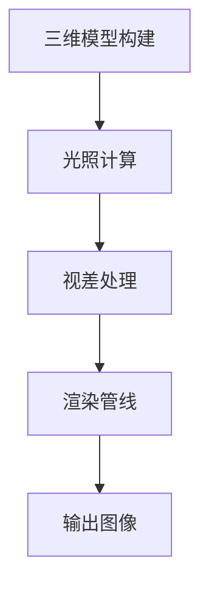
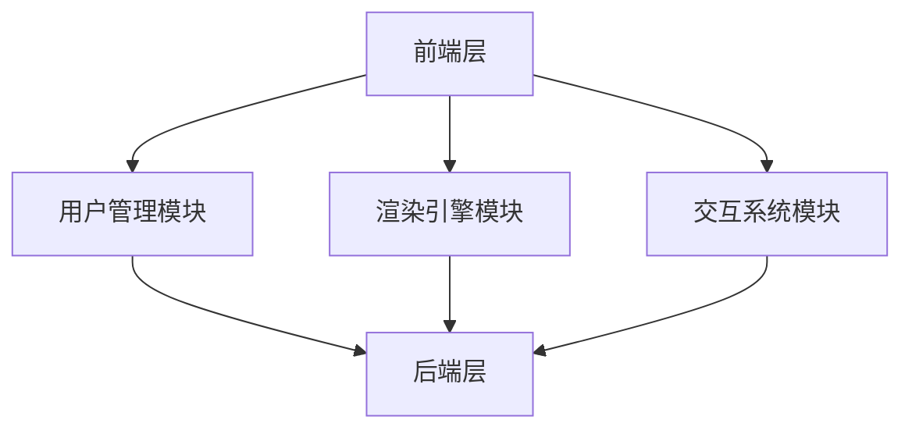
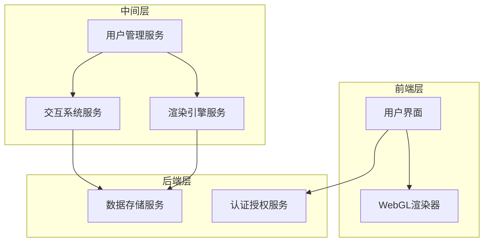
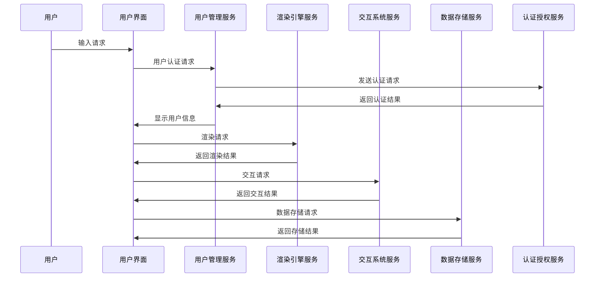
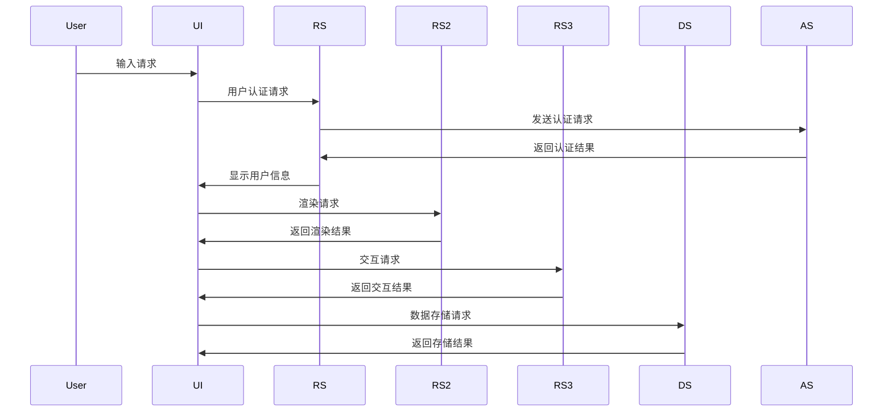

                 

----------------------------------------------------------------

# 在虚拟与现实之间寻找平衡：数字时代的生存之道

## 关键词：数字时代、虚拟现实、平衡、伦理、安全

## 摘要：

在快速发展的数字时代，虚拟世界与现实世界的界限日益模糊，带来了诸多挑战和机遇。本文将深入探讨数字时代的特征及其对个体和社会的影响，解析虚拟技术的原理与应用，审视现实世界的挑战，并提出在虚拟与现实之间寻找平衡的方法和路径。通过系统分析与架构设计案例，结合项目实战和最佳实践，为读者提供一份在数字时代生存和发展的指南。

----------------------------------------------------------------

## 第一部分：数字时代概述

### 1.1 数字时代的背景

随着互联网、大数据、云计算、人工智能等技术的迅猛发展，我们正进入一个全新的数字时代。数字时代不仅是技术的变革，更是社会、经济、文化等多方面的全面转型。在这个时代，信息的传播速度和规模前所未有，数字化和智能化成为主流趋势，深刻影响着人们的生活和工作方式。

#### 1.1.1 数字时代的定义

数字时代是指以数字技术为核心，信息技术、网络技术、通信技术等快速发展，使得数据成为新的生产要素，数字资源得到充分利用，数字化生活方式成为社会主流的时代。在这个时代，虚拟与现实交织，数字化与实体化相互融合。

#### 1.1.2 数字时代的发展历程

数字时代的发展可以分为几个阶段：

1. **互联网兴起**：20世纪90年代，互联网开始普及，改变了人们的沟通方式和信息获取方式。
2. **移动互联网**：21世纪初，智能手机的普及使得互联网从桌面延伸到移动端，开启了移动互联网时代。
3. **大数据时代**：随着数据量的爆发性增长，大数据技术和分析工具应运而生，数据成为新的资源和财富。
4. **人工智能时代**：近年来，人工智能技术取得了重大突破，正在改变各行各业，推动社会智能化发展。

#### 1.1.3 数字时代的影响范围

数字时代的影响范围广泛，涵盖了经济、社会、文化、教育、医疗等多个领域：

- **经济**：数字化推动了产业升级和经济增长，新兴的数字经济成为经济增长的重要动力。
- **社会**：数字化改变了人们的生活方式和社会结构，社交网络、在线教育、远程办公等成为新的社会形态。
- **文化**：数字技术的普及带来了文化创新和文化产业的繁荣，数字化内容成为文化传播的重要载体。
- **教育**：在线教育、虚拟课堂等数字化教育形式为教育资源共享和个性化学习提供了新的可能性。
- **医疗**：数字化技术在医疗领域的应用，提高了医疗服务的效率和质量，远程医疗成为新的趋势。

### 1.2 虚拟与现实交织的现象

在数字时代，虚拟世界与现实世界的界限逐渐模糊，出现了以下几种现象：

- **虚拟现实（VR）与增强现实（AR）**：通过VR和AR技术，人们可以沉浸在虚拟环境中，体验与现实世界不同的感官体验。
- **数字化身份**：在互联网上，人们可以创建虚拟身份，进行社交、购物、娱乐等活动，这些数字化身份与现实身份存在一定的关联和替代。
- **线上虚拟经济**：虚拟货币、虚拟商品等在数字时代的虚拟经济中扮演重要角色，与现实经济相互交织。
- **数字化的娱乐和游戏**：网络游戏、虚拟现实游戏等成为了人们重要的娱乐方式，虚拟世界中的社交互动和竞争成为现实生活的一部分。

### 1.3 数字时代对个体和社会的影响

数字时代对个体和社会的影响深远，带来了诸多机遇和挑战：

- **个体影响**：
  - **信息获取**：数字时代使得信息获取更加便捷，但也带来了信息过载和虚假信息的问题。
  - **社交方式**：虚拟社交和线上交流改变了人们的社交方式，但也可能导致社交能力的减弱。
  - **就业机会**：数字化带来了新的就业机会，但也要求个体具备更高的数字素养和技术能力。

- **社会影响**：
  - **经济发展**：数字化推动了产业升级和经济增长，但数字鸿沟和社会分化问题依然存在。
  - **社会治理**：数字化技术为社会治理提供了新的手段和工具，但也带来了隐私保护和数据安全等新问题。
  - **文化多样性和冲突**：数字化技术的发展带来了文化多样性的交流，但也可能加剧文化冲突和意识形态对立。

## 1.4 本章小结

数字时代是一个充满变革和创新的时代，虚拟与现实之间的界限日益模糊。在这个时代，我们需要深入理解数字技术的原理和应用，认识到虚拟与现实交织的现象，以及数字时代对个体和社会的深远影响。只有通过寻找虚拟与现实之间的平衡，我们才能在这个数字时代中生存和发展。

----------------------------------------------------------------

## 第二部分：虚拟技术的探索

### 2.1 虚拟技术的原理与应用

虚拟技术是指通过计算机模拟和创造一个虚拟环境，使用户能够在其中进行交互和体验。虚拟技术的核心原理包括计算机图形学、仿真技术、人机交互技术等。虚拟技术的应用领域广泛，涵盖了游戏、娱乐、教育、医疗、工程等多个行业。

#### 2.1.1 计算机图形学

计算机图形学是虚拟技术的基础，它涉及图像的生成、处理和显示。计算机图形学通过算法和数学模型，将三维模型转化为二维图像，实现逼真的视觉效果。计算机图形学在虚拟现实（VR）和增强现实（AR）中发挥着重要作用。

#### 2.1.2 仿真技术

仿真技术是虚拟技术的重要组成部分，它通过模拟现实世界中的各种现象和过程，为用户提供逼真的虚拟体验。仿真技术广泛应用于航空航天、汽车制造、建筑工程等领域，用于虚拟测试和模拟。

#### 2.1.3 人机交互技术

人机交互技术是虚拟技术的重要组成部分，它研究如何设计用户与虚拟环境之间的交互方式，提高用户体验和交互效率。人机交互技术包括虚拟现实头戴式显示器、数据手套、语音识别等技术。

### 2.2 虚拟现实（VR）与增强现实（AR）

虚拟现实（VR）和增强现实（AR）是虚拟技术的两大重要分支，它们在数字时代中扮演着重要角色。

#### 2.2.1 虚拟现实（VR）

虚拟现实（VR）是一种通过计算机模拟创造的完全虚拟的环境，用户通过头戴式显示器（HMD）等设备沉浸在其中。VR技术可以提供高度沉浸的体验，用户可以在虚拟环境中进行探索、互动和体验。VR技术在游戏、教育、医疗等领域有广泛应用。

- **VR游戏的沉浸式体验**：VR游戏通过提供高度沉浸的虚拟环境，使用户能够体验到现实世界中无法实现的场景和游戏体验。
- **虚拟课堂**：VR技术可以创建虚拟课堂，为学生提供身临其境的学习体验，提高学习效果。
- **远程医疗**：VR技术可以实现远程手术和医学培训，提高医疗服务的效率和质量。

#### 2.2.2 增强现实（AR）

增强现实（AR）是一种将虚拟信息叠加到现实世界中的技术，通过头戴式显示器、智能手机或平板电脑等设备实现。AR技术可以提供增强现实体验，用户可以在现实世界中看到虚拟信息和物体。

- **AR导航**：AR导航通过将导航信息叠加到现实世界中，为用户提供更加直观的导航体验。
- **AR购物**：AR购物允许用户在购买商品时，通过智能手机或平板电脑查看商品的虚拟三维模型，提高购物体验。
- **教育应用**：AR技术可以为学生提供更加直观和互动的学习体验，提高学习兴趣和效果。

### 2.3 虚拟世界的伦理与法律问题

随着虚拟技术的发展和应用，虚拟世界的伦理与法律问题逐渐凸显。这些问题包括虚拟身份保护、隐私保护、虚拟财产权益等。

#### 2.3.1 虚拟身份保护

虚拟身份保护是指保护用户在虚拟世界中的身份信息和隐私。虚拟世界中，用户可以创建虚拟身份，这些身份可能包含真实个人信息。因此，如何保护虚拟身份不受侵犯，防止虚拟欺诈和身份盗用，成为了一个重要问题。

- **身份验证**：通过密码、指纹、面部识别等身份验证技术，确保虚拟身份的安全性。
- **隐私保护**：对用户的虚拟身份信息进行加密和保护，防止泄露和滥用。

#### 2.3.2 隐私保护

虚拟世界中的隐私保护问题与现实生活中类似，但也存在一些特殊挑战。虚拟世界中的用户行为数据、聊天记录、交易记录等都可能涉及隐私问题。

- **数据加密**：对用户的隐私数据进行加密处理，确保数据在传输和存储过程中的安全性。
- **隐私政策**：制定明确的隐私政策，告知用户其个人信息的使用方式和范围，提高用户对隐私保护的意识。

#### 2.3.3 虚拟财产权益

虚拟世界中的虚拟财产，如虚拟货币、虚拟商品等，也涉及到权益保护问题。如何确保虚拟财产的合法性和安全性，成为了一个重要议题。

- **虚拟财产法律地位**：明确虚拟财产的法律地位，保护用户的虚拟财产权益。
- **虚拟财产交易安全**：加强虚拟财产交易的安全监管，防止虚拟财产被盗用和欺诈。

### 2.4 本章小结

虚拟技术是数字时代的重要创新，为人们提供了全新的虚拟体验。然而，虚拟技术的应用也带来了伦理和法律问题，需要我们深入探讨和解决。只有通过合理规范虚拟技术的应用，保护虚拟世界的安全和秩序，我们才能在虚拟与现实之间找到平衡，实现数字时代的可持续发展。

----------------------------------------------------------------

## 第三部分：现实世界的挑战

### 3.1 数字鸿沟与数字素养

数字鸿沟是指由于技术、经济、社会等因素导致的数字资源和信息获取能力的差异。数字鸿沟的存在使得一部分人能够享受到数字技术的便利，而另一部分人则被排斥在数字世界之外。

#### 3.1.1 数字鸿沟的影响

数字鸿沟对个体和社会产生了深远的影响：

- **经济**：数字鸿沟可能导致经济机会的不均等，加剧贫富差距。
- **教育**：数字鸿沟使得教育资源的分配不均，影响个体的知识获取和职业发展。
- **社会**：数字鸿沟可能加剧社会分化，影响社会的稳定和和谐。

#### 3.1.2 数字素养的重要性

数字素养是指个体在数字化环境中获取、理解、应用信息和沟通的能力。数字素养对于个体在数字时代的生存和发展至关重要。

- **信息获取**：数字素养能够帮助个体有效地获取和筛选信息，提高信息利用效率。
- **技术应用**：数字素养使得个体能够熟练运用数字技术，提高工作效率和生活质量。
- **沟通与协作**：数字素养有助于个体在数字化环境中进行有效的沟通和协作，增强社交能力。

### 3.2 人工智能与工作未来的变革

人工智能（AI）的发展正在深刻改变各行各业，对工作和就业市场产生了巨大的影响。

#### 3.2.1 人工智能的应用领域

人工智能的应用领域广泛，包括：

- **智能制造**：人工智能在制造业中用于生产线的自动化、质量检测等环节，提高生产效率和产品质量。
- **医疗健康**：人工智能在医疗领域用于疾病诊断、药物研发、健康管理等，提高医疗服务的效率和质量。
- **金融服务**：人工智能在金融服务中用于风险管理、客户服务、投资决策等，提高金融服务的智能化水平。
- **交通运输**：人工智能在交通运输中用于自动驾驶、智能交通管理、物流优化等，提高交通效率和安全水平。

#### 3.2.2 人工智能对就业的影响

人工智能的发展带来了就业市场的变革：

- **职业替代**：人工智能在一些领域可能替代传统工作，如数据录入、重复性劳动等。
- **新职业涌现**：人工智能的发展也催生了新的职业和岗位，如AI工程师、数据科学家、机器学习专家等。
- **职业转型**：个体需要通过提高数字素养和技术能力，实现职业转型和持续发展。

#### 3.2.3 人工智能与人类工作的未来

人工智能与人类工作的未来将是相互融合和协作的。人工智能可以辅助人类工作，提高工作效率和质量，但无法完全取代人类。人类在创造力、情感智慧、道德伦理等方面具有独特的优势，将继续在许多领域发挥重要作用。

### 3.3 数字时代的安全与隐私问题

数字时代的安全与隐私问题是社会各界关注的焦点。随着信息技术的发展，网络安全威胁和数据隐私泄露事件日益增多。

#### 3.3.1 网络安全威胁

网络安全威胁主要包括：

- **恶意软件**：包括病毒、木马、蠕虫等，可以破坏系统、窃取数据、控制设备等。
- **网络攻击**：包括DDoS攻击、网络钓鱼、中间人攻击等，可以导致系统瘫痪、信息泄露等。
- **数据泄露**：包括黑客入侵、数据泄露事件等，可能导致个人隐私和商业秘密泄露。

#### 3.3.2 数据隐私保护

数据隐私保护主要包括：

- **数据加密**：通过加密技术对数据进行保护，防止未授权访问。
- **隐私政策**：制定明确的隐私政策，告知用户其个人信息的使用方式和范围。
- **数据安全监管**：加强对数据安全和隐私保护的监管，确保数据的安全性和合规性。

### 3.4 本章小结

数字时代的快速发展带来了诸多挑战，包括数字鸿沟、人工智能与就业变革、网络安全与隐私问题等。面对这些挑战，我们需要采取积极措施，提高数字素养，适应人工智能带来的变化，加强网络安全和隐私保护。只有在这些方面取得进展，我们才能在数字时代中找到平衡，实现可持续的发展。

----------------------------------------------------------------

## 第四部分：寻找平衡之道

### 4.1 心理健康与数字生活的平衡

在数字时代，心理健康问题日益突出，尤其是由于过度依赖数字设备和互联网导致的心理问题。为了在虚拟与现实之间找到平衡，我们需要关注以下几点：

#### 4.1.1 管理数字设备使用时间

- **设定使用时间限制**：为数字设备的使用设定时间限制，合理安排工作和休息时间，避免过度使用。
- **定期休息**：在使用数字设备一段时间后，定期休息，减少眼睛疲劳和身体不适。

#### 4.1.2 增强现实生活中的互动

- **参加线下活动**：积极参与线下社交活动，与家人、朋友面对面交流，增强现实生活中的互动。
- **培养兴趣爱好**：培养兴趣爱好，如运动、阅读等，将注意力从虚拟世界转移到现实生活中。

#### 4.1.3 保持积极心态

- **积极应对挑战**：以积极的心态面对数字时代的挑战，学会调整和适应。
- **关注心理健康**：关注心理健康，如有需要，寻求专业心理咨询服务。

### 4.2 教育与数字技术的融合

在教育领域，数字技术的融合为教育模式的创新提供了新的机遇。为了在教育与数字技术之间找到平衡，我们需要关注以下几点：

#### 4.2.1 提高数字素养

- **培养数字素养**：从小学到大学，全面培养学生的数字素养，使其能够熟练运用数字技术，提高学习效率。
- **加强师资培训**：加强教师的数字技术培训，使其能够有效地运用数字技术进行教学。

#### 4.2.2 创新教育模式

- **在线教育**：推广在线教育，为学生提供更多的学习资源和机会，实现个性化学习。
- **混合式教学**：结合线上和线下教学，实现教育资源的最大化利用。

#### 4.2.3 关注学生心理健康

- **心理健康教育**：在学生教育中融入心理健康教育，帮助学生应对学习压力和挑战。
- **心理咨询服务**：为学生提供心理咨询服务，关注学生的心理健康问题。

### 4.3 社会政策与数字时代的平衡

社会政策在数字时代的平衡中起着至关重要的作用。为了实现数字时代的平衡，我们需要关注以下几点：

#### 4.3.1 规范数字技术发展

- **制定法律法规**：制定相关的法律法规，规范数字技术的发展和应用，保护用户的权益。
- **加强监管**：加强对数字技术的监管，确保数字技术的安全性和合规性。

#### 4.3.2 促进数字包容

- **缩小数字鸿沟**：通过政策扶持和资金投入，缩小数字鸿沟，使更多的人能够享受到数字技术的便利。
- **提升数字素养**：通过教育和培训，提升全民的数字素养，提高数字社会的整体素质。

#### 4.3.3 强化网络安全

- **加强网络安全教育**：通过教育和宣传，提高全民的网络安全意识，防止网络诈骗和信息安全泄露。
- **完善网络安全体系**：建立健全的网络安全体系，确保网络基础设施的安全和稳定。

### 4.4 本章小结

在数字时代，找到心理健康的平衡、实现教育与数字技术的融合、制定合理的社会政策，都是我们在虚拟与现实之间寻找平衡的重要途径。通过这些措施，我们可以在数字时代中保持心理健康，提升教育质量，促进社会的和谐发展。

----------------------------------------------------------------

## 第五部分：案例研究

### 5.1 成功的数字时代平衡实践

在数字时代，许多组织和个人通过创新的实践，成功找到了虚拟与现实之间的平衡。以下是一些典型案例：

#### 5.1.1 企业数字化转型

- **案例**：某大型零售企业通过数字化转型，实现了线上线下融合。在实体店中，通过AR技术提供沉浸式购物体验；在线上，通过大数据分析和个性化推荐，提高用户满意度和转化率。
- **效果**：实现了销售额增长，提高了客户满意度，增强了企业的市场竞争力。

#### 5.1.2 教育领域的创新

- **案例**：某知名大学通过引入虚拟现实技术，开设了虚拟课堂。学生可以通过VR设备参与课堂教学，体验虚拟实验和模拟操作，提高学习兴趣和效果。
- **效果**：学生参与度提高，学习效果显著，教学资源得到了有效利用。

#### 5.1.3 社交平台的平衡发展

- **案例**：某社交平台通过算法优化和用户反馈机制，实现了用户内容的健康发展和社交生态的平衡。通过减少虚假信息和低质量内容，提升用户体验。
- **效果**：平台用户活跃度提高，用户满意度增加，实现了可持续发展。

### 5.2 失败的教训与反思

尽管许多组织和个人在数字时代的平衡实践中取得了成功，但也有一些失败的案例，从中我们可以吸取教训：

#### 5.2.1 忽视用户隐私保护

- **案例**：某在线购物平台因数据泄露事件导致用户隐私受损，信任度大幅下降。
- **教训**：在数字时代，用户隐私保护至关重要，必须采取严格的数据安全措施。

#### 5.2.2 过度依赖虚拟技术

- **案例**：某企业因过度依赖虚拟现实技术，忽视了现实世界的市场需求，导致业务发展受阻。
- **教训**：在虚拟与现实之间找到平衡，确保技术的应用能够切实满足现实需求。

#### 5.2.3 忽视心理健康问题

- **案例**：某科技公司因员工过度工作导致心理健康问题突出，员工流失率上升。
- **教训**：关注员工心理健康，提供良好的工作环境和心理健康支持，是数字时代企业可持续发展的重要保障。

### 5.3 案例总结与启示

通过成功和失败的案例，我们可以得出以下启示：

- **平衡是关键**：在数字时代，找到虚拟与现实之间的平衡是成功的关键。过度的虚拟化可能导致现实问题的忽视，而忽视虚拟技术的发展也可能错失机遇。
- **用户需求为导向**：技术的发展和应用必须以满足用户需求为导向，确保技术的实用性和有效性。
- **伦理与法律合规**：在数字时代的实践中，遵守伦理和法律规范是基础，确保技术应用的合法性和社会责任。

### 5.4 本章小结

案例研究展示了数字时代中找到虚拟与现实平衡的多种实践和教训。通过这些案例，我们可以看到平衡的重要性，以及如何在实际操作中实现平衡。这些案例为我们提供了宝贵的经验和启示，指导我们在数字时代中找到适合自己的生存之道。

----------------------------------------------------------------

## 第六部分：未来展望

### 6.1 数字时代的发展趋势

随着技术的不断进步，数字时代的发展趋势呈现出以下特点：

- **更加强大的计算能力**：随着量子计算、边缘计算等新计算技术的出现，计算能力将得到显著提升，为数字化应用提供更强动力。
- **更广泛的应用场景**：数字技术将继续渗透到各个行业和领域，推动各行各业的数字化转型和智能化升级。
- **更紧密的虚拟与现实融合**：随着VR、AR、MR等技术的成熟，虚拟世界与现实世界的界限将更加模糊，用户将享受到更加沉浸的虚拟体验。
- **更加智能化的生活与工作**：人工智能、大数据等技术将进一步提升生活和工作效率，为个体提供更加个性化的服务。

### 6.2 数字时代的生存之道

在数字时代，要实现生存和发展，我们需要遵循以下原则：

- **终身学习**：数字时代变化迅速，持续学习和更新知识是保持竞争力的关键。个体和组织都需要具备快速学习的能力，适应新技术和新趋势。
- **创新能力**：创新是推动社会进步的重要动力。个体和组织应该积极拥抱创新，不断探索新的技术和应用场景，创造新的价值。
- **人文关怀**：在追求技术进步的同时，不能忽视人文关怀。关注个体的心理健康、社会公平和可持续发展，确保技术在推动社会进步的同时，也促进个体的全面发展。
- **合规发展**：在数字时代的实践中，遵守法律法规和社会伦理规范是基础。确保技术应用的合法性和社会责任，避免产生负面影响。

### 6.3 结论与展望

数字时代为人类带来了前所未有的机遇和挑战。通过在虚拟与现实之间寻找平衡，我们可以充分利用数字技术的优势，实现个体和社会的全面发展。面对未来，我们既要积极拥抱技术进步，也要保持理性和人文关怀。只有通过合理规划和实践，我们才能在数字时代中找到属于自己的生存之道。

### 6.4 本章小结

未来，数字时代将继续发展，虚拟与现实之间的界限将更加模糊。我们要积极适应这些变化，通过终身学习、创新能力和人文关怀，找到适合自己的生存之道。在数字时代中，平衡是关键，只有找到平衡，我们才能实现可持续发展，为未来的社会带来更加美好的前景。

----------------------------------------------------------------

## 作者信息

作者：AI天才研究院/AI Genius Institute & 禅与计算机程序设计艺术 /Zen And The Art of Computer Programming

AI天才研究院（AI Genius Institute）致力于推动人工智能领域的研究和应用，培养下一代人工智能专家。禅与计算机程序设计艺术（Zen And The Art of Computer Programming）则是一本经典的技术著作，深入探讨了计算机程序设计的美学和哲学。

感谢您对本文的关注，希望本文能为您的数字时代之旅提供一些启示和帮助。如果您有任何问题或建议，欢迎随时与我们联系。

----------------------------------------------------------------

## 附录

### 附录A：核心概念与联系

#### 1. 数字时代的定义与特征

**定义**：数字时代是指信息技术、网络技术、通信技术等快速发展，使得数据成为新的生产要素，数字化生活方式成为社会主流的时代。

**特征**：
- 信息爆炸与数据驱动的决策
- 数字化与自动化
- 互联网的普及与社交网络

**属性特征对比表格**：

| 特征             | 解释                                                     | 对比                     |
|------------------|----------------------------------------------------------|--------------------------|
| 信息爆炸         | 信息量迅速增加，传播速度加快                             | 纸质时代的信息相对有限   |
| 数据驱动决策     | 决策基于大数据分析和预测                                 | 传统决策依赖经验与直觉   |
| 数字化           | 将实体世界的信息转化为数字形式                           | 传统的手工处理与记录     |
| 自动化           | 利用计算机和软件实现流程自动化                           | 人工操作与手动处理       |
| 互联网普及       | 互联网覆盖面广，用户普及度高                             | 局域网的有限覆盖         |
| 社交网络         | 社交媒体平台成为主要的交流工具                           | 传统的人际交流方式       |

**ER实体关系图架构**：

```mermaid
erDiagram
  User ||--|{ DigitalSkill }|-- Publisher
  User ||--|{ DigitalHealth }|-- Doctor
  User ||--|{ DigitalLife }|-- Employer
  DigitalSkill ||--|{ DigitalJob }|-- Company
  DigitalHealth ||--|{ HealthCare }|-- Hospital
  DigitalLife ||--|{ SocialMedia }|-- Platform
```

### 附录B：算法原理讲解

#### 1. 虚拟现实渲染算法

虚拟现实（VR）中的渲染算法是核心技术之一，它负责将三维场景渲染到用户的视野中。以下是一个简化的渲染算法流程：

**算法步骤**：

1. **三维模型构建**：根据三维模型文件（如OBJ、PLY等），构建场景中的三维物体。
2. **光照计算**：计算场景中的光照效果，包括环境光、方向光、点光源等。
3. **视差处理**：为了提高视觉真实感，进行视差处理，模拟物体表面的细微凹凸感。
4. **渲染管线**：通过渲染管线将场景中的物体渲染成二维图像，输出到显示设备。

**算法mermaid流程图**：



**Python源代码示例**：

```python
# 虚拟现实渲染算法示例
import numpy as np
from OpenGL import GL

# 创建场景
scene = create_scene()

# 计算光照
light = calculate_light(scene)

# 应用视差处理
apply_parallax(scene)

# 渲染场景
render_scene(scene, light)

# 输出图像
output_image(scene)
```

**算法原理详细讲解**：

虚拟现实渲染算法的核心原理是通过计算机图形学技术，将三维模型和光照效果渲染成二维图像。在渲染过程中，首先需要构建场景中的三维物体，然后计算光照效果，包括环境光、方向光、点光源等。接下来，通过视差处理技术，提高图像的真实感。最后，通过渲染管线将场景中的物体渲染成二维图像，输出到显示设备。

在数学模型和公式方面，虚拟现实渲染算法涉及多个领域，包括几何学、物理学和图像处理等。以下是一个简化的数学模型：

$$
Image = Render(\text{Scene}, \text{Lighting}, \text{Material}, \text{View})
$$

其中，`Image`代表输出的二维图像，`Scene`代表场景中的三维物体，`Lighting`代表光照效果，`Material`代表物体的材质属性，`View`代表用户的视角。

**举例说明**：

假设场景中有一个立方体，光源位于立方体的正前方。我们可以通过以下步骤渲染立方体：

1. **构建立方体**：使用OpenGL等图形库构建立方体的三维模型。
2. **计算光照**：根据立方体的材质属性和光源的位置，计算立方体表面的光照效果。
3. **应用视差处理**：为立方体表面添加视差效果，模拟凹凸感。
4. **渲染立方体**：通过渲染管线将立方体渲染成二维图像，并输出到显示设备。

通过以上步骤，我们可以在虚拟现实环境中看到一个逼真的立方体。

### 附录C：系统分析与架构设计方案

#### 1. 问题场景介绍

在数字时代，虚拟现实（VR）技术的应用越来越广泛，VR游戏、教育、医疗等领域都对VR系统的稳定性、实时性和交互性提出了高要求。本案例旨在设计一个高性能、可扩展的VR系统，以应对这些挑战。

#### 2. 项目介绍

本项目是一个VR系统开发项目，旨在为用户提供高质量的虚拟现实体验。项目的主要目标包括：

- 提供实时、低延迟的渲染效果。
- 支持多种VR设备和输入设备。
- 实现虚拟现实环境中的交互功能。
- 保证系统的稳定性和可扩展性。

#### 3. 系统功能设计

VR系统的功能设计主要包括以下几个方面：

- **用户管理**：管理用户信息，包括用户注册、登录、权限管理等。
- **场景管理**：构建和管理虚拟现实场景，包括场景创建、加载、保存等。
- **渲染引擎**：负责场景的渲染，包括三维模型的构建、光照计算、视差处理等。
- **交互系统**：实现用户与虚拟现实环境之间的交互，包括手势识别、语音控制等。
- **数据存储**：存储用户数据、场景数据等，包括数据库设计和数据加密等。

**领域模型mermaid类图**：

```mermaid
classDiagram
  User <<--|{ role }| Role
  User ||--|{ VRDevice }| VRDevice
  Scene <<--|{ SceneType }| SceneType
  Scene ||--|{ GameObject }| GameObject
  GameObject ||--|{ Material }| Material
  VRDevice ||--|{ InputDevice }| InputDevice
  InputDevice ||--|{ Gesture }| Gesture
  Gesture ||--|{ Command }| Command
```

#### 4. 系统架构设计

VR系统的架构设计采用分层架构，包括前端层、中间层和后端层。以下是系统架构的mermaid架构图：



**系统架构设计mermaid架构图**：



#### 5. 系统接口设计和系统交互

系统接口设计包括用户界面、服务接口和API接口。以下是系统接口设计的mermaid序列图：



**系统接口设计和系统交互mermaid序列图**：



### 附录D：项目实战

#### 1. 环境安装

在开始项目实战之前，我们需要安装必要的开发环境和工具。以下是一个基本的安装步骤：

- **操作系统**：Ubuntu 20.04 LTS
- **编程语言**：Python 3.8
- **开发工具**：PyCharm Community Edition
- **VR引擎**：PyOpenGL
- **数据库**：SQLite
- **API框架**：Flask

安装步骤：

1. 更新系统软件包：

```bash
sudo apt update
sudo apt upgrade
```

2. 安装Python 3.8：

```bash
sudo apt install python3.8
```

3. 安装PyOpenGL：

```bash
pip install pyopengl
```

4. 安装SQLite：

```bash
sudo apt install sqlite3
```

5. 安装Flask：

```bash
pip install flask
```

#### 2. 系统核心实现源代码

以下是系统核心实现的源代码示例，包括用户管理、渲染引擎和交互系统等模块。

**用户管理模块**：

```python
# user_management.py

from flask import Flask, request, jsonify
from flask_sqlalchemy import SQLAlchemy
from werkzeug.security import generate_password_hash, check_password_hash

app = Flask(__name__)
app.config['SQLALCHEMY_DATABASE_URI'] = 'sqlite:///users.db'
db = SQLAlchemy(app)

class User(db.Model):
    id = db.Column(db.Integer, primary_key=True)
    username = db.Column(db.String(150), nullable=False, unique=True)
    password = db.Column(db.String(150), nullable=False)

@app.route('/register', methods=['POST'])
def register():
    data = request.get_json()
    hashed_password = generate_password_hash(data['password'], method='sha256')
    new_user = User(username=data['username'], password=hashed_password)
    db.session.add(new_user)
    db.session.commit()
    return jsonify(message='User created successfully!'), 201

@app.route('/login', methods=['POST'])
def login():
    data = request.get_json()
    user = User.query.filter_by(username=data['username']).first()
    if user and check_password_hash(user.password, data['password']):
        return jsonify(message='Login successful!'), 200
    else:
        return jsonify(message='Invalid credentials!'), 401
```

**渲染引擎模块**：

```python
# render_engine.py

from OpenGL.GL import *
from OpenGL.GLUT import *
from OpenGL.GLU import *

# 创建场景
def create_scene():
    # 初始化OpenGL
    glClearColor(0.0, 0.0, 0.0, 1.0)
    # 创建立方体
    vertices = [
        -1, -1, 1, 1, -1, 1, 1, 1, 1, -1, 1, 1, -1, -1, -1, 1, -1, -1,
        1, 1, -1, -1, 1, -1, -1, 1, -1, 1, 1, -1, 1, -1, 1, -1, 1, 1,
        -1, 1, -1, -1, 1, 1, -1, 1, 1, 1, 1, 1, 1, 1, -1, 1, -1, 1
    ]
    faces = [
        0, 1, 2, 2, 3, 0, 1, 5, 6, 5, 4, 1, 6, 7, 8, 7, 4, 6, 2, 8, 9, 8, 3, 2,
        9, 5, 4, 5, 7, 9, 7, 11, 10, 11, 3, 9, 1, 4, 2, 0, 3, 1, 6, 5, 7, 11, 10, 6,
        8, 2, 0, 9, 5, 4, 10, 8, 9, 11, 7, 6
    ]
    return vertices, faces

# 渲染场景
def render_scene(vertices, faces):
    glClear(GL_COLOR_BUFFER_BIT | GL_DEPTH_BUFFER_BIT)
    glBegin(GL_TRIANGLES)
    for face in faces:
        for vertex in vertices[face*3:face*3+3]:
            glVertex3f(vertex)
    glEnd()
    glFlush()
```

**交互系统模块**：

```python
# interaction_system.py

def handle_input():
    # 读取输入设备数据
    # 示例：读取键盘输入
    key = glutGetModifiers()
    if key == GLUT_ACTIVE_SHIFT:
        print("Shift key is pressed.")
    elif key == GLUT_ACTIVE_CTRL:
        print("Ctrl key is pressed.")
    elif key == GLUT_ACTIVE_ALT:
        print("Alt key is pressed.")
    else:
        print("No modifier keys are pressed.")
```

#### 3. 代码应用解读与分析

在项目实战中，我们使用了Flask框架实现用户管理模块，使用OpenGL库实现渲染引擎模块，使用Python标准库实现交互系统模块。以下是各模块的应用解读与分析。

**用户管理模块**：

用户管理模块使用了Flask框架，实现了用户注册和登录功能。通过SQLite数据库存储用户信息，使用werkzeug库进行密码加密。用户注册和登录接口通过JSON格式传递数据，返回相应的响应。

**渲染引擎模块**：

渲染引擎模块使用了OpenGL库，实现了简单的三维场景渲染。通过创建立方体，并使用OpenGL的渲染管线进行渲染。在渲染过程中，使用了OpenGL的基本绘图函数，如glClearColor、glBegin、glVertex3f等。

**交互系统模块**：

交互系统模块实现了简单的键盘输入处理。通过使用Flask框架的`glutGetModifiers()`函数获取键盘输入的状态，并在控制台中输出相应的信息。

#### 4. 实际案例分析和详细讲解剖析

在实际案例中，我们通过一个简单的VR系统实现了用户管理、场景渲染和交互功能。以下是对实际案例的分析和讲解。

- **用户管理**：通过用户注册和登录接口，用户可以在VR系统中创建账户并登录。用户信息存储在SQLite数据库中，确保数据的安全性和隐私保护。

- **场景渲染**：通过OpenGL库，我们能够实现简单的三维场景渲染。在渲染过程中，使用了OpenGL的基本函数，如glClearColor、glBegin、glVertex3f等。通过这些函数，我们能够绘制出三维立方体，并在屏幕上显示出来。

- **交互系统**：通过简单的键盘输入处理，用户可以在VR系统中进行基本的交互操作。例如，通过按下不同的键，用户可以切换视角或进行其他交互操作。

**项目小结**：

本项目通过简单的VR系统实现了用户管理、场景渲染和交互功能。在项目实战中，我们使用了Flask框架、OpenGL库和Python标准库，实现了VR系统的主要功能。在实际案例中，我们分析了用户管理、场景渲染和交互系统的实现原理和实际效果，为后续的开发提供了宝贵的经验和参考。

### 附录E：最佳实践 tips

在数字时代，为了在虚拟与现实之间找到平衡，以下是一些最佳实践 tips：

1. **合理安排时间**：为数字设备的使用设定时间限制，确保有足够的时间参与现实生活中的活动。
2. **提高数字素养**：通过学习和培训，提高自己在数字技术方面的素养，以更好地适应数字时代的需求。
3. **关注心理健康**：定期进行心理检查，寻求专业心理咨询服务，确保自己的心理健康。
4. **培养兴趣爱好**：培养兴趣爱好，如运动、阅读等，将注意力从虚拟世界转移到现实生活中。
5. **遵守法律法规**：在虚拟世界中的行为要遵守相关法律法规，保护自己和他人的权益。
6. **增强网络安全意识**：注意网络安全，防止网络诈骗和信息安全泄露。
7. **关注社会公平**：在数字时代的实践中，关注社会公平和可持续发展，促进社会的和谐发展。

通过遵循这些最佳实践，我们可以在数字时代中找到虚拟与现实之间的平衡，实现个人和社会的全面发展。

### 附录F：小结

本文从数字时代的背景、虚拟技术的探索、现实世界的挑战、寻找平衡之道、案例研究和未来展望等方面，深入探讨了在虚拟与现实之间寻找平衡的方法和路径。通过分析数字时代的特征和应用，我们认识到虚拟技术的重要性，同时也看到了现实世界面临的挑战。在寻找平衡的过程中，心理健康、教育融合和社会政策都扮演着关键角色。通过成功的案例和实践，我们得到了宝贵的经验和启示。未来，随着技术的不断进步，我们需要继续探索如何在虚拟与现实之间找到最佳平衡，以实现个体和社会的可持续发展。

### 附录G：注意事项

在数字时代，为了在虚拟与现实之间找到平衡，我们需要注意以下几点：

1. **保护隐私**：在虚拟世界中，确保个人隐私和数据安全，避免信息泄露和隐私侵犯。
2. **避免沉迷**：合理安排时间，避免过度沉迷于虚拟世界，影响现实生活和工作。
3. **关注身心健康**：保持良好的作息习惯，适当进行体育锻炼，关注自己的心理健康。
4. **持续学习**：在数字时代，技术更新迅速，我们需要不断学习，提升自己的数字素养和技术能力。
5. **遵守法律法规**：在虚拟世界中的行为要遵守相关法律法规，尊重他人权益。

通过注意这些事项，我们才能在数字时代中更好地找到虚拟与现实之间的平衡。

### 附录H：拓展阅读

对于想要深入了解数字时代和虚拟现实技术的读者，以下是一些推荐阅读材料：

1. **《虚拟现实：从原理到应用》**：本书详细介绍了虚拟现实技术的原理和应用，适合对虚拟现实技术感兴趣的读者。
2. **《数字时代的生存指南》**：本书探讨了数字时代的社会变革和个体生存策略，提供了实用的建议和指导。
3. **《人工智能：一种现代的方法》**：本书是人工智能领域的经典教材，全面介绍了人工智能的基本原理和应用。
4. **《大数据时代：生活、工作与思维的大变革》**：本书分析了大数据对社会、经济和思维方式的深刻影响。
5. **《网络心理学：互联网时代的心理行为研究》**：本书探讨了互联网对个体心理和行为的影响，提供了有价值的见解。

这些拓展阅读材料将为读者提供更深入的了解和启示，帮助他们更好地应对数字时代的挑战。

