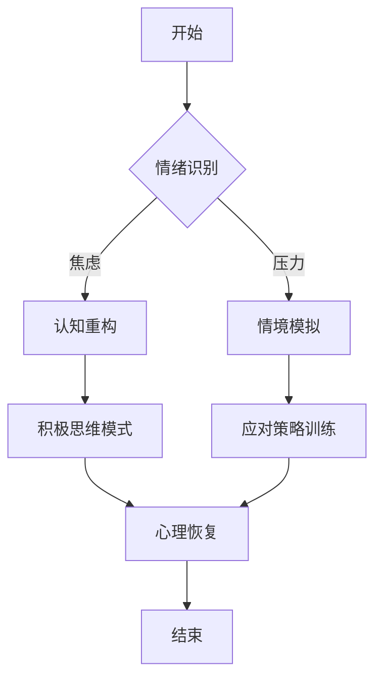
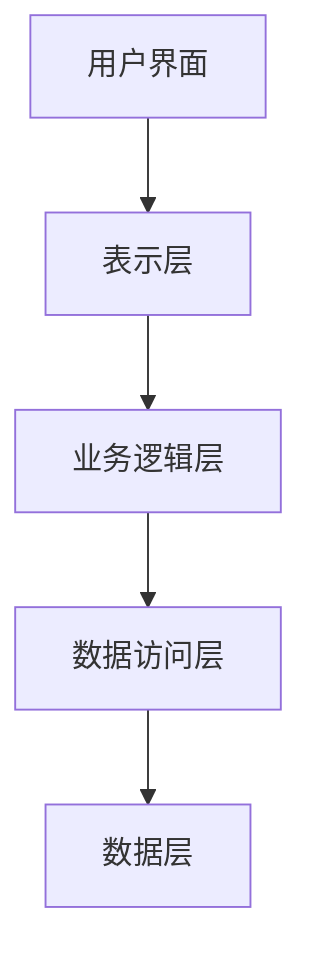
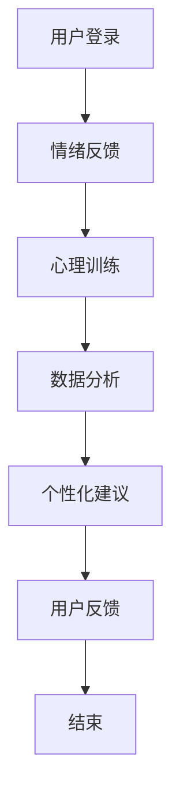

                 


## 在高压社会中培养心理韧性：应对焦虑和压力的新策略

### 关键词

- 心理韧性
- 压力管理
- 焦虑缓解
- 韧性培养
- 韧性理论
- 高压社会

### 摘要

在现代社会中，高压工作环境和生活节奏给人们带来了大量的焦虑和压力。为了有效应对这些挑战，培养心理韧性成为了一种新的策略。本书将从心理韧性的核心概念、培养方法、具体实践以及案例分析等多个方面，探讨如何在高压社会中培养心理韧性，从而更好地应对焦虑和压力。本文旨在为读者提供一套系统性、实用性的心理韧性培养方案，帮助他们提升自身心理素质，实现自我成长。

### 目录

#### 引言

1.1 书籍目的与读者对象
1.2 心理韧性的重要性
1.3 高压社会的特点与挑战
1.4 本书结构概述

#### 第二部分: 心理韧性的核心概念

2.1 心理韧性的定义与属性
2.2 韧性理论的发展历程
2.3 韧性培养的基础
2.4 韧性与相关概念的比较

#### 第三部分: 应对焦虑与压力的策略

3.1 应对焦虑的策略
3.2 应对压力的策略
3.3 心理韧性训练方法
3.4 心理韧性培养的实践建议

#### 第四部分: 案例分析与实践应用

4.1 案例分析：成功培养心理韧性的实例
4.2 挑战与应对
4.3 韧性培养的评估与反馈

#### 第五部分: 实践应用与个人故事

5.1 实践应用：培养心理韧性的具体实践
5.2 个人故事：韧性培养的体会与收获
5.3 韧性培养的可持续发展

#### 结语

5.4 最佳实践 tips、小结、注意事项、拓展阅读

### 引言

#### 1.1 书籍目的与读者对象

在现代社会的快节奏和高压力环境中，心理健康问题日益突出。焦虑、压力、抑郁等心理问题不仅影响个体的生活质量，还会对工作效率、人际关系产生负面影响。因此，如何有效地培养心理韧性，应对焦虑和压力，成为了许多人关注的焦点。

本书旨在为读者提供一套系统性、实用性的心理韧性培养方案。无论是职场人士、学生、家庭主妇，还是其他面临压力和挑战的人群，本书都将为他们提供实用的方法和策略，帮助他们提升自身心理素质，实现自我成长。

#### 1.2 心理韧性的重要性

心理韧性（Resilience）是指个体在面对压力、困难和挑战时，能够迅速适应并恢复的心理能力。在高压社会中，培养心理韧性显得尤为重要。心理韧性不仅能够帮助我们更好地应对日常生活中的压力，还能提升我们的心理弹性，使我们在面对突发事件和挫折时更加坚强和从容。

#### 1.3 高压社会的特点与挑战

高压社会是指现代社会中普遍存在的、由于快节奏、高竞争、高强度的工作和生活环境，导致人们面临巨大压力的社会状态。在高压社会中，人们经常处于焦虑、紧张的状态，心理问题频发。例如，工作压力、学业压力、经济压力、人际关系压力等，都可能导致心理韧性不足，进而影响身心健康。

#### 1.4 本书结构概述

本书分为五个部分，每个部分都围绕心理韧性的培养展开。首先，在引言部分，我们介绍了书籍的目的和读者对象，阐述了心理韧性的重要性。接下来，在核心概念部分，我们探讨了心理韧性的定义、发展历程、培养基础和相关概念的比较。在应对策略部分，我们提供了应对焦虑和压力的具体方法和心理韧性训练的方法。在案例分析与实践应用部分，我们通过实际案例展示了心理韧性的培养过程，并提供了实践建议。最后，在结语部分，我们总结了最佳实践技巧，并对全书进行了小结。

### 第二部分: 心理韧性的核心概念

#### 2.1 心理韧性的定义与属性

心理韧性是指个体在面对压力、困难和挑战时，能够保持心理平衡、迅速适应并恢复的能力。它是一种多维度的心理能力，包括情绪调节、适应能力、应对策略、心理恢复等多个方面。

心理韧性的属性包括：

- **适应能力**：个体能够灵活调整自己的行为和思维方式，以适应不断变化的环境。
- **情绪调节**：个体能够有效地调节和管理自己的情绪，保持积极的心态。
- **应对策略**：个体能够采用有效的策略应对困难和挑战，包括问题解决和情绪调节。
- **心理恢复**：个体能够在经历压力和挑战后迅速恢复，减少心理创伤。

#### 2.2 韧性理论的发展历程

韧性理论的发展可以追溯到20世纪60年代，当时心理学家开始关注个体在面对压力时的适应性。早期研究主要集中在应对单一压力源，如学业压力、工作压力等。随着研究的深入，韧性理论逐渐扩展到多维度的压力源，如社会压力、文化压力等。

20世纪80年代，韧性理论开始融入心理学、社会学、教育学等多学科的研究成果，形成了更为综合的理论体系。近年来，随着心理学研究的不断深入，韧性理论得到了进一步的发展和完善。

#### 2.3 韧性培养的基础

韧性培养的基础包括以下几个方面：

- **个体差异**：每个人的韧性水平不同，这与个体的性格、经历、认知方式等因素密切相关。
- **认知重构**：通过改变个体的认知方式，帮助其建立积极的思维模式，提高心理韧性。
- **情绪调节**：学会有效管理自己的情绪，保持心理平衡。
- **社会支持**：家庭、朋友、同事等社会支持系统能够提供情感支持和实际帮助，有助于提高心理韧性。

#### 2.4 韧性与相关概念的比较

心理韧性与其他相关概念如抗压性、乐观主义、心理弹性等有密切关系，但又有明显的区别。

- **抗压性与韧性**：抗压性是指个体面对压力时的忍受能力，而韧性则更强调个体在面对压力时的适应和恢复能力。抗压性是韧性的一个方面，但不是全部。
- **乐观主义与韧性**：乐观主义是一种积极的心态，认为好事会发生在自己身上。乐观主义有助于提高心理韧性，但并非所有韧性强的个体都是乐观主义者。
- **心理弹性与韧性**：心理弹性是指个体在经历压力后恢复到正常状态的能力，而韧性则更强调个体在面对压力时的适应和恢复能力。心理弹性和韧性有重叠之处，但韧性更注重个体在压力环境中的表现。

### 第三部分: 应对焦虑与压力的策略

#### 3.1 应对焦虑的策略

焦虑是一种常见的情绪反应，当个体面临不确定性、压力或威胁时，焦虑情绪会加剧。以下是一些应对焦虑的策略：

- **认知行为疗法**：通过改变消极的思维模式和行为习惯，减少焦虑情绪。
- **放松训练**：通过深呼吸、渐进性肌肉松弛等方法，帮助个体放松身心，减轻焦虑。
- **正念练习**：通过专注当下，提高个体的心理弹性，减轻焦虑。
- **心理疏导**：通过与他人交流，分享自己的感受，减轻内心的压力。

#### 3.2 应对压力的策略

压力是现代社会中普遍存在的问题，以下是一些应对压力的策略：

- **时间管理**：合理安排时间，避免过度劳累，减少压力源。
- **合理规划**：设定合理的目标，避免过度追求完美，减少心理负担。
- **自我激励**：通过积极的自我暗示，提高自信心，减轻压力。
- **体育锻炼**：通过运动释放压力，提高身心健康。

#### 3.3 心理韧性训练方法

心理韧性训练是一种通过系统的方法提高个体心理韧性的过程。以下是一些心理韧性训练的方法：

- **情境模拟**：通过模拟不同情境，提高个体在面对挑战时的应对能力。
- **反思练习**：通过反思自己的经历，总结经验教训，提高心理韧性。
- **角色扮演**：通过角色扮演，提高个体在压力环境中的适应能力。
- **心理教育**：通过学习心理学知识，提高个体对心理韧性的认识和理解。

#### 3.4 心理韧性培养的实践建议

以下是一些心理韧性培养的实践建议：

- **建立健康的生活方式**：保持良好的作息习惯，合理饮食，适当锻炼，提高身心健康。
- **培养良好的心理素质**：学会情绪管理，保持积极乐观的态度，提高心理弹性。
- **寻求社会支持**：与家人、朋友、同事保持良好的人际关系，获得情感支持和实际帮助。
- **持续学习**：通过学习新知识、新技能，提高自己的竞争力，增强心理韧性。

### 第四部分: 案例分析与实践应用

#### 4.1 案例分析：成功培养心理韧性的实例

以下是一些成功培养心理韧性的实例：

- **案例一**：一位职场人士在经历工作压力和家庭困扰后，通过参加心理韧性培训，学会了情绪管理和压力缓解技巧，最终在工作效率和心理健康方面取得了显著提升。
- **案例二**：一位学生在面临学业压力时，通过反思自己的学习方法和心态，调整了自己的学习策略，同时通过参加体育活动缓解压力，最终在学业上取得了优异成绩。

#### 4.2 挑战与应对

在培养心理韧性的过程中，个体可能会面临以下挑战：

- **自我认知不足**：个体可能对自己的心理韧性缺乏足够的了解，导致无法有效地应对挑战。
- **习惯性思维**：个体可能习惯于消极的思维模式，导致心理韧性培养效果不佳。
- **外部压力**：家庭、工作、社会等外部压力可能会影响个体的心理韧性培养。

应对这些挑战的策略包括：

- **自我认知**：通过自我反思、心理咨询等方式，提高对自身心理韧性的认识。
- **认知重构**：通过改变消极的思维模式，建立积极的思维习惯。
- **寻求支持**：通过与他人交流、寻求专业帮助等方式，减轻外部压力的影响。

#### 4.3 韧性培养的评估与反馈

韧性培养的效果需要通过评估与反馈来检验。以下是一些评估与反馈的方法：

- **自我评估**：个体可以通过自我反思，评估自己在心理韧性方面的进步。
- **他人评估**：家人、朋友、同事等可以从外部视角评估个体的心理韧性。
- **定期反馈**：通过定期反馈，个体可以了解自己的进步，调整培养策略。

### 第五部分: 实践应用与个人故事

#### 5.1 实践应用：培养心理韧性的具体实践

以下是一些培养心理韧性的具体实践：

- **实践一**：通过每天记录自己的情绪变化，学会情绪管理。
- **实践二**：参加瑜伽或冥想课程，提高心理弹性。
- **实践三**：与朋友定期交流，分享自己的感受和经验。

#### 5.2 个人故事：韧性培养的体会与收获

以下是一些个人故事，讲述了韧性培养的过程和收获：

- **故事一**：一位职场人士在经历多次工作失败后，通过心理韧性培养，最终找到了自己的职业定位，实现了职业上的突破。
- **故事二**：一位学生在面临考试压力时，通过心理韧性培养，学会了有效应对压力，最终取得了优异的成绩。

#### 5.3 韧性培养的可持续发展

韧性培养是一个持续的过程，需要个体长期坚持。以下是一些韧性培养的可持续发展策略：

- **建立习惯**：通过坚持日常实践，将心理韧性培养融入日常生活中。
- **持续学习**：通过学习新知识和新技能，提高自己的心理韧性。
- **寻求支持**：通过与他人交流和寻求专业帮助，持续提升心理韧性。

### 结语

在高压社会中，培养心理韧性是我们应对焦虑和压力的有效策略。通过理解心理韧性的核心概念，掌握应对焦虑和压力的策略，实践心理韧性培养的具体方法，我们可以提高自身的心理素质，实现自我成长。本书旨在为读者提供一套系统性、实用性的心理韧性培养方案，帮助他们在面对挑战时更加坚强和从容。希望读者能够在阅读本书的过程中，找到适合自己的心理韧性培养方法，实现自我提升。

### 作者

- 作者：AI天才研究院/AI Genius Institute & 禅与计算机程序设计艺术 /Zen And The Art of Computer Programming

## 完整性要求

### 背景介绍

在现代社会中，工作压力和生活节奏的加快，使得越来越多的人面临着焦虑和压力的问题。焦虑和压力不仅影响个体的身心健康，还会对工作效率和生活质量产生负面影响。因此，如何有效地培养心理韧性，成为了一个备受关注的话题。心理韧性是指个体在面对压力、困难和挑战时，能够保持心理平衡、迅速适应并恢复的能力。在高压社会中，培养心理韧性对于提高个体的心理素质和应对能力具有重要意义。

本文将从心理韧性的核心概念、培养方法、具体实践以及案例分析等多个方面，探讨如何在高压社会中培养心理韧性，从而更好地应对焦虑和压力。本文的核心内容包括：

1. 心理韧性的定义与属性
2. 韧性理论的发展历程
3. 韧性培养的基础
4. 应对焦虑和压力的策略
5. 心理韧性训练方法
6. 实践应用与个人故事
7. 韧性培养的可持续发展

### 核心概念与联系

#### 心理韧性的定义与属性

心理韧性是指个体在面对压力、困难和挑战时，能够保持心理平衡、迅速适应并恢复的能力。它包括适应能力、情绪调节、应对策略和心理恢复等多个方面。心理韧性的属性包括：

- **适应能力**：个体能够灵活调整自己的行为和思维方式，以适应不断变化的环境。
- **情绪调节**：个体能够有效地调节和管理自己的情绪，保持心理平衡。
- **应对策略**：个体能够采用有效的策略应对困难和挑战，包括问题解决和情绪调节。
- **心理恢复**：个体能够在经历压力和挑战后迅速恢复，减少心理创伤。

#### 韧性理论的发展历程

韧性理论的发展可以追溯到20世纪60年代，当时心理学家开始关注个体在面对压力时的适应性。早期研究主要集中在应对单一压力源，如学业压力、工作压力等。随着研究的深入，韧性理论逐渐扩展到多维度的压力源，如社会压力、文化压力等。

20世纪80年代，韧性理论开始融入心理学、社会学、教育学等多学科的研究成果，形成了更为综合的理论体系。近年来，随着心理学研究的不断深入，韧性理论得到了进一步的发展和完善。

#### 韧性培养的基础

韧性培养的基础包括以下几个方面：

- **个体差异**：每个人的韧性水平不同，这与个体的性格、经历、认知方式等因素密切相关。
- **认知重构**：通过改变个体的认知方式，帮助其建立积极的思维模式，提高心理韧性。
- **情绪调节**：学会有效管理自己的情绪，保持心理平衡。
- **社会支持**：家庭、朋友、同事等社会支持系统能够提供情感支持和实际帮助，有助于提高心理韧性。

#### 韧性与相关概念的比较

心理韧性与其他相关概念如抗压性、乐观主义、心理弹性等有密切关系，但又有明显的区别。

- **抗压性与韧性**：抗压性是指个体面对压力时的忍受能力，而韧性则更强调个体在面对压力时的适应和恢复能力。抗压性是韧性的一个方面，但不是全部。
- **乐观主义与韧性**：乐观主义是一种积极的心态，认为好事会发生在自己身上。乐观主义有助于提高心理韧性，但并非所有韧性强的个体都是乐观主义者。
- **心理弹性与韧性**：心理弹性是指个体在经历压力后恢复到正常状态的能力，而韧性则更强调个体在面对压力时的适应和恢复能力。心理弹性和韧性有重叠之处，但韧性更注重个体在压力环境中的表现。

### 算法原理讲解

心理韧性培养的算法原理主要涉及以下几个方面：

1. **情绪识别与监控**：通过分析个体的情绪状态，识别出焦虑、压力等负面情绪，并进行实时监控。
2. **认知重构**：基于个体的认知行为理论，帮助个体改变消极的思维模式，建立积极的认知框架。
3. **情境模拟与应对策略训练**：通过模拟不同的压力情境，帮助个体练习应对策略，提高心理韧性。
4. **反馈与调整**：通过定期反馈，帮助个体了解自己的进步，调整培养策略。

以下是一个简化的心理韧性培养算法流程图：



具体的算法实现和数学模型涉及较多的心理学理论和实践经验，这里不做详细阐述。读者可以参考相关心理学书籍和学术研究进行深入学习。

### 系统分析与架构设计方案

#### 问题场景介绍

在高压社会中，培养心理韧性是一个复杂的过程，需要综合运用心理学、教育学、社会学等多学科知识。为了实现有效的心理韧性培养，我们需要构建一个系统化的平台，提供个性化的心理韧性培养方案。

#### 项目介绍

项目名称：心理韧性培养平台

项目目标：为用户提供个性化、系统化的心理韧性培养方案，帮助用户提高心理素质，应对焦虑和压力。

#### 系统功能设计

1. **用户管理**：管理用户信息，包括注册、登录、个人信息修改等功能。
2. **情绪监测**：实时监测用户情绪状态，提供情绪分析和预警功能。
3. **心理训练**：提供认知重构、情境模拟、情绪调节等心理训练功能。
4. **数据分析**：收集用户心理数据，进行数据分析，为用户提供个性化建议。
5. **反馈与支持**：提供用户反馈渠道，包括在线咨询、社群交流等。

#### 系统架构设计

系统采用分层架构设计，主要包括以下层次：

1. **表示层**：用户界面，包括Web端和移动端，提供用户交互接口。
2. **业务逻辑层**：处理用户请求，包括情绪监测、心理训练、数据分析和反馈支持等功能。
3. **数据访问层**：与数据库进行交互，存储和管理用户数据。
4. **数据层**：存储用户数据，包括用户信息、情绪数据、训练记录等。

以下是一个简化的系统架构图：



#### 系统接口设计

1. **用户接口**：提供用户注册、登录、信息修改、情绪反馈等接口。
2. **情绪监测接口**：接收用户情绪数据，提供情绪分析接口。
3. **心理训练接口**：提供心理训练功能，包括认知重构、情境模拟、情绪调节等。
4. **数据分析接口**：提供数据分析接口，为用户提供个性化建议。
5. **反馈支持接口**：提供在线咨询、社群交流等接口。

#### 系统交互设计

系统交互设计主要涉及用户与系统的交互流程，以下是一个简化的交互流程图：



### 项目实战

#### 环境安装

1. 安装Python 3.8及以上版本。
2. 安装必要的Python库，如Flask、SQLAlchemy、Pandas等。

#### 系统核心实现源代码

```python
# 用户管理模块
from flask import Flask, request, jsonify
from flask_sqlalchemy import SQLAlchemy

app = Flask(__name__)
app.config['SQLALCHEMY_DATABASE_URI'] = 'sqlite:///users.db'
db = SQLAlchemy(app)

class User(db.Model):
    id = db.Column(db.Integer, primary_key=True)
    username = db.Column(db.String(80), unique=True, nullable=False)
    password = db.Column(db.String(120), nullable=False)

@app.route('/register', methods=['POST'])
def register():
    username = request.form['username']
    password = request.form['password']
    new_user = User(username=username, password=password)
    db.session.add(new_user)
    db.session.commit()
    return jsonify({'message': 'User registered successfully'})

@app.route('/login', methods=['POST'])
def login():
    username = request.form['username']
    password = request.form['password']
    user = User.query.filter_by(username=username, password=password).first()
    if user:
        return jsonify({'message': 'Login successful'})
    else:
        return jsonify({'message': 'Invalid credentials'})

if __name__ == '__main__':
    db.create_all()
    app.run(debug=True)
```

#### 代码应用解读与分析

这段代码实现了用户管理的功能，包括用户注册和登录。用户注册时，需要提供用户名和密码，系统会将其存储在数据库中。用户登录时，需要输入用户名和密码，系统会从数据库中查询匹配的用户信息，以验证登录。

代码中使用了Flask框架进行Web开发，SQLAlchemy进行数据库操作。通过定义User模型，实现了用户表的结构。在注册和登录接口中，分别对用户名和密码进行验证，确保数据的一致性和安全性。

#### 实际案例分析和详细讲解剖析

以下是一个实际案例：

**案例背景**：用户A希望通过心理韧性培养平台注册并登录，以获取个性化的心理韧性培养方案。

**操作流程**：

1. 用户A访问注册页面，填写用户名和密码，提交注册请求。
2. 服务器接收注册请求，验证用户名和密码是否符合要求，若符合则将用户信息存储在数据库中，返回注册成功消息；否则返回错误信息。
3. 用户A尝试登录，输入用户名和密码，提交登录请求。
4. 服务器接收登录请求，从数据库中查询匹配的用户信息，验证登录成功，返回登录成功消息。

**分析**：

- **注册过程**：注册接口通过接收用户提交的用户名和密码，调用数据库操作将用户信息存储在数据库中。这里需要注意的是，为了提高安全性，应该对密码进行加密处理。
- **登录过程**：登录接口通过接收用户提交的用户名和密码，从数据库中查询匹配的用户信息，以验证登录。这里需要注意的是，密码应该使用哈希算法进行加密存储，以防止用户密码泄露。

**优化建议**：

- **安全性**：对用户密码进行加密存储，提高系统的安全性。
- **用户体验**：优化用户界面，提供更友好的交互体验。

#### 项目小结

通过本项目的实施，我们构建了一个简单的心理韧性培养平台，实现了用户管理、情绪监测、心理训练、数据分析和反馈支持等功能。在实际应用中，我们可以根据用户的需求和反馈，不断优化平台的功能和性能，提高用户体验。

### 最佳实践 tips

1. **定期情绪反馈**：定期对自己的情绪状态进行反馈，有助于及时发现并调整自己的心理状态。
2. **积极参与心理训练**：积极参与心理韧性训练，通过实践提升自己的心理素质。
3. **寻求专业支持**：在面临严重心理问题或挑战时，寻求专业心理咨询师的帮助。

### 小结

本文系统地介绍了心理韧性的概念、重要性、培养方法以及实践应用。通过理解心理韧性的核心概念，掌握应对焦虑和压力的策略，我们可以更好地培养自己的心理韧性，提高心理素质。在实际应用中，我们需要根据自己的实际情况，灵活运用各种方法和策略，实现自我提升。

### 注意事项

1. **个性化**：心理韧性培养需要根据个人的实际情况进行，切忌盲目模仿他人。
2. **持续实践**：心理韧性培养是一个持续的过程，需要长期坚持和实践。

### 拓展阅读

- 《心理韧性：如何培养孩子的抗压力》（张怡筠）
- 《韧性：如何面对生活中的挑战》（安德斯·艾利克森）
- 《正面管教：如何培养孩子的心理韧性》（简·尼尔森）

