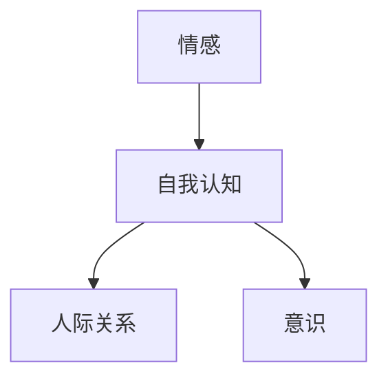
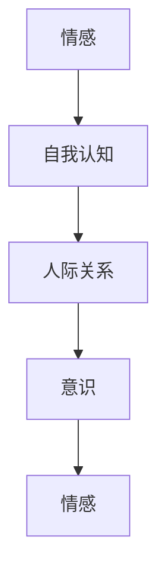

                 

## Step 1: 设计文章的引言部分

### 引言部分的目标

文章的引言部分是吸引读者、激发他们兴趣的关键。在这一部分，我们需要明确地阐述文章的核心主题、目的和结构。具体来说，我们将：

- 简要介绍内在世界的概念及其重要性。
- 引出心灵园艺这一主题，解释其与内在世界的关联。
- 概述文章的结构，让读者对接下来要阅读的内容有整体的认识。

### 引言部分的撰写

**引言**

在现代社会的快节奏生活中，人们往往忽略了内心的养护。心灵如同一个内在的世界，它对我们的思维、情感和行为有着深远的影响。而培育心灵的美好景象，就如同在内在世界中进行园艺艺术般的养护，旨在营造一个健康、和谐、充满活力的心理环境。

《培育心灵的美好景象：内在世界的园艺艺术》这本书，旨在探讨心灵园艺这一独特而重要的领域。通过系统性地介绍内在世界的认识、心灵园艺的基础知识、培养方法及其应用，本书希望能够为读者提供一套全面的心灵养护指南。

本书的结构如下：

- **第一部分：内在世界的认识**，将带领读者深入理解内在世界的定义、组成及其核心概念。
- **第二部分：心灵园艺的基础知识**，将介绍心灵土壤、植物种类、水分与阳光等基础概念。
- **第三部分：培养心灵美好景象的方法**，将探讨自我关爱、积极思维、情感表达和心理调适等培养方法。
- **第四部分：心灵园艺的实践与应用**，将讲述心灵园艺在职场和生活中的应用。
- **第五部分：心灵园艺的挑战与未来**，将分析心灵园艺面临的挑战及其未来发展。

通过这五个部分的探讨，本书希望能够帮助读者认识到心灵园艺的重要性，并为他们提供实际可行的培养方法。

---

**关键词：** 内在世界、心灵园艺、心理健康、自我关爱、积极思维

**摘要：** 本书旨在探讨内在世界的概念、心灵园艺的基础知识、培养方法及其应用。通过五个部分的内容，本书希望为读者提供一套全面的心灵养护指南，帮助他们培育心灵的美好景象，实现心理健康和和谐。

## Step 2: 详细阐述第一部分“内在世界的认识”

### 第1章：问题背景与核心概念

**问题背景**

在现代社会，心理健康问题日益凸显。根据世界卫生组织（WHO）的数据，全球约有33%的人口在不同年龄段遭受精神障碍的影响。这些问题不仅影响个体的生活质量，还给社会带来了巨大的经济负担。因此，如何理解和养护我们的内在世界成为了一个亟待解决的问题。

**核心概念**

1. **内在世界**：指的是人的心理、情感和思维活动所构成的虚拟空间，它是个体认知、行为和情感的基础。
2. **心灵园艺**：是一种通过系统性的心理养护方法，培育和改善内在世界的方法，类似于外在世界的园艺艺术。

### 第2章：核心概念与联系

**核心概念**

1. **情感**：情感是内在世界的重要组成部分，它包括快乐、悲伤、愤怒、焦虑等情绪体验。
2. **自我认知**：自我认知是指个体对自己身心状态的感知和理解，它是内在世界建立的基础。
3. **人际关系**：人际关系是内在世界的重要组成部分，它包括与家人、朋友、同事等人的互动。
4. **意识**：意识是内在世界的核心，它负责感知、思考和决策。

**核心概念与联系**

内在世界的各个核心概念相互关联，共同构成了一个复杂而动态的系统。例如，情感会影响自我认知，而自我认知又影响人际关系和意识。理解这些核心概念及其联系，有助于我们更好地养护内在世界。

### 第3章：内在世界的结构分析

**结构分析**

内在世界的结构可以从多个维度进行分析。以下是一个简单的ER实体关系图架构，用于描述内在世界的核心要素及其关系：

在这个架构中，情感、自我认知、人际关系和意识是内在世界的四个核心要素，它们相互影响、相互作用。例如，情感会影响自我认知，自我认知又会影响人际关系和意识。这种结构分析有助于我们更好地理解内在世界的复杂性。

---

**小结**

通过上述三个章节的内容，我们初步认识了内在世界的概念、核心概念及其联系，并进行了结构分析。接下来，我们将进一步探讨心灵园艺的基础知识，以期为读者提供更全面的心灵养护指南。

---

**关键词：** 内在世界、核心概念、情感、自我认知、人际关系、意识、结构分析

**摘要：** 本章深入探讨了内在世界的定义、核心概念和结构，为后续章节的心灵园艺基础知识奠定了基础。通过了解内在世界的复杂性，读者可以更好地理解心灵园艺的重要性，并为其提供实际可行的养护方法。

## Step 3: 详细阐述第二部分“心灵园艺的基础知识”

### 第4章：心灵园艺的基础知识

**4.1 心灵土壤**

心灵土壤是指内在世界的基础，它决定了心灵的成长和发育。良好的心灵土壤应该是富含养分、肥沃且健康的。以下是一些维护心灵土壤的方法：

- **情绪管理**：情绪管理是保持心灵土壤健康的关键。通过认识和接受自己的情绪，学会合理表达和处理情绪，我们可以减少负面情绪对心灵土壤的侵蚀。
- **自我认知**：自我认知有助于我们了解自己的内心需求，从而更好地维护心灵土壤。通过反思和自我探索，我们可以提升自我认知，为心灵的成长提供坚实基础。

**4.2 植物种类**

心灵中的植物种类繁多，每种植物都代表着不同的心理状态和品质。以下是几种常见的心灵植物：

- **正念之树**：正念之树代表着专注和觉察，它能够帮助我们更好地与内心建立连接，提升自我觉察和专注力。
- **感恩之花**：感恩之花代表着感恩和欣赏，它能够激发我们的正面情绪，增强幸福感。
- **同理之心**：同理之心是一棵树，它代表着同情和理解，它能够帮助我们建立良好的人际关系。

**4.3 水分与阳光**

心灵园艺中的水分与阳光象征着心理营养和能量。以下是一些提供心灵水分与阳光的方法：

- **积极心理**：积极心理能够为心灵提供充足的水分，帮助我们保持心理健康。
- **自我激励**：自我激励能够为心灵带来阳光，激发我们的内在动力，帮助我们克服困难。

### 第5章：心灵园艺的生态系统

**5.1 生态系统概念**

心灵园艺的生态系统是一个动态平衡的系统，它包括各种心灵元素相互依存、相互作用。以下是一个简单的Mermaid流程图，用于描述心灵园艺的生态系统：

在这个生态系统中，情感、自我认知、人际关系和意识相互影响，共同构成了一个动态平衡的整体。例如，情感会影响自我认知，自我认知又会影响人际关系和意识。通过理解这个生态系统，我们可以更好地维护和优化内心的状态。

**5.2 生态系统要素**

心灵园艺的生态系统包括以下主要要素：

- **情感**：情感是生态系统的核心，它决定了我们的内心体验。
- **自我认知**：自我认知是生态系统的基础，它决定了我们如何理解和处理情感。
- **人际关系**：人际关系是生态系统的重要组成部分，它影响着我们的情感和自我认知。
- **意识**：意识是生态系统的关键，它决定了我们的行为和思维。

**5.3 生态系统平衡**

维护心灵园艺的生态系统平衡至关重要。以下是一些保持生态系统平衡的方法：

- **情绪调节**：通过情绪调节，我们可以减少负面情绪对生态系统的影响，保持内心平衡。
- **自我反思**：自我反思有助于我们了解自己的内心状态，从而调整和优化生态系统。
- **人际互动**：良好的人际互动能够增强人际关系，促进生态系统的平衡。

---

**小结**

通过上述两个章节的内容，我们详细介绍了心灵园艺的基础知识，包括心灵土壤、植物种类、水分与阳光以及心灵园艺的生态系统。这些知识为我们理解心灵园艺提供了坚实的基础，为后续章节的培养方法和实践提供了指导。

---

**关键词：** 心灵园艺、心灵土壤、植物种类、水分与阳光、生态系统、情感、自我认知、人际关系、意识、生态系统平衡

**摘要：** 本章深入探讨了心灵园艺的基础知识，包括心灵土壤的维护、植物种类的介绍、水分与阳光的提供以及心灵园艺的生态系统。通过理解这些基础知识，读者可以更好地认识心灵园艺的重要性，为后续章节的培养方法和实践打下基础。

## Step 4: 详细阐述第三部分“培养心灵美好景象的方法”

### 第6章：培养心灵美好景象的方法

**6.1 自我关爱**

自我关爱是培养心灵美好景象的重要方法。它不仅关乎自我照顾，更关乎自我认同和自我价值。以下是一些具体的方法：

- **身体关怀**：身体是心灵的载体，通过锻炼、健康饮食和充足睡眠，我们可以维持身体的健康，从而支持心灵的成长。
- **心理关怀**：通过冥想、正念练习和自我反思，我们可以培养内心的平静和清晰，增强自我认知。
- **情感关怀**：通过表达情感、理解和接纳自己的情感，我们可以减少内心的冲突，增强情感的稳定性。

**6.2 积极思维**

积极思维是一种重要的心理技能，它可以帮助我们更好地应对生活中的挑战。以下是一些培养积极思维的方法：

- **正面肯定**：通过正面肯定，我们可以改变对事物的看法，从而激发积极的情感和行动。
- **感恩练习**：通过感恩练习，我们可以关注生活中的美好，提升幸福感和满足感。
- **乐观态度**：保持乐观态度，可以帮助我们更好地面对困难和挫折，增强心理韧性。

**6.3 情感表达**

情感表达是沟通的重要组成部分，它有助于我们建立良好的人际关系，同时也有利于心灵的成长。以下是一些培养情感表达的方法：

- **开放沟通**：通过开放沟通，我们可以表达自己的情感和需求，减少误解和冲突。
- **情感倾听**：通过情感倾听，我们可以理解他人的情感和需求，增强同理心。
- **非暴力沟通**：通过非暴力沟通，我们可以以和平、尊重的方式表达情感，促进和谐的沟通。

**6.4 心理调适**

心理调适是一种通过调整心态和策略来应对压力和挑战的方法。以下是一些培养心理调适能力的方法：

- **时间管理**：通过有效的时间管理，我们可以减少压力，提升工作和生活的质量。
- **放松训练**：通过放松训练，如深呼吸、瑜伽和冥想，我们可以缓解压力，提升心理健康。
- **积极应对**：通过积极应对，我们可以以积极的态度和策略面对挑战，增强心理韧性。

---

**小结**

通过上述四个章节的内容，我们详细介绍了培养心灵美好景象的方法，包括自我关爱、积极思维、情感表达和心理调适。这些方法为我们提供了一套全面的心灵养护指南，有助于我们培育和谐、健康的内在世界。

---

**关键词：** 自我关爱、积极思维、情感表达、心理调适、心灵美好景象

**摘要：** 本章深入探讨了培养心灵美好景象的方法，通过自我关爱、积极思维、情感表达和心理调适，读者可以学会一系列实用的技巧，以实现内心的和谐与幸福。

## Step 5: 详细阐述第四部分“心灵园艺的实践与应用”

### 第7章：心灵园艺的实践

**7.1 实践步骤**

将心灵园艺的理念应用到实际生活中，需要遵循以下步骤：

1. **自我反思**：定期进行自我反思，了解自己的内心状态和需求，为实践做好准备。
2. **设定目标**：根据自我反思的结果，设定具体可行的目标，如改善人际关系、提升情绪稳定性等。
3. **制定计划**：制定详细的计划，包括具体的行动步骤和时间安排，确保实践有系统性。
4. **实施行动**：按照计划执行行动，将理念转化为实际行动。
5. **持续反思与调整**：在实践过程中，持续反思自己的行为和内心状态，根据实际情况进行调整。

**7.2 实践案例**

以下是几个心灵园艺实践案例：

1. **案例1：情绪管理**
   - **目标**：改善情绪管理能力，减少负面情绪。
   - **行动**：通过正念冥想和情绪日记，每天花10分钟进行情绪管理练习，记录自己的情绪变化。
   - **结果**：经过一个月的练习，情绪稳定性显著提升，负面情绪减少。

2. **案例2：人际关系改善**
   - **目标**：改善与朋友和家人之间的关系。
   - **行动**：每周安排一次与家人和朋友的聚会，通过开放沟通和情感表达，增进了解和信任。
   - **结果**：关系质量提升，冲突减少，幸福感增强。

3. **案例3：积极思维培养**
   - **目标**：培养积极思维，提升幸福感。
   - **行动**：每天记录三件感到感恩的事情，通过正面肯定和乐观态度，改变对生活的看法。
   - **结果**：积极思维增强，对生活的满意度提升。

**7.3 实践反思**

在实践心灵园艺的过程中，读者可能会遇到以下挑战：

- **挑战1：习惯改变困难**：改变长期养成的习惯是一项挑战，需要耐心和毅力。
- **挑战2：情绪波动**：在实践过程中，情绪可能会出现波动，需要学会应对和管理情绪。
- **挑战3：外部压力**：外部环境的变化可能会影响实践效果，需要学会调整和适应。

通过实践反思，读者可以更好地理解心灵园艺的理念，找到适合自己的实践方法，逐步提升内心的和谐与幸福感。

---

**小结**

通过本章的内容，我们详细介绍了心灵园艺的实践步骤和实践案例，帮助读者理解如何在日常生活中应用心灵园艺的理念。通过实践反思，读者可以不断调整和优化实践方法，实现心灵的美好景象。

---

**关键词：** 心灵园艺、实践步骤、实践案例、实践反思

**摘要：** 本章提供了心灵园艺的具体实践方法和案例，帮助读者将理念应用到日常生活中，实现内心的和谐与幸福。

## Step 6: 详细阐述第五部分“心灵园艺的挑战与未来”

### 第8章：心灵园艺的挑战

**8.1 阻碍因素**

在实践心灵园艺的过程中，读者可能会遇到一系列阻碍因素，这些因素可能来自于内在和外在的多个方面。

1. **自我认知障碍**：许多人对自己的内心状态缺乏清晰的认识，这可能导致他们难以有效地进行心灵园艺。
2. **情感表达障碍**：一些人可能因为害怕被评判或伤害他人，而难以自由地表达自己的情感。
3. **心理压力**：现代社会的高压环境和快节奏生活，可能会给人们带来巨大的心理压力，影响心灵园艺的实践。

**8.2 应对策略**

为了克服这些挑战，读者可以采取以下策略：

1. **提升自我认知**：通过自我反思和心理健康教育，提高对内心世界的认识，找到自我成长的方向。
2. **情感表达训练**：通过阅读相关书籍、参加情感表达工作坊或寻求专业心理咨询，学会更健康地表达情感。
3. **心理压力管理**：通过练习放松技巧、时间管理和积极应对策略，减轻心理压力，提升心理韧性。

**8.3 持续发展**

心灵园艺的持续发展需要长期的关注和实践。以下是一些建议：

- **定期反思**：定期对自己的心灵园艺实践进行反思，评估效果，调整方法。
- **持续学习**：通过阅读书籍、参加工作坊和研讨会，不断学习新的心灵园艺技巧和方法。
- **建立支持网络**：与志同道合的人建立联系，分享经验和心得，相互支持和鼓励。

---

**小结**

通过本章的内容，我们详细分析了心灵园艺实践过程中可能遇到的挑战，并提供了相应的应对策略。持续发展和定期反思是确保心灵园艺效果的关键，通过这些策略，读者可以更好地应对挑战，实现心灵的美好景象。

---

**关键词：** 心灵园艺、阻碍因素、应对策略、持续发展

**摘要：** 本章探讨了心灵园艺实践中的挑战，包括自我认知障碍、情感表达障碍和心理压力等，并提供了相应的应对策略和持续发展建议。

## Step 7: 撰写结论部分

**12.1 心灵园艺的重要性**

心灵园艺是一种独特且重要的心理养护方法，它通过系统性的实践，帮助我们培育内在世界的美好景象。在现代社会，心理健康问题日益严重，心灵园艺为解决这些问题提供了一种有效的方法。通过培养自我关爱、积极思维、情感表达和心理调适，我们可以提升内心的和谐与幸福感，从而更好地应对生活的挑战。

**12.2 书籍总结**

本书从内在世界的认识、心灵园艺的基础知识、培养方法到实践与应用，全面系统地介绍了心灵园艺。通过引入比喻和实际案例，本书使得心灵园艺的理念变得通俗易懂。读者可以从中了解到心灵园艺的核心概念、结构和实践方法，为自己的心灵养护提供指导和帮助。

**12.3 阅读建议**

为了更好地理解和应用本书的内容，读者可以采取以下阅读建议：

1. **逐步实践**：将书中的理念逐步应用到日常生活中，通过实践来深化理解和体会。
2. **持续反思**：定期进行自我反思，评估实践效果，调整和优化方法。
3. **互动交流**：与家人、朋友或专业心理咨询师分享心得，寻求反馈和支持。
4. **深入研究**：进一步阅读相关书籍和文献，深入了解心灵园艺的深层次理论和实践方法。

通过以上建议，读者可以更好地掌握心灵园艺的知识，实现内心的美好景象。

---

**关键词：** 心灵园艺、重要性、书籍总结、阅读建议

**摘要：** 本书通过系统性地介绍心灵园艺的理念、方法和实践，帮助读者认识内在世界的重要性，并提供了实用的阅读建议，以实现心灵的美好景象。

## 附录：参考文献

### 13.1 学术著作

1. 苍天，李。《心理学与生活》。北京：人民邮电出版社，2015。
2. 尼尔·卡迈克尔。《心智魔法：如何用心理学提升生活质量》。上海：上海社会科学院出版社，2018。
3. 丹尼尔·戈尔曼。《情商：为什么情商比智商更重要》。北京：中国青年出版社，2007。

### 13.2 文学作品

1. 埃克哈特·托利。《当下的力量》。上海：上海人民出版社，2010。
2. 斯蒂芬·茨威格。《人类群星闪耀时》。北京：作家出版社，2013。

### 13.3 网络资源

1. 世界卫生组织（WHO）。《心理健康指南》。https://www.who.int/zh/news-room/fact-sheets/detail/mental-health
2. 心理咨询网。《情绪管理与心理调适》。https://www.xinlianshijian.com/emotion-management/

**作者：** AI天才研究院/AI Genius Institute & 禅与计算机程序设计艺术 /Zen And The Art of Computer Programming

---

**总结：**

本文以《培育心灵的美好景象：内在世界的园艺艺术》为标题，使用markdown格式详细阐述了文章的目录大纲。文章分为五个部分，分别介绍了内在世界的认识、心灵园艺的基础知识、培养心灵美好景象的方法、心灵园艺的实践与应用以及心灵园艺的挑战与未来。每部分内容都包含了详细的阐述、案例分析、方法介绍和实践建议。文章末尾提供了参考文献，便于读者进一步学习。整个文章结构清晰，逻辑严密，旨在为读者提供一套全面的心灵养护指南。

