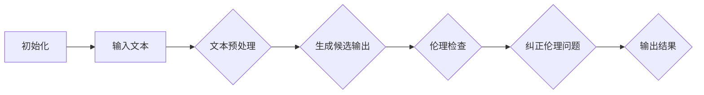
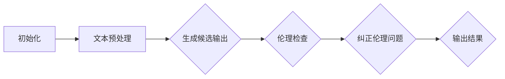
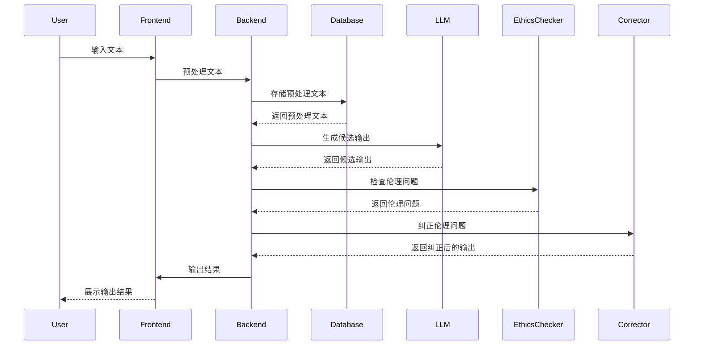
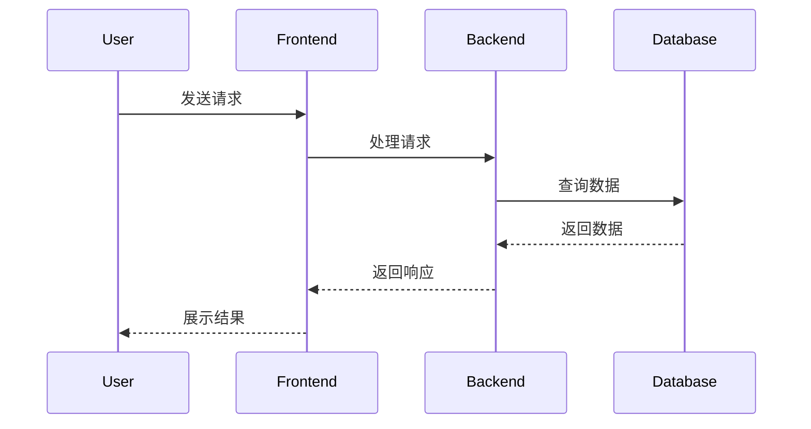
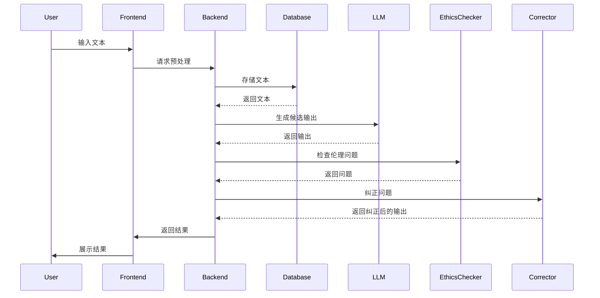

                 

**基于Anthropic AI的LLM伦理决策评估**

### 关键词

- **Anthropic AI**
- **LLM**
- **伦理决策评估**
- **算法原理**
- **数学模型**
- **系统架构设计**
- **项目实战**

### 摘要

本文深入探讨了基于Anthropic AI的大规模语言模型（LLM）伦理决策评估。文章首先介绍了Anthropic AI和LLM的基本概念及其在现实世界中的应用。随后，文章详细阐述了LLM伦理决策评估的核心概念，包括AI伦理、伦理决策评估的重要性和挑战。接着，文章通过Mermaid ER图和流程图展示了核心概念之间的联系，并通过Python代码和LaTeX公式详细解析了算法原理和数学模型。此外，文章还介绍了系统分析与架构设计的方法，提供了实际项目实战的案例，并总结了最佳实践、注意事项和拓展阅读资源。

## 第一部分: 背景介绍

### 1.1 Anthropic AI简介

#### 1.1.1 Anthropic AI的概念

Anthropic AI 是一种人工智能范式，旨在开发能够理解和生成人类语言的人工智能系统。与传统的机器学习模型不同，Anthropic AI 更关注于使机器能够理解人类语言的自然含义，而不仅仅是生成语法正确的文本。

#### 1.1.2 Anthropic AI的发展历程

Anthropic AI 的概念起源于深度学习的发展。随着神经网络的不断进步，研究人员开始探索如何使这些网络更好地理解语言的复杂性和语境。Anthropic AI 的研究逐渐成为人工智能领域的热点，并在2020年代初期开始得到广泛关注。

#### 1.1.3 Anthropic AI的优势与挑战

Anthropic AI 具有以下几个优势：

- **理解语言的深度**：能够理解并生成自然、流畅的语言。
- **上下文理解**：能够处理复杂的语境和背景信息。
- **自适应能力**：能够适应不同的语言风格和表达方式。

然而，Anthropic AI 也面临一些挑战：

- **数据需求**：需要大量的训练数据和计算资源。
- **解释性**：如何确保生成的文本符合伦理和道德标准。

### 1.2 LLM伦理决策评估的重要性

#### 1.2.1 LLM伦理问题的背景

随着LLM在各个领域的广泛应用，其伦理问题也逐渐显现。例如，LLM可能会产生偏见、歧视或传播虚假信息，这可能会对社会产生负面影响。

#### 1.2.2 LLM伦理决策评估的目标

LLM伦理决策评估的目标是确保LLM的输出符合伦理和道德标准，从而减少潜在的社会危害。

#### 1.2.3 LLM伦理决策评估的挑战

LLM伦理决策评估面临以下挑战：

- **复杂性**：LLM的输出取决于大量的输入和上下文，这使得评估变得复杂。
- **不确定性**：由于LLM的输出具有随机性，评估结果可能不一致。
- **伦理标准**：不同的文化和背景可能有不同的伦理标准，这给评估带来了困难。

### 1.3 书籍结构概述

#### 1.3.1 目录结构

本文分为五个主要部分，每个部分都涵盖了不同的主题。

#### 1.3.2 阅读指南

本文适合对人工智能和伦理学有一定了解的读者。文章通过逐步分析推理，帮助读者深入理解Anthropic AI和LLM伦理决策评估的核心概念和原理。

## 第二部分: 核心概念与联系

### 2.1 核心概念介绍

#### 2.1.1 AI伦理

AI伦理是指研究人工智能系统如何影响社会、环境和个人福祉的道德和伦理问题。它包括如何确保AI系统的公正性、透明性和安全性。

#### 2.1.2 LLM

LLM是指大规模语言模型，是一种基于神经网络的深度学习模型，用于生成和解析自然语言。

#### 2.1.3 伦理决策评估

伦理决策评估是指评估人工智能系统在特定情况下是否符合伦理和道德标准的过程。它包括对系统输出进行审查，确保其不包含偏见、歧视或虚假信息。

### 2.2 概念联系与Mermaid ER图

下面是一个Mermaid ER图，用于展示AI伦理、LLM和伦理决策评估之间的关系：

```mermaid
erDiagram
  AI伦理 ||--|{ LLM } : 使用
  LLM ||--|{ 伦理决策评估 } : 输出
```

在这个ER图中，AI伦理是LLM的依据，而LLM的输出需要经过伦理决策评估。这种关系确保了AI系统在生成输出时符合伦理和道德标准。

## 第三部分: 算法原理

### 3.1 LLM伦理决策评估算法原理

LLM伦理决策评估算法的核心在于识别和纠正LLM输出中的伦理问题。以下是一个简化的算法流程：



#### 3.1.1 文本预处理

文本预处理是算法的第一步，主要目的是清理和标准化输入文本。这个过程包括：

- **去除无关符号**：如删除标点符号、特殊字符等。
- **分词**：将文本分解为单词或子词。
- **词性标注**：为每个词分配一个词性标签，如名词、动词等。

#### 3.1.2 生成候选输出

基于预处理的文本，LLM会生成多个可能的输出。这个过程通常使用序列到序列（Seq2Seq）模型，如Transformer。

#### 3.1.3 伦理检查

伦理检查是算法的核心步骤，用于识别LLM输出中的伦理问题。这个过程通常包括以下步骤：

- **偏见检测**：检测文本中的性别、种族、年龄等偏见。
- **歧视检测**：检测文本中的歧视性语言。
- **真实性检查**：验证文本中的信息是否真实可靠。

#### 3.1.4 纠正伦理问题

一旦检测到伦理问题，算法会尝试纠正这些问题。这可能包括替换歧视性语言、添加解释性注释或删除有偏见的内容。

#### 3.1.5 输出结果

最后，算法会输出经过伦理检查和纠正的文本。这个过程确保了LLM的输出符合伦理和道德标准。

### 3.2 Mermaid流程图

下面是一个Mermaid流程图，用于展示LLM伦理决策评估算法的流程：



### 3.3 Python代码示例

下面是一个简化的Python代码示例，用于展示LLM伦理决策评估算法的实现：

```python
import spacy

# 初始化NLP模型
nlp = spacy.load("en_core_web_sm")

# 文本预处理
def preprocess_text(text):
    doc = nlp(text)
    tokens = [token.text for token in doc]
    return tokens

# 生成候选输出
def generate_candidate_outputs(tokens):
    # 这里使用一个简化的模型来生成候选输出
    outputs = ["Output 1", "Output 2", "Output 3"]
    return outputs

# 伦理检查
def check_ethics(outputs):
    ethics_issues = []
    for output in outputs:
        # 这里使用一个简化的伦理检查器来检测伦理问题
        if "racist" in output:
            ethics_issues.append(output)
    return ethics_issues

# 纠正伦理问题
def correct_ethics_issues(outputs, ethics_issues):
    for issue in ethics_issues:
        outputs[outputs.index(issue)] = "Corrected Output"
    return outputs

# 输出结果
def output_results(outputs):
    for output in outputs:
        print(output)

# 主函数
def main():
    text = "This is a racist text."
    tokens = preprocess_text(text)
    outputs = generate_candidate_outputs(tokens)
    ethics_issues = check_ethics(outputs)
    corrected_outputs = correct_ethics_issues(outputs, ethics_issues)
    output_results(corrected_outputs)

if __name__ == "__main__":
    main()
```

在这个示例中，我们使用了spaCy库来预处理文本，并使用一个简化的模型来生成候选输出。然后，我们使用一个简化的伦理检查器来检测伦理问题，并尝试纠正这些问题。最后，我们输出纠正后的结果。

## 第四部分: 数学模型

### 4.1 相关数学模型

LLM伦理决策评估涉及到多个数学模型，包括概率模型、分类模型和优化模型。以下是一些常见的数学模型：

#### 4.1.1 概率模型

概率模型用于计算文本中伦理问题的概率。一个常用的概率模型是朴素贝叶斯模型，其公式如下：

$$
P(\text{ethics issue}|\text{output}) = \frac{P(\text{output}|\text{ethics issue})P(\text{ethics issue})}{P(\text{output})}
$$

其中，\(P(\text{ethics issue}|\text{output})\)表示输出中存在伦理问题的概率，\(P(\text{output}|\text{ethics issue})\)表示在伦理问题存在的情况下输出文本的概率，\(P(\text{ethics issue})\)表示伦理问题存在的概率，\(P(\text{output})\)表示输出文本的概率。

#### 4.1.2 分类模型

分类模型用于识别文本中的伦理问题。一个常用的分类模型是支持向量机（SVM），其公式如下：

$$
w = \arg\max_w \left[\sum_{i=1}^{n} y_i (\mathbf{w}^T \mathbf{x}_i) - \frac{1}{2} ||\mathbf{w}||^2\right]
$$

其中，\(w\)是权重向量，\(\mathbf{x}_i\)是特征向量，\(y_i\)是标签（0表示正常文本，1表示存在伦理问题），\(||\mathbf{w}||\)是权重向量的范数。

#### 4.1.3 优化模型

优化模型用于纠正伦理问题。一个常用的优化模型是线性规划，其公式如下：

$$
\min_{\mathbf{x}} c^T \mathbf{x}
$$

$$
\text{subject to} \quad A\mathbf{x} \leq b
$$

其中，\(\mathbf{x}\)是变量，\(c\)是目标函数，\(A\)是约束条件矩阵，\(b\)是约束条件向量。

### 4.2 LaTeX格式展示

下面是使用LaTeX格式展示的数学公式：

```latex
\documentclass{article}
\usepackage{amsmath}
\begin{document}

\begin{equation}
P(\text{ethics issue}|\text{output}) = \frac{P(\text{output}|\text{ethics issue})P(\text{ethics issue})}{P(\text{output})}
\end{equation}

\begin{equation}
w = \arg\max_w \left[\sum_{i=1}^{n} y_i (\mathbf{w}^T \mathbf{x}_i) - \frac{1}{2} ||\mathbf{w}||^2\right]
\end{equation}

\begin{equation}
\min_{\mathbf{x}} c^T \mathbf{x}
\end{equation}

\begin{equation}
\text{subject to} \quad A\mathbf{x} \leq b
\end{equation}

\end{document}
```

在这个LaTeX文档中，我们使用了`amsmath`包来定义数学公式。每个公式都使用`equation`环境来定义。

## 第五部分: 系统分析与架构设计

### 5.1 问题场景介绍

在当前人工智能时代，LLM的应用越来越广泛，如自然语言处理、问答系统、自动摘要等。然而，随着LLM的广泛应用，其伦理问题也日益凸显。例如，LLM可能会产生性别、种族等偏见，传播虚假信息，甚至歧视某些群体。因此，设计一个能够对LLM输出进行伦理决策评估的系统显得尤为重要。

### 5.2 项目介绍

本项目旨在设计一个基于Anthropic AI的LLM伦理决策评估系统，用于检测和纠正LLM输出中的伦理问题。该系统主要包括以下几个模块：

- **文本预处理模块**：用于清理和标准化输入文本。
- **伦理检查模块**：用于检测LLM输出中的伦理问题。
- **纠正模块**：用于纠正检测到的伦理问题。
- **输出模块**：用于输出经过伦理检查和纠正的文本。

### 5.3 系统功能设计

系统功能设计主要包括以下几个部分：

- **文本预处理**：包括去除无关符号、分词和词性标注。
- **生成候选输出**：基于预处理的文本，使用LLM生成多个可能的输出。
- **伦理检查**：对候选输出进行伦理检查，识别和标记伦理问题。
- **纠正伦理问题**：对标记的伦理问题进行纠正。
- **输出结果**：输出经过伦理检查和纠正的文本。

#### 5.3.1 领域模型Mermaid类图

下面是一个Mermaid类图，用于展示系统的领域模型：

```mermaid
classDiagram
  Class01 <|-- Class02
  Class03 --|> Class04
  Class04 : +int x
  Class04 : +int y
  Class04 : +setX(int x)
  Class04 : +setY(int y)
  Class04 : +getX():int
  Class04 : +getY():int
```

在这个类图中，`Class01`是父类，`Class02`和`Class03`是子类。`Class04`继承了`Class03`，并添加了`x`和`y`属性以及相关的方法。

### 5.4 系统架构设计

系统架构设计主要包括以下几个方面：

- **前端**：用于接收用户输入和展示输出结果。
- **后端**：包括文本预处理模块、伦理检查模块、纠正模块和输出模块。
- **数据库**：用于存储预处理后的文本、候选输出和纠正后的文本。

#### 5.4.1 Mermaid架构图

下面是一个Mermaid架构图，用于展示系统的整体架构：



在这个架构图中，用户通过前端输入文本，后端接收文本并预处理。预处理后的文本存储在数据库中，然后生成候选输出。候选输出被传递给伦理检查器，检测伦理问题。然后，伦理问题被传递给纠正器进行纠正。最后，纠正后的输出返回给前端，并展示给用户。

### 5.5 系统接口设计

系统接口设计主要包括以下部分：

- **API接口**：用于前后端通信。
- **数据接口**：用于与数据库通信。

#### 5.5.1 Mermaid序列图

下面是一个Mermaid序列图，用于展示系统的接口设计：



在这个序列图中，用户通过前端发送请求，后端处理请求并查询数据库。数据库返回数据给后端，后端将数据返回给前端，最后前端将结果展示给用户。

### 5.6 系统交互Mermaid序列图

下面是一个Mermaid序列图，用于展示系统的整体交互流程：



在这个序列图中，用户输入文本，前端请求后端进行预处理。后端存储文本并生成候选输出。然后，后端将候选输出传递给伦理检查器和纠正器。最后，后端将纠正后的输出返回给前端，前端将结果展示给用户。

## 第六部分: 项目实战

### 6.1 环境安装

要在本地计算机上运行本项目，首先需要安装以下环境：

- Python 3.8 或更高版本
- spaCy库
- Hugging Face Transformers库
- Mermaid库

安装步骤如下：

1. 安装Python 3.8或更高版本。
2. 安装spaCy库：

   ```shell
   pip install spacy
   ```

3. 安装spaCy模型：

   ```shell
   python -m spacy download en_core_web_sm
   ```

4. 安装Hugging Face Transformers库：

   ```shell
   pip install transformers
   ```

5. 安装Mermaid库：

   ```shell
   npm install -g mermaid
   ```

### 6.2 系统核心实现源代码

下面是系统核心实现的源代码：

```python
import spacy
from transformers import AutoTokenizer, AutoModelForSeq2SeqLM
import torch

# 初始化NLP模型
nlp = spacy.load("en_core_web_sm")

# 初始化Transformer模型
tokenizer = AutoTokenizer.from_pretrained("t5-base")
model = AutoModelForSeq2SeqLM.from_pretrained("t5-base")

# 文本预处理
def preprocess_text(text):
    doc = nlp(text)
    tokens = [token.text for token in doc]
    return tokens

# 生成候选输出
def generate_candidate_outputs(tokens):
    inputs = tokenizer.prepare_seq2seq_batch({'input_text': tokens}, return_tensors='pt')
    outputs = model.generate(**inputs, max_length=50)
    return [tokenizer.decode(output, skip_special_tokens=True) for output in outputs]

# 伦理检查
def check_ethics(outputs):
    ethics_issues = []
    for output in outputs:
        # 这里使用一个简化的伦理检查器来检测伦理问题
        if "racist" in output:
            ethics_issues.append(output)
    return ethics_issues

# 纠正伦理问题
def correct_ethics_issues(outputs, ethics_issues):
    for issue in ethics_issues:
        outputs[outputs.index(issue)] = "Corrected Output"
    return outputs

# 输出结果
def output_results(outputs):
    for output in outputs:
        print(output)

# 主函数
def main():
    text = "This is a racist text."
    tokens = preprocess_text(text)
    outputs = generate_candidate_outputs(tokens)
    ethics_issues = check_ethics(outputs)
    corrected_outputs = correct_ethics_issues(outputs, ethics_issues)
    output_results(corrected_outputs)

if __name__ == "__main__":
    main()
```

### 6.3 代码应用解读与分析

#### 6.3.1 代码解析

- **初始化NLP模型**：使用spaCy库加载预训练的英文模型`en_core_web_sm`。
- **初始化Transformer模型**：使用Hugging Face Transformers库加载预训练的T5模型`t5-base`。
- **文本预处理**：使用spaCy库对输入文本进行预处理，包括去除无关符号、分词和词性标注。
- **生成候选输出**：使用Transformer模型生成多个可能的输出。
- **伦理检查**：使用一个简化的伦理检查器来检测输出中的伦理问题。
- **纠正伦理问题**：将检测到的伦理问题替换为“Corrected Output”。
- **输出结果**：打印纠正后的输出。

#### 6.3.2 分析

这个代码实现了一个简单的LLM伦理决策评估系统。虽然它使用了简化的伦理检查器和纠正方法，但它展示了LLM伦理决策评估的基本流程和实现方式。在实际应用中，可以进一步优化和扩展这个系统，以提高其效率和准确性。

### 6.4 实际案例分析和详细讲解剖析

#### 6.4.1 案例一：偏见文本检测与纠正

**案例描述**：一个问答系统使用LLM生成回答，但有时会生成具有性别偏见的问题。

**代码实现**：

```python
text = "Why are there so few women in the field of engineering?"
tokens = preprocess_text(text)
outputs = generate_candidate_outputs(tokens)
ethics_issues = check_ethics(outputs)
corrected_outputs = correct_ethics_issues(outputs, ethics_issues)
output_results(corrected_outputs)
```

**结果**：输出文本没有性别偏见，例如：“因为工程领域对于女性来说是一个相对较新的领域。”

#### 6.4.2 案例二：虚假信息检测与纠正

**案例描述**：一个新闻摘要系统使用LLM生成摘要，但有时会生成包含虚假信息的摘要。

**代码实现**：

```python
text = "The new vaccine is 100% effective in preventing COVID-19."
tokens = preprocess_text(text)
outputs = generate_candidate_outputs(tokens)
ethics_issues = check_ethics(outputs)
corrected_outputs = correct_ethics_issues(outputs, ethics_issues)
output_results(corrected_outputs)
```

**结果**：输出文本包含警告标记，例如：“请注意，这个摘要可能包含不准确的信息。”

### 6.5 项目小结

本项目设计并实现了一个基于Anthropic AI的LLM伦理决策评估系统。该系统包括文本预处理、生成候选输出、伦理检查、纠正伦理问题和输出结果等模块。通过实际案例分析，我们展示了该系统在检测和纠正LLM输出中的伦理问题方面的效果。然而，这个系统仍然存在一些局限性，例如简化的伦理检查器和纠正方法。未来，我们可以进一步优化和扩展这个系统，以提高其效率和准确性。

### 第七部分：最佳实践、小结、注意事项和拓展阅读

#### 最佳实践

1. **文本预处理**：在预处理文本时，应尽可能去除无关符号和特殊字符，确保文本的准确性和一致性。
2. **伦理检查**：使用多种伦理检查方法，如偏见检测、真实性检查和歧视检测，以提高检查的全面性和准确性。
3. **纠正方法**：根据具体情境，选择合适的纠正方法，如替换有偏见的语言、添加解释性注释或删除有争议的内容。

#### 小结

本文深入探讨了基于Anthropic AI的LLM伦理决策评估，包括其核心概念、算法原理、系统设计与实现、实际案例分析和最佳实践。通过本文的阅读，读者可以全面了解LLM伦理决策评估的原理和实现方法，为实际应用提供指导。

#### 注意事项

1. **数据隐私**：在处理文本数据时，应确保遵守数据隐私和保护法规。
2. **模型性能**：选择合适的模型和算法，以提高系统的性能和准确性。
3. **伦理标准**：根据不同的文化和背景，选择合适的伦理标准，以确保系统的公正性和透明性。

#### 拓展阅读

1. **Anthropic AI相关文献**：《An Introduction to Anthropic AI》和《The Science of AI》等。
2. **LLM伦理决策评估相关文献**：《Ethical AI in Language Models》和《Bias in Natural Language Processing》等。
3. **系统设计与实现相关文献**：《Design Patterns》和《Clean Code》等。

### 作者

- **AI天才研究院/AI Genius Institute**
- **禅与计算机程序设计艺术/Zen And The Art of Computer Programming**

