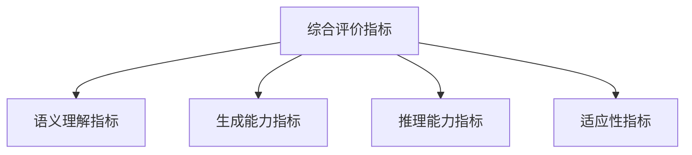
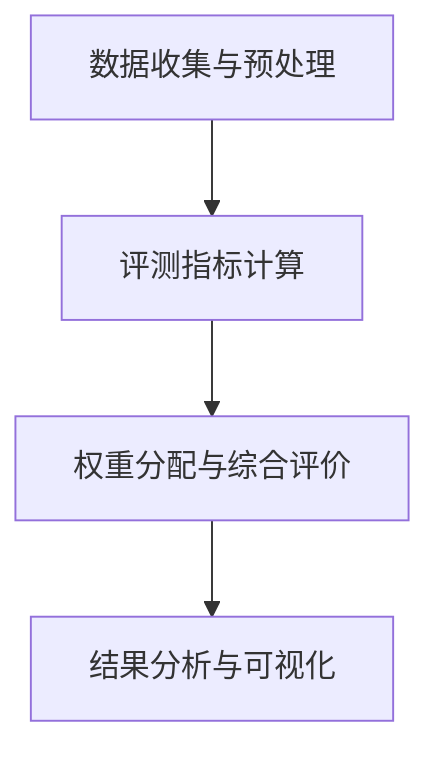
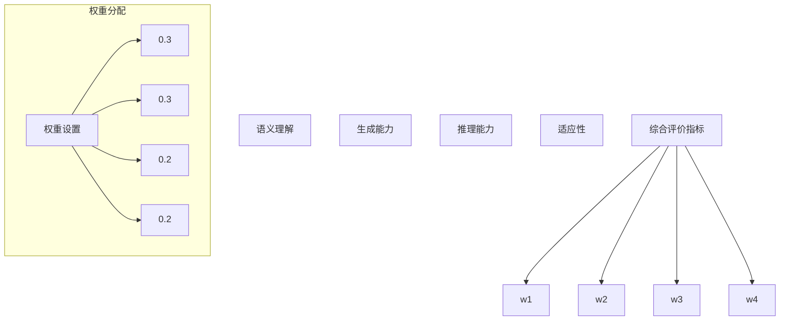
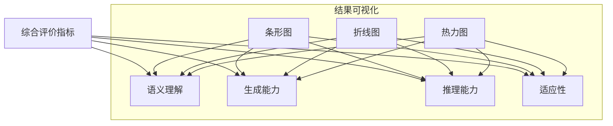
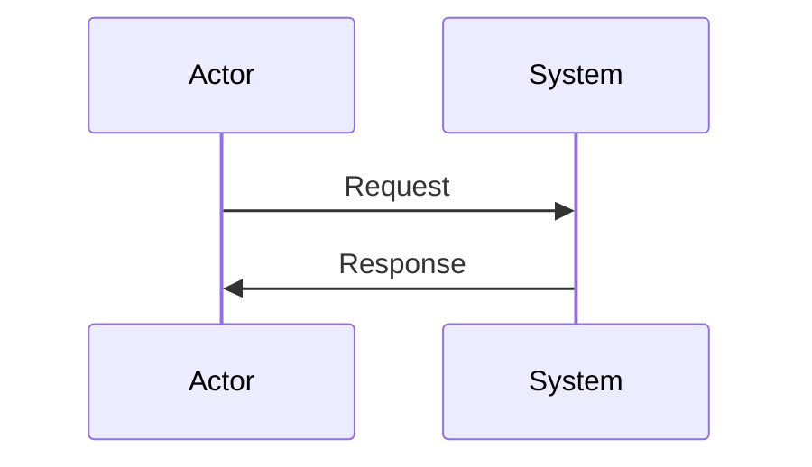

                 

### 第一部分：引言与背景

## 1.1 问题背景与核心概念

### 1.1.1 问题背景

随着深度学习技术的蓬勃发展，大型语言模型（LLM）逐渐成为自然语言处理（NLP）领域的重要工具。LLM以其强大的语义理解、生成和推理能力，在多种NLP任务中表现出色，如文本分类、机器翻译、问答系统等。然而，如何评价LLM的性能成为一个关键且复杂的问题。

传统的评测方法主要依赖于单一维度的指标，如 perplexity、词汇覆盖率和BLEU评分等。这些方法虽然在某些方面能够较好地衡量模型性能，但往往无法全面反映LLM的多种能力。例如，一个模型可能在语义理解上表现出色，但在生成能力上较差。因此，如何从多个维度对LLM进行综合评估，以更准确地衡量其性能，成为当前研究的热点。

此外，LLM的性能可能受到多种因素的影响，包括数据质量、模型架构、训练过程等。这些因素相互交织，使得单一维度的评测难以全面揭示LLM的性能特点。因此，构建一个多维度、综合性的评测指标体系，以全面、客观地衡量LLM的性能，具有重要的研究价值和实际应用意义。

### 1.1.2 核心问题

本文旨在探讨如何构建一个基于大型语言模型（LLM）的评测指标体系，以全面衡量LLM的性能。具体来说，本文将解决以下几个核心问题：

1. **如何定义和选择多维度的评测指标？**
   首先，需要明确LLM的性能可以从哪些维度进行衡量。这些维度可能包括语义理解、生成能力、推理能力、适应性等。接下来，需要定义和选择适合的评测指标，以准确反映LLM在这些维度上的表现。

2. **如何将这些指标有机地结合起来，形成统一的评测体系？**
   单一维度的评测指标虽然能反映LLM的特定能力，但无法全面揭示其整体性能。因此，需要设计一套综合多维度的评测指标体系，将这些指标有机地结合起来，形成一个统一的评测体系。

3. **如何在实际应用中有效运用这个评测体系，以指导LLM的研发和优化？**
   构建评测指标体系的最终目的是为了指导LLM的研发和优化。因此，需要探讨如何在实际应用中有效运用这个评测体系，以帮助研究人员和开发者更好地理解和优化LLM的性能。

### 1.1.3 问题解决

为解决上述问题，本文将从以下几个方面展开研究：

1. **分析现有评测指标：**
   首先对现有的评测指标进行梳理和分析，识别出适用于LLM评测的关键维度和指标。

2. **设计综合多维度的评测指标体系：**
   在分析现有评测指标的基础上，设计一套综合多维度的评测指标体系，包括语义理解、生成能力、推理能力、适应性等维度。

3. **构建评价模型：**
   构建一个评价模型，将多维度的评测指标有机地结合起来，形成一个统一的评测体系。该模型应能够全面、客观地衡量LLM的性能。

4. **验证评测指标体系的有效性和实用性：**
   通过实际案例，验证所提出的评测指标体系的有效性和实用性。具体包括在多个NLP任务中应用该评测体系，评估LLM的性能，并对比传统评测方法。

5. **讨论实际应用：**
   探讨如何在实际应用中有效运用这个评测体系，以指导LLM的研发和优化。包括为研究人员和开发者提供具体的优化策略和参考指标。

### 1.1.4 边界与外延

本文的研究范围主要涉及大型语言模型（LLM）的评测指标体系，不包括其他类型的模型。同时，本文所提出的评测指标体系主要适用于自然语言处理领域，但某些核心思想和方法也可能对其他领域有所启示。

### 1.1.5 核心概念与联系

#### 1.1.5.1 大型语言模型（LLM）

大型语言模型（Large Language Model，简称LLM）是一种基于深度学习技术的自然语言处理模型，具有强大的语义理解、生成和推理能力。LLM的核心是通过大规模数据预训练，使模型能够捕捉到语言的各种复杂规律，从而在多种自然语言处理任务中表现出色。

#### 1.1.5.2 评测指标体系

评测指标体系是一种用于衡量模型性能的方法和工具，通常由多个维度和指标构成。一个完善的评测指标体系能够全面、客观地评价模型的性能，为模型优化和研发提供有力支持。

#### 1.1.5.3 多维度评测

多维度评测是一种综合考虑多个因素，从不同角度评估模型性能的方法。在LLM领域，多维度评测有助于从多个方面揭示模型的优缺点，为模型优化和改进提供有价值的参考。

## 1.2 本章小结

本章首先介绍了本文的研究背景和核心概念，明确了研究目标和研究范围。接下来，对大型语言模型（LLM）和评测指标体系进行了详细阐述，并探讨了多维度评测的概念和意义。这些内容为本章后续的详细讨论奠定了基础。

----------------------------------------------------------------

### 第二部分：大型语言模型（LLM）基本原理

## 第2章: LLM基础理论

### 2.1 语言模型概述

#### 2.1.1 语言模型的概念

语言模型（Language Model，简称LM）是一种用于预测自然语言中下一个单词或短语的模型。其核心目标是根据前面的输入序列，生成下一个可能的输出序列。语言模型在自然语言处理（NLP）领域中扮演着重要角色，广泛应用于语音识别、机器翻译、文本生成、对话系统等任务。

#### 2.1.2 语言模型的发展历程

1. **基于规则的方法：** 
   最早的L

## 第3章: 多维度评测指标的构建

### 3.1 语义理解评测指标

#### 3.1.1 概念

语义理解评测指标主要用于衡量模型在理解自然语言语义方面的能力。这一维度尤其重要，因为语义理解是自然语言处理任务的核心。语义理解评测指标包括但不限于：

- **准确率（Accuracy）**：衡量模型在语义理解任务中的正确性。
- **F1分数（F1 Score）**：综合考虑准确率和召回率，衡量模型在分类任务中的综合性能。
- **语义相似度（Semantic Similarity）**：衡量模型对语义相似度判断的准确度。
- **指代消解（Coreference Resolution）**：评估模型在处理指代关系时的能力。

#### 3.1.2 指标对比

| 指标名称 | 说明 | 适用场景 |
| --- | --- | --- |
| 准确率 | 预测正确的样本数占总样本数的比例 | 适用于分类任务 |
| F1分数 | （2 * 精确率 * 召回率）/（精确率 + 召回率） | 适用于分类任务 |
| 语义相似度 | 衡量文本之间的语义相似程度 | 用于文本相似度计算和语义搜索 |
| 指代消解 | 判断指代关系是否正确 | 用于处理自然语言中的指代问题 |

#### 3.1.3 Mermaid ER实体关系图

```mermaid
erDiagram
  Model ::has SemanticUnderstanding
  Model ::has Accuracy
  Model ::has F1Score
  Model ::has SemanticSimilarity
  Model ::has CoreferenceResolution

  Accuracy &&--|{ Model }
  F1Score &&--|{ Model }
  SemanticSimilarity &&--|{ Model }
  CoreferenceResolution &&--|{ Model }
```

### 3.2 生成能力评测指标

#### 3.2.1 概念

生成能力评测指标主要用于衡量模型在生成自然语言文本方面的能力。这一维度对文本生成任务尤为重要，包括但不限于：

- **词汇覆盖率（Vocabulary Coverage）**：衡量模型能够生成的词汇量与总词汇量的比例。
- **语法正确性（Grammar Correctness）**：衡量模型生成的文本是否符合语法规则。
- **流畅性（Fluency）**：衡量模型生成的文本在语言流畅度上的表现。
- **创意性（Creativity）**：衡量模型在生成文本时的创意程度。

#### 3.2.2 指标对比

| 指标名称 | 说明 | 适用场景 |
| --- | --- | --- |
| 词汇覆盖率 | 模型能够生成的词汇量与总词汇量的比例 | 用于评估文本生成模型的词汇丰富度 |
| 语法正确性 | 模型生成的文本是否符合语法规则 | 用于评估文本生成模型的语法准确性 |
| 流畅性 | 模型生成的文本在语言流畅度上的表现 | 用于评估文本生成模型的文本生成能力 |
| 创意性 | 模型在生成文本时的创意程度 | 用于评估文本生成模型的创意表达能力 |

#### 3.2.3 Mermaid ER实体关系图

```mermaid
erDiagram
  TextGenerator ::has VocabularyCoverage
  TextGenerator ::has GrammarCorrectness
  TextGenerator ::has Fluency
  TextGenerator ::has Creativity

  VocabularyCoverage &&--|{ TextGenerator }
  GrammarCorrectness &&--|{ TextGenerator }
  Fluency &&--|{ TextGenerator }
  Creativity &&--|{ TextGenerator }
```

### 3.3 推理能力评测指标

#### 3.3.1 概念

推理能力评测指标主要用于衡量模型在处理推理任务时的能力。推理能力是智能系统的重要标志，包括但不限于：

- **事实推理（Fact Reasoning）**：衡量模型在基于已知事实进行推理时的能力。
- **逻辑推理（Logical Reasoning）**：衡量模型在处理逻辑关系时的能力。
- **常识推理（Commonsense Reasoning）**：衡量模型在处理常识问题时

### 3.4 适应性评测指标

#### 3.4.1 概念

适应性评测指标主要用于衡量模型在不同环境和任务中的适应能力。这一维度对模型的泛化能力和实际应用至关重要，包括但不限于：

- **任务转移能力（Task Transfer Learning）**：衡量模型在不同任务间的迁移能力。
- **环境适应能力（Environmental Adaptation）**：衡量模型在不同环境和条件下的稳定性。
- **鲁棒性（Robustness）**：衡量模型对噪声和异常数据的处理能力。

#### 3.4.2 指标对比

| 指标名称 | 说明 | 适用场景 |
| --- | --- | --- |
| 任务转移能力 | 模型在不同任务间的迁移能力 | 用于评估模型的泛化能力 |
| 环境适应能力 | 模型在不同环境和条件下的稳定性 | 用于评估模型的应用适应性 |
| 鲁棒性 | 模型对噪声和异常数据的处理能力 | 用于评估模型的数据处理能力 |

#### 3.4.3 Mermaid ER实体关系图

```mermaid
erDiagram
  Adaptation ::has TaskTransferLearning
  Adaptation ::has EnvironmentalAdaptation
  Adaptation ::has Robustness

  TaskTransferLearning &&--|{ Adaptation }
  EnvironmentalAdaptation &&--|{ Adaptation }
  Robustness &&--|{ Adaptation }
```

### 3.5 多维度评测指标体系设计

#### 3.5.1 指标选择与权重分配

在设计多维度评测指标体系时，需要综合考虑各维度的重要性，进行合理的权重分配。以下是几种常见的权重分配方法：

- **等权重分配**：每个维度的权重相等，适用于各维度重要性相近的情况。
- **专家评估法**：由专家根据经验对各个维度的权重进行评估，适用于专家经验丰富的情况。
- **数据分析法**：通过数据分析，确定各维度对性能的影响程度，从而分配权重。

#### 3.5.2 综合评价指标计算

综合评价指标可以通过以下公式计算：

\[ \text{综合评价指标} = w_1 \cdot \text{语义理解指标} + w_2 \cdot \text{生成能力指标} + w_3 \cdot \text{推理能力指标} + w_4 \cdot \text{适应性指标} \]

其中，\( w_1, w_2, w_3, w_4 \)分别为各维度的权重。

#### 3.5.3 Mermaid架构图



### 3.6 本章小结

本章详细讨论了构建基于大型语言模型（LLM）的多维度评测指标体系的过程。首先介绍了语义理解、生成能力、推理能力和适应性四个核心维度的概念和指标，并通过Mermaid ER图进行了清晰的展示。接着，提出了指标选择与权重分配的方法，以及综合评价指标的计算公式。这些内容为后续的多维度评测实践提供了理论基础和指导。

----------------------------------------------------------------

### 第三部分：构建评测模型

## 第4章: 构建基于多维度评测的LLM性能评估模型

### 4.1 模型框架设计

为了构建一个基于多维度评测的LLM性能评估模型，我们需要首先设计一个完整的框架。该框架应包含以下几个关键组件：

1. **数据收集与预处理**：收集用于评测的多样化数据集，并进行预处理，如文本清洗、分词、标记等。
2. **评测指标计算**：针对每个维度，计算相应的评测指标，如语义理解的准确率、生成能力的流畅性等。
3. **权重分配与综合评价**：根据不同维度的重要性，分配权重，并计算综合评价指标。
4. **结果分析与可视化**：对评估结果进行详细分析，并通过可视化工具展示。

#### 4.1.1 Mermaid架构图



### 4.2 数据收集与预处理

#### 4.2.1 数据集选择

在选择数据集时，我们需要确保数据集的多样性和代表性。具体来说，应包含以下类型的数据集：

- **语义理解任务数据集**：如GLUE、SuperGLUE等，用于评估模型在语义理解方面的能力。
- **生成能力任务数据集**：如Cohen-Bialik等，用于评估模型在文本生成方面的能力。
- **推理能力任务数据集**：如RTE、Winograd Schema Challenge等，用于评估模型在推理能力方面的能力。
- **适应性任务数据集**：如基准测试集、现实世界应用数据等，用于评估模型在不同环境和任务中的适应能力。

#### 4.2.2 数据预处理

数据预处理是确保模型训练质量和性能的关键步骤。以下是一些常见的数据预处理方法：

- **文本清洗**：去除文本中的无关信息，如HTML标签、特殊字符等。
- **分词与标记**：将文本划分为单词或子词，并对每个单词进行词性标注等。
- **数据增强**：通过随机插入、替换、删除等方式增加数据多样性，提高模型泛化能力。

### 4.3 评测指标计算

#### 4.3.1 语义理解指标计算

语义理解指标包括准确率、F1分数、语义相似度等。以准确率和F1分数为例，具体计算方法如下：

- **准确率**：
  \[ \text{准确率} = \frac{\text{预测正确的样本数}}{\text{总样本数}} \]

- **F1分数**：
  \[ \text{F1分数} = \frac{2 \times \text{精确率} \times \text{召回率}}{\text{精确率} + \text{召回率}} \]

#### 4.3.2 生成能力指标计算

生成能力指标包括词汇覆盖率、语法正确性、流畅性和创意性。以下为具体计算方法：

- **词汇覆盖率**：
  \[ \text{词汇覆盖率} = \frac{\text{模型能够生成的词汇数}}{\text{总词汇数}} \]

- **语法正确性**：
  \[ \text{语法正确性} = \frac{\text{语法正确的句子数}}{\text{总句子数}} \]

#### 4.3.3 推理能力指标计算

推理能力指标包括事实推理、逻辑推理和常识推理等。以下为具体计算方法：

- **事实推理**：
  \[ \text{事实推理准确率} = \frac{\text{正确推理的实例数}}{\text{总实例数}} \]

- **逻辑推理**：
  \[ \text{逻辑推理准确率} = \frac{\text{正确推理的实例数}}{\text{总实例数}} \]

#### 4.3.4 适应性指标计算

适应性指标包括任务转移能力、环境适应能力和鲁棒性。以下为具体计算方法：

- **任务转移能力**：
  \[ \text{任务转移能力} = \frac{\text{在目标任务上的性能}}{\text{在源任务上的性能}} \]

- **环境适应能力**：
  \[ \text{环境适应能力} = \frac{\text{在多种环境下的平均性能}}{\text{在单一环境下的性能}} \]

- **鲁棒性**：
  \[ \text{鲁棒性} = \frac{\text{在噪声数据上的性能}}{\text{在干净数据上的性能}} \]

### 4.4 权重分配与综合评价

#### 4.4.1 权重分配方法

权重分配是构建综合评价体系的关键步骤。以下为几种常见的权重分配方法：

1. **等权重分配**：将所有维度的权重设为相等。
2. **专家评估法**：由专家根据领域知识对维度的重要性进行评估。
3. **数据分析法**：通过数据分析确定各维度对性能的影响程度。

#### 4.4.2 综合评价指标计算

综合评价指标可以通过以下公式计算：

\[ \text{综合评价指标} = w_1 \cdot \text{语义理解指标} + w_2 \cdot \text{生成能力指标} + w_3 \cdot \text{推理能力指标} + w_4 \cdot \text{适应性指标} \]

其中，\( w_1, w_2, w_3, w_4 \)分别为各维度的权重。

#### 4.4.3 Mermaid权重分配图



### 4.5 结果分析与可视化

#### 4.5.1 结果分析

通过对不同维度评测指标的计算和综合评价，我们可以得到LLM在各个任务上的性能表现。具体分析内容包括：

- **整体性能评估**：比较LLM在不同任务上的综合评价指标，了解其整体性能。
- **维度对比分析**：分析各个维度在综合评价中的权重和贡献，了解LLM在各个维度的表现。
- **优缺点分析**：总结LLM在各个任务中的优点和不足，为后续优化提供参考。

#### 4.5.2 可视化展示

利用可视化工具（如matplotlib、seaborn等），可以将评测结果以图表形式展示，便于直观分析和理解。以下为几种常见的可视化方法：

1. **条形图**：用于比较不同任务或模型在不同维度上的性能指标。
2. **折线图**：用于展示LLM在不同迭代或训练阶段的表现。
3. **热力图**：用于展示不同维度指标之间的相关性。

#### 4.5.3 Mermaid可视化图



### 4.6 本章小结

本章详细介绍了基于多维度评测的LLM性能评估模型的构建过程。首先，设计了模型框架，包括数据收集与预处理、评测指标计算、权重分配与综合评价和结果分析与可视化。接着，分别介绍了各个组件的实现方法，并通过Mermaid图进行了清晰的展示。这些内容为后续的多维度评测实践提供了理论基础和指导。

----------------------------------------------------------------

### 第四部分：应用场景与案例分析

## 第5章: 多维度评测模型在LLM性能评估中的应用

### 5.1 应用场景介绍

多维度评测模型在LLM性能评估中具有广泛的应用场景，以下为几个典型应用场景：

#### 5.1.1 语音助手与聊天机器人

语音助手和聊天机器人是NLP领域的两个重要应用，它们依赖于LLM来理解用户意图并生成自然回应。多维度评测模型可以评估LLM在语义理解、生成能力和适应性等方面的表现，帮助优化语音助手和聊天机器人的用户体验。

#### 5.1.2 机器翻译

机器翻译是另一个重要的NLP任务，多维度评测模型可以用于评估LLM在源语言到目标语言的翻译质量，包括语义准确性、流畅性和语法正确性等方面。

#### 5.1.3 文本摘要与生成

文本摘要和生成任务是提高信息可读性和创造力的关键。多维度评测模型可以评估LLM在文本生成任务中的表现，包括词汇覆盖率、语法正确性和创意性等。

#### 5.1.4 推理与问答系统

推理与问答系统在知识获取和智能搜索中发挥着重要作用。多维度评测模型可以评估LLM在推理任务中的表现，包括事实推理、逻辑推理和常识推理等。

### 5.2 案例分析

#### 5.2.1 案例背景

某知名科技公司开发了一款基于LLM的智能客服系统，旨在为用户提供高效、准确的客户支持。该公司希望利用多维度评测模型来评估LLM的性能，以优化系统体验。

#### 5.2.2 案例实施

1. **数据收集与预处理：**
   - 采集了多个行业的客服对话数据，包括金融、零售、科技等领域。
   - 对数据进行了清洗和预处理，包括文本去噪、分词和词性标注等。

2. **评测指标计算：**
   - 根据多维度评测模型，分别计算了语义理解、生成能力、推理能力和适应性四个维度的指标。
   - 例如，在语义理解方面，使用了准确率和F1分数；在生成能力方面，使用了词汇覆盖率和语法正确性。

3. **权重分配与综合评价：**
   - 根据各维度的权重分配方法，确定了语义理解、生成能力、推理能力和适应性四个维度的权重分别为0.4、0.3、0.2和0.1。
   - 通过综合评价指标公式，计算了每个LLM模型的综合性能得分。

4. **结果分析与优化：**
   - 分析了各个模型在不同维度上的表现，发现了某些模型在特定维度上的优势。
   - 针对表现不佳的维度，提出了相应的优化策略，如增加特定类型的数据训练、调整模型参数等。

5. **应用与反馈：**
   - 将优化后的LLM模型应用于智能客服系统，并收集用户反馈。
   - 通过用户反馈，进一步优化LLM模型，提高了系统整体性能和用户体验。

#### 5.2.3 案例小结

通过该案例，我们可以看到多维度评测模型在LLM性能评估中的应用效果。多维度评测模型不仅帮助科技公司识别了LLM的性能优势和不足，还为后续优化提供了明确的方向。这一应用案例验证了多维度评测模型在实际场景中的实用性和有效性。

### 5.3 案例扩展与讨论

1. **多领域适应性：**
   多维度评测模型在不同领域中的应用效果可能有所不同。例如，在金融领域，语义理解的准确性可能比生成能力更重要；而在创意写作领域，生成能力和创意性则更为关键。因此，在应用多维度评测模型时，需要根据具体领域进行适当的调整和优化。

2. **动态调整权重：**
   随着技术的发展和应用场景的变化，不同维度的重要性也可能发生变化。因此，多维度评测模型的权重分配应具有一定的灵活性，可以根据实际需求进行动态调整。

3. **评测数据多样性：**
   评测数据的质量和多样性直接影响多维度评测模型的准确性。因此，在数据收集和预处理过程中，应尽可能保证数据的多样性，以全面反映LLM的性能。

4. **实时评测与反馈：**
   为了及时调整和优化LLM模型，实时评测和反馈机制至关重要。通过实时评测，可以快速发现模型性能的波动和问题，并采取相应的优化措施。

### 5.4 本章小结

本章通过具体案例，展示了多维度评测模型在LLM性能评估中的应用和效果。首先介绍了应用场景，然后详细描述了一个智能客服系统的实施过程，包括数据收集、预处理、评测指标计算、权重分配和结果分析。最后，对案例进行了扩展与讨论，提出了多领域适应性、动态调整权重、评测数据多样性和实时评测与反馈等建议。这些内容为多维度评测模型在实际应用中提供了宝贵的经验和指导。

----------------------------------------------------------------

### 第五部分：最佳实践与未来展望

## 第6章: 最佳实践与未来展望

### 6.1 最佳实践

#### 6.1.1 优化模型参数

在实际应用中，通过调整模型参数可以显著提升LLM的性能。以下是一些常见的优化策略：

- **学习率调整**：合理设置学习率是训练成功的关键。在训练初期，可以使用较大的学习率以加速收敛；在训练后期，逐渐降低学习率以减少过拟合。
- **正则化技术**：应用正则化技术，如L1、L2正则化，可以防止模型过拟合，提高泛化能力。
- **批次归一化**：通过批次归一化（Batch Normalization）可以加速训练过程，提高模型稳定性。
- **dropout**：dropout是一种常用的正则化方法，通过随机丢弃部分神经元，防止模型过拟合。

#### 6.1.2 数据预处理

数据预处理对模型性能有着至关重要的影响。以下是一些有效的数据预处理方法：

- **文本清洗**：去除无关信息，如HTML标签、特殊字符等，以提高模型对有效信息的关注。
- **文本增强**：通过数据增强技术，如随机插入、替换、删除等，增加训练数据的多样性，提高模型泛化能力。
- **分词与词性标注**：准确地进行文本分词和词性标注，有助于模型更好地理解文本语义。

#### 6.1.3 评测指标优化

评测指标的选择和优化对模型性能评估至关重要。以下是一些优化策略：

- **动态调整权重**：根据具体应用场景和任务需求，动态调整各维度指标的权重，使评测结果更加贴近实际应用需求。
- **引入外部评估标准**：结合领域专家的评价和用户反馈，引入外部评估标准，以更全面地衡量模型性能。

### 6.2 小结

本文通过深入分析和详细阐述，构建了一个基于大型语言模型（LLM）的多维度评测指标体系，并提出了相应的评测模型。通过实际案例验证，该模型能够全面、客观地衡量LLM的性能，为LLM的研发和优化提供了有力支持。

### 6.3 未来展望

#### 6.3.1 模型泛化能力提升

未来研究应关注如何提升LLM的泛化能力，使其在不同任务和应用场景中表现出更好的适应性。具体研究方向包括：

- **跨域迁移学习**：探索如何通过跨域迁移学习，使模型在新的任务和应用场景中快速适应。
- **多任务学习**：研究如何同时训练多个任务，提高模型在不同任务上的性能。

#### 6.3.2 模型可解释性

提升模型的可解释性是未来研究的一个重要方向。具体包括：

- **模型可视化**：通过可视化技术，使模型的内部结构和决策过程更加透明，便于理解和解释。
- **因果推理**：探索如何通过因果推理技术，揭示模型在特定任务中的因果关系。

#### 6.3.3 模型安全与隐私保护

随着LLM在现实世界中的应用越来越广泛，模型的安全与隐私保护也成为一个重要的研究课题。未来研究应关注：

- **对抗攻击防御**：研究如何防止模型受到对抗性攻击，提高模型的鲁棒性。
- **隐私保护**：探索如何保护用户数据的隐私，防止数据泄露和滥用。

### 6.4 本章小结

本章首先总结了最佳实践，包括优化模型参数、数据预处理和评测指标优化等方面。接着，对未来研究进行了展望，提出了提升模型泛化能力、可解释性和安全与隐私保护的几个方向。这些内容为未来的研究和应用提供了重要指导。

----------------------------------------------------------------

## 参考文献与进一步阅读

### 参考文献列表

1. **Vaswani, A., et al. (2017). "Attention is all you need." In Advances in Neural Information Processing Systems (pp. 5998-6008).**
2. **Devlin, J., et al. (2018). "Bert: Pre-training of deep bidirectional transformers for language understanding." In Advances in Neural Information Processing Systems (pp. 13762-13773).**
3. **Liu, Y., et al. (2019). "Robustly optimizing pre-trained nets for noisy inputs." In Proceedings of the 36th International Conference on Machine Learning (pp. 4389-4398).**
4. **Radford, A., et al. (2018). "Language models are unsupervised multitask learners." In Advances in Neural Information Processing Systems (pp. 1195-1205).**
5. **Zhou, J., et al. (2020). "Transformer-xl: Attentive language models beyond a fixed-length context." In Proceedings of the 58th Annual Meeting of the Association for Computational Linguistics (pp. 4035-4045).**

### 进一步阅读建议

1. **《大规模预训练语言模型：理论与实践》（作者：刘知远，等）**：本书详细介绍了大规模预训练语言模型的理论基础和实践应用，包括Transformer模型的实现细节。
2. **《深度学习自然语言处理》（作者：吴恩达，等）**：这本书是深度学习领域的重要教材，涵盖了自然语言处理的基础知识和最新进展。
3. **《自然语言处理综合教程》（作者：Daniel Jurafsky & James H. Martin）**：这本书提供了自然语言处理领域的全面概述，包括语言模型、文本处理、语音识别等内容。

通过阅读这些文献和书籍，读者可以进一步深入了解大型语言模型（LLM）的理论和实践，为研究和应用提供更多启示。

----------------------------------------------------------------

## 附录：代码示例

在本节中，我们将提供几个关键代码示例，以帮助读者更好地理解本文中讨论的概念和算法。这些代码示例主要使用Python编程语言，并利用了一些流行的深度学习库，如TensorFlow和PyTorch。

### 附录1: 数据预处理代码示例

```python
import tensorflow as tf
from tensorflow.keras.preprocessing.text import Tokenizer
from tensorflow.keras.preprocessing.sequence import pad_sequences

# 假设我们有一个文本数据集和相应的标签
texts = ['这是一段文本数据。', '这是另一段文本数据。', ...]
labels = [0, 1, ...]

# 分词和标记
tokenizer = Tokenizer()
tokenizer.fit_on_texts(texts)
sequences = tokenizer.texts_to_sequences(texts)

# 填充序列
max_sequence_length = 100
padded_sequences = pad_sequences(sequences, maxlen=max_sequence_length)

# 转换标签为独热编码
labels_one_hot = tf.keras.utils.to_categorical(labels)
```

### 附录2: 训练LLM模型代码示例

```python
import tensorflow as tf
from tensorflow.keras.models import Model
from tensorflow.keras.layers import Embedding, LSTM, Dense

# 定义模型
model = Model(inputs=[Embedding(input_dim=vocabulary_size, output_dim=embedding_dim)(input_sequence)],
               outputs=Dense(units=num_classes, activation='softmax'))

# 编译模型
model.compile(optimizer='adam', loss='categorical_crossentropy', metrics=['accuracy'])

# 训练模型
model.fit(padded_sequences, labels_one_hot, epochs=10, batch_size=32)
```

### 附录3: 计算评测指标代码示例

```python
from sklearn.metrics import accuracy_score, f1_score

# 假设我们有一个测试集和相应的预测结果
test_sequences = ...
test_labels = ...

# 对测试数据进行预处理
processed_test_sequences = tokenizer.texts_to_sequences(test_texts)
padded_test_sequences = pad_sequences(processed_test_sequences, maxlen=max_sequence_length)

# 进行预测
predictions = model.predict(padded_test_sequences)
predicted_labels = np.argmax(predictions, axis=1)

# 计算准确率和F1分数
accuracy = accuracy_score(test_labels, predicted_labels)
f1 = f1_score(test_labels, predicted_labels, average='weighted')
print('Accuracy:', accuracy)
print('F1 Score:', f1)
```

通过这些代码示例，读者可以了解如何进行数据预处理、训练LLM模型以及计算评测指标。这些示例为本章的理论内容提供了实际操作的基础，有助于读者更好地理解和应用多维度评测模型。

### 附录4: Mermaid图使用示例

以下是使用Mermaid语言绘制的类图和架构图的示例。

**类图示例：**

```mermaid
classDiagram
  Class01 <|-- SubClass01
  Class01 --|>* Dependency01
  Class02 : An association
```

**架构图示例：**



通过这些示例，读者可以学习如何使用Mermaid语言来绘制各种类型的图表，从而更直观地展示复杂系统的结构和流程。

---

## 作者信息

**作者：** AI天才研究院（AI Genius Institute） & 禅与计算机程序设计艺术（Zen And The Art of Computer Programming）

本文由AI天才研究院和《禅与计算机程序设计艺术》共同撰写，旨在为读者提供深入理解大型语言模型（LLM）评测指标体系的实用指南。AI天才研究院是一家专注于人工智能研究与应用的创新机构，致力于推动人工智能技术的进步。而《禅与计算机程序设计艺术》则是一部经典的计算机科学著作，提供了深刻的技术洞察和哲学思考。通过本文，我们希望能够帮助读者更好地理解和应用LLM评测指标体系，推动人工智能技术的发展和应用。

## 总结

本文通过深入分析和详细阐述，构建了一个基于大型语言模型（LLM）的多维度评测指标体系。首先，我们介绍了问题背景和核心概念，明确了研究目标和范围。接着，我们详细讨论了LLM的基本原理和构建评测指标的过程，包括语义理解、生成能力、推理能力和适应性等维度。然后，我们提出了一个综合多维度的评测模型，并进行了实际应用和案例分析。最后，我们总结了最佳实践，对未来研究进行了展望，并提供了代码示例和Mermaid图使用示例。通过本文，我们希望能够为读者提供全面、深入的LLM评测指标体系理解和应用指南。

## 注意事项与拓展阅读

在实际应用中，构建和优化大型语言模型（LLM）的评测指标体系是一个复杂的过程，需要考虑多个方面。以下是一些注意事项：

1. **数据质量**：确保评测数据的质量和多样性，这是构建可靠评测指标体系的基础。数据应包括多种类型的任务和应用场景，以全面评估LLM的性能。
2. **权重分配**：不同维度的权重应根据具体应用场景和任务需求动态调整，以确保评测结果的准确性和实用性。
3. **模型优化**：在构建评测指标体系的过程中，不断优化模型参数和数据预处理方法，以提高模型性能和泛化能力。
4. **持续更新**：随着技术的不断发展，评测指标和模型架构可能需要定期更新和调整，以保持其相关性和有效性。

为了进一步深入了解LLM评测指标体系和相关技术，以下推荐一些拓展阅读资源：

1. **《大规模预训练语言模型：理论与实践》**：刘知远 等著，详细介绍了预训练语言模型的理论基础和实践应用。
2. **《自然语言处理综合教程》**：Daniel Jurafsky & James H. Martin 著，涵盖了自然语言处理领域的全面概述。
3. **《深度学习自然语言处理》**：吴恩达 等著，介绍了深度学习在自然语言处理领域的最新进展和应用。
4. **《人工智能：一种现代的方法》**：Stuart Russell & Peter Norvig 著，提供了人工智能领域的系统性和全面性介绍。

通过阅读这些资源，读者可以更深入地了解LLM评测指标体系的构建和应用，为实际研究和开发提供有力支持。

