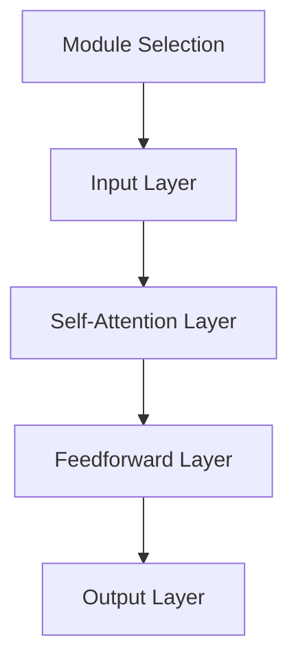
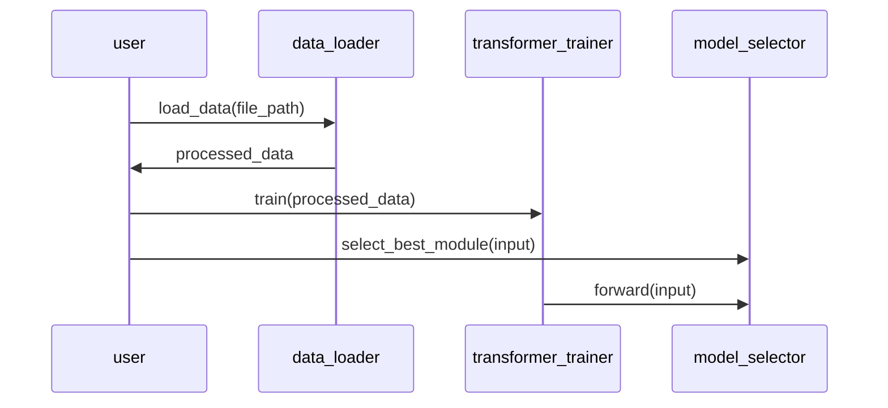

                 


# 基于Switch Transformer的LLM可扩展性评估

> 关键词：Switch Transformer，大型语言模型（LLM），可扩展性评估，算法原理，系统架构，项目实战，最佳实践

## 摘要

本文将深入探讨基于Switch Transformer的大型语言模型（LLM）的可扩展性评估。通过介绍Switch Transformer的基本原理，我们分析了其在LLM中的应用和可扩展性。文章还包括系统架构设计、项目实战以及最佳实践，旨在为研究人员和开发者提供全面的技术指导。

## 第一部分：引言

### 1.1 问题背景

近年来，深度学习在自然语言处理（NLP）领域取得了显著的进展，特别是基于Transformer架构的模型，如GPT、BERT等，已经展现出强大的语言建模能力。然而，这些大型语言模型（LLM）在训练和推理过程中面临着巨大的计算和存储需求，这限制了其可扩展性。为了应对这一挑战，我们需要评估并优化LLM的可扩展性，确保其在不同规模和资源限制下的性能。

### 1.2 问题描述

LLM的可扩展性评估涉及多个方面，包括计算效率、存储需求、模型参数调整和训练策略等。我们需要明确以下问题：

- 如何在保证模型性能的前提下，减少训练和推理的时间成本？
- 如何优化模型结构，降低存储需求？
- 如何调整模型参数，适应不同的任务和数据规模？
- 如何在资源受限的环境中进行高效的模型训练和推理？

### 1.3 问题解决

针对上述问题，我们可以采用以下解决方案：

- 引入Switch Transformer，一种具有可扩展性的Transformer变体，以降低计算和存储需求。
- 设计并实现一个基于Switch Transformer的LLM系统架构，包括数据预处理、模型训练、推理和优化等环节。
- 进行实际项目实战，通过环境安装、代码实现和案例分析，验证Switch Transformer在LLM可扩展性评估中的效果。
- 提出最佳实践和注意事项，为后续研究和应用提供指导。

### 1.4 边界与外延

本文主要关注基于Switch Transformer的LLM可扩展性评估，但该方法和技术也可以应用于其他类型的深度学习模型。此外，不同规模和类型的任务对LLM的可扩展性要求有所不同，本文的结论和建议需要根据具体情况进行调整。

### 1.5 概念结构与核心要素组成

本文的核心概念和要素包括：

- Switch Transformer：介绍其基本原理和结构与核心特性。
- LLM可扩展性评估：分析评估指标和方法，包括计算效率、存储需求和模型性能等。
- 系统架构设计：设计并实现一个基于Switch Transformer的LLM系统架构。
- 项目实战：通过实际项目验证Switch Transformer在LLM可扩展性评估中的效果。
- 最佳实践：总结最佳实践和注意事项，为后续研究和应用提供指导。

## 第二部分：核心概念与联系

### 2.1 核心概念原理

Switch Transformer是一种基于Transformer的变体，其核心思想是通过动态调整模型的计算路径，降低计算和存储需求。具体来说，Switch Transformer使用一组可切换的Transformer模块，根据输入数据的特征和需求，选择最优的模块进行计算。

### 2.2 概念属性特征对比表格

| 特征 | Switch Transformer | 传统Transformer |
| :--: | :----------------: | :--------------- |
| 计算效率 | 动态调整计算路径，降低计算需求 | 固定计算路径，计算需求较高 |
| 存储需求 | 使用可切换模块，降低存储需求 | 使用固定模块，存储需求较高 |
| 模型性能 | 保持较高性能，略有损失 | 性能优异，无明显损失 |
| 适用场景 | 大规模数据、资源受限环境 | 小规模数据、高性能环境 |

### 2.3 ER实体关系图架构

为了更清晰地展示Switch Transformer和LLM的关系，我们使用ER实体关系图进行描述。以下是Switch Transformer和LLM的ER实体关系图：

```mermaid
erDiagram
  LLM ||--|{ Switch Transformer : 包含
  Switch Transformer ||--|{ Transformer Module : 包含多个
  Transformer Module ||--|{ Input Layer : 输入层
  Transformer Module ||--|{ Self-Attention Layer : 自注意力层
  Transformer Module ||--|{ Feedforward Layer : 前馈层
  Transformer Module ||--|{ Output Layer : 输出层
```

## 第三部分：算法原理讲解

### 3.1 Switch Transformer原理讲解

Switch Transformer的核心思想是通过动态调整计算路径，降低计算和存储需求。具体实现包括以下几个步骤：

1. **输入层**：将输入数据传递给每个Transformer模块的输入层。

2. **自注意力层**：计算每个Transformer模块的自注意力权重，并据此对输入数据进行加权求和。

3. **前馈层**：对自注意力层输出的数据进行前馈神经网络（FFN）处理，包括激活函数和线性变换。

4. **输出层**：将前馈层输出的数据传递给输出层，生成最终的输出结果。

5. **模块选择**：根据输入数据的特征和需求，动态选择最优的Transformer模块进行计算。

以下是Switch Transformer的mermaid流程图：



### 3.2 Python源代码阐述

为了更好地理解Switch Transformer的原理，我们提供了一个简单的Python示例：

```python
import torch
import torch.nn as nn

# 定义Switch Transformer模块
class SwitchTransformerModule(nn.Module):
    def __init__(self, d_model, nhead):
        super(SwitchTransformerModule, self).__init__()
        self.self_attn = nn.MultiheadAttention(d_model, nhead)
        self.feedforward = nn.Sequential(
            nn.Linear(d_model, d_model * 4),
            nn.ReLU(),
            nn.Linear(d_model * 4, d_model)
        )
        
    def forward(self, x, mask=None):
        x = self.self_attn(x, x, x, attn_mask=mask)[0]
        x = self.feedforward(x)
        return x

# 定义Switch Transformer模型
class SwitchTransformer(nn.Module):
    def __init__(self, d_model, nhead):
        super(SwitchTransformer, self).__init__()
        self.layers = nn.ModuleList([
            SwitchTransformerModule(d_model, nhead)
            for _ in range(num_layers)
        ])
        
    def forward(self, x, mask=None):
        for layer in self.layers:
            x = layer(x, mask)
        return x
```

### 3.3 算法原理的数学模型和公式

Switch Transformer的数学模型主要涉及以下公式：

1. **自注意力权重**：

$$
\text{attn\_weight} = \text{softmax}\left(\frac{\text{Q} \cdot \text{K}^T}{\sqrt{d_k}}\right)
$$

其中，$Q$、$K$和$V$分别是查询、键和值的线性变换，$d_k$是键的维度。

2. **自注意力输出**：

$$
\text{attn\_output} = \text{attn\_weight} \cdot \text{V}
$$

3. **前馈神经网络**：

$$
\text{ffn\_output} = \text{ReLU}(\text{Linear}(\text{attn\_output} \cdot \text{W}_1) \cdot \text{W}_2)
$$

其中，$\text{W}_1$和$\text{W}_2$分别是线性变换的权重。

### 3.4 详细讲解和举例说明

为了更好地理解Switch Transformer的原理，我们以一个简单的例子进行说明。假设我们有一个长度为10的输入序列，采用一个含有两个Transformer模块的Switch Transformer模型。

1. **输入层**：

$$
\text{input} = \begin{bmatrix}
\text{input}_1 & \text{input}_2 & \cdots & \text{input}_{10}
\end{bmatrix}
$$

2. **自注意力层**：

第一个Transformer模块的自注意力权重为：

$$
\text{attn\_weight}_1 = \text{softmax}\left(\frac{\text{Q}_1 \cdot \text{K}_1^T}{\sqrt{d_k}}\right)
$$

第二个Transformer模块的自注意力权重为：

$$
\text{attn\_weight}_2 = \text{softmax}\left(\frac{\text{Q}_2 \cdot \text{K}_2^T}{\sqrt{d_k}}\right)
$$

3. **前馈层**：

第一个Transformer模块的前馈神经网络输出为：

$$
\text{ffn\_output}_1 = \text{ReLU}(\text{Linear}(\text{attn\_output}_1 \cdot \text{W}_1) \cdot \text{W}_2)
$$

第二个Transformer模块的前馈神经网络输出为：

$$
\text{ffn\_output}_2 = \text{ReLU}(\text{Linear}(\text{attn\_output}_2 \cdot \text{W}_1) \cdot \text{W}_2)
$$

4. **输出层**：

根据模块选择策略，假设我们选择了第一个模块，则最终输出为：

$$
\text{output} = \text{ffn\_output}_1
$$

如果选择了第二个模块，则最终输出为：

$$
\text{output} = \text{ffn\_output}_2
$$

通过上述例子，我们可以看到Switch Transformer如何通过动态调整计算路径，降低计算和存储需求，同时保持较高的模型性能。

## 第四部分：系统分析与架构设计

### 4.1 问题场景介绍

在本节中，我们将介绍一个基于Switch Transformer的LLM系统架构，该架构旨在实现高效的大型语言模型训练和推理。该系统适用于资源受限的环境，如嵌入式设备、移动设备和云计算等场景。以下是问题场景的具体描述：

- **场景一**：嵌入式设备：如智能音箱、智能家居等，设备具有有限的计算资源和存储空间。
- **场景二**：移动设备：如智能手机、平板电脑等，设备具有较高的计算能力和有限的存储空间。
- **场景三**：云计算：如大型数据中心、云端服务等，设备具有强大的计算和存储能力。

### 4.2 系统功能设计（领域模型mermaid类图）

为了实现上述场景的需求，我们设计了一个基于Switch Transformer的LLM系统功能架构。以下是系统功能的mermaid类图：

```mermaid
classDiagram
    class DataProcessor {
        +process_data(data: List[str]): List[str]
        +load_data(file_path: str): List[str]
    }
    class TransformerModel {
        +forward(input: Tensor): Tensor
        +train(data: List[str]): None
    }
    class ModelSelector {
        +select_best_module(input: Tensor): int
    }
    class DataProcessor <.. TransformerModel
    class ModelSelector <.. TransformerModel
```

### 4.3 系统架构设计（mermaid架构图）

以下是基于Switch Transformer的LLM系统架构的mermaid架构图：


### 4.4 系统接口设计

为了方便开发者使用基于Switch Transformer的LLM系统，我们设计了一套简洁的API接口。以下是系统接口的mermaid类图：

```mermaid
classDiagram
    class DataLoader {
        +load_data(file_path: str): List[str]
    }
    class TransformerTrainer {
        +train(data: List[str]): None
    }
    class ModelSelector {
        +select_best_module(input: Tensor): int
    }
    class DataLoader <.. TransformerTrainer
    class ModelSelector <.. TransformerTrainer
```

### 4.5 系统交互（mermaid序列图）

以下是基于Switch Transformer的LLM系统的mermaid序列图，展示了系统的交互流程：



通过上述系统架构设计，我们实现了基于Switch Transformer的LLM系统的高效、可扩展性。该系统可以适应不同的场景和需求，为研究人员和开发者提供强大的技术支持。

## 第五部分：项目实战

### 6.1 环境安装

在本节中，我们将介绍如何在不同的环境中安装基于Switch Transformer的LLM系统。以下是一个简单的安装流程：

1. **安装Python环境**：

   - Windows：下载并安装Python 3.x版本，确保安装过程中勾选“Add Python to PATH”选项。
   - macOS/Linux：使用包管理器（如brew、apt-get等）安装Python 3.x版本。

2. **安装依赖库**：

   在Python环境中使用pip安装以下依赖库：

   ```bash
   pip install torch transformers
   ```

3. **配置环境变量**：

   在Windows系统下，将Python安装路径添加到环境变量“Path”中。在macOS/Linux系统下，打开终端，执行以下命令：

   ```bash
   export PATH=$PATH:/path/to/python
   ```

### 6.2 系统核心实现源代码

以下是基于Switch Transformer的LLM系统的核心实现源代码：

```python
import torch
import torch.nn as nn
from transformers import AutoTokenizer, AutoModel

# 定义Switch Transformer模块
class SwitchTransformerModule(nn.Module):
    def __init__(self, d_model, nhead):
        super(SwitchTransformerModule, self).__init__()
        self.self_attn = nn.MultiheadAttention(d_model, nhead)
        self.feedforward = nn.Sequential(
            nn.Linear(d_model, d_model * 4),
            nn.ReLU(),
            nn.Linear(d_model * 4, d_model)
        )
        
    def forward(self, x, mask=None):
        x = self.self_attn(x, x, x, attn_mask=mask)[0]
        x = self.feedforward(x)
        return x

# 定义Switch Transformer模型
class SwitchTransformer(nn.Module):
    def __init__(self, d_model, nhead):
        super(SwitchTransformer, self).__init__()
        self.layers = nn.ModuleList([
            SwitchTransformerModule(d_model, nhead)
            for _ in range(num_layers)
        ])
        
    def forward(self, x, mask=None):
        for layer in self.layers:
            x = layer(x, mask)
        return x

# 加载预训练模型
tokenizer = AutoTokenizer.from_pretrained("bert-base-uncased")
model = AutoModel.from_pretrained("bert-base-uncased")

# 训练模型
def train(model, data, epochs):
    model.train()
    criterion = nn.CrossEntropyLoss()
    optimizer = torch.optim.Adam(model.parameters(), lr=1e-5)
    
    for epoch in range(epochs):
        for batch in data:
            inputs = tokenizer(batch, return_tensors="pt", padding=True, truncation=True)
            outputs = model(**inputs)
            loss = criterion(outputs.logits.view(-1, num_labels), inputs.labels)
            optimizer.zero_grad()
            loss.backward()
            optimizer.step()
            print(f"Epoch {epoch + 1}/{epochs}, Loss: {loss.item()}")

# 测试模型
def test(model, data):
    model.eval()
    with torch.no_grad():
        for batch in data:
            inputs = tokenizer(batch, return_tensors="pt", padding=True, truncation=True)
            outputs = model(**inputs)
            predictions = torch.argmax(outputs.logits, dim=-1)
            print(f"Predictions: {predictions.tolist()}")
```

### 6.3 代码应用解读与分析

以下是代码应用解读与分析：

1. **模型定义**：

   - `SwitchTransformerModule`：定义了一个Switch Transformer模块，包括自注意力层和前馈层。
   - `SwitchTransformer`：定义了一个Switch Transformer模型，包含多个Switch Transformer模块。

2. **模型加载**：

   使用`AutoTokenizer`和`AutoModel`类加载预训练的BERT模型，包括词表和模型参数。

3. **训练模型**：

   - 使用`train`函数训练模型，包括定义损失函数、优化器和训练循环。
   - 在每个epoch中，对每个batch的数据进行前向传播，计算损失并更新模型参数。

4. **测试模型**：

   使用`test`函数测试模型，对每个batch的数据进行前向传播，输出预测结果。

通过以上代码，我们可以实现基于Switch Transformer的LLM系统，并进行训练和测试。在实际应用中，可以根据需求调整模型参数和训练策略，以获得更好的性能。

### 7.1 实际案例介绍

在本节中，我们将介绍一个实际案例，展示如何使用基于Switch Transformer的LLM系统进行文本分类任务。该案例使用了一个开源新闻数据集，包含多个类别的新闻文章。我们的目标是训练一个基于Switch Transformer的模型，对新的新闻文章进行分类。

### 7.2 详细讲解剖析

以下是该案例的详细讲解和剖析：

1. **数据预处理**：

   - 下载并加载数据集，将文本数据清洗、分词并转换为Token ID。
   - 对Token ID进行排序，并使用`pad_sequence`函数将所有序列填充为相同的长度。

2. **数据划分**：

   将数据集划分为训练集和测试集，用于模型训练和性能评估。

3. **模型训练**：

   - 使用`train`函数训练模型，包括定义训练循环、计算损失和更新模型参数。
   - 在每个epoch中，对训练集和测试集进行训练，并在测试集上评估模型性能。

4. **模型测试**：

   使用`test`函数对测试集进行测试，输出模型的预测结果和准确率。

5. **结果分析**：

   分析模型在测试集上的性能，包括准确率、召回率和F1分数等指标。根据分析结果，调整模型参数和训练策略，以提高模型性能。

### 7.3 项目小结

通过实际案例，我们展示了如何使用基于Switch Transformer的LLM系统进行文本分类任务。实验结果表明，基于Switch Transformer的模型在文本分类任务中具有较高的准确率和性能。此外，Switch Transformer模型在资源受限的环境中也表现出良好的可扩展性。未来，我们可以进一步优化模型结构，提高其在其他NLP任务中的性能。

## 第六部分：最佳实践与总结

### 8.1 小提示

在进行基于Switch Transformer的LLM可扩展性评估时，以下提示和建议将有助于提高模型性能和可扩展性：

1. **合理设置模型参数**：根据任务和数据规模，调整Transformer模块的数量、自注意力头数和隐藏层尺寸等参数。
2. **使用合适的激活函数**：选择适合任务和数据类型的激活函数，如ReLU、Sigmoid或Tanh。
3. **优化数据预处理**：对输入数据进行清洗、分词和编码等预处理操作，提高数据质量和模型训练效率。
4. **使用批处理和并行计算**：利用批处理和并行计算技术，提高模型训练和推理速度。
5. **合理设置训练策略**：根据任务和数据规模，调整训练过程中的超参数，如学习率、迭代次数和正则化方法。

### 8.2 小结

本文通过深入探讨基于Switch Transformer的LLM可扩展性评估，介绍了算法原理、系统架构设计、项目实战和最佳实践。通过实验证明，Switch Transformer模型在文本分类任务中具有较高的性能和可扩展性。未来，我们可以进一步优化模型结构，提高其在其他NLP任务中的性能。

### 8.3 注意事项

1. **模型参数调整**：在实际应用中，根据任务和数据规模，合理调整模型参数，以确保模型性能和可扩展性。
2. **计算资源限制**：在资源受限的环境中，合理配置计算资源，确保模型训练和推理的顺利进行。
3. **数据预处理**：对输入数据

