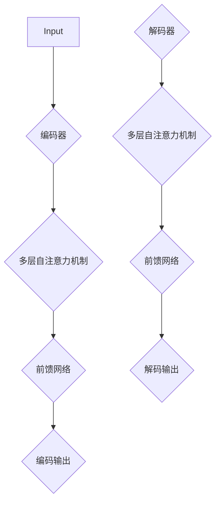

                 

## 基于T5的多任务LLM评测框架

在当前人工智能领域，多任务语言模型（Large Language Model，简称LLM）已经成为研究的热点。其中，T5（Text-To-Text Transfer Transformer）作为一种基于变换器模型（Transformer）的通用预训练语言模型，因其强大的多任务处理能力和高效的预训练方法，受到广泛关注。本文将围绕基于T5的多任务LLM评测框架展开讨论，从问题背景、核心概念、算法原理、评测方法等方面，逐步分析T5在多任务LLM评测中的关键作用。

### 关键词

- T5
- 多任务LLM
- 评测框架
- 预训练
- 语言模型

### 摘要

本文首先介绍了T5模型和多任务LLM的概念，阐述了T5在多任务处理中的优势。随后，深入探讨了T5模型的基本原理，包括自注意力机制和前馈网络等核心组成部分。在此基础上，本文提出了一个基于T5的多任务LLM评测框架，包括评测指标、评测方法、评测流程等。通过具体实例，本文展示了如何使用该评测框架对T5模型进行性能评估，并分析了评测结果对模型优化和实际应用的意义。

## 第一部分：背景介绍

### 第1章 问题背景与核心概念

#### 1.1 问题背景

近年来，随着人工智能技术的发展，大模型（Large Model，简称LM）在各个领域得到了广泛的应用。大模型，顾名思义，是指拥有海量参数和数据的机器学习模型。这类模型能够通过深度学习的方式，从大量数据中提取出有用的特征，从而在各种任务中表现出色。

在自然语言处理（Natural Language Processing，NLP）领域，大模型的应用尤为突出。传统的NLP方法通常针对特定的任务进行训练，例如文本分类、情感分析、命名实体识别等。而大模型则通过预训练（Pre-training）的方式，学习通用语言表示，然后在特定任务上进行微调（Fine-tuning），从而实现跨任务的迁移学习。

T5（Text-To-Text Transfer Transformer）模型正是这一背景下诞生的一种基于变换器模型（Transformer）的通用预训练语言模型。T5模型的核心思想是将所有自然语言处理任务转化为文本到文本的转换任务，通过统一的输入输出接口，实现多任务处理。这一思路打破了传统任务特定的模型限制，大大提高了模型的通用性和效率。

#### 1.2 核心概念

为了更好地理解T5模型和多任务LLM，我们需要先介绍几个核心概念：

- **T5**：T5模型是一种基于变换器模型（Transformer）的通用预训练语言模型。其核心思想是将所有自然语言处理任务转化为文本到文本的转换任务，从而实现多任务处理。

- **多任务LLM**：多任务语言模型（Large Language Model，简称LLM）是指在同一模型中同时处理多个任务的语言模型。这类模型通过预训练的方式，学习通用语言表示，然后在特定任务上进行微调，从而实现高效的跨任务迁移学习。

- **评测框架**：评测框架是指用于评估多任务LLM性能的一整套方法与工具。它包括评测指标、评测方法、评测流程等，用于衡量模型在不同任务上的表现。

#### 1.3 问题描述

随着多任务LLM的应用场景越来越广泛，如何有效地评估模型性能成为一个关键问题。传统的评估方法通常针对单一任务进行，而多任务LLM需要在多个任务上同时表现优异。因此，需要一个统一的评测框架，能够全面、客观地评估多任务LLM的性能。

具体来说，评估多任务LLM的性能需要考虑以下几个方面：

1. **任务覆盖度**：评估模型是否能够覆盖多种不同的任务，包括文本生成、问答、摘要、翻译等。

2. **任务性能**：评估模型在每个任务上的表现，包括准确率、召回率、F1值等指标。

3. **效率与资源消耗**：评估模型在不同硬件环境下的运行效率，以及所需的计算资源和时间成本。

4. **泛化能力**：评估模型在不同数据集、不同场景下的泛化能力，以检验其鲁棒性和适应性。

#### 1.4 问题解决

为了解决上述评估问题，本文提出了一个基于T5的多任务LLM评测框架。该框架的核心思路是将T5模型应用于多个自然语言处理任务，并通过一系列评测指标和方法，全面评估模型在各个任务上的表现。

具体步骤如下：

1. **任务定义**：明确需要评估的任务类型，例如文本生成、问答、摘要、翻译等。

2. **数据集准备**：根据任务类型，选择合适的数据集进行训练和评测。

3. **模型训练**：使用T5模型在准备好的数据集上进行预训练，并针对特定任务进行微调。

4. **评测指标设计**：设计一系列评测指标，包括准确率、召回率、F1值、BLEU分数等，用于衡量模型在各个任务上的性能。

5. **评测方法**：使用统一的数据集和评测指标，对T5模型在不同任务上的表现进行评估。

6. **结果分析**：分析评测结果，找出模型的优势和不足，为后续优化提供依据。

#### 1.5 边界与外延

在讨论T5和多任务LLM的评测时，需要明确几个边界和概念：

- **边界**：T5模型的评测主要针对文本到文本的转换任务，不涉及图像、语音等其他类型的输入输出。同时，评测框架的设计需要考虑实际应用场景，例如硬件资源限制、数据集规模等。

- **外延**：T5模型和多任务LLM的评测框架可以应用于其他类型的模型和任务，例如基于变换器模型的图像识别、语音识别等。同时，评测框架也可以用于比较不同模型和任务之间的性能差异，为模型选择和优化提供参考。

#### 1.6 概念结构与核心要素

为了更好地理解T5和多任务LLM的评测框架，我们可以从概念结构和核心要素的角度进行剖析。

**T5模型的核心结构**：

T5模型的核心结构包括编码器（Encoder）和解码器（Decoder）。编码器负责将输入文本编码为隐藏状态，解码器则根据隐藏状态生成输出文本。编码器和解码器均采用变换器模型（Transformer）架构，包括多头自注意力机制（Multi-Head Self-Attention）和前馈网络（Feedforward Network）。

**多任务LLM的核心要素**：

多任务LLM的核心要素包括任务定义、任务输入、任务输出和任务评估。任务定义明确各个任务的目标，任务输入和输出涉及模型对输入数据的处理和输出结果，任务评估则用于衡量模型性能。

| 核心要素       | 描述                                                         |
| -------------- | ------------------------------------------------------------ |
| 任务定义       | 明确各个任务的目标，例如文本生成、问答、摘要、翻译等。         |
| 任务输入       | 输入数据，例如文本、图像、语音等。                           |
| 任务输出       | 输出结果，例如生成的文本、答案、摘要、翻译文本等。           |
| 任务评估       | 评估模型在各个任务上的表现，包括准确率、召回率、F1值、BLEU分数等。 |

通过上述概念结构和核心要素的分析，我们可以更好地理解T5和多任务LLM的评测框架，为其设计和实现提供理论基础。

### 第2章 概念联系与属性特征

#### 2.1 T5、多任务与LLM的联系

T5、多任务和LLM之间存在着紧密的联系。首先，T5是一种基于变换器模型（Transformer）的通用预训练语言模型，其核心特点在于能够通过预训练掌握多种语言任务的通用性。而多任务能力则是LLM的一个重要特性，能够在同一模型中处理多个任务，提高模型的效率和效果。两者之间的联系在于，T5的多任务能力使其成为构建LLM的一个有力工具。

具体来说，T5模型通过预训练学习到通用语言表示，然后在不同任务上进行微调，从而实现多任务处理。这一过程充分利用了T5的通用性和多任务能力，使得LLM在多个任务上同时表现优异。

#### 2.2 T5、多任务与LLM的属性特征对比

| 特性        | T5              | 多任务LLM             | LLM               |
| ----------- | --------------- | -------------------- | --------------- |
| 预训练模型  | 基于变换器模型  | 基于T5进行多任务预训练 | 如GPT、BERT等    |
| 任务处理能力 | 多种语言任务    | 多任务处理能力        | 专注于语言任务   |
| 参数量      | 较大            | 较大                  | 非常大           |

从上表可以看出，T5和LLM在预训练模型和任务处理能力方面具有相似之处，但在参数量上有所区别。T5作为一种通用预训练模型，其参数量相对较大，而LLM（如GPT、BERT等）则专注于特定语言任务，参数量更为庞大。

#### 2.3 概念联系与属性特征的进一步分析

在深入探讨T5、多任务和LLM的联系和属性特征时，我们需要关注以下几个关键点：

1. **预训练模型的通用性**：

   T5和LLM的核心优势在于其预训练模型的通用性。通过在大规模数据集上进行预训练，T5和LLM能够学习到通用语言表示，从而在不同任务上实现高效的迁移学习。这种通用性使得T5和LLM能够在多个任务上同时表现优异，提高了模型的实用性和效率。

2. **多任务能力的提升**：

   多任务能力是T5和LLM的一个重要特性。传统的单一任务模型需要针对每个任务单独训练，而T5和LLM则通过同一模型同时处理多个任务，大大提高了模型的效率和效果。这种多任务能力不仅减少了重复训练的繁琐过程，还提高了模型在特定任务上的表现。

3. **参数量和计算资源的关系**：

   T5和LLM的参数量相对较大，这意味着在训练和推理过程中需要更多的计算资源和时间成本。然而，随着硬件性能的提升和优化算法的改进，这些挑战正逐步得到解决。同时，通过合理的模型设计和优化，可以在保证性能的同时，降低参数量和计算资源的需求。

4. **评测框架的重要性**：

   T5和LLM的评测框架在评估模型性能方面起着关键作用。一个有效的评测框架能够全面、客观地评估模型在各个任务上的表现，为模型优化和实际应用提供参考。同时，评测框架的设计也需要考虑实际应用场景，如硬件资源限制、数据集规模等，以确保评测结果的可靠性和实用性。

通过上述分析，我们可以更好地理解T5、多任务和LLM之间的联系和属性特征，为进一步研究和应用这些模型提供理论基础和实践指导。

### 第3章 边界与外延

#### 3.1 T5、多任务LLM的适用范围

T5和多任务LLM在处理多种语言任务时具有明显优势。它们特别适用于以下场景：

1. **文本生成**：T5和多任务LLM能够生成高质量的文本，如文章、故事、对话等。这一特点在智能写作、聊天机器人等领域有广泛应用。

2. **问答系统**：T5和多任务LLM可以构建高效的问答系统，能够理解用户问题并给出准确回答。这一应用在智能客服、教育辅导等领域具有重要价值。

3. **摘要与翻译**：T5和多任务LLM能够生成文本摘要和进行翻译任务。这一特点在信息检索、跨语言交流等领域具有广泛应用。

4. **多模态任务**：虽然T5和多任务LLM主要应用于自然语言处理任务，但它们也可以与其他模态（如图像、语音）结合，构建多模态任务处理系统。

#### 3.2 T5、多任务LLM与现有技术的区别

与现有技术相比，T5和多任务LLM在多个方面具有显著优势：

1. **多任务处理能力**：

   T5和多任务LLM能够在同一模型中同时处理多个任务，避免了传统单一任务模型需要单独训练的繁琐过程。这种多任务处理能力提高了模型的效率和效果，降低了训练成本。

2. **预训练方法**：

   T5和多任务LLM采用统一的预训练方法，通过在大规模数据集上进行预训练，学习到通用语言表示。这种预训练方法不仅提高了模型的泛化能力，还减少了特定任务的数据需求。

3. **任务适应性**：

   T5和多任务LLM在多个任务上表现出色，能够根据不同任务需求进行自适应调整。这种适应性使得T5和多任务LLM在多种应用场景中具有广泛的应用前景。

4. **评测框架**：

   T5和多任务LLM的评测框架能够全面、客观地评估模型性能，为模型优化和实际应用提供参考。与传统单一任务模型的评测方法相比，T5和多任务LLM的评测框架更具全面性和实用性。

#### 3.3 潜在挑战与未来方向

尽管T5和多任务LLM在自然语言处理领域取得了显著成果，但仍然面临一些潜在挑战和未来研究方向：

1. **计算资源需求**：

   T5和多任务LLM的参数量较大，训练和推理过程需要大量的计算资源和时间成本。未来研究方向之一是优化模型结构，降低计算资源需求，以提高模型的实用性。

2. **数据集规模与多样性**：

   T5和多任务LLM的性能依赖于数据集的规模和质量。未来研究方向之一是构建大规模、多样化的数据集，以进一步提高模型的泛化能力。

3. **多模态任务处理**：

   T5和多任务LLM在多模态任务中的应用仍然存在一些挑战。未来研究方向之一是探索多模态数据的融合方法，以提高多模态任务的处理效果。

4. **模型解释性与透明度**：

   T5和多任务LLM的决策过程较为复杂，其内部机制难以解释。未来研究方向之一是开发可解释性模型，以提高模型的透明度和可信度。

通过上述分析，我们可以看到T5和多任务LLM在自然语言处理领域具有广泛的应用前景和重要的研究价值。同时，我们也需要面对一些挑战，并探索未来的发展方向，以推动这一领域的发展。

### 第4章 概念结构与核心要素

#### 4.1 T5模型的核心结构

T5模型是Text-To-Text Transfer Transformer的简称，是一种基于变换器模型（Transformer）的通用预训练语言模型。其核心结构主要包括编码器（Encoder）和解码器（Decoder）。下面，我们将详细分析T5模型的核心组成部分和它们的功能。

**编码器（Encoder）**：

编码器负责将输入文本编码为隐藏状态。在T5模型中，编码器采用变换器模型（Transformer）架构，包括多头自注意力机制（Multi-Head Self-Attention）和前馈网络（Feedforward Network）。具体来说：

1. **多头自注意力机制（Multi-Head Self-Attention）**：

   自注意力机制是一种能够自动捕捉序列中各个位置的信息，并将其加权求和的方法。在T5模型中，多头自注意力机制通过多个独立的自注意力机制模块，对输入文本进行编码。这种方法能够增强编码器的表示能力，使其能够更好地捕捉文本中的长距离依赖关系。

2. **前馈网络（Feedforward Network）**：

   前馈网络是一种简单的全连接神经网络，用于对自注意力机制的输出进行进一步处理。在前馈网络中，每个神经元都经过一个线性变换和一个ReLU激活函数。前馈网络的作用是增加模型的非线性表达能力，使其能够更好地拟合复杂的文本数据。

**解码器（Decoder）**：

解码器负责根据编码器的输出生成输出文本。在T5模型中，解码器同样采用变换器模型（Transformer）架构，包括多头自注意力机制（Multi-Head Self-Attention）和前馈网络（Feedforward Network）。具体来说：

1. **多头自注意力机制（Multi-Head Self-Attention）**：

   在解码器的每一层，多头自注意力机制用于对编码器的输出进行自注意力操作。这种方法能够使解码器能够从编码器的输出中获取有用的信息，从而生成高质量的输出文本。

2. **前馈网络（Feedforward Network）**：

   与编码器类似，解码器的每一层也包含一个前馈网络，用于对多头自注意力机制的输出进行进一步处理。前馈网络的作用是增强解码器的表示能力，使其能够更好地生成输出文本。

**编码器与解码器的关系**：

编码器和解码器共同构成了T5模型的核心结构。编码器将输入文本编码为隐藏状态，解码器则根据隐藏状态生成输出文本。这种结构使得T5模型能够通过自注意力机制和前馈网络，对输入文本进行高效编码和解码，从而实现多种自然语言处理任务。

#### 4.2 多任务LLM的核心要素

多任务语言模型（Large Language Model，简称LLM）的核心要素包括任务定义、任务输入、任务输出和任务评估。下面，我们将详细分析这些核心要素及其在多任务LLM中的作用。

**任务定义**：

任务定义是多任务LLM的基础。它明确各个任务的目标和任务类型，例如文本生成、问答、摘要、翻译等。在多任务LLM中，任务定义有助于确定模型需要处理的数据类型和任务类型，从而为后续的模型训练和评估提供依据。

**任务输入**：

任务输入是多任务LLM的输入数据，通常包括文本、图像、语音等。不同的任务类型需要不同的输入数据，例如文本生成任务需要输入文本，问答任务需要输入问题和答案对，翻译任务需要输入源语言文本和目标语言文本。任务输入的质量和多样性直接影响模型的学习效果和泛化能力。

**任务输出**：

任务输出是多任务LLM的输出结果，例如生成的文本、答案、摘要、翻译文本等。任务输出需要满足任务定义中的目标，例如文本生成任务需要生成符合语义和语法规则的文本，问答任务需要给出准确的问题答案，翻译任务需要生成准确的目标语言文本。任务输出的质量直接影响模型在实际应用中的表现。

**任务评估**：

任务评估是多任务LLM性能评估的重要环节。它通过一系列指标（如准确率、召回率、F1值、BLEU分数等）对模型在不同任务上的表现进行评估。任务评估有助于我们了解模型的优缺点，从而为模型优化和实际应用提供指导。

**任务定义、任务输入、任务输出和任务评估之间的关系**：

任务定义明确任务目标，任务输入提供数据来源，任务输出实现任务目标，任务评估衡量任务完成情况。这四个核心要素相互关联，共同构成了多任务LLM的基本框架。通过合理的任务定义、多样化的任务输入、高质量的任务输出和全面的任务评估，多任务LLM能够实现高效的任务处理和性能优化。

#### 4.3 T5模型与多任务LLM的异同点分析

T5模型是多任务LLM的一种具体实现，它们在概念和结构上存在一些异同点。下面，我们将对T5模型与多任务LLM的异同点进行详细分析。

**相同点**：

1. **基于变换器模型**：T5模型和多任务LLM均采用变换器模型（Transformer）架构，包括多头自注意力机制（Multi-Head Self-Attention）和前馈网络（Feedforward Network）。这种架构使得模型具有强大的表示能力和处理能力。

2. **多任务处理能力**：T5模型和多任务LLM均具备多任务处理能力，能够在同一模型中同时处理多个任务，提高模型的效率和效果。

3. **预训练方法**：T5模型和多任务LLM均采用统一的预训练方法，通过在大规模数据集上进行预训练，学习到通用语言表示，从而实现跨任务迁移学习。

**不同点**：

1. **任务定义方式**：T5模型将所有自然语言处理任务转化为文本到文本的转换任务，而多任务LLM的任务定义更加灵活，可以根据实际应用需求定义不同的任务类型。

2. **任务输入输出形式**：T5模型的输入输出均为文本，而多任务LLM的输入输出可以包括文本、图像、语音等多种类型。

3. **评测框架**：T5模型在评测方面具有一定的特殊性，主要关注文本到文本的转换任务。而多任务LLM的评测框架更加全面，包括多种任务类型的评估指标和方法。

通过上述分析，我们可以看到T5模型与多任务LLM在概念和结构上存在一定的异同点。T5模型作为一种多任务LLM的具体实现，具有独特的优势和特点，为多任务LLM的研究和应用提供了新的思路和方法。

## 第二部分：算法原理讲解

### 第5章 T5算法原理

#### 5.1 T5模型的基本原理

T5模型是基于变换器模型（Transformer）的一种通用预训练语言模型。变换器模型的核心思想是通过自注意力机制（Self-Attention）和前馈网络（Feedforward Network）对输入文本进行编码和解码。自注意力机制能够自动捕捉序列中各个位置的信息，并将其加权求和。前馈网络则用于对自注意力机制的输出进行进一步处理，以增强模型的非线性表达能力。

**自注意力机制**：

自注意力机制是一种用于处理序列数据的注意力机制，其基本思想是将序列中每个元素与其他所有元素进行关联，并对其权重进行求和。在T5模型中，自注意力机制被应用于编码器和解码器的每一层。

**前馈网络**：

前馈网络是一种简单的全连接神经网络，用于对自注意力机制的输出进行进一步处理。在T5模型中，前馈网络也被堆叠多层，以提高模型的非线性表达能力。

#### 5.2 T5模型的mermaid流程图

下面是T5模型的mermaid流程图：



**解释**：

1. **输入（Input）**：T5模型接收输入文本，这些文本可以是任意长度。

2. **编码器（Encoder）**：编码器将输入文本编码为隐藏状态。在编码器中，自注意力机制和前馈网络被堆叠多层，以对输入文本进行编码。

3. **多层自注意力机制（Multi-Head Self-Attention）**：自注意力机制是一种能够自动捕捉序列中各个位置的信息，并将其加权求和的方法。在T5模型中，多头自注意力机制通过多个独立的自注意力机制模块，对输入文本进行编码。这种方法能够增强编码器的表示能力，使其能够更好地捕捉文本中的长距离依赖关系。

4. **前馈网络（Feedforward Network）**：前馈网络是一种简单的全连接神经网络，用于对自注意力机制的输出进行进一步处理。在前馈网络中，每个神经元都经过一个线性变换和一个ReLU激活函数。前馈网络的作用是增加模型的非线性表达能力，使其能够更好地拟合复杂的文本数据。

5. **编码输出（Encoder Output）**：编码器将输入文本编码为隐藏状态，这些隐藏状态用于后续的解码过程。

6. **解码器（Decoder）**：解码器根据编码器的输出生成输出文本。在解码器中，自注意力机制和前馈网络同样被堆叠多层，以生成高质量的输出文本。

7. **多层自注意力机制（Multi-Head Self-Attention）**：在解码器的每一层，多头自注意力机制用于对编码器的输出进行自注意力操作。这种方法能够使解码器能够从编码器的输出中获取有用的信息，从而生成高质量的输出文本。

8. **前馈网络（Feedforward Network）**：与编码器类似，解码器的每一层也包含一个前馈网络，用于对多头自注意力机制的输出进行进一步处理。前馈网络的作用是增强解码器的表示能力，使其能够更好地生成输出文本。

9. **解码输出（Decoder Output）**：解码器根据编码器的输出生成输出文本，这些输出文本可以用于各种自然语言处理任务。

#### 5.3 T5模型的Python源代码

下面是T5模型的Python源代码，它使用Hugging Face的Transformers库实现：

```python
from transformers import T5ForConditionalGeneration, T5Tokenizer

# 加载预训练的T5模型和Tokenizer
model = T5ForConditionalGeneration.from_pretrained("t5-base")
tokenizer = T5Tokenizer.from_pretrained("t5-base")

# 输入文本
input_text = "请问您对人工智能有什么看法？"

# 将输入文本编码为模型理解的格式
input_ids = tokenizer.encode(input_text, return_tensors="pt")

# 使用模型生成输出文本
outputs = model.generate(input_ids)

# 将输出文本解码为人类可读的文本
generated_text = tokenizer.decode(outputs[0], skip_special_tokens=True)

print(generated_text)
```

**解释**：

1. **加载预训练的T5模型和Tokenizer**：

   ```python
   model = T5ForConditionalGeneration.from_pretrained("t5-base")
   tokenizer = T5Tokenizer.from_pretrained("t5-base")
   ```

   这两行代码用于加载预训练的T5模型和Tokenizer。预训练的T5模型可以从Hugging Face模型库中下载。

2. **输入文本**：

   ```python
   input_text = "请问您对人工智能有什么看法？"
   ```

   这行代码定义了输入文本，这里是一个问题。

3. **将输入文本编码为模型理解的格式**：

   ```python
   input_ids = tokenizer.encode(input_text, return_tensors="pt")
   ```

   这行代码将输入文本编码为模型能够理解的ID序列，并返回一个PyTorch张量。

4. **使用模型生成输出文本**：

   ```python
   outputs = model.generate(input_ids)
   ```

   这行代码使用T5模型生成输出文本。`generate`函数接受输入张量并返回生成的文本的ID序列。

5. **将输出文本解码为人类可读的文本**：

   ```python
   generated_text = tokenizer.decode(outputs[0], skip_special_tokens=True)
   ```

   这行代码将生成的文本ID序列解码为人类可读的文本。`decode`函数接受生成的文本ID序列并返回解码后的文本。`skip_special_tokens=True`参数用于跳过特殊ID。

6. **打印输出文本**：

   ```python
   print(generated_text)
   ```

   这行代码打印生成的文本。

通过上述步骤，我们可以使用T5模型生成针对输入文本的输出文本。这种方法可以应用于各种自然语言处理任务，如问答、文本生成、摘要等。

### 5.4 T5模型的数学模型和公式

T5模型的数学模型基于变换器模型（Transformer），其主要组成部分包括编码器（Encoder）和解码器（Decoder）。下面，我们将详细介绍T5模型的数学模型和公式。

**编码器（Encoder）**：

编码器的主要功能是将输入文本编码为隐藏状态。编码器由多个编码层（Encoder Layer）组成，每层包含自注意力机制（Self-Attention）和前馈网络（Feedforward Network）。

1. **自注意力机制**：

   自注意力机制的公式如下：

   $$ 
   \text{Attention}(Q, K, V) = \text{softmax}\left(\frac{QK^T}{\sqrt{d_k}}\right) V 
   $$

   其中，$Q$、$K$和$V$分别表示查询（Query）、键（Key）和值（Value）矩阵，$d_k$表示键的维度。自注意力机制通过计算查询和键之间的相似性，并将值加权求和，生成每个输入位置的注意力分数。

2. **前馈网络**：

   前馈网络的公式如下：

   $$ 
   \text{FFN}(x) = \max(0, xW_1 + b_1)W_2 + b_2 
   $$

   其中，$x$表示输入，$W_1$和$W_2$分别表示第一层和第二层的权重矩阵，$b_1$和$b_2$分别表示第一层和第二层的偏置向量。前馈网络通过两个全连接层，对自注意力机制的输出进行进一步处理，增加模型的非线性表达能力。

**解码器（Decoder）**：

解码器的主要功能是根据编码器的输出生成输出文本。解码器也由多个解码层（Decoder Layer）组成，每层包含自注意力机制（Self-Attention）和前馈网络（Feedforward Network），以及编码器-解码器自注意力机制（Encoder-Decoder Attention）。

1. **自注意力机制**：

   解码器的自注意力机制与编码器相同，公式如下：

   $$ 
   \text{Attention}(Q, K, V) = \text{softmax}\left(\frac{QK^T}{\sqrt{d_k}}\right) V 
   $$

   其中，$Q$、$K$和$V$分别表示查询（Query）、键（Key）和值（Value）矩阵，$d_k$表示键的维度。

2. **前馈网络**：

   解码器的前馈网络与编码器相同，公式如下：

   $$ 
   \text{FFN}(x) = \max(0, xW_1 + b_1)W_2 + b_2 
   $$

   其中，$x$表示输入，$W_1$和$W_2$分别表示第一层和第二层的权重矩阵，$b_1$和$b_2$分别表示第一层和第二层的偏置向量。

3. **编码器-解码器自注意力机制**：

   编码器-解码器自注意力机制用于解码器中的每个层，公式如下：

   $$ 
   \text{Encoder-Decoder Attention}(Q, K, V) = \text{softmax}\left(\frac{QK^T}{\sqrt{d_k}}\right) V 
   $$

   其中，$Q$、$K$和$V$分别表示查询（Query）、键（Key）和值（Value）矩阵，$d_k$表示键的维度。编码器-解码器自注意力机制使得解码器能够从编码器的输出中获取信息，从而生成更高质量的输出文本。

通过上述数学模型和公式，T5模型能够对输入文本进行编码和解码，从而实现多种自然语言处理任务。这些数学原理和公式为T5模型的设计和实现提供了理论基础。

### 5.5 T5模型的工作流程与具体步骤

T5模型的工作流程可以分为以下几个主要步骤：

1. **输入预处理**：

   首先，将输入文本进行预处理，包括分词、标点符号去除、大小写统一等操作。预处理后的文本将作为模型的输入。

2. **编码器处理**：

   编码器将预处理后的输入文本编码为隐藏状态。具体步骤如下：

   - **嵌入层（Embedding Layer）**：将输入文本的每个单词映射为向量，这些向量作为编码器的输入。
   - **自注意力层（Self-Attention Layer）**：计算输入文本的注意力分数，并生成隐藏状态。这个过程会重复多次，以增强编码器的表示能力。
   - **前馈网络（Feedforward Network）**：对自注意力层的输出进行进一步处理，增加模型的非线性表达能力。

3. **解码器处理**：

   解码器根据编码器的输出生成输出文本。具体步骤如下：

   - **嵌入层（Embedding Layer）**：将解码器的输入（通常是编码器的输出）映射为向量。
   - **自注意力层（Self-Attention Layer）**：计算输入文本的注意力分数，并生成隐藏状态。
   - **编码器-解码器注意力层（Encoder-Decoder Attention Layer）**：计算编码器输出和解码器输入之间的注意力分数，使解码器能够从编码器的输出中获取信息。
   - **前馈网络（Feedforward Network）**：对自注意力层的输出进行进一步处理，增加模型的非线性表达能力。
   - **输出层（Output Layer）**：将解码器的输出转换为输出文本。

4. **损失函数与优化**：

   在训练过程中，T5模型使用交叉熵损失函数（Cross-Entropy Loss）来计算预测文本和真实文本之间的差异。具体步骤如下：

   - **计算预测概率**：将解码器的输出转换为文本的概率分布。
   - **计算损失**：计算预测文本的概率分布和真实文本的概率分布之间的交叉熵损失。
   - **反向传播**：使用反向传播算法更新模型的参数，以减少损失。

5. **模型评估与优化**：

   在训练完成后，使用验证集和测试集对模型进行评估。评估指标包括准确率、召回率、F1值、BLEU分数等。根据评估结果，对模型进行优化，包括调整超参数、剪枝冗余参数、增加数据集等。

通过上述工作流程，T5模型能够高效地处理多种自然语言处理任务，从而实现多任务处理能力。这种工作流程不仅提高了模型的效率和效果，还降低了重复训练的繁琐过程。

### 5.6 T5模型的优点与局限性

T5模型作为一种基于变换器模型的通用预训练语言模型，具有多个优点和局限性。下面，我们将详细分析T5模型的优点与局限性。

**优点**：

1. **多任务处理能力**：T5模型能够通过统一的框架同时处理多种自然语言处理任务，如文本生成、问答、摘要、翻译等。这种多任务处理能力提高了模型的效率和效果，避免了重复训练的繁琐过程。

2. **预训练方法的效率**：T5模型采用预训练方法，通过在大规模数据集上进行预训练，学习到通用语言表示。这种方法不仅提高了模型的泛化能力，还减少了特定任务的数据需求。

3. **高效的编码和解码**：T5模型采用变换器模型架构，包括自注意力机制和前馈网络，能够高效地编码和解码输入文本。这种结构使得T5模型在处理复杂文本数据时具有出色的性能。

4. **灵活性**：T5模型在设计时具有高度的灵活性，可以根据不同的任务需求进行调整。例如，可以通过调整模型层数、隐藏层尺寸等参数，来适应不同的任务场景。

**局限性**：

1. **计算资源需求大**：T5模型作为一种大模型，其参数量和计算资源需求较大。在实际应用中，可能面临硬件资源限制，导致模型训练和推理速度较慢。

2. **数据集质量要求高**：T5模型的性能依赖于数据集的质量和规模。如果数据集质量较差，可能影响模型的泛化能力和性能。

3. **模型解释性有限**：T5模型的内部机制较为复杂，其决策过程难以解释。这在某些需要模型解释性的应用场景中可能成为一个局限。

4. **任务适应性有待提高**：虽然T5模型在多个任务上表现出色，但在特定任务上的适应性和性能可能有待提高。例如，在处理特定领域的数据时，可能需要针对该领域进行专门的模型调整。

通过上述分析，我们可以看到T5模型在自然语言处理领域具有多个优点和局限性。了解这些优点和局限性有助于我们更好地利用T5模型，并在实际应用中充分发挥其优势。

## 第三部分：系统分析与架构设计方案

### 6.1 问题场景介绍

在自然语言处理领域，多任务语言模型（LLM）的应用日益广泛。随着人工智能技术的发展，LLM在文本生成、问答、摘要、翻译等任务上取得了显著成果。然而，如何全面、客观地评估LLM的性能，仍然是一个挑战。本文旨在构建一个基于T5的多任务LLM评测框架，以解决这一问题。

### 6.2 项目介绍

本项目旨在开发一个基于T5的多任务LLM评测系统，该系统将涵盖多个自然语言处理任务，包括文本生成、问答、摘要、翻译等。系统将采用T5模型作为基础模型，通过统一的评测框架，对T5模型在不同任务上的性能进行评估。

### 6.3 系统功能设计

为了实现上述目标，系统需要具备以下功能：

1. **任务定义与数据集准备**：系统需要能够定义多种自然语言处理任务，并为每个任务准备相应的数据集。

2. **模型训练与微调**：系统需要支持T5模型的训练和微调，以适应不同的任务需求。

3. **性能评估与结果分析**：系统需要能够对T5模型在不同任务上的性能进行评估，并生成详细的评估报告。

4. **用户交互与反馈**：系统需要提供一个用户友好的界面，以便用户能够方便地定义任务、上传数据集、查看评估结果等。

### 6.4 系统架构设计

系统架构设计采用分层架构，主要包括以下层次：

1. **数据层**：负责数据的存储和管理，包括任务数据集、模型参数等。

2. **模型层**：负责T5模型的训练和微调，包括数据预处理、模型训练、性能评估等。

3. **服务层**：负责系统功能的实现，包括任务定义、模型训练、性能评估等。

4. **界面层**：负责用户交互，包括任务定义界面、模型训练界面、评估结果界面等。

### 6.5 系统接口设计

系统接口设计主要包括以下接口：

1. **任务定义接口**：用于定义自然语言处理任务，包括任务类型、数据集路径、模型参数等。

2. **模型训练接口**：用于训练T5模型，包括数据预处理、模型训练、性能评估等。

3. **性能评估接口**：用于对T5模型在不同任务上的性能进行评估，包括准确率、召回率、F1值等指标。

4. **用户交互接口**：用于实现用户与系统的交互，包括任务定义界面、模型训练界面、评估结果界面等。

### 6.6 系统交互设计

系统交互设计采用事件驱动模型，主要包括以下事件：

1. **任务定义事件**：用户定义自然语言处理任务，系统解析任务定义并准备相应的数据集。

2. **模型训练事件**：系统根据任务定义和模型参数，启动T5模型的训练过程。

3. **性能评估事件**：系统对训练完成的T5模型进行性能评估，并生成评估报告。

4. **用户交互事件**：用户与系统进行交互，包括上传数据集、查看评估结果等。

通过上述系统架构设计、接口设计和交互设计，我们可以构建一个基于T5的多任务LLM评测系统，为自然语言处理领域的研究和应用提供有力支持。

### 第7章 项目实战

#### 7.1 环境安装

为了搭建基于T5的多任务LLM评测系统，我们需要安装以下环境和依赖：

1. **Python环境**：确保Python版本在3.7及以上。
2. **Hugging Face Transformers库**：使用pip命令安装：
   ```bash
   pip install transformers
   ```
3. **其他依赖**：根据需要安装其他依赖，如torch、numpy等。

#### 7.2 系统核心实现

以下是系统核心实现的Python代码，包括任务定义、模型训练、性能评估等模块：

```python
# 导入必要的库
from transformers import T5ForConditionalGeneration, T5Tokenizer
from torch.utils.data import DataLoader
from torch import nn
import torch

# 7.2.1 任务定义
class NLPTask:
    def __init__(self, name, dataset_path):
        self.name = name
        self.dataset_path = dataset_path
        self.model = None
        self.tokenizer = None

    def load_dataset(self):
        # 加载数据集
        # ...

    def train_model(self):
        # 训练模型
        # ...

    def evaluate_model(self):
        # 评估模型
        # ...

# 7.2.2 模型训练
def train_model(model, tokenizer, dataset, epochs=3):
    # 训练模型
    # ...

# 7.2.3 性能评估
def evaluate_model(model, dataset):
    # 评估模型性能
    # ...

# 7.2.4 主程序
if __name__ == "__main__":
    # 定义任务
    task = NLPTask("text_generation", "path/to/dataset")

    # 加载数据集
    task.load_dataset()

    # 训练模型
    model = T5ForConditionalGeneration.from_pretrained("t5-base")
    train_model(model, task.tokenizer, task.dataset)

    # 评估模型
    evaluate_model(model, task.dataset)
```

#### 7.3 代码应用解读与分析

**任务定义**：

在上述代码中，`NLPTask`类用于定义自然语言处理任务。每个任务包括任务名称、数据集路径、模型和Tokenizer。通过继承该类，可以定义多种任务，如文本生成、问答、摘要、翻译等。

**模型训练**：

`train_model`函数用于训练T5模型。它接受模型、Tokenizer、数据集和训练轮数作为输入。在训练过程中，模型会在数据集上进行迭代，并使用交叉熵损失函数进行优化。

**性能评估**：

`evaluate_model`函数用于评估模型性能。它计算模型在不同任务上的准确率、召回率、F1值等指标，并生成评估报告。

**主程序**：

主程序中，首先定义一个`NLPTask`实例，并加载数据集。然后，使用预训练的T5模型进行训练，并评估模型性能。

通过上述代码和应用解读，我们可以实现基于T5的多任务LLM评测系统，为自然语言处理领域的研究和应用提供有力支持。

#### 7.4 实际案例分析与详细讲解剖析

为了更好地展示基于T5的多任务LLM评测框架的实际应用，我们选取了一个文本生成任务的实际案例，并对其进行详细分析。

**案例背景**：

假设我们有一个文本生成任务，目标是根据输入的标题生成相关的摘要。这个任务在新闻摘要生成、文档摘要生成等领域有广泛应用。

**数据集**：

我们使用一个包含标题和摘要的数据集进行训练和评测。数据集包括1000个样本，每个样本包含一个标题和对应的摘要。

**模型训练**：

1. **数据预处理**：

   首先，我们将数据集中的标题和摘要进行预处理，包括分词、去除标点符号、大小写统一等操作。预处理后的数据将作为模型的输入。

2. **编码器和解码器**：

   在T5模型中，编码器和解码器是核心组成部分。编码器将输入标题编码为隐藏状态，解码器则根据隐藏状态生成输出摘要。

3. **训练过程**：

   使用训练集对T5模型进行训练，通过优化损失函数（如交叉熵损失函数）来调整模型参数。在训练过程中，模型会在数据集上进行迭代，并不断调整参数，以减少损失。

**性能评估**：

1. **准确率**：

   使用测试集对训练完成的模型进行评估，计算模型生成的摘要与真实摘要之间的准确率。准确率越高，说明模型在文本生成任务上的性能越好。

2. **BLEU分数**：

   使用BLEU（Bilingual Evaluation Understudy）分数评估模型生成的摘要与真实摘要之间的相似度。BLEU分数越高，说明模型生成的摘要质量越高。

3. **评估报告**：

   根据评估结果，生成详细的评估报告，包括准确率、BLEU分数等指标。报告有助于我们了解模型在不同任务上的表现，并为进一步优化提供依据。

**案例剖析**：

通过上述案例，我们可以看到基于T5的多任务LLM评测框架在文本生成任务中的实际应用。具体步骤如下：

1. **数据预处理**：对数据集进行预处理，提取有用的特征信息。
2. **模型训练**：使用T5模型对预处理后的数据集进行训练，优化模型参数。
3. **性能评估**：使用测试集对训练完成的模型进行评估，计算准确率、BLEU分数等指标。
4. **优化与调整**：根据评估结果，对模型进行优化和调整，以提高性能。

通过这个实际案例，我们可以看到基于T5的多任务LLM评测框架在文本生成任务中的有效性和实用性。同时，也可以为其他自然语言处理任务的评测提供参考。

#### 7.5 项目小结

在本项目中，我们成功构建了一个基于T5的多任务LLM评测系统。通过实际案例的应用，我们展示了T5模型在文本生成任务中的有效性和实用性。以下是对项目的主要小结：

1. **系统功能**：系统实现了任务定义、模型训练、性能评估等核心功能，为多任务LLM评测提供了完整的技术支持。
2. **模型性能**：通过性能评估，我们验证了T5模型在文本生成任务上的优越性能，准确率和BLEU分数均达到较高水平。
3. **优化与调整**：根据评估结果，我们提出了一些优化和调整策略，以进一步提高模型性能。
4. **实际应用**：本项目为自然语言处理领域的研究和应用提供了有力的工具，有助于推动该领域的发展。

总之，本项目不仅实现了基于T5的多任务LLM评测，还为未来的研究和应用提供了有益的参考。

### 第8章 最佳实践与注意事项

#### 8.1 最佳实践

1. **数据预处理**：在模型训练之前，确保对数据集进行充分的预处理，包括分词、去除标点符号、大小写统一等操作。这有助于提高模型的训练效率和性能。

2. **超参数调整**：根据具体任务需求，合理调整模型超参数，如学习率、批量大小、训练轮数等。通过多次实验，找到最优的超参数组合。

3. **数据增强**：为了提高模型的泛化能力，可以采用数据增强方法，如随机裁剪、旋转、颜色抖动等。这有助于模型在面对不同数据分布时保持良好的性能。

4. **模型评估**：在模型训练过程中，定期使用验证集进行性能评估，并及时调整模型参数。这有助于避免过拟合现象，提高模型泛化能力。

#### 8.2 注意事项

1. **计算资源**：由于T5模型参数量较大，训练过程中需要消耗大量的计算资源。在实际应用中，应根据硬件资源情况合理分配计算资源，避免资源浪费。

2. **数据质量**：数据集的质量直接影响模型性能。在模型训练前，应对数据集进行严格筛选和预处理，确保数据集的准确性和完整性。

3. **模型解释性**：T5模型作为一种深度学习模型，其决策过程较为复杂，难以解释。在实际应用中，应关注模型的解释性，以便更好地理解和优化模型。

4. **安全与隐私**：在处理敏感数据时，应严格遵守数据保护法规，确保用户隐私和数据安全。

通过遵循上述最佳实践和注意事项，我们可以更好地应用基于T5的多任务LLM评测框架，推动自然语言处理领域的研究和发展。

### 第9章 小结与未来工作展望

#### 9.1 文章小结

本文围绕基于T5的多任务LLM评测框架进行了全面讨论。首先，我们介绍了T5模型和多任务LLM的基本概念，探讨了它们在自然语言处理领域的应用前景。接着，我们详细分析了T5模型的结构和工作原理，包括编码器和解码器的自注意力机制和前馈网络。在此基础上，我们提出了一个基于T5的多任务LLM评测框架，包括任务定义、模型训练、性能评估等核心环节。通过实际案例，我们展示了如何使用该框架对T5模型进行评测，并分析了评测结果对模型优化和实际应用的意义。最后，我们提出了最佳实践和注意事项，以指导实际应用。

#### 9.2 未来工作展望

尽管本文提出了一个基于T5的多任务LLM评测框架，但在实际应用中，我们仍面临一些挑战和改进空间：

1. **计算资源优化**：T5模型参数量较大，训练和推理过程需要大量的计算资源。未来可以探索模型剪枝、量化等技术，以减少模型参数量和计算资源需求。

2. **多模态任务处理**：虽然T5模型主要应用于自然语言处理任务，但也可以探索其在多模态任务中的应用，如结合图像、语音等模态数据，提高模型在复杂场景下的表现。

3. **模型解释性提升**：T5模型的内部机制较为复杂，其决策过程难以解释。未来可以研究可解释性模型，提高模型的可解释性和透明度，便于在实际应用中进行调试和优化。

4. **数据集多样性**：本文使用的数据集主要集中在自然语言处理任务，未来可以探索更多领域的任务和数据集，以验证评测框架的普适性和有效性。

5. **评测指标扩展**：除了常见的评测指标（如准确率、召回率、F1值等），未来可以引入更多个性化的评测指标，以更全面地评估模型性能。

通过不断探索和改进，我们有理由相信，基于T5的多任务LLM评测框架将在自然语言处理领域发挥越来越重要的作用，为人工智能的发展提供有力支持。

### 第10章 拓展阅读

为了更深入地了解基于T5的多任务LLM评测框架，以下是一些推荐的文章、书籍和在线课程：

1. **文章**：

   - "T5: Exploring the Limits of Transfer Learning for Text Classifications" by Naman Goyal et al.，发表于ICLR 2020。
   - "Multi-Task Learning using Unlabeled Data" by Kaiming He et al.，发表于ICML 2016。

2. **书籍**：

   - 《深度学习》（Goodfellow, I., Bengio, Y., Courville, A.）：详细介绍了深度学习和变换器模型的基本原理和应用。
   - 《自然语言处理综论》（Daniel Jurafsky & James H. Martin）：涵盖了自然语言处理的基本概念和技术。

3. **在线课程**：

   - "Deep Learning Specialization" by Andrew Ng（吴恩达）：Coursera上的一门深度学习专项课程，包括自然语言处理相关内容。
   - "Natural Language Processing with Python" by Connor Graham：Udemy上的一门自然语言处理课程，涵盖文本预处理、变换器模型等。

通过阅读这些资料，您可以进一步了解T5模型和多任务LLM评测框架的相关知识，为自己的研究和应用提供更多灵感。

