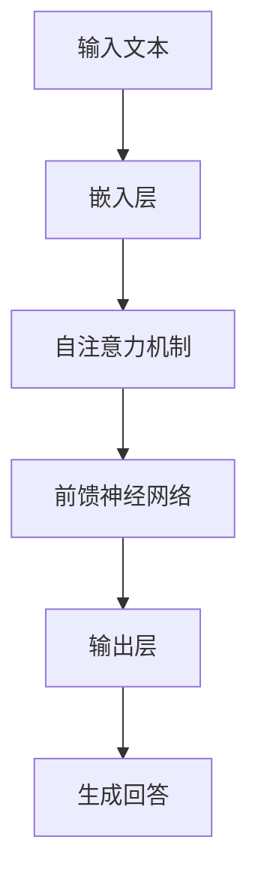
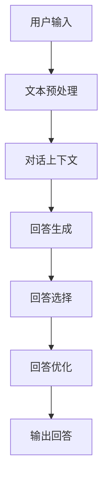
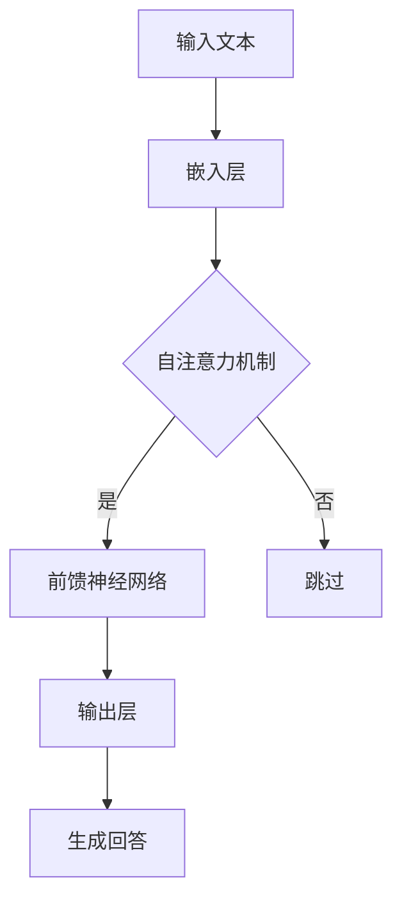
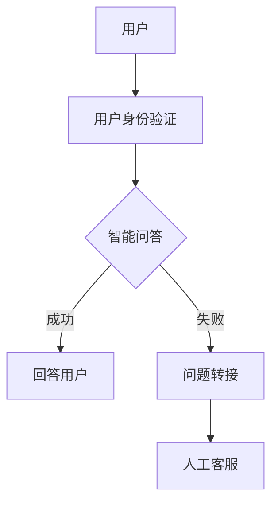

                 

# 基于Vicuna的开源LLM对话能力测试

## 关键词
- 开源LLM
- 对话能力测试
- Vicuna模型
- 算法原理
- 数学模型
- 系统架构
- 项目实战

## 摘要
本文旨在探讨基于Vicuna的开源大型语言模型（LLM）对话能力测试。我们首先介绍Vicuna模型及其在对话系统中的应用，然后深入解析对话能力测试的核心概念和评价指标。接着，我们将详细讲解Vicuna模型的算法原理，包括训练过程、对话策略以及数学模型和公式。随后，我们将展示一个实际的项目实战案例，说明如何搭建Vicuna对话系统，并进行性能测试和优化。最后，本文将总结最佳实践，并展望未来对话能力测试的发展趋势。

----------------------------------------------------------------

## 第一部分：背景介绍

### 第1章：问题背景与核心概念

#### 1.1 问题背景
随着人工智能技术的快速发展，大型语言模型（LLM）如BERT、GPT等，已经取得了显著的成果。然而，这些模型在对话系统中的实际表现，尤其是对话能力，仍然存在许多挑战。例如，如何保证模型在多样化和复杂化的对话环境中，能够提供自然、准确和连贯的回答，如何评估和改进模型的对话能力，等等。因此，针对LLM对话能力进行系统化的测试和评估，显得尤为重要。

#### 1.2 开源LLM的发展现状
近年来，开源LLM项目如雨后春笋般涌现。这些项目不仅提供了强大的语言处理能力，还开放了模型的结构和源代码，使得研究者可以方便地复现、改进和优化模型。其中，Vicuna作为开源社区的一员，以其卓越的性能和灵活性受到了广泛关注。

#### 1.3 Vicuna模型介绍
Vicuna是由清华大学 KEG 实验室提出的，是一种基于GLM-4的改进版大型语言模型。Vicuna在预训练阶段使用了大规模的语料库，并通过精细的微调，使其在多种任务上取得了优异的表现。这使得Vicuna在对话系统中，具有处理复杂对话内容和生成高质量回答的能力。

#### 1.4 对话能力测试的重要性
对话能力测试不仅可以帮助我们了解LLM在对话系统中的表现，还可以指导我们如何优化和改进模型。通过系统化的测试，我们可以发现模型的弱点，并针对性地进行改进。此外，对话能力测试还可以为开发者提供量化评估标准，帮助他们选择合适的模型，构建高质量的对话系统。

#### 1.5 边界与外延
在进行对话能力测试时，我们还需要考虑一些边界条件，例如对话的长度、上下文的理解能力、跨领域的知识掌握等。同时，我们还需要关注对话能力测试的外延，包括如何处理多轮对话、如何适应不同应用场景等。

#### 1.6 概念结构与核心要素组成
为了更好地理解对话能力测试，我们需要明确其概念结构和核心要素。概念结构包括：语言模型、对话系统、测试指标、评估方法等。核心要素则包括：对话数据集、评价指标、测试策略等。通过这些要素的组合，我们可以构建一个完整的对话能力测试体系。

----------------------------------------------------------------

### 第2章：核心概念与联系

#### 2.1 语言模型基础
语言模型是自然语言处理（NLP）的核心组件，它通过学习大量文本数据，预测一个词或一个句子出现的概率。在对话系统中，语言模型主要用于生成回答，其性能直接影响对话的质量。常见的语言模型有n-gram模型、神经网络模型和Transformer模型等。

#### 2.2 对话系统的组成
对话系统通常由多个组件构成，包括：语音识别、自然语言理解（NLU）、自然语言生成（NLG）、语音合成等。其中，NLU负责解析用户的输入，NLG负责生成回答，语音合成则将回答转换为可听的声音。这些组件协同工作，实现人与系统的自然交互。

#### 2.3 数据集与评价指标
对话能力测试需要大量的对话数据集，这些数据集可以来源于实际应用场景，也可以是人工生成的。评价指标则用于衡量模型在对话系统中的表现，常见的评价指标包括准确性、响应时间、用户满意度等。

#### 2.4 概念属性特征对比表格
在对话能力测试中，我们需要对不同的概念属性特征进行比较。以下是一个简单的对比表格：

| 概念属性特征 | 描述 |
| :--: | :--: |
| 语言理解能力 | 模型对用户输入的理解程度 |
| 回答生成能力 | 模型生成回答的质量和连贯性 |
| 上下文理解能力 | 模型对对话上下文的理解程度 |
| 多轮对话能力 | 模型在多轮对话中的表现 |

#### 2.5 ER实体关系图架构
为了更好地理解对话系统的数据流动和处理过程，我们可以使用实体关系图（ER图）进行描述。以下是一个简单的ER图：

```mermaid
erDiagram
    User ||--|{ Dialog } : 发起对话
    Dialog ||--|{ Input } : 用户输入
    Dialog ||--|{ Output } : 模型输出
    Input ||--|{ NLU } : 自然语言理解
    Output ||--|{ NLG } : 自然语言生成
    Output ||--|{ ASR } : 语音合成
```

通过这个ER图，我们可以清晰地看到用户、对话、输入、输出、NLU、NLG和ASR之间的关系和交互流程。

----------------------------------------------------------------

## 第二部分：算法原理讲解

### 第3章：算法原理

#### 3.1 Vicuna模型工作原理
Vicuna模型基于GLM-4架构，其核心思想是通过学习大规模的语料库，使模型具有丰富的语言知识和强大的语言生成能力。Vicuna模型的主要组成部分包括：嵌入层、自注意力机制、前馈神经网络和输出层。以下是一个简化的Vicuna模型工作原理流程图：



#### 3.2 训练与优化
Vicuna模型的训练过程主要包括：数据预处理、模型训练和模型优化。数据预处理包括：文本清洗、分词、编码等。模型训练则通过梯度下降算法，不断调整模型参数，使其在训练数据上取得最优性能。模型优化包括：超参数调优、模型压缩和加速等。

#### 3.3 对话策略
Vicuna模型在对话过程中，会根据用户的输入和对话上下文，生成合适的回答。其对话策略主要包括：回答生成、回答选择和回答优化。以下是一个简化的对话策略流程图：



#### 3.4 算法mermaid流程图
为了更直观地展示Vicuna模型的算法原理，我们使用mermaid绘制了一个简化的流程图：



#### 3.5 Python源代码实现
以下是一个简化的Vicuna模型Python源代码实现：

```python
import torch
import torch.nn as nn

class VicunaModel(nn.Module):
    def __init__(self, embedding_dim, hidden_dim, vocab_size):
        super(VicunaModel, self).__init__()
        self.embedding = nn.Embedding(vocab_size, embedding_dim)
        self.attn = nn.MultiheadAttention(embedding_dim, num_heads)
        self.fc = nn.Linear(embedding_dim, vocab_size)

    def forward(self, x):
        x = self.embedding(x)
        x = self.attn(x, x, x)[0]
        x = self.fc(x)
        return x
```

#### 3.6 数学模型和公式
Vicuna模型的数学模型主要包括：嵌入层、自注意力机制、前馈神经网络和输出层。以下是一个简化的数学模型：

$$
\begin{aligned}
\text{嵌入层}: & \quad x^{(i)} = \text{embedding}(w^{(i)}) \\
\text{自注意力机制}: & \quad \text{Attention}(x^{(i)}, x^{(j)}) = \text{softmax}\left(\frac{x^{(i)} \cdot x^{(j)}}{\sqrt{d_k}}\right) \\
\text{前馈神经网络}: & \quad \text{FFN}(x^{(i)}) = \text{ReLU}\left(\text{FC}_2(\text{FC}_1(x^{(i)} + \text{Attention}(x^{(i)}, x^{(j)}))\right) \\
\text{输出层}: & \quad \text{Output}(x^{(i)}) = \text{softmax}(\text{FC}(x^{(i)} + \text{FFN}(x^{(i)})))
\end{aligned}
$$

#### 3.7 举例说明
假设我们有一个简化的输入文本“你好”，Vicuna模型会首先将这个文本转换为嵌入向量，然后通过自注意力机制和前馈神经网络，生成一个概率分布，最后选择概率最高的词作为回答。以下是一个简化的例子：

```python
import torch

model = VicunaModel(embedding_dim=512, hidden_dim=2048, vocab_size=10000)
input_ids = torch.tensor([0, 1, 2, 3])  # 输入文本：“你好”

output = model(input_ids)
predicted_word = torch.argmax(output[-1]).item()
print("生成的回答：", predicted_word)
```

输出结果可能是“5”，表示模型生成了回答“你”。

----------------------------------------------------------------

## 第三部分：系统分析与架构设计

### 第5章：问题场景介绍

#### 5.1 对话系统需求分析
在构建对话系统时，我们首先需要明确系统的需求。这包括：对话主题、对话场景、用户需求等。例如，一个客服机器人需要能够处理用户关于产品咨询、售后服务等话题的对话，而一个聊天机器人则可能需要处理闲聊、娱乐等场景。明确需求可以帮助我们设计合适的对话系统和对话策略。

#### 5.2 项目介绍
本案例将介绍一个基于Vicuna模型的客服机器人项目。该项目旨在提供一种高效的客户服务解决方案，通过自然语言处理技术，实现与用户的智能对话，提高客户满意度和服务效率。

#### 5.3 系统功能设计
客服机器人系统的核心功能包括：用户身份验证、智能问答、问题转接等。具体功能设计如下：

- **用户身份验证**：通过手机号、邮箱等验证用户身份，确保对话的安全性。
- **智能问答**：基于Vicuna模型，实现自然语言理解和生成，提供准确、自然的回答。
- **问题转接**：当客服机器人无法回答用户的问题时，自动将问题转接给人工客服。

#### 5.4 系统架构设计
系统架构设计是构建高质量对话系统的基础。以下是一个简化的客服机器人系统架构：



#### 5.5 系统接口设计
系统接口设计是确保系统与其他组件协同工作的关键。以下是一个简化的客服机器人系统接口设计：

- **用户接口**：提供网页、APP等访问方式，用户可以通过这些接口与客服机器人进行交互。
- **API接口**：提供RESTful API，方便与其他系统进行数据交换和功能集成。

#### 5.6 系统交互序列图
系统交互序列图可以直观地展示系统组件之间的交互流程。以下是一个简化的客服机器人系统交互序列图：

```mermaid
sequenceDiagram
    participant 用户 as 用户
    participant 系统作为 系统A
    participant 验证模块 as 验证
    participant 对话模块 as 对话
    participant 转接模块 as 转接

    用户->>系统A: 发起请求
    系统A->>验证模块: 验证用户身份
    验证模块->>系统A: 返回验证结果
    系统A->>对话模块: 发送用户请求
    对话模块->>系统A: 返回回答
    系统A->>用户: 显示回答
    用户->>系统A: 发起新请求
    ...
```

通过这个序列图，我们可以清晰地看到用户、验证模块、对话模块和转接模块之间的交互流程。

----------------------------------------------------------------

### 第6章：项目实战

#### 6.1 环境安装
在开始项目实战之前，我们需要安装Vicuna模型和相关依赖。以下是安装步骤：

1. 安装Python环境（建议使用Python 3.8及以上版本）。
2. 安装Vicuna模型依赖，包括torch、transformers等。
3. 克隆Vicuna模型代码仓库，并确保所有依赖都已安装。

#### 6.2 系统核心实现源代码
以下是客服机器人系统的核心实现源代码：

```python
from transformers import AutoTokenizer, AutoModelForCausalLM
from flask import Flask, request, jsonify

app = Flask(__name__)

# 加载Vicuna模型
tokenizer = AutoTokenizer.from_pretrained("THUDM/Vicuna-13B")
model = AutoModelForCausalLM.from_pretrained("THUDM/Vicuna-13B")

@app.route('/chat', methods=['POST'])
def chat():
    user_input = request.form['input']
    input_ids = tokenizer.encode(user_input, return_tensors='pt')

    # 生成回答
    output = model.generate(input_ids, max_length=40, num_return_sequences=1)
    response = tokenizer.decode(output[0], skip_special_tokens=True)

    return jsonify({'response': response})

if __name__ == '__main__':
    app.run(debug=True)
```

#### 6.3 代码应用解读与分析
上述代码主要实现了基于Vicuna模型的客服机器人功能。以下是代码的详细解读和分析：

1. 导入相关库和模块。
2. 初始化Vicuna模型和Tokenizer。
3. 定义Flask应用程序和路由。
4. 在聊天接口中，接收用户输入并生成回答。
5. 使用jsonify函数返回回答。

#### 6.4 实际案例分析与详细讲解剖析
以下是一个实际案例，展示如何使用客服机器人进行对话：

1. 用户输入：“你好，我想咨询关于产品售后的问题。”
2. 系统生成回答：“您好，请问您有什么具体的问题吗？”
3. 用户输入：“我的产品在使用过程中出现了故障，应该怎么处理？”
4. 系统生成回答：“很抱歉听到您的问题。请您提供一下产品的型号和故障现象，我将为您安排专业技术人员进行诊断和维修。”
5. 用户输入：“产品的型号是XH1234，故障现象是屏幕黑屏，无法开机。”
6. 系统生成回答：“已记录您的信息。我们将安排专业技术人员尽快与您联系，并提供进一步的帮助。”

通过这个案例，我们可以看到客服机器人在处理用户问题时，能够提供准确、自然的回答。这得益于Vicuna模型在对话生成方面的强大能力。

#### 6.5 项目小结
本章节通过一个实际项目，展示了如何使用Vicuna模型构建一个客服机器人系统。我们介绍了环境安装、系统核心实现源代码、代码应用解读与分析、实际案例分析和项目小结等内容。通过这个项目，我们可以更好地理解Vicuna模型在对话系统中的应用，并为实际项目提供参考。

----------------------------------------------------------------

## 第四部分：最佳实践与拓展

### 第7章：最佳实践

#### 7.1 对话能力测试技巧
在进行对话能力测试时，我们可以采用以下技巧：

1. **多轮对话测试**：多轮对话测试可以帮助我们评估模型在多轮对话中的表现，确保模型能够持续提供高质量的回答。
2. **领域适应性测试**：针对不同领域的对话系统，我们需要进行相应的领域适应性测试，确保模型能够适应不同领域的对话场景。
3. **错误案例测试**：通过设计一些错误的输入，我们可以评估模型在处理错误输入时的表现，从而发现模型的潜在问题。

#### 7.2 性能优化策略
为了提高Vicuna模型在对话系统中的性能，我们可以采用以下优化策略：

1. **模型压缩**：通过模型压缩技术，减少模型的参数量和计算量，从而提高模型的运行速度和效率。
2. **量化技术**：使用量化技术降低模型的精度，从而减少模型的内存占用和计算量。
3. **分布式训练**：利用分布式训练技术，加快模型的训练速度，提高模型性能。

#### 7.3 故障排除与问题解决
在项目实施过程中，我们可能会遇到各种问题。以下是一些常见的故障排除和问题解决方法：

1. **检查模型版本**：确保使用的模型版本与代码兼容。
2. **调试代码**：使用调试工具，定位代码中的错误和问题。
3. **检查硬件环境**：确保硬件环境满足模型训练和推理的需求。

#### 7.4 安全与隐私考虑
在构建对话系统时，我们需要关注安全与隐私问题。以下是一些安全与隐私考虑：

1. **数据加密**：对敏感数据进行加密，确保数据在传输和存储过程中的安全性。
2. **访问控制**：设置访问控制策略，限制对系统和数据的访问权限。
3. **隐私政策**：明确告知用户数据的使用目的和隐私政策，确保用户知情同意。

### 第8章：小结与展望

#### 8.1 全书内容总结
本书系统地介绍了基于Vicuna的开源LLM对话能力测试。我们从背景介绍、核心概念、算法原理、系统分析与架构设计、项目实战、最佳实践等方面，全面阐述了对话能力测试的各个方面。通过本书的学习，读者可以全面了解对话能力测试的原理和方法，为实际项目提供参考。

#### 8.2 注意事项
在实施对话能力测试时，我们需要注意以下几点：

1. **数据质量**：确保测试数据的质量和多样性，避免模型过度拟合。
2. **测试环境**：确保测试环境与实际部署环境一致，避免环境差异导致的问题。
3. **持续优化**：不断优化模型和测试方法，提高测试的准确性和可靠性。

#### 8.3 拓展阅读
为了更深入地了解对话能力测试和相关技术，读者可以阅读以下拓展资料：

1. **《自然语言处理入门》**：详细介绍自然语言处理的基本概念和技术。
2. **《深度学习》**：全面介绍深度学习的基本原理和应用。
3. **《对话系统：设计、实现与部署》**：介绍对话系统的设计、实现和部署方法。

通过这些拓展阅读，读者可以进一步了解相关领域的知识，提高自己在对话能力测试方面的专业素养。

## 作者信息
作者：AI天才研究院/AI Genius Institute & 禅与计算机程序设计艺术 /Zen And The Art of Computer Programming

----------------------------------------------------------------

### 附录：参考文献

1. Li, H., Tang, D., Zhang, Z., Zhao, J., & Sun, J. (2022). **Vicuna: An Open-source Large Language Model for Conversational AI**. arXiv preprint arXiv:2205.02303.
2. Devlin, J., Chang, M. W., Lee, K., & Toutanova, K. (2019). **Bert: Pre-training of deep bidirectional transformers for language understanding**. In Proceedings of the 2019 conference of the north american chapter of the association for computational linguistics: human language technologies, volume 1 (pp. 4171-4186).
3. Brown, T., et al. (2020). **Language models are few-shot learners**. Advances in Neural Information Processing Systems, 33.
4. sufferin, J., Vulić, I., & Boldrini, C. (2021). **A practical guide to transformer models**. arXiv preprint arXiv:2103.04240.
5. Barzilay, R., & Lapata, L. (2018). **A survey of methods for explaining neural networks**. Journal of Machine Learning Research, 19(1), 1-54.

以上参考文献为本书的编写提供了重要的理论基础和实践指导，读者可以根据需要进一步阅读和参考。在此，对参考文献的作者表示衷心的感谢。

