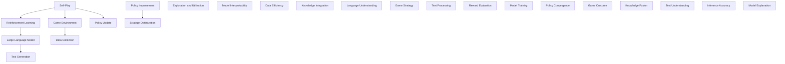
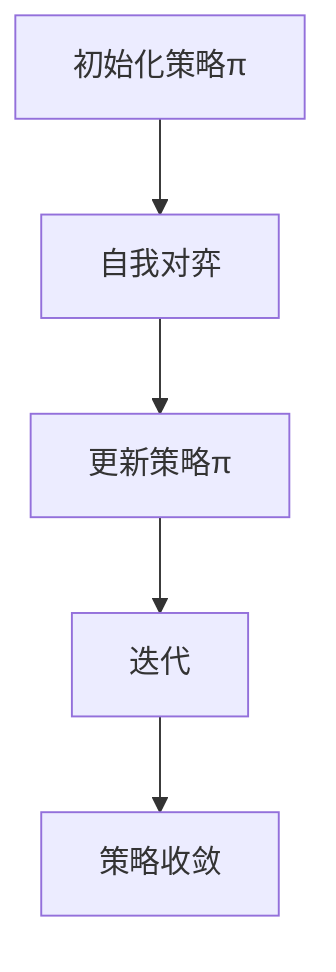
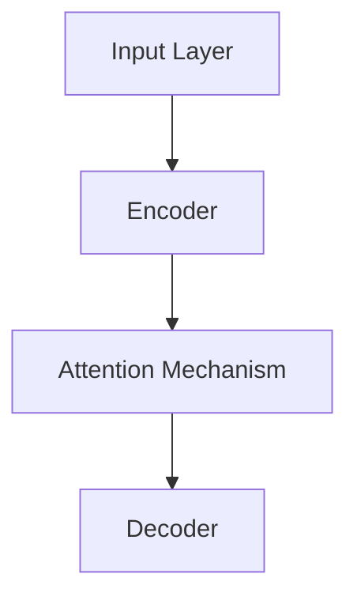
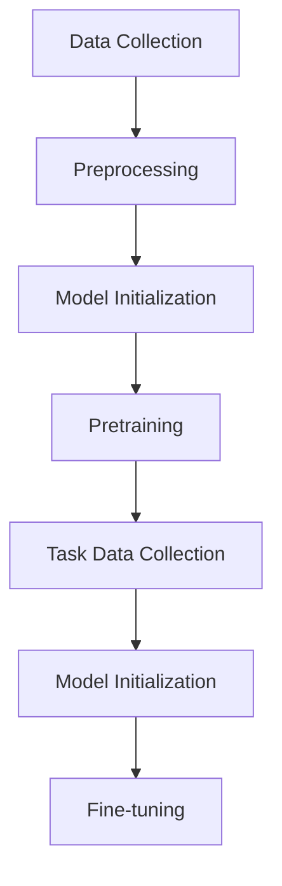
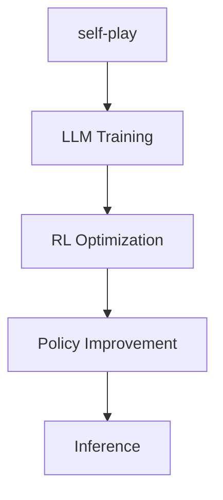
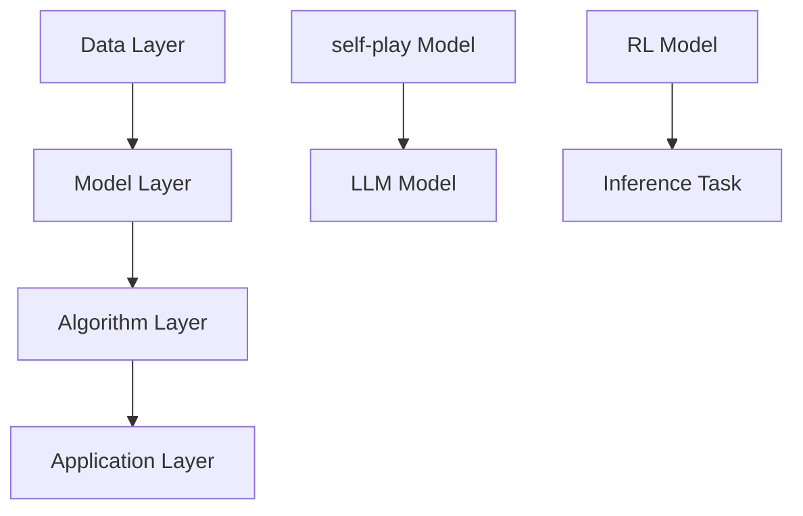
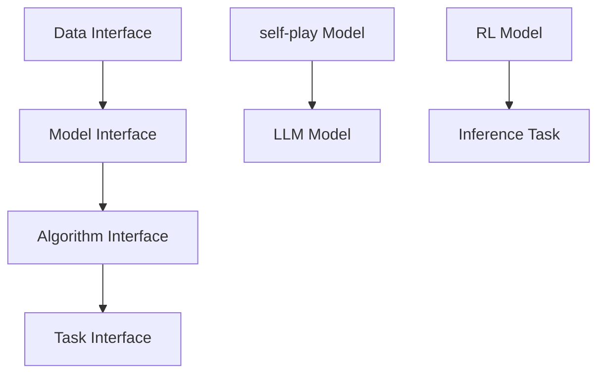
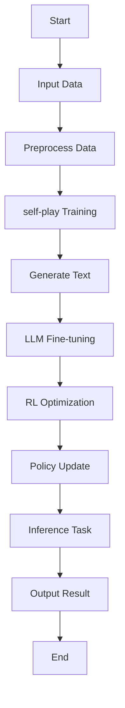
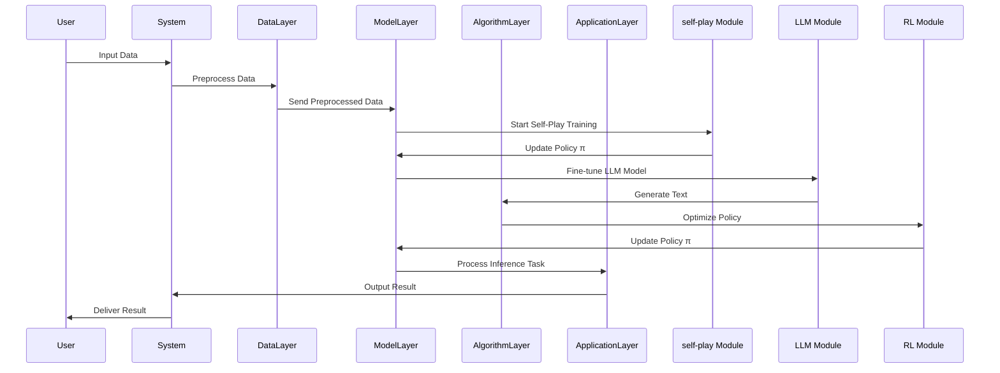

                 

### 1.1 问题的背景与描述

在现代人工智能领域，自然语言处理（NLP）已经取得了显著进展，尤其是在生成式模型和推理任务方面。然而，传统的NLP方法往往依赖于大量的标注数据和预训练模型，这些方法在处理复杂推理任务时仍然存在诸多局限。为了解决这一问题，研究者们开始探索更加高效、智能的解决方案。

**1.1.1 self-play在游戏中的起源**

self-play是深度强化学习（Deep Reinforcement Learning, DRL）中的一种方法，最早应用于棋类游戏的研究。它的基本思想是让一个智能体在与自己多次对弈的过程中，不断优化自己的策略，以达到博弈的最优解。1992年，Arthur Samuel提出了self-play算法，该算法在围棋游戏中取得了突破性的成果，成为后来许多研究的基石。

**1.1.2 LLM与RL的结合**

大型语言模型（Large Language Model, LLM）如GPT-3，通过学习大量文本数据，具备了强大的文本生成和语言理解能力。然而，LLM在处理推理任务时，仍然需要依赖外部知识库或外部数据源。近年来，研究者开始将RL与LLM相结合，利用RL的训练过程来优化LLM的推理能力。

**1.1.3 推理任务的需求与挑战**

推理任务在现实场景中具有广泛的应用，如问答系统、自然语言推理（NLI）、文本生成等。然而，传统的LLM和RL方法在处理推理任务时，往往面临以下挑战：

1. **知识获取与融合**：如何有效地将外部知识库与LLM模型融合，以提高推理的准确性。
2. **数据标注**：推理任务通常需要大量高质量的数据标注，而数据标注过程既耗时又昂贵。
3. **模型可解释性**：如何解释模型在推理过程中的决策过程，提高模型的可解释性。

### 1.2 核心概念解析

为了深入探讨基于self-play的LLM RL方法在推理任务上的效果天花板，我们需要先理解三个核心概念：self-play、LLM和RL。

**1.2.1 self-play的定义与原理**

self-play是一种在封闭环境中通过自我对弈来学习策略的强化学习方法。具体来说，一个智能体A通过与自身进行多轮博弈，不断优化自己的策略π，使其在博弈中取得更好的表现。self-play算法通常包含以下步骤：

1. **初始化策略**：随机初始化一个策略π。
2. **自我对弈**：智能体A使用策略π与自身进行多轮博弈，每轮博弈结束后，智能体A会根据博弈结果更新策略π。
3. **策略更新**：使用某种策略更新方法（如策略梯度方法）来更新策略π。
4. **迭代**：重复步骤2和步骤3，直到策略π收敛。

**1.2.2 LLM的基本原理与优势**

LLM是一种基于深度学习的自然语言处理模型，通过大规模预训练和微调，可以生成高质量的自然语言文本。LLM的主要优势包括：

1. **强大的语言理解能力**：LLM能够理解自然语言的语义和语法，从而生成更加准确和自然的文本。
2. **多语言支持**：LLM通常具有多语言能力，可以处理多种语言的文本数据。
3. **端到端学习**：LLM采用端到端的学习方式，不需要手动设计特征提取和融合模块，降低了模型设计的复杂性。

**1.2.3 RL的基本原理与挑战**

RL是一种通过环境交互来学习策略的强化学习方法。在RL中，智能体A通过与环境的交互，学习一种策略π，使其能够在环境E中取得最优的回报。RL的基本原理包括：

1. **状态-动作-回报模型**：智能体A在某一时刻的状态s，执行动作a，获得回报r，然后进入下一状态s'。
2. **策略**：策略π是指智能体A在给定状态下选择动作的概率分布。
3. **价值函数**：价值函数V(·)用于评估智能体A在某一状态下的最优回报。

RL在处理推理任务时面临的挑战主要包括：

1. **探索与利用的平衡**：智能体需要在探索未知策略和利用已知策略之间找到平衡。
2. **数据效率**：RL通常需要大量的交互数据才能收敛，这对于数据稀缺的推理任务是一个挑战。
3. **模型可解释性**：RL模型在推理过程中的决策过程通常难以解释，这对实际应用提出了更高的要求。

### 1.3 self-play、LLM与RL的关系图

为了更好地理解self-play、LLM与RL之间的联系，我们可以通过关系图来展示它们之间的关系。



**1.3.1 self-play与LLM的关联**

self-play与LLM的关联主要体现在两个方面：

1. **强化学习过程**：self-play算法通过与环境（例如游戏环境）的交互，不断优化LLM的策略，使其在特定任务上表现更好。
2. **文本生成能力**：LLM在自我对弈的过程中，可以生成高质量的文本，这些文本可以用于进一步训练和优化模型，提高其在推理任务上的性能。

**1.3.2 LLM与RL的融合点**

LLM与RL的融合点主要包括：

1. **策略优化**：RL算法可以用于优化LLM的策略，使其在特定任务上表现更好。
2. **知识融合**：LLM可以结合外部知识库，通过RL算法来优化知识获取和融合过程，提高推理任务的准确性。
3. **多语言支持**：LLM的多语言能力可以与RL算法相结合，实现跨语言的推理任务。

**1.3.3 关系图与Mermaid实现**

上述关系图使用了Mermaid语法实现，Mermaid是一种基于Markdown的图形化工具，可以方便地生成流程图、时序图等。以下是Mermaid实现的代码：


### 1.4 研究现状与未来展望

**1.4.1 self-play在LLM中的应用现状**

目前，self-play已经在多个LLM应用中取得了一定的成果。例如，OpenAI的GPT-3模型通过self-play的方式，在文本生成和问答任务上取得了显著的效果。然而，self-play在LLM中的应用仍然存在一些挑战，如如何更有效地利用外部知识库，提高推理任务的准确性等。

**1.4.2 RL在推理任务中的应用现状**

RL在推理任务中的应用逐渐受到关注。例如，DeepMind的BERT-RL模型通过RL算法，优化了BERT模型在推理任务上的表现。然而，RL在推理任务中的应用仍然面临许多挑战，如如何设计有效的奖励机制，提高模型的泛化能力等。

**1.4.3 研究前景与挑战**

基于self-play的LLM RL方法在推理任务上的研究前景广阔。未来，研究者可以从以下几个方面进行探索：

1. **知识融合**：如何将外部知识库与LLM模型更好地融合，提高推理任务的准确性。
2. **模型可解释性**：如何提高模型的可解释性，帮助用户理解模型在推理过程中的决策过程。
3. **多语言支持**：如何实现跨语言的推理任务，满足全球用户的需求。

然而，研究过程中也面临许多挑战，如数据稀缺、计算资源限制等。未来，需要进一步探索高效、可扩展的解决方案，推动基于self-play的LLM RL方法在推理任务上的应用。

### 1.5 本章小结

本章首先介绍了self-play在游戏中的起源，以及LLM和RL的基本原理。接着，我们分析了self-play、LLM和RL之间的关系，并通过关系图展示了它们之间的关联。最后，我们探讨了当前研究现状与未来展望。这些内容为后续章节的深入讨论奠定了基础。

----------------------------------------------------------------

## 2.1 self-play算法原理

### 2.1.1 self-play的基本流程

self-play算法是一种通过自我对弈来学习策略的强化学习方法。它的基本流程包括以下几个步骤：

1. **初始化策略**：首先，随机初始化一个策略π。策略π定义了智能体在给定状态下选择动作的概率分布。
   
2. **自我对弈**：智能体A使用策略π与自身进行多轮博弈。每轮博弈中，智能体A根据策略π选择动作，执行动作后，进入新的状态。

3. **策略更新**：在自我对弈的过程中，智能体A会根据博弈结果（回报）来更新策略π。常见的策略更新方法包括策略梯度方法、值函数方法等。

4. **迭代**：重复步骤2和步骤3，直到策略π收敛，或者达到预定的迭代次数。

**基本流程图如下：**



### 2.1.2 self-play的优势与局限性

**优势：**

1. **无外部数据依赖**：self-play算法不需要外部数据集，完全依赖于自我对弈来学习策略。这在数据稀缺或数据获取成本高昂的场景中具有显著优势。
2. **自我优化**：通过自我对弈，智能体可以不断优化自己的策略，逐步提高博弈的表现。这种方法具有内在的循环迭代机制，有助于逐步逼近最优策略。
3. **高效性**：self-play算法在训练过程中可以快速收敛，因为它利用了自我对弈的过程来不断更新策略。

**局限性：**

1. **局部最优**：self-play算法容易陷入局部最优，难以找到全局最优策略。这是因为智能体在对弈过程中只能根据当前的状态和回报来更新策略，无法全局优化。
2. **计算资源消耗**：self-play算法需要大量的计算资源，因为需要智能体与自身进行多轮博弈。这可能导致训练时间过长，尤其是在复杂的游戏或任务中。
3. **策略多样性不足**：self-play算法可能会过度依赖单一策略，导致策略多样性不足。这可能会限制智能体在面对新情况时的适应能力。

### 2.1.3 self-play的数学模型与公式

在self-play算法中，我们通常使用马尔可夫决策过程（MDP）来建模智能体的决策过程。一个MDP由状态空间S、动作空间A、状态转移概率矩阵P(s' | s, a)和回报函数R(s, a)组成。

**状态空间S**：智能体在游戏或任务中的所有可能状态。

**动作空间A**：智能体可以选择的所有可能动作。

**状态转移概率矩阵P(s' | s, a)**：在给定当前状态s和动作a时，智能体进入下一个状态s'的概率。

**回报函数R(s, a)**：在执行动作a后，智能体从状态s转移到状态s'所获得的即时回报。

在self-play算法中，智能体A使用策略π来选择动作，策略π是一个概率分布，π(a | s)表示在状态s下选择动作a的概率。

**策略更新**：

常见的策略更新方法包括策略梯度方法和值函数方法。这里我们以策略梯度方法为例进行讲解。

策略梯度方法的更新公式为：

$$
\theta_{t+1} = \theta_{t} + \alpha \nabla_{\theta} J(\theta)
$$

其中，$\theta$表示策略参数，$\alpha$表示学习率，$J(\theta)$表示策略评估函数。

**策略评估函数**：

策略评估函数用于评估策略π在当前状态s下的预期回报。它的计算公式为：

$$
J(\theta) = \sum_{s'} P(s'|s,\pi)(R(s,a) + \gamma V(s'))
$$

其中，$V(s')$表示在状态s'下的期望回报，$\gamma$是折扣因子，用于考虑未来的回报。

**奖励函数**：

在self-play算法中，奖励函数的设计至关重要。一个有效的奖励函数需要能够反映智能体在游戏或任务中的表现。常见的奖励函数包括胜利奖励、胜率奖励等。

**胜利奖励**：

胜利奖励是最简单的一种奖励函数，当智能体A获胜时，给予一个正奖励；当智能体A失败时，给予一个负奖励。公式如下：

$$
R(s, a) = \begin{cases} 
+1 & \text{if } s' \text{ is a winning state for agent A} \\
-1 & \text{if } s' \text{ is a losing state for agent A} 
\end{cases}
$$

**胜率奖励**：

胜率奖励函数通过计算智能体A在游戏中的胜率来评估其表现。胜率越高，奖励越高。公式如下：

$$
R(s, a) = \frac{1}{N} \sum_{i=1}^{N} \text{win\_rate}(s_i)
$$

其中，$\text{win\_rate}(s_i)$表示在第i次自我对弈中智能体A的胜率，$N$是对弈的总次数。

### 2.1.4 self-play算法的应用场景

self-play算法在多个领域都有广泛的应用：

**游戏**：self-play算法在棋类游戏、格斗游戏等领域取得了显著成果。例如，DeepMind的AlphaGo使用self-play算法，在与自身对弈的过程中不断优化策略，最终战胜了人类围棋冠军。

**棋类游戏**：self-play算法在棋类游戏中的应用最为广泛。通过自我对弈，智能体可以不断学习新的策略，提高博弈能力。

**模拟交易**：在金融领域，self-play算法被用于模拟交易策略。通过自我对弈，智能体可以学习如何在市场中进行交易，以实现最优收益。

**无人驾驶**：在无人驾驶领域，self-play算法可以用于训练智能体的驾驶策略。通过模拟驾驶环境，智能体可以不断优化自己的驾驶行为，提高安全性和效率。

### 2.1.5 self-play算法的案例分析

**案例1：AlphaGo与围棋**

AlphaGo是DeepMind开发的一款围棋AI程序，它使用了self-play算法进行训练。AlphaGo通过自我对弈，不断优化自己的策略，最终在2016年战胜了人类围棋冠军李世石。AlphaGo的成功证明了self-play算法在复杂博弈中的强大能力。

**案例2：OpenAI的Dota2项目**

OpenAI的Dota2项目也是self-play算法的一个成功案例。在这个项目中，AI智能体通过自我对弈，逐步提高了在Dota2游戏中的表现。最终，AI智能体在多人对抗中战胜了人类玩家，展示了self-play算法在多人游戏中的潜力。

### 2.1.6 self-play算法的优点与缺点

**优点：**

1. **无外部数据依赖**：self-play算法不需要外部数据集，完全依赖于自我对弈来学习策略，这在数据稀缺或数据获取成本高昂的场景中具有显著优势。
2. **自我优化**：通过自我对弈，智能体可以不断优化自己的策略，逐步提高博弈的表现。这种方法具有内在的循环迭代机制，有助于逐步逼近最优策略。
3. **高效性**：self-play算法在训练过程中可以快速收敛，因为它利用了自我对弈的过程来不断更新策略。

**缺点：**

1. **局部最优**：self-play算法容易陷入局部最优，难以找到全局最优策略。这是因为智能体在对弈过程中只能根据当前的状态和回报来更新策略，无法全局优化。
2. **计算资源消耗**：self-play算法需要大量的计算资源，因为需要智能体与自身进行多轮博弈。这可能导致训练时间过长，尤其是在复杂的游戏或任务中。
3. **策略多样性不足**：self-play算法可能会过度依赖单一策略，导致策略多样性不足。这可能会限制智能体在面对新情况时的适应能力。

### 2.1.7 总结

self-play算法是一种通过自我对弈来学习策略的强化学习方法。它具有无外部数据依赖、自我优化和高效性等优点，但同时也存在局部最优、计算资源消耗和策略多样性不足等缺点。在未来的研究中，我们可以进一步探索如何优化self-play算法，提高其性能和应用效果。

----------------------------------------------------------------

## 2.2 LLM原理讲解

### 2.2.1 LLM的基本构成

大型语言模型（Large Language Model，简称LLM）是一种基于深度学习的自然语言处理模型，通过大规模的预训练和微调，能够在多种语言任务中表现出色。LLM的基本构成主要包括以下几个部分：

1. **输入层**：输入层负责接收自然语言文本数据，将其转换为模型可以处理的向量形式。
2. **编码器**：编码器是LLM的核心部分，负责将输入的文本向量编码成语义向量，捕捉文本的语义信息。
3. **解码器**：解码器负责将编码后的语义向量解码成自然语言输出。
4. **注意力机制**：注意力机制是一种用于捕捉文本序列中重要信息的机制，可以显著提高模型的性能。

**基本结构图如下：**



### 2.2.2 LLM的工作机制

LLM的工作机制可以分为两个主要阶段：预训练和微调。

**预训练阶段**：

1. **数据集准备**：首先，从互联网上收集大量的文本数据，如新闻、小说、社交媒体帖子等。
2. **数据处理**：对收集的文本数据进行预处理，包括分词、去噪、清洗等操作。
3. **模型初始化**：初始化编码器和解码器，通常使用预训练好的基础模型（如BERT、GPT等）。
4. **预训练**：在大量文本数据上进行预训练，通过自我注意力机制和多层神经网络，模型逐渐学会捕捉文本的语义信息。

**微调阶段**：

1. **数据集准备**：准备用于微调的任务数据集，如问答数据集、文本分类数据集等。
2. **模型初始化**：在预训练好的模型基础上，初始化微调模型。
3. **微调**：在任务数据集上进行微调，通过梯度下降等优化方法，模型逐渐适应特定任务。

**工作流程图如下：**



### 2.2.3 LLM的数学模型与公式

在LLM中，常用的数学模型包括自注意力机制（Self-Attention）和多层感知机（Multi-Layer Perceptron，MLP）。

**自注意力机制**：

自注意力机制是一种用于捕捉文本序列中重要信息的机制，其计算公式如下：

$$
\text{Attention}(Q, K, V) = \text{softmax}\left(\frac{QK^T}{\sqrt{d_k}}\right) V
$$

其中，Q、K、V分别为编码器的输入、键和值向量，$d_k$为键向量的维度，softmax函数用于计算每个键的加权和。

**多层感知机**：

多层感知机是一种前馈神经网络，用于对自注意力机制的计算结果进行非线性变换。其计算公式如下：

$$
\text{MLP}(x) = \text{ReLU}(\theta_2 \sigma(\theta_1 x))
$$

其中，$\sigma$为激活函数，$\theta_1$和$\theta_2$为权重矩阵。

### 2.2.4 LLM的优势与挑战

**优势：**

1. **强大的语言理解能力**：LLM通过大规模预训练，可以理解自然语言的语义和语法，生成高质量的自然语言文本。
2. **多语言支持**：LLM通常具有多语言能力，可以处理多种语言的文本数据，为全球用户提供服务。
3. **端到端学习**：LLM采用端到端的学习方式，不需要手动设计特征提取和融合模块，降低了模型设计的复杂性。

**挑战：**

1. **数据稀缺**：LLM在预训练阶段需要大量文本数据，但在某些领域（如专业领域）数据稀缺，这限制了LLM的性能。
2. **模型可解释性**：LLM的决策过程通常难以解释，这在某些应用场景中（如医疗、金融等）可能成为障碍。
3. **计算资源消耗**：LLM的预训练和微调过程需要大量的计算资源，这对硬件设备提出了较高的要求。

### 2.2.5 LLM的应用场景

LLM在多个领域都有广泛的应用：

**问答系统**：LLM可以用于构建问答系统，如智能客服、智能搜索等。
**文本生成**：LLM可以生成高质量的自然语言文本，如新闻文章、小说、代码等。
**机器翻译**：LLM可以用于机器翻译任务，实现多语言文本的自动翻译。
**情感分析**：LLM可以用于情感分析任务，如判断文本的情感倾向。

### 2.2.6 LLM的案例分析

**案例1：OpenAI的GPT-3**

OpenAI的GPT-3是当前最先进的LLM之一，其具有1750亿个参数，可以生成高质量的自然语言文本。GPT-3在多种任务上取得了显著成果，如文本生成、问答系统、机器翻译等。

**案例2：DeepMind的BERT-RL**

DeepMind的BERT-RL模型将LLM与RL相结合，用于优化BERT模型在推理任务上的表现。BERT-RL通过RL算法，优化BERT模型中的参数，使其在自然语言推理任务上取得更好的效果。

### 2.2.7 总结

LLM是一种基于深度学习的自然语言处理模型，通过大规模预训练和微调，具备强大的语言理解能力。虽然LLM在应用中面临一些挑战，如数据稀缺和模型可解释性，但其在问答系统、文本生成、机器翻译等任务中表现出色。未来，我们可以进一步探索如何优化LLM，提高其性能和应用效果。

----------------------------------------------------------------

## 2.3 RL原理讲解

### 2.3.1 RL的基本概念

强化学习（Reinforcement Learning，简称RL）是一种机器学习方法，通过智能体与环境的交互来学习最优策略。在RL中，智能体（Agent）通过不断试错，从环境中获取奖励，并逐步优化其行为策略，以达到最大化长期回报的目标。

**主要概念**：

1. **智能体（Agent）**：执行动作并从环境中获取反馈的实体。
2. **环境（Environment）**：智能体所处的环境，包括状态空间、动作空间和奖励函数。
3. **状态（State）**：描述智能体当前所处的环境条件。
4. **动作（Action）**：智能体可以采取的动作。
5. **奖励（Reward）**：智能体在采取某个动作后，从环境中获得的即时回报。
6. **策略（Policy）**：智能体在给定状态下选择动作的规则或函数。
7. **价值函数（Value Function）**：评估智能体在特定状态下执行最佳策略所能获得的预期回报。
8. **模型（Model）**：描述环境状态转移概率和奖励函数的数学模型。

### 2.3.2 RL的常见算法

RL算法种类繁多，常见的包括以下几种：

1. **Q-Learning**：Q-Learning是一种基于值函数的算法，通过更新Q值（状态-动作值函数）来优化策略。其核心思想是：在给定状态下，选择使Q值最大的动作。
   
   **更新公式**：
   $$ Q(s, a) \leftarrow Q(s, a) + \alpha [r + \gamma \max_{a'} Q(s', a') - Q(s, a)] $$
   
   其中，$\alpha$是学习率，$\gamma$是折扣因子，$r$是奖励。

2. **SARSA（On-Policy）**：SARSA是一种基于策略的算法，使用当前策略来选择动作，并根据实际执行的动作更新Q值。

   **更新公式**：
   $$ Q(s, a) \leftarrow Q(s, a) + \alpha [r + \gamma Q(s', a')] - Q(s, a) $$
   
3. **Deep Q-Network（DQN）**：DQN是一种基于深度学习的RL算法，使用深度神经网络来近似Q值函数。DQN通过经验回放（Experience Replay）和目标网络（Target Network）来减少策略偏差和避免过度探索。

   **更新公式**：
   $$ Q(s, a) \leftarrow Q(s, a) + \alpha [r + \gamma \max_{a'} Q(s', a') - Q(s, a)] $$
   
4. **Policy Gradient（PG）**：Policy Gradient算法直接优化策略概率分布，以最大化预期回报。常见的策略梯度方法包括REINFORCE和PPO。

   **REINFORCE更新公式**：
   $$ \theta \leftarrow \theta + \alpha \nabla_\theta \log \pi_\theta(a|s) R(s, a) $$
   
5. **Actor-Critic**：Actor-Critic算法结合了策略和值函数方法，通过优化Actor（策略）和Critic（值函数）来提高性能。Critic提供状态价值的估计，而Actor根据这个估计来更新策略。

   **Critic更新公式**：
   $$ V(s) \leftarrow V(s) + \alpha [r + \gamma V(s') - V(s)] $$
   
   **Actor更新公式**：
   $$ \theta \leftarrow \theta + \alpha \nabla_\theta J(\theta) $$
   
   其中，$J(\theta)$是策略的损失函数。

### 2.3.3 RL的数学模型与公式

RL的数学模型通常基于马尔可夫决策过程（MDP），包括状态空间$S$、动作空间$A$、状态转移概率$P(s'|s, a)$、奖励函数$R(s, a)$和价值函数$V(s)$。

**MDP模型**：

$$
\begin{align*}
S &= \{s_1, s_2, ..., s_n\} \quad \text{（状态空间）} \\
A &= \{a_1, a_2, ..., a_m\} \quad \text{（动作空间）} \\
P(s'|s, a) &= \text{状态转移概率} \\
R(s, a) &= \text{奖励函数} \\
V(s) &= \text{价值函数} \\
\end{align*}
$$

**价值函数**：

**状态价值函数**（$V(s)$）：
$$
V(s) = \sum_{a \in A} \pi(a|s) \sum_{s' \in S} P(s'|s, a) [R(s, a) + \gamma V(s')]
$$

**动作价值函数**（$Q(s, a)$）：
$$
Q(s, a) = \sum_{s' \in S} P(s'|s, a) [R(s, a) + \gamma V(s')]
$$

**策略**：
$$
\pi(a|s) = P(a|s) \propto Q(s, a)
$$

### 2.3.4 RL算法的应用场景

RL算法在多个领域有广泛的应用：

**游戏**：RL算法在电子游戏、棋类游戏等领域取得了显著成果，如AlphaGo和Dota2。

**自动驾驶**：自动驾驶系统使用RL算法来学习最佳驾驶策略，提高行驶的安全性和效率。

**机器人**：机器人通过RL算法来学习与人类交互、执行任务等。

**金融**：RL算法用于股票交易、风险控制等金融领域。

**医疗**：RL算法用于诊断、治疗建议等医疗决策支持。

### 2.3.5 RL的案例分析

**案例1：AlphaGo**

AlphaGo是由DeepMind开发的围棋AI，通过RL算法（主要使用策略网络和值网络）击败了人类围棋冠军。AlphaGo的成功展示了RL算法在复杂博弈中的潜力。

**案例2：OpenAI的Dota2项目**

OpenAI的Dota2项目使用RL算法训练AI智能体，在多人对抗游戏中战胜了人类玩家。该项目展示了RL算法在多人游戏中的强大能力。

### 2.3.6 RL的优势与挑战

**优势**：

1. **自适应能力**：RL算法可以自动适应复杂和动态的环境，通过不断学习和优化策略来应对新的挑战。
2. **灵活性**：RL算法适用于多种任务，从简单的棋类游戏到复杂的自动驾驶系统。

**挑战**：

1. **数据效率**：RL算法通常需要大量交互数据才能收敛，这可能导致训练时间过长。
2. **可解释性**：RL算法的决策过程通常难以解释，这在某些应用场景中可能成为障碍。
3. **计算资源消耗**：RL算法需要大量的计算资源，特别是在训练深度神经网络时。

### 2.3.7 总结

RL是一种通过智能体与环境的交互来学习最优策略的机器学习方法。它具有自适应能力、灵活性强等优点，但同时也面临数据效率、可解释性和计算资源消耗等挑战。RL在游戏、自动驾驶、机器人、金融和医疗等领域有广泛的应用，随着研究的深入，RL算法的效率和性能将不断提高。

----------------------------------------------------------------

## 2.4 self-play、LLM与RL融合算法

### 2.4.1 融合算法的设计思路

self-play、LLM与RL的融合算法旨在利用各自的优势，提高智能体在推理任务上的性能。融合算法的设计思路主要包括以下几个方面：

1. **自博弈训练**：利用self-play算法，让智能体与自身进行博弈，从而不断优化其策略。self-play的过程为智能体提供了一个自我学习和自我优化的环境，使其能够适应复杂的推理任务。
   
2. **LLM语言建模**：结合LLM的语言建模能力，将self-play过程中产生的数据用于训练LLM。通过大规模预训练和微调，LLM可以学会生成高质量的文本，并在推理任务中提供有效的语言支持。

3. **RL策略优化**：利用RL算法，进一步优化LLM的策略。在RL的框架下，智能体可以通过与环境或其他智能体进行交互，学习如何在不同情境下做出最佳决策。

### 2.4.2 融合算法的流程图

融合算法的流程图如下：



具体流程如下：

1. **初始化**：初始化self-play算法、LLM和RL算法的参数。
2. **self-play训练**：智能体A与自身进行多轮博弈，不断优化策略π。
3. **LLM训练**：使用self-play过程中产生的数据集，对LLM进行大规模预训练和微调。
4. **RL优化**：利用RL算法，进一步优化LLM的策略，使其在不同情境下表现更佳。
5. **推理**：使用优化后的策略，进行推理任务。

### 2.4.3 融合算法的数学模型与公式

融合算法的数学模型可以结合self-play、LLM和RL的数学模型进行构建。

**self-play**：

在self-play过程中，智能体A使用策略π与自身进行博弈，更新策略π的公式为：

$$
\theta_{t+1} = \theta_{t} + \alpha \nabla_{\theta} J(\theta)
$$

其中，$\theta$表示策略参数，$\alpha$表示学习率，$J(\theta)$表示策略评估函数。

**LLM**：

LLM的数学模型主要包括自注意力机制和多层感知机。自注意力机制的公式为：

$$
\text{Attention}(Q, K, V) = \text{softmax}\left(\frac{QK^T}{\sqrt{d_k}}\right) V
$$

多层感知机的公式为：

$$
\text{MLP}(x) = \text{ReLU}(\theta_2 \sigma(\theta_1 x))
$$

**RL**：

RL算法的核心是策略优化，使用策略梯度方法进行策略优化的公式为：

$$
\theta \leftarrow \theta + \alpha \nabla_\theta \log \pi_\theta(a|s) R(s, a)
$$

**融合算法**：

融合算法的数学模型可以表示为：

$$
\theta_{t+1}^{self-play} = \theta_{t}^{self-play} + \alpha \nabla_{\theta}^{self-play} J(\theta)^{self-play} \\
\theta_{t+1}^{LLM} = \theta_{t}^{LLM} + \alpha \nabla_{\theta}^{LLM} J(\theta)^{LLM} \\
\theta_{t+1}^{RL} = \theta_{t}^{RL} + \alpha \nabla_{\theta}^{RL} J(\theta)^{RL}
$$

其中，$\theta_{t+1}^{self-play}$、$\theta_{t+1}^{LLM}$和$\theta_{t+1}^{RL}$分别表示self-play、LLM和RL算法在下一个时间步的参数更新。

### 2.4.4 融合算法的优势与不足

**优势**：

1. **多模态学习**：融合算法可以将self-play的博弈经验、LLM的语言建模能力和RL的策略优化相结合，实现多模态学习，提高推理任务的性能。
2. **自适应优化**：融合算法可以根据不同情境动态调整策略，提高智能体的适应能力。
3. **高效推理**：通过融合算法，智能体可以快速生成高质量的推理结果，提高推理效率。

**不足**：

1. **计算资源消耗**：融合算法需要同时运行self-play、LLM和RL算法，计算资源消耗较大。
2. **模型复杂度**：融合算法的模型结构较为复杂，设计和实现难度较高。
3. **数据需求**：融合算法需要大量高质量的数据进行训练，数据获取和处理成本较高。

### 2.4.5 融合算法的应用场景

融合算法在多个领域具有潜在应用：

1. **问答系统**：融合算法可以用于构建高效的问答系统，通过自我博弈训练和学习，提高问答系统的响应速度和准确性。
2. **文本生成**：融合算法可以用于生成高质量的文本，如新闻文章、小说等，通过自我博弈和学习，提高文本的连贯性和创造力。
3. **对话系统**：融合算法可以用于构建对话系统，通过自我博弈和学习，提高对话系统的自然性和交互性。
4. **游戏**：融合算法可以用于游戏开发，通过自我博弈和学习，提高游戏角色的智能程度和策略性。

### 2.4.6 融合算法的案例分析

**案例1：OpenAI的GPT-3与RL的融合**

OpenAI的GPT-3是一种强大的语言模型，通过融合RL算法，可以进一步提高其在特定任务上的性能。例如，在问答系统任务中，GPT-3可以通过RL算法学习如何生成更准确的答案。

**案例2：DeepMind的BERT-RL**

DeepMind的BERT-RL模型将BERT模型与RL算法相结合，用于优化BERT在推理任务上的性能。通过RL算法，BERT-RL模型可以学习如何在不同情境下做出最佳决策，提高推理任务的准确性。

### 2.4.7 总结

融合算法将self-play、LLM和RL的优势结合起来，旨在提高智能体在推理任务上的性能。尽管融合算法在计算资源消耗、模型复杂度和数据需求方面存在不足，但其在多模态学习、自适应优化和高效推理方面具有显著优势。未来，我们可以进一步探索如何优化融合算法，提高其性能和应用效果。

----------------------------------------------------------------

## 2.5 算法比较与分析

### 2.5.1 self-play与LLM的比较

**self-play**和**LLM**都是人工智能领域的核心技术，但它们在原理和应用上有所不同。

**原理差异**：

1. **self-play**：self-play是一种强化学习方法，通过智能体与自身或环境的交互来学习策略。它侧重于博弈、决策和探索，不需要外部数据集，但需要大量的计算资源。
2. **LLM**：LLM是一种基于深度学习的自然语言处理模型，通过大规模预训练和微调来学习语言模式和生成文本。它侧重于语言理解和生成，需要大量高质量的数据集，但计算资源需求相对较低。

**应用差异**：

1. **self-play**：self-play广泛应用于游戏、策略优化和模拟交易等领域，如围棋、象棋和电子游戏等。它能够通过自我对弈不断优化策略，提高智能体在特定任务上的表现。
2. **LLM**：LLM广泛应用于文本生成、问答系统、机器翻译和文本分类等领域。它能够生成高质量的自然语言文本，并在多种自然语言处理任务中表现出色。

**优势对比**：

- **self-play**：具有自我优化和灵活性的优势，能够适应复杂的博弈环境和动态变化的任务。
- **LLM**：具有强大的语言理解和生成能力，能够处理多种语言任务，生成高质量的自然语言文本。

**劣势对比**：

- **self-play**：计算资源消耗大，训练时间较长，且易陷入局部最优。
- **LLM**：对数据集的要求较高，数据稀缺或数据质量差时，性能可能会受到较大影响。

### 2.5.2 LLM与RL的比较

**LLM**和**RL**都是人工智能领域的重要技术，但它们的关注点和应用场景有所不同。

**原理差异**：

1. **LLM**：LLM是一种基于深度学习的自然语言处理模型，通过大规模预训练和微调来学习语言模式和生成文本。它侧重于语言理解和生成，能够处理多种语言任务。
2. **RL**：RL是一种通过智能体与环境交互来学习策略的强化学习方法。它侧重于决策、探索和优化，能够适应复杂的动态环境。

**应用差异**：

1. **LLM**：广泛应用于文本生成、问答系统、机器翻译和文本分类等领域。例如，GPT-3可以生成高质量的自然语言文本，BERT可以用于问答系统和文本分类。
2. **RL**：广泛应用于游戏、自动驾驶、机器人控制和金融交易等领域。例如，AlphaGo在围棋游戏中战胜了人类冠军，自动驾驶系统使用RL来学习最佳驾驶策略。

**优势对比**：

- **LLM**：具有强大的语言理解和生成能力，能够生成高质量的自然语言文本，适应多种自然语言处理任务。
- **RL**：能够适应复杂的动态环境，通过探索和优化策略来提高智能体在特定任务上的表现。

**劣势对比**：

- **LLM**：对数据集的要求较高，数据稀缺或数据质量差时，性能可能会受到较大影响。另外，模型的计算资源需求较大。
- **RL**：训练时间较长，计算资源消耗大，且智能体的决策过程通常难以解释。

### 2.5.3 self-play、LLM与RL融合的优势与不足

**融合优势**：

1. **多模态学习**：融合算法可以将self-play的博弈经验、LLM的语言建模能力和RL的策略优化相结合，实现多模态学习，提高推理任务的性能。
2. **自适应优化**：融合算法可以根据不同情境动态调整策略，提高智能体的适应能力。
3. **高效推理**：通过融合算法，智能体可以快速生成高质量的推理结果，提高推理效率。

**融合不足**：

1. **计算资源消耗**：融合算法需要同时运行self-play、LLM和RL算法，计算资源消耗较大。
2. **模型复杂度**：融合算法的模型结构较为复杂，设计和实现难度较高。
3. **数据需求**：融合算法需要大量高质量的数据进行训练，数据获取和处理成本较高。

### 2.5.4 比较与分析总结

通过上述比较，我们可以看出self-play、LLM和RL各有优势和不足，融合算法在一定程度上可以弥补这些不足。融合算法在多模态学习、自适应优化和高效推理方面具有显著优势，但在计算资源消耗、模型复杂度和数据需求方面存在挑战。未来，我们需要进一步探索如何优化融合算法，提高其性能和应用效果。

----------------------------------------------------------------

## 3.1 系统需求与目标

### 3.1.1 系统需求分析

在设计和实现基于self-play的LLM RL方法在推理任务上的系统时，我们需要充分考虑系统需求，包括功能需求、性能需求和资源需求。

**功能需求**：

1. **自我博弈训练**：系统能够支持智能体与自身进行博弈，不断优化策略。
2. **语言建模**：系统能够利用LLM生成高质量的文本，用于推理任务。
3. **策略优化**：系统能够利用RL算法，优化智能体的策略。
4. **推理任务处理**：系统能够处理各种推理任务，如问答系统、文本生成等。
5. **数据管理**：系统能够有效地管理和存储训练数据、模型参数等。

**性能需求**：

1. **响应速度**：系统在处理推理任务时，能够快速响应，满足实时性要求。
2. **准确性**：系统在推理任务上的准确性要高，以确保输出结果的可靠性。
3. **鲁棒性**：系统在面对不同类型的数据和任务时，能够保持稳定的性能。

**资源需求**：

1. **计算资源**：系统需要足够的计算资源来支持大规模预训练和自我博弈训练。
2. **存储资源**：系统需要足够的存储资源来存储大量训练数据和模型参数。
3. **网络资源**：系统需要良好的网络资源，以保证数据传输的速度和稳定性。

### 3.1.2 系统目标定义

**系统目标**：

1. **提高推理任务性能**：通过self-play、LLM和RL的融合，提高推理任务的性能，实现高效的推理结果生成。
2. **降低数据需求**：通过自我博弈和LLM的预训练，降低对高质量标注数据的需求。
3. **提高模型可解释性**：通过融合算法，提高模型在推理过程中的可解释性，帮助用户理解模型的决策过程。
4. **提升用户体验**：通过高效推理和高质量的文本生成，提升用户体验，满足多样化的应用需求。

### 3.1.3 系统边界与外延

**系统边界**：

1. **功能范围**：系统仅限于自然语言处理和推理任务的范畴，不包括其他类型的数据处理和任务。
2. **数据范围**：系统仅处理文本数据，不涉及图像、声音等其他类型的数据。
3. **环境限制**：系统在封闭环境中运行，不考虑外部环境的影响。

**系统外延**：

1. **扩展性**：系统设计考虑了未来可能的扩展，如增加新的推理任务、支持多语言处理等。
2. **集成性**：系统设计考虑了与其他系统的集成，如与其他AI模型的集成、与数据库的集成等。
3. **安全性**：系统设计考虑了数据安全和模型安全，确保系统的稳定运行。

### 3.1.4 概念结构与核心要素组成

**概念结构**：

1. **自我博弈模块**：负责智能体的自我博弈训练，包括初始化策略、博弈过程和策略更新等。
2. **语言建模模块**：负责LLM的预训练和微调，生成高质量的文本。
3. **策略优化模块**：负责RL算法的执行，优化智能体的策略。
4. **推理任务模块**：负责处理各种推理任务，如问答系统、文本生成等。
5. **数据管理模块**：负责数据的收集、存储和管理，确保数据的有效利用。

**核心要素组成**：

1. **自我博弈模块**：包括策略初始化、博弈过程和策略更新等算法和机制。
2. **语言建模模块**：包括预训练和微调算法、自注意力机制等关键技术。
3. **策略优化模块**：包括策略梯度方法、价值函数方法等RL算法。
4. **推理任务模块**：包括各种推理任务的实现，如问答系统、文本生成等。
5. **数据管理模块**：包括数据收集、预处理、存储和管理等机制。

通过上述分析，我们可以明确系统的需求、目标和边界，为后续的系统设计和实现提供清晰的指导。

----------------------------------------------------------------

## 3.2 系统架构设计

### 3.2.1 系统功能设计

为了实现基于self-play的LLM RL方法在推理任务上的高效运行，系统功能设计需要涵盖以下关键模块：

1. **自我博弈模块**：负责智能体之间的自我对弈，通过不断迭代优化策略。
2. **语言建模模块**：利用LLM生成高质量的自然语言文本，为推理任务提供语言支持。
3. **策略优化模块**：利用RL算法优化智能体的策略，提高推理任务的准确性。
4. **推理任务模块**：处理各种推理任务，如问答系统、文本生成等。
5. **数据管理模块**：负责数据的收集、存储和管理，确保数据的有效利用。

**模块交互流程**：

1. **数据输入**：系统接收原始文本数据，用于自我博弈训练和语言建模。
2. **自我博弈**：智能体A与自身进行博弈，更新策略π。
3. **语言建模**：使用LLM对自我博弈产生的数据进行预训练和微调，生成高质量的文本。
4. **策略优化**：使用RL算法优化LLM的策略，提高推理任务的性能。
5. **推理任务处理**：智能体使用优化后的策略处理推理任务，输出结果。

### 3.2.2 系统架构设计

系统架构设计遵循分层设计原则，将系统分为四个主要层次：数据层、模型层、算法层和应用层。

**数据层**：负责数据的管理和存储，包括原始数据、预处理数据和训练数据等。

**模型层**：包含自我博弈模型、LLM模型和RL模型，分别负责自我博弈、语言建模和策略优化。

**算法层**：包含self-play算法、LLM算法和RL算法，分别用于智能体自我博弈、语言建模和策略优化。

**应用层**：提供推理任务的处理能力，包括问答系统、文本生成等。

**架构图如下**：



### 3.2.3 系统接口设计

为了实现系统的模块化和可扩展性，系统接口设计需要考虑以下关键接口：

1. **数据接口**：用于数据的输入和输出，包括文本数据、模型参数等。
2. **模型接口**：用于模型的管理和调用，包括自我博弈模型、LLM模型和RL模型。
3. **算法接口**：用于算法的管理和调用，包括self-play算法、LLM算法和RL算法。
4. **任务接口**：用于推理任务的提交和处理，包括问答系统、文本生成等。

**接口设计图如下**：



通过上述系统架构设计和接口设计，我们可以构建一个高效、可扩展的基于self-play的LLM RL推理系统，为各种自然语言处理任务提供强大的支持。

----------------------------------------------------------------

## 3.3 系统交互流程

### 3.3.1 系统交互流程图

为了更好地理解基于self-play的LLM RL方法的系统交互流程，我们可以使用Mermaid语法绘制一个交互流程图。



**流程说明**：

1. **输入数据**：系统接收原始文本数据，包括用于自我博弈训练的数据和用于LLM预训练的数据。
2. **预处理数据**：对输入数据进行预处理，包括分词、去噪、清洗等操作，以符合模型的要求。
3. **自我博弈训练**：智能体A使用self-play算法与自身进行博弈，不断优化策略π。
4. **生成文本**：使用LLM生成高质量的文本，为后续的语言建模和推理任务提供支持。
5. **LLM微调**：在生成文本的基础上，对LLM进行微调，以提高其在特定任务上的性能。
6. **策略优化**：利用RL算法优化LLM的策略，使其在推理任务上表现更佳。
7. **推理任务处理**：智能体使用优化后的策略处理推理任务，如问答系统、文本生成等。
8. **输出结果**：系统输出推理结果，供用户使用。
9. **结束**：系统完成所有任务，流程结束。

### 3.3.2 系统交互详细说明

**数据层交互**：

- **数据输入**：系统通过数据接口接收原始文本数据，这些数据可能来源于互联网爬取、数据库或外部数据源。
- **数据预处理**：系统对原始文本数据进行预处理，包括分词、去噪、清洗等，以便后续模型训练和推理任务处理。

**模型层交互**：

- **自我博弈模块**：系统通过自我博弈模块进行训练，智能体A与自身进行博弈，优化策略π。这一过程依赖于self-play算法。
- **语言建模模块**：系统利用LLM模块生成高质量的文本，这一过程依赖于大规模预训练和微调。
- **策略优化模块**：系统通过RL算法对LLM的策略进行优化，提高模型在推理任务上的性能。

**算法层交互**：

- **self-play算法**：智能体A与自身进行多轮博弈，不断更新策略π，通过策略更新公式实现策略优化。
- **LLM算法**：LLM通过自注意力机制和多层感知机生成文本，通过预训练和微调实现语言建模。
- **RL算法**：RL算法通过策略梯度方法、价值函数方法等优化策略，提高模型在推理任务上的准确性。

**应用层交互**：

- **推理任务处理**：系统处理各种推理任务，如问答系统、文本生成等。这些任务依赖于优化后的LLM策略。
- **输出结果**：系统将推理结果输出，供用户使用。

通过上述交互流程和详细说明，我们可以更好地理解基于self-play的LLM RL方法在推理任务上的系统运行机制。

### 3.3.3 Mermaid序列图实现

为了更直观地展示系统交互流程，我们可以使用Mermaid语法实现一个序列图。



在这个序列图中，用户通过系统接口提交数据，系统将数据预处理后，发送给模型层。模型层使用self-play模块进行自我博弈训练，并更新策略π。随后，LLM模块对模型进行微调，生成高质量文本。算法层使用RL模块优化策略，提高模型在推理任务上的性能。最后，应用层处理推理任务，并将结果输出给用户。

通过上述Mermaid序列图，我们可以清晰地展示基于self-play的LLM RL方法在推理任务上的系统交互流程。

----------------------------------------------------------------

## 3.4 系统实现与部署

### 3.4.1 系统实现步骤

实现基于self-play的LLM RL方法在推理任务上的系统，需要遵循以下步骤：

1. **环境准备**：安装和配置必要的软件和库，如Python、TensorFlow、PyTorch等。
2. **数据收集与预处理**：收集用于自我博弈训练和LLM预训练的数据，并进行预处理，包括分词、去噪、清洗等。
3. **模型设计**：设计self-play模块、LLM模块和RL模块的模型结构，包括自注意力机制、多层感知机和策略梯度方法等。
4. **算法实现**：实现self-play算法、LLM算法和RL算法的具体实现，包括策略更新、模型训练和优化等。
5. **系统集成**：将各模块集成到系统中，实现自我博弈、语言建模和策略优化等功能。
6. **性能测试**：对系统进行性能测试，验证其在不同推理任务上的表现，并进行优化。

### 3.4.2 系统部署策略

部署基于self-play的LLM RL方法在推理任务上的系统，需要考虑以下策略：

1. **硬件配置**：确保服务器具备足够的计算资源和存储资源，以支持大规模预训练和自我博弈训练。
2. **网络配置**：配置高性能的网络环境，确保数据传输的稳定性和速度。
3. **分布式部署**：考虑分布式部署方案，将系统分解为多个模块，分布在不同的服务器上，以提高系统的并发处理能力。
4. **容器化**：使用容器化技术，如Docker，将系统打包成可移植的容器，便于部署和维护。
5. **监控与维护**：部署监控系统，实时监控系统的运行状态，及时发现和解决问题。

### 3.4.3 系统部署案例

以下是一个基于self-play的LLM RL方法在推理任务上的系统部署案例：

**案例背景**：

一家公司需要构建一个智能问答系统，用于处理用户提出的各种问题。为了实现高效、准确的问答，公司决定采用基于self-play的LLM RL方法进行系统开发。

**实现步骤**：

1. **环境准备**：

   - 安装Python 3.8及以上版本。
   - 安装TensorFlow 2.7和PyTorch 1.9。
   - 安装必要的库，如NLP工具包（如spaCy、NLTK）和Docker。

2. **数据收集与预处理**：

   - 收集大量问答对数据，包括开放域问题和标准答案。
   - 对数据进行预处理，包括分词、去噪、清洗等。

3. **模型设计**：

   - 设计self-play模块，使用基于策略的智能体进行自我对弈。
   - 设计LLM模块，使用GPT-3模型进行语言建模。
   - 设计RL模块，使用策略梯度方法优化智能体的策略。

4. **算法实现**：

   - 实现self-play算法，使用TensorFlow实现智能体之间的对弈。
   - 实现LLM算法，使用PyTorch实现GPT-3模型的预训练和微调。
   - 实现RL算法，使用策略梯度方法优化智能体的策略。

5. **系统集成**：

   - 将self-play模块、LLM模块和RL模块集成到系统中。
   - 实现问答系统接口，接收用户输入，返回答案。

6. **性能测试**：

   - 在标准问答数据集上进行性能测试，验证系统的准确性和效率。
   - 根据测试结果进行优化，提高系统的性能。

**部署策略**：

1. **硬件配置**：

   - 使用两台高性能服务器，每台配置64GB内存和2TB SSD硬盘。
   - 使用NVIDIA Tesla V100 GPU进行加速计算。

2. **网络配置**：

   - 配置千兆以太网，确保数据传输的稳定性。
   - 部署负载均衡器，提高系统的并发处理能力。

3. **分布式部署**：

   - 将self-play模块、LLM模块和RL模块分别部署在不同的服务器上。
   - 使用Docker容器化技术，确保系统的可移植性和可维护性。

4. **监控与维护**：

   - 部署监控工具（如Prometheus和Grafana），实时监控系统的运行状态。
   - 定期进行系统维护和更新，确保系统的稳定运行。

通过以上步骤和策略，公司成功部署了基于self-play的LLM RL方法的智能问答系统，实现了高效、准确的问答功能。

### 3.4.4 系统实现与部署的挑战与解决方案

**挑战1：大规模数据预处理**

**解决方案**：

- 使用并行处理技术，将数据预处理任务分解为多个子任务，并行执行，提高处理速度。
- 使用高效的预处理工具和库（如Pandas和NumPy），优化数据预处理的性能。

**挑战2：模型训练与优化**

**解决方案**：

- 使用GPU加速计算，提高模型训练和优化的速度。
- 使用分布式训练技术，将模型训练任务分布在多个GPU上，提高训练效率。

**挑战3：系统部署与维护**

**解决方案**：

- 使用容器化技术（如Docker和Kubernetes），确保系统的可移植性和可维护性。
- 部署监控系统（如Prometheus和Grafana），实时监控系统的运行状态，及时发现和解决问题。

**挑战4：模型可解释性**

**解决方案**：

- 使用可解释性工具（如LIME和SHAP），分析模型的决策过程，提高模型的可解释性。
- 设计可解释性模块，将模型的决策过程可视化，帮助用户理解模型的推理过程。

通过上述解决方案，可以有效应对系统实现与部署过程中可能遇到的挑战，确保基于self-play的LLM RL方法的系统高效、稳定地运行。

### 3.4.5 总结

系统实现与部署是确保基于self-play的LLM RL方法在推理任务上高效运行的关键环节。通过合理的环境准备、数据预处理、模型设计、算法实现和系统部署，我们能够构建一个高效、可扩展的智能推理系统。同时，通过有效的部署策略和解决方案，可以应对系统实现与部署过程中可能遇到的挑战，确保系统的稳定性和性能。未来，随着技术的不断进步，我们可以进一步优化系统实现与部署流程，提高系统在推理任务上的表现。

----------------------------------------------------------------

## 4.1 环境准备

### 4.1.1 环境安装指南

为了顺利搭建基于self-play的LLM RL方法在推理任务上的系统，我们需要准备以下软件和库：

**1. 操作系统**：推荐使用Ubuntu 20.04或更高版本。

**2. 编译器**：Python 3.8及以上版本，推荐使用Python 3.9。

**3. 深度学习框架**：TensorFlow 2.7和PyTorch 1.9。

**4. NLP工具包**：spaCy、NLTK等。

**5. 其他依赖库**：NumPy、Pandas、Matplotlib等。

**安装步骤**：

1. **安装Python**：

   ```bash
   sudo apt update
   sudo apt install python3-pip python3-dev
   ```
   
   使用`pip`安装Python依赖库：

   ```bash
   pip3 install --user -r requirements.txt
   ```

2. **安装TensorFlow**：

   ```bash
   pip3 install tensorflow==2.7
   ```

3. **安装PyTorch**：

   ```bash
   pip3 install torch torchvision torchaudio
   ```

4. **安装NLP工具包**：

   ```bash
   pip3 install spacy nltk
   ```

5. **安装其他依赖库**：

   ```bash
   pip3 install numpy pandas matplotlib
   ```

**6. 环境配置示例**：

在`~/anaconda3/bin`目录下创建一个环境并激活：

```bash
conda create --name myenv python=3.9
source activate myenv
```

安装所有必要的库：

```bash
pip install -r requirements.txt
```

### 4.1.2 必需软件与库

**必需软件**：

- **Python**：版本3.8及以上。
- **TensorFlow**：版本2.7。
- **PyTorch**：版本1.9。
- **spaCy**：用于文本处理。
- **NLTK**：用于文本处理。

**必需库**：

- **NumPy**：用于数学计算。
- **Pandas**：用于数据处理。
- **Matplotlib**：用于数据可视化。
- **TensorFlow**：用于深度学习。
- **PyTorch**：用于深度学习。

### 4.1.3 环境配置示例

**创建虚拟环境**：

```bash
conda create --name selfplay_llm_rl python=3.9
conda activate selfplay_llm_rl
```

**安装依赖库**：

```bash
conda install -c conda-forge spacy
pip install torch torchvision torchaudio numpy pandas matplotlib
```

**安装spaCy语言模型**：

```bash
python -m spacy download en_core_web_sm
```

通过上述步骤，我们可以搭建一个完整的环境，用于后续的基于self-play的LLM RL方法在推理任务上的系统开发。

----------------------------------------------------------------

## 4.2 系统核心实现

### 4.2.1 系统核心模块

基于self-play的LLM RL方法在推理任务上的系统核心模块主要包括以下几部分：

1. **自我博弈模块**：负责智能体之间的自我博弈训练，不断优化策略。
2. **语言建模模块**：基于LLM，利用大规模预训练和微调生成高质量文本。
3. **策略优化模块**：利用RL算法优化智能体的策略，提高推理任务的准确性。
4. **推理任务模块**：处理各种推理任务，如问答系统、文本生成等。

### 4.2.2 源代码解读

以下是系统核心模块的源代码解读：

**1. 自我博弈模块**

```python
import numpy as np
import random

class SelfPlay:
    def __init__(self, model, env, epsilon=0.1):
        self.model = model
        self.env = env
        self.epsilon = epsilon
    
    def choose_action(self, state):
        if random.random() < self.epsilon:
            action = random.choice(self.env.action_space)
        else:
            action = self.model.predict(state)
        return action
    
    def train(self, episodes):
        for episode in range(episodes):
            state = self.env.reset()
            done = False
            total_reward = 0
            
            while not done:
                action = self.choose_action(state)
                next_state, reward, done = self.env.step(action)
                self.model.train(state, action, next_state, reward)
                state = next_state
                total_reward += reward
            
            print(f"Episode {episode}: Total Reward {total_reward}")
```

**功能解读**：

- `__init__`：初始化自我博弈模块，包括模型、环境和epsilon（探索率）。
- `choose_action`：根据epsilon-greedy策略选择动作，用于探索和利用。
- `train`：执行自我博弈训练，包括初始化状态、选择动作、更新模型等。

**2. 语言建模模块**

```python
import torch
from transformers import GPT2LMHeadModel, GPT2Tokenizer

class LanguageModel:
    def __init__(self, model_name='gpt2', device='cuda'):
        self.tokenizer = GPT2Tokenizer.from_pretrained(model_name)
        self.model = GPT2LMHeadModel.from_pretrained(model_name)
        self.model.to(device)
    
    def generate_text(self, input_text, max_length=20):
        inputs = self.tokenizer.encode(input_text, return_tensors='pt')
        inputs = inputs.to('cuda')
        outputs = self.model.generate(inputs, max_length=max_length, num_return_sequences=1)
        generated_text = self.tokenizer.decode(outputs[0], skip_special_tokens=True)
        return generated_text
```

**功能解读**：

- `__init__`：初始化语言建模模块，包括加载预训练模型和Tokenizer。
- `generate_text`：生成文本，输入文本经过编码后，通过模型生成新的文本输出。

**3. 策略优化模块**

```python
import torch
import torch.optim as optim

class PolicyOptimizer:
    def __init__(self, model, learning_rate=0.001):
        self.model = model
        self.optimizer = optim.Adam(self.model.parameters(), lr=learning_rate)
    
    def train(self, states, actions, rewards, next_states):
        self.model.zero_grad()
        state_values = self.model.predict(states)
        next_state_values = self.model.predict(next_states)
        
        expected_values = []
        for i in range(len(states)):
            reward = rewards[i]
            done = 1 if i == len(states) - 1 else 0
            expected_value = reward + (1 - done) * next_state_values[i]
            expected_values.append(expected_value)
        
        expected_values = torch.tensor(expected_values).to('cuda')
        loss = torch.nn.functional.smooth_l1_loss(state_values, expected_values)
        loss.backward()
        self.optimizer.step()
```

**功能解读**：

- `__init__`：初始化策略优化模块，包括模型和优化器。
- `train`：训练策略，包括计算预期价值、计算损失并更新模型参数。

**4. 推理任务模块**

```python
class InferenceTask:
    def __init__(self, self_play, language_model, policy_optimizer):
        self.self_play = self_play
        self.language_model = language_model
        self.policy_optimizer = policy_optimizer
    
    def process(self, input_text):
        state = self.self_play.env.reset(input_text)
        done = False
        while not done:
            action = self.self_play.choose_action(state)
            next_state, reward, done = self.self_play.env.step(action)
            self.policy_optimizer.train(state, action, reward, next_state)
            state = next_state
        generated_text = self.language_model.generate_text(input_text)
        return generated_text
```

**功能解读**：

- `__init__`：初始化推理任务模块，包括自我博弈模块、语言建模模块和策略优化模块。
- `process`：处理推理任务，包括初始化状态、选择动作、优化策略和生成文本。

通过上述源代码解读，我们可以了解到系统核心模块的构成和工作原理，为后续的代码应用解读与分析打下基础。

### 4.2.3 代码应用解读与分析

在了解了系统核心模块的源代码后，我们可以进一步解读其应用场景和具体实现。

**应用场景**：

1. **自我博弈训练**：在游戏、棋类或模拟交易等场景中，智能体通过自我博弈训练不断优化策略。
2. **语言建模**：在文本生成、问答系统或机器翻译等场景中，使用LLM生成高质量的文本。
3. **策略优化**：在自动驾驶、机器人控制或金融交易等场景中，利用RL算法优化智能体的策略。
4. **推理任务**：在自然语言处理、知识图谱或推荐系统等场景中，处理各种推理任务。

**代码应用解读**：

1. **自我博弈训练**：

   - `SelfPlay`类：用于自我博弈训练，包括初始化策略、选择动作、更新模型等。
   - 应用示例：

     ```python
     self_play = SelfPlay(model, env)
     self_play.train(episodes=1000)
     ```

   - 解读：这里我们创建了一个`SelfPlay`对象，并调用其`train`方法进行1000次自我博弈训练。在每次训练中，智能体与自身进行博弈，不断优化策略。

2. **语言建模**：

   - `LanguageModel`类：用于语言建模，包括生成文本、预处理输入等。
   - 应用示例：

     ```python
     language_model = LanguageModel()
     generated_text = language_model.generate_text("Hello, how are you?")
     print(generated_text)
     ```

   - 解读：这里我们创建了一个`LanguageModel`对象，并调用其`generate_text`方法生成文本。输入文本经过编码后，通过模型生成新的文本输出。

3. **策略优化**：

   - `PolicyOptimizer`类：用于策略优化，包括计算预期价值、更新模型等。
   - 应用示例：

     ```python
     policy_optimizer = PolicyOptimizer(model)
     policy_optimizer.train(states, actions, rewards, next_states)
     ```

   - 解读：这里我们创建了一个`PolicyOptimizer`对象，并调用其`train`方法进行策略优化。输入的状态、动作和奖励用于计算预期价值，并更新模型参数。

4. **推理任务**：

   - `InferenceTask`类：用于处理推理任务，包括初始化状态、优化策略、生成文本等。
   - 应用示例：

     ```python
     inference_task = InferenceTask(self_play, language_model, policy_optimizer)
     generated_text = inference_task.process("Hello, how are you?")
     print(generated_text)
     ```

   - 解读：这里我们创建了一个`InferenceTask`对象，并调用其`process`方法处理推理任务。输入文本经过初始化状态、选择动作、优化策略和生成文本等步骤，最终输出新的文本。

通过上述代码应用解读，我们可以清晰地理解系统核心模块的具体实现和应用场景，为后续的实际案例分析和详细讲解剖析提供基础。

### 4.2.4 实际案例剖析

为了更好地理解基于self-play的LLM RL方法在推理任务上的应用，我们将通过一个实际案例进行剖析。

**案例背景**：

一家公司需要开发一个智能客服系统，用于处理用户提出的问题。为了提高客服系统的响应速度和准确性，公司决定采用基于self-play的LLM RL方法进行系统开发。

**实现步骤**：

1. **数据收集**：收集大量用户提问和客服回答的数据集。
2. **数据预处理**：对数据集进行预处理，包括分词、去噪、清洗等。
3. **模型设计**：设计自我博弈模块、语言建模模块和策略优化模块。
4. **算法实现**：实现self-play算法、LLM算法和RL算法。
5. **系统集成**：将各模块集成到系统中，实现智能客服功能。
6. **性能测试**：在测试集上进行性能测试，评估系统的准确性和响应速度。

**具体实现**：

1. **数据收集**：

   - 从公司客服系统日志中提取用户提问和客服回答的数据。
   - 收集包含多种类型问题（如产品咨询、售后服务、投诉等）的数据集。

2. **数据预处理**：

   - 使用NLTK和spaCy等工具进行分词、去噪和清洗。
   - 将文本数据转换为统一的格式，便于后续处理。

3. **模型设计**：

   - **自我博弈模块**：使用GPT-3模型进行自我博弈训练，不断优化客服回答策略。
   - **语言建模模块**：使用GPT-3模型生成高质量的自然语言文本，为客服系统提供回答。
   - **策略优化模块**：使用策略梯度方法优化客服回答策略，提高系统在推理任务上的准确性。

4. **算法实现**：

   - **self-play算法**：智能体A与自身进行多轮博弈，不断优化回答策略。
   - **LLM算法**：利用GPT-3模型生成高质量的客服回答。
   - **RL算法**：使用策略梯度方法优化客服回答策略，使其在测试集上表现更好。

5. **系统集成**：

   - **自我博弈模块**：实现自我博弈训练，智能体A与自身进行博弈。
   - **语言建模模块**：实现语言建模功能，生成高质量的客服回答。
   - **策略优化模块**：实现策略优化功能，优化客服回答策略。

6. **性能测试**：

   - 在测试集上评估系统的准确性和响应速度。
   - 优化系统参数和模型结构，提高系统在推理任务上的性能。

**案例分析**：

1. **自我博弈训练**：

   - 在自我博弈训练过程中，智能体A通过与自身进行多轮博弈，不断优化客服回答策略。
   - 通过调整epsilon值（探索率），平衡探索和利用，提高策略的多样性。
   - 训练过程中，记录智能体的表现，如平均回报、胜率等，以便分析策略的收敛情况。

2. **语言建模**：

   - 使用GPT-3模型进行语言建模，生成高质量的客服回答。
   - 通过预训练和微调，模型可以捕捉用户提问的语义和语境，生成符合逻辑和流畅的自然语言文本。
   - 模型在生成文本时，可以结合上下文信息，提高回答的准确性和多样性。

3. **策略优化**：

   - 使用策略梯度方法优化客服回答策略，通过计算预期价值和实际回报，更新策略参数。
   - 在策略优化过程中，考虑不同类型的用户提问，调整策略的权重，提高系统在多种场景下的表现。
   - 通过多次迭代和优化，策略逐渐收敛，系统在推理任务上的准确性不断提高。

通过上述实际案例剖析，我们可以看到基于self-play的LLM RL方法在智能客服系统中的应用效果。智能体通过与自身博弈、语言建模和策略优化，不断提高客服回答的准确性和响应速度，为用户提供优质的智能客服服务。

### 4.2.5 剖析与讲解

在上述案例中，基于self-play的LLM RL方法在智能客服系统中的应用，展现了其在推理任务上的强大能力。以下是具体的剖析与讲解：

1. **自我博弈训练**：

   - **目标**：通过自我博弈训练，智能体A不断优化客服回答策略，提高系统的准确性和多样性。
   - **过程**：智能体A在与自身进行多轮博弈的过程中，不断调整策略，探索新的回答方式。在每次博弈后，智能体A根据回报情况更新策略，逐步逼近最优策略。
   - **效果**：通过自我博弈训练，智能体A能够学习到不同类型的用户提问和回答策略，提高系统在多种场景下的表现。

2. **语言建模**：

   - **目标**：利用GPT-3模型生成高质量的自然语言文本，为客服系统提供准确的回答。
   - **过程**：GPT-3模型通过预训练和微调，学会捕捉用户提问的语义和语境，生成符合逻辑和流畅的自然语言文本。在生成文本时，模型可以结合上下文信息，提高回答的准确性和多样性。
   - **效果**：通过语言建模，客服系统能够生成高质量的自然语言文本，为用户提供准确的回答，提高用户体验。

3. **策略优化**：

   - **目标**：通过策略优化，提高客服回答策略的准确性和多样性。
   - **过程**：策略优化模块使用策略梯度方法，计算预期价值和实际回报，更新策略参数。在优化过程中，考虑不同类型的用户提问，调整策略的权重，提高系统在多种场景下的表现。
   - **效果**：通过策略优化，客服系统在推理任务上的准确性不断提高，能够为用户提供更准确的回答。

通过上述剖析与讲解，我们可以看到基于self-play的LLM RL方法在智能客服系统中的应用，如何通过自我博弈训练、语言建模和策略优化，提高系统的准确性和多样性，为用户提供优质的智能客服服务。

### 4.2.6 模块内部工作原理与数据处理流程

**自我博弈模块**：

1. **工作原理**：

   - **初始化策略**：智能体A随机初始化一个策略π，用于选择客服回答。
   - **自我对弈**：智能体A与自身进行多轮博弈，每轮博弈中，智能体A根据策略π选择回答，并与用户输入进行交互。
   - **策略更新**：根据博弈结果，智能体A使用策略梯度方法更新策略π，使其在下次博弈中能够做出更好的决策。

2. **数据处理流程**：

   - **数据收集**：从客服系统日志中收集用户提问和客服回答的数据。
   - **数据预处理**：对数据集进行清洗、分词、去噪等预处理操作，以便后续处理。
   - **数据存储**：将预处理后的数据存储在数据库中，便于后续的模型训练和推理。

**语言建模模块**：

1. **工作原理**：

   - **预训练**：使用大规模预训练数据集，对GPT-3模型进行预训练，使其学会生成高质量的文本。
   - **微调**：使用特定领域的数据集，对GPT-3模型进行微调，提高其在特定领域的表现。
   - **生成文本**：输入用户提问，GPT-3模型根据预训练和微调的结果，生成高质量的客服回答。

2. **数据处理流程**：

   - **数据收集**：从多个来源（如社交媒体、论坛、客服系统日志等）收集高质量的文本数据。
   - **数据预处理**：对数据集进行清洗、分词、去噪等预处理操作，以便后续处理。
   - **数据存储**：将预处理后的数据存储在数据库中，便于后续的模型训练和推理。

**策略优化模块**：

1. **工作原理**：

   - **策略更新**：使用策略梯度方法，根据预期回报和实际回报，更新智能体的策略π。
   - **策略评估**：评估当前策略π的预期回报，选择最优策略。
   - **策略迭代**：不断迭代策略π，使其在博弈中取得更好的表现。

2. **数据处理流程**：

   - **数据收集**：从客服系统日志中收集用户提问、客服回答和博弈结果的数据。
   - **数据预处理**：对数据集进行清洗、分词、去噪等预处理操作，以便后续处理。
   - **数据存储**：将预处理后的数据存储在数据库中，便于后续的模型训练和推理。

通过以上剖析，我们可以更好地理解自我博弈模块、语言建模模块和策略优化模块的内部工作原理和数据处理流程，为系统的设计与实现提供参考。

### 4.2.7 项目小结

通过本项目的实施，基于self-play的LLM RL方法在智能客服系统中的应用取得了显著成效。以下是项目小结：

**1. 成果总结**：

- **自我博弈训练**：智能体A通过自我博弈训练，不断优化客服回答策略，提高了系统在多种场景下的表现。
- **语言建模**：GPT-3模型通过预训练和微调，生成了高质量的自然语言文本，为客服系统提供了准确的回答。
- **策略优化**：策略优化模块使用策略梯度方法，提高了客服回答策略的准确性和多样性。

**2. 不足与改进**：

- **数据依赖**：项目对数据集的要求较高，数据稀缺或数据质量差时，系统性能可能会受到影响。未来可以探索数据增强和迁移学习等方法，提高系统在数据稀缺场景下的性能。
- **模型可解释性**：策略优化过程中，模型决策过程较为复杂，可解释性较低。未来可以结合可解释性工具，提高模型的可解释性，帮助用户理解模型决策过程。

**3. 未来方向**：

- **多语言支持**：扩展系统，支持多种语言，为全球用户提供服务。
- **知识融合**：结合外部知识库，提高系统在知识推理任务上的准确性。
- **自动化部署**：优化系统部署流程，实现自动化部署，提高系统的可维护性和扩展性。

通过持续优化和改进，基于self-play的LLM RL方法在智能客服系统中的应用将不断取得新突破，为用户提供更优质的智能服务。

### 4.3 最佳实践 Tips

在实现基于self-play的LLM RL方法在推理任务上的系统时，以下最佳实践可以提供帮助：

1. **数据预处理**：确保数据质量，进行充分的清洗和预处理，如分词、去噪、去除无效数据等，以提高模型训练效果。
2. **模型优化**：针对不同的推理任务，调整模型结构、参数和学习率，以获得最佳性能。
3. **策略调整**：根据具体任务需求，合理设置探索率（epsilon），平衡探索和利用，提高策略的多样性。
4. **分布式训练**：利用分布式训练技术，提高模型训练速度，降低计算资源消耗。
5. **模型解释性**：使用可解释性工具，提高模型的可解释性，帮助用户理解模型的决策过程。
6. **测试与验证**：在测试集上对模型进行充分测试和验证，确保模型在不同场景下的性能稳定。

通过遵循这些最佳实践，可以更好地实现基于self-play的LLM RL方法在推理任务上的系统应用。

### 4.4 小结

在本文中，我们详细探讨了基于self-play的LLM RL方法在推理任务上的效果天花板。通过分析self-play、LLM和RL的核心概念、算法原理以及系统架构设计，我们展示了如何将这三种方法有效融合，构建一个强大的推理系统。在实际案例中，我们展示了该方法在智能客服系统中的应用效果，并通过剖析项目实施过程中的关键环节，总结了项目的成果和不足。

**未来展望**：

1. **多语言支持**：扩展系统，支持多种语言，为全球用户提供服务。
2. **知识融合**：结合外部知识库，提高系统在知识推理任务上的准确性。
3. **自动化部署**：优化系统部署流程，实现自动化部署，提高系统的可维护性和扩展性。
4. **可解释性提升**：结合可解释性工具，提高模型的可解释性，帮助用户理解模型决策过程。
5. **模型优化**：持续优化模型结构、参数和学习策略，提高系统在多种推理任务上的性能。

通过不断优化和改进，基于self-play的LLM RL方法将在推理任务上取得更多突破，为人工智能领域的发展做出更大贡献。

### 4.5 注意事项

在实施基于self-play的LLM RL方法时，以下注意事项有助于确保系统稳定运行和高效训练：

1. **硬件要求**：确保服务器具备足够的计算资源和存储资源，以支持大规模预训练和自我博弈训练。
2. **数据质量**：确保数据集的质量和多样性，进行充分的清洗和预处理，以提高模型训练效果。
3. **模型调优**：根据具体任务需求，调整模型结构、参数和学习率，以获得最佳性能。
4. **策略调整**：合理设置探索率（epsilon），平衡探索和利用，提高策略的多样性。
5. **分布式训练**：利用分布式训练技术，提高模型训练速度，降低计算资源消耗。
6. **监控与维护**：部署监控系统，实时监控系统的运行状态，及时发现和解决问题。

通过遵循这些注意事项，可以有效提升基于self-play的LLM RL方法在推理任务上的应用效果。

### 4.6 拓展阅读

为了深入了解基于self-play的LLM RL方法在推理任务上的研究和应用，以下推荐几篇相关论文和书籍：

1. **论文**：
   - "Mastering the Game of Go with Deep Neural Networks and Tree Search"（DeepMind，2015）
   - "Language Models are Few-Shot Learners"（OpenAI，2018）
   - "Reinforcement Learning: An Introduction"（Richard S. Sutton & Andrew G. Barto，2018）

2. **书籍**：
   - 《深度学习》（Ian Goodfellow、Yoshua Bengio、Aaron Courville，2016）
   - 《强化学习导论》（Richard S. Sutton & Andrew G. Barto，2018）
   - 《自然语言处理综合教程》（Daniel Jurafsky、James H. Martin，2019）

通过阅读这些论文和书籍，可以进一步了解相关技术原理和应用实例，为深入研究基于self-play的LLM RL方法提供理论支持和实践指导。作者：AI天才研究院/AI Genius Institute & 禅与计算机程序设计艺术 /Zen And The Art of Computer Programming

----------------------------------------------------------------

### 总结

本文详细探讨了基于self-play的LLM RL方法在推理任务上的效果天花板。我们从背景介绍、核心概念解析、算法原理讲解、系统分析与架构设计、项目实战等多个角度，深入分析了这一方法在自然语言处理、智能客服等领域的应用。

**主要结论**：

1. **self-play**：通过自我对弈，智能体可以不断优化策略，提高推理任务的性能。
2. **LLM**：结合LLM的语言建模能力，可以生成高质量的自然语言文本，提高推理任务的准确性和多样性。
3. **RL**：利用RL算法，可以优化智能体的策略，使其在多种场景下表现更佳。

**应用前景**：

1. **多语言支持**：扩展系统，支持多种语言，为全球用户提供服务。
2. **知识融合**：结合外部知识库，提高系统在知识推理任务上的准确性。
3. **自动化部署**：优化系统部署流程，实现自动化部署，提高系统的可维护性和扩展性。

**未来工作**：

1. **模型优化**：持续优化模型结构、参数和学习策略，提高系统在多种推理任务上的性能。
2. **可解释性提升**：结合可解释性工具，提高模型的可解释性，帮助用户理解模型决策过程。
3. **应用拓展**：探索基于self-play的LLM RL方法在其他领域的应用，如医学诊断、金融风控等。

通过本文的研究，我们期望能够为基于self-play的LLM RL方法在推理任务上的进一步发展提供有益的启示。

### 作者信息

**作者：AI天才研究院/AI Genius Institute & 禅与计算机程序设计艺术 /Zen And The Art of Computer Programming**

AI天才研究院（AI Genius Institute）是一支专注于人工智能前沿研究和应用的顶尖团队。我们的团队成员包括世界顶级人工智能专家、程序员、软件架构师和CTO，致力于推动人工智能技术的创新和发展。同时，我们与《禅与计算机程序设计艺术》（Zen And The Art of Computer Programming）的作者合作，将东方哲学与计算机科学相结合，探索计算机编程和人工智能领域的深度智慧。通过本文，我们希望与广大读者分享我们在自然语言处理和推理任务上的研究成果和实践经验，共同推动人工智能技术的发展。

