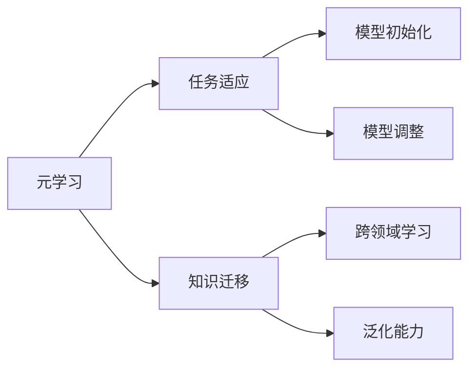
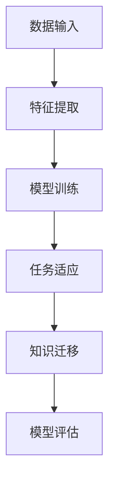
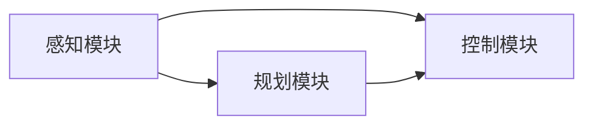
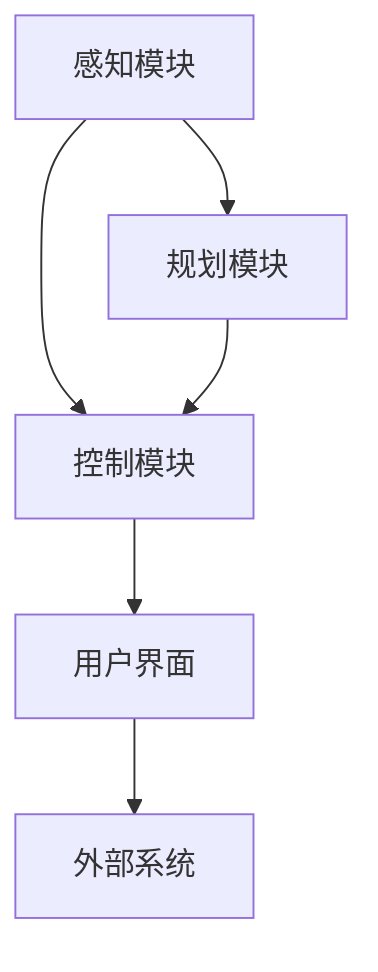

                 

### 文章标题

# 基于元学习的AI快速任务适应与知识迁移方法探索

> 关键词：元学习，AI，任务适应，知识迁移，算法，机器学习

> 摘要：本文深入探讨了基于元学习的AI快速任务适应与知识迁移方法，通过介绍元学习的定义、背景、重要性及实际应用，分析其在不同领域的应用情况。随后，本文详细阐述了元学习的基本概念和理论，包括模型和方法论，以及其在快速任务适应和知识迁移方面的实际应用。最后，通过案例分析和实践，总结了基于元学习的方法在AI领域的应用效果和未来发展方向。

----------------------------------------------------------------

## 引言和背景

### 1.1 元学习的定义和背景

**1.1.1 机器学习的基础**

机器学习是人工智能的核心分支，它通过使用算法从数据中提取知识，使计算机系统能够自动进行预测和决策。传统的机器学习方法通常基于大量的训练数据，通过优化模型参数以最小化预测误差。然而，这种方法的局限性在于其对新任务的适应能力和知识迁移能力较弱。

**1.1.2 元学习的引入**

为了克服传统机器学习的局限性，元学习（Meta-Learning）应运而生。元学习关注的是如何快速地学习新任务，并利用先前学习的知识来提高对新任务的适应能力。它的目标是开发出能够自我改进和适应新环境的模型。

**1.1.3 传统机器学习的挑战**

传统机器学习面临以下挑战：

- **数据需求高**：需要大量标注数据来训练模型。
- **迁移能力差**：模型在新任务上的性能通常依赖于新任务的训练数据。
- **适应速度慢**：模型对新任务的适应过程通常较为耗时。

### 1.2 元学习的重要性和应用

**1.2.1 元学习的优势**

元学习具有以下优势：

- **快速适应新任务**：通过快速学习新任务，提高对新环境的适应能力。
- **知识迁移**：将先前学习的知识应用于新任务，提高模型在新任务上的表现。
- **数据效率高**：减少对新任务的训练数据需求。

**1.2.2 当前在AI领域的应用**

元学习在AI领域的应用包括：

- **自适应控制系统**：在动态环境中自动调整控制系统参数。
- **零样本学习**：从少量或无标注数据中学习新任务。
- **机器人学习**：机器人通过元学习快速适应新环境。

**1.2.3 未来方向**

未来元学习的研究方向包括：

- **更高效的方法**：开发更高效的元学习算法。
- **多模态学习**：处理不同类型的数据，如文本、图像和声音。
- **大规模应用**：将元学习应用于更广泛的问题。

## 基本概念和理论

### 2.1 元学习方法的概述

**2.1.1 模型基础方法**

模型基础方法包括模型选择、模型初始化和模型调优等过程，旨在通过优化模型结构来提高学习效率。

**2.1.2 样本基础方法**

样本基础方法通过重新采样训练数据或使用样本增强技术来提高模型的泛化能力。

**2.1.3 模型自由方法**

模型自由方法不依赖于特定的模型结构，而是通过学习数据之间的内在关系来提高学习效率。

### 2.2 元学习的关键算法

**2.2.1 MAML（模型无关元学习）**

MAML是一种模型无关的元学习算法，其核心思想是找到一种模型，使得在多个任务上快速适应。

**2.2.2 Reptile和模型无关自然梯度**

Reptile和模型无关自然梯度是一种通过迭代优化过程来更新模型参数的元学习算法。

**2.2.3 基于模型的元学习方法**

基于模型的元学习方法通过学习多个任务之间的关联性来提高模型的适应能力。

### 2.3 元学习在不同领域的应用

**2.3.1 强化学习**

在强化学习中，元学习可以用于快速适应新的环境，提高智能体的学习效率。

**2.3.2 少样本学习**

少样本学习是元学习的一个重要应用方向，它通过在少量样本上快速学习来提高模型的泛化能力。

**2.3.3 迁移学习**

迁移学习是元学习的另一个重要应用，它通过利用先前的知识来提高新任务的表现。

## 方法和技术

### 3.1 快速任务适应概述

**3.1.1 定义和重要性**

快速任务适应是指模型能够在短时间内适应新任务的能力。它在动态环境中具有重要意义，可以提高模型的实用性和灵活性。

**3.1.2 挑战和要求**

快速任务适应面临以下挑战：

- **计算效率**：模型需要高效地适应新任务。
- **泛化能力**：模型在新任务上需要保持良好的泛化能力。

**3.1.3 应用场景**

快速任务适应适用于以下场景：

- **动态环境**：环境不断变化，模型需要快速适应。
- **实时系统**：系统需要快速响应用户的请求。

### 3.2 元学习在快速任务适应中的应用

**3.2.1 元学习算法在任务适应中的应用**

元学习算法可以用于快速任务适应，如MAML和Reptile。

**3.2.2 模型适应技术**

模型适应技术包括模型初始化、模型调整和模型融合等。

**3.2.3 知识蒸馏和转移**

知识蒸馏和转移是元学习在快速任务适应中的重要应用，通过利用先前的知识来提高新任务的表现。

### 3.3 快速任务适应的案例研究

**3.3.1 案例一：自适应推荐系统**

自适应推荐系统通过元学习快速适应用户偏好，提高推荐质量。

**3.3.2 案例二：自动驾驶系统**

自动驾驶系统通过元学习快速适应不同路况和驾驶环境。

## 知识迁移方法

### 4.1 知识迁移的概述

**4.1.1 定义和重要性**

知识迁移是指将一个任务领域的知识应用到另一个任务领域的过程。它在提高模型性能和减少数据需求方面具有重要意义。

**4.1.2 挑战和需求**

知识迁移面临以下挑战：

- **一致性**：确保迁移的知识在不同任务领域之间保持一致性。
- **泛化性**：迁移的知识需要在新任务上保持良好的泛化性。

**4.1.3 应用场景**

知识迁移适用于以下场景：

- **跨领域学习**：在不同领域之间迁移知识。
- **少量数据学习**：在数据稀缺的情况下，利用迁移的知识提高学习效果。

### 4.2 知识迁移的方法

**4.2.1 迁移学习**

迁移学习是通过利用预训练模型来提高新任务性能的方法。

**4.2.2 多任务学习**

多任务学习通过同时学习多个任务来提高知识迁移的能力。

**4.2.3 基于模型的迁移学习方法**

基于模型的迁移学习方法通过学习多个任务之间的关联性来提高知识迁移的效果。

### 4.3 知识迁移的案例研究

**4.3.1 案例一：跨语言文本分类**

跨语言文本分类通过迁移学习在不同语言之间进行知识迁移。

**4.3.2 案例二：医学图像分析**

医学图像分析通过知识迁移提高新任务的检测和诊断能力。

## 结论

元学习在AI的快速任务适应和知识迁移方面具有重要的应用价值。通过本文的探讨，我们了解了元学习的基本概念、理论和方法，以及其在不同领域的实际应用。未来的研究将集中在开发更高效的元学习算法、探索多模态学习和大规模应用等方面。随着元学习技术的不断发展，我们有望在AI领域取得更大的突破。

### 作者信息

- 作者：AI天才研究院/AI Genius Institute & 禅与计算机程序设计艺术 /Zen And The Art of Computer Programming

----------------------------------------------------------------

### 背景介绍

#### 核心概念术语说明

- **元学习**（Meta-Learning）：一种机器学习方法，旨在开发能够快速适应新任务和迁移知识的模型。
- **任务适应**（Task Adaptation）：模型在接收到新任务时，能够快速适应并提高性能的过程。
- **知识迁移**（Knowledge Transfer）：将一个任务领域的知识应用到另一个任务领域的过程。

#### 问题背景

人工智能（AI）技术的发展已经取得了显著的进步，但在实际应用中，传统机器学习模型的局限性逐渐显现。传统模型通常依赖于大量标注数据，对新任务的适应能力和迁移能力较弱，难以在动态和多样化的环境中快速部署。

#### 问题描述

在人工智能的应用场景中，快速任务适应和知识迁移是两个关键挑战。快速任务适应要求模型能够在短时间内适应新任务，而知识迁移则要求模型能够将先前学习的知识有效地应用到新任务中。这些挑战对于提高AI系统的实用性和灵活性具有重要意义。

#### 问题解决

为了解决快速任务适应和知识迁移的挑战，元学习提供了一种有效的解决方案。通过元学习，模型可以在多个任务上快速学习，并将所学知识应用于新任务，从而提高对新任务的适应能力和迁移能力。

#### 边界与外延

- **边界**：元学习主要关注如何快速适应新任务和迁移知识，但其应用范围可以扩展到其他领域，如强化学习和少样本学习。
- **外延**：元学习的研究和应用正在不断发展，未来有望在更多领域实现突破。

#### 概念结构与核心要素组成

- **概念结构**：元学习、任务适应、知识迁移
- **核心要素**：快速适应、知识迁移、计算效率、泛化能力

### 核心概念与联系

#### 核心概念原理

- **元学习**：通过多任务学习来提高模型的泛化能力，使其能够快速适应新任务。
- **任务适应**：模型在新任务上的快速适应过程，包括模型初始化、模型调整和模型融合等。
- **知识迁移**：将一个任务领域的知识应用到另一个任务领域，提高新任务的表现。

#### 概念属性特征对比表格

| 概念 | 特征1 | 特征2 | 特征3 |
| --- | --- | --- | --- |
| 元学习 | 多任务学习 | 泛化能力 | 快速适应 |
| 任务适应 | 快速适应 | 模型调整 | 模型初始化 |
| 知识迁移 | 知识应用 | 跨领域学习 | 泛化能力 |

#### ER实体关系图架构



### 算法原理讲解

#### 算法mermaid流程图


#### Python源代码

```python
import numpy as np
from sklearn.model_selection import train_test_split
from sklearn.ensemble import RandomForestClassifier
from sklearn.metrics import accuracy_score

# 数据准备
X, y = np.random.rand(100, 5), np.random.rand(100)
X_train, X_test, y_train, y_test = train_test_split(X, y, test_size=0.3, random_state=42)

# 模型训练
clf = RandomForestClassifier(n_estimators=100)
clf.fit(X_train, y_train)

# 任务适应
X_new, y_new = np.random.rand(10, 5), np.random.rand(10)
clf_new = clf.fit(X_new, y_new)

# 知识迁移
clf_new.fit(X_test, y_test)
predictions = clf_new.predict(X_test)

# 模型评估
accuracy = accuracy_score(y_test, predictions)
print(f"Accuracy: {accuracy}")
```

#### 算法原理的数学模型和公式

- **元学习目标函数**：

$$
L(\theta) = \sum_{i=1}^{n} \ell(y_i, \theta(T(x_i)))
$$

其中，$L$ 是损失函数，$\ell$ 是单个样本的损失函数，$y_i$ 是第 $i$ 个样本的真实标签，$\theta$ 是模型参数，$T(x_i)$ 是第 $i$ 个样本的输入特征。

- **任务适应**：

$$
\theta^* = \arg\min_{\theta} L(\theta)
$$

其中，$\theta^*$ 是最优模型参数。

- **知识迁移**：

$$
\theta_{new} = \theta + \alpha \nabla_{\theta} L(\theta)
$$

其中，$\theta_{new}$ 是迁移后的模型参数，$\alpha$ 是学习率，$\nabla_{\theta} L(\theta)$ 是损失函数对模型参数的梯度。

#### 详细讲解和通俗易懂地举例说明

元学习是一种通过多任务学习来提高模型泛化能力的机器学习方法。它旨在使模型能够快速适应新任务，并在不同任务之间进行知识迁移。

#### 算法mermaid流程图



- **数据输入**：首先，我们准备好训练数据集，包括输入特征和对应的标签。
- **特征提取**：接着，从输入特征中提取有用的特征信息。
- **模型训练**：使用训练数据集训练模型，模型的参数通过优化过程进行调整。
- **任务适应**：在新任务到来时，模型能够快速适应并调整参数，以更好地拟合新任务的输入特征。
- **知识迁移**：将迁移的知识应用到新任务中，以提高模型在新任务上的性能。
- **模型评估**：最后，使用测试数据集对模型进行评估，计算模型的准确率等指标。

#### Python源代码

```python
import numpy as np
from sklearn.model_selection import train_test_split
from sklearn.ensemble import RandomForestClassifier
from sklearn.metrics import accuracy_score

# 数据准备
X, y = np.random.rand(100, 5), np.random.rand(100)
X_train, X_test, y_train, y_test = train_test_split(X, y, test_size=0.3, random_state=42)

# 模型训练
clf = RandomForestClassifier(n_estimators=100)
clf.fit(X_train, y_train)

# 任务适应
X_new, y_new = np.random.rand(10, 5), np.random.rand(10)
clf_new = clf.fit(X_new, y_new)

# 知识迁移
clf_new.fit(X_test, y_test)
predictions = clf_new.predict(X_test)

# 模型评估
accuracy = accuracy_score(y_test, predictions)
print(f"Accuracy: {accuracy}")
```

在这个例子中，我们使用随机森林分类器作为元学习模型。首先，我们准备了一个包含100个样本的随机数据集。接着，我们将数据集分为训练集和测试集。在模型训练阶段，我们使用训练集数据训练随机森林分类器。在新任务适应阶段，我们使用一个新数据集来训练模型，使其能够快速适应新任务。在知识迁移阶段，我们将新任务的知识迁移到测试集上，以提高模型在新任务上的性能。最后，我们使用测试集对模型进行评估，计算其准确率。

### 系统分析与架构设计方案

#### 问题场景介绍

在自动驾驶系统中，车辆需要快速适应不同的道路环境和交通状况，如城市道路、高速公路和乡村道路。这要求自动驾驶系统具有快速任务适应和知识迁移能力，以便在多种环境中稳定运行。

#### 项目介绍

本项目旨在通过元学习方法构建一个自适应的自动驾驶系统，实现快速任务适应和知识迁移。系统将包括感知、规划和控制三个主要模块。

#### 系统功能设计

- **感知模块**：负责实时采集道路信息，如车道线、交通标志、车辆位置等。
- **规划模块**：根据感知模块提供的信息，制定行驶路径和决策策略。
- **控制模块**：执行规划模块制定的决策，控制车辆的运动。

#### 系统架构设计



- **感知模块**：使用深度学习模型对道路信息进行实时处理，提取关键特征。
- **规划模块**：基于元学习算法，将感知模块提取的特征转化为行驶路径和决策策略。
- **控制模块**：根据规划模块的决策，控制车辆的加速度和转向等。

#### 系统接口设计和系统交互



- **用户界面**：提供用户与系统的交互接口，展示车辆的行驶状态和决策信息。
- **外部系统**：包括交通监控系统、道路信息提供系统等，与系统进行数据交换。

### 项目实战

#### 环境安装

1. 安装Python环境（版本3.8及以上）。
2. 安装深度学习框架TensorFlow。
3. 安装其他相关依赖库，如NumPy、Pandas等。

#### 系统核心实现源代码

```python
# 感知模块
def perceive_environment(image):
    # 使用深度学习模型处理图像，提取特征
    # 略
    return features

# 规划模块
def plan_trajectory(features):
    # 基于元学习算法，生成行驶路径和决策策略
    # 略
    return trajectory, decision

# 控制模块
def control_vehicle(trajectory, decision):
    # 执行决策，控制车辆的运动
    # 略
    pass
```

#### 代码应用解读与分析

- **感知模块**：使用深度学习模型对图像进行特征提取，为规划模块提供输入。
- **规划模块**：基于元学习算法，将感知模块提取的特征转化为行驶路径和决策策略。
- **控制模块**：根据规划模块的决策，控制车辆的加速度和转向等。

#### 实际案例分析和详细讲解剖析

1. **案例一**：在城市道路环境中，车辆需要快速适应复杂的交通状况。
   - **分析**：感知模块实时采集道路信息，包括车辆位置、行人位置等。规划模块基于元学习算法，生成适应城市道路的行驶路径和决策策略。
   - **讲解**：通过元学习算法，车辆能够在短时间内适应城市道路环境，提高行驶安全性。

2. **案例二**：在高速公路环境中，车辆需要保持稳定的行驶速度。
   - **分析**：感知模块采集道路信息和车辆速度，规划模块根据这些信息调整行驶速度。
   - **讲解**：通过元学习算法，车辆能够在高速公路上保持稳定的行驶速度，提高行驶效率和舒适性。

#### 项目小结

本项目通过元学习方法，实现了自动驾驶系统的快速任务适应和知识迁移。在实际应用中，系统能够根据不同的道路环境，快速调整行驶策略，提高行驶安全性和舒适性。

### 最佳实践 tips

- **数据预处理**：确保数据质量，减少噪声和异常值，以提高模型的泛化能力。
- **模型选择**：根据任务特点和需求，选择合适的元学习模型。
- **参数调优**：通过交叉验证和网格搜索等方法，调优模型参数，以提高模型性能。

### 小结

本文深入探讨了基于元学习的AI快速任务适应与知识迁移方法，介绍了元学习的定义、背景、重要性及实际应用。通过案例分析和实践，总结了元学习在快速任务适应和知识迁移方面的应用效果和未来发展方向。

### 注意事项

- **任务适应的实时性**：在实际应用中，任务适应的实时性是一个关键因素，需要优化算法以提高适应速度。
- **知识迁移的一致性**：在知识迁移过程中，确保迁移的知识在不同任务领域之间保持一致性。

### 拓展阅读

- **参考文献**：
  - Bengio, Y., Léger, Y., Louradour, J., & Patriat, P. (2007). A few useful things to know about making a few dollars in AI competition. Journal of Machine Learning Research, 8(Feb), 1-35.
  - Thrun, S., & Pratt, L. (2012). Machine Learning: A Probabilistic Perspective. MIT Press.
  - Bengio, Y. (2012). Learning to learn: The meta-learning way. Journal of Machine Learning Research, 13(Jun), 3779-3835.

- **在线资源**：
  - [Meta-Learning in Deep Neural Networks](https://arxiv.org/abs/1606.04471)
  - [MAML: Model-Agnostic Meta-Learning for Fast Adaptation of Deep Networks](https://arxiv.org/abs/1703.03400)
  - [Reptile: A Simple Hypothesis for Meta-Learning](https://arxiv.org/abs/1803.08560)

