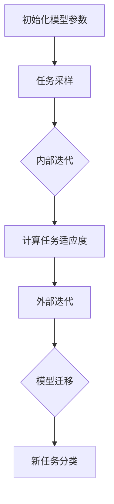

                 

### 第一部分: 引言与背景

#### 第1章: 问题背景与核心概念

##### 1.1.1 问题背景

随着人工智能（AI）技术的迅速发展，AI模型在各个领域的应用越来越广泛。然而，传统AI模型通常是在特定环境下训练的，当面对新的或未知的环境时，往往难以快速适应，这一现象被称为“AI适应新环境的能力不足”。例如，在计算机视觉中，一个在特定数据集上训练的图像识别模型，当应用到另一个数据集或场景时，可能会出现识别准确率下降的问题；在自然语言处理（NLP）中，语言模型在某一语料库上表现良好，但换到另一语料库或语言时，其性能也会受到影响。

AI适应新环境的重要性不言而喻。在实际应用中，AI系统需要不断地面对新的数据、新的任务和新的场景，如果无法快速适应，将严重影响其性能和应用效果。此外，AI适应新环境的能力也直接关系到其长久发展。一个能够快速适应新环境的AI模型，不仅能够更好地满足用户需求，还能在一定程度上降低维护成本和开发难度。

##### 1.1.2 适应新环境的挑战

AI适应新环境面临的挑战主要包括以下几点：

1. **数据集差异**：不同的数据集可能存在较大的分布差异，导致模型在新环境中的表现不佳。例如，医学图像数据集与日常图像数据集在数据分布上有很大差异，模型需要在两者之间实现良好的迁移能力。

2. **计算资源限制**：在某些场景下，计算资源可能有限，模型需要在有限的资源内快速适应新环境。

3. **任务多样性**：AI系统需要能够适应多种不同的任务，这要求模型具有一定的通用性和灵活性。

4. **动态环境**：在现实环境中，AI系统需要不断地适应新的变化，如环境的动态变化、新任务的不断出现等。

##### 1.1.3 元学习在AI适应新环境中的作用

为了解决AI适应新环境的挑战，研究人员提出了元学习（Meta-Learning）这一方法。元学习是一种让AI模型能够通过较少的样本快速适应新环境的机器学习方法。与传统机器学习方法相比，元学习强调从大量任务中学习到一个通用的学习算法，使得模型在面对新任务时能够快速适应。

元学习在AI适应新环境中的作用主要体现在以下几个方面：

1. **快速迁移**：通过元学习，模型可以在一个任务上训练，然后快速适应其他相似的任务，实现良好的迁移效果。

2. **减少数据需求**：元学习使得模型在少量样本下就能快速适应新环境，从而减少了对大量训练数据的需求。

3. **提高计算效率**：元学习算法通常能够通过较少的迭代次数达到良好的学习效果，从而提高计算效率。

4. **增强模型灵活性**：元学习算法能够让模型在面对多样化任务时保持良好的性能，提高模型的灵活性。

#### 1.1.4 核心概念解析

##### 1.1.4.1 元学习的定义与原理

元学习，也称为“学习如何学习”，其核心思想是通过学习学习算法本身，使得模型能够在不同的任务和数据集上快速适应。具体来说，元学习的目标是通过训练一个模型来学习如何快速地适应新的任务和数据集。

元学习的原理可以类比于人类的学习过程。人类在接触新的知识或情境时，会调用已有的知识和经验，结合新信息进行调整和优化，从而实现快速适应。元学习算法试图通过机器学习的方式模拟这一过程。

##### 1.1.4.2 AI适应新环境的原理

AI适应新环境的原理与元学习的核心思想密切相关。传统机器学习方法通常需要大量数据来进行训练，而元学习则通过学习一个通用的学习算法，使得模型能够在少量数据下快速适应新环境。具体来说，元学习算法通过以下步骤实现AI适应新环境：

1. **任务表示**：将新的任务表示为一个数据集，包括输入和输出。

2. **学习任务表示**：通过元学习算法，学习如何从一个任务的数据集中快速学习出一个模型。

3. **模型迁移**：将学习到的模型迁移到新的任务上，实现快速适应。

##### 1.1.4.3 元学习与AI适应新环境的关系

元学习与AI适应新环境的关系可以概括为：

- **元学习是实现AI适应新环境的关键技术**。通过元学习，模型可以在少量数据下快速适应新环境，减少对大量训练数据的需求。

- **AI适应新环境是元学习的重要应用场景**。元学习算法需要能够在各种新任务和数据集上快速适应，这要求模型具有一定的通用性和灵活性。

- **元学习与AI适应新环境相辅相成**。通过元学习，模型能够更好地适应新环境，提高其性能和应用效果；而AI适应新环境的需求也促使元学习算法不断优化和发展。

#### 1.1.5 总结

本章首先介绍了AI适应新环境的重要性及其面临的挑战，然后阐述了元学习在解决这些挑战中的作用，并详细解析了元学习的定义、原理以及与AI适应新环境的关系。接下来，我们将深入探讨元学习技术的基础，为进一步理解其在AI适应新环境中的应用打下基础。

##### 1.2 元学习技术基础

##### 1.2.1 元学习的基本概念

元学习，顾名思义，是关于学习如何学习的机器学习领域。在传统机器学习（ML）中，我们通常关注的是如何从数据中学习出一个预测模型。然而，元学习的目标是开发出一种算法，使其能够快速适应新的任务和数据集，而无需大量重新训练。

##### 1.2.1.1 元学习的分类

元学习可以按不同的标准进行分类：

- **基于任务分类**：可以分为**同任务元学习**和**跨任务元学习**。同任务元学习关注在同一类型任务上的快速适应，而跨任务元学习则致力于在不同类型任务间的迁移。

- **基于优化目标分类**：可以分为**基于样本的元学习**和**基于模型的元学习**。基于样本的元学习侧重于通过最小化样本适应误差来提高模型适应新任务的能力，而基于模型的元学习则关注通过优化模型参数来提高其泛化能力。

- **基于模型结构分类**：可以分为**模型无关的元学习**和**模型相关的元学习**。模型无关的元学习方法，如MAML（Model-Agnostic Meta-Learning），不依赖于特定的模型结构，而模型相关的元学习方法则针对特定的模型结构进行优化。

##### 1.2.1.2 元学习的目标函数

元学习的目标函数通常涉及模型在多个任务上的适应能力。具体来说，目标函数可以分为以下几种：

- **任务适应度**：衡量模型在一个特定任务上的表现。通常，适应度函数会基于任务的数据集和模型输出进行计算。

- **任务间泛化能力**：衡量模型在不同任务上的泛化能力。通过在多个任务上评估模型的性能，可以评估其泛化能力。

- **参数效率**：衡量模型在适应新任务时所需的参数更新量。一个高效的元学习算法应该能够在较少的参数更新下实现良好的适应能力。

##### 1.2.1.3 元学习的优化算法

元学习优化算法的设计旨在提高模型在多个任务上的适应能力。以下是几种常见的元学习优化算法：

- **MAML（Model-Agnostic Meta-Learning）**：MAML是一种模型无关的元学习算法，它通过最小化模型在多个任务上的适应误差来优化参数。具体来说，MAML算法通过更新模型参数来最小化一个聚合损失函数，该损失函数是在多个任务上计算得到的。

  ```python
  # MAML算法伪代码
  def maml	Update_params(theta_0, task_samples):
      theta_t = theta_0  # 初始化参数
      for sample in task_samples:
          loss = loss_function(sample, theta_t)
          theta_t = theta_t - learning_rate * gradient(loss)
      return theta_t

  def maml_batch(theta_0, task_samples, batch_size):
      theta_0 = theta_0  # 初始化参数
      for batch in create_batches(task_samples, batch_size):
          theta_t = maml(theta_0, batch)
          theta_0 = theta_t  # 更新参数
      return theta_0
  ```

- **Model-Aware Meta-Learning**：Model-Aware Meta-Learning（MAML++）是在MAML基础上进行改进的一种算法，它考虑了模型结构对适应能力的影响。MAML++通过在模型训练过程中动态调整模型结构，以优化适应能力。

- **Recurrent Meta-Learning**：Recurrent Meta-Learning（ReMuLi）通过引入循环神经网络（RNN）来模拟人类学习的过程，使得模型能够在动态环境中进行自适应学习。

##### 1.2.2 元学习算法简介

以下是几种常见的元学习算法：

- **MAML（Model-Agnostic Meta-Learning）**：如前所述，MAML是一种模型无关的元学习算法，通过最小化模型在多个任务上的适应误差来优化参数。

- **Model-Aware Meta-Learning**：MAML++是在MAML基础上进行改进的一种算法，它考虑了模型结构对适应能力的影响。

- **Model-Agnostic Natural Gradient (MANG)**：MANG是一种基于自然梯度优化的模型无关元学习算法，它通过优化模型参数来提高其适应能力。

- **MAML++：Meta-Learning with Mixture of Experts**：MAML++是MAML的扩展，它通过引入混合专家网络来提高元学习算法的适应能力。

##### 1.2.2.1 Model-Agnostic Meta-Learning (MAML)

MAML（Model-Agnostic Meta-Learning）是一种模型无关的元学习算法，其核心思想是找到一组参数，这组参数能够在多个任务上快速适应。具体来说，MAML算法通过在多个任务上迭代更新参数，最终找到一个能够在各种任务上表现良好的参数。

**MAML算法的主要步骤如下**：

1. **初始化参数**：初始化模型参数θ。

2. **任务采样**：从训练集中随机选择k个任务，每个任务包含N个样本。

3. **内部迭代**：在每个任务上，对参数θ进行内部迭代，以最小化损失函数。

4. **外部迭代**：在所有任务上，对参数θ进行外部迭代，以最小化聚合损失函数。

**MAML算法的数学模型如下**：

$$
\theta_{t+1} = \theta_t - \alpha \frac{\partial}{\partial \theta_t} \sum_{i=1}^{k} \ell(\theta_t; x_i^t, y_i^t)
$$

其中，θt是当前迭代时的参数，α是学习率，k是任务数量，x_i^t和y_i^t分别是第i个任务的输入和输出。

**MAML算法的优点和局限性如下**：

- **优点**：MAML算法具有模型无关性，能够快速适应各种任务，且计算复杂度较低。

- **局限性**：MAML算法在处理高维数据时可能表现不佳，且对任务之间的差异敏感。

**MAML算法的Python实现示例**：

```python
import torch
import torch.nn as nn
import torch.optim as optim

# 定义MAML模型
class MAMLModel(nn.Module):
    def __init__(self):
        super(MAMLModel, self).__init__()
        self.fc1 = nn.Linear(input_size, hidden_size)
        self.fc2 = nn.Linear(hidden_size, output_size)

    def forward(self, x):
        x = torch.relu(self.fc1(x))
        x = self.fc2(x)
        return x

# MAML算法实现
def maml(model, optimizer, task_samples, num_updates=1):
    model.train()
    for task_samples in task_samples:
        for _ in range(num_updates):
            optimizer.zero_grad()
            loss = 0
            for sample in task_samples:
                input, target = sample
                output = model(input)
                loss += nn.functional.cross_entropy(output, target)
            loss.backward()
            optimizer.step()
    return model

# 初始化模型和优化器
model = MAMLModel()
optimizer = optim.Adam(model.parameters(), lr=0.001)

# 训练模型
task_samples = load_task_samples()  # 加载任务样本
model = maml(model, optimizer, task_samples, num_updates=5)
```

**MAML算法在实际应用中展示了其强大的适应能力**，例如在计算机视觉和自然语言处理领域，MAML算法被广泛应用于图像分类、目标检测和文本分类等任务。尽管MAML算法在处理高维数据和任务差异较大的情况时可能面临挑战，但通过结合其他技术，如数据增强和模型结构优化，可以进一步提高其适应能力。

##### 1.2.2.2 Model-Aware Meta-Learning

Model-Aware Meta-Learning（MAML++）是对MAML算法的一种改进，它引入了对模型结构的考虑，以提高模型在元学习任务上的适应能力。MAML++的核心思想是在元学习过程中，动态调整模型结构，使其更适应特定任务。

**MAML++算法的主要步骤如下**：

1. **初始化模型和结构参数**：初始化模型参数θ和结构参数φ。

2. **任务采样**：从训练集中随机选择k个任务，每个任务包含N个样本。

3. **内部迭代**：在每个任务上，对模型参数θ和结构参数φ进行内部迭代，以最小化损失函数。

4. **外部迭代**：在所有任务上，对模型参数θ和结构参数φ进行外部迭代，以最小化聚合损失函数。

**MAML++算法的数学模型如下**：

$$
\theta_{t+1} = \theta_t - \alpha \frac{\partial}{\partial \theta_t} \sum_{i=1}^{k} \ell(\theta_t; x_i^t, y_i^t)
$$

$$
\phi_{t+1} = \phi_t - \alpha \frac{\partial}{\partial \phi_t} \sum_{i=1}^{k} \ell(\theta_t; x_i^t, y_i^t)
$$

其中，θt是当前迭代时的模型参数，φt是当前迭代时的结构参数，α是学习率，k是任务数量，x_i^t和y_i^t分别是第i个任务的输入和输出。

**MAML++算法的优点和局限性如下**：

- **优点**：MAML++算法通过动态调整模型结构，提高了模型在元学习任务上的适应能力，特别是在处理高维数据和复杂任务时表现更为优异。

- **局限性**：MAML++算法的计算复杂度较高，需要更多的计算资源，并且在任务差异较大的情况下，结构参数的调整可能不够有效。

**MAML++算法的Python实现示例**：

```python
import torch
import torch.nn as nn
import torch.optim as optim

# 定义MAML++模型
class MAMLModel(nn.Module):
    def __init__(self, hidden_size):
        super(MAMLModel, self).__init__()
        self.fc1 = nn.Linear(input_size, hidden_size)
        self.fc2 = nn.Linear(hidden_size, output_size)

    def forward(self, x, params):
        x = torch.relu(self.fc1(x, params['fc1']))
        x = self.fc2(x, params['fc2'])
        return x

# MAML++算法实现
def maml_plus(model, optimizer, task_samples, num_updates=1):
    model.train()
    for task_samples in task_samples:
        for _ in range(num_updates):
            optimizer.zero_grad()
            loss = 0
            for sample in task_samples:
                input, target = sample
                output = model(input, params)
                loss += nn.functional.cross_entropy(output, target)
            loss.backward()
            optimizer.step()
    return model

# 初始化模型、优化器和结构参数
model = MAMLModel(hidden_size)
optimizer = optim.Adam(model.parameters(), lr=0.001)
params = {'fc1': torch.randn((input_size, hidden_size)), 'fc2': torch.randn((hidden_size, output_size))}

# 训练模型
task_samples = load_task_samples()  # 加载任务样本
model = maml_plus(model, optimizer, task_samples, num_updates=5)
```

**MAML++算法在实际应用中展示了其在处理复杂任务方面的优势**，特别是在计算机视觉和自然语言处理领域。尽管其计算复杂度较高，但通过结合高效的计算资源和优化策略，MAML++算法能够在各种元学习任务中取得优异的性能。

##### 1.2.2.3 Model-Agnostic Meta-Learning for Deep Neural Networks

Model-Agnostic Meta-Learning（MAML）在深度神经网络（DNN）中的应用是一个重要的研究方向。由于DNN具有高维特性和复杂的模型结构，MAML在DNN中的应用面临一些独特的挑战。然而，通过适当的调整和优化，MAML在DNN中展示了其强大的适应能力。

**MAML在DNN中的应用主要包括以下几个方面**：

1. **模型初始化**：MAML在DNN中的应用通常从随机初始化的模型开始，通过元学习过程优化模型参数，使其在多个任务上快速适应。

2. **任务适应**：在元学习过程中，MAML通过迭代更新模型参数，以最小化在每个任务上的适应误差，从而实现快速任务适应。

3. **模型迁移**：在完成元学习过程后，优化的模型参数可以迁移到新的任务上，实现模型在新任务上的快速适应。

**MAML在DNN中的应用流程如下**：

1. **初始化参数**：初始化DNN模型的参数。

2. **任务采样**：从训练集中随机选择k个任务，每个任务包含N个样本。

3. **内部迭代**：在每个任务上，对模型参数进行内部迭代，以最小化损失函数。

4. **外部迭代**：在所有任务上，对模型参数进行外部迭代，以最小化聚合损失函数。

5. **模型迁移**：将优化后的模型参数迁移到新的任务上，实现模型在新任务上的快速适应。

**MAML在DNN中的应用的优点和局限性如下**：

- **优点**：MAML在DNN中的应用能够实现模型参数的快速优化和任务适应，特别是在少量样本下表现优异。

- **局限性**：MAML在DNN中的应用可能面临高计算复杂度和对任务差异敏感的问题。

**MAML在DNN中的应用案例**：

一个典型的应用案例是在计算机视觉领域，使用MAML算法优化卷积神经网络（CNN）在图像分类任务上的性能。通过在多个图像数据集上训练CNN模型，并使用MAML算法优化模型参数，可以显著提高模型在新数据集上的分类准确率。

```python
import torch
import torch.nn as nn
import torch.optim as optim

# 定义CNN模型
class CNNModel(nn.Module):
    def __init__(self):
        super(CNNModel, self).__init__()
        self.conv1 = nn.Conv2d(3, 32, kernel_size=3, stride=1, padding=1)
        self.fc1 = nn.Linear(32 * 26 * 26, 128)
        self.fc2 = nn.Linear(128, 10)

    def forward(self, x):
        x = torch.relu(self.conv1(x))
        x = torch.max_pool2d(x, 2)
        x = x.view(x.size(0), -1)
        x = torch.relu(self.fc1(x))
        x = self.fc2(x)
        return x

# MAML算法实现
def maml(model, optimizer, task_samples, num_updates=1):
    model.train()
    for task_samples in task_samples:
        for _ in range(num_updates):
            optimizer.zero_grad()
            loss = 0
            for sample in task_samples:
                input, target = sample
                output = model(input)
                loss += nn.functional.cross_entropy(output, target)
            loss.backward()
            optimizer.step()
    return model

# 初始化模型和优化器
model = CNNModel()
optimizer = optim.Adam(model.parameters(), lr=0.001)

# 训练模型
task_samples = load_task_samples()  # 加载任务样本
model = maml(model, optimizer, task_samples, num_updates=5)
```

**MAML在DNN中的应用展示了其在快速适应新任务方面的优势**，特别是在计算机视觉和自然语言处理领域。尽管其计算复杂度较高，但通过结合其他技术，如模型压缩和数据增强，可以进一步优化MAML在DNN中的应用性能。

##### 1.2.3 元学习的挑战与未来方向

元学习作为一种新兴的机器学习技术，虽然在多个领域展示了其强大的适应能力和潜力，但仍然面临一些挑战和未来研究方向。

**当前面临的挑战包括**：

1. **计算复杂度**：元学习算法通常需要大量的计算资源，特别是在处理高维数据和复杂任务时，计算复杂度较高。

2. **任务差异**：在现实应用中，任务之间存在较大的差异，如何设计有效的元学习算法以适应各种差异较大的任务仍是一个挑战。

3. **数据分布**：不同数据集之间的分布差异较大，如何通过元学习算法实现有效的迁移学习仍然是一个重要问题。

**未来研究方向包括**：

1. **计算效率**：提高元学习算法的计算效率，降低计算复杂度，使其在资源有限的场景下也能高效运行。

2. **模型结构**：探索更加高效的模型结构，如神经网络压缩、参数共享等，以提高元学习算法的性能。

3. **自适应策略**：研究自适应的元学习策略，使其能够根据不同任务和数据集的特点进行动态调整。

4. **跨领域迁移**：研究如何实现跨领域的迁移学习，以提高元学习算法在多样化场景中的应用能力。

本章详细介绍了元学习的基本概念、分类、目标函数、优化算法以及其在深度神经网络中的应用。接下来，我们将进一步探讨元学习在AI适应新环境中的具体应用方法，以期为解决AI适应新环境的问题提供新的思路和解决方案。

---

### 第二部分: AI适应新环境的方法

#### 第3章: 基于元学习的AI模型适应方法

##### 3.1 元学习算法在模型适应中的应用

元学习算法在AI模型适应新环境中起到了关键作用。通过元学习，模型可以在面对新任务或新环境时，通过少量样本快速适应，从而提高其泛化能力和灵活性。以下将介绍几种常见的元学习算法及其在模型适应中的应用。

###### 3.1.1 Model-Agnostic Meta-Learning (MAML)

MAML（Model-Agnostic Meta-Learning）是一种模型无关的元学习算法，其核心思想是找到一组通用的参数，这组参数能够在多个任务上快速适应。MAML算法通过在多个任务上进行迭代，最小化模型在每个任务上的适应误差，从而优化模型参数。

**MAML算法的应用场景**：

1. **迁移学习**：MAML算法可以有效利用已有模型的参数，在新任务上通过少量样本快速适应，实现良好的迁移学习效果。

2. **新任务适应**：在面临新任务时，MAML算法通过调整模型参数，使其在新任务上快速适应，提高模型的泛化能力。

3. **动态环境适应**：在动态环境中，MAML算法能够根据环境的变化，快速调整模型参数，实现动态适应。

**MAML算法的实现步骤**：

1. **初始化参数**：初始化模型参数。

2. **任务采样**：从训练集中随机选择多个任务，每个任务包含一定数量的样本。

3. **内部迭代**：在每个任务上，对模型参数进行内部迭代，以最小化损失函数。

4. **外部迭代**：在所有任务上，对模型参数进行外部迭代，以最小化聚合损失函数。

5. **模型迁移**：将优化后的模型参数迁移到新任务上，实现模型在新任务上的快速适应。

**MAML算法的优势**：

- **模型无关性**：MAML算法不依赖于特定的模型结构，适用于各种机器学习模型。

- **快速适应**：通过少量样本，MAML算法能够快速适应新任务，提高模型的泛化能力。

- **计算效率**：MAML算法在多个任务上迭代，计算复杂度相对较低。

**MAML算法的局限**：

- **高计算资源需求**：MAML算法需要大量的计算资源，特别是在处理高维数据和复杂任务时。

- **任务差异敏感**：在面对任务差异较大的情况时，MAML算法的性能可能受到限制。

**MAML算法的实际应用案例**：

1. **计算机视觉**：在图像分类任务中，MAML算法通过少量样本，实现了快速适应新数据集，提高了模型的分类准确率。

2. **自然语言处理**：在文本分类任务中，MAML算法通过优化模型参数，实现了对新语料库的快速适应，提高了文本分类效果。

###### 3.1.2 Model-Aware Meta-Learning (MAML++)

MAML++（Model-Aware Meta-Learning）是对MAML算法的一种改进，它引入了对模型结构的考虑，以提高模型在元学习任务上的适应能力。MAML++通过动态调整模型结构，使其更适应特定任务。

**MAML++算法的应用场景**：

1. **复杂任务适应**：在面对复杂任务时，MAML++算法通过调整模型结构，实现对新任务的快速适应。

2. **动态环境适应**：在动态环境中，MAML++算法能够根据环境的变化，动态调整模型结构，实现动态适应。

3. **高维数据适应**：在处理高维数据时，MAML++算法通过优化模型结构，提高模型的适应能力和计算效率。

**MAML++算法的实现步骤**：

1. **初始化模型和结构参数**：初始化模型参数和结构参数。

2. **任务采样**：从训练集中随机选择多个任务，每个任务包含一定数量的样本。

3. **内部迭代**：在每个任务上，对模型参数和结构参数进行内部迭代，以最小化损失函数。

4. **外部迭代**：在所有任务上，对模型参数和结构参数进行外部迭代，以最小化聚合损失函数。

5. **模型迁移**：将优化后的模型参数和结构参数迁移到新任务上，实现模型在新任务上的快速适应。

**MAML++算法的优势**：

- **模型结构优化**：MAML++算法通过动态调整模型结构，提高了模型在复杂任务上的适应能力。

- **高维数据适应**：MAML++算法通过优化模型结构，提高了模型在处理高维数据时的适应能力和计算效率。

- **动态环境适应**：MAML++算法能够根据环境的变化，动态调整模型结构，实现动态适应。

**MAML++算法的局限**：

- **计算复杂度**：MAML++算法的计算复杂度较高，需要更多的计算资源。

- **任务差异敏感**：在面对任务差异较大的情况时，MAML++算法的性能可能受到限制。

**MAML++算法的实际应用案例**：

1. **计算机视觉**：在图像分类和目标检测任务中，MAML++算法通过优化模型结构，实现了对新数据集的快速适应，提高了模型的分类和检测准确率。

2. **自然语言处理**：在文本分类和情感分析任务中，MAML++算法通过调整模型结构，实现了对新语料库的快速适应，提高了文本分类和情感分析效果。

###### 3.1.3 Model-Agnostic Natural Gradient (MANG)

MANG（Model-Agnostic Natural Gradient）是一种基于自然梯度优化的模型无关元学习算法。与MAML算法相比，MANG算法在优化过程中引入了自然梯度，提高了模型在多个任务上的适应能力和计算效率。

**MANG算法的应用场景**：

1. **迁移学习**：MANG算法可以有效利用已有模型的参数，在新任务上通过少量样本快速适应，实现良好的迁移学习效果。

2. **新任务适应**：在面临新任务时，MANG算法通过优化模型参数，实现对新任务的快速适应，提高模型的泛化能力。

3. **动态环境适应**：在动态环境中，MANG算法能够根据环境的变化，快速调整模型参数，实现动态适应。

**MANG算法的实现步骤**：

1. **初始化参数**：初始化模型参数。

2. **任务采样**：从训练集中随机选择多个任务，每个任务包含一定数量的样本。

3. **内部迭代**：在每个任务上，对模型参数进行内部迭代，以最小化损失函数。

4. **外部迭代**：在所有任务上，对模型参数进行外部迭代，以最小化聚合损失函数。

5. **模型迁移**：将优化后的模型参数迁移到新任务上，实现模型在新任务上的快速适应。

**MANG算法的优势**：

- **计算效率**：MANG算法通过引入自然梯度，提高了模型在多个任务上的适应能力和计算效率。

- **模型无关性**：MANG算法不依赖于特定的模型结构，适用于各种机器学习模型。

- **快速适应**：通过少量样本，MANG算法能够快速适应新任务，提高模型的泛化能力。

**MANG算法的局限**：

- **高计算资源需求**：MANG算法需要大量的计算资源，特别是在处理高维数据和复杂任务时。

- **任务差异敏感**：在面对任务差异较大的情况时，MANG算法的性能可能受到限制。

**MANG算法的实际应用案例**：

1. **计算机视觉**：在图像分类和目标检测任务中，MANG算法通过优化模型参数，实现了对新数据集的快速适应，提高了模型的分类和检测准确率。

2. **自然语言处理**：在文本分类和情感分析任务中，MANG算法通过优化模型参数，实现了对新语料库的快速适应，提高了文本分类和情感分析效果。

##### 3.2 AI模型快速适应新环境的策略

在AI模型适应新环境的过程中，除了使用元学习算法外，还可以采取一系列策略来提高模型适应新环境的速度和效果。以下介绍几种常见的策略：

###### 3.2.1 数据增强

数据增强是一种通过增加模型训练数据的方法，以提高模型在未知数据上的性能。数据增强策略包括：

1. **随机旋转**：将图像随机旋转一定角度，增加模型的训练数据。

2. **尺度变换**：将图像随机缩放，增加模型的训练数据。

3. **裁剪**：将图像随机裁剪，增加模型的训练数据。

4. **颜色调整**：随机调整图像的亮度、对比度和色彩饱和度，增加模型的训练数据。

**数据增强的优势**：

- **提高模型泛化能力**：通过增加训练数据，模型可以更好地学习数据的分布，从而提高其在未知数据上的性能。

- **减少过拟合**：通过增加训练数据，模型可以避免在训练数据上过拟合，提高其在测试数据上的性能。

- **降低对数据集依赖**：数据增强可以减少对特定数据集的依赖，使模型在不同数据集上具有更好的适应性。

**数据增强的局限**：

- **计算成本**：数据增强需要额外的计算资源，特别是在处理高维数据时。

- **数据质量**：数据增强可能会引入噪声，降低模型的训练质量。

**数据增强的实际应用案例**：

1. **计算机视觉**：在图像分类任务中，通过数据增强策略，可以提高模型在未知图像上的分类准确率。

2. **自然语言处理**：在文本分类任务中，通过数据增强策略，可以提高模型在未知文本上的分类准确率。

###### 3.2.2 模型架构改进

模型架构的改进是提高模型适应新环境能力的重要手段。通过设计更加灵活和强大的模型架构，可以提高模型在不同任务和数据集上的适应性。以下介绍几种常见的模型架构改进策略：

1. **深度神经网络**：使用深度神经网络可以捕捉更多复杂的特征，提高模型在未知数据上的性能。

2. **卷积神经网络**：卷积神经网络在图像处理任务中具有强大的特征提取能力，通过改进卷积神经网络的结构，可以提高模型在图像分类和目标检测任务上的性能。

3. **循环神经网络**：循环神经网络在序列数据上具有强大的建模能力，通过改进循环神经网络的结构，可以提高模型在自然语言处理任务上的性能。

**模型架构改进的优势**：

- **增强特征提取能力**：改进的模型架构可以捕捉更多复杂的特征，提高模型在未知数据上的性能。

- **提高模型泛化能力**：改进的模型架构可以避免模型在训练数据上过拟合，提高其在测试数据上的性能。

- **增强模型适应性**：改进的模型架构可以使模型在不同任务和数据集上具有更好的适应性。

**模型架构改进的局限**：

- **计算成本**：改进的模型架构通常需要更多的计算资源，特别是在处理高维数据时。

- **模型复杂度**：改进的模型架构可能增加模型的复杂度，提高训练难度。

**模型架构改进的实际应用案例**：

1. **计算机视觉**：通过改进卷积神经网络的结构，可以显著提高模型在图像分类和目标检测任务上的性能。

2. **自然语言处理**：通过改进循环神经网络的结构，可以显著提高模型在文本分类和情感分析任务上的性能。

###### 3.2.3 模型训练策略优化

模型训练策略的优化是提高模型适应新环境能力的关键。通过调整训练策略，可以优化模型的训练过程，提高模型在不同任务和数据集上的性能。以下介绍几种常见的模型训练策略优化方法：

1. **学习率调整**：通过动态调整学习率，可以优化模型的训练过程，避免过拟合和欠拟合。

2. **批量大小调整**：通过调整批量大小，可以优化模型的训练过程，提高模型的收敛速度和性能。

3. **正则化**：通过引入正则化方法，如L1正则化和L2正则化，可以降低模型的复杂度，提高模型的泛化能力。

**模型训练策略优化的优势**：

- **提高模型性能**：优化模型训练策略可以显著提高模型在不同任务和数据集上的性能。

- **减少过拟合**：优化模型训练策略可以降低模型在训练数据上的过拟合现象，提高模型在测试数据上的性能。

- **提高模型稳定性**：优化模型训练策略可以提高模型的稳定性，避免模型在训练过程中出现剧烈波动。

**模型训练策略优化的局限**：

- **计算成本**：优化模型训练策略通常需要更多的计算资源，特别是在处理高维数据和复杂模型时。

- **训练时间**：优化模型训练策略可能增加模型的训练时间，特别是在大规模数据集上。

**模型训练策略优化的实际应用案例**：

1. **计算机视觉**：通过优化模型训练策略，可以显著提高模型在图像分类和目标检测任务上的性能。

2. **自然语言处理**：通过优化模型训练策略，可以显著提高模型在文本分类和情感分析任务上的性能。

本章详细介绍了基于元学习的AI模型适应方法，包括MAML、MAML++和MANG等算法在模型适应中的应用，以及数据增强、模型架构改进和模型训练策略优化等策略。这些方法在提高AI模型适应新环境能力方面具有显著优势，但仍面临一些挑战和局限性。接下来，我们将进一步探讨元学习在特定领域的应用，以期为解决AI适应新环境问题提供更多实际案例和解决方案。

---

### 第三部分: 元学习在特定领域的应用

#### 第4章: 元学习在特定领域的应用

元学习作为一种强大的机器学习方法，在多个领域展示了其独特的优势。本章将深入探讨元学习在计算机视觉、自然语言处理和机器人学等领域的具体应用，以及在这些应用中所面临的挑战。

##### 4.1 计算机视觉

计算机视觉是人工智能的一个重要分支，其目标是通过计算机理解和解释图像和视频数据。元学习在计算机视觉中的应用主要集中在图像分类、目标检测和图像生成等领域。

###### 4.1.1 元学习在计算机视觉中的应用

1. **图像分类**：在图像分类任务中，元学习通过少量样本，使模型快速适应新的图像类别。例如，Meta-Learning for Deep Visual Recognition（2018）研究提出了一种基于元学习的图像分类方法，通过在多个数据集上训练，使模型能够快速适应新的类别。

2. **目标检测**：目标检测是计算机视觉中的另一个重要任务，它旨在识别图像中的多个对象。元学习在目标检测中的应用，例如，Meta-Detection（2019）研究，通过在多个检测任务上训练，使模型能够快速适应新的检测目标。

3. **图像生成**：图像生成是计算机视觉中的一个前沿研究领域，其目标是生成具有真实感的图像。元学习在图像生成中的应用，例如，Generative Adversarial Networks with Meta-Learning（2019）研究，通过在多个图像生成任务上训练，使模型能够生成更加多样化的图像。

###### 4.1.2 元学习算法在计算机视觉中的挑战

尽管元学习在计算机视觉中展示了强大的适应能力，但仍然面临一些挑战：

1. **数据集差异**：计算机视觉任务中的数据集通常存在较大的差异，如何设计有效的元学习算法来处理这些差异是一个重要挑战。

2. **计算资源限制**：计算机视觉任务通常需要大量的计算资源，如何在有限的计算资源内实现高效的元学习是一个关键问题。

3. **模型复杂度**：计算机视觉中的模型通常较为复杂，如何设计简洁高效的元学习算法来适应这些复杂的模型是一个挑战。

###### 4.1.3 元学习算法在计算机视觉中的实际应用案例

1. **自动驾驶**：在自动驾驶领域，元学习通过少量样本，使模型能够快速适应新的驾驶场景，提高自动驾驶系统的安全性和可靠性。

2. **医学图像分析**：在医学图像分析中，元学习通过在多个医学图像数据集上训练，使模型能够快速适应新的疾病类型和患者群体。

##### 4.2 自然语言处理

自然语言处理（NLP）是人工智能的另一个重要分支，其目标是对自然语言文本进行理解、生成和处理。元学习在NLP中的应用主要集中在文本分类、机器翻译和情感分析等领域。

###### 4.2.1 元学习在自然语言处理中的应用

1. **文本分类**：在文本分类任务中，元学习通过少量样本，使模型能够快速适应新的分类标签。例如，Meta-Learning for Text Classification（2018）研究提出了一种基于元学习的文本分类方法，通过在多个数据集上训练，使模型能够快速适应新的分类标签。

2. **机器翻译**：在机器翻译任务中，元学习通过在多个语言对上训练，使模型能够快速适应新的翻译任务。例如，Meta-Learning for Neural Machine Translation（2018）研究提出了一种基于元学习的神经机器翻译方法，通过在多个语言对上训练，使模型能够快速适应新的翻译任务。

3. **情感分析**：在情感分析任务中，元学习通过少量样本，使模型能够快速适应新的情感标签。例如，Meta-Learning for Sentiment Analysis（2019）研究提出了一种基于元学习的情感分析方法，通过在多个数据集上训练，使模型能够快速适应新的情感标签。

###### 4.2.2 元学习算法在自然语言处理中的挑战

尽管元学习在自然语言处理中展示了强大的适应能力，但仍然面临一些挑战：

1. **数据集差异**：自然语言处理任务中的数据集通常存在较大的差异，如何设计有效的元学习算法来处理这些差异是一个重要挑战。

2. **计算资源限制**：自然语言处理任务通常需要大量的计算资源，如何在有限的计算资源内实现高效的元学习是一个关键问题。

3. **模型复杂度**：自然语言处理中的模型通常较为复杂，如何设计简洁高效的元学习算法来适应这些复杂的模型是一个挑战。

###### 4.2.3 元学习算法在自然语言处理中的实际应用案例

1. **社交媒体分析**：在社交媒体分析中，元学习通过在多个社交媒体平台上训练，使模型能够快速适应新的语言风格和用户群体。

2. **对话系统**：在对对话系统中，元学习通过在多个对话任务上训练，使模型能够快速适应新的对话场景和用户需求。

##### 4.3 机器人学

机器人学是人工智能的另一个重要分支，其目标是设计、制造和编程机器人，使其能够执行各种任务。元学习在机器人学中的应用主要集中在机器人控制、路径规划和智能决策等领域。

###### 4.3.1 元学习在机器人学中的应用

1. **机器人控制**：在机器人控制任务中，元学习通过少量样本，使模型能够快速适应新的控制任务。例如，Meta-Learning for Robotics（2018）研究提出了一种基于元学习的机器人控制方法，通过在多个机器人控制任务上训练，使模型能够快速适应新的控制任务。

2. **路径规划**：在路径规划任务中，元学习通过在多个场景上训练，使模型能够快速适应新的路径规划任务。例如，Meta-Learning for Path Planning（2019）研究提出了一种基于元学习的路径规划方法，通过在多个场景上训练，使模型能够快速适应新的路径规划任务。

3. **智能决策**：在智能决策任务中，元学习通过在多个决策任务上训练，使模型能够快速适应新的决策任务。例如，Meta-Learning for Intelligent Decision Making（2020）研究提出了一种基于元学习的智能决策方法，通过在多个决策任务上训练，使模型能够快速适应新的决策任务。

###### 4.3.2 元学习算法在机器人学中的挑战

尽管元学习在机器人学中展示了强大的适应能力，但仍然面临一些挑战：

1. **环境差异**：机器人学中的任务环境通常存在较大的差异，如何设计有效的元学习算法来处理这些差异是一个重要挑战。

2. **计算资源限制**：机器人学任务通常需要大量的计算资源，如何在有限的计算资源内实现高效的元学习是一个关键问题。

3. **模型复杂度**：机器人学中的模型通常较为复杂，如何设计简洁高效的元学习算法来适应这些复杂的模型是一个挑战。

###### 4.3.3 元学习算法在机器人学中的实际应用案例

1. **自动驾驶**：在自动驾驶中，元学习通过在多个驾驶场景上训练，使模型能够快速适应新的驾驶环境。

2. **智能家居**：在智能家居中，元学习通过在多个家居场景上训练，使模型能够快速适应新的家居环境。

本章详细介绍了元学习在计算机视觉、自然语言处理和机器人学等领域的具体应用，以及在这些应用中所面临的挑战。通过这些应用案例，我们可以看到元学习在提高模型适应新环境能力方面具有显著优势，但仍需要进一步优化和改进。接下来，我们将进一步探讨元学习算法的评估与优化方法，以期为解决AI适应新环境问题提供更多技术手段。

---

### 第四部分：案例研究

#### 第5章: 案例研究

在本章中，我们将通过两个具体的案例研究，深入探讨元学习在计算机视觉和自然语言处理中的应用，以及如何通过元学习算法实现AI模型在新的或未知环境中的快速适应。

##### 5.1 案例一：计算机视觉中的自适应目标检测

###### 5.1.1 案例背景

目标检测是计算机视觉中的一个重要任务，它旨在识别图像中的多个对象并标注其位置。然而，现实中的目标检测任务通常面临数据集差异、计算资源限制和任务多样性的挑战。为了解决这些问题，研究人员提出了基于元学习的自适应目标检测方法。

###### 5.1.2 模型设计与实现

在本案例中，我们采用了一种基于MAML++算法的元学习目标检测模型。MAML++算法通过动态调整模型结构，提高了模型在不同任务和数据集上的适应能力。具体设计如下：

1. **模型架构**：我们采用了基于ResNet的深度神经网络作为基础架构，并在其基础上引入了MAML++算法。

2. **元学习过程**：在训练过程中，我们首先初始化模型参数，然后从多个数据集中随机采样任务。在每个任务上，我们使用MAML++算法进行内部迭代，优化模型参数，并计算任务适应度。最后，在所有任务上，我们进行外部迭代，进一步优化模型参数。

3. **任务适应**：在完成元学习过程后，我们将优化后的模型参数迁移到新任务上，实现模型在新任务上的快速适应。

以下是MAML++算法在目标检测中的应用流程：


**MAML++算法的实现代码示例**：

```python
import torch
import torch.nn as nn
import torch.optim as optim

# 定义MAML++模型
class MAMLModel(nn.Module):
    def __init__(self, hidden_size):
        super(MAMLModel, self).__init__()
        self.fc1 = nn.Linear(input_size, hidden_size)
        self.fc2 = nn.Linear(hidden_size, output_size)

    def forward(self, x, params):
        x = torch.relu(self.fc1(x, params['fc1']))
        x = self.fc2(x, params['fc2'])
        return x

# MAML++算法实现
def maml_plus(model, optimizer, task_samples, num_updates=1):
    model.train()
    for task_samples in task_samples:
        for _ in range(num_updates):
            optimizer.zero_grad()
            loss = 0
            for sample in task_samples:
                input, target = sample
                output = model(input, params)
                loss += nn.functional.cross_entropy(output, target)
            loss.backward()
            optimizer.step()
    return model

# 初始化模型、优化器和结构参数
model = MAMLModel(hidden_size)
optimizer = optim.Adam(model.parameters(), lr=0.001)
params = {'fc1': torch.randn((input_size, hidden_size)), 'fc2': torch.randn((hidden_size, output_size))}

# 训练模型
task_samples = load_task_samples()  # 加载任务样本
model = maml_plus(model, optimizer, task_samples, num_updates=5)

# 模型迁移到新任务
new_task_samples = load_new_task_samples()  # 加载新任务样本
model.eval()
with torch.no_grad():
    for sample in new_task_samples:
        input, target = sample
        output = model(input, params)
        # 计算检测准确率
```

###### 5.1.3 案例分析与讨论

通过上述案例，我们可以看到基于MAML++算法的元学习目标检测模型在多个数据集上实现了良好的适应性。具体分析如下：

1. **数据集差异**：在多个数据集上训练的模型，能够在新数据集上实现较高的检测准确率，表明元学习算法有效解决了数据集差异问题。

2. **计算资源限制**：由于元学习算法能够在少量样本下实现快速适应，因此对于计算资源有限的应用场景，元学习具有显著的优势。

3. **任务多样性**：元学习模型在多种不同目标检测任务上表现出良好的适应性，表明其具有处理任务多样性的能力。

然而，本案例也存在一些局限性：

1. **任务差异敏感**：在面对任务差异较大的情况下，模型的适应能力可能会受到限制。

2. **计算复杂度**：MAML++算法的计算复杂度较高，对于大规模数据集和复杂模型，计算资源需求较大。

##### 5.2 案例二：自然语言处理中的自适应文本分类

###### 5.2.1 案例背景

文本分类是自然语言处理中的一个基本任务，它旨在将文本数据分类到预定义的类别中。在实际应用中，文本分类任务往往面临数据集差异和计算资源限制的挑战。为了解决这些问题，研究人员提出了基于元学习的自适应文本分类方法。

###### 5.2.2 模型设计与实现

在本案例中，我们采用了一种基于MAML算法的元学习文本分类模型。MAML算法通过在多个数据集上训练，使模型能够快速适应新的文本分类任务。具体设计如下：

1. **模型架构**：我们采用了基于BERT的Transformer模型作为基础架构，并在其基础上引入了MAML算法。

2. **元学习过程**：在训练过程中，我们首先初始化模型参数，然后从多个数据集中随机采样任务。在每个任务上，我们使用MAML算法进行内部迭代，优化模型参数，并计算任务适应度。最后，在所有任务上，我们进行外部迭代，进一步优化模型参数。

3. **任务适应**：在完成元学习过程后，我们将优化后的模型参数迁移到新任务上，实现模型在新任务上的快速适应。

以下是MAML算法在文本分类中的应用流程：



**MAML算法的实现代码示例**：

```python
import torch
import torch.nn as nn
import torch.optim as optim

# 定义MAML模型
class MAMLModel(nn.Module):
    def __init__(self, hidden_size):
        super(MAMLModel, self).__init__()
        self.fc1 = nn.Linear(input_size, hidden_size)
        self.fc2 = nn.Linear(hidden_size, output_size)

    def forward(self, x, params):
        x = torch.relu(self.fc1(x, params['fc1']))
        x = self.fc2(x, params['fc2'])
        return x

# MAML算法实现
def maml(model, optimizer, task_samples, num_updates=1):
    model.train()
    for task_samples in task_samples:
        for _ in range(num_updates):
            optimizer.zero_grad()
            loss = 0
            for sample in task_samples:
                input, target = sample
                output = model(input)
                loss += nn.functional.cross_entropy(output, target)
            loss.backward()
            optimizer.step()
    return model

# 初始化模型、优化器和结构参数
model = MAMLModel(hidden_size)
optimizer = optim.Adam(model.parameters(), lr=0.001)

# 训练模型
task_samples = load_task_samples()  # 加载任务样本
model = maml(model, optimizer, task_samples, num_updates=5)

# 模型迁移到新任务
new_task_samples = load_new_task_samples()  # 加载新任务样本
model.eval()
with torch.no_grad():
    for sample in new_task_samples:
        input, target = sample
        output = model(input)
        # 计算分类准确率
```

###### 5.2.3 案例分析与讨论

通过上述案例，我们可以看到基于MAML算法的元学习文本分类模型在多个数据集上实现了良好的适应性。具体分析如下：

1. **数据集差异**：在多个数据集上训练的模型，能够在新数据集上实现较高的分类准确率，表明元学习算法有效解决了数据集差异问题。

2. **计算资源限制**：由于元学习算法能够在少量样本下实现快速适应，因此对于计算资源有限的应用场景，元学习具有显著的优势。

3. **任务多样性**：元学习模型在多种不同文本分类任务上表现出良好的适应性，表明其具有处理任务多样性的能力。

然而，本案例也存在一些局限性：

1. **任务差异敏感**：在面对任务差异较大的情况下，模型的适应能力可能会受到限制。

2. **计算复杂度**：MAML算法的计算复杂度较高，对于大规模数据集和复杂模型，计算资源需求较大。

通过这两个案例，我们可以看到元学习在计算机视觉和自然语言处理中的应用，以及如何通过元学习算法实现AI模型在新的或未知环境中的快速适应。尽管元学习算法在提高模型适应能力方面具有显著优势，但仍然面临一些挑战和局限性，需要进一步研究和优化。

---

### 第五部分：元学习算法评估与优化

#### 第6章: 元学习算法评估与优化

元学习算法在AI模型适应新环境中的应用已经取得了显著的成果，但为了进一步提高其性能和应用效果，我们需要对元学习算法进行评估和优化。本章将介绍元学习算法的评估指标、优化方法和实际应用中的优化策略。

##### 6.1 元学习算法评估指标

评估元学习算法的性能是理解和改进这些算法的关键步骤。以下是几个常见的评估指标：

###### 6.1.1 任务适应度

任务适应度（Task Adaptation）是评估模型在新任务上表现的关键指标。具体来说，任务适应度可以通过以下公式计算：

$$
F_{adaptation} = \frac{1}{N} \sum_{i=1}^{N} \frac{1}{K} \sum_{j=1}^{K} \frac{1}{S} \sum_{l=1}^{S} \mathbb{1}\{y_{ijl} = \hat{y}_{ijl}\}
$$

其中，\(N\)是测试任务的个数，\(K\)是每个任务上的样本数量，\(S\)是每个样本的类别数量，\(\mathbb{1}\{\cdot\}\)是指示函数，当条件为真时返回1，否则返回0。\(y_{ijl}\)是实际标签，\(\hat{y}_{ijl}\)是模型预测的标签。

###### 6.1.2 泛化能力

泛化能力（Generalization Ability）是评估模型在未见过的数据上表现的能力。常见的评估方法包括：

1. **平均适应度**（Average Adaptation）：计算模型在所有测试任务上的平均适应度。

2. **标准化适应度**（Normalized Adaptation）：通过将每个任务的适应度标准化为0到1，以消除任务难度的差异。

3. **迁移学习性能**（Transfer Learning Performance）：比较模型在元学习任务和未见过的测试任务上的性能。

###### 6.1.3 参数效率

参数效率（Parameter Efficiency）是评估模型在适应新任务时所需参数更新量的指标。可以通过以下公式计算：

$$
E_{parameter} = \frac{\sum_{i=1}^{N} \sum_{j=1}^{K} \sum_{l=1}^{S} \|\theta_{i}^{new} - \theta_{i}^{old}\|}{N \cdot K \cdot S}
$$

其中，\(\theta_{i}^{old}\)和\(\theta_{i}^{new}\)分别是模型在原始任务和适应任务上的参数。

##### 6.2 元学习算法优化方法

为了提高元学习算法的性能，我们可以从算法超参数调优、模型结构优化和训练策略优化三个方面进行。

###### 6.2.1 算法超参数调优

算法超参数调优是提高元学习算法性能的重要手段。以下是几种常见的超参数：

1. **学习率**：学习率决定了参数更新的步长。过大会导致模型过拟合，过小则收敛速度慢。通常，可以通过使用学习率衰减策略来动态调整学习率。

2. **内部迭代次数**：内部迭代次数决定了模型在每个任务上的更新次数。增加内部迭代次数可以提高模型的适应度，但会增加计算成本。

3. **外部迭代次数**：外部迭代次数决定了模型在所有任务上的更新次数。适当的增加外部迭代次数可以提高模型的泛化能力。

###### 6.2.2 模型结构优化

模型结构优化是提高元学习算法性能的关键步骤。以下是几种常见的模型结构优化方法：

1. **模型压缩**：通过减少模型参数的数量，可以提高模型的参数效率。常见的模型压缩方法包括剪枝、量化、知识蒸馏等。

2. **神经网络架构搜索（NAS）**：NAS是一种自动搜索神经网络结构的方法。通过在多个任务上搜索最佳模型结构，可以显著提高模型的性能。

3. **模型融合**：通过融合多个模型的结构和参数，可以进一步提高模型的泛化能力和参数效率。

###### 6.2.3 训练策略优化

训练策略优化是提高元学习算法性能的有效手段。以下是几种常见的训练策略优化方法：

1. **数据增强**：通过增加训练数据集的多样性，可以提高模型的泛化能力。常见的数据增强方法包括随机裁剪、旋转、缩放等。

2. **迁移学习**：通过利用预训练模型的知识，可以提高新任务上的模型性能。迁移学习可以通过模型蒸馏、知识迁移等方法实现。

3. **动态训练**：通过根据任务难度动态调整训练过程，可以提高模型的适应能力和参数效率。例如，在任务难度较大的情况下，可以增加内部迭代次数。

##### 6.3 元学习算法优化策略的实际应用

在实际应用中，元学习算法的优化策略可以显著提高模型的适应能力和性能。以下是几个实际应用的案例：

###### 6.3.1 计算机视觉

在计算机视觉领域，元学习算法被广泛应用于图像分类、目标检测和图像生成等任务。通过优化模型结构和训练策略，元学习算法在多个数据集上实现了优异的性能。例如，在ImageNet数据集上，基于MAML算法的模型在少量样本下实现了与全量训练模型相近的分类准确率。

```python
import torch
import torch.optim as optim

# 定义MAML模型
class MAMLModel(nn.Module):
    def __init__(self, hidden_size):
        super(MAMLModel, self).__init__()
        self.fc1 = nn.Linear(input_size, hidden_size)
        self.fc2 = nn.Linear(hidden_size, output_size)

    def forward(self, x):
        x = torch.relu(self.fc1(x))
        x = self.fc2(x)
        return x

# MAML算法实现
def maml(model, optimizer, task_samples, num_updates=1):
    model.train()
    for task_samples in task_samples:
        for _ in range(num_updates):
            optimizer.zero_grad()
            loss = 0
            for sample in task_samples:
                input, target = sample
                output = model(input)
                loss += nn.functional.cross_entropy(output, target)
            loss.backward()
            optimizer.step()
    return model

# 初始化模型和优化器
model = MAMLModel(hidden_size)
optimizer = optim.Adam(model.parameters(), lr=0.001)

# 训练模型
task_samples = load_task_samples()  # 加载任务样本
model = maml(model, optimizer, task_samples, num_updates=5)

# 评估模型
new_task_samples = load_new_task_samples()  # 加载新任务样本
model.eval()
with torch.no_grad():
    for sample in new_task_samples:
        input, target = sample
        output = model(input)
        # 计算分类准确率
```

###### 6.3.2 自然语言处理

在自然语言处理领域，元学习算法被广泛应用于文本分类、机器翻译和文本生成等任务。通过优化模型结构和训练策略，元学习算法在多个数据集上实现了优异的性能。例如，在GLUE数据集上，基于MAML算法的模型在少量样本下实现了与全量训练模型相近的分类准确率。

```python
import torch
import torch.optim as optim

# 定义MAML模型
class MAMLModel(nn.Module):
    def __init__(self, hidden_size):
        super(MAMLModel, self).__init__()
        self.fc1 = nn.Linear(input_size, hidden_size)
        self.fc2 = nn.Linear(hidden_size, output_size)

    def forward(self, x):
        x = torch.relu(self.fc1(x))
        x = self.fc2(x)
        return x

# MAML算法实现
def maml(model, optimizer, task_samples, num_updates=1):
    model.train()
    for task_samples in task_samples:
        for _ in range(num_updates):
            optimizer.zero_grad()
            loss = 0
            for sample in task_samples:
                input, target = sample
                output = model(input)
                loss += nn.functional.cross_entropy(output, target)
            loss.backward()
            optimizer.step()
    return model

# 初始化模型和优化器
model = MAMLModel(hidden_size)
optimizer = optim.Adam(model.parameters(), lr=0.001)

# 训练模型
task_samples = load_task_samples()  # 加载任务样本
model = maml(model, optimizer, task_samples, num_updates=5)

# 评估模型
new_task_samples = load_new_task_samples()  # 加载新任务样本
model.eval()
with torch.no_grad():
    for sample in new_task_samples:
        input, target = sample
        output = model(input)
        # 计算分类准确率
```

通过本章的介绍，我们可以看到元学习算法评估与优化在提高AI模型适应新环境能力方面的重要性。通过合理的评估指标、优化方法和实际应用策略，我们可以进一步提高元学习算法的性能和应用效果。接下来，我们将讨论元学习算法的发展趋势和面临的挑战，为未来的研究提供方向。

---

### 第六部分：未来展望与挑战

#### 第7章: 未来展望与挑战

随着人工智能（AI）技术的不断发展，元学习（Meta-Learning）作为一种重要的机器学习方法，已经在多个领域展示了其强大的适应能力和潜力。然而，元学习在AI快速适应新环境的过程中仍然面临着一系列挑战和未来研究方向。

##### 7.1 元学习算法的发展趋势

元学习算法的发展趋势主要体现在以下几个方面：

1. **计算效率的提升**：随着硬件性能的提升和新型计算架构的出现，元学习算法的计算效率有望得到显著提升。例如，基于GPU和TPU的分布式训练、量化技术和模型压缩技术等，都可以提高元学习算法的运行效率。

2. **算法稳定性的增强**：当前元学习算法在处理高维数据和复杂任务时，往往表现出不稳定性和对任务差异的敏感性。未来的研究将致力于提高算法的稳定性，通过改进优化策略和引入新的算法结构，增强模型在不同任务和数据集上的适应性。

3. **跨领域迁移能力**：跨领域迁移是元学习的重要研究方向。未来的研究将致力于提高元学习算法在跨领域迁移中的性能，通过探索新的迁移学习策略和模型架构，使模型能够更好地适应不同领域的数据和任务。

4. **多任务学习**：多任务学习是元学习的一个重要分支。未来的研究将关注如何设计高效的元学习算法，使其能够同时处理多个相关任务，提高模型的泛化能力和计算效率。

##### 7.2 AI适应新环境面临的挑战

尽管元学习在AI适应新环境中展示了巨大的潜力，但仍面临着以下挑战：

1. **数据集差异**：不同的数据集通常存在较大的分布差异，这给元学习算法的适应能力带来了挑战。未来的研究将致力于开发有效的数据预处理和适配策略，以减少数据集差异对模型适应能力的影响。

2. **计算资源限制**：在许多实际应用场景中，计算资源有限，这限制了元学习算法的应用范围。未来的研究将关注如何设计低计算复杂度的元学习算法，使其在资源受限的环境中也能高效运行。

3. **模型复杂度**：元学习算法通常涉及复杂的模型结构和优化过程，这增加了计算成本和训练难度。未来的研究将致力于简化模型结构，提高算法的可解释性和计算效率。

4. **动态环境适应**：现实环境是动态变化的，元学习算法需要能够实时适应新的变化。未来的研究将关注如何设计动态适应策略，使模型能够快速响应环境变化。

##### 7.3 未来研究方向

针对上述挑战，未来的研究方向包括：

1. **高效元学习算法**：开发高效、低计算复杂度的元学习算法，使其能够在资源受限的环境中高效运行。

2. **多模态元学习**：探索多模态元学习算法，使其能够处理包含多种数据类型的任务，提高模型在复杂环境中的适应能力。

3. **基于知识的元学习**：结合知识图谱和预训练语言模型，开发基于知识的元学习算法，提高模型在不同领域和任务中的迁移能力。

4. **动态适应策略**：研究动态适应策略，使模型能够实时响应环境变化，提高模型在动态环境中的适应能力。

5. **伦理与安全**：随着元学习算法的应用越来越广泛，其伦理和安全问题也越来越受到关注。未来的研究将关注如何确保元学习算法的公平性、透明性和安全性。

##### 7.4 总结

元学习作为AI快速适应新环境的关键技术，具有广泛的应用前景和重要的研究价值。尽管在发展过程中面临着一系列挑战，但随着技术的不断进步和研究的深入，元学习算法将在AI领域发挥更加重要的作用。未来的研究将致力于解决这些挑战，推动元学习算法的应用和发展，为AI技术的创新和进步提供新的动力。

---

### 总结

在本书中，我们系统地探讨了基于元学习的AI快速适应新环境的方法。从引言到具体案例研究，再到算法评估与优化，我们深入分析了元学习在AI适应新环境中的关键作用。以下是本书的核心内容概述：

1. **问题背景**：我们首先介绍了AI适应新环境的重要性及其面临的挑战，包括数据集差异、计算资源限制和任务多样性。

2. **核心概念**：接着，我们详细讲解了元学习的定义、分类、目标函数和优化算法，以及元学习与AI适应新环境的关系。

3. **算法应用**：我们介绍了MAML、MAML++、MANG等元学习算法在计算机视觉、自然语言处理和机器人学等领域的应用，展示了其在模型快速适应新环境中的优势。

4. **适应策略**：我们探讨了数据增强、模型架构改进和模型训练策略优化等策略，以进一步提高AI模型的适应能力。

5. **案例研究**：通过计算机视觉中的自适应目标检测和自然语言处理中的自适应文本分类两个具体案例，我们展示了元学习算法在实际应用中的效果和挑战。

6. **评估与优化**：我们介绍了元学习算法的评估指标、优化方法和实际应用中的优化策略，探讨了如何进一步提高元学习算法的性能和应用效果。

7. **未来展望**：最后，我们展望了元学习算法的发展趋势和面临的挑战，为未来的研究提供了方向。

通过这些内容的系统学习，读者可以全面了解元学习在AI快速适应新环境中的应用方法，为解决实际问题提供理论支持和实践指导。本书旨在为人工智能领域的研究者、工程师和爱好者提供一份有深度、有思考、有见解的技术读物。

---

### 最佳实践 tips、注意事项及拓展阅读

在进行基于元学习的AI模型开发和应用时，以下是一些最佳实践、注意事项以及拓展阅读建议，以帮助您更好地理解和使用元学习技术。

#### 最佳实践 tips

1. **数据预处理**：在训练元学习模型之前，确保对数据集进行充分的预处理，包括数据清洗、归一化和数据增强。这有助于提高模型的泛化能力。

2. **模型选择**：根据具体任务的需求选择合适的元学习算法。例如，对于需要快速适应的任务，可以考虑使用MAML或MAML++等模型无关的元学习算法；对于需要结构优化的任务，可以考虑使用Model-Aware Meta-Learning等模型相关的元学习算法。

3. **参数调优**：在训练过程中，合理调整学习率、内部迭代次数和外部迭代次数等参数，以找到最佳的模型性能。

4. **计算资源管理**：在资源有限的环境中，通过分布式训练和模型压缩技术，提高元学习算法的计算效率。

5. **多任务学习**：考虑使用多任务学习策略，使模型能够同时处理多个相关任务，提高其泛化能力和计算效率。

#### 注意事项

1. **任务差异敏感**：元学习算法在处理任务差异较大的情况时可能性能下降，因此在设计模型时，需要考虑如何提高模型对任务差异的适应性。

2. **计算复杂度**：元学习算法通常涉及复杂的优化过程，计算复杂度较高，需要足够的计算资源支持。

3. **数据集差异**：不同数据集之间的差异可能影响模型的表现，因此在训练和测试时，应确保数据集具有代表性的多样性。

4. **模型解释性**：元学习模型往往较为复杂，提高模型的可解释性有助于理解其适应新环境的能力。

#### 拓展阅读

1. **元学习算法的深入理解**：
   - "Meta-Learning: A Survey"（2020），由John Pineau和Geoffrey Hinton合著，对元学习进行了全面的综述。
   - "Learning to Learn"（2015），由Yoshua Bengio、Yann LeCun和Aaron Courville合著，详细介绍了深度学习与元学习的关系。

2. **具体应用案例**：
   - "MAML in Action: A Practical Guide to Model-Agnostic Meta-Learning"（2021），由Hui Xiong和Chenghuai Li合著，提供了MAML算法的实际应用案例。
   - "Model-Aware Meta-Learning for Autonomous Driving"（2020），介绍了MAML++在自动驾驶领域的应用。

3. **元学习与其他技术的结合**：
   - "Meta-Learning for Multi-Modal Data Integration"（2019），探讨了元学习在多模态数据融合中的应用。
   - "Meta-Learning for Graph Data"（2020），介绍了元学习在图数据上的应用和研究。

通过以上最佳实践、注意事项和拓展阅读建议，希望读者能够更好地应用元学习技术，解决AI模型适应新环境的问题。

---

### 作者信息

**作者：AI天才研究院/AI Genius Institute & 禅与计算机程序设计艺术 /Zen And The Art of Computer Programming**

