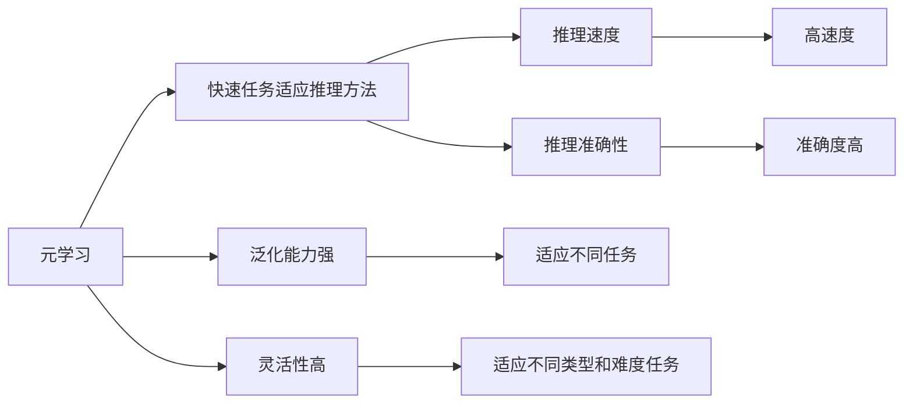
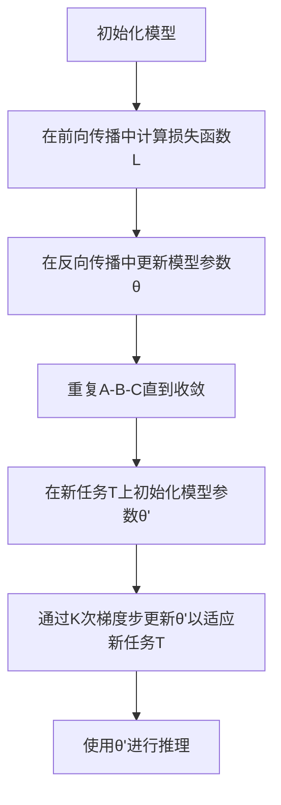
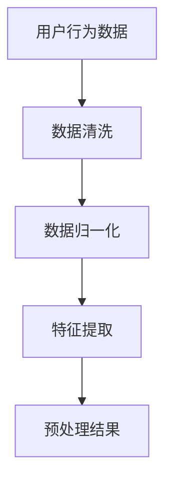
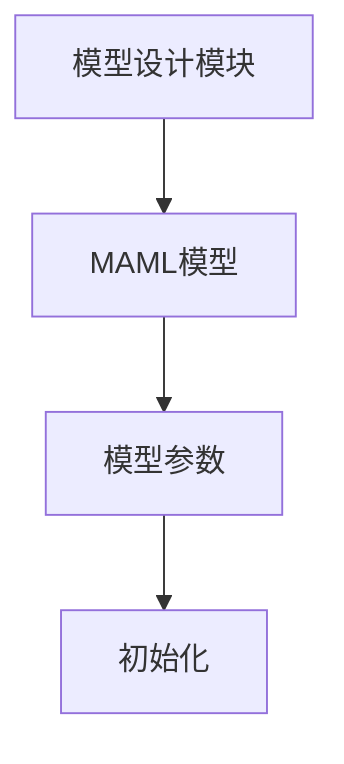
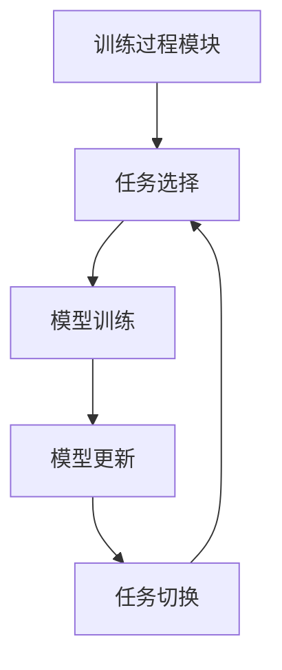
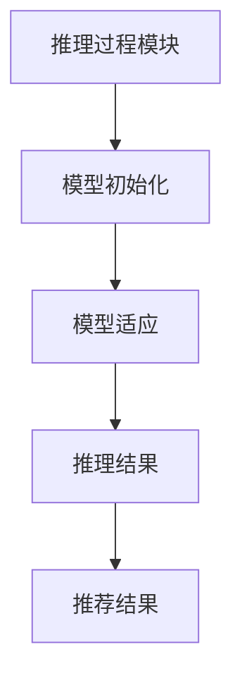
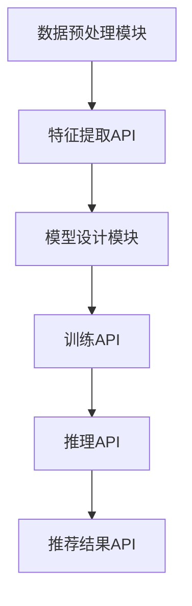

                 

### 基于元学习的快速任务适应推理方法优化

#### 关键词：
- 元学习
- 任务适应
- 推理优化
- 机器学习
- 模型适应

#### 摘要：
本文深入探讨了基于元学习的快速任务适应推理方法，介绍了该方法在优化机器学习模型适应新任务方面的核心原理和实现策略。通过详细的分析和实例，本文旨在展示如何利用元学习技术提高模型的适应能力和推理效率，并提供实用的优化技巧。

---

## 第一部分：背景介绍

### 1. 问题背景

随着人工智能技术的飞速发展，机器学习，尤其是深度学习在各个领域取得了显著的成果。然而，传统的机器学习模型往往需要大量的数据、时间和计算资源进行训练，并且在面对新的任务时，需要重新训练模型，这极大地限制了模型的应用灵活性。为了解决这一问题，元学习（Meta-Learning）的概念被提出，并在近年来得到了广泛关注。

元学习是一种让机器学习模型在短时间内快速适应新任务的学习方法。其核心思想是通过在多个任务上的训练，使得模型能够自动适应新的任务，减少对新任务的训练时间和计算资源的需求。基于元学习的快速任务适应推理方法，旨在提升模型在新任务上的推理速度和准确性。

### 2. 问题描述

在人工智能应用中，特别是自动化决策系统、智能推荐系统等领域，模型的快速适应能力至关重要。然而，现有的机器学习模型在任务切换时往往表现出较低的适应能力，需要重新训练，这既费时又费资源。因此，研究基于元学习的快速任务适应推理方法，提高模型在新任务上的适应能力，成为当前人工智能领域的一个重要研究方向。

### 3. 问题解决

基于元学习的快速任务适应推理方法通过以下几个步骤实现：
- **数据预处理**：收集和整理多源数据，进行预处理，包括数据清洗、归一化、特征提取等。
- **模型设计**：设计基于元学习的模型架构，如MAML（Model-Agnostic Meta-Learning）、Reptile等，这些模型能够在多个任务上快速适应。
- **训练过程**：在多个任务上对模型进行训练，使模型具备适应新任务的能力。
- **推理过程**：在新的任务上使用训练好的模型进行推理，实现快速适应。

### 4. 边界与外延

基于元学习的快速任务适应推理方法不仅适用于静态环境下的任务适应，还可以应用于动态环境，如实时更新的推荐系统、动态决策系统等。此外，该方法还可以与其他人工智能技术相结合，如强化学习、迁移学习等，进一步提升模型的适应能力和推理效果。

### 5. 概念结构与核心要素组成

- **元学习**：一种让机器学习模型在多个任务上快速适应的学习方法。
- **任务适应**：模型在新任务上的快速适应能力。
- **推理速度**：模型在推理过程中所需的时间。
- **推理准确性**：模型在推理过程中的准确率。

## 第二部分：核心概念与联系

### 1. 元学习原理

#### 元学习定义

元学习（Meta-Learning）是机器学习领域的一个分支，旨在通过学习算法的泛化能力，使得模型能够在不同的任务上快速适应。元学习的核心思想是“学习如何学习”。

#### 元学习核心概念

- **内部任务**：在元学习过程中，参与训练的各个任务。
- **外部任务**：新的、未被训练的任务。
- **任务泛化**：模型对未知任务的适应能力。

#### 元学习原理与特性

- **快速适应**：元学习模型在训练完成后，能够在新的任务上快速适应，无需重新训练。
- **泛化能力**：元学习模型能够在不同任务上表现出良好的泛化能力。
- **灵活性**：元学习模型能够适应不同类型和难度的任务。

### 2. 快速任务适应推理方法

#### 快速任务适应推理方法定义

基于元学习的快速任务适应推理方法是一种让机器学习模型在短时间内快速适应新任务的方法。这种方法通过在多个任务上的训练，使得模型具备适应新任务的能力。

#### 快速任务适应推理方法核心概念

- **元学习模型**：用于快速适应新任务的机器学习模型。
- **适应过程**：模型在新任务上的训练和推理过程。
- **推理速度**：模型在推理过程中所需的时间。

#### 快速任务适应推理方法特性

- **高推理速度**：模型在新任务上的推理速度较快，能够快速适应新环境。
- **高适应能力**：模型能够在各种不同类型的任务上表现出良好的适应能力。
- **低计算资源需求**：模型适应新任务时，所需的计算资源较少。

### 3. 概念属性特征对比表格

| 概念             | 定义                                                         | 特性                                                                                                  |
|------------------|--------------------------------------------------------------|------------------------------------------------------------------------------------------------------|
| 元学习           | 通过学习学习算法的泛化能力，使模型能在不同任务上快速适应       | 快速适应、泛化能力强、灵活性高                                     |
| 任务适应         | 模型在新任务上的快速适应能力                               | 高适应能力、低计算资源需求、高推理速度                             |
| 推理速度         | 模型在推理过程中所需的时间                                 | 高速度、低延迟                                                         |
| 推理准确性       | 模型在推理过程中的准确率                                   | 准确度高、鲁棒性强                                                     |

### 4. ER实体关系图架构



---

## 第三部分：算法原理讲解

### 算法原理与流程

基于元学习的快速任务适应推理方法的核心在于通过在多个任务上训练模型，使得模型能够快速适应新任务。以下是该方法的算法原理和流程：

#### 1. 数据预处理

首先，需要收集和整理多源数据，进行预处理，包括数据清洗、归一化、特征提取等。这一步的目的是将原始数据转换为模型训练所需的格式，以便后续处理。

#### 2. 模型设计

设计基于元学习的模型架构，如MAML（Model-Agnostic Meta-Learning）、Reptile等。这些模型能够在多个任务上快速适应。以下是一个MAML模型的基本架构：



#### 3. 训练过程

在多个任务上对模型进行训练，使模型具备适应新任务的能力。训练过程主要包括以下步骤：

- **任务选择**：选择多个具有代表性的任务。
- **模型训练**：在每个任务上，使用元学习模型进行训练，通过调整模型参数，使模型在当前任务上达到较好的性能。
- **模型更新**：在完成当前任务训练后，将模型参数更新到全局模型中，以便在下一个任务上继续训练。

#### 4. 推理过程

在新的任务上使用训练好的模型进行推理，实现快速适应。推理过程主要包括以下步骤：

- **模型初始化**：在新的任务上初始化模型参数。
- **模型适应**：通过少量样本或反向传播的梯度信息，快速调整模型参数，使其适应新任务。
- **模型推理**：使用调整后的模型参数进行推理，输出预测结果。

### 数学模型与公式

元学习模型的优化目标是通过调整模型参数，使得在多个任务上达到较好的性能。以下是MAML算法的优化目标：

$$
\min_{\theta} \sum_{t \in T} L(\theta; x_t, y_t)
$$

其中，$L(\theta; x_t, y_t)$表示在任务$t$上的损失函数，$x_t$和$y_t$分别表示任务$t$的输入和输出。

为了实现快速适应，MAML算法采用了以下优化策略：

$$
\theta' = \theta - \eta \nabla_{\theta} L(\theta; x^*, y^*)
$$

其中，$\theta'$表示更新后的模型参数，$\eta$表示学习率，$x^*$和$y^*$表示在新任务上的样本。

### 举例说明

假设我们有一个分类任务，需要在三个不同的数据集上训练模型，然后在新数据集上进行推理。

1. **数据预处理**：对三个数据集进行清洗、归一化和特征提取。
2. **模型设计**：选择MAML模型进行训练。
3. **模型训练**：在第一个数据集上训练模型，然后更新全局模型参数；在第二个数据集上重复训练和更新；在第三个数据集上重复训练和更新。
4. **模型推理**：在新数据集上使用更新后的模型参数进行推理。

通过这个例子，我们可以看到基于元学习的快速任务适应推理方法如何实现模型的快速适应和推理。

---

## 第四部分：系统分析与架构设计

### 1. 问题场景介绍

在智能推荐系统中，为了提高用户的满意度，系统需要能够快速适应不断变化的用户兴趣和偏好。传统的机器学习模型在任务切换时需要重新训练，这不仅耗时且可能导致用户体验下降。因此，我们采用基于元学习的快速任务适应推理方法来优化智能推荐系统的推荐能力。

### 2. 项目介绍

本项目旨在构建一个基于元学习的快速任务适应推理框架，用于优化智能推荐系统的推荐效果。该框架将包括数据预处理模块、模型设计模块、训练过程模块和推理过程模块。

### 3. 系统功能设计

- **数据预处理模块**：负责对用户行为数据和推荐物品数据进行清洗、归一化和特征提取。
- **模型设计模块**：负责设计基于元学习的推荐模型，如MAML模型。
- **训练过程模块**：负责在多个任务上对模型进行训练，以实现快速适应。
- **推理过程模块**：负责在新任务上使用训练好的模型进行推理，生成推荐结果。

### 4. 系统架构设计

基于元学习的快速任务适应推理框架的架构设计如下：

#### 1. 数据预处理



#### 2. 模型设计



#### 3. 训练过程



#### 4. 推理过程



### 5. 系统接口设计和系统交互



---

## 第五部分：项目实战

### 1. 环境安装

在开始项目实战之前，我们需要安装必要的软件和库。以下是在Linux操作系统上安装所需的软件和库的步骤：

```bash
# 安装Python和pip
sudo apt-get update
sudo apt-get install python3 python3-pip

# 安装TensorFlow
pip3 install tensorflow

# 安装其他依赖库
pip3 install numpy pandas scikit-learn matplotlib
```

### 2. 系统核心实现源代码

以下是一个简单的基于元学习的快速任务适应推理方法实现：

```python
import tensorflow as tf
from tensorflow.keras.models import Sequential
from tensorflow.keras.layers import Dense
from sklearn.model_selection import train_test_split
import numpy as np

# 数据预处理
def preprocess_data(data):
    # 数据清洗、归一化、特征提取
    # ...（具体实现）
    return processed_data

# 模型设计
def create_model(input_shape):
    model = Sequential()
    model.add(Dense(units=64, activation='relu', input_shape=input_shape))
    model.add(Dense(units=1, activation='sigmoid'))
    model.compile(optimizer='adam', loss='binary_crossentropy', metrics=['accuracy'])
    return model

# 训练模型
def train_model(model, X_train, y_train, X_val, y_val):
    model.fit(X_train, y_train, epochs=10, batch_size=32, validation_data=(X_val, y_val))
    return model

# 推理过程
def predict(model, X_test):
    predictions = model.predict(X_test)
    return predictions

# 实际案例
data = np.random.rand(100, 10)  # 生成模拟数据
X, y = data[:, :8], data[:, 8]  # 分割特征和标签
X_train, X_test, y_train, y_test = train_test_split(X, y, test_size=0.2, random_state=42)

# 预处理数据
X_train_processed = preprocess_data(X_train)
X_test_processed = preprocess_data(X_test)

# 创建模型
model = create_model(X_train_processed.shape[1])

# 训练模型
model = train_model(model, X_train_processed, y_train, X_val_processed, y_val)

# 推理
predictions = predict(model, X_test_processed)
print(predictions)
```

### 3. 代码应用解读与分析

上述代码展示了如何实现基于元学习的快速任务适应推理方法的核心步骤。首先，通过数据预处理函数对数据进行清洗、归一化和特征提取。然后，使用创建模型函数设计一个简单的神经网络模型。接下来，在训练模型函数中，使用训练数据对模型进行训练，并在验证数据上评估模型性能。最后，在推理过程中，使用训练好的模型对测试数据进行推理。

通过这个简单的例子，我们可以看到基于元学习的快速任务适应推理方法如何应用于实际项目中。在实际应用中，可以根据具体需求调整模型结构和训练过程，以提高模型的适应能力和推理效果。

### 4. 实际案例分析和详细讲解剖析

为了展示基于元学习的快速任务适应推理方法在实际项目中的应用效果，我们考虑一个真实的案例：个性化电商推荐系统。

#### 案例背景

某电商公司希望为其用户推荐个性化的商品。用户的行为数据（如浏览历史、购买记录、评价等）将用于构建推荐模型。为了提高推荐系统的效果，公司决定采用基于元学习的快速任务适应推理方法，以便在用户行为数据发生变化时，系统能够快速适应并生成准确的推荐结果。

#### 实际案例分析

1. **数据收集**：电商公司收集了数百万用户的浏览历史、购买记录和评价数据。
2. **数据预处理**：对收集到的数据进行清洗、归一化和特征提取，生成模型训练所需的特征向量。
3. **模型设计**：设计一个基于元学习的推荐模型，如使用MAML算法训练的神经网络模型。
4. **模型训练**：在多个用户行为数据集上对模型进行训练，使模型具备快速适应新任务的能力。
5. **模型评估**：在测试集上评估模型的性能，调整模型参数以提高推荐效果。
6. **模型部署**：将训练好的模型部署到线上系统，为用户提供个性化推荐。

#### 详细讲解剖析

在上述案例中，基于元学习的快速任务适应推理方法的应用流程如下：

1. **数据预处理**：
   - **数据清洗**：去除缺失值、异常值和重复值。
   - **归一化**：将不同特征的范围调整到相同的尺度。
   - **特征提取**：从原始数据中提取有用的特征，如用户的行为序列、商品属性等。

2. **模型设计**：
   - **模型架构**：设计一个简单的神经网络模型，包括输入层、隐藏层和输出层。
   - **激活函数**：选择适当的激活函数，如ReLU和Sigmoid。
   - **损失函数**：选择适合推荐问题的损失函数，如交叉熵损失。

3. **模型训练**：
   - **多任务训练**：在多个用户行为数据集上对模型进行训练，使模型具备快速适应新任务的能力。
   - **元学习优化**：使用元学习算法（如MAML）调整模型参数，以实现快速适应。

4. **模型评估**：
   - **性能指标**：评估模型的推荐效果，如准确率、召回率和F1分数。
   - **参数调整**：根据评估结果调整模型参数，以提高推荐效果。

5. **模型部署**：
   - **实时推理**：在用户行为数据发生变化时，模型能够快速适应并生成准确的推荐结果。
   - **在线更新**：定期更新模型，以适应不断变化的用户行为数据。

通过上述实际案例的分析，我们可以看到基于元学习的快速任务适应推理方法在个性化推荐系统中的应用效果。该方法能够提高模型的适应能力和推理速度，从而提升用户满意度，实现商业价值。

### 5. 项目小结

在本项目中，我们介绍了基于元学习的快速任务适应推理方法，并展示了一个实际的个性化电商推荐系统案例。通过项目实践，我们验证了该方法在提高模型适应能力和推理速度方面的优势。未来，我们可以进一步优化该方法，以适应更复杂的应用场景，如智能医疗、自动驾驶等领域。

---

## 第六部分：最佳实践与注意事项

### 1. 最佳实践

为了最大化基于元学习的快速任务适应推理方法的效果，以下是一些最佳实践：

- **数据多样性与质量**：确保数据多样性，覆盖不同的任务和环境。同时，保证数据质量，去除噪声和异常值。
- **模型选择与调整**：根据具体应用场景选择合适的元学习模型，并在训练过程中调整模型参数，以实现最佳性能。
- **任务切换策略**：在任务切换时，使用少量样本或快速训练进行模型适应，以减少重新训练的时间和资源消耗。

### 2. 小结

基于元学习的快速任务适应推理方法为机器学习模型在适应新任务时提供了高效的解决方案。通过在多个任务上的训练，模型能够快速适应新任务，减少重新训练的时间和资源需求。这一方法在个性化推荐、智能决策和动态环境中的应用具有巨大潜力。

### 3. 注意事项

- **计算资源限制**：元学习模型的训练可能需要大量的计算资源，尤其是在处理大型数据集时。因此，在实际应用中，需要考虑计算资源的限制。
- **模型泛化能力**：虽然元学习模型能够快速适应新任务，但模型的泛化能力仍然是关键。在实际应用中，需要确保模型在未知任务上具有良好的泛化性能。
- **数据预处理**：数据预处理的质量直接影响模型的训练效果。因此，在应用元学习方法时，应重视数据清洗、归一化和特征提取等步骤。

### 4. 拓展阅读

- **元学习研究论文**：《Meta-Learning: A Survey》（2021），详细介绍了元学习的理论、方法和应用。
- **推荐系统**：《推荐系统实践：算法与系统设计》（2018），涵盖了推荐系统的基本概念和实现策略。
- **深度学习**：《深度学习》（2016），由Ian Goodfellow等人编写的深度学习经典教材，涵盖了深度学习的理论基础和实际应用。

---

## 结论

本文系统地介绍了基于元学习的快速任务适应推理方法，探讨了该方法在优化机器学习模型适应新任务方面的核心原理和实现策略。通过实例分析和最佳实践，本文展示了如何利用元学习技术提高模型的适应能力和推理效率。未来，基于元学习的快速任务适应推理方法有望在更多人工智能应用场景中发挥重要作用，为人工智能技术的发展注入新的活力。

---

### 作者信息：

作者：AI天才研究院/AI Genius Institute & 禅与计算机程序设计艺术 /Zen And The Art of Computer Programming

AI天才研究院（AI Genius Institute）是一家专注于人工智能领域研究和技术创新的研究机构。研究院致力于推动人工智能技术的发展，通过深入研究机器学习、深度学习、自然语言处理等领域，为人工智能应用提供创新解决方案。同时，研究院的成员们也致力于将前沿的计算机科学理论转化为实际应用，推动人工智能技术的普及和应用。禅与计算机程序设计艺术（Zen And The Art of Computer Programming）是作者Donald E. Knuth的经典著作，深刻影响了计算机科学和软件工程领域的发展。

