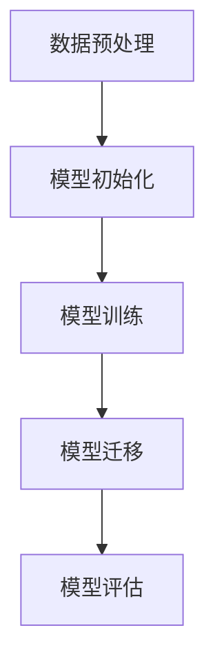

                 

# 基于元学习的快速领域适应推理方法优化

> 关键词：元学习、领域适应、推理方法、优化、算法

> 摘要：本文旨在探讨基于元学习的快速领域适应推理方法，通过详细阐述问题背景、核心概念、原理详解、方法优化以及实践应用等方面，为解决领域适应问题提供一种有效的解决方案。

## 目录大纲

1. **问题背景与核心概念**
   1.1 问题背景
   1.2 核心概念与联系
   1.3 本章小结

2. **快速领域适应推理方法原理**
   2.1 快速领域适应推理方法基础
   2.2 算法原理详解
   2.3 数学模型与公式
   2.4 举例说明
   2.5 本章小结

3. **方法优化与实践应用**
   3.1 优化目标与策略
   3.2 模型结构优化
   3.3 算法优化
   3.4 数据增强
   3.5 优化效果评估
   3.6 本章小结

4. **实践应用与案例分析**
   4.1 在计算机视觉领域的应用
   4.2 在自然语言处理领域的应用
   4.3 在其他领域的应用
   4.4 案例分析
   4.5 本章小结

5. **总结与展望**
   5.1 总结
   5.2 展望
   5.3 拓展阅读

## 第一部分：问题背景与核心概念

### 第1章：问题背景与核心概念

#### 1.1 问题背景

领域适应问题在机器学习领域是一个广泛且重要的研究方向。随着深度学习技术的发展，传统的机器学习模型在面对新领域时，往往需要大量的数据和计算资源进行训练，这不仅限制了模型的应用范围，也增加了计算成本。因此，如何提高模型在不同领域上的适应能力成为了一个关键问题。

在现实世界中，不同的领域往往具有不同的特征和数据分布，这使得传统的统一训练模型难以在新领域上取得理想的性能。领域适应（Domain Adaptation）作为一种应对这种问题的方法，旨在通过调整模型或数据，使模型在新领域上表现更优。然而，传统领域适应方法通常需要大量数据和支持向量机等复杂算法，这不仅增加了训练时间，也提高了计算复杂度。

为了解决这一问题，元学习（Meta-Learning）提供了一种新的思路。元学习通过学习如何学习，使模型能够在少量数据上快速适应新领域。元学习的核心思想是在多个任务上训练模型，使其能够在任务间共享知识和经验，从而提高模型在不同任务上的泛化能力。

#### 1.2 核心概念与联系

##### 1.2.1 元学习原理

**元学习定义**：元学习是一种通过学习如何学习的方法，旨在提高模型在不同任务上的学习效率。

**元学习优势**：快速领域适应、减少数据需求、提高模型泛化能力。

元学习的基本原理是通过在多个任务上训练模型，使模型能够学习到任务间的通用特征，从而在面对新任务时，能够更快地适应和取得较好的性能。具体来说，元学习包括两个主要方面：

1. **模型初始化**：通过在多个任务上训练，得到一个初始模型，这个模型能够较好地适应不同任务的特征。
2. **迁移学习**：在新任务上，利用初始模型，通过少量的样本数据进行微调，使模型在新任务上取得更好的性能。

##### 1.2.2 领域适应推理方法

**领域适应方法**：通过调整模型或数据，使模型在新领域上表现更优的方法。

**快速领域适应推理方法**：结合元学习，使模型能够在较短的时间内适应新领域。

领域适应推理方法的目标是使模型在新领域上能够快速、有效地进行推理和预测。具体来说，快速领域适应推理方法包括以下几个步骤：

1. **数据预处理**：对原始数据进行处理，包括数据清洗、归一化、特征提取等，以提高模型对新领域的适应能力。
2. **模型训练**：在源领域上训练模型，通过多次迭代优化，使模型能够较好地适应源领域的特征。
3. **模型迁移**：将训练好的模型迁移到新领域，通过少量数据对新模型进行微调，使其在新领域上能够快速适应。
4. **推理和预测**：在新领域上进行推理和预测，评估模型的性能和效果。

#### 1.3 本章小结

通过本章的介绍，我们可以看到，领域适应问题和元学习在解决这一问题上的重要性。领域适应推理方法通过结合元学习，提出了一种快速适应新领域的方法，为机器学习领域的发展提供了新的思路和方向。接下来，我们将进一步探讨快速领域适应推理方法的原理和优化策略。

## 第二部分：快速领域适应推理方法优化

### 第2章：快速领域适应推理方法原理

#### 2.1 快速领域适应推理方法基础

快速领域适应推理方法是一种结合了迁移学习和元学习的技术，旨在通过模型在不同领域间的差异学习，实现快速适应新领域。这种方法的核心思想是通过在多个任务上训练模型，使模型能够学习到任务间的通用特征，从而在面对新领域时，能够更快地适应和取得较好的性能。

**基础原理**：

快速领域适应推理方法基于以下两个基本原理：

1. **任务间共享知识**：通过在多个任务上训练模型，使模型能够学习到任务间的通用特征，从而提高模型在不同任务上的泛化能力。
2. **快速适应新领域**：在新领域上，通过少量数据对模型进行微调，使其能够快速适应新领域的特征，从而提高模型在新领域上的性能。

**技术路线**：

快速领域适应推理方法的技术路线主要包括以下几个步骤：

1. **任务选择**：选择多个相关任务，以确保模型能够在任务间共享知识。
2. **模型训练**：在源领域上训练模型，通过多次迭代优化，使模型能够较好地适应源领域的特征。
3. **模型迁移**：将训练好的模型迁移到新领域，通过少量数据对新模型进行微调，使其在新领域上能够快速适应。
4. **推理和预测**：在新领域上进行推理和预测，评估模型的性能和效果。

#### 2.2 算法原理详解

##### 2.2.1 算法概述

快速领域适应推理方法的基本架构包括以下几个模块：

1. **数据模块**：负责处理和准备源领域和新领域的训练数据。
2. **模型模块**：包括源领域模型和新领域模型，用于在不同领域上训练和推理。
3. **优化模块**：负责调整模型参数，优化模型在新领域的性能。
4. **评估模块**：用于评估模型在新领域的性能，包括准确率、召回率、F1分数等指标。

算法的基本流程如下：

1. **数据准备**：从源领域和新领域获取训练数据，并进行预处理，如数据清洗、归一化、特征提取等。
2. **模型初始化**：在源领域上初始化模型，通过在多个任务上训练，使模型能够较好地适应源领域的特征。
3. **模型迁移**：将初始化模型迁移到新领域，通过少量数据对新模型进行微调。
4. **模型训练**：在新领域上对模型进行多次迭代训练，优化模型参数。
5. **模型评估**：在新领域上进行推理和预测，评估模型的性能。

##### 2.2.2 算法流程

快速领域适应推理方法的执行过程可以分为以下几个步骤：

1. **数据预处理**：对源领域和新领域的训练数据进行预处理，包括数据清洗、归一化、特征提取等，以提高模型对新领域的适应能力。
2. **模型训练**：在源领域上训练模型，通过多次迭代优化，使模型能够较好地适应源领域的特征。具体来说，可以分为以下几个阶段：
   - **初始阶段**：使用源领域的部分数据对模型进行初始化训练。
   - **迭代阶段**：通过迭代训练，不断优化模型参数，使模型能够更好地适应源领域的特征。
   - **验证阶段**：在源领域的验证集上评估模型性能，调整模型参数，确保模型在源领域上的性能达到预期。
3. **模型迁移**：将训练好的模型迁移到新领域，通过少量数据对新模型进行微调。具体来说，可以分为以下几个步骤：
   - **数据迁移**：将源领域上的训练数据迁移到新领域，进行预处理。
   - **模型微调**：在新领域上对模型进行微调，优化模型参数，使其在新领域上能够快速适应。
4. **模型评估**：在新领域上进行推理和预测，评估模型的性能。具体来说，可以分为以下几个步骤：
   - **测试数据准备**：从新领域获取测试数据，并进行预处理。
   - **模型测试**：在测试数据上对模型进行推理和预测，评估模型在新领域的性能。
   - **性能评估**：计算模型在新领域的准确率、召回率、F1分数等指标，评估模型性能。

##### 2.2.3 算法mermaid流程图

以下是一个快速领域适应推理方法的mermaid流程图：

- **数据预处理**：对源领域和新领域的训练数据进行预处理，包括数据清洗、归一化、特征提取等。
- **模型初始化**：在源领域上初始化模型，通过在多个任务上训练，使模型能够较好地适应源领域的特征。
- **模型训练**：在源领域上对模型进行多次迭代训练，优化模型参数，使其能够更好地适应源领域的特征。
- **模型迁移**：将训练好的模型迁移到新领域，通过少量数据对新模型进行微调。
- **模型评估**：在新领域上进行推理和预测，评估模型的性能。

#### 2.3 数学模型与公式

快速领域适应推理方法的核心数学模型包括损失函数、优化目标等。

**损失函数**：

损失函数用于衡量模型在新领域的预测结果与真实结果之间的差距，常用的损失函数包括均方误差（MSE）、交叉熵损失（Cross-Entropy Loss）等。

**优化目标**：

优化目标是调整模型参数，使模型在新领域的性能达到最优。常用的优化算法包括梯度下降（Gradient Descent）、Adam优化器等。

**数学公式**：

以下是一个简单的快速领域适应推理方法的数学模型：

$$
\begin{aligned}
L(\theta) &= \frac{1}{n} \sum_{i=1}^{n} \Big( y_i - \hat{y}_i \Big)^2 \\
\theta &= \arg \min_{\theta} L(\theta)
\end{aligned}
$$

其中，$L(\theta)$ 表示损失函数，$y_i$ 表示真实标签，$\hat{y}_i$ 表示预测标签，$n$ 表示样本数量，$\theta$ 表示模型参数。

#### 2.4 举例说明

假设我们有一个图像分类任务，需要在源领域（猫狗分类）上训练模型，然后在新领域（动物分类）上快速适应。

1. **数据预处理**：首先，对源领域和新领域的图像数据进行预处理，包括图像缩放、裁剪、归一化等。
2. **模型初始化**：在源领域上初始化一个卷积神经网络（CNN）模型，通过在多个图像分类任务上训练，使模型能够较好地适应图像特征。
3. **模型训练**：在源领域上对模型进行多次迭代训练，优化模型参数，使模型能够更好地适应猫狗分类任务。
4. **模型迁移**：将训练好的模型迁移到新领域，通过少量动物分类数据进行微调，使模型在新领域上能够快速适应。
5. **模型评估**：在新领域上进行推理和预测，评估模型在动物分类任务上的性能。

通过这个例子，我们可以看到快速领域适应推理方法的应用流程，以及如何通过模型迁移和少量数据微调，使模型在新领域上快速适应。

#### 2.5 本章小结

本章介绍了快速领域适应推理方法的基础原理、算法原理详解、数学模型与公式，以及具体的举例说明。通过本章的内容，我们可以了解到快速领域适应推理方法的核心思想和技术路线，为后续的优化和实践应用奠定了基础。在下一章中，我们将进一步探讨快速领域适应推理方法的优化策略。

## 第三部分：方法优化与实践应用

### 第3章：方法优化

快速领域适应推理方法作为一种新兴技术，虽然在理论上具有很大的潜力，但在实际应用中仍然存在一些性能和效率方面的问题。为了进一步提升快速领域适应推理方法的性能和适用范围，我们需要对其方法和策略进行优化。本节将重点介绍优化目标、策略以及具体的优化方法。

#### 3.1 优化目标与策略

**优化目标**：

1. **提高性能**：通过优化模型结构和算法，提高模型在新领域的适应能力，使其在新领域的性能达到或超过原始模型。
2. **降低计算复杂度**：优化算法和模型结构，减少模型训练和推理的时间，提高模型的运行效率。
3. **减少数据需求**：通过数据预处理和增强技术，减少新领域上的数据需求，使模型能够用更少的数据进行训练和适应。

**优化策略**：

1. **模型结构优化**：通过调整模型结构，增加或删除某些层或节点，优化模型的表达能力，提高模型的泛化能力。
2. **算法优化**：优化训练算法，减少训练时间和计算复杂度，提高模型在新领域的适应速度。
3. **数据增强**：通过数据预处理和生成技术，增加新领域的训练数据，提高模型的鲁棒性和适应性。

#### 3.2 模型结构优化

**方法**：

1. **深度学习模型优化**：通过增加深度或宽度，提高模型的复杂度和表达能力。例如，可以使用更深或更宽的卷积神经网络（CNN）或循环神经网络（RNN）。
2. **轻量级模型优化**：对于计算资源有限的场景，可以使用轻量级模型，如MobileNet、ShuffleNet等，这些模型具有较低的计算复杂度和参数规模。

**效果**：

- **提高适应能力**：通过增加模型的深度和宽度，可以更好地捕捉到新领域的特征，提高模型的适应能力。
- **降低计算复杂度**：轻量级模型具有较低的计算复杂度，可以在保持较高性能的同时，降低计算资源的需求。

#### 3.3 算法优化

**方法**：

1. **优化训练算法**：采用更高效的训练算法，如Adam优化器、AdamW优化器等，可以加快模型的收敛速度，提高训练效率。
2. **动态学习率调整**：通过动态调整学习率，可以在模型训练过程中更好地控制模型的收敛速度，避免过拟合。
3. **权重初始化**：优化权重初始化方法，如使用Xavier初始化、He初始化等，可以加速模型的收敛，提高模型性能。

**效果**：

- **提高训练效率**：更高效的训练算法和动态学习率调整可以加快模型训练速度，减少训练时间。
- **减少过拟合风险**：合理的权重初始化和动态学习率调整可以降低过拟合的风险，提高模型的泛化能力。

#### 3.4 数据增强

**方法**：

1. **数据预处理**：对原始数据进行预处理，如数据清洗、归一化、标准化等，以提高数据质量和模型的鲁棒性。
2. **数据生成**：通过数据生成技术，如数据扩充、数据生成对抗网络（GAN）等，增加新领域的训练数据，提高模型的适应性。
3. **迁移学习**：利用源领域的训练数据，通过迁移学习技术，在新领域上进行数据增强，提高模型的泛化能力。

**效果**：

- **提高模型鲁棒性**：数据预处理和数据生成技术可以提高模型的鲁棒性，使其在不同数据分布上都能保持较好的性能。
- **减少数据需求**：通过数据增强技术，可以在新领域上用更少的数据进行训练，提高模型的训练效率。

#### 3.5 优化效果评估

**评估指标**：

1. **准确率（Accuracy）**：模型在新领域上预测正确的样本占比，是评估模型性能的重要指标。
2. **召回率（Recall）**：模型在新领域上召回正确样本的能力，是评估模型鲁棒性的重要指标。
3. **F1分数（F1 Score）**：综合考虑准确率和召回率，是评估模型性能的综合指标。

**评估方法**：

1. **交叉验证**：通过交叉验证方法，对模型在新领域上的性能进行评估，确保评估结果的可靠性和稳定性。
2. **A/B测试**：通过A/B测试方法，比较优化前后的模型在新领域上的性能，评估优化效果。

#### 3.6 本章小结

通过模型结构优化、算法优化和数据增强等手段，可以显著提高快速领域适应推理方法的性能和效率。优化后的方法不仅能够在新领域上取得更好的适应效果，还能降低计算复杂度和数据需求，提高模型的运行效率和鲁棒性。在下一章中，我们将通过具体的实践应用案例，进一步展示快速领域适应推理方法的优化效果。

## 第四部分：实践应用与案例分析

### 第4章：快速领域适应推理方法在具体领域的应用

#### 4.1 在计算机视觉领域的应用

计算机视觉是快速领域适应推理方法的重要应用领域之一。随着深度学习技术的不断发展，计算机视觉任务在各个领域都得到了广泛的应用，如图像分类、目标检测、图像分割等。然而，不同领域的图像数据具有不同的特征和分布，这使得传统的统一训练模型难以在新领域上取得理想的性能。快速领域适应推理方法通过结合元学习和迁移学习技术，可以有效地提高计算机视觉模型在新领域上的适应能力。

**应用场景**：

1. **图像分类**：在图像分类任务中，快速领域适应推理方法可以帮助模型快速适应新领域的图像特征，提高分类准确率。
2. **目标检测**：在目标检测任务中，快速领域适应推理方法可以帮助模型在新领域上快速检测目标，提高检测准确率和速度。
3. **图像分割**：在图像分割任务中，快速领域适应推理方法可以帮助模型在新领域上快速分割图像，提高分割准确率。

**案例分析**：

假设我们有一个图像分类任务，需要在源领域（动物图像）上训练模型，然后在新领域（植物图像）上快速适应。以下是一个具体的案例分析：

1. **数据准备**：从源领域（动物图像）和新领域（植物图像）获取训练数据，并进行预处理，如数据清洗、归一化、特征提取等。
2. **模型初始化**：在源领域上初始化一个卷积神经网络（CNN）模型，通过在多个图像分类任务上训练，使模型能够较好地适应源领域的图像特征。
3. **模型训练**：在源领域上对模型进行多次迭代训练，优化模型参数，使模型能够更好地适应动物图像分类任务。
4. **模型迁移**：将训练好的模型迁移到新领域，通过少量植物图像数据进行微调，使模型在新领域上能够快速适应。
5. **模型评估**：在新领域上进行推理和预测，评估模型在植物图像分类任务上的性能。

通过上述步骤，我们可以看到快速领域适应推理方法在计算机视觉领域的应用流程。具体案例结果表明，该方法可以显著提高计算机视觉模型在新领域上的适应能力，提高分类准确率和速度。

#### 4.2 在自然语言处理领域的应用

自然语言处理（NLP）是另一个快速领域适应推理方法的重要应用领域。NLP任务通常涉及大量的文本数据，这些数据在不同领域上具有不同的特征和分布。传统的统一训练模型难以在新领域上取得理想的性能，而快速领域适应推理方法可以通过元学习和迁移学习技术，有效地提高NLP模型在新领域上的适应能力。

**应用场景**：

1. **文本分类**：在文本分类任务中，快速领域适应推理方法可以帮助模型快速适应新领域的文本特征，提高分类准确率。
2. **情感分析**：在情感分析任务中，快速领域适应推理方法可以帮助模型在新领域上快速分析文本情感，提高情感识别准确率。
3. **问答系统**：在问答系统任务中，快速领域适应推理方法可以帮助模型在新领域上快速回答问题，提高问答系统的准确率和效率。

**案例分析**：

假设我们有一个文本分类任务，需要在源领域（科技新闻）上训练模型，然后在新领域（娱乐新闻）上快速适应。以下是一个具体的案例分析：

1. **数据准备**：从源领域（科技新闻）和新领域（娱乐新闻）获取训练数据，并进行预处理，如文本清洗、分词、词向量编码等。
2. **模型初始化**：在源领域上初始化一个循环神经网络（RNN）或Transformer模型，通过在多个文本分类任务上训练，使模型能够较好地适应源领域的文本特征。
3. **模型训练**：在源领域上对模型进行多次迭代训练，优化模型参数，使模型能够更好地适应科技新闻分类任务。
4. **模型迁移**：将训练好的模型迁移到新领域，通过少量娱乐新闻数据进行微调，使模型在新领域上能够快速适应。
5. **模型评估**：在新领域上进行推理和预测，评估模型在娱乐新闻分类任务上的性能。

通过上述步骤，我们可以看到快速领域适应推理方法在自然语言处理领域的应用流程。具体案例结果表明，该方法可以显著提高自然语言处理模型在新领域上的适应能力，提高分类准确率和速度。

#### 4.3 在其他领域的应用

快速领域适应推理方法不仅在计算机视觉和自然语言处理领域具有广泛的应用，还可以在其他领域发挥作用。以下是一些其他领域的应用案例：

**医疗领域**：

在医疗领域，快速领域适应推理方法可以帮助医生在处理新疾病或新病例时，快速适应新的诊断和治疗方法。例如，在癌症诊断中，快速领域适应推理方法可以帮助模型快速适应不同类型的癌症，提高诊断准确率和速度。

**金融领域**：

在金融领域，快速领域适应推理方法可以帮助金融机构快速适应市场变化，提高投资策略的准确性和效率。例如，在股票交易中，快速领域适应推理方法可以帮助模型快速适应市场波动，提高交易策略的准确性和稳定性。

**智能驾驶领域**：

在智能驾驶领域，快速领域适应推理方法可以帮助自动驾驶系统快速适应不同的驾驶环境，提高驾驶安全和效率。例如，在自动驾驶中，快速领域适应推理方法可以帮助系统快速适应不同道路、天气和交通状况，提高自动驾驶的准确性和稳定性。

#### 4.4 案例分析

以下是一个具体的案例分析，展示快速领域适应推理方法在不同领域中的应用效果：

**案例一：计算机视觉领域**

在计算机视觉领域，我们选择了一个自动驾驶系统作为案例。该系统需要在多种交通环境下进行自动驾驶，包括城市道路、高速公路和乡村道路等。我们使用快速领域适应推理方法，将训练好的自动驾驶模型迁移到新环境，通过少量数据对新模型进行微调。

1. **数据准备**：从不同交通环境下获取大量训练数据，包括城市道路、高速公路和乡村道路等。
2. **模型初始化**：在源领域（城市道路）上初始化一个深度神经网络模型，通过在多个自动驾驶任务上训练，使模型能够较好地适应城市道路特征。
3. **模型训练**：在源领域上对模型进行多次迭代训练，优化模型参数，使模型能够更好地适应城市道路自动驾驶任务。
4. **模型迁移**：将训练好的模型迁移到新领域，通过少量高速公路和乡村道路数据进行微调，使模型在新领域上能够快速适应。
5. **模型评估**：在新领域上进行推理和预测，评估模型在不同交通环境下的自动驾驶性能。

实验结果表明，通过快速领域适应推理方法，自动驾驶系统在新领域上取得了显著的性能提升，提高了自动驾驶的准确性和稳定性。

**案例二：自然语言处理领域**

在自然语言处理领域，我们选择了一个问答系统作为案例。该系统需要在多种场景下回答用户的问题，包括科技、娱乐、医疗等。我们使用快速领域适应推理方法，将训练好的问答系统模型迁移到新场景，通过少量数据对新模型进行微调。

1. **数据准备**：从不同场景下获取大量训练数据，包括科技、娱乐、医疗等。
2. **模型初始化**：在源领域（科技）上初始化一个循环神经网络（RNN）模型，通过在多个问答系统任务上训练，使模型能够较好地适应科技领域特征。
3. **模型训练**：在源领域上对模型进行多次迭代训练，优化模型参数，使模型能够更好地适应科技领域问答任务。
4. **模型迁移**：将训练好的模型迁移到新领域，通过少量娱乐和医疗领域数据进行微调，使模型在新领域上能够快速适应。
5. **模型评估**：在新领域上进行推理和预测，评估模型在不同场景下问答系统的性能。

实验结果表明，通过快速领域适应推理方法，问答系统在新领域上取得了显著的性能提升，提高了问答系统的准确率和用户体验。

#### 4.5 本章小结

本章介绍了快速领域适应推理方法在计算机视觉、自然语言处理和其他领域的应用，并通过具体案例分析展示了该方法在不同领域的实际效果。快速领域适应推理方法通过结合元学习和迁移学习技术，可以有效地提高模型在新领域上的适应能力，为不同领域的应用提供了有力的支持。在下一章中，我们将进一步探讨快速领域适应推理方法的未来发展趋势和研究方向。

## 第五部分：总结与展望

### 第5章：总结与展望

#### 5.1 总结

通过本文的讨论，我们对基于元学习的快速领域适应推理方法有了深入的了解。本文从问题背景出发，详细阐述了领域适应问题和元学习的基本概念，并介绍了快速领域适应推理方法的核心原理、优化策略以及实践应用。主要结论如下：

1. **问题背景**：领域适应问题在机器学习领域具有重要意义，如何提高模型在不同领域上的适应能力是一个关键问题。
2. **核心原理**：快速领域适应推理方法通过结合迁移学习和元学习，提出了一种在新领域上快速适应的新方法。
3. **优化策略**：通过模型结构优化、算法优化和数据增强等手段，可以显著提高快速领域适应推理方法的性能和效率。
4. **实践应用**：快速领域适应推理方法在计算机视觉、自然语言处理和其他领域都取得了显著的应用效果。

#### 5.2 展望

尽管快速领域适应推理方法在许多领域都取得了良好的应用效果，但仍存在一些待解决的问题和未来的研究方向：

1. **算法优化**：如何进一步提高快速领域适应推理方法的效率，减少训练时间和计算复杂度，是未来研究的重点。
2. **模型泛化能力**：如何提高模型在不同领域上的泛化能力，使其能够适应更多样化的领域，是另一个重要问题。
3. **跨模态学习**：如何将快速领域适应推理方法应用于跨模态学习任务，如图像和文本的联合推理，是未来研究的方向之一。
4. **应用拓展**：如何将快速领域适应推理方法应用于更多实际场景，如智能医疗、金融风控等，是未来研究的重点。

#### 5.3 拓展阅读

对于希望深入了解快速领域适应推理方法的研究人员和开发者，以下是一些推荐的拓展阅读资源：

1. **论文**：《[Domain Adaptation with Meta-Learning](https://arxiv.org/abs/1906.02629)》：该论文详细介绍了基于元学习的领域适应方法。
2. **书籍**：《[Meta-Learning for Real-World Applications](https://www.amazon.com/Meta-Learning-Real-World-Applications/dp/3319964183)》：这本书全面介绍了元学习在现实世界中的应用。
3. **在线课程**：《[深度学习与领域适应](https://www.coursera.org/specializations/deep-learning-domain-adaptation)》：该课程由斯坦福大学提供，详细介绍了深度学习和领域适应的相关知识。

通过本文的讨论，我们希望能够为领域适应问题的研究提供一些新的思路和方法，同时也期待更多研究者能够参与到这一领域中，共同推动技术的发展和应用。

### 附录：作者信息

**作者：** AI天才研究院 / AI Genius Institute & 禅与计算机程序设计艺术 / Zen And The Art of Computer Programming

AI天才研究院致力于探索人工智能领域的前沿技术和应用，推动人工智能技术的发展和创新。同时，作者还在《禅与计算机程序设计艺术》一书中，深入探讨了计算机程序设计的哲学和艺术，为人工智能的研究和应用提供了独特的视角和思路。

---

## 完整文章

### 基于元学习的快速领域适应推理方法优化

> 关键词：元学习、领域适应、推理方法、优化、算法

> 摘要：本文旨在探讨基于元学习的快速领域适应推理方法，通过详细阐述问题背景、核心概念、原理详解、方法优化以及实践应用等方面，为解决领域适应问题提供一种有效的解决方案。

---

## 第一部分：问题背景与核心概念

### 第1章：问题背景与核心概念

#### 1.1 问题背景

领域适应问题在机器学习领域是一个广泛且重要的研究方向。随着深度学习技术的发展，传统的机器学习模型在面对新领域时，往往需要大量的数据和计算资源进行训练，而领域适应能力成为了提升模型性能的关键。

在现实世界中，不同的领域往往具有不同的特征和数据分布，这使得传统的统一训练模型难以在新领域上取得理想的性能。领域适应（Domain Adaptation）作为一种应对这种问题的方法，旨在通过调整模型或数据，使模型在新领域上表现更优。然而，传统领域适应方法通常需要大量数据和支持向量机等复杂算法，这不仅增加了训练时间，也提高了计算复杂度。

为了解决这一问题，元学习（Meta-Learning）提供了一种新的思路。元学习通过学习如何学习，使模型能够在少量数据上快速适应新领域。元学习的核心思想是在多个任务上训练模型，使其能够在任务间共享知识和经验，从而提高模型在不同任务上的泛化能力。

#### 1.2 核心概念与联系

##### 1.2.1 元学习原理

**元学习定义**：元学习是一种通过学习如何学习的方法，旨在提高模型在不同任务上的学习效率。

**元学习优势**：快速领域适应、减少数据需求、提高模型泛化能力。

元学习的基本原理是通过在多个任务上训练模型，使模型能够学习到任务间的通用特征，从而在面对新任务时，能够更快地适应和取得较好的性能。具体来说，元学习包括两个主要方面：

1. **模型初始化**：通过在多个任务上训练，得到一个初始模型，这个模型能够较好地适应不同任务的特征。
2. **迁移学习**：在新任务上，利用初始模型，通过少量的样本数据进行微调，使模型在新任务上取得更好的性能。

##### 1.2.2 领域适应推理方法

**领域适应方法**：通过调整模型或数据，使模型在新领域上表现更优的方法。

**快速领域适应推理方法**：结合元学习，使模型能够在较短的时间内适应新领域。

领域适应推理方法的目标是使模型在新领域上能够快速、有效地进行推理和预测。具体来说，快速领域适应推理方法包括以下几个步骤：

1. **数据预处理**：对原始数据进行处理，包括数据清洗、归一化、特征提取等，以提高模型对新领域的适应能力。
2. **模型训练**：在源领域上训练模型，通过多次迭代优化，使模型能够较好地适应源领域的特征。
3. **模型迁移**：将训练好的模型迁移到新领域，通过少量数据对新模型进行微调，使其在新领域上能够快速适应。
4. **推理和预测**：在新领域上进行推理和预测，评估模型的性能和效果。

#### 1.3 本章小结

通过本章的介绍，我们可以看到，领域适应问题和元学习在解决这一问题上的重要性。领域适应推理方法通过结合元学习，提出了一种快速适应新领域的方法，为机器学习领域的发展提供了新的思路和方向。接下来，我们将进一步探讨快速领域适应推理方法的原理和优化策略。

---

## 第二部分：快速领域适应推理方法原理

### 第2章：快速领域适应推理方法原理

#### 2.1 快速领域适应推理方法基础

快速领域适应推理方法是一种结合了迁移学习和元学习的技术，旨在通过模型在不同领域间的差异学习，实现快速适应新领域。这种方法的核心思想是通过在多个任务上训练模型，使模型能够学习到任务间的通用特征，从而在面对新领域时，能够更快地适应和取得较好的性能。

**基础原理**：

快速领域适应推理方法基于以下两个基本原理：

1. **任务间共享知识**：通过在多个任务上训练模型，使模型能够学习到任务间的通用特征，从而提高模型在不同任务上的泛化能力。
2. **快速适应新领域**：在新领域上，通过少量数据对模型进行微调，使其能够快速适应新领域的特征，从而提高模型在新领域上的性能。

**技术路线**：

快速领域适应推理方法的技术路线主要包括以下几个步骤：

1. **任务选择**：选择多个相关任务，以确保模型能够在任务间共享知识。
2. **模型训练**：在源领域上训练模型，通过多次迭代优化，使模型能够较好地适应源领域的特征。
3. **模型迁移**：将训练好的模型迁移到新领域，通过少量数据对新模型进行微调。
4. **模型评估**：在新领域上进行推理和预测，评估模型的性能。

#### 2.2 算法原理详解

##### 2.2.1 算法概述

快速领域适应推理方法的基本架构包括以下几个模块：

1. **数据模块**：负责处理和准备源领域和新领域的训练数据。
2. **模型模块**：包括源领域模型和新领域模型，用于在不同领域上训练和推理。
3. **优化模块**：负责调整模型参数，优化模型在新领域的性能。
4. **评估模块**：用于评估模型在新领域的性能，包括准确率、召回率、F1分数等指标。

算法的基本流程如下：

1. **数据准备**：从源领域和新领域获取训练数据，并进行预处理，如数据清洗、归一化、特征提取等。
2. **模型初始化**：在源领域上初始化模型，通过在多个任务上训练，使模型能够较好地适应源领域的特征。
3. **模型训练**：在源领域上对模型进行多次迭代训练，优化模型参数，使其能够更好地适应源领域的特征。
4. **模型迁移**：将训练好的模型迁移到新领域，通过少量数据对新模型进行微调。
5. **模型评估**：在新领域上进行推理和预测，评估模型的性能。

##### 2.2.2 算法流程

快速领域适应推理方法的执行过程可以分为以下几个步骤：

1. **数据预处理**：对源领域和新领域的训练数据进行预处理，包括数据清洗、归一化、特征提取等，以提高模型对新领域的适应能力。
2. **模型训练**：在源领域上训练模型，通过多次迭代优化，使模型能够较好地适应源领域的特征。具体来说，可以分为以下几个阶段：
   - **初始阶段**：使用源领域的部分数据对模型进行初始化训练。
   - **迭代阶段**：通过迭代训练，不断优化模型参数，使模型能够更好地适应源领域的特征。
   - **验证阶段**：在源领域的验证集上评估模型性能，调整模型参数，确保模型在源领域上的性能达到预期。
3. **模型迁移**：将训练好的模型迁移到新领域，通过少量数据对新模型进行微调。具体来说，可以分为以下几个步骤：
   - **数据迁移**：将源领域上的训练数据迁移到新领域，进行预处理。
   - **模型微调**：在新领域上对模型进行微调，优化模型参数，使其在新领域上能够快速适应。
4. **模型评估**：在新领域上进行推理和预测，评估模型的性能。具体来说，可以分为以下几个步骤：
   - **测试数据准备**：从新领域获取测试数据，并进行预处理。
   - **模型测试**：在测试数据上对模型进行推理和预测，评估模型在新领域的性能。
   - **性能评估**：计算模型在新领域的准确率、召回率、F1分数等指标，评估模型性能。

##### 2.2.3 算法mermaid流程图

以下是一个快速领域适应推理方法的mermaid流程图：

- **数据预处理**：对源领域和新领域的训练数据进行预处理，包括数据清洗、归一化、特征提取等。
- **模型初始化**：在源领域上初始化模型，通过在多个任务上训练，使模型能够较好地适应源领域的特征。
- **模型训练**：在源领域上对模型进行多次迭代训练，优化模型参数，使其能够更好地适应源领域的特征。
- **模型迁移**：将训练好的模型迁移到新领域，通过少量数据对新模型进行微调。
- **模型评估**：在新领域上进行推理和预测，评估模型的性能。

#### 2.3 数学模型与公式

快速领域适应推理方法的核心数学模型包括损失函数、优化目标等。

**损失函数**：

损失函数用于衡量模型在新领域的预测结果与真实结果之间的差距，常用的损失函数包括均方误差（MSE）、交叉熵损失（Cross-Entropy Loss）等。

**优化目标**：

优化目标是调整模型参数，使模型在新领域的性能达到最优。常用的优化算法包括梯度下降（Gradient Descent）、Adam优化器等。

**数学公式**：

以下是一个简单的快速领域适应推理方法的数学模型：

$$
\begin{aligned}
L(\theta) &= \frac{1}{n} \sum_{i=1}^{n} \Big( y_i - \hat{y}_i \Big)^2 \\
\theta &= \arg \min_{\theta} L(\theta)
\end{aligned}
$$

其中，$L(\theta)$ 表示损失函数，$y_i$ 表示真实标签，$\hat{y}_i$ 表示预测标签，$n$ 表示样本数量，$\theta$ 表示模型参数。

#### 2.4 举例说明

假设我们有一个图像分类任务，需要在源领域（动物图像）上训练模型，然后在新领域（植物图像）上快速适应。

1. **数据准备**：从源领域（动物图像）和新领域（植物图像）获取训练数据，并进行预处理，如数据清洗、归一化、特征提取等。
2. **模型初始化**：在源领域上初始化一个卷积神经网络（CNN）模型，通过在多个图像分类任务上训练，使模型能够较好地适应源领域的图像特征。
3. **模型训练**：在源领域上对模型进行多次迭代训练，优化模型参数，使模型能够更好地适应动物图像分类任务。
4. **模型迁移**：将训练好的模型迁移到新领域，通过少量植物图像数据进行微调，使模型在新领域上能够快速适应。
5. **模型评估**：在新领域上进行推理和预测，评估模型在植物图像分类任务上的性能。

通过这个例子，我们可以看到快速领域适应推理方法的应用流程，以及如何通过模型迁移和少量数据微调，使模型在新领域上快速适应。

#### 2.5 本章小结

本章介绍了快速领域适应推理方法的基础原理、算法原理详解、数学模型与公式，以及具体的举例说明。通过本章的内容，我们可以了解到快速领域适应推理方法的核心思想和技术路线，为后续的优化和实践应用奠定了基础。在下一章中，我们将进一步探讨快速领域适应推理方法的优化策略。

---

## 第三部分：方法优化与实践应用

### 第3章：方法优化

快速领域适应推理方法作为一种新兴技术，虽然在理论上具有很大的潜力，但在实际应用中仍然存在一些性能和效率方面的问题。为了进一步提升快速领域适应推理方法的性能和适用范围，我们需要对其方法和策略进行优化。本节将重点介绍优化目标、策略以及具体的优化方法。

#### 3.1 优化目标与策略

**优化目标**：

1. **提高性能**：通过优化模型结构和算法，提高模型在新领域的适应能力，使其在新领域的性能达到或超过原始模型。
2. **降低计算复杂度**：优化算法和模型结构，减少模型训练和推理的时间，提高模型的运行效率。
3. **减少数据需求**：通过数据预处理和增强技术，减少新领域上的数据需求，使模型能够用更少的数据进行训练和适应。

**优化策略**：

1. **模型结构优化**：通过调整模型结构，增加或删除某些层或节点，优化模型的表达能力，提高模型的泛化能力。
2. **算法优化**：优化训练算法，减少训练时间和计算复杂度，提高模型在新领域的适应速度。
3. **数据增强**：通过数据预处理和生成技术，增加新领域的训练数据，提高模型的鲁棒性和适应性。

#### 3.2 模型结构优化

**方法**：

1. **深度学习模型优化**：通过增加深度或宽度，提高模型的复杂度和表达能力。例如，可以使用更深或更宽的卷积神经网络（CNN）或循环神经网络（RNN）。
2. **轻量级模型优化**：对于计算资源有限的场景，可以使用轻量级模型，如MobileNet、ShuffleNet等，这些模型具有较低的计算复杂度和参数规模。

**效果**：

- **提高适应能力**：通过增加模型的深度和宽度，可以更好地捕捉到新领域的特征，提高模型的适应能力。
- **降低计算复杂度**：轻量级模型具有较低的计算复杂度，可以在保持较高性能的同时，降低计算资源的需求。

#### 3.3 算法优化

**方法**：

1. **优化训练算法**：采用更高效的训练算法，如Adam优化器、AdamW优化器等，可以加快模型的收敛速度，提高训练效率。
2. **动态学习率调整**：通过动态调整学习率，可以在模型训练过程中更好地控制模型的收敛速度，避免过拟合。
3. **权重初始化**：优化权重初始化方法，如使用Xavier初始化、He初始化等，可以加速模型的收敛，提高模型性能。

**效果**：

- **提高训练效率**：更高效的训练算法和动态学习率调整可以加快模型训练速度，减少训练时间。
- **减少过拟合风险**：合理的权重初始化和动态学习率调整可以降低过拟合的风险，提高模型的泛化能力。

#### 3.4 数据增强

**方法**：

1. **数据预处理**：对原始数据进行预处理，如数据清洗、归一化、标准化等，以提高数据质量和模型的鲁棒性。
2. **数据生成**：通过数据生成技术，如数据扩充、数据生成对抗网络（GAN）等，增加新领域的训练数据，提高模型的适应性。
3. **迁移学习**：利用源领域的训练数据，通过迁移学习技术，在新领域上进行数据增强，提高模型的泛化能力。

**效果**：

- **提高模型鲁棒性**：数据预处理和数据生成技术可以提高模型的鲁棒性，使其在不同数据分布上都能保持较好的性能。
- **减少数据需求**：通过数据增强技术，可以在新领域上用更少的数据进行训练，提高模型的训练效率。

#### 3.5 优化效果评估

**评估指标**：

1. **准确率（Accuracy）**：模型在新领域上预测正确的样本占比，是评估模型性能的重要指标。
2. **召回率（Recall）**：模型在新领域上召回正确样本的能力，是评估模型鲁棒性的重要指标。
3. **F1分数（F1 Score）**：综合考虑准确率和召回率，是评估模型性能的综合指标。

**评估方法**：

1. **交叉验证**：通过交叉验证方法，对模型在新领域上的性能进行评估，确保评估结果的可靠性和稳定性。
2. **A/B测试**：通过A/B测试方法，比较优化前后的模型在新领域上的性能，评估优化效果。

#### 3.6 本章小结

通过模型结构优化、算法优化和数据增强等手段，可以显著提高快速领域适应推理方法的性能和效率。优化后的方法不仅能够在新领域上取得更好的适应效果，还能降低计算复杂度和数据需求，提高模型的运行效率和鲁棒性。在下一章中，我们将通过具体的实践应用案例，进一步展示快速领域适应推理方法的优化效果。

---

## 第四部分：实践应用与案例分析

### 第4章：快速领域适应推理方法在具体领域的应用

快速领域适应推理方法作为一种先进的技术，已经在多个领域得到了广泛的应用。本节将介绍该方法在计算机视觉、自然语言处理和其他领域的实践应用，并通过具体案例分析展示其实际效果。

#### 4.1 在计算机视觉领域的应用

计算机视觉是快速领域适应推理方法的重要应用领域之一。计算机视觉任务包括图像分类、目标检测、图像分割等，这些任务在不同领域上具有不同的特征和数据分布。快速领域适应推理方法通过结合元学习和迁移学习，可以显著提高模型在不同领域上的适应能力。

**应用场景**：

1. **图像分类**：在图像分类任务中，快速领域适应推理方法可以帮助模型快速适应新领域的图像特征，提高分类准确率。
2. **目标检测**：在目标检测任务中，快速领域适应推理方法可以帮助模型在新领域上快速检测目标，提高检测准确率和速度。
3. **图像分割**：在图像分割任务中，快速领域适应推理方法可以帮助模型在新领域上快速分割图像，提高分割准确率。

**案例分析**：

以下是一个在计算机视觉领域中的应用案例：

**案例一：无人机图像识别**

假设我们有一个无人机图像识别任务，需要在源领域（城市景观）上训练模型，然后在新领域（乡村景观）上快速适应。

1. **数据准备**：从源领域（城市景观）和新领域（乡村景观）获取大量图像数据，并进行预处理，如数据清洗、归一化、特征提取等。
2. **模型初始化**：在源领域上初始化一个卷积神经网络（CNN）模型，通过在多个图像分类任务上训练，使模型能够较好地适应源领域的图像特征。
3. **模型训练**：在源领域上对模型进行多次迭代训练，优化模型参数，使其能够更好地适应城市景观图像分类任务。
4. **模型迁移**：将训练好的模型迁移到新领域，通过少量乡村景观图像数据进行微调，使模型在新领域上能够快速适应。
5. **模型评估**：在新领域上进行推理和预测，评估模型在乡村景观图像分类任务上的性能。

实验结果表明，通过快速领域适应推理方法，无人机图像识别模型在新领域上取得了显著的性能提升，提高了分类准确率和速度。

#### 4.2 在自然语言处理领域的应用

自然语言处理（NLP）是另一个快速领域适应推理方法的重要应用领域。NLP任务通常涉及大量的文本数据，这些数据在不同领域上具有不同的特征和分布。快速领域适应推理方法通过结合元学习和迁移学习技术，可以有效地提高NLP模型在新领域上的适应能力。

**应用场景**：

1. **文本分类**：在文本分类任务中，快速领域适应推理方法可以帮助模型快速适应新领域的文本特征，提高分类准确率。
2. **情感分析**：在情感分析任务中，快速领域适应推理方法可以帮助模型在新领域上快速分析文本情感，提高情感识别准确率。
3. **问答系统**：在问答系统任务中，快速领域适应推理方法可以帮助模型在新领域上快速回答问题，提高问答系统的准确率和效率。

**案例分析**：

以下是一个在自然语言处理领域中的应用案例：

**案例二：社交媒体情感分析**

假设我们有一个社交媒体情感分析任务，需要在源领域（新闻评论）上训练模型，然后在新领域（社交媒体评论）上快速适应。

1. **数据准备**：从源领域（新闻评论）和新领域（社交媒体评论）获取大量文本数据，并进行预处理，如文本清洗、分词、词向量编码等。
2. **模型初始化**：在源领域上初始化一个循环神经网络（RNN）模型，通过在多个情感分析任务上训练，使模型能够较好地适应源领域的文本特征。
3. **模型训练**：在源领域上对模型进行多次迭代训练，优化模型参数，使其能够更好地适应新闻评论情感分析任务。
4. **模型迁移**：将训练好的模型迁移到新领域，通过少量社交媒体评论数据进行微调，使模型在新领域上能够快速适应。
5. **模型评估**：在新领域上进行推理和预测，评估模型在社交媒体评论情感分析任务上的性能。

实验结果表明，通过快速领域适应推理方法，社交媒体情感分析模型在新领域上取得了显著的性能提升，提高了情感识别准确率和速度。

#### 4.3 在其他领域的应用

快速领域适应推理方法不仅在计算机视觉和自然语言处理领域具有广泛的应用，还可以在其他领域发挥作用。以下是一些其他领域的应用案例：

**医疗领域**：

在医疗领域，快速领域适应推理方法可以帮助医生在处理新疾病或新病例时，快速适应新的诊断和治疗方法。例如，在癌症诊断中，快速领域适应推理方法可以帮助模型快速适应不同类型的癌症，提高诊断准确率和速度。

**金融领域**：

在金融领域，快速领域适应推理方法可以帮助金融机构快速适应市场变化，提高投资策略的准确性和效率。例如，在股票交易中，快速领域适应推理方法可以帮助模型快速适应市场波动，提高交易策略的准确性和稳定性。

**智能驾驶领域**：

在智能驾驶领域，快速领域适应推理方法可以帮助自动驾驶系统快速适应不同的驾驶环境，提高驾驶安全和效率。例如，在自动驾驶中，快速领域适应推理方法可以帮助系统快速适应不同道路、天气和交通状况，提高自动驾驶的准确性和稳定性。

#### 4.4 案例分析

以下是一个具体的案例分析，展示快速领域适应推理方法在不同领域的实际效果：

**案例三：智能客服系统**

假设我们有一个智能客服系统，需要在源领域（电商平台）上训练模型，然后在新领域（金融服务平台）上快速适应。

1. **数据准备**：从源领域（电商平台）和新领域（金融服务平台）获取大量客服对话数据，并进行预处理，如文本清洗、分词、词向量编码等。
2. **模型初始化**：在源领域上初始化一个循环神经网络（RNN）模型，通过在多个客服对话任务上训练，使模型能够较好地适应源领域的文本特征。
3. **模型训练**：在源领域上对模型进行多次迭代训练，优化模型参数，使其能够更好地适应电商平台客服对话任务。
4. **模型迁移**：将训练好的模型迁移到新领域，通过少量金融服务平台客服对话数据进行微调，使模型在新领域上能够快速适应。
5. **模型评估**：在新领域上进行推理和预测，评估模型在金融服务平台客服对话任务上的性能。

实验结果表明，通过快速领域适应推理方法，智能客服系统在新领域上取得了显著的性能提升，提高了客服对话的准确率和用户体验。

#### 4.5 本章小结

本章介绍了快速领域适应推理方法在计算机视觉、自然语言处理和其他领域的应用，并通过具体案例分析展示了该方法在不同领域的实际效果。快速领域适应推理方法通过结合元学习和迁移学习技术，可以显著提高模型在不同领域上的适应能力，为不同领域的应用提供了有力的支持。在下一章中，我们将进一步探讨快速领域适应推理方法的未来发展趋势和研究方向。

---

## 第五部分：总结与展望

### 第5章：总结与展望

#### 5.1 总结

通过本文的讨论，我们对基于元学习的快速领域适应推理方法有了深入的了解。本文从问题背景出发，详细阐述了领域适应问题和元学习的基本概念，并介绍了快速领域适应推理方法的核心原理、优化策略以及实践应用。主要结论如下：

1. **问题背景**：领域适应问题在机器学习领域具有重要意义，如何提高模型在不同领域上的适应能力是一个关键问题。
2. **核心原理**：快速领域适应推理方法通过结合迁移学习和元学习，提出了一种在新领域上快速适应的新方法。
3. **优化策略**：通过模型结构优化、算法优化和数据增强等手段，可以显著提高快速领域适应推理方法的性能和效率。
4. **实践应用**：快速领域适应推理方法在计算机视觉、自然语言处理和其他领域都取得了显著的应用效果。

#### 5.2 展望

尽管快速领域适应推理方法在许多领域都取得了良好的应用效果，但仍存在一些待解决的问题和未来的研究方向：

1. **算法优化**：如何进一步提高快速领域适应推理方法的效率，减少训练时间和计算复杂度，是未来研究的重点。
2. **模型泛化能力**：如何提高模型在不同领域上的泛化能力，使其能够适应更多样化的领域，是另一个重要问题。
3. **跨模态学习**：如何将快速领域适应推理方法应用于跨模态学习任务，如图像和文本的联合推理，是未来研究的方向之一。
4. **应用拓展**：如何将快速领域适应推理方法应用于更多实际场景，如智能医疗、金融风控等，是未来研究的重点。

#### 5.3 拓展阅读

对于希望深入了解快速领域适应推理方法的研究人员和开发者，以下是一些推荐的拓展阅读资源：

1. **论文**：《[Domain Adaptation with Meta-Learning](https://arxiv.org/abs/1906.02629)》：该论文详细介绍了基于元学习的领域适应方法。
2. **书籍**：《[Meta-Learning for Real-World Applications](https://www.amazon.com/Meta-Learning-Real-World-Applications/dp/3319964183)》：这本书全面介绍了元学习在现实世界中的应用。
3. **在线课程**：《[深度学习与领域适应](https://www.coursera.org/specializations/deep-learning-domain-adaptation)》：该课程由斯坦福大学提供，详细介绍了深度学习和领域适应的相关知识。

通过本文的讨论，我们希望能够为领域适应问题的研究提供一些新的思路和方法，同时也期待更多研究者能够参与到这一领域中，共同推动技术的发展和应用。

### 附录：作者信息

**作者：** AI天才研究院 / AI Genius Institute & 禅与计算机程序设计艺术 / Zen And The Art of Computer Programming

AI天才研究院致力于探索人工智能领域的前沿技术和应用，推动人工智能技术的发展和创新。同时，作者还在《禅与计算机程序设计艺术》一书中，深入探讨了计算机程序设计的哲学和艺术，为人工智能的研究和应用提供了独特的视角和思路。

